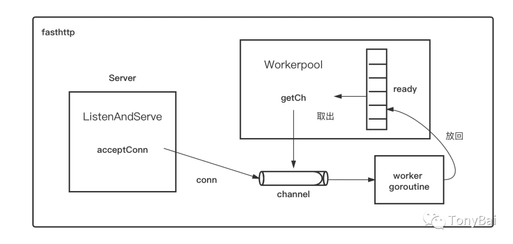

no free connections available to host
-------

- 原因： 连接数已经达到了 maxConns = DefaultMaxConnsPerHost = 512(默认值)。连接数达到最大值了

```go
func (c *HostClient) acquireConn() (*clientConn, error) {
    if n == 0 {
        maxConns := c.MaxConns
        if maxConns <= 0 {
            maxConns = DefaultMaxConnsPerHost
        }
        if c.connsCount < maxConns {
            c.connsCount++
            createConn = true
            if !c.connsCleanerRun {
                startCleaner = true
                c.connsCleanerRun = true
            }
        }
    } else {
        n--
        cc = c.conns[n]
        c.conns[n] = nil
        c.conns = c.conns[:n]
    }
    c.connsLock.Unlock()
```

处理链接源码 

```go
func clientDoDeadline(req *Request, resp *Response, deadline time.Time, c clientDoer) error {
   ...

    // Note that the request continues execution on ErrTimeout until
    // client-specific ReadTimeout exceeds. This helps limiting load
    // on slow hosts by MaxConns* concurrent requests.
    //
    // Without this 'hack' the load on slow host could exceed MaxConns*
    // concurrent requests, since timed out requests on client side
    // usually continue execution on the host.

    var mu sync.Mutex
    var timedout bool
        //这个goroutine是用来处理连接以及发送请求的
    gofunc() {
        errDo := c.Do(reqCopy, respCopy)
        mu.Lock()
        {
            if !timedout {
                if resp != nil {
                    respCopy.copyToSkipBody(resp)
                    swapResponseBody(resp, respCopy)
                }
                swapRequestBody(reqCopy, req)
                ch <- errDo
            }
        }
        mu.Unlock()

        ReleaseResponse(respCopy)
        ReleaseRequest(reqCopy)
    }()
        //这块内容是用来处理超时的
    tc := AcquireTimer(timeout)
    var err error
    select {
    case err = <-ch:
    case <-tc.C:
        mu.Lock()
        {
            timedout = true
            err = ErrTimeout
        }
        mu.Unlock()
    }
    ReleaseTimer(tc)

    select {
    case <-ch:
    default:
    }
    errorChPool.Put(chv)

    return err
}
```

```go
// DoTimeout performs the given request and waits for response during
// the given timeout duration.
//
// Request must contain at least non-zero RequestURI with full url (including
// scheme and host) or non-zero Host header + RequestURI.
//
// The function doesn't follow redirects. Use Get* for following redirects.
//
// Response is ignored if resp is nil.
//
// ErrTimeout is returned if the response wasn't returned during
// the given timeout.
//
// ErrNoFreeConns is returned if all HostClient.MaxConns connections
// to the host are busy.
//
// It is recommended obtaining req and resp via AcquireRequest
// and AcquireResponse in performance-critical code.
//
// Warning: DoTimeout does not terminate the request itself. The request will
// continue in the background and the response will be discarded.
// If requests take too long and the connection pool gets filled up please
// try setting a ReadTimeout.
func (c *HostClient) DoTimeout(req *Request, resp *Response, timeout time.Duration) error {
    return clientDoTimeout(req, resp, timeout, c)
}
```

- Solution：

需要设置 ReadTimeout 字段，达到 ReadTimeout 时间还没有得到返回值，客户端就会把连接断开（


ErrConnectionClosed
--------------

fasthttp default idle timeout is 15 seconds. 如果对方默认keep-live 时间是8s。
需要设置 IdleConnTimeout 小于 8s 

原生http木有问题，是因为两个 协程 在 loop write read,所以对 server 端 FIN 是 及时响应的，也就是client 及时也关闭了链接

Context with sync.Pool
-------------

fasthttp 它几乎把所有的对象都用sync.Pool维护。

但这样的复用不一定全是合理的。比如在fasthttp中，传递上下文相关信息的RequestCtx就是用sync.Pool维护的，这就导致了你不能把它传递给其他的goroutine。

如果要在fasthttp中实现类似接受请求->异步处理的逻辑, **必须得拷贝一份RequestCtx再传递**。

[Best Practices](https://github.com/valyala/fasthttp#fasthttp-best-practices)
--------------

- Do not allocate objects and []byte buffers - just reuse them as much as possible. Fasthttp API design encourages this.
- sync.Pool is your best friend.
- Profile your program in production. go tool pprof --alloc_objects your-program mem.pprof usually gives better insights for optimization opportunities than go tool pprof your-program cpu.pprof.
- Write tests and benchmarks for hot paths.
- Avoid conversion between []byte and string, since this may result in memory allocation+copy. Fasthttp API provides functions for both []byte and string - use these functions instead of converting manually between []byte and string. There are some exceptions - see this wiki page for more details.

Design Details
--------------



  fasthttp设计了一套机制，目的是尽量复用goroutine，而不是每次都创建新的goroutine。fasthttp的Server accept一个conn之后，会尝试从workerpool中的ready切片中取出一个channel，该channel与某个worker goroutine一一对应。一旦取出channel，就会将accept到的conn写到该channel里，而channel另一端的worker goroutine就会处理该conn上的数据读写。当处理完该conn后，该worker goroutine不会退出，而是会将自己对应的那个channel重新放回workerpool中的ready切片中，等待这下一次被取出。

我们看到fasthttp的模型不太适合这种连接连上后进行持续“饱和”请求的场景，更适合短连接或长连接但没有持续饱和请求，在后面这样的场景下，它的goroutine复用模型才能更好的得以发挥。

但即便“退化”为了net/http模型，fasthttp的性能依然要比net/http略好，这是为什么呢？这些性能提升主要是fasthttp在内存分配层面的优化trick的结果，比如大量使用sync.Pool，比如避免在[]byte和string互转等。

fasthttp.Server中的Concurrency可以用来限制workerpool中并发处理的goroutine的个数，但由于每个goroutine只处理一个连接，当Concurrency设置过小时，后续的连接可能就会被fasthttp拒绝服务。因此fasthttp的默认Concurrency为

`const DefaultConcurrency = 256 * 1024`

Source
-------

- https://www.jianshu.com/p/12f3955c7e1c


