- [sync.Once](https://mp.weixin.qq.com/s/Eu6T5-4v82kdh-Url4O5_w)
  - `sync.Once`底层通过`defer`标记初始化完成，所以无论初始化是否成功都会标记初始化完成，即**不可重入**。
  - G1和G2同时执行时，G1执行失败后，G2不会执行初始化逻辑，因此需要double check。
  ```go
      if atomic.LoadUint32(&o.done) == 0 {
          // Outlined slow-path to allow inlining of the fast-path.
          o.doSlow(f)
      }
  }
  
  func (o *Once) doSlow(f func()) {
      o.m.Lock()
      defer o.m.Unlock()
      if o.done == 0 {
          defer atomic.StoreUint32(&o.done, 1)
          f()
      }
  }
  ```
  
  可重入且并发安全的sync.Once
  ```go
  type IOnce struct {
   done uint32
   m    sync.Mutex
  }
  // Do方法传递的函数增加一个error返回值
  func (o *IOnce) Do(f func() error) {
   if atomic.LoadUint32(&o.done) == 0 {
    o.doSlow(f)
   }
  }
  
  // 不使用defer控制don标识，而通过也无妨的返回值来控制
  func (o *IOnce) doSlow(f func() error) {
   o.m.Lock()
   defer o.m.Unlock()
   if o.done == 0 {
    if f() != nil {
     return
    }
    // 执行成功后才将done置为1
    atomic.StoreUint32(&o.done, 1)
   }
  }
  
  ```
- [InterfaceSlice](https://github.com/golang/go/wiki/InterfaceSlice)
  Given that you can assign a variable of any type to an interface{}, often people will try code like the following.
  ```go
  var dataSlice []int = foo()
  var interfaceSlice []interface{} = dataSlice
  ```
  
  [This gets the error](https://mp.weixin.qq.com/s/rAIhapDHrA7jQVr_uvQpEg)
  
  `cannot use dataSlice (type []int) as type []interface { } in assignment`

  A variable with type []interface{} has a specific memory layout, known at compile time.

  Each interface{} takes up two words (one word for the type of what is contained, the other word for either the contained data or a pointer to it). As a consequence, a slice with length N and with type []interface{} is backed by a chunk of data that is N*2 words long.

  This is different than the chunk of data backing a slice with type []MyType and the same length. Its chunk of data will be N*sizeof(MyType) words long.

  - fix it
    ```go
    var dataSlice []int = foo()
    var interfaceSlice []interface{} = make([]interface{}, len(dataSlice))
    for i, d := range dataSlice {
        interfaceSlice[i] = d
    }
    ```
- [golang redis pipeline管道引发乱序串读](http://xiaorui.cc/archives/7179)
  - 在使用 golang redigo pipeline 模式下，错误使用会引发乱序串读的问题。简单说，发了一组 pipeline命 令，但由于只发送而没有去解析接收结果，那么后面通过连接池重用该连接时，会拿到了上次的请求结果，乱序串读了。
  - 看源码可得知，Flush() 只是把buffer缓冲区的数据写到连接里，而没有从连接读取的过程。所以说，在redigo的pipeline里，有几次的写，就应该有几次的 Receive() 。Receive是从连接读缓冲区里读取解析数据。 receive() 是不可或缺的！ 不能多，也不能少，每个 send() 都对应一个 receive()。
  - 使用了 pipeline 批量确实有效的减少了时延，也减少了 redis 压力。不要再去使用 golang redigo 这个库了，请直接选择 go-redis 库。

- [defer 坑过](https://mp.weixin.qq.com/s/1T6Z74Wri27Ap8skeJiyWQ)
  - case 1
     ```go
     package main
     
     import (
         "fmt"
     )
     
     func a() (r int) {
         defer func() {
             r++
         }()
         return 0
     }
     
     func b() (r int) {
         t := 5
         defer func() {
             t = t + 5
         }()
         return t
     }
     
     func c() (r int) {
         defer func(r int) {
             r = r + 5
         }(r)
         return 1
     }
     
     func main() {
         fmt.Println("a = ", a())
         fmt.Println("b = ", b())
         fmt.Println("c = ", c())
     }
     ```
  - case 2

  defer 表达式的函数如果在 panic 后面，则这个函数无法被执行。
   ```go
   func main() {
       panic("a")
       defer func() {
           fmt.Println("b")
       }()
   }
   ```
- [defer Close() 的风险](https://www.joeshaw.org/dont-defer-close-on-writable-files/)
  - 问题：
    - `defer x.Close()` 会忽略它的返回值，但在执行 x.Close() 时，我们并不能保证 x 一定能正常关闭，万一它返回错误应该怎么办？这种写法，会让程序有可能出现非常难以排查的错误。
  - Close() 方法会返回什么错误呢
    - 在 POSIX 操作系统中，例如 Linux 或者 maxOS，关闭文件的 Close() 函数最终是调用了系统方法 close()，我们可以通过 man close 手册，查看 close() 可能会返回什么错误
      - [EBADF]            fildes is not a valid, active file descriptor.
      - [EINTR]            Its execution was interrupted by a signal.
      - [EIO]              A previously-uncommitted write(2) encountered an input/output error.
    - EIO 的错误是指未提交写。 EIO 错误的确是我们需要提防的错误。这意味着如果我们尝试将数据保存到磁盘，在 defer x.Close() 执行时，操作系统还并未将数据刷到磁盘，这时我们应该获取到该错误提示
  - 改造方案
    - 不使用 defer
      ```go
       1func solution01() error {
       2    f, err := os.Create("/home/golangshare/gopher.txt")
       3    if err != nil {
       4        return err
       5    }
       6
       7    if _, err = io.WriteString(f, "hello gopher"); err != nil {
       8        f.Close()
       9        return err
      10    }
      11
      12    return f.Close()
      13}
      ```
      需要在每个发生错误的地方都要加上关闭语句 f.Close()，如果对 f 的写操作 case 较多，容易存在遗漏关闭文件的风险。
    - 通过命名返回值 err 和闭包来处理
       ```go
       1func solution02() (err error) {
       2    f, err := os.Create("/home/golangshare/gopher.txt")
       3    if err != nil {
       4        return
       5    }
       6
       7    defer func() {
       8        closeErr := f.Close()
       9        if err == nil {
       10            err = closeErr
       11        }
       12    }()
       13
       14    _, err = io.WriteString(f, "hello gopher")
       15    return
       16}
       ```
      如果有更多 if err !=nil 的条件分支，这种模式可以有效降低代码行数。
    - 在函数最后 return 语句之前，显示调用一次 f.Close()
      ```go
      1func solution03() error {
       2    f, err := os.Create("/home/golangshare/gopher.txt")
       3    if err != nil {
       4        return err
       5    }
       6    defer f.Close()
       7
       8    if _, err := io.WriteString(f, "hello gopher"); err != nil {
       9        return err
      10    }
      11
      12    if err := f.Close(); err != nil {
      13        return err
      14    }
      15    return nil
      16}
      ```
      这种解决方案能在 io.WriteString 发生错误时，由于 defer f.Close() 的存在能得到 close 调用。也能在 io.WriteString 未发生错误，但缓存未刷新到磁盘时，得到 err := f.Close() 的错误，而且由于 defer f.Close() 并不会返回错误，所以并不担心两次 Close() 调用会将错误覆盖。
    - 函数 return 时执行 f.Sync()
      ```go
      func solution04() error {
       2    f, err := os.Create("/home/golangshare/gopher.txt")
       3    if err != nil {
       4        return err
       5    }
       6    defer f.Close()
       7
       8    if _, err = io.WriteString(f, "hello world"); err != nil {
       9        return err
      10    }
      11
      12    return f.Sync()
      13}
      ```
      由于 fsync 的调用，这种模式能很好地避免 close 出现的 EIO。可以预见的是，由于强制性刷盘，这种方案虽然能很好地保证数据安全性，但是在执行效率上却会大打折扣。
- [字符串底层原理](https://mp.weixin.qq.com/s/1ozBAEYpf07aei0xh3_kNQ)
  - 字符串
    ```go
    type stringStruct struct {
        str unsafe.Pointer // 一个指向底层数据的指针. 使用 utf-8 编码方式
        len int            // 字符串的字节长度，非字符个数
    }
    ```
  - [rune](https://kvs-vishnu23.medium.com/what-exactly-is-a-rune-datatype-in-go-f652093a88eb)
    - 在 unicode 字符集中，每一个字符都有一个对应的编号，我们称这个编号为 code point，而 Go 中的rune 类型就代表一个字符的 code point。
    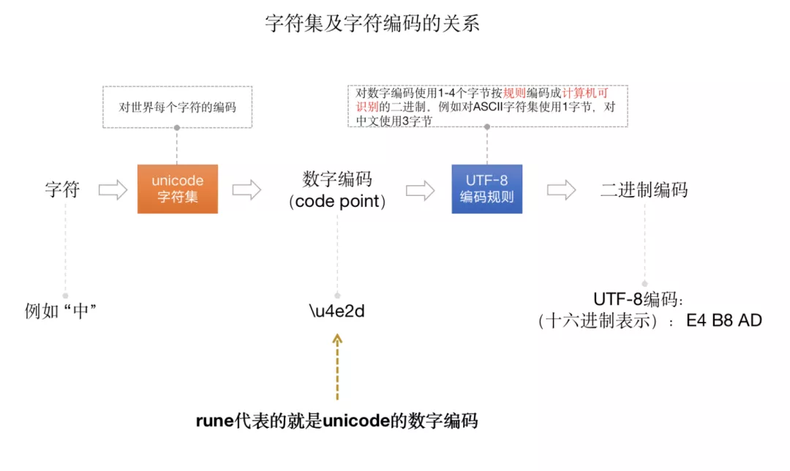
    - rune is an alias for int32 value which represents a single Unicode point. From the above program to print the rune equivalent of 128513, we used Printf() function with %c control string
     ```go
         oo := '中'
         fmt.Println("As an int value ", oo) // 20013, this is rune
         fmt.Printf("As a string: %s, %s and as a char: %c \n", oo, string(oo), oo)
     ```
- [一个打点引发的事故](https://mp.weixin.qq.com/s?__biz=MjM5MDUwNTQwMQ==&mid=2257486531&idx=1&sn=a996f5932ca9018f78ce0049f3a7baa8&chksm=a539e215924e6b03ab2c6d2ab370ca184afa85d0f6fac0af644dc3bef4fbdd319d1f0a7a932e&cur_album_id=1690026440752168967&scene=189#wechat_redirect)
  - 查到了 OOM 的实例 goroutine 数暴涨，接口 QPS 有尖峰，比正常翻了几倍。所以，得到的结论就是接口流量太多，超过服务极限，导致 OOM
  - 由于 metrics 底层是用 udp 发送的，有文件锁，大量打点的情况下，会引起激烈的锁冲突，造成 goroutine 堆积、请求堆积，和请求关联的 model 无法释放，于是就 OOM 了
  - 由于这个地方的打点非常多，几十万 QPS，一冲突，goroutine 都 gopark 去等锁了，持有的内存无法释放，服务一会儿就 gg 了
- [mutex 出问题怎么办？强大的 goroutine 诊断工具](https://mp.weixin.qq.com/s/JadUu7odckhNfcXDULoXVA)
    ```go
    type Hub struct {
        // Maps client IDs to clients.
        clients map[string]*Client
        // Maps streams to clients
        // (stream -> client id -> struct{}).
        streams map[string]map[string]struct{}
        // A goroutine pool is used to do the actual broadcasting work.
        pool *GoPool
    
        mu sync.RWMutex
    }
    
    func NewHub() *Hub {
        return &Hub{
          clients: make(map[string]*Client),
          streams: make(map[string]map[string]struct{}),
          // Initialize a pool with 1024 workers.
          pool: NewGoPool(1024),
        }
    }
    
    func (h *Hub) subscribeSession(c *Client, stream string) {
        h.mu.Lock()
        defer h.mu.Unlock()
    
        if _, ok := h.clients[c.ID]; !ok {
            h.clients[c.ID] = c
        }
    
        if _, ok := h.streams[stream]; !ok {
            h.streams[stream] = make(map[string]map[string]bool)
        }
    
        h.streams[stream][c.ID] = struct{}{}
    }
    
    func (h *Hub) unsubscribeSession(c *Client, stream string) {
        h.mu.Lock()
        defer h.mu.Unlock()
    
        if _, ok := h.clients[c.ID]; !ok {
            return
        }
    
        delete(h.clients, c.ID)
    
        if _, ok := h.streams[stream]; !ok {
            return
        }
    
        delete(h.streams[stream], c.ID)
    }
    
    func (h *Hub) broadcastToStream(stream string, msg string) {
        // First, we check if we have a particular stream,
        // if not, we return.
        // Note that here we use a read lock here.
        h.mu.RLock()
        defer h.mu.RUnlock()
    
        if _, ok := h.streams[stream]; !ok {
            return
        }
    
        // If there is a stream, schedule a task.
        h.pool.Schedule(func() {
            // Here we need to acquire a lock again
            // since we're reading from the map.
            h.mu.RLock()
            defer h.mu.RUnlock()
    
            if _, ok := h.streams[stream]; !ok {
                return
            }
    
            for id := range h.streams[stream] {
                client, ok := h.clients[id]
    
                if !ok {
                    continue
                }
    
                client.Send(msg)
            }
        })
    }
    ```
  - 我们如何才能看到所有 goroutine 在任何给定时刻都在做什么
    - 每个 Go 程序都带有[一个默认 SIGQUIT 信号处理程序](https://pkg.go.dev/os/signal#hdr-Default_behavior_of_signals_in_Go_programs)的开箱即用的解决方案 。收到此信号后，程序将堆栈转储打印到 stderr 并退出
      ```go
      func main() {
          ch := make(chan (bool), 1)
      
          go func() {
              readForever(ch)
          }()
      
          writeForever(ch)
      }
      
      func readForever(ch chan (bool)) {
          for {
              <-ch
          }
      }
      
      func writeForever(ch chan (bool)) {
          for {
              ch <- true
          }
      }
      ```
      - 运行这个程序并通过 `CTRL+\` 发送一个 SIGQUIT 来终止它.
      - 我们可以使用以下 kill命令发送信号：
       `kill -SIGQUIT <process id>`
      - 对于 Docker，我们需要向正在运行的容器发送 SIGQUIT。没问题：
        ```shell
        docker kill --signal=SIGQUIT <container_id>
        # Then, grab the stack dump from the container logs.
        docker logs <container_id>
        ```
  - [goroutine-inspect](https://github.com/linuxerwang/goroutine-inspect)
    - goroutine-inspect 的工具。它是一个 pprof 风格的交互式 CLI，它允许你操作堆栈转储、过滤掉不相关的跟踪或搜索特定功能
      ```
      # First, we load a dump and store a reference to it in the 'a' variable.
      > a = load("tmp/go-crash-1.dump")
      
      # The show() function prints a summary.
      > a.show()
      \# of goroutines: 4663
      
      # goroutine-inspect 最有用的功能之一 是 dedup()函数，它通过堆栈跟踪对 goroutine 进行分组
      > a.dedup()
      # of goroutines: 27
      
      #哇！我们最终只有 27 个独特的堆栈！现在我们可以扫描它们并删除不相关的：
      > a.delete(...) # delete many routines by their ids
      # of goroutines: 8
      
      #在删除了所有 安全的goroutine（HTTP 服务器、gRPC 客户端等）之后，我们得到了最后 8 个。我发现了多个包含broadcastToStream和 subscribeSesssion功能的痕迹
      > a.search("contains(trace, 'subscribeSesssion')")
      
      goroutine 461 [semacquire, 14 minutes]: 820 times: [461,...]
      ```
    - 尽管在  broadcastSession 中使用 RLock，我们还引入了另一个潜在的阻塞调用—— pool.Schedule。这个调用发生在锁内！我们 defer 的好习惯在 Unlock 这里失败了
      ```go
      func (h *Hub) broadcastToStream(stream string, msg string) {
          // First, we check if we have a particular stream,
          // if not, we return.
          // Note that here we use a read lock here.
          h.mu.RLock()
          defer h.mu.RUnlock()  --> unlock here
      
          if _, ok := h.streams[stream]; !ok {
              return
          }
      
          // If there is a stream, schedule a task.
          h.pool.Schedule(func() {
              // Here we need to acquire a lock again
              // since we're reading from the map.
              h.mu.RLock()          --> lock again...
              defer h.mu.RUnlock()
      
              if _, ok := h.streams[stream]; !ok {
                  return
              }
      ```
    - 禁止RLock的递归调用，换句话说是在同一协程下，读锁未UnLock的情况下，禁止重复调用RLock(当然也不能调用Lock)，否则可能导致死锁
    - golang标准库里读写锁的实现(RWMutex)，采用了writer-preferring的策略，使用Mutex实现写-写互斥，通过信号量等待和唤醒实现读-写互斥
    - https://mp.weixin.qq.com/s/m6JPAkwUdNivsOGft-lR8w
- [Go 程序自己监控自己](https://mp.weixin.qq.com/s?__biz=MzUzNTY5MzU2MA==&mid=2247490745&idx=1&sn=6a04327f98a734fd50e509362fc04d48&scene=21#wechat_redirect)
  - 怎么用Go获取进程的各项指标
    - 获取Go进程的资源使用情况使用[gopstuil库](github.com/shirou/gopsutil)
      ```go
      p, _ := process.NewProcess(int32(os.Getpid()))
      // cpu
      cpuPercent, err := p.Percent(time.Second)
      cp := cpuPercent / float64(runtime.NumCPU())
      // 获取进程占用内存的比例
      mp, _ := p.MemoryPercent()
      // 创建的线程数
      threadCount := pprof.Lookup("threadcreate").Count()
      // Goroutine数 
      gNum := runtime.NumGoroutine()
      ```
    - 容器环境下获取进程指标
      - Cgroups给用户暴露出来的操作接口是文件系统，它以文件和目录的方式组织在操作系统的/sys/fs/cgroup路径下，在 /sys/fs/cgroup下面有很多诸cpuset、cpu、 memory这样的子目录
    ```go
    cpuPeriod, err := readUint("/sys/fs/cgroup/cpu/cpu.cfs_period_us")
    cpuQuota, err := readUint("/sys/fs/cgroup/cpu/cpu.cfs_quota_us")
    cpuNum := float64(cpuQuota) / float64(cpuPeriod)
    cpuPercent, err := p.Percent(time.Second)
    // cp := cpuPercent / float64(runtime.NumCPU())
    // 调整为
    cp := cpuPercent / cpuNum
    
    // 容器的能使用的最大内存数，自然就是在memory.limit_in_bytes里指定
    memLimit, err := readUint("/sys/fs/cgroup/memory/memory.limit_in_bytes")
    memInfo, err := p.MemoryInfo
    mp := memInfo.RSS * 100 / memLimit
    // 上面进程内存信息里的RSS叫常驻内存，是在RAM里分配给进程，允许进程访问的内存量。而读取容器资源用的readUint，是containerd组织在cgroups实现里给出的方法。
    func readUint(path string) (uint64, error) {
        v, err := ioutil.ReadFile(path)
        if err != nil {
            return 0, err
        }
        return parseUint(strings.TrimSpace(string(v)), 10, 64)
    }
    
    func parseUint(s string, base, bitSize int) (uint64, error) {
        v, err := strconv.ParseUint(s, base, bitSize)
        if err != nil {
            intValue, intErr := strconv.ParseInt(s, base, bitSize)
            // 1. Handle negative values greater than MinInt64 (and)
            // 2. Handle negative values lesser than MinInt64
            if intErr == nil && intValue < 0 {
                return 0, nil
            } else if intErr != nil &&
                intErr.(*strconv.NumError).Err == strconv.ErrRange &&
                intValue < 0 {
                return 0, nil
            }
            return 0, err
        }
        return v, nil
    }
    ```
- [Go 程序进行自动采样](https://mp.weixin.qq.com/s/oBhMwMx20QIlWq0_O7G32A)
  - 工具
    - Go的pprof工具集，提供了Go程序内部多种性能指标的采样能力
  - 怎么获取采样信息
    - 最常见的例子是在服务端开启端口让客户端通过HTTP访问指定的路由进行各种信息的采样
    - 弊端就是
      - 需要客户端主动请求特定路由进行采样，没法在资源出现尖刺的第一时间进行采样。
      - 会注册多个/debug/pprof类的路由，相当于对 Web 服务有部分侵入。
      - 对于非 Web 服务，还需在服务所在的节点上单独开 HTTP 端口，起 Web 服务注册 debug 路由才能进行采集，对原服务侵入性更大。
    - Runtime pprof
      - 使用runtime.pprof 提供的Lookup方法完成各资源维度的信息采样
         ```go
         pprof.Lookup("heap").WriteTo(some_file, 0)
         pprof.Lookup("goroutine").WriteTo(some_file, 0)
         pprof.Lookup("threadcreate").WriteTo(some_file, 0)
         
         // CPU的采样方式runtime/pprof提供了单独的方法在开关时间段内对 CPU 进行采样
         bf, err := os.OpenFile('tmp/profile.out', os.O_RDWR | os.O_CREATE | os.O_APPEND, 0644)
         err = pprof.StartCPUProfile(bf)
         time.Sleep(2 * time.Second)
         pprof.StopCPUProfile()
         ```
      - 这种方式是操作简单，把采样信息可以直接写到文件里，不需要额外开端口，再手动通过HTTP进行采样，但是弊端也很明显--不停的采样会影响性能
    - 适合采样的时间点
      - Go进程在自己占用资源突增或者超过一定的阈值时再用pprof对程序Runtime进行采样，才是最合适的
  - 判断采样时间点的规则
    - CPU 使用，内存占用和 goroutine 数，都可以用数值表示，所以无论是使用率慢慢上升直到超过阈值，还是突增之后迅速回落，都可以用简单的规则来表示，比如：
      - cpu/mem/goroutine数 突然比正常情况下的平均值高出了一定的比例，比如说资源占用率突增25%就是出现了资源尖刺。- 比如进程的内存使用率，我们可以以每 10 秒为一个周期，运行一次采集，在内存中保留最近 5 ~ 10 个周期的内存使用率，并持续与之前记录的内存使用率均值进行比较
      - cpu/mem/goroutine数 超过了程序正常运行情况下的阈值，比如说80%就定义为服务资源紧张。
  - 开源的自动采样库
    - [holmes](github.com/mosn/holmes)
- [无人值守的自动 dump](https://mp.weixin.qq.com/s?__biz=MjM5MDUwNTQwMQ==&mid=2257484360&idx=2&sn=70316f266b7b7c27afab9cdb021a7120&scene=21#wechat_redirect)
  - Go 内置的 pprof 虽然是问题定位的神器，但是没有办法让你恰好在出问题的那个时间点，把相应的现场保存下来进行分析。特别是一些随机出现的内存泄露、CPU 抖动，等你发现有泄露的时候，可能程序已经 OOM 被 kill 掉了。而 CPU 抖动，你可以蹲了一星期都不一定蹲得到
  - CPU 使用，内存占用和 goroutine 数，都可以用数值表示，所以不管是“暴涨”还是抖动，都可以用简单的规则来表示：
     - xx 突然比正常情况下的平均值高出了 25%
     - xx 超过了模块正常情况下的最高水位线
  - 比如 goroutine 的数据，我们可以每 x 秒运行一次采集，在内存中保留最近 N 个周期的 goroutine 计数，并持续与之前记录的 goroutine 数据均值进行 diff
- [生产环境Issue](https://mp.weixin.qq.com/s?__biz=MjM5MDUwNTQwMQ==&mid=2257484360&idx=2&sn=70316f266b7b7c27afab9cdb021a7120&scene=21#wechat_redirect)
  - OOM 类问题
    - RPC decode 未做防御性编程
      - 一些私有协议 decode 工程中会读诸如 list len 之类的字段，如果外部编码实现有问题，发生了字节错位，就可能会读出一个很大的值。
    - tls 开启后线上进程占用内存上涨
      - 老版本的 Go 代码，发现其 TLS 的 write buffer 会随着写出的数据包大小增加而逐渐扩容
      - 在 Go1.12 之后已经进行了优化, 变成了需要多少，分配多少的朴实逻辑
  - goroutine 暴涨类问题
    - 本地 app GC hang 死，导致 goroutine 卡 channel send
      - 在我们的程序中有一段和本地进程通信的逻辑，write goroutine 会向一个 channel 中写数据，按常理来讲，同物理机的两个进程通过网络通信成本比较低
      - 当前憋了 5w 个 goroutine，有 4w 个卡在 channel send 上，这个 channel 的对面还是一条本地连接，令人难以接受
      - 对我们的程序进行保护是必要的，修改起来也很简单，给 channel send 加一个超时就可以了。
    - 应用逻辑死锁，导致连接不可用，大量 goroutine 阻塞在 lock 上
  - CPU 尖刺问题
    - 应用逻辑导致死循环问题
      - 从夏令时切换到冬令时，会将时钟向前拔一个月，但天级日志轮转时，会根据轮转前的时间计算 24 小时后的时间，并按与 24:00 的差值来进行 time.Sleep，这时会发现整个应用的 CPU 飚高。自动采样结果发现一直在循环计算时间和重命名文件。
- [Go 系统可能遇到的锁问题](https://xargin.com/lock-contention-in-go/)
  - 底层依赖 sync.Pool 的场景
    - 有一些开源库，为了优化性能，使用了官方提供的 sync.Pool，比如我们使用的 https://github.com/valyala/fasttemplate
    - 这种设计会带来一个问题，如果使用方每次请求都 New 一个 Template 对象。并进行求值，比如我们最初的用法，在每次拿到了用户的请求之后，都会用参数填入到模板
    - 在模板求值的时候, 会对该 Template 对象的 byteBufferPool 进行 Get，在使用完之后，把 ByteBuffer Reset 再放回到对象池中。但问题在于，我们的 Template 对象本身并没有进行复用，所以这里的 byteBufferPool 本身的作用其实并没有发挥出来
    - 相反的，因为每一个请求都需要新生成一个 sync.Pool，在高并发场景下，执行时会卡在 bb := t.byteBufferPool.Get() 这一句上，通过压测可以比较快地发现问题，达到一定 QPS 压力时，会有大量的 Goroutine 堆积
    - 标准库的 sync.Pool 之所以要维护这么一个 allPools 意图也比较容易推测，主要是为了 GC 的时候对 pool 进行清理，这也就是为什么说使用 sync.Pool 做对象池时，其中的对象活不过一个 GC 周期的原因。sync.Pool 本身也是为了解决大量生成临时对象对 GC 造成的压力问题
    - 问题也就比较明显了，每一个用户请求最终都需要去抢一把全局锁，高并发场景下全局锁是大忌。但是这个全局锁是因为开源库间接带来的全局锁问题，通过看自己的代码并不是那么容易发现
  - metrics 上报和 log 锁
    - 公司之前 metrics 上报 client 都是基于 udp 的，大多数做的简单粗暴，就是一个 client，用户传什么就写什么
    - 本质上，就是在高成本的网络操作上套了一把大的写锁，同样在高并发场景下会导致大量的锁冲突，进而导致大量的 Goroutine 堆积和接口延迟
    - 和 UDP 网络 FD 一样有 writeLock，在系统打日志打得很多的情况下，这个 writeLock 会导致和 metrics 上报一样的问题。

- Misc
  - 同学反馈 getty “在一个大量使用短链接的场景，XX 发现造成内存大量占用，因为大块的buffer被收集起来了，没有被释放”。
    - 通过定位，发现原因是 sync.Pool 把大量的 bytes.Buffer 对象缓存起来后没有释放。集团的同学简单粗暴地去掉了 sync.Pool 后，问题得以解决。复盘这个问题，其根因是 Go 1.13 对 sync.Pool 进行了优化：在 1.13 之前 pool 中每个对象的生命周期是两次 gc 之间的时间间隔，每次 gc 后 pool 中的对象会被释放掉，1.13 之后可以做到 pool 中每个对象在每次 gc 后不会一次将 pool 内对象全部回收。
    - 所以，Go 官方没有 ”修复“ sync.Pool 的这个 bug ，其上层的 dubbogo 还能稳定运行，当他们 ”修复“ 之后，上层的 dubbogo 运行反而出了问题。
  - Go 语言 另外一个比较著名的例子便是 `godebug=madvdontneed=1`。Go 1.12 对其内存分配算法做了改进：Go runtime 在释放内存时，使用了一个自认为更加高效的 MADV_FREE 而不是之前的 MADV_DONTNEED，其导致的后果是 Go 程序释放内存后，RSS 不会立刻下降。这影响了很多程序监控指标的准确性，在大家怨声载道的抱怨后，Go 1.16 又改回了默认的内存分配算法。

- [线上偶现的panic问题](https://mp.weixin.qq.com/s/VOwlkkm_KC9FG_c2jQhcew)
  - panic 
    ```shell
    runtime error: invalid memory address or nil pointer dereference
    
    panic(0xbd1c80, 0x1271710)
            /root/.go/src/runtime/panic.go:969 +0x175
    github.com/json-iterator/go.(*Stream).WriteStringWithHTMLEscaped(0xc00b0c6000, 0x0, 0x24)
            /go/pkg/mod/github.com/json-iterator/go@v1.1.11/stream_str.go:227 +0x7b
    github.com/json-iterator/go.(*htmlEscapedStringEncoder).Encode(0x12b9250, 0xc0096c4c00, 0xc00b0c6000)
    ```
  - source codes
    ```go
    func doReq() {
        req := paramsPool.Get().(*model.Params)
        // defer 1
        defer func() {
         reqBytes, _ := json.Marshal(req)
         // 省略其他打印日志的代码
        }()
        // defer 2
        defer paramsPool.Put(req)
        // req初始化以及发起请求和其他操作
    }
    ```
    上面代码中paramsPool是sync.Pool类型的变量，而sync.Pool想必大家都很熟悉。sync.Pool是为了复用已经使用过的对象(协程安全)，减少内存分配和降低GC压力。
    ```go
    type test struct {
     a string
    }
    
    var sp = sync.Pool{
     New: func() interface{} {
      return new(test)
     },
    }
    
    func main() {
     t := sp.Get().(*test)
     fmt.Println(unsafe.Pointer(t))
     sp.Put(t)
     t1 := sp.Get().(*test)
     t2 := sp.Get().(*test)
     fmt.Println(unsafe.Pointer(t1), unsafe.Pointer(t2))
    }
    
    ```
    根据上述代码和输出结果知，t1变量和t变量地址一致，因此他们是复用对象。此时再回顾上面的doReq函数就很容易发现问题的根因
    - defer 2和defer 1顺序反了！！！
    - sync.Pool提供的Get和Put方法是协程安全的，但是高并发调用doReq函数时json.Marshal(req)和请求初始化会存在并发问题，极有可能引起panic的并发调用时间线如下图所示。
    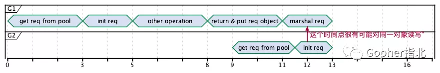
- [大内存 Go 服务性能优化](https://mp.weixin.qq.com/s?__biz=Mzg5MTYyNzM3OQ==&mid=2247484159&idx=1&sn=94a524d651aabdb9a42b2a5e1d5011ef&scene=21#wechat_redirect)
  - 明明 call RPC 时设置了超时时间 timeout, 但是 Grafna 看到 P99 latency 很高
    - 要么是 timeout 设置不合理，比如只设置了单次 socket timeout, 并没有设置 circuit breaker 外层超时
    - GC 在捣乱，我们知道 Go GC 使用三色标记法，在 GC 压力大时用户态 goroutine 是要 assit 协助标记对象的，同时 GC STW 时间如果非常高，那么业务看起来 latency 就会得比 timeout 大很多
  - 该服务使用 go1.7, 需要加载海量的机器学习词表，标准的 Go 大内存服务，优化前表现为 latency 非常高
    - Pprof
      ```shell
      go tool pprof bin/dupsdc http://127.0.0.1:6060/debug/pprof/profile
      ```
      可以看到 runtime.greyobject, runtime.mallocgc, runtime.heapBitsForObject, runtime.scanobject, runtime.memmove 就些与 GC 相关的占据了 CPU 消耗的 TOP 6
      ```shell
      go tool pprof -inuse_objects http://127.0.0.1:6060/debug/pprof/heap
      ```
      再查看下常驻对像个数，发现 1kw 常驻内存对像
    - 优化对像
      - 词表主要使用两种类型，`map[int64][]float32` 和 `map[string]int`
      - 三色标记，本质是递归扫描所有的指针类型，遍历确定有没有被引用
      - 所有显示 *T 以及内部有 pointer 的对像都是指针类型，比如 map[int64][]float32 因为值是 slice, 内部包含了指针，如果 map 有 1kw 个元素，那么 GC 也要递归所描所有 key/value
      - 优化方法就来了
        - 把 map[int64][]float32 变成 map[int64][6]float32, 这里 slice 变成 6 个元素的数组，业务可以接受
        - 同时把 map[string]int 里的 key 由 string 类型换成 int 枚举值
    - 例外
      - 比如 map 内部的实现，如果 key/value 值类型大小超过 128 字节，就会退化成指针
      - Go 每个版本性能都会提升很多，go1.7 1kw 对像服务压力非常大，但是我司现在 go1.15 2kw 对像未优化也毫无压力
- [不执行resp.Body.Close()的情况下, 泄漏了多少个goroutine?](https://mp.weixin.qq.com/s?__biz=Mzg5NDY2MDk4Mw==&mid=2247486370&idx=1&sn=8b8bbd7ef43849ad71b72f7fddbb12b7&source=41#wechat_redirect)
  - Question
    ```go
    func main() {
     num := 6
     for index := 0; index < num; index++ {
      resp, _ := http.Get("https://www.baidu.com")
      _, _ = ioutil.ReadAll(resp.Body)
     }
     fmt.Printf("此时goroutine个数= %d\n", runtime.NumGoroutine())
    }
    ```
    在不执行resp.Body.Close()的情况下，泄漏了吗？如果泄漏，泄漏了多少个goroutine?
  - Anwser
    - 不进行resp.Body.Close()，泄漏是一定的。但是泄漏的goroutine个数就让我迷糊了。由于执行了6遍，每次泄漏一个读和写goroutine，就是12个goroutine，加上main函数本身也是一个goroutine，所以答案是13.
      然而执行程序，发现答案是3
  - Explanation
    - http.Get 默认使用 DefaultTransport 管理连接
    - DefaultTransport 的作用是根据需要建立网络连接并缓存它们以供后续调用重用
    - 一次建立连接，就会启动一个读goroutine和写goroutine。这就是为什么一次http.Get()会泄漏两个goroutine的来源
       ````go
       func (t *Transport) RoundTrip(req *http.Request)
       func (t *Transport) roundTrip(req *Request)
       func (t *Transport) getConn(treq *transportRequest, cm connectMethod)
       func (t *Transport) dialConn(ctx context.Context, cm connectMethod) (*persistConn, error) {
           ...
        go pconn.readLoop()  // 启动一个读goroutine
        go pconn.writeLoop() // 启动一个写goroutine
        return pconn, nil
       }
       ````
    - 读goroutine 的 readLoop() 代码里. 简单来说readLoop就是一个死循环，只要alive为true，goroutine就会一直存在
      select 里面是 goroutine 有可能退出的场景：
      - body 被读取完毕或body关闭
      - bodyEOF 来源于到一个通道 waitForBodyRead，这个字段的 true 和 false 直接决定了 alive 变量的值（alive=true那读goroutine继续活着，循环，否则退出goroutine
        - 那么这个通道的值是从哪里过来的呢？
          - 如果执行 earlyCloseFn ，waitForBodyRead 通道输入的是 false，alive 也会是 false，那 readLoop() 这个 goroutine 就会退出。
          - 如果执行 fn ，其中包括正常情况下 body 读完数据抛出 io.EOF 时的 case，waitForBodyRead 通道输入的是 true，那 alive 会是 true，那么 readLoop() 这个 goroutine 就不会退出，同时还顺便执行了 tryPutIdleConn(trace) 
          - tryPutIdleConn 将 pconn 添加到等待新请求的空闲持久连接列表中，也就是之前说的连接会复用。
        - 那么问题又来了，什么时候会执行这个 fn 和 earlyCloseFn 呢？
          - 上面这个其实就是我们比较熟悉的 resp.Body.Close() ,在里面会执行 earlyCloseFn，也就是此时 readLoop() 里的 waitForBodyRead 通道输入的是 false，alive 也会是 false，那 readLoop() 这个 goroutine 就会退出，goroutine 不会泄露
             ```go
             func (es *bodyEOFSignal) Read(p []byte) (n int, err error) 
             func (es *bodyEOFSignal) condfn(err error) error
             ```
          - 这个其实就是我们比较熟悉的读取 body 里的内容。ioutil.ReadAll() ,在读完 body 的内容时会执行 fn，也就是此时 readLoop() 里的 waitForBodyRead 通道输入的是 true，alive 也会是 true，那 readLoop() 这个 goroutine 就不会退出，goroutine 会泄露，然后执行 tryPutIdleConn(trace) 把连接放回池子里复用
      - request 主动 cancel
      - request 的 context Done 状态 true
      - 当前的 persistConn 关闭
  - 总结
    - 从另外一个角度说，正常情况下我们的代码都会执行 ioutil.ReadAll()，但如果此时忘了 resp.Body.Close()，确实会导致泄漏。但如果你调用的域名一直是同一个的话，那么只会泄漏一个 读goroutine 和一个写goroutine，这就是为什么代码明明不规范但却看不到明显内存泄漏的原因。
    - 那么问题又来了，为什么上面要特意强调是同一个域名呢
- [Can I convert a []T to an []interface{}](https://eli.thegreenplace.net/2021/go-internals-invariance-and-memory-layout-of-slices/)
  - Not directly. It is disallowed by the language specification because the two types do not have the same representation in memory. It is necessary to copy the elements individually to the destination slice.
  - slice `is := []int64{0x55, 0x22, 0xab, 0x9}`
    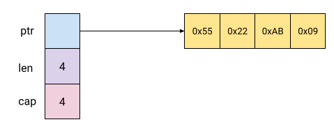
  - `[]interface{}` an interface{} itself looks in memory. occupies two quadwords (on a 64-bit machine), because it holds two pointers: the first points to the dispatch table for the methods of the value (itable), and the second points to the runtime value itself
    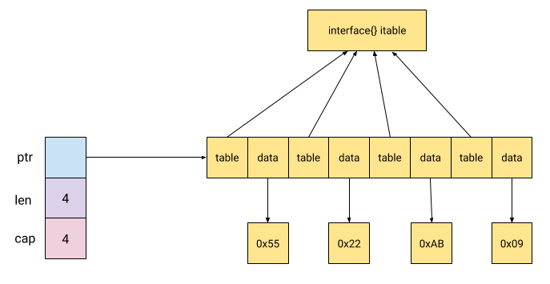
- [Deadlocks: the dark side of concurrency](https://www.craig-wood.com/nick/articles/deadlocks-in-go/)
  - [Source](https://www.youtube.com/watch?v=9j0oQkqzhAE)
- [select 死锁](https://mp.weixin.qq.com/s/Ov1FvLsLfSaY8GNzfjfMbg)
  - Sample. [Source](https://stackoverflow.com/questions/51167940/chained-channel-operations-in-a-single-select-case。)
    ```go
    func main() {
     var wg sync.WaitGroup
     foo := make(chan int)
     bar := make(chan int)
     wg.Add(1)
     go func() {
      defer wg.Done()
      select {
      case foo <- <-bar:
      default:
       println("default")
      }
     }()
     wg.Wait()
    }
    ```
  - For all the cases in the statement, the channel operands of receive operations and the channel and right-hand-side expressions of send statements are evaluated exactly once, in source order, upon entering the “select” statement. The result is a set of channels to receive from or send to, and the corresponding values to send. Any side effects in that evaluation will occur irrespective of which (if any) communication operation is selected to proceed. Expressions on the left-hand side of a RecvStmt with a short variable declaration or assignment are not yet evaluated.
  - 对于 select 语句，在进入该语句时，会按源码的顺序对每一个 case 子句进行求值：这个求值只针对发送或接收操作的额外表达式。
    ```go
    select {
    case ch <- <-input1:
    case ch <- <-input2:
    }
    ```
  - <-input1 和 <-input2 都会执行，相应的值是：A x 和 B x（其中 x 是 0-5）。但每次 select 只会选择其中一个 case 执行，所以 <-input1 和 <-input2 的结果，必然有一个被丢弃了，也就是不会被写入 ch 中。因此，一共只会输出 5 次，另外 5 次结果丢掉了。（你会发现，输出的 5 次结果中，x 比如是 0 1 2 3 4）
  - 而 main 中循环 10 次，只获得 5 次结果，所以输出 5 次后，报死锁。
- [不可被取地址的情况](https://gfw.go101.org/article/unofficial-faq.html#unaddressable-values)
  - 字符串中的字节元素
    ```go
        s := "hello"
        println(&s[1]) // invalid operation: cannot take address of s[1] (value of type byte)
    ```
  - map键值对中的值元素
    ```go
        m := make(map[string]int)
        m["hello"] = 5
        println(&m["hello"]) // invalid operation: cannot take address of m["hello"] (map index expression of type int)
        for k, v := range m {
           println(&k) // ok, 键元素是可以取地址的
           _ = v
        }
    ```
  - 接口值的动态值（类型断言的结果）
    ```go
    var a int = 5
    var i interface{} = a
    println(&(i.(int))) // invalid operation: cannot take address of i.(int) (comma, ok expression of type int)
    ```
  - 常量（包括具名常量和字面量）
    ```go
    const s = "hello" // 具名常量
    
    println(&s) // invalid operation: cannot take address of s (untyped string constant "hello")
    println(&("golang")) // invalid ope
    ```
- [有必要内存对齐](https://ms2008.github.io/2019/08/01/golang-memory-alignment/)
  - 为什么要做对齐，主要考虑下面两个原因：
    - 平台（移植性: 不是所有的硬件平台都能够访问任意地址上的任意数据。例如：特定的硬件平台只允许在特定地址获取特定类型的数据，否则会导致异常情况
    - 性能: 若访问未对齐的内存，将会导致 CPU 进行两次内存访问，并且要花费额外的时钟周期来处理对齐及运算。而本身就对齐的内存仅需要一次访问就可以完成读取动作，这显然高效很多，是标准的空间换时间做法
  - 在 x86_64 平台上，int64 的对齐系数为 8，而在 x86 平台上其对齐系数就是 4。
  - 在 x86 平台上原子操作 64bit 指针。之所以要强制对齐，是因为在 32bit 平台下进行 64bit 原子操作要求必须 8 字节对齐，[否则程序会 panic](https://pkg.go.dev/sync/atomic#pkg-note-bug)。
    ```go
    type T3 struct {
        b int64
        c int32
        d int64
    }
    
    func main() {
        a := T3{}
        atomic.AddInt64(&a.d, 1)
    }
    
    $ GOARCH=386 go build aligned.go  panic
    ```
    - solve
    ```go
    我们必须手动 padding T3，让其 “看起来” 像是 8 字节对齐的：
    
    type T3 struct {
        b int64
        c int32
        _ int32
        d int64
    }
    ```
  - 用 golangci-lint 做静态检测 `golangci-lint run --disable-all -E maligned`
- [Memory Leaking Scenarios](https://go101.org/article/memory-leaking.html)
  - Kind-of Memory Leaking Caused by Substrings
  - Kind-of Memory Leaking Caused by Subslices
  - Kind-of Memory Leaking Caused by Not Resetting Pointers in Lost Slice Elements
  - Real Memory Leaking Caused by Hanging Goroutines
  - Real Memory Leaking Caused by Not Stopping time.Ticker Values Which Are Not Used Any More
  - [Real Memory Leaking Caused by Using Finalizers Improperly](https://mp.weixin.qq.com/s/ea7LfF2jOoHOSozX-qUZLA)
    - Finalizer Restrict
      - A single goroutine runs all finalizers for a program, sequentially. If a finalizer must run for a long time, it should do so by starting a new goroutine.
      - Go 的 runtime 是用一个单 goroutine 来执行所有的 Finalizer 回调，还是串行化的。
      - 划重点：一旦执行某个 Finalizer 出了问题，可能会影响到全局的 Finalizer 回调函数的执行。
  - Kind-of Resource Leaking by Deferring Function Calls
  - [Avoiding Memory Leak From Unclosed Response’s Body](https://hackernoon.com/avoiding-memory-leak-in-golang-api-1843ef45fca8)
    ```go
    req, err:= http.NewRequest("GET","http://example.com?q=one",nil)
    if err != nil {
      return err
    }
    resp, err:= client.Do(req)
    //=================================================
    // CLOSE THE RESPONSE BODY
    //=================================================
    if resp != nil {
        defer resp.Body.Close() // MUST CLOSED THIS 
    }
    if err != nil {
      return err
    }
    //=================================================
    // READ THE BODY EVEN THE DATA IS NOT IMPORTANT
    // THIS MUST TO DO, TO AVOID MEMORY LEAK WHEN REUSING HTTP 
    // CONNECTION
    //=================================================
    _, err = io.Copy(ioutil.Discard, resp.Body) // WE READ THE BODY
    if err != nil { 
       return err
    }
    ```
- [channel 三大坑](https://mp.weixin.qq.com/s/--vpHBw-yRPL7x4n35kUQQ)
  - for-range 操作channel在收到 close 的信号后会退出、goroutine 不再阻塞，能够被回收。
  - 如何优雅地 close channel
    - 除非必须关闭 chan，否则不要主动关闭。关闭 chan 最优雅的方式，就是不要关闭 chan~
    - 当一个 chan 没有 sender 和 receiver 时，即不再被使用时，GC 会在一段时间后标记、清理掉这个 chan。
  - chan 关闭的原则
    - Don't close a channel from the receiver side 不要在消费者端关闭 chan
    - Don't close a channel if the channel has multiple concurrent senders  有多个并发写的生产者时也别关
- [Data Race Patterns in Go](https://eng.uber.com/data-race-patterns-in-go/)
  - Go’s design choice to transparently capture free variables by reference in goroutines is a recipe for data races
    - Data race due to loop index variable capture
    - Data race due to idiomatic `err` variable capture. 
    - 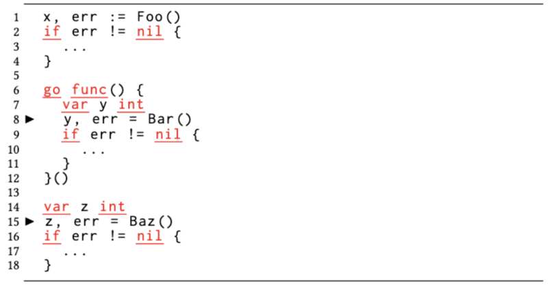
    - Data race due to named return variable capture.
    - 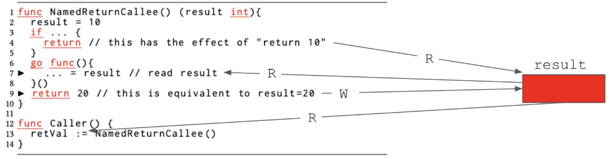
  - Slices are confusing types that create subtle and hard-to-diagnose data races
    - 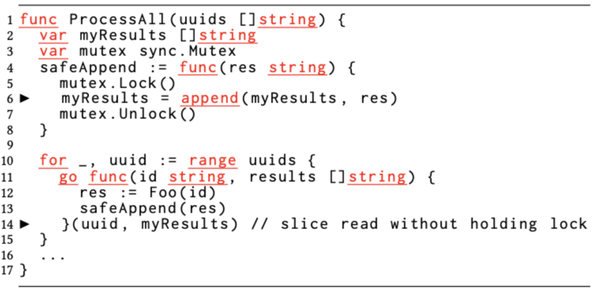
  - Concurrent accesses to Go’s built-in, thread-unsafe maps cause frequent data races 
  - Go developers often err on the side of pass-by-value (or methods over values), which can cause non-trivial data races
    - 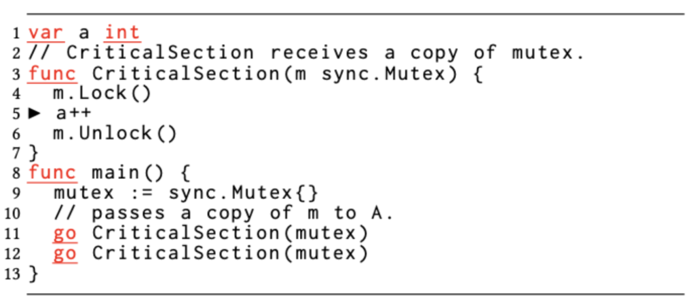
    - A converse of this situation happens when developers accidentally implement a method where the receiver is a pointer to the structure instead of a value/copy of the structure. In these situations, multiple goroutines invoking the method end up accidentally sharing the same internal state of the structure, whereas the developer intended otherwise. Here, also, the caller is unaware that the value type was transparently converted to a pointer type at the receiver.
  - Mixed use of message passing (channels) and shared memory makes code complex and susceptible to data races
    - 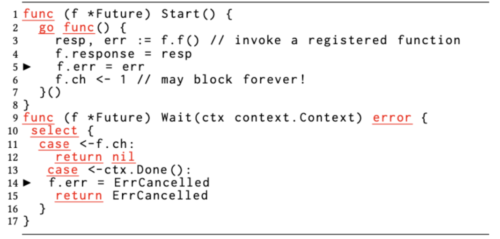
  - Go offers more leeway in its group synchronization construct sync.WaitGroup, but the incorrect placement of Add/Done methods leads to data races
  - Data race due to defer statement ordering leading to incorrect WaitGroup.Done() placement.
    - 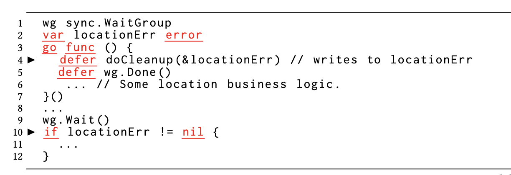
- [一次线上内存使用率异常问题排查](https://fanlv.wiki/2022/06/02/golang-pprof-mem/)
  - 背景
    - 某个集群内存的RSS使用率一直在80%左右，他用的是8核16G. 但是在pprof里面查的堆内存才使用了6.3G左右，程序里面主要用了6G的LocalCache所以heap用了6.3G是符合预期的。
  - 基础知识
    - TCMalloc 算法
      - TCMalloc是用来替代传统的malloc内存分配函数。它有减少内存碎片，适用于多核，更好的并行性支持等特性
    - mmap 函数
      - mmap它的主要功能是将一个虚拟内存区域与一个磁盘上的文件关联起来. 就是可以将一个文件，映射到一段虚拟内存，写内存的时候操作系统会自动同步内存的内容到文件。内存同步到磁盘，还涉及到一个PageCache的概念
      - 文件可以是磁盘上的一个实体文件，比如kafka写日志文件的时候，就用了mmap
      - 文件也可以是一个匿名文件，这种场景mmap不会去写磁盘，主要用于内存申请的场景。比如调用malloc函数申请内存，当申请的大小超过MMAP_THRESHOLD（默认是128K）大小，内核就会用mmap去申请内存。
      - 介绍mmap，就会说到zero copy，就是相对于标准IO来说少了一次内存Copy的开销。
      - 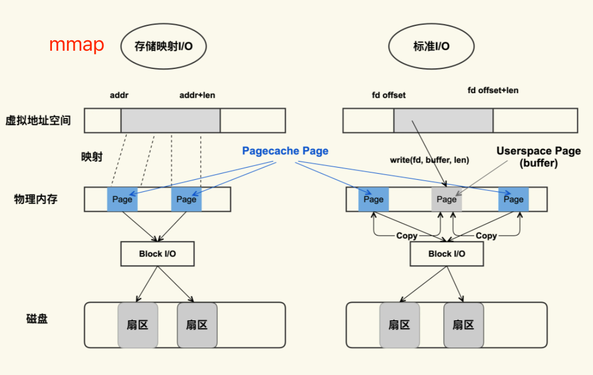
      - mmap申请的内存不在虚拟地址空间的堆区，在内存映射段（Memory Mapping Region）
      - 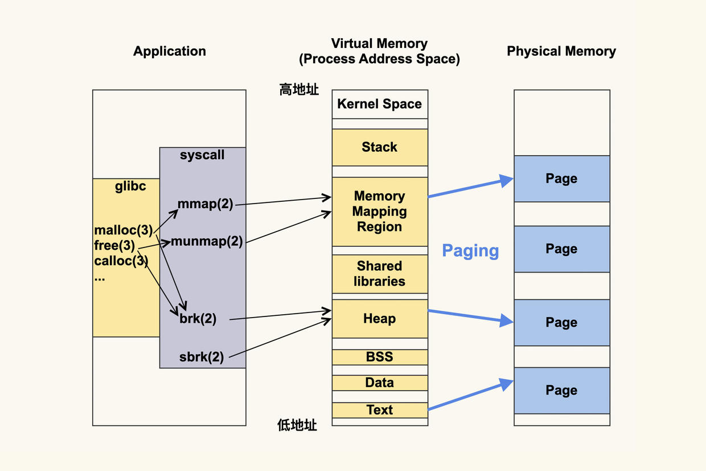
    - Golang 内存分配
      - 用的 TCMalloc（Thread-Caching Malloc）算法, 简单点说就是Golang是使用 mmap 函数去操作系统申请一大块内存，然后把内存按照 0~32KB``68个 size 类型的mspan，每个mspan按照它自身的属性 Size Class 的大小分割成若干个object
      - mspan：Go中内存管理的基本单元，是由一片连续的8KB的页组成的大块内存，每个mspan按照它自身的属性Size Class的大小分割成若干个object，mspan的Size Class共有68种（算上0） , numSpanClasses = _NumSizeClasses << 1 (因为需要区分需要GC和不需要GC的)
      - mcache：每个工作线程都会绑定一个mcache，本地缓存可用的mspan资源。
      - mcentral：为所有 mcache提供切分好的 mspan资源。需要加锁
      - mheap：代表Go程序持有的所有堆空间，Go程序使用一个mheap的全局对象_mheap来管理堆内存。
    - TCMalloc 的内存浪费
      - Golang的 sizeclasses.go 源码里面已经给我们已经计算了出每个size的tail waste和max waste比例
    - Go 查看内存使用情况几种方式
      - 执行前添加系统环境变量GODEBUG='gctrace=1'来跟踪打印垃圾回收器信息
      - 代码中使用runtime.ReadMemStats来获取程序当前内存的使用情况
      - 通过pprof获取
    - Sysmon 监控线程
      - Go Runtime在启动程序的时候，会创建一个独立的M作为监控线程，称为sysmon，它是一个系统级的daemon线程。这个sysmon独立于GPM之外，也就是说不需要P就可以运行
      - sysmon主要如下几件事
        - 释放闲置超过5分钟的span物理内存，scavenging。（Go 1.12之前）
        - 如果超过两分钟没有执行垃圾回收，则强制执行GC。
        - 将长时间未处理的netpoll结果添加到任务队列
        - 向长时间运行的g进行抢占
        - 收回因为syscall而长时间阻塞的p
  - 问题排查过程
    - 内存泄露？
      - 服务内存一周内一直都是在80%~85%左右波动，然后pprof看的heap的使用也是符合预期的。看了下程序的Runtime监控，容器的内存监控，都是正常的。基本可以排除内存泄露的可能性。
    - madvise
      - GO 1.12 ~ Go 1.15 版本，被提到很多次的问题。
      - madvise() 函数建议内核,在从addr指定的地址开始,长度等于len参数值的范围内,该区域的用户虚拟内存应遵循特定的使用模式。内核使用这些信息优化与指定范围关联的资源的处理和维护过程。
        - MADV_FREE ：（Linux 4.5以后开始支持这个特性），内核在当出现内存压力时才会主动释放这块内存。
        - MADV_DONTNEED：预计未来长时间不会被访问，可以认为应用程序完成了对这部分内容的访问，因此内核可以立即释放与之相关的资源。
      - Go Runtime 对 madvise 的使用
        - 在Go 1.12版本的时候，为了提高内存的使用效率，把madvise的参数从MADV_DONTNEED改成MADV_FREE
        - 使用MADV_FREE的问题是，Golang程序释放的内存，操作系统并不会立即回收，只有操作系统内存紧张的时候，才会主动去回收，而我们的程序，都是跑在容器中的，所以造成了，我们容器内存使用快满了，但是物理机的内存还有很多内存，导致的现象就是用pprof看的内存不一样跟看的RES相差巨大。
    - memory scavenging
      - Go把内存归还给系统的操作叫做scavenging。在Go程序执行过程中，当对象释放的时候，对象占用的内存并没有立即返还给操作系统(为了提高内存分配效率，方式归还以后又理解需要申请)，而是需要等待GC（定时或者条件触发）和scavenging（定时或者条件触发）才会把空闲的内存归还给操作系统。
      - 当然我们也可以在代码里面调用debug.FreeOSMemory()来主动释放内存。debug.FreeOSMemory()的功能是强制进行垃圾收集，然后尝试将尽可能多的内存返回给操作系统
    - GC 触发机制
      - GO的GC触发可以分为主动触发和被动触发
        - 主动触发就是在代码里面主动执行runtime.GC()，线上环境我们一般很少主动触发。
        - 这里我们主要讲下被动触发，被动触发有两种情况：
          - 当前内存分配达到一定比例则触发，可以通过环境变量GOGC或者代码中调用runtime.SetGCPercent来设置
          - 定时触发GC，这个是sysmon线程里面干的时区，一般是2分钟（runtime中写死的）内没有触发GC，会强制执行一次GC
    - scavenging 触发机制
      - GO 1.12之前是通过定时触发，2.5min会执行一次scavenge，然后会回收超过5分钟内没有使用过的mspan
      - 这样会有个问题是，如果不停的有大量内存申请和释放，会导致mspan内存一直不会释放给操作系统（因为不停被使用然后释放），导致堆内存监控和RSS监控不一致
  - 结论
    - 我们知道了pprof抓的堆内存的大小和RSS不一致，有几种可能：
      - 是程序申请的内存还没有被GC。
      - 内存虽然被GO执行了GC，但是可能并没有归还给操作系统（scavenging）
    - `curl http://ip:port/debug/pprof/heap?debug=1 | grep Heap`
      - HeapInuse： 堆上使用中的mspan大小。
      - HeapReleased：归还了多少内存给操作系统。
      - HeapIdle：空闲的mspan大小。HeapIdle - HeapReleased 等于runtime持有了多少个空闲的mspan，这部分还没有释放给操作系统
    - 为什么我们程序的localcache大小设置的只有了6G，实际heap使用了10.88G，因为HeapInuse除了程序真正使用的内存，还包括：
      - 程序释放的内存，但是还没有被GC。这部分内存还是算在HeapInuse中（这个应该是大头）。
      - 上面说的mspan的max waste和tail waste这部分也在HeapInuse（这个应该很少）。
      - 假设一个8k的mspan上只使用了一个大小为8Byte的obj，这个在HeapInuse会算8K。
- []()
  - select 很多 channel 的时候，并发较高时会有性能问题。因为 select 本质是按 chan 地址排序，顺序加锁。lock1->lock2->lock3->lock4 活跃 goroutine 数量较多时，会导致全局的延迟不可控
  - map 中 key value 超过 128 字节时，会被转为 indirectkey 和 indirectvalue，会对 GC 的扫描阶段造成压力，如果 k v 多，则扫描的 stw 就会很长
  - sync.Pool
    - Get 的整个过程：
      - 首先，调用 p.pin() 函数将当前的 goroutine 和 P 绑定，禁止被抢占，返回当前 P 对应的 poolLocal，以及 pid。然后直接取 l.private，赋值给 x，并置 l.private 为 nil。判断 x 是否为空，若为空，则尝试从 l.shared 的头部 pop 一个对象出来，同时赋值给 x。如果 x 仍然为空，则调用 getSlow 尝试从其他 P 的 shared 双端队列尾部“偷”一个对象出来。Pool 的相关操作做完了，调用 runtime_procUnpin() 解除非抢占。最后如果还是没有取到缓存的对象，那就直接调用预先设置好的 New 函数，创建一个出来。
    - Put 的逻辑：
      - 先绑定 g 和 P，然后尝试将 x 赋值给 private 字段。如果失败，就调用 pushHead 方法尝试将其放入 shared 字段所维护的双端队列中
  - 观察 GC 占用 CPU 程度
    - pprof 的 cpuprofile 火焰图 启动时传入环境变量 Debug=gctrace
    - go tool trace，可以看到 p 绑定的 g 实际的 GC 动作和相应时长，以及阻塞时间
  - strings.Builder 用WriteString()进行拼接，内部实现是指针+切片，同时String()返回拼接后的字符串，它是直接把[]byte转换为string，从而避免变量拷贝
  - goroutine
    - runtime.GOMAXPROCS(num int)可以设置线程数目。该值默认为CPU逻辑核数，如果设的太大，会引起频繁的线程切换，降低性能。
    - runtime.Gosched()，用于让出CPU时间片，让出当前goroutine的执行权限，调度器安排其它等待的任务运行，并在下次某个时候从该位置恢复执行。
    - runtime.Goexit()，调用此函数会立即使当前的goroutine的运行终止（终止协程），而其它的goroutine并不会受此影响
  - 深度优化困难
    - 在 Go 里面它的汇编生成或编译器，应该说非常非常不智能，它没有做一些像代码位置上的调整，或者没有做这种代码的指令的重排，就导致了比如我们刚才看到的 error 的错误信息，他直接把所有的错误信息或这些字符串全部插入到了正常的流程当中
      - 带来了什么问题？带来了我们的 L1 的 cache miss 的大量提高，因为 L1 的 cache 是会很大程度上影响到我们的执行性能、运行性能，所以就导致了性能的下降。
      - 我们自己把所有的错误都定义到了正常 return 语句的后面，在出错的时候用 Go to 跳转到后面，跳转到 label 上。
  - 零成本抽象
    - 在 Go 里面，它的 interface 是动态分发的，即运行时通过类型的元数据和指针，去动态调用所需接口，它可能会造成多一次的内存寻址。
    - 最主要是它会影响到 inline。而且在 Go 里面没有提供一种零成本抽象的方案，它不像 Rust 里面有一个 box dyn，与 interface 很像。还有一种是静态编译式的，做静态分发，在编译的时候直接把类型给单例化出来了，这就是一个零成本的，但是 Go 里面没有。
- Leak Detective techniques
  - Monitor your services for leaks. Key resources to check for every piece of Go software include: a. Memory b. Goroutines c. File descriptors (open files)
  - Depending on your application, you might also want to monitor: a. Disk space b. Inodes c. Child processes d. Special resources used by your application
  - Avoid running all your background jobs on the exact same schedule. Use prime numbers to avoid overlapping job runs.
  - Use metrics or logs to record background job start and end times; look for correlations between these times and leaks.
- [0.001的服务可用性]
  - Issue
    - 某个服务可用性出现抖动，偶尔低于0.999。虽然看起来3个9的可用性相当高，但是对于一个 10w+ qps 的服务来讲，影响面就会被放大到不可接受的状态。
  - Debug
    - 猜想与否定
      - 可能的原因，例如某些业务写法导致性能问题，异常流量，系统调用，网络问题，cpu throttle，中间件问题（如redis,mysql），go调度，gc问题
    - 排查思路
      - 采集pprof，用cpu profiler查看cpu占用，memory profiler查看gc问题
      - 开启GODEBUG=gctrace=1 ，可查看程序运行过程中的GC信息。如果觉得是gc问题，可查看服务可用性抖动时间段gctrace是否异常，进一步确认问题
      - 添加fgprof，辅助排查off-cpu可能性，off-cpu例如I/O、锁、计时器、页交换等，具体详看鸟窝大佬文章：分析Go程序的Off-CPU性能（https://colobu.com/2020/11/12/analyze-On-CPU-in-go/）
      - 采集go trace，查看go调度问题，例如gc、抢占调度等，真实反映当时调度情况
      - linux strace查看go运行时调用了哪些系统调用导致超时
    - gctrace分析
      - gc有时候会影响系统的延时，所以先用gctrace看看这块有没有问题。
      - 从gctrace上可以看出，并发标记和扫描的时间占用了860ms（图中红色框0.8+860+0.0668 ms中的860，一般gc问题通常看这块区域），并发标记和扫描比较占用cpu时间，这样可能导致这段时间大多数cpu时间用于扫描，业务协程只能延迟被调度。
    - strace分析
    - fgprof分析
    - trace分析 - 从trace文件上，可以明显看到发生MARK ASSIST了，顿时心中有谱。多抓trace看看，还是有明显的MARK ASSIST了现象，gc问题应该比较明显了。
    - go heap 分析
      - gc标记和扫描还得看inuse_objects
      - 可以看到gcache中LFU生产的object数量高达100w+，而总共的object才300w。这块明显有问题，那很可能就是它导致的问题。
- [Go Context timeouts can be harmful](https://uptrace.dev/blog/golang-context-timeout.html)
  - Context deadline exceeded
    - When context is cancelled, go-redis and most other database clients (including database/sql) must do the following:
      - Close the connection, because it can't be safely reused.
      - Open a new connection.
      - Perform TLS handshake using the new connection.
      - Optionally, pass some authentication checks, for example, using Redis AUTH command.
  - Better option
    - use ReadTimeout and WriteTimeout options which control net.Conn deadlines
    - Alternatively, you can also use a separate context timeout for each operation
- [net: add support for MPTCP](https://github.com/golang/go/issues/56539)
  - MPTCP works as follows:
    - Connection Establishment: MPTCP’s connection establishment process is similar to traditional TCP, except that during the initial handshake, both parties exchange capability options to determine if MPTCP is supported.
    - Subflow Establishment: Once an MPTCP connection is established, it can initiate multiple subflows (subflow), each of which transmits data over a different network path. These subflows can be identified by different IP addresses and port numbers.
    - Path Management: MPTCP uses a path management mechanism to select and manage multiple network paths. It allows path selection based on path quality, latency, bandwidth and other metrics, and dynamically adjusts the use of paths according to network conditions.
    - Data Transfer: MPTCP splits data into appropriately sized blocks and sends them on different sub-streams. The receiving end reassembles the data based on the sequence number of the block and the sub-stream to which the block belongs.
  - The benefits of MPTCP include:
    - Bandwidth Enhancement: MPTCP can utilize the bandwidth of multiple paths simultaneously, thus providing higher overall bandwidth.
    - Load balancing: MPTCP can dynamically adjust data transmission based on path quality and available bandwidth, enabling load balancing and improving network resource utilisation.
    - Fault Tolerance: Because data can be transmitted over multiple paths, MPTCP can provide better fault tolerance. Even if a path fails, data can still be transmitted through other available paths.
    - Mobility Support: MPTCP can maintain connectivity when mobile devices switch networks without having to re-establish connectivity, providing a smoother mobile experience.
-  [慎写指针类型的全局变量](https://mp.weixin.qq.com/s/yz5d5onsAaVoRfc3-ralhQ)
  - 并发访问issue
- context携带value是线程安全的吗
  - context本身就是线程安全的，所以context携带value也是线程安全的
- [Future-Proof Go Packages](https://abhinavg.net/2023/09/27/future-proof-packages/)
- [Golang GC耗时](https://mp.weixin.qq.com/s/EEDNuhEr0G4SbTzDhVBjbg)
  - 问题现象 
    - 某接口一段时间后，超时率的毛刺比较多，有时候成功率会突然掉到 99.5% 以下，触发业务告警
    - 客户因为测试我们的接口时的平均耗时很低（18ms），所以在线上设置了比较严格的超时时间，150ms
  - 确定原因
    - 在排除了常见的可能问题（服务单点故障，依赖组件性能问题）之后，再看业务监控已经没什么帮助了，需要仔细分析服务自己的 Metrics 才可能找到原因
    - 首先发现问题的是 GCCPUFraction 含义是 GC 使用的 CPU 占总 CPU 使用的比值,服务平均有 2% 以上的 CPU 使用在了 GC 上，最严重的机器甚至超过了 4%
    - PauseNS 是 GC 的 STW 阶段耗时，这个值在 500us 左右。上报的是最近 256 次 GC 的平均值，如果平均值有 0.5ms，那么极大值达到几毫秒甚至十几毫秒也是有可能的。
    - 猜测造成请求超时毛刺的原因可能是 GC 的 STW 阶段会偶尔耗时过长，导致一些本来可以处理的请求，因为 STW 而超过了客户端的超时时间，造成超时毛刺。
  - 根因分析
    - CPU 热点
      - `go tool pprof -seconds 30 https://<测试域名>/debug/pprof/profile`
      - 直接输入 top 10 可以输出 flat 占比最高的 10 个函数，可以看到 runtime.mallocgc 的 cum 占比已经达到了 15%，占用了快到 3s CPU 时间
      - GC 占用的 CPU 在这次 Profiling 过程中占了 15%，比业务逻辑还高！到这里基本确认，GC 一定存在某些问题
      - Flat vs Cum：
        - Flat 占比是指这个函数自身的代码使用了多少 CPU，不计算子函数的耗时。
        - 而 Cum 则代表这个函数实际执行消耗了多少 CPU，也就是包括了所有的子函数（和子函数的子函数...）的耗时。
    - 内存分配
      - `go tool pprof -seconds 30 https://<测试域名>/debug/pprof/allocs`
      - Allocs 的 Profile 会记录四个不同的信息，可以输入 o 查看 sample_index 的可选值
        - alloc_object：新建对象数量记录；
        - alloc_space：分配空间大小记录；
        - inuse_object：常驻内存对象数量记录；
        - inuse_space：常驻内存空间大小记录。
      - inuse 相关的记录可以用于排查内存泄漏，OOM 等问题。这里我们是 GC 的问题，主要和内存申请和释放有关，所以先看下 alloc_space
      - 输入命令，sample_index=alloc_space，然后再 top 10
      - 首先，上面的 top 10 看不出任何问题，但是为了保险起见，看了一下 top 20，有三个我们业务代码里的函数，flat 都很少，占比加起来也不到 4.5%，不过既然发现了他们 ，就深入看一下函数里各行的分配情况，看看有没有什么问题
      - 往 Map 里插入数据，如果 Map 本身空间足够，是不需要重新申请内存的，这里申请了内存必然是因为初始化的时候忘记设置 cap 了
      - 主要耗费在了字符串拼接上。众所周知用 fmt.Sprintf 来做字符串拼接性能很差，内存占用也比较高，应该考虑换成 strings.Builder
      - uc.Request.URL.Query() 这里是个函数调用，再一翻代码，果然这里这个 Query 函数并不会缓存解析结果，每次调用都会重新解析 querystring，构造 url.Values
        - 请求入口处我们已经解析了 querystring 并且储存在了 uc.Request.Query 这个字段里，这里应该是（因为 IDE 的代码自动提示而）笔误了
      - 每次 Profiling 都是 30s，也就是说我们程序每分钟会申请 2.5G 的内存。正常的策略，Golang 是 2 分钟进行一次 GC，但是服务线上使用的节点是 2C2G，所以肯定会因为内存快不足了而提前 GC
    - GC 频率
      - 想确定 GC 频率是否真的存在问题，有两种方法：
        - 在运行的时候增加 GODEBUG=gctrace=1 的环境变量，让 Golang runtime 在每次 GC 时往 stderr 输出信息；
        - 使用 runtime trace。
        ```shell
        curl 'https://<测试域名>/debug/pprof/trace?seconds=50' > trace.data
        go tool trace -http 127.0.0.1:8080 trace.data
        ```
      - Heap 堆内存呈现很明显的锯齿状。而且 GC 也在每次下降沿出现，很明显，这就是 GC 在不停的回收内存
      - 每次 GC 间的间隔是 550ms 总结一下，也就是说：现在我们的程序占用的内存非常小，但是 GC 却特别频繁，甚至达到了一秒两次。
      - 我们回到 trace 首页，找到最底下的 MMU 链接 点进去可以看见一个图表，因为我们只关注影响程序执行的 STW 阶段，所以右边只勾选 STW：
      - 所以根据这个 X 轴零点我们可以发现，在这段 trace 事件内，最长的 STW 时间有 15ms，然后我们看下以 1s 为时间窗口的情况 这里的比例大约是 96.9%，也就是说一秒的窗口内，最差会有 31ms 的时间被 GC 的 STW 占用，这个比例可以说很高了
  - 刨根问底
    - Golang runtime 的 GC 应该至少遵循三个策略：
      - 在代码手动要求 GC 时执行；
      - 间隔固定时间触发 GC，作为托底策略；
      - 为了防止 OOM，在内存使用率比较高时触发 GC。
    - Trace图 除了 Allocated 已分配堆内存大小这一项之外，还有一项叫做 NextGC，直觉告诉我们这个值貌似和 GC 频率有关
    - 是什么在控制 NextGC 的大小呢 这个值是在上一轮 GC 结束时，基于可达数据和 GOGC 参数计算出来的
    - 它的功能是控制 GC 的触发：会在每次新申请的内存大小和上次 GC 之后 Live Data（就是上面说过的不能被 GC 的数据） 的大小的比值达到 GOGC 设定的百分比时触发一次 GC。可能有点绕，写成公式其实就是 NextGC = LiveData * (1 + GOGC / 100)。
  - 解决方案
    - GOGC 调大就行了
    - 可以用 SetGCPercent 在运行时修改这个策略参数
    - 我们在 GOGC 设置为 1600 的基础上，将 Memory Limit 设置为 1600MB，来防止可能的 OOM
- [visualizing the Go GC](https://www.aadhav.me/posts/visualizing-the-go-gc/)
- [ratelimit bug]
  - time.Sleep,请记得在 Linux 环境下，它的精度也就在1ms左右
    - 我们使用time.Sleep 休眠 50 微秒的话，在 Go 1.16 之前，Linux 机器上基本上实际会休眠 80、90 微秒，但是在 Go 1.16 之后，Linux 机器上 1 毫秒，差距巨大，在 Windows 机器上，Go 1.16 之前是 1 毫秒，之后是 14 毫秒，差距也是巨大的。在苹果的 MacPro M1 的机器测试，就没有这个问题。
    - 因为现代的操作系统都是分时操作系统，每个线程可能会分配一个或者多个时间片，Windows 默认线程时间精度在 15 毫秒，Linux 在 1 毫秒，所以time.Sleep的精度不可能那么高。
    - 但是没有办法解释网友提出的在go 1.16之前的版本中，time.Sleep的精度更高，而go 1.16之后的版本中，time.Sleep的精度更低的问题。
  - uber-go/ratelimit v0.3.0. 设置它的slack参数, 发现在发包一段时间后，突然限流不起作用了，发包频率狂飙导致程序 panic
  - [更高精度的 Sleep](https://mp.weixin.qq.com/s/xgEXaFT65fn3XCscErMwXA)
- [Go函数指针](https://mp.weixin.qq.com/s/bcmvPbWV7nBi7wIfr-MR8w)
  - 在golang里，如何理解 当函数指针的数量不多时，通过 switch 语句直接调用，可以消除闭包和变量逃逸的开销。比如在 time 包的时间解析和格式化库中就用了这种方式：https://github.com/golang/go/blob/go1.19/src/time/format.go#L648
- [DNS Failover 策略在 Go 中竟然带来了反效果](https://mp.weixin.qq.com/s/BqNLR9rsWSPtTJpzOX1uOw)
  - Background
    - 我们在 /etc/resolv.conf 中配置了两个 nameserver，其中 server2 在灾备机房 ，作为一种 failover 策略
    - 们在线上观察到一直有 AAAA 类型的 DNS 请求发送到 server2，而且如果 client 到 server2 的网络异常时，业务的 http 请求耗时会增加 1s，这并不符合预期
  - Debug
    - 请求使用的是 Go 原生 net 库 无论是 http.Get 还是 net.Dial 最终都会到 func (d *Dialer) DialContext() 这个方法。
    - 然后层层调用到 func (r *Resolver) lookupIP() 方法，这里定义了何时使用 Go 内置解析器或调用操作系统 C lib 库提供的解析方法，以及 /etc/hosts 的优先级。
    - 同时补充一个比较重要的信息：windows 、darwin(MacOS等)优先使用 C lib 库解析
    - 我们的 DNS Server 是支持递归请求的，经过排查，我们发现是因为在 DNS Server 有一层 NetScaler 作为负载均衡器，负载均衡是以 DNS proxy server 的方式运行，默认并没有开启对递归请求的支持。
  - Solution
    -  对于 Go 程序中 AAAA 请求重试到下一个 server 的优化方案：
      - a. 代价相对较小的方案，程序构建时添加 -tags 'netcgo' 编译参数，指定使用 cgo-based 解析器。
      - b. DNS Server proxy 层支持递归请求。这里有必要说明递归支持不能在 proxy 层简单的直接开启，proxy 和 recursion 在逻辑上有冲突的地方，务必做好必要的验证和确认，否则可能会带来新的问题。
  - Summary
    - Go net 库中提供了两种解析逻辑：自实现的内置解析器和系统提供的解析函数。windows 、darwin(MacOS等)优先使用系统提供的解析函数，常见的 Debain、Centos 等优先使用内置解析器。
    - Go net 库中的内置解析器和系统提供的解析函数行为和结果并不完全一致，它可能会影响到我们的服务。
    - 业务应设置合理的超时时间，不易过短，以确保基础设施的 failover 策略有足够的响应时间。
- [Questions](https://blog.devtrovert.com/p/15-go-interview-questions-from-the)
  - What does the len() function return if passed a UTF-8 encoded string? the number of bytes
  - What does a sync.Mutex block while it is locked? any other call to lock that Mutex? any other call to lock that Mutex
  - What is a side effect of using time.After in a select statement?
- Go中间件上踩过的坑
  - 请求不均匀问题（rand）
    - 调查发现，业务代码使用了 rand.Seed(time.Now().Unix())，影响了中间件获取随机浮点数的逻辑。
    - 在某一秒，由于业务反复执行 rand.Seed(秒级时间戳)，导致 go vipserver client中间件中，获取到的随机数就会一样（Go的标签库实现是仿随机数）
    - 如何解决这个问题呢，新版本使用 golang.org/x/exp/rand 包，创建了一个独立的 globalRand，不再使用全局共用的 rand.Float()
  -  ticker 的泄露
    - go 1.23.0 之前的版本，得等时间到了，对应的 ticker 才被释放，在释放前，资源会一直占用着
- Go Internal Data structure
  - poolDequeue 是一个 lock-free 的数据结构, 高性能的单生产者多消费者的队列, 它是一个固定尺寸，使用 ringbuffer (环形队列) 方式实现的队列
  - PoolChain 是在 PoolDequeue 的基础上实现的一个动态尺寸的队列，它的实现和 PoolDequeue 类似，只是增加了一个 headTail 的链表，用于存储多个 PoolDequeue
    - sync.Pool中就是使用的PoolChain来实现的，它是一个单生产者多消费者的队列，可以同时有多个消费者消费数据，但是只有一个生产者生产数据
  - runq 数据结
    - Go 运行时这么做，主要还是减少 P 之间对获取 goroutine 之间的竞争。本地队列 runq 主要由持有它的 P 进行读写，只有在"被偷"的情况下，才可能有"数据竞争"的问题
    - runq 是一个无锁循环队列，由数组实现，它的长度是 256，这个长度是固定的，不会动态调整
    - runqhead 和 runqtail 分别是队列的头和尾，runqhead 指向队列的头部，runqtail 指向队列的尾部。
    - runq 数组的每个元素是一个 guintptr 类型，它是一个 uintptr 类型的别名，用来存储 g 的指针
  - Treap：平衡树不一定就用红黑树
    - treap 是一棵二叉树，它同时维护二叉搜索树 （BST） 和堆的属性, 所以由此得名 (tree + heap ⇒ treap)
    - treap 的特点是实现简单，且能基本实现随机平衡的结构。属于弱平衡树。
    - treap 是一种在二叉树中存储键值对 (X,Y) 的数据结构，其特点是：按 X 值满足二叉搜索树的性质，同时按 Y 值满足二叉堆的性质
    - Go 运行时 sema.go#semaRoot中，定义了一个数据结构 semaRoot Go 语言互斥锁(Mutex)底层实现中的关键数据结构，用于管理等待获取互斥锁的 goroutine 队列
  - BitVec：位向量125MB存储10亿个数据
    - 位图在处理海量数据、状态标记、数据压缩、快速统计等场景中表现出色
    - cmd/compile/internal/bitvec
  - cacheline 缓存行
    - x86 架构中常见的 cacheline 大小是 64 字节，而 Apple M 系列等一些 ARM 架构处理器上可能达到 128 字节
    - 伪共享 是指多个线程访问同一个 cache line 中的不同变量时，导致频繁的缓存失效（cache invalidation）
    - 如何避免伪共享
      - 变量对齐（Padding）：将每个变量扩展至一个完整的 cacheline，以防止多个线程访问同一个 cacheline。
      - 运行时中的 CacheLinePad
      - Go 的扩展库golang.org/x/sys/cpu中提供了CacheLinePad的定义，我们可以直接使用。
  - HeapMap
    - HeapMap (也叫做 PriorityMap) 是一种结合了堆和哈希映射的数据结构，常用于需要按键排序并进行高效查找的场景。
  - maphash
    - 具体都在src/runtime/asm_xxx.s文件中，比如src/runtime/asm_amd64.s文件中有memhash的实现
    - 如果 CPU 支持 Aes 指令，它会使用 Aes 指令来实现 hash 算法，否则会使用runtime·memhashFallback纯内存算法的函数实现
    - AES 指令集（AES-NI，Advanced Encryption Standard New Instructions）是由英特尔和 AMD 引入的一组指令，用于硬件加速 AES 加密和解密操作。AES 是对称加密标准，广泛应用于数据保护领域，如 HTTPS、VPN、磁盘加密等。
    - 可以通过cat /proc/cpuinfo | grep -m 1 -i aes查看你的 CPU 是否支持 aes 指令
    - 苹果电脑中可以使用sysctl -a | grep aes查看 CPU 是否支持 AES:
- [S3 log](https://avi.im/blag/2024/s3-log/)
  - https://github.com/avinassh/s3-log
- [Go在十亿次循环和百万任务中表现不如Java](https://mp.weixin.qq.com/s/hTQiEmf3ztRS-77fBET91A)
  - 10 亿迭代测试编程语言的性能中，Go 代码不公平，修改和 C、Rust、Zig 性能相差无几
  - 百万并发测试编程语言的内存占用中, goroutine 确实内存占用较大，针对这个场景不是太好解。
  - DIff
    - C 语言的数组元素类int32_t, 每个元素四个字节
    - Rust 语言的数组元素类型也是u32类型，每个元素四个字节
    - Go 语言的数组元素类型是int, 在 64 位操作系统下是int64, 8 个字节
    - 假定你的 cacheline 的大小是 64 字节， C 语言和 Rust 语言一次可以加载 16 个元素，而 Go 语言一次加载 8 个元素
- [在 Go 中如果获取 goroutine 的 id](https://mp.weixin.qq.com/s/b_SB1-GbUf-4bL9vZcPgtg)
  - 获取当前进程的 id 
    - 启动 Go 程序还是会有一个进程存在的，Go 标准库提供了 os.Getpid 函数，可以方便的获取当前进程的 id
  - 使用 runtime 包获取 goroutine id
    - 虽然不能直接获取每个 goroutine 的 id，但我们可以变相的通过 runtime.Stack 函数来获取。
- [Go网络编程](https://mp.weixin.qq.com/s/ns7PSoRqoZGQ2JrvDHj7tg)
- [Go编译时插桩工具导致go build -race竞态检测产生崩溃](https://mp.weixin.qq.com/s/0NOn7R86-9DyMkNr9tP20A)
  - 使用otel go build -race替代正常的go build -race命令后，编译生成的程序会导致崩溃。
  - 程序崩溃的原因如下：
    - newproc1 中插入的 contextPropagate 调用TakeSnapshot，而TakeSnapshot被 go build -race 强行在函数开始插入了 racefuncenter() 函数调用，该函数将使用 racectx。
    - newproc1 是在 g0 协程执行下运行，该协程的 racectx 字段是 0，最终导致崩溃。
  - 一个解决办法是给TakeSnapshot加上 Go编译器的特殊指令 //go:norace，该指令需紧跟在函数声明后面，用于指定该函数的内存访问将被竞态检测器忽略，Go编译器将不会强行插入racefuncenter()调用。
  - TakeSnapShot 中有 map 初始化和 map 循环操作，这些操作会被编译器展开成 mapinititer() 等函数调用。这些函数直接手动启用了竞态检测器，而且无法加上 //go:norace
  - 对此问题的解决办法是在newproc1注入的代码里面，避免使用map数据结构
- Go Mistakes
  - The bigger the interface, the weaker the abstraction
  - Don’t design with interfaces, discover them. 意思就是只有在实现过程中发现需要 interface 时才需要定义。是自下而上的过程，而非相反
  - 包名要反映这个包能提供什么能力，而不是它包含了哪些内容
  - nil slice
    - 对于一个函数的返回值而言，返回 nil slice 比 emtpy slice 要更好
    - 在 marshal 时，nil slice 是 null，而 empty slice 是 []
  - 不要边遍历 map 边写入 key
  - rune 代表一个“字”，等于 Unicode 中的 code point
  - 发生 false sharing 的原因是，cache line 而非某个变量是 CPU 更新的粒度
- [generic protobuf reader](https://konradreiche.com/blog/a-generic-protobuf-reader-with-go-type-parameters/)
  - Writing a generic protobuf writer in Go is straightforward. - proto.Marshal
  - ```
    type Proto[T any] interface {
       prto.Message
       *T
    }
    
    func Read[T any, P Proto[T]](b []byte) (P, error) {
       var msg P = new(T)
       if err := proto.Unmarshal(b, msg); err != nil {
          return nil, err
       }
       return msg, nil
    }
    ```
    - T is your concrete Protobuf type (e.g., pb.Post).
    - P is constrained to be a pointer to T (*pb.Post) and a proto.Message.
    - new(T) creates a non-nil pointer to a zero-initialized T, avoiding the nil panic.
    - Declaring var msg P ensures the compiler treats msg as type P (not just *T).
- [runtime: make GOMAXPROCS cfs-aware on GOOS=linux](https://github.com/golang/go/issues/33803)
  - 可能存在与容器 CPU 配额（例如通过 Docker CFS 带宽控制实现的配额）存在严重数值偏差的情况。
    - 这种情况可能导致程序出现显著的延迟异常，特别是在以下两类场景：
      - 峰值负载期间
      - 后台 GC 阶段占满所有处理器时
  - GOMAXPROCS=max(1,floor(cpu_quota))，永远不要超过你的 CPU 配额。
  - [Container CPU Requests & Limits Explained with GOMAXPROCS Tuning](https://victoriametrics.com/blog/kubernetes-cpu-go-gomaxprocs/index.html)
    - cgroup
      - QOS
        - A Guaranteed pod has CPU and memory requests that are exactly the same as their limits. These get the best performance and priority.
        - A Burstable pod has a lower request than limit—so it’s guaranteed a baseline, but it can use more if there’s room.
        - A Best-Effort pod doesn’t define any requests or limits. It uses whatever’s left and is the first to get throttled or evicted when things get tight.
      - during memory pressure, Best-Effort pods are the first to go, then Burstable, and Guaranteed pods are kept around the longest.
      - The lower the OOM score, the less likely the process will be killed:
        - Guaranteed containers usually have an OOM score of -997. That’s a very low score, so they’re less likely to be killed.
        - Burstable containers get scores between 2 and 1000. The more you request, the lower your score.
        - Best-Effort containers end up with the highest score—1000—and are at the top of the list to get killed.
    - CPU requests are translated into cpu.shares (for cgroup v1) or cpu.weight (for cgroup v2)
    - CPU limits become cpu.cfs_quota_us with cpu.cfs_period_us (for v1) or just cpu.max (for v2)
    - CPU Manager in Kubernetes, and it supports two policies: none and static. For now, we’ll stick with none, since that’s the default.
      - With static, Kubernetes can give certain containers exclusive access to CPU cores. But it only kicks in if the container:
        - Is in the Guaranteed QoS class
        - Asks for a full number of CPUs (like 1 or 2, not 0.5)
    - Stop Using CPU Limits on Kubernetes. The main idea is that when there’s CPU contention, Kubernetes will still guarantee the amount you requested, or the fair share. But if you set a limit, you’re stopping the pod from using any spare CPU—even when it’s available.
    - How CPU Weight Is Calculated
      - for v1
      ```
      cgroup_v1.shares = (milliCPU * 1024) / 1000
      cgroup_v1.shares = clamp(cgroup_v1.shares, 2, 262144)
      ```
      - for v2
      ````
      cgroup_v2.weight = (((cgroup_v1.shares - 2) * 9999) / 262142) + 1
      cgroup_v2.weight = clamp(cgroup_v2.weight, 1, 10000)
      ````
      - weight only comes into play when there’s competition for CPU.
    - go.uber.org/automaxprocs
      - If you’ve already set GOMAXPROCS manually, it leaves it alone and uses that.
      - On Linux, it checks the CPU limits using cgroup values. It supports both cgroup v1 and v2:
        - For cgroup v1, it reads from cpu.cfs_quota_us and cpu.cfs_period_us
        - For cgroup v2, it reads from cpu.max
      - It divides quota by period (quota / period) to figure out how many logical CPUs are available. We already went through the equation earlier.
      - It rounds down to the nearest whole number, with a floor of 1. So a quota of 2.7 CPUs becomes GOMAXPROCS=2.
      - Finally, it sets GOMAXPROCS to the calculated number
- [SIGHUP Signal for Configuration Reloads](https://blog.devtrovert.com/p/sighup-signal-for-configuration-reloads)
  - SIGHUP is a signal caught between two worlds. It was born from the physical "hang up" of terminal lines, and its original meaning—the loss of a controlling terminal—still applies.
- [Go值接收者的隐藏成本与优化](https://mp.weixin.qq.com/s/jeIPGn8VC7YowUlXMx9VZA)
  - runtime.newobject是Go用于在堆上分配内存的内建函数。这意味着，新的实现引入了额外的堆内存分配
  - 将 ReadBytes 方法的接收者从值类型 nodeStore 改为指针类型 *nodeStore，就挽回了那丢失的 30% 性能。
  - 当使用值接收者时，方法内部操作的是接收者值的一个副本（Copy）运行时会创建一个 nodeStore 结构体的副本，并将这个副本传递给 ReadBytes 方法内部的vs变量。
  - 本该廉价的栈上复制，变成了昂贵的堆上分配
- [Go GC Green Tea](https://github.com/golang/go/issues/73581)
  - https://go.dev/blog/greenteagc
  - https://mp.weixin.qq.com/s/PMmj-jloOUGpCJYlD6IfQQ
    - Go 1.25 新增实验性 Green Tea GC（设置 GOEXPERIMENT=greenteagc 启用）。多数负载可减少 10% GC CPU，最佳可达 40%。Go 1.26 计划默认启用
    - 传统 Go GC
      - 并发、并行的 mark–sweep 跟踪式 GC
        - ① Mark：从根开始深度/广度遍历对象图，用 “seen-bit” 标记访问过的对象
        - ② Sweep：回收未标记对象
      - 瓶颈
        - 90% GC 时间花在 Mark
        - Mark 中 ≥35% 纯粹在等待随机内存访问（cache miss）
        - 多核时代问题加剧：NUMA、带宽下降、工作队列竞争
    - Green Tea : Work with pages, not objects
      -  设计目标
         - 降低 内存访存随机性 与 work-queue 争用
         - 为向量化做准备：让待处理数据颗粒度稳定、大小固定
      - 页级工作 + 双位元数据 + 向量批处理 - 重新实现 Mark，显著降低耗时并让 GC 更契合现代 CPU
      - work-list = 页 (page) ； 遇到跨页指针就把 整页 入队(FIFO)； 一次顺序扫描同页内 N 个对象； 2 bit/obj：seen、scanned；差集 =seen & !scanned 就是当前需扫描的对象集合
  - 通过一种内存感知 (memory-aware) 的新方法，显著改善 GC 过程中的内存访问模式，降低 CPU 开销，尤其是在多核和 NUMA 架构下。
    - 随着 CPU 核心数量的激增和内存访问速度日益成为瓶颈，现代计算系统对内存局部性（Spatial & Temporal Locality）和拓扑感知（Topology-awareness）提出了更高的要求
    - 传统的垃圾收集（GC）算法，包括 Go 当前使用的并行三色标记清除法，往往与这些趋势背道而驰。
  - 当前 GC 的挑战：内存墙与低效扫描
    - Go 当前的 GC 算法本质上是一个图遍历过程，堆对象是节点，指针是边。这种“图泛洪”式的扫描在并发标记时，会频繁地在内存地址空间中跳跃
      - 空间局部性差: 处理逻辑上相邻的对象时，物理内存访问可能跨越很大范围。
      - 时间局部性差: 对同一内存区域的重复访问分散在整个 GC 周期中，未能有效利用缓存。
      - 缺乏拓扑感知: 无法根据 CPU 核心与内存的物理距离进行优化。
    - GC 的核心环节——扫描循环 (scan loop)——平均消耗了 GC 总时间的 85%，而其中超过 35% 的 CPU 周期仅仅是等待内存访问 (stalled on memory accesses)**，这还不包括连锁反应
  - Green Tea 设计：从对象扫描到 Span 扫描
    - Green Tea GC 的核心思想是改变扫描的基本单位。它不再直接处理和排队单个对象，而是**扫描更大、连续的内存块，称为 "Spans"**。
      - Span 作为工作单元: GC 的共享工作队列现在追踪的是 Spans，而不是单个待扫描对象。
      - Span 内部追踪: 一个 Span 内部需要扫描的对象信息（标记位）被存储在该 Span 自己的元数据中。
      - 核心假设: 当一个 Span 在队列中等待时，程序可能会继续标记该 Span 内的其他对象。
        - 这样，当这个 Span 最终被取出处理时，它内部可能积累了多个待扫描对象，使得一次 Span 扫描能够处理更多邻近的对象，从而提高内存访问的局部性，并摊销单次扫描的固定开销。
  - Green Tea 的原型实现 (CL 658036[1]) 已经可供试用，其关键特性包括：
    - 聚焦小对象: 原型目前主要针对小对象 Spans（包含 <= 512 字节对象的 8KiB 对齐内存块）。这是因为小对象的单次扫描时间短，传统 GC 的固定开销占比更高，优化潜力更大。大对象仍使用旧算法。
    - 高效元数据访问: 利用 Span (8KiB 对齐) 的特性，通过简单的地址运算即可定位 Span 内对象的元数据（灰/黑标记位），避免了耗时的间接寻址和依赖加载。使用一个全局位图快速判断指针目标是否属于小对象 Span。
    - 优化的工作分发: 采用类似 Goroutine 调度器的分布式工作窃取队列 (work-stealing runqueues) 来管理 Span 任务。这减少了对全局列表的争用，提高了多核扩展性。实验表明，FIFO 策略能让 Span 在被处理时积累最高的平均对象密度。
    - 单对象扫描优化: 为了处理 Span 被取出时内部只有一个对象待扫描的低效情况，引入了优化：
      - 记录使 Span 入队的那个对象作为“代表 (representative)”。
      - 增加一个“命中 (hit)”标志，表示 Span 在队列中时是否有其他对象被标记。
      - 如果出队时“命中”标志未设置，则直接扫描“代表”对象，避免处理整个 Span 的开销。
- [Unexpected security footguns in Go's parsers](https://blog.trailofbits.com/2025/06/17/unexpected-security-footguns-in-gos-parsers/)
  - Go 解析器的“温柔一刀”：那些被忽视的默认行为
    - 场景一：非预期的序列化/反序列化
      - 无标签字段的“默认暴露”
        - Go 结构体中，如果一个字段没有 json 标签，encoding/json 在反序列化时会尝试使用该字段的导出名（首字母大写）作为 JSON 键进行匹配（大小写不敏感）
      - 误用 json:"-,omitempty"
        - json:"-" 标签的正确含义是“在序列化和反序列化时完全忽略此字段”。
        - 但如果错误地与 omitempty 组合成 json:"-,omitempty"，Go 解析器会将其解释为：
        - 此字段在 JSON 中的名称是 "-" (一个短横线字符串)，并且当其为空值时在序列化时省略。
      - 误用 json:"omitempty" 作为字段名
        - 这是一个更直接的错误：开发者本意是想为字段添加 omitempty 选项，却错误地将其写成了 JSON 键名。
    - 场景二：解析器差异性攻击
      - 重复字段：Go 的 encoding/json 默认取最后一个同名键的值
      - 大小写不敏感的键名匹配：这是 encoding/json (v1) 一个广受诟病的特性
    - 场景三：数据格式混淆攻击
      - 未知键 (Unknown keys) 的潜在风险
        - encoding/json (v1) 默认会静默地忽略输入 JSON 中，Go 目标结构体未定义的字段。
        - 虽然在简单场景下这只是数据被丢弃，但如果应用在后续流程中使用了更通用的方式（如 map[string]interface{}）来处理或透传原始 JSON 数据
        - ，这些被“忽略”的未知键就可能“复活”并造成危害。
      - 头部/尾部垃圾数据 (Leading/Trailing garbage data)
        - encoding/json (v1) 对输入数据的“纯净度”要求并非总是那么严格。
        - json.Unmarshal通常期望输入是一个单一、完整的 JSON 值。如果JSON值后面跟着非空白的垃圾数据，它通常会报错。
        - json.Decoder 在处理流式数据时，如果使用其 Decode() 方法，它可能在成功解析流中的第一个有效 JSON 对象后，并不会因为流中后续存在“垃圾数据”而立即报错，而是成功返回。
  - GOEXPERIMENT=jsonv2 存在于 Go 1.25的encoding/json/v2
    - 默认禁止重复名称： v2 在遇到 JSON 对象中存在重复名称时，会直接报错，而不是像 v1 那样默默接受最后一个。
    - 默认大小写敏感匹配： v2 的字段匹配将采用精确的、大小写敏感的方式。虽然也提供了 MatchCaseInsensitiveNames 选项和 nocase 标签来兼容特定场景，但“默认安全”的原则得到了贯彻。
    - 更强的未知键控制： v2 提供了 RejectUnknownMembers 选项（虽然非默认启用，但行为等同于 v1 的 DisallowUnknownFields），并引入了 unknown 标签，允许开发者将未知字段捕获到指定的 map 或 jsontext.Value 类型的字段中，而不是简单忽略。
    - UnmarshalRead 校验 EOF： v2 的 UnmarshalRead 函数（用于处理 io.Reader）会校验整个输入流直到 EOF，从而有效阻止尾部垃圾数据的问题。
    - 更严格的 UTF-8 处理： v2 默认要求严格的 UTF-8 编码，对无效 UTF-8 会报错
- [Go and enhance your calm: demolishing an HTTP/2 interop problem](https://blog.cloudflare.com/go-and-enhance-your-calm/)
  - Cloudflare 用 GOAWAY + ENHANCE_YOUR_CALM 错误码 来终止看似恶意的 HTTP/2 连接（例如 PING 泛滥）。内部微服务在互相调用时触发了此防御，引发排障
  - 受影响客户端基于 Go 标准库 net/http + HTTP/2 Transport。
  - 日志 (GODEBUG=http2debug=2) 显示每个 PING 之前都会发送 RST_STREAM
  - 进一步抓包发现：服务器已用 END_STREAM 发送了空 DATA，按状态机客户端此时应直接关闭流，却多余地发出 RST_STREAM，随后 Go 运行时为了区分“服务器慢”还是“服务器挂”又立即发送 PING。
  ```
  resp, err := http.DefaultClient.Do(req)
  if err != nil {
    return err
  }
  defer func() {
    //  ensure that response bodies are always fully read
    io.Copy(io.Discard, resp.Body)
    resp.Body.Close()
  }()
  
  // json.Decoder stops reading as soon as it finds a complete JSON document or errors. If the response body contains multiple JSON documents or invalid JSON, then the entire response body may still not be read
  if err := json.NewDecoder(resp.Body).Decode(&respBody); err != nil {
  return err
  }
  ```
- Golang HTTP 请求超时与重试
  - 为什么要做超时控制
    - 慢速 DoS 放大
    - ReadTimeout 过长导致“资源利用率倒挂
- [runtime/secret](https://mp.weixin.qq.com/s/vN5_mlFkwtNWBPvKJaynIA)
- [Using Docker to deal with cgo build complexity](https://www.dolthub.com/blog/2025-11-21-easy-cgo-builds-with-docker/)


