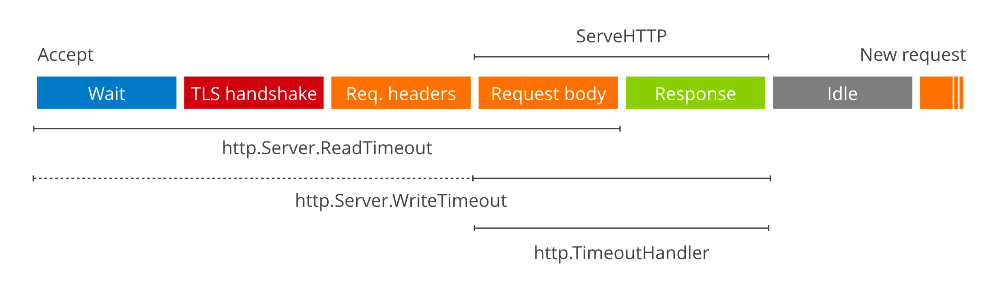
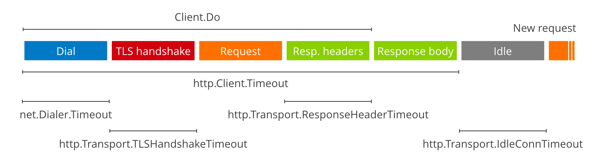
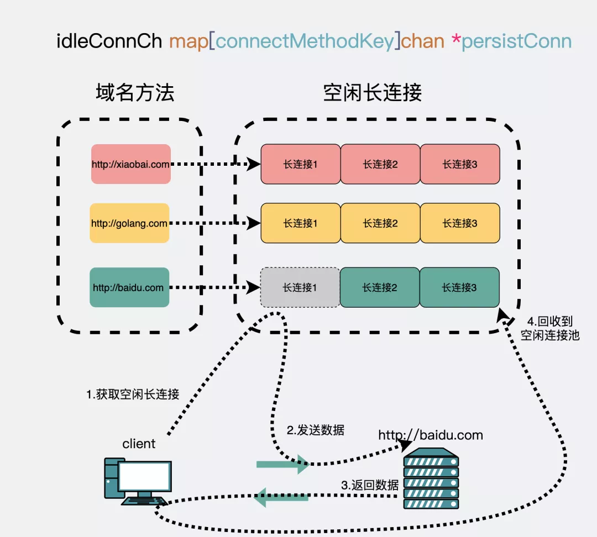
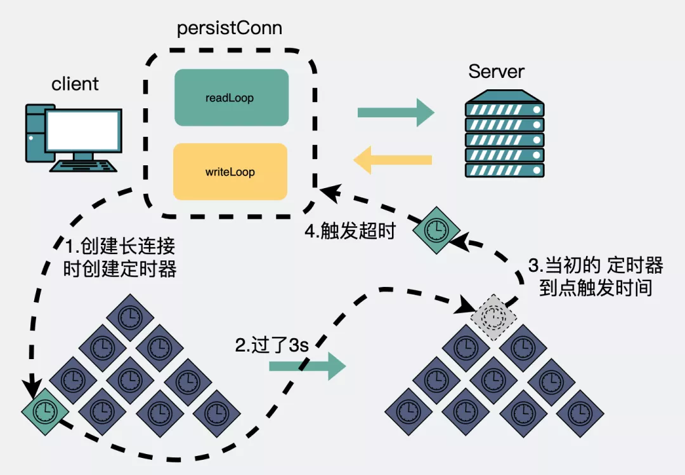

Http 重用底层TCP链接
---------------

官方释疑

```go
    // Body represents the response body.
    //
    // The response body is streamed on demand as the Body field
    // is read. If the network connection fails or the server
    // terminates the response, Body.Read calls return an error.
    //
    // The http Client and Transport guarantee that Body is always
    // non-nil, even on responses without a body or responses with
    // a zero-length body. It is the caller's responsibility to
    // close Body. The default HTTP client's Transport may not
    // reuse HTTP/1.x "keep-alive" TCP connections if the Body is
    // not read to completion and closed.
    //
    // The Body is automatically dechunked if the server replied
    // with a "chunked" Transfer-Encoding.
    //
    // As of Go 1.12, the Body will also implement io.Writer
    // on a successful "101 Switching Protocols" response,
    // as used by WebSockets and HTTP/2's "h2c" mode.
    Body io.ReadCloser`
```

- 对于Body == nil的处理

```go
	if resp.Body == nil {
		// The documentation on the Body field says “The http Client and Transport
		// guarantee that Body is always non-nil, even on responses without a body
		// or responses with a zero-length body.” Unfortunately, we didn't document
		// that same constraint for arbitrary RoundTripper implementations, and
		// RoundTripper implementations in the wild (mostly in tests) assume that
		// they can use a nil Body to mean an empty one (similar to Request.Body).
		// (See https://golang.org/issue/38095.)
		//
		// If the ContentLength allows the Body to be empty, fill in an empty one
		// here to ensure that it is non-nil.
		if resp.ContentLength > 0 && req.Method != "HEAD" {
			return nil, didTimeout, fmt.Errorf("http: RoundTripper implementation (%T) returned a *Response with content length %d but a nil Body", rt, resp.ContentLength)
		}
		resp.Body = ioutil.NopCloser(strings.NewReader(""))
	}
```

- 对于不处理的statusCode

```go
    resp, err := http.Get("http://www.example.com")
    if err != nil {
        return err
    }
    defer resp.Body.Close()
    
    if resp.StatusCode == http.StatusOK {
        var apiRet APIRet
        decoder := json.NewDecoder(resp.Body)
        err := decoder.Decode(&apiRet)
        // ...
    }else{
    	// 使用io.Copy
        io.Copy(ioutil.Discard, resp.Body)
        // ...
    }
```

测试代码

```go
    func main() {
        count := 100
        for i := 0; i < count; i++ {
            resp, err := http.Get("https://www.oschina.net")
            if err != nil {
                panic(err)
            }
    
            //io.Copy(ioutil.Discard, resp.Body)
            resp.Body.Close()
        }
    }
```

Timeout vs Deadline
------------

Go exposes to implement `timeouts`: `Deadlines`.

Exposed by `net.Conn` with the Set [Read|Write]Deadline(time.Time) methods, Deadlines are an __absolute time__ which when reached makes all I/O operations fail with a timeout error.

- Server Timeout



```go
srv := &http.Server{
    ReadTimeout: 5 * time.Second,
    WriteTimeout: 10 * time.Second,
}

log.Println(srv.ListenAndServe())
```

  - ReadTimeout covers the time from when the connection is accepted to when the request body is fully read (if you do read the body, otherwise to the end of the headers). It's implemented in net/http by calling SetReadDeadline immediately after Accept.

  - WriteTimeout normally covers the time from the end of the request header read to the end of the response write (a.k.a. the lifetime of the ServeHTTP), by calling SetWriteDeadline

- Client Timeout



```go
c := &http.Client{
    Transport: &http.Transport{
        Dial: (&net.Dialer{
                Timeout:   30 * time.Second,
                KeepAlive: 30 * time.Second,
        }).Dial,
        MaxIdleConns:          100,
        IdleConnTimeout:       90 * time.Second,
        TLSHandshakeTimeout:   10 * time.Second,
        ResponseHeaderTimeout: 10 * time.Second,
        ExpectContinueTimeout: 1 * time.Second,
        ForceAttemptHTTP2:     true,
    }
}

```

KeepAlive
-----------

- HTTP KeepAlive

  - 原理
    
    HTTP 的 Keep-Alive，是由应用层（用户态） 实现的，称为 HTTP 长连接
      - 客户端请求的包头中 `Connection: Keep-Alive`
      - web 服务软件一般都会提供 `keepalive_timeout` 参数，用来指定 HTTP 长连接的超时时间
   
  -  线上存在网络问题，会导致 `GRPC HOL blocking`, 于是决定把 GRPC client改写成 HTTP client
    
  -  HTTP Client 存在 EOF 错误，EOF 一般是跟 IO 关闭有关系的, 网络 IO 的Keep-Alive 机制有关系
    
    Client side
    ```go
     c := &http.Client{
        Transport: &http.Transport{
           MaxIdleConnsPerHost: 1,
           DialContext: (&net.Dialer{
                Timeout:   time.Second * 2,
                KeepAlive: time.Second * 60,
           }).DialContext,
           DisableKeepAlives: false,  // Enable keep-alive
           IdleConnTimeout:   90 * time.Second,
          },
        Timeout: time.Second * 2,
     }
    ```
    
  - Doc
    
    ```go
    type Dialer struct {
    ...
     // KeepAlive specifies the interval between keep-alive
     // probes for an active network connection.
     // If zero, keep-alive probes are sent with a default value
     // (currently 15 seconds), if supported by the protocol and operating
     // system. Network protocols or operating systems that do
     // not support keep-alives ignore this field.
     // If negative, keep-alive probes are disabled.
     KeepAlive time.Duration
    ...
    }
    ```

- TCP KeepAlive

  - 原理
    
    该功能是由「内核」实现的，当客户端和服务端长达一定时间没有进行数据交互时，内核为了确保该连接是否还有效，就会发送探测报文，来检测对方是否还在线，然后来决定是否要关闭该连接
    需要通过 socket 接口设置 SO_KEEPALIVE 选项才能够生效，如果没有设置，那么就无法使用 TCP 保活机制
  - 测试
    ```shell
    > redis-cli -h 172.24.213.39 -p 6380
    > tcpdump -i eth0 -n host 172.24.213.39
     # 会看到 client 每隔 15s 会发送空的 ACK 包给 server, 并收到 server 返回的 ACK, 实际上这就是 client 端的 tcp keepalive 在起作用。
     # 然后我们在 server 设置 iptables, 人为制造网络隔离
    > iptables -I INPUT -s 172.24.213.40 -j DROP;iptables -I OUTPUT -d 172.24.213.40 -j DROP;iptables -nvL
    # client 172.24.213.40 每 5s 发送一个 ACK 三次，最后发一个 RST 包销毁连接。当然这个 RST redis-server 肯定也没有接收到。过一会将 server 防火墙删除
    > iptables -D INPUT -s 172.24.213.40 -j DROP;iptables -D OUTPUT -d 172.24.213.40 -j DROP;iptables -nvL
    > ss -a | grep 6380
    ```
  - 参数
    ```shell
    > cat /proc/sys/net/ipv4/tcp_keepalive_time
    7200
    > cat /proc/sys/net/ipv4/tcp_keepalive_probes
    9
    > cat /proc/sys/net/ipv4/tcp_keepalive_intvl
    75
    ```
    
  - Go TCP: 
    
    经过 net: enable TCP keepalives by default 和 net: add KeepAlive field to ListenConfig之后，从 go1.13 开始，默认都会开启 client 端与 server 端的 keepalive, 默认是 15s
    
    `func (ln *TCPListener) accept() (*TCPConn, error) `
    
    `func setKeepAlivePeriod(fd *netFD, d time.Duration) error`
  
- [`i/o timeout` caused by incorrect `setTimeout/setDeadline`](https://mp.weixin.qq.com/s/OI1TXa3JeSdMJV4aM19ZJw)

  ```go
  tr = &http.Transport{
      MaxIdleConns: 100,
      Dial: func(netw, addr string) (net.Conn, error) {
          conn, err := net.DialTimeout(netw, addr, time.Second*2) //设置建立连接超时
          if err != nil {
              return nil, err
          }
          err = conn.SetDeadline(time.Now().Add(time.Second * 3)) //设置发送接受数据超时
          if err != nil {
              return nil, err
          }
          return conn, nil
      },
  }
  ```

  现象 -
  golang服务在发起http调用时，虽然`http.Transport`设置了3s超时，会偶发出现i/o timeout的报错

  分析 -
  抓包发现， 从刚开始三次握手，到最后出现超时报错 i/o timeout。
  间隔3s。原因是客户端发送了一个一次Reset请求导致的。

  查看 - SetDeadline是对于链接级别
  SetDeadline sets the read and write deadlines associated with the connection.

  原理 -
  HTTP协议从1.1之后就默认使用长连接。golang标准库里也兼容这种实现。
  通过建立一个连接池，针对每个域名建立一个TCP长连接
  
  

  一个域名会建立一个连接，一个连接对应一个读goroutine和一个写goroutine。正因为是同一个域名，所以最后才会泄漏3个goroutine，如果不同域名的话，那就会泄漏 1+2*N 个协程，N就是域名数。
 
  正确的姿势 - **超时设置在http**

  ```go
      tr = &http.Transport{
          MaxIdleConns: 100,
      }
      client := &http.Client{
          Transport: tr,
          Timeout: 3*time.Second,  // Timeout specifies a time limit for requests made by this Client.
      }
  ```
  
  不要在 http.Transport中设置超时，那是连接的超时，不是请求的超时。否则可能会出现莫名 io timeout报错。

- [如何正确设置保活](https://mp.weixin.qq.com/s/EmawKOftz0OAnMd2ydcOgQ)
  - 前情
    - 由于线上存在网络问题，会导致 GRPC HOL blocking, 于是决定把 GRPC client改写成 HTTP client
    - 搜索日志里面会发现有极少数的 EOF 错误
    - EOF 这个东西一般是跟 IO 关闭有关系的，就是 server 和 client 的 Keep-Alive 机制的问题
  - Debug
    - HTTP Client
      ```go
       c := &http.Client{
        Transport: &http.Transport{
         MaxIdleConnsPerHost: 1,
         DialContext: (&net.Dialer{
          Timeout:   time.Second * 2,
          KeepAlive: time.Second * 60,
         }).DialContext,
         DisableKeepAlives: false,
         IdleConnTimeout:   90 * time.Second,
        },
        Timeout: time.Second * 2,
       }
      ```
      官方文档介绍是一个用于TCP Keep-Alive的probe指针，间隔一定的时间发送心跳包。每间隔60S进行一次Keep-Alive
    - HTTP Server
      ```go
      s := http.Server{
        Addr:        ":8080",
        Handler:     http.HandlerFunc(Index),
        ReadTimeout: 10 * time.Second,
        // IdleTimeout: 10 * time.Second,
       }
       s.SetKeepAlivesEnabled(true)
       s.ListenAndServe()
      ```
      Server的 KeepAlive 主要是通过 IdleTimeout 来进行控制的，IdleTimeout 如果为空则使用 ReadTimeout
    - client 侧的 Keep-Alive 是60s，但是 server 侧的时间是间隔10s就去关掉空闲的连接。所以这里很容易就认为是：client 侧的 Keep-Alive 心跳间隔时间太长了，server 侧提前关闭了连接。修改参数，重新上线，持续观察一段时间发现还是有 EOF 错误
    - Mock EOF
      ```go
      func test(w http.ResponseWriter, r *http.Request) {
       log.Println("receive request from:", r.RemoteAddr, r.Header)
       if count%2 == 1 {
        conn, _, err := w.(http.Hijacker).Hijack()
        if err != nil {
         return
        }
      
        conn.Close()
        count++
        return
       }
       w.Write([]byte("ok"))
       count++
      }
      
      func main() {
       s := http.Server{
        Addr:        ":8080",
        Handler:     http.HandlerFunc(test),
        ReadTimeout: 10 * time.Second,
       }
       // s.SetKeepAlivesEnabled(false)
       s.ListenAndServe()
      }
      ```
      在尝试复现 EOF 错误的时候，看到有 Hijack 这种东西，还是挺好用的。可以看到直接在 server 侧关掉连接, client 侧感知不到连接关闭确实是会有 EOF 错误发生的。
    - Mock Keep-Alive
      ```go
      func sendRequest(c *http.Client) {
       req, err := http.NewRequest("POST", "http://localhost:8080", nil)
       if err != nil {
        panic(err)
       }
       resp, err := c.Do(req)
       if err != nil {
        panic(err)
       }
       defer resp.Body.Close()
      
       buf := &bytes.Buffer{}
       buf.ReadFrom(resp.Body)
      
      }
      
      func main() {
       c := &http.Client{
        Transport: &http.Transport{
         MaxIdleConnsPerHost: 1,
         DialContext: (&net.Dialer{
          Timeout:   time.Second * 2,
          KeepAlive: time.Second,
         }).DialContext,
         DisableKeepAlives: false,
         IdleConnTimeout:   90 * time.Second,
        },
        Timeout: time.Second * 2,
       }
       // c := &http.Client{}
       sendRequest(c)
       time.Sleep(time.Second * 3)
       sendRequest(c)
      
      }
      ```
      在本地开始尝试复现 Keep-Alive 的问题，client 侧使用 KeepAlive: time.Second, 每间隔一秒钟的 keep-alive, server 侧同样使用两秒 IdleTimeout: time.Second。
    - Packet Capture
      - Client 使用的基于TCP层面的Keep-alive协议，针对的是整条TCP连接
      - Server 侧明显是基于应用层协议做的判断
    - Source Code
      - Client
       ```go
       func (d *Dialer) DialContext(ctx context.Context, network, address string) (Conn, error) {
       ...
        if tc, ok := c.(*TCPConn); ok && d.KeepAlive >= 0 {
         setKeepAlive(tc.fd, true)
         ka := d.KeepAlive
         if d.KeepAlive == 0 {
          ka = defaultTCPKeepAlive
         }
         setKeepAlivePeriod(tc.fd, ka)
         testHookSetKeepAlive(ka)
        }
       ...
       }
       
       func setKeepAlivePeriod(fd *netFD, d time.Duration) error {
        // The kernel expects seconds so round to next highest second.
        secs := int(roundDurationUp(d, time.Second))
        if err := fd.pfd.SetsockoptInt(syscall.IPPROTO_TCP, syscall.TCP_KEEPINTVL, secs); err != nil {
         return wrapSyscallError("setsockopt", err)
        }
        err := fd.pfd.SetsockoptInt(syscall.IPPROTO_TCP, syscall.TCP_KEEPIDLE, secs)
        runtime.KeepAlive(fd)
        return wrapSyscallError("setsockopt", err)
       }
       ```
      最后调用的是 SetsockoptInt，这个函数就不在这具体的展开了，本质上来讲 Client 侧是在TCP 4层让 OS 来帮忙进行的 Keep-Alive。
    - Server
      ```go
      func (c *conn) serve(ctx context.Context) {
      ...
          defer func() {
              if !c.hijacked() {
         c.close()
         c.setState(c.rwc, StateClosed, runHooks)
        }
          }
          
          for {
              w, err := c.readRequest(ctx)
              ...
              serverHandler{c.server}.ServeHTTP(w, w.req)
              ...
        if d := c.server.idleTimeout(); d != 0 {
         c.rwc.SetReadDeadline(time.Now().Add(d))
         if _, err := c.bufr.Peek(4); err != nil {
          return
         }
        }
          }
      ...
      }
      ```
      defer 就是关闭连接用的，当函数退出的时候server会关闭连接。 for循坏是处理连接请求用的，可以看出来HTTP server本身其实是不支持处理多个请求的，并没有实现HTTP 1.1协议中的Pipeline。
      然后再看keep-alive的操作，先设置ReadDeadline，然后调用c.bufr.Peek这里的调用流程比较长，其实最后会落到conn.Read,本质上是一个阻塞操作。然后开始等待bufr里面的数据，如果client在这个时间段没有发送数据过来，则会退出for循环然后关闭连接
  - conclusion
    - 在上述的场景下想要reuse一个conn主要还是取决于server 侧的idleTimeout。如果没收到client发送的请求是会主动发送fin包进行close的。
  - fix
    - **Retry**
      其实解决方案有很多种，在这里线上采用的是客户端进行重试。这里引申一下，像上面这种错误，如果是GET,HEAD等一些幂等操作的话，client代码库会自动进行重试。我们线上使用的是POST, 所以直接在业务侧进行重试
    - **Increase IdleTimeout**
      另外一个解决方案就是增加server的IdleTimeout，但是这样一来会消耗更多的server资源。


