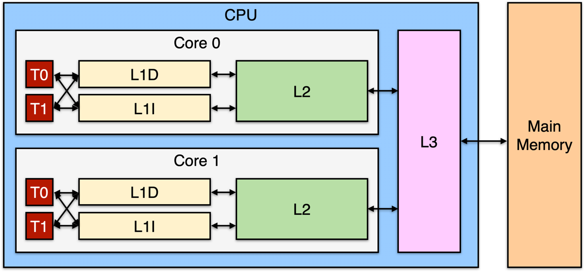
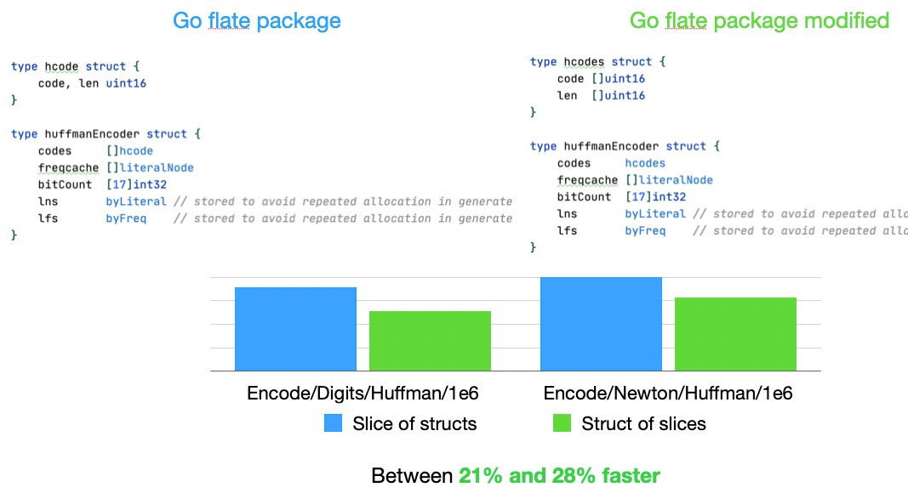
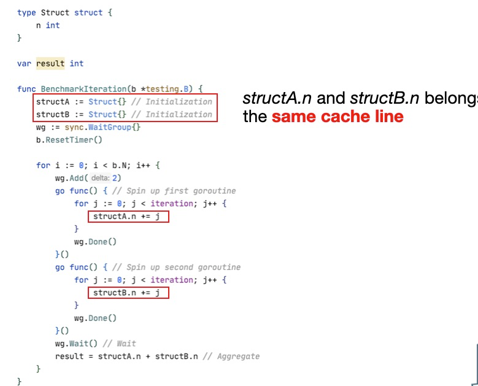

- CPU Architecture
------



|Cache | Latency | CPU cycles |Size |
| ------ |----| ---- | ---- |
L1 access | ~1.2 ns | ~4 | Between 32 KB and 512 KB
L2 access | ~3 ns | ~10 | Between 128 KB and 24 MB
L3 access | ~12 ns | ~40 | Between 2 MB and 32 MB

- Locality of Reference - CPU
-----

  - It will access the same location in the near future: this is the temporal locality principle.
  - It will access memory locations nearby: this is the spatial locality principle.

Temporal locality is one of the reasons to have CPU caches. The solution is to copy a cache line. A cache line is a contiguous segment of memory.

```shell
$ sysctl -a | grep cacheline
hw.cachelinesize: 64
```

- Predictability - CPU

Iterating on a linked list that should be allocated contiguously should be decent

__Forward iterate slice vs Backward iterate slice__

Result: iterate backwards on slice is slightly faster 

    - due to bound check is faster
    - CPU was able to predict that iterate backwards


- Data-Oriented Design
-----

  - Structure Alignment

```go
type I1 struct {
	b1 bool
	i int64
	b2 bool
}

type I2 struct {
	i int64
	b1 bool
	b2 bool
}

func BenchmarkI2(b *testing.B) {
    s := make([]I2, 100)
    var r int64
    b.ResetTimer()
    for j := 0; j < 100; j++ {
        r += s[j].i
    }
}
```

`I2` is faster than `I1`

Iterating over a compact data structure is more efficient as it requires less cache lines

  - Slice of structs vs struct of slices




- Caching Pitfall
-----

- Concurrency
-----

CPU must guarantee `cache coherency` through MESI (Modified, Exclusive, Shared, Invalid) protocol 

__False sharing__ - a cache line is shared across two cores with at least one goroutine being a writer



How to prevent false sharing?

  - Do not communicate by sharing memory; instead share memory by communicating


  - Padding


Source:
-------

[1](https://teivah.medium.com/go-and-cpu-caches-af5d32cc5592)
