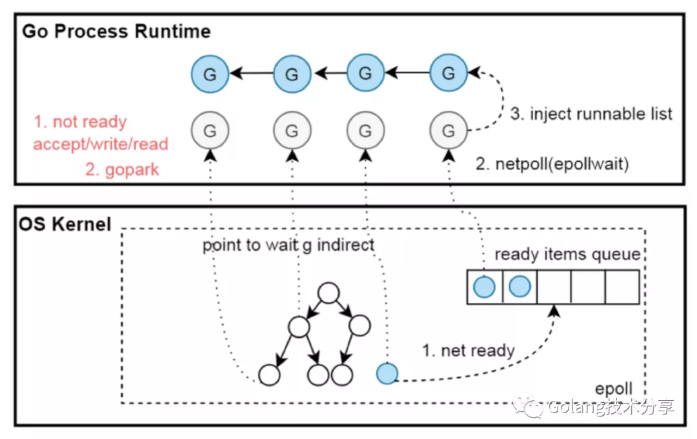
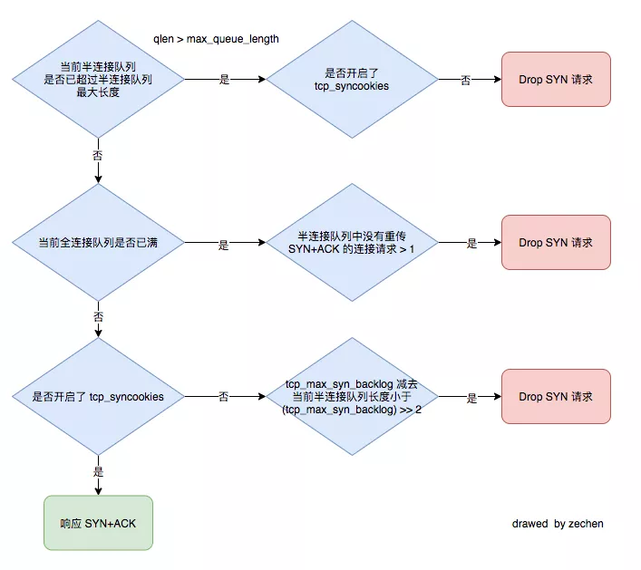

---------
- Case 1 [大量 fin-wait2](https://mp.weixin.qq.com/s?__biz=MjM5MDUwNTQwMQ==&mid=2257486478&idx=1&sn=1f037a765e023d9b321081ae017bc850&chksm=a539e258924e6b4e464122e12ce009c913edb1c671672dbbfce0f22e5d8e81adf33a6cb13c24&cur_album_id=1690026440752168967&scene=190#rd)

  - 分析
      - 分析业务日志发现了大量的接口超时问题，连接的地址跟`netstat`中`fin-wait2`目的地址是一致的
      - 通过`strace`追踪socket的系统调用，发现golang的socket读写超时没有使用setsockopt so_sndtimeo so_revtimeo参数
      ```bash
        [pid 34262] epoll_ctl(3, EPOLL_CTL_ADD, 6, {EPOLLIN|EPOLLOUT|EPOLLRDHUP|EPOLLET, {u32=1310076696, u64=140244877192984}}) = 0
        [pid 34265] epoll_pwait(3,  <unfinished ...>
        [pid 34262] <... getsockname resumed>{sa_family=AF_INET, sin_port=htons(45242), sin_addr=inet_addr("127.0.0.1")}, [112->16]) = 0
        [pid 34264] epoll_pwait(3,  <unfinished ...>
        [pid 34262] setsockopt(6, SOL_TCP, TCP_NODELAY, [1], 4 <unfinished ...>
        [pid 34262] setsockopt(6, SOL_SOCKET, SO_KEEPALIVE, [1], 4 <unfinished ...>
        [pid 34264] read(4,  <unfinished ...>
        [pid 34262] setsockopt(6, SOL_TCP, TCP_KEEPINTVL, [30], 4 <unfinished ...>
      ```
      - 在连接的roundTrip方法里有超时引发关闭连接的逻辑。由于http的语义不支持多路复用，所以为了规避超时后再回来的数据造成混乱，索性直接关闭连接

  - Solution
    - 要么加大客户端的超时时间，要么优化对端的获取数据的逻辑，总之减少超时的触发。
    
---------
- Case 2 [AWS ALB 502](https://adamcrowder.net/posts/node-express-api-and-aws-alb-502/)

  - Details
    
    The `502` Bad Gateway error is caused when the ALB sends a request to a service at the same time that the service closes the connection by sending the `FIN` segment to the ALB socket. The ALB socket receives `FIN`, acknowledges, and starts a new handshake procedure.

    Meanwhile, the socket on the service side has just received a data request referencing the previous (now closed) connection. Because it can’t handle it, it sends an RST segment back to the ALB, and then the ALB returns a 502 to the user.

  - Solution

    Just make sure that the service doesn’t send the `FIN` segment before the ALB sends a `FIN` segment to the service. In other words, make sure the service doesn’t close the HTTP **Keep-Alive connection** before the ALB.

    The default timeout for the AWS Application Load Balancer is 60 seconds, so we changed the service timeouts to 65 seconds. Barring two hiccoughs shortly after deploying, this has totally fixed it.
    
--------
- Case 3 [HOL Blocking](https://mp.weixin.qq.com/s?__biz=Mzg5MTYyNzM3OQ==&mid=2247483985&idx=1&sn=9546ced2f5b9df02537769ff167c9db9&chksm=cfcb304df8bcb95b0527e4ca94ecd66325d8db0b8c7a5eecb92bdd9ed573ce750c1e751809e2&cur_album_id=1899309536088293384&scene=190#rd)

  - tcpdump 定位 root cause 是 tcp retransmit 引起的 HOL(head of line) blocking

--------
- Case 4 [iptables redirect](https://mp.weixin.qq.com/s/fmrw-33cbKLdAkkMHyOrbw)

  - 问题： 由于流量突增临时扩充多个node部署服务，但遇到一个问题全量接口调用失败总是返回无关的返回结果。简单说在服务里本调用其他服务接口，返回的结果莫名其妙。

  - 分析：
    - 本机dig dns解析无异常
    - 通过 lsof 和 netstat 可以看到已建立连接是正常的解析ip，但是对端确实没有收到该请求
    - strace是可以看到服务请求过程中所涉及到的系统调用
    - 尝试使用tcpdump来抓包。每次请求时都会跟127.0.0.1:80建连，请求体也会转到127.0.0.1:80上。这类情况很像是做了端口劫持跳转
    - 在iptables里发现了redirect跳转。所有output请求会转到sidecar_outbound自定义链，在sidecar自定义链中又把目标地址中80的请求转到本地的80端口上。
  - 测试
    - script
      ```shell
      iptables -t nat -N SIDECAR_OUTBOUND
      iptables -t nat -A OUTPUT -p tcp -j SIDECAR_OUTBOUND
      iptables -t nat -A SIDECAR_OUTBOUND -p tcp -d 123.56.0.0 --dport 80 -j REDIRECT --to-port 80
      ```

- UDP优化

  - UDP 存在粘包半包问题？
    - tcp 是无边界的，tcp 是基于流传输的，tcp 报头没有长度这个变量，而 udp 是有边界的，基于消息的，是可以解决粘包问题的。
    - udp 并没有完美的解决应用层粘包半包的问题。如果你的 go udp server 的读缓冲是 1024，那么 client 发送的数据不能超过 server read buf 定义的 1024 byte，不然还是要处理半包了。如果发送的数据小于 1024 byte，倒是不会出现粘包的问题
    - 借助 strace 发现 syscall read fd 的时候，最大只获取 1024 个字节。这个 1024 就是上面配置的读缓冲大小
  - golang udp 的锁竞争
    - udp 压力测试的时候，发现 client 和 server 都跑不满 cpu 的情况。尝试使用 iperf 进行 udp 压测，golang udp server 的压力直接干到了满负载
    - 尝试在 go udp client 里增加了多协程写入，10 个 goroutine，100 个 goroutine，500 个 goroutine，都没有好的明显的提升效果，而且性能抖动很明显
    - 通过 lsof 分析 client 进程的描述符列表，client 连接 udp server 只有一个连接。也就是说，500 个协程共用一个连接
    - 使用 strace 做 syscall 系统调用统计，发现 futex 和 pselect6 系统调用特别多，这一看就是存在过大的锁竞争
  - 优化
    - 实例化多个 udp 连接到一个数组池子里，在客户端代码里随机使用 udp 连接。这样就能减少锁的竞争了。
    - udp 在合理的 size 情况下是不需要依赖应用层协议解析包问题。那么我们只需要在 client 端控制 send 包的大小，server 端控制接收大小，就可以节省应用层协议带来的性能高效

- [`gnet` TCP流协议解析程序](https://mp.weixin.qq.com/s/Hrh63H1f1dmxAL9qt6bJng)

- [Go 语言的网络编程模型](https://mp.weixin.qq.com/s/YT71cQr6vbz4wsF5I3flNA)
  - Go 语言的网络编程模型是同步网络编程。它基于 协程 + I/O 多路复用 （linux 下 epoll，darwin 下 kqueue，windows 下 iocp，通过网络轮询器 netpoller 进行封装），结合网络轮询器与调度器实现。
  - 用户层 goroutine 中的 block socket，实际上是通过 netpoller 模拟出来的。runtime 拦截了底层 socket 系统调用的错误码，并通过 netpoller 和 goroutine 调度让 goroutine 阻塞在用户层得到的 socket fd 上
  - Go 将网络编程的复杂性隐藏于 runtime 中：开发者不用关注 socket 是否是 non-block 的，也不用处理回调，只需在每个连接对应的 goroutine 中以 block I/O 的方式对待 socket 即可。
  - 
  - `tcpdump -S -nn -vvv -i lo0 port 8000` -vvv是为了打印更多的详细描述信息，-S 显示序列号绝对值

- [Forcefully Close TCP Connections in Golang](https://itnext.io/forcefully-close-tcp-connections-in-golang-e5f5b1b14ce6)
  - the traditional default close 

    when we execute our `net.Conn.Close()` method, the TCP session we execute it against will start a connection termination sequence which includes handling (discarding) any outstanding data. That is, until we receive the final FIN-ACK packet
    `tcpdump -n -vvv -i lo0 port 9000`
  
  - a forceful close using the `SetLinger()` method

    socket 缓冲区信息可通过执行 `netstat -nt` 命令查看

    This method is changing the SO_LINGER socket option value using system calls against the Operating System.
    - If sec < 0 (the default), the operating system finishes sending the data in the background.
    - If sec == 0, the operating system discards any unsent or unacknowledged data.
    - If sec > 0, the data is sent in the background as with sec < 0. On some operating systems after sec seconds have elapsed any remaining unsent data may be discarded.

    ```go
    // Use SetLinger to force close the connection
    // When set to exactly 0, the Operating System will immediately close the connection and drop any outstanding packets.
    err := c.(*net.TCPConn).SetLinger(0)
    if err != nil {
        log.Printf("Error when setting linger: %s", err)
    }
    defer c.Close()
    ```
    A RST packet is a special type of packet used for “resetting” TCP connections. It is a way for the sender to tell the remote side that it will neither accept nor receive new data for this connection.

- [SO_REUSEPORT](https://douglasmakey.medium.com/socket-sharding-in-linux-example-with-go-b0514d6b5d08)
  
  Linux 3.9 内核引入了 SO_REUSEPORT选项（实际在此之前有一个类似的选项 SO_REUSEADDR，但它没有做到真正的端口复用，详细可见参考链接1）。

  SO_REUSEPORT 支持多个进程或者线程绑定到同一端口，用于提高服务器程序的性能。它的特性包含以下几点：

  - 允许多个套接字 bind 同一个TCP/UDP 端口
    - 每一个线程拥有自己的服务器套接字
    - 在服务器套接字上没有了锁的竞争
  - 内核层面实现负载均衡
  - 安全层面，监听同一个端口的套接字只能位于同一个用户下（same effective UID）
  - For TCP sockets, this option allows accept(2) load distribution in a multi-threaded server to be improved by using a distinct listener socket for each thread. This provides improved load distribution as compared to traditional techniques such using a single accept(2)ing thread that distributes connections, or having multiple threads that compete to accept(2) from the same socket.
  - For UDP sockets, the use of this option can provide better distribution of incoming datagrams to multiple processes (or threads) as compared to the traditional technique of having multiple processes compete to receive datagrams on the same socket.

  ```go
  var lc = net.ListenConfig{
      Control: func(network, address string, c syscall.RawConn) error {
          var opErr error
          if err := c.Control(func(fd uintptr) {
              opErr = unix.SetsockoptInt(int(fd), unix.SOL_SOCKET, unix.SO_REUSEPORT, 1)
          }); err != nil {
              return err
          }
          return opErr
      },
  }
  l, err := lc.Listen(context.Background(), "tcp", "127.0.0.1:8080")
  ```
  
  - Security
    
    To prevent this “port hijacking,” Linux has special protections or mechanisms to prevent these problems, such as:
    - Both sockets must have been created with the SO_REUSEPORT socket option. If there is a socket running without SO_REUSEPORT and we try to create another socket even with the SO_REUSEPORT socket option, it will fail with the error already in use.
    - All sockets that want to listen to the same IP and port combination must have the same effective userID. For example, if you want to hijack the Nginx port and it is running under the ownership of the user Pepito, a new process can listen to the same port only if it is also owned by the user Pepito. So one user cannot “steal” ports of other users.
- [TCP粘包](https://mp.weixin.qq.com/s/c3NYmCTf8LbakL5ZS1Fv-g)
  - MTU vs MSS
    - MTU: Maximum Transmit Unit，最大传输单元。 由网络接口层（数据链路层）提供给网络层最大一次传输数据的大小；一般 MTU=1500 Byte
    - MSS：Maximum Segment Size 。TCP 提交给 IP 层最大分段大小，不包含 TCP Header 和  TCP Option，只包含 TCP Payload ，MSS 是 TCP 用来限制应用层最大的发送字节数。
    
  - 为什么会出现粘包
    - TCP，Transmission Control Protocol。传输控制协议，是一种面向连接的、可靠的、**基于字节流**的传输层通信协议。
    - 应用层传到 TCP 协议的数据，不是以消息报为单位向目的主机发送，而是以字节流的方式发送到下游，这些数据可能被切割和组装成各种数据包，接收端收到这些数据包后没有正确还原原来的消息，因此出现粘包现象。
  - 为什么要组装发送的数据
    - TCP的 Nagle 算法优化，目的是为了避免发送小的数据包。
    - 在 Nagle 算法开启的状态下，数据包在以下两个情况会被发送：
      - 如果包长度达到MSS（或含有Fin包），立刻发送，否则等待下一个包到来；如果下一包到来后两个包的总长度超过MSS的话，就会进行拆分发送；
      - 等待超时（一般为200ms），第一个包没到MSS长度，但是又迟迟等不到第二个包的到来，则立即发送。
  - 关掉Nagle算法就不会粘包了吗？
    - `TCP_NODELAY = 1`
    - 就算关闭 Nagle 算法，接收数据端的应用层没有及时读取 TCP Recv Buffer 中的数据，还是会发生粘包。
  - 怎么处理粘包
    - 只要在发送端每次发送消息的时候给消息带上识别消息边界的信息，接收端就可以根据这些信息识别出消息的边界，从而区分出每个消息
      - 加入特殊标志
      - 加入消息长度信息
  - UDP 会粘包吗
    - 在报头中有16bit用于指示 UDP 数据报文的长度，假设这个长度是 n ，以此作为数据边界。因此在接收端的应用层能清晰地将不同的数据报文区分开，从报头开始取 n 位，就是一个完整的数据报，从而避免粘包和拆包的问题
  - 为什么长度字段冗余还要加到 UDP 首部中
    - IP 层是网络层的，而 UDP 是传输层的，到了传输层，数据包就已经不存在IP头信息了，那么此时的UDP数据会被放在 UDP 的  Socket Buffer 中。当应用层来不及取这个 UDP 数据报，那么两个数据报在数据层面其实都是一堆 01 串。
  - IP 层有粘包问题吗
    - 先说结论，不会。首先前文提到了，粘包其实是由于使用者无法正确区分消息边界导致的一个问题。
    - IP 层从按长度切片到把切片组装成一个数据包的过程中，都只管运输，都不需要在意消息的边界和内容，都不在意消息内容了，那就不会有粘包一说了。
- [localhost 就一定是 localhost 么?](https://mp.weixin.qq.com/s/x0798dbodAxdyUIGYfEBjA)
  - Issue
    - 我们在本地测试或者本地通讯的时候经常使用 localhost 域名，但是访问 localhost 的对应的一定就是我们的本机地址么？
    - 我们明明是配置的 localhost，为什么会出现这个地址？localhost 不应该指向的是 127.0.0.1 么？我们使用 dig 和 nslookup 之后发现 localhost 的确是 127.0.0.1
    - 我们在机器上抓包之后发现 localhost 竟然走了域名解析! 并且 localhost 这个域名在我们内网还被注册了，解析出来的地址就是最开始发现的这个不知名的地址
    - 我们下意识认为的域名解析流程应该是这样的，先去找 /etc/hosts 文件，localhost 找到了（默认是 127.0.0.1）就返回了
    - 排查之后发现，实际上的流程是这样的，先做了 DNS 查询 DNS 没查到然后去查了 /etc/hosts 文件
    - 直到有一天，我们的内网域名解析中添加了一个 localhost 的域名解析，就直接查询成功返回了
  - 复现
    ```go
    func main() {
     client := &http.Client{}
     _, err := client.Get("http://localhost:8080")
     fmt.Println(err)
    }
    
    # GODEBUG="netdns=go+2" go run main.go 
    go package net: GODEBUG setting forcing use of Go's resolver
    go package net: hostLookupOrder(localhost) = files,dns
    Get "http://localhost:8080": dial tcp [::1]:8080: connect: connection refused
    上面显示的 files,dns 的意思就是先从 /etc/hosts 文件中查询，再去查询 dns 结果
    ```
    Docker模拟
    ```shell
    FROM golang:1.15 as builder
    
    WORKDIR /app
    
    COPY main.go main.go
    COPY run.sh run.sh
    
    ENV CGO_ENABLED=0
    ENV GOOS=linux
    
    RUN go build main.go
    
    FROM alpine:3
    
    WORKDIR /app
    
    COPY --from=builder /app /app
    COPY run.sh run.sh
    
    RUN chmod +x run.sh
    
    ENV GODEBUG="netdns=go+2"
    ENV CGO_ENABLED=0
    ENV GOOS=linux
    
    CMD /app/run.sh
    ```
    使用这个容器运行的结果如下，可以看到已经变成了 dns,files 为什么会这样呢？
  - 排查
    - src/net/dnsclient_unix.go Go 中定义了下面几种 DNS 解析顺序，其中 files 表示查询 /etc/hosts 文件，dns 表示执行 dns 查询
    - Go 会先根据一些初始条件判断查询的顺序，然后就查找 /etc/nsswitch.conf 文件中的 hosts 配置项，如果不存在就会走一些回退逻辑。这次的问题出现在这个回退逻辑上
    - 当前系统如果是 linux 并且不存在 /etc/nsswitch.conf 文件的时候，会直接返回 dns,files 的顺序
- [KUBERNETES/DOCKER网络排障](https://coolshell.cn/articles/18654.html)
  - 问题
    - 某个pod被重启了几百次甚至上千次。
    - 用 docker exec -it 命令直接到容器内启了一个 Python的 SimpleHttpServer来测试发现也是一样的问题
  - 排查
    - 用 telnet ip port 的命令手工测试网络连接时有很大的概率出现 connection refused 错误，大约 1/4的概率，而3/4的情况下是可以正常连接的
    - 抓个包看看，然后，用户抓到了有问题的TCP连接是收到了 SYN 后，立即返回了 RST, ACK (docker0 返回 RST ACK)
    - 在 telnet 上会显示 connection refused 的错误信息，对于我个人的经验，这种 SYN完直接返回 RST, ACK的情况只会有三种情况
      - TCP链接不能建立，不能建立连接的原因基本上是标识一条TCP链接的那五元组不能完成，绝大多数情况都是服务端没有相关的端口号。
      - TCP链接建错误，有可能是因为修改了一些TCP参数，尤其是那些默认是关闭的参数，因为这些参数会导致TCP协议不完整。
      - 有防火墙iptables的设置，其中有 REJECT 规则。
    - 有点像 NAT 的网络中服务端开启了 tcp_tw_recycle 和 tcp_tw_reuse 的症况 - 查看了一上TCP参数，发现用户一个TCP的参数都没有改，全是默认的，于是我们排除了TCP参数的问题
    - 也不觉得容器内还会设置上iptables，而且如果有那就是100%的问题，不会时好时坏。
    - 抓包这个事，在 docker0 上可以抓到，然而到了容器内抓不到容器返回 RST, ACK
    - 于是这个事把我们逼到了最后一种情况 —— IP地址冲突了
    - 我们发现用户的机器上有 arping 于是我们用这个命令来检测有没有冲突的IP地址。 -D 参数是检测IP地址冲突模式，如果这个命令的退状态是 0 那么就有冲突。结果返回了 1
      ```shell
      $ arping -D -I docker0 -c 2 10.233.14.145
      $ echo $?
      ```
    - 想看看所有的 network namespace 下的 veth 网卡上的IP
      - 首先，我们到 /var/run/netns目录下查看系统的network namespace，发现什么也没有。
      - 然后，我们到 /var/run/docker/netns 目录下查看Docker的namespace，发现有好些。
      - 于是，我们用指定位置的方式查看Docker的network namespace里的IP地址
        ```shell
        $ nsenter --net=/var/run/docker/netns/421bdb2accf1 ifconfig -a
        $ ls /var/run/docker/netns | xargs -I {} nsenter --net=/var/run/docker/netns/{} ip addr 
        $ lsns -t net | awk '{print $4}' | xargs -t -I {} nsenter -t {}&nbsp;-n ip addr | grep -C 4 "10.233.14.137"
        ```
  - Docker
    - Docker 1.11版以后，Docker进程组模型就改成上面这个样子了.
      - dockerd 是 Docker Engine守护进程，直接面向操作用户。dockerd 启动时会启动 containerd 子进程，他们之前通过RPC进行通信。
      - containerd 是dockerd和runc之间的一个中间交流组件。他与 dockerd 的解耦是为了让Docker变得更为的中立，而支持OCI 的标准 。
      - containerd-shim  是用来真正运行的容器的，每启动一个容器都会起一个新的shim进程， 它主要通过指定的三个参数：容器id，boundle目录（containerd的对应某个容器生成的目录，一般位于：/var/run/docker/libcontainerd/containerID）， 和运行命令（默认为 runc）来创建一个容器。
      - docker-proxy 你有可能还会在新版本的Docker中见到这个进程，这个进程是用户级的代理路由。只要你用 ps -elf 这样的命令把其命令行打出来，你就可以看到其就是做端口映射的。如果你不想要这个代理的话，你可以在 dockerd 启动命令行参数上加上：  --userland-proxy=false 这个参数。
- [线上一次大量 CLOSE_WAIT 复盘](https://ms2008.github.io/2019/07/04/golang-redis-deadlock/)
  - 出现 CLOSE_WAIT 本质上是因为服务端收到客户端的 FIN 后，仅仅回复了 ACK（由系统的 TCP 协议栈自动发出），并没有发 4 次断开的第二轮 FIN（由应用主动调用 Close() 或 Shutdown() 发出）
  - `ss -ta sport = :9000` 客户端关闭连接后，CLOSE_WAIT 依然不会消失，只能说明服务端 HANG 在了某处，没有调用 close
  - 打印出服务的调用栈信息, 出现了将近 140W 的 goroutine，有将近 100W 都 block 在了 redis 连接的获取上。顺手确认 redis 的连接情况：ss -tn dport = :6379 | sed 1d | wc -l 发现 redis 连接池已经占满。
  - redigo 初始化连接池的时候如果没有传入 timeout，那么在执行命令时将永远不会超时
    ```go
    connTimeout := redis.DialConnectTimeout(time.Duration(10) * time.Second)
    readTimeout := redis.DialReadTimeout(time.Duration(10) * time.Second)
    writeTimeout := redis.DialWriteTimeout(time.Duration(10) * time.Second)
    
    redisPool = &redis.Pool{
        MaxIdle:     conf.MaxIdle,
        MaxActive:   conf.MaxActive,
        Wait:        true,
        IdleTimeout: 240 * time.Second,
        Dial: func() (redis.Conn, error) {
            c, err := redis.Dial("tcp", conf.Addr, connTimeout, readTimeout, writeTimeout)
            if err != nil {
                return nil, err
            }
            return c, err
        },
        TestOnBorrow: func(c redis.Conn, t time.Time) error {
            if time.Since(t) < time.Minute {
                return nil
            }
            _, err := c.Do("PING")
            return err
        },
    }
    ```
  - redigo 也提供了一个更安全的获取连接的接口：GetContext()，通过显式传入一个 context 来控制 Get() 的超时：
- [CLOSE WAIT 分析](https://gocn.vip/topics/yQ0XrZH0Qd)
  - 背景
    - telnet这个ip port端口是通的，说明四层以下网络是通的。
    - 但是当我们curl到对应服务的时候，发现服务被连接重置 RST
  - 分析问题机器
    - 查看网络问题
      - `netstat -tunp | grep CLOSE_WAIT | wc -l`
      - 我们发现CLOSE WAIT的客户端的端口号，在服务端机器上有，但在客户端机器上早就消失。CLOSE WAIT就死在了这台机器上。
      - RECVQ这么大，为什么服务还能正常响应200
      - 为什么上面curl会超时，但是telnet可以成功
      - 为什么CLOSE WAIT没有pid
    - 线上调试
      - 我们使用了`sudo strace -p pid`，发现主进程卡住了，想当然的认为自己发现了问题。但实际过程中，这是正常现象，我们框架使用了 golang.org/x/net/netutil 里的 LimitListener ，当你的goroutine达到最大值，那么就会出现这个阻塞现象，因为没有可用的goroutine了，主进程就卡住了。
      - 查看全部线程trace指令为`sudo strace -f -p pid` ，当然也可以查看单个线程的 `ps -T -p pid` ，然后拿到spid，在执行 `sudo strace -p spid`
    - 线下模拟
      - 我们将服务端代码的 `server.Serve(netutil.LimitListener(listener, 1))` 里面的限制设置为1。然后客户端代码的http长连接开启，先做http请求，然后再做tcp请求。
      - `netstat -ntlpa | grep 8080 |grep LISTEN`
      - `netstat -ntlpa | grep 8080 | grep CLOSE | wc -l`
    - 分析
      - 当我们在服务端设置了limit为1的时候，意味这我们服务端的最大连接数只能为1。我们客户端在使用http keepalive，会将这个连接占满，如果这个时候又进行了tcp探活，那么这个探活的请求就会被堵到backlog里，也就是上面我们看到3.3.2中第一个图，里面的RECVQ为513。
      - [CLOSE WAIT不消失的情况](https://blog.cloudflare.com/this-is-strictly-a-violation-of-the-tcp-specification/)
  - 产生线上问题的可能原因
    - 线上的nginx到后端go配置的keepalive，当GO的HTTP连接数达到系统默认1024值，那么就会出现Goroutine无法让出，这个时候使用TCP的探活，将会堵在队列里，服务端出现CLOSE WAIT情况，然后由于一直没有释放goroutine，导致服务端无法发出fin包，一直保持CLOSE WAIT。
    - 而客户端的端口在此期间可能会被重用，一旦重用后，就造成了混乱。（如果在混乱后，Goroutine恢复后，服务端过了好久响应了fin包，客户端被重用的端口收到这个包是返回RST，还是丢弃？这个太不好验证）。个人猜测是丢弃了，导致服务端的CLOSE WAIT一直无法关闭，造成RECVQ的一直阻塞。
  - 其他问题
    - GO服务端的HTTP Keepalive是使用的客户端的Keepalive的时间，如果客户端的Keepalive存在问题，比如客户端的http keepalive泄露，也会导致服务端无法关闭Keepalive，从而无法回收goroutine，当然go前面挡了一层nginx，所以应该不会有这种泄露问题。但保险起见，go的服务端应该加一个keepalive的最大值。例如120s，避免这种问题。
    - GO服务端的HTTP chucked编码时候，如果客户端没有正确将response的body内容取走，会导致数据仍然在服务端的缓冲区，从而导致无法响应fin包，但这个理论上不会出现，并且客户端会自动的进行rst，不会影响业务。
    - 如过写的http服务存在业务问题，例如里面有个死循环，无法响应客户端，也会导致http服务出现CLOSE WAIT问题，但这个是有pid号的
    - 如果我们的业务调用某个服务的时候，由于没发心跳包给服务，会被服务关闭，但我们这个时候没正确处理这个场景，那么我们的业务处就会出现CLOSE WAIT。
- [线上大量CLOSE_WAIT原因排查](https://cloud.tencent.com/developer/article/1381359)
  - 现象
    - 告警出现了 504
  - 发现问题
    - `netstat -na | awk '/^tcp/ {++S[$NF]} END {for(a in S) print a, S[a]}'`发现绝大部份的链接处于 CLOSE_WAIT 状态
    - 为什么会出现大量的mysql连接是  CLOSE_WAIT
       - 确实没有调用close
       - 有耗时操作（火焰图可以非常明显看到），导致超时了
       - mysql的事务没有正确处理，例如：rollback 或者 commit
    - 使用 perf 把所有的调用关系使用火焰图给绘制出来。既然我们推断代码中没有释放mysql连接
    - 由于那一行代码没有对事务进行回滚，导致服务端没有主动发起close。因此 MySQL负载均衡器 在达到 60s 的时候主动触发了close操作，但是通过tcp抓包发现，服务端并没有进行回应，这是因为代码中的事务没有处理，因此从而导致大量的端口、连接资源被占用。
- [Keeping TCP Connections Alive in Golang](https://madflojo.medium.com/keeping-tcp-connections-alive-in-golang-801a78b7cf1)
  - With Go any net.TCPConn type can have keepalives enabled by running the net.TCPConn.SetKeepAlive() method with true as the value.
  - With Go, the frequency of keepalives can be changed from the default using the net.TCPConn.SetKeepAlivePeriod() method.
    - The above example sets the TCP_KEEPINTVL socket option to 30 seconds; overriding the tcp_keepalive_intvl system parameter for this specific connection
    - In addition to overriding the keepalive interval, this method also changes the idle time, setting the TCP_KEEPIDLE socket option to 30 seconds; overriding the tcp_keepalive_time system parameter.
- [记一次线上超时问题的发现、排查、定位以及解决过程](https://mp.weixin.qq.com/s/Yh2dOC8Pumeis-h1_gMLjg)
  - 根据引擎监控系统来查看三方的基础数据监控, 超时监控报警
  - 看到超时这么多，第一时间先ping下，看看网络间耗时咋样
  - 开始尝试使用curl来分析各个阶段的耗时 `curl  -o /dev/null -s -w %{time_namelookup}::%{time_connect}::%{time_starttransfer}::%{time_total}::%{speed_download}"\n" --data-binary @req.dat https://www.baidu.com`
    - 从上述结构可以看出，在time_starttransfe阶段，也就是说对方业务处理结果仍然会出现2s耗时，问题复现。
  - 代码： log是最直接也是最有效的方式
  - 线上抓包： 上面抓包结果来看，在序号为6的位置，对方返回了http 204，然后又重新手动发了一次curl请求，在序号10的时候，对方又返回了http 204(从发送请求到收到对方响应耗时38ms)，但是奇怪的时候，在后面50s后，client端(发送方)开发发送FIN请求关闭连接，从代码逻辑来分析，是因为超时导致的关闭连接。
  - 同类对比： 只能通过与其它家正常返回的做对比，看看能不能得到有用结论。
    - 通过对比上述两家的区别，发现超时的该家较正常的三方返回，多了Content-Length、Content-Type等字段
  - 分析原因
    - http 204 Content-Length hang
    - 从上节标准可以看出，在http 204、304的时候，不允许返回Content-Length，那么如果返回了，libcurl又是如何处理的呢 - libcurl bug
    
- [TCP丢包不重传问题](https://yesphet.github.io/posts/tcp%E4%B8%A2%E5%8C%85%E4%B8%8D%E9%87%8D%E4%BC%A0%E9%97%AE%E9%A2%98%E6%8E%92%E6%9F%A5/)
  - Issue
    - 从以下客户端抓包可以看到，客户端没有收到 [2711665,2719857] 这个包，因此一直在对 2711665进行ack，而服务端确实有收到大量的Duplicate ACK ack 2711665
  - Debug
    - 查看 /proc/sys/net/ipv4/tcp_reordering 的值为3，所以可以确认服务端是有开启快速重传的，在收到3次duplicate ACK后就应该进行快重传，但从抓包文件中并没有发现有触发快速重传
    - 再通过 nstat 发现TcpExtTcpWqueueTooBig值较为异常
    - [Adventures in the TCP stack: Uncovering performance regressions in the TCP SACKs vulnerability fixes](https://www.databricks.com/blog/2019/09/16/adventures-in-the-tcp-stack-performance-regressions-vulnerability-fixes.html)
  - Solve
    - 通过升级内核版本至 3.10.0-1062.1.1.el7.x86_64 后发现问题得到了解决

- [missing DNS packets](https://cloud.google.com/blog/topics/inside-google-cloud/google-cloud-support-engineer-solves-a-tough-dns-case)
  - First step
    - Content of `/etc/hosts`
    - Content of `/etc/resolv.conf`
    - Output of iptables-save
    - pcap file collected using the ngrep command
  - Next
    - Are packets being selectively dropped? => check iptable rules
    - Is the MTU too small? => check output of ip a show
    - Is the problem UDP-only or does it also involve TCP? => run dig +tcp
    - Are packets generated by dig not coming back? => run tcpdump
    - Is libdns working properly? => run `strace` to check it is actually sending and receiving packets
  - We find out that dig +tcp google.com (TCP) works, but dig google.com (UDP) does not
  - We run strace dig google.com and we see that dig correctly calls sendmsg() and recvmsg() but that the latter times out.
  -  dropwatch, a tool that shows you where in the kernel a packet is dropped.
  - net.core.rmem_default is how you set the default receive buffer size for UDP packets. A common value is something around 200KiB, but if your server receives a lot of UDP packets you might want to increase the buffer size. If the buffer is full when a new packet arrives, because the application was not fast enough to consume them, then you will lose packets. The customer was running an application to collect metrics that were sent as UDP packets, so they had correctly increased the buffer to ensure they didn’t lose any data points. And they had set this value to the highest value possible: 2^31 - 1 (if you try and set it to 2^31 the kernel returns “INVALID ARGUMENT”).
- [CPU高负载引发内核探索之旅](https://mp.weixin.qq.com/s/QRuB25pqX61uZYaLsb3JRg)
  - 问题起源
    - 值班期间，运维同学偶然发现一台机器CPU消耗异常，从监控视图上看出现较多毛刺。而属于同一集群的其他机器在同一时间段CPU消耗相对稳定。
  - 分析
    - 虽然高负载发生的时间很短，依靠这套系统我们先拿到了导致高负载的直接原因，发生在inet_hash_connect函数中
    - inet_lookup_listener是服务端收到新连接时寻找监听端口，而inet_hash_connect函数是主动建立tcp连接，对应到我们的场景，就是STGW服务器与后端RealServer（后面简称RS）建立连接。
    - 为什么inet_hash_connect会出现高负载？
      - 从perf看，直接原因是raw_spin_lock锁带来的剧烈消耗，我们先找到这个锁所在位置，根据对应内核源码找inet_hash_connect实现及内部调用中，发现只有inet_check_establish里会进行spin_lock
  - 前期排查
    - 通常锁造成高负载我们会怀疑是否有死锁产生，从cpu现象来看只是短时间突增并非死锁。那么我们有另外两种猜想：
      - 锁覆盖的范围执行极慢，导致锁了很长时间。
      - 频繁执行该函数执行加锁导致高负载。
    - 加锁部分是一个遍历哈希链表的操作，通过传入的参数计算一个哈希值，拿到哈希桶后遍历其中可用的节点，这种遍历操作确实值得怀疑，历史case告诉我们，哈希桶挂载的节点非常多导致遍历复杂度急剧上升，拖累整个cpu
    - 存在不均匀的流量，ehash计算的哈希值可能都是同一个或几个，导致大量连接都落到了少数几个桶里，这种也有可能导致高负载。
  - 发现不同内核版本在inet_hash_connect函数实现上，确实有明显区别
    - 3.10内核不出问题：其端口选取过程为for循环在port_offset基础上逐次递增1，直到找到可用端口为止，或者超过了local_port_range个数，则返回EADDRNOTAVAIL
    - 4.14内核出现高负载问题：其端口选取过程为for循环在port_offset基础上逐次递增2，只把奇数范围（取决于local_port_range左边界）端口进行遍历，如果整个奇数范围都找不到可用端口，再遍历所有偶数端口，直到找到可用端口为止，或者超过了local_port_range个数，则返回EADDRNOTAVAIL。
  - 4.14内核做了奇偶区分，每次递增2就是为了只找奇数或偶数的端口，这种遍历方式乍一看似乎没毛病，因为可用端口总数限定了（local_port_range），在port_offset初始值Z足够离散的情况下，遍历过程不管递增1还是递增2，应该是差不多的，都有概率在递增后碰到可用端口。
  - 上面提到，我们的问题服务器，有一个业务只绑定了一个RS，在高负载的时候，服务器与这个RS建立的连接超过了2w条。结合这个现象，很快发现了问题所在，由于我们的local_port_range为10241~59999，总的可用端口数为49758个，其中奇数、偶数分别占2.4万多个。
  - 所以，高负载期间，问题服务器与该RS建立了2w多条连接，实际上将inet_hash_connect中的奇数端口几乎耗尽，然而每次与该RS建立新连接，内核都要首先遍历奇数端口，进行2w多次无效的端口查找与检查（inet_check_establish进行spin_lock），才有可能开始遍历偶数端口，从而找到可用端口。
- [流量下降探秘内核收包机制](https://mp.weixin.qq.com/s?__biz=MjM5ODYwMjI2MA==&mid=2649745268&idx=1&sn=f72f164847060d7b19cba272a38485e5&scene=21#wechat_redirect)
  - 七层接入网关出现了一起流量突然下降的Case
  - 前期探索
    - CPU细粒度监控展示的信息，可以看到在出现问题的时间段内，部分CPU核被跑满，并且是由于软中断消耗造成
    - 在一段长时间内，这种软中断热点偏高都会在几个固定的核上出现，不会转移给其他核。
    - **监控模块支持在出现系统核心资源异常时，抓取当时的函数调用栈信息**，有了函数调用信息，我们能更准确的知道是什么造成了系统核心资源异常，而不是继续猜想
    - 通过函数栈监控信息，我们发现了inet_lookup_listener函数是当时CPU软中断热点的主要消耗者。出现问题时，其他函数调用在没有发生多少变化情况下，inet_lookup_listener由原本很微小的cpu消耗占比，一下子冲到了TOP1。
    - inet_lookup_listener消耗过高跟软中断热点强相关，当热点将cpu单核跑满后就可能引发出流量有损的问题。由于软中断热点持续在产生，线上稳定性隐患很大。基于这个紧迫的稳定性问题，我们从为什么产生热点、为什么热点只在部分cpu core上出现两个方向，进行了问题分析、定位和解决。
  - 为什么产生了热点
    - inet_lookup系列函数是用于将收到的数据包定位到一个具体的socket上，但只有握手包会进入到找__inet_lookup_listener的逻辑，大部分数据包是通过__inet_lookup_established寻找socket。
    - 由于listen socket不具备四元组特征，因此内核只能用监听端口计算一个哈希值，并使用了 listening_hash 哈希桶存起来，握手包发过来的时候，就从该哈希桶中寻找对应的listen socket。
    - listen哈希桶开的太小了，只有32个。在正常的情况下，服务器的listen port数量，大概就是几w个这样的量级。这种量级下，一个port对应一个socket，哈希桶大小为32是可以接受的。
    - 然而在内核支持了reuseport并且被广泛使用后，情况就不一样了，在多进程架构里，listen port对应的socket数量，是会被几十倍的放大的。以应用层监听了5000个端口，reuseport 使用了50个cpu核心为例，5000*50/32约等于7812，意味着每次握手包到来时，光是查找listen socket，就需要遍历7800多次
    - 正因为上述原因，并且我们现网机器开启了reuseport，在端口数量较多的机器里，inet_lookup_listener的哈希桶大小太小，遍历过程消耗了cpu，导致出现了函数热点。
  - 如何解决__inet_lookup_listener问题
    - 从Linux 4.17开始，Linux社区就修复了由于reuseport带来的socket数量过多，导致inet_lookup_listener查找缓慢的问题，修复方案分两步
      - 引入了两次查找，首先还是根据目的端口进行哈希，接着会使用握手包中拿到的四元组信息，按照四元组进行第一次查找，如果四元组获取不到结果，则使用之前那种对于任意IP地址查找。
      - 合并处理reuseport放大出来的socket，在发现指定的端口开启了reuseport后，不再是遍历式的去获取到合适的socket，而是将其看成一个整体，二次哈希后，调用 reuseport_select_sock，取到合适的socket。
  - 为什么热点只在部分核心出现
    - 软中断热点仅在部分cpu核上出现，如果仅仅是__inet_lookup_listener问题，按理所有cpu核的软中断消耗都会偏高
    - 直观的假设就是，我们的数据包在各个核上并不是负载均衡的。
      - 通过cat /proc/interrupts找到网卡在各个cpu核的中断数，发现网卡在各个核的硬中断就已经不均衡了。
      - 我们排查了网卡，我们的网卡默认都打开了RSS（网卡多队列），每个队列绑定到一个核心上，既然硬中断亲和性没有问题，那么会是网卡多队列本身就不均衡吗？通过ethtool -S eth0/eth1再过滤出每个rx_queue的收包数
      - 原来网卡多队列收包就已经严重不均衡了，以入包量升序排序，发现不同的rx_queue 收包数量相差达到了上万倍！
  - RSS
    - 检查网卡的队列数 `ethtool -l eth0`
    - 检查硬件哈希开关 `ethtool -k eth0`
    - 检查硬件哈希的参数，这里显示以TCP是以四元组信息进行哈希 `ethtool -n eth0 rx-flow-hash tcp4`
    - 有了新的假设，由于我们现网大部分流量是IPIP隧道及GRE封装的数据包，在普通数据包的IP header上多了一层header，外层IP与我们在server看到的并不一样，外层IP是非常集中的。这里是否会让网卡多队列的均衡策略失效呢？
    - 由于现网使用了IPIP或GRE这类封装协议，部分网卡不支持解析内层IP PORT进行哈希，从而导致多队列不均衡，进一步导致cpu硬中断不均衡，然后不均衡的软中断热点便出现了。
  - 探秘RPS负载不均衡问题
    - 通过cat /proc/net/softnet_stat，可以获取到每个核接收的RPS次数。拿到这个数目后，我们发现，不同的核在接收RPS次数上相差达到上百倍，并且RPS次数最多的核，正好就是软中断消耗出现热点的核。
    - 虽然网卡RSS存在不均衡，但RPS却依然将过多的数据包给了部分cpu core，没有做到负载均衡，这才是导致我们软中断热点不均衡的直接原因。
    - 对于RPS不均衡问题，这里提供三种解决方案：
      - 对于RSS网卡多队列已经是均衡的机器，可以将修改kernel.rps_ignore_l4_rxhash = 0，让RPS直接使用网卡硬件哈希值，由于硬件哈希值足够分散，因此RPS效果也是均衡的。
      - 对于RSS网卡多队列均衡的机器，通过ethtool -S/-L查看或修改网卡多队列数目，如果队列数不少于cpu核数，再将多队列通过/proc/irq/设备id/smp_affinity分散绑定到不同的cpu核。这样可以充分利用网卡RSS的均衡效果，而无需打开内核RPS。
      - 在当前内核进行修改或热补丁，在RPS函数中新增对GRE_VERSION=1的GRE数据包的识别与四元组获取。
      - 升级内核到Linux 4.10之后，即可支持PPTP协议包的RPS负载均衡。Linux 4.10版本开始支持PPTP协议下的GRE包识别与四元组获取，也就是GRE_VERSION=1的情况。由于没有加入对PPTP协议的支持，因此出现不识别GRE_VERSION=1（PPTP协议）的情况，RPS不会去获取这种数据包的四元组信息，哈希后也是不均衡的，最终导致单核出现软中断热点。
- [TIME_WAIT vs CLOSE_WAIT]()
  - 服务端出现大量 TIME_WAIT 状态的原因有哪些？
    - TIME_WAIT 状态是「主动关闭连接方」才会出现的状态. 而且 TIME_WAIT 状态会持续 2MSL 时间才会进入到 close 状态。
      - 保证「被动关闭连接」的一方，能被正确的关闭。TCP 协议在关闭连接的四次挥手中，在主动关闭方发送的最后一个 ACK 报文，有可能丢失，这时被动方会重新发 FIN 报文, 如果这时主动方处于 CLOSE 状态 ，就会响应 RST 报文而不是 ACK 报文。所以主动方要处于 TIME_WAIT 状态，而不能是 CLOSE。
      - 防止历史连接中的数据，被后面相同四元组的连接错误的接收。TCP 报文可能由于路由器异常而 “迷路”，在迷途期间，TCP 发送端可能因确认超时而重发这个报文，迷途的报文在路由器修复后也会被送到最终目的地，这个原来的迷途报文就称为 lost duplicate。在关闭一个 TCP 连接后，马上又重新建立起一个相同的 IP 地址和端口之间的 TCP 连接，后一个连接被称为前一个连接的化身，那么有可能出现这种情况，前一个连接的迷途重复报文在前一个连接终止后出现，从而被误解成从属于新的化身。为了避免这个情 况， TIME_WAIT 状态需要持续 2MSL，因为这样就可以保证当成功建立一个 TCP 连接的时候，来自连接先前化身的重复报文已经在网络中消逝。
    - 什么场景下服务端会主动断开连接呢？
      - HTTP 没有使用长连接
        - 只要客户端和服务端**任意**一方的 HTTP header 中有 Connection:close 信息，那么就无法使用 HTTP 长连接的机制。
        - 根据大多数 Web 服务的实现，不管哪一方禁用了 HTTP Keep-Alive，都是由服务端主动关闭连接，那么此时服务端上就会出现 TIME_WAIT 状态的连接。
        - 当服务端出现大量的 TIME_WAIT 状态连接的时候，可以排查下是否客户端和服务端都开启了 HTTP Keep-Alive
      - HTTP 长连接超时
      - HTTP 长连接的请求数量达到上限
        - nginx 的 keepalive_requests 这个参数，这个参数是指一个 HTTP 长连接建立之后，nginx 就会为这个连接设置一个计数器，记录这个 HTTP 长连接上已经接收并处理的客户端请求的数量。如果达到这个参数设置的最大值时，则 nginx 会主动关闭这个长连接，那么此时服务端上就会出现 TIME_WAIT 状态的连接。
    - TIME_WAIT 状态过多有什么危害
      - 危害有两种：
        - 第一是占用系统资源，比如文件描述符、内存资源、CPU 资源等；
        - 第二是占用端口资源，端口资源也是有限的，一般可以开启的端口为 32768～61000，也可以通过 net.ipv4.ip_local_port_range参数指定范围。
      - 如果客户端（主动发起关闭连接方）的 TIME_WAIT 状态过多，占满了所有端口资源，那么就无法对「目的 IP+ 目的 PORT」都一样的服务端发起连接了，但是被使用的端口，还是可以继续对另外一个服务端发起连接的。
      - 如果服务端（主动发起关闭连接方）的 TIME_WAIT 状态过多，并不会导致端口资源受限，因为服务端只监听一个端口，而且由于一个四元组唯一确定一个 TCP 连接，因此理论上服务端可以建立很多连接，但是 TCP 连接过多，会占用系统资源，比如文件描述符、内存资源、CPU 资源等。
    - 如何优化 TIME_WAIT 状态
      - 打开 net.ipv4.tcp_tw_reuse 和 net.ipv4.tcp_timestamps 选项；
        - 开启 tcp_tw_reuse，则可以复用处于 TIME_WAIT 的 socket 为新的连接所用。
        - 有一点需要注意的是，tcp_tw_reuse 功能只能用客户端（连接发起方），因为开启了该功能，在调用 connect() 函数时，内核会随机找一个 time_wait 状态超过 1 秒的连接给新的连接复用。
        - 这个时间戳的字段是在 TCP 头部的「选项」里，它由一共 8 个字节表示时间戳，其中第一个 4 字节字段用来保存发送该数据包的时间，第二个 4 字节字段用来保存最近一次接收对方发送到达数据的时间。 由于引入了时间戳，可以使得重复的数据包会因为时间戳过期被自然丢弃，因此 TIME_WAIT 状态才可以被复用。
      - net.ipv4.tcp_max_tw_buckets
      - 程序中使用 SO_LINGER ，应用强制使用 RST 关闭。
  - 服务端出现大量 CLOSE_WAIT 状态的原因有哪些？
    - CLOSE_WAIT 状态是「被动关闭方」才会有的状态，而且如果「被动关闭方」没有调用 close 函数关闭连接，那么就无法发出 FIN 报文，从而无法使得 CLOSE_WAIT 状态的连接转变为 LAST_ACK 状态。
- [nginx](https://blog.cloudflare.com/the-sad-state-of-linux-socket-balancing/)
  - NGINX 默认使用`单 listen socket, 多 worker process` 的模型，但是部分情况下，EPOLL 会表现出 `LIFO` 的特性，这可能会导致 worker 进程负载不均衡。
- [Misc]
  - 常见的一致性哈希算法存在一定的不均匀性，可以通过影子节点的方式缓解，但与此同时也会降低性能。谷歌 2014 年发布的跳跃一致性 Hash 算法可以解决不均匀的问题，但原始算法又无法支持非尾部节点增删时的少迁移性。
- [网络丢包]
  - cases
    - 在两台 VM 连接之间，可能会发生传输失败的错误，比如网络拥塞、线路错误等；
    - 在网卡收包后，环形缓冲区可能会因为溢出而丢包；- 可以通过 ethtool 或者 netstat ，来查看网卡的丢包记录 `netstat -i`
    - 在链路层，可能会因为网络帧校验失败、QoS 等而丢包；
    - 在 IP 层，可能会因为路由失败、组包大小超过 MTU 等而丢包；
    - 在传输层，可能会因为端口未监听、资源占用超过内核限制等而丢包； `netstat -s`
    - 在套接字层，可能会因为套接字缓冲区溢出而丢包；
    - 在应用层，可能会因为应用程序异常而丢包；
    - 此外，如果配置了 iptables 规则，这些网络包也可能因为 iptables 过滤规则而丢包
  - 带宽
    - 是网络被发送的能力，它会受到网卡复制网络包到内核缓冲区或者搬运内核缓冲区的网络包到网卡缓冲区能力的影响，
    - 也会受到接收窗口或拥塞窗口的影响，也就是说如果对端接收能力变小，那么带宽是不能提升上去的
    - cdn原理是能够在世界各地部署很多个节点，然后每个节点之间的一个链路选择是通过服务运营商精心编排过的，它能够保证你的整个网络的链路是经过优化的，能够让你的网络包更少的产生丢包或者是重发的状况。
  - 如何去衡量网络情况的好坏
    - MBS 代表网卡每秒发送多少或者是接收多少个M字节，Mbps是每秒多少M比特位
    - pps就是每秒发送、接收包的数量
  - tools
    - 使用sar每一秒统计一次网络接口的活动状况，连续显示5次  `sar -n DEV 1 5`
    - `iftop -P` 从进程的角度去看这个问题
    - 查看进程占用带宽的情况 `nethogs ens33`
    - `dmesg|grep "TCP: drop open erquest form"`
    - 查看nf_conntrack表最大连接数 `cat /proc/sys/net/netfilter/nf_conntrack_max`
    - 查看nf_conntrack表当前连接数 `cat /proc/sys/net/netfilter/nf_conntrack_count`
    - MTU
- K8s network issue
  - 从 VPC a 访问 VPC b 的 TKE 集群的某个节点的 NodePort，有时候正常，有时候会卡住直到超时。
    - 抓包，抓 server 端 NodePort 的包，发现异常时 server 能收到 SYN，但没响应 ACK：
    - 反复执行 netstat -s | grep LISTEN 发现 SYN 被丢弃数量不断增加
    - 跨 VPC 相比同 VPC 访问 NodePort 多了一次 SNAT
    - 当 tcp_tw_recycle 被开启后，实际上这种行为就被激活了，当客户端或服务端以 NAT 方式构建的时候就可能出现问题
      - 当多个客户端通过 NAT 方式联网并与服务端交互时，服务端看到的是同一个 IP。也就是说对服务端而言这些客户端实际上等同于一个，可惜由于这些客户端的时间戳可能存在差异。于是乎从服务端的视角看，便可能出现时间戳错乱的现象，进而直接导致时间戳小的数据包被丢弃。
  - LoadBalancer 类型的 Service，直接压测 NodePort CPS 比较高，但如果压测 LB CPS 就很低。
    - client 抓包 - 大量SYN重传
    - server 抓包 - 抓 NodePort 的包，发现当 client SYN 重传时 server 能收到 SYN 包但没有响应
    - conntrack -S 看到 insert_failed 数量在不断增加，也就是 conntrack 在插入很多新连接的时候失败了
      - netfilter conntrack 模块为每个连接创建 conntrack 表项时，表项的创建和最终插入之间还有一段逻辑，没有加锁，是一种乐观锁的过程。
      - conntrack 表项并发刚创建时五元组不冲突的话可以创建成功，但中间经过 NAT 转换之后五元组就可能变成相同
      - 实际就是 netfilter 做 SNAT 时源端口选举冲突了，黑石 LB 会做 SNAT，SNAT 时使用了 16 个不同 IP 做源，但是短时间内源 Port 却是集中一致的，并发两个 SYN a 和SYN b，被 LB SNAT 后源 IP 不同但源 Port 很可能相同。
    - 不使用源端口选举，在 iptables 的 MASQUERADE 规则如果加 --random-fully 这个 flag 可以让端口选举完全随机，基本上能避免绝大多数的冲突，但也无法完全杜绝
    - LB 直接绑 Pod IP，不基于 NodePort，从而避免 netfilter 的 SNAT 源端口冲突问题
  - DNS 解析偶尔 5S 延时
    - 因为 netfilter conntrack 模块的设计问题，只不过之前发生在 SNAT，这个发生在 DNAT
      - DNS client (glibc 或 musl libc) 会并发请求 A 和 AAAA 记录，跟 DNS Server 通信自然会先 connect (建立fd)，后面请求报文使用这个 fd 来发送。
      - 由于 UDP 是无状态协议， connect 时并不会创建 conntrack 表项, 而并发请求的 A 和 AAAA 记录默认使用同一个 fd 发包，这时它们源 Port 相同
      - 当并发发包时，两个包都还没有被插入 conntrack 表项，所以 netfilter 会为它们分别创建 conntrack 表项，而集群内请求 kube-dns 或 coredns 都是访问的CLUSTER-IP，报文最终会被 DNAT 成一个 endpoint 的 POD IP
      - 当两个包被 DNAT 成同一个 IP，最终它们的五元组就相同了，在最终插入的时候后面那个包就会被丢掉。如果 dns 的 pod 副本只有一个实例的情况就很容易发生。
    - 方案一: 使用 TCP 发送 DNS 请求
      - 如果使用 TCP 发 DNS 请求，connect 时就会插入 conntrack 表项，而并发的 A 和 AAAA 请求使用同一个 fd，所以只会有一次 connect，也就只会尝试创建一个 conntrack 表项，也就避免插入时冲突。
      - resolv.conf 可以加 options use-vc 强制 glibc 使用 TCP 协议发送 DNS query
    - 方案二: 避免相同五元组 DNS 请求的并发
      - resolv.conf 还有另外两个相关的参数
        - single-request-reopen (since glibc 2.9)：A 和 AAAA 请求使用不同的 socket 来发送，这样它们的源 Port 就不同，五元组也就不同，避免了使用同一个 conntrack 表项。
        - single-request (since glibc 2.10)：A 和 AAAA 请求改成串行，没有并发，从而也避免了冲突。
      - 要给容器的 resolv.conf 加上 options 参数，最方便的是直接在 Pod Spec 里面的 dnsConfig 里面加上，这样所有容器都会继承。
      - 在容器的 ENTRYPOINT 或者 CMD 脚本中，执行 /bin/echo 'options single-request-reopen' >> /etc/resolv.conf
      - 在 postStart hook 里加 exec: command: ["/bin/echo", "options single-request-reopen", ">>", "/etc/resolv.conf"]
      - 使用 MutatingAdmissionWebhook istio 的自动 sidecar 注入就是用这个功能来实现的，也可以通过 MutatingAdmissionWebhook 来自动给所有 Pod 注入 resolv.conf 文件
    - 方案三: 使用本地 DNS 缓存
      - 前面两种方案是 glibc 支持的。而基于 alpine 的镜像底层库是 musl libc 不是 glibc，所以即使加了这些 options 也没用。
      - 这种情况可以考虑使用本地 DNS 缓存来解决。容器的 DNS 请求都发往本地的 DNS 缓存服务(dnsmasq, nscd等)，不需要走 DNAT，也不会发生 conntrack 冲突。另外还有个好处，就是避免 DNS 服务成为性能瓶颈。
      - 使用本地DNS缓存有两种方式：
        - 每个容器自带一个 DNS 缓存服务。
        - 每个节点运行一个 DNS 缓存服务，所有容器都把本节点的 DNS 缓存作为自己的 nameserver。
  - 集群 a 的 Pod 内通过 kubectl 访问集群 b 的内网地址，偶尔出现延时的情况，但直接在宿主机上用同样的方法却没有这个问题
    - 进入 pod netns 抓包。执行 kubectl 时确实有 dns 解析，并且发生延时的时候 dns 请求没有响应然后做了重试。
    - /etc/nsswitch.conf 可以控制，但看有问题的 pod 里没有这个文件。然后观察到有问题的 pod 用的 alpine 镜像，试试其它镜像后发现只有基于 alpine 的镜像才会有这个问题。
    - 访问 apiserver 的 client 是 kubectl，用 go 写的，会不会是 go 程序解析域名时压根没调底层 c 库的 gethostbyname 或 getaddrinfo？
    - ：go runtime 用 go 实现了 glibc 的 getaddrinfo 的行为来解析域名，减少了 c 库调用 (应该是考虑到减少 cgo 调用带来的的性能损耗)
    - 虽然 alpine 用的 musl libc 不是 glibc，但 go 程序解析域名还是一样走的 glibc 的逻辑，而 alpine 没有 /etc/nsswitch.conf 文件，也就解释了为什么 kubectl 访问 apiserver 先做 dns 解析，没解析到再查的 hosts，导致每次访问都去请求 dns，恰好又碰到 conntrack 那个丢包问题导致 dns 5s 延时，在用户这里表现就是 pod 内用 kubectl 访问 apiserver 偶尔出现 5s 延时，有时出现 10s 是因为重试的那次 dns 请求刚好也遇到 conntrack 丢包导致延时又叠加了 5s 。
  - 有个用户反馈域名解析有时有问题，看报错是解析超时
    - 看 coredns 的 log > timeout 
    - 解析外部域名 coredns 默认会请求上游 DNS 来查询，这里的上游 DNS 默认是 coredns pod 所在宿主机的 resolv.conf 里面的 nameserver 。coredns pod 的 dnsPolicy 为 “Default”，也就是会将宿主机里的 resolv.conf 里的 nameserver 加到容器里的 resolv.conf, coredns 默认配置 proxy . /etc/resolv.conf。
    - 进入 dns 解析偶尔异常的容器的 netns 抓包
      - dns 请求会并发请求 A 和 AAAA 记录
      - 测试脚本发请求打印序号，抓包然后 wireshark 分析对比异常时请求序号偏移量，找到异常时的 dns 请求报文，发现异常时 A 和 AAAA 记录的请求 id 冲突，并且 AAAA 响应先返回
    - 正常情况下id不会冲突，这里冲突了也就能解释这个 dns 解析异常的现象了:
      - loginspub.gaeamobile-inc.net 没有 AAAA (ipv6) 记录，它的响应先返回告知 client 不存在此记录，由于请求 id 跟 A 记录请求冲突，后面 A 记录响应返回了 client 发现 id 重复就忽略了，然后认为这个域名无法解析
      - accounts.google.com 有 AAAA 记录，响应先返回了，client 就拿这个记录去尝试请求，但当前容器环境不支持 ipv6，所以会连接失败
    - alpine 使用的底层 c 库是 musl libc，其它镜像基本都是 glibc。翻 musl libc 源码，构造 dns 请求时，请求 id 的生成没加锁，而且跟当前时间戳有关：
  - Pod 偶尔会存活检查失败，导致 Pod 重启，业务偶尔连接异常
    - 对比分析下内核参数差异，最后发现是 backlog 太小导致的，节点的 net.ipv4.tcp_max_syn_backlog 默认是 1024，如果短时间内并发新建 TCP 连接太多，SYN 队列就可能溢出，导致部分新连接无法建立。解释一下
- Packet Challenge 之 DNS
  - What IP address(es) are resolved for www.paypal.com?
    - ` capinfos dnsing.pcapng`
    - DNS 响应包里会包含 Queries 和 Answers，也就是查询的域名和响应域名的 IP 信息 `(dns.qry.name == "www.paypal.com") && dns.a`
    - `tshark -r dnsing.pcapng -Y 'dns.qry.name == "www.paypal.com" && dns.a' -T fields -e ip.src -e ip.dst -e dns.a`
  - What is the largest DNS TTL value seen in the trace file?
    - DNS TTL value 同样存在于 DNS 响应数据包 Answers 信息中，也由于 CNAME 的原因，同一个数据帧中会存在多个 TTL 值
    - `tshark -r dnsing.pcapng -Y 'dns.a' -T fields -e ip.src -e ip.dst -e dns.a -e dns.cname -e dns.a.ttl | awk 'BEGIN{ RS=","; } { print $0 }' | sort -rn | uniq
      7196`
  - Which DNS response transaction ID contained the largest number of Answer RRs?
    - DNS 响应 Transaction ID 和 Answer RRs 字段值均可在以下信息中找到
    - `tshark -r dnsing.pcapng -Y 'dns.a' -T fields -e ip.src -e ip.dst -e dns.a -e dns.cname -e dns.a.ttl -e dns.id -e dns.count.answers | awk 'BEGIN{ RS=","; } { print $0 }' | sort -rn | uniq`
  - What is the largest DNS response time seen in this trace file?
    - DNS 响应时长是查询和响应之间的时间间隔，一般也是判断 DNS 性能指标的一种。该字段 dns.time 实际并不存在于数据包中，是通过 Wireshark 上下文解析标识出来，以 [ ] 表示
    - `tshark -r dnsing.pcapng -Y 'dns.a' -T fields -e ip.src -e ip.dst -e dns.a -e dns.cname -e dns.a.ttl -e dns.id -e dns.count.answers -e dns.time | awk 'BEGIN{ RS=","; } { print $0 }' | sort -rn | uniq`
  - What company distributes many of PayPal’s web pages?
    - 从 DNS 响应上来看，包含有很多 CNAME 解析，使用了 CDN 相关技术。简单通过显示过滤表达式 (dns.qry.name contains "paypal" ) && (dns.flags.response == 1) 过滤出响应数据包中带有 paypal 相关字样的值，然后根据 dns.resp.name 字段值进行处理
    -  Wireshark dns.time 的算法是第一次查询以及响应数据包之间的间隔时间。
    - `tshark -r dnsing.pcapng -Y '(dns.qry.name contains "paypal" ) && (dns.flags.response == 1)' -T fields -e ip.src -e ip.dst -e dns.a -e dns.cname -e dns.a.ttl -e dns.id -e dns.count.answers -e dns.time | awk 'BEGIN{ RS=","; } { print $0 }' | sort -rn | uniq`
- [systemtap脚本追踪内核协议栈丢包堆栈信息](https://mp.weixin.qq.com/s/QcSa3AGrlmJ-BoWN0tzrsA)
  - 报文如果被内核丢弃后，正常情况都会调用kfree_skb函数，内核通过kfree_skb释放skb，kfree_skb函数中已经埋下了trace点，并且通过__builtin_return_address(0)记录下了调用kfree_skb的函数地址并传给location参数，可以通过systemtap脚本，追踪kfree_skb这个trace point, 找到匹配ip的丢包并输出对应的堆栈
- [网络延迟排查方法]
  - 使用hping3和wrk等工具确认单个请求和并发请求的网络延迟是否正常。
    - `hping3 -c 10 -S -p 80 -i u1000` 使用traceroute或hping3的 TCP 和 UDP 模式来获取网络延迟。
    - `wrk -t 10 -c 100 -d 10s http://www.baidu.com` 使用wrk等工具来模拟并发请求。
    - `traceroute --tcp -p 80 -n google.com`
  - 使用traceroute，确认路由正确，并查看路由中每个网关跳跃点的延迟。
  - 使用tcpdump和Wireshark确认网络数据包是否正常收发。
  - 使用strace等观察应用程序对网络 socket 的调用是否正常
    - `strace -f wrk --latency -c 100 -t 2 --timeout 2 http://192.168.0.30:8080/`
- [详解 TCP 半连接队列、全连接队列](https://developer.aliyun.com/article/804896)
  - Issue
    - 上游反馈有万分几的概率请求我们 endpoint 会出现 Connection timeout 。此时系统侧的 apiserver 集群水位在 40%，离极限水位还有着很大的距离，当时通过紧急扩容 apiserver 集群后错误率降为了 0
    - 定位分析到问题根因出现在系统连接队列被打满导致
    - 回顾值班时遇到的 Connection timeout 问题，当时相关系统参数配置为：
      - • net.core.somaxconn = 128
      - • net.ipv4.tcp_max_syn_backlog = 512
      - • net.ipv4.tcp_syncookies = 1
      - • net.ipv4.tcp_abort_on_overflow = 0
    - 所以出现 Connection timeout 有两种可能情况：
      - 1、半连接队列未满，全连接队列满，Client 端向 Server 端发起 SYN 被 DROP (参考全连接队列实验结果情况三分析、半连接队列溢出实验情况三)
      - 2、全连接队列未满，半连接队列大小超过全链接队列最大长度(参考半连接队列溢出实验情况三、半连接队列溢出实验情况四) 问题的最快修复方式是将 net.core.somaxconn 调大，以及 net.ipv4.tcp_abort_on_overflow 设置为 1，net.ipv4.tcp_abort_on_overflow 设置为 1 是为了让 client fail fast。
  - 半连接队列、全连接队列介绍
    - TCP 三次握手过程：
      - 1、Client 端向 Server 端发送 SYN 发起握手，Client 端进入 SYN_SENT 状态
      - 2、Server 端收到 Client 端的 SYN 请求后，Server 端进入 SYN_RECV 状态，此时内核会将连接存储到半连接队列(SYN Queue)，并向 Client 端回复 SYN+ACK
      - 3、Client 端收到 Server 端的 SYN+ACK 后，Client 端回复 ACK 并进入 ESTABLISHED 状态
      - 4、Server 端收到 Client 端的 ACK 后，内核将连接从半连接队列(SYN Queue)中取出，添加到全连接队列(Accept Queue)，Server 端进入 ESTABLISHED 状态
      - 5、Server 端应用进程调用 accept 函数时，将连接从全连接队列(Accept Queue)中取出
    - 半连接队列和全连接队列都有长度大小限制，超过限制时内核会将连接 Drop 丢弃或者返回 RST 包。
  - 常用命令介绍
    - ss 命令可以查看到全连接队列的信息 `ss -lnt`
      - 对于 LISTEN 状态的 socket
        - • Recv-Q：当前全连接队列的大小，即已完成三次握手等待应用程序 accept() 的 TCP 链接
        - • Send-Q：全连接队列的最大长度，即全连接队列的大小
      - 对于非 LISTEN 状态的 socket
        - • Recv-Q：已收到但未被应用程序读取的字节数
        - • Send-Q：已发送但未收到确认的字节数
    - netstat 命令可以查看到半连接队列的信息 `netstat -an | grep SYN_RECV`
    - netstat -s 命令可以查看 TCP 半连接队列、全连接队列的溢出情况
      - • ListenOverflows：全连接队列溢出次数
      - • ListenDrops：全连接队列溢出丢弃的连接数
      - • TCPSynRetrans：SYN 重传的次数
      - • TCPSyncookiesSent：SYN cookie 发送的次数
      - • TCPSyncookiesRecv：SYN cookie 收到的次数
      - • TCPSyncookiesFailed：SYN cookie 失败的次数
  - 全连接队列实战 
    - 最大长度控制
      - TCP 全连接队列的最大长度由 min(somaxconn, backlog) 控制，其中：
        - • somaxconn 是 Linux 内核参数，由 /proc/sys/net/core/somaxconn 指定
        - • backlog 是 TCP 协议中 listen 函数的参数之一，即 int listen(int sockfd, int backlog) 函数中的 backlog 大小。在 Golang 中，listen 的 backlog 参数使用的是 /proc/sys/net/core/somaxconn 文件中的值。
    - 全连接队列溢出实验、实验结果分析...
      - 能够进入全连接队列的 Socket 最大数量始终比配置的全连接队列最大长度 + 1
      - 全连接队列满DROP 请求是默认行为，可以通过设置/proc/sys/net/ipv4/tcp_abort_on_overflow 使 Server 端在全连接队列满时，向 Client 端发送 RST 报文。
      - 情况三：Client 向 Server 发送 SYN 未得到相应，一直在 RETRY
        - 开启了 /proc/sys/net/ipv4/tcp_syncookies 功能 2、全连接队列满了
  - 半连接队列实战 
    - 最大长度控制
      - 实际上只有在 linux 内核版本小于 2.6.20 时，半连接队列才等于 backlog 的大小
      - 半连接队列的长度由三个参数指定：
        - • 调用 listen 时，传入的 backlog
        - •  /proc/sys/net/core/somaxconn 默认值为 128
        - •   /proc/sys/net/ipv4/tcp_max_syn_backlog 默认值为 1024
    - 半连接队列溢出实验、实验结果分析...
      - 判断是否 Drop SYN 请求
        - 当 Client 端向 Server 端发送 SYN 报文后，Server 端会将该 socket 连接存储到半连接队列(SYN Queue)，如果 Server 端判断半连接队列满了则会将连接 Drop 丢弃。
          那么 Server 端是如何判断半连接队列是否满的呢？除了上面一小节提到的半连接队列最大长度控制外，还和 /proc/sys/net/ipv4/tcp_syncookies 参数有关
        - 
- [HTTP 传输文件慢问题](https://mp.weixin.qq.com/s/4jOJq-8U3w9s139_7IdUaA)
  - [Video](https://www.youtube.com/watch?v=h9stVIfug5Y)
    - http.time 是 HTTP 协议中的时间字段（Time since the request was sent），表示 HTTP 请求到响应的时间间隔。更具体地说，它是 HTTP 请求的时间戳，到 HTTP响应的时间戳之间的时间差。
  - 客户端数据包文件，问题信息如下：
    - What is the highest throughput that this file transfer can achieve? Acceptable?
      - 以 I/O 图和 Throughput 图来说，基本该文件传输的速率达到了 10Mbps 左右
    - What is the network roundtrip time between client and server?
      - RTT 图示如下，至于 IRTT ，根据 TCP 三次握手的时间来算，为 0.010904 秒
    - Is there any packet loss in this trace file?
      - 没有，可以通过 tcp.analysis.lost_segment 和 tcp.analysis.retransmission 等显示过滤表达式过滤得知结果。
    - In the handshakes, what TCP options are there? Which ones are missing?
      - TCP options 如下图，少了啥，少了常见的 Window Scale，客户端和服务器端均无。
    - What do you think the reason for the low throughput was?
      - 低吞吐的原因，实际上可以判断是 TCP 接收窗口的问题，也就是缺少了 Window Scale 因子，造成无法提高传输的数据量，窗口满了或者接近满了。
  - 服务器端数据包文件，问题信息如下：
    - Look at the handshake, what is the network latency? What TCP options are missing?
    - What is the highest level of throughput achieved?
    - What TCP errors do we see? How can we interpret these? Is the server doing something wrong?
    - Why don't we see this in the client side trace file?
- [Linux 网络工具](https://mp.weixin.qq.com/s/Vs-6dHlSWdKk6r700k6Bfw)
  - nethogs
    - 当要查找哪个 PID (注：即 process identifier，进程 ID) 给你的网络流量带来了麻烦时，它是非常方便的。它按每个进程来分组带宽，而不是像大多数的工具那样按照每个协议或每个子网来划分流量。
  - nload
    - nload 是一个控制台应用，可以被用来实时地监控网络流量和带宽使用情况，它还通过提供两个简单易懂的图表来对流量进行可视化
  - slurm 是另一个 Linux 网络负载监控工具，它以一个不错的 ASCII 图来显示结果，它还支持许多按键用以交互
  - 当你想显示连接到网卡上的各个主机的带宽使用情况时，iftop 是一个非常有用的工具
  - collectl 可以被用来收集描述当前系统状态的数据
  - netload 命令只展示一个关于当前网络荷载和自从程序运行之后传输数据总的字节数目的简要报告，它没有更多的功能
  - tcptrack 是一个用来显示 TCP 连接状态的实用工具，它可以显示所有的 TCP 连接，以及它们的状态，它还可以按照主机名或者 IP 地址来过滤连接
  - Nagios 是一个领先且功能强大的开源监控系统，它使得网络或系统管理员可以在服务器的各种问题影响到服务器的主要事务之前，发现并解决这些问题。
  - nmap 是一个网络发现和安全审计工具，它可以用来扫描网络主机，以及发现主机上的开放端口和服务
  - tcpflow 是一个命令行工具，它可以捕捉 TCP 连接(流)的部分传输数据，并以一种方便协议分析或除错的方式来存储数据


