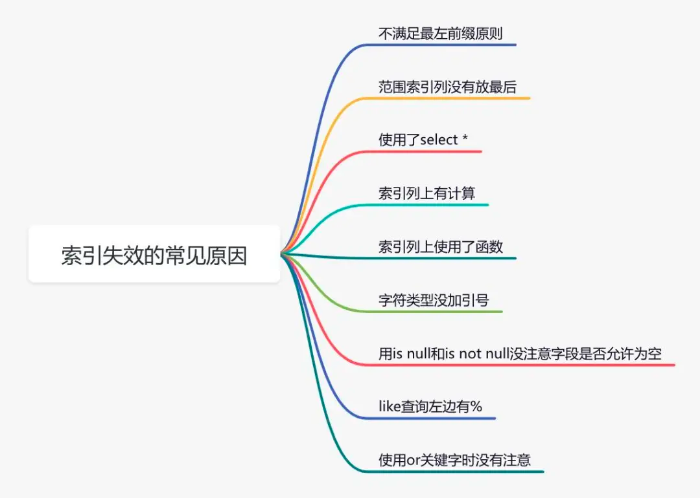

- [Redis请求毛刺](https://mp.weixin.qq.com/s/8l2Qf2vozhCcb9AvvJSBYA)
  
  步骤
  - 首先排查是不是网络问题，查一段时间的 redis slowlog（slowlog 最直接简单）
  - 本地抓包，看日志中 redis 的 get key 网络耗时跟日志的时间是否对的上
  - 查机器负载，是否对的上毛刺时间（弹性云机器，宿主机情况比较复杂）
  - 查 redis sdk，看源码，看实时栈，看是否有阻塞（sdk 用了pool，pool 逻辑是否可能造成阻塞）
    - 源码追踪
    - trace实时栈，看是否有 lock，wait 之类的逻辑
  - 查看 runtime 监控，看是否有协程暴增，看 gc stw 时间是否影响 redis（go 版本有点低，同时内存占用大）；
    - 抓了下线上heap 图，查看历史的gc stw 信息:
      `curl http://localhost:8003/debug/pprof/heap?debug=1`
  - trace ，看调度时间和调度时机是否有问题（并发协程数，GOMAXPROCS cpu负载都会影响调度）
    ```shell
    curl http://127.0.0.1:8080/debug/pprof/trace?seconds=300 > trace.out
    go tool trace trace.out
    ```
    查看goroutine analysis
    - 按 scheduler wait 排序后数据，影响调度的，主要是协程数量和线程数量
    - 线程数查看 `ps -T -p pid`，线程数是200+
    - 将 GOMAXPROC 设置成8，然后重新上线。然后抖动立刻降下来了
    
    原因： 怎么解决获取正确核数的问题？
    - 是设置环境变量 GOMAXPROCS 启动
    - 显式调用 uber/automaxprocs。

- Request无响应
  - 网络正常
    
  - 问题触发：进程要向容器标准输出打印日志 容器引擎重启
    

- 95% percentile request < 5 ms
  - 存储：
    
    问题：一次调用一个用户的三百个特征原方案是用 redis hash 做表，每个 field 为用户的一个特征。由于用户单个请求会获取几百个特征，即使用hmget做合并，存储也需要去多个 slot 中获取数据，效率较低
    
    改进1：把 hash 表的所有 filed 打包成一个 json 格式的 string
    
    改进的问题：若 hash filed 过多，string 的 value 值会很大，（redis 大key）
    
    改进2：
      - 按照类型将特征做细分，比如原来一个 string 里面有 300 的字段，拆分成 3 个有 100 个值的 string 类型。 
      - 对 string val 进行压缩
      - 再加一层cache
  - 代码
    
    分析：pprof 可以看 CPU、内存、协程等信息在压测流量进来时系统调用的各部分耗时情况。而 trace 可以查看 runtime 的情况

    改进：
      - 采用优化的json库
      - string <--> []byte 优化
      - json.Unmarshal 的结果cache，防止多次冗余unmarshal
      - prealloc， slice 与map 预分配大小
    
- [GC pause over 100ms排查](https://mp.weixin.qq.com/s/Lk1EbiT7WprVOyX_dXYMyg)
  - 复现：用ab 50并发构造些请求看看. 网络来回延时60ms, 但是平均处理耗时200多ms, 99%耗时到了679ms
  - GC以及trace： 该进程的runtime信息, 发现内存很少，gc-pause很大，GOMAXPROCS为76，是机器的核数
    `export GODEBUG=gctrace=1`, 重启进程看看. 可以看出gc停顿的确很严重
    ```shell
        curl -o trace.out 'http://ip:port/debug/pprof/trace?seconds=20'
        sz ./trace.out
    ```
  - 原因： 容器中Go进程没有正确的设置GOMAXPROCS的个数, 导致可运行的线程过多, 可能出现调度延迟的问题. 正好出现进入gc发起stw的线程把其他线程停止后, 其被调度器切换出去, 很久没有调度该线程, 实质上造成了stw时间变得很长  
  - Solution: go.uber.org/automaxprocs, 容器中go进程启动时, 会正确设置GOMAXPROCS. 
  - 总结
    - 容器中进程看到的核数为母机CPU核数，一般这个值比较大>32, 导致go进程把P设置成较大的数，开启了很多P及线程
    - 一般容器的quota都不大，0.5-4，linux调度器以该容器为一个组，里面的线程的调度是公平，且每个可运行的线程会保证一定的运行时间，因为线程多, 配额小, 虽然请求量很小, 但上下文切换多, 也可能导致发起stw的线程的调度延迟, 引起stw时间升到100ms的级别，极大的影响了请求
    - 通过使用automaxprocs库, 可根据分配给容器的cpu quota, 正确设置GOMAXPROCS以及P的数量, 减少线程数，使得GC停顿稳定在<1ms了. 且同等CPU消耗情况下, QPS可增大一倍，平均响应时间由200ms减少到100ms. 线程上下文切换减少为原来的1/6
    - 同时还简单分析了该库的原理. 找到容器的cgroup目录, 计算cpuacct,cpu下cpu.cfs_quota_us/cpu.cfs_period_us, 即为分配的cpu核数.

- `free -m`查看free为零，而cache很大

  ```shell
  ps auxw|head -1;ps auxw|sort -rn -k4|head -10
  
  lsof -n|awk '{print $2}'|sort|uniq -c|sort -nr|more
  ```
  - 我们之前遇到过SLAB内存泄露的情况，某公司物理机写了个定时脚本 echo 1 > /proc/sys/vm/drop_caches，会跑满一个核，除此之外没有观测到明显影响，你可以考虑在业务不活跃的情况下试一下。

- 定时器
  - 定时器这块业务早有标准实现：_小顶堆_, _红黑树_ 和 _时间轮_
    - Linux 内核和 Nginx 的定时器采用了 _红黑树_ 实现
    - 长连接系统多采用 _时间轮_
    - Go 使用 _小顶堆_, 四叉堆，比较矮胖，不是最朴素的二叉堆

- [timeout](https://jishuin.proginn.com/p/763bfbd67c63)
  - 案例
    - 一个 python 服务与公网交互，request 库发出去的请求没有设置 timeout ... 而且还是个定时任务，占用了超多 fd
    - 微服务场景下某下游的服务阻塞卡顿，这样会造成他的级联上下游都雪崩了
  - HTTP timeout
  - database
    - Redis 服务端要注意两个参数：timeout 和 tcp-keepalive
      - 其中 timeout 用于关闭 idle client conn, 默认是 0 不关闭，为了减少服务端 fd 占用，建议设置一个合理的值
      - tcp-keepalive 在很早的 redis 版本是不开启的，这样经常会遇到因为网格抖动等原因，socket conn 一直存在，但实际上 client 早己经不存在的情况
      - Redis Client 实现有一个重大问题，对于集群环境下，有些请求会做 Redirect 跳转，默认是 16 次，如果 tcp read timeout 设置了 100ms, 那总时间很可能超过了 1s
    - MySQL 也同样服务端可以设置 MAX_EXECUTION_TIME 来控制 sql 执行时间

- 简述什么是伪分享，如何解决
  - 当多线程拥有各自的变量，且这批变量共享同一个缓存行 cache line，线程更新变量时导致缓存行失效的现象就是伪分享。
  - 详细说明：CPU 缓存的最小单位是缓存行（默认是 64 字节），当 CPU 缓存读取变量时，默认是按照行从内存中读取的，它将读取变量附近的所有变量。这会导致在多核 CPU 下，单个 CPU 核心更新时，会强制其他 CPU 核心也同样更新。
- 内核态和用户态的区别
  - 区别在于运行指令集的权限不一样。内核态运行 CPU 指令集的权限更高（ring 0），用户态运行 CPU 指令集权限更低（ring 3）。所以如果用户态需要操作硬件相关的内容，只能切换到内核态去提高运行 CPU 指令集的权限去运行。
- 什么时候会导致用户态切换到内核态
  - **系统调用**。用户态调用一些内核态提供的接口，用户态主动切换至内核态。比如 redis fork 进程进行 rdb 时就会进行系统调用
  - **异常**。当进程在用户态执行任务的时候，发生一些异常会切换到内核态去处理。比如 redis rdb 时  cow 会触发缺页异常
  - **中断**。外围硬件设备如果处理完请求，就会向 CPU  发出中断信号，让 CPU 暂停执行下一条指令，转到中断信号对应的程序去执行。比如磁盘 IO 读写完成
- 同步/异步、阻塞/非阻塞
  - 同步和异步关注的是调用的消息通知的机制，比如同步是调用后是等到消息返回才结束调用，异步调用后马上结束，等待被调用方异步通知
  - 阻塞和非阻塞关注的是调用时等待消息的状态，指的是调用后没有返回之前的调用者状态
  - 一般来说同步才能去谈阻塞和非阻塞，异步就没有阻塞和非阻塞之分了
- 为什么 MySQL 不建议使用 uuid 作为主键
  - **增大了磁盘 IO**。因为uuid 不是自增的，所以有可能需要读更多的索引页去查找合适的位置。
  - **插入耗时变长**。因为 uuid 不是自增的，导致以 B+ 树为基础的索引树会在插入时，索引节点分裂的概率更高。
  - **内存碎片变多**，根据（2）中说的，分裂的越多，导致页变得稀疏，最终导致数据有碎片。

- 如果请求超时可能的原因有哪些？
  - 应用层代码问题
    - 数据库压力
    - timeout、deadline设置过短
    - 。。。
  - epoll任务分发问题
  - 调度问题 - GMP调度算法
  - GC问题
  - CPU负载高 - cpu metric
  - 内核线程调度 - 调度算法？
  - cgroup throttle问题
  - 网络问题
    - 丢包 - tcp重传时间
    - 错包率导致重传增多
    - 消息乱序 消息在缓冲区积压
  - 交换机背板带宽打满导致消息积压
  - [高并发场景下disk io引发的高时延](http://xiaorui.cc/archives/7229)
    - 发现生产消息的业务服务端因为某 bug ，把大量消息堆积在内存里，在一段时间后，突发性的发送大量消息到推送系统 导致消息时延从 < 100ms 干到 < 3s 左右
    - 主机出现了磁盘 iops 剧烈抖动, iowait 也随之飙高。但问题来了，大家都知道通常来说linux下的读写都有使用 buffer io，写数据是先写到 page buffer 里，然后由内核的 kworker/flush 线程 dirty pages 刷入磁盘，但当脏写率超过阈值 dirty_ratio 时，业务中的write会被堵塞住，被动触发进行同步刷盘。
    - 通过监控的趋势可分析出，随着消息的突增造成的抖动，我们只需要解决抖动就好了。上面有说，虽然是buffer io写日志，但随着大量脏数据的产生，来不及刷盘还是会阻塞 write 调用的。
    
    解决： 异步写
    - 实例化一个 ringbuffer 结构，该 ringbuffer 的本质就是一个环形的 []byte 数组，可使用 Lock Free 提高读写性能；
    - 为了避免 OOM, 需要限定最大的字节数；为了调和空间利用率及性能，支持扩缩容；缩容不要太频繁，可设定一个空闲时间;
    - 启动一个协程去消费 ringbuffer 的数据，写入到日志文件里；
      - 当 ringbuffer 为空时，进行休眠百个毫秒；
      - 当 ringbuffer 满了时，直接覆盖写入。
- [服务 go_cpu 占满如何处理](https://mp.weixin.qq.com/s/343ImRi82NCoLzDWm0iuwg)
  - 如何测试服务连接 MySQL 的问题？在 pod 上，按照 MySQL 客户端连接并执行 SQL语句即可
    ```shell
    
    // centos 使用yum安装mysql 客户端
    yum install mysql-community-client.x86_64 -y
    
    // 登上mysql client
    mysql -h ip -u root -p
    
    // 打开profile 开关
    show variables like "%prof%”
    set profiling = 1; // 0是off，1是on
    
    // 查看语句执行情况
    select count(*) from c_consumer;
    show profiles;
    
    set profiling = 0;
    ```
  - pprof 分析
    - 导入  'net/http/pprof '，并运行   'http server '
      ```go
      import _ "net/http/pprof”
      // 服务启动的时候，在main函数中，另起一个 goroutines 跑一下 http server
      go func() {
         if err := agent.Listen(agent.Options{Addr: "0.0.0.0:6061"}); err != nil {
            log.Println(err)
         }
      }()
      ```
    - 两种方式查看 pprof 分析结果
      - 应用中使用 pprof 中后，使用  ip:port 进入网址查看分析结果 `http://9.145.241.216:8080/debug/pprof/`
      - 使用命令行查看分析结果
        ```shell
        1. 查看堆栈调用信息
        go tool pprof http://9.xxx:8080/debug/pprof/heap
        
        2. 查看 60 秒内的 CPU 信息
        go tool pprof http://9.xxx:8080/debug/pprof/profile?seconds=60
        
        3. 查看 goroutine 阻塞
        go tool pprof http://9.xxx:8080/debug/pprof/block
        
        4. 收集 5 秒内的执行路径
        go tool pprof http://9.xxx:8080/debug/pprof/trace?seconds=5
        
        5. 争用互斥持有者的堆栈跟踪
        go tool pprof http://9.xxx:8080/debug/pprof/mutex
        ```
  - 排查 CPU 占满问题
    - 查看完分析结果后，登录 IDC 环境，执行命令，得到相关日志文件。
      `go tool pprof http://9.xxx:8080/debug/pprof/profile?seconds=60`
    - select default 分支引起的问题。代码的 default 中，只有一个判断项，而且这个一直是 false，未见 true 的条件，所以一直没有 return ，导致 CPU 一直卡在 default 中，无法出去。

- [优化接口性能的办法](https://mp.weixin.qq.com/s/gmPiT_fe0hqfdT_Mjb77LA)
  - 索引
    - 没加索引
    - 索引没生效
      
    - 选错索引 - 使用 force index 来强制查询 SQL 走某个索引
  - SQL 优化
    
  - 远程调用
    - 并行调用
    - 数据异构 - 数据冗余一下
  - 重复调用
    - 循环查数据库 - 批量查询
    - 死循环
  - 数据库分布式锁
  - 分页处理
  - 锁粒度
  - 异步处理
    - 线程池
    - MQ
  - 缓存
  - 分库分表
  - 监控metric 以及 trace
- [Nginx Buffer 机制引发的下载故障](https://ms2008.github.io/2021/04/08/nginx-buffer/)
  - issue
    - 内网通过 Nginx 代理下载 OSS 的大文件时，老是会断，而在服务器上下载时却很正常，非常奇怪。
  - 在 Nginx 代理过程中，有两种连接：
    - 客户端到 Nginx 的连接
    - Nginx 到后端服务器的连接
    - 当启用 buffer 时，Nginx 将会临时存储后端响应内容在内存或者磁盘上，然后慢慢把数据推送给客户端；若关闭，则会按照响应内容的多少立刻同步到客户端。
  - 大文件下载问题
    - Nginx Buffer 机制默认处于开启状态，其会根据 proxy_buffer_size 和 proxy_buffers 这两个参数控制写入内存的大小。
    - 如果响应大于这个 buffer 大小，Nginx 会继续通过 proxy_max_temp_file_size 参数将响应其余部分写入到磁盘临时文件。
    - 那么问题来了，如果响应还是很大，超过了临时文件的限额怎么办？
      - 此时，Nginx 的 socket 缓冲区也是出于满载状态。由于客户端很慢，Nginx 并没有触发 `read` 后端操作。这里大概率会触发后端服务器的 `write` 超时，进而由后端发起 `close` 操作。
    - 问题：proxy_max_temp_file_size 默认为 1G，当客户端的网络比较慢时，临时文件很快就被写满。这时候后端的响应还会继续被接收到 socket 缓冲区，直到缓冲区被打满。此时，Nginx 所在服务器通过滑动窗口 zero 0 告知后端服务器停止发送数据，直至触发了后端的 write 超时。
  - 如何解决？
    - 调整 proxy_max_temp_file_size 大小
      - 调大 让临时文件足够可以缓冲整个响应
      - 调小 让整个链路上的数据流动起来，不要阻塞后端的 write 操作，进而触发后端的超时
- [内存泄漏-原因、避免以及定位](https://mp.weixin.qq.com/s/rDEqEr_KoIx3rRakxolDxw)
  - std::string能否被继承，为什么？
    - 继承需要父类析构函数为virtual. 不能，因为std::string的析构函数不为virtual，这样会引起内存泄漏。
  - 智能指针
    - unique_ptr是限制最严格的一种智能指针，用来替代之前的auto_ptr，独享被管理对象指针所有权。当unique_ptr对象被销毁时，会在其析构函数内删除关联的原始指针
    - unique_ptr是独占管理权，而shared_ptr则是共享管理权，即多个shared_ptr可以共用同一块关联对象，其内部采用的是引用计数
    - weak_ptr的出现，主要是为了解决shared_ptr的循环引用，其主要是与shared_ptr一起来私用。和shared_ptr不同的地方在于，其并不会拥有资源，也就是说不能访问对象所提供的成员函数，不过，可以通过weak_ptr.lock()来产生一个拥有访问权限的shared_ptr。
  
- iowait
  - 如果系统处于 iowait 状态，那么必须满足以下两个条件：
    - 系统中存在等待 I/O 请求完成的进程。
    - 系统当前正处于空闲状态，也就是说没有可运行的进程。
  - iowait统计原理
    - Linux 会把 iowait 占用的时间输出到 /proc/stat 文件中，我们可以通过一下命令来获取到 iowait 占用的时间
    - cat /proc/stat | grep "cpu " | awk '{print $5}'
    - 可以每隔一段时间读取一次 /proc/stat 文件，然后把两次获取到的 iowait 时间进行相减，得到的结果是这段时间内，CPU处于 iowait 状态的时间。接着再将其除以总时间，得到 iowait 占用总时间的比率。
  - iowait的影响
    - iowait 会导致 CPU 空闲，从而导致系统的吞吐量下降。
    - iowait 会导致系统的响应时间变长，从而导致系统的延迟增大。
    - iowait 会导致系统的 CPU 利用率下降，从而导致系统的资源利用率下降。
    - iowait 会导致系统的负载升高，从而导致系统的负载变大。

- [Linux Performance Analysis](https://netflixtechblog.com/linux-performance-analysis-in-60-000-milliseconds-accc10403c55)
  - USE Method: a methodology for locating performance bottlenecks. This involves checking utilization, saturation, and error metrics for all resources (CPUs, memory, disks, e.t.c.)
  - uptime
    - 检查系统平均负载
    - 负载的平均值显示 1 分钟为 30，比 15 分钟的 19 相比增长较多。有很多原因会导致负载的增加，也许是 CPU 不够用了；vmstat 或者 mpstat 可以进一步确认问题在哪里。
  - dmesg | tail
    - 我们主要找一下有没有一些系统错误会导致性能的问题。
  - vmstat 1
    - vmstat 展示了虚拟内存、cpu 的一些情况，以及系统的运行进程。
  - mpstat -P ALL 1
    - 这个命令把每个 CPU 的时间都打印出来，可以看看 CPU 对任务的处理是否均匀。比如，如果某一单个 CPU 使用率很高的话，说明这是一个单线程应用
  - pidstat 1
    - pidstat 会打印出每个进程的 CPU 使用率，内存使用率，I/O 等情况。这个命令可以帮助我们找到 CPU 使用率高的进程，然后再用 strace 或者 perf 来进一步分析。
  - iostat -xz 1
    - iostat 是理解块设备（磁盘）的当前负载和性能的重要工具
    - 较差的磁盘 IO 性能并不一定意味着应用程序会有问题。应用程序可以有许多方法执行异步 IO，而不会阻塞在 IO 上面；应用程序也可以使用诸如预读取，写缓冲等技术降低 IO 延迟对自身的影响
  - free -m
  - sar -n DEV 1
    - 这个工具可以查看网络接口的吞吐量：rxkB/s 和 txkB/s 可以测量负载，也可以看是否达到网络流量限制了。
  - sar -n TCP,ETCP 1
  - top

- 节省了30%的CPU
  - 使用top命令定位出占用CPU最高的进程，定位到进程后在使用  `top -Hp pid` 命令， 查看占用 CPU 最高的线程
  - 为了搞清楚BgMoveProcPool线程到底在执行什么，使用`pstack pid`命令抓取此时的堆栈
- 线上超时问题
  - 第一时间先ping下，看看网络间耗时
  - curl来分析各个阶段的耗时 curl  -o /dev/null -s -w %{time_namelookup}::%{time_connect}::%{time_starttransfer}::%{time_total}::%{speed_download}"\n" --data-binary @req.dat https://www.baidu.com
  - 通过tcpdump抓包来分析 对方返回了http 204
  - 发现超时的该家较正常的三方返回，多了Content-Length、Content-Type等字段
  - 在http 204、304的时候，不允许返回Content-Length，那么如果返回了Content-Length，客户端会一直等待，直到超时
- 消息队列堆积的问题排查
  - 排查流程
    - 该机器消费速度太慢?
      - 火焰图并没有明显的“平顶效应”，火焰的宽度都比较窄，也可说明该机器在执行业务逻辑时中并没有明显的耗时卡点，由此也可证明该机器并不是因为业务处理慢而造成的堆积
      - 发现 CPU、MEM、LOAD 均正常，且与正常机器相近，没有发现明显线索
    - MQ 数据倾斜
      - MQ 默认 shuffle 策略为：把消息均分到各个 queue 中。因此，可排除因为 MQ 发送消息数据倾斜，导致我们那台 Proxy 机器堆积的可能性。
    - CPU steal
      - 排查发现，st 正常，排除这种可能
    - 找到线索：MQ 消费位点没变
      - 通过定向搜索卡住机器的 queueId，发现这个队列的消费位点长时间不推进，一直卡在某个位置
      - MQ 拉消息的机制是，拉到的消息会先存放在内存中容量为 1000 的 cache 中，然后这些内存中的消息将被消费者线程消费。当 cache 满了时，就不会再从 queue 中拉取
      - 怀疑：是否因为 Proxy 消费停止 or 消费极慢，导致本地缓存一直是满的，于是 MQ 会停止向 queue 中拉消息，于是 offset 一直没变
    - 找到根因：某个消费者线程卡住了
      - 对于本地缓存中的消息，MQ 会开多线程（线程数量由用户指定）去拉取消费。且为了保证消息不丢失，offset 记录的只是最靠前的那条消息
      - 假如这台 Proxy 机器的众多 MQ 消费者线程中有任意一个被卡住，那么整个 queue 的消费位点将永远停留在被卡住的消息对应的 offset。此时虽然其他线程都在持续正常消费，但并不能往前推进 offset。另一方面，由于上游还在源源不断往队列中发消息，于是消息只进不出，堆积量 = 最新入口消息的offset - 消费位点offset只增不减，体现在控制台上就是堆积越来越严重！
      - 目前代码中只设置了 socket timeout，没设置 connection timeout，因此怀疑上面那些请求直接卡在了前面的 connect 阶段，而又由于没设置 connect 超时
  - 根因
    - 个别机器堆积：该机器有消费线程被卡住，虽然其余线程正常消费，但 MQ 机制决定消费位点并不前进；
    - HTTP 下载卡住：所使用的 HttpClient 版本有 bug，特定情况下超时不生效，可能导致线程一直卡住；


