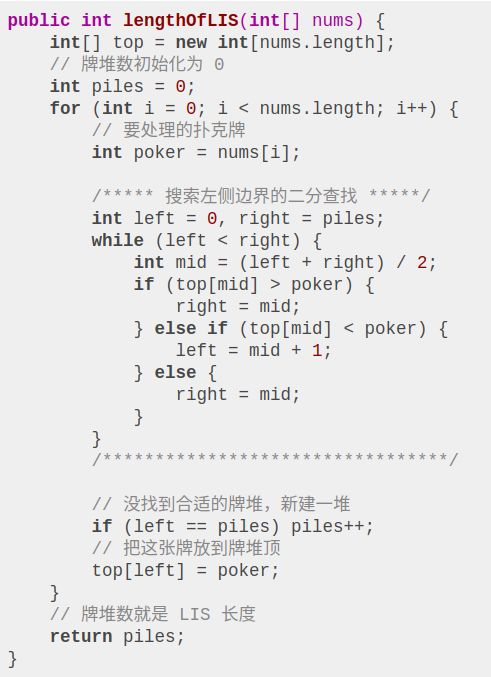
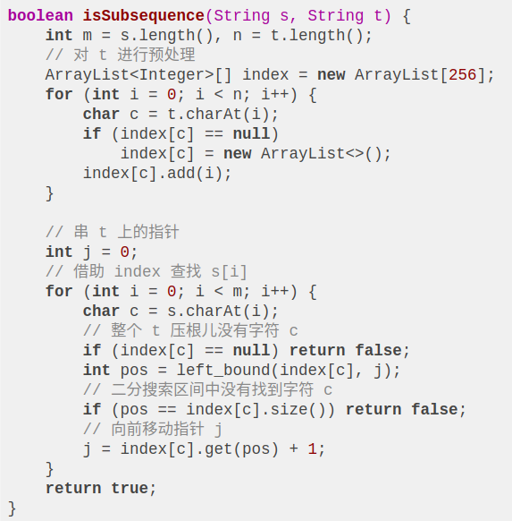

- [LeetCode summary](https://blog.algomooc.com/)
  - [LeetCode was HARD until I Learned these 20 Patterns ](https://x.com/ashishps_1/article/2012864271773016266)
- [X (Twitter) For You 推荐算法深度技术解析](https://mp.weixin.qq.com/s/-EB5-4I7iE6WRA1Q721_QQ)
- [第 N 个数](https://mp.weixin.qq.com/s/YaJ0nf7Y0juf6YTpVrV34g)
  - 给你一个整数 n ，请你在无限的整数序列 [1, 2, 3, 4, 5, 6, 7, 8, 9, 10, 11, ...] 中找出并返回第 n 位上的数字
  - 思路
    - 1、先找出 n 是落在长度为多少的数字上：`n = n - 9 * 1 * 1 - 9 * 10 * 2 - 9 * 100 * 3 - 9 * 1000 * 4 ...` 
    - 2、再找出 n 落在哪个数字上： `curNum = 10^(len-1) + ( n - 1 ) / len`
    - 3、再找出 n 落在这个数字的第几位
     ```c++
     class Solution {
         public int findNthDigit(int n) {
             if ( n < 10 ) return n;
             // len 表示数字的长度，即位数
             // 比如数字 123 长度为 3 ，即位数为 3 
             // 比如数字 5678 长度为 4 ，即位数为 4 
             int len = 1;
     
             // weight 表示数字所在的位数的数字的权重
             // 比如长度为 2 的数字的权重是 10
             // 比如长度为 3 的数字的权重是 100
             // 即 10^(len-1)
             int weight = 1;
     
             // 1、先找出 n 是落在长度为多少的数字上
             // 公式就是：n =  n - 9 * 1 * 1 - 9 * 10 * 2 - 9 * 100 * 3 - 9 * 1000 * 4 ... 
             // 直到在减的过程中发现 n 再去剪后面的数字为变成负数为止。
             // 由于 n 会很大，避免溢出，转一下类型
             while( n >  9 * len * (long)weight ){
                 // 公式就是：n =  n - 9 * 1 * 1 - 9 * 10 * 2 - 9 * 100 * 3 - 9 * 1000 * 4 ... 
                 n = n - 9 * len * weight ;
                  
                 // 数字的位数在不断增加
                 len += 1;
                 // 数字的权重也在不断增加
                 weight *= 10;
             }
             // 2、再找出 n 落在哪个数字上
             int curNum = weight + (n - 1 ) / len ;
             // 3、再找出 n 落在这个数字的第几位
             int count  =  (n - 1) % len;
             // 4、最后计算出这个数位来
             return (curNum / (int) Math.pow(10,len - count - 1 )) % 10;
         }
     }
     ```
- [环形链表](https://mp.weixin.qq.com/s/MLGauAOe2fpq1d18A69naQ)
  - 当 slow = 1 ， fast = 2 ，为什么 fast 和 slow 一定会相遇？
    - 1、假设，fast 在 slow 后方一个节点的位置，那么它们都跳一次之后，fast 和 slow 相遇了。
    - 2、假设，fast 在 slow 后方两个节点的位置，那么它们都跳一次之后，fast 和 slow 的距离缩短为 1，变成了上述假设 1 的问题，可以相遇。
    - 3、假设，fast 在 slow 后方 N 个节点的位置，那么它们都跳一次之后，fast 和 slow 的距离缩短为 N - 1，每条一次，都可以缩短一个单位，不断缩短，最终变成上述的假设 1。
    - 所以，fast 和 slow 一定会相遇。
  - 当 slow = 1 ， fast = 2 ，fast 和 slow 相遇时，slow 指针是否绕环超过一圈？
    - 当 slow 跑完一圈来到起始位置节点 2 时，由于 fast 速度是 slow 的两倍，那么 fast 必然跑了两圈也来到起始位置节点 2 ，两者相遇。
    - 而此时，fast 在 slow 的前方位置，意味着两者的距离是小于一个完整的环的节点数的，说明 fast 可以更快的追上 slow。
  - slow 和 fast 的移动步数有什么规则？
    - 只需要两者的步数不一致就行。
  - 能否设置为 slow 每次移动 1 步，fast 每次移动  3、4、5...步？
    - 假设环的周长为整数 L，slow 每次走 a 步，fast 每次走 b 步，a ≠ b。
    - 进入环后开始统计，相遇时两者都走了 t 次，如果把环拉成一根直线，相当于 fast 在距离 slow 为 t * (b – a ) 这样远的距离开始追击，每次追近 b – a 步，追了 t 次追上了。
    - 那么 t * (b – a ) / L 就是 fast 需要跑多少圈才能追上 slow 并刚好相遇的答案。
    - n 表示圈数，为整数才合理。
    - 因为如果 n 不是整数，代表 fast 和 slow 不在某个节点相遇，而是在节点与节点之间的位置相遇了。也就是说 n = t * (b – a ) / L 。
    - 很显然，L 为常数值，(b – a ) 为常数值，必然可以找到 t，使得 t * (b – a ) 是 L 的倍数。
  - 为什么设置 slow = 1 ， fast = 2 
    - 由于 n = t * (b – a ) / L 。
    - 则 n 越小越合适，也就是希望 t * (b – a ) 越小，希望 b – a 越小，因为 b 和 a 才是我们可以控制的。
    - 由此 b – a = 1 是一个最小的答案，即 fast 和 slow 相差一步最合理。
- [重排链表]
  - 给定一个单链表 L：L0→L1→…→Ln-1→Ln， 将其重新排列后变为：`L0→Ln→L1→Ln-1→L2→Ln-2→...
  - 找链表的中点
  - 反转链表
  - 合并链表
    ```c++
    public void reorderList(ListNode head) {
        if (head == null || head.next == null) {
            return;
        }
    
        // 步骤 1: 通过快慢指针找到链表中点
        // 通过调节快慢指针的起始位置，可以保证前半部分的长度大于等于后半部分
        ListNode slow = head, fast = head.next;
        while (fast != null && fast.next != null) {
            slow = slow.next;
            fast = fast.next.next;
        }
    
        // 步骤 2: 反转后半部分的链表
        // 在反转之前需要的一个操作是将前后半部分断开
        ListNode second = slow.next;
        slow.next = null;
        second = reverseList(second);
    
        // 步骤 3: 合并前半部分链表以及反转后的后半部分链表
        mergeList(head, second);
    }
    
    private ListNode reverseList(ListNode head) {
        ListNode prev = null, tmp = null, pointer = head;
        while (pointer != null) {
            tmp = pointer.next;
            pointer.next = prev;
            prev = pointer;
            pointer = tmp;
        }
    
        return prev;
    }
    
    private void mergeList(ListNode first, ListNode second) {
        ListNode dummy = new ListNode(0);
        ListNode pointer = dummy;
    
        while (first != null && second != null) {
            pointer.next = first;
            first = first.next;
            pointer.next.next = second;
            second = second.next;
            pointer = pointer.next.next;
        }
    
        // 因为我们之前找中点的时候保证了前半部分的长度不小于后半部分的长度
        // 因此交叉后，多出来的部分只可能是前半部分，判断前半部分即可
        if (first != null) {
            pointer.next = first;
        }
    }
    ```
- [数组遍历题](https://mp.weixin.qq.com/s/57lf24oMyNIwBxV2kuW9cg)
  - 给定一个包含 n + 1 个整数的数组 nums，其数字都在 1 到 n 之间（包括 1 和 n），可知至少存在一个重复的整数。假设只有一个重复的整数，找出这个重复的数。
    - 不能更改原数组（假设数组是只读的）。
    - 只能使用额外的 O(1) 的空间。
    - 时间复杂度小于 O(n^2) 。
    - 数组中只有一个重复的数字，但它可能不止重复出现一次。
  - 解析
    - 不能改变数组 导致无法排序，也无法用 index 和元素建立关系；
    - 只能使用 O(1) 的空间 意味着使用哈希表去计数这条路也走不通；
    - 时间复杂度必须小于 O(n^2) 表示暴力求解也不行；
    - 重复的元素可重复多次 这一条加上后，本来可以通过累加求和然后做差 sum(array) - sum(1,2,...,n) 的方式也变得不可行。
  - Deep dive
    - 什么样的算法可以不使用额外的空间解决数组上面的搜索问题？ - 二分查找
    - 二分法的使用 并不一定 需要在排序好的数组上面进行，不要让常见的例题限制了你的思路，二分法还有一个比较高级的用法叫做 按值二分。
      - 如果选中的数 小于 我们要找的答案，那么整个数组中小于或等于该数的元素个数必然小于或等于该元素的值;
      - 如果选中的数 大于或等于 我们要找的答案，那么整个数组中小于或等于该数的元素个数必然 大于 该元素的值
    - 另外一种 O(n) 的解法借鉴快慢指针找交点的思想
  - Code
    ```c++
    //二分查找
    class Solution {
        public int findDuplicate(int[] nums) {
             int len = nums.length;
            int start = 1;
            int end = len - 1;
    
            while (start < end) {
                int mid = start + (end - start) / 2;
                int counter = 0;
                for (int num:nums) {
                    if (num <= mid) {
                        counter++;
                    }
                }
                if (counter > mid) {
                    end = mid;
                } else {
                    start = mid + 1;
                }
            }
            return start;
        }
    }
    ```
    ```c
    //快慢指针
    public int findDuplicate(int[] nums) {        
        int fast = nums[nums[0]];
        int slow = nums[0];
    
        while (fast != slow) {
            fast = nums[nums[fast]];
            slow = nums[slow];
        }
    
        slow = 0;
        while (fast != slow) {
            fast = nums[fast];
            slow = nums[slow];
        }
    
        return slow;
    }
    ```
- [数组双指针](https://mp.weixin.qq.com/s/Z-oYzx9O1pjiym6HtKqGIQ)
  - 双指针技巧在处理数组和链表相关问题时经常用到，主要分为两类：左右指针和快慢指针。
  - 数组问题中比较常见且难度不高的的快慢指针技巧，是让你原地修改数组
    - 删除有序数组中的重复项（简单）
    - 删除排序链表中的重复元素（简单）
    - 移除元素（简单）
      ```shell
      int removeElement(int[] nums, int val) {
          int fast = 0, slow = 0;
          while (fast < nums.length) {
              if (nums[fast] != val) {
                  nums[slow] = nums[fast];
                  slow++;
              }
              fast++;
          }
          return slow;
      }
      ```
    - 移动零（简单）- 题目让我们将所有 0 移到最后，其实就相当于移除nums中的所有 0，然后再把后面的元素都赋值为 0 即可。
    - [滑动窗口算法核心框架详解](https://mp.weixin.qq.com/s?__biz=MzAxODQxMDM0Mw==&mid=2247485141&idx=1&sn=0e4583ad935e76e9a3f6793792e60734&scene=21#wechat_redirect)
      ```shell
      /* 滑动窗口算法框架 */
      void slidingWindow(string s, string t) {
          unordered_map<char, int> need, window;
          for (char c : t) need[c]++;
      
          int left = 0, right = 0;
          int valid = 0; 
          while (right < s.size()) {
              char c = s[right];
              // 右移（增大）窗口
              right++;
              // 进行窗口内数据的一系列更新
      
              while (window needs shrink) {
                  char d = s[left];
                  // 左移（缩小）窗口
                  left++;
                  // 进行窗口内数据的一系列更新
              }
          }
      }
      ```
  - 左右指针的常用算法
    - 二分查找
    - 反转字符串（简单）
    - 两数之和 II - 输入有序数组（中等）
    - 最长回文子串（中等）
      ```shell
      for 0 <= i < len(s):
          找到以 s[i] 为中心的回文串
          找到以 s[i] 和 s[i+1] 为中心的回文串
          更新答案
      ```
- [nSum问题](https://mp.weixin.qq.com/s?__biz=MzAxODQxMDM0Mw==&mid=2247485789&idx=1&sn=efc1167b85011c019e05d2c3db1039e6&scene=21#wechat_redirect)
  - twoSum 问题
    - 暴力
    - hashmap
    - 先对 nums 排序，然后利用前文「双指针技巧汇总」写过的左右双指针技巧，从两端相向而行就行了
  - 魔改题目
    - nums 中可能有多对儿元素之和都等于 target，请你的算法返回所有和为 target 的元素对儿，其中不能出现重复。
      比如说输入为 nums = [1,3,1,2,2,3], target = 4，那么算法返回的结果就是：[[1,3],[2,2]]
      ```c++
      vector<vector<int>> twoSumTarget(vector<int>& nums, int target) {
          // nums 数组必须有序
          sort(nums.begin(), nums.end());
          int lo = 0, hi = nums.size() - 1;
          vector<vector<int>> res;
          while (lo < hi) {
              int sum = nums[lo] + nums[hi];
              int left = nums[lo], right = nums[hi];
              if (sum < target) {
                  while (lo < hi && nums[lo] == left) lo++;
              } else if (sum > target) {
                  while (lo < hi && nums[hi] == right) hi--;
              } else {
                  res.push_back({left, right});
                  while (lo < hi && nums[lo] == left) lo++;
                  while (lo < hi && nums[hi] == right) hi--;
              }
          }
          return res;
      }
      ```
  - 3Sum 4Sum nSum
    ```go
    /* 注意：调用这个函数之前一定要先给 nums 排序 */
    vector<vector<int>> nSumTarget(
        vector<int>& nums, int n, int start, int target) {
    
        int sz = nums.size();
        vector<vector<int>> res;
        // 至少是 2Sum，且数组大小不应该小于 n
        if (n < 2 || sz < n) return res;
        // 2Sum 是 base case
        if (n == 2) {
            // 双指针那一套操作
            int lo = start, hi = sz - 1;
            while (lo < hi) {
                int sum = nums[lo] + nums[hi];
                int left = nums[lo], right = nums[hi];
                if (sum < target) {
                    while (lo < hi && nums[lo] == left) lo++;
                } else if (sum > target) {
                    while (lo < hi && nums[hi] == right) hi--;
                } else {
                    res.push_back({left, right});
                    while (lo < hi && nums[lo] == left) lo++;
                    while (lo < hi && nums[hi] == right) hi--;
                }
            }
        } else {
            // n > 2 时，递归计算 (n-1)Sum 的结果
            for (int i = start; i < sz; i++) {
                vector<vector<int>> 
                    sub = nSumTarget(nums, n - 1, i + 1, target - nums[i]);
                for (vector<int>& arr : sub) {
                    // (n-1)Sum 加上 nums[i] 就是 nSum
                    arr.push_back(nums[i]);
                    res.push_back(arr);
                }
                while (i < sz - 1 && nums[i] == nums[i + 1]) i++;
            }
        }
        return res;
    }
    ```
- [单链表的六大解题套路](https://mp.weixin.qq.com/s?__biz=MzAxODQxMDM0Mw==&mid=2247492022&idx=1&sn=35f6cb8ab60794f8f52338fab3e5cda5&scene=21#wechat_redirect)
  - 合并两个有序链表
  - 合并k个有序链表 
    - 用到 优先级队列（二叉堆） 这种数据结构，把链表节点放入一个最小堆，就可以每次获得k个节点中的最小节点
    - 优先队列pq中的元素个数最多是k，所以一次poll或者add方法的时间复杂度是O(logk)；所有的链表节点都会被加入和弹出pq，所以算法整体的时间复杂度是O(Nlogk)，其中k是链表的条数，N是这些链表的节点总数。
  - 寻找单链表的倒数第k个节点
  - 寻找单链表的中点
  - 判断单链表是否包含环并找出环起点
    - 我们假设快慢指针相遇时，慢指针slow走了k步，那么快指针fast一定走了2k步：
    - fast一定比slow多走了k步，这多走的k步其实就是fast指针在环里转圈圈，所以k的值就是环长度的「整数倍」。
    - 假设相遇点距环的起点的距离为m，那么结合上图的 slow 指针，环的起点距头结点head的距离为k - m，也就是说如果从head前进k - m步就能到达环起点。
    - 巧的是，如果从相遇点继续前进k - m步，也恰好到达环起点。因为结合上图的 fast 指针，从相遇点开始走k步可以转回到相遇点，那走k - m步肯定就走到环起点了：
  - 判断两个单链表是否相交并找出交点
    - 直接的想法可能是用HashSet记录一个链表的所有节点，然后和另一条链表对比，但这就需要额外的空间。
    - 我们可以让p1遍历完链表A之后开始遍历链表B，让p2遍历完链表B之后开始遍历链表A，这样相当于「逻辑上」两条链表接在了一起。
- [二分查找的妙用]()
  - [最长递增子序列](https://mp.weixin.qq.com/s?__biz=MzAxODQxMDM0Mw==&mid=2247484498&idx=1&sn=df58ef249c457dd50ea632f7c2e6e761&source=41#wechat_redirect)
    - 最长递增子序列（Longest Increasing Subsequence，简写 LIS）
    - 比较容易想到的是动态规划解法(动态规划的核心设计思想是数学归纳法)，时间复杂度 O(N^2)
      - dp[i] 表示以 nums[i] 这个数结尾的最长递增子序列的长度
      - dp 数组应该全部初始化为 1，因为子序列最少也要包含自己，所以长度最小为 1
        ```go
        for i := 0; i < len(nums); i++ {
            for j := 0; i < i; j++ {
                if nums[j] < nums[i] {
                    dp[i] = max(dp[i], dp[j] + 1)
                }   
            }
        }
        ```
    - [二分查找解法](https://mp.weixin.qq.com/s?__biz=MzAxODQxMDM0Mw==&mid=2247484507&idx=1&sn=36b8808fb8fac0e1906493347d3c96e6&source=41#wechat_redirect)
      - patience game 的纸牌游戏有关，甚至有一种排序方法就叫做 patience sorting
        - 只能把点数小的牌压到点数比它大的牌上。如果当前牌点数较大没有可以放置的堆，则新建一个堆，把这张牌放进去。如果当前牌有多个堆可供选择，则选择最左边的堆放置。
        - 按照上述规则执行，可以算出最长递增子序列，牌的堆数就是我们想求的最长递增子序列的长度
      - 我们只要把处理扑克牌的过程编程写出来即可。每次处理一张扑克牌不是要找一个合适的牌堆顶来放吗，牌堆顶的牌不是有序吗，这就能用到二分查找了：用二分查找来搜索当前牌应放置的位置
      
  - [判定子序列](https://mp.weixin.qq.com/s?__biz=MzAxODQxMDM0Mw==&mid=2247484479&idx=1&sn=31a3fc4aebab315e01ea510e482b186a&source=41#wechat_redirect)
    - 如何判定字符串s是否是字符串t的子序列
    - 利用双指针i, j分别指向s, t，一边前进一边匹配子序列
      ```go
      bool isSubsequence(string s, string t) {
          int i = 0, j = 0;
          while (i < s.size() && j < t.size()) {
              if (s[i] == t[j]) i++;
              j++;
          }
          return i == s.size();
      }
      ```
    - 如果给你一系列字符串s1,s2,...和字符串t，你需要判定每个串s是否是t的子序列（可以假定s相对较短，t很长）
    - 二分思路主要是对t进行预处理，用一个字典index将每个字符出现的索引位置按顺序存储下来
      - 现在借助index中记录的信息，可以二分搜索index[c]中比 j 大的那个索引，寻找左侧边界的二分搜索就可以做到
    - 
- [正则表达式匹配](https://mp.weixin.qq.com/s/kxVGNAc3UDt9VjsNodgBug)
  - 给你一个字符串 s 和一个字符规律 p，请你来实现一个支持 '.' 和'*' 的正则表达式匹配。
    - 两个隐含条件
    - 一个就是 * 不会出现在字符串的开头
    - 另外一个是 * 前面不能是 *，比如 "a * * b" 就不行
  - 递归暴力求解
    - 递归方式的暴力深度优先搜索求解方法往往是搜索问题的万金油，这里你只需要简单的考虑两件事情，一是这个问题是否可以划分为子问题，二是每个子问题有几种状态，就是在当前考虑的问题下，一共有多少种可能性。
    - 当前的子问题是 s[i,…n] 和 p[j…m]:
    - s[i] == p[j]，子问题成立与否取决于子问题 s[i+1,…n] 和 p[j+1,…m]
    - p[j] == '.'，子问题成立与否取决于子问题 s[i+1,…n] 和 p[j+1,…m]
    - p[j+1] == '*'，s[i] != p[j]，子问题成立与否取决于子问题 s[i,…n] 和 p[j+2,…m]
    - p[j+1] == '*'，s[i] == p[j]，子问题成立与否取决于子问题 s[i+1,…n] 和 p[j,…m]
      ```go
          public boolean isMatch(String s, String p) {
          if (s.equals(p)) {
              return true;
          }
      
          boolean isFirstMatch = false;
          if (!s.isEmpty() && !p.isEmpty() && (s.charAt(0) == p.charAt(0) || p.charAt(0) == '.')) {
              isFirstMatch = true;
          }
      
          if (p.length() >= 2 && p.charAt(1) == '*') {
              // 看 s[i,...n] 和 p[j+2,...m] 或者是 s[i+1,...n] 和 p[j,...m]
              return isMatch(s, p.substring(2))
                       || (isFirstMatch && isMatch(s.substring(1), p));
          }
      
          // 看 s[i+1,...n] 和 p[j+1,...m]
          return isFirstMatch && isMatch(s.substring(1), p.substring(1));
         }
      ```
  - 记忆化搜索
    - 我们假设当前问题是考虑 s 的第 i 个字母，p 的第 j 个字母，所以这时的子问题是 s[0…i] 和 p[0…j] 是否匹配：
    - p[j] 是字母，并且 s[i] == p[j]，当前子问题成立与否取决于子问题 s[0…i-1] 和 p[0…j-1] 是否成立
    - p[j] 是 '.'，当前子问题成立与否取决于子问题 s[0…i-1] 和 p[0…j-1] 是否成立
    - p[j] 是字母，并且 s[i] != p[j]，当前子问题不成立
    - p[j] 是 '*'，s[i] == p[j - 1]，或者 p[j - 1] == '.'， 当前子问题成立与否取决于子问题 s[0…i-1] 和 p[0…j] 是否成立
    - p[j] 是 '*'，s[i] != p[j - 1]，当前子问题正确与否取决于子问题 s[0…i] 是否匹配 p[0,…j-2]
  - 动态规划

- [算法时空复杂度分析实用指南](https://mp.weixin.qq.com/s/OQAzopRncZe5cb9_of4mCQ)
  - Big O 表示法的几个基本特点
    - 只保留增长速率最快的项，其他的项可以省略。
    - Big O 记号表示复杂度的「上界」
      - 动态规划核心框架 中讲到的凑零钱问题的暴力递归解法
      - 我们先求一下这棵递归树上的节点个数. 
      - 这棵树的高度有多高？不知道，那就按最坏情况来处理，假设全都是面额为 1 的硬币，这种情况下树高为N。
      - 这棵树的结构是什么样的？不知道，那就按最坏情况来处理，假设它是一棵满K叉树好了。
      - 那么，这棵树上共有多少节点？都按最坏情况来处理，高度为N的一棵满K叉树，其节点总数为K^N - 1，用 Big O 表示就是O(K^N)。
  - 非递归算法中的时间复杂度分析。
  - 数据结构 API 的效率衡量方法（摊还分析）。
    - 如果想衡量数据结构类中的某个方法的时间复杂度，不能简单地看最坏时间复杂度，而应该看摊还（平均）时间复杂度
    - 特殊数据结构：单调队列 实现的单调队列类：
    - 给你一个空的MonotonicQueue，然后请你执行N个push, pop组成的操作序列，请问这N个操作所需的总时间复杂度是多少？
    - 因为这N个操作最多就是让O(N)个元素入队再出队，每个元素只会入队和出队一次，所以这N个操作的总时间复杂度是O(N)。
    - 那么平均下来，一次操作的时间复杂度就是O(N)/N = O(1)，也就是说push和pop方法的平均时间复杂度都是O(1)。
  - 递归算法的时间/空间复杂度的分析方法，
    - 递归算法的时间复杂度 = 递归树的节点个数 x 每个节点的时间复杂度
    - 递归算法的空间复杂度 = 递归树的高度 + 算法申请的存储空间
      ```shell
        递归的次数 x 函数本身的时间复杂度
      = 递归树节点个数 x 每个节点的时间复杂度
      = 状态个数 x 计算每个状态的时间复杂度
      = 子问题个数 x 解决每个子问题的时间复杂度
      = O(N) * O(K)
      = O(NK)
      ```
- [如何在 100 亿数据中找到中位数](https://mp.weixin.qq.com/s/XmsSgGop7TT_RQvXyp1kGA)
  - 桶排序
    - 根据桶中元素的个数，计算出中位数所在的桶（比如 100 亿个数据，第 1 个桶到第 18 个桶一共有 49 亿个数据，第 19 个桶有 2 亿数据，那么中位数一定在第 19 个桶中），然后针对该桶进行排序，就可以求出海量数据中位数的值（如果内存还是不够，可以继续对这个桶进行拆分；或者直接用 BitMap 来排序）
  - 分治法 + 基于二进制比较
    - 假设这 100 亿数据都是 int 类型，4 字节（32 位）的有符号整数，存在一个超大文件中。
    - 将每个数字用二进制表示，比较二进制的【最高位】 (第 32 位)，如果数字的最高位为 0，则将这个数字写入 file_0 文件中；如果最高位为 1，则将该数字写入 file_1 文件中。
    - 将 file_0 文件依次读一部分到内存，将每个数字用二进制表示，比较二进制的【次高位】（第 31 位），如果数字的次高位为 0，写入 file_0_0 文件中；如果次高位为 1 ，写入 file_0_1 文件中。
- [位操作 - 最高位非零置位]()
  ```go
  func BitTest(x int) int {
  	y := -x & x     //Extracts lowest set bit, 1110 0101 -> 0000 0001
  	y = (x + 1) & x //Will clear the trailing ones, 1110 0101 - > 1110 0100
  	y = (x - 1) | x //Will set the trailing zeros, 0110 0100 - > 0110 0111
  
  	return y
  }
  
  /*
  First calculate the mask of all the bits that aren't the leading zeroes, by "spreading" the bits downwards:
  
  uint64_t m = x | (x >> 1);
  m |= m >> 2;
  m |= m >> 4;
  m |= m >> 8;
  m |= m >> 16;
  m |= m >> 32;
  Then set all the bits that that mask doesn't cover:
  
  return x | ~m;
  */
  ```
- [流式数据计算出topk]
  - [Lossy Counting](https://micvog.files.wordpress.com/2015/06/approximate_freq_count_over_data_streams_vldb_2002.pdf)
  - [Count-Min Sketch](http://dimacs.rutgers.edu/~graham/pubs/papers/cmencyc.pdf)
  - [HeavyKeeper](https://www.usenix.org/system/files/conference/atc18/atc18-gong.pdf)
- [分酒问题的图论]
  - 采用 BFS 广度优先的方式，它可以给出更短的操作序列，这是因为 BFS 更适合最短路径的探索。
  - 采用 DFS 深度优先的方式，它可以给出更少的操作序列，这是因为 DFS 更适合遍历所有的可能性。
    ```python
    # 倒酒的动作
    ACTION_VOID = ""  # 空标志
    ACTION_INIT = "(init)"  # 初始标志
    ACTION_A_TO_B = "(A->B)"  # A容器倒入B容器，以下雷同
    ACTION_A_TO_C = "(A->C)"
    ACTION_B_TO_A = "(B->A)"
    ACTION_B_TO_C = "(B->C)"
    ACTION_C_TO_A = "(C->A)"
    ACTION_C_TO_B = "(C->B)"
    
    
    def pour_visited_matrix_bfs():
        # 共六种倒酒情况: A->B, A->C, B->C, B->A, C->A, C->B
        # a, b, c 记录每个状态下的酒的容量
        # 采用 BFS 广度优先遍历的方式，计算所有可能的状态
    
        # d 是访问数组，d[a][b], a, b 确定后，即可确定 c
        # 初始化为 void
        d = [[ACTION_VOID for _ in range(8)] for _ in range(5)]
    
        # 起始情况，a=4, b=7
        # 入队 A, B 容器的现状 和 当前累积的动作
        s = [[4, 7, ACTION_INIT]]
        d[4][4] = ACTION_INIT
    
        while len(s) > 0:
            # 获取队头 a, b
            a, b, actions = s.pop(0)
            # 推导当前第三个容器的状态
            c = 11 - a - b
    
            if d[a][b] != ACTION_VOID:
                # 如果访问过，则不再访问
                continue
    
            d[a][b] = actions
            print(f"{a},{b} => {actions}")
    
            # A -> B
            if a > 0 and b < 7:
                x = min(a, 7 - b)
                a1 = a - x
                b1 = b + x
                s.append([a1, b1, actions + ACTION_A_TO_B])
            # A -> C
            if a > 0 and c < 10:
                x = min(a, 10 - c)
                a1 = a - x
                c1 = c + x
                b1 = 11 - a1 - c1
                s.append([a1, b1, actions + ACTION_A_TO_C])
            # B -> A
            if b > 0 and a < 4:
                x = min(b, 4 - a)
                a1 = a + x
                b1 = b - x
                s.append([a1, b1, actions + ACTION_B_TO_A])
            # B -> C
            if b > 0 and c < 10:
                x = min(b, 10 - c)
                c1 = c + x
                b1 = b - x
                a1 = 11 - b1 - c1
                s.append([a1, b1, actions + ACTION_B_TO_C])
            # C -> A
            if c > 0 and a < 4:
                x = min(c, 4 - a)
                a1 = a + x
                c1 = c - x
                b1 = 11 - a1 - c1
                s.append([a1, b1, actions + ACTION_C_TO_A])
            # C -> B
            if c > 0 and b < 7:
                x = min(c, 7 - b)
                b1 = b + x
                c1 = c - x
                a1 = 11 - b1 - c1
                s.append([a1, b1, actions + ACTION_C_TO_B])
    
        return d
    ```
- [](https://mp.weixin.qq.com/s/GwXQwJUdBi1UHdh2Q8FBMw)
  - 调度算法
    -  轮询
    - 加权轮询
      - 调度节点记录所有服务节点的当前权重值，初始化为配置对应值。
      - 当有请求需要调度时，每次分配选择当前权重最高的节点，同时被选择的节点权重值减一。
      - 若所有节点权重值都为零，则重置为初始化时配置的权重值。
    - 平滑权重轮询
      - 加权轮询算法比较容易造成某个服务节点短时间内被集中调用，导致瞬时压力过大
      - 平滑权重轮询实现了基于权重的平滑轮询算法。所谓平滑，就是在一段时间内，不仅服务节点被选择次数的分布和它们的权重一致，而且调度算法还能比较均匀的选择节点，不会在一段时间之内集中只选择某一个权重较高的服务节点
      - 步骤
        - 调度节点记录所有服务节点的当前权重值，初始化为配置对应值。
        - 当有请求需要调度时，每次会先把各节点的当前权重值加上自己的配置权重值，然后选择分配当前权重值最高的节点，同时被选择的节点权重值减去所有节点的原始权重值总和。
        - 若所有节点权重值都为零，则重置为初始化时配置的权重值。
    - 随机
      - 理论上请求量足够大的情况下，随机算法会趋近于完全平衡的负载均衡调度算法。
    - 加权随机
    - 最小负载
    - 两次随机选择策略
      - 最小负载算法可以在请求异构情况下做到更好的均衡性。然而一般情况下服务节点的负载数据都是定时同步到调度节点，存在一定的滞后性，而使用滞后的负载数据进行调度会导致产生“群居”行为，在这种行为中，请求将批量地发送到当前某个低负载的节点，而当下一次同步更新负载数据时，该节点又有可能处于较高位置，然后不会被分配任何请求。再下一次又变成低负载节点被分配了更多的请求，一直处于这种很忙和很闲的循环状态，不利于服务器的稳定。
      - 两次随机选择策略结合了随机和最小负载这两种算法的优点，使用负载信息来选择节点的同时，避免了可能的“群居”行为。
    - 一致性哈希
      - 划段
      - 割环法
      - 二次取模
        - 取模哈希映射是一种简单的一致性哈希方式，但是简单的一次性取模哈希单调性很差，对于故障容灾非常不好，一旦某台服务节点不可用，会导致大部分的请求被重新分配到新的节点，造成缓存的大面积迁移，因此有了二次取模的一致性哈希方式。
        - 二次取模的一致性哈希方式，是在一次取模的基础上，再进行一次取模，这样可以使得节点的分布更加均匀，同时也可以减少节点的迁移。
      - 最高随机权重
        - 最高随机权重算法是以请求 key 和节点标识为参数进行一轮散列运算（如 MurmurHash 算法），得出所有节点的权重值进行对比，最终取最大权重值对应的节点为目标映射节点
      - Jump consistent hash
        - 它也是一种伪随机的方式，通过随机保证了平衡性，而这里随机函数用到的种子是各个请求的 key 值，因此保证了一致性。
  - 不放回随机抽样算法
    - Knuth 洗牌抽样
      - Knuth 洗牌算法是在 Fisher-Yates 洗牌算法中改进而来的，通过位置交换的方式代替了删除操作，将每个被删除的数字交换为最后一个未删除的数字（或最前一个未删除的数字）。
    - 占位洗牌随机抽样
      - 占位洗牌随机抽样算法是在 Knuth 洗牌算法的基础上改进而来的，它通过占位的方式，避免了 Knuth 洗牌算法中的交换操作，从而提高了效率。
      - Knuth 洗牌算法是一种 in-place 的洗牌，即在原有的数组直接洗牌，尽管保留了原数组的所有元素，但它还是破坏了元素之间的前后顺序
      - 在 Knuth 洗牌算法的基础上，不对原数组进行交换操作，而是通过一个额外的 map 来记录元素间的交换关系，我们称为占位洗牌算法
    - 选择抽样技术抽样
      - 洗牌算法是对一个已经预初始化好的数据列表进行洗牌，需要在内存中全量缓存数据列表，如果数据总量 n 很大，并且单条记录的数据也很大，那么在内存中缓存所有数据记录的做法会显得非常的笨拙。而选择选择抽样技术算法，它不需要预先全量缓存数据列表，从而可以支持流式处理。
      - Steps
        - 生成1到 n 之间的随机数 U；
        - 如果 U≥m，则跳转到步骤4；
        - 把这个记录选为样本，m 减1，n 减1。如果 m>0，则跳转到步骤1，否则取样完成，算法终止；
        - 跳过这个记录，不选为样本，n 减1，跳转到步骤1。
    - 蓄水池抽样
      - 很多时候我们仍然不知道数据总量 n，上述的选择抽样技术算法就需要扫描数据两次，第一次先统计 n 值，第二次再进行抽样，这在流处理场景中仍然有很大的局限性
      - 蓄水池抽样算法是一种在不知道数据总量的情况下，从数据流中随机选取 k 个数据的算法，它只需要遍历一次数据流，就可以完成随机抽样。
    - 随机分值排序抽样
      - 洗牌算法也可以认为就是将数据按随机的方式做一个排序，从 n 个元素集合中随机抽取 m 个元素的问题就相当于是随机排序之后取前 m 排名的元素，基于这个原理，我们可以设计一种通过随机分值排序的方式来解决随机抽样问题。
      - Steps
        - 系统维护一张容量为m的排行榜单。
        - 对于每个元素都给他们随机一个（0,1] 区间的分值，并根据随机分值插入排行榜。
        - 所有数据处理完成，最终排名前 m 的元素即为抽样结果。
    - 朴素的带权重抽样
      - 朴素的带权重随机算法也称为轮盘赌选择法，将数据放置在一个假想的轮盘上，元素个体的权重越高，在轮盘上占据的空间就越多，因此就更有可能被选中
    -  带权重的 A-Res 算法蓄水池抽样
      - A-Res（Algorithm A With a Reservoir） 是蓄水池抽样算法的带权重版本，算法主体思想与经典蓄水池算法一样都是维护含有 m 个元素的结果集，对每个新元素尝试去替换结果集中的元素。
      - Steps
        - 从数据流中读取一个元素；
        - 生成一个 [0,1] 区间的随机数 U；
        - 如果 U≤w，则把这个元素放入结果集中，否则跳过这个元素；
        - 如果结果集中的元素个数小于 m，则跳转到步骤1，否则算法终止。
    - 带权重的 A-ExpJ 算法蓄水池抽样
      - A-ExpJ（Algorithm A With Exponential Jumps）是蓄水池抽样算法的带权重版本，它通过指数跳跃的方式，来提高抽样的效率。
      - A-Res 需要对每个元素产生一个随机数，而生成高质量的随机数有可能会有较大的性能开销，
  - 限流与过载保护
    - 计数器
    - 漏桶
    - 令牌桶
    - 滑动窗口
    - SRE 自适应限流
      - SRE 自适应限流相当于是一个动态的窗口，它根据过往请求的成功率动态调整向后端发送请求的速率，当成功率越高请求被拒绝的概率就越小；反之，当成功率越低请求被拒绝的概率就相应越大
    - Hystrix 半开熔断器
  - Encode
    - TLV 二进制序列化 - TLV（Tag+Length+Value）的方式对数据进行序列化和反序列化
      - Protocol Buffers（简称：ProtoBuf）是一种开源跨平台的序列化数据结构的协议，
  - 缓存淘汰策略
    - FIFO
    - LRU
    - LFU
      - [The cache stores:](https://github.com/teivah/go-lfu/blob/main/lfu.go)
        - Each item in a map
        - A linked list to store the frequencies (squares)
        - Each frequency references another linked list containing the items (circles)
    - LRU-K
      - LRU 算法有个缺陷在于对于偶发的访问操作，比如说批量查询某些数据，可能使缓存中热门数据被这些偶发使用的数据替代，造成缓存污染，导致缓存命中率下降。
      - LFU 能够避免偶发性的操作导致缓存命中率下降的问题，但它也有缺陷，比如对于一开始有高访问率而之后长时间没有被访问的数据，它会一直占用缓存空间，因此一旦数据访问模式改变，LFU 可能需要长时间来适用新的访问模式，即 LFU 存在历史数据影响将来数据的"缓存污染"问题。另外对于对于交替出现的数据，缓存命中不高。
      - LRU-K 算法更像是结合了 LRU 基于访问时间和 LFU 基于访问次数的思想，它将 LRU 最近使用过1次的判断标准扩展为最近使用过 K 次，以提高缓存队列淘汰置换的门槛。
      - LRU-K 算法需要维护两个队列：访问列表和缓存列表。LRU 可以认为是 LRU-K 中 K 等于1的特化版。
    - Two queues
      - Two queues 算法可以看做是 LRU-K 算法中 K=2，同时访问列表使用 FIFO 淘汰算法的一个特例
    - LIRS
      - LIRS（Low Inter-reference Recency Set）算法将缓存分为两部分区域：热数据区与冷数据区。LIRS 算法利用冷数据区做了一层隔离，目的是即使在有偶发性的访问操作时，保护热数据区的数据不会被频繁地被置换，以提高缓存的命中。
- [tree-shaking的原理](https://juejin.cn/post/7265125368553685050#heading-0)
  - 核心原理就是AST语法树
- [网络表征算法](https://mp.weixin.qq.com/s/Zyd_hQEdXSyCJC1manOv0A)
- [包材推荐算法](https://mp.weixin.qq.com/s/AM76NRMFkT4yedHcn4czWA)
- [NP vs P vs NPC](http://www.matrix67.com/blog/archives/105)
  - 时间复杂度并不是表示一个程序解决问题需要花多少时间，而是当问题规模扩大后，程序需要的时间长度增长得有多快。
  - P类问题的概念：如果一个问题可以找到一个能在多项式的时间里解决它的算法，那么这个问题就属于P问题。
  - NP问题是指可以在多项式的时间里验证一个解的问题。NP问题的另一个定义是，可以在多项式的时间里猜出一个解的问题。
- [10亿数据如何最快速插入MySQL](https://mp.weixin.qq.com/s/ry1dbymFnswCkNWJRv_sPw)
  - 10亿条数据什么形式存在哪里，每条数据多大，是否有序导入，是否不能重复，数据库是否是MySQL
  - 10亿条数据，每条数据 1 Kb
  - 数据内容是非结构化的用户访问日志，需要解析后写入到数据库
  - 数据存放在Hdfs 或 S3 分布式文件存储里
  - 10亿条数据并不是1个大文件，而是被近似切分为100个文件，后缀标记顺序
  - 要求有序导入，尽量不重复
- 静态哈希负载均衡导致的节点负载不均（热点问题）。
  - 为了解决这个问题，引入了动态分配槽的算法，目标是重新分配 1024 个槽（slot）给节点 A、B、C，使得每个节点上分配到的槽所对应的总请求数尽可能接近所有节点上的平均请求数。
  - 具体来说，就是要找到两个分割点 M 和 N，将槽段 0-(M-1) 分配给 A，M-(N-1) 分配给 B，N-1023 分配给 C，使得以下公式的值最小 `|R_A - Avg| + |R_B - Avg| + |R_C - Avg|`
  - 使用前缀和优化计算 
- [How Uber Eats Handles Billions of Daily Search Queries](https://blog.bytebytego.com/p/how-uber-eats-handles-billions-of)
  - Uber Eats 工程团队如何重建其搜索平台，以适应餐厅、杂货和零售等各个垂直领域中商家和商品的巨大增长
  - 关键策略包括实施不同的批量和流式导入方式，利用 Uber 的 H3 地理空间索引实现位置感知搜索和分片，优化纬度和六边形等分片技术，以及专门为餐饮外卖和杂货等不同垂直领域需求优化索引布局
  - Lucene 索引：Uber Eats 使用 Lucene 构建高性能倒排索引，支持全文检索，包括批量和流式数据的索引
- [浮点转字符串](https://mp.weixin.qq.com/s/uuEc_IsqDaqmorbi_reLUQ)
  - Ryu算法，用“查表＋定长整数运算”彻底摒弃“动态多精度运算＋内存管理”的重开销，既正确又高效。
  - 字符串转浮点：Fast_Float算法
- [Extending that XOR Trick to Billions of Rows ](https://nochlin.com/blog/extending-that-xor-trick)
  - 首先回顾了 XOR 技巧通常适用于找一个或两个缺失元素的场景，随后示范若要找更多缺失元素，最初可以尝试使用哈希分区并在每个分区内利用 XOR 技巧，但这种方式往往不够可靠，因为无法保证分区只含一个缺失元素。
  - 引入 IBF 来解决更普遍的“集合对比”或“集合调和 (set reconciliation)”问题
    - 通过多次哈希把元素映射到多个“单元格”，并在每个单元格维护三个累积量 (count、idSum、hashSum)。
    - 当需要比较两个集合时，可以分别将这两个集合编码进各自的 IBF，再将这两个 IBF 相减，所有相同元素会在减法过程中互相抵消，剩下的累积信息只对应对称差 (即两边各自独有的元素)
    - 接着对减后的 IBF 执行“解码 (decode)”操作，通过称为“peeling”的迭代过程，逐步识别出哪些单元格只含单个元素（count = ±1），并据此推断出差异集合，达到高概率获取所有缺失和多余的元素的目的。
- SipHash
  - SipHash 是一种面向快速哈希和消息认证的伪随机函数（PRF，Pseudo-Random Function） 常常用于在需要高效且安全的场景下进行哈希计算或消息认证码


  


