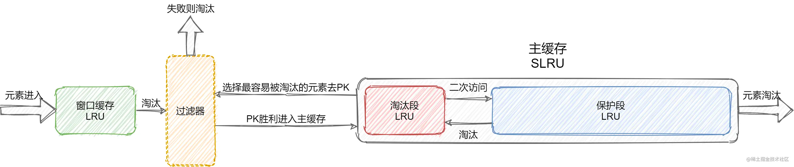

- [如何保证缓存和数据库的一致性](https://mp.weixin.qq.com/s?__biz=MzIyOTYxNDI5OA==&mid=2247487312&idx=1&sn=fa19566f5729d6598155b5c676eee62d&scene=21#wechat_redirect)
  - 缓存利用率和一致性问题
    - 先更新缓存，后更新数据库
      - 如果缓存更新成功了，但数据库更新失败，那么此时缓存中是最新值，但数据库中是「旧值」。
      - 虽然此时读请求可以命中缓存，拿到正确的值，但是，一旦缓存「失效」，就会从数据库中读取到「旧值」，重建缓存也是这个旧值
    - 先更新数据库，后更新缓存
      - 如果数据库更新成功了，但缓存更新失败，那么此时数据库中是最新值，缓存中是「旧值」。
      - 之后的读请求读到的都是旧数据，只有当缓存「失效」后，才能从数据库中得到正确的值。
  - 并发引发的一致性问题
    - 先更新数据库，再更新缓存
      - 有线程 A 和线程 B 两个线程，需要更新「同一条」数据，会发生这样的场景：
        - 线程 A 更新数据库（X = 1）
        - 线程 B 更新数据库（X = 2）
        - 线程 B 更新缓存（X = 2）
        - 线程 A 更新缓存（X = 1）
        - 最终 X 的值在缓存中是 1，在数据库中是 2，发生不一致
    - 先更新缓存，再更新数据库的方案，也会有类似问题
  - 删除缓存可以保证一致性吗？
    - 首先，经过前面的分析我们已经得知，以下两个方案但凡「第二步」操作失败，都会导致数据不一致。
    - 先删除缓存，后更新数据库
      - 如果有 2 个线程要并发「读写」数据，可能会发生以下场景：
        - 线程 A 要更新 X = 2（原值 X = 1）
        - 线程 A 先删除缓存
        - 线程 B 读缓存，发现不存在，从数据库中读取到旧值（X = 1）
        - 线程 A 将新值写入数据库（X = 2）
        - 线程 B 将旧值写入缓存（X = 1）
        - 最终 X 的值在缓存中是 1（旧值），在数据库中是 2（新值），发生不一致。
    - 先更新数据库，后删除缓存
      - 依旧是 2 个线程并发「读写」数据：
        - 缓存中 X 不存在（数据库 X = 1）
        - 线程 A 读取数据库，得到旧值（X = 1）
        - 线程 B 更新数据库（X = 2)
        - 线程 B 删除缓存
        - 线程 A 将旧值写入缓存（X = 1）
        - 最终 X 的值在缓存中是 1（旧值），在数据库中是 2（新值），也发生不一致。 这种情况「理论」来说是可能发生的，但实际真的有可能发生吗？
      - 其实概率「很低」，这是因为它必须满足 3 个条件：
        - 缓存刚好已失效
        - 读请求 + 写请求并发
        - 更新数据库 + 删除缓存的时间（步骤 3-4），要比读数据库 + 写缓存时间短（步骤 2 和 5）
        - 仔细想一下，条件 3 发生的概率其实是非常低的。 因为写数据库一般会先「加锁」，所以写数据库，通常是要比读数据库的时间更长的。
      - 这么来看，「先更新数据库 + 再删除缓存」的方案，是可以保证数据一致性的。
  - 如何保证两步都执行成功？
    - 无论是更新缓存还是删除缓存，只要第二步发生失败，那么就会导致数据库和缓存不一致。 最简单的解决办法是什么？ 答案是：重试。
      - 现实情况往往没有想的这么简单，失败后立即重试的问题在于：
        - 立即重试很大概率「还会失败」
        - 「重试次数」设置多少才合理？
        - 重试会一直「占用」这个线程资源，无法服务其它客户端请求
    - 更好的方案应该怎么做？ 答案是：**异步重试**
      - 其实就是把重试请求写到「消息队列」中，然后由专门的消费者来重试，直到成功
    - 是否有更简单的方案，同时又可以保证一致性呢？ 订阅数据库变更日志，再操作缓存
      - 结论，想要保证数据库和缓存一致性，推荐采用「先更新数据库，再删除缓存」方案，并配合「消息队列」或「订阅变更日志」的方式来做。
- 主从库延迟和延迟双删问题
  - 第一个问题，还记得前面讲到的「先删除缓存，再更新数据库」方案，导致不一致的场景么？
    - 2 个线程要并发「读写」数据，可能会发生以下场景：
      - 线程 A 要更新 X = 2（原值 X = 1）
      - 线程 A 先删除缓存
      - 线程 B 读缓存，发现不存在，从数据库中读取到旧值（X = 1）
      - 线程 A 将新值写入数据库（X = 2）
      - 线程 B 将旧值写入缓存（X = 1）
      - 最终 X 的值在缓存中是 1（旧值），在数据库中是 2（新值），发生不一致。
  - 第二个问题：是关于「读写分离 + 主从复制延迟」情况下，缓存和数据库一致性的问题。
    - 在「先更新数据库，再删除缓存」方案下，「读写分离 + 主从库延迟」其实也会导致不一致：
      - 线程 A 更新主库 X = 2（原值 X = 1）
      - 线程 A 删除缓存
      - 线程 B 查询缓存，没有命中，查询「从库」得到旧值（从库 X = 1）
      - 从库「同步」完成（主从库 X = 2）
      - 线程 B 将「旧值」写入缓存（X = 1）
      - 最终 X 的值在缓存中是 1（旧值），在主从库中是 2（新值），也发生不一致。
    - 看到了么？这 2 个问题的核心在于：缓存都被回种了「旧值」。
      - 最有效的办法就是，把缓存删掉。这就是业界给出的方案：**缓存延迟双删策略**
        - 解决第一个问题：在线程 A 删除缓存、更新完数据库之后，先「休眠一会」，再「删除」一次缓存。
        - 解决第二个问题：线程 A 可以生成一条「延时消息」，写到消息队列中，消费者延时「删除」缓存。
      - 但问题来了，这个「延迟删除」缓存，延迟时间到底设置要多久呢？
        - 问题1：延迟时间要大于「主从复制」的延迟时间
        - 问题2：延迟时间要大于线程 B 读取数据库 + 写入缓存的时间
      - 但是，这个时间在分布式和高并发场景下，其实是很难评估的。 很多时候，我们都是凭借经验大致估算这个延迟时间，例如延迟 1-5s，只能尽可能地降低不一致的概率。
- ALL in all [图例](https://mp.weixin.qq.com/s/Me_mePrvDd7_o2lNS4rnuw)
  - 引入缓存后，需要考虑缓存和数据库一致性问题，可选的方案有：「更新数据库 + 更新缓存」、「更新数据库 + 删除缓存」
  - 更新数据库 + 更新缓存方案，在「并发」场景下无法保证缓存和数据一致性，且存在「缓存资源浪费」和「机器性能浪费」的情况发生
  - 在更新数据库 + 删除缓存的方案中，「先删除缓存，再更新数据库」在「并发」场景下依旧有数据不一致问题，解决方案是「延迟双删」，但这个延迟时间很难评估，所以推荐用「先更新数据库，再删除缓存」的方案
  - 在「先更新数据库，再删除缓存」方案下，为了保证两步都成功执行，需配合「消息队列」或「订阅变更日志」的方案来做，本质是通过「重试」的方式保证数据一致性
  - 在「先更新数据库，再删除缓存」方案下，「读写分离 + 主从库延迟」也会导致缓存和数据库不一致，缓解此问题的方案是「延迟双删」，凭借经验发送「延迟消息」到队列中，延迟删除缓存，同时也要控制主从库延迟，尽可能降低不一致发生的概率

- 缓存穿透 ： 指访问不存在的数据，从而绕过缓存，直接请求到了数据源，当请求过多，就会对 DB 造成压力。
  - 空 key：指对于不存在的数据也将 key 存空值入缓存系统，这样下次访问也会得到返回。但只适用于空数据 key 有限、key 重复请求概率高，如果量大且不重复，就会造成很多无用 key 的创建。
  - 布隆过滤器：布隆过滤器是一个很长的二进制向量和一系列随机映射函数。可用于检索一个元素是否在一个集合中加一层对空值的过滤器，空间和时间效率都很高。但由于 hash 产生的碰撞可能存在误判，以及因不存储 key 导致的无法删除。适用于空数据 key 各不同、重复请求概率低。
  
- 缓存击穿： 缓存击穿实际是缓存雪崩的一个特例。指当某些热点 key 过期时，就会有大量的请求击穿到 DB。
  - 互斥锁：在缓存失效的时候，不立即 load db，可以先用如 SETNX 等命令去 set 一个 mutex key，当操作返回成功时，说明拿到锁，此刻该线程进行 load db 的操作并更新缓存；否则未拿到锁就（可休眠一段）重试 get 缓存的方法。但要注意死锁风险。
  - 不过期
    - 这里的不过期有两个概念，一个指未设过期时间，那是真的不过期，那没事了。
    - 另一个是指通过业务逻辑，将 key 的过期时间进行存储，请求是判断是否小于值，是则后台异步更新。
    
- 缓存雪崩： 同一时刻大量缓存失效（故障）, 请求到了 DB。
  - 随机时间：在设置过期时间时，可以在基础时间上 + 一个随机的时间，等于实现了分批过期。
  - 后台更新：将更新失效的工作交给后台定时线程。
  - 限流 + 本地缓存：如 ehcache 本地缓存 + Hystrix 限流。
  - 双缓存：类似于设置主从缓存，从 key 不过期。
  
- 缓存更新与一致性： 如果保证数据一致性。列出四种更新策略：
  - Cache Aside：最常用的。失效时回源取数据，更新；命中时，返回缓存数据；更新时先数据源更新，再更新缓存。
  - Write Back：更新数据时，只更新缓存，不更新数据源。缓存异步批量更新数据库。
  - Read/Write Through
    - Write Through：当有数据更新时，如未命中缓存，直接更新数据库，并返回。如命中缓存，则更新缓存，再由 Cache 自己更新数据库。
    - Read Through：更新数据源由缓存系统操作，读取数据时如缓存失效，则取回源数据更新缓存。
    
- 热点数据： 对于热点数据的处理方法。
  - 拆分复杂结构：如二级数据结构，进行拆分，这样热点 key 就被拆为若干个的 key 分布到不同节点。
  - 迁移热点：对于 Redis Cluster 而言可以将热点 key 所在的 slot 单独迁移到一个节点，降低其他节点压力。
  - 多副本：复制多份缓存副本，将请求分散到多个节点上，减轻单台缓存服务器压力，适合多读少写。

- [缓存详解](https://mp.weixin.qq.com/s/q6T0mbvbTtt46C64638p2A)
- [缓存策略](https://mp.weixin.qq.com/s/sVVIzZFDnYGWIcqiRZdSuQ)
  - 缓存策略的最佳实践是 Cache Aside Pattern。分别分为读缓存最佳实践和写缓存最佳实践。
    - 读缓存最佳实践：先读缓存，命中则返回；未命中则查询数据库，再写到缓存中。
    - 写缓存最佳实践：
      - 先写数据库，再操作缓存；
      - 直接删除缓存，而不是修改，因为当缓存的更新成本很高，需要访问多张表联合计算，建议直接删除缓存，而不是更新，另外，删除缓存操作简单，副作用只是增加了一次 chache miss，建议大家使用该策略。
    - 在以上最佳实践下，为了尽可能保证缓存与数据库的一致性，我们可以采用延迟双删。
    - 防止删除失败，我们采用异步重试机制保证能正确删除，异步机制我们可以发送删除消息到 mq 消息中间件，或者利用 canal 订阅 MySQL binlog 日志监听写请求删除对应缓存。
  - 那么，如果我非要保证绝对一致性怎么办，先给出结论：
    - 没有办法做到绝对的一致性，这是由 CAP 理论决定的，缓存系统适用的场景就是非强一致性的场景，所以它属于 CAP 中的 AP。
      所以，我们得委曲求全，可以去做到 BASE 理论中说的最终一致性。
- [Ristretto: A High-Performance Go Cache](https://dgraph.io/blog/post/introducing-ristretto-high-perf-go-cache/)
  - Fast Access
    - sharded mutex-wrapped Go maps are the best overall performance 
    - To generate a fast hash, we borrowed `runtime.memhash` from Go Runtime
  - Concurrency and Contention Resistance
    - [BP-Wrapper](https://dgraph.io/blog/refs/bp_wrapper.pdf) - two ways to mitigate contention: prefetching and batching.
    - Rather than acquiring a mutex lock for every metadata mutation, we wait for a ring buffer to fill up before we acquire a mutex and process the mutations.
    - One simple `sync.RWMutex` guarded map is way better than `sync.Map` when we are using only a few processor cores
    - We use a channel to capture the Sets, dropping them on the floor if the channel is full to avoid contention.
    - Caveats
      - Sets in Ristretto are queued into a buffer, control is returned back to the caller, and the buffer is then applied to the cache. This has two side-effects:
        - There is no guarantee that a set would be applied. It could be dropped immediately to avoid contention or could be rejected later by the policy.
        - Even if a Set gets applied, it might take a few milliseconds after the call has returned to the user. In database terms, it is an eventual consistency model.
  - Memory Bounding
    - [TinyLFU](https://dgraph.io/blog/refs/TinyLFU%20-%20A%20Highly%20Efficient%20Cache%20Admission%20Policy.pdf) 
      - The main idea is to only let in a new item if its estimate is higher than that of the item being evicted
      - TinyLFU also maintains the recency of key access by a Reset function. After N key increments, the counters get halved. So, a key that has not been seen for a while would have its counter get reset to zero; paving the way for more recently seen keys.
    - Sampled LFU
      - We then compare the ɛ of this key against the incoming key. If the incoming key has a higher ɛ, then this key gets evicted (eviction policy). Otherwise, the incoming key is rejected (admission policy). 
    - DoorKeeper
      - Before we place a new key in TinyLFU, Ristretto uses a bloom filter to first check if the key has been seen before. Only if the key is already present in the bloom filter, is it inserted into the TinyLFU. 
      - This is to avoid polluting TinyLFU with a long tail of keys that are not seen more than once.
  - Metrics
    - We initially used atomic counters for these. However, the overhead was significant. We narrowed the cause down to False Sharing. 
    - To achieve scalability, we ensure that each atomic counter completely occupies a full cache line
- [TinyLFU](https://juejin.cn/post/7144327955353698334)
  - [CountMinSketch](http://web.stanford.edu/class/archive/cs/cs166/cs166.1206/lectures/10/Slides10.pdf)
    - 一种计数器，用来统计一个元素的计数，它能够以一个非常小的空间统计大量元素的计数，同时保证高的性能及准确性
    - 与布隆过滤器类似，由于它是基于概率的，因此它所统计的计数是有一定概率存在误差的，也就是可能会比真实的计数大。
  - SLRU Segmented LRU
    - LRU有一个问题，如果一个元素只被访问一次，那么它也会把其他元素给挤出去。这样就会导致如果我们的缓存空间不够长，遇到突发的稀疏流量（比如列表遍历）将会把大量元素给挤出去，留下一堆很可能不会再次被访问的元素在缓存中，导致缓存命中率下降
    - SLRU就是把缓存分成两段，一段是淘汰段，一段是保护段，两个段都是普通的LRU实现。第一次被访问的元素将进入淘汰段，只有处于淘汰段中的元素再次被访问才会进入保护段。保护段中的元素如果被淘汰将会再次进入淘汰段，而淘汰段的元素被淘汰则会被移出缓存
  - W-TinyLFU由多个部分组合而成，包括窗口缓存、过滤器和主缓存。
    - 主缓存是使用SLRU，元素刚进入W-TinyLFU会在窗口缓存暂留一会，被挤出窗口缓存时，会在过滤器中和主缓存中最容易被淘汰的元素进行PK，如果频率大于主缓存中这个最容易被淘汰的元素，才能进入主缓存
    - 
    - 窗口缓存
      - W-TinyLFU选择一个元素是否加入缓存，得看这个元素加入缓存能否提高整体缓存的命中率，而这个评估的依据就是根据元素的频率。但是如果一个刚加入缓存的元素（表示元素刚刚才开始被访问），它的频率并不足以让它加入缓存，那么它会直接被淘汰。
      - 因此在W-TinyLFU中使用LRU来作为一个窗口缓存，主要是让元素能够有机会在窗口缓存中去积累它的频率，避免因为频率很低而直接被淘汰。
    - 基于频率
      - W-TinyLFU中使用BloomFilter+CountMinSketch来统计元素的访问频率，BloomFilter作为一个前置计数器，而CountMinSketch则作为主计数器
      - BloomFilter避免前面所提到的稀疏流量对CountMinSketch计数器的影响，也就是稀疏流量只会在BloomFilter中进行计数（可以当成是最大值为1的计数），换句话说就是如果BloomFilter中没有计数则先把这次的计数加到BloomFilter中。
        - 需要BloomFilter的主要原因是CountMinSketch也是基于概率的，在计数的正确性一定的情况下，越多的元素进入CountMinSketch计数器，那么CountMinSketch就需要越大和越多的哈希函数。而BloomFilter可以帮忙抵挡那部分计数值还不需要那么大的元素（也就是计数值只有1），这样我们就可以减小CountMinSketch计数器的大小
      - 在W-TinyLFU中使用一个4bit大小的CountMinSketch计数器来统计每个元素的访问频率，它是主要的计数器，元素在第一个计数会记录在BloomFilter中，之后就会记录在CountMinSketch中

