- [如何解决MySQL深分页问题](https://juejin.cn/post/7012016858379321358)
  - Issue
    - 我们日常做分页需求时，一般会用limit实现，但是当偏移量特别大的时候，查询效率就变得低下
  - Why
    - 深分页的执行SQL如下：
    `select id,name,balance from account where update_time> '2020-09-19' limit 100000,10;`
    - 我们先来看下这个SQL的执行流程：
      - 通过普通二级索引树idx_update_time，过滤update_time条件，找到满足条件的记录ID。
      - 通过ID，回到主键索引树，找到满足记录的行，然后取出展示的列（回表）
      - 扫描满足条件的100010行，然后扔掉前100000行，返回。
    - SQL变慢原因有两个：
      - limit语句会先扫描offset+n行，然后再丢弃掉前offset行，返回后n行数据。也就是说limit 100000,10，就会扫描100010行，而limit 0,10，只扫描10行。
      - limit 100000,10 扫描更多的行数，也意味着回表更多的次数。
  - Solution
    - 通过子查询优化, 可以通过减少回表次数来优化, 把条件转移到主键索引树
      ```sql
      select id,name,balance FROM account 
      where id >= (
           select a.id from account a 
           where a.update_time >= '2020-09-19' 
            limit 100000, 1)
       LIMIT 10;（可以加下时间条件到外面的主查询）
      ```
    - INNER JOIN 延迟关联
      ```sql
      SELECT  acct1.id,acct1.name,acct1.balance 
      FROM account acct1 
         INNER JOIN 
         (SELECT a.id 
          FROM account a 
         WHERE a.update_time >= '2020-09-19' ORDER BY a.update_time 
         LIMIT 100000, 10) AS  acct2 
      on acct1.id= acct2.id;
      ```
      先通过idx_update_time二级索引树查询到满足条件的主键ID，再与原表通过主键ID内连接，这样后面直接走了主键索引了，同时也减少了回表
    - 标签记录法
      - limit 深分页问题的本质原因就是：偏移量（offset）越大，mysql就会扫描越多的行，然后再抛弃掉。这样就导致查询性能的下降。
      - 可以采用标签记录法，就是标记一下上次查询到哪一条了，下次再来查的时候，从该条开始往下扫描。就好像看书一样，上次看到哪里了，你就折叠一下或者夹个书签，下次来看的时候，直接就翻到啦。
      - 这种方式有局限性：需要一种类似连续自增的字段。
    - 使用between...and...
      - 可以将limit查询转换为已知位置的查询，这样MySQL通过范围扫描between...and，就能获得到对应的结果
- [Redis主节点的Key已过期，但从节点依然读到过期数据](https://mp.weixin.qq.com/s?__biz=Mzg2NzYyNjQzNg==&mid=2247487738&idx=1&sn=e7e6b10b81736ba9775f485ce39585a6&chksm=ceb9ec51f9ce6547ce6378692b11cc09d3c46ded964bddf5052373b1c8cbf5b02a2327f4d23e&scene=132#wechat_redirect)
  - 大部分的业务场景都是读多写少，为了利用好这个特性，提升Redis集群系统的吞吐能力，通常会采用主从架构、读写分离
  - 主从架构的风险
    - 拉取过期数据
      - 通常会设置过期时间，对于一些使用不是很频繁的数据，会定期删除，提高资源的利用率
        - 被动删除，当数据过期后，并不会马上删除。而是等到有请求访问时，对数据检查，如果数据过期，则删除数据
        - 定期删除。每隔一段时间，默认100ms，Redis会随机挑选一定数量的Key，检查是否过期，并将过期的数据删除。
      - 如果读从库，则有可能拿到过期数据。原因有两个
        - 跟 Redis 的版本有关系，Redis 3.2 之前版本，读从库并不会判断数据是否过期，所以有可能返回过期数据。
        - 跟过期时间的设置方式有关系，我们一般采用 EXPIRE 和 PEXPIRE，表示从执行命令那个时刻开始，往后延长 ttl 时间。严重依赖于 开始时间 从什么时候算起
          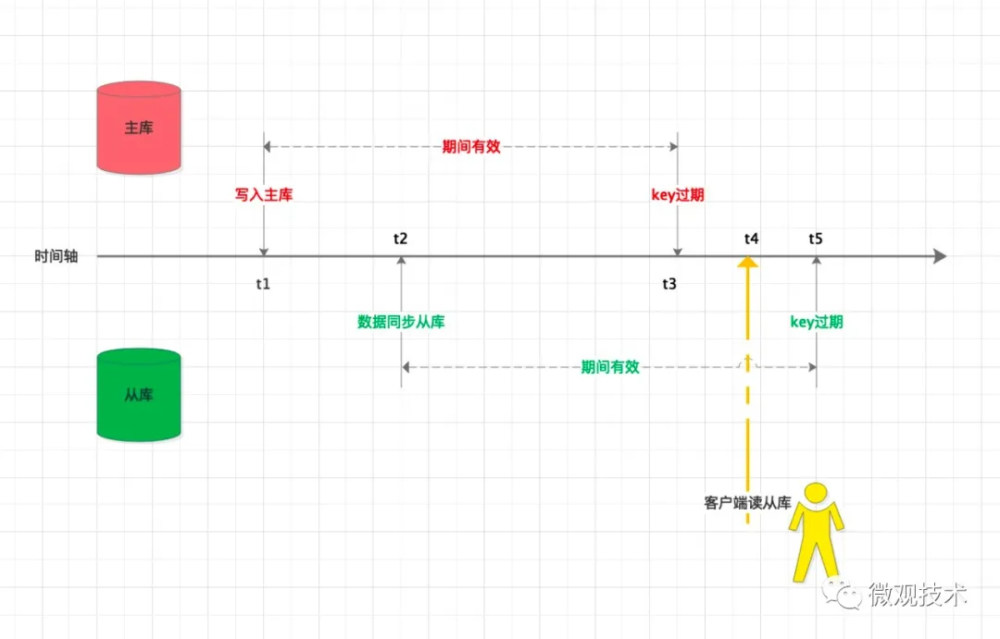
        - 解决方案： 可以采用Redis的另外两个命令，EXPIREAT 和 PEXPIREAT，相对简单，表示过期时间为一个具体的时间点。避免了对开始时间从什么时候算起的依赖
        - EXPIREAT 和 PEXPIREAT 设置的是时间点，所以要求主从节点的时钟保持一致，需要与NTP 时间服务器保持时钟同步。
    - 主从节点数据不一致
      - 从库同步落后的原因主要有两个：
        - 1、主从服务器间的网络传输可能有延迟
        - 2、从库已经收到主库的命令，由于是单线程执行，前面正在处理一些耗时的命令（如：pipeline批处理），无法及时同步执行。
      - 解决方案：
        - 1、主从服务器尽量部署在同一个机房，并保持服务器间的网络良好通畅
        - 2、监控主从库间的同步进度，通过`info replication`命令 ，查看主库接收写命令的进度信息（master_repl_offset），从库的复制写命令的进度信息（slave_repl_offset）
          `master_repl_offset - slave_repl_offset` 得到从库与主库间的复制进度差. 我们可以开发一个监控程序，定时拉取主从服务器的进度信息，计算进度差值。如果超过我们设置的阈值，则通知客户端断开从库的连接，全部访问主库，一定程度上减少数据不一致情况。
- [Redis 用数据类型实现亿级数据统计](https://mp.weixin.qq.com/s?__biz=Mzg2NzYyNjQzNg==&mid=2247487680&idx=1&sn=7877648fac1fe8bf98b65bdeaf50a7ea&chksm=ceb9ec6bf9ce657df72a03491b2532d2c3bf3714a244459eb0609754a4f39ae496c1c9e0e584&scene=132#wechat_redirect)
  - 常见的场景如下：
  - 给一个 userId ，判断用户登陆状态；
  - 两亿用户最近 7 天的签到情况，统计 7 天内连续签到的用户总数；
  - 统计每天的新增与第二天的留存用户数；
  - 统计网站的对访客（Unique Visitor，UV）量
  - 最新评论列表
- [详谈水平分库分表](https://mp.weixin.qq.com/s/vqYRUEPnzFHExo4Ly7DPWw)
  - 什么是一个好的分库分表方案
    - 方案可持续性 - 业务数据量级和业务流量未来进一步升高达到新的量级的时候，我们的分库分表方案可以持续使用
    - 数据偏斜问题 - 定义分库分表最大数据偏斜率为 ：（数据量最大样本 - 数据量最小样本）/ 数据量最小样本。一般来说，如果我们的最大数据偏斜率在5%以内是可以接受的
  - 常见的分库分表方案
    - Range分库分表
      - TiDB数据库，针对TiKV中数据的打散，也是基于Range的方式进行，将不同范围内的[StartKey,EndKey)分配到不同的Region上
      - 该方案的缺点：
        - 最明显的就是数据热点问题
        - 新库和新表的追加问题
        - 业务上的交叉范围内数据的处理
        - 通过年份进行分库分表，那么元旦的那一天，你的定时任务很有可能会漏掉上一年的最后一天的数据扫描
    - Hash分库分表
      - 几个常见的错误案例
        - 非互质关系导致的数据偏斜问题
          ```go
          public static ShardCfg shard(String userId) {
              int hash = userId.hashCode();
              // 对库数量取余结果为库序号
              int dbIdx = Math.abs(hash % DB_CNT);
              // 对表数量取余结果为表序号
              int tblIdx = Math.abs(hash % TBL_CNT);
           
              return new ShardCfg(dbIdx, tblIdx);
          }
          ```
          发现，以10库100表为例，如果一个Hash值对100取余为0，那么它对10取余也必然为0。
          事实上，只要库数量和表数量非互质关系，都会出现某些表中无数据的问题。
          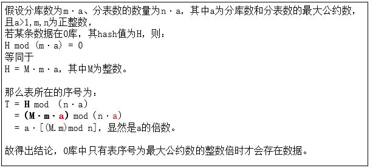
          当然，如果分库数和分表数不仅互质，而且分表数为奇数(例如10库101表)，则理论上可以使用该方案
        - 扩容难以持续

          我们把10库100表看成总共1000个逻辑表，将求得的Hash值对1000取余，得到一个介于[0，999)中的数，然后再将这个数二次均分到每个库和每个表中，大概逻辑代码如下
          ```go
          public static ShardCfg shard(String userId) {
                  // ① 算Hash
                  int hash = userId.hashCode();
                  // ② 总分片数
                  int sumSlot = DB_CNT * TBL_CNT;
                  // ③ 分片序号
                  int slot = Math.abs(hash % sumSlot);
                  // ④ 计算库序号和表序号的错误案例
                  int dbIdx = slot % DB_CNT ;
                  int tblIdx = slot / DB_CNT ;
           
                  return new ShardCfg(dbIdx, tblIdx);
              }
          ```
          该方案确实很巧妙的解决了数据偏斜的问题，只要Hash值足够均匀，那么理论上分配序号也会足够平均. 但是该方案有个比较大的问题，那就是在计算表序号的时候，依赖了总库的数量，那么后续翻倍扩容法进行扩容时，会出现扩容前后数据不在同一个表中，从而无法实施
      - 几种Hash分库分表的方案
        - 标准的二次分片法
          ```go
          public static ShardCfg shard2(String userId) {
                  // ① 算Hash
                  int hash = userId.hashCode();
                  // ② 总分片数
                  int sumSlot = DB_CNT * TBL_CNT;
                  // ③ 分片序号
                  int slot = Math.abs(hash % sumSlot);
                  // ④ 重新修改二次求值方案
                  int dbIdx = slot / TBL_CNT ;
                  int tblIdx = slot % TBL_CNT ;
           
                  return new ShardCfg(dbIdx, tblIdx);
              }
          ```
          和错误案例二中的区别就是通过分配序号重新计算库序号和表序号的逻辑发生了变化. 那为何使用这种方案就能够有很好的扩展持久性呢？我们进行一个简短的证明：
          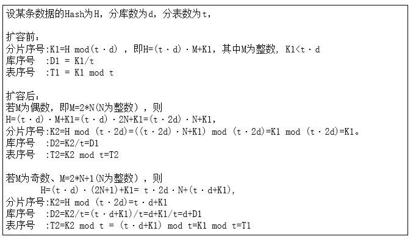
          通过翻倍扩容后，我们的表序号一定维持不变，库序号可能还是在原来库，也可能平移到了新库中(原库序号加上原分库数)，完全符合我们需要的扩容持久性方案
          
          缺点：
          - 翻倍扩容法前期操作性高，但是后续如果分库数已经是大几十的时候，每次扩容都非常耗费资源。
          - 连续的分片键Hash值大概率会散落在相同的库中，某些业务可能容易存在库热点（例如新生成的用户Hash相邻且递增，且新增用户又是高概率的活跃用户，那么一段时间内生成的新用户都会集中在相邻的几个库中）。
        - 关系表冗余

          该方案还是通过常规的Hash算法计算表序号，而计算库序号时，则从路由表读取数据。因为在每次数据查询时，都需要读取路由表，故我们需要将分片键和库序号的对应关系记录同时维护在缓存中以提升性能。
          ````go
          public static ShardCfg shard(String userId) {
                  int tblIdx = Math.abs(userId.hashCode() % TBL_CNT);
                  // 从缓存获取
                  Integer dbIdx = loadFromCache(userId);
                  if (null == dbIdx) {
                      // 从路由表获取
                      dbIdx = loadFromRouteTable(userId);
                      if (null != dbIdx) {
                          // 保存到缓存
                          saveRouteCache(userId, dbIdx);
                      }
                  }
                  if (null == dbIdx) {
                      // 此处可以自由实现计算库的逻辑
                      dbIdx = selectRandomDbIdx();
                      saveToRouteTable(userId, dbIdx);
                      saveRouteCache(userId, dbIdx);
                  }
           
                  return new ShardCfg(dbIdx, tblIdx);
              }
          ````
          selectRandomDbIdx方法作用为生成该分片键对应的存储库序号，这边可以非常灵活的动态配置。例如可以为每个库指定一个权重，权重大的被选中的概率更高，权重配置成0则可以将关闭某些库的分配。当发现数据存在偏斜时，也可以调整权重使得各个库的使用量调整趋向接近。

          该方案还有个优点，就是理论上后续进行扩容的时候，仅需要挂载上新的数据库节点，将权重配置成较大值即可，无需进行任何的数据迁移即可完成。

          缺点：
          - 每次读取数据需要访问路由表，虽然使用了缓存，但是还是有一定的性能损耗。
          - 路由关系表的存储方面，有些场景并不合适。例如上述案例中用户id的规模大概是在10亿以内，我们用单库百表存储该关系表即可。但如果例如要用文件MD5摘要值作为分片键，因为样本集过大，无法为每个md5值都去指定关系（当然我们也可以使用md5前N位来存储关系）。
          - 饥饿占位问题
        - 基因法
          - 我们发现案例一不合理的主要原因，就是因为库序号和表序号的计算逻辑中，有公约数这个因子在影响库表的独立性。
          - 我们计算库序号的时候做了部分改动，我们使用分片键的前四位作为Hash值来计算库序号。
            ```java
            public static ShardCfg shard(String userId) {
                int dbIdx = Math.abs(userId.substring(0, 4).hashCode() % DB_CNT );
                int tblIdx = Math.abs(userId.hashCode() % TBL_CNT);
                return new ShardCfg(dbIdx, tblIdx);
            }
            ```
          - 我们发现该方案中，分库数为16，分表数为100，数量最小行数仅为10W不到，但是最多的已经达到了15W+，最大数据偏斜率高达61%。按这个趋势发展下去，后期很可能出现一台数据库容量已经使用满，而另一台还剩下30%+的容量。
        - 剔除公因数法
          - 在很多场景下我们还是希望相邻的Hash能分到不同的库中。就像N库单表的时候，我们计算库序号一般直接用Hash值对库数量取余
            ```java
            public static ShardCfg shard(String userId) {
                    int dbIdx = Math.abs(userId.hashCode() % DB_CNT);
                    // 计算表序号时先剔除掉公约数的影响
                    int tblIdx = Math.abs((userId.hashCode() / TBL_CNT) % TBL_CNT);
                    return new ShardCfg(dbIdx, tblIdx);
            }
            ```
          - 经过测算，该方案的最大数据偏斜度也比较小，针对不少业务从N库1表升级到N库M表下，需要维护库序号不变的场景下可以考虑
        - 一致性Hash法
          - 正规的一致性Hash算法会引入虚拟节点，每个虚拟节点会指向一个真实的物理节点。这样设计方案主要是能够在加入新节点后的时候，可以有方案保证每个节点迁移的数据量级和迁移后每个节点的压力保持几乎均等。
          - 但是用在分库分表上，一般大部分都只用实际节点，引入虚拟节点的案例不多，主要有以下原因：
            - 应用程序需要花费额外的耗时和内存来加载虚拟节点的配置信息。如果虚拟节点较多，内存的占用也会有些不太乐观。
            - 由于mysql有非常完善的主从复制方案，与其通过从各个虚拟节点中筛选需要迁移的范围数据进行迁移，不如通过从库升级方式处理后再删除冗余数据简单可控。
            - 虚拟节点主要解决的痛点是节点数据搬迁过程中各个节点的负载不均衡问题，通过虚拟节点打散到各个节点中均摊压力进行处理。
      - 常见扩容方案
        - 翻倍扩容法
        - 一致性Hash扩容
- [一次不寻常的慢查调优经历](https://mp.weixin.qq.com/s/s1QmqB7Xf3IrgRebd3RFow)
  - 索引失效
    - 问题出在参数eq_range_index_dive_limit，关于这个参数
    - The eq_range_index_dive_limit system variable enables you to configure the number of values at which the optimizer switches from one row estimation strategy to the other. To permit use of index dives for comparisons of up to N equality ranges, set eq_range_index_dive_limit to N + 1. To disable use of statistics and always use index dives regardless of N, set eq_range_index_dive_limit to 0.
    - Even under conditions when index dives would otherwise be used, they are skipped for queries that satisfy all these conditions:
      - A single-index FORCE INDEX index hint is present. The idea is that if index use is forced, there is nothing to be gained from the additional overhead of performing dives into the index.
      - The index is nonunique and not a FULLTEXT index.
      - No subquery is present.
      - No DISTINCT, GROUP BY, or ORDER BY clause is present.
  - eq_range_index_dive_limit 原本配置的就是200，我们直接设置成1来关闭index dive。
  - 统计信息分为持久化统计和动态统计，由参数innodb_stats_persistent控制
    - 持久化统计
      - 启用持久化统计信息，修改超过10%数据就要更新
      - 动态自动统计，修改1/16数据就要更新
      - innodb_stats_method控制统计信息针对索引中NULL值的算法当设置为nulls_equal所有的NULL值都视为一个value group；当设置为nulls_unequal每一个NULL值被视为一个value group；设置为nulls_ignore时，NULL值被忽略
      - 执行show table status、show index，访问I_S.TABLES/STATISTICS视图时更新统计信息
    - 动态统计
      - innodb_stats_persistent=0
        - 统计信息不持久化，每次动态采集，存储在内存中，重启失效（需重新统计），不推荐
      - innodb_stats_transient_sample_pages
        - 动态采集page，默认8个
      - 每个表设定统计模式
        - CREATE/ALTER TABLE … STATS_PERSISTENT=1,STATS_AOTU_RECALC=1,STATS_SAMPLE_PAGES=200;
      - mysql -auto-rehash
- [SQL优化系列之 in与range 查询](https://mp.weixin.qq.com/s/LmBH5Acl-GxtRmEMuLITaw)
  - 用in这种方式可以有效的替代一定的range查询，提升查询效率，因为在一条索引里面，range字段后面的部分是不生效的（ps.需要考虑 ICP）。MySQL优化器将in这种方式转化成 n*m 种组合进行查询，最终将返回值合并，有点类似union但是更高效。
  - 这里的一定数在MySQL5.6.5以及以后的版本中是由eq_range_index_dive_limit这个参数控制 。默认设置是10，一直到5.7以后的版本默认修改为200
    - eq_range_index_dive_limit = 0 只能使用index dive
    - 0 < eq_range_index_dive_limit <= N 使用index statistics
    - eq_range_index_dive_limit > N 只能使用index dive
  - 估计方法有2种:
    - dive到index中即利用索引完成元组数的估算,简称index dive;
    - index statistics:使用索引的统计数值,进行估算;
    - 对比这两种方式
      - index dive: 速度慢,但能得到精确的值（MySQL的实现是数索引对应的索引项个数，所以精确）
      - index statistics: 速度快,但得到的值未必精确
  - range查询与索引使用
    ```sql
     SELECT * FROM pre_forum_post WHERE tid=7932552 AND invisible IN('0','-2') ORDER BY dateline DESC LIMIT 10;
    ```
    - 优化器认为这是一个range查询，那么(tid,invisible,dateline)这条索引中，dateline字段肯定用不上了，也就是说这个SQL最后的排序肯定会生成一个临时结果集，然后再结果集里面完成排序，而不是直接在索引中直接完成排序动作
  - 如何使用optimize_trace
    ```sql
    set optimizer_trace='enabled=on';
    select * from information_schema.optimizer_trace
    ```
  - 如何使用profile
    ```sql
    set profiling=ON;
    执行sql;
    show profiles;
    show profile for query 2;
    show profile block io,cpu for query 2;
    ```
- [PG index](https://blog.crunchydata.com/blog/postgres-indexes-for-newbies)
  - Indexes are their own data structures and they’re part of the Postgres data definition language (the DDL). They're stored on disk along with data tables and other objects.
    - B-tree indexes are the most common type of index and would be the default if you create an index and don’t specify the type. B-tree indexes are great for general purpose indexing on information you frequently query.
    - BRIN indexes are block range indexes, specially targeted at very large datasets where the data you’re searching is in blocks, like timestamps and date ranges. They are known to be very performant and space efficient.
    - GIST indexes build a search tree inside your database and are most often used for spatial databases and full-text search use cases.
    - GIN indexes are useful when you have multiple values in a single column which is very common when you’re storing array or json data.
- Redis 为什么变慢了
  - 使用复杂度过高的命令
    - 分析
      - slowlog 命令
      - 使用聚合命令 - sort sunion
      - O(N)命令，但是N很大
      - 命令排队
    - 规避
      - 聚合操作在客户端
      - O(N)命令，N尽量小 （N <= 300）
  - 操作bigkey
    - bigkey申请、释放内存，耗时比较久
    - 规避
      - 避免bigkey （10KB以下）
      - UNLINK代替 DEL
  - 集中过期
    - 现象
      - 整点变慢，时间间隔固定， slowlog没有记录， expire keys突增
    - 过期策略
      - 被动 （惰性）
      - 主动 （定期清理，主线程）
    - 规避
      - 过期时间打散
      - lazyfree-lazy-expire=yes (后台进程)
  - 内存达到maxmemory
    - 现象
      - 满容之后写请求变慢
      - 写OPS越大越明显
      - 淘汰bigkey耗时久
    - 规避
      - no bigkey
      - 选择合适的淘汰策略
      - 拆分实例，分摊压力
      - lazyfree-lazy-eviction = yes
  - rehash - 翻倍扩容
    - 现象
      - 写入新key，偶发性延迟
      - rehash + maxmemory 触发大量key淘汰
    - 规避
      - key的数量在1亿以下
      - 升级 6.0 - 即将超过maxmemory，不做rehash
  - 持久化
    - RDB AOF - fork子进程
    - 规避
      - 单个实例在10G以下
      - slave节点备份
      - 关闭AOF AOF rewrite - 纯缓存case
      - 不要部署虚拟机
      - 避免全量同步：调大 repl-backlog-size
  - 内存大页
    - 现象
      - RDB AOF rewrite期间写请求变慢
    - 分析
      - 默认内存页4KB
      - 内存大页2MB
      - COW： fork的时候调用
    - 关闭内存大页
      - `echo never > /sys/kernel/mm/transparent_hugepage/enabled`
  - AOF
    - 现象
      - AOF everysec
      - 主线程阻塞
      - 主线程 写入到 page cache，当磁盘负载高的时候，导致AOF子线程fsync卡住
    - 规避
      - `no-appendfsync-on-rewrite = yes` AOF rewrite 期间，appendfsync = no
  - 绑定CPU
    - 现象
      - Redis进程绑定固定一个CPU核心
      - RDB AOF rewrite期间慢
    - Redis server
      - 主线程 - 处理请求
      - 后台线程 - 异步释放fd，异步AOF刷盘，lazyfree
      - 子进程 - RDB AOF rewrite
    - 分析
      - 子进程集成父进程CPU偏好，竞争关系
    - 缓解
      - 绑定多个CPU核心
      - 同一个物理核心
    - 规避
      - 不同进程，不同CPU
      - ```shell
        server_cpulist 
        bio_cpulist
        aof_cpulist
        bgsave_publist
        ```
      - 绑定CPU需谨慎
  - 使用SWAP
    - 现象
      - 所有请求变慢
      - 响应延迟- 几百毫秒，秒级
    - 分析
      - 内存数据放到磁盘
    - 规避
      - 足够内存，避免swap
       ```shell
       cat /proc/$pid/smaps | egrep '^(Swap|Size)'
       ```
      - 监控
  - 内存碎片
    - 现象
      - 开启内存碎片整理
      - 请求变慢 - 碎片整理在主线程
    - 规避
      - 合理调整阈值 `activefrag`
  - 网络负载高
    - 现象
      - 丢包，重传
    - 规避
      - 扩容，迁移
  - 监控
    - 配置有问题，脚本有bug：connection 数量
  
- [Multi Part AOF](https://mp.weixin.qq.com/s/v9yvJo7mKb5Hffw8Dw7gDQ)
  - AOF
    - 由于AOF会以追加的方式记录每一条redis的写命令，因此随着Redis处理的写命令增多，AOF文件也会变得越来越大，命令回放的时间也会增多，为了解决这个问题，Redis引入了AOF rewrite机制
  - AOFRW
    - 当AOFRW被触发执行时，Redis首先会fork一个子进程进行后台重写操作，该操作会将执行fork那一刻Redis的数据快照全部重写到一个名为temp-rewriteaof-bg-pid.aof的临时AOF文件中。 
  - AOFRW存在的问题
    - Memory
      - 在AOFRW期间，主进程会将fork之后的数据变化写进aof_rewrite_buf中，aof_rewrite_buf和aof_buf中的内容绝大部分都是重复的，因此这将带来额外的内存冗余开销。
    - CPU
      - 在AOFRW期间，主进程需要花费CPU时间向aof_rewrite_buf写数据，并使用eventloop事件循环向子进程发送aof_rewrite_buf中的数据：
      - 在子进程执行重写操作的后期，会循环读取pipe中主进程发送来的增量数据，然后追加写入到临时AOF文件：
      - 在子进程完成重写操作后，主进程会在backgroundRewriteDoneHandler 中进行收尾工作。其中一个任务就是将在重写期间aof_rewrite_buf中没有消费完成的数据写入临时AOF文件。如果aof_rewrite_buf中遗留的数据很多，这里也将消耗CPU时间。
    - Disk IO
      - 在AOFRW期间，主进程除了会将执行过的写命令写到aof_buf之外，还会写一份到aof_rewrite_buf中。aof_buf中的数据最终会被写入到当前使用的旧AOF文件中，产生磁盘IO。同时，aof_rewrite_buf中的数据也会被写入重写生成的新AOF文件中，产生磁盘IO。因此，同一份数据会产生两次磁盘IO。
  - MP-AOF实现
    - 将AOF分为三种类型，分别为：
      - BASE：表示基础AOF，它一般由子进程通过重写产生，该文件最多只有一个。
      - INCR：表示增量AOF，它一般会在AOFRW开始执行时被创建，该文件可能存在多个。
      - HISTORY：表示历史AOF，它由BASE和INCR AOF变化而来，每次AOFRW成功完成时，本次AOFRW之前对应的BASE和INCR AOF都将变为HISTORY，HISTORY类型的AOF会被Redis自动删除。
- [mysql主库更新后，从库都读到最新值了，主库还有可能读到旧值吗](https://mp.weixin.qq.com/s/EaTI063DJSH3gDNQhi-OZg)
  - 主从同步
    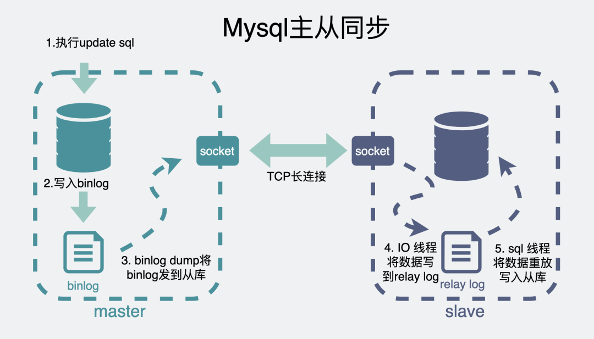
  - 主库更新后，主库都读到最新值了，从库还有可能读到旧值吗？
    - 如果此时主从延迟过大，这时候读从库，同步可能还没完成，因此读到的就是旧值
  - 主库更新后，从库都读到最新值了，主库还有可能读到旧值吗？
    - 假设当前的数据库事务隔离级别是可重复读
    - 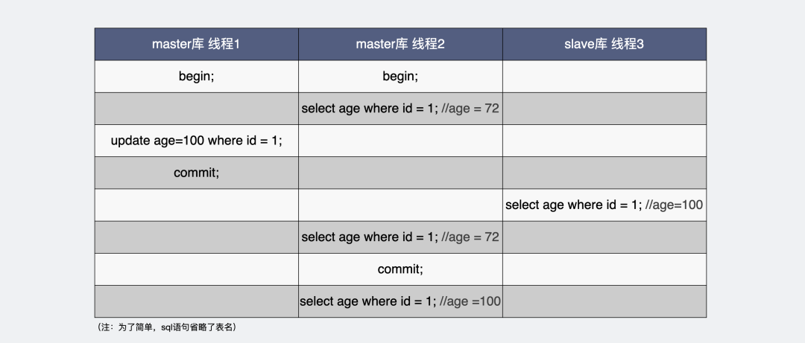
- [Understanding EXPLAIN on Postgresql](http://www.louisemeta.com/blog/explain/)
  - [What are costs and actual times](https://www.youtube.com/watch?v=IwahVdNboc8)
    - Cost - The part cost=0.00..205.01 has two numbers, the first one indicates the cost of retrieving the first row, and the second one, the estimated cost of retrieving all the rows.
    - Actual time - (actual time=1.945..1.946 rows=1 loops=1) means that the seq scan was executed once (loops=1), retrieved one row rows=1 and took 1.946ms.
  - Scan
    - Sequential Scan
    - Index Scan
    - Bitmap heap Scan
      - In this algorithm, the tuple-pointer from index are ordered by physical memory into a map. The goal is to limit the “jumps” of the reading head between rows. When you think about it, a encyclopaedia’s index is close from the structure of this map. For the word that you are looking for, the pages are ordered.
  - Join
    - Nested Loop
    - Hash Join - This is much more efficient than the nested loop isn’t it? So why isn’t it used all the time ?
      - For small tables, the complexity of building the hash table makes it less efficient than a nested loop.
      - The hash table has to fit in memory (you can see it with Memory Usage: 9kB in the EXPLAIN), so for a big set of data, it can’t be used
    - Merge Join
      - If neither Nested Loop or Hash Join can be used for joining big tables
  - Ordering and a word on offset
    - QuickSort
    - Top N heap Sort
    - A word on offset - Ordering is often used in order to paginate results.
- [Mysql数据库查询好慢原因](https://mp.weixin.qq.com/s?__biz=Mzg5NDY2MDk4Mw==&mid=2247488052&idx=1&sn=b0e197b837be4af0e3f2ddd72fccf3cd&scene=21#wechat_redirect)
  - 数据库查询流程
    - 分析器,
    - 优化器，在这里会根据一定的规则选择该用什么索引
    - 执行器去调用存储引擎的接口函数
    - buffer pool - InnoDB中，因为直接操作磁盘会比较慢，所以加了一层内存提提速，叫buffer pool，这里面，放了很多内存页，每一页16KB，有些内存页放的是数据库表里看到的那种一行行的数据，有些则是放的索引信息。
    - 会根据前面优化器里计算得到的索引，去查询相应的索引页，
    - 如果不在buffer pool里则从磁盘里加载索引页。再通过索引页加速查询，得到数据页的具体位置。
    - 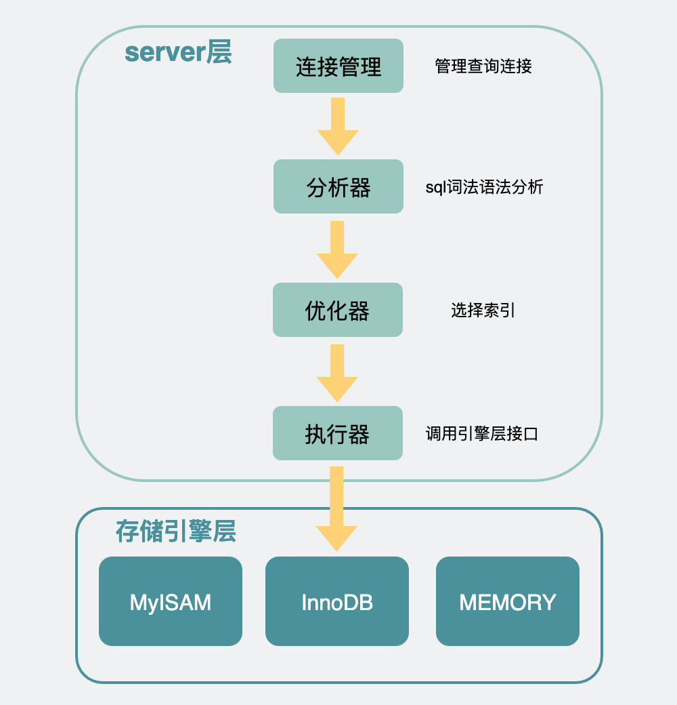
  - 慢查询分析
    - 通过开启profiling看到流程慢在哪
      ```sql
      set profiling=ON;
      show variables like 'profiling';
      show profiles;
      show profile for query 1;
      ```
  - 索引相关原因
    - 一般能用explain命令帮助分析。通过它能看到用了哪些索引，大概会扫描多少行之类的信息
    - 在优化器阶段里看下选择哪个索引，一般主要考虑几个因素，比如：
      - 选择这个索引大概要扫描多少行（rows）
      - 为了把这些行取出来，需要读多少个16kb的页
      - 走普通索引需要回表，主键索引则不需要，回表成本大不大
    - explain 
      - 使用的type为ALL，意味着是全表扫描，possible_keys是指可能用得到的索引，这里可能使用到的索引是为age建的普通索引，但实际上数据库使用的索引是在key那一列，是NULL
    - 不用索引或者索引不符合预期
      - 比如用了不等号，隐式转换
      - 可以通过force index指定索引
    - 走了索引还是很慢
      - 第一种是索引区分度太低
        - 比如网页全路径的url链接，这拿来做索引，一眼看过去全都是同一个域名，如果前缀索引的长度建得不够长，那这走索引跟走全表扫描似的，正确姿势是尽量让索引的区分度更高
      - 第二种是索引中匹配到的数据太大 
        - 这时候需要关注的是explain里的rows字段了, 用于预估这个查询语句需要查的行数的
  - 除了索引之外，还有哪些因素会限制我们的查询速度的
    - 客户端连接数过小
      - 客户端与server层如果只有一条连接，那么在执行sql查询之后，只能阻塞等待结果返回，如果有大量查询同时并发请求，那么后面的请求都需要等待前面的请求执行完成后，才能开始执行
    - 数据库连接数过小
    - 应用侧连接数过小 - 使用连接池
    - buffer pool太小 - 存储引擎层里加入了buffer pool用于缓存内存页，这样可以加速查询
      - 如果我的buffer pool 越大，那我们能放的数据页就越多，相应的，sql查询时就更可能命中buffer pool，那查询速度自然就更快了
      - 怎么知道buffer pool是不是太小了？
        - buffer pool的缓存命中率 - 通过 show status like 'Innodb_buffer_pool_%';
        - 一般情况下buffer pool命中率都在99%以上，如果低于这个值，才需要考虑加大innodb buffer pool的大小。
  - 还有哪些骚操作？
    - server层也可以加个缓存，直接将第一次查询的结果缓存下来，这样下次查询就能立刻返回，听着挺美的。
    - 按道理，如果命中缓存的话，确实是能为查询加速的。但这个功能限制很大，其中最大的问题是只要数据库表被更新过，表里面的所有缓存都会失效，数据表频繁的更新，就会带来频繁的缓存失效。所以这个功能只适合用于那些不怎么更新的数据表。
    - 查询缓存（query cache）确实能为查询提速，但一般不建议打开，因为限制比较大，并且8.0以后的Mysql里已经将这个功能干掉了。
- [两个事务并发写，能保证数据唯一吗](https://mp.weixin.qq.com/s/jfo_iov-ubPFF1bwTVPMmw)
  - 我们假设有这么一个用户注册的场景。用户并发请求注册新用户
    ```sql
    begin;
    select user where phone_no =2;  // 查询sql
    if (user 存在) {
            return 
    } else {
      insert user;   // 插入sql
    }
    commit;
    ```
    - 这段逻辑，并发执行，能保证数据唯一？ 当然是不能。
    - 事务是并发执行的，第一个事务执行查询用户，并不会阻塞另一个事务查询用户，所以都有可能查到用户不存在，此时两个事务逻辑都判断为用户不存在，然后插入数据库。
  - 怎么保证数据唯一？
    - 唯一索引
      - 可以为数据库user表的phone_no字段加入唯一索引。 `ALTER TABLE `user` ADD unique(`phone_no`);`
      - 为什么唯一索引能保证数据唯一？
        - 数据库通过引入一层buffer pool内存来提升读写速度，普通索引可以利用change buffer提高数据插入的性能。
        - 唯一索引会绕过buffer pool的change buffer，确保把磁盘数据读到内存后再判断数据是否存在，不存在才能插入数据，否则报错，以此来保证数据是唯一的。 
    - 更改隔离级别
      - 串行化（serializable）隔离级别
- [count(*) 性能最差？](https://mp.weixin.qq.com/s/wDnBkPsKDG-sMn_oSq4ftA)
  - 哪种 count 性能最好？
    - `count(*) = count(1) > count(主键字段) > count(字段)`
  - count() 是什么
    - 假设 count() 函数的参数是字段名 - 统计符合查询条件的记录中，函数指定的参数不为 NULL 的记录有多少个
    - 假设 count() 函数的参数是数字 1 这个表达式 - 1 这个表达式就是单纯数字，它永远都不是 NULL，所以上面这条语句，其实是在统计 t_order 表中有多少个记录
    - count(主键字段) 执行过程是怎样的？
      - MySQL 的 server 层会维护一个名叫 count 的变量。server 层会循环向 InnoDB 读取一条记录，如果 count 函数指定的参数不为 NULL，那么就会将变量 count 加 1，直到符合查询的全部记录被读完，就退出循环
      - 如果表里只有主键索引，没有二级索引时，那么，InnoDB 循环遍历聚簇索引，将读取到的记录返回给 server 层，然后读取记录中的 id 值，就会 id 值判断是否为 NULL，如果不为 NULL，就将 count 变量加 1。
      - 如果表里有二级索引时，InnoDB 循环遍历的对象就不是聚簇索引，而是二级索引
      - 因为相同数量的二级索引记录可以比聚簇索引记录占用更少的存储空间，所以二级索引树比聚簇索引树小，这样遍历二级索引的 I/O 成本比遍历聚簇索引的 I/O 成本小，因此「优化器」优先选择的是二级索引。
    - count(1) 执行过程是怎样的？
      - 如果表里只有主键索引，没有二级索引时。
        - count(1) 相比 count(主键字段) 少一个步骤，就是不需要读取记录中的字段值，所以通常会说 count(1) 执行效率会比 count(主键字段) 高一点。
      - 如果表里有二级索引时，InnoDB 循环遍历的对象就二级索引了
    - count(*) 执行过程是怎样的？
      - count(*) 其实等于 count(0)，也就是说，当你使用 count(*)  时，MySQL 会将 * 参数转化为参数 0 来处理。
      - count(*) 执行过程跟 count(1) 执行过程基本一样的，性能没有什么差异
    - count(字段) 执行过程是怎样的？
      - 没有索引的话，会采用全表扫描的方式来计数
  - 为什么要通过遍历的方式来计数？
    - 而 InnoDB 存储引擎是支持事务的，同一个时刻的多个查询，由于多版本并发控制（MVCC）的原因，InnoDB 表“应该返回多少行”也是不确定的，所以无法像 MyISAM一样，只维护一个 row_count 变量。
  - 如何优化 count(*)？
    - 第一种，近似值
      - 执行 explain 命令效率是很高的，因为它并不会真正的去查询，下图中的 rows 字段值就是  explain 命令对表 t_order 记录的估算值。
    - 额外表保存计数值
      - redis缓存
      - 二级缓存其实就是内存缓存
- [为什么 mysql 的 count() 方法这么慢](https://mp.weixin.qq.com/s/R1IBtP8fh5RwKjNfQI-YUw)
  - count()的原理
    - count()方法的目的是计算当前sql语句查询得到的非NULL的行数
    - 读全表数据  select count(*) from sms；语句。
      - 使用 myisam引擎的数据表里有个记录当前表里有几行数据的字段，直接读这个字段返回就好了，因此速度快得飞起。
      - 使用innodb引擎的数据表，则会选择体积最小的索引树，然后通过遍历叶子节点的个数挨个加起来，这样也能得到全表数据。
    - 为什么innodb不能像myisam那样实现count()方法
      - myisam和innodb这两个引擎 最大的区别在于myisam不支持事务，而innodb支持事务
      - 事务，有四层隔离级别，其中默认隔离级别就是可重复读隔离级别（RR
      - innodb引擎通过MVCC实现了可重复隔离级别，事务开启后，多次执行同样的select快照读，要能读到同样的数据。
      - 因此由于事务隔离级别的存在，不同的事务在同一时间下，看到的表内数据行数是不一致的，因此innodb，没办法，也没必要像myisam那样单纯的加个count字段信息在数据表上。
  - 各种count()方法的原理
    - count(*)
      server层拿到innodb返回的行数据，不对里面的行数据做任何解析和判断，默认取出的值肯定都不是null，直接行数+1。
    - count(1)
      server层拿到innodb返回的行数据，每行放个1进去，默认不可能为null，直接行数+1.
    - count(某个列字段)
      由于指明了要count某个字段，innodb在取数据的时候，会把这个字段解析出来返回给server层，所以会比count(1)和count(*)多了个解析字段出来的流程。
- [MySQL查询时字符串尾部存在空格的问题](https://jasonkayzk.github.io/2022/02/27/%E6%B7%B1%E5%85%A5%E6%8E%A2%E8%AE%A8MySQL%E6%9F%A5%E8%AF%A2%E6%97%B6%E5%AD%97%E7%AC%A6%E4%B8%B2%E5%B0%BE%E9%83%A8%E5%AD%98%E5%9C%A8%E7%A9%BA%E6%A0%BC%E7%9A%84%E9%97%AE%E9%A2%98/)
  - 在 MySQL 5.7.x，在查询/匹配 varchar 或者 char 类型时，会忽略尾部的空格（数据和查询条件）进行匹配；
  - 在 MySQL 8.0.x 中，对于 varchar 的查询的逻辑不再去除尾部空格，而是采用精确匹配的方式
  - 在 MySQL 8.0.x 中，对于 char 类型的查询会直接认为尾部不存在空格，并且仅会匹配尾部无空格的查询条件！
  - 原因分析
    - CHAR和VARCHAR在底层数据存储上的区别
      - CHAR 类型的存储长度固定在创建表时声明的长度, 当存储 CHAR 值时，会在字符串的右侧填充到指定长度的空格！而在查询 CHAR 值时，除非启用 PAD_CHAR_TO_FULL_LENGTH SQL模式，否则将会删除尾部的所有空格！
      - VARCHAR 类型存储长度是动态变化的（长度在 0～65535之间,VARCHAR 类型并不会在字符串尾部插入空格来填充长度
    - CHAR和VARCHAR在数据写入上的区别
      - 在非严格SQL模式（strict SQL mode）下，当对 CHAR 和 VARCHAR 类型的字段插入超过声明长度的字符串时，字符串将会被截断；
      - 而在严格模式下，插入超过声明长度的数据会报错！
      - 对于尾部为空格的数据来说：
        - 对于 VARCHAR 类型而言，尾部的空格将会被截断，同时提示 WARNING（无论是否处于严格SQL模式下）；
        - 对于 CHAR 类型而言，尾部的空格会被截断，并且不会有任何提示（无论是否处于严格SQL模式下）；
    - CHAR和VARCHAR在数据比较上的区别
      - 对于 MySQL 而言，所有的字符集类型都是“填充空格”(All MySQL collations are of type PAD SPACE)；
      - 即：无论对于 CHAR、 VARCHAR、 还是 TEXT 类型而言，在比较时，都会忽略尾部的空格！
      - 唯一需要区别的是，LIKE 关键字，因为这个场景下尾部空格的匹配对其非常重要！
    - MySQL 8.0.x中新增内容
      - NO PAD类型
        - 上面提到在老的 MySQL 版本中，所有的字符集类型都是“填充空格”(All MySQL collations are of type PAD SPACE)；
        - 而在新的版本中，存在 NO PAD 类型，如：UCA 9.0.0 或更高版本的 Unicode；
        - 可以通过 INFORMATION_SCHEMA.COLLATIONS 表查看具体数据的类型
      - 非二进制字符串(nonbinary strings)比较变更
        - 对于非二进制字符串(包括，CHAR, VARCHAR 和 TEXT 类型)而言，字符串的校对填充属性(collation pad attribute) 决定了在比较时是否处理字符串在尾部的空格：
          - NO PAD 类型会在比较时计入尾部的空格；
          - 而 PAD SPACE 则不会在比较时计入尾部的空格；
  - 解决方案
    - 业务代码层面
      - 首先，在业务代码中建议使用 Trim、TrimSpace 等相关函数先对参数进行处理，避免出现尾部存在空格的数据；
    - 数据集声明层面
      - 需要根据实际需求，结合INFORMATION_SCHEMA.COLLATIONS 表判断具体使用 PAD SPACE 还是 NO PAD类型
    - 查询层面
      - 如果一定要查询含有尾部空格的数据，则可以使用两种方法：
        - 使用 like 匹配；
        - 查询条件中增加 binary；binary 是MySQL中的一个类型转换运算符：用来强制它后面的字符串为一个二进制字符串，可以理解成精确匹配
          - BINARY 关键字要放在 = 的后边，以便有效利用该字段的索引
  - 小结
    - MySQL 中字符串尾部存在空格的问题和两个条件相关：
      - 字段类型：CHAR 或者 VARCHAR；
      - 字符集类型：PAD SPACE 或者 NO PAD;
    - CHAR 类型在存储字符串时会截断尾部的空格，而 VARCHAR 则会保留；
    - PAD SPACE 类型在比较时会忽略字符串尾部的空格，而 NO PAD 会保留；
    - 同时，我们可以通过 LIKE 或 BINARY 关键字将针对 PAD SPACE 类型的查询转化为类似于 NO PAD 的查询
- [Redis 实现分布式锁](https://mp.weixin.qq.com/s/NOcT9PBEKFVaafIVkbULzA)
  - 在 Redission 中的脚本，为了保证锁的可重入，又对 Lua 脚本做了一定的修改。
  - 获取锁的 Lua 脚本
     ```go
     if (redis.call('exists', KEYS[1]) == 0) then
       redis.call('hincrby', KEYS[1], ARGV[2], 1);
       redis.call('pexpire', KEYS[1], ARGV[1]);
       return nil;
     end;
     
     if (redis.call('hexists', KEYS[1], ARGV[2]) == 1) then
       redis.call('hincrby', KEYS[1], ARGV[2], 1);
       redis.call('pexpire', KEYS[1], ARGV[1]);
       return nil;
     end;
     
     return redis.call('pttl', KEYS[1]);
     ```
  - 刷新锁超时时间的脚本
     ```go
     if (redis.call('hexists', KEYS[1], ARGV[2]) == 1) then 
      redis.call('pexpire', KEYS[1], ARGV[1]); 
       return 1; 
     end;  
     return 0;
     ```
  - 释放锁的脚本
     ```go
     if (redis.call('hexists', KEYS[1], ARGV[3]) == 0) then
      return nil;
     end;
     
     local counter = redis.call('hincrby', KEYS[1], ARGV[3], -1); 
     
     if (counter > 0) then
      redis.call('pexpire', KEYS[1], ARGV[2]);
     return 0;
     else
      redis.call('del', KEYS[1]);
      redis.call('publish', KEYS[2], ARGV[1]);
     return 1;
     end;
     return nil;
     ```
- [MySQL查询性能优化](https://www.cnblogs.com/zhangyinhua/p/7620964.html)
  - 查询缓存 
    - 在解析一个查询语句前，如果查询缓存是打开的，那么MySQL会检查这个查询语句是否命中查询缓存中的数据。
    - MySQL将缓存存放在一个引用表（不要理解成table，可以认为是类似于HashMap的数据结构），通过一个哈希值索引，这个哈希值通过查询本身、当前要查询的数据库、客户端协议版本号等一些可能影响结果的信息计算得来。
      所以两个查询在任何字符上的不同（例如：空格、注释），都会导致缓存不会命中
    - 如果查询中包含任何用户自定义函数、存储函数、用户变量、临时表、mysql库中的系统表，其查询结果都不会被缓存。比如函数NOW()或者CURRENT_DATE()会因为不同的查询时间，返回不同的查询结果，再比如包含CURRENT_USER或者CONNECION_ID()的查询语句会因为不同的用户而返回不同的结果，将这样的查询结果缓存起来没有任何的意义。
    - 我们要知道并不是什么情况下查询缓存都会提高系统性能，缓存和失效都会带来额外消耗，只有当缓存带来的资源节约大于其本身消耗的资源时，才会给系统带来性能提升。
    - 如果系统确实存在一些性能问题，可以尝试打开查询缓存，并在数据库设计上做一些优化，比如：
      - 用多个小表代替一个大表，注意不要过度设计
      - 批量插入代替循环单条插入
      - 合理控制缓存空间大小，一般来说其大小设置为几十兆比较合适
      - 可以通过SQL_CACHE和SQL_NO_CACHE来控制某个查询语句是否需要进行缓存
    - 最后的忠告是不要轻易打开查询缓存，特别是写密集型应用。
  - 查询优化
    - 在MySQL可以通过查询当前会话的last_query_cost的值来得到其计算当前查询的成本。`mysql> show status like 'last_query_cost';`
  - 性能优化建议
    - Scheme设计与数据类型优化
      - 选择数据类型只要遵循小而简单的原则就好，越小的数据类型通常会更快，占用更少的磁盘、内存，处理时需要的CPU周期也更少。
      - 整型就比字符操作代价低，因而会使用整型来存储ip地址，使用DATETIME来存储时间，而不是使用字符串
      - 通常来说把可为NULL的列改为NOT NULL不会对性能提升有多少帮助，只是如果计划在列上创建索引，就应该将该列设置为NOT NULL。
      - 对整数类型指定宽度，比如INT(11)，没有任何卵用。INT使用16为存储空间，那么它的表示范围已经确定，所以INT(1)和INT(20)对于存储和计算是相同的。
      - UNSIGNED表示不允许负值，大致可以使正数的上限提高一倍。比如TINYINT存储范围是通常来讲，没有太大的必要使用DECIMAL数据类型。即使是在需要存储财务数据时，仍然可以使用BIGINT。比如需要精确到万分之一，那么可以将数据乘以一百万然后使用TIMESTAMP使用4个字节存储空间，DATETIME使用8个字节存储空间。因而，TIMESTAMP只能表示1970 - 2038年，比DATETIME表示的范围小得多，而且TIMESTAMP的值因时区不同而不同。
      - 大多数情况下没有使用枚举类型的必要，其中一个缺点是枚举的字符串列表是固定的，添加和删除字符串（枚举选项）必须使用ALTER TABLE（如果只只是在列表末尾追加元素，不需要重建表）。
      - schema的列不要太多。原因是存储引擎的API工作时需要在服务器层和存储引擎层之间通过行缓冲格式拷贝数据，然后在服务器层将缓冲内容解码成各个列，这个转换过程的代价是非常高的。如果列太多而实际使用的列又很少的话，有可能会导致CPU占用过高。
      - 大表ALTER TABLE非常耗时，MySQL执行大部分修改表结果操作的方法是用新的结构创建一个张空表，从旧表中查出所有的数据插入新表，然后再删除旧表。尤其当内存不足而表又很大，而且还有很大索引的情况下，耗时更久。当然有一些奇淫技巧可以解决这个问题，有兴趣可自行查阅。
    - 创建高性能索引
      - MySQL不会使用索引的情况：非独立的列 - 独立的列”是指索引列不能是表达式的一部分，也不能是函数的参数
      - 前缀索引
      - 多列索引和索引顺序
        - 索引选择性是指不重复的索引值和数据表的总记录数的比值，选择性越高查询效率越高，因为选择性越高的索引可以让MySQL在查询时过滤掉更多的行。
        - 理解索引选择性的概念后，就不难确定哪个字段的选择性较高了，查一下就知道了，比如：
          `SELECT * FROM payment where staff_id = 2 and customer_id = 584  `
        - 是应该创建(staff_id,customer_id)的索引还是应该颠倒一下顺序？执行下面的查询，哪个字段的选择性更接近1就把哪个字段索引前面就好。
          ```sql
          select count(distinct staff_id)/count(*) as staff_id_selectivity,  
          count(distinct customer_id)/count(*) as customer_id_selectivity,  
          count(*) from payment
          ```
      - 避免多个范围条件
      - 覆盖索引
        - 如果一个索引包含或者说覆盖所有需要查询的字段的值，那么就没有必要再回表查询，这就称为覆盖索引。
      - 使用索引扫描来排序
        - MySQL有两种方式可以生产有序的结果集，
          - 其一是对结果集进行排序的操作，
          - 其二是按照索引顺序扫描得出的结果自然是有序的。如果explain的结果中type列的值为index表示使用了索引扫描来做排序。
        - 只有当索引的列顺序和ORDER BY子句的顺序完全一致，并且所有列的排序方向也一样时，才能够使用索引来对结果做排序。
        - 如果查询需要关联多张表，则只有ORDER BY子句引用的字段全部为第一张表时，才能使用索引做排序。
      - 冗余和重复索引
      - 删除长期未使用的索引
    - 特定类型查询优化
      - 优化COUNT()查询
        - COUNT()可能是被大家误解最多的函数了，它有两种不同的作用，其一是统计某个列值的数量，其二是统计行数。
        - 有时候某些业务场景并不需要完全精确的COUNT值，可以用近似值来代替，EXPLAIN出来的行数就是一个不错的近似值，而且执行EXPLAIN并不需要真正地去执行查询，所以成本非常低。
      - 优化关联查询
        - 确保ON和USING字句中的列上有索引。在创建索引的时候就要考虑到关联的顺序。当表A和表B用列c关联的时候，如果优化器关联的顺序是A、B，那么就不需要在A表的对应列上创建索引。没有用到的索引会带来额外的负担，一般来说，除非有其他理由，只需要在关联顺序中的第二张表的相应列上创建索引（具体原因下文分析）。
        - 确保任何的GROUP BY和ORDER BY中的表达式只涉及到一个表中的列，这样MySQL才有可能使用索引来优化。
      - 优化LIMIT分页
        - 优化这种查询一个最简单的办法就是尽可能的使用覆盖索引扫描，而不是查询所有的列。
          ```sql
          SELECT film_id,description FROM film ORDER BY title LIMIT 50,5;  
          如果这张表非常大，那么这个查询最好改成下面的样子：
          
          SELECT film.film_id,film.description  
          FROM film INNER JOIN (  
              SELECT film_id FROM film ORDER BY title LIMIT 50,5  
          ) AS tmp USING(film_id);  
          
          ```
        - 有时候如果可以使用书签记录上次取数据的位置，那么下次就可以直接从该书签记录的位置开始扫描，这样就可以避免使用OFFSET
          ```sql
          SELECT id FROM t LIMIT 10000, 10;  
          改为：
          
          SELECT id FROM t WHERE id > 10000 LIMIT 10;  
          ```
- [Write-Ahead Log](https://martinfowler.com/articles/patterns-of-distributed-systems/wal.html)
  - The unique log identifier helps in implementing certain other operations on the log like `Segmented Log` or cleaning the log with `Low-Water Mark` etc. 
  - The log updates can be implemented with `Singular Update Queue`
- [Prometheus TSDB](https://ganeshvernekar.com/blog/prometheus-tsdb-the-head-block/)
- [都是同样条件的 mysql select 语句，为什么读到的内容却不一样](https://mp.weixin.qq.com/s/w26rmI3wCgXs_Zz8QQFakQ)
  - 以下内容还是默认发生在innodb引擎的可重复读隔离级别下。
  - 事务的回滚是怎么实现的
    - undo日志了，它记录了某一行数据，在执行事务前是怎么样的.日志里加入事务的id（trx_id）字段，用于标明这是哪个事务下产生的undo日志
    - 同时将它们用链表的形式组织起来，在undo日志里加入一个指针（roll_pointer），指向上一个undo日志，于是就形成了一条版本链
  - 当前读和快照读是什么
    - 当前读，读的就是版本链的表头，也就是最新的数据。- 特殊的select语句，比如在select后面加上lock in share mode或for update，都属于当前读。
    - 快照读，读的就是版本链里的其中一个快照，当然如果这个快照正好就是表头，那此时快照读和当前读的结果一样。
  - read view
    - 所有的活跃事务的id，组成m_ids。而这其中最小的事务id就是read view的下边界，叫min_trx_id。
    - 产生read view的那一刻，所有事务里最大的事务id，加个1，就是这个read view的上边界，叫max_trx_id。
    - 事务能读哪些快照
      - 事务只能读到自己产生的undo日志数据（事务提不提交都行），或者是其他事务已经提交完成的数据。
    - 事务会读哪个快照
      - 事务会从表头开始遍历这个undo日志版本链，它会拿每个undo日志里的trx_id去跟自己的read view的上下边界去做判断。第一个出现的小于max_trx_id的快照。
        - 如果快照是自己产生，那提不提交都行，就决定是读它了。
        - 如果快照是别人产生的，且已经提交完成了，那也行，决定读它了。
    - MVCC是什么
      - 维护一个多快照的undo日志版本链，事务根据自己的read view去决定具体读那个undo日志快照，最理想的情况下是每个事务都读自己的一份快照，然后在这个快照上做自己的逻辑，只有在写数据的时候，才去操作最新的行数据，这样读和写就被分开了，比起单行数据没有快照的方式，它能更好的解决读写冲突，所以数据库并发性能也更好。
  - 四个隔离级别是怎么实现的
    - 读提交和可重复读隔离级别都是基于MVCC的read view实现的
    - 读未提交，每次读到的都是最新的数据，也不管数据行所在的事务是否提交。实现也很简单，只需要每次都读undo日志版本链的链表头（最新的快照）就行了。
    - 读已提交隔离级别，每次执行普通select，都会重新生成一个新的read view，然后拿着这个最新的read view到某行数据的版本链上挨个遍历，找到第一个合适的数据。这样就能做到每次都读到其他事务最新已提交的数据。
    - 可重复读隔离级别下的事务只会在第一次执行普通select时生成read view，后续不管执行几次普通select，都会复用这个 read view。这样就能保持每次读的时候都是在同一标准下进行读取，那读到的数据也会是一样的。
    - 串行化目的就是让并发事务看起来就像单线程执行一样，那实现也很简单，和读未提交隔离级别一样，串行化隔离界别下事务只读undo日志链的链表头，也就是最新版本的快照，并且就算是普通select，也会在版本链的最新快照上加入读锁。
- [redis 缓存淘汰算法 W-TinyLFU](https://mytechshares.com/2021/11/07/redis-known-lru-wtinylfu/)
  - LRU 优先淘汰最近未被使用，无法应对冷数据，比如热 keys 短时间没有访问，就会被只使用一次的冷数据冲掉，无法反应真实的使用情况
  - LFU 能避免上述情况，但是朴素 LFU 实现无法应对突发流量，无法驱逐历史热 keys
  - W-TinyLFU, 其中 W 是 windows 的意思，即一定时间窗口后对频率进行减半，如果不减的话，cache 就成了对历史数据的统计，而不是缓存
- [MySQL的零拷贝技术](https://mp.weixin.qq.com/s/IwYzijLfdlrtxQuyTgopsw)
  - Buffer 与 Cache 
    - 在硬件这一层看，Buffer应该为内存，Cache为CPU集成的告诉缓存
      - Buffer为了让不同速度的设备能够同步，建立的一个缓冲区域，写进Buffer的数据是为了从中拿出写入其他设备。
      - Cache是为了提高读取速度，将经常或马上需要的数据预读到缓存中，写进Cache的数据是为了其他设备从中去读取。
    - 从软件这一层来说，Buffer是块设备的缓冲，Cache是文件系统的缓存。以Linux为例，
      - Buffer(Buffer Cache)以块形式缓冲了块设备的操作，定时或手动的同步到硬盘，它是为了缓冲写操作然后一次性将很多改动写入硬盘，避免频繁写硬盘，提高写入效率。
      - Cache(Page Cache)以页面形式缓存了文件系统的文件，给需要使用的程序读取，它是为了给读操作提供缓冲，避免频繁读硬盘，提高读取效率。
    - Buffer 与 Cache 的用途有所不一定：
      - Buffer 的主要目的是在不同应用、线程、进程之间共享字节数据，例如为了让不同速度的设备能够进行数据同步，就会使用共享 Buffer；
      - Cache 的主要目的是提高字节数据的读取/写入速度，例如根据时间局部性、地址局部性操作系统提供 page cache 机制；
  - MySQL 缓冲区设计
    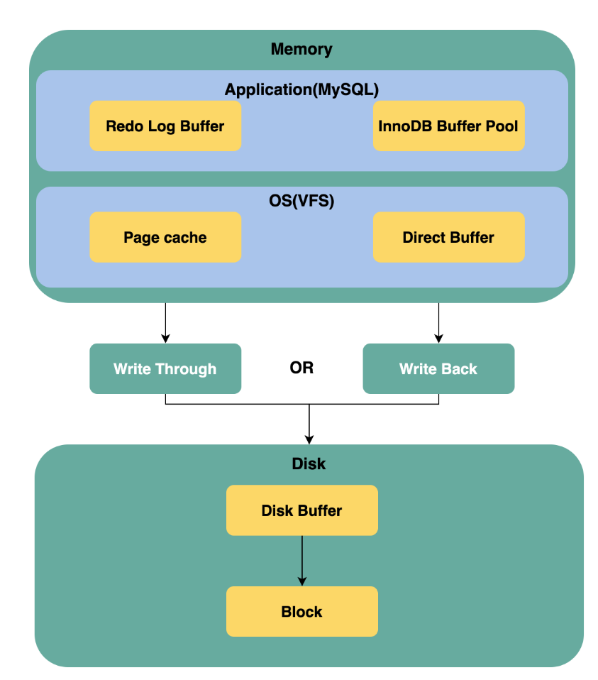
    - 应用层：
      - Redo Log Buffer：对写操作进行缓存，用于实现 MySQL InnoDB 的事务性；
      - InnoDB Buffer Pool：用于对 MySQL table 的数据进行缓存。读内存而不是磁盘，通过减少磁盘读操的方式提高读操作性能；写内存而不是磁盘，通过减少磁盘写操的方式提高写操作性能；
    - 操作系统的 VFS（Virtual file system，虚拟文件系统）层：
      - Page Cache：操作系统通过缓存以及预读机制对文件系统中的 block 基于 page 进行缓存管理；
      - Direct Buffer：当使用 Direct I/O 提供的相关 API 时，操作系统不再提供基于 Page Cache 机制的缓存，而是直接使用 Direct Buffer；
    - 磁盘的 Disk Buffer：磁盘也可以提供磁盘缓存，通常在 MySQL 中会关闭磁盘缓存，我们仅仅需要了解有 Disk Buffer 这一概念即可。
    - MySQL 为此提供了一些参数来控制 Page Cache 数据落盘的具体行为
      - innodb_flush_log_at_trx_commit
        - 1（默认值）：每次事务提交时都日志必须刷新到磁盘上，提供了最可靠的事务性保证；
        - 0：日志每间隔 1 秒刷新到磁盘上，这意味着在缓存中还没有来得及刷新到磁盘上的数据在宕机时会丢失；
        - 2：日志在事务提交后以及每间隔 1 秒刷新到磁盘上，这意味着在缓存中还没有来得及刷新到磁盘上的数据在宕机时会丢失；
      - innodb_flush_method
        - fdatasync，即取值 0，这是默认配置值。对 log files 以及 data files 都采用 fsync 的方式进行同步；
        - O_DSYNC，即取值 1。对 log files 使用 O_SYNC 打开与刷新日志文件，使用 fsync 来刷新 data files 中的数据；
        - O_DIRECT，即取值 4。利用 Direct I/O 的方式打开 data file，并且每次写操作都通过执行 fsync 系统调用的方式落盘；
        - O_DIRECT_NO_FSYNC，即取值 5。利用 Direct I/O 的方式打开 data files，但是每次写操作并不会调用 fsync 系统调用进行落盘；
    - MySQL 日志刷新策略通过 sync_binlog 参数进行配置，其有 3 个可选配置：
      - sync_binlog=0：MySQL 应用将完全不负责日志同步到磁盘，将缓存中的日志数据刷新到磁盘全权交给操作系统来完成；
      - sync_binlog=1：MySQL 应用在事务提交前将缓存区的日志刷新到磁盘；
      - sync_binlog=N：当 N 不为 0 与 1 时，MySQL 在收集到 N 个日志提交后，才会将缓存区的日志同步到磁盘。
  - MySQL 的典型配置
    - innodb_flush_log_at_trx_commit 参数配置为 1：Redo Log 走 Page Cache，并且每次写操作的日志在事务提交前都通过 fsync 刷新到磁盘；
    - innodb_flush_method 参数配置为 O_DIRECT：InnoDB Buffer Pool 走 Direct I/O，并且每次写操作导致的文件数据（包括文件元数据）都通过 fsync 系统调用刷新到磁盘；
    - 写一条 redo log 涉及到的步骤有：
      - 日志写入 Redo Log buffer；
      - 日志写入 Page Cache；
      - 通过系统调用 fsync 将 Page Cache 中的脏页刷新到磁盘；
      - 日志提交；
    - 修改表的一行记录涉及到的步骤有：
      - 更新后的数据写于 InnoDB Buffer Pool；
      - 定时进行如下逻辑（异步进行）：
        - InnoDB Buffer Pool 脏数据进行刷新，通过文件的 write 方法进行；
        - 文件的 write 方法直接导致数据写于磁盘上；
        - 定时进行文件的 fysnc 调用，确保文件元数据写于磁盘上；
- [Tips and Tricks++ for Querying and Indexing MongoDB](https://www.youtube.com/watch?v=5mBY27wVau0&list=PL4RCxklHWZ9u_xtprouvxCvzq2m6q_0_E&index=10)
  - ESR rule
    - A good starting place applicable to most user cases
    - Place keys in the following order
      - Equality first
      - Sort next
      - Range last
    - Remember
      - Some operators may be range instead of equality
      - Having consecutive keys used in the index is important
  - Operator Type Check
    - Inequality: $ne, $nin -> Range
    - Regex Operator: /car/, /^car/i -> Range
    - $in 
      - it depends with respect to key ordering
      - Alone: a series of Equality matches
      - Combines: possible a Range
      - Mongo optimize it as Merge Sort instead of Blocking Sort
  - Consecutive Index keys
  - Is the ESR rule always optimal? Nope
    - Check total keys examined from execute plan
- [mysql查询 limit 1000,10 和limit 10 速度一样快吗](https://mp.weixin.qq.com/s/LJwC-AT_sTVGazE9m4BiYw)
  - 我们经常会遇到需要分页查询的场景
    - 为了实现分页, 很容易联想到下面这样的sql语句 `select * from page order by id limit offset, size;`
  - 两种limit的执行过程
    - 对应 limit offset, size 和 limit size (即 limit 0, size) 两种方式
      - 如果是主键索引，它的叶子节点会存放完整的行数据信息。
      - 如果是非主键索引，那它的叶子节点则会存放主键，如果想获得行数据信息，则需要再跑到主键索引去拿一次数据，这叫回表。
    - mysql查询中 limit 1000,10 会比 limit 10 更慢。原因是 limit 1000,10 会取出1000+10条数据，并抛弃前1000条，这部分耗时更大
  - 优化
    - 主键索引
      - `select * from page  where id >=(select id from page  order by id limit 6000000, 1) order by id limit 10;`
    - 非主键索引
      - `select * from page t1, (select id from page order by user_name limit 6000000, 100) t2  WHERE t1.id = t2.id;`
  - 深度分页问题
    - 取出全表的数据 - 如果能从产品的形式上就做成不支持跳页会更好，比如只支持上一页或下一页
      ```sql
      datas = [select * from page where id > start_id order by id limit 100;]
      
      start_id = get_max_id_from(datas)
      ```
    - 如果数据量很少，比如1k的量级，且长期不太可能有巨大的增长，还是用limit offset, size 的方案吧，整挺好，能用就行
- [Memory Optimization for Redis](https://docs.redis.com/latest/ri/memory-optimizations/)
  - Developer best practices
    - Avoid dynamic Lua script
      - Remember to track your Lua memory consumption and flush the cache periodically with a SCRIPT FLUSH.
      - Do not hardcode and/or programmatically generate key names in your Lua scripts because it makes them useless in a clustered Redis setup.
    - Switch to 32-bits
      - 64-bit has more memory available as compared to a 32-bit machine. But if you are sure that your data size does not exceed 3 GB then storing in 32 bits is a good option.
      - 64-bit systems use considerably more memory than 32-bit systems to store the same keys, especially if the keys and values are small. This is because small keys are allocated full 64 bits resulting in the wastage of the unused bits.
      - trade offs
        - For the 32-bit Redis variant, any key name larger than 32 bits requires the key to span to multiple bytes, thereby increasing the memory usage.
    - Reclaim expired keys memory faster
      - When you set an expiry on a key, redis does not expire it at that instant. Instead, it uses a randomized algorithm to find out keys that should be expired. 
      - How to detect if memory is not reclaimed after expiry
        - Run the INFO command and find the total_memory_used and sum of all the keys for all the databases.
        - Then take a Redis Dump(RDB) and find out the total memory and total number of keys.
      - How to reclaim expired keys memory faster 
        - Increase memorysamples in redis conf. (default is 5, max is 10) so that expired keys are reclaimed faster.
        - You can set up a cron job that runs the scan command after an interval which helps in reclaiming the memory of the expired keys.
          - Passively: when you try to access it and the key is found to be timed out. This is how doing a full SCAN would help you, it forces a passive removal across all the keyspace.
        - Alternatively, Increasing the expiry of keys also helps.
      - Trade offs
        - If we increase the memorysamples config, it expires the keys faster, but it costs more CPU cycles, which increases latency of commands. 
        - Secondly, increasing the expiry of keys helps but that requires significant changes to application logic.
    - Use better serializer
      - Instead of default serializer of your programming language (java serialzed objects, python pickle, PHP serialize etc), switch to a better library. There are various libraries like - Protocol Buffers, MessagePack etc.
  - Data modeling recommendations
    - Combine smaller strings to hashes
      - Strings data type has an overhead of about 90 bytes on a 64 bit machine. In other words, calling set foo bar uses about 96 bytes, of which 90 bytes is overhead. You should use the String data type only if:
        - The value is at least greater than 100 bytes
        - You are storing encoded data in the string - JSON encoded or Protocol buffer
        - You are using the string data type as an array or a bitset
      - If you are not doing any of the above, then use Hashes
    - Convert hashtable to ziplist for hashes
      - Hashes have two types of encoding- HashTable and Ziplist. The decision of storing in which of the data structures in done based on the two configurations Redis provides - hash-max-ziplist-entries and hash-max-ziplist-values.
    - Switch from set to intset
      - Sets that contain only integers are extremely efficient memory wise. If your set contains strings, try to use integers by mapping string identifiers to integers.
    - Use smaller keys
      - Redis keys can play a devil in increasing the memory consumption for your Redis instances. In general, you should always prefer descriptive keys but if you have a large dataset having millions of keys then these large keys can eat a lot of your money.
    - Convert to a list instead of hash
      - A Redis Hash stores field names and values. If you have thousands of small hash objects with similar field names, the memory used by field names adds up. To prevent this, consider using a list instead of a hash. The field names become indexes into the list.
      - How does NamedTuple work
        - A NamedTuple is simply a read-only list, but with some magic to make that list look like a dictionary. Your application needs to maintain a mapping from field names to indexes,like "firstname" => 0, "lastname" => 1 and so on
    - Shard big hashes to small hashes
    - Switch to bloom filter or hyperloglog
      - storing every unique item you want want to count may use a prohibitive amount of memory. If this is the case, consider using a HyperLogLog instead
      - Bloom filters help when your set contains a high number of elements and you use the set to determine existence or to eliminate duplicates.
      - Trade Offs of using HyperLogLog:
        - The results that are achieved from HyperLogLog are not 100% accurate, they have an approximate standard error of 0.81%.
        - Hyperloglog only tells you the unique count. It cannot tell you the elements in the set.
  - Data compression methods
    - Compress field names 
      - Redis Hash consists of Fields and their values. Like values, field name also consumes memory, so it is required to keep in mind while assigning field names. If you have a large number of hashes with similar field names, the memory adds up significantly. To reduce memory usage, you can use smaller field names.
    - Compress values
      - Redis and clients are typically IO bound and the IO costs are typically at least 2 orders of magnitude in respect to the rest of the request/reply sequence. Redis by default does not compress any value that is stored in it, hence it becomes important to compress your data before storing in Redis.
      - How to compress strings
        - Snappy aims for high speed and reasonable compression.
        - LZO compresses fast and decompresses faster.
        - Others such as Gzip are more widely available.
        - GZIP compression uses more CPU resources than Snappy or LZO, but provides a higher compression ratio
        - GZip is often a good choice for cold data, which is accessed infrequently. 
        - Snappy or LZO are a better choice for hot data, which is accessed frequently.
    - Enable compression for list
      - List is just a link list of arrays, where none of the arrays are compressed. By default, redis does not compress elements inside a list. However, if you use long lists, and mostly access elements from the head and tail only, then you can enable compression.
      - What is compression-depth
        - List-compression-depth=1 compresses every list node except the head and tail of the list.
        - List-compression-depth=2 never compresses the head or head->next or the tail or tail->prev.
        - List-compression-depth=3 starts compression after the head->next->next and before the tail->prev->prev, etc.
- [mysql插入数据会失败?](https://mp.weixin.qq.com/s/Tmbqr7RMHiMbUHRQWYZX4w)
  - 字符串里含有emoji表情，插入就会报错
  - 编码和字符集的关系
    - utf-8字符集就是所有utf-8编码格式的字符的合集
  - mysql的字符集
    - `show charset;`
    - utf8和utf8mb4的区别
      - utf8mb4编码，mb4就是most bytes 4的意思，从上图最右边的Maxlen可以看到，它最大支持用4个字节来表示字符
        - 通过SHOW COLLATION WHERE Charset = 'utf8mb4';可以查看到utf8mb4下支持什么比较规则。
      - utf8，它是数据库的默认字符集. 它最多支持用3个字节去表示字符，按utf8mb4的命名方式，准确点应该叫它utf8mb3。
  - 如何查看数据库表的字符集
    - `show table status from database like tabelname;`
  - 加入了emoji表情这种utf8mb4才能支持的字符，mysql识别到这是utf8mb3不支持的字符，于是忍痛报错
  - Fix: `ALTER TABLE user CONVERT TO CHARACTER SET utf8mb4 COLLATE utf8mb4_general_ci;`
- [sql优化的15个小技巧](https://mp.weixin.qq.com/s/Vv6IB9toAJ2AThdJxIOgqA)
  - 避免使用`select *` - select *不会走覆盖索引，会出现大量的回表操作，而从导致查询sql的性能很低。
  - 用union all代替union 
    - union关键字后，可以获取排重后的数据
    - union all关键字，可以获取所有数据，包含重复的数据
  - 小表驱动大表
    - in 适用于左边大表，右边小表 - 如果sql语句中包含了in关键字，则它会优先执行in里面的子查询语句，然后再执行in外面的语句。如果in里面的数据量很少，作为条件查询速度更快
    - exists 适用于左边小表，右边大表 - 如果sql语句中包含了exists关键字，它优先执行exists左边的语句（即主查询语句）
  - 批量操作
  - 高效的分页
    - 先找到上次分页最大的id，然后利用id上的索引查询
    - 还能使用between优化分页
  - 用连接查询代替子查询
    - mysql中如果需要从两张以上的表中查询出数据的话，一般有两种实现方式：子查询 和 连接查询 join。
    - mysql执行子查询时，需要创建临时表，查询完毕后，需要再删除这些临时表，有一些额外的性能消耗。
  - join时要注意
    - 如果两张表使用inner join关联，mysql会自动选择两张表中的小表，去驱动大表，所以性能上不会有太大的问题。
    - 使用left join关联，mysql会默认用left join关键字左边的表，去驱动它右边的表。如果左边的表数据很多时，就会出现性能问题
  - 选择合理的字段类型
    - 能用数字类型，就不用字符串，因为字符的处理往往比数字要慢。
    - 尽可能使用小的类型，比如：用bit存布尔值，用tinyint存枚举值等。
    - 长度固定的字符串字段，用char类型。
    - 长度可变的字符串字段，用varchar类型。
    - 金额字段用decimal，避免精度丢失问题
  - 提升group by的效率 - Where 之后再 group by
  - 索引优化
    - [Explain](https://mp.weixin.qq.com/s?__biz=MzkwNjMwMTgzMQ==&mid=2247490262&idx=1&sn=a67f610afa984ecca130a54a3be453ab&source=41#wechat_redirect)
      - key（查看有没有使用索引）
      - key_len（查看索引使用是否充分）
      - type（查看索引类型）
        - system > const > eq_ref > ref > range > index > ALL
        - system/const：表中只有一行数据匹配，此时根据索引查询一次就能找到对应的数据
        - eq_ref：使用唯一索引扫描，常见于多表连接中使用主键和唯一索引作为关联条件
        - ref：非唯一索引扫描，还可见于唯一索引最左原则匹配扫描
        - range：索引范围扫描，比如，<，>，between 等操作
        - index：索引全表扫描，此时遍历整个索引树
        - ALL：表示全表扫描，需要遍历全表来找到对应的行
      - Extra（查看附加信息：排序、临时表、where条件为false等）
    
    - 要注意组合索引的字段的顺序
    - 优先考虑覆盖索引
  - [锁粒度](https://mp.weixin.qq.com/s/hERgwl3TKM2DzDqAe5Fi-A)
    - InnoDB 支持行锁和表锁. 通常建议采用 行锁，减少锁冲突、锁等待 的时间
    - 行锁可能会升级为表锁，有哪些场景呢
      - 如果一个表批量更新，大量使用行锁，可能导致其他事务长时间等待，严重影响事务的执行效率。此时，MySQL会将 行锁 升级为 表锁
      - 行锁是针对索引加的锁，如果 条件索引失效，那么 行锁 也会升级为 表锁
- [事务还没提交的时候，redolog 能不能被持久化到磁盘呢](https://mp.weixin.qq.com/s/quory0k_bcwrm9UyTrqd8g)
  - binlog 持久化
    - binlog cache 
      - 每个线程都有自己 binlog cache 区域，在事务运行的过程中，MySQL 会先把日志写到 binlog cache 中，等到事务真正提交的时候，再统一把 binlog cache 中的数据写到 binlog 文件中。
      - 这个从 binlog cache 写到 binlog 文件中的操作，并不就是落盘操作了，这里仅仅是把 binlog 写到了文件系统的 page cache 
      - 最后需要把 page cache 中的数据同步到磁盘上，才算真正完成了 binlog 的持久化（这一步对应下图中的 fsync 操作）。一般情况下，我们认为 fsync 才占磁盘的 IOPS (Input/Output Operations Per Second)
      - 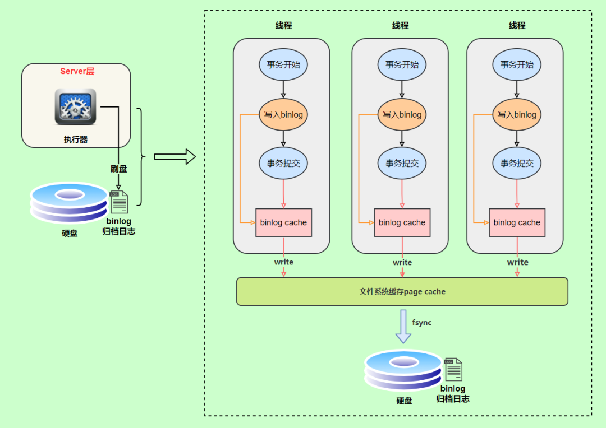
      - 上图的 write，是指把日志写入到文件系统的 page cache，并没有把数据持久化到磁盘，所以速度比较快
      - 上图的 fsync，才是将数据持久化到磁盘的操作
    - write 和 fsync 的时机，是由参数 sync_binlog 控制的：
      - sync_binlog = 0，每次提交事务的时候，只进行 write，不进行 fsync
      - sync_binlog = 1候，每次提交事务的时候，执行 write 和 fsync
      - sync_binlog = N(N>1)，每次提交事务的时候，执行 write，累积 N 个事务后再执行 fsyn
  - redolog 持久化
    - redolog buffer
      - 在事务运行的过程中，MySQL 会先把日志写到 redolog buffer 中，等到事务真正提交的时候，再统一把 redolog buffer 中的数据写到 redolog 文件中
      - 这个从 redolog buffer 写到 redolog 文件中的操作，并不就是落盘操作了，这里仅仅是把 redolog 写到了文件系统的 page cache 上，最后还需要执行 fsync 才能够实现真正的落盘。
      - 不同于 binlog cache 每个线程都有一个，redolog buffer 只有那么一个
    - 日志写到 redolog buffer 是很快的，wirte 到 page cache 也差不多，但是 fsync 持久化到磁盘的速度就慢多了，为了控制 redo log 的写入策略，InnoDB 提供了 innodb_flush_log_at_trx_commit 参数，它有三种可能取值：
      - innodb_flush_log_at_trx_commit = 0，每次事务提交的时候，都只是把 redolog 留在 redolog buffer 中
        - 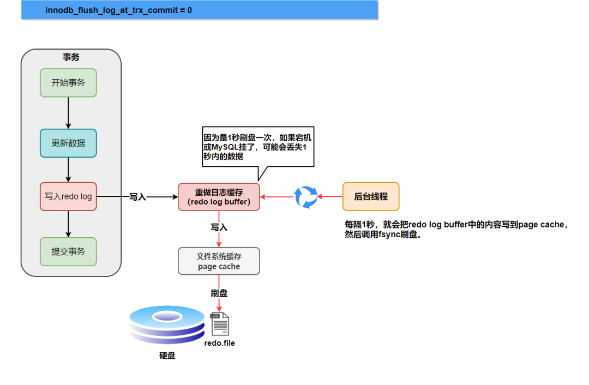
      - innodb_flush_log_at_trx_commit = 1，每次事务提交的时候，都执行 fsync 将 redolog 直接持久化到磁盘
        - 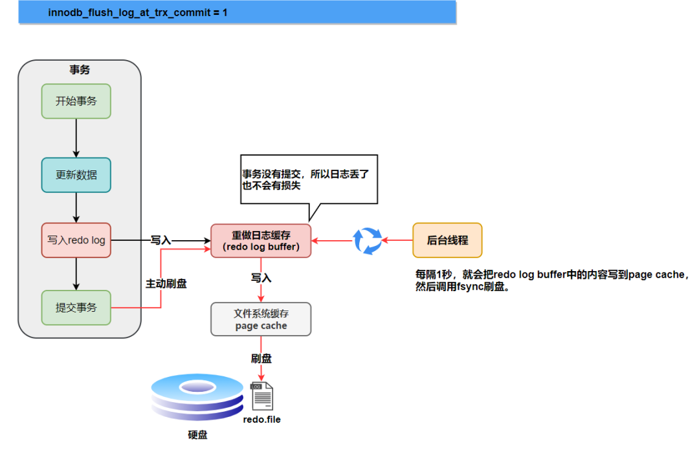
      - innodb_flush_log_at_trx_commit = 2，每次事务提交的时候，都只执行 write 将 redolog 写到文件系统的 page cache 中
  - 事务还没有提交的时候，redo log 是有可能被持久化到磁盘的
    - redolog 的具体落盘操作是这样的：在事务运行的过程中，MySQL 会先把日志写到 redolog buffer 中，等到事务真正提交的时候，再统一把 redolog buffer 中的数据写到 redolog 文件中。不过这个从 redolog buffer 写到 redolog 文件中的操作也就是 write 并不就是落盘操作了，这里仅仅是把 redolog 写到了文件系统的 page cache 上，最后还需要执行 fsync 才能够实现真正的落盘。
    - 也就是说，redolog 其实存在三种状态：
      - 事务执行过程中，存在 MySQL 的进程内存中的 redolog buffer 中
      - 事务提交，执行 write 操作存在文件系统的 page cache 中，但是没有执行 fsync 操作持久化到磁盘
      - 事务提交，执行 fsync 操作持久化到磁盘
    - 为什么说事务还没提交的时候，redolog 也有可能被持久化到磁盘呢？
      - 主要有三种可能的原因：
        - 第一种情况：InnoDB 有一个后台线程，每隔 1 秒轮询一次，具体的操作是这样的：调用 write 将 redolog buffer 中的日志写到文件系统的 page cache，然后调用 fsync 持久化到磁盘。而在事务执行中间过程的 redolog 都是直接写在 redolog buffer 中的，也就是说，一个没有提交的事务的 redolog，也是有可能会被后台线程一起持久化到磁盘的。
        - 第二种情况：innodb_flush_log_at_trx_commit 设置是 1，这个参数的意思就是，每次事务提交的时候，都执行 fsync 将 redolog 直接持久化到磁盘（还有 0 和 2 的选择，0 表示每次事务提交的时候，都只是把 redolog 留在 redolog buffer 中；2 表示每次事务提交的时候，都只执行 write 将 redolog 写到文件系统的 page cache 中）。举个例子，假设事务 A 执行到一半，已经写了一些 redolog 到 redolog buffer 中，这时候有另外一个事务 B 提交，按照 innodb_flush_log_at_trx_commit = 1 的逻辑，事务 B 要把 redolog buffer 里的日志全部持久化到磁盘，这时候，就会带上事务 A 在 redolog buffer 里的日志一起持久化到磁盘
        - 第三种情况：redo log buffer 占用的空间达到 redolog buffer 大小（由参数 innodb_log_buffer_size 控制，默认是 8MB）一半的时候，后台线程会主动写盘。不过由于这个事务并没有提交，所以这个写盘动作只是 write 到了文件系统的 page cache，仍然是在内存中，并没有调用 fsync 真正落盘
  - [redo log vs undo log vs  binlog](https://developer.aliyun.com/article/781018)
- [MySQL三大日志(binlog、redo log和undo log)的作用](https://mp.weixin.qq.com/s/GN6bqp69wFQYbIUoKbv6Ew)
  - 二进制日志 binlog（归档日志）和事务日志 redo log（重做日志）和 undo log（回滚日志）
    - redo log
      - redo log（重做日志）是InnoDB存储引擎独有的，它让MySQL拥有了崩溃恢复能力
      - MySQL 中数据是以页为单位，你查询一条记录，会从硬盘把一页的数据加载出来，加载出来的数据叫数据页，会放入到 Buffer Pool 中。
      - 后续的查询都是先从 Buffer Pool 中找，没有命中再去硬盘加载，减少硬盘 IO 开销，提升性能。
      - 更新表数据的时候，也是如此，发现 Buffer Pool 里存在要更新的数据，就直接在 Buffer Pool 里更新
    - binlog
      - binlog 是逻辑日志，记录内容是语句的原始逻辑 属于MySQL Server 层
      - binlog（归档日志）保证了MySQL集群架构的数据一致性
    - undo log
      - MVCC 的实现依赖于：隐藏字段、Read View、undo log
    - [两阶段提交](https://mp.weixin.qq.com/s/ltXgNa0fb63yQ26fEMvFeg)
      - 在执行更新语句过程，会记录redo log与binlog两块日志，以基本的事务为单位，redo log在事务执行过程中可以不断写入，而binlog只有在提交事务时才写入，所以redo log与binlog的写入时机不一样。
      - 为了解决两份日志之间的逻辑一致问题，InnoDB存储引擎使用两阶段提交方案。原理很简单，将redo log的写入拆成了两个步骤prepare和commit，这就是两阶段提交。
        - 写入binlog时发生异常也不会有影响，因为MySQL根据redo log日志恢复数据时，发现redo log还处于prepare阶段，并且没有对应binlog日志，就会回滚该事务
        - redo log设置commit阶段发生异常，那会不会回滚事务呢？并不会回滚事务，它会执行上图框住的逻辑，虽然redo log是处于prepare阶段，但是能通过事务id找到对应的binlog日志，所以MySQL认为是完整的，就会提交事务恢复数据。
      - 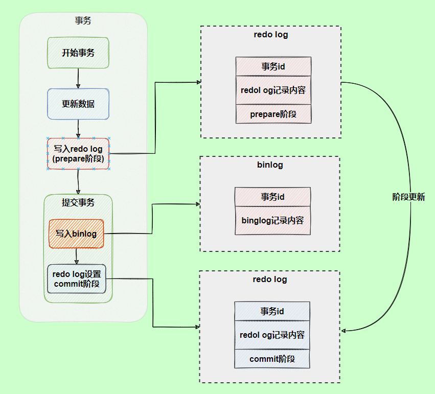
  - 总结
    - MySQL InnoDB 引擎使用 redo log(重做日志) 保证事务的持久性，使用 undo log(回滚日志) 来保证事务的原子性。
    - MySQL数据库的数据备份、主备、主主、主从都离不开binlog，需要依靠binlog来同步数据，保证数据一致性。
- [MySQL Question](https://mp.weixin.qq.com/s/CbpU9IVTqDkQlZ5V6c_Txw)
  - 为什么推荐使用自增 id 作为主键
    - 普通索引的 B+ 树上存放的是主键索引的值，如果该值较大，会「导致普通索引的存储空间较大」
    - 使用自增 id 做主键索引新插入数据只要放在该页的最尾端就可以，直接「按照顺序插入」，不用刻意维护
    - 页分裂容易维护，当插入数据的当前页快满时，会发生页分裂的现象，如果主键索引不为自增 id，那么数据就可能从页的中间插入，页的数据会频繁的变动，「导致页分裂维护成本较高」
  - Innodb 事务为什么要两阶段提交
    - 先写 redolog 后写binlog。假设在 redolog 写完，binlog 还没有写完的时候，MySQL 进程异常重启，这时候 binlog 里面就没有记录这个语句。然后你会发现，如果需要用这个 binlog 来恢复临时库的话，由于这个语句的 「binlog 丢失」，这个临时库就会少了这一次更新，恢复出来的这一行 c 的值就是 0，与原库的值不同。
    - 先写 binlog 后写 redolog。如果在 binlog 写完之后 crash，由于 redolog 还没写，崩溃恢复以后这个事务无效，所以这一行c的值是0。但是 binlog 里面已经记录了“把c从0改成1”这个日志。所以，在之后用 binlog 来恢复的时候就「多了一个事务出来」，恢复出来的这一行 c 的值就是 1，与原库的值不同。
  - WAL 是什么?有什么好处
    - WAL 就是 Write-Ahead Logging，其实就是「所有的修改都先被写入到日志中，然后再写磁盘」，用于保证数据操作的原子性和持久性。
    - 好处:
      - 「读和写可以完全地并发执行」，不会互相阻塞
      - 先写入 log 中，磁盘写入从「随机写变为顺序写」，降低了 client 端的延迟就。并且，由于顺序写入大概率是在一个磁盘块内，这样产生的 io 次数也大大降低
      - 写入日志当数据库崩溃的时候「可以使用日志来恢复磁盘数据」
  - 什么是索引下推
    - 如果存在某些被索引的列的判断条件时，MySQL 将这一部分判断条件传递给存储引擎，然后由存储引擎通过判断索引是否符合 MySQL 服务器传递的条件，「只有当索引符合条件时才会将数据检索出来返回给 MySQL 服务器」
  - 事务的隔离级别?
    - 可重复读 引起 幻读？
  - binlog vs undolog vs relaylog vs redolog
    - binlog 是归档日志，属于 Server 层的日志，是一个二进制格式的文件，用于「记录用户对数据库更新的SQL语句信息」。
      - 主从复制
      - 数据恢复
    - undolog 是 InnoDB 存储引擎的日志，用于保证数据的原子性，「保存了事务发生之前的数据的一个版本，也就是说记录的是数据是修改之前的数据，可以用于回滚」，同时可以提供多版本并发控制下的读（MVCC）
    - relaylog 是中继日志，「在主从同步的时候使用到」，它是一个中介临时的日志文件，用于存储从master节点同步过来的binlog日志内容
    - redolog 是 「InnoDB 存储引擎所特有的一种日志」，用于记录事务操作的变化，记录的是数据修改之后的值，不管事务是否提交都会记录下来
      - 数据恢复并且提供 crash-safe 能力
      - redo log 是固定大小的，比如可以配置为一组4个文件，每个文件的大小是1GB，那么总共就可以记录4GB的操作。「从头开始写，写到末尾就又回到开头循环写」
  - 说一说 mvcc 吧，有什么作用?
    - MVCC:多版本并发控制，是现代数据库(包括 MySQL、Oracle、PostgreSQL 等)引擎实现中常用的处理读写冲突的手段，目的在于「提高数据库高并发场景下的吞吐性能」。
    - 在 MVCC 协议下，每个读操作会看到一个一致性的快照，「这个快照是基于整个库的」，并且可以实现非阻塞的读，用于「支持读提交和可重复读隔离级别的实现」。
    - MVCC 允许数据具有多个版本，这个版本可以是时间戳或者是全局递增的事务 ID，在同一个时间点，不同的事务看到的数据是不同的，这个修改的数据是「记录在 undolog 中」的
  - 一条 Sql 语句查询一直慢会是什么原因
    - 没有用到索引 - 比如函数导致的索引失效，或者本身就没有加索引
    - 表数据量太大 - 考虑分库分表吧
    - 优化器选错了索引 - 考虑使用」 force index 强制走索引
  - 一条 Sql 语句查询偶尔慢会是什么原因
    - 数据库在刷新脏页
      - 比如 「redolog 写满了」，「内存不够用了」释放内存如果是脏页也需要刷，mysql 「正常空闲状态刷脏页」
    - 没有拿到锁
  - 主从延迟要怎么解决
    - 5.6 版本以后，提供了一种「并行复制」的方式，通过将 SQL 线程转换为多个 work 线程来进行重放
    - 「提高机器配置」(王道)
    - 在业务初期就选择合适的分库、分表策略，「避免单表单库过大」带来额外的复制压力
    - 「避免长事务」
    - 「避免让数据库进行各种大量运算」
    - 对于一些对延迟很敏感的业务「直接使用主库读」
  - 分布式式事务怎么实现?
    -「本地消息表」
    -「消息事务」
    -「二阶段提交」
    -「三阶段提交」
    -「TCC」
    -「最大努力通知」
    -「Seata 框架」
  - Mysql 中有哪些锁?
    - 基于锁的属性分类：共享锁、排他锁
    - 基于锁的粒度分类：表锁、行锁、记录锁、间隙锁、临键锁
    - 基于锁的状态分类：意向共享锁、意向排它锁、死锁
  - 为什么不要使用长事务
    - 并发情况下，数据库「连接池容易被撑爆」
    - 「容易造成大量的阻塞和锁超时」 长事务还占用锁资源，也可能拖垮整个库，
    - 执行时间长，容易造成「主从延迟」
    - 「回滚所需要的时间比较长」 - 事务越长整个时间段内的事务也就越多
    -「undolog 日志越来越大」
      长事务意味着系统里面会存在很老的事务视图。由于这些事务随时可能访问数据库里面的任何数据，所以这个事务提交之前，数据库里面它可能用到的回滚记录都必须保留，这就会导致大量占用存储空间。
  - Sql 调优思路
    - 「表结构优化」
      - 拆分字段
      - 字段类型的选择
      - 字段类型大小的限制
      - 合理的增加冗余字段
      - 新建字段一定要有默认值
    -「索引方面」
      - 索引字段的选择
      - 利用好mysql支持的索引下推，覆盖索引等功能
      - 唯一索引和普通索引的选择
    -「查询语句方面」
      - 避免索引失效
      - 合理的书写where条件字段顺序
      - 小表驱动大表
      - 可以使用force index()防止优化器选错索引
    -「分库分表」
- [分库分表会带来读扩散问题](https://mp.weixin.qq.com/s/HShytuc9Sw3p3kwCfbRbXw)
  - 分库分表
    - 垂直分表的原理比较简单，一般就是把某几列拆成一个新表，这样单行数据就会变小，B+树里的单个数据页（固定16kb）内能放入的行数就会变多，从而使单表能放入更多的数据。
    - 水平分表
      - 根据id范围分表
        - 因为id是递增的，那新写入的数据一般都会落到某一张表上，如果你的业务场景写数据特别频繁，那这张表就会出现写热点的问题。
      - 根据id取模分表
        - 优点当然是比较简单。而且读写数据都可以很均匀的分摊到每个分表上
        - 缺点也比较明显，如果想要扩展表的个数
      - 将上面两种方式结合起来
        - 可以在某个id范围里，引入取模的功能。比如 以前 2kw~4kw是user1表，现在可以在这个范围再分成5个表，也就是引入user1-0, user1-2到user1-4，在这5个表里取模。
        - 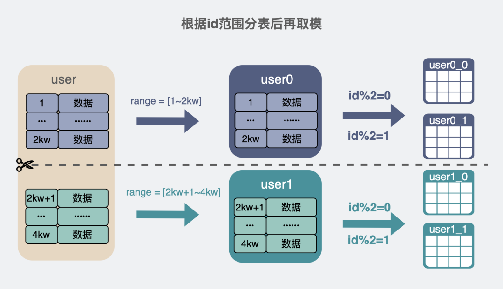
  - 读扩散问题
    - 分表方式，都用了id这一列作为分表的依据，这其实就是所谓的分片键。我们的查询又不是只查主键，如果我的数据库表有一列name，并且加了个普通索引。于是就会对所有分表都执行上面的sql，当然不会是串行执行sql，一般都是并发执行sql的。随着我的表越来越多，次数会越来越多，这就是所谓的读扩散问题
    - 怎么处理读扩散问题
      - 引入新表来做分表
        - 我们单独建个新的分片表，这个新表里的列就只有旧表的主键id和普通索引列，而这次换普通索引列来做分片键
        - 这个做法的缺点也比较明显，你需要维护两套表，并且普通索引列更新时，要两张表同时进行更改。
      - 倒排索引
        - 用es，它会在它内部以id分片键进行分片，同时还能建一个name到id，和一个age到id的倒排索引。
        - 改用tidb, 它支持普通索引，并且普通索引也是分片的，这是不是又跟上面提到的倒排索引方案很类似。
- [数据库主键一定要自增吗](https://mp.weixin.qq.com/s/vNRIFKjbe7itRTxmq-bkAA)
  - 为什么要用自增主键
    - 数据页大小固定了是16k，当我们需要插入一条新的数据，数据页会被慢慢放满，当超过16k时，这个数据页就有可能会进行分裂
    - 自增的主键遇到页分裂的可能性更少，因此性能也会更高。
  - 没有主键可以吗
    - mysql的innodb引擎内部会帮你生成一个名为ROW_ID列，它是个6字节的隐藏列，你平时也看不到它，但实际上，它也是自增的。有了这层兜底机制保证，数据表肯定会有主键和主键索引。
    - 跟ROW_ID被隐藏的列还有trx_id字段，用于记录当前这一行数据行是被哪个事务修改的，和一个roll_pointer字段，这个字段是用来指向当前这个数据行的上一个版本，通过这个字段，可以为这行数据形成一条版本链，从而实现多版本并发控制（MVCC）
  - [自增主键一定是连续?](https://mp.weixin.qq.com/s/KRZQIzmnorhuBnFGNfQKyQ)
    - MySQL 8.0 版本后，自增值的变更记录被放在了 redo log 中，提供了自增值持久化的能力，也就是实现了“如果发生重启，表的自增值可以根据 redo  log 恢复为 MySQL 重启前的值”
    - 不连续场景 1 - 自增初始值和自增步长设置不为 1
      - 如果插入数据时 id 字段指定为 0、null 或未指定值，那么就把这个表当前的 AUTO_INCREMENT 值填到自增字段；
      - 如果插入数据时 id 字段指定了具体的值，就直接使用语句里指定的值。
        - 根据要插入的值和当前自增值的大小关系，自增值的变更结果也会有所不同。假设某次要插入的值是 insert_num，当前的自增值是 autoIncrement_num：
           - 如果 insert_num < autoIncrement_num，那么这个表的自增值不变
           - 如果 insert_num >= autoIncrement_num，就需要把当前自增值修改为新的自增值
      - 为了避免两个库生成的主键发生冲突，我们可以让一个库的自增 id 都是奇数，另一个库的自增 id 都是偶数
        - 这个奇数偶数其实是通过 auto_increment_offset 和 auto_increment_increment 这两个参数来决定的，这俩分别用来表示自增的初始值和步长，默认值都是 1。
    - 不连续场景 2 - 唯一键冲突
      - 自增值修改的这个操作，是在真正执行插入数据的操作之前
      - 因为碰到唯一键 a 冲突，所以 id = 2 这一行并没有插入成功，但也没有将自增值再改回去。所以，在这之后，再插入新的数据行时，拿到的自增 id 就是 3。也就是说，出现了自增主键不连续的情况。
    - 不连续场景 3 - 事务回滚
    - 不连续场景 4 - 批量插入数据
      - insert…select 实际上往表中插入了 5 行数据 （1 1）（2 2）（3 3）（4 4）（5 5）。但是，这五行数据是分三次申请的自增 id，结合批量申请策略，每次申请到的自增 id 个数都是上一次的两倍
  - 有没有建议主键不自增的场景
    - mysql分库分表下的id 
      - 适合分库分表的uuid算法 - 趋势递增的uuid作为主键
      - 
    - 用户id不建议用自增id
    - tidb就推荐使用随机id，这样可以有效避免写热点的问题
- [mysql数据库单表最大两千万？](https://mp.weixin.qq.com/s?__biz=Mzg5NDY2MDk4Mw==&mid=2247488133&idx=1&sn=169533ab3946f2f018478d6d2abf532a&chksm=c01d6a9df76ae38be1b0be0c4c713a540e0e40a1bb4d0abd664aff899da64be2ad9df58deb59&scene=178&cur_album_id=2291088854981885958#rd)
  - 数据库单表行数最大多大
    - 主键声明为int大小，也就是32位，那么能支持2^32-1，也就是21个亿左右
    - 如果是bigint，那就是2^64-1，但这个数字太大，一般还没到这个限制之前，磁盘先受不了
    - 把主键声明为 tinyint，一个字节，8位，最大2^8-1，也就是255
  - 索引的结构
    - 页的结构 - 数据页，每份大小16k. 通过二分查找的方式将查找效率从O(n) 变成O(lgn)
      - 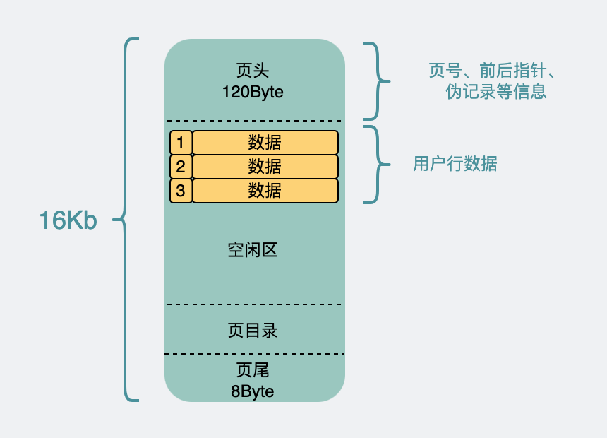
    - 从页到索引
      - 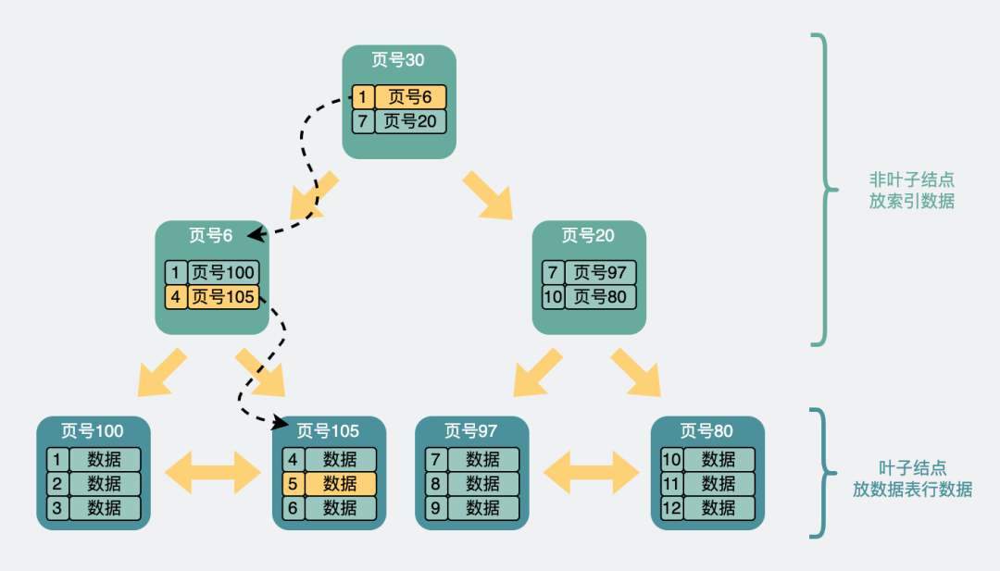
    - B+树承载的记录数量
      - 非叶子结点内指向其他内存页的指针数量为x
        - 非叶子节点里主要放索引查询相关的数据，放的是主键和指向页号
        - 主键假设是bigint（8Byte），而页号在源码里叫FIL_PAGE_OFFSET（4Byte），那么非叶子节点里的一条数据是12Byte左右。
        - 整个数据页16k， 页头页尾那部分数据全加起来大概128Byte，加上页目录毛估占1k吧。那剩下的15k除以12Byte，等于1280，也就是可以指向x=1280页。
      - 叶子节点内能容纳的record数量为y
        - 叶子节点和非叶子节点的数据结构是一样的，所以也假设剩下15kb可以发挥。
        - 叶子节点里放的是真正的行数据。假设一条行数据1kb，所以一页里能放y=15行。
      - B+树的层数为z
        - 假设B+树是两层，那z=2。则是(1280 ^ (2-1)) * 15 ≈ 2w
        - 假设B+树是三层，那z=3。则是(1280 ^ (3-1)) * 15 ≈ 2.5kw
      - B+树放的行数据总量等于 (x ^ (z-1)) * y
  - 行数超一亿就慢了吗？
    - 如果我单行数据用不了这么多，比如只用了250byte。那么单个数据页能放60行数据。
    - 那同样是三层B+树，单表支持的行数就是 (1280 ^ (3-1)) * 60 ≈ 1个亿。
  - B树承载的记录数量
    - B+树只在末级叶子结点处放数据表行数据，而B树则会在叶子和非叶子结点上都放。
    - 计算可承载的总行数的公式也变成了一个等比数列。 15 + 15^2 +15^3 + ... + 15^z
    - 为了能放2kw左右的数据，需要z>=6。也就是树需要有6层，查一次要访问6个页。假设这6个页并不连续，为了查询其中一条数据，最坏情况需要进行6次磁盘IO。
- [为何不建议使用redis PUBSUB进行消息订阅](https://mp.weixin.qq.com/s/cyyN8CvV5Ehz5U63hGGXZw)
  - 我们可以发现pubsub有如下缺点
    - 消息不持久化会丢失，连接断开重连期间消息也会丢失
    - 集群模式下存在网络带宽放大，严重限制有效吞吐。（通过7.0的SSUBSCRIBE可以解决）
    - 消息写入buffer，如果client处理不及时，那么会造成缓存区堆积。因此应用在使用的时候必须注意订阅者的消息处理速度以及buffer配置。
  - Summary
    - 由于pubsub可能丢失消息，业务使用的时候必须保证能容忍数据可丢，
    - 其次必须保证合理的buffer limit配置以及足够快的消息处理速度避免buffer 堆积。
    - 最后消息的内容必须不能太大否则会严重影响带宽吞吐。
- [Redis优化淘汰策略减少25%缓存占用](https://mp.weixin.qq.com/s/98d-So1rTvw1l6ogwmNd4w)
  - 本文介绍了[twitter](https://blog.twitter.com/engineering/en_us/topics/infrastructure/2019/improving-key-expiration-in-redis)如何通过优化key的过期淘汰，使得在一些集群中，redis的内存使用降低了25%。
  - 在 Redis 中有两种方式可以使key过期，主动和被动。扫描将触发被动key过期，当eky被读取时，将检查 TTL，如果过期则将其丢弃并且不返回任何内容。Redis 文档中描述了版本 3.2 中的主动过期机制。它从一个名为 activeExpireCycle 的函数开始。它运行在 Redis 称为 cron 的内部计时器上，每秒运行几次。该函数的作用是循环遍历每个键空间，检查设置了 TTL 的随机键，如果过期键达到百分比阈值，则重复此过程直到达到时间限制。
  - 在 2.4 和 3.2 版本之间，activeExpireCycle 的实现发生了变化。在 2.4 中，每次运行时都会检查每个数据库，在 3.2 中，现在可以检查的数据库数量有一个最大值。3.2 版还为该功能引入了一个快速选项。“慢”在计时器上运行，“快”在检查事件循环上的事件之前运行。快速到期周期会在某些条件下提前返回，并且函数超时和退出的阈值也较低。时间限制也被更频繁地检查。
- [Postgresql Lock](https://medium.com/compass-true-north/postgresql-lessons-we-learned-the-hard-way-663ddf666e4)
  - 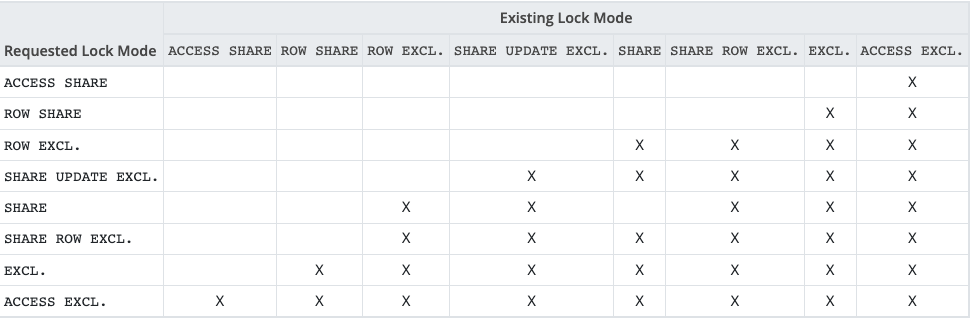
    - Access share lock: This lock is taken out by most SELECT statements. It can only block (and can only be blocked by) “ACCESS EXCLUSIVE” locks
    - Row exclusive lock: This is the lock taken out by most UPDATE statements. Despite the name, it is (like all the other locks we’re discussing today) a table-level lock. Though this lock allows other row exclusive locks on the same table, note that most writes which require row exclusive locks will also take out row-level-locks on the rows affected — and these row-level locks would block any updates that impact the same rows (again, row-level locks are out-of-scope here! Please read https://postgrespro.com/blog/pgsql/5968005 for more info).
    - Access exclusive lock: This lock is required by most ALTER TABLE statements (i.e. schema changes/db migrations). Note that this is the only lock that can block (and be blocked by) our all-important read queries (ie SELECT/“access share lock” commands). This will be an important plot point later in the article.
  - Investigation
    - `select * from pg_catalog.pg_stat_activity`
       ```sql
       -- Which lock is it waiting on
       select * from pg_stat_activity psa
       join pg_catalog.pg_locks pl on psa.pid = pl.pid
       left join pg_stat_all_tables psat on psat.relid = pl.relation
       where pl.pid = 33403;
       
       -- Why can’t we acquire the lock
       select * from pg_catalog.pg_blocking_pids(33403)
       
       -- What locks does *that* query have
       select * from pg_stat_activity psa
                       join pg_catalog.pg_locks pl on psa.pid = pl.pid
                       left join pg_stat_all_tables psat on psat.relid = pl.relation
       where pl.pid = 31825;
       
       -- why can’t that query finish
       select * from pg_catalog.pg_stat_activity where pid = 31825;
       ```
    - what is an idle-in-transaction query
      - A query is “idle in transaction” if a client began a transaction, but never committed or rolled it back
    - our database was locked because “idle in transaction” query + migration = locked db
  - Resolution
    - select pg_terminate_backend(31825);
    - select pg_cancel_backend(31825);
  - Prevention
    - Set idle-in-transaction timeout - idle_in_transaction_session_timeout
    - Set migration timeout - SET LOCAL statement_timeout
    - Acquire explicit lock with NOWAIT - 
    - Use read replicas
    - Limit who can access prod/staging database 
  - Preparation
    - Increase the number of superuser_reserved_connections
    - Enable log_locks_wait
- [Redis 持久化有哪几种方式](https://mp.weixin.qq.com/s/1PeBrB8K3JDpmcIqI8p9_A)
  - AOF
    - AOF（append only file） 持久化，采用日志的形式来记录每个写操作，追加到AOF文件的末尾。
    - AOF是执行完命令后才记录日志的。为什么不先记录日志再执行命令呢？这是因为Redis在向AOF记录日志时，不会先对这些命令进行语法检查，如果先记录日志再执行命令，日志中可能记录了错误的命令，Redis使用日志回复数据时，可能会出错。
    - 因为执行完命令后才记录日志，所以不会阻塞当前的写操作。但是会存在两个风险：
      - 更执行完命令还没记录日志时，宕机了会导致数据丢失
      - AOF不会阻塞当前命令，但是可能会阻塞下一个操作
    - 这两个风险最好的解决方案是折中妙用AOF机制的三种写回策略 appendfsync：
      - always，同步写回，每个子命令执行完，都立即将日志写回磁盘。
      - everysec，每个命令执行完，只是先把日志写到AOF内存缓冲区，每隔一秒同步到磁盘。
      - no：只是先把日志写到AOF内存缓冲区，有操作系统去决定何时写入磁盘。
    - AOF重写会阻塞嘛？AOF日志是由主线程会写的，而重写则不一样，重写过程是由后台子进程bgrewriteaof完成
    - AOF的优点：数据的一致性和完整性更高，秒级数据丢失。
    - AOF缺点：相同的数据集，AOF文件体积大于RDB文件。数据恢复也比较慢。
  - RDB
    - RDB，就是把内存数据以快照的形式保存到磁盘上。
    - RDB通过bgsave命令的执行全量快照，可以避免阻塞主线程。basave命令会fork一个子进程，然后该子进程会负责创建RDB文件，而服务器进程会继续处理命令请求
    - 快照时，数据能修改嘛？  Redis接住操作系统的写时复制技术（copy-on-write，COW）,在执行快照的同时，正常处理写操作。
    - 虽然bgsave执行不会阻塞主线程，但是频繁执行全量快照也会带来性能开销。比如bgsave子进程需要通过fork操作从主线程创建出来，创建后不会阻塞主线程，但是创建过程是会阻塞主线程的。可以做增量快照。
    - RDB的优点：与AOF相比，恢复大数据集的时候会更快，它适合大规模的数据恢复场景，如备份，全量复制等
    - RDB缺点：没办法做到实时持久化/秒级持久化。
  - 如何选择RDB和AOF
    - 如果数据不能丢失，RDB和AOF混用
    - 如果只作为缓存使用，可以承受几分钟的数据丢失的话，可以只使用RDB。
    - 如果只使用AOF，优先使用everysec的写回策略。
- [MySQL的自增id用完了怎么办](https://mp.weixin.qq.com/s/4dn4aFpg3qJw9Q49HoU-zA)
  - 表定义自增值id
    - 表定义的自增值达到上限后的逻辑是：再申请下一个id时，得到的值保持不变。进而导致继续插入数据时报主键冲突错误
  - InnoDB系统自增row_id
    - 若你创建的InnoDB表未指定主键，则InnoDB会自动创建一个不可见的，6个字节的row_id
    - 当表自增id到达上限后，则会归0再重新递增，如果出现相同的row_id，后写的数据会覆盖之前的数据
  - Xid
    - redo log和binlog有个共同字段Xid，用来对应事务
    - MySQL重启不会导致同一个binlog里面出现两个相同Xid，但若global_query_id达到上限，就会继续从0开始计数。理论上还是会出现同一个binlog里面出现相同Xid。
    - Xid只需要不在同一个binlog文件中出现重复值即可。虽然理论上会出现重复值，但是概率极小，可以忽略不计
    - InnoDB的max_trx_id 递增值每次MySQL重启都会被保存起来，所以我们文章中提到的脏读的例子就是一个必现的bug，好在留给我们的时间还很充裕
- [MySQL 自增列 Duplicate Error 问题分析](https://fanlv.wiki/2022/05/25/mysql-insert-auto-incre/)
  - 每次都是在数据迁移的时候，报这个PK Duplicate Error的错误，基本肯定是我们做数据迁移导致的。引出几个问题：
     - 生成自增ID实现方式？并发生成ID会不会冲突？
     - 生成自增ID加锁机制粒度，锁的释放机制是啥？
     - 生成自增ID和唯一索引冲突检查流程是怎么样的？
  - Auto-Incr 背景知识
    - AUTO_INCREMENT相关特性
      - InnoDB提供了一种可配置的锁定机制，可以显着提高向具有AUTO_INCREMENT列的表添加行的SQL语句的可伸缩性和性能。
      - 定义为AUTO_INCREMENT的列，必须是索引的第一列或者是唯一列，因为需要使用SELECT MAX(ai_col)查找以获得最大值列值。不这样定义，Create Table的时候会报1075 - Incorrect table definition; there can be only one auto column and it must be defined as a key错误。
      - AUTO_INCREMENT的列，可以只定义为普通索引，不一定要是PRIMARY KEY或者UNIQUE，但是为了保证AUTO_INCREMENT的唯一性，建议定义为PK或者UNIQUE
    - AUTO_INCREMENT 锁模式
      - 0：传统模式（traditional）
        - 在这一模式下，所有的insert语句(insert like) 都要在语句开始的时候得到一个表级的auto_inc锁，在语句结束的时候才释放这把锁，注意呀，这里说的是语句级而不是事务级的，一个事务可能包涵有一个或多个语句。
        - 它能保证值分配的可预见性，与连续性，可重复性，这个也就保证了insert语句在复制到slave的时候还能生成和master那边一样的值(它保证了基于语句复制的安全)。
        - 由于在这种模式下auto_inc锁一直要保持到语句的结束，所以这个就影响到了并发的插入。
      - 1：连续模式（consecutive）
        - 在这种模式下，对于simple insert语句，MySQL会在语句执行的初始阶段将一条语句需要的所有自增值会一次性分配出来，并且通过设置一个互斥量来保证自增序列的一致性，一旦自增值生成完毕，这个互斥量会立即释放，不需要等到语句执行结束。所以，在consecutive模式，多事务并发执行simple insert这类语句时， 相对traditional模式，性能会有比较大的提升。
        - 由于一开始就为语句分配了所有需要的自增值，那么对于像Mixed-mode insert这类语句，就有可能多分配了一些值给它，从而导致自增序列出现空隙。而traditional模式因为每一次只会为一条记录分配自增值，所以不会有这种问题。
        - 另外，对于Bulk inserts语句，依然会采取AUTO-INC锁。所以，如果有一条Bulk inserts语句正在执行的话，Simple inserts也必须等到该语句执行完毕才能继续执行。
      - 2：交错模式（interleaved）
        - 在这种模式下，对于所有的insert-like语句，都不会存在表级别的AUTO-INC锁，意味着同一张表上的多个语句并发时阻塞会大幅减少，这时的效率最高。
        - 但是会引入一个新的问题：当binlog_format为statement时，这时的复制没法保证安全，因为批量的insert，比如insert ..select..语句在这个情况下，也可以立马获取到一大批的自增ID值，不必锁整个表，slave在回放这个SQL时必然会产生错乱（binlog使用row格式没有这个问题）。
    - Others
      - 自增值的生成后是不能回滚的，所以自增值生成后，事务回滚了，那么那些已经生成的自增值就丢失了，从而使自增列的数据出现空隙。
      - 正常情况下，自增列是不存在0这个值的。所以，如果插入语句中对自增列设置的值为0或者null，就会自动应用自增序列。那么，如果想在自增列中插入为0这个值，怎么办呢？可以通过将SQL Mode设置为NO_AUTO_VALUE_ON_ZERO即可。
      - 在MySQL 5.7以及更早之前，自增序列的计数器(auto-increment counter)是保存在内存中的。auto-increment counter在每次MySQL重新启动后通过类似下面的这种语句进行初始化：
         SELECT MAX(AUTO_INC_COLUMN) FROM table_name FOR UPDATE
      - 而从MySQL 8开始，auto-increment counter被存储在了redo log中，并且每次变化都会刷新到redo log中。另外，我们可以通过ALTER TABLE … AUTO_INCREMENT = N来主动修改auto-increment counter。
    - 生产环境相关配置
      - 配置是innodb_autoinc_lock_mode = 2，binlog_format = ROW
  - Insert 流程源码分析
    - mysql_parse -> mysql_execute_command -> Sql_cmd_insert::execute -> Sql_cmd_insert::mysql_insert -> write_record -> handler::ha_write_row -> ha_innobase::write_row
    - 这里我们主要关注innodb层的数据写入函数ha_innobase::write_row 相关的代码就好了，生成自增ID和唯一索引冲突检查都是在这个函数里面完成的。
  - Summary
    - innodb_autoinc_lock_mode=2的时候，MySQL是申请到ID以后就会释放锁。并发生成自增ID不会冲突。
    - MySQL是先生成ID，再去做插入前的唯一索引冲突检查。如果一部分Client用MySQL自增ID，一部分Client用自己生成的ID，是有可能导致自增ID的Client报PK Duplicate Error的。
- [Ten Advanced SQL Concepts You Should Know for Data Science Interviews](https://towardsdatascience.com/ten-advanced-sql-concepts-you-should-know-for-data-science-interviews-4d7015ec74b0)
  - Common Table Expressions (CTEs)
    - If you ever wanted query a query, that’s when CTEs come into play — CTEs essentially create a temporary table.
    - Using common table expressions (CTEs) is a great way to modularize and break down your code, the same way that you would break down an essay into several paragraphs.
  - Recursive CTEs
     ```sql
     WITH expression_name (column_list)
     AS
     (
         -- Anchor member
         initial_query  
         UNION ALL
         -- Recursive member that references expression_name.
         recursive_query  
     )
     -- references expression name
     SELECT *
     FROM   expression_name
     ```
    - 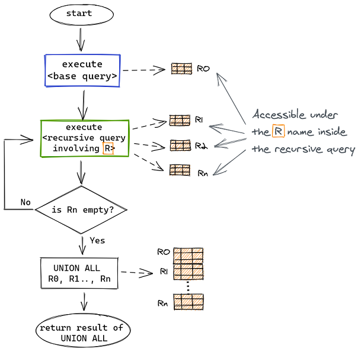
      - [ref](https://medium.com/swlh/recursion-in-sql-explained-graphically-679f6a0f143b)
      - base query executed first, taking whatever it needs to compute the result R0. 
      - Second recursive query is executed taking R0 as input, that is R references R0 in the recursive query when first executed. 
      - Recursive query produces the result R1 and that is what R will reference to at the next invocation. And so on until recursive query returns empty result. 
      - At that point all intermediate results are combined together.
  - Temporary Functions
    ```sql
    CREATE TEMPORARY FUNCTION get_seniority(tenure INT64) AS (
       CASE WHEN tenure < 1 THEN "analyst"
            WHEN tenure BETWEEN 1 and 3 THEN "associate"
            WHEN tenure BETWEEN 3 and 5 THEN "senior"
            WHEN tenure > 5 THEN "vp"
            ELSE "n/a"
       END
    );
    ```
  - EXCEPT vs NOT IN
    - EXCEPT filters out duplicates and returns distinct rows unlike NOT IN.
    - EXCEPT expects the same number of columns in both queries/tables, where NOT IN compares a single column from each query/table.
  - Calculating Delta Values - LAG
- [MySQL 主从](https://mp.weixin.qq.com/s/0uhM2jptAogSRHMc3sopbQ)
  - 为什么使用 MySQL 主从 
    - 读写分离：从库提供查询，减少主库压力，提升性能；
    - 高可用：故障时可切换从库，保证服务高可用；
    - 数据备份：数据备份到从库，防止服务器宕机导致数据丢失。
  - 主从复制原理
    - 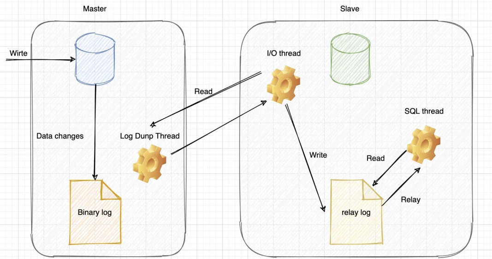
    - 主库写 binlog：主库的更新 SQL(update、insert、delete) 被写到 binlog；
    - 主库发送 binlog：主库创建一个 log dump 线程来发送 binlog 给从库；
    - 从库写 relay log：从库在连接到主节点时会创建一个 IO 线程，以请求主库更新的 binlog，并且把接收到的 binlog 信息写入一个叫做 relay log 的日志文件；
    - 从库回放：从库还会创建一个 SQL 线程读取 relay log 中的内容，并且在从库中做回放，最终实现主从的一致性。
  - 如何保证主从一致
    - 在 binlog = statement 格式时，主库在执行这条 SQL 时，使用的是索引 a，而从库在执行这条 SQL 时，使用了索引 create_time，最后主从数据不一致了
      - 可以把 binlog 格式修改为 row，row 格式的 binlog 日志记录的不是 SQL 原文，而是两个 event:Table_map 和 Delete_rows。
      - Table_map event 说明要操作的表，Delete_rows event用于定义要删除的行为，记录删除的具体行数。row 格式的 binlog 记录的就是要删除的主键 ID 信息，因此不会出现主从不一致的问题。
    - 但是如果 SQL 删除 10 万行数据，使用 row 格式就会很占空间，10 万条数据都在 binlog 里面，写 binlog 的时候也很耗 IO。但是 statement 格式的 binlog 可能会导致数据不一致。
      - 一个折中的方案，mixed 格式的 binlog，其实就是 row 和 statement 格式混合使用，当 MySQL 判断可能数据不一致时，就用 row 格式，否则使用就用 statement 格式。
  - 主从延迟
    - 主从延迟，其实就是“从库回放” 完成的时间，与 “主库写 binlog” 完成时间的差值，会导致从库查询的数据，和主库的不一致
    - 原理
      - 主从延迟主要是出现在 “relay log 回放” 这一步，当主库的 TPS 并发较高，产生的 DDL 数量超过从库一个 SQL 线程所能承受的范围，那么延时就产生了，
      - 当然还有就是可能与从库的大型 query 语句产生了锁等待。
    - 主从延迟情况
      - 从库机器性能：从库机器比主库的机器性能差，只需选择主从库一样规格的机器就好。
      - 从库压力大：可以搞了一主多从的架构，还可以把 binlog 接入到 Hadoop 这类系统，让它们提供查询的能力。
      - 从库过多：要避免复制的从节点数量过多，从库数据一般以3-5个为宜。
      - 大事务：如果一个事务执行就要 10 分钟，那么主库执行完后，给到从库执行，最后这个事务可能就会导致从库延迟 10 分钟啦。日常开发中，不要一次性 delete 太多 SQL，需要分批进行，另外大表的 DDL 语句，也会导致大事务。
      - 网络延迟：优化网络，比如带宽 20M 升级到 100M。
      - MySQL 版本低：低版本的 MySQL 只支持单线程复制，如果主库并发高，来不及传送到从库，就会导致延迟，可以换用更高版本的 MySQL，支持多线程复制。
    - 主从延迟解决方案
      - 使用缓存：我们在同步写数据库的同时，也把数据写到缓存，查询数据时，会先查询缓存，不过这种情况会带来 MySQL 和 Redis 数据一致性问题。
      - 查询主库：直接查询主库，这种情况会给主库太大压力，不建议这种方式。
      - 数据冗余：对于一些异步处理的场景，如果只扔数据 ID，消费数据时，需要查询从库，我们可以把数据全部都扔给消息队列，这样消费者就无需再查询从库
- [How Postgres Stores Rows](https://ketansingh.me/posts/how-postgres-stores-rows/)
  - PostgreSQL stores the actual data into segment files (more generally called heap files). Typically its fixed to 1GB size but you can configure that at compile time using --with-segsize.
  - These segment files contain data in fixed size pages which is usually **8Kb**, although a different page size can be selected when compiling the server with --with-blocksize
  - 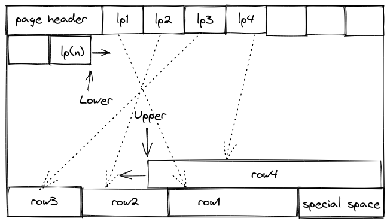
    - lp(1..N) is line pointer array. It points to a logical offset within that page. Since these are arrays, elements are fixed sized but the number of elements can vary.
    - row(1..N) represents actual SQL rows. They are added in reverse order within a page. They are generally variable sized and in order to reach to a specific tuple we use line pointer. Since there can be variable number of rows inside a page, items are added backward while line pointer is added to front.
    - special space is typically used when storing indexes in these page, usually sibling nodes in a B-Tree for example. For table data this is not used.
- [索引B+ tree VS Skip List]
  - mysql选了B+树做索引
    - B+树是多叉平衡搜索树，扇出高，只需要3层左右就能存放2kw左右的数据，同样情况下跳表则需要24层左右，假设层高对应磁盘IO，那么B+树的读性能会比跳表要好
  - redis使用跳表来实现ZSET，而不是树结构
    - redis的读写全在内存里进行操作，不涉及磁盘IO，同时跳表实现简单，相比B+树、AVL树、少了旋转树结构的开销
  - RocksDB内部使用了跳表，对比使用B+树的innodb，虽然写性能更好，但读性能属实差了些


