- [K8s Network Namespace](https://mp.weixin.qq.com/s/Vf_Pj5ofj0am6SRPtMn6GA)
  - 包含网卡（Network Interface），回环设备（Lookback Device），路由表（Routing Table）和iptables规则
    - Veth Pair：Veth设备对的引入是为了实现在不同网络命名空间的通信，总是以两张虚拟网卡（veth peer）的形式成对出现的。并且，从其中一端发出的数据，总是能在另外一端收到
    - Iptables/Netfilter：
        - Netfilter负责在内核中执行各种挂接的规则（过滤、修改、丢弃等），运行在内核中
        - Iptables模式是在用户模式下运行的进程，负责协助维护内核中Netfilter的各种规则表
    - 网桥：网桥是一个二层网络虚拟设备，类似交换机，主要功能是通过学习而来的Mac地址将数据帧转发到网桥的不同端口上
    - 路由: Linux系统包含一个完整的路由功能，当IP层在处理数据发送或转发的时候，会使用路由表来决定发往哪里
  - 同宿主机的容器时间如何通信呢？
    - 我们可以简单把他们理解成两台主机，主机之间通过网线连接起来，如果要多台主机通信，我们通过交换机就可以实现彼此互通，在Linux中，我们可以通过网桥来转发数据。
    - 在容器中，以上的实现是通过docker0网桥，凡是连接到docker0的容器，就可以通过它来进行通信。要想容器能够连接到docker0网桥，我们也需要类似网线的虚拟设备Veth Pair来把容器连接到网桥上。
    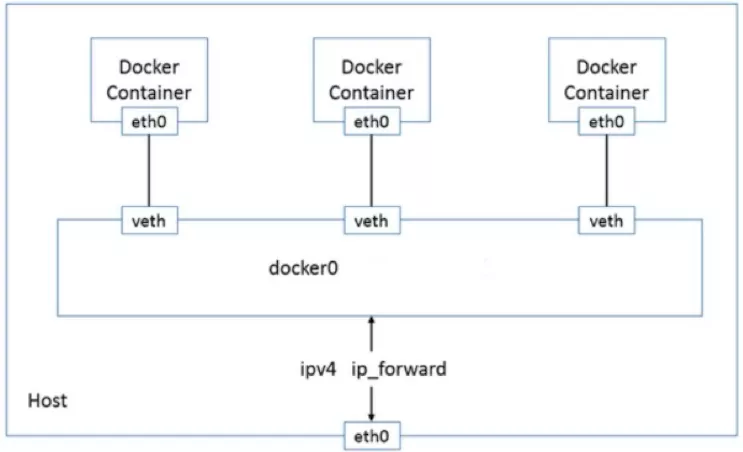
    - 默认情况下，通过network namespace限制的容器进程，本质上是通过Veth peer设备和宿主机网桥的方式，实现了不同network namespace的数据交换。
    - 与之类似地，当你在一台宿主机上，访问该宿主机上的容器的IP地址时，这个请求的数据包，也是先根据路由规则到达docker0网桥，然后被转发到对应的Veth Pair设备，最后出现在容器里。
  -跨主机网络通信
    - CNI即容器网络的API接口
    - CNI维护了一个单独的网桥来代替 docker0。这个网桥的名字就叫作：CNI 网桥，它在宿主机上的设备名称默认是：cni0。cni的设计思想，就是：Kubernetes在启动Infra容器之后，就可以直接调用CNI网络插件，为这个Infra容器的Network Namespace，配置符合预期的网络栈
    - CNI插件三种网络实现模式
      - Overlay模式是基于隧道技术实现的，整个容器网络和主机网络独立，容器之间跨主机通信时将整个容器网络封装到底层网络中，然后到达目标机器后再解封装传递到目标容器。不依赖与底层网络的实现。实现的插件有Flannel（UDP、vxlan）、Calico（IPIP）等等
      - 三层路由模式中容器和主机也属于不通的网段，他们容器互通主要是基于路由表打通，无需在主机之间建立隧道封包。但是限制条件必须依赖大二层同个局域网内。实现的插件有Flannel（host-gw）、Calico（BGP）等等
      - Underlay网络是底层网络，负责互联互通。容器网络和主机网络依然分属不同的网段，但是彼此处于同一层网络，处于相同的地位。整个网络三层互通，没有大二层的限制，但是需要强依赖底层网络的实现支持.实现的插件有Calico（BGP）等等
      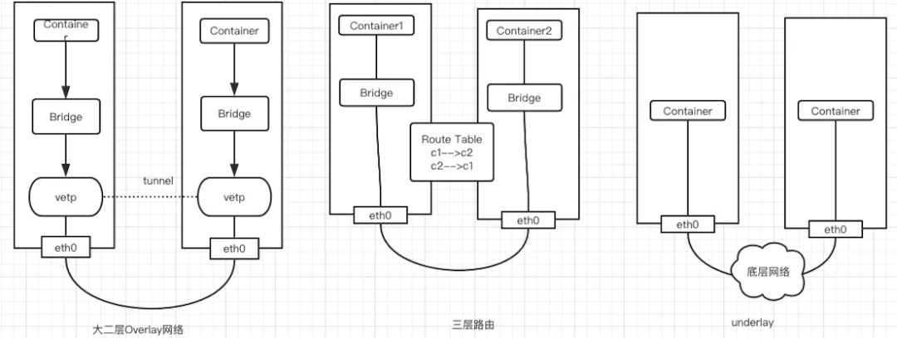
      
- GOMAXPROCS
  - CPU Affinity
    - CPU Affinity 是一种调度属性，它可以将单个进程绑定到一个或一组 CPU 上。
    - 在 SMP（Symmetric Multi-Processing 对称多处理）架构下，Linux 调度器（Scheduler）会根据 CPU affinity 的设置让指定的进程运行在绑定的 CPU 上，而不会在别的 CPU 上运行。 CPU Affinity 就是进程要在某个给定的 CPU 上尽量长时间地运行而不被迁移到其他处理器的倾向性。Linux 内核进程调度器天生就具有被称为软 CPU Affinity 的特性，这意味着进程通常不会在处理器之间频繁迁移。合理的设置 CPU Affinity（进程独占 CPU Core）可以提高程序处理性能。
  - GOMAXPROCS
    - Golang 的 Runtime 包中获取和设置 GOMAXPROCS，也就是 Go Scheduler 确定 P 数量的逻辑。在 Linux 上，它会利用系统调用 sched_getaffinity 来获得系统的 CPU 核数。
    - 可以通过 runtime.GOMAXPROCS() 来设定 P 的值，当前 Go 版本的 GOMAXPROCS 默认值已经设置为 CPU 的（逻辑核）核数， 这允许我们的 Go 程序充分使用机器的每一个 CPU, 最大程度的提高我们程序的并发性能。不过从实践经验中来看，IO 密集型的应用，可以稍微调高 P 的个数；而本文讨论的 Affinity 设置更适合 CPU 密集型的应用。
  - Docker CPU 调度
    - 默认容器会使用宿主机 CPU 是不受限制的
    - 要限制容器使用 CPU，可以通过参数设置 CPU 的使用，又细分为两种策略：
      - 将容器设置为普通进程，通过完全公平调度算法（CFS，Completely Fair Scheduler）调度类实现对容器 CPU 的限制 – 默认方案
      - 将容器设置为实时进程，通过实时调度类进行限制
    - docker（docker run）配置 CPU 使用量的参数主要下面几个，这些参数主要是通过配置在容器对应 cgroup 中，由 cgroup 进行实际的 CPU 管控。其对应的路径可以从 cgroup 中查看到
     ```shell
       --cpu-shares                    CPU shares (relative weight)
       --cpu-period                    Limit CPU CFS (Completely Fair Scheduler) period
       --cpu-quota                     Limit CPU CFS (Completely Fair Scheduler) quota
       --cpuset-cpus                   CPUs in which to allow execution (0-3, 0,1)
     ```
  - K8S里的CPU调度
    - kubernetes 对容器可以设置两个关于 CPU 的值：limits 和 requests，即 spec.containers[].resources.limits.cpu 和 spec.containers[].resources.requests.cpu
    - limits：该（单）pod 使用的最大的 CPU 核数 limits=cfs_quota_us/cfs_period_us 的值。比如 limits.cpu=3（核），则 cfs_quota_us=300000，cfs_period_us 值一般都使用默认的 100000
    - requests：该（单）pod 使用的最小的 CPU 核数，为 pod 调度提供计算依据
      - 一方面则体现在容器设置 --cpu-shares 上，比如 requests.cpu=3，–cpu-shares=1024，则 cpushare=1024*3=3072。
      - 另一方面，比较重要的一点，用来计算 Node 的 CPU 的已经分配的量就是通过计算所有容器的 requests 的和得到的，那么该 Node 还可以分配的量就是该 Node 的 CPU 核数减去前面这个值。当创建一个 Pod 时，Kubernetes 调度程序将为 Pod 选择一个 Node。每个 Node 具有每种资源类型的最大容量：可为 Pods 提供的 CPU 和内存量。调度程序确保对于每种资源类型，调度的容器的资源请求的总和小于 Node 的容量。尽管 Node 上的实际内存或 CPU 资源使用量非常低，但如果容量检查失败，则调度程序仍然拒绝在节点上放置 Pod。
  - 在 Docker-container 和 Kubernetes 集群中，存在 GOMAXPROCS 会错误识别容器 cpu 核心数的问题
    - Uber 的这个库 automaxprocs，大致原理是读取 CGroup 值识别容器的 CPU quota，计算得到实际核心数，并自动设置 GOMAXPROCS 线程数量
 
- [为什么容器内存占用居高不下，频频 OOM](https://eddycjy.com/posts/why-container-memory-exceed/)

  排查方向
  - 频繁申请重复对象
    - 怀疑是否在量大时频繁申请重复对象，而 Go 本身又没有及时释放内存，因此导致持续占用。
    - 想解决 “频繁申请重复对象”，我们大多会采用多级内存池的方式，也可以用最常见的 sync.Pool
      - 形成 “并发⼤－占⽤内存⼤－GC 缓慢－处理并发能⼒降低－并发更⼤”这样的恶性循环
    - 通过拉取 PProf goroutine，可得知 Goroutine 数并不高
  - 不知名内存泄露
    - 可以借助 PProf heap（可以使用 base -diff）
    - 接下通过命令也可确定 Go 进程的 RSS 并不高。 [但 VSZ 却相对 “高” 的惊人](https://eddycjy.com/posts/go/talk/2019-09-24-why-vsz-large/)
    - 从结论上来讲，也不像 Go 进程内存泄露的问题，因此也将其排除
  - madvise 策略变更
    - 在 Go1.12 以前，Go Runtime 在 Linux 上使用的是 MADV_DONTNEED 策略，可以让 RSS 下降的比较快，就是效率差点。
    - 在 Go1.12 及以后，Go Runtime 专门针对其进行了优化，使用了更为高效的 MADV_FREE 策略。但这样子所带来的副作用就是 RSS 不会立刻下降，要等到系统有内存压力了才会释放占用，RSS 才会下降。
    - MADV_FREE 的策略改变，[需要 Linux 内核在 4.5 及以上](https://github.com/golang/go/issues/23687). go的老版本需要 run binary with GODEBUG=madvdontneed=1 就可以归还给系统了，或者直接升级到go 1.16
  - 监控/判别条件有问题
    - OOM 的判断标准是 container_memory_working_set_bytes 指标
  - 容器环境的机制
    - container_memory_working_set_bytes 是由 cadvisor 提供的，对应下述指标 `kc top`
    - Memory 换算过来是 4GB+, 显然和 RSS 不对标
  
  原因
  - 从 [cadvisor/issues/638](https://github.com/google/cadvisor/issues/638) 可得知 container_memory_working_set_bytes 指标的组成实际上是 RSS + Cache。而 Cache 高的情况，常见于进程有大量文件 IO，占用 Cache 可能就会比较高
  - 只要是涉及有大量文件 IO 的服务，基本上是这个问题的老常客了
  
  解决
  - cadvisor 所提供的判别标准 container_memory_working_set_bytes 是不可变更的，也就是无法把判别标准改为 RSS
  - 使用类 sync.Pool 做多级内存池管理，防止申请到 “不合适”的内存空间，常见的例子： ioutil.ReadAll：
  - 核心是做好做多级内存池管理，因为使用多级内存池，就会预先定义多个 Pool，比如大小 100，200，300的 Pool 池，当你要 150 的时候，分配200，就可以避免部分的内存碎片和内存碎块
- [Orphan process in docker](https://petermalmgren.com/orphan-children-handling-containerd/)
  - PID 1 processes behave differently than other processes in a few different ways:
    - They don’t get the default system signal handlers, so they are responsible for defining their own
    - They are responsible for reaping zombie processes, or processes that have terminated but whose exit statuses haven’t been read
    - Most importantly (for this scenario), they are responsible for adopting orphaned children and waiting on them to finish
  - When writing code that runs in a Docker container, there are four questions you’ll want to answer:
     - Does your process respond to SIGTERM signals and gracefully shutdown?
     - If spawning child processes, does your parent forward signals to them?
     - If spawning child processes, does your parent process call os.wait() to see if they unexpectedly die?
     - If spawning child processes, do you wait on all of your processes to exit before exiting yourself?

- [一文搞懂 Kubernetes 中数据包的生命周期](https://mp.weixin.qq.com/s/SqCwa069y4dcVQ1fWNQ0Wg)
  - [Source](https://dramasamy.medium.com/life-of-a-packet-in-kubernetes-part-1-f9bc0909e051)
  - Linux 命名空间
    - Mount：隔离文件系统加载点；
    - UTS：隔离主机名和域名；
    - IPC：隔离跨进程通信（IPC）资源；
    - PID：隔离 PID 空间；
    - 网络：隔离网络接口；
    - 用户：隔离 UID/GID 空间；
    - Cgroup：隔离 cgroup 根目录。
  - 容器网络（网络命名空间）
    - 在主流 Linux 操作系统中都可以简单地用 ip 命令创建网络命名空间
      ```shell
      $ ip netns add client
      $ ip netns add server
      $ ip netns list
      server
      client
      ```
    - 创建一对 veth 将命名空间进行连接，可以把 veth 想象为连接两端的网线。
      ```shell
      $ ip link add veth-client type veth peer name veth-server
      $ ip link list | grep veth
      4: veth-server@veth-client: <BROADCAST,MULTICAST,M-DOWN> mtu 1500 qdisc noop state DOWN mode DEFAULT group default qlen 1000
      5: veth-client@veth-server: <BROADCAST,MULTICAST,M-DOWN> mtu 1500 qdisc noop state DOWN mode DEFAULT group default qlen 1000
      ```
    - 这一对 veth 是存在于主机的网络命名空间的，接下来我们把两端分别置入各自的命名空间
      ```shell
      $ ip link set veth-client netns client
      $ ip link set veth-server netns server
      $ ip link list | grep veth # doesn’t exist on the host network namespace now
      ```
    - 检查一下命名空间中的 veth 状况
      ```shell
      $ ip netns exec client ip link
      1: lo: <LOOPBACK> mtu 65536 qdisc noop state DOWN mode DEFAULT group default qlen 1    link/loopback 00:00:00:00:00:00 brd 00:00:00:00:00:00
      5: veth-client@if4: <BROADCAST,MULTICAST> mtu 1500 qdisc noop state DOWN mode DEFAULT group default qlen 1000    link/ether ca:e8:30:2e:f9:d2 brd ff:ff:ff:ff:ff:ff link-netnsid 1
      $ ip netns exec server ip link
      1: lo: <LOOPBACK> mtu 65536 qdisc noop state DOWN mode DEFAULT group default qlen 1    link/loopback 00:00:00:00:00:00 brd 00:00:00:00:00:00
      4: veth-server@if5: <BROADCAST,MULTICAST> mtu 1500 qdisc noop state DOWN mode DEFAULT group default qlen 1000    link/ether 42:96:f0:ae:f0:c5 brd ff:ff:ff:ff:ff:ff link-netnsid 0
      ```
    - 接下来给这些网络接口分配 IP 地址并启用
      ```shell
      $ ip netns exec client ip address add 10.0.0.11/24 dev veth-client
      $ ip netns exec client ip link set veth-client up
      $ ip netns exec server ip address add 10.0.0.12/24 dev veth-server
      $ ip netns exec server ip link set veth-server up
      $
      $ ip netns exec client ip addr
      $ ip netns exec server ip addr
      $ ip netns exec client ping 10.0.0.12  #使用 ping 命令检查一下两个网络命名空间的连接状况
      ```
    - 创建创建一个 Linux 网桥来连接这些网络命名空间。Docker 就是这样为同一主机内的容器进行连接的
      ```shell
      # All in one
      # ip link add <p1-name> netns <p1-ns> type veth peer <p2-name> netns <p2-ns>
      BR=bridge1
      HOST_IP=172.17.0.33
      # 新创建一对类型为veth peer的网卡
      ip link add client1-veth type veth peer name client1-veth-br
      ip link add server1-veth type veth peer name server1-veth-br
      ip link add $BR type bridge
      ip netns add client1
      ip netns add server1
      ip link set client1-veth netns client1
      ip link set server1-veth netns server1
      ip link set client1-veth-br master $BR
      ip link set server1-veth-br master $BR
      ip link set $BR up
      ip link set client1-veth-br up
      ip link set server1-veth-br up
      ip netns exec client1 ip link set client1-veth up
      ip netns exec server1 ip link set server1-veth up
      ip netns exec client1 ip addr add 172.30.0.11/24 dev client1-veth
      ip netns exec server1 ip addr add 172.30.0.12/24 dev server1-veth
      ip netns exec client1 ping 172.30.0.12 -c 5
      ip addr add 172.30.0.1/24 dev $BR
      ip netns exec client1 ping 172.30.0.12 -c 5
      ip netns exec client1 ping 172.30.0.1 -c 5
      ```
      
      从命名空间中 ping 一下主机 IP
       ```shell
       $ ip netns exec client1 ping $HOST_IP -c 2
       connect: Network is unreachable
       ```
      Network is unreachable 的原因是路由不通，加入一条缺省路由
       ```shell
       $ ip netns exec client1 ip route add default via 172.30.0.1
       $ ip netns exec server1 ip route add default via 172.30.0.1
       $ ip netns exec client1 ping $HOST_IP -c 5
       ```
  - 从外部服务器连接内网
    - 机器已经安装了 Docker，也就是说已经创建了 docker0 网桥
    - 运行一个 nginx 容器并进行观察
      ```shell
      $ docker run -d --name web --rm nginx
      efff2d2c98f94671f69cddc5cc88bb7a0a5a2ea15dc3c98d911e39bf2764a556
      $ WEB_IP=`docker inspect -f "{{ .NetworkSettings.IPAddress }}" web`
      $ docker inspect web --format '{{ .NetworkSettings.SandboxKey }}'
      /var/run/docker/netns/c009f2a4be71
      ```
    - Docker 创建的 netns 没有保存在缺省位置，所以 ip netns list 是看不到这个网络命名空间的。我们可以在缺省位置创建一个符号链接
      ```shell
      $ container_id=web
      $ container_netns=$(docker inspect ${container_id} --format '{{ .NetworkSettings.SandboxKey }}')
      $ mkdir -p /var/run/netns
      $ rm -f /var/run/netns/${container_id}
      $ ln -sv ${container_netns} /var/run/netns/${container_id}
      '/var/run/netns/web' -> '/var/run/docker/netns/c009f2a4be71'
      $ ip netns list
      web (id: 3)
      server1 (id: 1)
      client1 (id: 0)
      ```
    - 看看 web 命名空间的 IP 地址
      ```shell
      $ ip netns exec web ip addr
      $ WEB_IP=`docker inspect -f "{{ .NetworkSettings.IPAddress }}" web`
      $ echo $WEB_IP   # 然后看看容器里的 IP 地址
      $ curl $WEB_IP   # 从主机访问一下 web 命名空间的服务
      ```
    - 加入端口转发规则，其它主机就能访问这个 nginx 了
      ```shell
      $ iptables -t nat -A PREROUTING -p tcp --dport 80 -j DNAT --to-destination $WEB_IP:80
      $ echo $HOST_IP
      172.17.0.23
      
      $ curl 172.17.0.23 # 使用主机 IP 访问 Nginx
      ```
      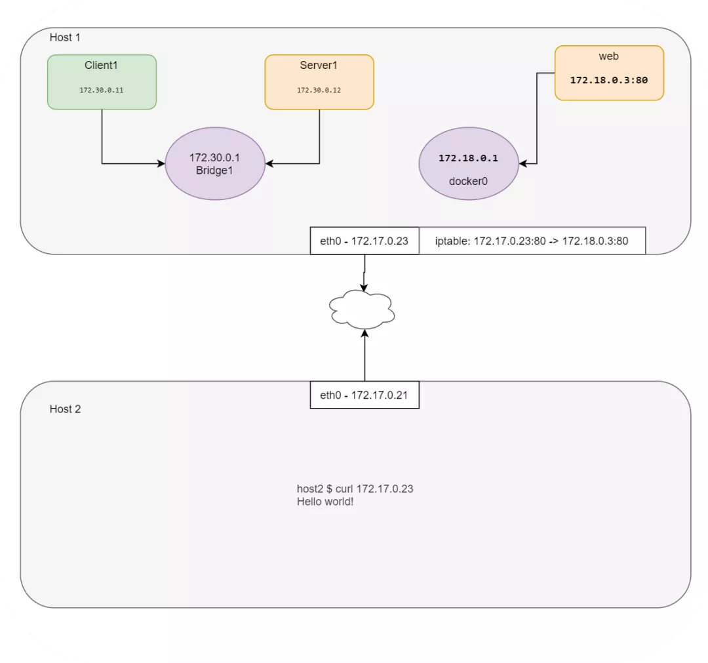
  - CNI
    - CNI 插件负责在容器网络命名空间中插入一个网络接口（也就是 veth 对中的一端）并在主机侧进行必要的变更（把 veth 对中的另一侧接入网桥）。然后给网络接口分配 IP，并调用 IPAM 插件来设置相应的路由。
    - [CNI 规范](https://github.com/containernetworking/cni/blob/master/SPEC.md)
    - 使用 CNI 插件而非 CLI 命令进行 IP 分配。完成 Demo 就会更好地理解 Kubernetes 中 Pod 的本质
      - 下载 CNI 插件
        ```shell
        $ mkdir cni
        $ cd cni
        $ curl -O -L https://github.com/containernetworking/cni/releases/download/v0.4.0/cni-amd64-v0.4.0.tgz
        $ tar -xvf cni-amd64-v0.4.0.tgz
        ```
      - 创建一个 JSON 格式的 CNI 配置（00-demo.conf）
        ```shell
        {
            "cniVersion": "0.2.0",
            "name": "demo_br",
            "type": "bridge",
            "bridge": "cni_net0",
            "isGateway": true,
            "ipMasq": true,
            "ipam": {
                "type": "host-local",
                "subnet": "10.0.10.0/24",
                "routes": [
                    { "dst": "0.0.0.0/0" },
                    { "dst": "1.1.1.1/32", "gw":"10.0.10.1"}
                ]    
            }
        }
        type: The name of the plugin you wish to use.  In this case, the actual name of the plugin executable
        args: Optional additional parameters
        ipMasq: Configure outbound masquerade (source NAT) for this network
        ipam:
            type: The name of the IPAM plugin executable
            subnet: The subnet to allocate out of (this is actually part of the IPAM plugin)
            routes:
                dst: The subnet you wish to reach
                gw: The IP address of the next hop to reach the dst.  If not specified the default gateway for the subnet is assumed
        dns:
            nameservers: A list of nameservers you wish to use with this network
            domain: The search domain to use for DNS requests
            search: A list of search domains
            options: A list of options to be passed to the receiver
        ```
      - 创建一个网络为 none 的容器，这个容器没有网络地址。可以用任意的镜像创建该容器，这里我用 pause 来模拟 Kubernetes：
        ````shell
        docker run --name pause_demo -d --rm --network none kubernetes/pause
        $ container_id=pause_demo
        $ container_netns=$(docker inspect ${container_id} --format '{{ .NetworkSettings.SandboxKey }}')
        $ mkdir -p /var/run/netns
        $ rm -f /var/run/netns/${container_id}
        $ ln -sv ${container_netns} /var/run/netns/${container_id}
        '/var/run/netns/pause_demo' -> '/var/run/docker/netns/0297681f79b5'
        $ ip netns list
        pause_demo
        $ ip netns exec $container_id ifconfig
        ````
      - 用前面的配置来调用 CNI 插件
        ```go
        $ CNI_CONTAINERID=$container_id CNI_IFNAME=eth10 CNI_COMMAND=ADD CNI_NETNS=/var/run/netns/$container_id CNI_PATH=`pwd` ./bridge </tmp/00-demo.conf
        ```
        运行上面的命令会返回一些内容。
        - 首先是因为 IPAM 驱动在本地找不到保存 IP 信息的文件而报错。但是因为第一次运行插件时会创建这个文件，所以在其他命名空间再次运行这个命令就不会出现这个问题了。
        - 其次是得到一个说明插件已经完成相应 IP 配置的 JSON 信息。在本例中，网桥的 IP 地址应该是 10.0.10.1/24，命名空间网络接口的地址则是 10.0.10.2/24。另外还会根据我们的 JSON 配置文件，加入缺省路由以及 1.1.1.1/32 路由
      - Check
        ```shell
        $ ip netns exec pause_demo ifconfig
        $ ip netns exec pause_demo ip route
        # CNI 创建了网桥并根据 JSON 信息进行了相应配置
        $ ifconfig
        ```
      - 启动 Web Server 并共享 pause 容器命名空间
        ```shell
        $ docker run --name web_demo -d --rm --network container:$container_id nginx8fadcf2925b779de6781b4215534b32231685b8515f998b2a66a3c7e38333e30
        $ curl `cat /var/lib/cni/networks/demo_br/last_reserved_ip`
        ```
  - Pod 网络命名空间
    - Pod 不等于容器，而是一组容器。这一组容器会共享同一个网络栈。每个 Pod 都会包含有 pause 容器，Kubernetes 通过这个容器来管理 Pod 的网络。所有其他容器都会附着在 pause 容器的网络命名空间中，而 pause 除了网络之外，再无其他作用。因此同一个 Pod 中的不同容器，可以通过 localhost 进行互访
    - Master 和 Worker 节点上的路由表。每个节点都有一个容器，容器有一个 IP 地址和缺省的容器路由
      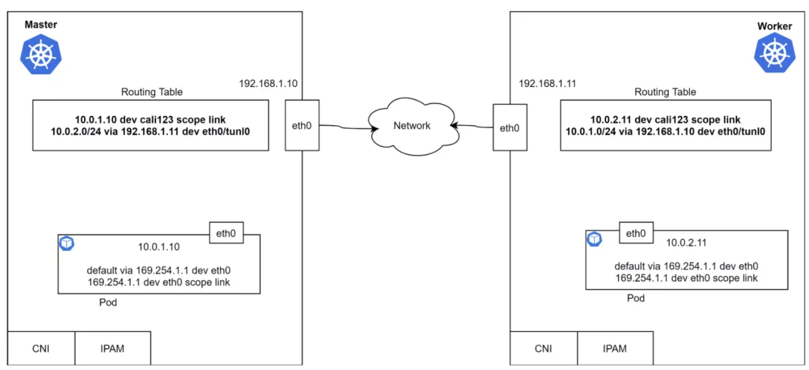
      上面的路由表说明，Pod 能够通过 3 层网络进行互通。什么模块负责添加路由，如何获取远端路由呢？为什么这里缺省网关是 169.254.1.1 呢
    - 第三方 CNI 插件，Calico 就是其中之一. Calico 的核心包括 Bird、Felix、ConfD、ETCD 以及 Kubernetes API Server
      - BIRD (BGP)
        - Bird 是一个 BGP 守护进程，运行在每个节点上，负责相互交换路由信息
        - BIRD 实例负责向其它 BIRD 实例传递路由信息。缺省配置方式就是 BGP Mesh，适用于小规模部署。在大规模集群中，建议使用 Route Reflector 来克服这个缺点
      - ConfD
        - ConfD 是一个简单的配置管理工具，运行在 Calico Node 容器中。它会从 ETCD 中读取数据（Calico 的 BIRD 配置），并写入磁盘文件。它会循环读取网络和子网，并应用配置数据（CIDR 键），组装为 BIRD 能够使用的配置
      - Felix
        - Calico Felix 守护进程在 Calico Node 容器中运行
        - 从 Kubernetes ETCD 中读取信息
        - 构建路由表
        - 配置 iptables 或者 IPVS
        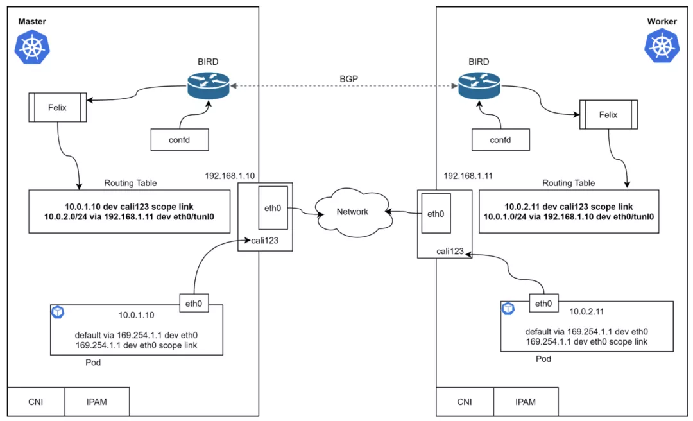
        - 数据包如何被路由到 Peer 节点的？
          - Master 上的 Pod 尝试 Ping 10.0.2.11
          - Pod 向网关发送一个 ARP 请求
          - 从 ARP 响应中得到 MAC 地址
          - 但是谁响应的 ARP 请求？答案是 proxy-arp, `cat /proc/sys/net/ipv4/conf/cali123/proxy_arp`
          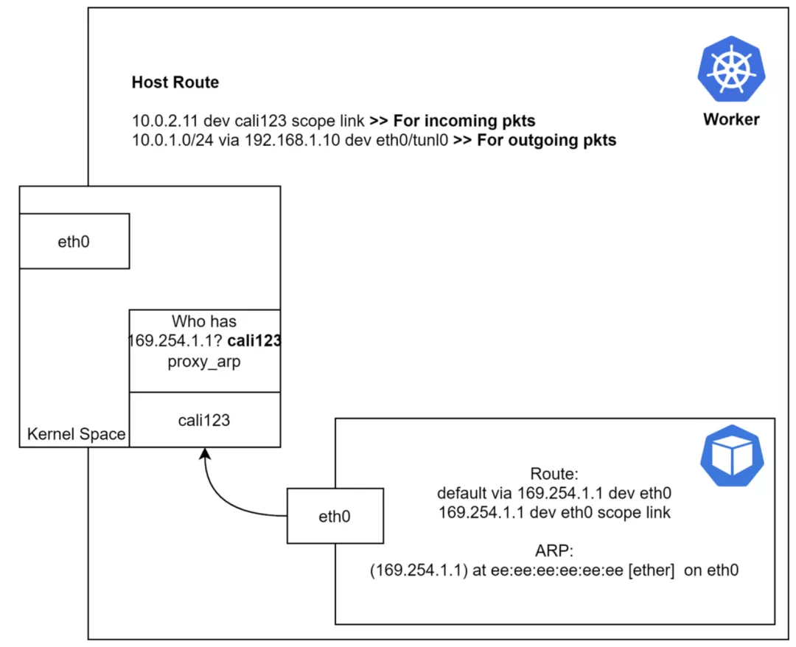
      - 路由模式
        - IP-in-IP：
          - 缺省，有封装行为；
          - 传输中的数据包带有一个外层头部，其中描述了源主机和目的 IP，还有一个内层头部，包含源 Pod 和目标 IP
        - Direct/NoEncapMode：
          - 无封包（推荐）
          - 用 Pod 发出时的原始格式发出来的。因为没有封包和解包的开销，这种模式比较有性能优势
          - AWS 中要使用这种模式需要关闭源 IP 校验
        - VxLan：
          - 有封包（无 BGP）
          - VXLAN 是 Virtual Extensible LAN 的缩写。VXLAN 是一种封包技术，二层数据帧被封装为 UDP 数据包。VXLAN 是一种网络虚拟化技术。当设备在软件定义的数据中心里进行通信时，会在这些设备之间建立 VXLAN 隧道。这些隧道能建立在物理或虚拟交换机之上
          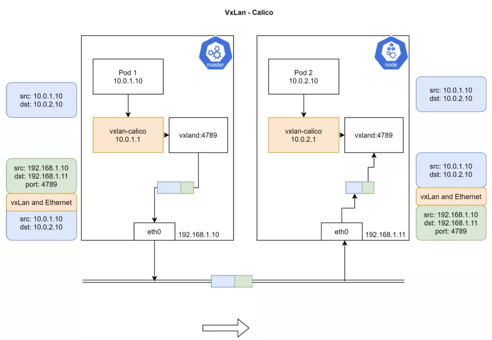
  - kube-proxy kube-proxy 是如何使用 iptables 控制流量的
    - Pod 到 Pod
      - kube-proxy 不会介入 Pod 到 Pod 之间的通信过程。所有的容器都无需 NAT 就能互相通信；节点和容器之间的通信也是无需 NAT 的。
      - Pod 的 IP 地址是不固定的（也有办法做成静态 IP，但是缺省配置是不提供这种保障的）。在 Pod 重启时 CNI 会给他分配新的 IP 地址，CNI 不负责维护 IP 地址和 Pod 的映射
    - Pod 到外部
      - Kubernetes 会使用 SNAT 完成从 Pod 向外发出的访问。SNAT 会将 Pod 的内部 IP:Port 替换为主机的 IP:Port。返回数据包到达节点时，IP:Port 又会换回 Pod。这个过程对于原始 Pod 是透明无感知的。
    - Pod 到 Service
      - Cluster IP
        - Service 的对象，是一个通向 Pod 的 4 层负载均衡. Service 是一个 API 对象，它用一个虚拟 IP 映射到一组 Pod。另外 Kubernetes 为每个 Service 的名称及其虚拟 IP 建立了 DNS 记录，因此可以轻松地根据名称进行寻址。
        - Service 对象有很多类型，最基本的类型叫做 ClusterIP，这种类型的 Service 有一个唯一的 VIP 地址，其路由范围仅在集群内部有效
        - 虚拟 IP 到 Pod IP 的转换是通过每个节点上的 kube-proxy 完成的. 在 Pod 向外发起通信时，这个进程会通过 iptables 或者 IPVS 自动把 VIP 转为 Pod IP，每个连接都有跟踪，所以数据包返回时候，地址还能够被正确地转回原样
        - IPVS 和 iptables 在 VIP 和 Pod IP 之间承担着负载均衡的角色，IPVS 能够提供更多的负载均衡算法。虚拟 IP 并不存在于网络接口上，而是在 iptable 中：
        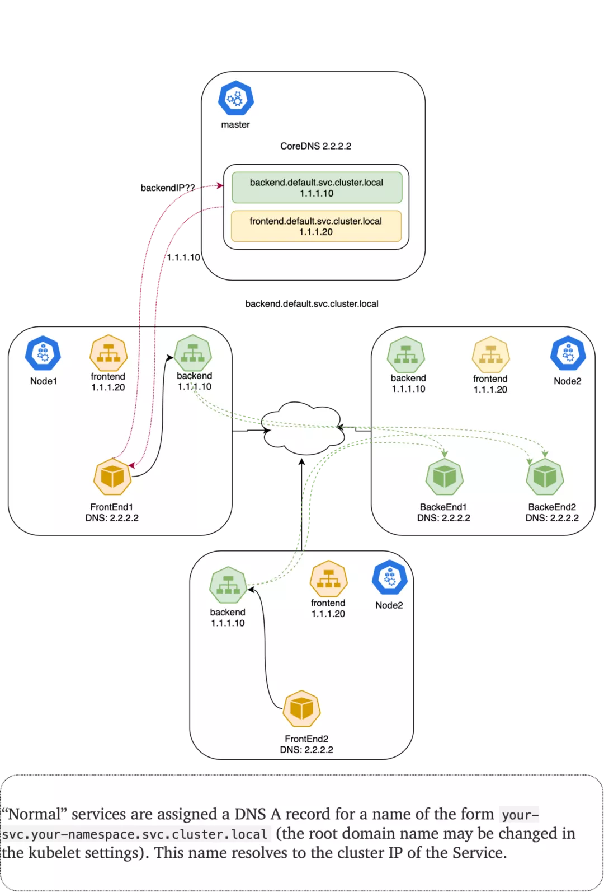
      - NodePort
        - NodePort 类型的 Service 把 FrontEnd 服务开放给外部世界
        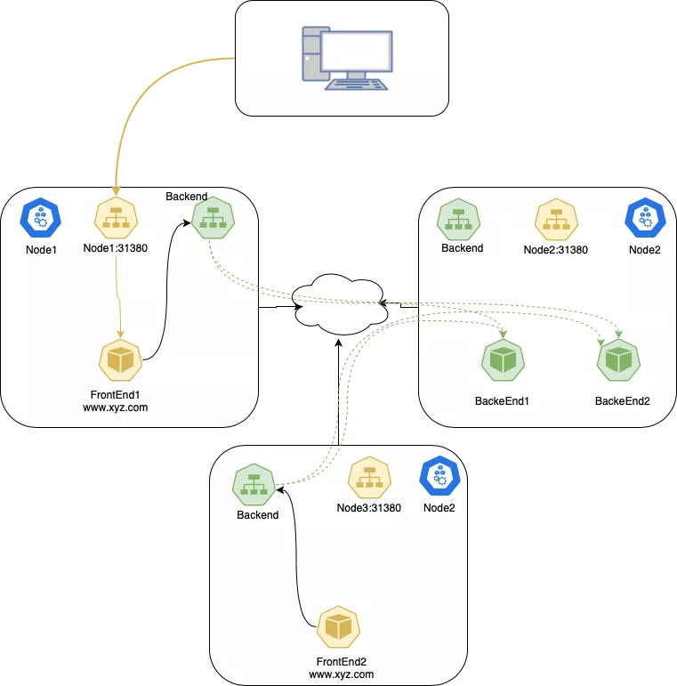
      - ExternalTrafficPolicy
        - 表明所属 Service 对象会把来自外部的流量路由给本节点还是集群范围内的端点
        - 如果为 Local，会保留客户端源 IP 同时避免 NodePort 类型服务的多余一跳，但是有流量分配不均匀的隐患
          - kube-proxy 只会在存在目标 Pod 的节点上加入 NodePort 的代理规则。API Server 要求只有使用 LoadBalancer 或者 NodePort 类型的 Service 才能够使用这种策略。这是因为 Local 策略只跟外部访问相关。
          - 在 Google GKE 上使用 Local 策略，由于健康检查的原因，会把不运行对应 Pod 的节点从负载均衡池中剔除，所以不会发生丢弃流量的问题
          - 因为不需要进行 SNAT，从而让源 IP 得以保存。然而官方文档声明，这种策略存在不够均衡的短板
        - 如果为 Cluster (缺省)，会抹掉客户端的源 IP，并导致到其它节点的一跳，但会获得相对较好的均衡效果。
          - 客户端把数据包发送给 node2:31380；
          - node2 替换源 IP 地址（SNAT）为自己的 IP 地址；
          - node2 将目标地址替换为 Pod IP；
          - 数据包被路由到 node1 或者 node3，然后到达 Pod；
          - Pod 的响应返回到 node2
          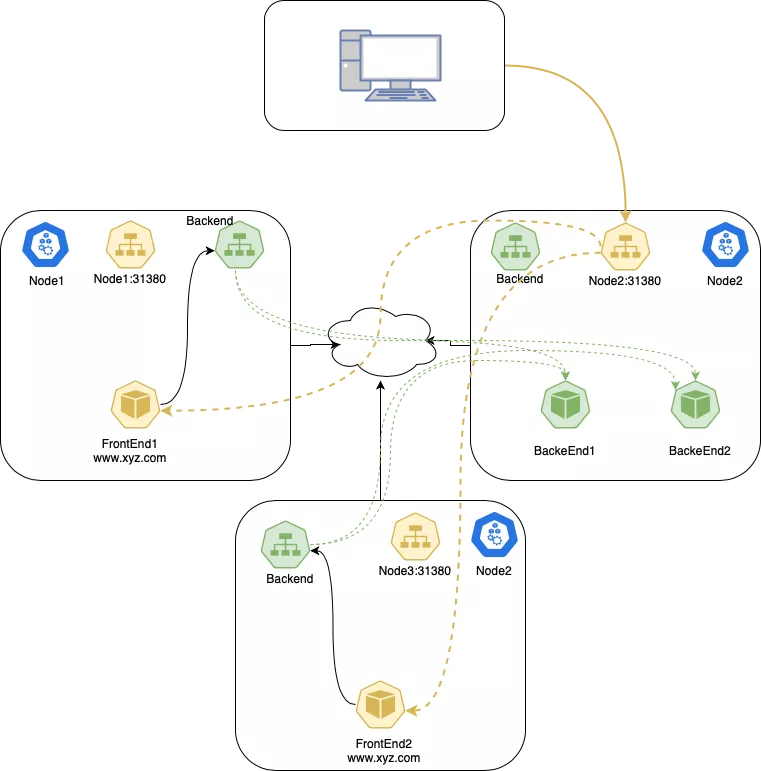
  - Kube-Proxy（iptable）
    - 负责 Service 对象的组件就是 kube-proxy.它在每个节点上运行，为 Pod 和 Service 生成复杂的 iptables 规则，完成所有的过滤和 NAT 工作
      - 运行 iptables-save，会看到 Kubernetes 或者其它组件生成的规则
      - KUBE-SERVICE 是 Service 包的入口。 它负责匹配 IP:Port，并把数据包发给对应的 KUBE-SVC-*。
      - KUBE-SVC-* 担任负载均衡的角色，会平均分配数据包到 KUBE-SEP-*。 每个 KUBE-SVC-* 都有和 Endpoint 同样数量的 KUBE-SEP-*。
      - KUBE-SEP-* 代表的是 Service 的 EndPoint，它负责的是 DNAT，会把 Service 的 IP:Port 替换为 Pod 的 IP:Port。
    - Conntrack 会介入 DNAT 过程，使用状态机来跟踪连接状态. iptables 还可以根据 conntrack 状态（ctstate）来决定数据包的目标
  - iptables
    - 在 Linux 操作系统中使用 netfilter 处理防火墙工作。这是一个内核模块，决定是否放行数据包。iptables 是 netfilter 的前端。
    - 链
      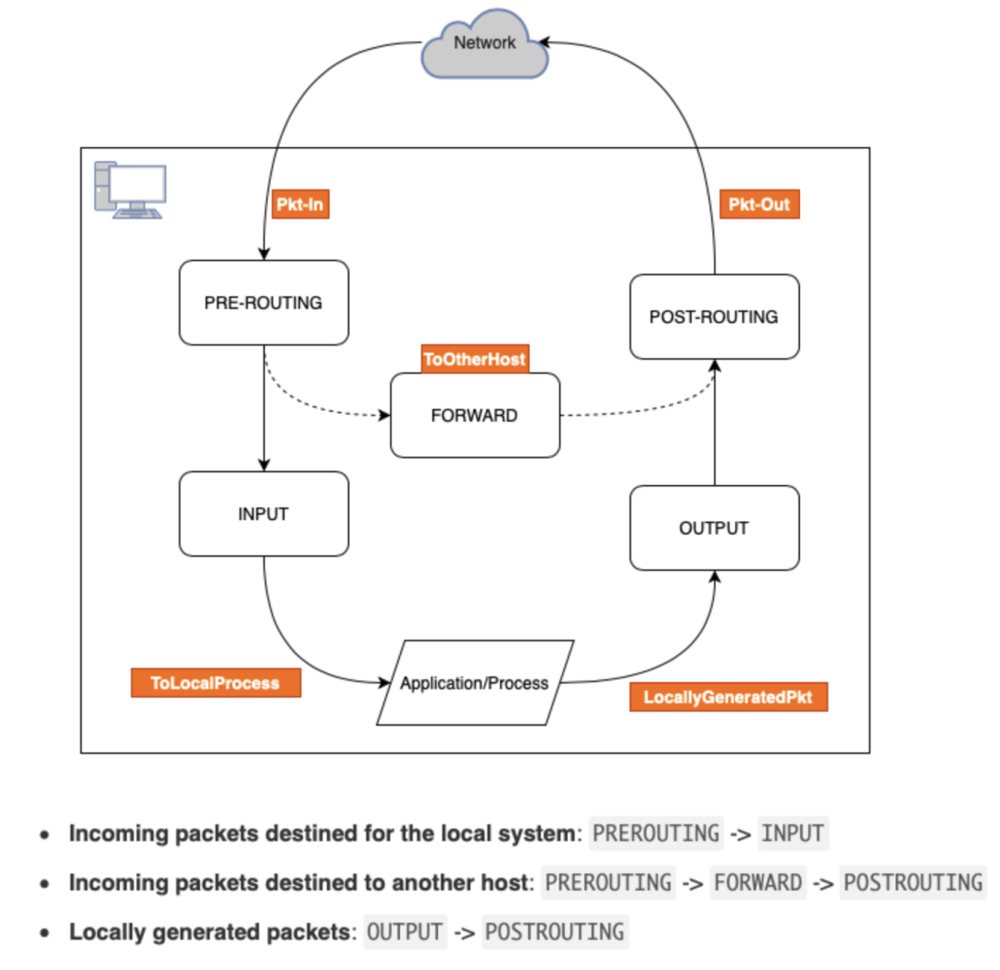
    - 表
      - Filter： 缺省表，这里决定是否允许数据包出入本机，因此可以在这里进行屏蔽等操作；
      - Nat： 是网络地址转换的缩写。
      - Mangle： 仅对特定包有用。 它的功能是在包出入之前修改包中的内容；
      - RAW： 用于处理原始数据包，主要用在跟踪连接状态，下面有一个放行 SSH 连接的例子。
      - Security：
    - Kubernetes 中的 iptables 配置
      - ClusterIP 是一个存在于 iptables 中的虚拟 IP，Kubernetes 会把这个地址存在 CoreDNS 中。
      - 为了能够进行包过滤和 NAT，Kubernetes 会创建一个 KUBE-SERVICES 链，把所有 PREROUTING 和 OUTPUT 流量转发给 KUBE-SERVICES
      - 使用 KUBE-SERVICES 介入包过滤和 NAT 之后，Kubernetes 会监控通向 Service 的流量，并进行 SNAT/DNAT 的处理。在 KUBE-SERVICES 链尾部，会写入另一个链 KUBE-SERVICES，用于处理 NodePort 类型的 Service。
      - ClusterIP：KUBE-SERVICES → KUBE-SVC-XXX → KUBE-SEP-XXX
      - NodePort：KUBE-SERVICES → KUBE-NODEPORTS → KUBE-SVC-XXX → KUBE-SEP-XXX
  - Headless Service
    - 有的应用并不需要负载均衡和服务 IP。在这种情况下就可以使用 headless Service，只要设置 .spec.clusterIP 为 None 即可。
    - 定义了 Selector 的 Headless Service，Endpoint 控制器会创建 Endpoint 记录，并修改 DNS 记录来直接返回 Service 后端的 Pod 地址
    - 没有定义 Selector 的 Headless Service，也就没有 Endpoint 记录。然而 DNS 系统会尝试配置：
      - ExternalName 类型的服务，会产生 CNAME 记录；
      - 其他类型则是所有 Endpoint 共享服务名称。

- [使用Docker容器突破客户端6w可用端口的误区](https://tonybai.com/2021/12/14/the-misconception-of-using-docker-to-break-out-of-6w-ports-of-the-client/)
  - 一个客户机最多向外面建立65535-1024+1=64512个连接。为什么会这样呢？这是因为一个TCP连接由一个四元组唯一确定，这个四元组是（源端口，源地址，目的地址，目的端口）。这个四元组中的源端口是一个16bit的短整型，它的表示范围是0~65535。但1024及以下的端口号通常为系统保留，因此用户可用的端口号仅剩下64512个。
  - 我们看到docker中的请求经过NAT后其源ip转换为宿主机的源ip地址192.168.49.6，源端口为宿主机的一个随机端口(1024~65535范围内)。客户端发出请求后，server端处理并返回响应，响应回到宿主机后，NAT会根据上面的转换表，根据nat后的源ip、nat后的源port、目的ip和目的port找到唯一的源ip和源port，并将替换数据包中相应的字段，这样数据包才能返回给对应的容器中的客户端程序。这样当目的ip、目的port以及nat后的源ip都是“固定值”的情况下，就只能要求nat后的源port不能重复，而nat后的源port的可选范围却只能为1024~65535，当nat后的源port耗尽，容器中的客户端程序就再也无法与server建立新连接了。
- [告别 Sidecar—— 使用 EBPF 解锁内核级服务网格](https://mp.weixin.qq.com/s/W9NySdKnxuQ6S917QQn3PA)
- [Life of a Packet in Kubernetes](https://dramasamy.medium.com/life-of-a-packet-in-kubernetes-part-1-f9bc0909e051)
- [Mastering Container Networking](https://iximiuz.com/en/posts/container-networking-is-simple/)
- [24 个常见的 Docker 疑难杂症处理技巧](https://mp.weixin.qq.com/s/R58f7fac2F3MP0TLV36vyQ)
- [探究 Docker 容器化技术背后的黑科技](https://mp.weixin.qq.com/s/Fx6bLAKQCvrymhZ6IpBtuQ)
- [containerd]
  - `task` concept
    - A Task is the runtime state of the container. A Task encapsulates a Process.
    - In the process of building Docker, one huge pain point we found is the mixing of runtime state (container status) with things like config state (container configuration).
    - When building containerd it was decided to split these things so they can be managed separately. So a "container" in containerd is configuration/metadata.
    - Where the Process is the executed command in the container, the Task's Process is the first/primary command in the container.
    - When the Process exits, the Task state is exited.
    - ` ctr -n k8s.io t ps` `ctr -n k8s.io c ls` `ctr namespace ls`
- [memory cgroup](https://mp.weixin.qq.com/s/66LxGlCBhSLg510Hfwk7xw)
  - cgroup节点含两个重要的参数接口：
    - memory.usage_in_bytes：只读，它的数值是当前cgroup里所有进程实际使用的内存总和，主要是 RSS 内存和 Page Cache 内存的和
    - memory.limit_in_bytes：可配置，当前cgroup里所有进程可使用内存的最大值 由于cgroup v1默认按层级继承的方式管理各个cgroup，因此每个cgroup计费的内存使用量包括其所有子孙cgroup的内存使用量
  - 回收
    - 当某cgroup节点子树内任何进程申请分配X内存时，若usage + X > limit，则会在内存分配上下文中触发内存回收行为，从该子树中回收内存（ Page Cache 内存）。如果回收到>=X的内存，则进程的内存分配成功返回；反之失败，继续在内存分配上下文中触发OOM，从该子树中选择得分最高的（默认为内存使用量最大）的进程kill掉并回收其内存，循环往复直至满足内存分配申请。
- [Kata Containers](https://mp.weixin.qq.com/s/q0hpsx7DVYLBrxUPpKolqQ)
- [UDP 协议无法通讯问题](https://www.jianshu.com/p/31f29098186a)
  - Issue
    - 如果有 UDP 服务运行在宿主机上（或者运行在网络模型为 host 的容器里），并且监听在 0.0.0.0 地址（也就是所有的 ip 地址），从运行在 docker bridge（网桥为 docker0） 网络的容器运行客户端访问服务，两者通信有问题。
  - Debug
    - 使用 TCP 协议没有这个问题
    - 如果 UDP 服务器监听在 eth0 ip ，而不是0.0.0.0上，也不会出现这个问题
    - 并不是所有的应用都有这个问题，我们的 DNS（dnsmasq + kubeDNS） 也是同样的部署方式，但是功能都正常
  - Analysis
    - 从网络报文的分析中可以看到服务端返回的报文源地址不是我们预想的 eth0 地址，而是 docker0 的地址，而客户端直接认为该报文是非法的，返回了 ICMP 的报文给对方
  - Root Cause
    - 主机多网络接口 UDP 源地址选择问题
      - UDP 在多网卡的情况下，可能会发生【服务器端】【源地址】不对的情况，这是内核选路的结果
      - 因为 UDP 是无状态的协议，内核不会保存连接双方的信息，因此每次发送的报文都认为是独立的，socket 层每次发送报文默认情况不会指明要使用的源地址，只是说明对方地址
    - dnsmasq 
      -  setsockopt(4, SOL_IP, IP_PKTINFO, [1], 4) IP_PKTINFO 这个选项就是让内核在 socket 中保存 IP 报文的信息，当然也包括了报文的源地址和目的地址
      -  收包和发包的系统调用，直接使用 recvmsg 和 sendmsg 系统调用
    - 如果 ipi_spec_dst 和 ipi_ifindex 不为空，它们都能作为源地址选择的依据，而不是让内核通过路由决定
    - 通过设置 IP_PKTINFO socket 选项为 1，然后使用 recvmsg 和 sendmsg 传输数据就能保证源地址选择符合我们的期望
  
- [容器网络原理](https://mp.weixin.qq.com/s/tjLsr_8eFnwbqy9_G2H7ow)
- [容器内的 1 号进程](https://mp.weixin.qq.com/s/7RB9d2J1_bGJYaI_T-1h-A)
  - Linux 发行版，无论是 RedHat 系的还是 Debian 系的，都会把 /sbin/init 作为符号链接指向 Systemd。Systemd 是目前最流行的 Linux init 进程
  - 在容器中也有 1 号进程的概念，一旦容器建立了自己的 Pid Namespace（进程命名空间)，这个 Namespace 里的进程号也是从 1 开始标记的, 1 号进程是第一个用户态的进程，由它直接或者间接创建了容器中的其他进程
  - Linux 信号
    - 命令 kill ，直接向一个进程发送一个信号，缺省情况下不指定信号的类型，那么这个信号就是 SIGTERM。也可以指定信号类型，比如命令 kill -9，这里的 9，就是编号为 9 的信号，SIGKILL 信号
    - 进程对它的处理都有下面三个选择。
      - 忽略( Ignore ) 就是对这个信号不做任何处理，但是有两个信号例外，对于 SIGKILL 和 SIGSTOP 这个两个信号，进程是不能忽略的。这是因为它们的主要作用是为 Linux kernel 和超级用户提供删除任意进程的特权。
      - 捕获( Catch )，这个是指让用户进程可以注册自己针对这个信号的 handler。对于捕获，SIGKILL 和 SIGSTOP 这两个信号也同样例外，这两个信号不能由用户自己的处理代码，只能执行系统的缺省行为。
      - 缺省行为( Default )，Linux 为每个信号都定义了一个缺省的行为，你可以在 Linux 系统中运行 man 7 signal 来查看每个信号的缺省行为。对于大部分的信号而言，应用程序不需要注册自己的 handler，使用系统缺省定义行为就可以了。
    - SIGTERM 这个信号是可以被捕获的，这里的捕获指的就是用户进程可以为这个信号注册自己的 handler，而 SIGTERM 信号一般是用于进程优雅退出
    - SIGKILL (9)，这个信号是 Linux 里两个特权信号之一。特权信号就是 Linux 为 kernel 和超级用户去删除任意进程所保留的，不能被忽略也不能被捕获。那么进程一旦收到 SIGKILL，就要退出
  - docker stop <containier-id> 背后其实先向容器进程发出 SIGTERM 信号，如果 10s 后进程还在，那么直接再发出 SIGKILL 信号
  - init 进程就是 1 号进程，但是 1 号进程不一定是 init 进程
    - 1 号进程
      - 操作系统第一个进程
      - 是所有用户态进程的父进程
    - init 进程
      - 操作系统第一个进程
      - 是所有用户态进程的父进程
      - 可以回收僵尸进程(失去了父进程的子进程就都会以 init 作为它们的父进程)
      - 可以向子进程发送操作系统信号
  - 容器中的 1 号进程是否具有 init 进程的特性取决于容器启动的命令。在 Dockerfile 中，CMD、ENTRYPOINT 可以启动容器，它们都有两种模式：shell 模式，exec 模式
    - shell
      - 模式下会开启一个 shell 来执行后面的命令，即使用 /bin/sh -c 启动业务进程，那么容器中的 1 号进程就是 shell。用法：ENTRYPOINT command
      - 启动该容器后，容器的 1 号进程就是 sh
    - exec
      - 该模式下直接运行命令，容器中的 1 号进程就是业务应用进程。用法：ENTRYPOINT ["command"]
    - shell 模式的一号进程是 sh，而且 sh 不能传递信号，所以就无法实现容器内进程优雅退出了( docker stop <container-id> 只能等待 10s 强制杀死)，这时候就可以就考虑使用 exec 模式 因为 exec 模式的 1号进程就是自身，自身实现 SIGTERM handler 即可
    - exec 模式下，没有办法获取容器内的环境变量
  - 如果容器需要实现优雅退出，要么也用进程作为 1号进程且实现 SIGTERM handler，要么启动 init 进程。下面看看如何在容器中启动 init 进程。
    - 如果你想直接通过 docker 命令来运行容器，可以直接通过参数 --init 来使用 tini
- [修改容器的内核参数](https://mp.weixin.qq.com/s/04O2Y66_JyXhBR9bd4Uzuw)
  - 容器内 sysctl -a 能看到的参数，仅namepsaced参数可通过增加kubelet的系统参数白名单，通过 securityContext 修改
  - 容器内 sysctl -a 看不到的参数，通过修改宿主机内核参数修改
  - 容器内 sysctl -a 能看到的参数，根据内核版本有变更
- [容器化对数据库性能影响](https://mp.weixin.qq.com/s/URH8D3jWy_fblEA1US24Bg)
  - 容器化
    - 标准容器，符合 OCI （Open Container Initiative）规范，如 docker/containerd，容器运行时为 runc
    - 用户态内核容器，如 gVisor，也符合 OCI 规范，容器运行时为 runsc，有比较好的隔离性和安全性，但是性能比较差
    - 微内核容器，使用了 hypervisor，如 Firecracker、Kata-Container，也符合 OCI 规范，容器运行时为 runc 或 runv，有比较好的安全性和隔离性，性能介于标准容器和用户态内核容器之间
  - runc
    - runc 是一个符合 OCI 标准的容器运行时，它是 Docker/Containerd 核心容器引擎的一部分。它使用 Linux 的命名空间（Namespace）和控制组（Cgroup）技术来实现容器的隔离。
    - Kata Containers 是一个使用虚拟机技术实现的容器运行时，它提供了更高的隔离性和安全性。
  - 数据库性能
    - Disk I/O hang
      - 当有大量 BufferedIO 下发时，比如 MySQL 写外排临时文件的场景，写的是 page cache，并会频繁更新 Ext4 文件系统的元数据，此时 CPU 和 I/O 可能都会很忙，MySQL 进程会被频繁 CPU Throttle，脏页持续增多，然后触发文件系统 flush 脏页，大量刷脏 I/O 占满硬件通道，
      - 如果进程被 CPU Throttle 调度走时又恰巧持有了 Ext4 Journal Lock，那么其他共享该 Ext4 文件系统的进程都被挂起，当被挂起的次数和时间足够久，就会造成 IO hang
      - 主流的解决方案就是给 BufferedIO 限流，Cgroup V2 已支持该功能。
    - OOM
      - Page reclaim slow path 还不仅仅影响一个 Cgroup Namespace，由于 OS 中的很多数据结构在 Host 这一层是共享的， 比如虽然 Pod 内存逻辑上属于某个 Cgroup Namespace，但是在 Host Kernel 中，真实的内存管理还是基于同一个 Buddy System，
      - 对这些物理内存的管理需要全局的锁机制，所以一个内存压力很大的 Pod 触发的 page reclaim slow path 也会影响其它健康 Pod 的内存管理路径，有的时候整个 Node 上的数据库都变慢可能只是因为有一个 Pod 的 limit 内存太小了。
    - Too many Connections
      - 对于多进程模型的数据库如 Postgresql 和 Oracle，一条 Connection 对应一个进程
      - 当使用的 buffer pool 本身就很大时，fork 一个进程所需的页表项也非常可观，假设 page 4k，页表项 8 字节，那么页表和 buffer pool 的比例关系是 8/4k = 1/512，当有 512 条链接时，OS 需要的页表内存就和 buffer pool 一样大
      - 解决方案一般分为两种，一是在数据库前面增加一层 prox;还有一种是采用 Hugepage 的方案，假设 Hugepage size 为 2M，那么页表和 buffer pool 的比例关系就是 8/2M = 1/256k
    - TCP Retran
      - 延迟：网络延迟会影响数据的传输时长
      - 带宽：无论是单个 TCP 链接的有效带宽，还是网卡和交换机网口的最大传输带宽，都对网络传输质量和延迟有重大的影响
    - CPU schedule wait
  - Summary
    - PostgreSQL 是多进程模式，所以需要十分关注链接数和页表大小，虽然使用 Hugepage 方案可以降低页表的负担，但是 Hugepage 本身还是有比较多的副作用，利用 pgBouncer 之类的 proxy 做链接复用是一种更好的解法；
      - 当开启 full page 时，PostgreSQL 对 I/O 带宽的需求非常强烈，此时的瓶颈为 I/O 带宽；当 I/O 和链接数都不是瓶颈时，PostgreSQL 在更高的并发下瓶颈来自内部的锁实现机制。
    - MongoDB 整体表现比较稳定，主要的问题一般来自 Disk I/O 和链接数，WiredTiger 在 cache 到 I/O 的流控上做得比较出色，虽然有 I/O 争抢，但是 IO hang 的概率比较小，
      - 当然 OLTP 数据库的 workload 会比 MongoDB 更复杂一些，也更难达到一种均衡。
    - Redis 的瓶颈主要在网络，所以需要特别关注应用和 Redis 服务之间的网络延迟，这部分延迟由网络链路决定，
      - Redis 满载时 70%+ 的 CPU 消耗在网络栈上，所以为了解决网络性能的扩展性问题，Redis 6.0 版本引入了网络多线程功能，真正的 worker thread 还是单线程，这个功能在大幅提升 Redis 性能的同时也保持了 Redis 简单优雅的特性。
- [Pod 的生命周期](https://mp.weixin.qq.com/s/unVwBprr0UeuWNpXVdgdxg)
  - 1. 初始化阶段，Pod 的 init 容器运行。
    -  拉取镜像
    - 容器重启，如果失败，retry 时间会随次数加倍
    - 容器重启后，根据镜像拉取策略，可能会再次拉取镜像
    - 如果镜像拉取失败，会重试
  - 2. 运行阶段，Pod 的常规容器在该阶段运行。
    - 镜像从镜像仓库拉取成功
    - 如果探活探针检测失败，会触发容器重启
    - 如果容器不能优雅关闭，则在一定时间后会被强制关闭
    - 容器重启后，会根据镜像拉取策略决定释放重新拉取镜像
    - 当 Pod 被删除发起后，Pod 进入终止过程，等所有容器停止或者删除后，Pod 对象也被删除
  - 3. 终止阶段，Pod 的容器被终止。
    - 当执行 kubectl delete pod 开始后，Pod 终止过程开始了；
    - 容器 A 的 preStop hook 停止了容器内的进程，因此就不需要 Kubelet 来发送 TERM 信号；
    - 容器 B 没有定义 preStop hook，因此 kubelet 直接发送了 TERM 信号；
    - 容器 C 没有及时退出，因此会被直接杀死；
    - 所有容器结束后，Pod 也结束了，随后会被杀死。


