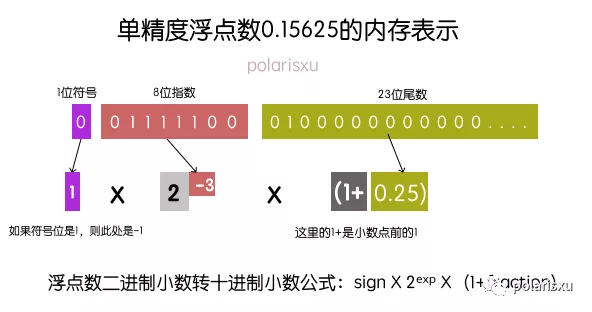
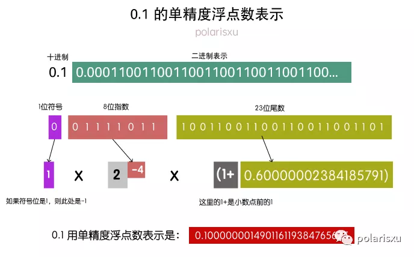
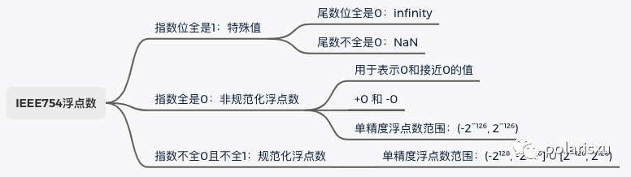
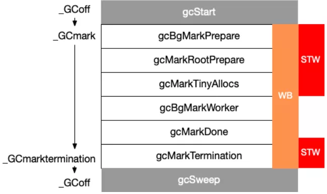
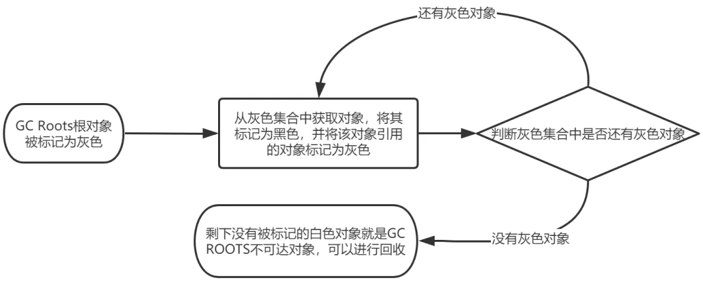

- [Applying Modern Go Concurrency Patterns to Data Pipelines](https://medium.com/amboss/applying-modern-go-concurrency-patterns-to-data-pipelines-b3b5327908d4)
  - A Simple Pipeline
    ```go
    func producer(strings []string) (<-chan string, error) {
        outChannel := make(chan string)
    
        for _, s := range strings {
            outChannel <- s
        }
    
        return outChannel, nil
    }
    
    func sink(values <-chan string) {
        for value := range values {
            log.Println(value)
        }
    }
    
    func main() {
        source := []string{"foo", "bar", "bax"}
    
        outputChannel, err := producer(source)
        if err != nil {
            log.Fatal(err)
        }
    
        sink(outputChannel)
    }
    ```
    you run this with go run main.go you'll see a deadlock
    - The channel returned by producer is not buffered, meaning you can only send values to the channel if someone is receiving values on the other end. But since `sink` is called later in the program, there is no receiver at the point where `outChannel <- s` is called, causing the deadlock.
    - fix it
      - either making the channel buffered, in which case the deadlock will occur once the buffer is full
      - or by running the producer in a Go routine. 
      - whoever creates the channel is also in charge of closing it.
  - Graceful Shutdown With Context
    - with context
    ```go
    func producer(ctx context.Context, strings []string) (<-chan string, error) {
         outChannel := make(chan string)
     
         go func() {
             defer close(outChannel)
    
             for _, s := range strings {
                 time.Sleep(time.Second * 3)
                select {
                case <-ctx.Done():
                    return
                default:
                    outChannel <- s
                }
             }
         }()
     
         return outChannel, nil
     }
     
    
    func sink(ctx context.Context, values <-chan string) {
        for {
            select {
            case <-ctx.Done():
                log.Print(ctx.Err().Error())
                return
            case val, ok := <-values:
    +			log.Print(val)  // for debug
                if ok {
                    log.Println(val)
                }
            }
         }
     }
     
     func main() {
         source := []string{"foo", "bar", "bax"}
     
        ctx, cancel := context.WithCancel(context.Background())
        defer cancel()
    
        go func() {
            time.Sleep(time.Second * 5)
            cancel()
        }()
    
        outputChannel, err := producer(ctx, source)
         if err != nil {
             log.Fatal(err)
         }
     
    
        sink(ctx, outputChannel)
     }
    ```
    Issues:
    - This will flood our terminal with empty log messages, like this: 2021/09/08 12:29:30. Apparently the for loop in sink keeps running forever
    
    [Reason](https://golang.org/ref/spec#Receive_operator)
    - A receive operation on a closed channel can always proceed immediately, yielding the element type’s zero value after any previously sent values have been received.

    Fix it
    - The value of ok is true if the value received was delivered by a successful send operation to the channel, or false if it is a zero value generated because the channel is closed and empty.
     ```go
     func sink(ctx context.Context, values <-chan string) {
     
              case val, ok := <-values:
                  if ok {
                      log.Println(val)
                 } else {
                     return
                  }
              }
          }
     ```
  - Adding Parallelism with Fan-Out and Fan-In
    - sending values to a closed channel is a panic
    ```go
    func producer(ctx context.Context, strings []string) (<-chan string, error) {
        outChannel := make(chan string)
    
        go func() {
            defer close(outChannel)
    
            for _, s := range strings {
                select {
                case <-ctx.Done():
                    return
                default:
                    outChannel <- s
                }
            }
        }()
    
        return outChannel, nil
    }
    
    func transformToLower(ctx context.Context, values <-chan string) (<-chan string, error) {
        outChannel := make(chan string)
    
        go func() {
            defer close(outChannel)
    
            for s := range values {
                time.Sleep(time.Second * 3)
                select {
                case <-ctx.Done():
                    return
                default:
                    outChannel <- strings.ToLower(s)
                }
            }
        }()
    
        return outChannel, nil
    }
    
    func transformToTitle(ctx context.Context, values <-chan string) (<-chan string, error) {
        outChannel := make(chan string)
    
        go func() {
            defer close(outChannel)
    
            for s := range values {
                time.Sleep(time.Second * 3)
                select {
                case <-ctx.Done():
                    return
                default:
                    outChannel <- strings.ToTitle(s)
                }
            }
        }()
    
        return outChannel, nil
    }
    
    func sink(ctx context.Context, values <-chan string) {
        for {
            select {
            case <-ctx.Done():
                log.Print(ctx.Err().Error())
                return
            case val, ok := <-values:
                if ok {
                    log.Println(val)
                } else {
                    return
                }
            }
        }
    }
    
    func main() {
        source := []string{"FOO", "BAR", "BAX"}
    
        ctx, cancel := context.WithCancel(context.Background())
        defer cancel()
    
        outputChannel, err := producer(ctx, source)
        if err != nil {
            log.Fatal(err)
        }
    
        stage1Channels := []<-chan string{}
    
        for i := 0; i < runtime.NumCPU(); i++ {
            lowerCaseChannel, err := transformToLower(ctx, outputChannel)
            if err != nil {
                log.Fatal(err)
            }
            stage1Channels = append(stage1Channels, lowerCaseChannel)
        }
    
        stage1Merged := mergeStringChans(ctx, stage1Channels...)
        stage2Channels := []<-chan string{}
    
        for i := 0; i < runtime.NumCPU(); i++ {
            titleCaseChannel, err := transformToTitle(ctx, stage1Merged)
            if err != nil {
                log.Fatal(err)
            }
            stage2Channels = append(stage2Channels, titleCaseChannel)
        }
    
        stage2Merged := mergeStringChans(ctx, stage2Channels...)
        sink(ctx, stage2Merged)
    }
    
    func mergeStringChans(ctx context.Context, cs ...<-chan string) <-chan string {
        var wg sync.WaitGroup
        out := make(chan string)
    
        output := func(c <-chan string) {
            defer wg.Done()
            for n := range c {
                select {
                case out <- n:
                case <-ctx.Done():
                    return
                }
            }
        }
    
        wg.Add(len(cs))
        for _, c := range cs {
            go output(c)
        }
    
        go func() {
            wg.Wait()
            close(out)
        }()
    
        return out
    }
    ```
  - Error Handling
    - The most common way of propagating errors that I’ve seen is through a separate error channel. Unlike the value channels that connect pipeline stages, the error channels are not passed to downstream stages.
  - Removing Boilerplate With Generics
  - Maximum Efficiency With Semaphores
    - What if our input list only had a single element in it? Then we only need a single Go routine, not NumCPU() Go routines. 
    - Instead of creating a fixed number of Go routines, we will range over the input channel. For every value we receive from it, we will spawn a Go routine (see the example in the semaphore package)
    
    ```go
    package tips
    
    import (
        "errors"
        "context"
        "log"
        "runtime"
        "strings"
        "time"
    
        "golang.org/x/sync/semaphore"
    )
    
    func producer(ctx context.Context, strings []string) (<-chan string, error) {
        outChannel := make(chan string)
    
        go func() {
            defer close(outChannel)
    
            for _, s := range strings {
                select {
                case <-ctx.Done():
                    return
                default:
                    outChannel <- s
                }
            }
        }()
    
        return outChannel, nil
    }
    
    func sink(ctx context.Context, cancelFunc context.CancelFunc, values <-chan string, errors <-chan error) {
        for {
            select {
            case <-ctx.Done():
                log.Print(ctx.Err().Error())
                return
            case err := <-errors:
                if err != nil {
                    log.Println("error: ", err.Error())
                    cancelFunc()
                }
            case val, ok := <-values:
                if ok {
                    log.Printf("sink: %s", val)
                } else {
                    log.Print("done")
                    return
                }
            }
        }
    }
    
    func step[In any, Out any](
        ctx context.Context,
        inputChannel <-chan In,
        outputChannel chan Out,
        errorChannel chan error,
        fn func(In) (Out, error),
    ) {
        defer close(outputChannel)
    
        limit := runtime.NumCPU()
        sem1 := semaphore.NewWeighted(limit)
    
        for s := range inputChannel {
            select {
            case <-ctx.Done():
                log.Print("1 abort")
                break
            default:
            }
    
            if err := sem1.Acquire(ctx, 1); err != nil {
                log.Printf("Failed to acquire semaphore: %v", err)
                break
            }
    
            go func(s In) {
                defer sem1.Release(1)
                time.Sleep(time.Second * 3)
    
                result, err := fn(s)
                if err != nil {
                    errorChannel <- err
                } else {
                    outputChannel <- result
                }
            }(s)
        }
    
        if err := sem1.Acquire(ctx, limit); err != nil {
            log.Printf("Failed to acquire semaphore: %v", err)
        }
    }
    
    func main() {
        source := []string{"FOO", "BAR", "BAX"}
    
        ctx, cancel := context.WithCancel(context.Background())
        defer cancel()
    
        readStream, err := producer(ctx, source)
        if err != nil {
            log.Fatal(err)
        }
    
        stage1 := make(chan string)
        errorChannel := make(chan error)
    
        transformA := func(s string) (string, error) {
            return strings.ToLower(s), nil
        }
    
        go func() {
            step(ctx, readStream, stage1, errorChannel, transformA)
        }()
    
        stage2 := make(chan string)
    
        transformB := func(s string) (string, error) {
            if s == "foo" {
                return "", errors.New("oh no")
            }
    
            return strings.Title(s), nil
        }
    
        go func() {
            step(ctx, stage1, stage2, errorChannel, transformB)
        }()
    
        sink(ctx, cancel, stage2, errorChannel)
    }
    ```

- [Handling 1 Million Requests per Minute with Go](http://marcio.io/2015/07/handling-1-million-requests-per-minute-with-golang/)
  - The web handler would receive a JSON document that may contain a collection of many payloads that needed to be written to Amazon S3
  - Naive approach to GO routine
    ```go
    func payloadHandler(w http.ResponseWriter, r *http.Request) {
    
        if r.Method != "POST" {
            w.WriteHeader(http.StatusMethodNotAllowed)
            return
        }
    
        // Read the body into a string for json decoding
        var content = &PayloadCollection{}
        err := json.NewDecoder(io.LimitReader(r.Body, MaxLength)).Decode(&content)
        if err != nil {
            w.Header().Set("Content-Type", "application/json; charset=UTF-8")
            w.WriteHeader(http.StatusBadRequest)
            return
        }
    
        // Go through each payload and queue items individually to be posted to S3
        for _, payload := range content.Payloads {
            go payload.UploadToS3()   // <----- DON'T DO THIS
        }
    
        w.WriteHeader(http.StatusOK)
    }
    ```
  - Try again
    - create a buffered channel where we could queue up some jobs and upload them to S3
     ```go
     var Queue chan Payload
     
     func init() {
         Queue = make(chan Payload, MAX_QUEUE)
     }
     
     func payloadHandler(w http.ResponseWriter, r *http.Request) {
         ...
         // Go through each payload and queue items individually to be posted to S3
         for _, payload := range content.Payloads {
             Queue <- payload
         }
         ...
     }
     func StartProcessor() {
         for {
             select {
             case job := <-Queue:
                 job.payload.UploadToS3()  // <-- STILL NOT GOOD
             }
         }
     }
     ```
    Issue: since the rate of incoming requests were much larger than the ability of the single processor to upload to S3, our buffered channel was quickly reaching its limit and blocking the request handler ability to queue more items.
  - Better solution
    - create a 2-tier channel system, one for queuing jobs and another to control how many workers operate on the JobQueue concurrently.

    ```go
    var (
        MaxWorker = os.Getenv("MAX_WORKERS")
        MaxQueue  = os.Getenv("MAX_QUEUE")
    )
    
    // Job represents the job to be run
    type Job struct {
        Payload Payload
    }
    
    // A buffered channel that we can send work requests on.
    var JobQueue chan Job
    
    // Worker represents the worker that executes the job
    type Worker struct {
        WorkerPool  chan chan Job
        JobChannel  chan Job
        quit    	chan bool
    }
    
    func NewWorker(workerPool chan chan Job) Worker {
        return Worker{
            WorkerPool: workerPool,
            JobChannel: make(chan Job),
            quit:       make(chan bool)}
    }
    
    // Start method starts the run loop for the worker, listening for a quit channel in
    // case we need to stop it
    func (w Worker) Start() {
        go func() {
            for {
                // register the current worker into the worker queue.
                w.WorkerPool <- w.JobChannel
    
                select {
                case job := <-w.JobChannel:
                    // we have received a work request.
                    if err := job.Payload.UploadToS3(); err != nil {
                        log.Errorf("Error uploading to S3: %s", err.Error())
                    }
    
                case <-w.quit:
                    // we have received a signal to stop
                    return
                }
            }
        }()
    }
    
    // Stop signals the worker to stop listening for work requests.
    func (w Worker) Stop() {
        go func() {
            w.quit <- true
        }()
    }
    
    // handler
    func payloadHandler(w http.ResponseWriter, r *http.Request) {
    
        if r.Method != "POST" {
            w.WriteHeader(http.StatusMethodNotAllowed)
            return
        }
    
        // Read the body into a string for json decoding
        var content = &PayloadCollection{}
        err := json.NewDecoder(io.LimitReader(r.Body, MaxLength)).Decode(&content)
        if err != nil {
            w.Header().Set("Content-Type", "application/json; charset=UTF-8")
            w.WriteHeader(http.StatusBadRequest)
            return
        }
    
        // Go through each payload and queue items individually to be posted to S3
        for _, payload := range content.Payloads {
    
            // let's create a job with the payload
            work := Job{Payload: payload}
    
            // Push the work onto the queue.
            JobQueue <- work
        }
    
        w.WriteHeader(http.StatusOK)
    }
    
    dispatcher := NewDispatcher(MaxWorker)
    dispatcher.Run()
    
    type Dispatcher struct {
        // A pool of workers channels that are registered with the dispatcher
        WorkerPool chan chan Job
    }
    
    func NewDispatcher(maxWorkers int) *Dispatcher {
        pool := make(chan chan Job, maxWorkers)
        return &Dispatcher{WorkerPool: pool}
    }
    
    func (d *Dispatcher) Run() {
        // starting n number of workers
        for i := 0; i < d.maxWorkers; i++ {
            worker := NewWorker(d.pool)
            worker.Start()
        }
    
        go d.dispatch()
    }
    
    func (d *Dispatcher) dispatch() {
        for {
            select {
            case job := <-JobQueue:
                // a job request has been received
                go func(job Job) {
                    // try to obtain a worker job channel that is available.
                    // this will block until a worker is idle
                    jobChannel := <-d.WorkerPool
    
                    // dispatch the job to the worker job channel
                    jobChannel <- job
                }(job)
            }
        }
    }
    ```
- [Go timer 是如何被调度的](https://mp.weixin.qq.com/s/zy354p9MQq10fpTL20uuCA)
  - 概述
    - 不管用 **NewTimer**, **timer.After**，还是 **timer.AfterFun** 来初始化一个 timer, 这个 timer 最终都会加入到一个全局 timer 堆中，由 Go runtime 统一管理。
    - Go 1.9 版本之前，所有的计时器由全局唯一的四叉堆维护，协程间竞争激烈。
    - Go 1.10 - 1.13，全局使用 64 个四叉堆维护全部的计时器，没有本质解决 1.9 版本之前的问题
    - Go 1.14 版本之后，每个 P 单独维护一个四叉堆。
  - 原理
    - 四叉堆原理
      - 四叉树顾名思义最多有四个子节点，为了兼顾四叉树插、删除、重排速度，所以四个兄弟节点间并不要求其按触发早晚排序。
    - timer 是如何被调度的
      - 调用 NewTimer，timer.After, timer.AfterFunc 生产 timer, 加入对应的 P 的堆上。
      - 调用 timer.Stop, timer.Reset 改变对应的 timer 的状态。
      - GMP 在调度周期内中会调用 checkTimers ，遍历该 P 的 timer 堆上的元素，根据对应 timer 的状态执行真的操作。
    - timer 是如何加入到 timer 堆上的
      - 通过 NewTimer, time.After, timer.AfterFunc 初始化 timer 后，相关 timer 就会被放入到对应 p 的 timer 堆上。
      - timer 已经被标记为 timerRemoved，调用了 timer.Reset(d)，这个 timer 也会重新被加入到 p 的 timer 堆上
      - timer 还没到需要被执行的时间，被调用了 timer.Reset(d)，这个 timer 会被 GMP 调度探测到，先将该 timer 从 timer 堆上删除，然后重新加入到 timer 堆上
      - STW 时，runtime 会释放不再使用的 p 的资源，p.destroy()->timer.moveTimers，将不再被使用的 p 的 timers 上有效的 timer(状态是：timerWaiting，timerModifiedEarlier，timerModifiedLater) 都重新加入到一个新的 p 的 timer 上
    - Reset 时 timer 是如何被操作的
      - 被标记为 timerRemoved 的 timer，这种 timer 是已经从 timer 堆上删除了，但会重新设置被触发时间，加入到 timer 堆中
      - 等待被触发的 timer，在 Reset 函数中只会修改其触发时间和状态（timerModifiedEarlier或timerModifiedLater）。这个被修改状态的 timer 也同样会被重新加入到 timer堆上，不过是由 GMP 触发的，由 checkTimers 调用 adjusttimers 或者 runtimer 来执行的。
    - Stop 时 timer 是如何被操作的
      - time.Stop 为了让 timer 停止，不再被触发，也就是从 timer 堆上删除。不过 timer.Stop 并不会真正的从 p 的 timer 堆上删除 timer，只会将 timer 的状态修改为 timerDeleted。然后等待 GMP 触发的 adjusttimers 或者 runtimer 来执行。
    - Timer 是如何被真正执行的
      - timer 的真正执行者是 GMP。GMP 会在每个调度周期内，通过 runtime.checkTimers 调用 timer.runtimer(). timer.runtimer 会检查该 p 的 timer 堆上的所有 timer，判断这些 timer 是否能被触发。
      - 如果该 timer 能够被触发，会通过回调函数 sendTime 给 Timer 的 channel C 发一个当前时间，告诉我们这个 timer 已经被触发了。
      - 如果是 ticker 的话，被触发后，会计算下一次要触发的时间，重新将 timer 加入 timer 堆中。
  - Timer 使用中的坑
    - 错误创建很多 timer，导致资源浪费
      ```go
      func main() {
          for {
              // xxx 一些操作
              timeout := time.After(30 * time.Second)
              select {
              case <- someDone:
                  // do something
              case <-timeout:
                  return
              }
          }
      }
      ```
      因为 timer.After 底层是调用的 timer.NewTimer，NewTimer 生成 timer 后，会将 timer 放入到全局的 timer 堆中。
      for 会创建出来数以万计的 timer 放入到 timer 堆中，导致机器内存暴涨，同时不管 GMP 周期 checkTimers，还是插入新的 timer 都会疯狂遍历 timer 堆，导致 CPU 异常。
       ```go
       func main() {
           timer := time.NewTimer(time.Second * 5)    
           for {
               timer.Reset(time.Second * 5)
       
               select {
               case <- someDone:
                   // do something
               case <-timer.C:
                   return
               }
           }
       }
       ```
    - 程序阻塞，造成内存或者 goroutine 泄露
       ```go
       func main() {
           timer1 := time.NewTimer(2 * time.Second)
           <-timer1.C
           println("done")
       }
       ```
      只有等待 timer 超时 "done" 才会输出，原理很简单：程序阻塞在 <-timer1.C 上，一直等待 timer 被触发时，回调函数 time.sendTime 才会发送一个当前时间到 timer1.C 上，程序才能继续往下执行。
      ```go
      func main() {
          timer1 := time.NewTimer(2 * time.Second)
          go func() {
              timer1.Stop() // refer to doc
          }()
          <-timer1.C
      
          println("done")
      }
      ```
      程序就会一直死锁了，因为 timer1.Stop 并不会关闭 channel C，使程序一直阻塞在 timer1.C 上。

      Stop 的正确的使用方式：
       ```go
       func main() {
           timer1 := time.NewTimer(2 * time.Second)
           go func() {
               if !timer1.Stop() {
                   <-timer1.C
               }
           }()
       
           select {
           case <-timer1.C:
               fmt.Println("expired")
           default:
           }
           println("done")
       }
       ```
- [panic](https://mp.weixin.qq.com/s/sGdTVSRxqxIezdlEASB39A)
  - 什么时候会产生 panic
    - 主动方式：
      - 程序猿主动调用 panic 函数；
    - 被动的方式：
      - 编译器的隐藏代码触发
        ```go
        func divzero(a, b int) int {
            c := a/b
            return c
        }
        ```
        用 dlv 调试断点到 divzero 函数，然后执行 disassemble ，你就能看到秘密了
        编译器偷偷加上了一段 if/else 的判断逻辑，并且还给加了 runtime.panicdivide  的代码。
      - 内核发送给进程信号触发
      
        最典型的是非法地址访问，比如， nil 指针 访问会触发 panic
        
        在 Go 进程启动的时候会注册默认的信号处理程序（ sigtramp ）

        在 cpu 访问到 0 地址会触发 page fault 异常，这是一个非法地址，内核会发送 SIGSEGV 信号给进程，所以当收到 SIGSEGV 信号的时候，就会让 sigtramp 函数来处理，最终调用到 panic 函数 ：
         ```
         // 信号处理函数回
         sigtramp （纯汇编代码）
           -> sigtrampgo （ signal_unix.go ）
             -> sighandler  （ signal_sighandler.go ）
                -> preparePanic （ signal_amd64x.go ）
         
                   -> sigpanic （ signal_unix.go ）
                     -> panicmem 
                       -> panic (内存段错误)
         ```
        在进程初始化的时候，创建 M0（线程）的时候用系统调用 sigaction 给信号注册处理函数为 sigtramp
    - Summary
      - panic( ) 函数内部会产生一个关键的数据结构体 _panic ，并且挂接到 goroutine 之上；
      - panic( ) 函数内部会执行 _defer 函数链条，并针对 _panic 的状态进行对应的处理；
      - 循环执行 goroutine 上面的 _defer 函数链，如果执行完了都还没有恢复 _panic 的状态，那就没得办法了，退出进程，打印堆栈。
      - 如果在 goroutine 的 _defer 链上，有个朋友 recover 了一下，把这个 _panic 标记成恢复，那事情就到此为止，就从这个 _defer 函数执行后续正常代码即可，走 deferreturn 的逻辑。

- [如何限定Goroutine数量](https://juejin.cn/post/7017286487502766093)
  - 用有 buffer 的 channel 来限制
  - channel 与 sync 同步组合方式实现控制 goroutine
  - 利用无缓冲 channel 与任务发送/执行分离方式
    ```go
    var wg = sync.WaitGroup{}
    
    func doBusiness(ch chan int) {
    
        for t := range ch {
            fmt.Println("go task = ", t, ", goroutine count = ", runtime.NumGoroutine())
            wg.Done()
        }
    }
    
    func sendTask(task int, ch chan int) {
        wg.Add(1)
        ch <- task
    }
    
    func main() {
    
        ch := make(chan int)   //无buffer channel
    
        goCnt := 3              //启动goroutine的数量
        for i := 0; i < goCnt; i++ {
            //启动go
            go doBusiness(ch)
        }
    
        taskCnt := math.MaxInt64 //模拟用户需求业务的数量
        for t := 0; t < taskCnt; t++ {
            //发送任务
            sendTask(t, ch)
        }
    
        wg.Wait()
    }
    ```

- [Sync Once Source Code](https://mp.weixin.qq.com/s/nkhZyKG4nrUulpliMKdgRw)
  - 问题
    - 为啥源码引入Mutex而不是CAS操作
    - 为啥要有fast path, slow path 
    - 加锁之后为啥要有done==0，为啥有double check，为啥这里不是原子读
    - store为啥要加defer
    - 为啥是atomic.store，不是直接赋值1
  - 演进
    - 开始
      ```go
      type Once struct {
       m    Mutex
       done bool
      }
      
      func (o *Once) Do(f func()) {
       o.m.Lock()
       defer o.m.Unlock()
       if !o.done {
        o.done = true
        f()
       }
      }
      ```
      缺点：每次都要执行Mutex加锁操作，对于Once这种语义有必要吗，是否可以先判断一下done的value是否为true，然后再进行加锁操作呢？
    - 进化
      ```go
      type Once struct {
       m    Mutex
       done int32
      }
      
      func (o *Once) Do(f func()) {
       if atomic.AddInt32(&o.done, 0) == 1 {
        return
       }
       // Slow-path.
       o.m.Lock()
       defer o.m.Unlock()
       if o.done == 0 {
        f()
        atomic.CompareAndSwapInt32(&o.done, 0, 1)
       }
      }
      ```
      进化点
      - 在slow-path加锁后，要继续判断done值是否为0，确认done为0后才要执行f()函数，这是因为在多协程环境下仅仅通过一次atomic.AddInt32判断并不能保证原子性，比如俩协程g1、g2，g2在g1刚刚执行完atomic.CompareAndSwapInt32(&o.done, 0, 1)进入了slow path，如果不进行double check，那g2又会执行一次f()。
      - 用一个int32变量done表示once的对象是否已执行完，有两个地方使用到了atomic包里的方法对o.done进行判断，分别是，用AddInt32函数根据o.done的值是否为1判断once是否已执行过，若执行过直接返回；f()函数执行完后，对o.done通过cas操作进行赋值1。
      - 问到atomic.CompareAndSwapInt32(&o.done, 0, 1)可否被o.done == 1替换， 答案是不可以
        - 现在的CPU一般拥有多个核心，而CPU的处理速度快于从内存读取变量的速度，为了弥补这俩速度的差异，现在CPU每个核心都有自己的L1、L2、L3级高速缓存，CPU可以直接从高速缓存中读取数据，但是这样一来内存中的一份数据就在缓存中有多份副本，在同一时间下这些副本中的可能会不一样，为了保持缓存一致性，Intel CPU使用了MESI协议
        - AddInt32方法和CompareAndSwapInt32方法(均为amd64平台 runtime/internal/atomic/atomic_amd64.s)底层都是在汇编层面调用了LOCK指令，LOCK指令通过总线锁或MESI协议保证原子性（具体措施与CPU的版本有关），提供了强一致性的缓存读写保证，保证LOCK之后的指令在带LOCK前缀的指令执行之后才执行，从而保证读到最新的o.done值。
    - 小优化1
      - 把done的类型由int32替换为uint32,用CompareAndSwapUint32替换了CompareAndSwapInt32, 用LoadUint32替换了AddInt32方法
      - LoadUint32底层并没有LOCK指令用于加锁，我觉得能这么写的主要原因是进入slow path之后会继续用Mutex加锁并判断o.done的值，且后面的CAS操作是加锁的，所以可以这么改
    - 小优化2
      - 用StoreUint32替换了CompareAndSwapUint32操作，CAS操作在这里确实有点多余，因为这行代码最主要的功能是原子性的done = 1
      - Store命令的底层是，其中关键的指令是XCHG，有的同学可能要问了，这源码里没有LOCK指令啊，怎么保证happen before呢，Intel手册有这样的描述: The LOCK prefix is automatically assumed for XCHG instruction.，这个指令默认带LOCK前缀，能保证Happen Before语义。
    - 小优化3
      - 在StoreUint32前增加defer前缀，增加defer是保证 即使f()在执行过程中出现panic，Once仍然保证f()只执行一次，这样符合严格的Once语义。
      - 除了预防panic，defer还能解决指令重排的问题：现在CPU为了执行效率，源码在真正执行时的顺序和代码的顺序可能并不一样，比如这段代码中a不一定打印"hello, world"，也可能打印空字符串。
        ```go
        var a string
        var done bool
        
        func setup() {
         a = "hello, world"
         done = true
        }
        
        func main() {
         go setup()
         for !done {
         }
         print(a)
        }
        ```
    - 小优化4
      - 用函数区分开了fast path和slow path，对fast path做了内联优化

- [Option Design](https://mp.weixin.qq.com/s/WUqpmyxWv_W5E6RtxazYAg)
  - Good approach
    ```go
    func NewServer(addr string, options ...func(server *http.Server)) *http.Server {
      server := &http.Server{Addr: addr, ReadTimeout: 3 * time.Second}
      for _, opt := range options {
        opt(server)
      }
      return server
    }
    ```
    通过不定长度的方式代表可以给多个 options，以及每一个 option 是一个 func 型态，其参数型态为 *http. Server。那我们就可以在 NewServer 这边先给 default value，然后通过 for loop 将每一个 options 对其 Server 做的参数进行设置，这样 client 端不仅可以针对他想要的参数进行设置，其他没设置到的参数也不需要特地给 zero value 或是默认值，完全封装在 NewServer 就可以了
     ```go
     func main() {
       readTimeoutOption := func(server *http.Server) {
         server.ReadTimeout = 5 * time.Second
       }
       handlerOption := func(server *http.Server) {
         mux := http.NewServeMux()
         mux.HandleFunc("/health", func(writer http.ResponseWriter, request *http.Request) {
           writer.WriteHeader(http.StatusOK)
         })
         server.Handler = http.NewServeMux()
       }
       s := server.NewServer(":8080", readTimeoutOption, handlerOption)
     }
     ```
  - Good approach v2
    ```go
    type options struct {
      cache  bool
      logger *zap.Logger
    }
    
    type Option interface {
      apply(*options)
    }
    
    type cacheOption bool
    
    func (c cacheOption) apply(opts *options) {
      opts.cache = bool(c)
    }
    
    func WithCache(c bool) Option {
      return cacheOption(c)
    }
    
    type loggerOption struct {
      Log *zap.Logger
    }
    
    func (l loggerOption) apply(opts *options) {
      opts.logger = l.Log
    }
    
    func WithLogger(log *zap.Logger) Option {
      return loggerOption{Log: log}
    }
    
    // Open creates a connection.
    func Open(
      addr string,
      opts ...Option,
    ) (*Connection, error) {
      options := options{
        cache:  defaultCache,
        logger: zap.NewNop(),
      }
    
      for _, o := range opts {
        o.apply(&options)
      }
    
      // ...
    }
    
    ```
    可以看到通过设计一个Option interface，里面用了 apply function，以及使用一个 options struct 将所有的 field 都放在这个 struct 里面，每一个 field 又会用另外一种 struct 或是 custom type 进行封装，并 implement apply function，最后再提供一个 public function：WithLogger 去给 client 端设值。

    这样的做法好处是可以针对每一个 option 作更细的 custom function 设计，例如选项的 description 为何？可以为每一个 option 再去 implement Stringer interface，之后提供 option 描述就可以调用 toString 了，设计上更加的方便
     ```go
     func (l loggerOption) apply(opts *options) {
       opts.logger = l.Log
     }
     func (l loggerOption) String() string {
       return "logger description..."
     }
     ```
- [schedule a task at a specific time](https://stephenafamo.com/blog/posts/how-to-schedule-task-at-specific-time-in-go)
    ```go
    func waitUntil(ctx context.Context, until time.Time) {
        timer := time.NewTimer(time.Until(until))
        defer timer.Stop()
    
        select {
        case <-timer.C:
            return
        case <-ctx.Done():
            return
        }
    }
    func main() {
        // our context, for now we use context.Background()
        ctx := context.Background()
        
        // when we want to wait till
        until, _ := time.Parse(time.RFC3339, "2023-06-22T15:04:05+02:00")
        
        // and now we wait
        waitUntil(ctx, until)
        
        // Do what ever we want..... 🎉
    }
    ```
- [Better scheduling](https://stephenafamo.com/blog/posts/better-scheduling-in-go)
  - [Kronika](https://github.com/stephenafamo/kronika)
  - Using `time.After()`
    ```go
        // This will block for 5 seconds and then return the current time
        theTime := <-time.After(time.Second * 5)
        fmt.Println(theTime.Format("2006-01-02 15:04:05"))
    ```
  - Using time.Ticker
    ```go
        // This will print the time every 5 seconds
        for theTime := range time.Tick(time.Second * 5) {
            fmt.Println(theTime.Format("2006-01-02 15:04:05"))
        }
    ```
    - Dangers of using time.Tick()
      - When we use the time.Tick() function, we do not have direct access to the underlying time.Ticker and so we cannot close it properly.
    - Limitations using time.Tick()
      - Specify a start time
      - Stop the ticker
  - Extending time.Tick() using a custom function
     ```go
     func cron(ctx context.Context, startTime time.Time, delay time.Duration) <-chan time.Time {
         // Create the channel which we will return
         stream := make(chan time.Time, 1)
     
         // Calculating the first start time in the future
         // Need to check if the time is zero (e.g. if time.Time{} was used)
         if !startTime.IsZero() {
             diff := time.Until(startTime)
             if diff < 0 {
                 total := diff - delay
                 times := total / delay * -1
     
                 startTime = startTime.Add(times * delay)
             }
         }
     
         // Run this in a goroutine, or our function will block until the first event
         go func() {
     
             // Run the first event after it gets to the start time
             t := <-time.After(time.Until(startTime))
             stream <- t
     
             // Open a new ticker
             ticker := time.NewTicker(delay)
             // Make sure to stop the ticker when we're done
             defer ticker.Stop()
     
             // Listen on both the ticker and the context done channel to know when to stop
             for {
                 select {
                 case t2 := <-ticker.C:
                     stream <- t2
                 case <-ctx.Done():
                     close(stream)
                     return
                 }
             }
         }()
     
         return stream
     }
     ```
     - Run on Tuesdays by 2 pm
       ```go
       ctx := context.Background()
       
       startTime, err := time.Parse(
           "2006-01-02 15:04:05",
           "2019-09-17 14:00:00",
       ) // is a tuesday
       if err != nil {
           panic(err)
       }
       
       delay := time.Hour * 24 * 7 // 1 week
       
       for t := range cron(ctx, startTime, delay) {
           // Perform action here
           log.Println(t.Format("2006-01-02 15:04:05"))
       }
       ```
     - Run every hour, on the hour
       ```go
       ctx := context.Background()
       
       startTime, err := time.Parse(
           "2006-01-02 15:04:05",
           "2019-09-17 14:00:00",
       ) // any time in the past works but it should be on the hour
       if err != nil {
           panic(err)
       }
       
       delay := time.Hour // 1 hour
       
       for t := range cron(ctx, startTime, delay) {
           // Perform action here
           log.Println(t.Format("2006-01-02 15:04:05"))
       }
       ```
     - Run every 10 minutes, starting in a week
       ```go
       ctx := context.Background()
       
       startTime, err := time.Now().AddDate(0, 0, 7) // see https://golang.org/pkg/time/#Time.AddDate
       if err != nil {
           panic(err)
       }
       
       delay := time.Minute * 10 // 10 minutes
       
       for t := range cron(ctx, startTime, delay) {
           // Perform action here
           log.Println(t.Format("2006-01-02 15:04:05"))
       }
       ```
- [怎么使用 direct io](https://mp.weixin.qq.com/s/fr3i4RYDK9amjdCAUwja6A)

  操作系统的 IO 过文件系统的时候，默认是会使用到 page cache，并且采用的是 write back 的方式，系统异步刷盘的。由于是异步的，如果在数据还未刷盘之前，掉电的话就会导致数据丢失。
  写到磁盘有两种方式：
  - 要么就每次写完主动 sync 一把
  - 要么就使用 direct io 的方式，指明每一笔 io 数据都要写到磁盘才返回。
  
  O_DIRECT 的知识点
  - direct io 也就是常说的 DIO，是在 Open 的时候通过 flag 来指定 O_DIRECT 参数，之后的数据的 write/read 都是绕过 page cache，直接和磁盘操作，从而避免了掉电丢数据的尴尬局面，同时也让应用层可以自己决定内存的使用（避免不必要的 cache 消耗）。
  - direct io 模式需要用户保证对齐规则，否则 IO 会报错，有 3 个需要对齐的规则：
    - IO 的大小必须扇区大小（512字节）对齐 
    - IO 偏移按照扇区大小对齐； 
    - 内存 buffer 的地址也必须是扇区对齐

  为什么 Go 的 O_DIRECT 知识点值得一提
  - O_DIRECT 平台不兼容 
    - Go 标准库 os 中的是没有 O_DIRECT 这个参数的. 其实 O_DIRECT 这个 Open flag 参数本就是只存在于 linux 系统。// syscall/zerrors_linux_amd64.go
      ```go
      // +build linux
      // 指明在 linux 平台系统编译
      fp := os.OpenFile(name, syscall.O_DIRECT|flag, perm)
      ```
  - Go 无法精确控制内存分配地址
    - direct io 必须要满足 3 种对齐规则：io 偏移扇区对齐，长度扇区对齐，内存 buffer 地址扇区对齐。前两个还比较好满足，但是分配的内存地址作为一个小程序员无法精确控制
    - `buffer := make([]byte, 4096)` 那这个地址是对齐的吗？ 答案是：不确定。
    - 方法很简单，**就是先分配一个比预期要大的内存块，然后在这个内存块里找对齐位置**。 这是一个任何语言皆通用的方法，在 Go 里也是可用的。
    ```go
    const (
        AlignSize = 512
    )
    
    // 在 block 这个字节数组首地址，往后找，找到符合 AlignSize 对齐的地址，并返回
    // 这里用到位操作，速度很快；
    func alignment(block []byte, AlignSize int) int {
       return int(uintptr(unsafe.Pointer(&block[0])) & uintptr(AlignSize-1))
    }
    
    // 分配 BlockSize 大小的内存块
    // 地址按照 512 对齐
    func AlignedBlock(BlockSize int) []byte {
       // 分配一个，分配大小比实际需要的稍大
       block := make([]byte, BlockSize+AlignSize)
    
       // 计算这个 block 内存块往后多少偏移，地址才能对齐到 512 
       a := alignment(block, AlignSize)
       offset := 0
       if a != 0 {
          offset = AlignSize - a
       }
    
       // 偏移指定位置，生成一个新的 block，这个 block 将满足地址对齐 512；
       block = block[offset : offset+BlockSize]
       if BlockSize != 0 {
          // 最后做一次校验 
          a = alignment(block, AlignSize)
          if a != 0 {
             log.Fatal("Failed to align block")
          }
       }
       
       return block
    }
    ```
  - 有开源的库吗
    - https://github.com/ncw/directio
      ```go
      // 创建句柄
      fp, err := directio.OpenFile(file, os.O_RDONLY, 0666)
      // 创建地址按照 4k 对齐的内存块
      buffer := directio.AlignedBlock(directio.BlockSize)
      // 把文件数据读到内存块中
      _, err := io.ReadFull(fp, buffer)
      ```
- [浮点数](https://mp.weixin.qq.com/s/DGP4rENdy-N1VyZLS_uV4g)
  - 浮点数是指用符号、尾数、基数和指数这四部分来表示的小数
  
  - 小数的二进制和十进制转换
    - 十进制整数转二进制采用“除 2 取余，逆序排列”法
    - 但如果十进制是小数，转为二进制小数如何做？采用“乘 2 取整，顺序排列”
  - 浮点数的 IEEE754 表示
  
    - 尾数部分
      - IEEE754 规定，在二进制数中，通过移位，将小数点前面的值固定为 1。IEEE754 称这种形式的浮点数为规范化浮点数（normal number
      - 比如十进制数 0.15625，转为二进制是 0.00101。为了让第 1 位为 1，执行逻辑右移 3 位，尾数部分成为 1.01，因为右移了 3 位，所以指数部分是 -3。
    - 指数部分
      - 因为指数有正、有负，为了避免使用符号位，同时方便比较、排序，指数部分采用了 The Biased exponent（有偏指数）
      - 用十进制 0.15625 举例。上文知道，因为右移了 3 位，所以指数是 -3。根据 IEEE754 的定义，单精度浮点数情况下，-3 的实际值是 127 - 3 = 124。明白了吗？127 表示 0，124 就表示 -3 了。而十进制的 124 转为二进制就是 1111100。
  - 浮点数
  
  - 再看 0.1+0.2 = 0.30000000000000004
    - 出现这种情况的根本原因是，有些十进制小数无法转换为二进制数.在小数点后 4 位时，连续的二进制数，对应的十进制数却是不连续的，因此只能增加位数来尽可能近似的表示。
    
  - IEEE754 浮点数分类小结
  
- [优雅的 Go 错误问题解决方案](https://mp.weixin.qq.com/s?__biz=MjM5ODYwMjI2MA==&mid=2649764790&idx=1&sn=fc63b1cf5071aa0324987d1e5b3cab71&scene=21#wechat_redirect)
  
  服务/系统的错误信息返回
  - 传统方案
    - 服务/系统层面的错误信息返回，大部分协议都可以看成是 code - message 模式或者是其变体
    - 我们在使用 code - message 机制的时候，特别是业务初期，难以避免的是前后端的设计文案没能完整地覆盖所有的错误用例，或者是错误极其罕见。因此当出现错误时，提示暧昧不清（甚至是直接提示错误信息），导致用户从错误信息中找到解决方案
  - New Solution
    - 人的短期记忆对 4 个字符还是比较强的，因此我们可以考虑把错误代码缩短到 4 个字符
    - 采用的是 MD5 作为例子。MD5 的输出是 128 位，理论上我可以取 MD5 的输出，模 1679616 就可以得到一个简易的结果。实际上为了减少除法运算，我采用的是取高 20 位（0xFFFFF）的简易方式（20 位二进制的最大值为 1048575），然后将这个数字转成 36 进制的字符串输出。
    - 我们可以将 message 的提示信息如下展示：“未知错误，错误代码 30EV，如需协助，请联系 XXX”。顺带一提，30EV 是 "Access denied for user 'db_user'@'127.0.0.1'" 的计算结果，这样一来，我就对调用方隐藏了敏感信息。
    ```go
    import (
        // ...
        "github.com/martinlindhe/base36"
    )
    
    var (
        replacer = strings.NewReplacer(
            " ", "0",
            "O", "0",
            "I", "1",
        )
    )
    
    // ...
    
    func Err2Hashcode(err error) (uint64, string) {
        u64 := hash(err.Error())
        codeStr := encode(u64)
        u64, _ = decode(codeStr)
        return u64, codeStr
    }
    
    func encode(code uint64) string {
        s := fmt.Sprintf("%4s", base36.Encode(code))
        return replace.Replace(s)
    }
    
    func decode(s string) (uint64, bool) {
        if len(s) != 4 {
            return 0, false
        }
        s = strings.Replace(s, "l", "1", -1)
        s = strings.ToUpper(s)
        s = replace.Replace(s)
        code := base36.Decode(s)
        return code, code > 0
    }
    
    // hash 函数可以自定义
    func hash(s string) uint64 {
        h := md5.Sum([]byte(s))
        u := binary.BigEndian.Uint32(h[0:16])
        return uint64(u &amp; 0xFFFFF)
    }
    ```
    
- [Golang内存管理优化！三色标记法源码浅析](https://mp.weixin.qq.com/s/A2aCo9UYyI3iHCu9nsGrAA)

  探讨的gcDrain函数就是使用三色标记法找到存活对象的一个重要函数，了解gcDrain函数就会对golang垃圾回收机制有更深的理解
  - golang垃圾回收过程
  
    | 阶段	| 说明	| 赋值器状态 |
    | ----- | ------  | -------- |
    |SweepTermination	| 清扫终止阶段，为下一个阶段的并发标记做准备工作，启动写屏障	|STW |
    | Mark	| 扫描标记阶段，与赋值器并发执行，写屏障开启	 | 并发 |
    | MarkTermination	| 标记终止阶段，保证一个周期内标记任务完成，停止写屏障	| STW |
    | GCoff	| 内存清扫阶段，将需要回收的内存暂存，写屏障关闭	| 并发 |
    | GCoff	| 内存归还阶段，将内存依照策略归还给操作系统，写屏障关闭	| 并发 |
    
  - 三色标记法

    三色标记法是golang在堆内存中寻找存活对象的抽象过程
    - 黑色对象标识该对象已经被标记过了，且黑色对象引用的对象也全部都被标记过了。
    - 灰色对象表示该对象已经被标记了但是该对象引用的对象没有被全部标记。
    - 白色对象就是没有被标记的对象，被认为是潜在的垃圾，在标记开始前，所有对象都是白色对象
    
  
- [如何有效控制 Go 线程数](https://mp.weixin.qq.com/s/HYcHfKScBlYCD0IUd0t4jA)

  Go 对运行时创建的线程数量有一个限制，默认是 10000 个线程
  - 闲置线程
    - GOMAXPROCS 的定义文档，我们可以看到该变量只是限制了可以同时执行用户级 Go 代码的 OS 系统线程数量（通俗地讲：Go 程序最多只能有和 P 相等个数的系统线程同时运行）。但是，**在系统调用中被阻塞的线程不在此限制之中**
    - Go 网络编程模型，就是一种异步系统调用。它使用网路轮询器进行系统调用，调度器可以防止 G 在进行这些系统调用时阻塞 M。这可以让 M 继续执行其他的 G，而不需要创建新的 M。
  - 最大线程数限制
    - 线程限制数值确定为 10000
    - Go 也暴露了 _debug.SetMaxThreads()_ 方法可以让我们修改最大线程数值
      ```go
      func main() {
       debug.SetMaxThreads(10)
       for i := 0; i < 20; i++ {
        go func() {
         _, err := exec.Command("bash", "-c", "sleep 3").Output()
         if err != nil {
          panic(err)
         }
        }()
       }
       time.Sleep(time.Second * 5)
      }
      ```
  - 让闲置线程退出
    - 提出使用 runtime.LockOSThread() 方法来杀死线程
      - 调用 LockOSThread 函数会把当前 G 绑定在当前的系统线程 M 上，这个 G 总是在这个 M 上执行，并且阻止其它 G 在该 M 执行。
      - 只有当前 G 调用了与之前调用 LockOSThread 相同次数的 UnlockOSThread 函数之后，G 与 M 才会解绑。
      - 如果当前 G 在退出时，没有调用 UnlockOSThread，这个线程会被终止。
  - Summary
    - 在 GMP 模型中，P 与 M 一对一的挂载形式，通过设定 GOMAXPROCS 变量就能控制并行线程数。
    - 当 M 遇到同步系统调用时，G 和 M 会与 P 剥离，当系统调用完成，G 重新进入可运行状态，而 M 就会被闲置起来。
    - Go 目前并没有对闲置线程做清除处理，它们被当作复用的资源，以备后续需要。但是，如果在 Go 程序中积累大量空闲线程，这是对资源的一种浪费，同时对操作系统也产生了威胁。因此，Go 设定了 10000 的默认线程数限制
    - 我们发现了一种利用 LockOSThread 函数的 trik 做法，可以借此做一些限制线程数的方案：例如启动定期排查线程数的 goroutine，当发现程序的线程数超过某阈值后，就回收掉一部分闲置线程。
    - 当然，这个方法也存在隐患。例如在 issues#14592 有人提到：当子进程由一个带有 PdeathSignal: SIGKILL 的 A 线程创建，A 变为空闲时，如果 A 退出，那么子进程将会收到 KILL 信号，从而引起其他问题。
    - 绝大多数情况下，我们的 Go 程序并不会遇到空闲线程数过多的问题。如果真的存在线程数暴涨的问题，那么你应该思考代码逻辑是否合理（为什么你能允许短时间内如此多的系统同步调用），是否可以做一些例如限流之类的处理。而不是想着通过 SetMaxThreads 方法来处理。
- [go 没有 volatile 关键字](https://spongecaptain.cool/post/go/volatile_go/)
  - Java 中的 volatile
    - 可见性：当多个线程访问同一个变量时，一个线程修改了这个变量的值，其他线程能够立即看得到修改的值。
    - 有序性：编译器优化、JIT 优化、CPU 优化都可能导致指令重排序，以提高执行效率。volatile 用于禁止对 volatile 字段操作的前后指令重排序。
    - 在 Java 中 synchronized 关键字能够提供 volatile 提供的并发安全语义同时，提供更好的并发安全能力，但是 synchronized 太重了，没有 volatile 轻量，性能差。
  - Go 没有 volatile
    - 利用 mutex 解决 Go 没有 volatile
    - 利用 channel 解决 Go 没有 volatile
    - 利用 atomic 解决 Go 没有 volatile
- [Go内存对齐](https://docs.google.com/presentation/d/1XUA8WfgTHCF_8XdfPEuNvs-WZ0DshFHKFEEqHRd3Tzg/edit#slide=id.g812812c0e8_1_21)
  - 为什么要对齐
    - 平台原因(移植原因)：
      不是所有的硬件平台都能访问任意地址上的任意数据的；某些硬件平台只能在某些地址处取某些特定类型的数据，否则抛出硬件异常。
    - 性能原因：
      数据结构应该尽可能地在自然边界上对齐。原因在于，为了访问未对齐的内存，处理器需要作两次内存访问；而对齐的内存访问仅需要一次访问。
  - 总结
    - 内存对齐是为了cpu更高效访问内存中数据
    - 结构体对齐依赖类型的大小保证和对齐保证
    - 地址对齐保证是：如果类型 t 的对齐保证是 n，那么类型 t 的每个值的地址在运行时必须是 n 的倍数。
    - struct内字段如果填充过多，可以尝试重排，使字段排列更紧密，减少内存浪费
    - 零大小字段要避免作为struct最后一个字段，会有内存浪费
    - 32位系统上对64位字的原子访问要保证其是8bytes对齐的；当然如果不必要的话，还是用加锁（mutex）的方式更清晰简单
- [全局变量加锁的优化](https://mp.weixin.qq.com/s/DBa0UEBtOVpKtlz38R1VTA)
  - 改变锁的类型 - 读写锁
  - 降低锁住的代码块长度
  - 对数据切片
    - 假设我们的全局变量是一个map，我们可以对key做一个哈希后取模的操作，将原来一个map的数据分开写到多个map中。这样同一个大集合中的数据便支持了同时对多个数据进行写入而互不影响。
    ```go
    const (
     defaultStripSize = 1 << 16
     defaultStripMask = defaultStripSize - 1
    )
    
    type stripLock struct {
     sync.RWMutex
     _ [40]byte
    }
    
    type StripMap struct {
     locks   []stripLock
     buckets []map[uint64]interface{}
    }
    
    func DefaultStripMap() *StripMap {
     s := &StripMap{
      locks:   make([]stripLock, defaultStripSize),
      buckets: make([]map[uint64]interface{}, defaultStripSize),
     }
    
     for i := range s.buckets {
      s.buckets[i] = make(map[uint64]interface{})
     }
    
     return s
    }
    
    func (s *StripMap) Set(key uint64, value interface{}) {
     s.locks[key&defaultStripMask].RLock()
     defer s.locks[key&defaultStripMask].RUnlock()
    
     s.buckets[key&defaultStripMask][key] = value
    }
    
    func (s *StripMap) Get(key uint64) (interface{}, bool) {
     s.locks[key&defaultStripMask].RLock()
     defer s.locks[key&defaultStripMask].RUnlock()
    
     v, ok := s.buckets[key&defaultStripMask][key]
     return v, ok
    }
    
    func (s *StripMap) Remove(key uint64) {
     s.locks[key&defaultStripMask].Lock()
     defer s.locks[key&defaultStripMask].Unlock()
    
     delete(s.buckets[key&defaultStripMask], key)
    }
    ```
    - 使用位运算代替取模操作
      - `a % b = a & (b-1)` 当且仅当`b = 2^n`时成立
    - Cache Line 是为了解决不同变量之在多个CPU核心之间共享的问题
    - 内存对齐是为了解决同一个结构体内部访问效率等问题


