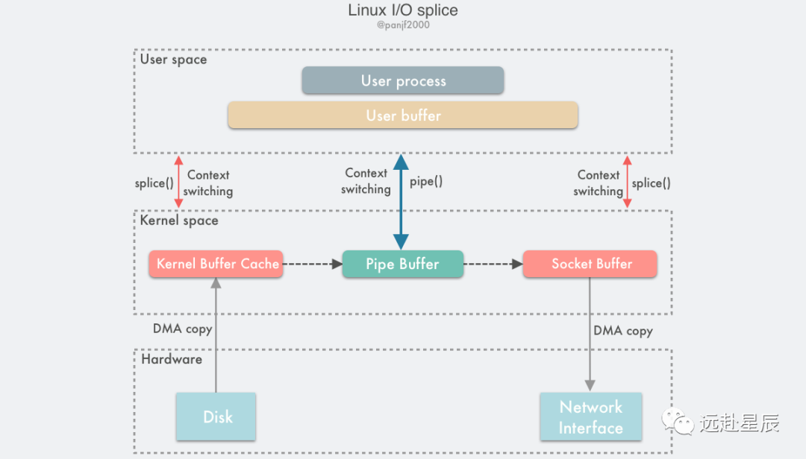
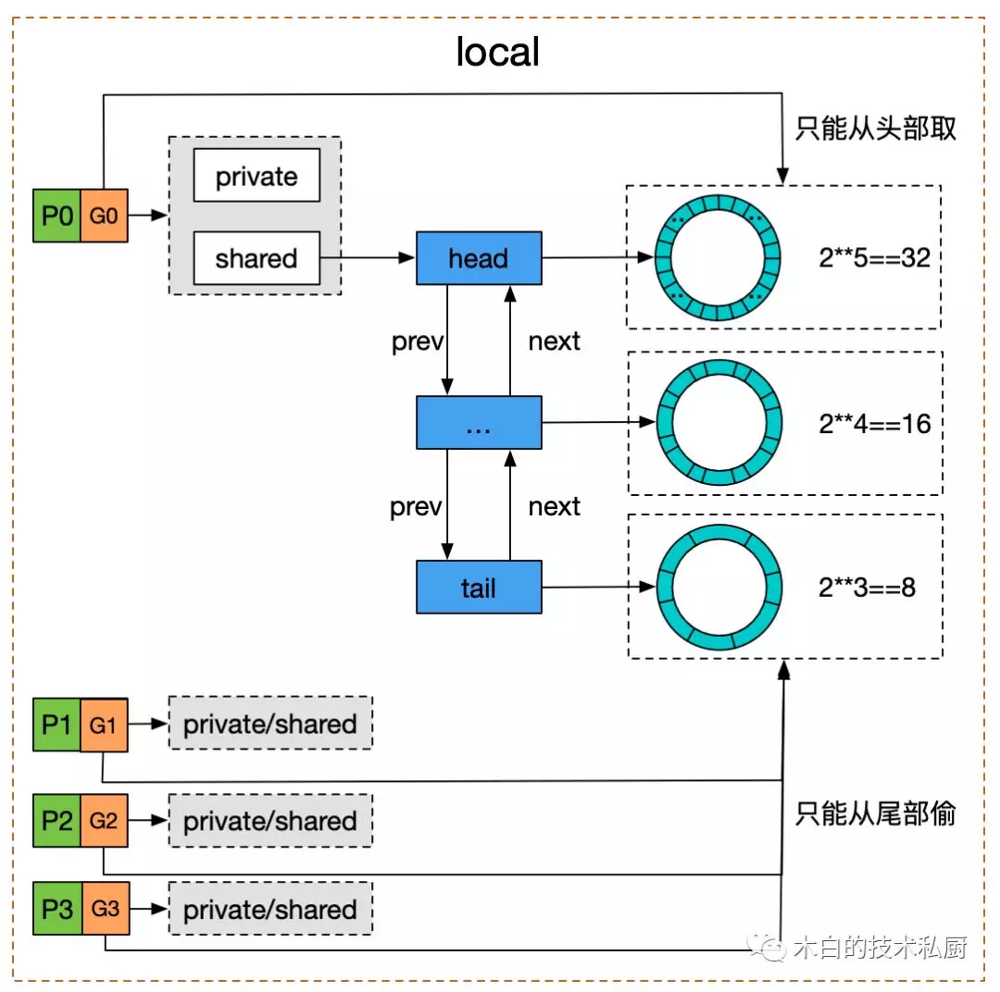
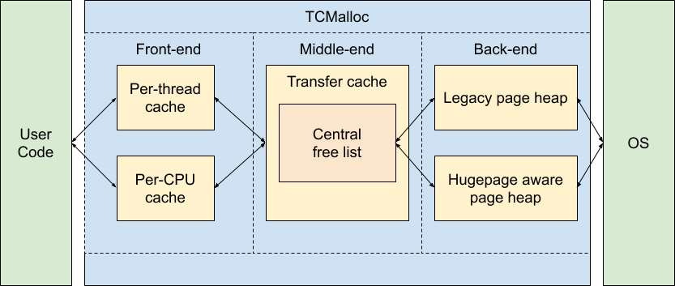
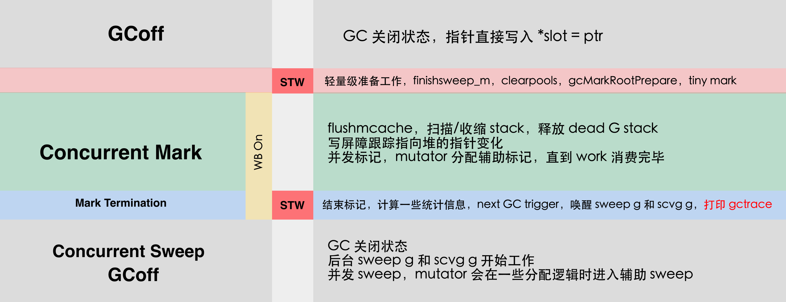
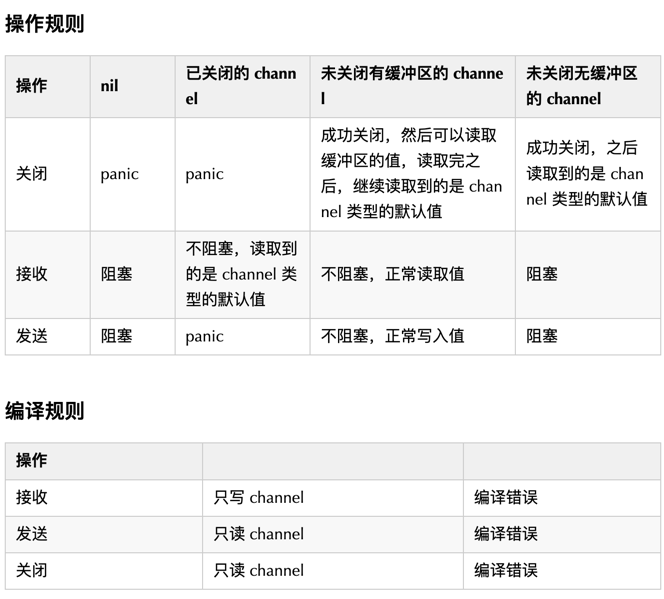
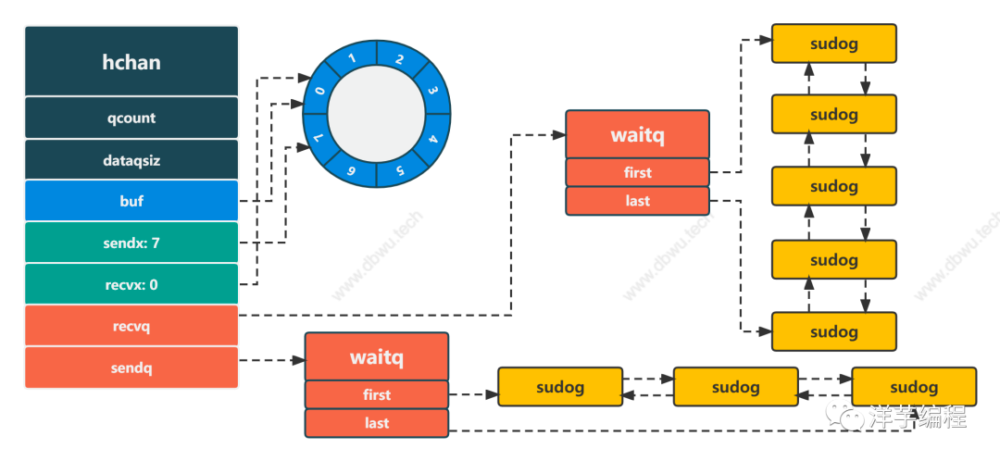
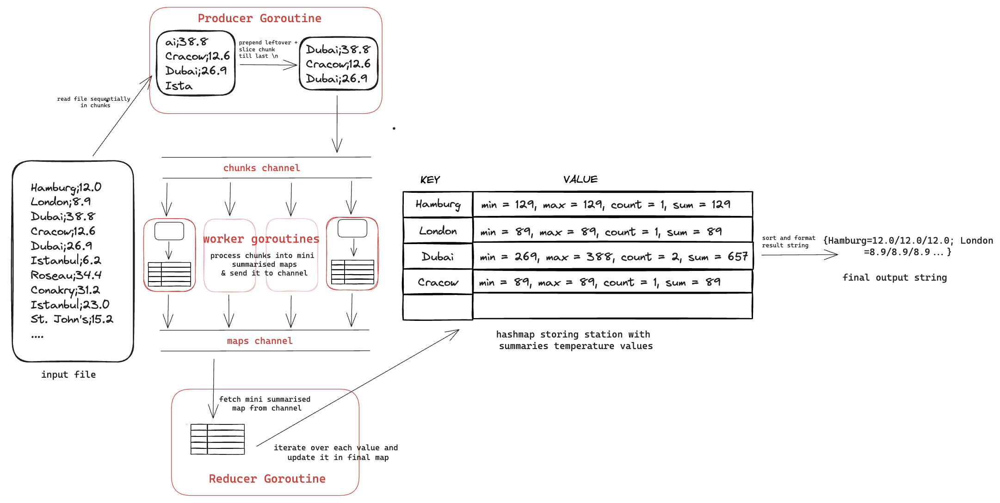

- [Applying Modern Go Concurrency Patterns to Data Pipelines](https://medium.com/amboss/applying-modern-go-concurrency-patterns-to-data-pipelines-b3b5327908d4)
  - A Simple Pipeline
  - you run this with go run main.go you'll see a deadlock
    - The channel returned by producer is not buffered, meaning you can only send values to the channel if someone is receiving values on the other end. But since `sink` is called later in the program, there is no receiver at the point where `outChannel <- s` is called, causing the deadlock.
    - fix it
      - either making the channel buffered, in which case the deadlock will occur once the buffer is full
      - or by running the producer in a Go routine. 
      - whoever creates the channel is also in charge of closing it.
  - Graceful Shutdown With Context
    - with context
    - Issues:
      - This will flood our terminal with empty log messages, like this: 2021/09/08 12:29:30. Apparently the for loop in sink keeps running forever
    - [Reason](https://golang.org/ref/spec#Receive_operator)
    - A receive operation on a closed channel can always proceed immediately, yielding the element type’s zero value after any previously sent values have been received.
    - Fix it
      - The value of ok is true if the value received was delivered by a successful send operation to the channel, or false if it is a zero value generated because the channel is closed and empty.
     ```go
     func sink(ctx context.Context, values <-chan string) {
              case val, ok := <-values:
                  if ok {
                      log.Println(val)
                 } else {
                     return
                  }
              }
          }
     ```
  - Adding Parallelism with Fan-Out and Fan-In
    - sending values to a closed channel is a panic
  - Error Handling
    - The most common way of propagating errors that I’ve seen is through a separate error channel. Unlike the value channels that connect pipeline stages, the error channels are not passed to downstream stages.
  - Removing Boilerplate With Generics
  - Maximum Efficiency With Semaphores
    - What if our input list only had a single element in it? Then we only need a single Go routine, not NumCPU() Go routines. 
    - Instead of creating a fixed number of Go routines, we will range over the input channel. For every value we receive from it, we will spawn a Go routine (see the example in the semaphore package)
- [Handling 1 Million Requests per Minute with Go](http://marcio.io/2015/07/handling-1-million-requests-per-minute-with-golang/)
  - The web handler would receive a JSON document that may contain a collection of many payloads that needed to be written to Amazon S3
  - Naive approach to GO routine
    ```go
    func payloadHandler(w http.ResponseWriter, r *http.Request) {
    
        if r.Method != "POST" {
            w.WriteHeader(http.StatusMethodNotAllowed)
            return
        }
    
        // Read the body into a string for json decoding
        var content = &PayloadCollection{}
        err := json.NewDecoder(io.LimitReader(r.Body, MaxLength)).Decode(&content)
        if err != nil {
            w.Header().Set("Content-Type", "application/json; charset=UTF-8")
            w.WriteHeader(http.StatusBadRequest)
            return
        }
    
        // Go through each payload and queue items individually to be posted to S3
        for _, payload := range content.Payloads {
            go payload.UploadToS3()   // <----- DON'T DO THIS
        }
    
        w.WriteHeader(http.StatusOK)
    }
    ```
  - Try again
    - create a buffered channel where we could queue up some jobs and upload them to S3
     ```go
     var Queue chan Payload
     
     func init() {
         Queue = make(chan Payload, MAX_QUEUE)
     }
     
     func payloadHandler(w http.ResponseWriter, r *http.Request) {
         ...
         // Go through each payload and queue items individually to be posted to S3
         for _, payload := range content.Payloads {
             Queue <- payload
         }
         ...
     }
     func StartProcessor() {
         for {
             select {
             case job := <-Queue:
                 job.payload.UploadToS3()  // <-- STILL NOT GOOD
             }
         }
     }
     ```
    - Issue: since the rate of incoming requests were much larger than the ability of the single processor to upload to S3, our buffered channel was quickly reaching its limit and blocking the request handler ability to queue more items.
  - Better solution
    - create a 2-tier channel system, one for queuing jobs and another to control how many workers operate on the JobQueue concurrently.
    ```go
    var (
        MaxWorker = os.Getenv("MAX_WORKERS")
        MaxQueue  = os.Getenv("MAX_QUEUE")
    )
    
    // Job represents the job to be run
    type Job struct {
        Payload Payload
    }
    
    // A buffered channel that we can send work requests on.
    var JobQueue chan Job
    
    // Worker represents the worker that executes the job
    type Worker struct {
        WorkerPool  chan chan Job
        JobChannel  chan Job
        quit    	chan bool
    }
    
    func NewWorker(workerPool chan chan Job) Worker {
        return Worker{
            WorkerPool: workerPool,
            JobChannel: make(chan Job),
            quit:       make(chan bool)}
    }
    
    // Start method starts the run loop for the worker, listening for a quit channel in case we need to stop it
    func (w Worker) Start() {
        go func() {
            for {
                // register the current worker into the worker queue.
                w.WorkerPool <- w.JobChannel
    
                select {
                case job := <-w.JobChannel:
                    // we have received a work request.
                    if err := job.Payload.UploadToS3(); err != nil {
                        log.Errorf("Error uploading to S3: %s", err.Error())
                    }
                case <-w.quit:
                    // we have received a signal to stop
                    return
                }
            }
        }()
    }
    
    // Stop signals the worker to stop listening for work requests.
    func (w Worker) Stop() {
        go func() {
            w.quit <- true
        }()
    }
    
    // handler
    func payloadHandler(w http.ResponseWriter, r *http.Request) {
        if r.Method != "POST" {
            w.WriteHeader(http.StatusMethodNotAllowed)
            return
        }
    
        // Read the body into a string for json decoding
        var content = &PayloadCollection{}
        err := json.NewDecoder(io.LimitReader(r.Body, MaxLength)).Decode(&content)
        if err != nil {
            w.Header().Set("Content-Type", "application/json; charset=UTF-8")
            w.WriteHeader(http.StatusBadRequest)
            return
        }
    
        // Go through each payload and queue items individually to be posted to S3
        for _, payload := range content.Payloads {
            // let's create a job with the payload
            work := Job{Payload: payload}
    
            // Push the work onto the queue.
            JobQueue <- work
        }
        w.WriteHeader(http.StatusOK)
    }
    
    dispatcher := NewDispatcher(MaxWorker)
    dispatcher.Run()
    
    type Dispatcher struct {
        // A pool of workers channels that are registered with the dispatcher
        WorkerPool chan chan Job
    }
    
    func NewDispatcher(maxWorkers int) *Dispatcher {
        pool := make(chan chan Job, maxWorkers)
        return &Dispatcher{WorkerPool: pool}
    }
    
    func (d *Dispatcher) Run() {
        // starting n number of workers
        for i := 0; i < d.maxWorkers; i++ {
            worker := NewWorker(d.pool)
            worker.Start()
        }
    
        go d.dispatch()
    }
    
    func (d *Dispatcher) dispatch() {
        for {
            select {
            case job := <-JobQueue:
                // a job request has been received
                go func(job Job) {
                    // try to obtain a worker job channel that is available.
                    // this will block until a worker is idle
                    jobChannel := <-d.WorkerPool
    
                    // dispatch the job to the worker job channel
                    jobChannel <- job
                }(job)
            }
        }
    }
    ```
- [Go timer 是如何被调度的](https://mp.weixin.qq.com/s/zy354p9MQq10fpTL20uuCA)
  - 概述
    - 不管用 **NewTimer**, **timer.After**，还是 **timer.AfterFun** 来初始化一个 timer, 这个 timer 最终都会加入到一个全局 timer 堆中，由 Go runtime 统一管理。
    - Go 1.9 版本之前，所有的计时器由全局唯一的四叉堆维护，协程间竞争激烈。
    - Go 1.10 - 1.13，全局使用 64 个四叉堆维护全部的计时器，没有本质解决 1.9 版本之前的问题
    - Go 1.14 版本之后，每个 P 单独维护一个四叉堆。
  - 原理
    - 四叉堆原理
      - 四叉树顾名思义最多有四个子节点，为了兼顾四叉树插、删除、重排速度，所以四个兄弟节点间并不要求其按触发早晚排序。
    - timer 是如何被调度的
      - 调用 NewTimer，timer.After, timer.AfterFunc 生产 timer, 加入对应的 P 的堆上。
      - 调用 timer.Stop, timer.Reset 改变对应的 timer 的状态。
      - GMP 在调度周期内中会调用 checkTimers ，遍历该 P 的 timer 堆上的元素，根据对应 timer 的状态执行真的操作。
    - timer 是如何加入到 timer 堆上的
      - 通过 NewTimer, time.After, timer.AfterFunc 初始化 timer 后，相关 timer 就会被放入到对应 p 的 timer 堆上。
      - timer 已经被标记为 timerRemoved，调用了 timer.Reset(d)，这个 timer 也会重新被加入到 p 的 timer 堆上
      - timer 还没到需要被执行的时间，被调用了 timer.Reset(d)，这个 timer 会被 GMP 调度探测到，先将该 timer 从 timer 堆上删除，然后重新加入到 timer 堆上
      - STW 时，runtime 会释放不再使用的 p 的资源，p.destroy()->timer.moveTimers，将不再被使用的 p 的 timers 上有效的 timer(状态是：timerWaiting，timerModifiedEarlier，timerModifiedLater) 都重新加入到一个新的 p 的 timer 上
    - Reset 时 timer 是如何被操作的
      - 被标记为 timerRemoved 的 timer，这种 timer 是已经从 timer 堆上删除了，但会重新设置被触发时间，加入到 timer 堆中
      - 等待被触发的 timer，在 Reset 函数中只会修改其触发时间和状态（timerModifiedEarlier或timerModifiedLater）。这个被修改状态的 timer 也同样会被重新加入到 timer堆上，不过是由 GMP 触发的，由 checkTimers 调用 adjusttimers 或者 runtimer 来执行的。
    - Stop 时 timer 是如何被操作的
      - time.Stop 为了让 timer 停止，不再被触发，也就是从 timer 堆上删除。不过 timer.Stop 并不会真正的从 p 的 timer 堆上删除 timer，只会将 timer 的状态修改为 timerDeleted。然后等待 GMP 触发的 adjusttimers 或者 runtimer 来执行。
    - Timer 是如何被真正执行的
      - timer 的真正执行者是 GMP。GMP 会在每个调度周期内，通过 runtime.checkTimers 调用 timer.runtimer(). timer.runtimer 会检查该 p 的 timer 堆上的所有 timer，判断这些 timer 是否能被触发。
      - 如果该 timer 能够被触发，会通过回调函数 sendTime 给 Timer 的 channel C 发一个当前时间，告诉我们这个 timer 已经被触发了。
      - 如果是 ticker 的话，被触发后，会计算下一次要触发的时间，重新将 timer 加入 timer 堆中。
  - Timer 使用中的坑
    - 错误创建很多 timer，导致资源浪费
      ```go
      func main() {
          for {
              // xxx 一些操作
              timeout := time.After(30 * time.Second)
              select {
              case <- someDone:
                  // do something
              case <-timeout:
                  return
              }
          }
      }
      ```
      - 因为 timer.After 底层是调用的 timer.NewTimer，NewTimer 生成 timer 后，会将 timer 放入到全局的 timer 堆中。
      - for 会创建出来数以万计的 timer 放入到 timer 堆中，导致机器内存暴涨，同时不管 GMP 周期 checkTimers，还是插入新的 timer 都会疯狂遍历 timer 堆，导致 CPU 异常。
       ```go
       func main() {
           timer := time.NewTimer(time.Second * 5)    
           for {
               timer.Reset(time.Second * 5)
       
               select {
               case <- someDone:
                   // do something
               case <-timer.C:
                   return
               }
           }
       }
       ```
    - 程序阻塞，造成内存或者 goroutine 泄露
       ```go
       func main() {
           timer1 := time.NewTimer(2 * time.Second)
           <-timer1.C
           println("done")
       }
       ```
      - 只有等待 timer 超时 "done" 才会输出，原理很简单：程序阻塞在 <-timer1.C 上，一直等待 timer 被触发时，回调函数 time.sendTime 才会发送一个当前时间到 timer1.C 上，程序才能继续往下执行。
      ```go
      func main() {
          timer1 := time.NewTimer(2 * time.Second)
          go func() {
              timer1.Stop() // refer to doc
          }()
          <-timer1.C
      
          println("done")
      }
      ```
      - 程序就会一直死锁了，因为 timer1.Stop 并不会关闭 channel C，使程序一直阻塞在 timer1.C 上。
      - Stop 的正确的使用方式：
       ```go
       func main() {
           timer1 := time.NewTimer(2 * time.Second)
           go func() {
               if !timer1.Stop() {
                   <-timer1.C
               }
           }()
       
           select {
           case <-timer1.C:
               fmt.Println("expired")
           default:
           }
           println("done")
       }
       ```
- [panic](https://mp.weixin.qq.com/s/sGdTVSRxqxIezdlEASB39A)
  - 什么时候会产生 panic
    - 主动方式：
      - 程序猿主动调用 panic 函数；
    - 被动的方式：
      - 编译器的隐藏代码触发
        ```go
        func divzero(a, b int) int {
            c := a/b
            return c
        }
        ```
        - 用 dlv 调试断点到 divzero 函数，然后执行 disassemble ，你就能看到秘密了
        - 编译器偷偷加上了一段 if/else 的判断逻辑，并且还给加了 runtime.panicdivide  的代码。
      - 内核发送给进程信号触发
        - 最典型的是非法地址访问，比如， nil 指针 访问会触发 panic
        - 在 Go 进程启动的时候会注册默认的信号处理程序（ sigtramp ）
        - 在 cpu 访问到 0 地址会触发 page fault 异常，这是一个非法地址，内核会发送 SIGSEGV 信号给进程，所以当收到 SIGSEGV 信号的时候，就会让 sigtramp 函数来处理，最终调用到 panic 函数 ：
         ```
         // 信号处理函数回
         sigtramp （纯汇编代码）
           -> sigtrampgo （ signal_unix.go ）
             -> sighandler  （ signal_sighandler.go ）
                -> preparePanic （ signal_amd64x.go ）
         
                   -> sigpanic （ signal_unix.go ）
                     -> panicmem 
                       -> panic (内存段错误)
         ```
        - 在进程初始化的时候，创建 M0（线程）的时候用系统调用 sigaction 给信号注册处理函数为 sigtramp
    - Summary
      - panic( ) 函数内部会产生一个关键的数据结构体 _panic ，并且挂接到 goroutine 之上；
      - panic( ) 函数内部会执行 _defer 函数链条，并针对 _panic 的状态进行对应的处理；
      - 循环执行 goroutine 上面的 _defer 函数链，如果执行完了都还没有恢复 _panic 的状态，那就没得办法了，退出进程，打印堆栈。
      - 如果在 goroutine 的 _defer 链上，有个朋友 recover 了一下，把这个 _panic 标记成恢复，那事情就到此为止，就从这个 _defer 函数执行后续正常代码即可，走 deferreturn 的逻辑。
- [如何限定Goroutine数量](https://juejin.cn/post/7017286487502766093)
  - 用有 buffer 的 channel 来限制
  - channel 与 sync 同步组合方式实现控制 goroutine
  - 利用无缓冲 channel 与任务发送/执行分离方式
    ```go
    var wg = sync.WaitGroup{}
    func doBusiness(ch chan int) {
        for t := range ch {
            fmt.Println("go task = ", t, ", goroutine count = ", runtime.NumGoroutine())
            wg.Done()
        }
    }
    
    func sendTask(task int, ch chan int) {
        wg.Add(1)
        ch <- task
    }
    
    func main() {
        ch := make(chan int)   //无buffer channel
        goCnt := 3              //启动goroutine的数量
        for i := 0; i < goCnt; i++ {
            //启动go
            go doBusiness(ch)
        }
    
        taskCnt := math.MaxInt64 //模拟用户需求业务的数量
        for t := 0; t < taskCnt; t++ {
            //发送任务
            sendTask(t, ch)
        }
        wg.Wait()
    }
    ```
- [Sync Once Source Code](https://mp.weixin.qq.com/s/nkhZyKG4nrUulpliMKdgRw)
  - 问题
    - 为啥源码引入Mutex而不是CAS操作
    - 为啥要有fast path, slow path 
    - 加锁之后为啥要有done==0，为啥有double check，为啥这里不是原子读
    - store为啥要加defer
    - 为啥是atomic.store，不是直接赋值1
  - 演进
    - 开始
      ```go
      type Once struct {
       m    Mutex
       done bool
      }
      
      func (o *Once) Do(f func()) {
       o.m.Lock()
       defer o.m.Unlock()
       if !o.done {
        o.done = true
        f()
       }
      }
      ```
      缺点：每次都要执行Mutex加锁操作，对于Once这种语义有必要吗，是否可以先判断一下done的value是否为true，然后再进行加锁操作呢？
    - 进化
      ```go
      type Once struct {
       m    Mutex
       done int32
      }
      
      func (o *Once) Do(f func()) {
       if atomic.AddInt32(&o.done, 0) == 1 {
        return
       }
       // Slow-path.
       o.m.Lock()
       defer o.m.Unlock()
       if o.done == 0 {
        f()
        atomic.CompareAndSwapInt32(&o.done, 0, 1)
       }
      }
      ```
      进化点
      - 在slow-path加锁后，要继续判断done值是否为0，确认done为0后才要执行f()函数，这是因为在多协程环境下仅仅通过一次atomic.AddInt32判断并不能保证原子性，比如俩协程g1、g2，g2在g1刚刚执行完atomic.CompareAndSwapInt32(&o.done, 0, 1)进入了slow path，如果不进行double check，那g2又会执行一次f()。
      - 用一个int32变量done表示once的对象是否已执行完，有两个地方使用到了atomic包里的方法对o.done进行判断，分别是，用AddInt32函数根据o.done的值是否为1判断once是否已执行过，若执行过直接返回；f()函数执行完后，对o.done通过cas操作进行赋值1。
      - 问到atomic.CompareAndSwapInt32(&o.done, 0, 1)可否被o.done == 1替换， 答案是不可以
        - 现在的CPU一般拥有多个核心，而CPU的处理速度快于从内存读取变量的速度，为了弥补这俩速度的差异，现在CPU每个核心都有自己的L1、L2、L3级高速缓存，CPU可以直接从高速缓存中读取数据，但是这样一来内存中的一份数据就在缓存中有多份副本，在同一时间下这些副本中的可能会不一样，为了保持缓存一致性，Intel CPU使用了MESI协议
        - AddInt32方法和CompareAndSwapInt32方法(均为amd64平台 runtime/internal/atomic/atomic_amd64.s)底层都是在汇编层面调用了LOCK指令，LOCK指令通过总线锁或MESI协议保证原子性（具体措施与CPU的版本有关），提供了强一致性的缓存读写保证，保证LOCK之后的指令在带LOCK前缀的指令执行之后才执行，从而保证读到最新的o.done值。
    - 小优化1
      - 把done的类型由int32替换为uint32,用CompareAndSwapUint32替换了CompareAndSwapInt32, 用LoadUint32替换了AddInt32方法
      - LoadUint32底层并没有LOCK指令用于加锁，我觉得能这么写的主要原因是进入slow path之后会继续用Mutex加锁并判断o.done的值，且后面的CAS操作是加锁的，所以可以这么改
    - 小优化2
      - 用StoreUint32替换了CompareAndSwapUint32操作，CAS操作在这里确实有点多余，因为这行代码最主要的功能是原子性的done = 1
      - Store命令的底层是，其中关键的指令是XCHG，有的同学可能要问了，这源码里没有LOCK指令啊，怎么保证happen before呢，Intel手册有这样的描述: The LOCK prefix is automatically assumed for XCHG instruction.，这个指令默认带LOCK前缀，能保证Happen Before语义。
    - 小优化3
      - 在StoreUint32前增加defer前缀，增加defer是保证 即使f()在执行过程中出现panic，Once仍然保证f()只执行一次，这样符合严格的Once语义。
      - 除了预防panic，defer还能解决指令重排的问题：现在CPU为了执行效率，源码在真正执行时的顺序和代码的顺序可能并不一样，比如这段代码中a不一定打印"hello, world"，也可能打印空字符串。
        ```go
        var a string
        var done bool
        
        func setup() {
         a = "hello, world"
         done = true
        }
        
        func main() {
         go setup()
         for !done {
         }
         print(a)
        }
        ```
    - 小优化4
      - 用函数区分开了fast path和slow path，对fast path做了内联优化
- [Option Design](https://mp.weixin.qq.com/s/WUqpmyxWv_W5E6RtxazYAg)
  - Good approach
    ```go
    func NewServer(addr string, options ...func(server *http.Server)) *http.Server {
      server := &http.Server{Addr: addr, ReadTimeout: 3 * time.Second}
      for _, opt := range options {
        opt(server)
      }
      return server
    }
    ```
    - 通过不定长度的方式代表可以给多个 options，以及每一个 option 是一个 func 型态，其参数型态为 *http. Server。那我们就可以在 NewServer 这边先给 default value，然后通过 for loop 将每一个 options 对其 Server 做的参数进行设置，这样 client 端不仅可以针对他想要的参数进行设置，其他没设置到的参数也不需要特地给 zero value 或是默认值，完全封装在 NewServer 就可以了
     ```go
     func main() {
       readTimeoutOption := func(server *http.Server) {
         server.ReadTimeout = 5 * time.Second
       }
       handlerOption := func(server *http.Server) {
         mux := http.NewServeMux()
         mux.HandleFunc("/health", func(writer http.ResponseWriter, request *http.Request) {
           writer.WriteHeader(http.StatusOK)
         })
         server.Handler = http.NewServeMux()
       }
       s := server.NewServer(":8080", readTimeoutOption, handlerOption)
     }
     ```
  - Good approach v2
    ```go
    type options struct {
      cache  bool
      logger *zap.Logger
    }
    
    type Option interface {
      apply(*options)
    }
    
    type cacheOption bool
    func (c cacheOption) apply(opts *options) {
      opts.cache = bool(c)
    }
    
    func WithCache(c bool) Option {
      return cacheOption(c)
    }
    
    type loggerOption struct {
      Log *zap.Logger
    }
    
    func (l loggerOption) apply(opts *options) {
      opts.logger = l.Log
    }
    
    func WithLogger(log *zap.Logger) Option {
      return loggerOption{Log: log}
    }
    
    // Open creates a connection.
    func Open(
      addr string,
      opts ...Option,
    ) (*Connection, error) {
      options := options{
        cache:  defaultCache,
        logger: zap.NewNop(),
      }
    
      for _, o := range opts {
        o.apply(&options)
      }
    }
    ```
    - 可以看到通过设计一个Option interface，里面用了 apply function，以及使用一个 options struct 将所有的 field 都放在这个 struct 里面，每一个 field 又会用另外一种 struct 或是 custom type 进行封装，并 implement apply function，最后再提供一个 public function：WithLogger 去给 client 端设值。
    - 这样的做法好处是可以针对每一个 option 作更细的 custom function 设计，例如选项的 description 为何？可以为每一个 option 再去 implement Stringer interface，之后提供 option 描述就可以调用 toString 了，设计上更加的方便
     ```go
     func (l loggerOption) apply(opts *options) {
       opts.logger = l.Log
     }
     func (l loggerOption) String() string {
       return "logger description..."
     }
     ```
- [schedule a task at a specific time](https://stephenafamo.com/blog/posts/how-to-schedule-task-at-specific-time-in-go)
    ```go
    func waitUntil(ctx context.Context, until time.Time) {
        timer := time.NewTimer(time.Until(until))
        defer timer.Stop()
    
        select {
        case <-timer.C:
            return
        case <-ctx.Done():
            return
        }
    }
    func main() {
        // our context, for now we use context.Background()
        ctx := context.Background()
        
        // when we want to wait till
        until, _ := time.Parse(time.RFC3339, "2023-06-22T15:04:05+02:00")
        
        waitUntil(ctx, until)
    }
    ```
- [Better scheduling](https://stephenafamo.com/blog/posts/better-scheduling-in-go)
  - [Kronika](https://github.com/stephenafamo/kronika)
  - Using `time.After()`
    ```go
        // This will block for 5 seconds and then return the current time
        theTime := <-time.After(time.Second * 5)
        fmt.Println(theTime.Format("2006-01-02 15:04:05"))
    ```
  - Using time.Ticker
    ```go
        // This will print the time every 5 seconds
        for theTime := range time.Tick(time.Second * 5) {
            fmt.Println(theTime.Format("2006-01-02 15:04:05"))
        }
    ```
    - Dangers of using `time.Tick()`
      - When we use the `time.Tick()` function, we do not have direct access to the underlying `time.Ticker` and so we cannot close it properly.
    - Limitations using `time.Tick()`
      - Specify a start time
      - Stop the ticker
  - Extending `time.Tick()` using a custom function
     ```go
     func cron(ctx context.Context, startTime time.Time, delay time.Duration) <-chan time.Time {
         // Create the channel which we will return
         stream := make(chan time.Time, 1)
     
         // Calculating the first start time in the future
         // Need to check if the time is zero (e.g. if time.Time{} was used)
         if !startTime.IsZero() {
             diff := time.Until(startTime)
             if diff < 0 {
                 total := diff - delay
                 times := total / delay * -1
     
                 startTime = startTime.Add(times * delay)
             }
         }
         // Run this in a goroutine, or our function will block until the first event
         go func() {
             // Run the first event after it gets to the start time
             t := <-time.After(time.Until(startTime))
             stream <- t
             // Open a new ticker
             ticker := time.NewTicker(delay)
             // Make sure to stop the ticker when we're done
             defer ticker.Stop()
     
             // Listen on both the ticker and the context done channel to know when to stop
             for {
                 select {
                 case t2 := <-ticker.C:
                     stream <- t2
                 case <-ctx.Done():
                     close(stream)
                     return
                 }
             }
         }()
         return stream
     }
     ```
     - Run on Tuesdays by 2 pm
       ```go
       ctx := context.Background()
       
       startTime, err := time.Parse(
           "2006-01-02 15:04:05",
           "2019-09-17 14:00:00",
       ) 
       delay := time.Hour * 24 * 7 // 1 week
       for t := range cron(ctx, startTime, delay) {
           // Perform action here
           log.Println(t.Format("2006-01-02 15:04:05"))
       }
       ```
     - Run every hour, on the hour
       ```go
       ctx := context.Background()
       
       startTime, err := time.Parse(
           "2006-01-02 15:04:05",
           "2019-09-17 14:00:00",
       ) // any time in the past works but it should be on the hour
       delay := time.Hour // 1 hour
       
       for t := range cron(ctx, startTime, delay) {
           // Perform action here
           log.Println(t.Format("2006-01-02 15:04:05"))
       }
       ```
- [怎么使用 direct io](https://mp.weixin.qq.com/s/fr3i4RYDK9amjdCAUwja6A)
  - 操作系统的 IO 过文件系统的时候，默认是会使用到 page cache，并且采用的是 write back 的方式，系统异步刷盘的。由于是异步的，如果在数据还未刷盘之前，掉电的话就会导致数据丢失。
  - 写到磁盘有两种方式：
    - 要么就每次写完主动 sync 一把
    - 要么就使用 direct io 的方式，指明每一笔 io 数据都要写到磁盘才返回。
  - O_DIRECT 的知识点
    - direct io 也就是常说的 DIO，是在 Open 的时候通过 flag 来指定 O_DIRECT 参数，之后的数据的 write/read 都是绕过 page cache，直接和磁盘操作，从而避免了掉电丢数据的尴尬局面，同时也让应用层可以自己决定内存的使用（避免不必要的 cache 消耗）。
    - direct io 模式需要用户保证对齐规则，否则 IO 会报错，有 3 个需要对齐的规则：
      - IO 的大小必须扇区大小（512字节）对齐 
      - IO 偏移按照扇区大小对齐； 
      - 内存 buffer 的地址也必须是扇区对齐
  - 为什么 Go 的 O_DIRECT 知识点值得一提
    - O_DIRECT 平台不兼容 
    - Go 标准库 os 中的是没有 O_DIRECT 这个参数的. 其实 O_DIRECT 这个 Open flag 参数本就是只存在于 linux 系统。// syscall/zerrors_linux_amd64.go
      ```go
      // +build linux
      // 指明在 linux 平台系统编译
      fp := os.OpenFile(name, syscall.O_DIRECT|flag, perm)
      ```
    - Go 无法精确控制内存分配地址
      - direct io 必须要满足 3 种对齐规则：io 偏移扇区对齐，长度扇区对齐，内存 buffer 地址扇区对齐。前两个还比较好满足，但是分配的内存地址作为一个小程序员无法精确控制
      - `buffer := make([]byte, 4096)` 那这个地址是对齐的吗？ 答案是：不确定。
      - 方法很简单，**就是先分配一个比预期要大的内存块，然后在这个内存块里找对齐位置**。 这是一个任何语言皆通用的方法，在 Go 里也是可用的。
    ```go
    const (
        AlignSize = 512
    )
    
    // 在 block 这个字节数组首地址，往后找，找到符合 AlignSize 对齐的地址，并返回
    // 这里用到位操作，速度很快；
    func alignment(block []byte, AlignSize int) int {
       return int(uintptr(unsafe.Pointer(&block[0])) & uintptr(AlignSize-1))
    }
    
    // 分配 BlockSize 大小的内存块
    // 地址按照 512 对齐
    func AlignedBlock(BlockSize int) []byte {
       // 分配一个，分配大小比实际需要的稍大
       block := make([]byte, BlockSize+AlignSize)
    
       // 计算这个 block 内存块往后多少偏移，地址才能对齐到 512 
       a := alignment(block, AlignSize)
       offset := 0
       if a != 0 {
          offset = AlignSize - a
       }
    
       // 偏移指定位置，生成一个新的 block，这个 block 将满足地址对齐 512；
       block = block[offset : offset+BlockSize]
       if BlockSize != 0 {
          // 最后做一次校验 
          a = alignment(block, AlignSize)
          if a != 0 {
             log.Fatal("Failed to align block")
          }
       }
       
       return block
    }
    ```
    - 有开源的库吗
    - https://github.com/ncw/directio
      ```go
      // 创建句柄
      fp, err := directio.OpenFile(file, os.O_RDONLY, 0666)
      // 创建地址按照 4k 对齐的内存块
      buffer := directio.AlignedBlock(directio.BlockSize)
      // 把文件数据读到内存块中
      _, err := io.ReadFull(fp, buffer)
      ```
- [浮点数](https://mp.weixin.qq.com/s/DGP4rENdy-N1VyZLS_uV4g)
  - 浮点数是指用符号、尾数、基数和指数这四部分来表示的小数
  
  - 小数的二进制和十进制转换
    - 十进制整数转二进制采用“除 2 取余，逆序排列”法
    - 但如果十进制是小数，转为二进制小数如何做？采用“乘 2 取整，顺序排列”
  - 浮点数的 IEEE754 表示
  
    - 尾数部分
      - IEEE754 规定，在二进制数中，通过移位，将小数点前面的值固定为 1。IEEE754 称这种形式的浮点数为规范化浮点数（normal number
      - 比如十进制数 0.15625，转为二进制是 0.00101。为了让第 1 位为 1，执行逻辑右移 3 位，尾数部分成为 1.01，因为右移了 3 位，所以指数部分是 -3。
    - 指数部分
      - 因为指数有正、有负，为了避免使用符号位，同时方便比较、排序，指数部分采用了 The Biased exponent（有偏指数）
      - 用十进制 0.15625 举例。上文知道，因为右移了 3 位，所以指数是 -3。根据 IEEE754 的定义，单精度浮点数情况下，-3 的实际值是 127 - 3 = 124。明白了吗？127 表示 0，124 就表示 -3 了。而十进制的 124 转为二进制就是 1111100。
  - 浮点数
  
  - 再看 0.1+0.2 = 0.30000000000000004
    - 出现这种情况的根本原因是，有些十进制小数无法转换为二进制数.在小数点后 4 位时，连续的二进制数，对应的十进制数却是不连续的，因此只能增加位数来尽可能近似的表示。
    
  - IEEE754 浮点数分类小结
  
- [优雅的 Go 错误问题解决方案](https://mp.weixin.qq.com/s?__biz=MjM5ODYwMjI2MA==&mid=2649764790&idx=1&sn=fc63b1cf5071aa0324987d1e5b3cab71&scene=21#wechat_redirect)
  - 服务/系统的错误信息返回
  - 传统方案
    - 服务/系统层面的错误信息返回，大部分协议都可以看成是 code - message 模式或者是其变体
    - 我们在使用 code - message 机制的时候，特别是业务初期，难以避免的是前后端的设计文案没能完整地覆盖所有的错误用例，或者是错误极其罕见。因此当出现错误时，提示暧昧不清（甚至是直接提示错误信息），导致用户从错误信息中找到解决方案
  - New Solution
    - 人的短期记忆对 4 个字符还是比较强的，因此我们可以考虑把错误代码缩短到 4 个字符
    - 采用的是 MD5 作为例子。MD5 的输出是 128 位，理论上我可以取 MD5 的输出，模 1679616 就可以得到一个简易的结果。实际上为了减少除法运算，我采用的是取高 20 位（0xFFFFF）的简易方式（20 位二进制的最大值为 1048575），然后将这个数字转成 36 进制的字符串输出。
    - 我们可以将 message 的提示信息如下展示：“未知错误，错误代码 30EV，如需协助，请联系 XXX”。顺带一提，30EV 是 "Access denied for user 'db_user'@'127.0.0.1'" 的计算结果，这样一来，我就对调用方隐藏了敏感信息。
    ```go
    import (
        "github.com/martinlindhe/base36"
    )
    
    var (
        replacer = strings.NewReplacer(
            " ", "0",
            "O", "0",
            "I", "1",
        )
    )
    
    func Err2Hashcode(err error) (uint64, string) {
        u64 := hash(err.Error())
        codeStr := encode(u64)
        u64, _ = decode(codeStr)
        return u64, codeStr
    }
    
    func encode(code uint64) string {
        s := fmt.Sprintf("%4s", base36.Encode(code))
        return replace.Replace(s)
    }
    
    func decode(s string) (uint64, bool) {
        if len(s) != 4 {
            return 0, false
        }
        s = strings.Replace(s, "l", "1", -1)
        s = strings.ToUpper(s)
        s = replace.Replace(s)
        code := base36.Decode(s)
        return code, code > 0
    }
    
    // hash 函数可以自定义
    func hash(s string) uint64 {
        h := md5.Sum([]byte(s))
        u := binary.BigEndian.Uint32(h[0:16])
        return uint64(u &amp; 0xFFFFF)
    }
    ```
- [Golang内存管理优化！三色标记法源码浅析](https://mp.weixin.qq.com/s/A2aCo9UYyI3iHCu9nsGrAA)
  - 探讨的gcDrain函数就是使用三色标记法找到存活对象的一个重要函数，了解gcDrain函数就会对golang垃圾回收机制有更深的理解
  - golang垃圾回收过程
  
    | 阶段	| 说明	| 赋值器状态 |
    | ----- | ------  | -------- |
    |SweepTermination	| 清扫终止阶段，为下一个阶段的并发标记做准备工作，启动写屏障	|STW |
    | Mark	| 扫描标记阶段，与赋值器并发执行，写屏障开启	 | 并发 |
    | MarkTermination	| 标记终止阶段，保证一个周期内标记任务完成，停止写屏障	| STW |
    | GCoff	| 内存清扫阶段，将需要回收的内存暂存，写屏障关闭	| 并发 |
    | GCoff	| 内存归还阶段，将内存依照策略归还给操作系统，写屏障关闭	| 并发 |
    
  - 三色标记法
    - 三色标记法是golang在堆内存中寻找存活对象的抽象过程
    - 黑色对象标识该对象已经被标记过了，且黑色对象引用的对象也全部都被标记过了。
    - 灰色对象表示该对象已经被标记了但是该对象引用的对象没有被全部标记。
    - 白色对象就是没有被标记的对象，被认为是潜在的垃圾，在标记开始前，所有对象都是白色对象
    
- [如何有效控制 Go 线程数](https://mp.weixin.qq.com/s/HYcHfKScBlYCD0IUd0t4jA)
  - Go 对运行时创建的线程数量有一个限制，默认是 10000 个线程
  - 闲置线程
    - GOMAXPROCS 的定义文档，我们可以看到该变量只是限制了可以同时执行用户级 Go 代码的 OS 系统线程数量（通俗地讲：Go 程序最多只能有和 P 相等个数的系统线程同时运行）。但是，**在系统调用中被阻塞的线程不在此限制之中**
    - Go 网络编程模型，就是一种异步系统调用。它使用网路轮询器进行系统调用，调度器可以防止 G 在进行这些系统调用时阻塞 M。这可以让 M 继续执行其他的 G，而不需要创建新的 M。
  - 最大线程数限制
    - 线程限制数值确定为 10000
    - Go 也暴露了 _debug.SetMaxThreads()_ 方法可以让我们修改最大线程数值
      ```go
      func main() {
       debug.SetMaxThreads(10)
       for i := 0; i < 20; i++ {
        go func() {
         _, err := exec.Command("bash", "-c", "sleep 3").Output()
         if err != nil {
          panic(err)
         }
        }()
       }
       time.Sleep(time.Second * 5)
      }
      ```
  - 让闲置线程退出
    - 提出使用 runtime.LockOSThread() 方法来杀死线程
      - 调用 LockOSThread 函数会把当前 G 绑定在当前的系统线程 M 上，这个 G 总是在这个 M 上执行，并且阻止其它 G 在该 M 执行。
      - 只有当前 G 调用了与之前调用 LockOSThread 相同次数的 UnlockOSThread 函数之后，G 与 M 才会解绑。
      - 如果当前 G 在退出时，没有调用 UnlockOSThread，这个线程会被终止。
  - Summary
    - 在 GMP 模型中，P 与 M 一对一的挂载形式，通过设定 GOMAXPROCS 变量就能控制并行线程数。
    - 当 M 遇到同步系统调用时，G 和 M 会与 P 剥离，当系统调用完成，G 重新进入可运行状态，而 M 就会被闲置起来。
    - Go 目前并没有对闲置线程做清除处理，它们被当作复用的资源，以备后续需要。但是，如果在 Go 程序中积累大量空闲线程，这是对资源的一种浪费，同时对操作系统也产生了威胁。因此，Go 设定了 10000 的默认线程数限制
    - 我们发现了一种利用 LockOSThread 函数的 trik 做法，可以借此做一些限制线程数的方案：例如启动定期排查线程数的 goroutine，当发现程序的线程数超过某阈值后，就回收掉一部分闲置线程。
    - 当然，这个方法也存在隐患。例如在 issues#14592 有人提到：当子进程由一个带有 PdeathSignal: SIGKILL 的 A 线程创建，A 变为空闲时，如果 A 退出，那么子进程将会收到 KILL 信号，从而引起其他问题。
    - 绝大多数情况下，我们的 Go 程序并不会遇到空闲线程数过多的问题。如果真的存在线程数暴涨的问题，那么你应该思考代码逻辑是否合理（为什么你能允许短时间内如此多的系统同步调用），是否可以做一些例如限流之类的处理。而不是想着通过 SetMaxThreads 方法来处理。
- [go 没有 volatile 关键字](https://spongecaptain.cool/post/go/volatile_go/)
  - Java 中的 volatile
    - 可见性：当多个线程访问同一个变量时，一个线程修改了这个变量的值，其他线程能够立即看得到修改的值。
    - 有序性：编译器优化、JIT 优化、CPU 优化都可能导致指令重排序，以提高执行效率。volatile 用于禁止对 volatile 字段操作的前后指令重排序。
    - 在 Java 中 synchronized 关键字能够提供 volatile 提供的并发安全语义同时，提供更好的并发安全能力，但是 synchronized 太重了，没有 volatile 轻量，性能差。
  - Go 没有 volatile
    - 利用 mutex 解决 Go 没有 volatile
    - 利用 channel 解决 Go 没有 volatile
    - 利用 atomic 解决 Go 没有 volatile
- [Go内存对齐](https://docs.google.com/presentation/d/1XUA8WfgTHCF_8XdfPEuNvs-WZ0DshFHKFEEqHRd3Tzg/edit#slide=id.g812812c0e8_1_21)
  - 为什么要对齐
    - 平台原因(移植原因)：
      不是所有的硬件平台都能访问任意地址上的任意数据的；某些硬件平台只能在某些地址处取某些特定类型的数据，否则抛出硬件异常。
    - 性能原因：
      数据结构应该尽可能地在自然边界上对齐。原因在于，为了访问未对齐的内存，处理器需要作两次内存访问；而对齐的内存访问仅需要一次访问。
  - 总结
    - 内存对齐是为了cpu更高效访问内存中数据
    - 结构体对齐依赖类型的大小保证和对齐保证
    - 地址对齐保证是：如果类型 t 的对齐保证是 n，那么类型 t 的每个值的地址在运行时必须是 n 的倍数。
    - struct内字段如果填充过多，可以尝试重排，使字段排列更紧密，减少内存浪费
    - 零大小字段要避免作为struct最后一个字段，会有内存浪费
    - 32位系统上对64位字的原子访问要保证其是8bytes对齐的；当然如果不必要的话，还是用加锁（mutex）的方式更清晰简单
- [全局变量加锁的优化](https://mp.weixin.qq.com/s/DBa0UEBtOVpKtlz38R1VTA)
  - 改变锁的类型 - 读写锁
  - 降低锁住的代码块长度
  - 对数据切片
    - 假设我们的全局变量是一个map，我们可以对key做一个哈希后取模的操作，将原来一个map的数据分开写到多个map中。这样同一个大集合中的数据便支持了同时对多个数据进行写入而互不影响。
    ```go
    const (
     defaultStripSize = 1 << 16
     defaultStripMask = defaultStripSize - 1
    )
    
    type stripLock struct {
     sync.RWMutex
     _ [40]byte
    }
    
    type StripMap struct {
     locks   []stripLock
     buckets []map[uint64]interface{}
    }
    
    func DefaultStripMap() *StripMap {
     s := &StripMap{
      locks:   make([]stripLock, defaultStripSize),
      buckets: make([]map[uint64]interface{}, defaultStripSize),
     }
    
     for i := range s.buckets {
      s.buckets[i] = make(map[uint64]interface{})
     }
    
     return s
    }
    
    func (s *StripMap) Set(key uint64, value interface{}) {
     s.locks[key&defaultStripMask].RLock()
     defer s.locks[key&defaultStripMask].RUnlock()
    
     s.buckets[key&defaultStripMask][key] = value
    }
    
    func (s *StripMap) Get(key uint64) (interface{}, bool) {
     s.locks[key&defaultStripMask].RLock()
     defer s.locks[key&defaultStripMask].RUnlock()
    
     v, ok := s.buckets[key&defaultStripMask][key]
     return v, ok
    }
    
    func (s *StripMap) Remove(key uint64) {
     s.locks[key&defaultStripMask].Lock()
     defer s.locks[key&defaultStripMask].Unlock()
    
     delete(s.buckets[key&defaultStripMask], key)
    }
    ```
    - 使用位运算代替取模操作
      - `a % b = a & (b-1)` 当且仅当`b = 2^n`时成立
    - Cache Line 是为了解决不同变量之在多个CPU核心之间共享的问题
    - 内存对齐是为了解决同一个结构体内部访问效率等问题
- [Go 的 TryLock 实现](https://mp.weixin.qq.com/s/nS-72MLogNmwUBcvC2Xq6g)
  - 在某些情况下，或许我们希望在获取锁失败时，并不想停止执行，而是可以进入其他的逻辑。
  - 当锁被其他 goroutine 占有，或者当前锁正处于饥饿模式，它将立即返回 false
  - 正如 TryLock() 方法的注释一样，它的应用场景并不常见，并且也不被鼓励使用
- [如何阅读 Go 源码](https://mp.weixin.qq.com/s/Hj9q9MQD6tQIX6mpj7y9pA)
  - 查看标准库源代码
    - 使用IDE提供的调试器或者GDB都可以达到目的，写一个简单的demo，断点一打，单步调试走起来
  - 查看Go语言底层实现
    - 分析汇编代码 plan9 assembly
      ```go
       1. go tool compile -S -N -l main.go -- 是将源代码编译成.o文件，并输出汇编代码
       2. go build main.go && go tool objdump ./main -- 反汇编
      ```
    - 在线调试
      - Go语言支持GDB、LLDB、Delve调试器
- [直观地理解 Go 调度过程](https://mp.weixin.qq.com/s/0c7emt54ayCrm1K16lk2SQ)
  - GODEBUG 的两个参数 schedtrace 与 scheddetail。
    - schedtrace=n：设置运行时在每 n 毫秒输出一行调度器的概要信息。`GOMAXPROCS=4 GODEBUG=schedtrace=1000`
    - scheddetail: 输出更详细的调度信息。`GOMAXPROCS=4 GODEBUG=schedtrace=1000,scheddetail=1 `
- [Sync 包的分析应用](https://mp.weixin.qq.com/s?__biz=MzAxMTA4Njc0OQ==&mid=2651452906&idx=2&sn=41d63da59e2ec2072a546732f8475e91&scene=21#wechat_redirect)
  - Sync.Mutex
    - sync.Mutex 最好通过指针进行传递
      - sync.Mutex 通过函数参数传递或者 struct 结构体中值传递时是值传递，会复制一个副本出来
      - 所以本意通过同一把锁来对共享资源进行控制的时候通过值传递复制一个新的锁出来就达不到想要的效果，锁失效
    - 在第一次被使用后，不能再对sync.Mutex进行复制
        ```go
        type MyMutex struct { 
         count int 
         sync.Mutex
        }
        func main() {
         var mu MyMutex
         mu.Lock()
         var mu1 = mu    //加锁后复制了一个新的Mutex出来，此时 mu1 跟 mu的锁状态一致，都是加锁的状态
         mu.count++
         mu.Unlock()
         mu1.Lock()
         mu1.count++
         mu1.Unlock() 
         fmt.Println(mu.count, mu1.count)
        }
        ……
        fatal error: all goroutines are asleep - deadlock!
        ```
      - 复制会连带 Mutex 的状态一起复制，所以 mu1 其实跟复制时 mu 的状态一样，已经是加锁状态，下面再加锁就会死锁
  - Sync.Map
    - 以空间换效率，通过read和dirty两个map来提高读取效率
    - 优先从read map中读取(无锁)，否则再从dirty map中读取(加锁)
    - 动态调整，当misses次数过多时，将dirty map提升为read map
    - 延迟删除，删除只是为value打一个标记，在dirty map提升时才执行真正的删除
    - [Go sync.Map: The Right Tool for the Right Job](https://victoriametrics.com/blog/go-sync-map/)
- [Go中使用单调时钟获得准确的时间间隔](https://mp.weixin.qq.com/s?__biz=MzkyMTI5MTgzNg==&mid=2247484818&idx=1&sn=c965af56ed87d17b3b8b19ab503a1186&scene=21#wechat_redirect)
  - 墙上时钟与单调时钟
    - 墙上时钟 - 大多是1970年1月1日（UTC）以来的秒数和毫秒数
      - 墙上时间可以和NTP（Network Time Protocol，网络时间协议）同步，但是如果本地时钟远远快于NTP服务器，则强制重置之后会跳到先前某个时间点。
    - 单调时钟
      - 机器大多有自己的石英晶体振荡器，并将其作为计时器。单调时钟的绝对值没有任何意义，根据操作系统和语言的不同，单调时钟可能在程序开始时设为0、或在计算机启动后设为0等等。但是通过比较同一台计算机上两次单调时钟的差，可以获得相对准确的时间间隔
  - Time的结构 
    - wall和ext共同记录了时间，但是分为两种情况，一种是没有记录单调时钟（比如是通过字符串解析得到的时间），另一种是记录了单调时钟（比如通过Now）
  - 小结
    - 在分布式系统中，我们经常需要判断时间间隔来检测心跳。而墙上时钟与NTP的组合可能会带来时间的前后跳跃与闪烁，所以使用单调时钟更加安全和保险。
    - 在go语言中，没有直接调用调用时钟的函数。可以通过time.Now()获得带单调时钟的Time结构体，并通过Since和Until获得相对准确的时间间隔。
- [CSP vs Actor model for concurrency](https://dev.to/karanpratapsingh/csp-vs-actor-model-for-concurrency-1cpg)
  - Communicating Sequential Processes (CSP)
    - In CSP we use "channels" for communication and synchronization. Although there is decoupling between the processes, they are still coupled to the channel.
    - It is fully synchronous, a channel writer must block until a channel reader reads. The advantage of that blocking based mechanism is that a channel only needs to ever hold one message.
  - Actor model 
    - It is inherently asynchronous, a message sender will not block whether the reader is ready to pull from the mailbox or not, instead the message goes into a queue usually called a "mailbox". 
    - Which is convenient, but it's a bit harder to reason about and mailboxes potentially have to hold a lot of messages.
    - Each process has a single mailbox, messages are put into the receiver's mailbox by the sender, and fetched by the receiver.
    - 并发性： 每个Actor都可以独立地执行，不受其他Actor的影响，从而实现并发执行。
    - 无共享状态： 每个Actor都有自己的状态，不与其他Actor共享内存，避免了共享状态带来的并发问题。
    - 异步消息传递： Actor之间通过异步消息传递进行通信，消息的发送和接收是非阻塞的，提高了系统的响应性能。
    - 面向对象： 每个Actor都可以看作是一个对象，具有自己的状态和行为，可以封装数据和方法。
  - Comparison
    - Processes in CSP are anonymous, while actors have identities.
    - CSP uses channels for message passing, whereas actors use mailboxes.
    - Actor must only communicate through message delivery, hence making them stateless.
    - CSP messages are delivered in the order they were sent.
    - The actor model was designed for distributed programs, so it can scale across several machines.
    - Actor model is more decoupled than CSP.
- [SSA工具](https://mp.weixin.qq.com/s/P_bPVzfZZhpokoLXllGxdw)
  - SSA 工具最方便的地方是它可以把源代码和汇编通过颜色对应起来
  - `GOSSAFUNC=main go build -gcflags="-N -l" ./main.go`
- [Go 的 nil 值判断](https://mp.weixin.qq.com/s/BwqHMhc2WtAY_R-UffNQ4w)
  - interface 的 nil 
    ```go
    type iface struct {
        tab *itab
        data unsafe.Pointer
    }
    type eface struct {
        _type *_type
        data unsafe.Pointer
    }
    ```
    - interface 变量定义是一个 16 个字节的结构体，首 8 字节是类型字段，后 8 字节是数据指针。普通的 interface 是 iface 结构，interface{} 对应的是 eface 结构；
    - interface 变量新创建的时候是 nil ，则这 16 个字节是全 0 值；
    - interface 变量的 nil 判断，汇编逻辑是判断首 8 字节是否是 0 值；
    - https://go.dev/doc/faq#nil_error
  - Issue code
    ```go
    type Worker interface {
        Work() error
    }
    type Qstruct struct{}
    func (q *Qstruct) Work() error {
        return nil
    }
    
    // 返回一个 nil 
    func findSomething() *Qstruct {
        return nil
    }
    ```
    - 函数 findSomething 返回的是一个具体类型指针。所以，它一定会把接口变量 iface 前 8 字节设置非零字段的，因为有具体类型呀（无论具体类型是否是 nil 指针）。而判断 interface 是否是 nil 值，则是只根据 iface 的前 8 字节是否是零值判断的。
    ```go
    // 如果 findSomething 需要返回 nil 值，那么直接返回 nil 的 interface 
    func findSomething() Worker {
        return nil
    }
    ```
    - 一定不要写任何有 接口 = 具体类型(nil) 逻辑的代码。如果是 nil 值就直接赋给接口，而不要过具体类型的转换
    - findSomething 需要返回 nil 的时候，则是直接返回 nil 的 interface，这是一个 16 个字节全零的变量。而在外面赋值给 v 的时候，则是 interface 到 interface 的赋值，所以 v = findSomething() 的赋值之后，v 还是全 0 值。
  - Issue Code2
    ```go
    /*
    A nil interface, which would hit the first branch of your type switch. This is like var x interface{} = nil
      - not only is the value nil, the type is also nil.
    A nil value, like var x interface = (nil)(*Int). This hits the second branch, because it has a type, the type matches the type in the switch,
    	but the value is nil. In the code, v is a *Int whose value is nil.
    */
    func testF(val any) {
    	switch v := val.(type) {
    	case nil:
    		fmt.Println("val type is nil")
    	case *Int:
    		fmt.Println("val type is *Int")
    		if v == nil {
    			fmt.Println("val after type assertion is nil?")
    		}
    	}
    }
    func TestFloatDecimal(t *testing.T) {
    	var i1 *Int
    	testF(i1)
    }
    ```
- [Go 语言中的零拷贝优化](https://mp.weixin.qq.com/s/wz-In-r1z91Te_HChsIMkA)
  - 导言
    - io.Copy()/io.CopyN()/io.CopyBuffer()/io.ReaderFrom 基于 TCP 协议的 socket 在使用上述接口和方法进行数据传输时利用到了 Linux 的零拷贝技术 sendfile 和 splice
    - splice 零拷贝技术做了一点优化：为 splice 系统调用实现了一个 pipe pool，复用管道，减少频繁创建和销毁 pipe buffers 所带来的系统开销
  - splice
    - 相较于mmap、sendfile和 MSG_ZEROCOPY 等其他技术，splice 从使用成本、性能和适用范围等维度综合来看更适合在程序中作为一种通用的零拷贝方式。
    - splice() 是基于 Linux 的管道缓冲区 (pipe buffer) 机制实现的，所以 splice() 的两个入参文件描述符才要求必须有一个是管道设备
      ```go
      int pfd[2];
      
      pipe(pfd);
      ssize_t bytes = splice(file_fd, NULL, pfd[1], NULL, 4096, SPLICE_F_MOVE);
      assert(bytes != -1);
      
      bytes = splice(pfd[0], NULL, socket_fd, NULL, bytes, SPLICE_F_MOVE | SPLICE_F_MORE);
      assert(bytes != -1);
      ```
    - 
    - 使用 splice() 完成一次磁盘文件到网卡的读写过程如下：
      - 用户进程调用 pipe()，从用户态陷入内核态，创建匿名单向管道，pipe() 返回，上下文从内核态切换回用户态；
      - 用户进程调用 splice()，从用户态陷入内核态；
      - DMA 控制器将数据从硬盘拷贝到内核缓冲区，从管道的写入端"拷贝"进管道，splice() 返回，上下文从内核态回到用户态；
      - 用户进程再次调用 splice()，从用户态陷入内核态；
      - 内核把数据从管道的读取端"拷贝"到套接字缓冲区，DMA 控制器将数据从套接字缓冲区拷贝到网卡；
      - splice() 返回，上下文从内核态切换回用户态。
  - pipe pool for splice
    - 如果仅仅是使用 splice 进行单次的大批量数据传输，则创建和销毁 pipe 开销几乎可以忽略不计，但是如果是需要频繁地使用 splice 来进行数据传输，比如需要处理大量网络 sockets 的数据转发的场景，则 pipe 的创建和销毁的频次也会随之水涨船高，每调用一次 splice 都创建一对 pipe 管道描述符，并在随后销毁掉，对一个网络系统来说是一个巨大的消耗。
    - 思考
      - 链表和数组是用来实现 pool 的最简单的数据结构
        - 数组因为数据在内存分配上的连续性，能够更好地利用 CPU 高速缓存加速访问，但是首先，对于运行在某个 CPU 上的线程来说，一次只需要取一个 pipe buffer 使用，所以高速缓存在这里的作用并不十分明显
        - 链表则是更加适合的选择，因为作为 pool 来说其中所有的资源都是等价的，并不需要随机访问去获取其中某个特定的资源，而且链表天然是动态伸缩的，随取随弃。
      - lock
        - 最初的 mutex 是一种完全内核态的互斥量实现，在并发量大的情况下会产生大量的系统调用和上下文切换的开销
        - 在 Linux kernel 2.6.x 之后都是使用 futex (Fast Userspace Mutexes) 实现，也即是一种用户态和内核态混用的实现，通过在用户态共享一段内存，并利用原子操作读取和修改信号量，在没有竞争的时候只需检查这个用户态的信号量而无需陷入内核，信号量存储在进程内的私有内存则是线程锁，存储在通过 mmap 或者 shmat 创建的共享内存中则是进程锁。
      - 优化
        - 降低锁的粒度或者减少抢(全局)锁的频次
        - 因为 pipe pool 中的资源本来就是全局共享的，也就是无法对锁的粒度进行降级，因此只能是尽量减少多线程抢锁的频次，而这种优化常用方案就是在全局资源池之外引入本地资源池，对多线程访问资源的操作进行错开。
        - 锁本身的优化，由于 mutex 是一种休眠等待锁，即便是基于 futex 优化之后在锁竞争时依然需要涉及内核态开销，此时可以考虑使用自旋锁（Spin Lock），也即是用户态的锁，共享资源对象存在用户进程的内存中，避免在锁竞争的时候陷入到内核态等待，自旋锁比较适合临界区极小的场景，而 pipe pool 的临界区里只是对链表的增删操作，非常匹配。
    - HAProxy 实现的 pipe pool 就是依据上述的思路进行设计的，将单一的全局资源池拆分成全局资源池+本地资源池。
      - 全局资源池利用单链表和自旋锁实现，
      - 本地资源池则是基于线程私有存储（Thread Local Storage, TLS）实现
        - TLS 是一种线程的私有的变量，它的主要作用是在多线程编程中避免锁竞争的开销。
        - TLS 私有变量则会存入 TLS 帧，也就是 .tdata 和 .tboss 段，与.data 和 .bss 不同的是，运行时程序不会直接访问这些段，而是在程序启动后，动态链接器会对这两个段进行动态初始化 （如果有声明 TLS 的话），之后这两个段不会再改变，而是作为 TLS 的初始镜像保存起来。每次启动一个新线程的时候都会将 TLS 块作为线程堆栈的一部分进行分配并将初始的 TLS 镜像拷贝过来，也就是说最终每个线程启动时 TLS 块中的内容都是一样的。
      - HAProxy 的 pipe pool 实现原理：
        - 声明 thread_local 修饰的一个单链表，节点是 pipe buffer 的两个管道描述符，那么每个需要使用 pipe buffer 的线程都会初始化一个基于 TLS 的单链表，用以存储 pipe buffers；
        - 设置一个全局的 pipe pool，使用自旋锁保护。
  - pipe pool in Go
    - 基于 sync.Pool 标准库来实现 pipe pool，并利用 runtime.SetFinalizer 来解决定期释放 pipe buffers 的问题。
    - sync.Pool 底层原理简单来说就是：私有变量+共享双向链表。
      - 
      - 获取对象时：当某个 P 上的 goroutine 从 sync.Pool 尝试获取缓存的对象时，需要先把当前的 goroutine 锁死在 P 上，防止操作期间突然被调度走，然后先尝试去取本地私有变量 private，如果没有则去 shared 双向链表的表头取，该链表可以被其他 P 消费（或者说"偷"），如果当前 P 上的 shared 是空则去"偷"其他 P 上的 shared 双向链表的表尾，最后解除锁定，如果还是没有取到缓存的对象，则直接调用 New 创建一个返回。
      - 放回对象时：先把当前的 goroutine 锁死在 P 上，如果本地的 private 为空，则直接将对象存入，否则就存入 shared 双向链表的表头，最后解除锁定。
      - shared 双向链表的每个节点都是一个环形队列，主要是为了高效复用内存，共享双向链表在 Go 1.13 之前使用互斥锁 sync.Mutex 保护，Go 1.13 之后改用 atomic CAS 实现无锁并发，原子操作无锁并发适用于那些临界区极小的场景，性能会被互斥锁好很多，正好很贴合 sync.Pool 的场景
      - sync.Pool 的设计也具有部分的 TLS 思想，所以从某种意义上来说它是就 Go 语言的 TLS 机制。
      - sync.Pool 基于 victim cache 会保证缓存在其中的资源对象最多不超过两个 GC 周期就会被回收掉
- [互斥锁设计实现](https://mp.weixin.qq.com/s/rRPQ6YN15P7UODe1b7oyAA)
  - mutex
    - Lock()：调用Lock方法进行加锁操作，使用时应注意在同一个goroutine中必须在锁释放时才能再次上锁，否则会导致程序panic。
    - Unlock()：调用UnLock方法进行解锁操作，使用时应注意未加锁的时候释放锁会引起程序panic，已经锁定的 Mutex 并不与特定的 goroutine 相关联，这样可以利用一个 goroutine 对其加锁，再利用其他 goroutine 对其解锁。
    - tryLock()：调用TryLock方法尝试获取锁，当锁被其他 goroutine 占有，或者当前锁正处于饥饿模式，它将立即返回 false，当锁可用时尝试获取锁，获取失败不会自旋/阻塞，也会立即返回false；
  - 饥饿模式
    - 当goroutine超过1ms没有获取到锁，就会将当前互斥锁切换到饥饿模式，在饥饿模式中，互斥锁会直接交给等待队列最前面的goroutine，新的 goroutine 在该状态下不能获取锁、也不会进入自旋状态，它们只会在队列的末尾等待。如果一个 goroutine 获得了互斥锁并且它在队列的末尾或者它等待的时间少于 1ms，那么当前的互斥锁就会切换回正常模式。
    - https://victoriametrics.com/blog/go-sync-mutex/
  - 加锁的过程：
    - 锁处于完全空闲状态，通过CAS直接加锁
    - 当锁处于正常模式、加锁状态下，并且符合自旋条件，则会尝试最多4次的自旋
    - 若当前goroutine不满足自旋条件时，计算当前goroutine的锁期望状态
    - 尝试使用CAS更新锁状态，若更新锁状态成功判断当前goroutine是否可以获取到锁，获取到锁直接退出即可，若不同获取到锁子则陷入睡眠，等待被唤醒
    - goroutine被唤醒后，如果锁处于饥饿模式，则直接拿到锁，否则重置自旋次数、标志唤醒位，重新走for循环自旋、获取锁逻辑；
  - 解锁的过程
    - 原子操作mutexLocked，如果锁为完全空闲状态，直接解锁成功
    - 如果锁不是完全空闲状态，那么进入unlockedslow逻辑
    - 如果解锁一个未上锁的锁直接panic，因为没加锁mutexLocked的值为0，解锁时进行mutexLocked - 1操作，这个操作会让整个互斥锁魂村，所以需要有这个判断
    - 如果锁处于饥饿模式直接唤醒等待队列队头的waiter
    - 如果锁处于正常模式下，没有等待的goroutine可以直接退出，如果锁已经处于锁定状态、唤醒状态、饥饿模式则可以直接退出，因为已经有被唤醒的 goroutine 获得了锁.
- [实现一个互斥锁](https://colobu.com/2017/03/09/implement-TryLock-in-Go/)
  - [channel](https://mp.weixin.qq.com/s/kakmyZtiMceqXdszJv4OYg)
    ```go
    / 使用chan实现互斥锁
    type Mutex struct {
        ch chan struct{}
    }
    
    // 使用锁需要初始化
    func NewMutex() *Mutex {
        mu := &Mutex{make(chan struct{}, 1)}
        mu.ch <- struct{}{}
        return mu
    }
    
    // 请求锁，直到获取到
    func (m *Mutex) Lock() {
        <-m.ch
    }
    
    // 解锁
    func (m *Mutex) Unlock() {
        select {
        case m.ch <- struct{}{}:
        default:
            panic("unlock of unlocked mutex")
        }
    }
    // 尝试获取锁
    func (m *Mutex) TryLock() bool {
    select {
        case <-m.ch:
            return true
        default:
    }
        return false
    }
    
    // 加入一个超时的设置
    func (m *Mutex) LockTimeout(timeout time.Duration) bool {
        timer := time.NewTimer(timeout)
        select {
            case <-m.ch:
                timer.Stop()
                return true
            case <-timer.C:
        }
        return false
    }
    ```
  - spinlock
    ```go
    type spinLock uint32
    func (sl *spinLock) Lock() {
        for !atomic.CompareAndSwapUint32((*uint32)(sl), 0, 1) {
            runtime.Gosched() //without this it locks up on GOMAXPROCS > 1
        }
    }
    func (sl *spinLock) Unlock() {
        atomic.StoreUint32((*uint32)(sl), 0)
    }
    func (sl *spinLock) TryLock() bool {
        return atomic.CompareAndSwapUint32((*uint32)(sl), 0, 1)
    }
    func SpinLock() sync.Locker {
        var lock spinLock
        return &lock
    }
    ```
- [在Go中如何正确重试请求](https://www.luozhiyun.com/archives/677)
  - 对于网络通信失败的处理分为以下几步：
    - 感知错误。通过不同的错误码来识别不同的错误，在HTTP中status code可以用来识别不同类型的错误；
    - 重试决策。这一步主要用来减少不必要的重试，比如HTTP的4xx的错误，通常4xx表示的是客户端的错误，这时候客户端不应该进行重试操作，或者在业务中自定义的一些错误也不应该被重试。根据这些规则的判断可以有效的减少不必要的重试次数，提升响应速度；
    - 重试策略。重试策略就包含了重试间隔时间，重试次数等。如果次数不够，可能并不能有效的覆盖这个短时间故障的时间段，如果重试次数过多，或者重试间隔太小，又可能造成大量的资源(CPU、内存、线程、网络)浪费。
      - 线性间隔（Linear Backoff）：每次重试间隔时间是固定的进行重试，如每1s重试一次；
      - 线性间隔+随机时间（Linear Jitter Backoff）：有时候每次重试间隔时间一致可能会导致多个请求在同一时间请求，那么我们可以加入一个随机时间，在线性间隔时间的基础上波动一个百分比的时间；
      - 指数间隔（Exponential Backoff）：每次间隔时间是2指数型的递增，如等 3s 9s 27s后重试；
      - 指数间隔+随机时间（Exponential Jitter Backoff）：这个就和第二个类似了，在指数递增的基础上添加一个波动时间；
        - 加入了扰动（jitter），目的是防止惊群问题 （Thundering Herd Problem）的发生. 
    - 对冲策略。对冲是指在不等待响应的情况主动发送单次调用的多个请求，然后取首个返回的回包。这个概念是 grpc 中的概念
    - 熔断降级；如果重试之后还是不行，说明这个故障不是短时间的故障，而是长时间的故障。那么可以对服务进行熔断降级，后面的请求不再重试
- [Understanding Allocations in Go](https://medium.com/eureka-engineering/understanding-allocations-in-go-stack-heap-memory-9a2631b5035d)
  - `go test -run TestPointerIt -trace=pointer_trace.out`
  - `go tool trace pointer_trace.out`
- [Memory Model](https://mp.weixin.qq.com/s/t6ATJLfte3kedReIMuA2bg)
- [Go Error处理最佳实践](https://mp.weixin.qq.com/s/o4k9Bu1X6KTK8Mvv9ufJPQ)
  - Go处理错误
    - 直观的返回error
    - 屏蔽过程中的error的处理 - wrap error into struct
    - 利用函数式编程延迟运行
      - kubernetes中的visitor对此就有很多种扩展方式，分离了数据和行为
            ```go
            type Walker interface {
                Next MyFunc
            }
            type SliceWalker struct {
                index int 
                funs []MyFunc
            } 
            
            func NewEnterFunc() MyFunc {
                return func(t ZooTour) error {
                    return t.Enter()
                }
            }
            
            func BreakOnError(t ZooTour, walker Walker) error {
                for {
                    f := walker.Next() 
                    if f == nil {
                        break
                    }
                    if err := f(t); err := nil {
                      // 遇到错误break或者continue继续执行  
                  }
                }
            }
            ```
  - 分层下的Error Handling
    - Wrap erros
      - Dao层使用Wrap上抛错误
      - Service层追加信息 errors.WithMessage
      - MiddleWare统一打印错误日志
      - 要判断error是否为指定的错误时，可以使用errors.Cause获取root error，再进行和sentinel error判定；
  - errgroup集中错误处理 - https://github.com/go-kratos/kratos/blob/v0.3.3/pkg/sync/errgroup/errgroup.go
    - B站拓展包主要解决了官方ErrGroup的几个痛点：控制并发量、Recover住协程的Panic并打出堆栈信息。
    - Go方法并发的去调用在量很多的情况下会产生死锁，因为他的切片不是线程安全的，如果要并发，并发数量一定不能过大，一旦动用了任务切片，那么很有可能就在wait方法那里hold住了。这个可以加个锁来优化。
    - Wg watigroup只在Go方法中进行Add()，并没有控制消费者的并发，Wait的逻辑就是分发者都分发完成，直接关闭管道，让消费者并发池自行销毁，不去管控，一旦逻辑中有完全hold住的方法那么容易产生内存泄漏。
- [avoid allocations when creating slices in Go](https://mp.weixin.qq.com/s/SLouDICt3HABv_wh-sSqKw)
  - Code - 但是也很危险。当你开始更改 slice 时，也很容易浪费内存。例如，你按此方法分配 1M 对象，然后你移除掉 999k，你将保持 1M 的很大内存块在内存中。
  ```go
  // 11 Allocations (Slice + Each Coord)
  xs := make([]*Coord, 10)
  for i := range xs {
   xs[i] := new(Coord)
  }
  
  // 2 Allocations (Pointer Slice + Data Slice)
  xs := make([]*Coord, 10)
  xsData := make([]Coord, 10)
  for i := range xs {
   xs[i] = &xsData[i]
  }
  ```
  - generic
   ```go
   func Calloc[T any](len, cap int) []*T ( 
    xs := make([]*T, len, cap)
    ys := make([]T, len, cap)
    for i := range xs {
     xs[i] = &ys[i]
    }
    return xs
   }
   
   func main() (
    fmt.Println(Calloc[int](10, 10))
    // Output: [0xc000018050 0xc000018058 0xc000018060 Oxc000018068 0xc000018070 0xc000018078 Oxc000018080 Oxc000018088 0xc000018090 0xc000018098]
   }
   ```
- [IO 流的并发](https://mp.weixin.qq.com/s/wNBkC-X1FMPuHBX1P_DXbQ)
  - Steps
    - 需要一个 teeReader 来分流 - 这个组件主要是用来分流的，把一个读流分叉出一股数据流出去
    - 需要一个 Pipe 写转读 - 调用 io.Pipe 会产生一个 Reader 和 Writer ，把数据写到 Writer 里，就能从 Reader 里原封不动的读出来。这可太适合写转读了
    - 需要两个 goroutine 做并发
  - Code
     ```go
     func TeeReader(r Reader, w Writer) Reader {
         return &teeReader{r, w}
     }
     
     func (t *teeReader) Read(p []byte) (n int, err error) {
         n, err = t.r.Read(p)
         if n > 0 {
             // 把读到的每一次数据都输入到 Writer 里去.
             // 分一股数据流出去
             if n, err := t.w.Write(p[:n]); err != nil {
                 return n, err
             }
         }
         return
     }
     ```
   ```go
   func ConcurrencyWrtie(src io.Reader, dest [2]io.Writer) (err error) {
       errCh := make(chan error, 1)
   
       // 管道，主要是用来写、读流转化
       pr, pw := io.Pipe()
       // teeReader ，主要是用来 IO 流分叉
       wr := io.TeeReader(src, pw)
   
       // 并发写入
       go func() {
           var _err error
           defer func() {
               pr.CloseWithError(_err)
               errCh <- _err
           }()
           _, _err = io.Copy(dest[1], pr)
       }()
   
       defer func() {
           // TODO：异常处理
           pw.Close()
           _err := <-errCh
           _ = _err
       }()
   
       // 数据写入
       _, err = io.Copy(dest[0], wr)
   
       return err
   }
   ```
- [go最新版]
  - 首先你必须安装或者更新gotip到最新版(如果你已经安装了gotip, 执行gotip downloamd,如果还未安装，请先go install golang.org/dl/gotip@latest)。
  - 启用-arena: 运行GOEXPERIMENT=arenas gotip run -arena main.go 21
- [loop variable semantics](https://github.com/golang/go/discussions/56010#top)
  - The item variable is **per-loop**, not per-iteration
    ```go
    var all []*Item
    for _, item := range items {
        all = append(all, &item)
    }
    ```
  - redefining these semantics, to make loop variables per-iteration instead of per-loop
- [Compatibility: How Go Programs Keep Working](https://github.com/golang/go/discussions/55090)
  - Struct literals and new fields
    - Code using untagged composite literals instead of tagged literals will break due to the new field
    - Go 1: client code must use tagged literals to avoid such breakages
  - sort.Sort output order changed in Go 1.6 
    - write test accepting any valid output
  - strconv.ParseInt change in Go 1.13 to parse underscore between number 
  - net.ParseIP parse leading zero issue
  - SHA1 certificate change in Go 1.18 and 1.19
    - //go:debug x509sha1=1
  - Extend GODEBUG
    - add GODEBUG for likely problematic changes
    - set specific GODEBUG in source code for package main
      - //go:debug http2client=0 (Environment variable still win)
    - set default GODEBUG using GO version in main module `go.mod`
  - Every package has a go.mod with Go version
  - Require tagged cross-package literals
- [如何在 k8s 里重定向 panic 栈到日志](https://github.com/kevinyan815/gocookbook/issues/19)
  - 把panic从stderr重定向到文件，这样就能通过容器的volume持久化日志文件的目录方式保留程序崩溃时的信息
    ```go
    var stdErrFileHandler *os.File
    
    func RewriteStderrFile() error {
       if runtime.GOOS == "windows" {
          return nil
       }
      
        file, err := os.OpenFile(stdErrFile, os.O_RDWR|os.O_CREATE|os.O_APPEND, 0666)
        if err != nil {
          fmt.Println(err)
            return err
        }
        stdErrFileHandler = file //把文件句柄保存到全局变量，避免被GC回收
        
        if err = syscall.Dup2(int(file.Fd()), int(os.Stderr.Fd())); err != nil {
            fmt.Println(err)
            return err
        }
        // 内存回收前关闭文件描述符
       runtime.SetFinalizer(stdErrFileHandler, func(fd *os.File) {
          fd.Close()
       })
       
        return nil
    }
    ```
- [Output memory alloc]
  - sample code
    ```go
    func main() {
        n := 1_000_000
        m := make(map[int][128]byte)
        printAlloc()
    
        for i := 0; i < n; i++ { // Adds 1 million elements
            m[i] = [128]byte{}
        }
        printAlloc()
    
        for i := 0; i < n; i++ { // Deletes 1 million elements
            delete(m, i)
        }
    
        runtime.GC() // Triggers a manual GC
        printAlloc()
        runtime.KeepAlive(m) // Keeps a reference to m so that the map isn’t collected
    }
    
    func printAlloc() {
        var m runtime.MemStats
        runtime.ReadMemStats(&m)
        fmt.Printf("%d KB\n", m.Alloc/1024)
    }
    ```
- [Database Connection Pooling]()
  - A connection pool is a set of maintained connections that can be reused for future requests to the database. 
  - SetMaxOpenConns
    - sets the maximum number of open connections to the database - By default this is unlimited! 
    - If this value is set, new queries will be blocked until a connection becomes available.
    - In AWS, the maximum number of connections is based on PostgreSQL memory. You can check online for the limits for your database instance type.
    - metric
      ```go
      metric.TrackFuncFloat("db.connection_pool_usage", func() float64 {
        numOpenConnections := float64(underlyingDB.Stats().OpenConnections)
        return numOpenConnections / float64(maxOpenConnections)
      })
      ```
  - SetMaxIdleConns
    - sets the maximum number of connections in the idle connection pool - By default, 2
    - You’ll want to set this value to be a fraction of the MaxConnections.
    - metric
      ```go
      func (ncm *sqlConnectionsMetric) Open(name string) (driver.Conn, error) {
        conn, err := ncm.underlyingDriver.Open(name)
      
        if err != nil {
          ncm.metric.Increment("db.new_connection.error")
        } else {
          ncm.metric.Increment("db.new_connection.ok")
        }
      
        return conn, err
      }
      ```
  - SetConnMaxLifetime
    - sets the maximum amount of time a connection may be reused - By default, there’s no limit on the connection age
    - you’ll want to set this if you’re also setting the max idle connections. As a simple heuristic, the higher max idle connections percentage, the lower connection max lifetime you should set.
- [Go vs Rust]()
  - Stackless VS Stackful
    - 并发编程涉及到一个在计算机历史上非常古老的问题，即如何让程序从执行中“暂停”并“恢复”？关于这个问题有两个不同的解答思路。
      - 1. 函数式编程的思路。如果能将暂停时的所有状态在暂停前作为函数的值返回，并且在恢复时作为参数传入下一个需要被执行的函数，就可以解决这个暂停与恢复的问题。其实暂停往往出现在函数内部，它不一定出现在一个函数调用结束以及下一个函数调用开始的这个时机，所以函数式编程找到了一种方法，在任何情况下都能将一个在函数内部暂停的状态重新编译为多个不同的函数，并且把这个状态暴露为参数，在这些函数之间传递。
      - 2. 从程序实际执行的方式触发。如果我们保存程序当前所有的寄存器数据以及内存数据，那么我们就可以直接从寄存器和内存数据中恢复执行，对于操作系统的进程与线程也是使用这种方式。
    - Rust 和 Go 分别使用了这两种不同的方式。
      - Rust 始终采取第一种方式，我们通常把它叫做无栈协程，因为它不需要额外的栈保存协程状态，只需函数自身的栈就可以实现这一点。
      - Go 使用的是有栈协程，因为 Goroutine 需要额外的栈保存。Goroutine 当前的堆内存情况，以及 Goroutine 的栈到达临界值之后，我们需要如何处理 Goroutine 的栈扩容，这些都是需要付出额外的开销及空间的。它的优势在于付出了一定的运行时成本，因此使用起来更方便。
- [PGO](https://mp.weixin.qq.com/s/7uobN6DmpIYqG34pOpvvlA)
  - [Preclude](https://www.pixelstech.net/article/1677391324-Understanding-PGO-in-GoLang-1-20)
    - When compiling a program, the compiler will perform many optimizations, including well-known optimizations such as inline optimization, escape analysis, and constant propagation, which can be achieved directly by analyzing the program's source code.
    - However, some optimizations cannot be implemented by analyzing the source code alone. For example, if a function has many if/else conditional branches, we may want the compiler to automatically optimize the order of the conditional branches to speed up the conditional branch judgment and improve program performance.
  - Profile-guided optimization (PGO)，翻译过来是使用配置文件引导的优化。也被称为：
    - profile-directed feedback（PDF）
    - feedback-directed optimization（FDO）
  - PGO 是计算机编程中的一种编译器优化技术，借助配置文件来引导编译，达到提高程序运行时性能的目的。
    - 检测程序。编译器从你的源代码和编译器的代码创建并链接一个检测程序。
    - 运行检测的可执行文件。每次执行插桩代码时，插桩程序都会生成一个动态信息文件，用于最终编译。
    - 最终编译。当您第二次编译时，动态信息文件将合并到一个摘要文件中。编译器会使用此文件中的概要信息，然后尝试选择程序中最频繁最优的运行路径去执行。
  - Go 团队最终也敲定将基于 runtime/pprof 来得到所需 profile
  - 在 Go 工具链上，将在 go build 子命令增加 -pgo=<path>，用于显式指定用于 PGO 构建的 profile 文件位置。
  - [Profile-guided optimization in Go 1.21](https://go.dev/blog/pgo)
    - 常量传播(constant propagation)可以在编译时计算常量表达式的值,避免了运行时的计算开销。
    - 逃逸分析(Escape analysis)可以避免为局部作用域的对象分配堆内存,从而避免 GC 的开销。
    - 内联(Inlining)会将简单函数的函数体拷贝到调用者中,这通常可以在调用者中启用进一步的优化(例如额外的常量传播或更好的逃逸分析)。
    - 去虚拟化(Devirtualization)会将接口值上的间接调用(如果可以静态确定其类型)转换为对具体方法的直接调用(这通常可以内联该调用)。
  - (PGO)原理
    - PGO 首先要对程序进行剖分(Profile)，收集程序实际运行的数据生成 profiling 文件，根据此文件来进行性能优化：
    - 通过缩小代码大小，减少错误分支预测，重新组织代码布局减少指令缓存问题等方法。
  - PGO 可以优化的非完全列表：
    - 内联（这个已经很常规了）。
    - 函数块排序，对函数块进行排序，聚焦热块改进分支预测。
    - 寄存器分配，目前寄存器分配采用启发式确定热路径和移除，PGO 可以告知真正的热路径。
    - 函数排序，在整个二进制的级别对函数进行排序和聚集，以后更好的局部性。
    - 全局块排序，超越函数排序的一步，其集中形式可能是冷热分离，也有可能比这更激进。
    - 间接调用去虚拟化，这里后面跟 C++ 的类似。
    - 模版化，基于 profile 将模版化热通用函数。
    - map/slice 的预分配。
    - 生命周期分配，将具有相似生命周期的分配放在一起。
  - https://andrewwphillips.github.io/blog/pgo.html#background
  - 案例
    - [Testing out Profile-Guided Optimization on Dolt's SQL Benchmarks](https://www.dolthub.com/blog/2024-02-02-profile-guided-optimization/)
- [Cost of a integer cast](https://boyter.org/posts/cost-of-integer-cast-in-go/)
  - a integer to integer cast it’s as close to “free” as any other CPU operation. Integer to float is about 3x slower, but again for most things you can consider it free.
- [Is Go scalable]
  - math/rand: PRNG 高性能场景下性能不佳 - fastrand
  - sync.Map: 高性能场景下性能不佳  整体unscalable - skipmap 基于skiplist实现scalable的 sorted map
  - channel：高性能场景下性能不佳  整体unscalable - LSCQ scalalbe FIFO queue
- [大端序 - 有序 Key 的构造](https://mp.weixin.qq.com/s/WyIP6M4-z9onI_WHqQs5RQ)
  - Go 里面 string 是可以用运算符号直接比较的，默认用的“字典序”
  - 自己写一个序列化，核心的地方用大端序，这样就可以保证有序了
- [GC]()
  - 内存分配方式
    - 线性分配
      - 线性分配（Bump Allocator）是一种高效的内存分配方法，但是有较大的局限性。当我们使用线性分配器时，只需要在内存中维护一个指向内存特定位置的指针，如果用户程序向分配器申请内存，分配器只需要检查剩余的空闲内存、返回分配的内存区域并修改指针在内存中的位置
      - 线性分配器回收内存因为线性分配器具有上述特性，所以需要与合适的垃圾回收算法配合使用，例如：标记压缩（Mark-Compact）、复制回收（Copying GC）和分代回收（Generational GC）等算法，它们可以通过拷贝的方式整理存活对象的碎片，将空闲内存定期合并，这样就能利用线性分配器的效率提升内存分配器的性能了
      - 应用代表：Java（如果使用 Serial, ParNew 等带有 Compact 过程的收集器时，采用分配的方式为线性分配）
      - 问题：内存碎片
      - 解决方式：GC 算法中加入「复制/整理」阶段
    - 空闲链表分配
      - 空闲链表分配器（Free-List Allocator）可以重用已经被释放的内存，它在内部会维护一个类似链表的数据结构。当用户程序申请内存时，空闲链表分配器会依次遍历空闲的内存块，找到足够大的内存，然后申请新的资源并修改链表
      - 空闲链表分配器因为不同的内存块通过指针构成了链表，所以使用这种方式的分配器可以重新利用回收的资源，但是因为分配内存时需要遍历链表，所以它的时间复杂度是 O(n)。空闲链表分配器可以选择不同的策略在链表中的内存块中进行选择，最常见的是以下四种：
        - 首次适应（First-Fit）— 从链表头开始遍历，选择第一个大小大于申请内存的内存块；
        - 循环首次适应（Next-Fit）— 从上次遍历的结束位置开始遍历，选择第一个大小大于申请内存的内存块；
        - 最优适应（Best-Fit）— 从链表头遍历整个链表，选择最合适的内存块；
        - 隔离适应（Segregated-Fit）— 将内存分割成多个链表，每个链表中的内存块大小相同，申请内存时先找到满足条件的链表，再从链表中选择合适的内存块；
      - 应用代表：GO、Java（如果使用 CMS 这种基于标记-清除，采用分配的方式为空闲链表分配）
      - 问题：相比线性分配方式的 bump-pointer 分配操作（top += size），空闲链表的分配操作过重，例如在 GO 程序的 pprof 图中经常可以看到 mallocgc() 占用了比较多的 CPU；
  - Golang
    - 内存分配方式 Golang 采用了基于空闲链表分配方式的 [TCMalloc 算法](https://github.com/google/tcmalloc/blob/master/docs/design.md)
      - 
    - [GC 算法](https://mp.weixin.qq.com/s/1ZHZcMGIMEC2YWcETJub8g)
      - 
        - 无分代
          - 因为无分代，当我们遇到一些需要在内存中保留几千万 kv map 的场景(比如机器学习的特征系统)时，就需要想办法降低 GC 扫描成本。
        - 与应用执行并发
          - 因为有协助标记，当应用的 GC 占用的 CPU 超过 25% 时，会触发大量的协助标记，影响应用的延迟，这时也要对 GC 进行优化。
        - 协助标记流程
        - 并发执行时开启 write barrier
      - Golang 采用了基于并发标记与清扫算法的三色标记法。
        - GC 的四个阶段
          - Mark Prepare - STW 做标记阶段的准备工作，需要停止所有正在运行的goroutine(即STW)，标记根对象，启用内存屏障，内存屏障有点像内存读写钩子，它用于在后续并发标记的过程中，维护三色标记的完备性(三色不变性)，这个过程通常很快，大概在10-30微秒。
          - Marking - Concurrent 标记阶段会将大概25%(gcBackgroundUtilization)的P用于标记对象，逐个扫描所有G的堆栈，执行三色标记，在这个过程中，所有新分配的对象都是黑色，被扫描的G会被暂停，扫描完成后恢复，这部分工作叫后台标记(gcBgMarkWorker)。这会降低系统大概25%的吞吐量，比如MAXPROCS=6，那么GC P期望使用率为6*0.25=1.5，这150%P会通过专职(Dedicated)/兼职(Fractional)/懒散(Idle) 三种工作模式的Worker共同来完成。
            - 这还没完，为了保证在Marking过程中，其它G分配堆内存太快，导致Mark跟不上Allocate的速度，还需要其它G配合做一部分标记的工作，这部分工作叫辅助标记(mutator assists)。
            - 在Marking期间，每次G分配内存都会更新它的”负债指数”(gcAssistBytes)，分配得越快，gcAssistBytes越大，这个指数乘以全局的”负载汇率”(assistWorkPerByte)，就得到这个G需要帮忙Marking的内存大小(这个计算过程叫revise)，也就是它在本次分配的mutator assists工作量(gcAssistAlloc)。
          - Mark Termination - STW 标记阶段的最后工作是Mark Termination，关闭内存屏障，停止后台标记以及辅助标记，做一些清理工作，整个过程也需要STW，大概需要60-90微秒。在此之后，所有的P都能继续为应用程序G服务了。
          - Sweeping - Concurrent 在标记工作完成之后，剩下的就是清理过程了，清理过程的本质是将没有被使用的内存块整理回收给上一个内存管理层级(mcache -> mcentral -> mheap -> OS)，清理回收的开销被平摊到应用程序的每次内存分配操作中，直到所有内存都Sweeping完成。当然每个层级不会全部将待清理内存都归还给上一级，避免下次分配再申请的开销，比如Go1.12对mheap归还OS内存做了优化，使用NADV_FREE延迟归还内存。
        - 关于 GC 触发阈值
          - 
          - GC开始时内存使用量：GC trigger；
          - GC标记完成时内存使用量：Heap size at GC completion；
          - GC标记完成时的存活内存量：图中标记的Previous marked heap size为上一轮的GC标记完成时的存活内存量；
          - 本轮GC标记完成时的预期内存使用量：Goal heap size；
    - 存在问题
      - GC Marking - Concurrent 阶段，这个阶段有三个问题：
        - GC 协程和业务协程是并行运行的，大概会占用 25% 的CPU，使得程序的吞吐量下降；
        - 如果业务 goroutine 分配堆内存太快，导致 Mark 跟不上 Allocate 的速度，那么业务 goroutine 会被招募去做协助标记，暂停对业务逻辑的执行，这会影响到服务处理请求的耗时。
        - GOGC 在稳态场景下可以很好的工作，但是在瞬态场景下，如定时的缓存失效，定时的流量脉冲，GC 影响会急剧上升。一个典型例子：[IO 密集型服务 耗时优化](https://segmentfault.com/a/1190000041637173)
      - GC Mark Prepare、Mark Termination - STW 阶段，这两个阶段虽然按照官方说法时间会很短，但是在实际的线上服务中，有时会在 trace 图中观测到长达十几 ms 的停顿，
        - 原因可能为：OS 线程在做内存申请的时候触发内存整理被“卡住”，Go Runtime 无法抢占处于这种情况的 goroutine ，进而阻塞 STW 完成。
      - 过于关注 STW 的优化，带来服务吞吐量的下降（高峰期内存分配和 GC 时间的 CPU 占用超过 30% ）
      - 由于 GC 不分代，每次 GC 都要扫描全量的存活对象，导致 GC 开销较高
      - 内存分配和 GC 通常会占用比较多 CPU 资源
        - GC 有很多需要关注的方面，比如吞吐量——GC 肯定会减慢程序，那么它对吞吐量有多大的影响；
          - 还有，在一段固定的 CPU 时间里可以回收多少垃圾；
          - 另外还有 Stop the World 的时间和频率；
          - 以及新申请内存的分配速度；
          - 还有在分配内存时，空间的浪费情况；
          - 以及在多核机器下，GC 能否充分利用多核等很多方面问题。
        - Golang 在设计和实现时，过度强调了暂停时间有限。但这带来了其他影响：比如在执行的过程当中，堆是不能压缩的，也就是说，对象也是不能移动的；还有它也是一个不分代的 GC。
        - 占用这么高资源的原因大概有两点
          - 一个是 Go 里面比较频繁地进行内存分配操作；
          - 另一个是 Go 在分配堆内存时，实现相对比较重，消耗了比较多 CPU 资源。比如它中间有 acquired M 和 GC 互相抢占的锁；它的代码路径也比较长；指令数也比较多；内存分配的局部性也不是特别好。
    - 优化
      - [官方这篇 Go 垃圾回收指南](https://blog.leonard.wang/archives/gc-guide)
      - 目标
        - 降低 CPU 占用；
        - 降低服务接口延时；
      - 方向
        - 降低 GC 频率；
          - 为什么降低 GC 频率可以改善延迟
          - 关键的一点是，降低 GC 频率也可能会改善延迟。这不仅适用于通过修改调整参数来降低 GC 频率，例如增加 GOGC 和/或内存限制，还适用于优化指南中描述的优化。
            - 下面是一个可能导致延迟的来源列表
            - 当 GC 在标记和扫描阶段之间转换时，短暂的 stop-the-world 暂停
            - 调度延迟是因为 GC 在标记阶段占用了 25% 的 CPU 资源
            - 用户 goroutine 在高内存分配速率下的辅助标记
            - 当 GC 处于标记阶段时，指针写入需要额外的处理（write barrier）
            - 运行中的 goroutine 必须被暂停，以便扫描它们的根。
        - 减少堆上对象数量；
      - 手段
        - sync.pool
          - 使用 sync.pool() 缓存对象，减少堆上对象分配数
          - sync.pool 是全局对象，读写存在竞争问题，因此在这方面会消耗一定的 CPU，但之所以通常用它优化后 CPU 会有提升，是因为它的对象复用功能对 GC 和内存分配带来的优化，因此 sync.pool 的优化效果取决于锁竞争增加的 CPU 消耗与优化 GC 与内存分配减少的 CPU 消耗这两者的差值；
        - 设置 GOGC 参数（go 1.19 之前）
          - GOGC 默认值是 100，也就是下次 GC 触发的 heap 的大小是这次 GC 之后的 heap 的一倍，通过调大 GOGC 值（gcpercent）的方式，达到减少 GC 次数的目的
          - Issue: GOGC 参数不易控制，设置较小提升有限，设置较大容易有 OOM 风险，因为堆大小本身是在实时变化的，在任何流量下都设置一个固定值，是一件有风险的事情。
        - ballast 内存控制（go 1.19 之前）
          - 仍然是从利用了下次 GC 触发的 heap 的大小是这次 GC 之后的 heap 的一倍这一原理，初始化一个生命周期贯穿整个 Go 应用生命周期的超大 slice，用于内存占位，实际操作有以下两种方式
          - 相比于设置 GOGC 的优势
            - 安全性更高，OOM 风险小；
            - 效果更好，可以从 pprof 图看出，后者的优化效果更大；
          - 负面考量
            - 问：虽然通过大切片占位的方式可以有效降低 GC 频率，但是每次 GC 需要扫描和回收的对象数量变多了，是否会导致进行 GC 的那一段时间产生耗时毛刺？
            - 答：不会，GC 有两个阶段 mark 与 sweep，unused_objects 只与 sweep 阶段有关，但这个过程是非常快速的；mark 阶段是 GC 时间占用最主要的部分，但其只与当前的 inuse_objects 有关，与 unused_objects 无太大关系；因此，综上所述，降低频率确实会让每次 GC 时的 unused_objects 有所增长，但并不会对 GC 增加太多负担
          - [cases](https://segmentfault.com/a/1190000041602269)
        - GCTuner（go 1.19 之前）
          - 原理： https://eng.uber.com/how-we-saved-70k-cores-across-30-mission-critical-services/
          - 实现： https://github.com/bytedance/gopkg/tree/develop/util/gctuner
          - 简述： 同上文讲到的设置 GOGC 参数的思路相同，但增加了自动调整的设计，而非在程序初始设置一个固定值，可以有效避免高峰期的 OOM 问题。
          - 优点： 不需要修改 GO 源码，通用性较强；
          - 缺点：对内存的控制不够精准。
        - GO SetMemoryLimit（go 1.19 及之后）
          - 原理： https://github.com/golang/proposal/blob/master/design/48409-soft-memory-limit.md
          - 简述： 通过对 Go 使用的内存总量设置软内存限制来调整 Go 垃圾收集器的行为。此选项有两种形式：runtime/debug调用的新函数SetMemoryLimit和GOMEMLIMIT环境变量。总之，运行时将尝试通过限制堆的大小并通过更积极地将内存返回给底层平台来维持此内存限制。这包括一种有助于减轻垃圾收集死循环的机制。最后，通过设置GOGC=off，Go 运行时将始终将堆增长到满内存限制。
          - 效果测试：https://colobu.com/2022/06/20/how-to-use-SetMemoryLimit/
          - 其他：
            - 与 GCTuner 的区别：a. 两者都是通过调节 heapgoal 和 gctrigger 的值（GC 触发阈值），达到影响 GC 触发时机的目的；b. GCTuner 对于 heapgoal 值的调整，依赖 SetFinalizer 的执行时机，在执行时通过设置 GOGC 参数间接调整的，在每个 GC 周期时最多调整一次；而 SetMemoryLimit 是一直在实时动态调整的，在每次检查是否需要触发GC的时候重新算的，不仅是每一轮 GC 完时决定，因此对于内存的控制更加精准。 
            - 对内存的控制非常精准，可以关注到所有由 runtime 管理的内存，包括全局 Data 段、BSS 段所占用的内存；goroutine 栈的内存；被GC管理的内存；非 GC 管理的内存，如 trace、GC 管理所需的 mspan 等数据结构；缓存在 Go Heap 中没有被使用，也暂时未归还操作系统的内存；
            - 一般配合 GOGC = off 一起使用，可以达到最好的效果。
        - 堆外分配
          - fastcache：直接调用 syscall.mmap 申请堆外内存使用；
          - Bigcache: 会在内存中分配大数组用以达到 0 GC 的目的，并使用 `map[int]int`，维护对对象的引用；当 map 中的 key 和 value 都是基础类型时，GC 就不会扫到 map 里的 key 和 value
          - offheap：使用 cgo 管理堆外内存；
        - [GAB（Goroutine allocation buffer）](https://mp.weixin.qq.com/s/0X4lasAf5Sbt_tromlqwIQ)
          - 优化对象分配效率，并减少 GC 扫描的工作量。
          - GAB（Goroutine allocation buffer）机制，用来优化小对象内存分配。Go 的内存分配用的是 tcmalloc 算法，传统的 tcmalloc，会为每个分配请求执行一个比较完整的 malloc GC 方法，而我们的 Gab 为每个 Goroutine 预先分配一个比较大的 buffer，然后使用 bump-pointer 的方式，为适合放进 Gab 里的小对象来进行快速分配。
        - Go1.20 arena
          - 可以经由 runtime 申请内存，但由用户手动管理此块堆内存。因为是经由 runtime 申请的，可以被 runtime 感知到，因此可以纳入 GC 触发条件中的内存计算里，有效降低 OOM 风险。
          - [基于 Arena 特性设计一个本地缓存](https://github.com/ecodeclub/ecache/issues/12) 原本本地缓存缓存了很多数据之后，加重了 GO 垃圾回收的压力。现在改用了 Arena 的实现之后，相当于自己管理内存，GO 回收频率降低很多
- [Hacking Go's Runtime with Generics](https://www.dolthub.com/blog/2022-12-19-maphash/)
  - [maphash](https://github.com/dolthub/maphash)
- [pointer vs struct receiver]
  - The reality is that there are tradeoffs to both approaches. 
  - Structs are typically more expensive to copy onto the stack than a pointer, especially for a large struct. 
  - But keeping objects on the stack instead of the heap avoids garbage collector pressure, which can be faster in certain circumstances. From an aesthetic / design perspective there are tradeoffs as well: 
  - sometimes it's really desirable to enforce immutability semantics, which you get with a struct receiver.
  - [Using pointers to reduce copies is premature optimization](https://trinitroglycerin.github.io/2023/06/10/Go-Using-pointers-to-reduce-copies-is-premature-optimization/)
    - Pointer could cause Cache Miss
      - When a pointer is passed to a function, what will be read into the cache of the processor is (probably) the memory address of the value that the processor needs to work on, and not the actual value. 
      - When the processor attempts to do some work on the value, it first has to go and find wherever the value that the address is pointing to is located. In some trivial examples, the value and the address could have spatial or temporal locality
    - any perceived performance benefits of using a pointer can easily be undone by the nature of how memory is organized within a CPU, and using a pointer can make it harder to follow the flow of data in a program
    - Pointers are a tool to indicate that you are referring to a value somewhere else. This can be a useful tool for:
      - Pools - Pointers can help you return a reference to a shared object that is protected by a mutex for which there can only be a limited number of copies
      - Mutation - Pointers are useful when you want a function to mutate a value that it received (this includes methods).
      - Optional values - While I prefer using the val, ok := DoThing() pattern, one can easily use a pointer to indicate the absence of a value by returning nil.
- [Go arena](https://pyroscope.io/blog/go-1-20-memory-arenas/)
  - 什么是内存 Arenas
    - Go 运行时必须跟踪 *每个* 分配的对象，导致性能开销增加。Arenas 提供了一种解决这个问题的方法，通过减少与许多小分配相关的开销
  - 建议：
    - 仅在**关键代码路径**中使用 arenas。不要在所有地方使用它们
    - 在使用 arenas 前后对代码进行分析，以确保您在 arenas 可以提供最大效益的地方添加 arenas
    - 密切关注在 arenas 上创建的对象的生命周期。确保不要将它们泄漏到程序的其他组件，其中对象可能超出 arenas 的生命周期
    - 使用`defer a.Free()`确保不会忘记释放内存
    - 使用`arena.Clone()`将对象克隆回堆上，如果您在 arenas 被释放后想要使用它们
  - 这个官方的 Arena 提案最终被无限期搁置了。原因在于，Arena 这种手动内存管理机制与 Go 语言现有的大部分特性和标准库组合得很差 (compose poorly)。
  - [Cheating the Reaper in Go](https://mcyoung.xyz/2025/04/21/go-arenas/)
- [WaitGroup解读](https://mp.weixin.qq.com/s/PykMWANuSkDWavW5c6L2gg)
- [Generics can make your Go code slower](https://planetscale.com/blog/generics-can-make-your-go-code-slower)
  - 创建一个多态函数(polymorphic function), 广义来讲，有两种方法
    - 函数操作所有实现都有相同的外观和行为，通常在堆上分配对象，然后将指针传递给函数。由于所有的对象都有相同的形状(它们都是指针！)，我们对它们操作所需要的就是知道，这些方法在哪里。因此，传递给我们的通常伴随一个函数指针表，通常称为 虚拟方法表或是 vtable. 大家对这个肯定有印象，这就是 go interface 实现方式，也是 rust 中 dyn Traits, 以及 c++ 中的虚拟类。这些都是多态的形式，在实践中容易使用，但由于运行时的开销比较高而受到限制
    - 我们常讲的单态化(monomorphization), 名字听起来吓人，但实现去相对简单。理解为为每个必须操作的类型单独，创建一个函数副本。比如，你想实现两数相加的函数，当调用 float64 类型时，编译器会创建一个函数的副本，并将通用类型占位符替换为 float64. 这是迄今为止实泛型最简单的，同时对于编译器来讲也带来开销
  - 单态化一直是在系统语言（如C++、D或Rust）中实现泛型的首选设计。这有很多原因，但都可以归结为用较长的编译时间来换取结果代码的显著性能提升
  - go 泛型实现是基于 [GCShape stenciling with Dictionaries](https://github.com/golang/proposal/blob/master/design/generics-implementation-dictionaries-go1.18.md) 的部分单太化实现
    - 核心思想是，由于 fully monomorphizing 完全单太化每个实现，会产生大量的代码副本，我们可以在更高层次上做单态化，而不是基于每个类型
    - 编译器根据参数的 GCShape 而不是类型来执行单态化，go 官方称这种单态化为 stenciling
    - GCShape 是 go 特有的抽像概念，两个具体的类型可以归类同一个 gcshape group, 当且仅当他们有相同的底层类型或是都是指针(这是伏笔，后面的性能问题就来自于此). 这个概念很直白：比如你有个函数，要对参数进行运算，例如 go 编译器会根据它们的类型有效地进行单态化，使用积分算术指令的 uint32 生成的代码，肯定与浮点数的 float64 不同，同理基于 uint32 别名的类型肯定与底层 uint32 的代码相同
    - gcshape 定义的第二部分对性能有很大影响。让我再强调一下：All pointers to objects belong to the same GCShape, regardless of the object being pointed at
    - 这意味着 *time.Time 指针和 *uint64, *bytes.Buffer, *strings.Builder 同处于一个 gcshape group.
    - go1.18 泛型实现，每次调用泛型函数时，都会把一个静态 dictionaries 字典当成第一个参数，传到函数中，字典中包函了类型的元数据信息。对于 AMD64 架构来说，字典会放到 AX 寄存器中，对于不支持 stack-based 调用归约的平台，会放到栈上。
    - 在单态化步骤完成后，生成的函数，需要为所有的泛型参数传入一个运行时参数，参数里面包含了 virtual method tables 虚函数表。直观的说，这么做减少了生成的代码量，但这种高次层的单态化，并不适合去做 de-virtualization, inline 或是说任何形式的性能优化
  - [Translation](https://mp.weixin.qq.com/s/veu5W0BFmLIZ-yvs39NdUw)
- [noCopy vs copyChecker]()
  - noCopy  is primarily used for static code analysis (by tools like  go vet ) to ensure that structs containing a mutex are not unintentionally copied. The  noCopy  struct contains a private mutex field and a  Lock()  method that panics if called, hence preventing the copy of the struct.
  - On the other hand,  copyChecker  is used at runtime to prevent the accidental copying of a struct containing a mutex. It is a private struct that is embedded in a struct that contains a mutex, and it contains only a private mutex field. 
    - The  copyChecker  struct implements the  Lock  and  Unlock  methods, and when the  copyChecker.Lock()  method is called, it checks to see if the mutex is already locked, and if it is, it panics. 
    - This is designed to prevent two instances of a mutex from being created if a struct containing the mutex is copied, which can cause race conditions.
  - So, in summary,  noCopy  and  copyChecker  are used to prevent the accidental copying of a struct containing a mutex, but  noCopy  is primarily used for static code analysis, while  copyChecker  is used at runtime to prevent race conditions
- [panic or runtime.Goexit]
  - How go recover panic
    - Go needs a way to track it and resume the execution of the program. For that, each goroutine embeds a special attribute that points to an object that represents the panic
    - When a panic occurs, this object is created before running the deferred functions. 
    - Then, the function recovering the panic actually just returns the information of that object along with marking the panic as recovered
    - Once the panic is seen as recovered, Go needs to resume the current work. However, since the runtime is among the deferred frames, it has no idea where to resume. 
    - For that reason, when the panic is marked as recovered, Go saves the current program counter and stack pointer of the current frame to resume after the function where the panic occurred
  - Goexit
    - It is also interesting to note that the function runtime.Goexit uses the exact same workflow. It actually creates a panic object with a special flag to differentiate it from a real panic. 
    - This flag allows the runtime to skip the recovery and exit properly rather than stopping the execution of the program.
  - use double-defer to distinguish panic from runtime.Goexit, more details see https://golang.org/cl/134395
- [Go 汇编详解](https://mp.weixin.qq.com/s/yPkAn3pRO5j9LKJGRxmaBg)
- [A Comprehensive Guide to Structured Logging in Go](https://betterstack.com/community/guides/logging/logging-in-go/)
- [JSON Parse](https://www.cockroachlabs.com/blog/high-performance-json-parsing/)
  - Json Parse is inefficient
    - Parsing goes in two phases - first it parses the string into raw interface{}s using the Go encoding/json package, then it transforms that into a JSON
  - [Building a high performance JSON parser](https://dave.cheney.net/high-performance-json.html)
  - GOEXPERIMENT=jsonv2：Go下一代JSON库
    - encoding/json (v1) 长期以来积累的一些核心痛点
      - 大小写不敏感的字段名匹配： v1 在反序列化时，JSON 对象中的字段名与 Go 结构体字段的 JSON Tag 或字段名进行匹配时，采用的是大小写不敏感的策略。这虽然在某些情况下提供了便利，但并不符合 JSON 规范的最新趋势（RFC 8259 强调对象名是大小写敏感的），也可能导致非预期的匹配。
      - 重复键处理不明确： 当输入的 JSON 对象包含重复的键名时，v1 的行为是不确定的（通常是后者覆盖前者），并且不会报错。这违反了 RFC 8259 中关于名称唯一性的建议，可能导致数据丢失或解析混乱。
      - 无效 UTF-8 的静默替换： v1 在遇到无效的 UTF-8 字节序列时，会将其静默地替换为 Unicode 替换字符 (U+FFFD)，而不是报错。v2 则默认要求严格的 UTF-8。
      - 反序列化 null 到非空 Go 值的行为不一致： v1 在此场景下行为不统一，有时清零有时保留原值。v2 则统一为清零。
      - 合并 (Merge) 语义不一致： v1 在反序列化到已有的非零 Go 值时，其合并行为在不同类型（如 struct 字段 vs map 值）之间存在差异。v2 对合并语义进行了重新设计
      - 缺乏灵活的时间格式化支持： v1 强制要求时间字符串符合 RFC 3339 格式，无法方便地处理其他常见的时间格式。
      - 对 omitempty 的定义局限： v1 的 omitempty 基于 Go 类型的零值判断，对于某些场景（如希望指针为 nil 时才省略，而不是其指向的值为空时省略）不够灵活。v2 重新定义了 omitempty 并引入了 omitzero。注：v1版本也已经加入对omitzero支持的补丁。
      - 处理未知字段不便： v1 默认会丢弃 JSON 对象中未在 Go 结构体中定义的字段，缺乏一种内建的、优雅的方式来捕获这些未知字段。
      - nil Slice/Map 的序列化行为： v1 将 nil slice 和 nil map 序列化为 JSON null，而许多用户期望它们被序列化为空数组 [] 和空对象 {}。
    - [真流式Marshal和Unmarshal](https://mp.weixin.qq.com/s/pYlGeF1yBlIy07DDvsIzrw)
- full slice expression
  - `a = a[0:len(a):len(a)]`
  - the slice a is restricted to itself, the elements past the end of the slice cannot be accessed or modified, even if you accidentally re-slice or append to it.
  - This trick is useful for returning a slice from an immutable array; if you accidentally append to the supposedly immutable slice, a copy is forced and no data is overwritten because there is no more capacity left.
- Go Generic
  - No Generic Methods
    - generic functions are supported, but not generic methods (funcs defined on a type)
- [Panic vs Recover](https://mp.weixin.qq.com/s/F85plcGPKgz-_6-rJ9dPXg)
  - 为什么 panic 可以让程序崩溃？
    - panic 如果没有被捕获，最终会调用 exit(2) 终止程序运行
  - 为什么 recover 可以捕获 panic 的消息并终止程序崩溃？
    - recover 最终会调用 recovery 方法恢复程序的继续执行
    - recovery 方法会从 panic 的调用栈中找到 panic 的调用者，然后继续执行
    - 如果找不到调用者，那么程序会继续崩溃
  - 为什么 recover 必须在 defer 中调用？
  - 为什么 recover 必须在 defer 中直接调用 (不能嵌套)？
    - gorecover 会进行参数校验，只有在 defer 语句中调用 recover, 才能通过参数校验
  - recover能捕获所有错误吗？
    - 不能
    - 并发读写 map fatal error: concurrent map read and map write
    - 堆栈内存耗尽(如递归)
    - 将 nil 函数作为 goroutine 启动 fatal error: go of nil func value
    - goroutines 死锁  fatal error: all goroutines are asleep - deadlock!
    - 线程超过设置的最大限制  fatal error: thread exhaustion
    - 超出可用内存 fatal error: runtime: out of memory
- [channel](https://mp.weixin.qq.com/s/HyH5ek9r35DXB82ih1icHg)
  - 规则
    - 
  - hchan
    - hchan 对象表示运行时的 channel。
    - 对于无缓冲 channel 来说，发送队列和接收队列至少有一个为空，一个无缓冲 channel 和一个阻塞在该 channel 上面的 goroutine，使用 select 语句发送和接收。
    - 对于有缓冲 channel 来说，qcount > 0 意味着接收队列为空，qcount < dataqsiz 意味着发送队列为空。
    - 
  - waitq
    - waitq 对象表示因为 channel 缓冲区空间不足而陷入等待的 goroutine 发送/接收队列, 数据结构是双向链表，其中头节点和尾节点都是 sudog 对象
  - Send
    - 阻塞发送
      - channel 阻塞发送时，将 sudog 结构体放入发送队列
    - channel 非阻塞发送时，分为两种情况:
      - 缓冲区未满，直接将数据存入缓冲区
      - 缓冲区已满，将 sudog 结构体放入发送队列
  - one goroutine could be both in the sendq and recvq of channel at the same time?
    -  This is because a goroutine can only perform one operation on a channel at a time, either sending or receiving.
    - When a goroutine performs a send operation on a channel, it is added to the send queue of the channel and waits until another goroutine performs a receive operation on the same channel. Similarly, when a goroutine performs a receive operation on a channel, it is added to the receive queue of the channel and waits until another goroutine performs a send operation on the same channel.
- [Lensm, A Tool for Viewing Disassembly](storj.io/blog/lensm)
- [Tips]
  - init
    - init 函数并不是最先被执行的，如果声明了 const 或全局变量，那么 init 函数会在它们之后执行
    - init 初始化按解析的依赖关系顺序执行
  - embed types 
    - 有些字段我们并不想 export ，但是 embed types 可能给我们带出去
  - Functional Options Pattern传递参数
    - 设置一个不导出的 struct 叫 options，用来存放配置参数；
    - 创建一个类型 type Option func(options *options) error，用这个类型来作为返回值；
  - 以 0 开头的整数表示八进制
- [sync.Pool](https://mp.weixin.qq.com/s/ltSzjyRoSRlN-VMEmJ61Cg)
  - 内部实现
    - 
    - 数据结构
      - poolLocal
        - poolLocal 是一个数组，数组的每个元素是一个 poolLocal 对象，poolLocal 对象包含两个字段，一个是私有的 private，一个是共享的 shared。
      - 缓存池对象 Pool
        - victim cache
          - victim cache 是一个 poolLocal 对象，它的 private 字段是一个链表，用来存放从其他 P 偷来的对象。
          - 所谓受害者缓存（Victim Cache），是 CPU 硬件处理缓存的一种技术，是一个与直接匹配或低相联缓存并用的、容量很小的全相联缓存
          - 当一个数据块被逐出缓存时，并不直接丢弃，而是暂先进入受害者缓存。如果受害者缓存已满，就替换掉其中一项。当进行缓存标签匹配时， 在与索引指向标签匹配的同时，并行查看受害者缓存，如果在受害者缓存发现匹配，就将其此数据块与缓存中的不匹配数据块做交换，同时返回给处理器。
      - poolLocalInternal 对象表示每个处理器 P 的本地对象池
        - shared 字段的数据结构修改为 单个生产者/多个消费者 双端无锁环形队列，当前处理器 P 可以执行 pushHead/popHead 操作， 其他处理器 P 只能执行 popTail 操作。
        - 单个生产者：当前处理器 P 上面运行的 goroutine 执行 Put 方法时，将对象放入队列，并且只能放在队列头部，但是其他处理器 P 上运行的 goroutine 不能放入。 由于每个处理器 P 在任意时刻只有一个 goroutine 运行，所以无需加锁。
        - 多个消费者分两种角色：
          - 在当前处理器 P 上运行的 goroutine，执行 Get 方法时，从队列头部取对象，由于每个处理器 P 在任意时刻只有一个 goroutine 运行，所以无需加锁
          - 在其他处理器 P 上运行的 goroutine，执行 Get 方法时，如果该处理器 P 没有缓存对象，就到别的处理器 P 的队列上窃取。 此时窃取者 goroutine 只能从队列尾部取对象，因为同时可能有多个窃取者 goroutine 窃取同一个处理器 P 的队列, 所以用 CAS 来实现无锁队列功能
      - poolChain
        - poolChain 是一个数组，数组的每个元素是一个 poolLocalInternal 对象，poolLocalInternal 对象表示每个处理器 P 的本地对象池
        - poolChain 对象表示 poolDequeue 数据类型的双端环形队列链表，每个节点表示的队列长度是后驱节点队列长度的两倍， 如果当前所有的节点队列满了，就创建一个新的队列 (长度是当前头节点队列长度的 2 倍)，然后挂载到头节点
        - 为什么 poolChain 的数据结构是链表 + ring buffer (环形队列) 呢
          - 使用 ring buffer 数据结构的优点非常适用于 sync.Pool 对象池的使用场景。
          - 预先分配好内存并且分配的元素内存可复用，避免了数据迁移
          - 作为底层数据结构的数组是连续内存结构，非常利于 CPU Cache, 在访问 poolDequeue 队列中的某个元素时，其附近的元素可能被加载到同一个 Cache Line 中，访问速度更快
          - 更高效的出队和入队操作，因为环形队列是首尾相连的，避免了普通队列中队首和队尾频繁变动的问题
        - 但是 ring buffer 也有缺点，就是不能动态扩容，所以 sync.Pool 的 poolChain 长度是固定的，不能动态扩容
      - poolDequeue 对象
        - 是一个由 单个生产者/多个消费者 模式组成的固定大小的无锁队列。单个生产者可以从队列头部执行 push 和 pop 操作， 多个消费者只能从队列尾部执行 pop 操作。
        - 为什么要将 head 和 tail 合并到一个变量里面？ 因为这样可以进行原子操作，完成两个字段的 lock free (无锁编程) 优化
    - Summary
      - noCopy 机制
      - CPU CacheLine 伪共享、内存对齐
      - poolDequeue.headTail 字段合并设计，压缩、解压、CAS 操作、索引定位等
      - 每个处理器 P 持有一个对象池，最大限度降低并发冲突
      - 私有变量/共享变量
      - 单生产者/多消费者模式实现 “读写分离”
      - 双端队列的出队顺序 (当前处理器 P 从队列头部操作，其他处理器 P 从队列尾部操作)，最大限度降低并发冲突
      - 无锁编程
      - 对象窃取机制
      - 垃圾回收时的新旧对象交替使用，类似分代垃圾回收的设计理念
  - [Defects of sync.Pool](https://github.com/bytedance/gopkg/tree/develop/lang/syncx)
    - Get/Put func is unbalanced on P.
       - Usually Get and Put are not fired on the same goroutine, which will result in a difference in the fired times of Get and Put on each P. The difference part will trigger the steal operation(using CAS).
    - poolLocal.private has only one.
       - Get/Put operations are very frequent. In most cases, Get/Put needs to operate poolLocal.shared (using CAS) instead of the lock-free poolLocal.private.
    - Frequent GC.
       - sync.Pool is designed to serve objects with a short life cycle, but we just want to reuse, don’t want frequent GC.
  - Note
    - sync.Pool doesn't have a fixed size, so we can add and retrieve items without a limit.
    - After we put an object back in the pool, forget about it, it might get removed or collected.
    - Objects may have states and we should clear or reset the state before putting or after retrieve from pool.
  - Optimize of syncx.Pool
    - Transform poolLocal.private into an array to increase the frequency of poolLocal.private use.
    - Batch operation poolLocal.shared, reduce CAS calls.
    - Allow No GC.
    - Not Recommended
      - A single object is too large.
      - syncx.Pool permanently holds up to runtime.GOMAXPROC(0)*256 reusable objects.
      - For example, under a 4-core docker, a 4KB object will cause about 4MB of memory usage. please evaluate it yourself.
    - [Typed-safe Pool with Generic](https://go.dev/play/p/N3suxuK-yCp)
  - [sync.Pool is not a silver bullet](https://wundergraph.com/blog/golang-sync-pool)
    - sync.Pool is a thread-safe implementation of the object pooling pattern in Go. It provides a way to store and retrieve arbitrary objects, primarily to reduce memory allocations and GC pressure.
    - sync.Pool is still valuable in specific scenarios:
      - Predictable Object Sizes: When you're dealing with objects of consistent size
      - High-Frequency Allocations: When you're creating and destroying many objects rapidly
      - Short-Lived Objects: When objects are used briefly and then discarded
      - GC Pressure: When garbage collection is causing performance issues
    - The Go standard library uses sync.Pool in its HTTP/2 implementation for frame buffers.  because:
      - Frame sizes are predictable
      - Allocation frequency is high
      - Objects are short-lived
    -
- [瞬间高并发，goroutine执行结束后的资源占用问题](https://mp.weixin.qq.com/s/iBo-j4990paKb3Pb7Xk-2w)
  - p.CPUPercent() && p.MemoryPercent(), 借助github.com/shirou/gopsutil这个库，每隔5s打印一下当前程序的CPU和内存使用信息
  - goroutine已经执行结束后，GC的耗时明显增加，CPU和内存使用更是大幅上涨
  - Root cause
    - allgs会在GC及检查死锁(以及用schedtrace调试)时用到，进行加锁遍历。
    - 而这个切片只可能单向扩增，而没有收缩操作。
    - 当流量恢复，这个在洪峰期间扩增的allgs切片，不会相应变小，还是要进行遍历扫描，从而cpu占用升高，用于处理业务的cpu占比相应减少。
  - [为什么 Go 模块在下游服务抖动恢复后，CPU 占用无法恢复](https://xargin.com/cpu-idle-cannot-recover-after-peak-load/amp/)
  - 目前运行时从不释放为goroutines创建的g对象，尽管它确实重用它们。其主要原因是调度器经常在没有写屏障的情况下操作g指针（许多调度器代码在没有P的情况下运行，因此不能有写屏障），这使得很难确定何时可以对g进行垃圾收集。
  - 大致原因就是go的gc采用的是并发垃圾回收，调度器在操作协程指针的时候不使用写屏障（draveness: 7.2 垃圾收集器），因为调度器在很多执行的时候需要使用P（GPM），因此不能使用写屏障，所以调度器很难确定一个协程是否可以当成垃圾回收，这样调度器里的协程指针信息就会泄露。
- [Shaving 40% Off Google’s B-Tree Implementation with Go Generics](https://www.scylladb.com/2022/04/27/shaving-40-off-googles-b-tree-implementation-with-go-generics/)
- [SSE - server side event]
  - [gin sample](https://github.com/gin-gonic/examples/blob/master/server-sent-event/main.go)
- [http.ResponseController](https://www.alexedwards.net/blog/how-to-use-the-http-responsecontroller-type)
  - benefits of http.ResponseController
    - You can now override your server-wide read and write deadlines on a per request basis.
    - The pattern for using the http.Flusher and http.Hijacker interfaces is clearer and feels less hacky. No more type assertions necessary!
    - It makes it easier and safer to create and use custom http.ResponseWriter implementations.
- [死锁、活锁、饥饿、自旋锁](https://mp.weixin.qq.com/s/E0vjqjDAKOH3RYUXD2W0zg)
  - 死锁
    - 两个或多个进程在执行过程中，因争夺资源而造成的一种互相等待的现象，若无外力作用，它们都将无法推进下去。
    - 四个必要条件 互斥 占有等待 不可抢占 循环等待
    - 死锁处理方法
      - 被动策略
        - 鸵鸟策略
        - 死锁检测与死锁恢复
      - 主动策略
      - 死锁检测
        - 通过检测是否存在有向环路来实现，从一个节点出发进行 DFS (深度优先搜索)，对访问过的节点进行标记，如果访问了已经标记的节点，就表示有向图存在环，也就是检测到了死锁。
        - 通过资源分配图来实现，将进程和资源分别用顶点和边表示，如果图中存在环，就表示有死锁。
  - 活锁
    - 活锁是指线程虽然没有被阻塞，但是由于一直在重复执行相同的操作，导致无法继续执行下去。
    - 例如，两个线程 A 和 B 都想获取对方手里的资源，但是由于获取不到，就一直在重复尝试，导致无法继续执行下去。
    - 解决方法
      - 通过引入随机因素来打破僵局，例如，线程 A 和 B 都想获取对方手里的资源，但是由于获取不到，就随机等待一段时间再尝试。
      - 通过引入第三者来打破僵局，例如，线程 A 和 B 都想获取对方手里的资源，但是由于获取不到，就让第三者 C 来获取资源，然后再把资源给 A 和 B。
      - 引入系统时间戳 通过比较系统时间戳来决定线程是否需要继续等待，因为多个线程获取到的时间戳 (系统时钟)不可能完全一致，可以在时间戳的基础上进行优先级排序，最后通过排序后的线程顺序进行调度。
  - 自旋锁
    - 是一种互斥锁的实现方式，当线程尝试获得一个锁时，如果发现这个锁已经被其他线程占用，它会不断地重复尝试获取锁，而不是放弃 CPU 的控制权
    - 自旋锁的优点是减少了线程上下文切换的消耗，缺点是循环会消耗 CPU。
    - 它能够有效地减少线程切换的开销，提高锁的性能。 自旋锁同时避免了进程上下文的调度开销，因此对于短时间内的线程阻塞场景是有效的。
  - 饿死 (Starvation)
    - 指某个进程因无法获取所需资源而无法执行，一直处于等待状态的情况。
    - 处理方法
      - 公平调度
      - 优先级反转
        - 优先级继承 指的是将低优先级进程/线程的优先级提升到高优先级进程/线程相同的级别，确保它们能够正常获得资源；
        - 优先级反转 指的是将中间层低优先级的进程/线程优先级设置为高于最低优先级进程/线程的优先级，避免它们被最低优先级的进程/线程所阻塞；
- HTTP Router
  - map[string]func() 作为路由的数据结构
    - 优点就是:
      - 实现简单: map 是标准库内置的数据结构，可以直接使用并且代码可读性高
      - 性能较高: 因为路由写入操作只会发生一次 (注册时)，后续的操作全部是读取操作，基于标准库的 map 性能已经足够优秀
    - 方案的不足也是显而易见的:
      - 内存浪费: 即使存在很多前缀相同的路径 (例如 /users, /users/list, /users/dbwu, 三个路径的前缀都是 /users, 这部分是可以复用的)，map 结构还是会每个路径单独映射，浪费大量的内存
      - 不够灵活: 难以处理动态路由和正则表达式匹配等复杂的路径 (例如 /users/:id 或 /users/{id:[0-9]+})
      - 无法处理重复路径：如果多个处理方法绑定到相同的路径上 (例如 GET /users 和 POST /users)，map 只能存储一个键值对，也就是只有最后一个注册的处理函数会被调用
      - 不支持中间件：map 结构不支持中间件，这在现代 Web 开发中几乎是不可接受的
  - Trie 树
    - 优点
      - Trie Tree 时间复杂度低，和一般的树形数据结构相比，Trie Tree 拥有更快的前缀搜索和查询性能，和查询时间复杂度为 O(1) 常数的哈希算法相比，
      - Trie Tree 支持前缀搜索，并且可以节省哈希函数的计算开销和避免哈希值碰撞的情况，
      - Trie Tree 还支持对关键字进行字典排序。
    - 适用场景
      排序 : 一组字符串 key 的字典排序，可以通过为给定 key 构建一个 Trie Tree， 然后通过前序方式遍历树来实现, burstsort 是 2007 年最快的字符串排序算法，其基础数据结构就是 Trie Tree
      全文索引: 通过一种特殊的 Trie Tree 实现，一般称为后缀树，可用于索引文本中的所有后缀以执行快速全文搜索
      搜索引擎: 当你在搜索引擎的输入框中输入关键字时，自动补全的提示信息
      生物信息: 基因序列对比软件
      路由管理: 网络 IP 路由表，Web 中的 HTTP Router 管理
    - 不适用场景
      字符串公共前缀太少，造成 Trie Tree 节点稀疏分布，这时哈希表是更好的选择
      节点之间的父子节点使用指针连接，对 CPU 和自带 GC 语言不太友好
      字符集过大会造成过多的存储空间占用 (Trie Tree 是空间换时间)
      字符串过长会使 Trie Tree 深度变大，这时应该使用接下来讲到的 Radix Tree
  - Radix Tree
    - Radix Tree 的关键思想是利用公共前缀来合并节点，每个节点代表一个字符，从根节点到叶子节点的路径即为一个字符串键，每个节点上存储着一个字符串的部分子串，并且每个节点可以代表多个键值对。
    - 优点
      - Radix Tree 通过合并公共前缀来降低存储空间的开销，避免了 Trie Tree 字符串过长和字符集过大时导致的存储空间过多问题，同时公共前缀优化了路径层数，提升了插入、查询、删除等操作效率。
      - Radix Tree 的空间利用率更高，相比 Trie Tree，Radix Tree 的节点更少，每个节点存储的字符串更长，所以空间利用率更高
      - Radix Tree 的查询性能更好，相比 Trie Tree，Radix Tree 的查询性能更好，因为每个节点存储的字符串更长，所以树的高度更低，查询时需要遍历的节点更少
      - Radix Tree 的插入和删除性能更好，相比 Trie Tree，Radix Tree 的插入和删除性能更好，因为每个节点存储的字符串更长，所以树的高度更低，插入和删除时需要遍历的节点更少
    - 适用场景
      字典和前缀匹配 ：适合用作字典或关联数组的底层数据结构，可以快速找到以给定前缀开头的所有键，例如 Redis 中的某个前缀 key
      IP 路由表 ：可以高效地存储和搜索 IP 地址及其对应的路由表信息
      文件系统和目录 ：每个节点可以表示一个目录或文件，节点之间的关系通过共同的路径前缀进行连接
      编译器 ：可以用于编译器中的符号表管理，符号表存储了程序中定义的变量、函数名和类型等信息，Radix Tree 可以快速查找和更新符号表项，支持高效的名称解析和类型检查
    - 不适用场景
      字符串公共前缀太少，造成 Radix Tree 节点稀疏分布 (退化到 Trie Tree)，这时哈希表是更好的选择 (这个问题在 Trie Tree 中同样存在)
      字符集过小，可以直接使用其他简单的数据结构
      动态数据集，也就是数据集需要频繁地进行插入和删除操作，由于 Radix Tree 的节点需要合并和路径重组，动态修改树结构可能引起较大的开销，在这种情况下，这时平衡二叉搜索树结构（AVL 树、红黑树）更适合
      节点之间的父子节点使用指针连接，对 CPU 和自带 GC 语言不太友好 (这个问题在 Trie Tree 中同样存在)
  - [Which Go router should I use](https://www.alexedwards.net/blog/which-go-router-should-i-use)
    - Use the standard library if you can, Go 1.22 及更高版本中，http.ServeMux 的能力得到了显著提升
    - http.ServeMux（即使是增强后）与某些第三方库相比仍存在的差距，这些差距往往就是我们选择拓展的理由：
      - 更复杂的路径参数与匹配规则：
        - **子段通配符 (Subsegment wildcards)**：如 chi 支持的 /articles/{month}-{year}-{day}/{id}。标准库的 {NAME...} 是捕获剩余所有路径段，而非段内复杂模式。
        - 正则表达式通配符：如 gorilla/mux, chi, flow 支持的 /movies/{[a-z-]+}。标准库的通配符不直接支持正则表达式。
      - 高级中间件管理：
        - **路由组 (Middleware groups)**：如 chi 和 flow 提供的，可以为一组路由批量应用中间件，这对于组织大型应用非常有用。虽然 http.ServeMux 也可以通过封装实现类似效果（Alex 也写过相关文章[2]），但第三方库通常提供了更便捷的内建支持。
      - 更细致的 HTTP 行为控制：
        - 自定义 404/405 响应：虽然 http.ServeMux 可以通过“捕获所有”路由实现自定义 404，但这可能会影响自动的 405 响应。httprouter, chi, gorilla/mux, flow 等库对此有更好的处理，并能正确设置 Allow 头部。
        - 自动处理 OPTIONS 请求：httprouter 和 flow 可以自动为 OPTIONS 请求发送正确的响应。
      - 特定匹配需求：
        - 基于请求头 (Header matching) 或 **自定义匹配规则 (Custom matching rules)**：gorilla/mux 在这方面表现突出，允许根据请求头（如 Authorization, Content-Type）或 IP 地址等进行路由。
      - 其他便利功能：
        - **路由反转 (Route reversing)**：gorilla/mux 支持类似 Django, Rails 中的路由命名和反向生成 URL。
        - **子路由 (Subrouters)**：chi 和 gorilla/mux 允许创建子路由，更好地组织复杂应用的路由结构。
- [Why does `IsSorted` in the standard library iterate over the slice in reverse]
  - because more efficient code can be generated from a downward loop, specifically for the condition part.
  - `go tool compile -S play.go > play.s`
- [Slices](https://www.dolthub.com/blog/2023-10-20-golang-pitfalls-3/)
  - Only declare new slices without a value `(var s []int)`
    - Related Misconception: If nil is the empty slice, then all empty slices are nil.
    - Where this bit me: using if (slice == nil) to check if a slice is empty.
  - Extend slices by writing `s = append(s, …)`, and never use a slice after passing it as an input to append
    - Related Misconception: Calling append returns a new slice unconnected to the old one.
     ```go
     sliceA := []int{1, 2, 3}
     sliceB := append(sliceA, 4)
     sliceC := append(sliceA, 5)
     sliceC[0] = 0
     
     fmt.Println(sliceA) // prints [1 2 3]
     fmt.Println(sliceB) // prints [1 2 3 4]
     fmt.Println(sliceC) // prints [0 2 3 5]
     ```
    - Where this bit me: appending to a slice that was returned from a method.
    - Honorable Mention: subslicing a slice (eg. s2 := s1[1:3])
- [net/http]
  - golang则会为每个网络句柄创建两个goroutine，一个用于读数据，一个用于写数据
  - 连接与协程数量的关系
    - 一个连接对应两个协程，一个用于读，一个用于写
  - resp.body是否读取对连接复用的影响
    - Yes `ioutil.ReadAll(resp.Body)`
    - 不执行ioutil.ReadAll(resp.Body)，网络连接无法归还到连接池。
  - body.close()不执行会怎么样
    - 不执行body.close()，并不一定会内存泄露。那么什么情况下会协程泄露呢？
    - 直接说答案，既不执行 ioutil.ReadAll(resp.Body) 也不执行resp.Body.Close()，并且不设置http.Client内timeout的时候，就会导致协程泄露。
    - 不执行resp.Body.Close()，网络连接就无法为标记为关闭，也就无法正常断开。因此能导致协程泄露，非常好理解。
- [Structuring Architecture](https://avivcarmi.com/finding-the-best-go-project-structure-part-2/)
  - we’ve defined our structuring approach: we want packages to be independent of one another and communicate via dependency injection
    - Structural coherence
    - Separation of business logic and infrastructure
    - Reusability
    - Dependency declaration
  - Clean Architecture
  - Hexagonal Architecture
  - Domain-Driven Design
  - Modular Structure
- [从头再读取 io.Reader]
  - 我们知道io.Reader提供了Read方法，并没有将读取的数据再塞回去的方法，而且对于流式的 Reader,也绝无可能将数据塞回去
- [速率限制](https://mp.weixin.qq.com/s/y4tdaaYU2MJdhLRL0PZZyg)
   ```go
   burstyLimiter := make(chan time.Time, 3)
   
   // 预先向通道中添加3个值，模拟脉冲速率限制的起始状态
   for i := 0; i < 3; i++ {
       burstyLimiter <- time.Now()
   }
   
   // 每200毫秒向通道中添加一个新的值，直到达到3个限制
   go func() {
       for t := range time.Tick(time.Millisecond * 200) {
           burstyLimiter <- t
       }
   }()
   
   burstyRequests := make(chan int, 5)
   for i := 1; i <= 5; i++ {
       burstyRequests <- i
   }
   close(burstyRequests)
   for req := range burstyRequests {
       <-burstyLimiter
       fmt.Println("request", req, time.Now())
   }
   ```
- [Getting Friendly With Your CPU Cache](https://github.com/353words/cpu_cache)
- [channel中批量读取数据](https://mp.weixin.qq.com/s/nHzlQnZJH-9AMC6iXIxgug)
- [Go 1.22 features](https://antonz.org/go-1-22/)
- [切片集锦](https://mp.weixin.qq.com/s/dy0Gu4hNokD8rqYpRv6FOw)
- [What We Got Right, What We Got Wrong](https://commandcenter.blogspot.com/2024/01/what-we-got-right-what-we-got-wrong.html)
  - [Video](https://www.youtube.com/watch?v=yE5Tpp2BSGw)
- [Go Testing By Example](https://mp.weixin.qq.com/s/DMtrdOC-7mctJNuUWZ3KXQ)
  - Make it easy to add new test cases.
  - Use test coverage to find untested code.
  - Coverage is no substitute for thought.
  - Write exhaustive tests.
  - Separate test cases from test logic.
  - Look for special cases.
  - If you didn’t add a test, you didn’t fix the bug.
  - Not everything fits in a table.
  - Test cases can be in testdata files.
  - Compare against other implementations.
  - Make test failures readable.
  - If the answer can change, write code to update them.
  - Use txtar for multi-file test cases.
  - Annotate existing formats to create testing mini-languages.
  - Write parsers and printers to simplify tests.
  - Code quality is limited by test quality.
  - Scripts make good tests.
  - Try rsc.io/script for your own script-based test cases.
  - Improve your tests over time.
  - Aim for continuous deployment.
- [Go运行时的并发原语](https://mp.weixin.qq.com/s/Lhw_VFL8UHD9edfbKt_QjQ)
  - gopark会将 goroutine 放到等待队列中，从调度器的运行队列中移出去，等待被唤醒。
  - goready会将 goroutine 放到可运行队列中，加入到调度器的运行队列，等待被调度。
    ```go
              阻塞角色
    同步原语	G	M	P
    mutex/rwmutex	Y	Y	Y
    note	Y	Y	Y/N
    park	Y	N	N
    ```
- [性能优化](https://mp.weixin.qq.com/s/SlPdSoMs1po1l19uaNMrIQ)
  - 性能进行度量与分析
    - 运行 go test -bench 命令执行 benchmark, --bench='BenchmarkConvertReflect'， 要执行的 benchmark。需注意:该参数支持模糊匹配，如--bench='Get|Set' ，支持./...-run=none，只进行 Benchmark，不执行单测
    - -benchtime=2s'， 依次递增 b.N 直至运行时间超过 2s-count=3，执行 3 轮-benchmem,b.ReportAllocs，展示堆分配信息，0 B/op, 0 allos/op 分别代表每次分配了多少空间，每个 op 有多少次空间分配-cpu='2,4'，依次在 2 核、4 核下进行测试-cpuprofile=xxxx -memprofile=xxx -trace=trace.out，benmark 时生成 profile、trace 文件-gcflags=all=-l
    - go profile 主要是通过对快照中数据进行采样实现，采样命中越多说明函数越是热点 Go 中 profile 包括: cpu、heap、mutex、goroutine
    - profile 工具基于快照的统计信息，存在精度问题. Go 还提供了 trace 工具，其基于事件的统计能够提供更加详细的信息。注意，基于事件的数据采集方式，会导致性能有25%左右下降
  - interface、reflect
    - 很多对 interface 类型的赋值(并非所有)，都会导致空间的分配和拷贝，这也是 Interface 函数为什么可能会导致逃逸的原因 go 这么做的主要原因：逃逸的分析位于编译阶段，对于不确定的类型在堆上分配最为合适。
    - Go 中 reflect 机制涉及到2个类型，reflect.Type、reflect.Value，reflect.Type 是 Interface。reflect.Value 是通过 reflect.ValueOf 生成，reflect.ValueOf 也可能会导致数据逃逸
- [Go Tricks](https://blog.devtrovert.com/p/12-personal-go-tricks-that-transformed)
  - Time elapsed trick
    -  just a single line of code using the “defer” keyword
    - Two-Stage Defer - Acquiring and later releasing a distributed lock
    ```go
    func setupTeardown() func() {
      fmt.Println("Run initialization")
      return func() {
        fmt.Println("Run cleanup")
      }
    }
    
    func main() {
      defer setupTeardown()() // <--------
      fmt.Println("Main function called")
    }
    ```
  - Slice pre-allocation
  - Chaining - By returning the modified object itself, we can easily chain multiple function receivers together without having to add unnecessary lines of code:
  - Go 1.20 enables parsing of slices into arrays or array pointers
    - `b := [3]int(a[0:3])`
  - Using import with ‘_’ for package initialization
  - verify if an interface is truly nil
  ```go
  func IsNil(x interface{}) bool {
    if x == nil {
      return true
    }
    return reflect.ValueOf(x).IsNil() // bug https://stackoverflow.com/questions/13476349/check-for-nil-and-nil-interface-in-go
  }
  ```
- [Zero-sized Field at the Rear of a Struct Has Non-zero Size](https://i.hsfzxjy.site/zst-at-the-rear-of-go-struct/)
- go mistakes
  - init 函数会在全局变量之后被执行 
  - Go 中以 0 开头的整数表示八进制
  - copy slice 
    - dst := make([]int, len(src)) copy(dst, src)
    - dst := append([]int(nil), src...)
- [From slow to SIMD](https://sourcegraph.com/blog/slow-to-simd)
  - 计算两个向量点积
  - 循环展开 (Loop unrolling)
    - CPU 都有一个叫做指令流水的东西，它可以同时运行多条指令，如果它们之间没有数据依赖的话。数据依赖只是意味着一个指令的输入取决于另一个指令的输出。
  - 边界检查消除 (Bounds-checking elimination)
  - 量化 (Quantization)
    - 将4 字节的float32向量元素转换为1 字节的int8来减少精度
  - SIMD
    - SIMD 代表“单指令多数据”(Single Instruction Multiple Data)
    - 它允许你用一条指令在一堆数据上运行一个操作。举个例子，要对两个int32向量逐元素相加，我们可以用ADD指令一个一个地加起来，或者我们可以用VPADDD指令一次加上 64 对，延迟相同
  - [Binary Search Tree with SIMD](https://clement-jean.github.io/simd_binary_search_tree/)
  - 单指令多数据流（SIMD，Single Instruction Multiple Data）是一种并行计算技术，允许一条指令同时处理多个数据点。通常用于向量化计算。现代 CPU（如 Intel 的SSE/AVX、ARM 的NEON）都提供了 SIMD 指令集
  - https://mp.weixin.qq.com/s/aYpVONfKLzfyTg9JUp8sow
- [10亿行的挑战](https://github.com/gunnarmorling/1brc)
  - https://mp.weixin.qq.com/s/_z801oBwANP27C-BXbHNZA
- [ I/O聚合]
  - 读请求的聚合
    - singleflight 
  - 写请求的聚合
    - 文件的Sync会将当前时刻文件在内存中的全部数据一次性同步到磁盘。无论之前执行过多少次Write调用，一次Sync就能全部刷盘。
    - 使用singleflight来优化写无法保证数据的安全性。
    - 它必须保证 Sync 操作在 Write 操作之后。因此当发现有正在执行的Sync操作，那么就等待这次完成，然后必须重新开启一轮的 Sync 操作，等待的过程也是聚合的时机。
    - 我们可以使用 sync.Cond（或者 Channel ）来实现阻塞和唤醒，使用 sync.Once 来保证同一时间单个执行。
- [Calling C from Go](https://ericchiang.github.io/post/cgo/)
- http2: close connections when receiving too many headers
  - 维护 HPACK 状态需要我们解析和处理连接上的所有 HEADERS 和 CONTINUATION 帧。当请求的标头超过 MaxHeaderBytes 时，我们不会分配内存来存储多余的 headers，但会解析它们。
  - 这允许攻击者导致 HTTP/2 端点读取任意数量的 headers 数据，所有这些数据都与将被拒绝的请求相关联。这些 headers 可以包含霍夫曼编码的数据，接收者解码该数据的成本比攻击者发送的成本高得多。
- 包级变量初始化次序
  - 包级元素的初始化顺序是：常量 -> 变量 -> init函数
  - https://github.com/golang/go/issues/66575
- [From net.Dial to AF_XDP](https://toonk.io/sending-network-packets-in-go/)
  - Go program that sends ICMP ping messages to millions of IP addresses
    - net.Dial
    - Raw Socket syscall.Socket
    - AF_INET Syscall Method
    - AF_XDP
- [One Billion Rows Challenge](https://www.bytesizego.com/blog/one-billion-row-challenge-go)
  - 
  - https://benhoyt.com/writings/go-1brc/
  - https://r2p.dev/b/2024-03-18-1brc-go/
- 在 Go 中结构体可以比较吗? Normal 结构体是可以比较的
  - 那么所有结构体都可以比较吗？显然不是，如果都可以比较，那么 reflect.DeepEqual() 就没有存在的必要了。
  - 结构体包含了 map[string]int 类型字段，不可比较
  - _ [0]func() 的目的显然是为了禁止比较,因为 func() 是一个函数，而函数在 Go 中是不可比较的
  - 它不占内存空间, 当使用 _ [0]func() 时，不要把它放在结构体最后一个字段，推荐放在第一个字段。
- Array
  - Array are values, raw values
    - This means an array variable in Go represents the entire array, not just a reference to its first element, even though printing &a gives the same address as &a[0].
  ```
  // With index, infer-length
  arr3 := [...]int{11: 3} // [0 0 0 0 0 0 0 0 0 0 0 3]

  // Combined index and value
  arr4 := [5]int{1, 4: 5} // [1 0 0 0 5]
  arr5 := [5]int{2: 3, 4, 4: 5} // [0 0 3 4 5]
  ```
- [修改 Go 结构体的私有字段](https://mp.weixin.qq.com/s/bsLOCPh4Hf1xgwr6cq2apQ)
  - 如何通过 hack 的方式访问外部结构体的私有字段
  - 如何通过 hack 的方式设置外部结构体的私有字段
  - 如何通过 hack 的方式设置 unaddressable 的值
- [io.MultiWriter](https://iximiuz.com/en/posts/go-io-tee-reader-and-multi-writer/)
- 原子操作的瓶颈与Go的多核扩展性
  - 即使是看似轻量级的原子操作，在多核“混战”中也可能成为性能的阿喀琉斯之踵。
  - 在高并发场景下，如果多个核心频繁地对同一个缓存行中的原子变量进行写操作，就会导致：
    - 缓存行在不同核心的 L1/L2 缓存之间频繁失效和同步，这个过程被称为“缓存行乒乓 (Cache Line Ping-Ponging)”。
    - 产生大量的总线流量和内存访问延迟。
  - 这就是所谓的真共享 (True Sharing) 争用。即使原子操作本身在单个核心上执行得非常快，这种跨核心的缓存同步开销也会让其整体性能急剧下降
  - jonhoo/drwmutex 的分片读写锁
    - 为每个 CPU 核心提供其自己的 RWMutex 实例。读者只需要获取其核心本地的读锁，而写者则必须按顺序获取所有核心上的锁
- [150-Line Go Script Is Actually a Full-On Load Balancer](https://hackernoon.com/this-150-line-go-script-is-actually-a-full-on-load-balancer)
- [高性能本地缓存库LocalCache](https://mp.weixin.qq.com/s/PgVDX0y1uDC3U6twQ2xryw)
  - 如果首要目标是最大化缓存命中率和利用最现代化的缓存算法，请首选 Ristretto。
  - 如果核心痛点是 Value 很大，或者缓存的条目数非常多，且希望服务延迟绝对平稳，那么 BigCache 或 FreeCache 是最佳选择。它们两个之间可以都进行测试，看看哪个在具体业务中的具体负载下表现更好。
  - 如果追求的是无情的原始速度，并且相信 VictoriaMetrics 的工程能力，FastCache 是一个极具竞争力的选项。
  - 如果需要的是一个分布式缓存解决方案而不仅仅是本地缓存，那么 groupcache 是官方背景、经过验证的可靠选择。
- [Go is still not good ](https://news.ycombinator.com/item?id=44982491)
  - 一个持有nil指针的接口变量，其自身并不等于nil。
  - Go通过if err := foo(); err != nil语法，优雅地将err变量的作用域限制在if块内，这被广泛认为是最佳实践。然而，当函数调用需要返回除error之外的值时，这种优雅便荡然无存
  - append的隐式副作用
  - defer是Go处理资源释放的利器，但它的作用域是整个函数，而非其所在的词法块（lexical scope）
  - 标准库中的fmt.Print和net/http服务器等关键部分，会主动recover从panic中恢复，这破坏了panic的基本约定
  - Go的string类型本质是只读的[]byte，不强制其为合法的UTF-8。这在与操作系统交互（如处理文件名）时提供了灵活性，但也埋下了隐患


