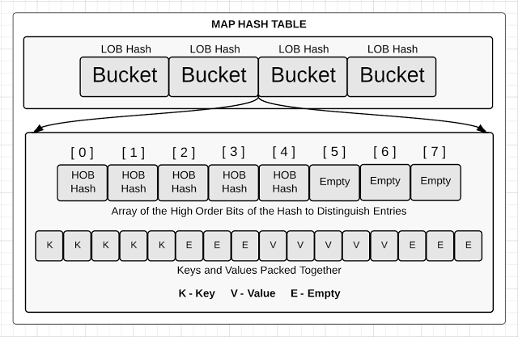

- [The Things I Find Myself Repeating About Go](https://www.youtube.com/watch?v=RZe8ojn7goo)
  - https://mp.weixin.qq.com/s/vmOMjLNcWFxzHJZOSh8DaA
- [Evolving Your API ](https://www.youtube.com/watch?v=9Mb0yy8u-Gs)
  - 原则一：未来防护（Future-Proofing）
    - 缩小暴露面
      • 非必要不导出；跨包复用用 internal
    - 预留扩展位──优先选「选项结构体」而不是「可变函数选项」
    - 锁定接口，禁止外包实现
  - 原则二：增加而非修改
  - 原则三：//go:fix inline（Go 1.26 新指令
  - 原则四：用构建标签做可撤销实验
    - go run -tags=mymodule_coolfeature
- [unsafe 包](https://mp.weixin.qq.com/s/wdFdPv3Bdnhy5pc8KL6w6w)
  - unsafe 实现原理
    - Sizeof(x ArbitrayType)方法主要作用是用返回类型x所占据的字节数，但并不包含x所指向的内容的大小，与C语言标准库中的Sizeof()方法功能一样，比如在32位机器上，一个指针返回大小就是4字节。
    - Offsetof(x ArbitraryType)方法主要作用是返回结构体成员在内存中的位置离结构体起始处(结构体的第一个字段的偏移量都是0)的字节数，即偏移量，我们在注释中看一看到其入参必须是一个结构体，其返回值是一个常量。
    - Alignof(x ArbitratyType)的主要作用是返回一个类型的对齐值，也可以叫做对齐系数或者对齐倍数。对齐值是一个和内存对齐有关的值，合理的内存对齐可以提高内存读写的性能。一般对齐值是2^n，最大不会超过8(受内存对齐影响).获取对齐值还可以使用反射包的函数，也就是说：unsafe.Alignof(x)等价于reflect.TypeOf(x).Align()。
  - 三种指针类型
    - ***T**：普通类型指针类型，用于传递对象地址，不能进行指针运算。
    - **unsafe.poniter**：通用指针类型，用于转换不同类型的指针，不能进行指针运算，不能读取内存存储的值(需转换到某一类型的普通指针)
    - **uintptr**：用于指针运算，GC不把uintptr当指针，uintptr无法持有对象。uintptr类型的目标会被回收。
      - uintptr并不是指针，它是一个大小并不明确的无符号整型。unsafe.Pointer类型可以与uinptr相互转换，由于uinptr类型保存了指针所指向地址的数值，因此可以通过该数值进行指针运算。
    - 三者关系就是：unsafe.Pointer是桥梁，可以让任意类型的指针实现相互转换，也可以将任意类型的指针转换为uintptr进行指针运算，也就说uintptr是用来与unsafe.Pointer打配合
  - Sizeof、Alignof、Offsetof三个函数的基本使用
    ```go
     // sizeof
     fmt.Println(unsafe.Sizeof(true))
     fmt.Println(unsafe.Sizeof(int8(0)))
     fmt.Println(unsafe.Sizeof(int16(10)))
     fmt.Println(unsafe.Sizeof(int(10)))
     fmt.Println(unsafe.Sizeof(int32(190)))
     fmt.Println(unsafe.Sizeof("asong"))
     fmt.Println(unsafe.Sizeof([]int{1,3,4}))
     // Offsetof
     user := User{Name: "Asong", Age: 23,Gender: true}
     userNamePointer := unsafe.Pointer(&user)
    
     nNamePointer := (*string)(unsafe.Pointer(userNamePointer))
     *nNamePointer = "Golang梦工厂"
    
     nAgePointer := (*uint32)(unsafe.Pointer(uintptr(userNamePointer) + unsafe.Offsetof(user.Age)))
     *nAgePointer = 25
    
     nGender := (*bool)(unsafe.Pointer(uintptr(userNamePointer)+unsafe.Offsetof(user.Gender)))
     *nGender = false
    
     fmt.Printf("u.Name: %s, u.Age: %d,  u.Gender: %v\n", user.Name, user.Age,user.Gender)
     // Alignof
     var f32 float32
     var s string
     var m map[string]string
     var p *int32
    
     fmt.Println(unsafe.Alignof(f32))
     fmt.Println(unsafe.Alignof(s))
     fmt.Println(unsafe.Alignof(m))
     fmt.Println(unsafe.Alignof(p))
    ```
  - 内存对齐
    - 对齐的作用和原因：CPU访问内存时，并不是逐个字节访问，而是以字长（word size)单位访问。比如32位的CPU，字长为4字节，那么CPU访问内存的单位也是4字节。这样设计可以减少CPU访问内存的次数，加大CPU访问内存的吞吐量。假设我们需要读取8个字节的数据，一次读取4个字节那么就只需读取2次就可以。内存对齐对实现变量的原子性操作也是有好处的，每次内存访问都是原子的，如果变量的大小不超过字长，那么内存对齐后，对该变量的访问就是原子的，这个特性在并发场景下至关重要。
- Splitting a go array or slice in a defined number of chunks.
  ```go
  func SplitSlice(array []int, numberOfChunks int) [][]int {
      if len(array) == 0 {
          return nil
      }
      if numberOfChunks <= 0 {
          return nil
      }
      if numberOfChunks == 1 {
          return [][]int{array}
      }
      result := make([][]int, numberOfChunks)
      // we have more splits than elements in the input array.
      if numberOfChunks > len(array) {
          for i := 0; i < len(array); i++ {
              result[i] = []int{array[i]}
          }
          return result
      }
  
      for i := 0; i < numberOfChunks; i++ {
          min := (i * len(array) / numberOfChunks)
          max := ((i + 1) * len(array)) / numberOfChunks
  
          result[i] = array[min:max]
      }
      return result
  }
  ```
- [如何保留 Go 程序崩溃现场](https://mp.weixin.qq.com/s/RktnMydDtOZFwEFLLYzlCA)
  - core dump
    - 可以使用`ulimit -c [size]`命令指定记录 core dump 文件的大小
    - GOTRACEBACK `GOTRACEBACK=system go run main.go`
      - none，不显示任何 goroutine 堆栈信息
      - single，默认级别，显示当前 goroutine 堆栈信息
      - all，显示所有 user （不包括 runtime）创建的 goroutine 堆栈信息
      - system，显示所有 user + runtime 创建的 goroutine 堆栈信息
      - crash，和 system 打印一致，但会生成 core dump 文件（Unix 系统上，崩溃会引发 SIGABRT 以触发core dump）
        如果想获取 core dump 文件，那么就应该把 GOTRACEBACK 的值设置为 crash 。当然，我们还可以通过 runtime/debug 包中的 SetTraceback 方法来设置堆栈打印级别
    - dlv core 命令来调试 core dump
      ```shell
      go get -u github.com/go-delve/delve/cmd/dlv
      ```
      - 通过 dlv 调试器来调试 core 文件，执行命令格式 dlv core 可执行文件名 core文件
      ```shell
      (dlv) goroutines
      (dlv) goroutine 1
      (dlv) bt
      (dlv) frame 5
      ```
- [Delve调试](https://mp.weixin.qq.com/s/Ed39t5I0k0ynfPch-ex7Ag)
  - 使用 dlv 进行调试，需要关闭编译器的内联、优化： `1.10及以后，编译时需指定-gcflags="all=-N -l"`
  - `dlv attach pid `
  - `dlv core <executable> <core> `
- [Make synchronous code asynchronous with context.Context and channels](https://pauldigian.hashnode.dev/advanced-go-make-synchronous-code-asynchronous-with-contextcontext-and-channels)
  - The main point of this pattern is to wait, at the same time, for either the result of the blocking function, or for a context cancellation. If the context is cancelled, the result from the blocking function is not needed anymore, and we can gracefully and quickly shut down the code path and free valuable resources. If the result comes in time, we can move on with the default execution.
    ```go
    ctx := request.Context()
    
    r := io.SomeReader() // not important which reader
    b := make([]byte, 1024)
    type readResult struct {
        readBytes int
        err             error
    }
    resultCh := make(chan readResult)
    
    go func() {
        if err := ctx.Err(); err != nil {
            return
        }
        n, err := r.Read(b)
        select {
            case <-ctx.Done():
                // do nothing
            case resultCh <- readResult{readBytes: n, err: err}:
                // do nothing
        }
    }()
    
    var result readResult
    select {
        case <-ctx.Done():
            // do something in here
            // likely return from the function with an error
            return ctx.Err()
        case result <- resultCh:
            // great we go our result in time and we can move on
            // from now on, `b` is populated, with the read bytes
    }
    // here we can use `result` as `readResult` and the buffer `b`
    ```
- [Golang GC Marker](https://mp.weixin.qq.com/s/n-4YxL_irIBqd2fxszmDeg)
  - 每个P都有  Mark worker
  - 三色标记
  - 混合写屏障： 在栈外设置 加入写屏障 + 删除写屏障
- [map](https://mp.weixin.qq.com/s/SGv5vuh9aU2mqViC4Kj0YQ)
  - 实现
    - hmap 由很多 bmap（bucket） 构成，每个 bmap 都保存了 8 个 key/value 对
      
    - 我们仔细看 mapextra 结构体里对 overflow 字段的注释. map 的 key 和 value 都不包含指针的话，在 GC 期间就可以避免对它的扫描。在 map 非常大（几百万个 key）的场景下，能提升不少性能
    - bmap 这个结构体里有一个 overflow 指针，它指向溢出的 bucket。因为它是一个指针，所以 GC 的时候肯定要扫描它，也就要扫描所有的 bmap。
    - The hash table for a Go map is structured as an array of buckets. The number of buckets is always equal to a power of 2. When a map operation is performed, such as (colors["Black"] = "#000000")
    - The low order bits (LOB) of the generated hash key is used to select a bucket.
    - If we look inside any bucket, we will find two data structures. First, there is an array with the top 8 high order bits (HOB) from the same hash key that was used to select the bucket. This array distinguishes each individual key/value pair stored in the respective bucket.
    - Second, there is an array of bytes that store the key/value pairs. The byte array packs all the keys and then all the values together for the respective bucket.
    - 
  - 当 map 的 key/value 都是非指针类型的话，扫描是可以避免的，直接标记整个 map 的颜色（三色标记法）就行了，不用去扫描每个 bmap 的 overflow 指针
  - 于是就利用 hmap 里的 extra 结构体的 overflow 指针来 “hold” 这些 overflow 的 bucket，并把 bmap 结构体的 overflow 指针类型变成一个 unitptr 类型（这些是在编译期干的）。于是整个 bmap 就完全没有指针了，也就不会在 GC 期间被扫描
  - 当我们知道上面这些原理后，就可以利用它来对一些场景进行性能优化：
    `map[string]int -> map[[12]byte]int`
    因为 string 底层有指针，所以当 string 作为 map 的 key 时，GC 阶段会扫描整个 map；而数组 [12]byte 是一个值类型，不会被 GC 扫描。
  - Go语言使用 map 时尽量不要在 big map 中保存指针
  - map 的 key 和 value 要不要在 GC 里扫描，和类型是有关的。数组类型是个值类型，string 底层也是指针。
  - 不过要注意，key/value 大于 128B 的时候，会退化成指针类型。 那么问题来了，什么是指针类型呢？**所有显式 *T 以及内部有 pointer 的对像都是指针类型。
- [channel](https://mp.weixin.qq.com/s?__biz=MzAxMTA4Njc0OQ==&mid=2651445085&idx=3&sn=2aecb5560dec2c0128ddc7cc3403a5a5&chksm=80bb09afb7cc80b97c989d35c925350121d6164c5dd65eb5bef59aebc811f95614d41c4314fc&scene=21#wechat_redirect)
  - 基本特性
    - 双向和单向；三种表现方式，分别是：声明双向通道：`chan T`、声明只允许发送的通道：`chan <- T`、声明只允许接收的通道：`<- chan T`
    - channel 中还分为 “无缓冲 channel” 和 “缓冲 channel”
      - 无缓冲的 channel（unbuffered channel），其缓冲区大小则默认为 0。在功能上其接受者会阻塞等待并阻塞应用程序，直至收到通信和接收到数据
      - 有缓存的 channel（buffered channel），其缓存区大小是根据所设置的值来调整。在功能上，若缓冲区未满则不会阻塞，会源源不断的进行传输。当缓冲区满了后，发送者就会阻塞并等待。而当缓冲区为空时，接受者就会阻塞并等待，直至有新的数据
  - 基本原理
    - channel 是一个有锁的环形队列
      
      - dataqsiz：循环队列的长度。
      - buf：指向长度为 dataqsiz 的底层数组，仅有当 channel 为缓冲型的才有意义
      - sendx：已发送元素在循环队列中的索引位置。
      - recvx：已接收元素在循环队列中的索引位置。
      - recvq：接受者的 sudog 等待队列（缓冲区不足时阻塞等待的 goroutine）。
      - sendq：发送者的 sudog 等待队列。
      - sudog 是 Go 语言中用于存放协程状态为阻塞的 goroutine 的双向链表抽象，你可以直接理解为一个正在等待的 goroutine 就可以了
    - 发送
      - 使用 ch <- i 表达式向 Channel 发送数据时遇到的几种情况：
        - 如果当前 Channel 的 recvq 上存在已经被阻塞的 Goroutine，那么会直接将数据发送给当前的 Goroutine 并将其设置成下一个运行的协程； 
        - 如果 Channel 存在缓冲区并且其中还有空闲的容量，我们就会直接将数据直接存储到当前缓冲区 sendx 所在的位置上； 
        - 如果都不满足上面的两种情况，就会创建一个 sudog 结构并加入 Channel 的 sendq 队列，同时当前的 Goroutine 就会陷入阻塞等待其他的协程向 Channel 中发送数据以被唤醒；
      - 发送数据的过程中包含几个会触发 Goroutine 调度的时机，首先是发送数据时发现 Channel 上存在等待接收数据的 Goroutine，这是会立刻设置处理器的 runnext 属性，但是并不会立刻触发调度，第二个时机是发送数据时并没有找到接收方并且缓冲区已经满了，这时就会将自己加入 Channel 的 sendq 队列并立刻调用 goparkunlock 触发 Goroutine 的调度让出处理器的使用权。
    - 接收
      - 从 Channel 中接收数据时的几种情况：
        - 如果 Channel 是空的，那么就会直接调用 gopark 挂起当前的 Goroutine；
        - 如果 Channel 已经关闭并且缓冲区没有任何数据，chanrecv 函数就会直接返回；
        - 如果 Channel 上的 sendq 队列中存在挂起的 Goroutine，就会将recvx 索引所在的数据拷贝到接收变量所在的内存空间上并将 sendq 队列中 Goroutine 的数据拷贝到缓冲区中；
        - 如果 Channel 的缓冲区中包含数据就会直接从 recvx 所在的索引上进行读取；
        - 在默认情况下会直接挂起当前的 Goroutine，将 sudog 结构加入 recvq 队列并等待调度器的唤醒；
- [如何高效的进行字符串拼接](https://mp.weixin.qq.com/s/TDU_lnxbQmlnGosN4Ss7Tw)
  - string类型本质上就是一个byte类型的数组
    ```go
    //go:nosplit
    func gostringnocopy(str *byte) string {
     ss := stringStruct{str: unsafe.Pointer(str), len: findnull(str)}
     s := *(*string)(unsafe.Pointer(&ss))
     return s
    }
    ```
  - 字符串拼接的6种方式
    - 原生拼接方式"+"
    - 字符串格式化函数fmt.Sprintf
    - Strings.builder - 提供的String方法就是将[]]byte转换为string类型，这里为了避免内存拷贝的问题
    - bytes.Buffer 
    - strings.join - 基于strings.builder来实现的, join方法内调用了b.Grow(n)方法，这个是进行初步的容量分配
    - 切片append 
  - benchmark 比较
    - 当进行少量字符串拼接时，直接使用+操作符进行拼接字符串，效率还是挺高的
    - 当要拼接的字符串数量上来时，+操作符的性能就比较低了；函数fmt.Sprintf还是不适合进行字符串拼接，无论拼接字符串数量多少，性能损耗都很大
    - strings.Builder无论是少量字符串的拼接还是大量的字符串拼接，性能一直都能稳定
    - strings.join方法的benchmark就可以发现，因为使用了grow方法，提前分配好内存，在字符串拼接的过程中，不需要进行字符串的拷贝，也不需要分配新的内存
    - bytes.Buffer方法性能是低于strings.builder的，bytes.Buffer 转化为字符串时重新申请了一块空间，存放生成的字符串变量
    - strings.join ≈ strings.builder > bytes.buffer > []byte转换string > "+" > fmt.sprintf
- [Go Ballast 让内存控制更加丝滑](https://mp.weixin.qq.com/s/SlQkv74hXZzZEdUAhTobuw)
  - GO 的 GC 是标记-清除方式，当 GC 会触发时全量遍历变量进行标记，当标记结束后执行清除，把标记为白色的对象执行垃圾回收。值得注意的是，这里的回收仅仅是标记内存可以返回给操作系统，并不是立即回收，这就是你看到 Go 应用 RSS 一直居高不下的原因。在整个垃圾回收过程中会暂停整个 Go 程序（STW），Go 垃圾回收的耗时还是主要取决于标记花费的时间的长短，清除过程是非常快的。
  - Go GC 优化的手段你知道的有哪些？
    - 设置 GOGC
      - 设置 GOGC 的弊端
      - GOGC 设置比率的方式不精确 - 我们很难精确的控制我们想要的触发的垃圾回收的阈值
      - GOGC 设置的非常小，会频繁触发 GC 导致太多无效的 CPU 浪费
      - 对某些程序本身占用内存就低，容易触发 GC - 对 API 接口耗时比较敏感的业务，如果  GOGC 置默认值的时候，也可能也会遇到接口的周期性的耗时波动
      - GOGC 设置很大，有的时候又容易触发 OOM
    - 设置 debug.SetGCPercent()
    - 这两种方式的原理和效果都是一样的，GOGC 默认值是 100，也就是下次 GC 触发的 heap 的大小是这次 GC 之后的 heap 的一倍
  - [GO 内存 ballast](https://blog.twitch.tv/en/2019/04/10/go-memory-ballast-how-i-learnt-to-stop-worrying-and-love-the-heap/) [issue 23044](https://github.com/golang/go/issues/23044)
    - 什么是 Go ballast，其实很简单就是初始化一个生命周期贯穿整个 Go 应用生命周期的超大 slice。
      ```go
      func main() {
        ballast := make([]byte, 10*1024*1024*1024) // 10G
        // do something
        runtime.KeepAlive(ballast)
      }
      ```
      上面的代码就初始化了一个 ballast，利用 runtime.KeepAlive 来保证 ballast 不会被 GC 给回收掉。
      利用这个特性，就能保证 GC 在 10G 的一倍时才能被触发，这样就能够比较精准控制 GO GC 的触发时机
    - 这里初始化一个 10G 的数组，不就占用了 10 G 的物理内存呢？ 答案其实是不会的。
       ```go
       func main() {
           ballast := make([]byte, 10*1024*1024*1024)
           <-time.After(time.Duration(math.MaxInt64))
           runtime.KeepAlive(ballast)
       }
       $ ps -eo pmem,comm,pid,maj_flt,min_flt,rss,vsz --sort -rss | numfmt --header --to=iec --field 5 | numfmt --header --from-unit=1024 --to=iec --field 6 | column -t | egrep "[t]est|[P]I"
       ```
    - 当怀疑我们的接口的耗时是由于 GC 的频繁触发引起的，我们需要怎么确定呢？
      - 首先你会想到周期性的抓取 pprof 的来分析，这种方案其实也可以，但是太麻烦了。
      - 其实可以根据 GC 的触发时间绘制这个曲线图，GC 的触发时间可以利用 runtime.Memstats 的 LastGC 来获取。
- [runtime.KeepAlive 有什么用](https://mp.weixin.qq.com/s/1KlMbvnflFwQS2e-SFG-IA)
  - 有些同学喜欢利用 runtime.SetFinalizer 模拟析构函数，当变量被回收时，执行一些回收操作，加速一些资源的释放。在做性能优化的时候这样做确实有一定的效果，不过这样做是有一定的风险的。
    ```go
    type File struct { d int }
    func main() {
        p := openFile("t.txt")
        content := readFile(p.d)
    
        println("Here is the content: "+content)
    }
    
    func openFile(path string) *File {
        d, err := syscall.Open(path, syscall.O_RDONLY, 0)
        if err != nil {
          panic(err)
        }
    
        p := &File{d}
        runtime.SetFinalizer(p, func(p *File) {
          syscall.Close(p.d)
        })
        return p
    }
    
    func readFile(descriptor int) string {
        doSomeAllocation()
    
        var buf [1000]byte
        _, err := syscall.Read(descriptor, buf[:])
        if err != nil {
          panic(err)
        }
        return string(buf[:])
    }
    
    func doSomeAllocation() {
        var a *int
    
        // memory increase to force the GC
        for i:= 0; i < 10000000; i++ {
          i := 1
          a = &i
        }
        _ = a
    }
    ```
    - doSomeAllocation 会强制执行 GC，当我们执行这段代码时会出现下面的错误。
    - 因为 syscall.Open 产生的文件描述符比较特殊，是个 int 类型，当以值拷贝的方式在函数间传递时，并不会让 File.d 产生引用关系，于是 GC 发生时就会调用 runtime.SetFinalizer(p, func(p *File) 导致文件描述符被 close 掉
  - 什么是 runtime.KeepAlive
    - 我们如果才能让文件描述符不被 gc 给释放掉呢？其实很简单，只需要调用 runtime.KeepAlive 即可
      ```go
      func main() {
          p := openFile("t.txt")
          content := readFile(p.d)
          runtime.KeepAlive(p)
      }
      ```
      runtime.KeepAlive 能阻止 runtime.SetFinalizer 延迟发生，保证我们的变量不被 GC 所回收
- [Goroutine 泄漏检查器](https://mp.weixin.qq.com/s/eSa6B1Z1cnpUJ1Vn3bxhUA)
  - 具有监控存活的 goroutine 数量功能的 APM (Application Performance Monitoring) 应用程序性能监控可以轻松查出 goroutine 泄漏。例如 NewRelic APM 中 goroutine 的监控
  - [goroutine 泄漏检测器](https://github.com/uber-go/goleak)
    ```go
    func leak() error {
     go func() {
      time.Sleep(time.Minute)
     }()
    
     return nil
    }
    
    func TestLeakFunction(t *testing.T) {
      defer goleak.VerifyNone(t)
    
      if err := leak(); err != nil {
        t.Fatal("error not expected")
      }
    }
    ```
    从报错信息中我们可以提取出两个有用的信息：
    - 报错信息顶部为泄漏的 goroutine 的堆栈信息，以及 goroutine 的状态，可以帮我们快速调试并了解泄漏的 goroutine
    - 之后为 goroutineID，在使用 trace 可视化的时候很有用，以下是通过 go test -trace trace.out 生成的用例截图：
  - 运行原理
    - goleak 检测了所有的 goroutine 而不是只检测泄漏的 goroutine
    - goroutine 的堆栈信息由 golang 标准库中的 runtime.Stack，它可以被任何人取到。不过，[Goroutine 的 ID 是拿不到的](https://groups.google.com/forum/#!topic/golang-nuts/0HGyCOrhuuI)
    - 之后，goleak 解析所有的 goroutine 出并通过以下规则过滤 go 标准库中产生的 goroutine
      - 由 go test 创建来运行测试逻辑的 goroutine。
      - 由 runtime 创建的 goroutine，例如监听信号接收的 goroutine。想要了解更多相关信息，请参阅Go: [gsignal, Master of goroutine](https://medium.com/a-journey-with-go/go-gsignal-master-of-signals-329f7ff39391)
      - 当前运行的 goroutine
    - 经过此次过滤后，如果没有剩余的 goroutine，则表示没有发生泄漏。但是 goleak 还是存在一下缺陷：
      - 三方库或者运行在后台中，遗漏的 goroutine 将会造成虚假的结果(无 goroutine 泄漏)
      - 如果在其他未使用 goleak 的测试代码中使用了 goroutine，那么泄漏结果也是错误的。如果这个 goroutine 一直运行到下次使用 goleak 的代码， 则结果也会被这个 goroutine 影响，发生错误。
- [Recover](https://mp.weixin.qq.com/s/y6bLqjevvqlP3AEjTaztYw)
  - 多帧情况
    ```go
    func level1() {
        defer fmt.Println("defer func 3")
        defer func() {
            if err := recover(); err != nil {
                fmt.Println("recovering...")
            }
        }()
        defer fmt.Println("defer 2")
    
        level2()
    }
    
    func level2() {
        defer fmt.Println("defer func 4")
        panic("level2")
    }
    
    func main() 
        level1()
    ```
    - 由于一个函数 recover 了 panic，Go 需要一种跟踪，并恢复这个程序的方法。为了达到这个目的，每一个 Goroutine 嵌入了一个特殊的属性，指向一个代表该 panic 的对象
    - 当 panic 发生的时候，该对象会在运行 defer 函数前被创建。然后，recover 这个 panic 的函数仅仅返回这个对象的信息，同时将这个 panic 标记为已恢复（recovered
    - 一旦 panic 被认为已经恢复，Go 需要恢复当前的工作。但是，由于运行时处于 defer 函数的帧中，它不知道恢复到哪里。出于这个原因，当 panic 标记已恢复的时候，Go 保存当前的程序计数器和当前帧的堆栈指针，以便 panic 发生后恢复该函数
    - 我们也可以使用 objdump 查看 程序计数器的指向e.g. `objdump -D my-binary | grep 105acef`
    - 该指令指向函数调用 runtime.deferreturn，这个指令被编译器插入到每个函数的末尾，而它运行 defer 函数。在前面的例子中，这些 defer 函数中的大多数已经运行了——直到恢复，因此，只有剩下的那些会在调用者返回前运行
  - goexit
    - 函数 runtime.Goexit 使用完全相同的工作流程。runtime.Goexit 实际上创造了一个 panic 对象，且有着一个特殊标记来让它与真正的 panic 区别开来。这个标记让运行时可以跳过恢复以及适当的退出，而不是直接停止程序的运行
  - [defer 的“救赎”](https://mp.weixin.qq.com/s/ugl3Op6GvRO0mqDMFQZGVg)
    - 语言层面的价值
      - 就近注册：资源获取与释放写在一起，降低心智负担。
      - 作用域=函数：任意 return/​panic 前必执行，重构友好。
      - 运行时可动态出现：可放在 if / for 中做“条件化清理”，这是 RAII 与 try-finally 难以覆盖的场景
    - Go≤1.12：堆 + runtime ⇒ ~44 ns  涉及堆分配，GC 敏感，runtime 开销大
    -  Go 1.13：栈 + runtime ⇒ ~32 ns  避免堆分配，但仍需 runtime 交互
    -  Go 1.14+：Open-coded ⇒ ~3 ns  栈上存储 + 编译器生成代码，正常路径无 runtime 调用
- [怎么让goroutine跑一半就退出](https://mp.weixin.qq.com/s/KBDXzcPLXFovnuY6WSIdoA)
  - Ans: 插入一个 `runtime.Goexit()`， 协程就会直接结束。并且结束前还能执行到defer 函数
  - runtime.Goexit()是什么
    - 从代码上看，runtime.Goexit()会先执行一下defer里的方法，这里就解释了开头的代码里为什么在defer里的打印2能正常输出
    - 然后代码再执行goexit1。本质就是对goexit0的简单封装
    - goexit0 做的事情就是将当前的协程G置为_Gdead状态，然后把它从M上摘下来，尝试放回到P的本地队列中。然后重新调度一波，获取另一个能跑的G，拿出来跑。
    - 总结一下，只要执行 goexit 这个函数，当前协程就会退出，同时还能调度下一个可执行的协程出来跑
  - goexit的用途
    - 每个堆栈底部都是这个方法
    - main函数也是个协程，栈底也是goexit
      - main函数也是由newproc创建的，只要通过newproc创建的goroutine，栈底就会有一个goexit
  - os.Exit() 指的是整个进程退出；而runtime.Goexit()指的是协程退出。
- [gowatch监听文件变动](https://mp.weixin.qq.com/s/f3q5ryWvLonOKMOZEJnXNQ)
  - 在linux内核中，有一种用于通知用户空间程序文件系统变化的机制—Inotify
  - Golang的标准库syscall实现了该机制 [ref](github.com/silenceper/gowatch)
  
- [用 kqueue 实现一个简单的 TCP Server](https://dev.to/frosnerd/writing-a-simple-tcp-server-using-kqueue-cah)
- [Golang 程序启动过程](https://juejin.cn/post/7035633561805783070)
- [Go: gsignal, Master of Signals](https://medium.com/a-journey-with-go/go-gsignal-master-of-signals-329f7ff39391)
  - Each `os.Signal` channel listens to their own set of events. Here is a diagram with the subscription workflow of the previous example:
  
  - Go also gives the ability for a channel to stop being notified — function `Stop(os.Signal) `— or to ignore signals — function `Ignore(...os.Signal)`
  - gsignal
    - During the initialization phase, the signal spawns a goroutine that runs in a loop and act as a consumer to process the signals.
    - Then, when a signal reaches the program, the signal handler delegates it to a special goroutine called gsignal
    - Each thread (represented by M) has an internal gsignal goroutine to handle the signals. 
    - gsignal analyzes the signal to check if it processable, and wakes up the sleeping goroutine along with sending the signal to the queue
- [Go 服务中 HTTP 请求的生命周期](https://mp.weixin.qq.com/s/8j-hzmxs9NlaPDptldHJDg)
  - ListenAndServe 监听给定地址的 TCP 端口，之后循环接受新的连接。对于每一个新连接，它都会调度一个 goroutine 来处理这个连接（稍后详细说明）。处理连接涉及一个这样的循环：
    - 从连接中解析 HTTP 请求；产生 http.Request
    - 将这个 http.Request 传递给用户定义的 handler
  - http.ServeMux 是一个实现了 http.Handler 接口的类
    - ServeMux 维护了一个（根据长度）排序的 {pattern, handler} 的切片。
    - Handle 或 HandleFunc 向该切片增加新的 handler。
    - ServeHTTP：
      - （通过查找这个排序好的 handler 对的切片）为请求的 path 找到对应的 handler
      - 调用 handler 的 ServeHTTP 方法
    - mux 可以被看做是一个转发 handler；这种模式在 HTTP 服务开发中极为常见，这就是中间件。
  - 中间件只是另一个 HTTP handler
    - 它包裹了一个其他的 handler。中间件 handler 通过调用 ListenAndServe 被注册进来
    - 当调用的时候，它可以执行任意的预处理，调用自身包裹的 handler 然后可以执行任意的后置处理
    - 中间件最大的优点是可以组合。被中间件所包裹“用户 handler” 也可以是另一个中间件，依次类推。这是一个互相包裹的 http.Handler 链
      ```go
      func politeGreeting(w http.ResponseWriter, req *http.Request) {
       fmt.Fprintf(w, "Welcome! Thanks for visiting!\n")
      }
      
      func loggingMiddleware(next http.Handler) http.Handler {
       return http.HandlerFunc(func(w http.ResponseWriter, req *http.Request) {
        start := time.Now()
        next.ServeHTTP(w, req)
        log.Printf("%s %s %s", req.Method, req.RequestURI, time.Since(start))
       })
      }
      
      func main() {
       lm := loggingMiddleware(http.HandlerFunc(politeGreeting))
       log.Fatal(http.ListenAndServe(":8090", lm))
      }
      ```
      loggingMiddleware 利用 http.HandlerFunc 和闭包使代码更加简洁，同时保留了相同的功能。更重要的是这个例子展示了中间件事实上的标准签名：一个函数传入一个 http.Handler，有时还有其他状态，之后返回一个不同的 http.Handler。返回的 handler 现在应该替换掉传入中间件的那个 handler，之后会“神奇地”执行它原有的功能，并且与中间件的功能包装在一起
  - 并发和 panic 处理
    - 每个连接由 http.Server.Serve 在一个新的 goroutine 中处理。
    - net/http 包（在 conn.serve 方法中）内置对每个服务 goroutine 有 recovery
- [Go error 处理最佳实践](https://mp.weixin.qq.com/s/XojOIIZfKm_wXul9eSU1tQ)
  - https://github.com/pkg/errors
    - Wrap 封装底层 error, 增加更多消息，提供调用栈信息，这是原生 error 缺少的
    - WithMessage 封装底层 error, 增加更多消息，但不提供调用栈信息
    - Cause 返回最底层的 error, 剥去层层的 wrap
  - errors.Is 会递归的 Unwrap err
    - Is 是做的指针地址判断，如果错误 Error() 内容一样，但是根 error 是不同实例，那么 Is 判断也是 false, 这点就很扯
  - 官方库如何生成一个 wrapper error
    - fmt.Errorf 格式化时使用 %w
  - golang.org/x/sync/errgroup
    - 适用如下场景：并发场景下，如果一个 goroutine 有错误，那么就要提前返回，并取消其它并行的请求
  - 线上实践注意的几个问题
    - 所有异步的 goroutine 都要用 recover 去兜底处理
    - 数据传输和退出控制，需要用单独的 channel 不能混, 我们一般用 context 取消异步 goroutine, 而不是直接 close channels
    - error 级联使用问题。 如果复用 err 变量的情况下， Call2 返回的 error 是自定义类型，此时 err 类型是不一样的，导致经典的 error is not nil, but value is nil
      ```go
      type myError struct {
       string
      }
      
      func (i *myError) Error() string {
       return i.string
      }
      
      func Call1() error {
       return nil
      }
      
      func Call2() *myError {
       return nil
      }
      
      func main() {
       err := Call1()
       if err != nil {
        fmt.Printf("call1 is not nil: %v\n", err)
       }
      
       err = Call2()
       if err != nil {
        fmt.Printf("call2 err is not nil: %v\n", err)
       }
      }
      ```
    - 并发问题
      ```go
      var FIRST error = errors.New("Test error")
      var SECOND error = nil
      
      func main() {
          var err error
          go func() {
              i := 1
              for {
                  i = 1 - i
                  if i == 0 {
                      err = FIRST
                  } else {
                      err = SECOND
                  }
                  time.Sleep(10)
              }
          }()
          for {
              if err != nil {
                  fmt.Println(err.Error())
              }
              time.Sleep(10)
          }
      ```
      go 内置类型除了 channel 大部分都是非线程安全的，error 也不例外
    - 官方库无法 wrap 调用栈，所以 fmt.Errorf %w 不如 pkg/errors 库实用，但是errors.Wrap 最好保证只调用一次，否则全是重复的调用栈
    - 如果 err 为 nil 的时候，也会返回 nil. 所以 Wrap 前最好做下判断
- 切片拷贝
  - `=、[:]`是浅拷贝，`copy()`拷贝是深拷贝
- [Go语言也有隐式转型](https://mp.weixin.qq.com/s/NCM-RrzxYiAUlAAYshdAaQ)
  - Question
    ```go
    type MyInt int
    type MyMap map[string]int
    
    func main() {
        var x MyInt
        var y int 
        x = y     // 会报错: cannot use y (type int) as type MyInt in assignment
        _ = x 
    
        var m1 MyMap
        var m2 map[string]int
        m1 = m2 // 不会报错
        m2 = m1 // 不会报错
    }
    ```
  - Deep dive
    - `type T1 int` 使用上述类型声明语句定义的类型T1、T2被称为defined type (named type)
      - 所有数值类型都是defined type；(这里面就包含int)
      - 字符串类型string是defined type；
      - 布尔类型bool是defined type。
      - map、数组、切片、结构体、channel等原生复合类型(composite type)都不是defined type
    - Assignability
      - x's type V and T have identical underlying types and at least one of V or T is not a defined type.
      - 它和Go的[无类型常量隐式转型]()类似
        ```go
        type MyInt int
        const a = 1234
        var n MyInt = a
        ```
- [Zero down restart and deploy](https://bunrouter.uptrace.dev/guide/go-zero-downtime-restarts.html#systemd-socket)
- [新 IP 包的设计思路](https://mp.weixin.qq.com/s/VxJvLRTt3zoGRTzAhZTUsQ) [Source](https://tailscale.com/blog/netaddr-new-ip-type-for-go/)
  - 标准库 net.IP 的问题
    - 可变的。net.IP 的底层类型是 []byte，它的定义是：type IP []byte，这意味着你可以随意修改它。不可变数据结构更安全、更简单。
    - 不可比较的。因为 Go 中 slice 类型是不可比较的，也就是说 net.IP 不支持 ==，也不能作为 map 的 key。
    - 有两个 IP 地址类型，net.IP 表示基本的 IPv4 或 IPv6 地址，而 net.IPAddr 表示支持 zone scopes 的 IPv6。因为有两个类型，使用时就存在选择问题，到底使用哪个。标准库存在两个这样的方法：Resolver.LookupIP vs Resolver.LookupIPAddr。（关于什么是 IPv6 zone scopes 见维基百科：https://en.wikipedia.org/wiki/IPv6_address#Scoped_literal_IPv6_addresses_(with_zone_index 。）
    - 太大。在 Go 中，64 位机器上，slice 类型占 24 个字节，这只是 slice header。因此，net.IP 的大小实际包含两部分：24 字节的 slice header 和 4 或 6 字节的 IP 地址。而 net.IPAddr 更有额外的字符串类型 Zone 字段，占用空间更多。
    - 不是 allocates free 的，会增加 GC 的工作。当你调用 net.ParseIP 或接收一个 UDP 包时，它为了记录 IP 地址会分配底层数组的内存，然后指针放入 net.IP 的 slice header 中。
    - 当解析一个字符串形式的 IP 地址时，net.IP 无法区分 IPv4 映射的 IPv6 地址[2]和 IPv4 地址。因为 net.IP 不会记录原始的地址族（address family）。见 issue 37921
- [这些 //go: 指令](https://mp.weixin.qq.com/s/KK_rWHqTTy4zzqG96RKbsQ)
  - go:linkname
    ```go
    //go:linkname localname importpath.name
    ```
    该指令指示编译器使用 importpath.name 作为源代码中声明为 localname 的变量或函数的目标文件符号名称。但是由于这个伪指令，可以破坏类型系统和包模块化，只有引用了 unsafe 包才可以使用。
  - go:noescape - 该指令指定下一个有声明但没有主体（意味着实现有可能不是 Go）的函数，不允许编译器对其做逃逸分析。
  - go:nosplit - 该指令指定文件中声明的下一个函数不得包含堆栈溢出检查。
  - go:nowritebarrierrec - 该指令表示编译器遇到写屏障时就会产生一个错误，并且允许递归。也就是这个函数调用的其他函数如果有写屏障也会报错。
  - go:yeswritebarrierrec
  - go:noinline
  - go:norace - 该指令表示禁止进行竞态检测。
  - go:notinheap - 该指令常用于类型声明，它表示这个类型不允许从 GC 堆上进行申请内存
- [Go 语言类型可比性](https://mp.weixin.qq.com/s/_AYOAtNhPGZy4ttfsDDw8w)
  - 那哪些类型是可比较的呢
    - Boolean（布尔值）、Integer（整型）、Floating-point（浮点数）、Complex（复数）、String（字符）这些类型是毫无疑问可以比较的。
    - Poniter (指针) 可以比较：如果两个指针指向同一个变量，或者两个指针类型相同且值都为 nil，则它们相等。注意，指向不同的零大小变量的指针可能相等，也可能不相等
    - Channel （通道）具有可比性
    - Interface （接口值）具有可比性
  - 哪些类型是不可比较的
    - slice、map、function 这些是不可以比较的，但是也有特殊情况，那就是当他们值是 nil 时，可以与 nil 进行比较。
  - 如果我们的变量中包含不可比较类型，或者 interface 类型（它的动态类型可能存在不可比较的情况），那么我们直接运用比较运算符 == ，会引发程序错误。此时应该选用 reflect.DeepEqual 函数（当然也有特殊情况，例如 []byte，可以通过 bytes. Equal 函数进行比较）。
    ```go
    type Data struct {
     UUID    string
     Content interface{}
    }
    var x, y Data
    x = Data{
    UUID:    "856f5555806443e98b7ed04c5a9d6a9a",
    Content: 1,
    }
    bytes, _ := json.Marshal(x)
    _ = json.Unmarshal(bytes, &y)
    fmt.Println(x)  // {856f5555806443e98b7ed04c5a9d6a9a 1}
    fmt.Println(y)  // {856f5555806443e98b7ed04c5a9d6a9a 1}
    fmt.Println(reflect.DeepEqual(x, y)) // false ???
    ```
    原来此 1 非彼 1，Content 字段的数据类型由 int 转换为了 float64 。而在接口中，其动态类型不一致时，它的比较是不相等的。
- [Go 为什么不支持可重入锁](https://mp.weixin.qq.com/s/pQBsAxnaBXkk7G1cdUgsww)
  - 可重入锁
    - 在加锁上：如果是可重入互斥锁，当前尝试加锁的线程如果就是持有该锁的线程时，加锁操作就会成功。
    - 在解锁上：可重入互斥锁一般都会记录被加锁的次数，只有执行相同次数的解锁操作才会真正解锁。
    - Java
      - Java 的 ReentrantReadWriteLock 支持锁降级，但不能升级，即获取了写锁的线程，可以继续获取读锁，但获取读锁的线程无法再获取写锁；
      - ReentrantReadWriteLock 实现了公平和非公平两种锁，公平锁的情况下，获取读锁、写锁前需要看同步队列中是否先线程在我之前排队；非公平锁的情况下：写锁可以直接抢占锁，但是读锁获取有一个让步条件，如果当前同步队列 head.next 是一个写锁在等待，并且自己不是重入的，就要让步等待。
  - Go 显然是不支持可重入互斥锁的
    - Russ Cox 于 2010 年在《Experimenting with GO》就给出了答复，认为递归（又称：重入）互斥是个坏主意，这个设计并不好。
    - Go 的锁是不知道协程或者线程信息的，只知道代码调用先后顺序，即读写锁无法升级或降级。[issue](https://github.com/golang/go/issues/30657)
  - [读锁必然是可重入的?](https://mp.weixin.qq.com/s/T5FQ7z02L60g3ss3YR7axA)
  - RWLock
    - 如果一个协程持有读锁，另一个协程可能会调用 Lock 加写锁，那么再也没有一个协程可以获得读锁，直到前一个读锁释放，这是为了禁止读锁递归。也确保了锁最终可用，一个阻塞的写锁调用会将新的读锁排除在外。
- [用Go实现可重入锁](https://mp.weixin.qq.com/s/LFkPlsLVj24OWZKvanUNVA)
  - 实现一个可重入锁需要这两点：
    - 记住持有锁的线程
    - 统计重入的次数
   ```go
   type ReentrantLock struct {
    lock *sync.Mutex
    cond *sync.Cond
    recursion int32  //记录当前goroutine的重入次数
    host     int64   // 记录当前持有锁的goroutine id
   }
   ```
- [系统中钱的精度](https://mp.weixin.qq.com/s/7Jd5m1pPfivi727R6TTIpA)
  - 精度的问题
   
  - 用浮点数计算 - 判断两个浮点数是否相等往往采用a - b <= 0.00001的形式
  - 用整型计算
    - 事先定好小数保留8位精度，则0.1和0.2分别表示成整数为10000000和20000000
    - 但，表示2.3在计算机中实际的存储值，因此使用float2Int函数进行转换时的结果是229999999而不是230000000
      - 要解决这个问题也很简单，只需引入github.com/shopspring/decimal即可
        ````go
        const prec = 100000000
        var decimalPrec = decimal.NewFromFloat(prec)
        func float2Int(f float64) int64 {
           return decimal.NewFromFloat(f).Mul(decimalPrec).IntPart()
        }
        ```
    - 整型表示浮点数的范围 
      - 以int64为例，数值范围为-9223372036854775808～9223372036854775807，如果我们对小数部分精度保留8位，则剩余表示整数部分依旧有11位，即只表示钱的话仍旧可以存储上百亿的金额
    - 整型表示浮点数的除法 
      - 在Go中没有隐式的整型转浮点的说法，即整型和整型相除得到的结果依旧是整型。我们以整型表示浮点数时，就尤其需要注意整型的除法运算会丢失所有的小数部分，所以一定要先转换为浮点数再进行相除。
  - 浮点和整型的最大精度
    - int64的范围为-9223372036854775808～9223372036854775807，则用整型表示浮点型时，整数部分和小数部分的有效十进制位最多为19位。
    - uint64的范围为0~18446744073709551615，则用整型表示浮点型时，整数部分和小数部分的有效十进制位最多为20位，因为系统中表示金额时一般不会存储负数，所以和int64相比，更加推荐使用uint64
    - float64根据IEEE754标准，并参考维基百科知其整数部分和小数部分的有效十进制位为15-17位。推荐使用整型表示浮点数
  - 除法和减法的结合
    ```go
    // 1元钱分给3个人，每个人分多少？
    var m float64 = float64(1) / 3
    fmt.Println(m, m+m+m)
    ```
    计算结果知，每人分得0.3333333333333333元，而将每人分得的钱再次汇总时又变成了1元，那么 这0.0000000000000001元是从石头里面蹦出来的嘛
    ```go
    // 1元钱分给3个人，每个人分多少？
    var m float64 = float64(1) / 3
    fmt.Println(m, m+m+m)
    // 最后一人分得的钱使用减法
    m3 := 1 - m - m
    fmt.Println(m3, m+m+m3)
    ```
- [Shallow copy and Deep copy in Go](https://echorand.me/posts/go-values-references-etc/)
  - Basic data types
    - When it comes to the basic types, numbers and strings, it is always deep copy.
    - There is no shallow copy when it comes to these types. Another way of saying that is that, when we want a shallow copy, use memory addresses for basic data types
  - Slice of integers and strings
    - When it comes to a slice, we are always working with shallow copies.
    - If you want to create a deep copy, you will find the copy() function useful. 
  - Arrays of strings and integers
    - When it comes to arrays, we are always working with deep copies. 
    - if we want to pass an array which we want to modify in another function and want the updated result to be reflected in the original array, we should pass the array by reference
  - Elements in Maps and Struct types
    - A map is by default call by reference and struct is by default call by value. 
    - if you want call by value behavior:
      - map: Create a deep copy by creating a new map and copying the key value pairs. Be careful of also ensuring that you deep copy the elements themselves
      - struct: Create a deep copy by creating a new struct and copying the elements. Be careful of also ensuring that you deep copy the elements themselves
- [并发编程指南](https://mp.weixin.qq.com/s/V0krCjWrndzz71cVOPBxdg)
  - channel 特性
  
    ```go
    v, ok := <-a  // 检查是否成功关闭(ok = false：已关闭)
    ```
    - 等待一个事件，也可以通过 close 一个 channel 就足够了
    - 利用 channel 阻塞的特性和带缓冲的 channel 来实现控制并发数量
    - singlelFlight - 一般系统重要的查询增加了缓存后，如果遇到缓存击穿，那么可以通过任务计划，加索等方式去解决这个问题，singleflight 这个库也可以很不错的应对这种问题
  - 有锁的地方就去用 channel 优化 [demo](https://github.com/LinkinStars/simple-chatroom)
- [Go的内存布局和分配原理](https://mp.weixin.qq.com/s/gCDxWzslfPXayJ_RFQVb7g)
  
  - mheap
    - Go 在程序启动时，首先会向操作系统申请一大块内存，并交由mheap结构全局管理
    - mheap 会将这一大块内存，切分成不同规格的小内存块，我们称之为 mspan，根据规格大小不同，mspan 大概有 70类左右，划分得可谓是非常的精细，足以满足各种对象内存的分配。
  - mcentral
    - 启动一个 Go 程序，会初始化很多的 mcentral ，每个 mcentral 只负责管理一种特定规格的 mspan
    - 相当于 mcentral 实现了在 mheap 的基础上对 mspan 的精细化管理
    - 但是 mcentral 在 Go 程序中是全局可见的，因此如果每次协程来 mcentral 申请内存的时候，都需要加锁
  - mcache
    - 每个P都会绑定一个叫 mcache 的本地缓存
    - 当前运行的goroutine会从mcache中查找可用的mspan。从本地mcache里分配内存时不需要加锁，这种分配策略效率更高
  - 对于那些超过 64KB 的内存申请，会直接从堆上(mheap)上分配对应的数量的内存页（每页大小是 8KB）给程序。
- [逃逸分析](https://slides.com/jalex-chang/go-esc#/9)
  - 根据变量的使用范围
    - 通过 `go build -gcflags '-m -l' demo.go` 来查看逃逸分析的结果，其中 -m 是打印逃逸分析的信息，-l 则是禁止内联优化。
    - 返回任意引用型的变量：Slice 和 Map
    - 在闭包函数中使用外部变量
  - 根据变量类型是否确定程序自己监控自己
    - fmt.Println() 函数, 其接收的参数类型是 interface{} ，对于这种编译期不能确定其参数的具体类型，编译器会将其分配于堆上
  - 根据变量的占用大小
    - 以 64KB 为分界线，我们将内存块分为 小内存块 和 大内存块。 小内存块走常规的 mspan 供应链申请，而大内存块则需要直接向 mheap，在堆区申请。
  - 根据变量长度是否确定
    - 由于逃逸分析是在编译期就运行的，而不是在运行时运行的。因此避免有一些不定长的变量可能会很大，而在栈上分配内存失败，Go 会选择把这些变量统一在堆上申请内存，这是一种可以理解的保险的做法。
- [Go内存管理](https://mp.weixin.qq.com/s?__biz=MzAxMTA4Njc0OQ==&mid=2651449810&idx=2&sn=0c31fe1bf035e4505a17e5686b3457b2&chksm=80bb3720b7ccbe361853d23e873ac94623f78c31887e87aae7e2e2eadae26e3f9d9a3ccbfffd&scene=21#wechat_redirect) [Origin](https://povilasv.me/go-memory-management/#)
  - 内存的基本知识
    - 我们通过 ps 命令观察这个正在运行的程序 `ps -u -p <pid>`, 这个程序居然耗掉了 379.39M 虚拟内存，实际使用内存为 5.11M
      - 虚拟内存大小(VSZ)是进程可以访问的所有内存，包括换出的内存、分配但未使用的内存和共享库中的内存。(stackoverflow 上有很好的解释。)
      - 驻留集大小(RSS)是进程在实际内存中的内存页数乘以内存页大小，这里不包括换出的内存页（译者注：包含共享库占用的内存）
    - 虚拟内存可以使用基于 CPU 体系结构和操作系统的段或页表来实现
    - 在分页虚拟内存中，我们将虚拟内存划分为块，称为页。页的大小可以根据硬件的不同而有所不同，但是页的大小通常是 4-64 KB，此外，通常还能够使用从 2MB 到 1GB 的巨大的页。分块很有用，因为单独管理每个内存槽需要更多的内存，而且会降低计算机的性能。
    - 为了实现分页虚拟内存，计算机通常有一个称为内存管理单元(MMU) 的芯片，它位于 CPU 和内存之间。MMU 在一个名为页表的表(它存储在内存中)中保存了从虚拟地址到物理地址的映射，其中每页包含一个页表项(PTE)。MMU 还有一个物理缓存旁路转换缓冲(TLB)，用来存储最近从虚拟内存到物理内存的转换
    - 每个进程都有一个线性虚拟地址空间，地址从 0 到最大值。虚拟地址空间不需要是连续的，因此并非所有这些虚拟地址实际上都用于存储数据，并且它们不占用 RAM 或磁盘中的空间
  - 操作系统相关
    - 在 Linux 系统中，你可以通过 execve() 系统调用来调用你的程序加载器。
    - 可执行或不可执行的目标文件通常采用容器格式，例如可执行文件和可链接格式（ELF）
      - 查看 ELF 文件信息，如：size --format=sysv main 或 readelf -l main
    - 要动态分配内存，你有几个选择。其中一个选项是调用操作系统（syscall 或通过 libc）。操作系统提供各种功能，如：
      - mmap/munmap - 分配/解除分配固定块内存页面。
      - brk/sbrk - 更改/获取数据分段大小。
      - madvise - 提供操作系统如何管理内存的建议。
      - set_thread_area/get_thread_area - 适用于线程本地存储。
  - 内存分配器
    - Go 语言不使用 malloc 来获取内存, 最初基于 TCMalloc
      - TCMalloc 比 glibc 2.3 malloc 更快
      - TCMalloc 还减少了多线程程序的锁争用
        - 对于小型对象，几乎没有争用。
        - 对于大型对象，TCMalloc 尝试使用细粒度和高效的自旋锁。
    - Go 语言的内存分配器
      - Go 语言的内存分配器与 TCMalloc 类似，它在页运行（spans/mspan 对象）中工作，使用线程局部缓存并根据大小划分分配。跨度是 8K 或更大的连续内存区域
      - Spans 有 3 种类型 - free span, using span, stack span
      - mcache
      - mcentral
      - mheap
  - Debug
    - cat /proc/30376/status
    - cat /proc/31086/maps
- [Json.Unmarshal精度丢失](https://mp.weixin.qq.com/s/36CqC1U54LUd4-izt4iZ1g)
  - demo
    ```go
    var request = `{"id":7044144249855934983,"name":"demo"}`
    
     var test interface{}
     err := json.Unmarshal([]byte(request), &test)
     if err != nil {
      fmt.Println("error:", err)
     }
    
     obj := test.(map[string]interface{})
     dealStr, err := json.Marshal(test)
     if err != nil {
      fmt.Println("error:", err)
     }
    
     id := obj["id"]
    
     // 反序列化之后重新序列化打印
     fmt.Println(string(dealStr))
     fmt.Printf("%+v\n", reflect.TypeOf(id).Name())
     fmt.Printf("%+v\n", id.(float64))
    ```
    ```shell
    {"id":7044144249855935000,"name":"demo"}
    float64
    7.044144249855935e+18
    ```
    - 原来是这样的：
      - 在json的规范中，对于数字类型是不区分整形和浮点型的。
      - 在使用json.Unmarshal进行json的反序列化的时候，如果没有指定数据类型，使用interface{}作为接收变量，其默认采用的float64作为其数字的接受类型
      - 当数字的精度超过float能够表示的精度范围时就会造成精度丢失的问题
    - 解决方案有两种：
      - 上游将id改为string传给下游
      - 下游使用json.number类型来避免对float64的使用
       ```go
        var request = `{"id":7044144249855934983}`
       
        var test interface{}
        decoder := json.NewDecoder(strings.NewReader(request))
        decoder.UseNumber()
        err := decoder.Decode(&test)
        if err != nil {
         fmt.Println("error:", err)
        }
       
        objStr, err := json.Marshal(test)
        if err != nil {
         fmt.Println("error:", err)
        }
       
        fmt.Println(string(objStr))
       ```
  - 探究
    - 为什么json.unmarshal使用float64来处理就可能出现精度缺失呢？ 缺失的程度是怎样的？
      - int64是将64bit的数据全部用来存储数据，但是float64需要表达的信息更多，因此float64单纯用于数据存储的位数将小于64bit，这就导致了float64可存储的最大整数是小于int64的。
    - 什么时候出现精度缺失？ 里面有什么规律吗？
      - 
      - 尾数部分全部为1时就已经拉满了，再多1位尾数就要向指数发生进位，此时就会出现精度缺失，因此对于float64来说：
        - 最大的安全整数是52位尾数全为1且指数部分为最小 0x001F FFFF FFFF FFFF
        - float64可以存储的最大整数是52位尾数全位1且指数部分为最大 0x07FEF FFFF FFFF FFFF
      - 也就是理论上数值超过9007199254740991就可能会出现精度缺失
      - 10进制数值的有效数字是16位，一旦超过16位基本上缺失精度是没跑了，回过头看我处理的id是20位长度，所以必然出现精度缺失。
    - [反序列化时decoder和unmarshal如何选择呢？](https://stackoverflow.com/questions/21197239/decoding-json-using-json-unmarshal-vs-json-newdecoder-decode)
      - float64存在精度缺失的问题，因此go单独对此给出了一个解决方案：
        - 使用 json.Decoder 来代替 json.Unmarshal 方法
        - 该方案首先创建了一个 jsonDecoder，然后调用了 UseNumber 方法
        - 使用 UseNumber 方法后，json 包会将数字转换成一个内置的 Number 类型（本质是string），Number类型提供了转换为 int64、float64 等多个方法
      - json.NewDecoder是从一个流里面直接进行解码，代码更少，可以用于http连接与socket连接的读取与写入，或者文件读取
      - json.Unmarshal是从已存在与内存中的json进行解码
- [HttpClient读取Body超时](https://juejin.cn/post/7051451783909998623)
  - HttpClient 请求有 30%概率超时， 报context deadline exceeded (Client.Timeout or context cancellation while reading body) 异常
    
  - 吐槽iotil.ReadAll的性能了。
    客户端使用 iotil.ReadAll 读取大的响应体，会不断申请内存(源码显示会从 512B->50M)，耗时较长，性能较差、并且有内存泄漏的风险， [针对大的响应体替换iotil.ReadAll的方案](https://stackoverflow.com/questions/52539695/alternative-to-ioutil-readall-in-go)
  - 替换ioutil ReadAll
    - a much more efficient way of parsing JSON, which is to simply use the Decoder type.
      ```go
      err := json.NewDecoder(r).Decode(&v)
      if err != nil {
         return err
      }
      ```
    - Writing data to a file
      ```go
      f, err := os.Create("file")
      if err != nil {
          return err 
      }
      defer f.Close()
      
      // Copy will put all the data from Body into f, without creating a huge buffer in memory (moves chunks at a time)
      io.Copy(f, resp.Body)
      ```
- [动态调整 GOGC 优化 Go 的 GC 标记 CPU 占用](https://mp.weixin.qq.com/s/XR1KAeCW930i-Qxv6N2kaA)
  - [在核心服务上动态调整 GOGC 来降低 GC 的 mark 阶段 CPU 占用](https://eng.uber.com/how-we-saved-70k-cores-across-30-mission-critical-services/)
  - 起因
    - 经过一段时间的线上 profile 采集发现 GC 是很多核心服务的一个很大的 CPU 消耗点，比如 runtime.scanobject 方法消耗了很大比例的计算资源
  - [GOGC Tuner]
    - Go 的 runtime 会间隙性地调用垃圾收集器来并发进行垃圾回收。这个启动是由内存的压力反馈来决定何时启动 GC 的。所以 Go 的服务可以通过增加内存的用量来降低 GC 的频率以降低 GC 的总 CPU 占用
    - Go 的 GC 触发算法可以简化成下面这样的公式： `hard_target = live_dataset + live_dataset * (GOGC / 100).` 由 pacer 算法来计算每次最合适触发的 heap 内存占用
    - 固定的 GOGC 值没法满足 Uber 内部所有的服务。具体的挑战包括：
      - 对于容器内的可用最大内存并没有进行考虑，理论上存在 OOM 的可能性。
      - 不同的微服务对内存的使用情况完全不同。
  - [gctuner](https://github.com/bytedance/gopkg/tree/develop/util/gctuner)
    - The gctuner helps to change the GOGC(GCPercent) dynamically at runtime, set the appropriate GCPercent according to current memory usage.
    -  _______________  => limit: host/cgroup memory hard limit
       |               |
       |---------------| => threshold: increase GCPercent when gc_trigger < threshold
       |               |
       |---------------| => gc_trigger: heap_live + heap_live * GCPercent / 100
       |               |
       |---------------|
       |   heap_live   |
       |_______________|

       threshold = inuse + inuse * (gcPercent / 100)
       => gcPercent = (threshold - inuse) / inuse * 100

       if threshold < 2*inuse, so gcPercent < 100, and GC positively to avoid OOM
       if threshold > 2*inuse, so gcPercent > 100, and GC negatively to reduce GC times
  - 自动化
    - Uber 内部搞了一个叫 GOGCTuner 的库。这个库简化了 Go 的 GOGC 参数调整流程，并且能够可靠地自动对其进行调整。
    - 默认的 GOGC 参数是 100%，这个值对于 GO 的开发者来说并不明确，其本身还是依赖于活跃的堆内存。GOGCTuner 会限制应用使用 70% 的内存。并且能够将内存用量严格限制住。
    - 可以保护应用不发生 OOM：该库会读取 cgroup 下的应用内存限制，并且强制限制只能使用 70% 的内存，从我们的经验来看这样还是比较安全的。
    - 使用 MADV_FREE 内存策略会导致错误的内存指标。所以使用 Go 1.12-Go 1.15 的同学注意设置 madvdontneed 的环境变量
  - 可观测性 - 对垃圾回收的一些关键指标进行了监控
    - 垃圾回收触发的时间间隔：_可以知道是否还需要进一步的优化。比如 Go 每两分钟强制触发一次垃圾回收。
    - GC 的 CPU 使用量: 使我们能知道哪些服务受 GC 影响最大
    - 活跃的对象大小: 帮我们来诊断内存泄露
    - GOGC 的动态值: 能知道 tuner 是不是在干活。
  - 实现
    - Go 有一个 finalizer 机制，在对象被 GC 时可以触发用户的回调方法。Uber 实现了一个自引用的 finalizer 能够在每次 GC 的时候进行 reset，这样也可以降低这个内存检测的 CPU 消耗
    - 在 finalizerHandler 里调用 runtime.SetFinalizer(f, finalizerHandler) 能让这个 handler 在每次 GC 期间被执行；这样就不会让引用真的被干掉了，这样使该对象存活也并不需要太高的成本，只是一个指针而已
    
- [空结构体struct{}](https://mp.weixin.qq.com/s/YU45CYk7Q-Na2WISMrUYCQ)
  - 空结构体类型的变量占用的空间为0
     ```go
     var s struct{}
     fmt.Println(unsafe.Sizeof(s)) // prints 0
     typ := reflect.TypeOf(s)
     fmt.Println(typ.Size()) // 0
     ```
  - 所有空结构体类型的变量地址(多个空结构体内存地址可能相同) 
    ```go
        a := struct{}{}
        b := struct{}{}
     
        c := emptyStruct{}
     
        fmt.Println(a)
        fmt.Printf("%pn", &a) //0x116be80
        fmt.Printf("%pn", &b) //0x116be80
        fmt.Printf("%pn", &c) //0x116be80
     
        fmt.Println(a == b) //true
    ```
  - 空结构体影响内存对齐
    - 空结构体字段顺序可能影响外层结构体的大小，建议将空结构体放在外层结构体的第一个字段。
  - 空结构体的应用场景
    - 基于map实现集合功能
      ```go
      var CanSkipFuncs = map[string]struct{}{
          "Email":   {},
          "IP":      {},
          "Mobile":  {},
          "Tel":     {},
          "Phone":   {},
          "ZipCode": {},
      }
      ```
    - 与channel组合使用，实现一个信号 - 基于缓冲channel实现并发限速
      ```go
      var limit = make(chan struct{}, 3)
      
      func main() {
          for _, w := range work {
              go func() {
                  limit <- struct{}{}
                  w()
                  <-limit
              }()
          }
      }
      ```
    - 无操作的方法接收器
    - 用 struct{} 作为方法接收器，还有另一个用途，就是作为接口的实现。常用于忽略不需要的输出，和单元测试
    - 标识符 - noCopy 即为一个空结构体，其实现也非常简单
      - 字段的主要作用是阻止 sync.Pool 被意外复制。它是一种通过编译器静态分析来防止结构体被不当复制的技巧，以确保正确的使用和内存安全性。
- [slice tricks](https://mp.weixin.qq.com/s/IQRHWNUnxiaCDleayNVRVg)
  - [slice tricks official](https://github.com/golang/go/wiki/SliceTricks)
  - [slice tricks legend](https://ueokande.github.io/go-slice-tricks/)
- [线程安全的map](https://mp.weixin.qq.com/s/H5HDrwhxZ_4v6Vf5xXUsIg)
  - sync.map
    - [起源]
      - cache contention. 
        - When each core updates the count, it invalidates the local cache entries for that address in all the other cores, and marks itself as the owner of the up-to-date value.
        - The next core to update the count must fetch the value that the previous core wrote to its cache. On modern hardware, that takes about 40 nanoseconds
        - only one core can update the counter at once. When multiple cores try to  update it simultaneously, they have to wait in line. Operations that look like they  should run in constant time instead become proportional to the number of CPU cores,  and "concurrent" programs become sequential.
      - current loops
        - Cache contention only matters if you have a lot of cores doing a lot of writes. If you aren't in a loop, you don't have "a lot of writes", and if you aren't using concurrency, you don't have "a lot of cores". For either of those cases, a read-write mutex will provide acceptable performance and better type-safety.
    - 实现
      - 以空间换效率，通过read和dirty两个map来提高读取效率
      - 优先从read map中读取(无锁)，否则再从dirty map中读取(加锁)
      - 动态调整，当misses次数过多时，将dirty map提升为read map
      - 延迟删除，删除只是为value打一个标记，在dirty map提升时才执行真正的删除
    - 使用场景
      - sync.Map更适合读多更新多而插入新值少的场景, 因为在key存在的情况下读写删操作可以不用加锁直接访问readOnly
      - 不适合反复插入与读取新值的场景，因为这种场景会频繁操作dirty，需要频繁加锁和更新read
      - If cache contention is not the problem, sync.Map is probably not the solution.
    - 设计点:expunged
      - entry.p取值有3种，nil、expunged和指向真实值
      - 当用Store方法插入新key时，会加锁访问dirty，并把readOnly中的未被标记为删除的所有entry指针复制到dirty，此时之前被Delete方法标记为软删除的entry（entry.p被置为nil）都变为expunged，那这些被标记为expunged的entry将不会出现在dirty中。
      - 如果没有expunged，只有nil会出现什么结果呢？
        - 直接删掉entry==nil的元素，而不是置为expunged：在用Store方法插入新key时，readOnly数据拷贝到dirty时直接把为ni的entry删掉。但这要对readOnly加锁，sync.map设计理念是读写分离，所以访问readOnly不能加锁。
        - 不删除entry==nil的元素，全部拷贝：在用Store方法插入新key时，readOnly中entry.p为nil的数据全部拷贝到dirty中。那么在dirty提升为readOnly后这些已被删除的脏数据仍会保留，也就是说它们会永远得不到清除，占用的内存会越来越大。
        - 不拷贝entry.p==nil的元素：在用Store方法插入新key时，不把readOnly中entry.p为nil的数据拷贝到dirty中，那在用Store更新值时，就会出现readOnly和dirty不同步的状态，即readOnly中存在dirty中不存在的key，那dirty提升为readOnly时会出现数据丢失的问题。
    - Drawback
      - It may be slower than a read-write mutex for single-core access, and the generated code tends to be larger.
        - pointer indirection (space and time)
        - binary bloat (instruction cache)
        - subtle interaction with escape analysis
      - Since the keys and values are stored as empty interfaces, converting a regular map to a sync.Map moves type-checking from compile time to run time.
    - Improvement
      - Flatten pointers.
      - Optimize short-lived keys.
      - Use a Bloom filter instead of a boolean.
      - Shard the read-write map by key.
  - orcanman/concurrent-map
    - orcaman/concurrent-map的适用场景是：反复插入与读取新值，
    - 其实现思路是:对go原生map进行分片加锁，降低锁粒度，从而达到最少的锁等待时间(锁冲突)。
- [Use buffered channel as mutex](https://mp.weixin.qq.com/s/DRE38mOYYqURMFVkqYPu3w)
  - 通过 channel 和通信更好地完成更高级别的同步
  - 无缓冲 channel 及其不足之处
    - 如果没有接收方，发送者将会阻塞；相同地，如果没有发送方，接收者将会阻塞。基于这种特性，所以我们不能将无缓冲的 channel 作为锁来使用。
  - 缓冲为 1 的 channel 的特性及其可取之处
    - 缓冲大小为 1 的 channel 具有如下的特性：如果缓冲满了，发送时将会阻塞；如果缓存腾空，发送时就会解除阻塞。
    - 缓冲满时 <--> 上锁
    - 缓冲腾空 <--> 解锁
  - sample
     ```go
      chanLock := make(chan int, 1) //1
      var wg sync.WaitGroup
      for _, str := range ss { //2
       wg.Add(1) 
       go func(aString string) {
     
        chanLock <- 1 //3
        for i := 0; i < 1000; i++ {
         file.WriteString(aString + "\n")
        }
        <-chanLock //4
        wg.Done() //5
       }(str) //pass by value
      }
      wg.Wait()
     ```
- [API Design](https://go-talks.appspot.com/github.com/matryer/golanguk/building-apis.slide#10)
  - OK pattern
  - Public pattern / Adapter
- [流处理场景下的最小化内存使用](https://mp.weixin.qq.com/s/RWDyDmeI1YhstAh-rHd2-A)
  - [Source](https://engineering.be.com.vn/large-stream-processing-in-golang-with-minimal-memory-usage-c1f90c9bf4ce)
  - Multipart 文件转发
    - io.Copy 从 src 复制副本到 dst，直到在 src 上到达 EOF 或发生错误。它返回复制的字节数和复制时遇到的第一个错误(如果有的话)
    - 在文件离线处理时，你可以打开一个带缓冲的 writer 然后完全复制 reader 中内容，并且不用担心任何其他影响。然而，Copy 操作将持续地将数据复制到 Writer，直到 Reader 读完数据。但这是一个无法控制的过程，如果你处理 writer 中数据的速度不能与复制操作一样快，那么它将很快耗尽你的缓冲区资源
    - Pipe 提供一对 writer 和 reader，并且读写操作都是同步的。利用内部缓冲机制，直到之前写入的数据被完全消耗掉才能写到一个新的 writer 数据快。这样你就可以完全控制如何读取和写入数据。现在，数据吞吐量取决于处理器读取文本的方式，以及 writer 更新数据的速度。
        ```go
        r, w := io.Pipe()
        m := multipart.NewWriter(w)
        go func() {
           defer w.Close()
           defer m.Close()
           part, err := m.CreateFormFile("file", "textFile.txt")
           if err != nil {
              return
           }
           file, err := os.Open(name)
           if err != nil {
              return
           }
           defer file.Close()
           if _, err = io.Copy(part, file); err != nil {
              return
           }
        }()
        http.Post(url, m.FormDataContentType(), r)
        ```
  - 预取和补偿文件流
    - 一个可行的解决方案是使用 io.TeeReader，它会将从 reader 读取的数据写入另一个 writer 中。TeeReader 最常见的用例是将一个流克隆成一个新的流，在保持流不被破坏的情况下为 reader 提供服务
    - 但问题是，如果在将其传递给 GCP 文件处理程序之前同步运行它，它最终还是会将所有数据复制到准备好的缓冲区。一个可行的方法是再次使用 Pipe 来操作它，达到无本地缓存效果。但另一个问题是，TeeReader 要求在完成读取过程之前必须完成写入过程，而 Pipe则相反。
     ```go
     type prefetchReader struct {
        reader   io.Reader
        prefetch []byte
        size     int
     }
     
     func newPrefetchReader(reader io.Reader, prefetch []byte) *prefetchReader {
        return &prefetchReader{
           reader:   reader,
           prefetch: prefetch,
        }
     }
     
     func (r *prefetchReader) Read(p []byte) (n int, err error) {
        if len(p) == 0 {
           return 0, fmt.Errorf("empty buffer")
        }
        defer func() {
           r.size += n
        }()
        if len(r.prefetch) > 0 {
           if len(p) >= len(r.prefetch) {
              copy(p, r.prefetch)
              n := len(r.prefetch)
              r.prefetch = nil
              return n, nil
           } else {
              copy(p, r.prefetch[:len(p)])
              r.prefetch = r.prefetch[len(p):]
              return len(p), nil
           }
        }
        return r.reader.Read(p)
     }
     ```
- [Further Dangers of Large Heaps in Go](https://syslog.ravelin.com/further-dangers-of-large-heaps-in-go-7a267b57d487)
  - To keep the amount of GC work down you essentially have two choices as follows.
    - Make sure the memory you allocate contains no pointers. That means no slices, no strings, no time.Time, and definitely no pointers to other allocations. If an allocation has no pointers it gets marked as such and the GC does not scan it.
    - Allocate the memory off-heap by directly calling the mmap syscall yourself. Then the GC knows nothing about the memory. This has upsides and downsides. The downside is that this memory can’t really be used to reference objects allocated normally, as the GC may think they are no longer in-use and free them.
- [Implementing Graceful Shutdown in Go](https://dev.to/rudderstack/implementing-graceful-shutdown-in-go-1a1b)
  - Anti-patterns
    - Block artificially
    - os.Exit(): Calling os.Exit(1) while other go routines are still running is essentially equal to SIGKILL, no chance for closing open connections and finishing inflight requests and processing.
  - How to make it graceful in Go
    - How to wait for all the running go routines to exit
      - Channel: This is mostly useful when waiting on a single go routine.
      - WaitGroup: Waiting multiple go routines
      - errgroup
        - The two errgroup's methods .Go and .Wait are more readable and easier to maintain in comparison to WaitGroup.
        - In addition, as its name suggests it does error propagation and cancels the context in order to terminate the other go-routines in case of an error.
    - How to propagate the termination signal to multiple go routines
      - channel failed to do that, whereas context could done. Refer to snippet
- [Graceful Shutdown in Go: Practical Patterns](https://victoriametrics.com/blog/go-graceful-shutdown/)
  - Catching the Signal
    - When your Go application starts, even before your main function runs, the Go runtime automatically registers signal handlers for many signals (SIGTERM, SIGQUIT, SIGILL, SIGTRAP, and others)
      - SIGTERM (Termination): A standard and polite way to ask a process to terminate. It does not force the process to stop. Kubernetes sends this signal when it wants your application to exit before it forcibly kills it.
      - SIGINT (Interrupt): Sent when the user wants to stop a process from the terminal, usually by pressing Ctrl+C.
      - SIGHUP (Hang up): Originally used when a terminal disconnected. Now, it is often repurposed to signal an application to reload its configuration.
  - Stop Accepting New Requests
    - When using net/http, you can handle graceful shutdown by calling the http.Server.Shutdown method
    - This method stops the server from accepting new connections and waits for all active requests to complete before shutting down idle connections.
  - Handle Pending Requests
    - a. Use context middleware to inject cancellation logic
    - b. Use BaseContext to provide a global context to all connections
- [基于channel实现的并发安全的字节池](https://mp.weixin.qq.com/s/91_FxpV5qbR-XNqh0Dh8EA)
  - MinIO
    ```go
    type BytePoolCap struct {
        c    chan []byte
        w    int
        wcap int
    }

     func (bp *BytePoolCap) Get() (b []byte) {
         select {
         case b = <-bp.c:
         // reuse existing buffer
         default:
             // create new buffer
             if bp.wcap > 0 {
                 b = make([]byte, bp.w, bp.wcap)
             } else {
                 b = make([]byte, bp.w)
             }
         }
         return
     }
     ```
- [Understanding Allocations in Go](https://medium.com/eureka-engineering/understanding-allocations-in-go-stack-heap-memory-9a2631b5035d)
- [A visual guide to Go Memory Allocator from scratch ](https://medium.com/@ankur_anand/a-visual-guide-to-golang-memory-allocator-from-ground-up-e132258453ed)
  - [Chinese](https://www.linuxzen.com/go-memory-allocator-visual-guide.html)
  - 内存分配器
    - 如果堆上有足够的空间的满足我们代码的内存申请，内存分配器可以完成内存申请无需内核参与，否则将通过操作系统调用（brk）进行扩展堆，通常是申请一大块内存。
    - 内存分配器除了更新 brk address 还有其他职责, 如何减少 内部（internal）和外部（external）碎片和如何快速分配当前块
    - Go 内存分配器建模相近的内存分配器： TCMalloc。核心思想是将内存分为多个级别缩小锁的粒度。在 TCMalloc 内存管理内部分为两个部分：线程内存（thread memory)和页堆（page heap）
  - Go 内存分配器
    - Go 实现的 TCMalloc 将内存页（Memory Pages）分为 67 种不同大小规格的块, 这些页通过 mspan 结构体进行管理
    - mspan: 是一个包含页起始地址、页的 span 规格和页的数量的双端链表
    - mcache: 一个本地线程缓存（Local Thread Cache）称作 mcache
      - mcache 包含所有大小规格的 mspan 作为缓存
      - 由于每个 P 都拥有各自的 mcache，所以从 mcache 分配内存无需持有锁
      - <=32K 字节的对象直接使用相应大小规格的 mspan 通过 mcache 分配
      - 当 mcache 没有可用空间时会从 mcentral 的 mspans 列表获取一个新的所需大小规格的 mspan
    - mcentral: mcentral 对象收集所有给定规格大小的 span。
      - 每一个 mcentral 都包含两个 mspan 的列表
        - empty mspanList -- 没有空闲对象或 span 已经被 mcache 缓存的 span 列表
        - nonempty mspanList -- 有空闲对象的 span 列表
      - 对齐填充（Padding）用于确保 mcentrals 以 CacheLineSize 个字节数分隔，所以每一个 MCentral.lock 都可以获取自己的缓存行（cache line），以避免伪共享（false sharing）问题。
      - 每一个 mcentral 结构体都维护在 mheap 结构体内
    - mheap: Go 使用 mheap 对象管理堆，只有一个全局变量。持有虚拟地址空间。
      - 由于我们有各个规格的 span 的 mcentral，当一个 mcache 从 mcentral 申请 mspan 时，只需要在独立的 mcentral 级别中使用锁，所以其它任何 mcache 在同一时间申请不同大小规格的 mspan 将互不受影响可以正常申请。
      - 大于 32K 的对象被定义为大对象，直接通过 mheap 分配。这些大对象的申请是以一个全局锁为代价的，因此任何给定的时间点只能同时供一个 P 申请。
- [Mutex vs Atomic](https://ms2008.github.io/2019/05/12/golang-data-race/)
  - Mutexes do no scale. Atomic loads do.
  - mutex 由操作系统实现，而 atomic 包中的原子操作则由底层硬件直接提供支持。在 CPU 实现的指令集里，有一些指令被封装进了 atomic 包，这些指令在执行的过程中是不允许中断（interrupt）的，因此原子操作可以在 lock-free 的情况下保证并发安全，并且它的性能也能做到随 CPU 个数的增多而线性扩展。
- [The Escape Analysis in Go](https://slides.com/jalex-chang/go-esc)
  - Introduction
    - Allocating objects on the stack is faster than in the heap.
    - The escape analysis is a mechanism to automatically decide whether a variable should be allocated in the heap or not in compile time
  - When does ESC happen
  - ESC - concept - Generally, a variable scapes if:
    - its address has been captured by the address-of operand (&).
    - and at least one of the related variables has already escaped.
  - How does ESC work - Basically, ESC determines whether variables escape or not by
    - the data-flow analysis (shortest path analysis)
    - and other additional rules
      - Huge objects
        - For explicit declarations (var or :=)
          - The variables escape if their sizes are over 10MB
        - For implicit declarations (new or make)
          - The variables escape if their sizes are over 64KB 
      - Slice
        - A slice variable escapes if its size of the capacity is non-constant
      - Map
        - A variable escapes if it is referenced by a map's key or value.
        - The escape happens no matter the map escape or not
      - Return values - Returning values is a backward behavior that
        - the referenced variables escape if the return values are pointers
        - the values escape if they are map or slice 
      - Input parameters -  Passing arguments is a forward behavior that
        - the arguments escape if input parameters have leaked (to heap)
      - Closure function - A variable escapes if
        - the source variable is captured by a closure function
        - and their relationship is address-of (derefs = -1 )
  - How to utilize ESC to benefit our programs
    - Observations - Through understanding the concept of ESC, we can find that
      - variables usually escape
        - when their addresses are captured by other variables.
        - when ESC does not know their object sizes in compile time.
      - And passing arguments to a function is safer than returning values from the function. 
    - the first and most important suggestion is: try not to use pointers as much as possible
    - Initialize slice with constants
    - Passing variables to closure functions
    - Argument injection 
      - Injecting changes to the passed parameters instead of return values back - For exmaple: Reader.Read in pkg bufio
- [golang本地缓存(bigcache/freecache/fastcache等)选型对比](https://zhuanlan.zhihu.com/p/487455942)
  - 本地缓存需求
    - 需要较高的读写性能 + 命中率
    - 支持按写入时间过期
    - 支持淘汰策略
    - 解决GC问题，否则大量对象写入会引起STW扫描标记时间过长，CPU毛刺严重
  - 可选的开源本地缓存组件汇总
    
    - 上述本地缓存组件中，实现零GC的方案主要就两种：
      - 无GC：分配堆外内存(Mmap)
      - 避免GC：map非指针优化(map[uint64]uint32)或者采用slice实现一套无指针的map
      - 避免GC：数据存入[]byte slice(可考虑底层采用环形队列封装循环使用空间)
    - 实现高性能的关键在于：
      - 数据分片(降低锁的粒度)
  - 主流缓存组件实现原理剖析
    - freecache实现原理
      - 在freecache中它通过segment来进行对数据分片，freecache内部包含256个segment，每个segment维护一把互斥锁，每一条kv数据进来后首先会根据k进行计算其hash值，然后根据hash值决定当前的这条数据落入到哪个segment中。
      - 每个segment而言，它由索引、数据两部分构成。
        - 索引：其中索引最简单的方式采用map来维护，例如map[uint64]uint32这种。而freecache并没有采用这种做法，而是通过采用slice来底层实现一套无指针的map，以此避免GC扫描。
        - 数据：数据采用环形缓冲区来循环使用，底层采用[]byte进行封装实现。数据写入环形缓冲区后，记录写入的位置index作为索引，读取时首先读取数据header信息，然后再读取kv数据。
      - 
    - [bigcache实现原理](https://blog.allegro.tech/2016/03/writing-fast-cache-service-in-go.html)
      - bigcache同样是采用分片的方式构成，一个bigcache对象包含2^n 个cacheShard对象，默认是1024个。每个cacheShard对象维护着一把sync.RWLock锁(读写锁)。所有的数据会分散到不同的cacheShard中。
      - 每个cacheShard同样由索引和数据构成。索引采用map[uint64]uint32来存储，数据采用entry([]byte)环形队列存储。索引中存储的是该条数据在entryBuffer写入的位置pos。每条kv数据按照TLV的格式写入队列。
      - 和bigcache和freecache不同的一点在于它的环形队列可以自动扩容。同时bigcache中数据的过期是通过全局的时间窗口维护的，每个单独的kv无法设置不同的过期时间。
      - 
      - 堆上有 4 千万个对象，GC 的扫描过程就超过了 4 秒钟，这就不能忍了。 主要的优化思路有：
        - offheap（堆外内存），GC 只会扫描堆上的对象，那就把对象都搞到栈上去，但是这样这个缓存库就高度依赖 offheap 的 malloc 和 free 操作了
        - 参考 freecache 的思路，用 ringbuffer 存 entry，绕过了 map 里存指针，简单瞄了一下代码，后面有空再研究一下（继续挖坑
        - 利用 Go 1.5+ 的特性： 当 map 中的 key 和 value 都是基础类型时，GC 就不会扫到 map 里的 key 和 value
      - 最终他们采用了 map[uint64]uint32 作为 cacheShard 中的关键存储。key 是 sharding 时得到的 uint64 hashed key，value 则只存 offset ，整体使用 FIFO 的 bytes queue，也符合按照时序淘汰的需求，非常精巧。
    - [fastcache实现原理](https://mp.weixin.qq.com/s/X3YMpCNAOrhGWk0vBJuLtw)
      - 它的灵感来自于bigcache。所以整体的思路和bigcache很类似，数据通过bucket进行分片。fastcache由512个bucket构成。每个bucket维护一把读写锁。
      - 在bucket内部数据同理是索引、数据两部分构成。索引用map[uint64]uint64存储(作为非指针优化从而避免 GC)。数据采用chunks二维的切片(二维数组)存储(采用指纹 + 哈希索引快速定位数据位置)。
      - 它的内存分配是在堆外分配的，而不是在堆上分配的。堆外分配的内存。这样做也就避免了golang GC的影响。
        - fastcache 采用的 64KB 的数据块减少了内存碎片和总内存使用量。 此外当从 全局数据块空闲区 获取数据块时，会直接调用 Mmap 分配到堆外内存，减少了总内存使用量，因为 GC 会更频繁地收集未使用的内存，无需调整 GOGC。
      - 
- [Goroutine 数量控制在多少合适，会影响 GC 和调度](https://mp.weixin.qq.com/s?__biz=MzUxMDI4MDc1NA==&mid=2247487250&idx=1&sn=3004324a9d2ba99233c4af48843dba64&scene=21#wechat_redirect)
  - M 的限制
    - 第一，要知道在协程的执行中，真正干活的是 GPM 中的哪一个？
      - 那势必是 M（系统线程） 了，因为 G 是用户态上的东西，最终执行都是得映射，对应到 M 这一个系统线程上去运行。
    - 那么 M 有没有限制呢？
      - 答案是：有的。在 Go 语言中，M 的默认数量限制是 10000, 可以通过 debug.SetMaxThreads 方法进行设置
    - [GPM 模型的 M 实际数量受什么影响](https://mp.weixin.qq.com/s/q9fafsQlhm-CLUsDYQAhbg)
      - 本质上与 M 是否空闲和是否忙碌有关。
      - 如果在调度时，发现没有足够的 M 来绑定 P，P 中又有需要就绪的任务，就会创建新的 M 来绑定。
      - 如果有空闲的 M，自然也就不会创建全新的 M 了，会优先使用。
  - G 的限制
    - 第二，那 G 呢，Goroutine 的创建数量是否有限制？
      - 答案是：没有。但理论上会受内存的影响，假设一个 Goroutine 创建需要 4k（via @GoWKH）：
  - P 的限制
    - 第三，那 P 呢，P 的数量是否有限制，受什么影响？
      - 答案是：有限制。P 的数量受环境变量 GOMAXPROCS 的直接影响。
    - 环境变量 GOMAXPROCS 又是什么？
      - 在 Go 语言中，通过设置 GOMAXPROCS，用户可以调整调度中 P（Processor）的数量。
      - 另一个重点在于，与 P 相关联的的 M（系统线程），是需要绑定 P 才能进行具体的任务执行的，因此 P 的多少会影响到 Go 程序的运行表现。
- [GO 1.17调用规约到底优化了多少](https://mp.weixin.qq.com/s/7T3Gh4H-qyUrv-WBxT9jcg)
  - 什么是调用规约
    - 当函数A带着3个int类型的实参调用函数B的时候，3个参数放在哪
    - 基于寄存器/平台的调用规约又分为Caller-saved registers 和 Callee-saved registers两种：
      - Caller-saved registers：也叫易失性寄存器，用来保存不需要跨函数传递的参数,比如A(q, w) -> B(q, w int) -> C(w int)，也就是说寄存器保存的值在保证程序正确的情况下会发生变化
      - Callee-saved registers：也叫持久性寄存器，调用方调用函数之后存储在寄存器的值不会变（不会让被调用方改掉），因为需要持久保存对于带GC的语言又是一个挑战。
    - Go目前实现的是Caller-saved registers，为什么要有 Callee-saved registers呢，最典型的就是保存调用栈
  - 为什么Go要从基于栈的调用规约切换为基于寄存器的调用规约 
    - 官网说优化了5%
    - 可能还不如intel优化栈操作来的实际，所有好多人吐槽，“要只提升5%，不如考虑考虑将所有代码内内联吧”
  - Go如何实现的
    - 函数参数和返回值对于int类型只用了9个寄存器分别是： RAX, RBX, RCX, RDI, RSI, R8, R9, R10, R11
    - 那到底什么是stack spill/register spill呢？ 一个寄存器（比如AX），如果长时间存放某个值不适用就会被踢栈上。
- [JSON 与 Cache 库 调研与选型](https://mp.weixin.qq.com/s/2WVBYJjeDkTBr9dDkbouqg)
  - JSON
    - GO 1.14 标准库 JSON大量使用反射获取值，首先 go 的反射本身性能较差，其次频繁分配对象，也会带来内存分配和 GC 的开销
    - valyala/fastjson star: 1.4k
      - 它将 JSON 解析划分为两部分：Parse、Get。 Parse 负责将 JSON 串解析成为一个结构体并返回，然后通过返回的结构体来获取数据。在 Parse 解析的过程是无锁的，所以如果想要在并发地调用 Parse 进行解析需要使用 ParserPool
      - 通过遍历 json 字符串找到 key 所对应的 value，返回其值 []byte，由业务方自行处理。同时可以返回一个 parse 对象用于多次解析；
      - 只提供了简单的 get 接口，不提供 Unmarshal 到结构体或 map 的接口；
      - 没有常用的如 JSON 转 Struct 或 JSON 转 map 的操作。如果只是想简单的获取 JSON 中的值，那么使用这个库是非常方便的，但是如果想要把 JSON 值转化成一个结构体就需要自己动手一个个设值了。
    - tidwall/gjson star: 9.5k
      - 原理与 fastjson 类似，但不会像 fastjson 一样将解析的内容保存在一个 parse 对象中，后续可以反复的利用，所以当调用 GetMany 想要返回多个值的时候，需要遍历 JSON 串多次，因此效率会比较低；
      - 提供了 get 接口和 Unmarshal 到 map 的接口，但没有提供 Unmarshal 到 struct 的接口；
    - [buger/jsonparser star: 4.4k](https://mp.weixin.qq.com/s/owo8F3VbokoNnOGVpZhE2g)
      - 原理与 gjson 类似，有一些更灵活的 api； 只提供了简单的 get 接口，不提供 Unmarshal 到结构体或 map 的接口；
      - 性能如此高的原因可以总结为：
        - 使用 for 循环来减少递归的使用；
        - 相比标准库而言没有使用反射；
        - 在查找相应的 key 值找到了便直接退出，可以不用继续往下递归；
        - 所操作的 JSON 串都是已被传入的，不会去重新再去申请新的空间，减少了内存分配；
        - 数据类型简化，不使用标准库 JSON 和 反射 包，没有 interface{} 类型，核心数据结构是 []byte, 核心算法实现了 有限状态机 的算法机制
        - 底层数据结构使用 []byte 并且利用切片的引用特性，达到无内存分配
        - 不会自动进行类型转换，默认情况都是 []byte, 具体的转换工作让开发者决定
        - 不会 编码/解码 整个数据结构，而是按需操作 (牺牲了开发效率)
    - js- -iterator star: 10.3k
      - 兼容标准库；
      - 其之所以快，一个是尽量减少不必要的内存复制，另一个是减少 reflect 的使用——同一类型的对象，jsoniter 只调用 reflect 解析一次之后即缓存下来。
      - 不过随着 go 版本的迭代，原生 json 库的性能也越来越高，jsonter 的性能优势也越来越窄，但仍有明显优势。
    - [sonic](https://mp.weixin.qq.com/s?__biz=MzI1MzYzMjE0MQ==&mid=2247491325&idx=1&sn=e8799316d55c0951b0b54b404a3d87b8&scene=21#wechat_redirect) star: 2k
      - 兼容标准库；
      - 通过JIT（即时编译）和SIMD（单指令-多数据）加速；需要 go 1.15 及以上的版本，提供完成的 json 操作的 API，是一个比 json-iterator 更优的选择。
        - 在 go 语言中，想要使用 SIMD，需要写 plan9 汇编，而编写 plan9 通常有[两种方式](https://mp.weixin.qq.com/s/rtHLSJawaI39pWxT0V_7tQ)：
          - 手撕，可借助 avo 这样的工具
          - C code 转 plan9，可借助 goat、c2goasm 这样的工具
      - JIT、lazy-load 与 SIMD, 细节优化
        - RCU 替换 sync.Map 提升 codec cache 的加载速度，
        - 使用内存池减少 encode buffer 的内存分配
      - sonic ：基于 JIT 技术的开源全场景高性能 JSON 库
    - easyjson star: 3.5k
      - 支持序列化和反序列化;
      - 通过代码生成的方式，达到不使用反射的目的；
    - 业务场景
      - 需要 Unmarshal map；
      - json 导致的 GC 与 CPU 压力较大；
      - 业务较为重要，需要一个稳定的序列化库；
    - 选型思路
      - easyjson 需要生成代码，丧失了 json 的灵活性，增加维护成本，因此不予考虑；
      - sonic 需要 go 1.15 及以上的版本，且业务场景无 Unmarshal 到结构体的操作，因此暂时不做选择；
      - json-iterator 的优势在于兼容标准库接口，但因为使用到了反射，性能相对较差，且业务场景没有反序列化结构体的场景，因此不予考虑；
      - fastjson、gjson、jsonparser 由于没有用到反射，因此性能要高于 json-iterator。所以着重在这三个中选择；
      - fastjson 实现了 0 分配的开销，但是 star 数较少，不予考虑；
      - gjson 与 jsonparser 类似，速度及内存分配上各擅胜场，灵活性上也各有长处，比较难抉择，但业务场景下不需要使用到其提供的灵活 API，而有 json 序列化到 map 的场景，所以 gjson 会有一些优势，再结合 star 数后选择 gjson；
  - Cache
    - go-cache star: 5.7k
      - 最简单的 cache，可以直接存储指针，下面的部分 Cache 都需要先把对象序列化为 []byte，会引入一定的序列化开销，但可以用高效的序列化库减少开销；
      - 可以对每个 key 设置 TTL；
      - 无淘汰机制；
    - freecache star: 3.6k
      - 0 GC;
      - 可以对每个 key 设置 TTL；
      - 近 LRU 淘汰；
    - bigcache star: 5.4k
      - 0 GC；
      - 只有全局 TTL，不能对每个 key 设置 TTL；
      - 如果超过内存最大值（也可以不设置，内存使用无上限），采用的是 FIFO 策略；
      - 产生 hash 冲突会导致旧值被覆盖；
      - 会在内存中分配大数组用以达到 0 GC 的目的，一定程度上会影响到 GC 频率；
    - fastcache star: 1.3k
      - 0 GC；
      - 不支持 TTL；
      - 如果超过设置最大值，底层是 ring buffer，缓存会被覆盖掉， 采用的是 FIFO 策略；
      - 调用 mmap 分配堆外内存，因此不会影响到 gc 频率；
    - groupcache star: 11k
      - 一个较为复杂的 cache 实现，本质上是个 LRU cache；
      - 是一个lib库形式的进程内的分布式缓存，也可以认为是本地缓存，但不是简单的单机缓存，不过也可以作为单机缓存；
      - 特性如下：单机缓存和基于HTTP的分布式缓存；最近最少访问（LRU，Least Recently Used）缓存策略；使用Golang锁机制防止缓存击穿；使用一致性哈希选择节点以实现负载均衡；使用Protobuf优化节点间二进制通信；
    - goburrow star: 468
      - Go 中 Guava Cache 的部分实现；
      - 没有对 GC 做优化，内部使用 sync.map；
      - 支持淘汰策略：LRU、Segmented LRU (default)、TinyLFU (experimental)；
    - ristretto star: 3.6k
      - 在 GC 方面做了少量优化；
      - 可以对每个 key 设置 TTL；
      - 在吞吐方面做了较多优化，使得在复杂的淘汰策略下仍具有较好的吞吐水平；
      - 在命中率方面，具备出色的准入政策和 SampledLFU 驱逐政策，因此高于其他 cache 库；
    - 业务场景 - Feature 服务
      - key 分钟固定窗口失效，且 key 中自带分钟级时间戳；
      - 内存容量足够，有全局 TTL 即可，不需要额外的淘汰机制；
      - 缓存 Key 数量较多，对 GC 压力较大；
      - Value 是 string，另外可以通过不安全方式无开销转换为 []byte；
      - 业务较为重要，需要一个稳定的 cache 库；
    - 选型思路
      - goburrow、ristretto 两个 cache 的主打的是固定内存情况下的命中率，对 GC 无优化，且 Feature 服务的 Cache 是分钟固定窗口失效，机器内存容量远大于窗口内的缓存 value 之和，因此不需要用到更好的淘汰机制，而且 Feature 服务本次更换 cahce 要解决的是缓存中对象数量太多，导致的 GC 问题，因此不考虑这两种；
      - groupcache 是一个 LRU Cache，且功能较重，Feature 服务只需要一个本地 Cache 库，不需要用到这些特性，因此不考虑这个 Cahce；
      - fastcache 最大的问题是不支持 TTL，这个是 Feature 服务所不能接受的，因此不考虑这个Cahce；
      - go-cache 类似于 Feature 服务中的 beego/cache 库，最简单的 Cache 库，对 GC 无优化，且 Feature 服务的 value 本身就为 string 类型，不会引入序列化开销，且可以通过不安全的方式实现 string 与 []byte 之间 0 开销转换；
      - freecache、bigcache 比较适合 Feature 服务，freecache 的优势在于近 LRU 的淘汰，并且可以对每个 Key 设置 TTL，但 Feature 服务内存空间足够无需进行缓存淘汰，且 key 名中自带分钟级时间戳，key 有效期都为 1min，因此无需使用 freecache；
      - bigcache 相对于 freecache 的优势之一是您不需要提前知道缓存的大小，因为当 bigcache 已满时，它可以为新条目分配额外的内存，而不是像 freecache 当前那样覆盖现有的。摘自：bigcache[7]
- [Go AST](https://mp.weixin.qq.com/s/pCcNtUykXAwb-BN_prPGpA)
  - uber-go 的 gopatch 也非常强大，假如你的代码有很多 go func 开启的 goroutine, 你想批量加入 recover 逻辑，如果数据特别多人工加很麻烦，这时可以用 gopatcher
    ```go
    var patchTemplateString = `@@
    @@
    + import "runtime/debug"
    + import "{{ Logger }}"
    + import "{{ Statsd }}"
    
    go func(...) {
    +    defer func(){
    +        if err := recover(); err != nil {
    +            statsd.Count1("{{ StatsdTag }}", "{{ FileName }}")
    +            logging.Error("{{ LoggerTag }}", "{{ FileName }} recover from panic, err=%+v, stack=%v", err, string(debug.Stack()))
    +        }
    +    }()
    ...
    }()
    `
    ```
  - 大部分 linter 工具都是用 go ast 实现的，比如对于大写的 Public 函数，如果没有注释报错
    ```go
    // BuildArgs write a
    func BuildArgs() {
        var a int
        a = a + bbb.c
        return a
    }
    
    29  .  .  1: *ast.FuncDecl {
    30  .  .  .  Doc: *ast.CommentGroup {
    31  .  .  .  .  List: []*ast.Comment (len = 1) {
    32  .  .  .  .  .  0: *ast.Comment {
    33  .  .  .  .  .  .  Slash: foo:7:1
    34  .  .  .  .  .  .  Text: "// BuildArgs write a"
    35  .  .  .  .  .  }
    36  .  .  .  .  }
    37  .  .  .  }
    38  .  .  .  Recv: nil
    39  .  .  .  Name: *ast.Ident {
    40  .  .  .  .  NamePos: foo:8:6
    41  .  .  .  .  Name: "BuildArgs"
    42  .  .  .  .  Obj: *ast.Object {
    43  .  .  .  .  .  Kind: func
    44  .  .  .  .  .  Name: "BuildArgs"
    45  .  .  .  .  .  Decl: *(obj @ 29)
    46  .  .  .  .  .  Data: nil
    47  .  .  .  .  .  Type: nil
    48  .  .  .  .  }
    49  .  .  .  }
    ```
    - linter 只需要检查 FuncDecl 的 Name 如果是可导出的，同时 Doc.CommentGroup 不存在，或是注释不以函数名开头，报错即可
- [Uber工程师对真实世界并发问题的研究](https://mp.weixin.qq.com/s/AOTSLMXpdD9R7YuHdDQCXA)
  - [Doc](https://arxiv.org/abs/2204.00764)
  - Go标准库常见并发原语不允许在使用后Copy, go vet也能检查出来. 比如下面的代码，两个goroutine想共享mutex,需要传递&mutex,而不是mutex。
     ```go
      var a int
      // CriticalSection receives a copy of mutex .
      func CriticalSection ( m sync . Mutex ) {
      m.Lock ()
       a ++
      m.Unlock ()
      }
      func main () {
      mutex := sync . Mutex {}
      // passes a copy of m to A .
      go CriticalSection ( mutex )
      go CriticalSection ( mutex )
      }
     ```
  - 混用消息传递和共享内存两种并发方式. 如果context因为超时或者主动cancel被取消的话，Start中的goroutine中的f.ch <- 1可能会被永远阻塞，导致goroutine泄露。
    ```go
    func ( f * Future ) Start () {
     go func () {
     resp , err := f.f () // invoke a registered function
      f.response = resp
      f.err = err
      f.ch <- 1 // may block forever !
     }()
     }
     func ( f * Future ) Wait ( ctx context . Context ) error {
     select {
     case <-f.ch :
     return nil
     case <- ctx.Done () :
      f.err = ErrCancelled
     return ErrCancelled
     }
    ```
- [Go 处理大数组：使用 for range 还是 for 循环](https://mp.weixin.qq.com/s/dHjGn3gwxnYqlrsUkgc0dg)
  - 既然 for range 使用的是副本数据，那 for range 会比经典的 for 循环消耗更多的资源并且性能更差吗
  - 我们使用 for 循环和 for range 分别遍历一个包含 10 万个 int 类型元素的数组。
    - for range 的确会稍劣于 for 循环，当然这其中包含了编译器级别优化的结果（通常是静态单赋值，或者 SSA 链接）
    - 让我们关闭优化开关 `go test -c -gcflags '-N -l'`，再次运行压力测试. 两种循环的性能都明显下降， for range 下降得更为明显，性能也更加比经典 for 循环差。
  - 遍历结构体数组
    - 不管是什么类型的结构体元素数组，经典的 for 循环遍历的性能比较一致，但是 for range 的遍历性能会随着结构字段数量的增加而降低。
  - 由于在 Go 中切片的底层都是通过数组来存储数据，尽管有 for range 的副本复制问题，但是切片副本指向的底层数组与原切片是一致的。这意味着，当我们将数组通过切片代替后，不管是通过 for range 或者 for 循环均能得到一致的稳定的遍历性能
- [为什么 Go 用起来会难受](https://mp.weixin.qq.com/s/qDJAOYy6kYrELHuL-MHlrg)
  - 浅拷贝和泄露
    - 我们经常要用到 slice、map 等基础类型。但有一个比较麻烦的点，就是会涉及到浅拷贝。
  - nil 接口不是 nil
    - 强行将一段 Go 程序的变量值赋为 nil，并进行 nil 与 nil 的判断
  - 垃圾回收
    - 垃圾回收唯一的可调节的是 GC 频率，可以通过 GOGC 变量设置初始垃圾收集器的目标百分比值
    - GOGC 的值设置的越大，GC 的频率越低，但每次最终所触发到 GC 的堆内存也会更大。
  - [依赖管理](https://xargin.com/go-mod-hurt-gophers/)
- [Go 语言中的一些非常规优化](https://xargin.com/unusual-opt-in-go/)
  - 网络方面
    - 当前 Go 的网络抽象在效率上有些低，每一个连接至少要有一个 goroutine 来维护，有些协议实现可能有两个。因此 goroutine 总数 = 连接数 * 1 or 连接数 * 2。当连接数超过 10w 时，goroutine 栈本身带来的内存消耗就有几个 GB。
    - 大量的 goroutine 也会给调度和 GC 均带来很大压力
    - 由于用户的 syscall.EpollWait 是运行在一个没有任何优先级的 goroutine 中，当 CPU idle 较低时，系统整体的延迟不可控，比标准库的延迟还要高很多。
- [memory ballast 和 auto gc tuner 成为历史](https://mp.weixin.qq.com/s/ry9HpZqFt4nZD_BZYLUBeA)
  - [memory ballast](https://blog.twitch.tv/en/2019/04/10/go-memory-ballast-how-i-learnt-to-stop-worrying-and-love-the-heap/)
    - 通过在堆上分配一个巨大的对象(一般是几个 GB)来欺骗 GOGC，让 Go 能够尽量充分地利用堆空间来减少 GC 触发的频率。
  - [auto gc tuner](https://eng.uber.com/how-we-saved-70k-cores-across-30-mission-critical-services/)
    - 设定程序的内存占用阈值，通过 GC 期间对用户 finalizer 函数的回调来达成每次 GC 触发时都动态设置 GOGC，以使应用使用内存与目标逐渐趋近的目的。
         ```go
         type finalizerRef struct {
             parent *finalizer
         }
         
         type finalizer struct {
             ch  chan time.Time
             ref *finalizerRef
         }
         
         func finalizerHandler(f *finalizerRef) {
             select {
             case f.parent.ch <- time.Time{}:
             default:
             }
             runtime.SetFinalizer(f, finalizerHandler)
         }
         
         func NewTicker() (*finalizer) {
             f := &finalizer{ch: make(chan time.Time, 1)}
             f.ref = &finalizerRef{parent: f}
             runtime.SetFinalizer(f.ref, finalizerHandler)
             f.ref = nil
             return f
         }
         ```
      - [gogctuner sample](https://github.com/cch123/gogctuner)
  - memory ballast 和 auto gc tuner 是为了解决 Go 在没有充分利用内存的情况下，频繁触发 GC 导致 GC 占用 CPU 过高的优化手段。
  - 在 Go 1.19 中新增加的 debug.SetMemoryLimit 从根本上解决了这个问题，可以直接把 memory ballast 和 gc tuner 丢进垃圾桶了。
     - OOM 的场景：SetMemoryLimit 设置内存上限即可
     - GC 触发频率高的场景：SetMemoryLimit 设置内存上限，GOGC = off
  - 1.19 另一个更新也比较有意思，按栈统计确定初始大小 会在 GC 期间将扫描过的 goroutine 和其栈大小求一个平均值，下次 newproc 创建 goroutine 的时候，就用这个平均值来创建新的 goroutine，而不是以前的 2KB
- [怎么使用 SetMemoryLimit](https://mp.weixin.qq.com/s/EIuM073G7VV1rIsnTXWyEw)
  - `GOMEMLIMIT=10737418240 GOGC=off GODEBUG=gctrace=1 ./soft_memory_limit -depth=21`
  - 通过SetMemoryLimit设置一个较大的值，再加上 GOGC=off，可以实现ballast的效果
  - 但是在没有关闭GOGC的情况下，还是有可能会触发很多次的GC,影响性能，这个时候还得GOGC Tuner调优，减少触达MemoryLimit之前的GC次数。
  - [Go Beyond: Building Performant and Reliable Golang Applications](https://blog.zomato.com/go-beyond-building-performant-and-reliable-golang-applications)
- [聊聊两个Go即将过时的GC优化策略](https://www.luozhiyun.com/archives/680)
  - GC
    - GC几个阶段
      - sweep termination（清理终止）：会触发 STW ，所有的 P（处理器） 都会进入 safe-point（安全点）；
      - the mark phase（标记阶段）：恢复程序执行，GC 执行根节点的标记，这包括扫描所有的栈、全局对象以及不在堆中的运行时数据结构；
      - mark termination（标记终止）：触发 STW，扭转 GC 状态，关闭 GC 工作线程等；
      - the sweep phase（清理阶段）：恢复程序执行，后台并发清理所有的内存管理单元
    - 由于标记阶段是要从根节点对堆进行遍历，对存活的对象进行着色标记，因此标记的时间和目前存活的对象有关，而不是与堆的大小有关，也就是堆上的垃圾对象并不会增加 GC 的标记时间
    - 在什么时候会触发 GC
      - 监控线程 runtime.sysmon 定时调用；
        - 后台运行一个线程定时执行 runtime.sysmon 函数，这个函数主要用来检查死锁、运行计时器、调度抢占、以及 GC 等。
      - 手动调用 runtime.GC 函数进行垃圾收集；
        - 会获取当前的 GC 循环次数，然后设值为 gcTriggerCycle 模式调用 gcStart 进行循环
      - 申请内存时 runtime.mallocgc 会根据堆大小判断是否调用；
      - 上面这三个触发 GC 的地方最终都会调用 gcStart 执行 GC，但是在执行 GC 之前一定会先判断这次调用是否应该被执行，并不是每次调用都一定会执行 GC， 这个时候就要说一下 runtime.gcTrigger中的 test 函数，这个函数负责校验本次 GC 是否应该被执行。
      - runtime.gcTrigger中的 test 函数最终会根据自己的三个策略
        - gcTriggerHeap：按堆大小触发，堆大小和上次 GC 时相比达到一定阈值则触发；
          - 触发 GC 的时机是由上次 GC 时的堆内存大小，和当前堆内存大小值对比的增长率来决定的，这个增长率就是环境变量 GOGC，默认是 100
          - 可以通过 GODEBUG=gctrace=1,gcpacertrace=1 打印出来
        - gcTriggerTime：按时间触发，如果超过 forcegcperiod（默认2分钟） 时间没有被 GC，那么会执行GC；
        - gcTriggerCycle：没有开启垃圾收集，则触发新的循环；
    - 如果收集器确定它需要减慢分配速度，它将招募应用程序 Goroutines 来协助标记工作。这称为 Mark assist 标记辅助。这也就是为什么在分配内存的时候还需要判断要不要执行 mallocgc 进行 GC
    - 在进行 Mark assist 的时候 Goroutines 会暂停当前的工作，进行辅助标记工作，这会导致当前 Goroutines 工作的任务有一些延迟。
  - Go Memory Ballast
  - Go GC Tuner
  - Soft Memory Limit
    - 通过内置的 debug.SetMemoryLimit 函数我们可以调整触发 GC 的堆内存目标值，从而减少 GC 次数，降低GC 时 CPU 占用的目的。
- [简单的 redis get 为什么也会有秒级的延迟](https://mp.weixin.qq.com/s/GtVtgTBZxW2ecs7QyDTcEg)
  - redis server 6.0 给 client 返回的 command 命令的响应，在 go-redis/redis v6 版本 parse 会出错：degradation for not caching command response[1]。
  - 每次 parse 都出错，那自然每次 once.Do 都会进 slow path 了，redis cluster 的 client 是全局公用，所以这里的锁是个全局锁，并且锁内有较慢的网络调用
- [Go 实现 REST API 部分更新](http://russellluo.com/)
  - 使用指针 [sample](https://go.dev/play/p/XaTbJkJOAk4)
  - 客户端维护的 FieldMask 
     ```go
     type Person struct {
         Name    string  `json:"name"`
         Age     int     `json:"age"`
         Address Address `json:"address"`
     }
     
     type UpdatePersonRequest struct {
         Person    Person `json:"person"`
         FieldMask string `json:"field_mask"`
     }
     ```
  - 改用 JSON Patch
     ```go
     PATCH /people/1 HTTP/1.1
     
     [
         { 
             "op": "replace", 
             "path": "/age", 
             "value": 25
         },
         {
             "op": "replace",
             "path": "/address/city",
             "value": "Guangzhou"
         }
     ]
     ```
  - 服务端维护的 FieldMask
    - Go 的 JSON 反序列化其实有两种：
      - 将 JSON 反序列化为结构体（优势：操作直观方便；不足：有零值问题）
      - 将 JSON 反序列化为 map[string]interface{}（优势：能够准确表达 JSON 中有无特定字段；不足：操作不够直观方便）
    - 如果我们只是把 map[string]interface{} 作为一个反序列化的中间结果呢？比如：
      - 首先将 JSON 反序列化为 map[string]interface{}
      - 然后用 map[string]interface{} 来充当（服务端维护的）FieldMask
      - 最后将 map[string]interface{} 解析为结构体（幸运的是，已经有现成的库 [mapstructure](https://github.com/mitchellh/mapstructure) 可以做到！）
    - [sample](https://github.com/RussellLuo/fieldmask/blob/master/example_partial_update_test.go)
- [noCopy 是什么机制](https://mp.weixin.qq.com/s/ptVPpsWsQkgmRZmlMlFfdA)
  - 当我们用 go vet 检查静态问题的时候，你是否遇到 noCopy 相关的错误  assignment copies lock value to m: sync.Mutex
  - 为什么锁不能拷贝
    - 变量资源本身带状态且操作要配套的不能拷贝。
    - 针对需要配套操作的变量类型，基本上都会要求 noCopy 的，否则拷贝出来就乱套了
  - Go 里面通过实现一个 noCopy 的结构体，然后嵌入这个结构体就能让 go vet 检查出来。
  - Mutex Lock，Cond，Pool，WaitGroup 。这些资源都严格要求操作要配套
- [A Guide to the Go Garbage Collector](https://colobu.com/2022/07/16/A-Guide-to-the-Go-Garbage-Collector/)
- [提升Go语言开发效率的小技巧](https://mp.weixin.qq.com/s/cdc1NCSkvAU4Urk2wVFDMw)
  - 声明不定长数组 - 使用...操作符声明数组时，你只管填充元素值，其他的交给编译器自己去搞就好了
    ```go
    a := [...]int{1, 3, 5} // 数组长度是3，等同于 a := [3]{1, 3, 5}
    
    a := [...]int{1: 20, 999: 10} // 数组长度是100, 下标1的元素值是20，下标999的元素值是10，其他元素值都是0
    ```
  - init函数
    - 从当前包开始，如果当前包包含多个依赖包，则先初始化依赖包，层层递归初始化各个包，在每一个包中，按照源文件的字典序从前往后执行，每一个源文件中，优先初始化常量、变量，最后初始化init函数，当出现多个init函数时，则按照顺序从前往后依次执行，每一个包完成加载后，递归返回，最后在初始化当前包
    - init函数实现了sync.Once，无论包被导入多少次，init函数只会被执行一次，所以使用init可以应用在服务注册、中间件初始化、实现单例模式
- [Go语言基于信号抢占式调度](https://www.luozhiyun.com/archives/485)
  - 在 Go 的 1.14 版本之前抢占试调度都是基于协作的，需要自己主动的让出执行，但是这样是无法处理一些无法被抢占的边缘情况。例如：for 循环或者垃圾回收长时间占用线程，这些问题中的一部分直到 1.14 才被基于信号的抢占式调度解决。
  - 基于信号的抢占调度过程。总结一下具体的逻辑：
     - 程序启动时，在注册 _SIGURG 信号的处理函数 runtime.doSigPreempt;
     - 此时有一个 M1 通过 signalM 函数向 M2 发送中断信号 _SIGURG；
     - M2 收到信号，操作系统中断其执行代码，并切换到信号处理函数runtime.doSigPreempt；
     - M2 调用 runtime.asyncPreempt 修改执行的上下文，重新进入调度循环进而调度其他 G；
  - 抢占信号的发送是由 preemptM 进行的 preemptM 这个函数会调用 signalM 将在初始化的安装的 _SIGURG 信号发送到指定的 M 上。 使用 preemptM 发送抢占信号的地方主要有下面几个：
     - Go 后台监控 runtime.sysmon 检测超时发送抢占信号；
     - Go GC 栈扫描发送抢占信号；
     - Go GC STW 的时候调用 preemptall 抢占所有 P，让其暂停；
- [Payload validation in Go with Validator](https://thedevelopercafe.com/articles/payload-validation-in-go-with-validator-626594a58cf6)
  - [Source](https://github.com/go-playground/validator/)
- [单例模式](https://mp.weixin.qq.com/s?__biz=MzUzNTY5MzU2MA==&mid=2247495627&idx=1&sn=9286c6ca545280d881a3457194627cd1&chksm=fa833e5ccdf4b74addb43f60ccbddad9c3dbf650ecf2b6cfdcf58f088112fb2d6a70cd4b4b49&scene=178&cur_album_id=2531498848431669249#rd)
  - 饿汉模式 - 适用于在程序早期初始化时创建已经确定需要加载的类型实例
    ```go
    var dbConn *databaseConn
    func init() {
      dbConn = &databaseConn{}
    }
    ```
  - 懒汉模式 - 延迟加载的模式
    ```go
    func GetInstance() *singleton {
        if atomic.LoadUInt32(&initialized) == 1 {  // 原子操作 
          return instance
       }
    
        mu.Lock()
        defer mu.Unlock()
    
        if initialized == 0 {
             instance = &singleton{}
             atomic.StoreUint32(&initialized, 1)
        }
        return instance
    }
    ```
    ```go
    var instance *singleton
    var once sync.Once
    
    func GetInstance() *singleton {
        once.Do(func() {
            instance = &singleton{}
        })
        return instance
    }
    ```
- [Make the zero value useful](https://mp.weixin.qq.com/s/Ucqqg4h9uRo7RVd8XCz80w)
  - Sync.Mutex - sync.Mutex 被设计为无需显式初始化就可以使用，可以实现这个功能的原因是 sync.Mutex 包 含两个未导出的整数字段
  - Byte.Buffer - 因为有零值的存在，bytes.Buffer 在进行写入或读取的操作时，不需要人为的进行明确的初始化。也能做到很好的开箱即用。
  - Slices - 在 slices 的定义中，它的零值是 nil。这意味着你不需要显式定义一个 slices，只需要直接声明它，就可以使用了。
  - Nil func - 你可以在有 nil 值的类型上调用方法，这也是零值作为缺省值的作用之一。
     ```go
     type Config struct {
             path string
     }
     func (c *Config) Path() string {
             if c == nil {
                     return "/usr/home"
             }
             return c.path
     }
     
     func main() {
             var c1 *Config
             var c2 = &Config{
                     path: "/export",
             }
             fmt.Println(c1.Path(), c2.Path())
     }
     ```
- [Go Memory Model](https://go.dev/ref/mem)
  - Synchronization
    - A send on a channel is synchronized before the completion of the corresponding receive from that channel.
    - The closing of a channel is synchronized before a receive that returns a zero value because the channel is closed.
       ```go
       var c = make(chan int, 10)
       var a string
       
       func f() {
           a = "hello, world"
           c <- 0
       }
       
       func main() {
           go f()
           <-c
           print(a)
       }
       ```
    - A receive from an unbuffered channel is synchronized before the completion of the corresponding send on that channel.
       ```go
       var c = make(chan int)
       var a string
       
       func f() {
           a = "hello, world"
           <-c
       }
       
       func main() {
           go f()
           c <- 0
           print(a)
       }
       ```
    - The kth receive on a channel with capacity C is synchronized before the completion of the k+Cth send from that channel completes.
       ```go
       var limit = make(chan int, 3)
       
       func main() {
           for _, w := range work {
               go func(w func()) {
                   limit <- 1
                   w()
                   <-limit
               }(w)
           }
           select{}
       }
       ```
- [nil Isn't Equal to nil](https://www.calhoun.io/when-nil-isnt-equal-to-nil/)
   ```go
       // case 1
       var i any
       var err error
       fmt.Printf("%T, %v \n", i, i)
       fmt.Printf("%T, %v \n", err, err) // (<nil>, <nil>)
       println("i == nil ", i == nil)
       println("err == nil ", err == nil)
       println("err == i ", err == i)
   
       // case 2
       var a *int
       var b interface{}
   
       fmt.Printf("%T, %v \n", a, a)      // (*int, <nil>)
       fmt.Printf("%T, %v \n", b, b)      // (<nil>, <nil>)
       fmt.Println("a == nil:", a == nil) // (*int, <nil>) == (*int, <nil>)
       fmt.Println("b == nil:", b == nil) // (<nil>, <nil>) == (<nil>, <nil>)
       fmt.Println("a == b:", a == b)     // (*int, <nil>) == (<nil>, <nil>)
   
       if a == nil && b == nil {
           fmt.Println("both a and b are nil") // both are nil
       }
   
       // case 3
       var aa *int = nil
       var bb interface{} = aa
   
       fmt.Printf("aa=(%T, %v)\n", aa, aa) // (*int, <nil>)
       fmt.Printf("bb=(%T, %v)\n", bb, bb) // (*int, <nil>)
       fmt.Println("aa == nil:", aa == nil)
       /*
           This one is a little less obvious, but when we compare the variable b to a hard-coded nil our compiler once again needs to determine what type to give that nil value.
           When this happens the compiler makes the same decision it would make if assigning nil to the b variable -
           that is it sets the right hand side of our equation to be (<nil>, <nil>) - and if we look at the output for b it clearly has a different type: (*int, <nil>)
       */
       fmt.Println("bb == nil:", bb == nil) // (*int, <nil>) == (<nil>, <nil>)
       fmt.Println("aa == bb:", aa == bb)
   ```
  - `nil` a predeclared identifier representing the zero value for a pointer, channel, func, interface, map or slice type
  - `nil` hs no type
  - `nil` is not a keyword
  - kind of nil

    |  type |   means |
    | ----- | ------ |
    | pointers | point to nothing |
    | slices   | have no backing array |
    | maps    | are not initialized |
    | channels |  are not initialized |
    | functions |  are not initialized  |
    | interfaces | have no value assigned, not even a nil pointer |

  - nil is useful

    |  type |   details |
      | ----- | ------ |
    | pointers | methods can be called on nil receivers |
    | slices   | perfectly valid zero values |
    | maps     | perfect as read-only values |
    | channels | essential for some some cocurrency patterns |
    | functions | needed for completeness |
    | interfaces | the more used signal in Go (err != nil) |

  - nil == nil ?
    - `invalid operation: nil == nil (operator == not defined on nil)
    - ==符号对于nil来说是一种未定义的操作, 因为nil是没有类型的，是在编译期根据上下文确定的，所以要比较nil的值也就是比较不同类型的nil
- [nil channel vs close channel]
  - A send to a nil channel blocks forever
  - A receive from a nil channel blocks forever
  - A send to a closed channel panics
  - A receive from a closed channel returns the zero value immediately
  - A closed channel, will be `selected` immediately, and get nil value of the channel type. Thus may cause the other channels in the select never get selected.
  - A nil channel, will never be `selected`.
- [Go语言](https://mp.weixin.qq.com/s/0X4lasAf5Sbt_tromlqwIQ)
  - 优势
    - 语言层面上支持高并发。
    - 它自带了 Goroutine、也就是协程，可以比较充分地利用多核的性能，让程序员更容易使用并发。
    - 其次，它非常简单易学，并且开发效率非常高。关键字数量更少，但是表达能力很强大
  - Golang 存在的问题
    - Go 是 Google 的 Go，而不是社区的 Go
    - 性能问题
       - 一个是 GC，这是属于内存管理的一个问题；
         - GC 是一个并发 - 标记 - 清除（CMS）算法收集器 - Go 在实现 GC 的过程当中，过多地把重心放在了暂停时间——也就是 Stop the World（STW）的时间方面，但是代价是牺牲了 GC 中的其他特性。
         - GC 有很多需要关注的方面，比如吞吐量——GC 肯定会减慢程序，那么它对吞吐量有多大的影响；
           - 在一段固定的 CPU 时间里可以回收多少垃圾；
           - 另外还有 Stop the World 的时间和频率；
           - 以及新申请内存的分配速度；还有在分配内存时，空间的浪费情况；
           - 以及在多核机器下，GC 能否充分利用多核等很多方面问题
         - 它也是一个不分代的 GC。所以体现在性能上，就是内存分配和 GC 通常会占用比较多 CPU 资源。
       - 另外一个是编译生成代码的质量问题
         - Go 非常注重编译时间，导致生成代码的效率不高。
           - Go 在编译阶段总共只有 40 多个 Pass，而作为对比，LLVM 在 O2 的时候就有两百多个优化的 Pass
           - Go 在编译优化时，优化算法的实现也大多选择那些计算精度不高，但是速度比较快的算法
       - 观测
         - 它自带的 pprof 工具，结果不是太准确
         - 大概原理是 Go 的 pprof 工具使用 itimer 来发生信号，触发 pprof 采样，但是在 Linux 上，特别是某些版本的 Linux 上，这些信号量可能不是那么准确
         - 在一个线程上触发的信号可能会采样到另外一个 M 上，一个 M 上触发的这个采用信号可能会采到另外一个 M 上的数据。
         - Go1.18 之后，它提出了 per-M 这个 pprof，对每个 M 来进行采样，结果相对比较准确。
    - 优化
      - Issue：很多微服务在晚高峰期，内存分配和 GC 时间甚至会占用超过 30% 的 CPU 资源。
        - 占用这么高资源的原因大概有两点，一个是 Go 里面比较频繁地进行内存分配操作；
        - 另一个是 Go 在分配堆内存时，实现相对比较重，消耗了比较多 CPU 资源。
          - 中间有 acquired M 和 GC 互相抢占的锁；它的代码路径也比较长；指令数也比较多；内存分配的局部性也不是特别好
        - 做优化的第一件事就是尝试降低内存管理，特别是内存分配带来的开销，进而降低 GC 开销。
      - Issue：很多微服务进行内存分配时，分配的对象大部分都是比较小的对象。
        - Go 的内存分配用的是 tcmalloc 算法，传统的 tcmalloc，会为每个分配请求执行一个比较完整的 malloc GC 方法
        - 我们设计了 GAB（Goroutine allocation buffer）机制，用来优化小对象内存分配。
        - 为每个 Goroutine 预先分配一个比较大的 buffer，然后使用 bump-pointer 的方式，为适合放进 Gab 里的小对象来进行快速分配。
      - 编译器上优化
        - 内联优化
          - 函数调用本身是有开销的，在 Go1.17 之前，Go 的传参是栈上传参，函数入栈出栈是有开销的，做函数调用实际上是执行一次跳转，可能也会有指令 cache 缺失的开销。
          - 一些语言特性会阻止内联
            - 如果一个函数内部含有 defer，如果把这个函数内联到调用的地方，可能会导致 defer 函数执行的时机和原有语义不一致
            - 如果一个函数是 interface 类型的函数调用，那么这个函数也不会被内联。
          - Go 的编译器从 1.9 才开始支持非叶子节点的内联，虽然非叶子节点的内联默认是打开的，但是策略却非常保守。举个例子，如果在非叶子节点的函数中存在两个函数调用，那么这个函数在内联评估时就不会被内联。
          - 内联之后增加了其他优化的机会，比如说逃逸分析、公共子表达式删除等等。因为编译器优化大多数都是函数内的局部优化，内联相当于扩大了这些优化的分析范围，可以让后面的分析和优化效果更加明显。
          - 经过内联优化后，binary size 体积大概增加了 5% 到 10%，编译时间也有所增加。同时，它还有另外一个更重要的运行时开销。也就是说，内联增加后会导致栈的长度有所增加，进而导致运行时扩栈会增加不小的开销。
        - 栈调整
          - 在 Linux 上，Golang 的起始栈大小是 2K。Go 会在函数开头时检查一下当前栈的剩余空间，看看是否满足当前函数正常运行的需求，所以会在开头插入一个栈检查的指令，如果发现不能满足，就会触发扩栈操作：先申请一块内存，把当前栈复制过去，最后再遍历一下栈，逐帧地修改栈上的指针，避免出现指针指向老的栈的情况。
          - 这个开销是很大的，内联策略的调整会让更多数据分配到栈上，加剧这种现象出现，所以我们调整了 GO 的起始栈大小。
      - 内联
        - 以下场景不会内联 (可能随着 Go 版本的变化而变化):
          - for
          - select
          - defer
          - recover
          - go
          - 闭包
          - 不能以 go:noinline 或 go:unitptrescapes 作为编译指令
          - 当解析 AST 时，Go 申请了 80 个节点 作为内联的数量上限，每个节点都会消耗一个预算。
        - gcflags 参数可以设置多个 -l 选项，每多加 1 个，表示编译器将采用更加激进的内联方式，同时也可能生成更大的二进制文件。
        - 全局禁用
          - `go build -gcflags="-l" main.go`
- [IO 流的并发]
  - 用 teeReader 分流，用 Pipe 把分出来的写流转成读流，然后用不同的 goroutine 操作即可实现 IO 流的并发
- [Manual Memory Management in Go using jemalloc]
  https://github.com/dgraph-io/ristretto/tree/master/z
- [结构体多字段的原子操作](https://mp.weixin.qq.com/s/fU7AihsT8KXSkZLUx105yg)
  ```go
  type Person struct {
      name string
      age  int
  }
  
  var p Person
  
  func update(name string, age int) {
      p.name = name
      // 加点随机性
      time.Sleep(time.Millisecond*200)
      p.age = age
  }
  
  wg := sync.WaitGroup{}
  wg.Add(10)
  // 10 个协程并发更新
  for i := 0; i < 10; i++ {
      name, age := fmt.Sprintf("nobody:%v", i), i
      go func() {
          defer wg.Done()
          update(name, age)
      }()
  }
  wg.Wait()
  ```
  ```shell
  # time ./atomic_test
  p.name=nobody:8
  p.age=7
  
  real 0m0.203s
  user 0m0.000s
  sys 0m0.000s
  ```
  - 这个 200 毫秒是在 update 函数中故意加入了一点点时延，这样可以让程序估计跑慢一点。 
  - 每个协程跑 update 的时候至少需要 200 毫秒，10 个协程并发跑，没有任何互斥，时间重叠，所以整个程序的时间也是差不都 200 毫秒左右。
  - 确保正确性
  - 锁互斥
    ```go
      var p Person
      // 互斥锁，保护变量更新
      var mu sync.Mutex
    ```
  
    ```shell
      time ./atomic_test
      p.name=nobody:8
      p.age=8
      
      real 0m2.017s
      user 0m0.000s
    ```
    - 程序串行执行了 10 次 update 函数，时间是累加的。程序 2 秒的运行时延就这样来的。
    - 加锁不怕，抢锁等待才可怕。在大量并发的时候，由于锁的互斥特性，这里的性能可能堪忧。
  - 原子操作
    ```go
      // 全局变量（简单处理）
      var p atomic.Value
      
      func update(name string, age int) {
          lp := &Person{}
          // 更新第一个字段
          lp.name = name
          // 加点随机性
          time.Sleep(time.Millisecond * 200)
          // 更新第二个字段
          lp.age = age
          // 原子设置到全局变量
          p.Store(lp)
      }
  
      _p := p.Load().(*Person)
      fmt.Printf("p.name=%s\np.age=%v\n", _p.name, _p.age)
    ```
    - 这 10 个协程还是并发的，没有类似于锁阻塞等待的操作，只有最后 p.Store(lp) 调用内才有做状态的同步
    - atomic.Value结构体
      ```go
      type Value struct {
          v interface{}
      }
      ```
      - `interface {}` 是给程序猿用的，`eface`  是 Go 内部自己用的，位于不同层面的同一个东西，而 `atomic.Value` 就利用了这个特性，在 value.go 定义了一个 `ifaceWords` 的结构体
      - `interface {}`，`eface`，`ifaceWords` 这三个结构体内存布局完全一致，只是用的地方不同而已，本质无差别。这给类型的强制转化创造了前提
    - Value.Store
      - atomic.Value 使用 ^uintptr(0) 作为第一次存取的标志位，这个标识位是设置在 type 字段里，这是一个中间状态；
      - 通过 CompareAndSwapPointer 来确保 ^uintptr(0)  只能被一个执行体抢到，其他没抢到的走 continue ，再循环一次；
      - atomic.Value 第一次写入数据时，将当前协程设置为不可抢占，当存储完毕后，即可解除不可抢占；
      - 真正的赋值，无论是第一次，还是后续的 data 赋值，在 Store 内，只涉及到指针的原子操作，不涉及到数据拷贝
      - Value.Store()  的**参数必须是个局部变量**
    - `atomic.Value` 的 `Store` 和 `Load` 方法都不涉及到数据拷贝，只涉及到指针操作
    - `atomic.Value` 使用 `cas` 操作只在初始赋值的时候，一旦赋值过，后续赋值的原子操作更简单，依赖于 `StorePointer` ，指针值得原子赋值
- [Initializing Large Static Maps](https://www.dolthub.com/blog/2023-06-16-static-map-initialization-in-go/)
  - Some Workarounds
    - Sorted Static Arrays
    - Reducing the Amount of Code With embed
      - `go:embed` 指令可以将文件嵌入到 Go 二进制文件中，这样就可以在运行时访问这些文件了 https://mp.weixin.qq.com/s/ATaMRBl44KClGK2QWqm2IQ
      - The go:embed directive tells the Go compiler to include files and folders into the compiled binary at build time. This means your application can access these resources directly from memory without needing to read from the disk at runtime
      - https://www.bytesizego.com/blog/go-embed 
      - Using this, it's easy to move the large static arrays out of the Go code itself and into an external file. When doing this, you will need to account for the serialization of the data itself into the external files
    - Lazy Loading Maps
      - The simplest way to accomplish this is to move the access of the map behind a function call, and to populate the map contents using a sync.Once invocation within that function
- 循环依赖
  - 定位循环依赖
    - `godepgraph -s import-cycle-example | dot -Tpng -o godepgraph.png`
  - 如何解决循环依赖
    - 在遇到循环依赖的时候，最先考虑的就是模块分层是否不清晰，领域划分是否准确。下图是最基础的DDD模型。
    - 依赖倒置是解决循环依赖很常用的技巧，但是不是所有的循环依赖场景都适用依赖倒置来解决，我们通常会在架构设计或者通用能力接口的实现上使用到它，恰当的使用，可以降低代码耦合性，提高代码可读性和可维护性。
    - 事件驱动架构是一种松耦合、分布式的架构。可以通过mq来实现
- [iterators in Go](https://medium.com/eureka-engineering/a-look-at-iterators-in-go-f8e86062937c)
- [获取和利用 goroutine id, machine id 和 process id](https://mp.weixin.qq.com/s/dePs661VzQf_yi2aHsydIA)
- [stack traces for errors](https://www.dolthub.com/blog/2023-11-10-stack-traces-in-go/)
  - To get useful stack traces out of normal error handling code in Go, you need to do 3 things:
    - Capture a stack trace in the error type when the error is created
    - Implement fmt.Formatter on the error type to print the stack trace
    - Print the error with fmt verb %+v
- [BCE, bounds check elimination](https://mp.weixin.qq.com/s/2AWWhbkEhwTJcgCjL-9pcQ)
  - 为啥在使用 a[i:i+4:i+4] 而不是 a[i:i+4]
    - `go build -gcflags="-d=ssa/check_bce" main.go"`
    - 这样写不是为了边界检查消除，而是为了性能。
    - 如果你不指定 cap，编译器需要计算新的newcap = oldcap - offset。如果你指定 cap 的值和 len 一样，编译器就可以少做点工作。
  - 更好的边界检查消除方法
    - Go 的边界检查有两个:索引a[i]和 slicea[i,j]。Go 编译器在访问这两种方式的时候会插入一些边界检查代码
    - a[i:j] 会产生两个边界检查: 0 <= i <= j 和 0 <= j <= cap(a)
- [High-Speed Packet Processing in Go: From net.Dial to AF_XDP](https://levelup.gitconnected.com/high-speed-packet-transmission-in-go-from-net-dial-to-af-xdp-2699452efef9)
- [for Loop Semantic Changes in Go 1.22](https://go101.org/blog/2024-03-01-for-loop-semantic-changes-in-go-1.22.html)
  - The change only affects for k, v := range .. {...} loops, in which the := symbol strongly suggests that the loop variables are per-iteration scoped.
  ```go
    for k, v = range aContainer {...}
	for a, b, c = f(); condition; statement {...}

	for k, v := range aContainer {...}
	for a, b, c := f(); condition; statement {...}
  ```
  - The `a, b, c := anExpression` statement is only executed once during the execution of the loop, so it is intuitive that the loop variables are only explicitly instantiated once during the execution of the loop.
  - The new semantics make the the loop variables instantiated at **each iteration**, which means there must be some implicit code to do the job. 
  - https://go.dev/play/p/-CWf_1Xc9-x
- Go trace
  - trace 轻松揭示程序中一些通过其他方式很难发现的问题
    - 大量 goroutine 在同一个 channel 上阻塞导致的并发瓶颈,在 CPU 分析中可能很难发现,因为没有执行(execution)需要采样
  - 以下四个主要问题一直阻碍着跟踪的使用:
    - 跟踪开销很高。
    - 跟踪的扩展性差,分析时可能会变得太大。
    - 通常难以确定何时开始跟踪以捕获特定的错误行为。
    - 由于缺乏解析和解释执行跟踪的公共包,只有最勇敢的 gopher 才能以编程方式分析跟踪。
  - 优化
    - 低开销跟踪
      - https://blog.felixge.de/reducing-gos-execution-tracer-overhead-with-frame-pointer-unwinding/
        - Why is stack unwinding so expensive in Go
        - Go uses a form of asynchronous unwinding tables called gopclntab that require a relatively expensive lookup in order to traverse the stack frames.
        - To optimize the implementation : frame pointer unwinding.
      - 执行跟踪的运行时 CPU 开销已经显著降低,对许多应用程序而言,降至 1-2%
    - 可扩展的跟踪
    - 飞行记录(flight recording) golang.org/x/exp/trace
- [Goroutine Scheduler Revealed](https://blog.devtrovert.com/p/goroutine-scheduler-revealed-youll)
  - GMP
    -  P 的数量设置为可用的 CPU 核心数,你可以使用 runtime.GOMAXPROCS(int)检查或更改这些处理器的数量
      - 每个 P 都有自己的可运行 goroutine 列表,称为本地运行队列(Local Run Queue),最多可容纳 256 个 goroutine
      - M与P的数量没有绝对关系，一个M阻塞，P就会去创建或者切换另一个M，所以，即使P的默认数量是1，也有可能会创建很多个M出来。
    - M 如果你想改变默认的线程限制,可以使用runtime/debug.SetMaxThreads()函数,它允许你设置 Go 程序可使用的最大操作系统线程数
      - go程序启动时，会设置M的最大数量，默认10000
      - 一个M阻塞了，会创建新的M
      - M0是启动程序后的编号为0的主线程，这个M对应的实例会在全局变量runtime.m0中，不需要在heap上分配，M0负责执行初始化操作和启动第一个G
    - G 三种主要状态:
      - Waiting:在这个阶段,goroutine 处于静止状态,可能是由于等待某个操作(如 channel 或锁),或者是被系统调用阻塞。
      - Runnable:goroutine 已准备就绪,但尚未开始运行,它正在等待轮到在线程(M)上运行。
      - Running:现在 goroutine 正在线程(M)上积极执行。它将一直运行直到任务完成,除非调度器中断它或其他事物阻碍了它的运行。
    - G0是每次启动一个M都会第一个创建的gourtine，G0仅用于负责调度的G，G0不指向任何可执行的函数, 每个M都会有一个自己的G0
    - 抢占：
      - 在coroutine中要等待一个协程主动让出CPU才执行下一个协程，在Go中，一个goroutine最多占用CPU 10ms，防止其他goroutine被饿死，这就是goroutine不同于coroutine的一个地方
  - 如果一个线程被阻塞了怎么办
    - 如果一个 goroutine 启动了一个需要一段时间的系统调用(比如读取文件),M 会一直等待
    - 调度器不喜欢一直等待,它会将被阻塞的 M 从它的 P 上分离,然后将队列中另一个可运行的 goroutine 连接到一个新的或已存在的 M 上,M 再与 P 团队合作
  - 如果 M 已与其 P 绑定,它怎么能从其他处理器获取任务呢?M 会改变它的 P 吗?
    - 不会。 即使 M 从另一个 P 的队列中获取任务,它也是使用原来的 P 来运行该任务。因此,尽管 M 获取了新任务,但它仍然忠于自己的 P。
  - Network Poller
    - 网络轮询器也是 Go 运行时的一个组件,负责处理与网络相关的调用(例如网络 I/O)。
    - 当一个 goroutine 执行网络 I/O 操作时,它不会阻塞当前线程,而是向网络轮询器注册。轮询器异步等待操作完成,一旦完成,该 goroutine 就可以再次变为可运行状态,并在某个线程上继续执行
- [Go evolves in the wrong direction](https://valyala.medium.com/go-evolves-in-the-wrong-direction-7dfda8a1a620)
  - Generics
    - Because generics aren’t needed in most of practical Go code. On the other hand, generics significantly increased the complexity of Go language itself.
    -  understanding all the details of Go type inference after generics’ addition
    - Go generics do not support generic methods at generic types. They also do not support template specialization and template template parameters
  - iterators in Go1.23
    - for ... range loop hides the actual function call. Additionally, it applies non-obvious transformations for the loop body
- [An Applied Introduction to eBPF with Go](https://sazak.io/articles/an-applied-introduction-to-ebpf-with-go-2024-06-06) 
- go Version
  - go 1.23
    - https://www.bytesizego.com/view/courses/go-1-23-in-23-minutes
    - HostLayout, as a field type, signals that the size, alignment, and order of fields conform to requirements of the host platform and may not match the Go compiler’s defaults.
      ` _ structs.HostLayout`
    - 在 runtime/debug 库中新增了 debug.SetCrashOutput 方法. 来允许设置未被捕获的错误、异常的日志写入。可用于为所有 Go 进程意外崩溃构建自动报告机制
    - [range iterators](https://www.dolthub.com/blog/2024-07-12-golang-range-iters-demystified/)
      - [Range Over Function Types](https://go.dev/blog/range-functions)
    - [string interning - unique](https://mp.weixin.qq.com/s/SiKFOZvaqz5Gwjl6OgbujQ)
      - 基本原理是将相同的字符串值在内存中只存储一次，所有对该字符串的引用都指向同一内存地址，而不是为每个相同字符串创建单独的副本
      - string interning在多种场景下非常有用，比如在解析文本格式(如XML、JSON)时，interning能高效处理标签名称经常重复的问题；在编译器或解释器的实现时，interning能够减少符号表中的重复项等
      - unique包有一个内部map(hashtrieMap)存储键值对，键是字符串"hello"的clone，值是一个weak.Pointer，指向存储实际字符串值的内存位置
      - weak.Pointer的主要作用是允许引用一个对象，而不会阻止该对象被垃圾收集器回收
      - 初始状态下，应用创建一个对象，同时创建一个强指针和一个weak.Pointer指向该对象。
        - GC检查对象，但因为存在强指针，所以不能回收。强指针被移除，只剩下weak.Pointer指向对象。
        - GC检查对象，发现没有强指针，于是回收对象。内存被释放，weak.Pointer变为nil
    - [Go 1.23 iter](https://mp.weixin.qq.com/s/qLab_fjDvVWXdXJIMvt0Fg)
    - Time https://go.dev/wiki/Go123Timer https://mp.weixin.qq.com/s/5UdKbSoxueQR6dHwY35y6A
      - 如果程序中不再引用某个 Timer 或 Ticker，则这些定时器或计时器会立即成为垃圾回收的候选对象，即使它们的 Stop 方法尚未被调用,也会被垃圾回收掉
      - 与 Timer 或 Ticker 关联的定时器通道现在变为无缓冲的，容量为 0
        - Go 现在保证对于任何调用Reset 或 Stop 方法的操作，在该调用之前准备的任何过时值都不会在调用后被发送或接收
        - 这可能会影响那些通过轮询长度来决定定时器通道上的接收操作是否会成功的程序。此类代码应该改用非阻塞接收。
        - 在 Go 1.23 之前，定时器通道的 cap 为 1，其 len 值表示是否有值在等待接收（有则为 1，无则为 0）。Go 1.23 实现中创建的定时器通道的 cap 和 len 始终为 0。
      - 这些新行为仅在主 Go 程序位于使用 Go 1.23.0 或更高版本的 go.mod 文件的模块中时才会启用。当 Go 1.23 构建旧程序时，旧行为仍然有效
      - 新的 GODEBUG 设置 asynctimerchan=1 可以在即使程序在其 go.mod 文件中指定了 Go 1.23.0 或更高版本时，也恢复到异步通道行为。
      - 新实现带来了两项重要改变：
        - 未停止但不再被引用的定时器和周期计时器现在可以被垃圾回收。在 Go 1.23 之前，未停止的定时器在触发之前无法被垃圾回收，而未停止的周期计时器则永远无法被垃圾回收。Go 1.23 的实现避免了那些没有使用 t.Stop 的程序中的资源泄漏。
        - 定时器通道现在是同步的（无缓冲），这为 t.Reset 和 t.Stop 方法提供了更强的保证：在这些方法返回后，定时器通道的接收操作不会观察到与旧定时器配置相对应的过期时间值。在 Go 1.23 之前，使用 t.Reset 时无法避免过期值，而使用 t.Stop 避免过期值则需要谨慎处理其返回值。Go 1.23 的实现完全消除了这个问题。
    - unique
      - 字符串驻留（string interning）
      - 主要思想是对于每一个唯一的字符串值，只存储一个副本，这些字符串必须是不可变的
      - 在内部，它也有一个全局 Map（一个快速的泛型并发 Map），并在该 Map 中查找值。然而，它与 Intern 有两个重要的区别：首先，它接受任何可比较类型的值；其次，它返回一个包装值 Handle[T]，可以从中检索规范化的值。
      - https://mp.weixin.qq.com/s/bLBcJ0hnU-ET3jmDHnBPTw
    - [Iterators and reflect.Value.Seq](https://blog.carlana.net/post/2024/golang-reflect-value-seq/)
    - [弱引用](https://mp.weixin.qq.com/s/lwqy3AIIHKbwcUsX2rylGQ)
      - 缓存机制：当不需要强引用缓存数据时，使用弱引用可确保系统在内存不足时回收这些数据。
      - 事件处理器和回调：避免由于强引用导致的内存泄漏。
      - 大型对象图：在复杂的对象引用结构中，通过弱引用防止循环引用问题
    - synctest 是 Go 1.23 引入的一个测试包，用于对并发代码进行确定性测试。它通过创建一个隔离的、可控的并发环境来解决并发测试中的不确定性问题。
      - https://victoriametrics.com/blog/go-synctest/
  - As of go 1.22, for string to bytes conversion, we can replace the usage of unsafe.Slice(unsafe.StringData(s), len(s)) with type casting []bytes(str), without the worry of losing performance.
  - As of go 1.22, string to bytes conversion []bytes(str) is faster than using the unsafe package. Both methods have 0 memory allocation now.
  - Go 1.24
    - 带有类型参数的type alias `type MySlice[T any] = []T`
    - 运行时性能优化
      - 基于Swiss Tables的原生map实现
        - 将存储结构分为大量“组”（group），每组包含 8 个插槽与一个 64 位“控制字”（control word）。
        -  利用 SIMT / SIMD 比较，对 8 个插槽一次性匹配哈希值后 7 位，提高查找与插入效率。
        -  去除了溢出桶概念，以“探测序列”形式在相邻组中寻找空位；当达到负载上限（7/8）时，使用“可扩展哈希”（extendible hashing）将整张表拆分成多个子表。
        -  这样既有更高负载因子、又避免旧桶残留，大幅减少高并发大 map 场景下的内存消耗
        - 不同环境下的差异：
          • 高流量环境：map 中元素数量庞大，Swiss Tables 带来的内存节省远超“mallocgc”问题造成的内存回升，最终净降数百 MiB～1 GiB 级别的 RSS。
          • 低流量环境：map 规模相对较小，Swiss Tables 虽可减少数十 MiB，但远不足以抵消 Go 1.24 回归问题带来的 200～300 MiB 的 RSS 上涨。
      - 在 Go1.24 所引入的 swissmaps 中，map[int64]struct{} 的每个槽（slot）需要 16 字节空间，而不是预期的 8 字节
        - https://github.com/golang/go/issues/70835
        - [How Go 1.24's Swiss Tables saved us hundreds of gigabytes](https://www.datadoghq.com/blog/engineering/go-swiss-tables/)
          - Go 1.23 与 1.24 map 实现差异
            - Go 1.23 采用“桶 + 溢出桶”结构；装载因子上限 81.25%，扩容期间旧桶与新桶并存，内存占用高。
            - Go 1.24 采用 Swiss Tables + Extendible Hashing：
               - 每组 8 个 slot + 1 个 64-bit 控制字，可用 SIMD 一次性比较 8 个键。
               - 装载因子提高到 87.5%，不再需要溢出桶。
               - 单表最多 128 组，通过目录分割表，扩容时只复制受影响的 128 组，避免双份占用。
            - 结果：大 map 内存显著下降，CPU 也因 SIMD/探测减少而受益。
          - 典型案例 – shardRoutingCache
            - 约 350 万条记录。
            - Go 1.23：主/旧桶 + 溢出桶 ≈ 726 MiB；加上键字符串约 930 MiB。
            - Go 1.24：Swiss Tables ≈ 217 MiB；节省 ~500 MiB heap，折合 ~1 GiB RSS（含 GOGC）。
          - 小流量环境差异
             -  仅 55 万条记录时，Swiss Tables 只节省约 28 MiB；不足以抵消 mallocgc 的 200-300 MiB 回退，因此整体 RSS 仍上升。
      - 针对当前runtime.lock2实现的问题进行优化
    - cgo改进：新增了#cgo noescape和#cgo nocallback注解，优化C代码调用的效率。
    - 编译器限制：禁止在C类型别名上声明方法，以提高类型安全性
    - new omitzero struct tag in encoding/json that lets you automatically skip fields with zero values
      - you can define your own IsZero() method for it.
    - weak 包
      - https://victoriametrics.com/blog/go-weak-pointer/
    - 添加一个包级变量 slog.DiscardHandler（类型为 slog.Handler），用于丢弃所有日志输出。
    - 垃圾回收时的注册函数机制、
      - 改进的终结器（finalizer） 本次新版本增加的 runtime.AddCleanup 函数是一个比原有 runtime.SetFinalizer 更灵活、更高效且更不易出错的终结机制。
    - 新增的迭代器方法、
      - strings.Lines Lines 返回字符串 s 中换行结束行 \n 的迭代器, 生成的行包括它们的终止换行符。
      - strings.SplitSeq 返回用 sep 分隔的 s 的所有子串的迭代器, 迭代器生成的字符串与使用 Split(s, sep) 返回的字符串相同，但不构造切片。
      - strings.SplitAfterSeq 返回在每个 sep 实例之后分割的 s 子串的迭代器, 迭代器生成的字符串与使用 SplitAfter(s, sep) 返回的字符串相同，但不构造切片。
      - 根据 unicode.IsSpace 的定义，FieldsSeq 返回围绕空白字符串分割的 s 子串的迭代器
      - strings.FieldsFuncSeq 返回围绕满足 f(c) 的 Unicode 代码点运行分割的 s 子串的迭代器
      - FieldsSeq 与 SplitSeq 和 SplitAfterSeq 的主要区别在于：
        - 分割方式不同：
          - SplitSeq 和 SplitAfterSeq 使用指定的分隔符(separator)来分割字符串
          - FieldsSeq 自动使用空白字符(whitespace)作为分隔符，包括空格、制表符、换行符等
        - 处理连续分隔符的方式不同：
          - SplitSeq 和 SplitAfterSeq 会保留空字符串(在连续分隔符之间)
          - FieldsSeq 会忽略连续的空白字符，不会产生空字符串
    - JSON 零值的优化。json.Marshal 支持省略零值 omitzero 标签
    - crypto/mlkem 包正式加入标准库  后量子密码学 (Post-Quantum Cryptography, 以下简称PQC) http://mp.weixin.qq.com/s/bK_MbyOhVNu2HxR6M5eS3A
      - PQC 是指那些被认为能抵抗经典计算机和量子计算机攻击的加密算法。主要担忧是量子计算机能利用 Shor 算法等高效破解目前广泛使用的公钥密码系统，如 RSA 和椭圆曲线密码学（ECC）
      - RSA 加密了公司的核心商业机密，或者用 ECDSA 签名了重要的合同。这些操作的安全性，都依赖于经典计算机难以在有效时间内解决某些数学难题（如大数分解、离散对数）。
      - 在密钥封装/交换机制（KEM - Key Encapsulation Mechanism)方面，基于格密码学（Lattice-based cryptography）的ML-KEM被选为主要的KEM标准（FIPS 203）
      - 在数字签名方面，ML-DSA基于Dilithium算法，同样属于格密码学的范畴。该算法被选为主要的数字签名标准
      - PQC 算法带来了量子抵抗性，但也普遍面临一个挑战：密钥和签名的尺寸通常比经典算法大得多。 这可能会对网络带宽、存储空间（尤其是 X.509 证书）以及资源受限设备带来一定压力。
      - crypto/mlkem 包实现了 FIPS 203 标准中定义的 ML-KEM 算法，目前支持以下两个参数集：
        - ML-KEM-768: 这是在大多数场景中推荐使用的参数集，提供了足够的后量子安全性。
        - ML-KEM-1024: 主要用于满足 CNSA 2.0 等特定规范的要求。
    - crypto/tls 包现在默认支持并启用了新的后量子混合密钥交换机制 X25519MLKEM768。
      - Go 1.24+ 应用程序使用 crypto/tls（例如，作为 HTTPS 服务器或客户端），并且 tls.Config 中的 CurvePreferences 字段未被显式设置（保持为 nil）时，TLS 握手将自动尝试使用 X25519MLKEM768 进行密钥交换
      - X25519MLKEM768 是一种混合 (hybrid) 密钥交换方案。它巧妙地将经过广泛验证的经典椭圆曲线算法 X25519 与后量子安全的 ML-KEM-768 结合起来
    - [Go synctest: Solving Flaky Tests](https://victoriametrics.com/blog/go-synctest/)
      - synctest 解决的问题，我们首先必须认识核心问题：并发测试中的非确定性。它通过在受控的隔离环境中运行 goroutine，实现了并发代码的确定性测试。
        - time.Sleep 的准确性和调度器的行为可能存在很大差异。操作系统差异和系统负载等因素都会影响时序。这使得任何仅基于休眠的同步策略都不可靠。
      - synctest 还提供了一个强大的同步原语：synctest.Wait 函数
        - 调用 synctest.Wait() 时，它会阻塞直到所有其他 goroutine（在同一 synctest 组中）要么完成，要么持久阻塞。
        - Wait() 最常见的用法是启动后台 goroutine，然后暂停直到它们达到稳定点，再进行断言
      - synctest 如何工作
        - synctest 通过创建称为"气泡"的隔离环境来工作。气泡是一组在受控和独立环境中运行的 goroutine，与程序的正常执行分离
        - 合成时间 - 每个气泡都有自己的合成时钟。这个合成时间从 2000 年 1 月 1 日 UTC 午夜开始（纪元 946684800000000000）
        - Goroutine 协调 - 当调用 synctest.Run(f) 时，当前 goroutine 成为气泡的根。这个根 goroutine 管理合成时间并协调气泡内所有其他 goroutine 的执行。
          - 被阻塞的 goroutine 有两类：外部阻塞和持久阻塞
  - Go 1.25
    - [DWARF 5调试信息格式](https://mp.weixin.qq.com/s/38n83jpD0bgfs0Bi14Ac7g)
    - 解决Git仓库子目录作为模块根路径
      - 将 Go 模块置于仓库根目录虽然直接，但有时会导致根目录文件列表臃肿，影响项目整体的清爽度。而将 Go 模块移至子目录，则面临着导入路径、版本标签以及 Go 工具链支持等一系列挑战。
      - 扩展 go-import meta 标签，并明确了版本标签的约定：
        - 在现有的 go-import meta 标签的三个字段（import-prefix vcs vcs-url）基础上，增加第四个可选字段，用于指定模块在仓库中的实际子目录。
        - 对于位于子目录中的模块，其版本标签必须包含该子目录作为前缀
    - [Go 1.25 新功能](https://mp.weixin.qq.com/s/OJ0UIo7top-8QApnw25IYA)
      - go build -asan 内存泄漏检测
      - go.mod ignore 指令： 新增的 go.mod ignore 指令允许指定 go 命令在匹配 all 或 ./... 等包模式时忽略的目录
      - 实验性垃圾回收器 (greenteagc) 标记和扫描小对象性能提升，预计减少 0-40% GC 开销
      - go vet 新增 waitgroup 和 hostport 分析器
      - testing/synctest 提供测试并发代码的支持，包括伪造时钟和 goroutine 等待机制
        - https://mp.weixin.qq.com/s/cBsuMBs_bR98mCk6XzlD2g
      - 容器感知 GOMAXPROCS 在 Linux 上自动根据 cgroup CPU 限制调整 GOMAXPROCS，并动态更新
        - [Container-aware GOMAXPROCS](https://go.dev/blog/container-aware-gomaxprocs)
        - Go 1.25 的新默认
          - 运行在有 CPU Limit 的容器里时，Go 会把 GOMAXPROCS 默认改为「CPU Limit 向上取整后所得的整数」。
          - Go 会定期检测 CPU Limit 变化并动态调整 GOMAXPROCS。
          - 若用户显式设置了 GOMAXPROCS（环境变量或 runtime.GOMAXPROCS 调用），行为与以前完全一致。
        - 并行度限制 vs. 带宽限制
          - • GOMAXPROCS 是“并行度”上限：同时最多运行多少个 goroutine 对应的线程。
          - • cgroup CPU Limit 是“吞吐量”上限：在固定 100 ms 周期内可消耗的 CPU 时间。
          - • Go 将 Limit 向上取整后再用作 GOMAXPROCS，因此对极端突发型负载可能略微抑制短暂的高并行峰值，但通常比过高的 GOMAXPROCS 更可取。
        - 关于 CPU Request
          - • CPU Request 只是最小保证额度；当节点空闲时容器可超额使用。
          - • 若仅设置 Request 而不设 Limit，Go 仍会退回到“宿主机 CPU 数”这一旧默认，以便利用额外空闲资源。
        - 该不该给容器设 CPU Limit？
          - • 如需更可预测的延迟或避免小容器在大机器上被严重 throttle，可考虑设置 CPU Limit（或手动调小 GOMAXPROCS）。
          - • 若更看重利用集群空闲算力，仍可只设 Request 或手动管理并发度。
      - TLS SHA-1 禁用
      - DWARF v5 调试信息 编译器和链接器生成 DWARF v5 调试信息
      - Go 1.25 要求 macOS2 Monterey 或更高版本
      - [Trace Flight Recorder (飞行记录)](https://go.dev/blog/flight-recorder)
        - 提供了一种更高效、更轻量级的生产环境调试和性能分析方法
        - Tracing (跟踪): Tracing 是一种监控和调试技术，通过收集程序执行的详细信息，例如函数调用、goroutine 活动、内存分配等，来帮助开发者识别性能瓶颈和调试复杂问题
          - runtime/trace 通过 trace.Start / trace.Stop 收集完整时间窗内的事件（调度、系统调用、垃圾收集等）。
          - 适合短程序；对常驻服务则数据过大，而且故障发生时往往已来不及再调用 trace.Start。
        - Flight Recording (飞行记录): 飞行记录是一种更精妙的跟踪方法 在一个循环缓冲区中维护最新的执行数据。这意味着它只保留最近的程序活动，并自动丢弃较旧的信息，以节省空间并显著减少开销
          - 在后台持续记录 trace，但仅保留最近一小段时间（环形缓冲区）
        - trace.FlightRecorder https://go.googlesource.com/proposal/+/ac09a140c3d26f8bb62cbad8969c8b154f93ead6/design/60773-execution-tracer-overhaul.md
      - [encoding/json/v2 and encoding/json/jsontext](https://go.dev/blog/jsonv2-exp)
        - 通过 GOEXPERIMENT=jsonv2 或 build tag goexperiment.jsonv2 启用
        - v1 主要问题
          - 行为缺陷
            - 接受无效 UTF-8。
            - 允许 JSON 对象重复键。
            - 将 nil slice/map 编码为 null（多数实现希望 [] / {}）。
            - Unmarshal 时字段名大小写不敏感。
            - *T.MarshalJSON() 被不一致地调用。
          - API 缺陷
            -  json.Decoder.Decode 不会拒绝尾随垃圾。
            -  Encoder/Decoder 级别的选项无法向下层 Marshal/Unmarshal 传递。
            -  Compact / Indent / HTMLEscape 只能写入 bytes.Buffer。
          - 性能上限
            - MarshalJSON 强制分配 []byte 且结果需二次验证/缩进。
            - UnmarshalJSON 先解析完整值再二次解析。
            - Encoder/Decoder 需将整段 JSON 缓存在内存；Token API 分配多且无写入端。
        - jsontext：语法层基石
          - 仅处理“JSON-text”语法，无反射依赖。
          - 核心类型
            - Encoder / Decoder：完全流式，支持 WriteValue/ReadValue 及 WriteToken/ReadToken。
            - Value ([]byte 的命名类型) 与 Token（零分配表示任意标记）。
          - 为解决流式编解码，引入接口：
            - MarshalJSONTo(*jsontext.Encoder) error
            - UnmarshalJSONFrom(*jsontext.Decoder) error
        - encoding/json/v2：语义层新 API
          - 基本函数（均接受可选 Options）
            - Marshal, Unmarshal （[]byte 接口）
            - MarshalWrite(io.Writer), UnmarshalRead(io.Reader)
            - MarshalEncode(*jsontext.Encoder), UnmarshalDecode(*jsontext.Decoder)
          - 类型自定义接口
            - 旧：Marshaler / Unmarshaler（与 v1 相同）。
            - 新：MarshalerTo / UnmarshalerFrom —— 支持无分配流式实现并自动继承 Encoder/Decoder 上的 Options。
        - 默认行为变化
          - 无效 UTF-8 / 重复键 → 返回错误。
          - nil slice/map → 编码为 [] / {}。
          - 结构体字段匹配改为大小写敏感。
          - omitempty 规则：若结果为 “空 JSON 值”（null, "", [], {}) 则省略。
          - time.Duration 默认报错，需通过格式化选项显式指定。
        -  v1 将内部重写为调用 v2
  - 运行时与工具链新动向
    - Green Tea GC
    - Goroutine 泄漏检测 - 与 Uber 合作，将现有基于 GC 的“部分死锁”检测算法并入 runtime
    - 结构体字段自动重排
    - WebAssembly 原生 GC 最大障碍：Go runtime 大量使用 interior pointers，WASM GC 目前不支持
    -  io_uring
       – 性能惊人，但 API 复杂且漏洞多，Google 服务器全部禁用
  - [Wasm 3.0](https://mp.weixin.qq.com/s/2ym-RMNrPHT_vEeBsccW1g)
- [Sentinel errors and errors.Is() slow your code](https://www.dolthub.com/blog/2024-05-31-benchmarking-go-error-handling/)
  - errors.Is() is expensive. If you use it, check the error is non-nil first to avoid a pretty big performance penalty on the happy path.
  - Using == to check for sentinel errors is likewise expensive, but less so. If you do this, check the error is non-nil first to make it cheaper on the happy path. But because of error wrapping, you probably shouldn't do this at all.
  - Error wrapping makes using sentinel errors much more expensive, including making errors.Is() more expensive when the error is non-nil.
  - Using sentinel errors is as performant as other techniques on the happy path if you take the above precautions, but unavoidably much more expensive on the error path.
- Time
  - time.Sleep 是用阻塞当前 goroutine 的方式来实现的，它需要调度器先唤醒当前 goroutine，然后才能执行后续代码逻辑。
  - time.Ticker 创建了一个底层数据结构定时器 runtimeTimer，并且监听 runtimeTimer 计时结束后产生的信号。因为 Go 为其进行了优化，所以它的 CPU 消耗比 time.Sleep 小很多。
  - time.Timer 底层也是定时器 runtimeTimer，只不过我们可以方便的使用 timer.Reset 重置间隔时间。
- Go 程序如何实现优雅退出
- channel 锁的竞争加剧, 给出优化的几种方法
  - 降低 GOMAXPROC 数量(视频里设置了 32，生产环境的 1/4)，这样即使核数增加，但 P 的数量固定，不会发生大量线程抢占同一个 channel 的锁
  - 发送时设置超时，如果一个消息过了一段时间后还没发送进 channel 里，就将消息丢弃或做再尝试放入 channel 中
  - 使用多个不同的 channel，类似分片锁，比如每次采用取模的方式选择其中一个 channel
  - 使用缓冲机制，先把元素存到一个 buffer 里，buffer 满了之后把整个 buffer 塞进 channel 里，减少 channel 中元素的数量
  ```
  func BenchmarkChannelPC(b *testing.B) {
   b.Run("P=1, C=1", func(b *testing.B) {
    benchmarkChannel_WithPC(b, 1, 1)
   })
  
   b.Run("P=1, C=128", func(b *testing.B) {
    benchmarkChannel_WithPC(b, 1, 128)
   })
  
   b.Run("P=128, C=4", func(b *testing.B) {
    benchmarkChannel_WithPC(b, 128, 1)
   })
  
   b.Run("P=128, C=128", func(b *testing.B) {
    benchmarkChannel_WithPC(b, 128, 128)
   })
  }
  
  func benchmarkChannel_WithPC(b *testing.B, p, c int) {
   n := runtime.GOMAXPROCS(p)
   defer runtime.GOMAXPROCS(n)
  
   ch := make(chan int, 1024)
   var wg sync.WaitGroup
   wg.Add(c)
   b.ResetTimer()
   for i := 0; i < c; i++ {
    go func() {
     defer wg.Done()
     for i := 0; i < b.N; i++ {
      ch <- 1
      <-ch
     }
    }()
   }
   wg.Wait()
  }
  ``` 
- [go directive、toolchain directive、go env 中的 GOTOOLCHAIN 以及环境变量中的 GOTOOLCHAIN 都有各自的作用和相互之间的关系](https://mp.weixin.qq.com/s/xBaadsv--4ZrnAjJwzLIqQ)
  - 优先级（从高到低）
    - 环境变量中的GOTOOLCHAIN
    - go env中的GOTOOLCHAIN
    - go.mod中的toolchain directive
    - go.mod中的go directive
  - 相互抑制关系:
    - 环境变量中的GOTOOLCHAIN会覆盖go env中的GOTOOLCHAIN设置。
    - go env中的GOTOOLCHAIN会覆盖go.mod中的toolchain directive。
    - go.mod中的toolchain directive会覆盖go directive关于工具链版本的影响，但不影响语言层面的版本控制。
  - 选择与使用:
    - 开发阶段: 可以使用go.mod中的go directive和toolchain directive来确保团队使用一致的 Go 语言版本和工具链版本。
    - 部署和 CI/CD: 可以使用环境变量中的GOTOOLCHAIN来强制指定工具链版本，确保编译和运行环境的一致性。
- [Go sync.Cond](https://victoriametrics.com/blog/go-sync-cond/)
- [Differential Coverage for Debugging](https://research.swtch.com/diffcover)
  ```
  $ go test -coverprofile=c1.prof -skip='TestAddSub$'
  $ go test -coverprofile=c2.prof -run='TestAddSub$'
  $ (head -1 c1.prof; diff c[12].prof | sed -n 's/^> //p') >c3.prof
  $ go tool cover -html=c3.prof
  ```
- [MCP SDK 过程中的取舍与思考](https://mp.weixin.qq.com/s/mrphW4tymbv1cVbFjpnl2w)
- [Monotonic and Wall Clock Time in the Go time package](https://victoriametrics.com/blog/go-time-monotonic-wall-clock/)
  - Modern operating systems usually keep track of two kinds of clocks: a wall clock and a monotonic clock.
    - Wall clocks are for “telling time” (giving timestamps that have meaning globally).
    - Monotonic clocks are for reliably “measuring time intervals.
      - a monotonic clock. This clock never goes backward. It only moves forward steadily and cannot be manually adjusted.
      - That m= value shows the monotonic clock offset (in seconds) at the exact moment your time.Time was captured.
  - time.Now() 返回的 time.Time 才包含单调时间；其他构造函数（time.Date、time.Unix、time.Parse 等）仅生成包含壁钟的 time.Time。
  -  在比较两个 time.Time 时，不能直接使用“==”操作符，因为单调时间、时区指针等会导致看似相同的时间不相等；应使用 now.Equal(other) 来比较。
  -  当调用 now.UTC()、now.Truncate(0) 等方法后，新的 time.Time 将丢失单调时间信息（以及可能改变 Location 指针）。
  -  time.Since(t) 本质上调用 time.Now().Sub(t)。若 t 带有单调时间，则用单调时间做计算；若仅有壁钟，则可能受系统时间调整影响。
  - 在极端高频调用场景下，为了提升性能，可使用已有的 time.Time 加上 time.Since() 的方式，避免频繁调用 time.Now()。但此法不会反映时钟校准，需看实际需求决定是否可接受。
- [从栈上理解 Go语言函数调用](https://www.luozhiyun.com/archives/518)
- Data race
  ```
  func getInstance() (*UserInfo, error) {
   if instance == nil {
      lock.Lock()
      defer lock.Unlock()
      if instance == nil {
         // 上面做各种初始化逻辑，如果有错误则return err
         instance = &UserInfo{
            Name: "test",
         }
      }
   }
   return instance, nil
  ```
  ```
  var flag uint32
  func getInstance() (*UserInfo, error) {
   if atomic.LoadUint32(&flag) != 1 {
      lock.Lock()
      defer lock.Unlock()
      if instance == nil {
         // 其他初始化错误，如果有错误可以直接返回
         stance = &UserInfo{
            Age: 18,
         }
         atomic.StoreUint32(&flag, 1)
      }
   }
   return instance, nil
  ```
- [Future-Proof Go Packages](https://abhinavg.net/2023/09/27/future-proof-packages/)
- [arena、memory region到runtime.free：Go内存管理](https://mp.weixin.qq.com/s/zK-s6t7g12D5ejJvORaZ0g)
  - Go 内存管理三步曲：arena → memory region → runtime.free
  - arena 实验（issue #51317）
    - API：显式创建 arena.Arena，所有对象放入该区域，调用 arena.Free 一次性释放。
    - 优点：成批释放，大幅减少 GC 扫描。
    - 致命缺点
    - 几乎所有调用链都必须多带一个 *arena 参数，接口“病毒式”扩散。
    - 与逃逸分析/接口转换交互极差，可组合性差。
    - 结果：已搁置，未合入 release。
  - memory regions 构想（discussion #70257）
    - • 语法：region.Do(func() { … }) 在回调范围内的堆对象自动归属临时 region。
    - • 内存安全：若对象逃逸出 region，运行时写屏障把它“救”回常规堆。
    - • 关键实现点
    - – 需为所在 goroutine 启用“region-aware”写屏障追踪逃逸；
    - – 需在 STW 期间搬迁仍被引用的 region 对象。
    - • 挑战：写屏障逻辑和 GC 交互极复杂，性能收益与实现成本不匹配，目前仍属研究。
  - runtime.free 提案（issue #74299，GOEXPERIMENT=runtimefree）
    - 目标：由编译器/少量标准库在“证明绝对安全”的场景下，直接释放单个堆对象并立即重用，完全隐藏于普通开发者
    - 3.1 编译器自动路径 – runtime.freetracked
    - • 触发条件：
    - – 如 make([]T, n) 必须上堆（大小未知或 >32 B），且编译器能证明 slice 不逃出当前函数。
    - 3.2 标准库手动路径 – runtime.freesized
    - • 原型：func freesized(ptr unsafe.Pointer, size uintptr)
    - • 仅供 runtime/标准库内部调用，不对外暴露。
    - • 应用场景
    - – strings.Builder / bytes.Buffer 扩容时立即 free 旧 buffer；
    - – map 扩容、slices.Collect 产生的临时切片；
    - – 未来可能用于 sort, json 等热点。
- [Memory Allocation in Go](https://nghiant3223.github.io/2025/06/03/memory_allocation_in_go.html)
  - Go 运行时主要用 mmap 管理“堆”，分层为 64MB arena → 8KB page → span；有 68 个 size class，结合是否含指针形成 136 个 span class，并用 span set 管理。小对象会向上取整到最近的 size class，并讨论了 tail waste 与外部碎片
  - GC 元数据：≤512B 的对象用 heap bits 位图；>512B 的“含指针”小对象在对象头前加 8 字节 malloc header 指向类型信息（含 GCData）
  - 堆管理（mheap）：用位图+三元摘要（start/end/max）构建全局 radix tree 快速寻找连续空页；找不到就通过 mmap 以 64MB 为粒度扩展；为降低全局锁竞争，每个 P 维护 pageCache，并对 mspan 做 per-P 缓存
  - 中央分配器（mcentral）：按 span class 维护 full/partial × swept/unswept 四类集合，为各 P 的 mcache 提供或回收可用 span
  - 每个 P 的分配器（mcache）：缓存各类 span；tiny 分配（<16B）统一走 span class 5，通过 tiny/tinyoffset 聚合；small 分配按是否含指针与大小选择不同路径；large（>32760B）直接由 mheap 申请
  - 栈管理：区分系统栈与 goroutine 栈；Linux 上非主线程系统栈可由运行时分配（16KB），goroutine 栈起始 2KB，来自栈池/栈缓存；自 Go 1.4 起采用连续栈按倍数扩张，并在 GC 期间可收缩；引入 nosplit 与 stack guard 优化调用开销与溢出检查
  - https://nghiant3223.github.io/2025/06/03/memory_allocation_in_go.html
- [string与rune的设计](https://mp.weixin.qq.com/s/IJelvF0c3qNZMpKlXM5oEg)
  - 乱码的根源
    • 计算机只能处理比特；“字符”必须通过“字符集 + 编码规则”才能变为比特序列。
    • 如果用错误的字符集/编码去解释字节流，就会出现乱码。
  - Go 的“独断”选择
    - • Go 规定源文件必须是 UTF-8。
    - • 标准库几乎所有字符串操作都默认字节序列是合法 UTF-8。
    - → 绝大多数编码问题在语言层面被消解。
  - string 与 rune 的角色分工
    - • string = 只读 []byte，保存 UTF-8 编码后的“物理表示”。
    - • rune = int32，保存单个 Unicode Code Point 的“逻辑表示”。
    - • Go 通过这对类型把“字节”与“字符”彻底分离。
  - len 与 for range 的差异
    - 示例：s := "你好, Go"
    - • len(s) → 10（字节数：中文 3×2 + 英文/标点 1×4）。
    - • utf8.RuneCountInString(s) → 6（字符数）。
    - • for i := 0; i < len(s); i++ { … } - 按字节遍历，多字节字符会被拆散，产生乱码。
    - • for index, r := range s { … } - 逐 rune 遍历，每步返回起始字节索引与字符本身。
  - 结论：
    - len 适用于网络传输、内存大小等底层需求。
    - for-range / rune 面向文本逻辑。
- [Writing Better Go: Lessons from 10 Code Reviews](https://speakerdeck.com/konradreiche/writing-better-go-lessons-from-10-code-reviews)
- [iota：设计缺陷还是“黑魔法”](https://mp.weixin.qq.com/s/bAX1vg81DPSfvEGs9DNkxg)
  - iota 似乎是一个失败的设计：
    - 隐式重复：如果一个常量声明没有赋值，编译器会自动重复上一行的表达式。这个规则本身就不那么广为人知。
    - 动态的值：iota 不是一个真正意义上的常量，它的值在 const 块的每一行都会变化。
  - 要理解 iota 的所有行为，你只需要掌握两大核心法则，它们简单、一致且没有例外：
    - iota 是行索引：在一个 const 块中，iota 的值就是它所在的行号（从 0 开始）。每当遇到一个新的 const 关键字，iota 就会重置为 0。
    - 表达式隐式重复：如果一个常量声明没有赋值，编译器会自动重复上一行的表达式，而不是值。


