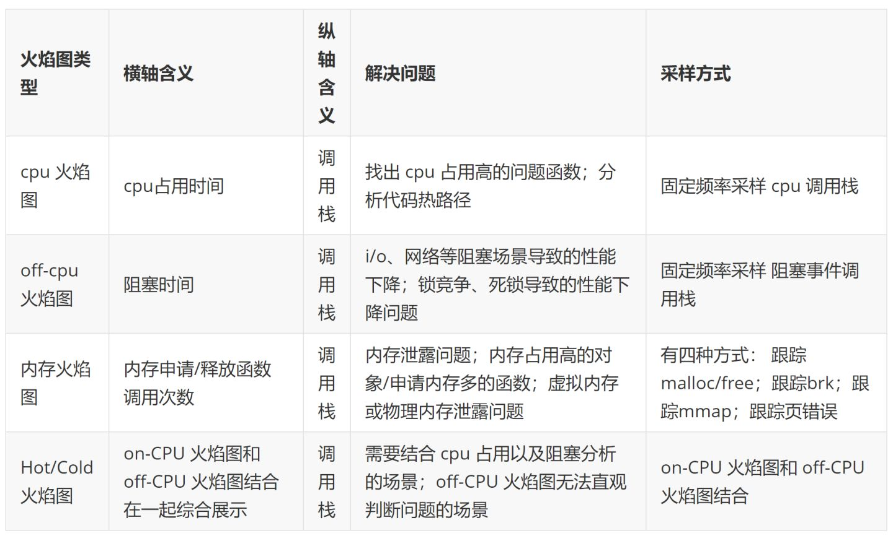
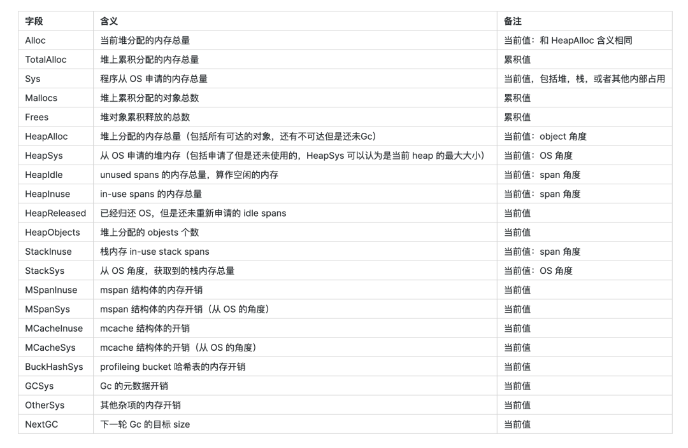

- [PProf 工具](https://mp.weixin.qq.com/s?__biz=MzUxMDI4MDc1NA==&mid=2247488702&idx=1&sn=b941ddb5473e8f6b85cd970e81225347&chksm=f90401e3ce7388f50f390eb4dfd887481a7866cb50011802d1916ec644c3ba5485ea0e423036&scene=178&cur_album_id=1628210764123521025#rd)
  - PProf 是用于可视化和分析性能分析数据的工具，PProf 以 profile.proto 读取分析样本的集合，并生成报告以可视化并帮助分析数据
  - 哪几种采样方式
    - runtime/pprof：采集程序（非 Server）的指定区块的运行数据进行分析。
    - net/http/pprof：基于HTTP Server运行，并且可以采集运行时数据进行分析。
    - go test：通过运行测试用例，并指定所需标识来进行采集
  - 可以做什么
    - CPU Profiling：CPU 分析，按照一定的频率采集所监听的应用程序 CPU（含寄存器）的使用情况，可确定应用程序在主动消耗 CPU 周期时花费时间的位置。
    - Memory Profiling：内存分析，在应用程序进行堆分配时记录堆栈跟踪，用于监视当前和历史内存使用情况，以及检查内存泄漏。
    - Block Profiling：阻塞分析，记录Goroutine阻塞等待同步（包括定时器通道）的位置，默认不开启，需要调用runtime.SetBlockProfileRate进行设置。
    - Mutex Profiling：互斥锁分析，报告互斥锁的竞争情况，默认不开启，需要调用runtime.SetMutexProfileFraction进行设置。
    - Goroutine Profiling：Goroutine 分析，可以对当前应用程序正在运行的 Goroutine 进行堆栈跟踪和分析。
- [跟踪剖析 trace](https://mp.weixin.qq.com/s/OY-w05uJIgjov9qGmJ-Wwg)
  - 有时候单单使用 pprof 还不一定足够完整观查并解决问题，因为在真实的程序中还包含许多的隐藏动作，例如：
    - Goroutine 在执行时会做哪些操作？
    - Goroutine 执行/阻塞了多长时间？
    - Syscall 在什么时候被阻止？在哪里被阻止的？
    - 谁又锁/解锁了 Goroutine ？
    - GC 是怎么影响到 Goroutine 的执行的？
  - 功能
    - View trace：查看跟踪
    - Goroutine analysis：Goroutine 分析
    - Network blocking profile：网络阻塞概况
    - Synchronization blocking profile：同步阻塞概况
    - Syscall blocking profile：系统调用阻塞概况
    - Scheduler latency profile：调度延迟概况
    - User defined tasks：用户自定义任务
    - User defined regions：用户自定义区域
    - Minimum mutator utilization：最低 Mutator 利用率
- [性能调优利器--火焰图](https://zhuanlan.zhihu.com/p/147875569)
  - 火焰图类型
  
  - 如何绘制火焰图
    - perf 相对更常用，多数 Linux 都包含了 perf 这个工具，可以直接使用；
    - SystemTap 则功能更为强大，监控也更为灵活
      - SystemTap 是动态追踪工具，它通过探针机制，来采集内核或者应用程序的运行信息，从而可以不用修改内核和应用程序的代码
      - SystemTap 定义了一种类似的 DSL 脚本语言，方便用户根据需要自由扩展
  - [Blazing Performance with Flame Graphs](https://www.usenix.org/conference/lisa13/technical-sessions/plenary/gregg)
- [如何使用 Kubernetes 监测定位慢调用](https://mp.weixin.qq.com/s/mOdn5eE0QtLfHuotpgacwg)
  - 定位慢调用一般来说有什么样的步骤 - 黄金信号 + 资源指标 + 全局架构
    - 黄金信号
      - 延时--用来描述系统执行请求花费的时间。常见指标包括平均响应时间，P90/P95/P99 这些分位数，这些指标能够很好的表征这个系统对外响应的快还是慢，是比较直观的。
      - 流量--用来表征服务繁忙程度，典型的指标有 QPS、TPS。
      - 错误--也就是我们常见的类似于协议里 HTTP 协议里面的 500、400 这些，通常如果错误很多的话，说明可能已经出现问题了。
      - 饱和度--就是资源水位，通常来说接近饱和的服务比较容易出现问题，比如说磁盘满了，导致日志没办法写入，进而导致服务响应。典型的那些资源有 CPU、 内存、磁盘、队列长度、连接数等等。
    - 资源指标 - 对于每一个资源去检查 utilization（使用率），saturation （饱和度），error（错误） ，合起来就是 USE 了
  - Case
    - 网络性能差
      - 指标 - 速率跟带宽，第二个是吞吐量，第三个是延时，第四个是 RTT。
- [是什么影响了我的接口延迟](https://mp.weixin.qq.com/s/k69-rs64XSkOFOpvUwq9sw)
  - 接口延迟大幅上升时
    - 先去看看 pprof 里的 goroutine 页面，看看 goroutine 是不是阻塞在什么地方了(比如锁)
  - USE 方法论，其中提到了一个 Saturation (饱和度)的概念，这个和 Utilization 有啥区别
    - Util 一般指的是繁忙程度，繁忙程度指的是你的资源有多少正在被利用
    - Sat 一般指的是饱和程度，而饱和度则指的是等待利用这些资源的队列有多长。
    - 如果只有一个核，那么我们就可以通过 util 和 sat 指标推断出这样的结论：sat 越高，接口延迟越高。util 高，影响不是特别大。
    - 现代 CPU 支持超线程(hyper thread)，你可以理解成一个窗口要排两个队，所以有时 CPU 的总 util 过了 50%，API 的延迟就比较高了
  - Case
    - 在 Go 的服务中，阻塞的 goroutine 数量变多，本质上还是这些 goroutine 发生了排队，了解底层的读者应该一想就知道 goroutine 是在哪里排队了。所以 goroutine 数量越多，说明队列也越拥挤
    - 网络应用中的 send buffer，receiver buffer 本质上也是队列
    - CPU 调度器本身也有执行队列，可以用 bcc 中的 runqlen 工具来查看
    - 磁盘的读写也有相应的队列
  - [Controlling Queue Delay](https://queue.acm.org/detail.cfm?id=2209336)
- [pprof快速定位Go程序内存泄露](https://mp.weixin.qq.com/s/PEpvCqpi9TPhVuPdn3nyAg)
- [Analyze Current Goroutines in Go](https://trstringer.com/analyze-goroutines/)
- [Advent of Go Profiling](https://felixge.de/2021/12/01/advent-of-go-profiling-2021-day-1-1/)
- [Go程序内存泄露问题快速定位](https://www.hitzhangjie.pro/blog/2021-04-14-go%E7%A8%8B%E5%BA%8F%E5%86%85%E5%AD%98%E6%B3%84%E9%9C%B2%E9%97%AE%E9%A2%98%E5%BF%AB%E9%80%9F%E5%AE%9A%E4%BD%8D/)
- [Go 系统监控函数 gopsutil](https://github.com/shirou/gopsutil)
- [Go Profile Notes](https://github.com/DataDog/go-profiler-notes)
- [Heap Profiling 原理解析](https://pingcap.com/zh/blog/an-explanation-of-the-heap-profiling-principle)
- [Go程序性能瓶颈实战分析](https://mp.weixin.qq.com/s?__biz=Mzg2MDU4MTg0NA==&mid=2247484960&idx=1&sn=da58a3edeb3af781a483550683eb8f7c&scene=21#wechat_redirect)
  - 内存分配
  - 垃圾回收
  - 协程与线程数量
  - pprof查看程序整体运行情况
  - 同步写日志的磁盘问题
  - 并发导致的锁问题
  - MARK ASSIST辅助标记解释
  - 本质是内存使用的不合理，当触发GC之后，在负载高的情况下，内存分配的速度超过了GC扫描的速度，从而一直在执行辅助标记，大大减慢了程序运行的速度。这会导致调度延迟等各方面情况发生恶化。通过优化代码逻辑和复用内存分配，消除瓶颈，节约线上千台容器。
- [gops](https://github.com/google/gops)
  - gops is a command to list and diagnose Go processes currently running on your system.
- [应用内存占用太多](https://eddycjy.com/posts/go/talk/2019-09-24-why-vsz-large/)
  - 某同学就说 VSZ 那么高，而某云上的容器内存指标居然恰好和 VSZ 的值相接近，因此某同学就怀疑是不是 VSZ 所导致的，觉得存在一定的关联关系
  - 什么是 VSZ
    - VSZ 是该进程所能使用的虚拟内存总大小，它包括进程可以访问的所有内存，其中包括了被换出的内存（Swap）、已分配但未使用的内存以及来自共享库的内存
    - 而虚拟内存，又分为内核虚拟内存和进程虚拟内存，每一个进程的虚拟内存都是独立的
  - 排查问题
    - 一个测试程序, `ps aux ` VSZ 为 4297048K，也就是 4G 左右
    - 首先看下 runtime.MemStats 和 pprof
    - 查看内存映射
      - 利用 macOS 的 vmmap 命令去查看内存映射情况, 这些关联共享库占用的空间并不大，导致 VSZ 过高的根本原因不在共享库和二进制文件上，但是并没有发现大量保留内存空间的行为，这是一个问题点。
      - 若是 Linux 系统，可使用 cat /proc/PID/maps 或 cat /proc/PID/smaps 查看。
    - 查看系统调用
      - 通过 macOS 的 dtruss 命令监听并查看了运行这个程序所进行的所有系统调用，发现了与内存管理有一定关系的方法如下：
        - mmap：创建一个新的虚拟内存区域，但这里需要注意，就是当系统调用 mmap 时，它只是从虚拟内存中申请了一段空间出来，并不会去分配和映射真实的物理内存，而当你访问这段空间的时候，才会在当前时间真正的去分配物理内存。那么对应到我们实际应用的进程中，那就是 VSZ 的增长后，而该内存空间又未正式使用的话，物理内存是不会有增长的。
        - madvise：提供有关使用内存的建议，例如：MADV_NORMAL、MADV_RANDOM、MADV_SEQUENTIAL、MADV_WILLNEED、MADV_DONTNEED 等等。
        - mprotect：设置内存区域的保护情况，例如：PROT_NONE、PROT_READ、PROT_WRITE、PROT_EXEC、PROT_SEM、PROT_SAO、PROT_GROWSUP、PROT_GROWSDOWN 等等。
        - sysctl：在内核运行时动态地修改内核的运行参数
      - 若是 Linux 系统，可使用 strace 命令
    - 查看 Go Runtime
      - 在 Go 程序启动的时候 VSZ 就已经不低了，并且确定不是共享库等的原因，且程序在启动时系统调用确实存在 mmap 等方法的调用
      - runtime 里的 schedinit 方法. 实际上在调用 mheap_.arenaHintAlloc.alloc() 时，调用的是 mheap 下的 sysAlloc 方法，而 sysAlloc 又会与 mmap 方法产生调用关系，并且这个方法与常规的 sysAlloc 还不大一样
      - mheap.sysAlloc 里其实有调用 sysReserve 方法，而 sysReserve 方法又正正是从 OS 系统中保留内存的地址空间的特定方法
  - 小结
    - VSZ（进程虚拟内存大小）与共享库等没有太大的关系，主要与 Go Runtime 存在直接关联，也就是在前图中表示的运行时堆（malloc）。转换到 Go Runtime 里，就是在 mallocinit 这个内存分配器的初始化阶段里进行了一定量的虚拟空间的保留
- [When Bloom filters don't bloom](https://blog.cloudflare.com/when-bloom-filters-dont-bloom/)
  - profiler
    - strace: `strace -cf PROGRAM`
    - perf: `perf record PROGRAM`, then check result var `perf record | head -n 20`
    - google-perftools with kcachegrind
    - check cache miss: `perf stat -d PROGRAM`
  - bloom filter
    - To get the same false positive guarantees we either must use many hashes in Bloom filter (like 8) and therefore many memory operations, or we can have 1 hash function, but enormous memory requirements.
    - Bloom filters optimize for memory usage, not for memory access.
  - start profiling with 'perf stat -d' and look at the "Instructions per cycle" (IPC) counter. If it's below 1, it generally means the program is stuck on waiting for memory. Values above 2 would be great, it would mean the workload is mostly CPU-bound.
- [How we tracked down (what seemed like) a memory leak in one of our Go microservices](https://blog.detectify.com/2019/09/05/how-we-tracked-down-a-memory-leak-in-one-of-our-go-microservices/)
  - `curl https://myservice/debug/pprof/heap > heap.out`
    – heap: A sampling of memory allocations of live objects in the heap.
    – goroutine: Stack traces of all current goroutines.
    – allocs: A sampling of all past memory allocations.
    – threadcreate: Stack traces that led to the creation of new OS threads.
    – block: Stack traces that led to blocking on synchronization primitives.
    – mutex: Stack traces of holders of contended mutexes.
  - `go tool pprof heap.out` or `go tool pprof - heap.out`
    - the most common command to run is `top`, which shows the top memory consumers
      – flat: Represents the memory allocated by a function and still held by that function.
      – cum: Represents the memory allocated by a function or any other function that is called down the stack.
  - It turns out that there was a change in Go 1.12 regarding how the runtime signals the operating system that it can take unused memory. 
    - Before Go 1.12, the runtime sends a MADV_DONTNEED signal on unused memory and the operating system immediately reclaims the unused memory pages. 
    - Starting with Go 1.12, the signal was changed to MADV_FREE, which tells the operating system that it can reclaim some unused memory pages if it needs to, meaning it doesn’t always do that unless the system is under memory pressure from different processes.
- [Go程序内存泄露问题快速定位](https://www.hitzhangjie.pro/blog/2021-04-14-go%E7%A8%8B%E5%BA%8F%E5%86%85%E5%AD%98%E6%B3%84%E9%9C%B2%E9%97%AE%E9%A2%98%E5%BF%AB%E9%80%9F%E5%AE%9A%E4%BD%8D/)
  - Go内存泄漏
    - Go中垃圾回收器采用的是“并发三色标记清除”算法，see:
      - Garbage Collection In Go : Part I - Semantics
      - Garbage Collection In Go : Part II - GC Traces
      - Garbage Collection In Go : Part III - GC Pacing
    - 内存泄漏场景
      - Kind of memory leaking caused by substrings
      - Kind of memory leaking caused by subslices
      - Kind of memory leaking caused by not resetting pointers in lost slice elements
      - Real memory leaking caused by hanging goroutines
      - real memory leadking caused by not stopping time.Ticker values which are not used any more
      - Real memory leaking caused by using finalizers improperly
      - Kind of resource leaking by deferring function calls
  - 内存泄露排查
    - 借助pprof排查
      - go tool pprof进行采样 `go tool pprof -seconds=10 -http=:9999 http://localhost:6060/debug/pprof/heap`
      - `curl -sK -v http://localhost:6060/debug/pprof/heap > heap.out  go tool pprof heap.out`
      - go tool pprof可以收集两类采样数据：
        - in_use，收集进程当前仍在使用中的内存；
        - alloc，收集自进程启动后的总的内存分配情况，包括已经释放掉的内存；
        - go tool pprof展示采样信息时，申请内存以“红色”显示，释放内存以“绿色”显示
      - pprof提供了另外一个有用的选项-diff_base 
        `go tool pprof -http=':8081'           \
        -diff_base heap-new-16:22:04:N.out \
        heap-new-17:32:38:N.out`
      - 原来当前协程因为ticker.C这个chan read操作阻塞了，需要注意的是time.Ticker.Stop()之后，ticker.C这个chan不会被关闭，最好在执行ticker.Stop()的时候，同时设置一个通知chan，close该chan来表示ticker停止
    - 借助bcc排查
      - `/usr/share/bcc/tools/memleak -p $(pidof c-so)`
      - `/usr/share/bcc/tools/memleak -p $(pidof c-so) -t`
      - `sudo /usr/share/bcc/tools/memleak -p $(pidof process) -O /lib/libc.musl-x86_64.so.1 -a`
    - 借助pmap/gdb排查
      - `pmap -p <pid>      # /proc/<pid>/maps`
      - `pmap -x -p <pid>   # /proc/<pid>/smaps`
- [golang pprof 实战](https://blog.wolfogre.com/posts/go-ppof-practice/)
- [Go 内存泄漏排查实战](https://mp.weixin.qq.com/s/7bpzvGLPd0MiOL6w-AdYHw)
  - Goroutine 泄漏
    - `curl http://「ip:port」/debug/pprof/goroutine?debug=2`
    - 本次 case http 服务为例，做简单介绍：
      - 上游服务作为客户端使用了 http1.1 并且将连接设置为 keepalive；
      - 本服务作为服务端未设置 idletimeout 与 readtimeout；
    - 这个 Goroutine 泄漏问题不止在 http 下会发生，在 thrift、grpc 中也是同样的道理，如果服务端不对连接设置 timeout，某些情况下就会被上游拖死。
  - 内存居高不下
    - 问题来自于 GO 在将内存归还给操作系统时的[内存释放策略](https://github.com/golang/go/issues/42330)
    - 不同策略的释放机制
      - MADV_DONTNEED：内核将会在合适的时机去释放内存，但进程的 RSS（常驻内存）将会立即减少。如果再次申请内存，内核会重新分配一块新的空间。
      - MADV_FREE：只能在 linux 内核版本 4.5 以上才能使用，此操作理论上只是打了一个标记位，只有在内核感觉到内存压力的时候才会将这些打标记的内存回收掉，分配给其他进程使用。这个策略下进程的 RSS 不会立即减少。
    - 不同策略的实际差别
      - 理论上 MADV_FREE 效率要高一些，通过在页表中做标记的方式，延迟内存的分配和回收，可以提高内存管理的效率，毕竟内存的回收和分配都是会消耗系统性能的；
      - 导致的 RSS 指标变化 MADV_DONTNEED 会导致进程 RSS 会有明显的下降；MADV_FREE 会导致进程 RSS 平稳在高峰，不会得到立即释放；
    - 不同 GO 版本的释放策略
      - 在 GO1.12 之前，默认均选择的 MADV_DONTNEED 策略进行内存回收；
      - 在 GO1.12~GO1.15，官方默认选择 MADV_FREE 策略进行内存回收；
      - 在 GO1.16 及之后，又改回了 MADV_DONTNEED 策略进行回收内存。
- [Benchmark Profiling](https://github.com/ardanlabs/gotraining/tree/master/topics/go/profiling/memcpu)
- [golang 内存问题排查指北](https://mp.weixin.qq.com/s/HdSIC93HMbqvbQisCr186Q)
  - Issue: 发现了某微服务有一些实例内存过高
  - 问题定位
    - 怀疑是 goroutine 逃逸
    - 怀疑代码出现了内存泄露 - 通过 pprof 进行实时内存采集，对比问题实例和正常实例的内存使用状况
    - 怀疑是 RSS 的问题 - 在 pprof 里看到 metrics 总共只是占用了 72MB，而总的 heap 内存只有 170+MB 而我们的实例是 2GB 内存配置，占用 80%内存就意味着 1.6GB 左右的 RSS 占用，这两个严重不符
  - 问题解决
    - 一种是在环境变量里指定GODEBUG=madvdontneed=1
    - 升级 go 编译器版本到 1.16 以上
  - 遇到的其他坑
    - 在服务发现时，kitc 里建立了一个缓存池 asyncache 来进行 instance 的存放。这个缓存池每 3 秒会刷新一次，刷新时调用 fetch，fetch 会进行服务发现。在服务发现时会根据实例的 host、port、tags(会根据环境 env 进行改变)不断地新建 instance，然后将 instance 存入缓存池 asyncache，这些 instance 没有进行清理也就没有进行内存的释放。所以这是造成内存泄露的原因。
  - 常见场景
    - goroutine 导致内存泄露
      - goroutine 申请过多 - 一次请求就新建一个 client，业务请求量大时 client 建立过多，来不及释放。
    - goroutine 阻塞
      - I/O 连接未设置超时时间，导致 goroutine 一直在等待
        - 在请求第三方网络连接接口时，因网络问题一直没有接到返回结果，如果没有设置超时时间，则代码会一直阻塞。
      - 互斥锁未释放
        - 假设有一个共享变量，goroutineA 对共享变量加锁但未释放，导致其他 goroutineB、goroutineC、...、goroutineN 都无法获取到锁资源，导致其他 goroutine 发生阻塞。
      - waitgroup 使用不当
        - waitgroup 的 Add、Done 和 wait 数量不匹配，会导致 wait 一直在等待
    - select 阻塞
      - 使用 select 但 case 未覆盖全面，导致没有 case 就绪，最终 goroutine 阻塞。
    - channel 阻塞
      - 写阻塞
        - 无缓冲 channel 的阻塞通常是写操作因为没有读而阻塞
        - 有缓冲的 channel 因为缓冲区满了，写操作阻塞
      - 读阻塞
        - 期待从 channel 读数据，结果没有 goroutine 往进写
    - 定时器使用不当
      - time.after()使用不当
        - 默认的 time.After()是会有内存泄漏问题的，因为每次 time.After(duratiuon x)会产生 NewTimer()，在 duration x 到期之前，新创建的 timer 不会被 GC，到期之后才会 GC。
      - time.ticker 未 stop
    - slice 引起内存泄露
      - 两个 slice 共享地址，其中一个为全局变量，另一个也无法被 gc；
      - append slice 后一直使用，未进行清理。
- [内存泄漏排查两例](https://segmentfault.com/a/1190000041589108)
  - [Goroutine 泄漏](https://zhuanlan.zhihu.com/p/100740270)
    - 现象
      - NumGoroutine 指标持续上涨，且低峰期未下降，判断出现了 Goroutine 泄漏现象
    - 排查
      - 通过访问线上服务 pprof 暴露出来的 HTTP 接口，拿到当前所有协程的堆栈信息；
        `curl http://「ip:port」/debug/pprof/goroutine?debug\=2` 发现存在大量阻塞时间超过上千分钟的 Goroutine，观察堆栈疑似是 http 连接未释放导致
      - 通过对 net.sockets.tcp.inuse（正在使用的tcp socket数量）指标的观察进行了进一步的确认
    - 结论
      - 下面以本次 case http 服务为例，做简单介绍：
        - 上游服务作为客户端使用了 http1.1 并且将连接设置为 keepalive；
        - 本服务作为服务端未设置 idletimeout 与 readtimeout；
      - 当这两种情况同时发生时，如果上游持有对本服务的连接不进行释放，那么服务端会一直维持这个连接的存在，不进行回收，进而导致协程泄漏
      - 需要注意的一点是，这个 Goroutine 泄漏问题不止在 http 下会发生，在 thrift、grpc 中也是同样的道理，如果服务端不对连接设置 timeout，某些情况下就会被上游拖死
  - 内存居高不下
    - 现象
      - 内存使用量（mem.rss）居高不下，且低峰期未下降，怀疑发生了内存泄漏现象
    - 排查
      - 刚开始怀疑时内存泄漏，但是抓取 pprof heap 图观察后，未发现泄露问题，且内存分配符合预期；
      - 发现内存使用虽然居高不下，但未呈上涨趋势，因此修改关键字为“go 内存占用居高不下”，发现有相同问题；
    - 结论
      - 问题来自于 GO 在将内存归还给操作系统时的内存释放策略
      - GO 内存释放策略
        - 不同策略的释放机制
          - MADV_DONTNEED：内核将会在合适的时机去释放内存，但进程的 RSS（常驻内存）将会立即减少。如果再次申请内存，内核会重新分配一块新的空间。
          - MADV_FREE：只能在 linux 内核版本 4.5 以上才能使用，此操作理论上只是打了一个标记位，只有在内核感觉到内存压力的时候才会将这些打标记的内存回收掉，分配给其他进程使用。这个策略下进程的 RSS 不会立即减少。
        - 不同 GO 版本的释放策略
          - 在 GO1.12 之前，默认均选择的 MADV_DONTNEED 策略进行内存回收；
          - 在 GO1.12~GO1.15，官方默认选择 MADV_FREE 策略进行内存回收；
          - 在 GO1.16 及之后，又改回了 MADV_DONTNEED 策略进行回收内存。
- [一个死锁bug的排查始末](https://mp.weixin.qq.com/s/f46xUA8Bxv66wH_cMYf9Ig)
  - 问题现象
    - 上游服务访问超时数量显著上升，初步排查访问某一容器的链接全部超时，摘流后上游访问恢复。发现摘流后 cpu 仍居高不下，本地发起链接仍无法访问。
  - 分析
    - perf
      - 因为 cpu 一直比较高，首先使用`perf record -p 进程号 -F 99 --call-graph dwarf -- sleep 10` 对目标进程采样分析，随后`perf report`
      - 获不大，runtime.osyield 和 runtime.morestack 占用了大部分时间，但仍然看不到调用源头。
    - dlv
      - 执行 `dlv attach 进程号` 将 dlv 挂到目标进程上，成功后执行 `goroutines -with running` 获得到当前正在运行的 goroutine
      - go 1.14 开始引入了通过发信号实现的抢占式调度，按理说所有 p（gmp 模型中的 p) 应该都会在有限时间内被抢占然后停住，但实际上确实没有，一直卡在这个循环里，导致 gc 的 stw 阶段无法完成，也就不能正常对外提供服务
  - 排查结论
    - 在 g 10 执行修改当前 p 的 timer 的链路中，准备执行 runtime.wakeNetPoller 时触发了 g 的抢占，此时 timer 的修改没有完成，转而接下来去执行 morestack （这个是协作式抢占，复用了 newstack 去实现），在 morestack 内通过汇编把执行栈切换为了当前 m 的 g0 上，接下来的 morestack 链路中会重新执行 go 的调度函数 runtime.schedule() ，而在这个函数中需要等待当前 p 的 timer 都修改完毕，然而此时整个程序处于 gc 的 stw 阶段，其他所有 p 已经全部暂停，也就导致 g 10 无法继续执行，从而形成了死锁，进而导致程序无法正常对外服务。
    - issue https://github.com/golang/go/issues/38023
    - 直观的来看问题出在 timer 的更新上，不应该允许 timer 未修改完就被打断或者 curg 为 nil 也应该发信号
- [pprof 统计的内存总是偏小?](https://mp.weixin.qq.com/s/wA_wyVYhPir-00KUFn-azw)
  - [golang 内存管理分析](https://mp.weixin.qq.com/s?__biz=Mzg3NTU3OTgxOA==&mid=2247486735&idx=1&sn=a855d4198ee87d1db3da9029ae2c3bc9&chksm=cf3e1dcaf84994dc2966238034e585c58a9bf9e49b8330caaa8ec85c3617435bc6165d715ae5&scene=21#wechat_redirect)
  - pprof 统计到的比 top 看到的要小？
    - pprof 有采样周期，
      - 采样的频率间隔导致的. 采样是有性能消耗的。 毕竟是多出来的操作，每次还要记录堆栈开销是不可忽视的。所以只能在采样的频率上有个权衡，mallocgc 采样默认是 512 KiB，也就是说，进程每分配满 512 KiB 的数据才会记录一次分配路径。
    - 管理内存+内存碎片，
      - Go 使用的是 tcmalloc 的内存分配的模型，把内存 page 按照固定大小划分成小块。这种方式解决了外部碎片，但是小块内部还是有碎片的，这个 gap 也是内存差异的一部分。tcmalloc 内部碎片率整体预期控制在 12.5% 左右。
    - cgo 分配的内存 
      - go 分配的内存无法被统计到，这个很容易理解。因为 Go 程序的统计是在 malloc.go 文件 mallocgc 这个函数中，cgo 调用的是 c 程序的代码，八杆子都打不到，它的内存用的 libc 的 malloc ，free 来管理，go 程序完全感知不到，根本没法统计。
    - runtime 管理内存
      - 
      - 内存的 gap 主要来源于：
        - heap 上 Idle span，分配了但是未使用的（往往出现这种情况是一波波的请求峰值导致的，冲上去就一时半会不下来）；
        - stack 的内存占用；
        - OS 分配但是是 reserved 的；
        - runtime 的 Gc 元数据，mcache，mspan 等管理内存
- [Golang分析内存溢出](https://mp.weixin.qq.com/s/mBkVMEfSXtFezYdjcuuwzg)
  - 通过 pprof 实时分析
    - `go tool pprof http://localhost:8899/debug/pprof/heap`
      - flat：当前函数所占用的容量。
      - flat%：当前函数所占用的容量，在总分配容量的百分比。
      - sum%：是从调用的最外层到当前方法累加使用的容量占总容量的百分比
      - cum：当前函数以及子函数所占用的容量。
      - cum%：当前函数以及子函数所占用的容量，在总分配容量的百分比。
      - 最后一列是函数的名字
  - 程序 crash 的时候自动创建 dump 文件
    - ulimit -a看下当前是否开启了core file - `echo "ulimit -c unlimited" >> ~/.profile`
    - `echo "export GOTRACEBACK=crash " >> ~/.profile`
- [快来抓住内存泄漏](https://mp.weixin.qq.com/s/HosxXlz9e1jOmIY60RRkaQ)
  - Debug
    - `go tool pprof -inuse_space http://ip:amdin_port/debug/pprof/heap`
    - top command
    - `wget http://ip:admin_port/debug/pprof/heap?debug=1`抓一下当前内存分配的详情
  - channel导致goroutine泄漏
    - `wget http://ip:admin_port/debug/pprof/goroutine?debug=1` - debug=1就是获取服务当前goroutine的数目和大致信息
    - `wget http://ip:admin_port/debug/pprof/goroutine?debug=2` - debug=2获取服务当前goroutine的详细信息
    - 服务当前的goroutine数也就才1033，也不至于占用那么大的内存。再看看服务线程挂的子线程有多少 - `ps mp 3030923 -o THREAD,tid | wc -l`
    - 因为这里的channel在make的时候没有设置缓冲值，所以当超时的时候函数返回，此时ch没有消费者了，就一直阻塞了
  - 深究问题所在
    - http超时阻塞导致goroutine泄露
    - go新版本内存管理问题
  - golang10次内存泄漏，8次goroutine泄漏，1次是真正内存泄漏，还有1次是cgo导致的内存泄漏
- [VSCODE可视化调试Go程序的方式](https://mp.weixin.qq.com/s/pmNCkj55UeCx2LosjF9mjA)
  - dlv debug
    - 先 go build 编译，出二进制文件，然后用 dlv exec 来调试；
    - 程序已经跑在测试环境，dlv attach 调试；
    - 程序出 core 了，dlv core 调试
  - vscode 调试
    - vscode 调试首先创建一个 .vscode/launch.json 的配置文件
- [Seven ways to profile a Go program](https://go-talks.appspot.com/github.com/davecheney/presentations/seven.slide#1)
  - [time](https://cloud.tencent.com/developer/article/1478198)
    - `/usr/bin/time -v`
    - go tool 中的 `-toolexec`
      - 当我们构建很慢的时候，如何才能知道为什么慢呢？go 工具链中支持 -x 命令，可以显示具体执行的每一条命令，这样我们就可以看到到底执行到哪里的时候慢了 `go build -x`
      - -toolexec 的参数，其值将作为工具链每一个命令的前缀来执行 如果 -toolexec=time，那么假如有一个 go build xxx.go 的命令，就会变为 time go build xxx.go 来执行。
  - GODEBUG
    - 如果你关心垃圾收集，则可以启用 gctrace=1
    - Profiler 会启动你的程序，然后通过配置操作系统，来定期中断程序，然后进行采样。比如发送 SIGPROF 信号给被分析的进程，这样进程就会被暂停，然后切换到 Profiler 中进行分析。Profiler 则取得被分析的程序的每个线程的当前位置等信息进行统计，然后恢复程序继续执行。
  - Test only run specific function by name
    - `go test -v -bench=^BenmarkSliceInit -run=^$ -benchmem`
  - pprof
    - 这包含了两部分：
      - 每个 Go 程序中内置 runtime/pprof 包
      - 然后用 go tool pprof 来分析性能数据文件
    - 函数进行性能分析的办法就是使用 testing 
      - `go test -run=XXX -bench=IndexByte -cpuprofile=/tmp/c.p bytes`
      - ` go test -run ^$ -bench BenchmarkPopulateReflect  -cpuprofile cpu.prof`
    - `go tool pprof bytes.test /tmp/c.p` 来分析
    - `go tool pprof -http :8080 tt.test cpu.prof `
  - /debug/pprof
  - perf
    - 由于现在 Go 已经支持了 Frame Pointer，所以可以和 -toolexec= 配合来对 Go 应用进行性能分析。
    - `go build -toolexec="perf stat" cmd/compile/internal/gc`
    - perf record
      - $ go build -toolexec="perf record -g -o /tmp/p" cmd/compile/internal/gc
      - $ perf report -i /tmp/p
  - Flame Graph
    ```shell
    $ go build -gcflags=-cpuprofile=/tmp/c.p .
    $ go-torch $(go tool -n compile) /tmp/c.p
    ```
  - go tool trace
    ```shell
    $ go test -trace=trace.out path/to/package
    $ go tool trace [flags] pkg.test trace.out
    ```
  - Connecting profiling with tracing
    - To address this, we're exploring pprof.Do (or alternatively, pprof.SetGoroutineLabels at a lower level). This would enable us to create a connection between profiling and tracing that is currently missing.
      ```go
      pprof.Do(
      		ctx,
      		pprof.Labels(
      				"span", fmt.Sprintf("%s", span)
      		),
      		func(ctx context.Context) {
      				doWork(ctx)
      		},
      )
      ```
- [Go 应用的持续性分析](https://mp.weixin.qq.com/s/4MnPx3AoVu_fb3UeM1tCNg)
  - [Pyroscope](https://github.com/pyroscope-io/pyroscope)
  - [Grafana Phlare](https://grafana.com/docs/phlare/latest/operators-guide/configure-agent/about-the-agent/)
  - [eBPF-based Profiling - Parca](https://github.com/parca-dev/parca)
- [Go test/benchmark test](https://philpearl.github.io/post/reader/)
  - Test trace
     ```shell
     go test -run TestPointerIt -trace=pointer_trace.out
     go tool trace pointer_trace.out
     ```
  - Benchmark 
    ```shell
    go test -run ^$ -bench BenchmarkReadString -memprofile mem.prof
    go tool pprof -http :6060 blog.test mem.prof
    ```
- [Go CPU profiler 内幕](https://mp.weixin.qq.com/s/rgdmO4qUv-wtfkAEow57Kg)
  - [The Busy Developer’s Guide to Go Profiling, Tracing and Observability]()
  - 基本知识
    - 当前市面上存在两种类型的profiler:
      - tracing(跟踪): 当预定义的事件发生时进行测量。例如，函数被调用，函数退出等等。
      - Sampling(采样): 定期进行测量。
    - Go CPU profiler 是一个采样分析器。当然Go还有一个执行跟踪器（execution tracer），它是 tracing profiler, 跟踪某些事件，例如请求锁，GC相关事件等等
      - 采样器(sampler)：定期调用回调，并且通常分析数据收集堆栈跟踪(stack trace)。不同的profiler使用不同的策略来触发回调。
      - 数据收集：这是profiler收集其数据的地方：它可能会消耗内存或调用计数，基本上是与堆栈跟踪关联的一些指标。
    - [Linux perf 使用 PMU(Performance Monitor Unit)计数器进行采样](https://easyperf.net/blog/2018/06/01/PMU-counters-and-profiling-basics)
  - 如何定期触发探查器？
    - 在 Linux 中，Go 运行时使用 setitimer/timer_create/timer_settime 来设置 SIGPROF 信号处理器。此处理器按runtime.SetCPUProfileRate设置的周期间隔触发，默认情况下是100Mz(10毫秒)
    - 在Go 1.18之前，Go CPU profiler的采样器存在一些严重的问题，你可以在[这里](https://www.datadoghq.com/blog/engineering/profiling-improvements-in-go-1-18/)看到这些问题的细节。我们记错的话，settimer API 是Linux中每个线程触发基于时间的信号的推荐方法: 从技术上讲，它的工作原理就像你期望的进程信号处理机制一样。但它并不是多核分析的良好机制。
    - 由于 Go 使用非阻塞 I/O，等待I/O的goroutine不会被统计为running的goroutine，Go CPU profiler 不会捕获这类goroutine的数据
    - fgprof 使用runtime.GoroutineProfile获取 on-CPU 和 off-CPU的数据。(Go's default profiler has a downside of only being able to view either On-CPU or Off-CPU time)
  - profiler 如何收集数据
    - 一个一个随机的运行的goroutine收到SIGPROF信号，它会被中断并执行信号处理程序。中断的 goroutine 的堆栈跟踪在此信号处理程序的上下文中获取到，然后与当前profiler标签[10]一起保存到lock-free[11]日志结构中
    - 
    - 为什么 Go 为了实现一个独特的lock-free结构而花费了那么大精力只为了保存临时分析数据？为什么不定期将所有内容写入hashmap？
      - 首先看的第一件事就是SIGPROF处理器就是禁用内存分派。此外，profiler代码不包含热门和锁，甚至堆栈的最大深度也是硬编码的。截止Go 1.19, 最大深度是64
  - 开销
    - profiler开销是恒定的？嗯，这要视情况而定。让我解释一下原因：在单个profiler中断中，会发生以下情况：
      - 一个随机运行的goroutine执行上下文切换来运行SIGPROF处理器，
      - 执行堆栈遍历，并且 Go 运行时将堆栈跟踪保存到lock-free ring buffer中，
      - goroutine 恢复。
    - 以上所有事情都发生在大约1微秒（在典型的CPU上）。但是，在实践中，情况变得更糟。如果您搜索“Go CPU profiler的开销”，您将看到从 %0.5 到 %1-%5 的数字（
    - 在典型的 I/O 密集型应用程序上，profiler的开销将非常小。
  - [Source](https://sumercip.com/posts/inside-the-go-cpu-profiler/)
- [性能分析](https://mp.weixin.qq.com/s/UMdvW7z4SyNn5t-u6sQaAQ)
  - 使用
    - cpu分析： `go tool pprof http://ip:port/debug/pprof/profile\?seconds\=60`
    - heap分析 `go tool pprof http://ip:port/debug/pprof/heap`
    - trace分析： `go tool trace http://ip:port/debug/pprof/trace?seconds=10`
    - web模式：会开启端口，web页面可以看到对应的火焰图与graphviz一样的图，比较直观
      ```shell
      wget -O trace.out http://ip:port/debug/pprof/trace?seconds=10
      curl http://ip:port/debug/pprof/trace?seconds=10 > trace.out
      ```
  - 实战性能分析
    - 火焰图对比 `./go tool pprof http://ip:port/debug/pprof/profile?seconds=30`
    - gctrace分析 `export GODEBUG=gctrace=1`
    - trace分析
      ```shell
      wget -O trace.out http://ip:port/debug/pprof/trace?seconds=10
      
      go tool trace trace.out
      ```
      - cpu相关，顺序为：Scheduler latency profile-> Goroutine analysis->View trace
      - 内存 `./go tool pprof http://ip:port/debug/pprof/heap`
- [Practical Memory Profiling]
  - `go test -bench . -benchmem -memprofile p.out`
  - `go tool pprof  p.out`
    - list funcname
      - flat colmun and cumulative column
    - weblist funcname
    - o // command
    - noinline=true // set noinline to true
  - `go test -bench . -benchmem -memprofile p.out -gcflags -m=2`
  - list funcname in go tool pprof
    - inline call the new buffer
    - cannot inline function too complicate cost xxx exceeds budget xx
  - `go tool pprof -noinlines p.out`
  - [sample](https://f4t.dev/software/go-performance-memory/)
   ```shell
   $ go test -bench=. -cpu=1,2,4,8 -benchmem
   $ go test -bench=. -cpu=1,2,4,8 -benchmem -cpuprofile=cpu.out
   $ go tool pprof -focus=Solve -call_tree -relative_percentages -png -output=cpu.png cpu.out
   $ go tool pprof -focus=Solve -relative_percentages -list=hasDuplicates cpu.out
   ```
- [Go 性能分析工具](https://mp.weixin.qq.com/s/5S0gUKqriE_jJVOZCK8zDg)
  - 优化工作在大部分情况下，内存分析 (例如 go tool pprof --alloc_objects app mem.pprof) 通常比 CPU 耗时分析 (例如 go tool pprof app cpu.pprof) 更容易分析性能瓶颈
  - 通过 goroutine 采样来分析 goroutine 泄漏问题 (例如访问 http://127.0.0.1:6060/debug/pprof/goroutine?debug=1，查看 goroutine profile 数量)，原理类似 这篇文章中提到的[3]
  - 指定代码块进行采样 (例如使用 pprof.StartCPUProfile() 和 pprof.StopCPUProfile() 指定要采样的代码块)
  - 对于 hot path 上面的代码，在单元测试期间就要进行性能采样分析
  - 生产环境 不要将 pprof HTTP 服务直接暴露给外部或公共网络，以防止未经授权的访问，只有在需要进行性能分析时启动该服务
  - 生产环境 中设置专门用于采样的服务容器 (例如和灰度类似的采样服务)，设置负载均衡自动分配一定百分比的生产流量到采样服务，线上遇到问题时就可以第一时间进行处理
  - 生产环境 中设置自定义的 pprof PATH，例如 Gin pprof
