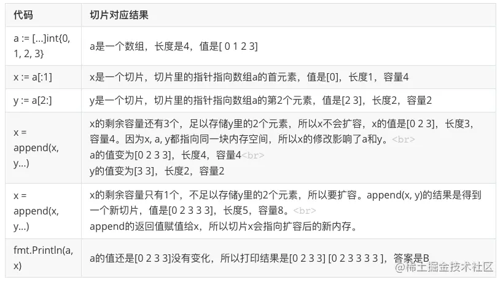

- [题1](https://mp.weixin.qq.com/s?__biz=MzAxNzY0NDE3NA==&mid=2247484972&idx=1&sn=3ac2c60f30114bef4a4bdd41fd7638a6&chksm=9be329cdac94a0db447cb48a41b609ef8909d78449d30f530609b35f92d0eda386bac675c67c&scene=21#wechat_redirect)
  ```go
  package main
  
  const s = "Go101.org"
  // len(s) == 9
  // 1 << 9 == 512
  // 512 / 128 == 4
  
  var a byte = 1 << len(s) / 128
  var b byte = 1 << len(s[:]) / 128
  
  func main() {
    println(a, b)
  }
  ```
  如果 const s = "Go101.org” 改为 var s = "Go101.org" 结果又会是什么呢？ // 0 0 
  然则
   ```go
   package main
   
   var s = [9]byte{'G', 'o', '1', '0', '1', '.', 'o', 'r', 'g'}
   
   var a byte = 1 << len(s) / 128
   var b byte = 1 << len(s[:]) / 128
   
   func main() {
    println(a, b)
   }
   ```
  Go 语言规范中关于长度和容量的说明
   > 内置函数 len 和 cap 获取各种类型的实参并返回一个 int 类型结果。实现会保证结果总是一个 int 值。
   如果 s 是一个字符串常量，那么 len(s) 是一个常量 。如果 s 类型是一个数组或到数组的指针且表达式 s 不包含 信道接收 或（非常量的） 函数调用的话， 那么表达式 len(s) 和 cap(s) 是常量；这种情况下， s 是不求值的。否则的话， len 和 cap 的调用结果不是常量且 s 会被求值。

  ```go
  var a byte = 1 << len(s) / 128
  var b byte = 1 << len(s[:]) / 128
  ```
  第一句的 len(s) 是常量（因为 s 是字符串常量）；而第二句的 len(s[:]) 不是常量。这是这两条语句的唯一区别：两个 len 的返回结果数值并无差异，都是 9，但一个是常量一个不是

  位移运算这里。Go 语言规范中有这么一句
  > The right operand in a shift expression must have integer type or be an untyped constant representable by a value of type uint. If the left operand of a non-constant shift expression is an untyped constant, it is first implicitly converted to the type it would assume if the shift expression were replaced by its left operand alone.
  
  > If the left operand of a constant shift expression is an untyped constant, the result is an integer constant; otherwise it is a constant of the same type as the left operand, which must be of integer type.
  
  - 因此对于 var a byte = 1 << len(s) / 128，因为 1 << len(s) 是一个常量位移表达式，因此它的结果也是一个整数常量，所以是 512，最后除以 128，最终结果就是 4。
  - 而对于 var b byte = 1 << len(s[:]) / 128，因为 1 << len(s[:]) 不是一个常量位移表达式，而做操作数是 1，一个无类型常量，根据规范定义它是 byte 类型（根据：如果一个非常量位移表达式的左侧的操作数是一个无类号常量，那么它会先被隐式地转换为假如位移表达式被其左侧操作数单独替换后的类型）。

  常量是在编译的时候进行计算的。在 Go 语言中，常量分两种：无类型和有类型。
  - Go 规范上说，字面值常量， true , false , iota 以及一些仅包含无类型的恒定操作数的 
  - 常量表达式 是无类型的。
    
  所以 `var b byte = 1 << len(s[:]) / 128` 中，根据规范定义，1 会隐式转换为 byte 类型，因此 `1 << len(s[:])` 的结果也是 byte 类型，而 byte 类型最大只能表示 255，很显然 512 溢出了，结果为 0，因此最后 b 的结果也是 0。

- [题2](https://mp.weixin.qq.com/s?__biz=MzAxNzY0NDE3NA==&mid=2247485015&idx=1&sn=4582ca64df8cba44a686ea83299306c9&chksm=9be329b6ac94a0a01fea76c93592ad280805a14cbc4d4227a78aa69c1f347fa583b0aa88d745&cur_album_id=1468728629806153729&scene=189#wechat_redirect)
  ```go
  package main
  
  func main() {
   var a int8 = -1
   var b int8 = -128 / a
  
   println(b)
  }
  ```
  因为 var b int8 = -128 / a 不是常量表达式，因此 untyped 常量 -128 隐式转换为 int8 类型（即和 a 的类型一致），所以 -128 / a 的结果是 int8 类型，值是 128，超出了 int8 的范围。因为结果不是常量，允许溢出，128 的二进制表示是 10000000，正好是 -128 的补码。所以，第一题的结果是 -128

  [Go 语言规范](https://hao.studygolang.com/golang_spec.html#id327)
  > 对于两个整数值 x 和 y ，其整数商 q = x / y 和余数 r = x % y 满足如下关系：
  > x = q*y + r 且 |r| < |y|
    这个规则有一个例外，如果对于 x 的整数类型来说，被除数 x 是该类型中最负的那个值，那么，因为 补码 的 整数溢出 ，商 q = x / -1 等于 x （并且 r = 0 ）。
  ```go
  package main
  
  func main() {
   const a int8 = -1
   var b int8 = -128 / a
  
   println(b)
  }
  ```
  对于 var b int8 = -128 / a，因为 a 是 int8 类型常量，所以 -128 / a 是常量表达式，在编译器计算，结果必然也是常量。因为 a 的类型是 int8，因此 -128 也会隐式转为 int8 类型，128 这个结果超过了 int8 的范围，但常量不允许溢出，因此编译报错。

- [for select 时，如果通道已经关闭会怎么样](https://mp.weixin.qq.com/s/59qdNpqOzMXWY_jUOddNow)
  - for循环select时，如果通道已经关闭会怎么样？如果select中的case只有一个，又会怎么样？
    - for循环select时，如果其中一个case通道已经关闭，则每次都会执行到这个case。
      - 返回的ok为false时，执行c = nil 将通道置为nil，相当于读一个未初始化的通道，则会一直阻塞。
    - 如果select里边只有一个case，而这个case被关闭了，则会出现死循环。
      - 那如果像上面一个case那样，把通道置为nil就能解决问题了吗
      - 此时整个进程没有其他活动的协程了，进程deadlock
- 对已经关闭的的 chan 进行读写，会怎么样
  - 读已经关闭的 chan 能一直读到东西，但是读到的内容根据通道内关闭前是否有元素而不同。
    - 如果 chan 关闭前，buffer 内有元素还未读 , 会正确读到 chan 内的值，且返回的第二个 bool 值（是否读成功）为 true。
    - 如果 chan 关闭前，buffer 内有元素已经被读完，chan 内无值，接下来所有接收的值都会非阻塞直接成功，返回 channel 元素的零值，但是第二个 bool 值一直为 false。
  - 写已经关闭的 chan 会 panic
- [Slice - go 101](https://juejin.cn/post/7045953087080497166)
  ```go
      a := [...]int{0, 1, 2, 3}
      x := a[:1]
      y := a[2:]
      x = append(x, y...)
      x = append(x, y...)
      fmt.Println(a, x)
  ```
  
  - :分割操作符
    - 新slice结构体里的array指针指向原数组或者原slice的底层数组，新切片的长度是：右边的数值减去左边的数值，新切片的容量是原切片的容量减去:左边的数值。
    - :的左边如果没有写数字，默认是0，右边没有写数字，默认是被分割的数组或被分割的切片的长度
    - :分割操作符右边的数值有上限
      - 如果分割的是数组，那上限是是被分割的数组的长度。
      - 如果分割的是切片，那上限是被分割的切片的容量
  - append机制
    - append函数返回的是一个切片，append在原切片的末尾添加新元素，这个末尾是切片长度的末尾，不是切片容量的末尾
    - 如果原切片的容量足以包含新增加的元素，那append函数返回的切片结构里3个字段的值是：
      - array指针字段的值不变，和原切片的array指针的值相同，也就是append是在原切片的底层数组返回的切片还是指向原切片的底层数组
      - len长度字段的值做相应增加，增加了N个元素，长度就增加N
      - cap容量不变
    - 如果原切片的容量不够存储append新增加的元素，Go会先分配一块容量更大的新内存，然后把原切片里的所有元素拷贝过来，最后在新的内存里添加新元素。append函数返回的切片结构里的3个字段的值是：
      - array指针字段的值变了，不再指向原切片的底层数组了，会指向一块新的内存空间
      - len长度字段的值做相应增加，增加了N个元素，长度就增加N
      - cap容量会增加
  - copy机制
    - copy会从原切片src拷贝 min(len(dst), len(src))个元素到目标切片dst，
      因为拷贝的元素个数min(len(dst), len(src))不会超过目标切片的长度len(dst)，所以copy执行后，目标切片的长度不会变，容量不会变。
  ```go
  func main() {
      a := []int{1, 2}
      b := append(a, 3)
  
      c := append(b, 4)
      d := append(b, 5)
  
      fmt.Println(a, b, c[3], d[3])
  }
  
  func main() {
  s := []int{1, 2}
  s = append(s, 4, 5, 6)
  fmt.Println(len(s), cap(s))
  }
  ```
- [Context携带数据是线程安全的吗](https://mp.weixin.qq.com/s/cNmEnYUB07OWICcNu7wGfA)
  - context本身就是线程安全的，所以context携带value也是线程安全的
  - 添加键值对不是在原context结构体上直接添加，而是以此context作为父节点，重新创建一个新的valueCtx子节点，将键值对添加在子节点上，由此形成一条context链。
  - context添加的键值对一个链式的，会不断衍生新的context，所以context本身是不可变的，因此是线程安全的。
- [切片真题](https://mp.weixin.qq.com/s/Qo_DNAAcamXXwU9ihrY6jA)
  - 拷贝大切片一定比拷贝小切片代价大吗？
    - 实际上不会，因为切片本质内部结构切片中的第一个字是指向切片底层数组的指针，这是切片的存储空间，第二个字段是切片的长度，第三个字段是容量。
  - 切片的深浅拷贝
    - 使用=操作符拷贝切片，这种就是浅拷贝
    - 使用[:]下标的方式复制切片，这种也是浅拷贝
    - 使用Go语言的内置函数copy()进行切片拷贝，这种就是深拷贝
  - 零切片、空切片、nil切片是什么
    - 我们把切片内部数组的元素都是零值或者底层数组的内容就全是 nil的切片叫做零切片，使用make创建的、长度、容量都不为0的切片就是零值切片
    - nil切片的长度和容量都为0，并且和nil比较的结果为true，采用直接创建切片的方式、new创建切片的方式都可以创建nil切片
    - 空切片的长度和容量也都为0，但是和nil的比较结果为false，因为所有的空切片的数据指针都指向同一个地址 0xc42003bda0；使用字面量、make可以创建空切片
  - 参数传递切片和切片指针有什么区别？
    - 如果指向底层数组的指针被覆盖或者修改（copy、重分配、append触发扩容），此时函数内部对数据的修改将不再影响到外部的切片，代表长度的len和容量cap也均不会被修改。
  - range遍历切片有什么要注意的？
    - 使用range遍历切片时会先拷贝一份，然后在遍历拷贝数据
- [Common mistaks with Slice](https://medium.com/@nsspathirana/common-mistakes-with-go-slices-95f2e9b362a9#19e8)
  - Re-slice a slice and refer to elements
    ```go
    a := []int{1, 2, 3, 4, 5, 6, 7, 8, 9}
    
        b := a[4:7]
        fmt.Printf("before sorting a, b = %v\n", b) // before sorting a, b = [5 6 7]
    
        sort.Slice(a, func(i, j int) bool {
            return a[i]> a[j]
        })
        // b is not [5,6,7] anymore. If we code something to use [5,6,7] in b, then
        // there can be some unpredicted behaviours
        fmt.Printf("after sorting a, b = %v\n", b) // after sorting a, b = [5 4 3]
    ```
  - Iterate and put the reference to elements
    ```go
        a := make([]*int, 0)
        // simplest scenario of the mistake. create *int slice and
        // put elements in a loop using iterator variable's pointer
        for i := 0; i < 3; i++ {
            a = append(a, &i)
        }
    
        // all elements have same pointer value and value is the last value of
        // the iterator variable because i is the same variable throughout the loop
    
        fmt.Printf("a = %v\n", a) // a = [0xc000018058 0xc000018058 0xc000018058]
        fmt.Printf("a[0] = %v, a[1] = %v, a[2] = %v\n\n", *a[0], *a[1], *a[2])
        // a[0] = 3, a[1] = 3, a[2] = 3
    
        type A struct {
            a int
        }
        b := []A{
            {a: 2},
            {a: 4},
            {a: 6},
        }
    
        // append pointer to iteration variable a and it's memory address is same
        // through out the loop so all the elements will append same pointer and value
        // is the last value of the loop because a is the same variable throughout
        // the loop
        aa := make([]*A, 0)
        for _, a := range b {
            aa = append(aa, &a)
        }
        fmt.Printf("aa = %v\n", a) // aa = [0xc000018058 0xc000018058 0xc000018058]
        fmt.Printf("aa[0] = %v, aa[1] = %v, aa[2] = %v\n\n", *aa[0], *aa[1], *aa[2])
        // aa[0] = {6}, aa[1] = {6}, aa[2] = {6}
    
        // Fix:
        // To avoid that iteration value should be copied to a different variable
        // and pointer to that should be appended
    
        bb := make([]*A, 0)
        for _, a := range b {
            a := a
            bb = append(bb, &a)
        }
    
        fmt.Printf("bb = %v\n", a) // bb = [0xc000018058 0xc000018058 0xc000018058]
        fmt.Printf("bb[0] = %v, bb[1] = %v, bb[2] = %v\n", *bb[0], *bb[1], *bb[2])
        // bb[0] = {2}, bb[1] = {4}, bb[2] = {6}
    ```
  - Append to a slice in a different function
  - Changing slice’s elements while iterating with a range loop
  - Create a new slice by appending different values to the same slice
    ```go
        a := make([]int, 3, 10)
        a[0], a[1], a[2] = 1, 2, 3
    
        b := append(a, 4)
        c := append(a, 5)
    	
        // c == b because both refer to same underlying array and capacity of that is 10
        // so appending to a will not create new array.
        fmt.Printf("b = %v \n", b) // b = [1 2 3 5]
        fmt.Printf("c = %v \n\n", c) // c = [1 2 3 5]
    ```
  - Copy a slice using the copy built-in function to an empty slice
- [slice question](https://polarisxu.studygolang.com/posts/go/action/interview-slice-json/)
  - Question
    ```go
    type AutoGenerated struct {
        Age   int    `json:"age"`
        Name  string `json:"name"`
        Child []int  `json:"child"`
    }
    
    func main() {
        jsonStr1 := `{"age": 14,"name": "potter", "child":[1,2,3]}`
        a := AutoGenerated{}
        json.Unmarshal([]byte(jsonStr1), &a)
        aa := a.Child
        fmt.Println(aa)
        jsonStr2 := `{"age": 12,"name": "potter", "child":[3,4,5,7,8,9]}`
        json.Unmarshal([]byte(jsonStr2), &a)
        fmt.Println(aa)
    }
    ```
  - json.Unmarshal: 要将一个 JSON 数组解码到切片（slice）中，Unmarshal 将切片长度重置为零，然后将每个元素 append 到切片中。特殊情况，如果将一个空的 JSON 数组解码到一个切片中，Unmarshal 会用一个新的空切片替换该切片。
  - slice: 执行第二次 json 解析. 底层数组从索引 0 位置开始依次被 3、4、5、7 填充。因为 aa 的 len 是 3，所以即使底层数组变成了 3、4、5、7，aa 看到却是 3、4、5. 当再继续解析时，底层数组容量不够，因此进行扩容，cap 变成 6，将原底层数组的元素拷贝一份到新的数组中。所以最后 a.Child 的底层数组是这个新的底层数组：[3 4 5 7 8 9]，cap = 6。而 aa 的底层数组还是原来的
- [for..range slice issue](https://mp.weixin.qq.com/s?__biz=MzkyNzI1NzM5NQ==&mid=2247484755&idx=1&sn=5e3f8405dc8244875614cc936fbfd601&scene=21#wechat_redirect)
    ```go
    u := []user{
    {"asong", 23},
    {"song", 19},
    {"song2020", 18},
    }
    n := make([]*user, 0, len(u))
    // 在for range中，变量v是用来保存迭代切片所得的值，因为v只被声明了一次，每次迭代的值都是赋值给v，该变量的内存地址始终未变，这样讲他的地址追加到新的切片中，
    // 该切片保存的都是同一个地址，这肯定无法达到预期效果的。
    // 这里还需要注意一点，变量v的地址也并不是指向原来切片u[2]的，因我在使用range迭代的时候，变量v的数据是切片的拷贝数据，所以直接copy了结构体数据。
    // This is because in the for loop you operate with a copy and not with the slice/array element itself.
    // The for ... range makes a copy of the elements it loops over.
    // In Go there are pointer types and non-pointer types, but no "references" (in the meaning it is used in C++ and Java). Given the fact that there are no "reference" types in Go, this is not an unexpected behavior. The loop variable is just an "ordinary" local variable, it can only hold a value (which may be a pointer or non-pointer), but not a reference.
    for _, v := range u {
    n = append(n, &v)
    }
    
    fmt.Println(n)
    for _, v := range n {
    fmt.Println(v)
    }
    
    // fix method 1
    n = n[:0]
    for _, v := range u {
    o := v
    n = append(n, &o)
    }
    fmt.Println(n)
    for _, v := range n {
    fmt.Println(v)
    }
    
    // fix method 2: 直接引用数据的内存，这个方法比较好，不需要开辟新的内存空间
    n = n[:0]
    for k, _ := range u {
    n = append(n, &u[k])
    }
    fmt.Println(n)
    
    // try to change value of slice element
    for _, v := range u {
    if v.age != 18 {
    v.age = 20
    }
    }
    fmt.Println(u)
    
    // fix
    for k, v := range u {
    if v.age != 18 {
    u[k].age = 18
    }
    }
    fmt.Println(u)
    
    // infinite loop? NO
    v := []int{1, 2, 3}
    for i := range v {
    v = append(v, i)
    }
    fmt.Println(v)
    ```
- [空切片分配了底层数组?](https://mp.weixin.qq.com/s/NMz4PMtFYqkYb5oUo1-FzA)
  - 空切片(empty slice)与nil切片
    ```go
    var sl1 = []int{} // sl1是空切片
    var sl2 []int     // sl2是nil切片
    ```
  - Debug
    ```go
        var sl1 = []int{}
        ph1 := (*reflect.SliceHeader)(unsafe.Pointer(&sl1))
        fmt.Printf("empty slice's header is %#v\n", *ph1)
        var sl2 []int
        ph2 := (*reflect.SliceHeader)(unsafe.Pointer(&sl2))
        fmt.Printf("nil slice's header is %#v\n", *ph2)
    
        $go run -gcflags '-l -N' dumpslice.go
        empty slice's header is reflect.SliceHeader{Data:0xc000067c40, Len:0, Cap:0}
        nil slice's header is reflect.SliceHeader{Data:0x0, Len:0, Cap:0}
    ```
  - 空切片到底分没分配底层数组？ 答案是肯定的：没有分配 , 只是栈上地址
    ```go
    func main() {
         var sl = []int{}
         _ = sl
     }
    ```
    `生成go源码对应汇编代码的主要方法有：go tool compile -S xxx.go和针对编译后的二进制文件使用go tool objdump -S exe_file。`
- [defer](https://mp.weixin.qq.com/s/yM5iX-5VRELAqb0qy4c8Yg)
  - defer 注册的函数，执行 return 语句之后，对应执行三个操作序列：
    ```
    1. 设置返回值
    2. 执行 defered 链表
    3. ret 指令跳转到 caller 函数
    ```
  - Question
    ```go
    func f1 () (r int) {
     t := 1
     defer func() {
      t = t +5
     }()
     return t
    }
    
    func f2() (r int) {
     defer func(r int) {
      r = r + 5
     }(r)
     return 1
    }
    
    func f3() (r int) {
     defer func () {
      r = r + 5
     } ()
     return 1
    }
    ```
    ```go
    func hello(i *int) int {
        defer func() {
            *i = 19
        }()
        return *i
    }
    
    func main() {
        i := 10
        j := hello(&i)
        fmt.Println(i, j)
    ```
- [常见知识点](https://mp.weixin.qq.com/s/7rCsaGy8B2lwbZ4duEC7Nw)
  - Go 是传值还是传引用？
  - Go 面试官问我如何实现面向对象？
  - Go 结构体和结构体指针调用有什么区别吗？
  - Go new 和 make 是什么，差异在哪？
  - 什么是协程，协程和线程的区别和联系？
  - GMP 模型，为什么要有 P？
  - Go 结构体是否可以比较，为什么？
  - 单核 CPU，开两个 Goroutine，其中一个死循环，会怎么样？
  - 进程、线程都有 ID，为什么 Goroutine 没有 ID？
  - Goroutine 数量控制在多少合适，会影响 GC 和调度？
  - 详解 Go 程序的启动流程，你知道 g0，m0 是什么吗？
  - Goroutine 泄露的情况有哪些？
  - Go 在什么时候会抢占 P？
  - 会诱发 Goroutine 挂起的 27 个原因
  - 为什么 Go map 和 slice 是非线程安全的？
  - Go sync.map 和原生 map 谁的性能好，为什么？
  - 为什么 Go map 的负载因子是 6.5？
- [Question](https://mp.weixin.qq.com/s?__biz=MzUxMDI4MDc1NA==&mid=2247494443&idx=1&sn=5e3e0e1bb3df21c9fb42651c937e8e25&chksm=f907fe76ce7077604ce65cf9e068030a6d3fc8ad0715612ae64b1ffd9e8b42c0eced84b16eca&scene=21#wechat_redirect)
  - Question
     ```go
     func aaa() (done func(), err error) {
      return func() { 
        print("aaa: done") 
      }, nil
     }
     
     func bbb() (done func(), _ error) {
      done, err := aaa()
      return func() { 
        print("bbb: surprise!"); 
        done() 
      }, err
     }
     
     func main() {
      done, _ := bbb()
      done()
     }
     ```
  - 本质上在函数 bbb 执行完毕后， 变量 done 已经变成了一个递归函数。
  - 函数 bbb 调用变量 done 后，会输出 bbb: surprise! 字符串，然后又调用变量 done。而变量 done 又是这个闭包（匿名函数），从而实现不断递归调用和输出


