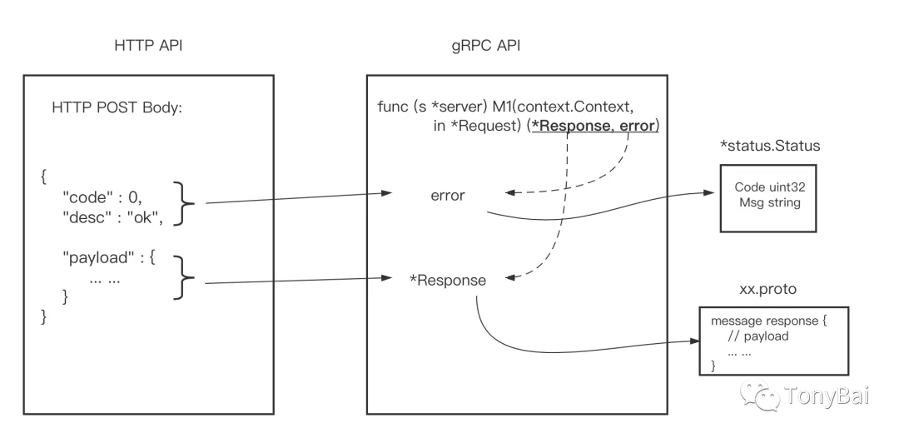
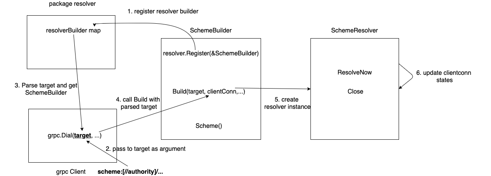
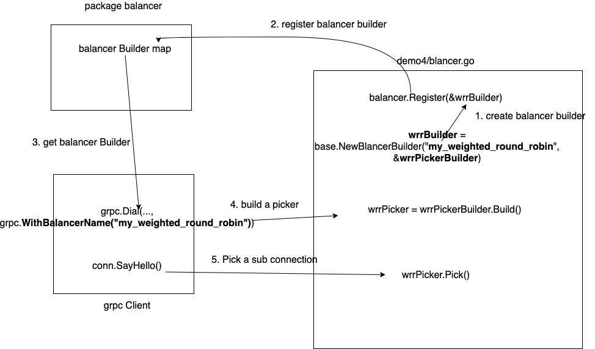
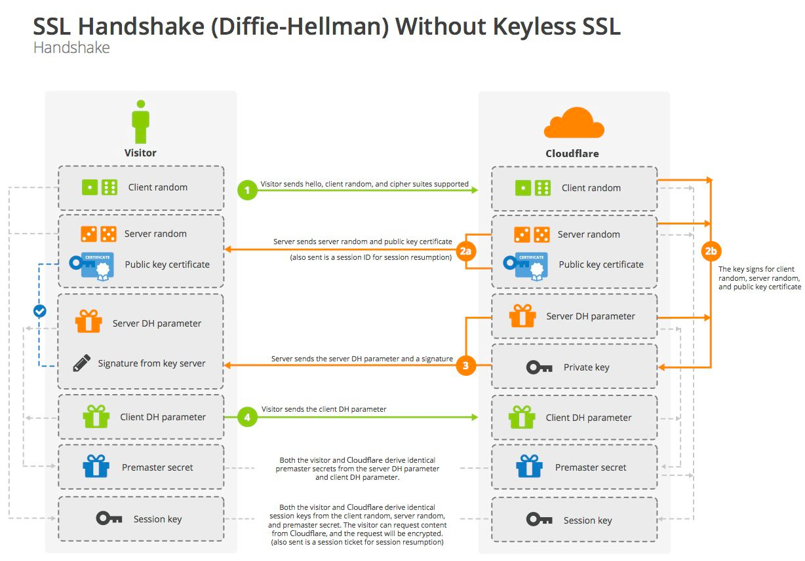

- [gRPC flow control](https://www.youtube.com/watch?v=EEEGBwEA8yA)
  - TCP congestion control
    - Common Algorithm
      - Reno
      - BIC
      - CUBIC
    - General Strategy
      - Incr sending rate if ACK
      - Decr if ACK missed
  - TCP flow control
    - Stop reading kernel buffer
    - Receiver drop further packets
    - Receiver being protected
    - Trigger Impact
      - Reduce throughput
      - Degraded multiplexing
  - gRPC flow control
    - Algorithm similar to Token Bucket (WINDOW_UPDATE Frame)
    - Features
      - High performance
      - Fine grained throttling - Stream (RPC)/ Connection
      - Frame Priority
  - Window Size
    - Solution: BDP estimator - Bandwidth Delay Product: the amount of data that can be in transit in the network
    - Goal: intelligently avoid triggering flow control
    - Measure BDP through PING frame and PID controller
    - Set the _init window size_ to BDP
  - Challenge
    - Fairness between RPCs  - HTTP2 flow control supports multiplexing
    - Throttle based on performance - gRPC has BDP estimator
    - Flow control From End to End - gRPC has built-in Flow control

- [Best Practice](https://www.youtube.com/watch?v=Z_yD7YPL2oE)

  - API Design - Idempotency   
    - Request should include timestamp/guid to make idempotency
  - API Design - Performance
    - Request: can imply unbounded work -- set limits
    - Response: pagination
    - Avoid long-running operation  - 
  - API Design - Defaults
    - Unset enums default to zero value, perfer UNKNOWN/UNSECIFIED as the default
    - Backward compatibility
  - API Design - Errors
    - Do not include in response payload in most cases
    - Avoid batching multiple, independent operations
  - Error Handling - Don't Panic!
    - Do not blindly return errors from libs or ther services
  - Deadlines - Propagation
    - `Context.WithDeadline(.. Time percificed)` or `WithTimeout(…  -` 
  - Rate Limiting
    - Local rate limits
      - `Grpc.InTapHandler(rateLimiter`)`
      - `Golang.org/x/time/rate`    -- rate.NewLimiter(…)
  - Retries.
    - Officail grpc plan to do that
      - Configured via server config
      - Supports
        - Sequential retries with backoff
        - Concurrent hedged request
    - Until then: use a client wrapper or interceptor
      - Accept a content and use its deadline
  - Memory Management
    - Grpc does not limit goroutines
      - Option1: set listener limits and concurrent stream limits
        - `Listener = netutil.LimitListener(listener, connectionLimit)`
        - `Grpc.NewServer(grpc.MaxConcurrentSteams(streamsLimit))`
      - Option2: use TapHandler to error when too many rpcs are in flight
      - Option3: use health report and load balance to redirect traffic
    - Large request can OOM
      - Set a max request payload size
         `Grpc.NewServer(grpc.MaxRecvMsgSize(4096/*bytes*/))`
  - Always re-use stubs and channels when possible.
  - Use _keepalive pings_ to keep HTTP/2 connections alive during periods of inactivity to allow initial RPCs to be made quickly without a delay (i.e. C++ channel arg GRPC_ARG_KEEPALIVE_TIME_MS).
  - Use _streaming RPCs_ when handling a long-lived logical flow of data from the client-to-server, server-to-client, or in both directions. Streams can avoid continuous RPC initiation, which includes connection load balancing at the client-side, starting a new HTTP/2 request at the transport layer, and invoking a user-defined method handler on the server side.
  - Each gRPC channel uses 0 or more HTTP/2 connections and each connection usually has a limit on the number of concurrent streams. When the number of active RPCs on the connection reaches this limit, additional RPCs are queued in the client and must wait for active RPCs to finish before they are sent. Applications with high load or long-lived streaming RPCs might see performance issues because of this queueing. There are two possible solutions:
    - Create a **separate channel** for each area of high load in the application.
    - Use a **pool of gRPC channels** to distribute RPCs over multiple connections (channels must have different channel args to prevent re-use so define a use-specific channel arg such as channel number).
      
      _Side note_: The gRPC team has plans to add a feature to fix these performance issues [grpc/grpc#21386](https://github.com/grpc/grpc/issues/21386)

- [gRPC 客户端长连接机制](https://pandaychen.github.io/2020/09/01/GRPC-CLIENT-CONN-LASTING/)
  - HTTP2 是一个全双工的流式协议, 服务端也可以主动 ping 客户端, 且服务端还会有一些检测连接可用性和控制客户端 ping 包频率的配置。gRPC 就是采用 HTTP2 来作为其基础通信模式的，所以默认的 gRPC 客户端都是长连接。
  - HTTP2 使用 _GOAWAY_ 帧信号来控制连接关闭，_GOAWAY_ 用于启动连接关闭或发出严重错误状态信号。
    _GOAWAY_ 语义为允许端点正常停止接受新的流，同时仍然完成对先前建立的流的处理，当 client 收到这个包之后就会主动关闭连接。下次需要发送数据时，就会重新建立连接。GOAWAY 是实现 _grpc.gracefulStop_ 机制的重要保证。
  - 在 gRPC 中，对于已经建立的长连接，服务端异常重启之后，客户端一般会收到如下错误：`rpc error: code = Unavailable desc = transport is closing` 两种处理方法：
    - 重试：在客户端调用失败时，选择以指数退避（Exponential Backoff ）来优雅进行重试
    - 增加 keepalive 的保活策略
  - gRPC [keepalive](https://github.com/grpc/grpc/blob/master/doc/keepalive.md)
    - gRPC 客户端 keepalive
      ```go
      keepalive.ClientParameters{
          Time:                10 * time.Second, // send pings every 10 seconds if there is no activity
          Timeout:             time.Second,      // wait 1 second for ping ack before considering the connection dead
          PermitWithoutStream: true,             // send pings even without active streams
      }
      ```
      - keepalive.ClientParameters 参数的含义如下:
        - Time：如果没有 activity， 则每隔 10s 发送一个 ping 包 
        - Timeout： 如果 ping ack 1s 之内未返回则认为连接已断开 
        - PermitWithoutStream：如果没有 active 的 stream， 是否允许发送 ping
      - 在 grpc-go 的 newHTTP2Client 方法中，有下面的逻辑：
        即在新建一个 HTTP2Client 的时候会启动一个 goroutine 来处理 keepalive
    - [gRPC 服务端的 keepalive](https://github.com/grpc/grpc-go/blob/master/examples/features/keepalive/server/main.go)

      服务端主要有两块逻辑
      - 接收并相应客户端的 ping 包. 服务端处理客户端的 ping 包的 response 的逻辑在 handlePing 方法 中。
        handlePing 方法会判断是否违反两条 policy, 如果违反则将 pingStrikes++, 当违反次数大于 maxPingStrikes(2) 时, 打印一条错误日志并且发送一个 goAway 包，断开这个连接
      - 单独启动 goroutine 探测客户端是否存活
        - keepalive 的实现，核心逻辑是启动 3 个定时器，分别为 maxIdle、maxAge 和 keepAlive，然后在 for select 中处理相关定时器触发事件：
          - maxIdle 逻辑： 判断 client 空闲时间是否超出配置的时间, 如果超时, 则调用 t.drain, 该方法会发送一个 GOAWAY 包 
          - maxAge 逻辑： 触发之后首先调用 t.drain 发送 GOAWAY 包, 接着重置定时器, 时间设置为 MaxConnectionAgeGrace, 再次触发后调用 t.Close() 直接关闭（有些 graceful 的意味）
          - keepalive 逻辑： 首先判断 activity 是否为 1, 如果不是则置 pingSent 为 true, 并且发送 ping 包, 接着重置定时器时间为 Timeout, 再次触发后如果 activity 不为 1（即未收到 ping 的回复） 并且 pingSent 为 true, 则调用 t.Close() 关闭连接
      ```go
      var kaep = keepalive.EnforcementPolicy{
          MinTime:             5 * time.Second, // If a client pings more than once every 5 seconds, terminate the connection
          PermitWithoutStream: true,            // Allow pings even when there are no active streams
      }
      
      var kasp = keepalive.ServerParameters{
          MaxConnectionIdle:     15 * time.Second, // If a client is idle for 15 seconds, send a GOAWAY
          MaxConnectionAge:      30 * time.Second, // If any connection is alive for more than 30 seconds, send a GOAWAY
          MaxConnectionAgeGrace: 5 * time.Second,  // Allow 5 seconds for pending RPCs to complete before forcibly closing connections
          Time:                  5 * time.Second,  // Ping the client if it is idle for 5 seconds to ensure the connection is still active
          Timeout:               1 * time.Second,  // Wait 1 second for the ping ack before assuming the connection is dead
      }
      ```
      - keepalive.EnforcementPolicy：
        - MinTime：如果客户端两次 ping 的间隔小于 5s，则关闭连接 
        - PermitWithoutStream： 即使没有 active stream, 也允许 ping
      - keepalive.ServerParameters：
        - MaxConnectionIdle：如果一个 client 空闲超过 15s, 发送一个 GOAWAY, 为了防止同一时间发送大量 GOAWAY, 会在 15s 时间间隔上下浮动 15*10%, 即 15+1.5 或者 15-1.5 
        - MaxConnectionAge：如果任意连接存活时间超过 30s, 发送一个 GOAWAY
        - MaxConnectionAgeGrace：在强制关闭连接之间, 允许有 5s 的时间完成 pending 的 rpc 请求
        - Time： 如果一个 client 空闲超过 5s, 则发送一个 ping 请求
        - Timeout： 如果 ping 请求 1s 内未收到回复, 则认为该连接已断开
- [grpc网关使用连接池提吞吐量](http://xiaorui.cc/archives/6001)
  - 在线程/协程竞争压力不大的情况下，单个grpc client 连接是可以干到 8-9w的qps。在8 cpu core, 16 cpu core, 48 cpu core都有试过，数据来看不会超过9w的qps吞吐。
  - 在网关层使用单个grpc client下，会出现cpu吃不满的情况。如果简单粗暴加大对单client的并发数，QPS反而会下降
  - 影响gprc client吞吐的原因，主要是两个方面
    - 一个是网络引起的队头阻塞
      - client根据内核上的拥塞窗口状态，可以并发的发送10个tcp包，每个包最大不能超过mss。但因为各种网络链路原因，服务端可能先收到后面的数据包，那么该数据只能放在内核协议栈上，不能放在socket buf上。这个情况就是tcp的队头阻塞。
      - http2.0虽然解决了应用层的队头阻塞，但是tcp传输层也是存在队头阻塞的。
    - 另一个是golang grpc client的锁竞争问题
      - golang标准库net/http由于单个连接池的限制会引起吞吐不足的问题
        - net/http默认的连接池配置很尴尬。MaxIdleConns=100, MaxIdleConnsPerHost=2，在并发操作某host时，只有2个是长连接，其他都是短连接。
        - net/http的连接池里加了各种的锁操作来保证连接状态安全，导致并发的协程概率拿不到锁，继而要把自己gopack到waitqueue，但是waitqueue也是需要拿semaRoot的futex锁。在data race竞争压力大的时候，你又拿不到锁来gopark自己，你不能玩命的自旋拿锁吧，那怎么办？ runtime/os_linux.go就是来解决该问题的。有兴趣的可以看下代码，简单说就是sleep再拿锁。
        - grpc的http2.0组件是自己实现的，没有采用golang标准库里的net/http。在分析代码之前，先放一个go tool pprof的耗时分析图，我们会发现有个很大的消耗在withRetry这里，分析了代码确实有一些锁的操作，而且粒度不小
  - [gRPC client pool](https://github.com/rfyiamcool/grpc-client-pool)

- [gRPC服务的响应设计](https://mp.weixin.qq.com/s/nGTrKBHLVmHLuRMffHcKfw)
  - 探索
    ```go
    // SayHello implements helloworld.GreeterServer
    func (s *server) SayHello(ctx context.Context, in *pb.HelloRequest) (*pb.HelloReply, error) { 
        log.Printf("Received: %v", in.GetName())
        return &pb.HelloReply{Message: "Hello " + in.GetName()}, errors.New("test grpc error")
    }
    ```
    返回值
     ```shell
       2021/09/20 17:04:35 could not greet: rpc error: code = Unknown desc = test grpc error
     ```
    grpc-go/status包
    ```go
    type Status = status.Status
    
    // New returns a Status representing c and msg.
    func New(c codes.Code, msg string) *Status {
        return status.New(c, msg)
    }
    ```
    ```go
    // internal/status
    type Status struct {
        s *spb.Status
    }
    
    // New returns a Status representing c and msg.
    func New(c codes.Code, msg string) *Status {
        return &Status{s: &spb.Status{Code: int32(c), Message: msg}}
    }
    ```
    internal/status包的Status结构体组合了一个*spb.Status类型(google.golang.org/genproto/googleapis/rpc/status包中的类型)的字段，继续追踪*spb.Status*
    ```go
    // https://pkg.go.dev/google.golang.org/genproto/googleapis/rpc/status
    type Status struct {
     // The status code, which should be an enum value of [google.rpc.Code][google.rpc.Code].
     Code int32 `protobuf:"varint,1,opt,name=code,proto3" json:"code,omitempty"`
     // A developer-facing error message, which should be in English. Any
     // user-facing error message should be localized and sent in the
     // [google.rpc.Status.details][google.rpc.Status.details] field, or localized by the client.
     Message string `protobuf:"bytes,2,opt,name=message,proto3" json:"message,omitempty"`
     // A list of messages that carry the error details.  There is a common set of
     // message types for APIs to use.
     Details []*anypb.Any `protobuf:"bytes,3,rep,name=details,proto3" json:"details,omitempty"`
     // contains filtered or unexported fields
    }
    ```
    
  - 服务端如何构造error与客户端如何解析error
    ```go
    func (s *server) SayHello(ctx context.Context, in *pb.HelloRequest) (*pb.HelloReply, error) {
        log.Printf("Received: %v", in.GetName())
        return nil, status.Errorf(codes.InvalidArgument, "you have a wrong name: %s", in.GetName())
    }
    ```
    ```go
    ctx, _ := context.WithTimeout(context.Background(), time.Second)
    r, err := c.SayHello(ctx, &pb.HelloRequest{Name: "tony")})
    if err != nil {
        errStatus := status.Convert(err)
        log.Printf("SayHello return error: code: %d, msg: %s\n", errStatus.Code(), errStatus.Message())
    }
    log.Printf("Greeting: %s", r.GetMessage())
    ```
  - 空应答

    gRPC的proto文件规范要求每个rpc方法的定义中都必须包含一个返回值，返回值不能为空
    ```go
    // https://github.com/protocolbuffers/protobuf/blob/master/src/google/protobuf/empty.proto
    
    // A generic empty message that you can re-use to avoid defining duplicated
    // empty messages in your APIs. A typical example is to use it as the request
    // or the response type of an API method. For instance:
    //
    //     service Foo {
    //       rpc Bar(google.protobuf.Empty) returns (google.protobuf.Empty);
    //     }
    //
    // The JSON representation for `Empty` is empty JSON object `{}`.
    message Empty {}
    
    ```

- [gRPC client](https://tonybai.com/2021/09/17/those-things-about-grpc-client/)
  - resolver
    - passthrough
      Dial服务端时传给DialContext的target参数是一个静态的服务地址：
      ```go
      const (
      address     = "localhost:50051"
      )
      ```
      
      这个形式的target经过`google.golang.org/grpc/internal/grpcutil.ParseTarget`的解析后返回一个值为nil的resolver.Target。于是gRPC采用默认的scheme：”passthrough”(github.com/grpc/grpc-go/resolver/resolver.go)，默认的”passthrough” scheme下，gRPC将使用内置的passthrough resolver(google.golang.org/grpc/internal/resolver/passthrough)
    - StaticResolver
      ```go
      // https://github.com/bigwhite/experiments/tree/master/grpc-client/demo2/greeter_client/main.go
      
      const (
            address = "static:///localhost:50051,localhost:50052,localhost:50053"
      )
      
      // github.com/grpc/grpc-go/resolver/resolver.go 
      
      // Builder creates a resolver that will be used to watch name resolution updates.
      type Builder interface {
      // Build creates a new resolver for the given target.
      //
      // gRPC dial calls Build synchronously, and fails if the returned error is
      // not nil.
      Build(target Target, cc ClientConn, opts BuildOptions) (Resolver, error)
      // Scheme returns the scheme supported by this resolver.
      // Scheme is defined at https://github.com/grpc/grpc/blob/master/doc/naming.md.
      Scheme() string
      }
      ```
      
    - NacosResolver
      ```go
      // https://github.com/bigwhite/experiments/tree/master/grpc-client/demo3/greeter_client/main.go
      
      const (
            address = "nacos:///localhost:8848/public/group-a/demo3-service" //no authority
      )
      
      ```
    - 自定义客户端balancer
      
      ```go
      // https://github.com/bigwhite/experiments/tree/master/grpc-client/demo4/greeter_client/resolver.go
      
      func (r *NacosResolver) doResolve(opts resolver.ResolveNowOptions) {
          instances, err := r.namingClient.SelectAllInstances(vo.SelectAllInstancesParam{
              ServiceName: r.serviceName,
              GroupName:   r.group,
          })
          if err != nil {
              fmt.Println(err)
              return
          }
      
          if len(instances) == 0 {
              fmt.Printf("service %s has zero instance\n", r.serviceName)
              return
          }
      
          // update cc.States
          var addrs []resolver.Address
          for i, inst := range instances {
              if (!inst.Enable) || (inst.Weight == 0) {
                  continue
              }
      
              addr := resolver.Address{
                  Addr:       fmt.Sprintf("%s:%d", inst.Ip, inst.Port),
                  ServerName: fmt.Sprintf("instance-%d", i+1),
              }
              addr.Attributes = addr.Attributes.WithValues("weight", int(inst.Weight)) //考虑权重并纳入cc的状态中
              addrs = append(addrs, addr)
          }
      
          if len(addrs) == 0 {
              fmt.Printf("service %s has zero valid instance\n", r.serviceName)
          }
      
          newState := resolver.State{
              Addresses: addrs,
          }
      
          r.Lock()
          r.cc.UpdateState(newState)
          r.Unlock()
      }
      ```
- [gRPC Performance Improvement](https://grpc.io/blog/grpc-go-perf-improvements/)
  - Decoupling application reads from connection flow control
  - Piggyback window updates
  - BDP estimation and dynamic flow control window
  - Reducing memory allocation
  - Reducing flush syscalls
- [all SubConns are in TransientFailure, latest connection error: <nil>](https://github.com/grpc/grpc-go/issues/2636)
  - There are 3 related/unrelated issues, but they (somehow) cause the same symptom.
    - The backoff reset problem, fixed in client: reset backoff to 0 after a connection is established #2669
    - lastest connection error: <nil> still happens
      - when connection is closed by servers.
      - This needs a broader change to propagate errors from transport layer to gRPC layer.
      - We kept the issue open to track this problem, but lowered the priority to p2 because it shouldn't be noticeable when reconnecting happens immediately (after client: reset backoff to 0 after a connection is established #2669).
    - GRPC_GO_REQUIRE_HANDSHAKE as in Implement new requirement of completing protocol handshaking before 'READY' #2406
  - http2 handshake
    
- [HTTP2 Spec](https://httpwg.org/specs/rfc7540.html#PROTOCOL_ERROR)
- [secure gRPC connection with SSL/TLS](https://dev.to/techschoolguru/how-to-secure-grpc-connection-with-ssl-tls-in-go-4ph)
  - [Repo](https://github.com/techschool/pcbook-go)
- [gRPC Debug Tool]()
  - [grpcdebug](https://github.com/grpc-ecosystem/grpcdebug)
  - `GODEBUG=http2debug=2 `
  - `export GRPC_GO_LOG_VERBOSITY_LEVEL=99
      export GRPC_GO_LOG_SEVERITY_LEVEL=info`
- [Be careful gRPC keepalive]()
  - MaxConnectionAge on server side
    - We can see every 10 seconds the server side send a GOAWAY to client connection and client reconnect after that, but since the previous request hasn’t finished the connection itself is still alive.
  - Max age on client keepalive
    - may face is grpc connection was force closed by transport closing before MaxAge , usually it was caused by Client Side Keepalive
    - the client pinging the server it throw a `ENHANCE_YOUR_CALM` error and send a GOAWAY to the client, it make all the rpcs force closed and this was ignoring the Grace Period.
    - This is because there was a hidden restriction for ping interval, in the [proposal](https://github.com/grpc/grpc/blob/master/doc/keepalive.md#faq) it said within MinTime 
      - The EnforcementPolicy in Golang
- [Protobuf FieldMask](https://mp.weixin.qq.com/s?__biz=Mzg4NzczNzA2OQ==&mid=2247483912&idx=1&sn=445880d786a849c7c52b6ae2398a037d&chksm=cf849d8af8f3149c52b4a7de03cdf293c99fb87e62d5f0272c3d16fd1a6e31912ff4cf2ea49f&scene=21#wechat_redirect)
