- [RSA 握手的过程](https://mp.weixin.qq.com/s?__biz=MzUxODAzNDg4NQ==&mid=2247487650&idx=1&sn=dfee83f6773a589c775ccd6f40491289&scene=21#wechat_redirect)
- [ECDHE 算法](https://www.cnblogs.com/xiaolincoding/p/14318338.html)
- [网络知识汇总](https://mp.weixin.qq.com/s?__biz=MzkyMTIzMTkzNA==&mid=2247563566&idx=1&sn=26156d79dffb3f0f10b6a26931f993cc&chksm=c1850e7ff6f28769b6ff3358366e917d3d54fc0f0563131422da4bed201768c958262b5d5a99&scene=21#wechat_redirect)
- [C10K到C10M高性能网络的探索与实践](https://mp.weixin.qq.com/s/Jap26lIutqpYSwbFfhb8eQ)
  - 优化
    - IO模型的优化 
      - epoll、kqueue、iocp，[io_ring](https://mp.weixin.qq.com/s?__biz=MzkyMTIzMTkzNA==&mid=2247562787&idx=1&sn=471a0956249ca789afad774978522717&chksm=c1850172f6f28864474f9832bfc61f723b5f54e174417d570a6b1e3f9f04bda7b539662c0bed&scene=21#wechat_redirect) 就是IO模型优化的一些最佳实践
      - 以epoll为例，在它的基础上抽象了一些开发框架和库. libevent、libev
    - CPU亲和性&内存局域性
      - 当前x86服务器以NUMA架构为主，这种平台架构下，每个CPU有属于自己的内存，如果当前CPU需要的数据需要到另外一颗CPU管理的内存获取，必然增加一些延时。
      - Linux提供了sched_set_affinity函数，我们可以在代码中，将我们的任务绑定在指定的CPU核心上。
      - 一些Linux发行版也在用户态中提供了numactl和taskset工具，通过它们也很容易让我们的程序运行在指定的节点上。
    - [RSS、RPS、RFS、XPS](https://mp.weixin.qq.com/s?__biz=MzkyMTIzMTkzNA==&mid=2247561718&idx=1&sn=f93ad69bff3ab80665e4b9d67265e6bd&chksm=c18506a7f6f28fb12341c3e439f998d09c4b1d93f8bf59af6b1c6f4427cea0c48b51244a3e53&scene=21#wechat_redirect)
      - RSS需要硬件的支持，目前主流的网卡都已支持，即俗称的多队列网卡，充分利用多个CPU核心，让数据处理的压力分布到多个CPU核心上去。
      - RPS和RFS在linux2.6.35的版本被加入，一般是成对使用的，在不支持RSS特性的网卡上，用软件来模拟类似的功能，并且将相同的数据流绑定到指定的核心上，尽可能提升网络方面处理的性能。
      - XPS特性在linux2.6.38的版本中被加入，主要针对多队列网卡在发送数据时的优化，当你发送数据包时，可以根据CPU MAP来选择对应的网卡队列，低于指定的kernel版本可能无法使用相关的特性，但是发行版已经backport这些特性。
    - IRQ 优化
      - 中断合并. 一次中断触发后，接下来用轮循的方式读取后续的数据包，以降低中断产生的数量，进而也提升了处理的效率
      - IRQ亲和性. 将不同的网卡队列中断处理绑定到指定的CPU核心上去，适用于拥有RSS特性的网卡。
    - 网络卸载的优化
      - TSO，以太网MTU一般为1500，减掉TCP/IP的包头，TCP的MaxSegment Size为1460，通常情况下协议栈会对超过1460的TCP Payload进行分段，保证最后生成的IP包不超过MTU的大小，对于支持TSO/GSO的网卡来说，协议栈就不再需要这样了，可以将更大的TCPPayload发送给网卡驱动，然后由网卡进行封包操作。通过这个手段，将需要在CPU上的计算offload到网卡上，进一步提升整体的性能
      - GSO为TSO的升级版，不在局限于TCP协议。
      - LRO和TSO的工作路径正好相反，在频繁收到小包时，每次一个小包都要向协议栈传递，对多个TCPPayload包进行合并，然后再传递给协议栈，以此来提升协议栈处理的效率。
      - GRO为LRO的升级版本，解决了LRO存在的一些问题。
    - Kernel 优化
      - 内核网络参数的调整在以下两处：`net.ipv4.*`参数和`net.core.*`参数
    - cache 优化
      - 对于在一条网络连接上的数据处理，尽可能保持在一个CPU核心上，以此换取CPUCache的利用率
      - 无锁数据结构，其是更多的都是编程上的一些技巧。
      - 保证你的数据结构尽可能在相同的CPU核心上进行处理，对于一个数据包相关的数据结构或者哈希表，在相同的类型实例上都保存一份，虽然增加了一些内存占用，但降低了资源冲突的概率
    - 内存优化
      - 尽可能的不要使用多级的指针嵌套
        - 多级的指针检索，有很大的机率触发你的CacheMiss。对于网络数据处理，尽可能将你的数据结构以及数据业务层面尽可能抽象更加扁平化一些，这是一个取舍的问题，也是在高性能面前寻求一个平衡点
      - Hugepage主要解决的问题就是TLB Miss的问题
        - 我们的内存几十G，上百G都已经是常态了。这种不对称的存在，造成了大内存在4k页面的时候产生了大量的TLB Miss
      - 内存预分配的问题
        - 对内存进行更精细化的管理，避免在内存分配上引入一些性能损失或容量损失
  - 探索和实践
    - 内核协议栈问题
      - 全局的队列，在我们在写用户态网络程序中，对同一个网络端口，仅允许一个监听实例，接收的数据包由一个队列来维护，并发的短连接请求较大时，会对这个队列造成较大的竞争压力，成为一个很大瓶颈点
        - 3.9的版本合并了一个很关键的特性SO_REUSEPORT，支持多个进程或线程监听相同的端口，每个实例分配一个独立的队列，一定程度上缓解这个问题。用更容易理解的角度来描述，就是支持了我们在用户态上对一个网络端口，可以有多个进程或线程去监听它。正是因为有这样一个特性，我们可以根据CPU的核心数量来进行端口监听实例的选择，进一步优化网络连接处理的性能。
      - 在linux kernel中有一个全局的连接表，用于维护TCP连接状态，这个表在维护大量的TCP连接时，会造成相当严重的资源竞争。总的来说，有锁的地方，有资源占用的地方都可能会成为瓶颈点。
    - 内核协议栈优化 - 网络数据包处理
      - 在收到数据包之后不进协议栈，把数据包的内存直接映射到用户态，让我们的程序在用户态直接可以看到这些数据。这样就绕过了kernel的处理
      - 利用了linuxUIO，这个特性叫UIO，比如当前流行的DPDK，通过这个模块框架我们可以在驱动程序收到数据包之后，直接放到用户态的内存空间中，也同样达到了绕过协议栈的目的。
- [Http协议各版本的对比](https://mp.weixin.qq.com/s/1TWisgy0wdN2dFMFSRZMUg)
  - http 1.1 - 增加长连接, 管道化, host字段: Host字段用来指定服务器的域名，这样就可以将多种请求发往同一台服务器上的不同网站，提高了机器的复用
  - http 2.0 - 服务端推送, 头部压缩, 多路复用, 二进制格式
    - 二进制分帧层binary framing layer
      - 二进制编码机制使得通信可以在单个TCP连接上进行
      - 二进制协议将通信数据分解为更小的帧，数据帧充斥在C/S之间的双向数据流中
      - 链接Link: 就是指一条C/S之间的TCP链接，这是个基础的链路数据的高速公路
      - 数据流Stream: 已建立的TCP连接内的双向字节流，TCP链接中可以承载一条或多条消息
      - 消息Message: 消息属于一个数据流，消息就是逻辑请求或响应消息对应的完整的一系列帧，也就是帧组成了消息
      - 帧Frame: 帧是通信的最小单位，每个帧都包含帧头和消息体，标识出当前帧所属的数据流
    - 多路复用
      - 由于2.0版本中使用新的二进制分帧协议突破了1.0的诸多限制，从根本上实现了真正的请求和响应多路复用
    - 首部压缩: HPACK算法
    - 服务端推送
    - HTTP2.0虽然性能已经不错了，还有什么不足吗？
      - 建立连接时间长(本质上是TCP的问题)
      - 队头阻塞问题
      - 移动互联网领域表现不佳(弱网环境
  - HTTP3.0又称为HTTP Over QUIC基于UDP协议的QUIC协
    - QUIC 
      - 队头阻塞问题可能存在于HTTP层和TCP层，在HTTP1.x时两个层次都存在该问题。
      - HTTP2.0协议的多路复用机制解决了HTTP层的队头阻塞问题，但是在TCP层仍然存在队头阻塞问题
      - TCP协议如果其中某个包丢失了，就必须等待重传，从而出现某个丢包数据阻塞整个连接的数据使用。
    - 0RTT 建链
      - RTT包括三部分：往返传播时延、网络设备内排队时延、应用程序数据处理时延。
      - 一般来说HTTPS协议要建立完整链接包括:TCP握手和TLS握手，总计需要至少2-3个RTT，普通的HTTP协议也需要至少1个RTT才可以完成握手。
      - QUIC协议可以实现在第一个包就可以包含有效的应用数据，从而实现0RTT0RTT也是需要条件的，对于第一次交互的客户端和服务端0RTT也是做不到的，毕竟双方完全陌生。
      - 连接迁移
        - QUIC协议基于UDP实现摒弃了五元组的概念，使用64位的随机数作为连接的ID，并使用该ID表示连接
- [体验 http3: 基于 nginx quic 分支](https://mp.weixin.qq.com/s/ynqqlSOIOSyp6USynEtrEg)
- [HTTP服务优雅关闭中出现的小插曲](https://mp.weixin.qq.com/s/HY82uS2eYzt7cHqvdHKF-Q)
  - ListenAndServe 总是返回一个非空错误，在调用Shutdown或者Close方法后，返回的错误是ErrServerClosed。
    ```go
    go func() {
      if err := h.server.ListenAndServe(); nil != err {
       if err == http.ErrServerClosed {
        h.logger.Infof("[HTTPServer] http server has been close, cause:[%v]", err)
       }else {
        h.logger.Fatalf("[HTTPServer] http server start fail, cause:[%v]", err)
       }
      }
    }()
    ```
- [QUIC 是如何解决TCP性能瓶颈的](https://mp.weixin.qq.com/s?__biz=MzkyMTIzMTkzNA==&mid=2247541229&idx=1&sn=1179980ab7817614ebd57a741b2326d2&chksm=c184d6bcf6f35faa7d4682f7e69c55e5bec603b3f2d2fa0dd3f0ce932019f7b3d336a7ddb6a4&scene=178&cur_album_id=1843108380194750466#rd)
  - 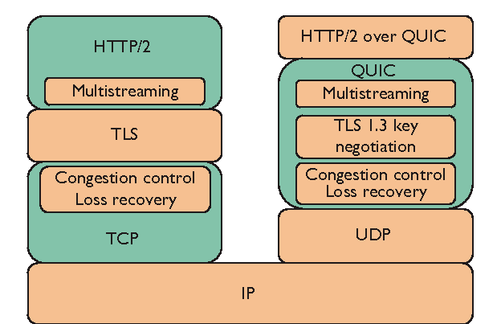
  - 一、QUIC 如何解决TCP的队头阻塞问题？
    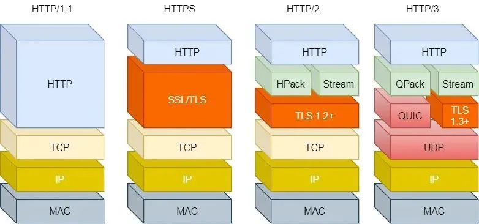
    - 1.1 TCP 为何会有队头阻塞问题
      - TCP 采用ACK确认和超时重传机制来保证数据包的可靠交付
      - 逐个发送数据包，等待确认应答到来后再发送下一个数据包，效率太低了，TCP 采用滑动窗口机制来提高数据传输效率
      - TCP 因为超时确认或丢包引起的滑动窗口阻塞问题
      - HTTP/2 在应用协议层通过多路复用解决了队头阻塞问题(使用Stream ID 来标识当前数据流属于哪个资源请求，这同时也是数据包多路复用传输到接收端后能正常组装的依据)，但TCP 在传输层依然存在队头阻塞问题，这是TCP 协议的一个主要性能瓶颈
    - 1.2 QUIC 如何解决队头阻塞问题
      - TCP 队头阻塞的主要原因是数据包超时确认或丢失阻塞了当前窗口向右滑动，我们最容易想到的解决队头阻塞的方案是不让超时确认或丢失的数据包将当前窗口阻塞在原地
      - QUIC 同样是一个可靠的协议，它使用 Packet Number 代替了 TCP 的 Sequence Number，并且每个 Packet Number 都严格递增，也就是说就算 Packet N 丢失了，重传的 Packet N 的 Packet Number 已经不是 N，而是一个比 N 大的值，比如Packet N+
      - QUIC 支持乱序确认，当数据包Packet N 丢失后，只要有新的已接收数据包确认，当前窗口就会继续向右滑动
      - 重传的数据包Packet N+M 和丢失的数据包Packet N 单靠Stream ID 的比对一致仍然不能判断两个数据包内容一致，还需要再新增一个字段Stream Offset，标识当前数据包在当前Stream ID 中的字节偏移量。有了Stream Offset 字段信息，属于同一个Stream ID 的数据包也可以乱序传输了
      - 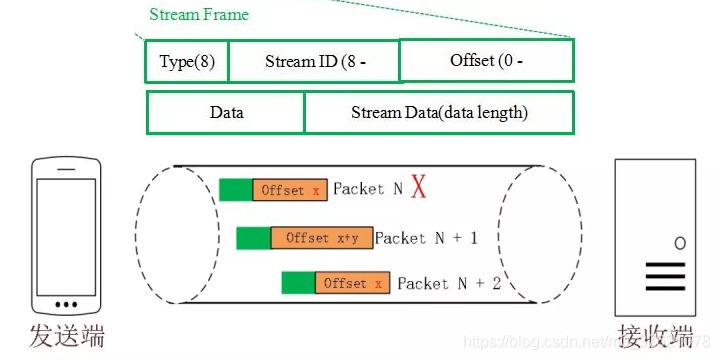
      - QUIC 通过单向递增的Packet Number，配合Stream ID 与 Offset 字段信息，可以支持非连续确认应答Ack而不影响数据包的正确组装，摆脱了TCP 必须按顺序确认应答Ack 的限制（也即不能出现非连续的空位），解决了TCP 因某个数据包重传而阻塞后续所有待发送数据包的问题（也即队头阻塞问题）
    - 1.3 QUIC 没有队头阻塞的多路复用
      - 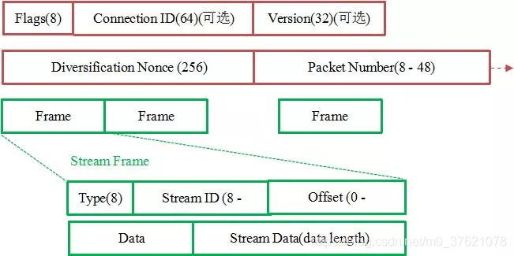
      - 同一个Connection ID 可以同时传输多个Stream ID，由于QUIC 支持非连续的Packet Number 确认，某个Packet N 超时确认或丢失，不会影响其它未包含在该数据包中的Stream Frame 的正常传输。
      - HTTP/2 中如果TCP 出现丢包，TLS 也会因接收到的数据不完整而无法对其进行处理，也即HTTP/2 中的TLS 协议层也存在队头阻塞问题，该问题如何解决呢？
      - 既然TLS 协议是因为接收数据不完整引起的阻塞，我们只需要让TLS 加密认证过程基于一个独立的Packet，不对多个Packet 同时进行加密认证，就能解决TLS 协议层出现的队头阻塞问题
  - 二、QUIC 如何优化TCP 的连接管理机制？
    - 2.1 TCP连接的本质是什么
      - TCP 连接主要是双方记录并同步维护的状态组成的。一般来说，建立连接是为了维护前后分组数据的承继关系，维护前后承继关系最常用的方法就是对其进行状态记录和管理。
      - TCP 的状态管理可以分为连接状态管理和分组数据状态管理两种，连接状态管理用于双方同步数据发送与接收状态，分组数据状态管理用于保证数据的可靠传输。
    - 2.2 QUIC 如何减少TCP 建立连接的开销
      - 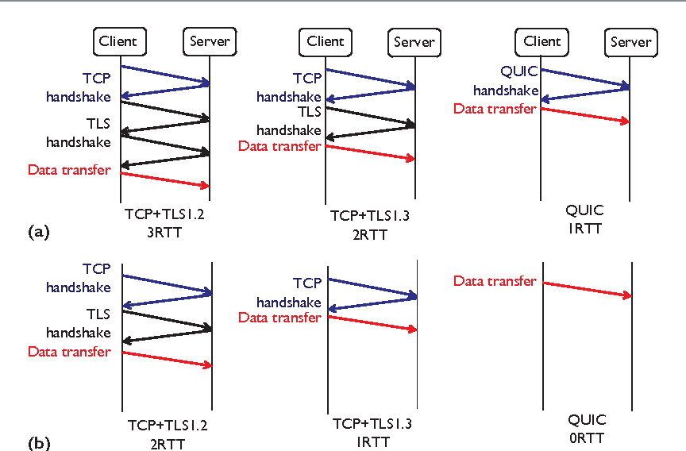
      - TCP 建立连接需要三次握手过程，第三次握手报文发出后不需要等待应答回复就可以发送数据报文了，所以TCP 建立连接的开销为 1-RTT
      - TLS 简短握手过程是将之前完整握手过程协商的信息记录下来，以Session Ticket 的形式传输给客户端，如果想恢复之前的会话连接，可以将Session Ticket 发送给服务器，就能通过简短的握手过程重建或者恢复之前的连接，通过复用之前的握手信息可以节省 1-RTT 的连接建立开销
      - TCP 也提供了快速建立连接的方案 TFO (TCP Fast Open)，原理跟TLS 类似，也是将首次建立连接的状态信息记录下来，以Cookie 的形式传输给客户端，如果想复用之前的连接，可以将Cookie 发送给服务器，如果服务器通过验证就能快速恢复之前的连接，TFO 技术可以通过复用之前的连接将连接建立开销缩短为 0-RTT
      - QUIC 可以理解为”TCP + TLS 1.3“（QUIC 是基于UDP的，可能使用的是DTLS 1.3），QUIC 自然也实现了首次建立连接的开销为 1-RTT，快速恢复先前连接的开销为 0-RTT 的效率。
    - 2.3 QUIC 如何实现连接的无感迁移
      - 每个网络连接都应该有一个唯一的标识，用来辨识并区分特定的连接。TCP 连接使用<Source IP, Source Port, Target IP, Target Port> 这四个信息共同标识
      - QUIC 数据包结构中有一个Connection ID 字段专门标识连接，Connection ID 是一个64位的通用唯一标识UUID (Universally Unique IDentifier)。借助Connection ID，QUIC 的连接不再绑定IP 与 Port 信息，即便因为网络迁移或切换导致Source IP 和Source Port 发生变化，只要Connection ID 不变就仍是同一个连接
  - 三、QUIC 如何改进TCP 的拥塞控制机制？
    - 3.1 TCP 拥塞控制机制的瓶颈在哪？
      - 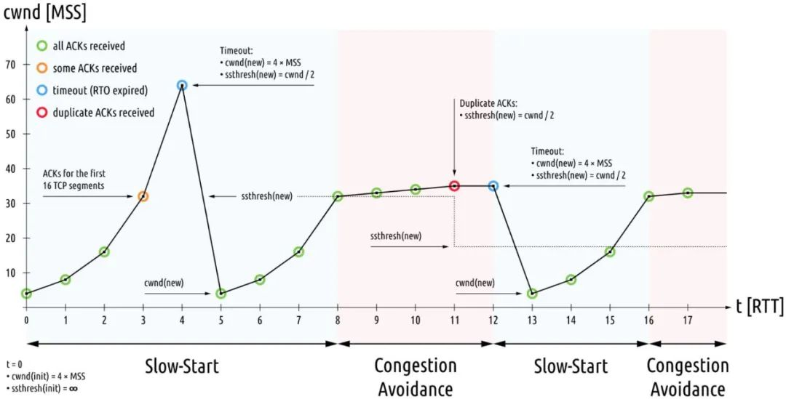
      - 一个是目前接收窗口的大小，通过接收端的实际接收能力来控制发送速率的机制称为流量控制机制；
      - 另一个是目前拥塞窗口的大小，通过慢启动和拥塞避免算法来控制发送速率的机制称为拥塞控制机制，TCP 发送窗口大小被限制为不超过接收窗口和拥塞窗口的较小值。
    - 3.2 QUIC 如何降低重传概率
      - QUIC 采用单向递增的Packet Number 来标识数据包，原始请求的数据包与重传请求的数据包编号并不一样，自然也就不会引起重传的歧义性，采样RTT 的测量更准确
      - 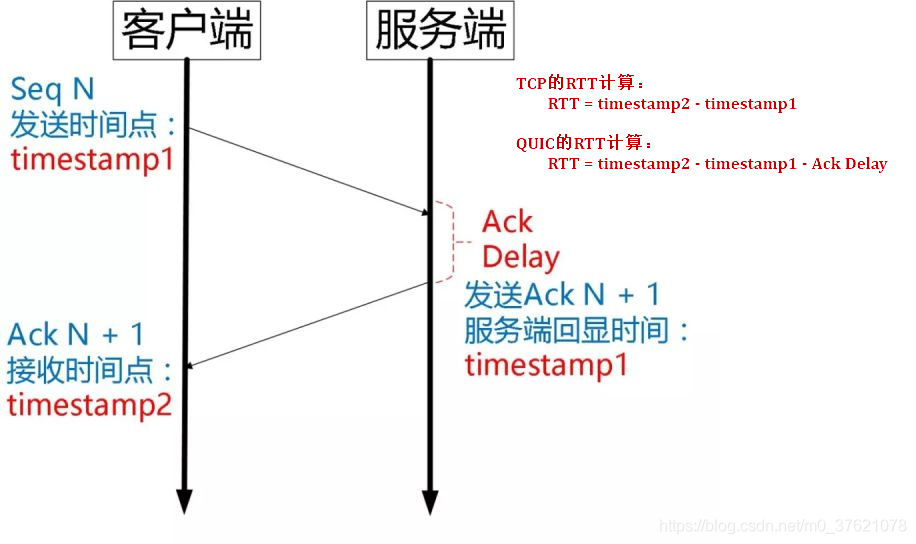
      - QUIC 计算RTT 时除去了接收端的应答延迟时间，更准确的反映了网络往返时间，进一步提高了RTT 测量的准确性，降低了数据包超时重传的概率
      - QUIC 引入了前向冗余纠错码（FEC: Fowrard Error Correcting），如果接收端出现少量（不超过FEC的纠错能力）的丢包或错包，可以借助冗余纠错码恢复丢失或损坏的数据包，这就不需要再重传该数据包了，降低了丢包重传概率，自然就减少了拥塞控制机制的触发次数，可以维持较高的网络利用效率。
    - 3.3 QUIC 如何改进拥塞控制机制
      - TCP 的拥塞控制实际上包含了四个算法：慢启动、拥塞避免、快速重传、快速恢复. 由于TCP 内置于操作系统，拥塞控制算法的更新速度太过缓慢，跟不上网络环境改善速度，TCP 落后的拥塞控制算法自然会降低网络利用效率
      - QUIC 协议当前默认使用了 TCP 的 Cubic 拥塞控制算法，同时也支持 CubicBytes、Reno、RenoBytes、[BBR](https://mp.weixin.qq.com/s?__biz=MzkyMTIzMTkzNA==&mid=2247540557&idx=1&sn=958c13feee4aa384cdac8435eff55c5e&chksm=c184a81cf6f3210a7c3f309d054592e99a2845e9cf93f58aeefa58001304c7c0268283da684d&scene=21#wechat_redirect)、PCC 等拥塞控制算法
      - QUIC 是处于应用层的，可以随浏览器更新，QUIC 的拥塞控制算法就可以有较快的迭代速度，在TCP 的拥塞控制算法基础上快速迭代，可以跟上网络环境改善的速度，尽快提高拥塞恢复的效率。
- [如何用 UDP 实现可靠传输 QUIC](https://mp.weixin.qq.com/s/7sv34Vtueo-dvzjDimP_ZQ)
  - TCP 协议四个方面的缺陷：
    - 升级 TCP 的工作很困难；
      -  TCP 协议是在内核中实现的，应用程序只能使用不能修改，如果要想升级 TCP 协议，那么只能升级内核
    - TCP 建立连接的延迟；
      - 对于 HTTP/1 和 HTTP/2 协议，TCP 和 TLS 是分层的，分别属于内核实现的传输层、openssl 库实现的表示层，因此它们难以合并在一起，需要分批次来握手，先 TCP 握手（1RTT），再 TLS 握手（2RTT），所以需要 3RTT 的延迟才能传输数据，就算 Session 会话服用，也需要至少 2 个 RTT，这在一定程序上增加了数据传输的延迟
      - HTTP/3 在传输数据前虽然需要 QUIC 协议握手，这个握手过程只需要 1 RTT，握手的目的是为确认双方的「连接 ID」，连接迁移就是基于连接 ID 实现的。
      - HTTP/3 的 QUIC 协议并不是与 TLS 分层，因为 QUIC 也是应用层实现的协议，所以可以将 QUIC 和 TLS 协议握手的过程合并在一起，QUIC 内部包含了 TLS，它在自己的帧会携带 TLS 里的“记录”，再加上 QUIC 使用的是 TLS1.3，因此仅需 1 个 RTT 就可以「同时」完成建立连接与密钥协商
      - 
    - TCP 存在队头阻塞问题
    - 网络迁移需要重新建立 TCP 连接
      - 当移动设备的网络从 4G 切换到 WIFI 时，意味着 IP 地址变化了，那么就必须要断开连接，然后重新建立 TCP 连接。
      - QUIC 协议没有用四元组的方式来“绑定”连接，而是通过连接 ID来标记通信的两个端点，客户端和服务器可以各自选择一组 ID 来标记自己，因此即使移动设备的网络变化后，导致 IP 地址变化了，只要仍保有上下文信息（比如连接 ID、TLS 密钥等），就可以“无缝”地复用原连接，消除重连的成本，没有丝毫卡顿感，达到了连接迁移的功能。
  - QUIC 是如何实现可靠传输的？
    - Header Overview
      - 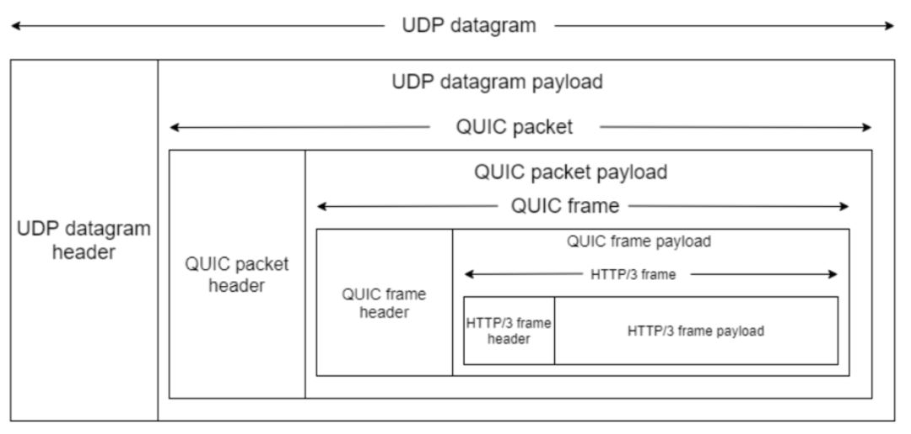
    - Packet Header
      - 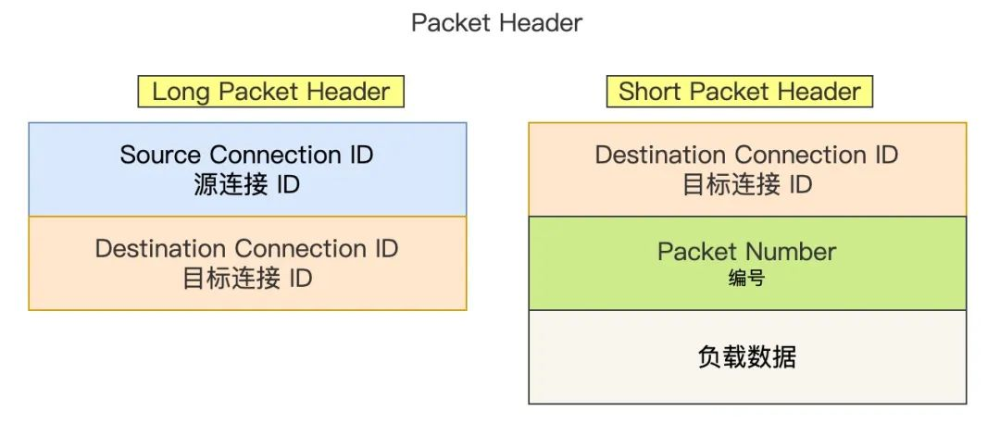
      - Packet Header 首次建立连接时和日常传输数据时使用的 Header 是不同的
        - Long Packet Header 用于首次建立连接。
          - QUIC 也是需要三次握手来建立连接的，主要目的是为了确定连接 ID
          - 建立连接时，连接 ID 是由服务器根据客户端的 Source Connection ID 字段生成的，这样后续传输时，双方只需要固定住 Destination Connection ID（连接 ID ），从而实现连接迁移功能。
        - Short Packet Header 用于日常传输数据。
          - Short Packet Header 中的 Packet Number 是每个报文独一无二的编号，它是严格递增的，也就是说就算 Packet N 丢失了，重传的 Packet N 的 Packet Number 已经不是 N，而是一个比 N 大的值。
          - 为什么要这么设计呢？
            - TCP 在重传报文时的序列号和原始报文的序列号是一样的，也正是由于这个特性，引入了 TCP 重传的歧义问题. 导致RTT 计算不精确，那么 RTO （超时时间）也就不精确
              - 可以更加精确计算 RTT，没有 TCP 重传的歧义性问题
            - QUIC 使用的 Packet Number 单调递增的设计，可以让数据包不再像TCP 那样必须有序确认，QUIC 支持乱序确认，当数据包Packet N 丢失后，只要有新的已接收数据包确认，当前窗口就会继续向右滑动
              - 可以支持乱序确认，防止因为丢包重传将当前窗口阻塞在原地，而 TCP 必须是顺序确认的，丢包时会导致窗口不滑动；就不会因为丢包重传将当前窗口阻塞在原地，从而解决了队头阻塞问题。
    - QUIC Frame Header
      - 一个 Packet 报文中可以存放多个 QUIC Frame。
      - 每一个 Frame 都有明确的类型，针对类型的不同，功能也不同
        - 举例  Stream 类型的 Frame 格式，Stream 可以认为就是一条 HTTP 请求
        - Stream ID 作用：多个并发传输的 HTTP 消息，通过不同的 Stream ID 加以区别；
        - Offset 作用：类似于 TCP 协议中的 Seq 序号，保证数据的顺序性和可靠性；
      - Packet Number 是严格递增，即使重传报文的 Packet Number 也是递增的，既然重传数据包的 Packet N+M 与丢失数据包的 Packet N 编号并不一致，我们怎么确定这两个数据包的内容一样呢？
        - 所以引入 Frame Header 这一层，通过 Stream ID + Offset 字段信息实现数据的有序性，通过比较两个数据包的 Stream ID 与 Stream Offset ，如果都是一致，就说明这两个数据包的内容一致。
      - QUIC 通过单向递增的 Packet Number，配合 Stream ID 与 Offset 字段信息，可以支持乱序确认而不影响数据包的正确组装，摆脱了TCP 必须按顺序确认应答 ACK 的限制，解决了 TCP 因某个数据包重传而阻塞后续所有待发送数据包的问题。
  - QUIC 是如何解决 TCP 队头阻塞问题的
    - 什么是 TCP 队头阻塞问题
      - TCP 队头阻塞的问题要从两个角度看，一个是发送窗口的队头阻塞，另外一个是接收窗口的队头阻塞。
      - TCP 层为了保证数据的有序性，只有在处理完有序的数据后，滑动窗口才能往前滑动，否则就停留。
    - HTTP/2 的队头阻塞
      - HTTP/2 通过抽象出 Stream 的概念，实现了 HTTP 并发传输，一个 Stream 就代表 HTTP/1.1 里的请求和响应。
      - 在 HTTP/2 连接上，不同 Stream 的帧是可以乱序发送的（因此可以并发不同的 Stream ），因为每个帧的头部会携带 Stream ID 信息，所以接收端可以通过 Stream ID 有序组装成 HTTP 消息，而同一 Stream 内部的帧必须是严格有序的
      - 但是 HTTP/2 多个 Stream 请求都是在一条 TCP 连接上传输，这意味着多个 Stream 共用同一个 TCP 滑动窗口，那么当发生数据丢失，滑动窗口是无法往前移动的，此时就会阻塞住所有的 HTTP 请求，这属于 TCP 层队头阻塞。
    - 没有队头阻塞的 QUIC
      - QUIC 也借鉴 HTTP/2 里的 Stream 的概念，在一条 QUIC 连接上可以并发发送多个 HTTP 请求 (Stream)
      - QUIC 给每一个 Stream 都分配了一个独立的滑动窗口，这样使得一个连接上的多个 Stream 之间没有依赖关系，都是相互独立的，各自控制的滑动窗口
  - QUIC 是如何做流量控制的
    - TCP 流量控制
      - 通过让「接收方」告诉「发送方」，它（接收方）的接收窗口有多大，从而让「发送方」根据「接收方」的实际接收能力控制发送的数据量
      - TCP 的接收窗口在收到有序的数据后，接收窗口才能往前滑动，否则停止滑动；TCP 的发送窗口在收到对已发送数据的顺序确认 ACK后，发送窗口才能往前滑动，否则停止滑动。
    - QUIC 实现了两种级别的流量控制，分别为 Stream 和 Connection 两种级别：
      - Stream 级别的流量控制：每个 Stream 都有独立的滑动窗口，所以每个 Stream 都可以做流量控制，防止单个 Stream 消耗连接（Connection）的全部接收缓冲。
        - QUIC 协议中同一个 Stream 内，滑动窗口的移动仅取决于接收到的最大字节偏移（尽管期间可能有部分数据未被接收），而对于 TCP 而言，窗口滑动必须保证此前的 packet 都有序的接收到了，其中一个 packet 丢失就会导致窗口等待。
      - Connection 流量控制：限制连接中所有 Stream 相加起来的总字节数，防止发送方超过连接的缓冲容量。
  - QUIC 对拥塞控制改进
    - QUIC 协议当前默认使用了 TCP 的 Cubic 拥塞控制算法（我们熟知的慢开始、拥塞避免、快重传、快恢复策略），同时也支持 CubicBytes、Reno、RenoBytes、BBR、PCC 等拥塞控制算法，相当于将 TCP 的拥塞控制算法照搬过来了
    - QUIC 是处于应用层的，应用程序层面就能实现不同的拥塞控制算法，不需要操作系统，不需要内核支持. QUIC 可以随浏览器更新，QUIC 的拥塞控制算法就可以有较快的迭代速度。
    - QUIC 处于应用层，所以就可以针对不同的应用设置不同的拥塞控制算法，这样灵活性就很高了
  - QUIC 更快的连接建立
    - 对于 HTTP/1 和 HTTP/2 协议，TCP 和 TLS 是分层的，分别属于内核实现的传输层、openssl 库实现的表示层，因此它们难以合并在一起，需要分批次来握手，先 TCP 握手（1RTT），再 TLS 握手（2RTT），所以需要 3RTT 的延迟才能传输数据，就算 Session 会话服用，也需要至少 2 个 RTT。
    - HTTP/3 在传输数据前虽然需要 QUIC 协议握手，这个握手过程只需要 1 RTT，握手的目的是为确认双方的「连接 ID」，连接迁移就是基于连接 ID 实现的
    - 但是 HTTP/3 的 QUIC 协议并不是与 TLS 分层，而是QUIC 内部包含了 TLS，它在自己的帧会携带 TLS 里的“记录”，再加上 QUIC 使用的是 TLS1.3，因此仅需 1 个 RTT 就可以「同时」完成建立连接与密钥协商，甚至在第二次连接的时候，应用数据包可以和 QUIC 握手信息（连接信息 + TLS 信息）一起发送，达到 0-RTT 的效果。
  - QUIC 是如何迁移连接的
    - 基于 TCP 传输协议的 HTTP 协议，由于是通过四元组（源 IP、源端口、目的 IP、目的端口）确定一条 TCP 连接
    - QUIC 协议没有用四元组的方式来“绑定”连接，而是通过连接 ID来标记通信的两个端点，客户端和服务器可以各自选择一组 ID 来标记自己，因此即使移动设备的网络变化后，导致 IP 地址变化了，只要仍保有上下文信息（比如连接 ID、TLS 密钥等），就可以“无缝”地复用原连接，消除重连的成本，没有丝毫卡顿感，达到了连接迁移的功能。
  - 挑战
    - QUIC 基于 UDP 协议在用户空间实现的可靠传输协议，如果一些网络设备无法识别出 QUIC 协议，那么在这些网络设备的眼里它就是一个 UDP 协议。
    - 几乎所有的电信运营商都会“歧视” UDP 数据包，原因也很容易理解，毕竟历史上几次臭名昭著的 DDoS 攻击都是基于 UDP 的。国内某城宽带在某些区域更是直接禁止了非 53 端口的UDP数据包，而其他运营商即使没有封禁 UDP，也是对 UDP 进行严格限流的。
- [服务端不想接收 http 的 body 的时候，该怎么优雅的拒绝呢](https://mp.weixin.qq.com/s/J1vcjMdnbFY-jPP5KoiwLw)
  - 为什么会出现服务端不想接收客户端的 body
    - S3 服务的鉴权可以放在 header 里，数据放在 body 里。如果客户端的参数鉴权不过，或者参数非法。这种的请求服务端根本不想多看 body 一眼
  - 什么叫做优雅的拒绝
    - 优雅指的是，客户端发请求数据的过程不会有任何异常，服务端回响应的过程也不会有任何异常
    - 最常见的异常：
      - 客户端发数据的时候，发现连接已经不在，那么就会导致服务端发送 Reset 包给客户端。客户端的感知就会出现 write broken，connection close by peer 等等异常。
      - 服务端收数据的时候，还没收够呢，就读到 EOF，这种体现的就是 Unexpected EOF ；
  - 怎么解决呢
    - TCP 层（ socket ）能解决 ：使用 linger close 的特性
      - `setsockopt(fd, SOL_SOCKET, SO_LINGER, (void *)&st_linger, &sizeof(st_linger));`
      - Linux 操作系统就提供了一个叫做延迟关闭的特性。当调用 close() 来关闭一个 TCP 连接的时候，如果 socket fd 设置了 linger close 的特性，那么这条 TCP 连接并不会立即关闭连接，内核会延迟一段时间。会继续读 TCP 连接里的数据，直到读完或者超时时间到了之后。
    - http 协议层解决：使用 100 continue 特性
      - 就是在发送 body 之前，再加一个协商的确认，服务端确认会处理这个 body，客户端才发送。这样就不存在 body 发送了又被拒绝的问题了
      - 100-continue 有两个局限性：
        - 小请求会带来很大的开销，之前只需要交互 1 次即可。加入了 100-continue 机制，那么一定会放大成 2 次。开销翻倍。
        - 并不是所有的 server 支持 100-continue 协议，这个对服务端来说是非强制的。
    - 业务层自己解决：比如 S3 服务端，自己掏空 body ，再断开连接
      - 原理很简单：数据你可以不存，但是不能不读 `_, err := io.CopyN(ioutil.Discard, w.reqBody, maxPostHandlerReadBytes+1)`
      - 但要考量几个因素：
        - 难道客户端发 10G 的数据在路上，我也要读完？ - 读的数据量有约束，比如不超过 1M
        - 难道客户端发 24 个小时都发不完的数据，我也要读完？ - 读的时间有约束，比如不超过 30 秒 
  - 来看看 nginx 的实现
    - 不是使用操作系统 socket 的 linger close ，而是 nginx 自己实现的，nginx 自己掏的数据。lingering_close 有三个选项。
      ```shell
      // 默认行为。试着读完剩余的数据。
      lingering_close on
      // 不管三七二十一，总是要掏空连接的数据
      lingering_close always
      // 关闭延迟关闭的特性
      lingering_close off
      ```
    - 还有另外两个跟时间相关的开关：
      - lingering_time ：请求关闭的时间超过一个阈值，那么无论还有没有数据，都要关闭；
      - lingering_timeout ：一段时间内，一点数据都没有？那关闭连接
- [剖析HTTP3协议](https://zhuanlan.zhihu.com/p/431672713?utm_source=wechat_session&utm_medium=social&utm_oi=33332939194368&utm_campaign=shareopn&wechatShare=2&s_r=0)
  - HTTP3协议解决了HTTP2问题
    - 基于TCP实现的HTTP2遗留下3个问题
      - 有序字节流引出的队头阻塞（Head-of-line blocking），使得HTTP2的多路复用能力大打折扣；
      - TCP与TLS叠加了握手时延，建链时长还有1倍的下降空间；
      - 基于TCP四元组确定一个连接，这种诞生于有线网络的设计，并不适合移动状态下的无线网络，这意味着IP地址的频繁变动会导致TCP连接、TLS会话反复握手，成本高昂
    - HTTP3协议解决了这些问题
      - HTTP3基于UDP协议重新定义了连接，在QUIC层实现了无序、并发字节流的传输，解决了队头阻塞问题（包括基于QPACK解决了动态表的队头阻塞）；
      - HTTP3重新定义了TLS协议加密QUIC头部的方式，既提高了网络攻击成本，又降低了建立连接的速度（仅需1个RTT就可以同时完成建链与密钥协商）；
      - HTTP3 将Packet、QUIC Frame、HTTP3 Frame分离，实现了连接迁移功能，降低了5G环境下高速移动设备的连接维护成本。
  - HTTP3协议到底是什么
    - QUIC层由 https://tools.ietf.org/html/draft-ietf-quic-transport-29描述，它定义了连接、报文的可靠传输、有序字节流的实现；
    - TLS协议会将QUIC层的部分报文头部暴露在明文中，方便代理服务器进行路由。https://tools.ietf.org/html/draft-ietf-quic-tls-29规范定义了QUIC与TLS的结合方式；
    - 丢包检测、RTO重传定时器预估等功能由 https://tools.ietf.org/html/draft-ietf-quic-recovery-29定义，目前拥塞控制使用了类似TCP New RENO的算法，未来有可能更换为基于带宽检测的算法（例如BBR）；
    - 在HTTP2中，由HPACK规范定义HTTP头部的压缩算法。由于HPACK动态表的更新具有时序性，无法满足HTTP3的要求。在HTTP3中，QPACK定义HTTP头部的编码：https://tools.ietf.org/html/draft-ietf-quic-qpack-16。
  - 连接迁移功能是怎样实现的
    - 对于当下的HTTP1和HTTP2协议，传输请求前需要先完成耗时1个RTT的TCP三次握手、耗时1个RTT的TLS握手（TLS1.3），由于它们分属内核实现的传输层、openssl库实现的表示层，所以难以合并在一起
    - 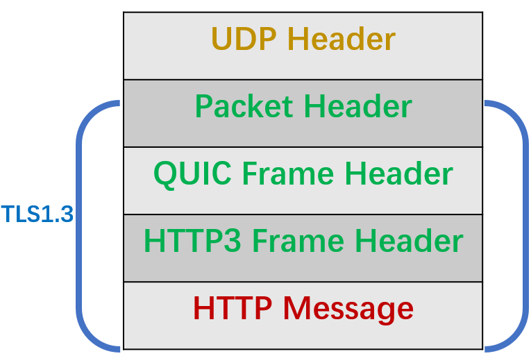
      - Packet Header实现了可靠的连接。当UDP报文丢失后，通过Packet Header中的Packet Number实现报文重传。连接也是通过其中的Connection ID字段定义的；
        - 为了进一步提升网络传输效率，Packet Header又可以细分为两种：
        - Long Packet Header用于首次建立连接；
          - 建立连接时，连接是由服务器通过Source Connection ID字段分配的，这样，后续传输时，双方只需要固定住Destination Connection ID，就可以在客户端IP地址、端口变化后，绕过UDP四元组（与TCP四元组相同），实现连接迁移功能。
        - Short Packet Header用于日常传输数据
          - 不再需要传输Source Connection ID字段了
          - Packet Number是每个报文独一无二的序号，基于它可以实现丢失报文的精准重发。如果你通过抓包观察Packet Header，会发现Packet Number被TLS层加密保护了，这是为了防范各类网络攻击的一种设计
      - QUIC Frame Header在无序的Packet报文中，基于QUIC Stream概念实现了有序的字节流，这允许HTTP消息可以像在TCP连接上一样传输；
      - HTTP3 Frame Header定义了HTTP Header、Body的格式，以及服务器推送、QPACK编解码流等功能。
  - Stream多路复用时的队头阻塞是怎样解决的
    - 解决队头阻塞的方案，就是允许微观上有序发出的Packet报文，在接收端无序到达后也可以应用于并发请求中
    - 在Packet Header之上的QUIC Frame Header，定义了有序字节流Stream，而且Stream之间可以实现真正的并发。每个Stream就像HTTP1中的TCP连接，它保证了承载的HEADERS frame（存放HTTP Header）、DATA frame（存放HTTP Body）是有序到达的，多个Stream之间可以并行传输
    - 一个Packet报文中可以存放多个QUIC Frame，当然所有Frame的长度之和不能大于PMTUD（Path Maximum Transmission Unit Discovery，这是大于1200字节的值
    - Stream Frame头部的3个字段，完成了多路复用、有序字节流以及报文段层面的二进制分隔功能，包括：
      - Stream ID标识了一个有序字节流。当HTTP Body非常大，需要跨越多个Packet时，只要在每个Stream Frame中含有同样的Stream ID，就可以传输任意长度的消息。多个并发传输的HTTP消息，通过不同的Stream ID加以区别；
      - 消息序列化后的“有序”特性，是通过Offset字段完成的，它类似于TCP协议中的Sequence序号，用于实现Stream内多个Frame间的累计确认功能；
      - Length指明了Frame数据的长度。
  - QPACK编码是如何解决队头阻塞问题的
    - 与HTTP2中的HPACK编码方式相似，HTTP3中的QPACK也采用了静态表、动态表及Huffman编码
    - 动态表，就是将未包含在静态表中的Header项，在其首次出现时加入动态表，这样后续传输时仅用1个数字表示，大大提升了编码效率。因此，动态表是天然具备时序性的，如果首次出现的请求出现了丢包，后续请求解码HPACK头部时，一定会被阻塞！
    - QPACK是如何解决队头阻塞问题的呢？事实上，QPACK将动态表的编码、解码独立在单向Stream中传输，仅当单向Stream中的动态表编码成功后，接收端才能解码双向Stream上HTTP消息里的动态表索引。
    - 当Stream ID是0、4、8、12时，这就是客户端发起的双向Stream（HTTP3不支持服务器发起双向Stream），它用于传输HTTP请求与响应
    - 由于HTTP3的STREAM之间是乱序传输的，因此，若先发送的编码Stream后到达，双向Stream中的QPACK头部就无法解码，此时传输HTTP消息的双向Stream就会进入Block阻塞状态（两端可以通过控制帧定义阻塞Stream的处理方式）。
- [深入理解HTTP/3协议](https://mp.weixin.qq.com/s/RX_dMXMfv7NMZMroCz49tA)
  - HTTP History
    - 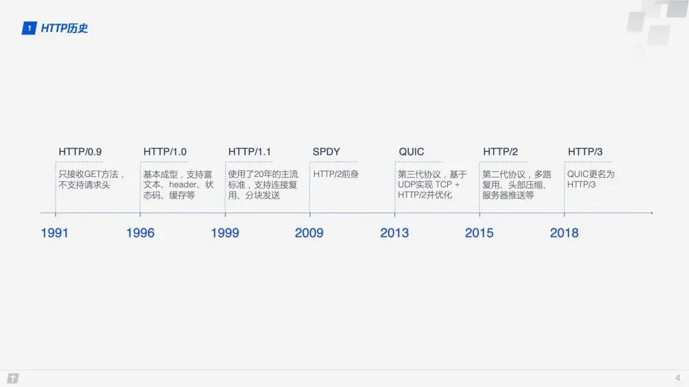
    - HTTP2协议虽然大幅提升了HTTP/1.1的性能，然而，基于TCP实现的HTTP2遗留下3个问题：
      - 有序字节流引出的队头阻塞（Head-of-line blocking），使得HTTP2的多路复用能力大打折扣；
      - TCP与TLS叠加了握手时延，建链时长还有1倍的下降空间；
      - 基于TCP四元组确定一个连接，这种诞生于有线网络的设计，并不适合移动状态下的无线网络，这意味着IP地址的频繁变动会导致TCP连接、TLS会话反复握手，成本高昂。
    - HTTP3协议解决了这些问题：
      - HTTP3基于UDP协议重新定义了连接，在QUIC层实现了无序、并发字节流的传输，解决了队头阻塞问题（包括基于QPACK解决了动态表的队头阻塞）；
      - HTTP3重新定义了TLS协议加密QUIC头部的方式，既提高了网络攻击成本，又降低了建立连接的速度（仅需1个RTT就可以同时完成建链与密钥协商）；
      - HTTP3 将Packet、QUIC Frame、HTTP3 Frame分离，实现了连接迁移功能，降低了5G环境下高速移动设备的连接维护成本。
  - QUIC 协议
    - 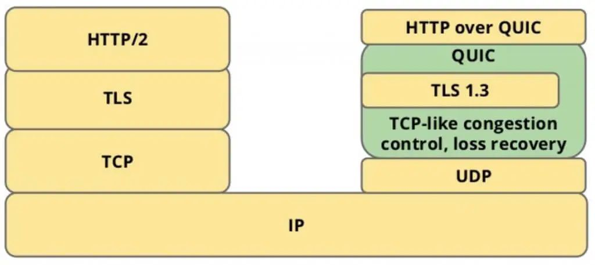
    - QUIC是用来替代TCP, SSL/TLS的传输层协议. HTTP over QUIC即HTTP/3的含义
    - 0 RTT建立连接
      - HTTP/2的连接
        - HTTP/2的连接建立需要3 RTT, 如果考虑会话复用, 即把第一次握手计算出来的对称密钥缓存起来, 那也需要2 RTT. 
        - 更进一步的, 如果TLS升级到1.3, 那么HTTP/2连接需要2RTT, 考虑会话复用需要1RTT. 
      - HTTP/3首次连接只需要1RTT, 后面的链接只需要0RTT
    - 连接迁移
      - QUIC不以四元素作为表示, 而是使用一个64位的随机数, 这个随机数被称为Connection ID, 即使IP或者端口发生变化, 只要Connection ID没有变化, 那么连接依然可以维持.
    - 队头阻塞/多路复用
      - HTTP/1.1和HTTP/2都存在队头阻塞的问题(Head Of Line blocking)
        - 一个TCP连接同时传输10个请求, 其中1,2,3个请求给客户端接收, 但是第四个请求丢失, 那么后面第5-10个请求都被阻塞. 需要等第四个请求处理完毕后才能被处理. 这样就浪费了带宽资源.
      - HTTP/2
        - HTTP/2的多路复用解决了上述的队头阻塞问题. 在HTTP/2中, 每个请求都被拆分为多个Frame通过一条TCP连接同时被传输, 这样即使一个请求被阻塞, 也不会影响其他的请求.
        - 但HTTP/2的基础TCP协议本身却也存在队头阻塞的问题.
          - HTTP/2的每个请求都会被拆分成多个Frame, 不同请求的Frame组合成Stream, Stream是TCP上的逻辑传输单元, 这样HTTP/2就达到了一条连接同时发送多个请求的目标, 其中Stram1已经正确送达, Stram2中的第三个Frame丢失, TCP处理数据是有严格的前后顺序, 先发送的Frame要先被处理, 这样就会要求发送方重新发送第三个Frame, Steam3和Steam4虽然已到达但却不能被处理, 那么这时整条链路都会被阻塞.
        - 由于HTTP/2必须使用HTTPS, 而HTTPS使用TLS协议也存在队头阻塞问题. 
          - TLS基于Record组织数据, 将一对数据放在一起加密, 加密完成后又拆分成多个TCP包传输. 一般每个Record 16K, 包含12个TCP包, 这样如果12个TCP包中有任何一个包丢失, 那么整个Record都无法解密.
        - 队头阻塞会导致HTTP/2在更容易丢包的弱网络环境下比HTTP/1.1更慢.
      - QUIC
        - QUIC是如何解决队头阻塞的问题的? 主要有两点:
          - QUIC的传输单位是Packet, 加密单元也是Packet, 整个加密, 传输, 解密都基于Packet, 这就能避免TLS的阻塞问题.
          - QUIC基于UDP, UDP的数据包在接收端没有处理顺序, 即使中间丢失一个包, 也不会阻塞整条连接. 其他的资源会被正常处理.
    - 拥塞控制
      - QUIC重新实现了TCP协议中的Cubic算法进行拥塞控制
        - 热插拔
          - QUIC修改拥塞控制策略只需要在应用层操作, 并且QUIC会根据不同的网络环境, 用户来动态选择拥塞控制算法.
        - 前向纠错 FEC
          - 一段数据被切分为10个包后, 一次对每个包进行异或运算, 运算结果会作为FEC包与数据包一起被传输, 如果传输过程中有一个数据包丢失, 那么就可以根据剩余9个包以及FEC包推算出丢失的那个包的数据, 这样就大大增加了协议的容错性.
        - 单调递增的Packer Number
          - TCP为了保证可靠性, 使用Sequence Number和ACK来确认消息是否有序到达, 但这样的设计存在缺陷.
            - 超时发生后客户端发起重传, 后来接受到了ACK确认消息, 但因为原始请求和重传请求接受到的ACK消息一样, 所以客户端就不知道这个ACK对应的是原始请求还是重传请求. 这就会造成歧义. RTT and RTO
          - Packet Number严格单调递增, 如果Packet N丢失了, 那么重传时Packet的标识就不会是N, 而是比N大的数字, 比如N+M, 这样发送方接收到确认消息时, 就能方便的知道ACK对应的原始请求还是重传请求.
        - ACK Delay
          - TCP计算RTT时没有考虑接收方接受到数据发发送方确认消息之间的延迟, 如下图所示, 这段延迟即ACK Delay. 
          - QUIC考虑了这段延迟, 使得RTT的计算更加准确.
    - 流量控制
      - TCP 会对每个TCP连接进行流量控制, 流量控制的意思是让发送方不要发送太快, 要让接收方来得及接受, 不然会导致数据溢出而丢失, TCP的流量控制主要通过滑动窗口来实现的. 
        - 拥塞控制主要是控制发送方的发送策略, 但没有考虑接收方的接收能力, 流量控制是对部分能力的不起.
      - QUIC的流量控制有两个级别: 连接级别(Connection Level)和Stream 级别(Stream Level).
        - stream 接收窗口=最大接受窗口 - 已接收数据
        - connection
          接收窗口 = Stream1 接收窗口 + Stream2 接收窗口 + ... + StreamN 接收窗口
- [X.509 Encodings and Conversions](https://www.ssl.com/guide/pem-der-crt-and-cer-x-509-encodings-and-conversions/)
  - The RSA, PKCS#1, SSL and TLS communities use the Distinguished Encoding Rules (DER) encoding of ASN.1 to represent keys and certificates in a portable format.
  - The certificate and key information is stored in the binary DER for ASN.1, and applications providing RSA, SSL and TLS should use DER encoding to parse the data.
  - You may have seen digital certificate files with a variety of filename extensions, such as .crt, .cer, .pem, or .der. These extensions generally map to two major encoding schemes for X.509 certificates and keys: PEM (Base64 ASCII), and DER (binary).
  - PEM
    - PEM (originally “Privacy Enhanced Mail”) is the most common format for X.509 certificates, CSRs, and cryptographic keys. A PEM file is a text file containing one or more items in Base64 ASCII encoding, each with plain-text headers and footers (e.g. -----BEGIN CERTIFICATE----- and -----END CERTIFICATE-----)
    - PEM Filename Extensions - .crt, .pem, .cer, .key (for private keys), and .ca-bundle
    - View contents of PEM certificate file `openssl x509 -in CERTIFICATE.pem -text -noout `
    - Convert PEM certificate to DER `openssl x509 -outform der -in CERTIFICATE.pem -out CERTIFICATE.der`
    - Convert PEM certificate with chain of trust to PKCS#7
      - PKCS#7 (also known as P7B) is a container format for digital certificates that is most often found in Windows and Java server contexts, and usually has the extension .p7b. PKCS#7 files are not used to store private keys. In the example below, -certfile MORE.pem represents a file with chained intermediate and root certificates (such as a .ca-bundle file downloaded from SSL.com).
      - `openssl crl2pkcs7 -nocrl -certfile CERTIFICATE.pem -certfile MORE.pem -out CERTIFICATE.p7b`
    - Convert PEM certificate with chain of trust and private key to PKCS#12
      - PKCS#12 (also known as PKCS12 or PFX) is a common binary format for storing a certificate chain and private key in a single, encryptable file, and usually have the filename extensions .p12 or .pfx. In the example below, -certfile MORE.pem adds a file with chained intermediate and root certificates (such as a .ca-bundle file downloaded from SSL.com), and -inkey PRIVATEKEY.key adds the private key for CERTIFICATE.crt(the end-entity certificate). Please see this how-to for a more detailed explanation of the command shown.
      - `openssl pkcs12 -export -out CERTIFICATE.pfx -inkey PRIVATEKEY.key -in CERTIFICATE.crt -certfile MORE.crt`
  - DER
    - DER (Distinguished Encoding Rules) is a binary encoding for X.509 certificates and private keys. Unlike PEM, DER-encoded files do not contain plain text statements such as -----BEGIN CERTIFICATE-----.
    - DER Filename Extensions - .der and .cer.
    - View contents of DER-encoded certificate file  `openssl x509 -inform der -in CERTIFICATE.der -text -noout`
    - Convert DER-encoded certificate to PEM `openssl x509 -inform der -in CERTIFICATE.der -out CERTIFICATE.pem`
  - 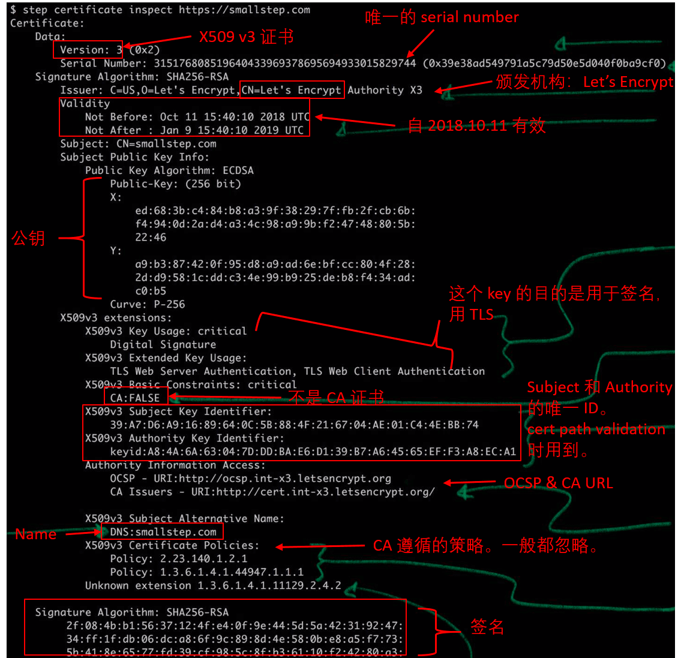
  - [关于证书（certificate）和公钥基础设施（PKI）](https://arthurchiao.art/blog/everything-about-pki-zh/)
  - [Deep Dive into SSL certificates](https://hackernoon.com/deep-dive-into-ssl-certificates)
  - [HTTPS 常见部署问题及解决方案](https://imququ.com/post/troubleshooting-https.html)
    - 浏览器提示证书有错误
      - 检查证书链是否完整
      - 检查浏览器是否支持 SNI
      - 检查系统时间
    - 启用 HTTP/2 后网站无法访问，提示 ERR_SPDY_INADEQUATE_TRANSPORT_SECURITY
      - 这个问题一般是由于 CipherSuite 配置有误造成的。建议对照「Mozilla 的推荐配置、CloudFlare 使用的配置」等权威配置修改 Nginx 的 ssl_ciphers 配置项
    - 网站无法访问，提示 ERR_SSL_VERSION_OR_CIPHER_MISMATCH
      - 出现这种错误，通常都是配置了不安全的 SSL 版本或者 CipherSuite —— 例如服务器只支持 SSLv3，或者 CipherSuite 只配置了 RC4 系列，使用 Chrome 访问就会得到这个提示
    - 
- [TLS 单向和双向认证](https://mp.weixin.qq.com/s/JOpega3ud9P7NDNsGAwCCg)
  - SSL 证书 （也称为 TLS 或 SSL /TLS 证书）是将网站的身份绑定到由公共密钥和私有密钥组成的加密密钥对的数字文档。 证书中包含的公钥允许 Web 浏览器执行以下操作： 通过 TLS 和 HTTPS 协议。 私钥在服务器上保持安全，并用于对网页和其他文档（例如图像和 JavaScript 文件）进行数字签名。
  - 双向 TLS（mTLS)
    - TLS 服务器端提供一个授信证书，当我们使用 https 协议访问服务器端时，客户端会向服务器端索取证书并认证（浏览器会与自己的授信域匹配或弹出不安全的页面）。
    - mTLS 则是由同一个 Root CA 生成两套证书，即客户端证书和服务端证书。客户端使用 https 访问服务端时，双方会交换证书，并进行认证，认证通过方可通信。
  - 证书格式类型
    - .DER .CER，文件是二进制格式，只保存证书，不保存私钥。
    - .PEM，一般是文本格式(Base64 ASCII），可保存证书，可保存私钥。
    - .CRT，可以是二进制格式，可以是文本格式，与 .DER 格式相同，不保存私钥。
    - .PFX .P12，二进制格式，同时包含证书和私钥，一般有密码保护。
    - .JKS，二进制格式，同时包含证书和私钥，一般有密码保护。
  - 证书生成
    ```shell
    # 生成CA的私钥和证书
    echo Generate the ca certificate
    openssl genrsa -out ../certs/ca.key 4096
    openssl req -x509 -sha256 -new -nodes -key ../certs/ca.key -days 3650 -subj "/C=IN/ST=UK/L=Dehradun/O=VMware/CN=Hemant Root CA" -extensions v3_ca -out ../certs/ca.crt
    
    # 生成服务端的私钥和证书
    echo generating server certificate
    openssl genrsa -out ../certs/server.key 2048
    openssl req -new -subj "/C=IN/ST=UK/L=Dehradun/O=VMware/CN=localhost" -key ../certs/server.key -out server_signing_req.csr
    openssl x509 -req -days 365 -in server_signing_req.csr -CA ../certs/ca.crt -CAkey ../certs/ca.key -CAcreateserial -out ../certs/server.crt
    del server_signing_req.csr
    
    # 生成客户端的私钥和证书
    echo generating client certificate
    openssl genrsa -out ../certs/client.key 2048
    openssl req -new -subj "/C=IN/ST=UK/L=Dehradun/O=VMware/CN=localhost" -key ../certs/client.key -out client_signing_req.csr
    openssl x509 -req -days 365 -in client_signing_req.csr -CA ../certs/ca.crt -CAkey ../certs/ca.key -CAcreateserial -out ../certs/client.crt
    rm client_signing_req.csr
    
    # 验证证书
    openssl verify -CAfile ../certs/ca.crt ../certs/server.crt
    openssl verify -CAfile ../certs/ca.crt ../certs/client.crt
    ```
  - 测试证书
    - 连接到远程服务器 `openssl s_client -connect host.docker.internal:8000 -showcerts`
    - 带 CA 证书连接远程服务器 `openssl s_client -connect host.docker.internal:8000 -CAfile ca.crt`
    - 调试远程服务器的 SSL/TLS `openssl s_client -connect host.docker.internal:8000 -tlsextdebug`
    - 模拟的 HTTPS 服务，可以返回 Openssl 相关信息 `openssl s_server -accept 443 -cert server.crt -key server.key -www`
- [HTTPS 一定安全可靠吗](https://mp.weixin.qq.com/s/IYZrtK7pJTeCOBwY-sC9HA)
  - 客户端通过浏览器向服务端发起 HTTPS 请求时，被「假基站」转发到了一个「中间人服务器」，于是客户端是和「中间人服务器」完成了 TLS 握手，然后这个「中间人服务器」再与真正的服务端完成 TLS 握手?
  - 中间人就可以解开浏览器发起的 HTTPS 请求里的数据，也可以解开服务端响应给浏览器的 HTTPS 响应数据。相当于，中间人能够 “偷看” 浏览器与服务端之间的 HTTPS 请求和响应的数据。 但是要发生这种场景是有前提的，前提是用户点击接受了中间人服务器的证书。
  - 客户端是如何验证证书?
    - 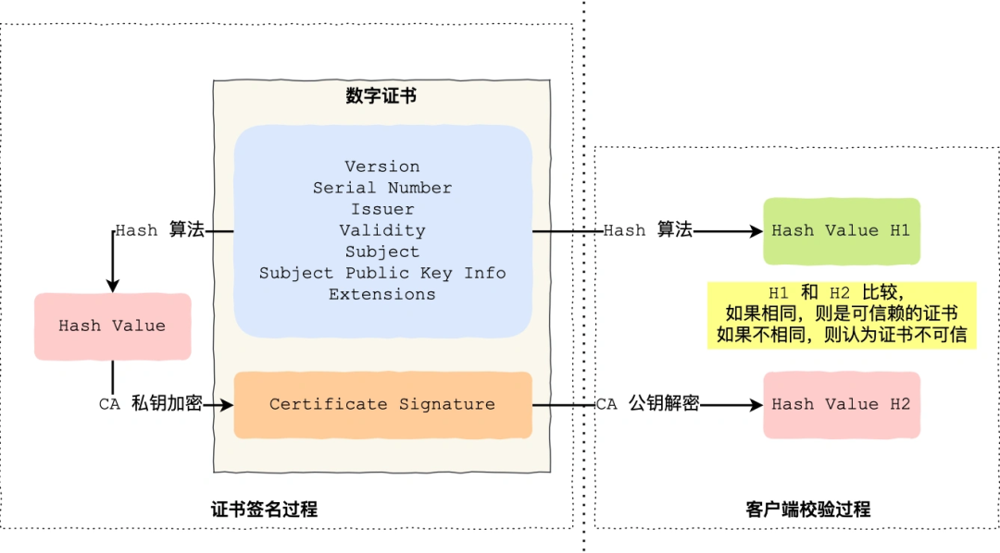
    - 当服务端向 CA 机构申请证书的时候，CA 签发证书的过程，如上图左边部分：
      - 首先 CA 会把持有者的公钥、用途、颁发者、有效时间等信息打成一个包，然后对这些信息进行 Hash 计算，得到一个 Hash 值；
      - 然后 CA 会使用自己的私钥将该 Hash 值加密，生成 Certificate Signature，也就是 CA 对证书做了签名；
      - 最后将 Certificate Signature 添加在文件证书上，形成数字证书；
    - 客户端校验服务端的数字证书的过程，如上图右边部分：
      - 首先客户端会使用同样的 Hash 算法获取该证书的 Hash 值 H1；
      - 通常浏览器和操作系统中集成了 CA 的公钥信息，浏览器收到证书后可以使用 CA 的公钥解密 Certificate Signature 内容，得到一个 Hash 值 H2 ；
      - 最后比较 H1 和 H2，如果值相同，则为可信赖的证书，否则则认为证书不可信。
  - 证书的验证过程中还存在一个证书信任链的问题 因为我们向 CA 申请的证书一般不是根证书签发的，而是由中间证书签发的
  - HTTPS 协议本身到目前为止还是没有任何漏洞的，即使你成功进行中间人攻击，本质上是利用了客户端的漏洞（用户点击继续访问或者被恶意导入伪造的根证书），并不是 HTTPS 不够安全。
  - 如何避免被中间人抓取数据
    - 不要点击任何证书非法的网站，这样 HTTPS 数据就不会被中间人截取到了。
    - 通过 HTTPS 双向认证来避免这种问题 - 用了双向认证方式，不仅客户端会验证服务端的身份，而且服务端也会验证客户端的身份
- [QUIC Protocol to Optimize Uber’s App Performance](https://www.uber.com/en-HK/blog/employing-quic-protocol/)
  - Prefix
    - we concluded that integrating QUIC in our apps would reduce the tail-end latencies compared to TCP. 
    - We witnessed a reduction of 10-30 percent in tail-end latencies for HTTPS traffic at scale in our rider and driver apps.
    - In addition to improving the performance of our apps in low connectivity networks, QUIC gives us end-to-end control over the flow of packets in the user space.
  - TCP
    - Most users access Uber’s services on the move, and the tail-end latencies of our applications running on TCP were far from meeting the requirements of the real-time nature of our HTTPS traffic. 
  - TCP Performance over wireless
    - TCP for wired network
    - wireless networks are susceptible to losses from interference and signal attenuation. 
    - Cellular networks are affected by signal loss (or path loss) due to reflection/absorption by things in the environment
    - To overcome intermittent fluctuations in bandwidth and loss, cellular networks typically employ large buffers to absorb traffic bursts. Large buffers can cause excessive queueing, causing longer delays. TCP often interprets such queuing as loss due to time out durations, so it tends to retransmit and further fill up the buffer. This problem, known as bufferbloat, is a major challenge in today’s Internet.
  - TCP performance
    - In the case that a packet or ACK is lost, the sender retransmits the packet after the expiration of a retransmission timeout (RTO). The RTO is dynamically computed based on various factors, such as the estimate of the RTT between the sender and the receiver.
  - QUIC
    - 0-RTT connection establishment: QUIC allows reuse of the security credential established in previous connections, reducing the overhead of secure connection handshakes by way of sending data in the first round trip. In the future, TLS1.3 will support 0-RTT, but the TCP three-way handshake will still be required.
    - Overcoming HoL blocking: HTTP/2 uses a single TCP connection to each origin to improve performance, but this can lead to head-of-line (HoL) blocking. For instance, an object B (e.g, trip request) may get blocked behind another object A (e.g, logging request) which experiences loss. In this case, delivery of B is delayed until A can recover from the loss. However, QUIC facilitates multiplexing and delivers a request to the application independent of other requests that are being exchanged.  
    - Congestion control: QUIC sits in the application layer, making it easier to update the core algorithm of the transport protocol that controls the sending rate based on network conditions, such as packet loss and RTT. Most TCP deployments use the CUBIC algorithm, which is not optimal for delay-sensitive traffic. Recently developed algorithms, such as BBR, model the network more accurately and optimize for latency. QUIC lets us enable BBR and update the algorithm as it evolves.
    - Loss Recovery: QUIC invokes two tail loss probes (TLP) before RTO is triggered even when a loss is outstanding, which is different from some TCP implementations. TLP essentially retransmits the last packet (or a new packet, if available) to trigger fast recovery. Tail loss handling is particularly useful for Uber’s network traffic patterns, which are composed of short, sporadic latency-sensitive transfers.
    - Optimized ACKing:  Since each packet carries a unique sequence number, the problem of distinguishing retransmission from delayed packets is eliminated. The ACK packets also contain the time to process the packet and generate the ACK at the client level. These features ensure that QUIC more accurately estimates the RTT. QUIC’s ACKs support up to 256 NACK ranges, helping the sender to be more resilient to packet reordering and ensuring fewer bytes on the wire. Selective ACK (SACK) in TCP does not resolve this problem in all cases.
    - Connection Migration: QUIC connections are identified by a 64 bit connection ID, so that if a client changes IP addresses, it can continue to use the old connection ID from the new IP address without interrupting any in-flight requests. This is a common occurrence in mobile applications when a user switches between WiFi and cellular connections.
- [HTTPS 握手会影响性能吗](https://mp.weixin.qq.com/s/HEuhidyV-WuKp8ncD6TJ_w)
  - 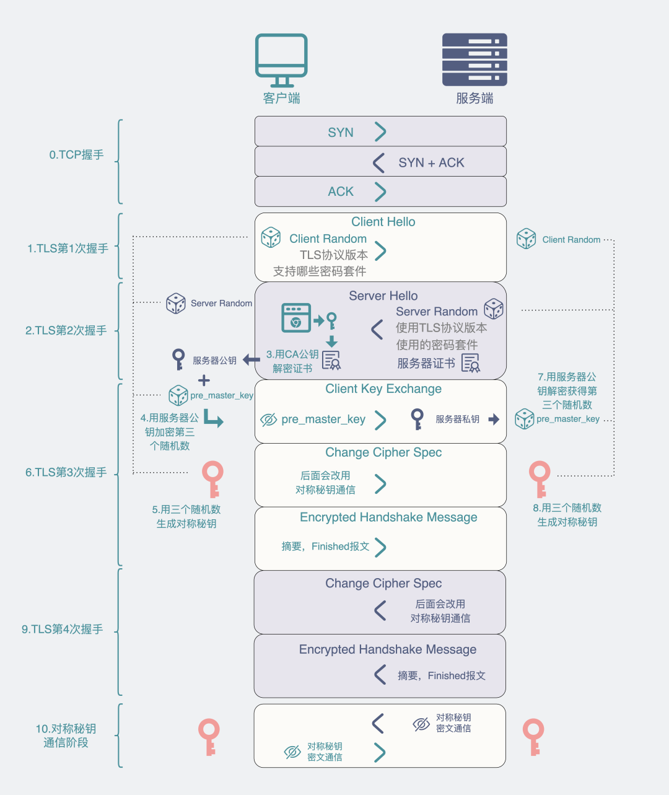
  - HTTPS 相比 HTTP 协议多一个 TLS 协议握手过程，目的是为了通过非对称加密握手协商或者交换出对称加密密钥，这个过程最长可以花费掉 2 RTT，接着后续传输的应用数据都得使用对称加密密钥来加密/解密。
  - 如何优化 HTTPS？
    - 分析性能损耗
      - 第一个环节， TLS 协议握手过程；
        - TLS 协议握手过程不仅增加了网络延时（最长可以花费掉 2 RTT），而且握手过程中的一些步骤也会产生性能损耗
        - 对于 ECDHE 密钥协商算法，握手过程中会客户端和服务端都需要临时生成椭圆曲线公私钥；
        - 客户端验证证书时，会访问 CA 获取 CRL 或者 OCSP，目的是验证服务器的证书是否有被吊销；
        - 双方计算 Pre-Master，也就是对称加密密钥；
      - 第二个环节，握手后的对称加密报文传输。
        - 现在主流的对称加密算法 AES、ChaCha20 性能都是不错的，而且一些 CPU 厂商还针对它们做了硬件级别的优化，因此这个环节的性能消耗可以说非常地小。
    - 硬件优化
      - 支持 AES-NI 特性的 CPU，因为这种款式的 CPU 能在指令级别优化了 AES 算法，这样便加速了数据的加解密传输过程。
      - `sort -u /proc/cryto |grep module | grep aes`
      - 选择 ChaCha20 对称加密算法，因为 ChaCha20 算法的运算指令相比 AES 算法会对 CPU 更友好一点。
    - 软件优化
      - 将 Linux 内核从 2.x 升级到 4.x；
      - 将 OpenSSL 从 1.0.1 升级到 1.1.1；
    - 协议优化 - 密钥交换过程进行优化
      - 尽量选用 ECDHE 密钥交换算法替换 RSA 算法，因为该算法由于支持「False Start」，它是“抢跑”的意思，客户端可以在 TLS 协议的第 3 次握手后，第 4 次握手前，发送加密的应用数据，以此将 TLS 握手的消息往返由 2 RTT 减少到 1 RTT，而且安全性也高，具备前向安全性。
      - ECDHE 算法是基于椭圆曲线实现的，不同的椭圆曲线性能也不同，应该尽量选择 x25519 曲线
        - 在 Nginx 上，可以使用 ssl_ecdh_curve 指令配置想使用的椭圆曲线，把优先使用的放在前面：
      - 对于对称加密算法方面，如果对安全性不是特别高的要求，可以选用 AES_128_GCM，它比 AES_256_GCM 快一些，因为密钥的长度短一些。
      - TLS 升级
        - 直接把 TLS 1.2 升级成 TLS 1.3，TLS 1.3 大幅度简化了握手的步骤，完成 TLS 握手只要 1 RTT，而且安全性更高。
        - 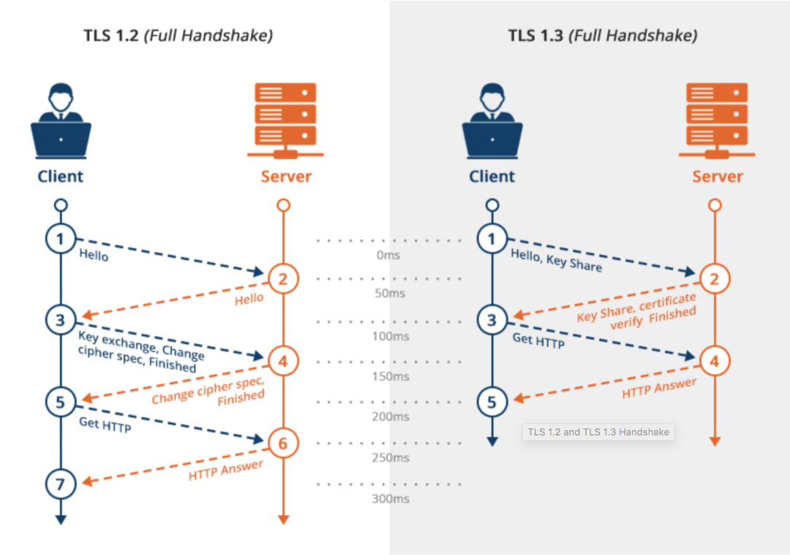
        - TLS 1.3 把 Hello 和公钥交换这两个消息合并成了一个消息，于是这样就减少到只需 1 RTT 就能完成 TLS 握手 - 客户端在  Client Hello 消息里带上了支持的椭圆曲线，以及这些椭圆曲线对应的公钥。
        - TLS1.3 对密码套件进行“减肥”了，对于密钥交换算法，废除了不支持前向安全性的  RSA 和 DH 算法，只支持 ECDHE 算法。
    - 证书优化
      - 一个是证书传输，
        - 对于服务器的证书应该选择椭圆曲线（ECDSA）证书，而不是 RSA 证书，因为在相同安全强度下， ECC 密钥长度比 RSA 短的多。
      - 一个是证书验证；
        - 客户端在验证证书时，是个复杂的过程，会走证书链逐级验证，验证的过程不仅需要「用 CA 公钥解密证书」以及「用签名算法验证证书的完整性」，而且为了知道证书是否被 CA 吊销，客户端有时还会再去访问 CA， 下载 CRL 或者 OCSP 数据，以此确认证书的有效性。
        - CRL
          - CRL 称为证书吊销列表（Certificate Revocation List），这个列表是由 CA 定期更新，列表内容都是被撤销信任的证书序号，如果服务器的证书在此列表，就认为证书已经失效，不在的话，则认为证书是有效的。
          - 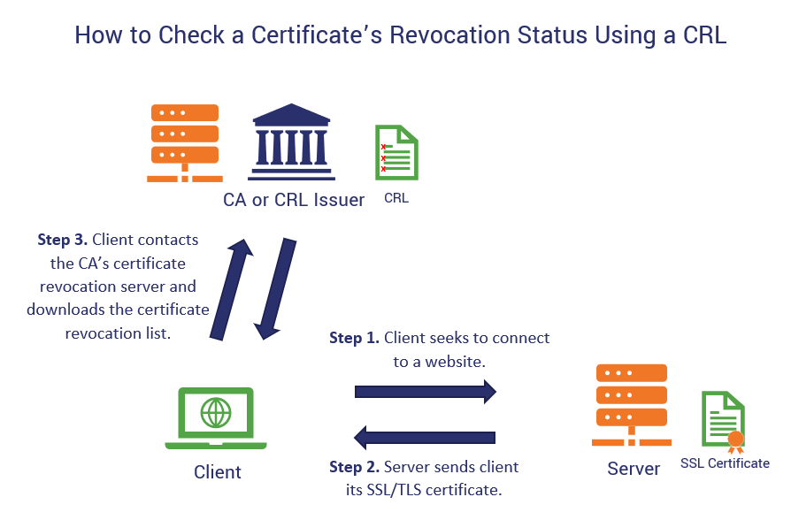
          - CRL 存在两个问题：
            - 第一个问题，由于 CRL 列表是由 CA 维护的，定期更新，如果一个证书刚被吊销后，客户端在更新 CRL 之前还是会信任这个证书，实时性较差；
            - 第二个问题，随着吊销证书的增多，列表会越来越大，下载的速度就会越慢，下载完客户端还得遍历这么大的列表，那么就会导致客户端在校验证书这一环节的延时很大，进而拖慢了 HTTPS 连接。
        - OCSP
          - 现在基本都是使用 OCSP ，名为在线证书状态协议（Online Certificate Status Protocol）来查询证书的有效性，它的工作方式是向 CA 发送查询请求，让 CA 返回证书的有效状态。
          - 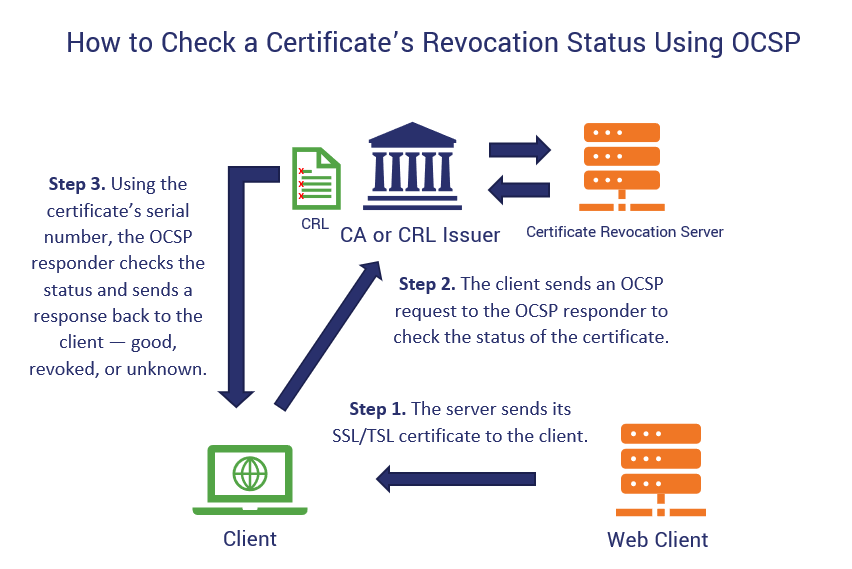
          - OCSP 需要向  CA 查询，因此也是要发生网络请求，而且还得看  CA 服务器的“脸色”，如果网络状态不好，或者 CA 服务器繁忙，也会导致客户端在校验证书这一环节的延时变大。
        - OCSP Stapling
          - 服务器向 CA 周期性地查询证书状态，获得一个带有时间戳和签名的响应结果并缓存它。
    - 会话复用 TLS session resumption
      - 我们如果我们把首次 TLS 握手协商的对称加密密钥缓存起来，待下次需要建立 HTTPS 连接时，直接「复用」这个密钥，不就减少 TLS 握手的性能损耗了吗？
      - Session ID
        - 客户端和服务器首次  TLS 握手连接后，双方会在内存缓存会话密钥，并用唯一的 Session ID 来标识，Session ID 和会话密钥相当于 key-value 的关系
        - 缺点
          - 服务器必须保持每一个客户端的会话密钥，随着客户端的增多，服务器的内存压力也会越大。
          - 现在网站服务一般是由多台服务器通过负载均衡提供服务的，客户端再次连接不一定会命中上次访问过的服务器，于是还要走完整的 TLS 握手过程；
      - Session Ticket
        - 服务器不再缓存每个客户端的会话密钥，而是把缓存的工作交给了客户端，类似于 HTTP 的 Cookie。
        - 客户端与服务器首次建立连接时，服务器会加密「会话密钥」作为 Ticket 发给客户端，交给客户端缓存该 Ticket。
      - Session ID 和 Session Ticket 都不具备前向安全性，因为一旦加密「会话密钥」的密钥被破解或者服务器泄漏「会话密钥」，前面劫持的通信密文都会被破解。
      - 避免重放攻击的方式就是需要对会话密钥设定一个合理的过期时间。
      - Pre-shared Key
        - 前面的 Session ID 和 Session Ticket 方式都需要在 1 RTT 才能恢复会话。
        - 对于重连 TLS1.3 只需要 0 RTT，原理和 Ticket 类似，只不过在重连时，客户端会把 Ticket 和 HTTP 请求一同发送给服务端，这种方式叫 Pre-shared Key。
- [HTTP](https://mp.weixin.qq.com/s/BW2GsZjXCGeVWd4fVCLhOQ)
  - Evolution
    - 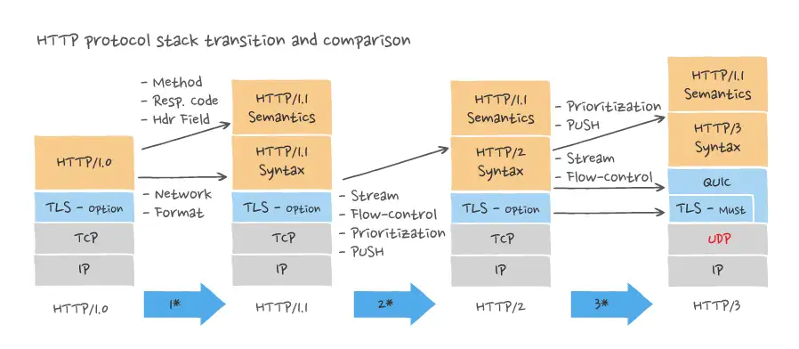
    - 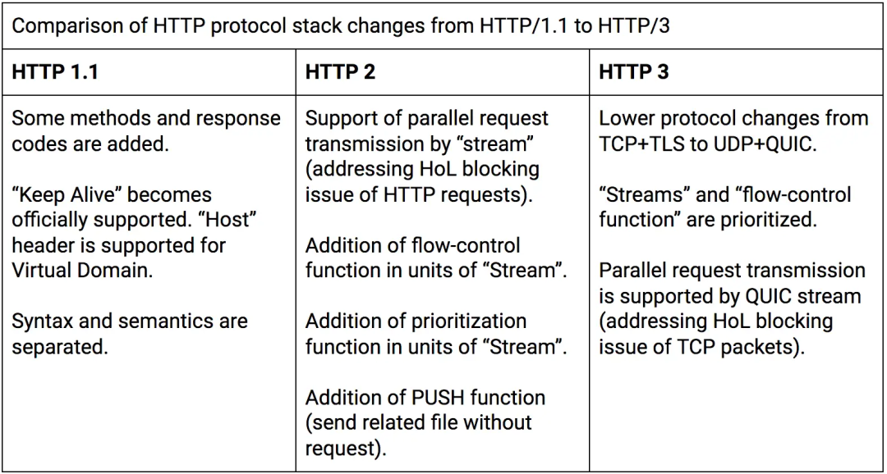
  - TCP的局限性
    - TCP 会间歇性挂起数据传输
    - TCP 不支持流级多路复用
    - TCP 导致冗余通信
  - QUIC
    - 选择UDP作为底层传输层协议
    - 流复用和流量控制
    - 灵活的拥塞控制
    - 更好的错误处理 - QUIC 提议使用增强的丢失恢复机制和前向纠错来处理错误的数据包，尤其是对于在传输中容易出现高错误率的缓慢的无线网络。
    - 更快地握手
    - 压缩 - QPACK 下，HTTP 报头可以在不同的 QUIC 流中乱序到达。QPACK 使用了一种查找表机制来对报头进行编码和解码。
- [pipelining disabled in modern browsers]
  - Buggy proxies are still common and these lead to strange and erratic behaviors that Web developers cannot foresee and diagnose easily.
  - Pipelining is complex to implement correctly: the size of the resource being transferred, the effective RTT that will be used, as well as the effective bandwidth, have a direct incidence on the improvement provided by the pipeline. Without knowing these, important messages may be delayed behind unimportant ones.
  - Pipelining is subject to the HOL problem.
- [QUIC 千万 QPS 应用实践](https://developer.volcengine.com/articles/7268132377786843147)
  - 网络性能-QUIC FEC优化
  - 网络性能-QOE反馈优化
  - 网络性能-MPQUIC优化
- [HTTP1 到 HTTP3 的工程优化](https://mp.weixin.qq.com/s/EQxGUrKDyAhZu0dtosd0bQ)
  - HTTP/1.0
    - 默认为短连接，连接无法复用，网页中的每个资源都会发起新的 TCP 连接
    - 队列头部请求阻塞 (head of line blocking), 一个 HTTP 请求响应结束之后，才能发起下一个 HTTP 请求 (如果没有某个特别慢的请求，就卡顿了 ...)
    - 不支持范围数据请求，即使只是需要某个资源的一部分内容 (例如视频的某一段帧)，也会将整个资源发送过来
  - HTTP/1.1
    - 首先增加了以下特性解决了 HTTP/1.0 存在的问题:
      - 默认启用长连接
      - 支持同时打开多个 TCP 连接，采用 Pipeline 请求方式，多个请求可以通过多个连接串行化请求
      - 支持资源分块范围数据传输
    - 此外，还新增了以下新特性:
      - 支持虚拟主机
      - 新增 Cache-Control、E-Tag, max-age 缓存处理指令
      - 新增 PUT、PATCH、HEAD、OPTIONS、DELETE 请求方法
    - 依然存在的问题
      - 虽然 TCP 连接可以复用，但是服务端响应只能按照客户端请求顺序返回，队列头部请求阻塞 (head of line blocking) 并没有完全解决
      - 客户端需要使用多个连接才能实现并发和缩短延迟
      - 无法压缩请求和响应头部，导致不必要的数据传输流量
      - 不支持有效的资源优先级，导致 TCP 连接的利用率低
  - HTTP/2
    - HTTP/2 采用二进制协议，将 HTTP/1.1 的文本协议转换为二进制协议，减少了不必要的数据传输流量
    - HTTP/2 将一个 HTTP 请求划分为 3 个部分：
      - 帧 (Frame) : 一段二进制数据，是 HTTP/2 传输的最小单位，每个帧包含一个帧头，用于标识该帧所属的流，来自不同数据流的帧可以交错发送，然后再根据每个帧头的数据流标识符重新组装数据
      - 消息 (Message) : 和请求或响应对应的多个帧序列
      - 流 (Stream) : 已建立的连接内的双向数据字节流，可以承载一条或多条消息，每个流都有一个唯一标识符和可选的优先级信息，由客户端发起的流必须使用奇数编号作为标识符；由服务器发起的必须使用偶数编号作为标识符，流标识符零(0x0)用于连接控制消息
    - 二进制分帧层
      - 请求/响应 多路复用 - 只会有一个 TCP 连接存在，它承载了任意数量的双向数据流 (Stream)。
      - 通过二进制分帧层，可以解决 HTTP/1.1 中依然存在的 队列头部请求阻塞 (head of line blocking) 和 客户端需要多个连接 两个问题
    - 请求优先级
      - 多个 HTTP 请求同时发送时，会产生多个数据流，每个数据流中有一个优先级的标识，服务器端可以根据这个标识来决定响应的优先顺序
      - 通过设置合理的请求优先级，可以有效缓解 队列头部请求阻塞 (head of line blocking) 和 TCP 连接的利用率低 两个问题。
    - 服务端推送
      - 服务端的所有推送都是通过 PUSH_PROMISE 帧发起的，它表示服务端会将资源推送到客户端，并且允许服务端在客户端请求之前就发送相关资源给客户端。
    - HPACK 压缩
      - HTTP/2 要求客户端和服务器同时维护和更新一个包含之前见过的头部字段表，从而避免了重复传输。HTTP/2 中通信双方各自缓存一份头部字段表，如：把 Content-Type:text/html 存入索引表中，后续如果要用到这个头，只需要发送对应的索引号就可以了。
    - 流控制
      - 流控制是定向的，接收方 (客户端/服务端都是彼此的接收方) 可以选择为每个流和整个连接设置窗口大小
      - 流控制是基于窗口机制的，接收方会其初始连接和流控制窗口（以字节为单位），当发送方发出数据帧时，该窗口就会减少，当发送方接收到来自接收方发送的 WINDOW_UPDATE 帧时，该窗口就会增加
      - 无法禁用流控制，当建立 HTTP/2 连接时，客户端和服务器交换 SETTINGS 帧，用来设置两个方向的流量控制窗口大小，流量控制窗口的默认值设置为 65535 字节， 最大窗口大小为（2^31 - 1 字节），并通过在接收到数据时发送 WINDOW_UPDATE 帧来更新
    - HTTP/2 的优化
      - TCP 建立连接时的三次握手，增加了请求延时
      - TCP 内部的拥塞控制、慢启动、拥塞避免等机制，可能导致传输效率不足
      - HTTP/2 虽然解决了 HTTP/1 协议中的 队列头部请求阻塞 (head of line blocking) 问题，但是 TCP 协议也存在类似的问题: TCP 在传输时使用序列号标识数据的顺序，一旦某个数据丢失，后面的数据需要等待这个数据重传后才能进行下一步处理
      - 根据测试表明，在较差的网络环境中 (丢包率 >= 2%)，HTTP/2 的性能甚至不如 HTTP/1, 因为 HTTP/1 一般会打开多个 TCP 连接，即使其中一个或多个连接出现丢包，剩下的连接依然可以进行数据传输
  - HTTP/3
    - HTTP/3 是基于 QUIC（Quick UDP Internet Connections）协议的新一代 HTTP 协议 
    - 0-RTT
      - QUIC 协议可以实现 0-RTT 建立连接 (0-RTT 是指通信双方发起通信连接时，第一个数据包就可以携带有效的业务数据)，而 TCP 需要 3-RTT 建立连接，这个优势不止体现在初始建立连接时，在网络发生变化时同样适用
      - 如果客户端和服务器是第一次通信，那么需要经过 1-RTT (主要是客户端获取服务端加密配置)，如果已经有过一次通信之后， 后续客户端和服务端的通信连接就是 0-RTT。
    - 多路复用
      - QUIC 中的每个 stream 之间是相互独立的，单个 stream 丢失了，不会影响到其他 stream，QUIC 协议在发送数据时会拆分为多个包， 这样就完全解决了 队列头部请求阻塞 (head of line blocking) 问题
    - 单调递增的序列号
      - QUIC 中的每一个包的标识（Packet Number）都是单调递增的，重传的序号一定大于超时的序号，这样就能有效地区分超时和重传。
    - 批量 ACK
      - TCP 中每收到 3 个数据包就要返回一个 ACK，而 QUIC 最多可以收到 256 个包之后，才返回 ACK。在丢包率比较严重的网络下，更多的 ACK 块可以减少重传量，提升网络效率
    - ACK Delay
      - TCP 计算 RTT 时没有考虑接收方接收到数据到发送确认消息之间的延迟，也就是所谓的 ACK Delay。QUIC 充分考虑到 ACK Delay，这样 RTT 的计算会更加准确
    - 流量控制
      - QUIC 中的流量控制是基于字节的，而不是基于包的，这样就可以更加精确地控制流量
      - QUIC 中的流量控制是双向的，而 TCP 中的流量控制是单向的，这样就可以更加精确地控制流量
      - QUIC 流量控制分为 连接级别和 Stream 级别 :
         - Stream 级别流量控制中，接收窗口 = 最大接收窗口 - 已接收数据
         - 连接级别流量控制中，接收窗口 = Stream1 接收窗口 + Stream2 接收窗口 + ... + StreamN 接收窗口
    - 连接迁移
      - QUIC 使用客户端生成的 64 位 ID 来表示一条连接，只要 ID 不变，这条连接也就一直维持着，不会中断。
    - 前向纠错机制
      - QUIC 中的前向纠错机制是基于 FEC (Forward Error Correction) 的，它可以在接收方没有收到数据包时，通过冗余数据包来恢复丢失的数据包，而 TCP 中的前向纠错机制是基于 ARQ (Automatic Repeat Request) 的，它只能通过重传来恢复丢失的数据包
    - QPACK 压缩
      -  HTTP/3 中为什么不能继续使用 HPACK 压缩格式呢？
        - 因为 HPACK 格式是为 TCP 协议创建的格式，这种格式工作的前提就是默认数据字节流按照顺序达到，如果 HTTP/3 中继续使用 HPACK 压缩格式， 就会导致额外的 队列头部请求阻塞 (head of line blocking) 问题，
      - QPACK 引入了两种单向流类型: 编码器流和解码器流，除了传递 HTTP/3 消息的双向字节流之外，客户端和服务端可以选择性地打开这两个单向编码流， 将具体的指令传输给对方。因为流是单向的，所以发送方只需要发送数据即可，无需等到接收方的响应。
    - QUIC 存在的限制
      - 性能提升很大程度上取决于 QUIC 方案的实施，这包括操作系统发行版、协议栈实现版本、QUIC 的实现版本等因素
      - 使用 HTTP/3 之前需要进行 HTTP 版本协商，浏览器默认不支持 HTTP/3, 通常需要基于建立在 TCP 上的 HTTP/1 或 HTTP/2 来发送协商请求
      - 增加网络管理复杂度，由于 QUIC 会加密大部分数据，因此排查网络错误、优化网络性能和安全性、设置报警规则等工作都变得更加困难，由于这些原因，很多防火墙还未支持 QUIC
      - 许多网络攻击都是利用 UDP 发起的，据统计大概有 3% - 5% 的网络会直接过滤 UDP 请求 (DNS 等网络基础协议除外)
- TLS关闭
  - SSL_shutdown() shuts down an active TLS/SSL connection. It sends the `close_notify` shutdown alert to the peer.
  - Issue
    - 在TLS 握手时，Client发了Client Hello后，Server没回Server Hello？而是回了Level: Fatal, Description: Close Notify错误后，直接发了FIN包，进行关闭TCP SOCKET
  - Debug
    - 在Linux上，我们常用strace来对进程进行系统调用的跟踪探测; macOS上，也有想对应的工具，dtruss `dtruss -p 78158`
    - accept的syscall很显眼accept(0x4, 0x700005CCE7A0, 0x700005CCE79C) = 25 0 重要的是RETURN VALUES的部分，这是TCP SOCKET连接后的所属FD文件描述符，也就是我们BUG重现时，这个网络连接在这个MOA进程中的FD。
    - 从dtruss的日志accept(0x4, 0x700005CCE7A0, 0x700005CCE79C) = 25 0来看，这个FD是25，聪明的你立刻就想到，只要找到close的地方就能确定到BUG出现的syscall日志范围
    - 直接搜索close的系统调用吧，很明显在close(0x19) = 0 0就是，只不过十进制的 25 被显示成十六进制的0x19了
    - 从上面的dtruss结果来看，并没有找到准确的TCP SOCKET write的系统调用，只看到几处dtrace: error on enabled probe ID 2172 (ID 170: syscall::write:return): invalid kernel access in action #12 at DIF offset 68
    - 回到dtruss的参数中，可以看到还有一个参数-s用来打印程序运行的stack backtraces。进行重新重现BUG `dtruss -p 78158 -adfs`
    - 找到close(0x19)的地方，往上倒推几个syscall日志，可以定位到真正往TCP SOCKET 写入Fatal Close Notify的地方是在libcoretls.dylib\SSLEncodeServerKeyExchange+0x253`。 定位到服务端的密钥交换过程中，EncodeServer时出现了异常。
    - 回到dtruss的其他日志，能看到在调用Security动态链接库中的impExpPkcs12Import方法里，有大量的/Users/cfc4n/Library/Keychains/login.keychain-db的读写。意味着MOA进程在频繁大量的读写keychain
  - Root cause
    - WSS的https server监听时，使用的tls证书，要走正规CA签发，避免自签self-sign的CA频繁读写keychain ，避免对keychain的root权限获取。(域名解析到127.0.0.1，拿到私钥的安全风险也很小)
  - Issue
    - 有时候TCP连接的关闭不是以图上这种FIN报文，而是以RST报文结束的。
    - 应用经常会遇到connection was closed prematurely这样的报错
  - Debug
    - Tcpdump和Wireshark分析 看到了TCP RST报文，而在RST之前还有Encrypted Alert
    - 这种Encrypted Alert，其实是TLS close notify消息。
      - RFC规定，在应用层事务完成后，如果TLS通信的任意一端想要结束这次TLS通信，就需要显式地发送close notify，表明自己不会再往这个TLS信道里写入数据了
      - 另一端在接收到close notify后需要做什么呢？主要有两件事 - 即使后续再接到更多的TLS数据信息，也需要丢弃 - 自己也需要发送close notify，完成双向的TLS信道关闭
      - 不过现实却很骨感。我们可能会看到各种不遵守协议的情况，比如：
        - 收到对端发出的TLS close notify消息后，自己没有发出TLS close notify，直接启动了TCP挥手
        - 自己发出TLS close notify后，未等收到对端同样的TLS close notify，就直接启动了TCP挥手
  - Deep dive
    - 应用程序如何发起TCP挥手
      - close()在被调用的时候，会对这个套接字描述符（socket fd）的引用计数减去一，并检查减后是否为零；若为零，则发起TCP挥手，即发出FIN报文
      - shutdown()有几种不同的调用方式，分别是：
        - 仅关闭读，此时不会发出FIN报文。
        - 仅关闭写，此时会发出FIN报文，告知对方：“我不会继续发数据啦，你那头随意”。
        - 同时关闭读和写，这就跟close()类似了，区别是shutdown()不看计数器，直接关闭连接
    - 内核如何“制造”RST报文
      - 在Linux内核中，发送RST报文的逻辑其实不算复杂，涉及两个函数。分别是：
        - tcp_send_active_reset()：名称上看就是自己主动发送RST，经常在连接关闭阶段发生
        - tcp_v4_send_reset()：相对而言，这个函数完成的是“被动式”的RST，其触发原因一般是对端过来的非正常报文
      - 比较典型的一个触发RST的组合条件是：接收缓冲区还有数据没有被读取，而应用程序已经调用了close()
      - 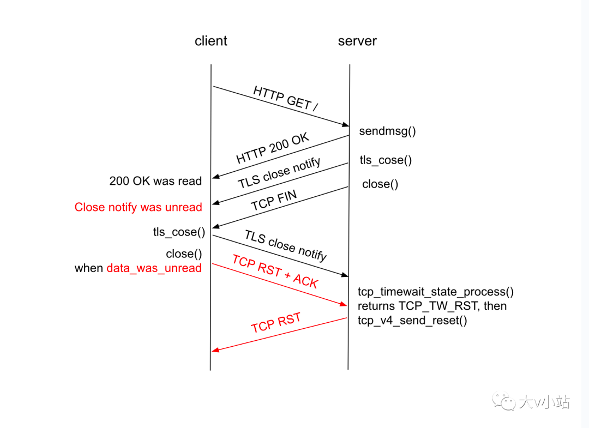
  - Root Cause
    - 可行的办法其实有两个：
      - 让客户端修改代码，不要把这种RST当作错误。
      - 在服务端做一些修改，在tls_close()和close()之间增加延迟（比如1秒），使得客户端有机会读取收到的TLS close notify并能够发出自己的TLS close notify，从而让RFC设计的TLS优雅关闭落到实处，这样就不会产生RST。
    - 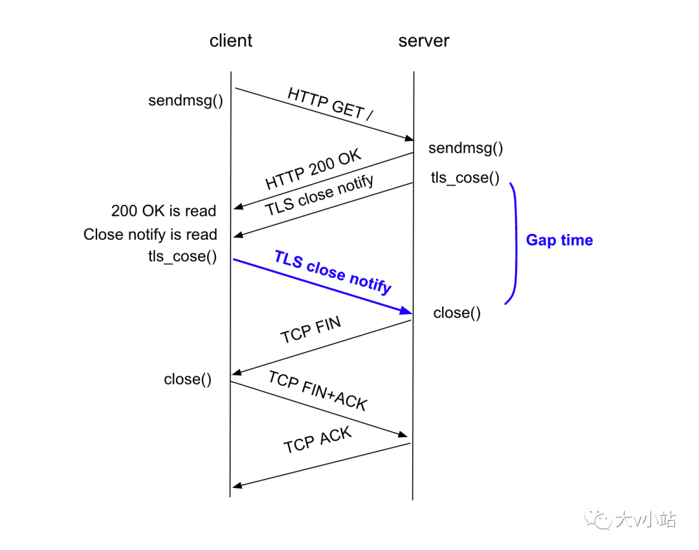
- [网络攻击]()
  - Application Layer 7
    - SQL注入 (SQL Injection)：攻击者在网站输入表单中输入恶意SQL代码，如果后端数据库系统未正确过滤用户输入，这些代码就可能被执行，导致数据泄露或损坏。
    - 跨站脚本（Cross-site Scripting, XSS)：攻击者在网页中注入恶意脚本，当其他用户浏览该网页时，脚本执行，可能导致用户信息被窃取或者会话被劫持。
    - DDoS攻击：通过利用大量受控制的网络设备（僵尸网络）向目标发送大量请求，导致目标服务不可用。
  - Presentation Layer 6
    - 字符编码/解码攻击 (Character Encoding/Decoding Attacks)：通过改变字符编码方式，攻击者可以绕过应用程序的输入过滤机制，执行恶意代码。
    - SSL剥离 (SSL Striping)：攻击者在客户端和服务器之间强制使用非加密连接，而不是安全的HTTPS连接，以便窃听或篡改数据。
    -  数据压缩操作(Data Compression Manipulation)：利用数据压缩算法的特性来推断传输中的数据，可能导致敏感信息泄露。
  - Session Layer 5
    - 会话重放 (Session Replay)：攻击者截获合法的数据包然后重新发送，以尝试非法认证或执行未授权的操作。
    -  会话固定攻击 (Session Fixation Attacks)：攻击者强制用户在服务器上使用一个由攻击者定义的会话ID，然后劫持用户的会话。
    -  中间人攻击 (Man-in-the-Middle Attacks)：攻击者置身于通信双方之间，秘密监听或篡改他们之间的信息交换。
  - Network 
    - IP欺骗 (IP Spoofing)：攻击者伪造IP地址的数据包，使目标计算机或网络设备认为该数据包来自可信源。
    -  路由表篡改 (Route Table Manipulation)：通过修改网络路由表，攻击者可以控制数据包的流向，进行数据窃听或流量劫持。
    -  蓝精灵攻击 (Smurf Attacks)：利用ICMP协议的漏洞，通过发送畸形的ICMP数据包来使目标系统崩溃。
  - Data Link Layer 2
    - MAC地址欺骗 (MAC Address Spoofing)：攻击者更改其设备的MAC地址以模仿另一设备，可能导致对网络访问控制的绕过。
    -  ARP欺骗 (ARP Spoofing)：通过发送伪造的ARP消息，攻击者可以将自己的MAC地址与另一IP地址关联起来，从而劫持流量或进行中间人攻击。
    -  交换机泛洪 (Switch Flooding)：通过向交换机发送大量的以太网帧，每个帧都有不同的源MAC地址，导致交换机的地址表溢出，使其退化为一个集线器，广播所有流量。
- HTTP -> HTTPS
  - If you've got an internal HTTPS service, but your load balancer, ingress gateway, or the like only allows HTTP destinations, you can work it around with a simple socat command.
    ```bash
    socat TCP-LISTEN:80,fork,reuseaddr TCP:localhost:443, verify=0
    ```
- [Streamable HTTP](https://mp.weixin.qq.com/s/rbDYpbRtKNhwG_fCIgcnXQ)
  - HTTP+SSE：客户端通过HTTP POST发送请求，服务器通过单独的SSE（Server-Sent Events）端点推送响应，需要维护两个独立连接。
    - HTTP + SSE 存在的问题
      - 服务器必须维护长连接，在高并发情况下会导致显著的资源消耗。
      - 服务器消息只能通过 SSE 传递，造成了不必要的复杂性和开销
      - 基础架构兼容性，许多现有的网络基础架构可能无法正确处理长期的 SSE 连接。企业防火墙可能会强制终止超时连接，导致服务不可靠
  - Streamable HTTP：统一使用单一HTTP端点处理请求和响应，服务器可根据需要选择返回标准HTTP响应或启用SSE流式传输。
    - Streamable HTTP 协议则可以直接返回响应，多个请求可以复用同一个 TCP 连接，TCP连接数最高只到几十条，并且整体执行时间也只有SSE Server 的四分之一。
      - 统一端点：移除了专门建立连接的 /sse 端点，将所有通信整合到统一的端点。
      - 按需流式传输：服务器可以灵活选择返回标准 HTTP 响应或通过 SSE 流式返回。
      - 状态管理：引入 session 机制以支持状态管理和恢复。
    - 服务器必须提供一个单一的 HTTP 端点（例如 https://example.com/mcp），支持 POST 和 GET 方法 (Model Context Protocol Specification - Transports)。
    - 客户端通过 HTTP POST 请求发送 JSON-RPC 消息到该端点，消息体可以是单一 JSON-RPC 消息或批处理请求/通知/响应。
    - 客户端必须在请求头中包含 Accept 头，支持 application/json 和 text/event-stream


