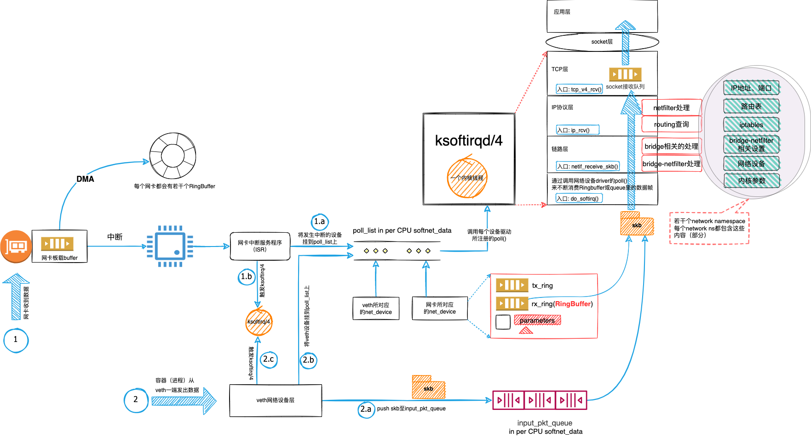
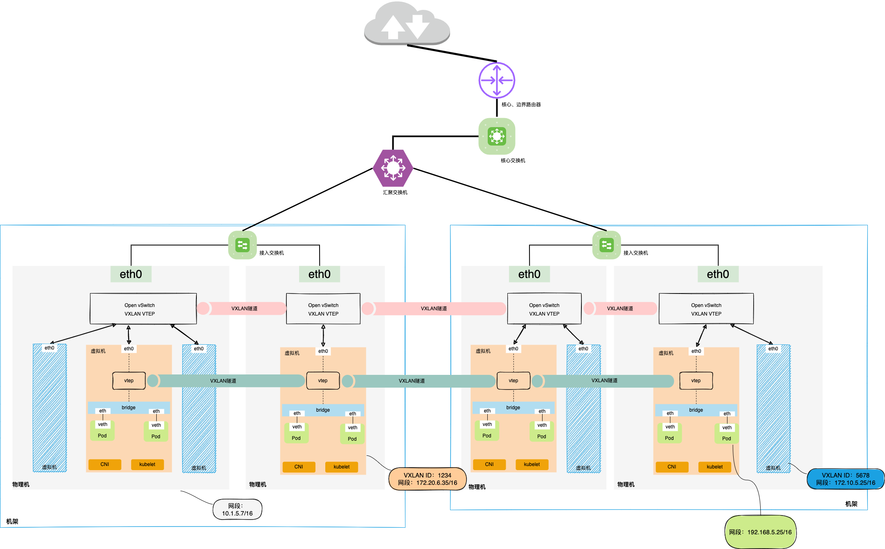
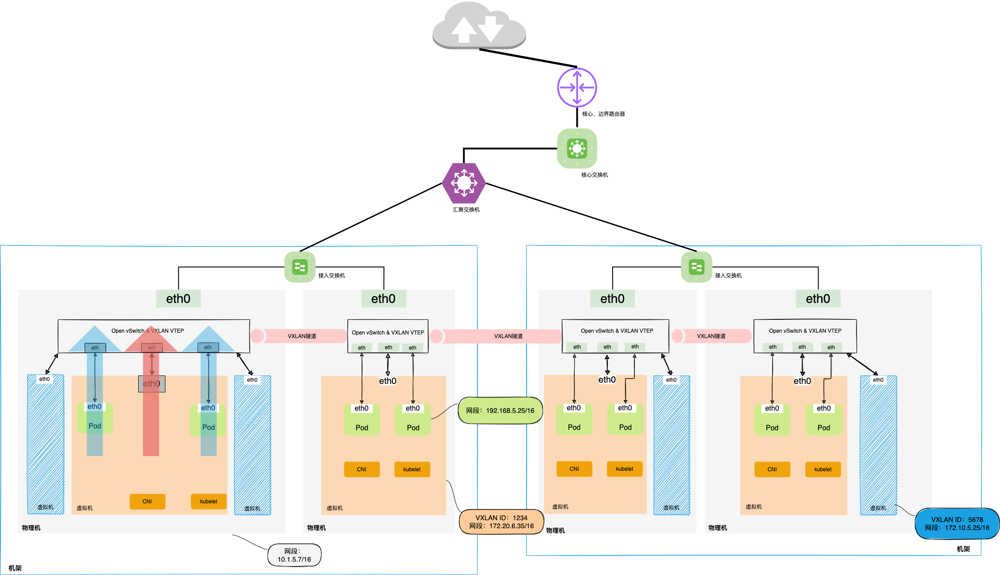
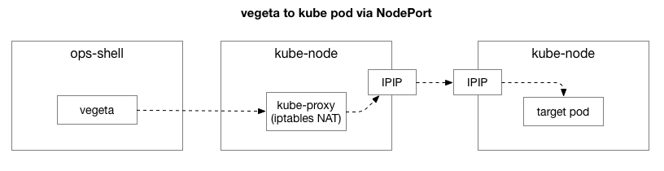
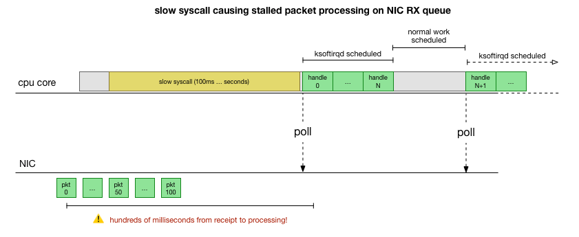
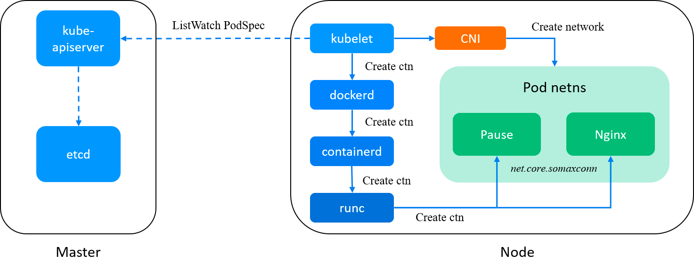
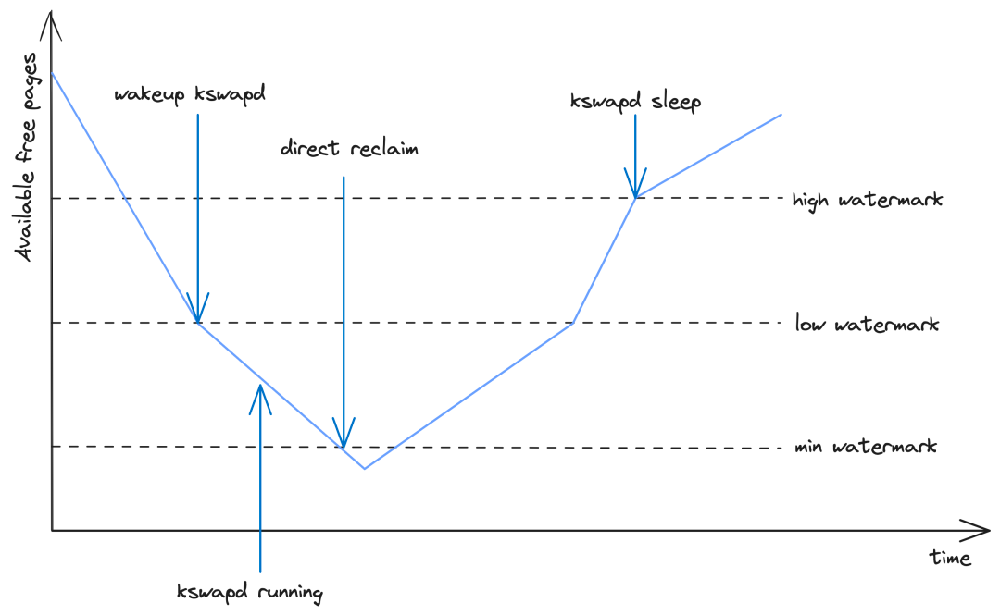

- [资料]
  - [Kubernetes 实践指南](https://imroc.cc/kubernetes/index.html)
  - [K8S训练营](https://www.qikqiak.com/k8strain/)
  - [Out-of-memory (OOM) in Kubernetes](https://mihai-albert.com/2022/02/13/out-of-memory-oom-in-kubernetes-part-4-pod-evictions-oom-scenarios-and-flows-leading-to-them/)
- HPA
  
- [VPC与三种K8s网络模型](https://mp.weixin.qq.com/s/W04uff4sHrPM_VtjzHPoJA)
  - 物理网卡和虚拟网卡数据接收完整数据处理流程
    - ksoftirqd扛起了网络包处理的重担。它从pull_list里找到要处理的网卡并从该网卡的queue里面拿到skb，然后沿着网络设备子系统 -> IP协议层 -> TCP层一路调用内核里面的函数来分析和处理这个skb，最终将其放置到位于TCP层的socket接收队列里。
    
    [Source](https://github.com/LanceHBZhang/LanceAndCloudnative/blob/master/%E9%AB%98%E6%B8%85%E5%A4%A7%E5%9B%BE/%E7%89%A9%E7%90%86%E7%BD%91%E5%8D%A1%E5%92%8C%E8%99%9A%E6%8B%9F%E7%BD%91%E5%8D%A1%E6%95%B0%E6%8D%AE%E6%8E%A5%E6%94%B6%E5%AE%8C%E6%95%B4%E6%95%B0%E6%8D%AE%E5%A4%84%E7%90%86%E6%B5%81%E7%A8%8B.png)
  - K8s“扁平网络”的三种典型实现方式是：Overlay、主机间路由（host-gw）以及Underlay
    - VPC and Overlay
      - K8s Overlay网络模型的实现有一个重要的技术点：veth pair。我们暂时将位于容器内的veth叫veth1，而插在bridge端口的那个对端veth称为veth-peer。当网络包从veth1流出时，其实是在图1的2.a处把skb所属的设备修改为veth-peer，先暂时放到了input_pkt_queue里，但这个时候skb还没有到设备veth-peer处
      - 在每台VM上，K8s CNI都会创建一个bridge和vtep。veth pair的一端安装在了Pod内部，而另一端则插到了网桥上
      - VTEP（VXLAN Tunnel Endpoints）是VXLAN网络中绝对的主角，它既可以是物理设备，也可以是虚拟化设备，主要负责 VXLAN 协议报文的封包和解包。
      - 
    - VPC and UnderLay
      - 网络包从Pod流出后，像VM的eth0一样，直接进入了Open vSwith上
      - 
    - VPC与host-gw
      - Host-gw简单来讲就是将每个Node当成Pod的网关。所谓网关就像城门，是网络包离开当前局部区域的卡口。
      - [VPC与host-gw（Flannel](https://github.com/LanceHBZhang/LanceAndCloudnative/blob/master/%E9%AB%98%E6%B8%85%E5%A4%A7%E5%9B%BE/vpc%E5%92%8CK8s%20host-gw%E7%BD%91%E7%BB%9C%E6%A8%A1%E5%9E%8B%EF%BC%88Flannel%E5%AE%9E%E7%8E%B0%E6%96%B9%E6%A1%88%EF%BC%89.png)
        - Flannel的实现方案里，由bridge来将离开Pod的网络包丢进宿主机TCP/IP协议栈进行路由的查询。最终网络包经由宿主机的eth0离开并进入对方宿主机的eth。当然这个过程中离不开OVS基于VXLAN所架设的隧道。
      - [VPC与host-gw（Calico](https://github.com/LanceHBZhang/LanceAndCloudnative/blob/master/%E9%AB%98%E6%B8%85%E5%A4%A7%E5%9B%BE/vpc%E5%92%8CK8s%20host-gw%E7%BD%91%E7%BB%9C%E6%A8%A1%E5%9E%8B%EF%BC%88Flannel%E5%AE%9E%E7%8E%B0%E6%96%B9%E6%A1%88%EF%BC%89.png)
        - BGP Client用于在集群里分发路由规则信息，而Felix则负责更新宿主机的路由表。
- [What Happen when K8S run](https://github.com/jamiehannaford/what-happens-when-k8s)
- [Demystifying kube-proxy](https://mayankshah.dev/blog/demystifying-kube-proxy/)
- [Container Networking Is Simple](https://iximiuz.com/en/posts/container-networking-is-simple/)
- [Life of a Packet in Kubernetes](https://dramasamy.medium.com/life-of-a-packet-in-kubernetes-part-1-f9bc0909e051)
- [如何调试Kubernetes集群中的网络延迟问题](https://mp.weixin.qq.com/s/78yVKmNP-huNAiHH7K_3aw)
  - [Kubernetes 平台上的服务零星延迟问题](https://github.blog/2019-11-21-debugging-network-stalls-on-kubernetes/)
  - 刚开始归结于网络链路抖动，一段时间后依然存在，虽然影响都是 P99.99 以后的数据，但是扰人心智，最后通过多方面定位，解决了该问题。
  - 通过排查，我们将问题缩小到与 Kubernetes 节点建立连接的这个环节，包括集群内部的请求或者是涉及到外部的资源和外部的访问者的请求。
  - 最简单的重现这个问题的方法是：在任意的内部节点使用 Vegeta 对一个以 NodePort 暴露的服务发起 HTTP 压测，我们就能观察到不时会产生一些高延迟请求
  - 拨开迷雾找到问题的关键
    - 
    - Vegeta 客户端会向集群中的某个 Kube 节点发起 TCP 请求。在我们的数据中心的 Kubernetes 集群使用 Overlay 网络（运行在我们已有的数据中心网络之上），会把 Overlay 网络的 IP 包封装在数据中心的 IP 包内。当请求抵达第一个 kube 节点，它会进行 NAT 转换，从而把 kube 节点的 IP 和端口转换成 Overlay 的网络地址，具体来说就是运行着应用的 Pod 的 IP 和端口。在请求响应的时候，则会发生相应的逆变换（SNAT/DNAT）
    - 在最开始利用 Vegeta 进行进行压测的时候，我们发现在 TCP 握手的阶段（SYN 和 SYN-ACK 之间）存在延迟。为了简化 HTTP 和 Vegeta 带来的复杂度，我们使用 hping3 来发送 SYN 包，并观测响应的包是否存在延迟的情况，
      `$ sudo hping3 172.16.47.27 -S -p 30927 -i u10000 | egrep --line-buffered 'rtt=[0-9]{3}\.'`
    - 根据日志中的序列号以及时间，我们首先观察到的是这种延迟并不是单次偶发的，而是经常聚集出现，就好像把积压的请求最后一次性处理完似的。
    - 我们想要具体定位到是哪个组件有可能发生了异常。是 kube-proxy 的 NAT 规则吗，毕竟它们有几百行之多？还是 IPIP 隧道或类似的网络组件的性能比较差？排查的一种方式是去测试系统中的每一个步骤。如果我们把 NAT 规则和防火墙逻辑删除，仅仅使用 IPIP 隧道会发生什么？你同样也在一个 kube 节点上，那么 Linux 允许你直接和 Pod 进行通讯，非常简单
      `$ sudo hping3 10.125.20.64 -S -i u10000 | egrep --line-buffered 'rtt=[0-9]{3}\.'`
    - 从我们的结果看到，问题还是在那里！这排除了 iptables 以及 NAT 的问题。那是不是 TCP 出了问题？我们来看下如果我们用 ICMP 请求会发生什么。
      `$ sudo hping3 10.125.20.64 --icmp -i u10000 | egrep --line-buffered 'rtt=[0-9]{3}\.'`
    - 结果显示 ICMP 仍然能够复现问题。那是不是 IPIP 隧道导致了问题？让我们来进一步简化问题。那么有没有可能这些节点之间任意的通讯都会带来这个问题？
      `$ sudo hping3 172.16.47.27 --icmp -i u10000 | egrep --line-buffered 'rtt=[0-9]{3}\.'`
    - 在这个复杂性的背后，简单来说其实就是两个 kube 节点之间的任何网络通讯，包括 ICMP。如果这个目标节点是“异常的”.
    - 这次我们从 kube 节点发送请求到外部节点. 通过查看抓包中的延迟数据, 我们获得了更多的信息。具体来说，从发送端观察到了延迟，然而接收端的服务器没有看到延迟
    - 通过查看接收端的 TCP 以及 ICMP 网络包的顺序的区别（基于序列 ID）， 我们发现 ICMP 包总是按照他们发送的顺序抵达接收端，但是送达时间不规律，而 TCP 包的序列 ID 有时会交错，其中的一部分会停顿。尤其是，如果你去数 SYN 包发送/接收的端口，这些端口在接收端并不是顺序的，而他们在发送端是有序的。
    - 目前我们服务器所使用的网卡，比如我们在自己的数据中心里面使用的那些硬件，在处理 TCP 和 ICMP 网络报文时有一些微妙的区别。当一个数据报抵达的时候，网卡会对每个连接上传递的报文进行哈希，并且试图将不同的连接分配给不同的接收队列，并为每个队列（大概）分配一个 CPU 核心。对于 TCP 报文来说，这个哈希值同时包含了源 IP、端口和目标 IP、端口。换而言之，每个连接的哈希值都很有可能是不同的。对于 ICMP 包，哈希值仅包含源 IP 和目标 IP，因为没有端口之说。这也就解释了上面的那个发现。
    - 另一个新的发现是一段时间内两台主机之间的 ICMP 包都发现了停顿，然而在同一段时间内 TCP 包却没有问题。这似乎在告诉我们，是接收的网卡队列的哈希在“开玩笑”，我们几乎确定停顿是发生在接收端处理 RX 包的过程中，而不是发送端的问题。
  - 深入挖掘 Linux 内核的网络包处理过程
    - 在最简单原始的实现中，网卡接收到一个网络包以后会向 Linux 内核发送一个中断，告知有一个网络包需要被处理。内核会停下它当前正在进行的其他工作，将上下文切换到中断处理器，处理网络报文然后再切换回到之前的工作任务。
    - Linux 新增了一个 NAPI，Networking API 用于代替过去的传统方式，现代的网卡驱动使用这个新的 API 可以显著提升高速率下包处理的性能。在低速率下，内核仍然按照如前所述的方式从网卡接受中断。一旦有超过阈值的包抵达，内核便会禁用中断，然后开始轮询网卡，通过批处理的方式来抓取网络包。这个过程是在“softirq”中完成的，或者也可以称为软件中断上下文（software interrupt context）。这发生在系统调用的最后阶段，此时程序运行已经进入到内核空间，而不是在用户空间。
    - 这种方式比传统的方式快得多，但也会带来另一个问题。如果包的数量特别大，以至于我们将所有的 CPU 时间花费在处理从网卡中收到的包，但这样我们就无法让用户态的程序去实际处理这些处于队列中的网络请求（比如从 TCP 连接中获取数据等）。最终，队列会堆满，我们会开始丢弃包。
    - 为了权衡用户态和内核态运行的时间，内核会限制给定软件中断上下文处理包的数量，安排一个“预算”。一旦超过这个"预算"值，它会唤醒另一个线程，称为“ksoftiqrd”（或者你会在 ps 命令中看到过这个线程），它会在正常的系统调用路径之外继续处理这些软件中断上下文。这个线程会使用标准的进程调度器，从而能够实现公平的调度。
    - 通过整理 Linux 内核处理网络包的路径，我们发现这个处理过程确实有可能发生停顿。如果 softirq 处理调用之间的间隔变长，那么网络包就有可能处于网卡的 RX 队列中一段时间。这有可能是由于 CPU 核心死锁或是有一些处理较慢的任务阻塞了内核去处理 softirqs。
  - 将问题缩小到某个核心或者方法
    - 这些 ICMP 包会被散列到某一个特定的网卡 RX 队列，然后被某个 CPU 核心处理。如果我们想要理解内核正在做什么，那么我们首先要知道到底是哪一个 CPU 核心以及 softirq 和 ksoftiqrd 是如何处理这些包的，这对我们定位问题会十分有帮助。
    - 我们知道内核正在处理那些 IMCP 的 Ping 包，那么我们就来拦截一下内核的 icmp_echo 方法，这个方法会接受一个入站方向的 ICMP 的“echo 请求”包，并发起一个 ICMP 的回复“echo response”。我们可以通过 hping3 中显示的 icmp_seq 序列号来识别这些包。
    - 结果告诉我们一些事情。首先，这些数据包由 ksoftirqd/11 进程处理的，它很方便地告诉我们这对特定的机器将其 ICMP 数据包散列到接收方的 CPU 核心 11 上。我们还可以看到，每次看到停顿时，我们总是会看到在 cadvisor 的系统调用 softirq 上下文中处理了一些数据包，然后 ksoftirqd 接管并处理了积压，而这恰好就对应于我们发现的那些停顿的数据包。
  - cAdvisor 做了什么会导致停顿
    - 我们使用 cAdvisor 正是为了“分析正在运行的容器的资源使用情况和性能特征”，但它却引发了这一性能问题。
    - 为了让内核能够硬阻塞而不是提前调度 ksoftirqd，并且我们也看到了在 cAdvisor 的 softirq 上下文中处理的数据包，我们认为 cAdvisor 调用 syscall 可能非常慢，而在它完成之后其余的网络包才能够被正常处理
    
    - perf record 工具能以特定频率对指定的 CPU 内核进行采样，并且可以生成实时的调用图
      ```shell
      # record 999 times a second, or every 1ms with some offset so not to align exactly with timers
      sudo perf record -C 11 -g -F 999
      # take that recording and make a simpler stack trace.
      sudo perf script 2>/dev/null | ./FlameGraph/stackcollapse-perf-ordered.pl | grep ksoftir -B 100
      ```
    - 我们可以使用 strace 来查看 cAdvisor 到底在做什么，并找到那些超过 100ms 的系统调用。
      `sudo strace -p 10137 -T -ff 2>&1 | egrep '<0\.[1-9]'`
    - 我们非常确信 read()系统调用是很慢的。从 read 读取的内容和 mem_cgroup 这个上下文来看，那些 read()调用是在读取 memory.state 文件，这些文件用于描述系统的内存使用以及 cgroup 的限制。cAdvisor 通过轮询这个文件来获取容器所使用的资源的详情。
  - 是什么导致这个读取如此缓慢
    - 它主要是关于内存的 cgroup，它负责管理与统计命名空间（容器）内的内存使用情况。当该 cgroup 中的所有进程退出时，内存 cgroup 会被 Docker 释放。但是，“内存”不仅是进程的内存，而且虽然进程内存的使用量已经消失，但事实证明，内核还为缓存空间分配了内存，例如 dentries 和 inode（目录和文件元数据），这些内容被缓存到内存 cgroup 中。
    - “僵尸”cgroups：那些没有进程运行并被删除的 cgroups 仍然持有一定的内存空间（在我们的案例中，这些缓存对象是目录数据，但也有可能是页缓存或是 tmpfs）。
    - 与其在 cgroup 释放的时候遍历所有的缓存页，而这也可能很慢，内核会惰性地等待这些内存需要用到的时候再去回收它们，当所有的内存页被清理以后，相应的 cgroup 才会最后被回收。与此同时，这些 cgroup 仍然会被计入统计信息中。
    - 我们的节点具有大量的僵尸 cgroup，有些节点的读/停顿超过一秒钟
- [Docker/Kubernetes上无法解释的连接超时原因探寻](https://mp.weixin.qq.com/s/VYBs8iqf0HsNg9WAxktzYQ)
  - 摘要
    - Linux内核在做SNAT（源地址转换）时存在一个已知的资源竞争问题，这可能导致SYN包被丢弃
      - SNAT默认是在Docker和Flannel的对外连接上进行的，使用iptables的masquerade(地址伪装)规则。
      - 这个资源竞争可能发生在多个容器并发地尝试与同一个外部地址建立连接的时候。在一些场景下，两个连接可能分配到同一个端口用以地址转换，这最终导致一个或多个包被丢弃以及至少1秒的连接时延
    - 资源竞争情况也存在于DNAT（目的地址转换
      - 在Kubernetes中，这意味着访问ClusterIP时可能会丢包。当你从Pod发送一个请求到ClusterIP，kube-proxy（通过iptables)默认将ClsuterIP替换成你要访问的Service的某个Pod IP。
      - DNS是Kubernetes最常见的Service之一，这个资源竞争问题可能使DNS解析域名时产生间歇性的延时，参见Kubernetes社区Issue 56903。
  - Netfilter和SNAT
    - 如果从外部主机无法直接访问容器，容器也就不可能和外部服务通信。如果一个容器请求外部的服务，由于容器IP是不可路由的，远程服务器不知道应该把响应发到哪里。但事实上只要每个主机对容器到外部的连接做一次SNAT就能实现。
    - Iptables是一个可以让我们用命令行来配置netfilter的工具。默认的Docker安装会添加一些iptables规则，来对向外的连接做SNAT
    - 当一个从容器到外部服务的连接发出后，因为Docker/Flannel添加的iptables规则它会被netfilter处理。netfilter的NAT模块进行SNAT的操作，它将向外传输的包中的源地址替换主机IP，并且在内核中添加一个条目来记录这个转换。
    - 这些条目存储在内核的conntrack表（conntrack是netfilter的另一个模块）中。你可以通过命令`sudo conntrack -L`来查看这个表的内容。
  - 端口转换
    - 如果一个端口被已经建立的连接占用，另一个容器尝试使用相同的本地端口访问同一个服务，netfilter不仅要改变该容器的源IP，还包括源端口
  - 用户态的conntrack
    - conntrack软件包有一个命令来显示一些统计信息（conntrack -S）。有一个字段立刻引起我们的注意，当运行那个命令时“insert_field”的值是一个非零值。
    - netfilter也支持两种其它的算法来找到可用的端口：
      - 使用部分随机来选择端口搜索的初始位置。当SNAT规则带有flag NF_NAT_RANGE_PROTO_RANDOM时这种模式被使用。
      - 完全随机来选择端口搜索的初始位置。带有 flag NF_NAT_RANGE_PROTO_RANDOM_FULLY时使用。
      - NF_NAT_RANGE_PROTO_RANDOM降低了两个线程以同一个初始端口开始搜索的次数，但是仍然有很多的错误。
      - 只有使用 NF_NAT_RANGE_PROTO_RANDOM_FULLY才能显著减少conntrack表插入错误的次数。在一台Docker测试虚机，使用默认的masquerade规则，10到80个线程并发请求连接同一个主机有2%-4%的插入错误。
- [调度器的作用就是为Pod寻找一个合适的Node]
  - 调度过程：
    - 待调度Pod被提交到apiServer -> 更新到etcd -> 调度器Watch etcd感知到有需要调度的pod（Informer）-> 取出待调度Pod的信息 ->
    - Predicates： 挑选出可以运行该Pod的所有Node  ->  
    - Priority：给所有Node打分 -> 将Pod绑定到得分最高的Node上 -> 将Pod信息更新回Etcd -> 
    - node的kubelet感知到etcd中有自己node需要拉起的pod -> 取出该Pod信息，做基本的二次检测（端口，资源等）-> 在node 上拉起该pod 。
    - Predicates阶段会有很多过滤规则：比如volume相关，node相关，pod相关
    - Priorities阶段会为Node打分，Pod调度到得分最高的Node上，打分规则比如： 空余资源、实际物理剩余、镜像大小、Pod亲和性等
  - Kuberentes中可以为Pod设置优先级，高优先级的Pod可以： 1、在调度队列中先出队进行调度 2、调度失败时，触发抢占，调度器为其抢占低优先级Pod的资源。
  - Kuberentes默认调度器有两个调度队列：
    - activeQ：凡事在该队列里的Pod，都是下一个调度周期需要调度的
    - unschedulableQ:  存放调度失败的Pod，当里面的Pod更新后就会重新回到activeQ，进行“重新调度”
- [KubeGateway](https://mp.weixin.qq.com/s/FEvZwAXj9giSgHhvKPz1EA)
  - https://github.com/kubewharf/kubegateway
  - Why
    - Kubernetes 支持多种认证策略，比如 Bootstrap Token、Service Account Token、OpenID Connect Token、TLS 双向认证等
    - TLS 双向认证需要 LB 将请求中的 Client X509 Cert 正确传递给 kube-apiserver，但是传统的七层 LB 无法做到这一点，在转发过程中会丢失 Client X509 Cert，导致 kube-apiserver 无法认证用户。
    - 使用四层 LB 会引起另外的问题
      - 请求负载不均衡：由于 kube-apiserver 和 client 是使用 HTTP2 协议连接，HTTP2 的多个请求都会复用底层的同一个 TCP 连接并且长时间不断开。在 kube-apiserver 滚动升级或者某个实例重启时，很容易引起迟些启动的 kube-apiserver 在长时间内只有很少的请求数。极端情况下，负载较高的实例会出现 OOM，甚至引起雪崩。
      - 缺乏请求治理的灵活性：4 层负载均衡在传输层工作，它只负责消息的传递，但是无法处理应用层的 HTTP 协议的信息，因此相较于 7 层负载缺乏对请求治理的“灵活性”和 “智能性”。比如无法根据请求的内容（比如 verb、url 等字段）制定灵活的负载均衡和路由策略，也无法在网关层对请求级别进行限流降级等处理。
  - Done
    - KubeGateway 对外以 K8s 标准 API 的形式提供代理配置管理的服务，主要提供路由转发规则、上游集群 kube-apiserver 地址、集群证书信息、限流等请求治理策略等配置信息的维护变更。它代理 kube-apiserver 的请求的流程如下图所示，主要分为五个步骤：请求解析、路由匹配、用户认证、流量治理和反向代理。
- [Journey of components when creating a pod]
  - Pod creation
    - kube-apiserver -> kubelet -> dockerd -> containerd (-> containerd-shim) -> runc
    - 
- [limits and requests](https://stackoverflow.com/a/73703128/3011380)
  - Best practices for CPU limits and requests on Kubernetes
    - Use CPU requests for everything and make sure they are accurate
    - Do NOT use CPU limits.
  - Best practices for Memory limits and requests on Kubernetes
    - Use memory limits and memory requests 
    - Set memory limit= memory request
  - Checking the throttling rate of your pods
    - Just login to the pod and run `cat /sys/fs/cgroup/cpu,cpuacct/kubepods/{PODID}/{CONTAINERID}/cpu.stat`.
      - nr_periods — Total schedule period
      - nr_throttled — Total throttled period out of nr_periods
      - throttled_time — Total throttled time in ns
- Misc
  - 通过 Kubernetes 集群提供 device plugin framework，可以实现 GPU 共享能力
  - Kubernetes 在大规模集群下的挑战
    - 调度器串型调度，存在吞吐瓶颈；
    - 可以并行调度，并通过节点分区减少调度决策冲突
  - 作业排队 - Kueue 旨在将批处理作业作为一个单元来管理。Kueue 可以将 Pod 级别的编排留给 Kubernetes 现有的稳定组件
  - Gang Scheduling - 一种调度策略，它可以将一组 Pod 一起调度到同一台机器上，以便它们可以共享资源并提高性能
    - Gang scheduling策略可在并发系统中将多个相关联的进程调度到不同处理器上同时运行。最主要的原则是保证所有相关联的进程能够同时启动，防止部分进程的异常，避免整个关联进程组的阻塞。例如，当您提交一个包含多个任务的批量Job时，可能会出现多个任务全部调度成功或者都调度失败的情况。这种All-or-Nothing调度场景，就被称作Gang scheduling。
  - [NUMA Scheduling](https://docs.openshift.com/container-platform/4.10/scalability_and_performance/cnf-numa-aware-scheduling.html)
- Ray
  - Ray 的框架中最为重要的两个部分是 Ray Core 和 Ray AIR
    - Ray Core 是底层的分布式的计算框架，使用基于 actor 模型来实现的一套计算框架，它可以将 Python 的一个 Class 或者一个 Function 转成分布式的 actor 和 task，在所有的机器上分布式地进行运行，并且 tasks/actor 之间可以通过分布式的对象存储能力来达到共享的能力。
      - Ray Core 本身是构建在 grpc 的基础之上，性能高。
      - Ray Core 提供了基于 Actor 模型的异步并行的技术实现，提高性能。
      - Ray Core 提供了分布式的共享内存的技术，以及分布式对象存储，Actor/Tasks 之间可以共享内存，来保存或者读取依赖的对象。
      - Ray Core 使用了分布式引用计数等技术来保证内存的安全，以此提高系统的稳定性。
      - Ray Core 提供了去中心化的分布式的调度器和对象管理器，可以根据需要进行无缝的扩容。
      - Ray Core 是一个将 Python 语言分布式化的框架。在AI领域，很多的AI框架都是以 Python 为主的，所以 Ray 可以很好地整合这些框架，为其提供分布式的训练的能力。
      - Ray 支持很强的容错能力。
    - Ray AIR 的全称是 Ray AI Runtime，Ray AIR 则是针对机器学习应用场景的扩展和增强。基于 Ray Core，Ray AIR 就是一个分布式的 AI 框架。包含了 AI 各种场景下的一系列的工具包，可以一起使用，也可以分开使用
      - Ray AIR 提供了大模型切分成模型分片的支撑能力。举例：以 Alpa 为例，Alpa 能够全自动化的并行运行客户的单设备的 code 在分布式的集群上运行。
      - Ray AIR 提供了数据集切分成数据集分片的能力，以及多 worker 并行运行去处理数据集分片。举例：基于 Embeddings 和 LLM 来实现自己的知识库场景就可以使用 Ray 来加速。
      - Ray AIR 的 Scale 能力是 Ray 的核心能力之一，在很多模块都体现出来了。Ray AIR中提供了TorchTrainer、TensorflowTrainer、HorovodTrainer、XGBoostTrainer、LightGBMTrainer、LightningTrainer、HuggingFaceTrainer 这些类，可以用于支持各种 AI 框架的分布式训练的能力。
  - Ray 支持将大模型拆分成很多的小的模型分片，将这些小的模型分片调度到不同主机上去运行，来完成分布式训练，这个能力是 Ray 能支持大模型的核心能力之一。同时不仅仅模型可以进行分片，数据集也可以进行分片，这样不同的模型分片使用不同的数据集分片进行分布式的模型训练，可以按需要扩容，充分利用资源，加速训练。
  - Ray 集群可以在非容器化环境中运行，同时社区还提供了基于云原生 Kubernetes 的环境来运行整个 Ray 集群，以及以容器方式运行 Actor 和 Task。在这种方式下，要提交一个 Ray 作业，只需要提交一个符合 RayJob CRD 规范的 CR 对象。
- Ray 的大规模离线推理
  - 离线推理关键挑战
    - GPU Memory Wall
      - 在进行推理或者训练时，GPU 内存可能放不下，需要对模型进行切分。
      - 按层切分的 Pipeline Parallelism 模式
      - 按权重切分的 Tensor Parallelism 模式
      - 进行模型切分具有以下几点优势: 空分复用
    - 分布式调度的挑战
      - 需要支持异构资源，前面说到推理的过程往往同时有数据处理及推理，那么数据的处理就希望放到 CPU 上进行，从而不占用 GPU，把 GPU 给到推理使用，所以这就需要框架能够比较友好地支持异构资源调度。
      - 对于弹性资源调度的需求，模型经过切分后切成不同的组，在作业的运行过程中，每个组可以理解成一个 Stage，因为每个组包含的模型的 Layers 是不同的，所以不同 Stage 对于算力的需求也不同，而且在跑一个作业之前，很难预先估计算力需求，就需要不断地调整参数，才能达到最佳执行效率。
- [K8sGPT](https://github.com/k8sgpt-ai/k8sgpt)
- [Kelemetry：面向 Kubernetes 控制面的全局追踪系统]
  - Background
    - 在传统的分布式追踪中，“追踪”通常对应于用户请求期间的内部调用。特别是，当用户请求到达时，追踪会从根跨度开始，然后每个内部RPC调用会启动一个新的子跨度
    - Kubernetes API是异步和声明式的。为了执行操作，组件会更新apiserver上对象的规范（期望状态），然后其他组件会不断尝试自我纠正以达到期望的状态。
    - 在此过程中，我们从未直接调用过rs controller，rs controller也从未直接调用过kubelet。这意味着我们无法观察到组件之间的直接因果关系。这使得我们无法使用传统的分布式追踪来跟踪Kubernetes控制面的操作。
  - Design
    - 将对象作为跨度 
      - 每个在对象上发生的事件都是一个子跨度。例如，当rs controller更新rs对象的规范时，它会创建一个子跨度。当kubelet更新pod对象的状态时，它也会创建一个子跨度。这些子跨度都是rs对象的子跨度，因为它们都是rs对象的子跨度。
      - 各个对象通过它们的拥有关系连接在一起，使得子对象的跨度成为父对象的子跨度。
    - 审计日志收集
      - 数据源之一是apiserver的审计日志 。在Kubernetes架构中，每个对象的更改会触发其相关的控制器进行协调，并导致后续对象的更改，因此观察与对象更改相关的审计日志有助于理解一系列事件中控制器之间的交互
      - 审计日志以两种不同的方式暴露：日志文件和webhook Kelemetry提供了一个审计webhook，用于接收原生的审计信息，也暴露了插件API以实现从特定厂商的消息队列中消费审计日志
    - Event 收集
      - 当Kubernetes控制器处理对象时，它们会发出与对象关联的“event”
      - 持久化处理的最后一个event的时间戳，并在重启后忽略该时间戳之前的事件
-  NodePort Service 分配端口
  - ClusterIP 类型的 Service 仅限于供集群内的节点来访问， 而来自集群外的流量无法被路由
    - 解决这个难题的一种方式是使用 type: NodePort Service， 这种服务会在集群所有节点上为特定端口建立映射关系，从而将来自集群外的流量重定向到集群内。
  - Kubernetes 如何为 Services 分配节点端口
    - Kubernetes 1.24 引入了针对 type: ClusterIP Service 的变更，将集群 IP 地址的 CIDR 范围划分为使用不同分配策略的两块来减少冲突的风险。
    - 在 Kubernetes 1.27 中，作为一个 Alpha 特性，你可以为 type: NodePort Service 采用类似的策略。你可以启用新的特性门控 ServiceNodePortStaticSubrange。开启此门控将允许你为 type: NodePort Service 使用不同的端口分配策略，减少冲突的风险。
- the pod status hang up on OOMkilled or Completed
  - If a Pod's status is OOMKilled or Completed, it means that the Pod has terminated. 
    - The OOMKilled status indicates that the Pod was killed due to an out-of-memory condition
    - the Completed status indicates that the Pod has completed its execution and exited successfully.
  - Compute Resources (CPU/Memory) are configured for Containers, not for Pods.
  - If a Pod container is OOM killed, the Pod is not evicted. The underlying container is restarted by the kubelet based on its RestartPolicy.
  - Your container being terminated by OOMKill does not imply the pod to become in a Completed/Error status (unless you're using the RestartPolicy: Never).
  - [Pod troubleshooting](https://www.alibabacloud.com/help/en/ack/ack-managed-and-ack-dedicated/support/pod-troubleshooting)
- [Pod 发生 OOM 的时候，背后的流程是什么？]
  - 这个问题是一个比较深入而且扩展性很强的问题，以 CRI 为 containerd 举例，当内核的 OOMKiller 杀死一个容器的主进程后，containerd-shim 会监听到 OOM 事件，
  - 然后将向 containerd server 发送 TaskOOM 事件，containerd cri 插件会监听到 TaskOOM 事件并更新容器的 status.reason 为 OOMKilled，并且当在容器退出后， cri 插件会将退出事件发送到 kubelet，并最终更新 Pod 的容器状态。
  - 其中，containerd-shim 会根据 cgroup 的版本采用不同的 OOM 事件监听方式。
- [Pod IP 分配机制](https://mp.weixin.qq.com/s/yrg3BkDIxDTa5p45Gsbhww)
  - kube-apiserver 收到客户端请求（Controller 或 kubectl 客户端）后，创建对应的 Pod；
  -  kube-scheduler 按照配置的调度策略进行 Pod 调度，选择最为合适的 Node 作为目标节点；
  -  kubelet（运行于每个 Node 上的 K8s agent）Watch 监听到调度到所在节点的 Pod(s)，开始真正创建 Pod；
  -  由 CRI 首先创建出 PodSandbox，初始化对应的网络 net namespace，调用 CNI IPAM 插件分配 Pod IP；若 hostNetwork 为 true，则直接使用 Node IP；
  -  接着 CRI 开始创建 Pod 中第一个 pause container，绑定到上一步创建的 net namespace 和 Pod IP；
  -  接着由 CRI 依次创建和启动 Pod 中声明的 initContainers 和 containers 容器；
  -  当所有的 containers 运行起来后，探针探测容器运行符合预期后，Pod 状态最终更新为 Running。
- [chaos engineering in Kubernetes](https://blog.palark.com/chaos-engineering-in-kubernetes-open-source-tools/)
- [K8sGPT 赋能 Kubernetes](https://mp.weixin.qq.com/s/zVpleSMX4VlhC2khukVfqg)
- [K8S 1.28]
  - 原生支持 Sidecar 容器 Alpha
    - 它为 init 容器引入了 restartPolicy 字段，并使用这个字段来指示 init 容器是 sidecar 容器。Kubelet 将按照 restartPolicy=Always 的顺序与其他 init 容器一起启动 init 容器，但它不会等待其完成，而是等待容器启动完成。
    - 启动完成的条件是启动探测成功（或者未定义启动探测）并且 postStart 处理程序完成。此条件用 ContainerStatus 类型的字段 Started 表示。有关选择此信号的注意事项，请参阅 “Pod 启动完成条件” 部分。
    - 字段 restartPolicy 仅在 init 容器上被接受。现在唯一支持的值是 “Always”。不会定义其他值。此外，该字段可为空，因此默认值为 “无值”。容器的 restartPolicy 的其他值将不被接受，容器将遵循当前实现的逻辑。
    - Sidecar 容器不会阻止 Pod 完成 - 如果所有常规容器都已完成，Sidecar 容器将被终止。在 sidecar 启动阶段，重启行为将类似于 init 容器。如果 Pod restartPolicy 为 Never，则启动期间失败的 sidecar 容器将不会重新启动，整个 Pod 将失败。如果 Pod restartPolicy 为 Always 或 OnFailure，则会重新启动。一旦 sidecar 容器启动（postStart 完成且启动探测成功），即使 Pod restartPolicy 为 Never 或 OnFailure，这些容器也会重新启动。此外，即使在 Pod 终止期间，sidecar 容器也会重新启动。
    - 为了最大限度地减少 sidecar 容器的 OOM 杀死，这些容器的 OOM 调整将匹配或超过 Pod 中常规容器的 OOM 分数调整。
- [Scaling Kubernetes to 7,500 nodes](https://openai.com/research/scaling-kubernetes-to-7500-nodes#unsolvedproblems)
  - 资源调度
    - 我们Kubernetes中的每个Node节点的GPU均采用NVLink和GPUDirect直通网卡，所以在一个Node上仅调度一个Pod独占全部资源来达到算力最大化利用。
    - 在独占Node场景下确实不需要调度器支持Bin-Pack（尽可能将pod填充满node）和Fragmentation（碎片化）算法，因为此时整个集群的资源最小粒度是Node而不是Pod，也自然不用考虑CPU NUMA拓扑结构。也不存在Node资源争强的问题
    - 要实现这个效果，采用NodeSelector和DaemoSet可以最简单满足需求，对K8S的调度压力也最小
    - full bisection bandwidth（全双工切分带宽）指一个集群中任何一半的节点都可以与另一半的节点进行最大带宽的通信，而不会受到带宽限制的影响
  - Team Taints
    - 我们根据团队名字设计了一个污点openai.com/team=teamname:NoSchedule并把他标记到服务器上，这样不同团队在使用资源时就必须要添加污点容忍才能协调到资源
    - 我们还自己开发了个控制器，用于在准入阶段将忽略污点，优先调度低优先级的pod。这样就可以让团队直接可以彼此借用资源。
  - Gang scheduling
    - Gang scheduling在处理MPI作业时非常重要，原因在于MPI作业的同步通信特性。由于MPI是一种并行计算的编程模型，它允许进程间通过消息传递的方式进行通信，以完成一项共同的计算任务。在MPI中，一项常见的操作是集合通信，其中所有进程需要同时参与。如果任何一个进程滞后或者不可用，那么所有的进程都将被阻塞，等待该进程完成。这就导致了MPI作业非常依赖于所有参与进程的同步执行。
    - OpenAI实现Gang Scheduling的方式则是通过嵌入k8s scheuler plugis的方式实现。这个插件名叫Coscheduling，当前已被合并到scheudler-plugin主线
  - 并行作业处理
    - 参与到运行MPI作业任务的work节点都必须定期进行checkpoint，这是一种容错机制，可以在作业出错或者系统崩溃时恢复作业的状态，用来避免计算出错后全部重头来过
    - semi-stateful pod (半状态容器)，由于并行任务的Runtime载体是Pod，它的状态数据主要就是任务执行时产生的checkpoint。显然这部分数据需要被持久化到PVC中。之所以称之为半状态，主要在于即便该容器挂了，最坏的情况也是任务整体暂停并回到上一次checkpoint重新开始，并不会像有状态应用产生不可逆的灾难
  - 网络
    - 当K8S集群扩大到7500台时，网络方案不管是基于overlay的flannel还是基于路由实现的组网，都无法在IP地址扩展性和性能方面做到同时兼顾。所以我们使用了Azure的VMSS解决了我们的问题
    -  我们的Pod对外访问还是基于NAT的，只不过用了Iptables来标记流量的来源以及使用量，这个主要用来评估Pod间或者说是并行作业间网络通讯是否存在瓶颈
  - API servers
    - 我们用5台独立的ETCD服务器和5台独立的api server服务器支撑了7500个节点，并当前的配置还足以应对未来的扩容的需求。这里面我们的主要优化点是将Kuebrnetes Events分离到其它Etcd集群上以减少记录大量事件的IO带来的延迟
    - 运行大量节点场景下，每个Node上的List-Watch带来的泛洪效应比较明显，涓流成河，当所有请求都汇聚到API Server后所带来的传输带宽高达1GB/s! 好在我们用了Kubernete 1.1之后的版本，通过EndpointSlices在服务器将压力缩小了1000倍
  - Monitoring
    - 我们Prometheus也经常OOM，后来发现是大量的histogram指标查询堆积造成的。所以我们在后端查询时设置了执行超时时间，这样promtheus的内存就再没爆过了。
    - Prometheus重启后对WAL文件的重放事件慢得我们也无法忍受，后来在Robust Perception的帮助下知道了调大GOMAXPROCS参数来设置goroutine数来加快重放速度
- [Memory Advisor：用户态的 K8s 内存管理](https://mp.weixin.qq.com/s/isP83F4hnDmRjaY4UrBhPQ)
  - 原生方案的局限
    - Linux 使用内存的策略比较贪婪，采取尽量分配，当内存水位较高时才触发回收的策略。
    - 内存分配
      - 快速内存分配：
        - 首先尝试进行快速分配，判断分配完成后整机的空闲水位是否会低于 Low Watermark，如果低于的话先进行一次快速内存回收，然后再判断是否可以分配。如果还不满足，则进入慢速路径。
      - 慢速内存分配：
        - 慢速路径中会首先唤醒 Kswapd 进行异步内存回收，然后尝试进行一次快速内存分配。
        - 如果分配失败，则会尝试对内存页进行 Compact 操作。
        - 如果还无法分配，则尝试进行全局直接内存回收，该操作会将所有的 Zone 都扫描一遍，比较耗时。
        - 如果还不成功，则会触发整机 OOM 释放一些内存，再尝试进行快速内存分配。
    - 内存回收
      - Memcg 直接内存回收：如果一个 Cgroup 的 Memory Usage 达到阈值，则会触发 Memcg 级别的同步内存回收来释放一些内存。如果还不成功，则会触发 Cgroup 级别的 OOM。
      - 全局快速内存回收：上文在介绍快速内存分配时提到了快速内存回收，其之所以快速，是因为只要求回收这次分配所需的页数量即可。
      - 
      - 全局异步内存回收：如上图所示，当整机的空闲内存降到 Low Watermark 时，会唤醒 Kswapd 在后台异步地回收内存，回收到 High Watermark 为止。
      - 全局直接内存回收：如上图所示，如果整机的空闲内存降到 Min Watermark，则会触发全局直接内存回收。因为该过程是同步的，发生在进程内存分配的上下文，对业务的性能影响较大。
  - K8s 原生的内存管理机制
    - Memory Limit
      - Kubelet 依据 Pod 中各个 Container 声明的 Memory Limit 设置 Cgroup 接口  memory.limit_in_bytes ，约束了 Pod 和 Container 的内存用量上限
      - 该机制的缺点是，当 Pod 中的 Container 未声明 Memory Limit 时，Kubelet 会将其设置为默认值，这样就会导致 Pod 和 Container 的内存用量上限不受约束，容易导致 OOM。
    - 驱逐
      - 当节点的内存不足时，K8s 将选择部分 Pod 进行驱逐，并为节点打上 Taint node.kubernetes.io/memory-pressure，避免将 Pod 再调度到该节点
      - 在对待驱逐的 Pod 进行排序时，首先判断 Pod 的内存使用量是否超过其 Request，如果超过则优先被驱逐；
      - 其次比较 Pod 的 Priority，优先级低的 Pod 先被驱逐；
      - 最后比较 Pod 的内存使用量超过其 Request 的差值，超出越多则越先被驱逐。
    - OOM
      - Kubelet 在启动容器时，会根据其所属 Pod 的 QoS 级别与其对内存的申请量，为其配置 /proc/<pid>/oom_score_adj，从而影响其被 OOM Kill 的顺序
      - 对于 Critical Pod 或 Guaranteed Pod 中的容器，将其 oom_score_adj 设置为 -997
      - 对于 BestEffort Pod 中的容器，将其 oom_score_adj 设置为 1000
      - 对于 Burstable Pod 中的容器，根据以下公式计算其 oom_score_adj
    - Memory QoS
      - K8s 从 v1.22 版本开始，基于 Cgroups v2 实现了 Memory QoS 特性 ，可以为容器的内存 Request 提供保障，进而保障了全局内存回收在 Pod 间的公平性
      - 具体的 Cgroups 配置方式如下：
        - memory.min: 依据 requests.memory 配置。
        - memory.high: 依据 limits.memory * throttlingfactor (或 nodeallocatablememory * throttlingfactor) 配置。
        - memory.max: 依据 limits.memory (或 nodeallocatablememory) 配置。
      - 在 K8s v1.27 版本中，对 Memory QoS 特性进行了增强。主要是为了解决以下问题：
        - 当容器的 Requests 和 Limits 比较接近时，由于 memory.high > memory.min 的限制，memory.high 中配置的 Throttle 阈值可能不生效。
        - 按照上述方式计算出的 memory.high 可能较低，导致频繁的 Throttle，影响业务性能。
        - throttlingfactor 的默认值 0.8 过于激进，一些 Java 应用通常会用到 85% 以上的内存，经常被 Throttle。
      - 因此进行了以下优化：
        - 对 memory.high 的计算方式进行改进： `memory.high = floor{[requests.memory + memory throttling factor * (limits.memory or node allocatable memory - requests.memory)]/pageSize} * pageSize`
        - 将 throttlingfactor 的默认值调整为 0.9。
- [binpack]
  - EKS默认开启的资源调度策略是LeastRequestedPriority，意味着消耗资源最少的节点会优先被调度，这样使得集群的资源在所有节点之间分配的相对均匀
  - 在一些特定的批处理负载场景下（例如机器学习、数据分析），当集群配置了弹性伸缩，作业发起的Pod总是默认均匀的分布在所有集群节点上，导致很多节点运行着少量独立pod，无法被Cluster Autoscaler组件及时回收，从而造成集群资源的浪费。
  - binpack调度，原理是调度器在调度pod到节点的时候，预期在节点上保留最少的未使用 CPU 或内存。此策略最大限度地减少了正在使用的集群节点的数量，也降低了资源碎片
- [潮汐混部](https://mp.weixin.qq.com/s/dRqge-_BnbK1WsmXo6OuBw)
  - 弹性伸缩 弹性伸缩的流程中最重要的就是实时性和稳定性
    - 需要底层系统的配合来提供一整套的机制进行保证，主要包括几个方面：
      - 监控体系：需要一套集群维度的监控体系，为弹性伸缩提供稳定实时的利用率数据。
        - 没有采用 K8s 原生的 Metrics Server，主要是基于以下的考虑——
          - 首先， Metrics Server 只能代理实时数据，不存储历史数据。如果希望在弹性伸缩中根据历史数据做一些更平滑的策略，基于原生 Metrics Server 无法很好的实现。
          - 其次，由于抖音集团的弹性伸缩能力可以基于多集群的联邦，所以需要在联邦层上得到服务资源使用情况的汇聚数据。
          - 最后，不是只有弹性伸缩依赖监控系统，业务也需要实时通过内部的监控管理系统查询业务的实时数据和历史数据，所以监控系统内还需要将数据同步到内部的离线分析系统。
      - Quota 体系：需要一套 Quota 系统保证业务在伸缩的过程中，集群整体的资源量是可控的，不能出现在波谷时将服务的副本数缩容后，它所对应的 Quota 被别的服务占用且无法归还的情况。
        - 支持根据 CPU、内存、GPU 等多个资源维度进行弹性伸缩
        - 支持根据时间段设置不同的配置、支持设置服务级别的对利用率小幅波动的容忍度、支持单步扩缩容的步长。
        - 使用每个服务小时级别的历史数据作为保底的策略，以应对监控系统异常的情况。这里我们还是利用了服务天级的利用率比较稳定的特性，在监控系统出现问题导致无法获取监控数据时，控制面可以使用该服务昨天相同时段的利用率数据来作为指导扩缩容的兜底策略。
  - 分时弹性混部实践
    - 离线业务稳定性保证
      - 资源不稳定性主要来自以下两个方面: 弹性资源的供应量是不稳定的, 弹性资源的需求量是不稳定的
      - 如何解决上述问题
        - 在资源供应方面：我们在执行缩容操作的过程中，引入了 deletion cost 机制定义实例缩容的优先级。比如我们可以尽可能地缩容整机，甚至尽可能地保证这些缩容出来的资源处于同一个 Pod 或者使用了同质的 GPU ，从而减少资源碎片的问题。
        - 在资源分配方面：对于一些离线业务例如离线训练来说，因为作业在调度和非调度的过程中，可能会执行很多次 checkpoint dump 和 reload 操作，这个操作过程需要从 HDFS 上实现完整模型的上传和下载，非常耗时。因此对于离线训练业务，我们更倾向于提高单个作业的加速比，而不是运行更多的作业。
        - 在资源回收方面：为了解决资源回收的过程中无脑地杀死离线业务的问题，研发团队构建了弹性资源的优先级，基于优先级实现资源回收。
- [ CPUShares 管理 Cgroup](https://mp.weixin.qq.com/s/heqCb-E0yi-uxE1bkLgRgw)
- [手动管理 Cgroup](https://mp.weixin.qq.com/s/rr6vHPIqEqtfm-xOaE4jpw)


