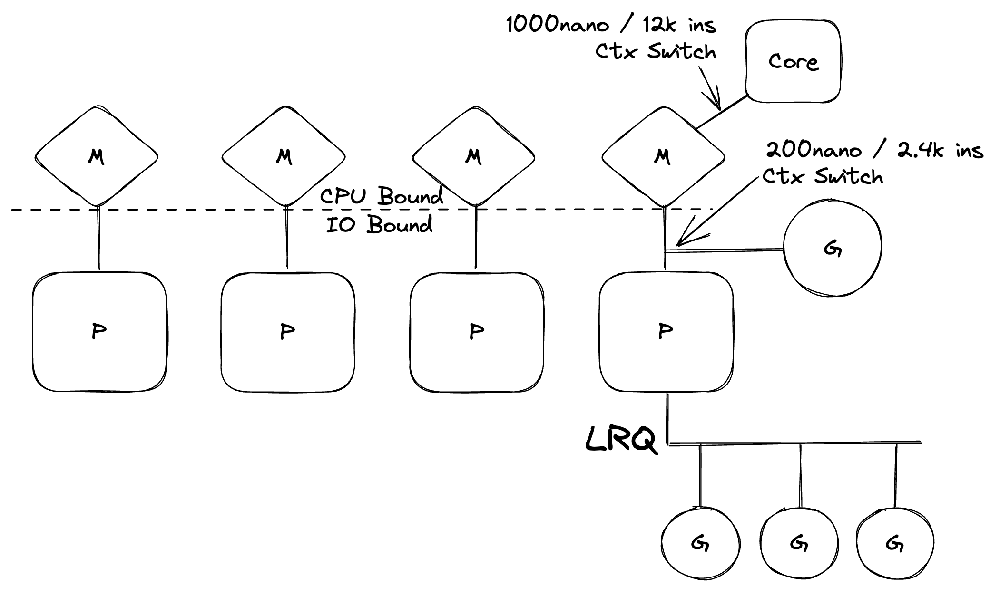
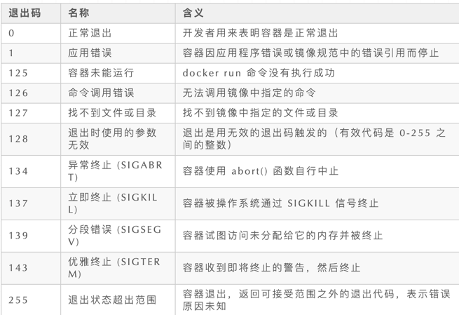
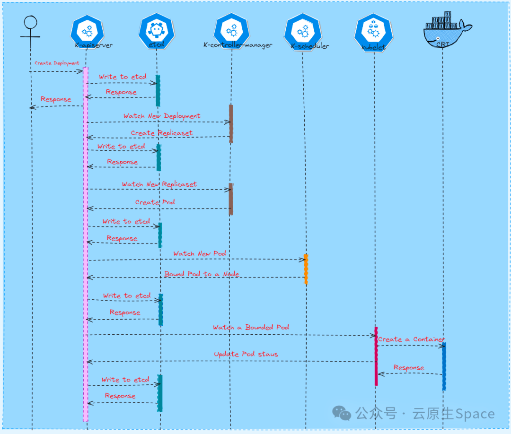
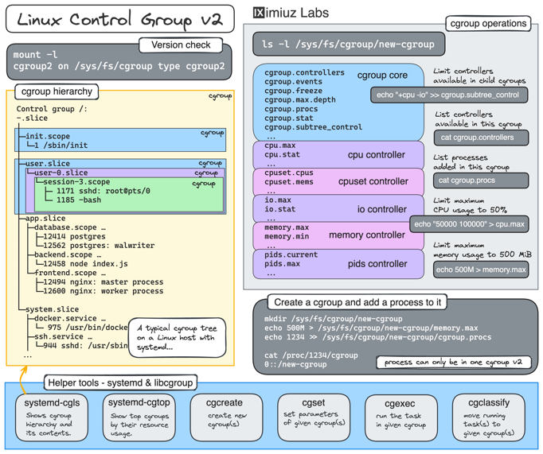

- [资料]
  - [Kubernetes 实践指南](https://imroc.cc/kubernetes/index.html)
  - [K8S训练营](https://www.qikqiak.com/k8strain/)
  - [Out-of-memory (OOM) in Kubernetes](https://mihai-albert.com/2022/02/13/out-of-memory-oom-in-kubernetes-part-4-pod-evictions-oom-scenarios-and-flows-leading-to-them/)
  - [A Guide to Kubernetes](https://www.newsletter.swirlai.com/p/a-guide-to-kubernetes-part-1)
- HPA
  
- [VPC与三种K8s网络模型](https://mp.weixin.qq.com/s/W04uff4sHrPM_VtjzHPoJA)
  - 物理网卡和虚拟网卡数据接收完整数据处理流程
    - ksoftirqd扛起了网络包处理的重担。它从pull_list里找到要处理的网卡并从该网卡的queue里面拿到skb，然后沿着网络设备子系统 -> IP协议层 -> TCP层一路调用内核里面的函数来分析和处理这个skb，最终将其放置到位于TCP层的socket接收队列里。
    
    [Source](https://github.com/LanceHBZhang/LanceAndCloudnative/blob/master/%E9%AB%98%E6%B8%85%E5%A4%A7%E5%9B%BE/%E7%89%A9%E7%90%86%E7%BD%91%E5%8D%A1%E5%92%8C%E8%99%9A%E6%8B%9F%E7%BD%91%E5%8D%A1%E6%95%B0%E6%8D%AE%E6%8E%A5%E6%94%B6%E5%AE%8C%E6%95%B4%E6%95%B0%E6%8D%AE%E5%A4%84%E7%90%86%E6%B5%81%E7%A8%8B.png)
  - K8s“扁平网络”的三种典型实现方式是：Overlay、主机间路由（host-gw）以及Underlay
    - VPC and Overlay
      - K8s Overlay网络模型的实现有一个重要的技术点：veth pair。我们暂时将位于容器内的veth叫veth1，而插在bridge端口的那个对端veth称为veth-peer。当网络包从veth1流出时，其实是在图1的2.a处把skb所属的设备修改为veth-peer，先暂时放到了input_pkt_queue里，但这个时候skb还没有到设备veth-peer处
      - 在每台VM上，K8s CNI都会创建一个bridge和vtep。veth pair的一端安装在了Pod内部，而另一端则插到了网桥上
      - VTEP（VXLAN Tunnel Endpoints）是VXLAN网络中绝对的主角，它既可以是物理设备，也可以是虚拟化设备，主要负责 VXLAN 协议报文的封包和解包。
      - 
    - VPC and UnderLay
      - 网络包从Pod流出后，像VM的eth0一样，直接进入了Open vSwith上
      - 
    - VPC与host-gw
      - Host-gw简单来讲就是将每个Node当成Pod的网关。所谓网关就像城门，是网络包离开当前局部区域的卡口。
      - [VPC与host-gw（Flannel](https://github.com/LanceHBZhang/LanceAndCloudnative/blob/master/%E9%AB%98%E6%B8%85%E5%A4%A7%E5%9B%BE/vpc%E5%92%8CK8s%20host-gw%E7%BD%91%E7%BB%9C%E6%A8%A1%E5%9E%8B%EF%BC%88Flannel%E5%AE%9E%E7%8E%B0%E6%96%B9%E6%A1%88%EF%BC%89.png)
        - Flannel的实现方案里，由bridge来将离开Pod的网络包丢进宿主机TCP/IP协议栈进行路由的查询。最终网络包经由宿主机的eth0离开并进入对方宿主机的eth。当然这个过程中离不开OVS基于VXLAN所架设的隧道。
      - [VPC与host-gw（Calico](https://github.com/LanceHBZhang/LanceAndCloudnative/blob/master/%E9%AB%98%E6%B8%85%E5%A4%A7%E5%9B%BE/vpc%E5%92%8CK8s%20host-gw%E7%BD%91%E7%BB%9C%E6%A8%A1%E5%9E%8B%EF%BC%88Flannel%E5%AE%9E%E7%8E%B0%E6%96%B9%E6%A1%88%EF%BC%89.png)
        - BGP Client用于在集群里分发路由规则信息，而Felix则负责更新宿主机的路由表。
- [What Happen when K8S run](https://github.com/jamiehannaford/what-happens-when-k8s)
- [Demystifying kube-proxy](https://mayankshah.dev/blog/demystifying-kube-proxy/)
- [Container Networking Is Simple](https://iximiuz.com/en/posts/container-networking-is-simple/)
- [Life of a Packet in Kubernetes](https://dramasamy.medium.com/life-of-a-packet-in-kubernetes-part-1-f9bc0909e051)
- [如何调试Kubernetes集群中的网络延迟问题](https://mp.weixin.qq.com/s/78yVKmNP-huNAiHH7K_3aw)
  - [Kubernetes 平台上的服务零星延迟问题](https://github.blog/2019-11-21-debugging-network-stalls-on-kubernetes/)
  - 刚开始归结于网络链路抖动，一段时间后依然存在，虽然影响都是 P99.99 以后的数据，但是扰人心智，最后通过多方面定位，解决了该问题。
  - 通过排查，我们将问题缩小到与 Kubernetes 节点建立连接的这个环节，包括集群内部的请求或者是涉及到外部的资源和外部的访问者的请求。
  - 最简单的重现这个问题的方法是：在任意的内部节点使用 Vegeta 对一个以 NodePort 暴露的服务发起 HTTP 压测，我们就能观察到不时会产生一些高延迟请求
  - 拨开迷雾找到问题的关键
    - 
    - Vegeta 客户端会向集群中的某个 Kube 节点发起 TCP 请求。在我们的数据中心的 Kubernetes 集群使用 Overlay 网络（运行在我们已有的数据中心网络之上），会把 Overlay 网络的 IP 包封装在数据中心的 IP 包内。当请求抵达第一个 kube 节点，它会进行 NAT 转换，从而把 kube 节点的 IP 和端口转换成 Overlay 的网络地址，具体来说就是运行着应用的 Pod 的 IP 和端口。在请求响应的时候，则会发生相应的逆变换（SNAT/DNAT）
    - 在最开始利用 Vegeta 进行进行压测的时候，我们发现在 TCP 握手的阶段（SYN 和 SYN-ACK 之间）存在延迟。为了简化 HTTP 和 Vegeta 带来的复杂度，我们使用 hping3 来发送 SYN 包，并观测响应的包是否存在延迟的情况，
      `$ sudo hping3 172.16.47.27 -S -p 30927 -i u10000 | egrep --line-buffered 'rtt=[0-9]{3}\.'`
    - 根据日志中的序列号以及时间，我们首先观察到的是这种延迟并不是单次偶发的，而是经常聚集出现，就好像把积压的请求最后一次性处理完似的。
    - 我们想要具体定位到是哪个组件有可能发生了异常。是 kube-proxy 的 NAT 规则吗，毕竟它们有几百行之多？还是 IPIP 隧道或类似的网络组件的性能比较差？排查的一种方式是去测试系统中的每一个步骤。如果我们把 NAT 规则和防火墙逻辑删除，仅仅使用 IPIP 隧道会发生什么？你同样也在一个 kube 节点上，那么 Linux 允许你直接和 Pod 进行通讯，非常简单
      `$ sudo hping3 10.125.20.64 -S -i u10000 | egrep --line-buffered 'rtt=[0-9]{3}\.'`
    - 从我们的结果看到，问题还是在那里！这排除了 iptables 以及 NAT 的问题。那是不是 TCP 出了问题？我们来看下如果我们用 ICMP 请求会发生什么。
      `$ sudo hping3 10.125.20.64 --icmp -i u10000 | egrep --line-buffered 'rtt=[0-9]{3}\.'`
    - 结果显示 ICMP 仍然能够复现问题。那是不是 IPIP 隧道导致了问题？让我们来进一步简化问题。那么有没有可能这些节点之间任意的通讯都会带来这个问题？
      `$ sudo hping3 172.16.47.27 --icmp -i u10000 | egrep --line-buffered 'rtt=[0-9]{3}\.'`
    - 在这个复杂性的背后，简单来说其实就是两个 kube 节点之间的任何网络通讯，包括 ICMP。如果这个目标节点是“异常的”.
    - 这次我们从 kube 节点发送请求到外部节点. 通过查看抓包中的延迟数据, 我们获得了更多的信息。具体来说，从发送端观察到了延迟，然而接收端的服务器没有看到延迟
    - 通过查看接收端的 TCP 以及 ICMP 网络包的顺序的区别（基于序列 ID）， 我们发现 ICMP 包总是按照他们发送的顺序抵达接收端，但是送达时间不规律，而 TCP 包的序列 ID 有时会交错，其中的一部分会停顿。尤其是，如果你去数 SYN 包发送/接收的端口，这些端口在接收端并不是顺序的，而他们在发送端是有序的。
    - 目前我们服务器所使用的网卡，比如我们在自己的数据中心里面使用的那些硬件，在处理 TCP 和 ICMP 网络报文时有一些微妙的区别。当一个数据报抵达的时候，网卡会对每个连接上传递的报文进行哈希，并且试图将不同的连接分配给不同的接收队列，并为每个队列（大概）分配一个 CPU 核心。对于 TCP 报文来说，这个哈希值同时包含了源 IP、端口和目标 IP、端口。换而言之，每个连接的哈希值都很有可能是不同的。对于 ICMP 包，哈希值仅包含源 IP 和目标 IP，因为没有端口之说。这也就解释了上面的那个发现。
    - 另一个新的发现是一段时间内两台主机之间的 ICMP 包都发现了停顿，然而在同一段时间内 TCP 包却没有问题。这似乎在告诉我们，是接收的网卡队列的哈希在“开玩笑”，我们几乎确定停顿是发生在接收端处理 RX 包的过程中，而不是发送端的问题。
  - 深入挖掘 Linux 内核的网络包处理过程
    - 在最简单原始的实现中，网卡接收到一个网络包以后会向 Linux 内核发送一个中断，告知有一个网络包需要被处理。内核会停下它当前正在进行的其他工作，将上下文切换到中断处理器，处理网络报文然后再切换回到之前的工作任务。
    - Linux 新增了一个 NAPI，Networking API 用于代替过去的传统方式，现代的网卡驱动使用这个新的 API 可以显著提升高速率下包处理的性能。在低速率下，内核仍然按照如前所述的方式从网卡接受中断。一旦有超过阈值的包抵达，内核便会禁用中断，然后开始轮询网卡，通过批处理的方式来抓取网络包。这个过程是在“softirq”中完成的，或者也可以称为软件中断上下文（software interrupt context）。这发生在系统调用的最后阶段，此时程序运行已经进入到内核空间，而不是在用户空间。
    - 这种方式比传统的方式快得多，但也会带来另一个问题。如果包的数量特别大，以至于我们将所有的 CPU 时间花费在处理从网卡中收到的包，但这样我们就无法让用户态的程序去实际处理这些处于队列中的网络请求（比如从 TCP 连接中获取数据等）。最终，队列会堆满，我们会开始丢弃包。
    - 为了权衡用户态和内核态运行的时间，内核会限制给定软件中断上下文处理包的数量，安排一个“预算”。一旦超过这个"预算"值，它会唤醒另一个线程，称为“ksoftiqrd”（或者你会在 ps 命令中看到过这个线程），它会在正常的系统调用路径之外继续处理这些软件中断上下文。这个线程会使用标准的进程调度器，从而能够实现公平的调度。
    - 通过整理 Linux 内核处理网络包的路径，我们发现这个处理过程确实有可能发生停顿。如果 softirq 处理调用之间的间隔变长，那么网络包就有可能处于网卡的 RX 队列中一段时间。这有可能是由于 CPU 核心死锁或是有一些处理较慢的任务阻塞了内核去处理 softirqs。
  - 将问题缩小到某个核心或者方法
    - 这些 ICMP 包会被散列到某一个特定的网卡 RX 队列，然后被某个 CPU 核心处理。如果我们想要理解内核正在做什么，那么我们首先要知道到底是哪一个 CPU 核心以及 softirq 和 ksoftiqrd 是如何处理这些包的，这对我们定位问题会十分有帮助。
    - 我们知道内核正在处理那些 IMCP 的 Ping 包，那么我们就来拦截一下内核的 icmp_echo 方法，这个方法会接受一个入站方向的 ICMP 的“echo 请求”包，并发起一个 ICMP 的回复“echo response”。我们可以通过 hping3 中显示的 icmp_seq 序列号来识别这些包。
    - 结果告诉我们一些事情。首先，这些数据包由 ksoftirqd/11 进程处理的，它很方便地告诉我们这对特定的机器将其 ICMP 数据包散列到接收方的 CPU 核心 11 上。我们还可以看到，每次看到停顿时，我们总是会看到在 cadvisor 的系统调用 softirq 上下文中处理了一些数据包，然后 ksoftirqd 接管并处理了积压，而这恰好就对应于我们发现的那些停顿的数据包。
  - cAdvisor 做了什么会导致停顿
    - 我们使用 cAdvisor 正是为了“分析正在运行的容器的资源使用情况和性能特征”，但它却引发了这一性能问题。
    - 为了让内核能够硬阻塞而不是提前调度 ksoftirqd，并且我们也看到了在 cAdvisor 的 softirq 上下文中处理的数据包，我们认为 cAdvisor 调用 syscall 可能非常慢，而在它完成之后其余的网络包才能够被正常处理
    
    - perf record 工具能以特定频率对指定的 CPU 内核进行采样，并且可以生成实时的调用图
      ```shell
      # record 999 times a second, or every 1ms with some offset so not to align exactly with timers
      sudo perf record -C 11 -g -F 999
      # take that recording and make a simpler stack trace.
      sudo perf script 2>/dev/null | ./FlameGraph/stackcollapse-perf-ordered.pl | grep ksoftir -B 100
      ```
    - 我们可以使用 strace 来查看 cAdvisor 到底在做什么，并找到那些超过 100ms 的系统调用。
      `sudo strace -p 10137 -T -ff 2>&1 | egrep '<0\.[1-9]'`
    - 我们非常确信 read()系统调用是很慢的。从 read 读取的内容和 mem_cgroup 这个上下文来看，那些 read()调用是在读取 memory.state 文件，这些文件用于描述系统的内存使用以及 cgroup 的限制。cAdvisor 通过轮询这个文件来获取容器所使用的资源的详情。
  - 是什么导致这个读取如此缓慢
    - 它主要是关于内存的 cgroup，它负责管理与统计命名空间（容器）内的内存使用情况。当该 cgroup 中的所有进程退出时，内存 cgroup 会被 Docker 释放。但是，“内存”不仅是进程的内存，而且虽然进程内存的使用量已经消失，但事实证明，内核还为缓存空间分配了内存，例如 dentries 和 inode（目录和文件元数据），这些内容被缓存到内存 cgroup 中。
    - “僵尸”cgroups：那些没有进程运行并被删除的 cgroups 仍然持有一定的内存空间（在我们的案例中，这些缓存对象是目录数据，但也有可能是页缓存或是 tmpfs）。
    - 与其在 cgroup 释放的时候遍历所有的缓存页，而这也可能很慢，内核会惰性地等待这些内存需要用到的时候再去回收它们，当所有的内存页被清理以后，相应的 cgroup 才会最后被回收。与此同时，这些 cgroup 仍然会被计入统计信息中。
    - 我们的节点具有大量的僵尸 cgroup，有些节点的读/停顿超过一秒钟
- [Docker/Kubernetes上无法解释的连接超时原因探寻](https://mp.weixin.qq.com/s/VYBs8iqf0HsNg9WAxktzYQ)
  - 摘要
    - Linux内核在做SNAT（源地址转换）时存在一个已知的资源竞争问题，这可能导致SYN包被丢弃
      - SNAT默认是在Docker和Flannel的对外连接上进行的，使用iptables的masquerade(地址伪装)规则。
      - 这个资源竞争可能发生在多个容器并发地尝试与同一个外部地址建立连接的时候。在一些场景下，两个连接可能分配到同一个端口用以地址转换，这最终导致一个或多个包被丢弃以及至少1秒的连接时延
    - 资源竞争情况也存在于DNAT（目的地址转换
      - 在Kubernetes中，这意味着访问ClusterIP时可能会丢包。当你从Pod发送一个请求到ClusterIP，kube-proxy（通过iptables)默认将ClsuterIP替换成你要访问的Service的某个Pod IP。
      - DNS是Kubernetes最常见的Service之一，这个资源竞争问题可能使DNS解析域名时产生间歇性的延时，参见Kubernetes社区Issue 56903。
  - Netfilter和SNAT
    - 如果从外部主机无法直接访问容器，容器也就不可能和外部服务通信。如果一个容器请求外部的服务，由于容器IP是不可路由的，远程服务器不知道应该把响应发到哪里。但事实上只要每个主机对容器到外部的连接做一次SNAT就能实现。
    - Iptables是一个可以让我们用命令行来配置netfilter的工具。默认的Docker安装会添加一些iptables规则，来对向外的连接做SNAT
    - 当一个从容器到外部服务的连接发出后，因为Docker/Flannel添加的iptables规则它会被netfilter处理。netfilter的NAT模块进行SNAT的操作，它将向外传输的包中的源地址替换主机IP，并且在内核中添加一个条目来记录这个转换。
    - 这些条目存储在内核的conntrack表（conntrack是netfilter的另一个模块）中。你可以通过命令`sudo conntrack -L`来查看这个表的内容。
  - 端口转换
    - 如果一个端口被已经建立的连接占用，另一个容器尝试使用相同的本地端口访问同一个服务，netfilter不仅要改变该容器的源IP，还包括源端口
  - 用户态的conntrack
    - conntrack软件包有一个命令来显示一些统计信息（conntrack -S）。有一个字段立刻引起我们的注意，当运行那个命令时“insert_field”的值是一个非零值。
    - netfilter也支持两种其它的算法来找到可用的端口：
      - 使用部分随机来选择端口搜索的初始位置。当SNAT规则带有flag NF_NAT_RANGE_PROTO_RANDOM时这种模式被使用。
      - 完全随机来选择端口搜索的初始位置。带有 flag NF_NAT_RANGE_PROTO_RANDOM_FULLY时使用。
      - NF_NAT_RANGE_PROTO_RANDOM降低了两个线程以同一个初始端口开始搜索的次数，但是仍然有很多的错误。
      - 只有使用 NF_NAT_RANGE_PROTO_RANDOM_FULLY才能显著减少conntrack表插入错误的次数。在一台Docker测试虚机，使用默认的masquerade规则，10到80个线程并发请求连接同一个主机有2%-4%的插入错误。
- [调度器的作用就是为Pod寻找一个合适的Node]
  - 调度过程：
    - 待调度Pod被提交到apiServer -> 更新到etcd -> 调度器Watch etcd感知到有需要调度的pod（Informer）-> 取出待调度Pod的信息 ->
    - Predicates： 挑选出可以运行该Pod的所有Node  ->  
    - Priority：给所有Node打分 -> 将Pod绑定到得分最高的Node上 -> 将Pod信息更新回Etcd -> 
    - node的kubelet感知到etcd中有自己node需要拉起的pod -> 取出该Pod信息，做基本的二次检测（端口，资源等）-> 在node 上拉起该pod 。
    - Predicates阶段会有很多过滤规则：比如volume相关，node相关，pod相关
    - Priorities阶段会为Node打分，Pod调度到得分最高的Node上，打分规则比如： 空余资源、实际物理剩余、镜像大小、Pod亲和性等
  - Kuberentes中可以为Pod设置优先级，高优先级的Pod可以： 1、在调度队列中先出队进行调度 2、调度失败时，触发抢占，调度器为其抢占低优先级Pod的资源。
  - Kuberentes默认调度器有两个调度队列：
    - activeQ：凡事在该队列里的Pod，都是下一个调度周期需要调度的
    - unschedulableQ:  存放调度失败的Pod，当里面的Pod更新后就会重新回到activeQ，进行“重新调度”
  - [控制 pod 调度到指定节点](https://mp.weixin.qq.com/s/okYZpL8rK7TFxOSdXR0G7w)
    - 通过 nodeName 调度到指定单个节点、
    - 通过 nodeSelector 调度到拥有指定标签的节点
    - 通过 nodeAffinity 实现更复杂的调度规则
- [调度器](https://mp.weixin.qq.com/s/hmDzXPAUyF-x2rLKNchXPA?poc_token=HCh8dmWj81fQExu2zveIuS1uAPGiNCH8FHs4WEd-)
  - kube-scheduler 负责分配调度 Pod 到集群内的节点上,它监听 kube-apiserver,查询还未分配 Node 的 Pod,然后根据调度策略为这些 Pod 分配节点(更新 Pod 的 NodeName 字段)。
  - kube-scheduler 调度分为两个阶段, predicate 和 priority:
    - predicate: 过滤不符合条件的节点;
    - priority:优先级排序，选择优先级最高的节点。
  - 资源需求
    - CPU 和内存: request & limit 和 cgroups
    - k8s 中 request 作为调度用，节点剩余资源满足 request 值即可调度，limit 在 k8s 系统中没有作用，只是会传递给 cri。
  - 磁盘资源需求
    - Pod 调度完成后，计算节点对临时存储的限制不是基于 CGroup的，而是由 kubelet 定时获取容器的日志 和容器可写层的磁盘使用情况，如果超过限制，则会对 Pod 进行驱逐。
  - init container 资源需求
    - 当 kube-scheduler 调度带有多个 init 容器的 Pod 时，只计算 cpu.request 最多的 init 容器，而不是计 算所有的 init 容器总和
    - 由于多个 init 容器按顺序执行，并且执行完成立即退出，所以申请最多的资源 init 容器中的所需资源即可满足所有 init 容器需求
  - 把 Pod 调度到指定 Node 上
    - 可以通过 nodeSelector、nodeAffinity、 podAffinity 以及 Taints 和 tolerations 等来将 Pod 调度到需要的 Node上。也可以通过设置 nodeName 参数，将 Pod 调度到指定 node 节点上。
    - Kubernetes 1.29 在 podAffinity 和 podAntiAffinity 中引入了新的字段 matchLabelKeys 和 mismatchLabelKeys。
    - 在 Kubernetes 1.31 中，此特性进阶至 Beta，并且相应的特性门控（MatchLabelKeysInPodAffinity）默认启用。
  - Taints & Tolerations
    - Taints 和 Tolerations 用于保证 Pod 不被调度到不合适的 Node上，其中 Taint 应用于 Node 上，而 Toleration 则应用于Pod 上。
    - 当 Pod 的 Tolerations 匹配 Node 的所有 Taints 的时候可以调度到该 Node 上;当 Pod 是已经运行的时候，也不会被删除(evicted) 。
    - 对于NoExecute,如果Pod增加了一个 tolerationSeconds,则会在该时间之后才删除Pod。
  - 计算密集型Pod如何锁死 CPU
    - cpuset，将 Pod 和某个 CPU 核进行绑定，kubelet 支持 static cpu config
    - 将 pod 的 request 和 limits 配置为一样的，该 pod 在 k8s 中的 Qos 等级就是 BestEffort，对应该等级的 Pod，如果 kubelet 配置了 static cpu config，就会自动绑定
- [KubeGateway](https://mp.weixin.qq.com/s/FEvZwAXj9giSgHhvKPz1EA)
  - https://github.com/kubewharf/kubegateway
  - Why
    - Kubernetes 支持多种认证策略，比如 Bootstrap Token、Service Account Token、OpenID Connect Token、TLS 双向认证等
    - TLS 双向认证需要 LB 将请求中的 Client X509 Cert 正确传递给 kube-apiserver，但是传统的七层 LB 无法做到这一点，在转发过程中会丢失 Client X509 Cert，导致 kube-apiserver 无法认证用户。
    - 使用四层 LB 会引起另外的问题
      - 请求负载不均衡：由于 kube-apiserver 和 client 是使用 HTTP2 协议连接，HTTP2 的多个请求都会复用底层的同一个 TCP 连接并且长时间不断开。在 kube-apiserver 滚动升级或者某个实例重启时，很容易引起迟些启动的 kube-apiserver 在长时间内只有很少的请求数。极端情况下，负载较高的实例会出现 OOM，甚至引起雪崩。
      - 缺乏请求治理的灵活性：4 层负载均衡在传输层工作，它只负责消息的传递，但是无法处理应用层的 HTTP 协议的信息，因此相较于 7 层负载缺乏对请求治理的“灵活性”和 “智能性”。比如无法根据请求的内容（比如 verb、url 等字段）制定灵活的负载均衡和路由策略，也无法在网关层对请求级别进行限流降级等处理。
  - Done
    - KubeGateway 对外以 K8s 标准 API 的形式提供代理配置管理的服务，主要提供路由转发规则、上游集群 kube-apiserver 地址、集群证书信息、限流等请求治理策略等配置信息的维护变更。它代理 kube-apiserver 的请求的流程如下图所示，主要分为五个步骤：请求解析、路由匹配、用户认证、流量治理和反向代理。
- [Journey of components when creating a pod]
  - Pod creation
    - kube-apiserver -> kubelet -> dockerd -> containerd (-> containerd-shim) -> runc
    - 
- [limits and requests](https://stackoverflow.com/a/73703128/3011380)
  - Best practices for CPU limits and requests on Kubernetes
    - Use CPU requests for everything and make sure they are accurate
    - Do NOT use CPU limits.
    - [For Golang](https://www.ardanlabs.com/blog/2024/02/kubernetes-cpu-limits-go.html)
      - If you are setting CPU limits for your service, it’s up to you to set the GOMAXPROCS value to match
  - Best practices for Memory limits and requests on Kubernetes
    - Use memory limits and memory requests 
    - Set memory limit= memory request
    - [For Golang](https://www.ardanlabs.com/blog/2024/02/kubernetes-memory-limits-go.html)
      - If you’re not going to use K8s memory limits, then don’t do anything with GOMEMLIMIT. The Go runtime is really good at finding the sweet spot for your memory requirements.
      - If you’re going to use K8s memory limits, then you should experiment with GOMEMLIMIT and set it to match the K8s limit amount.
      - One caveat of having GOGC off and using GOMEMLIMIT. In this scenario, the GOMEMLIMIT number becomes the point when a GC starts
        - You might need the GOMEMLIMIT number to be some percentage smaller than the K8s memory limit so the GC starts before the K8s limit is reached
  - Checking the throttling rate of your pods
    - Just login to the pod and run `cat /sys/fs/cgroup/cpu,cpuacct/kubepods/{PODID}/{CONTAINERID}/cpu.stat`.
      - nr_periods — Total schedule period
      - nr_throttled — Total throttled period out of nr_periods
      - throttled_time — Total throttled time in ns
  - [CPU request 和 limit ](https://mp.weixin.qq.com/s/OinmIMOr5W0BWOUrC-LVTA)
    - 为 Pod 和容器管理资源
      - 为 Pod 中的 Container 指定了资源 request（请求） 时， kube-scheduler 就利用该信息决定将 Pod 调度到哪个节点上
      - 为 Container 指定了资源 limit（限制） 时，kubelet 就可以确保运行的容器不会使用超出所设限制的资源。kubelet 还会为容器预留所 request（请求） 数量的系统资源，供其使用。
    - CPU request 和 limit
      - CPU 限制定义的是容器可使用的 CPU 时间的硬性上限。在每个调度周期（时间片）期间，Linux 内核检查是否已经超出该限制；
      - 内核会在允许该 cgroup 恢复执行之前会等待 （这就是我们常说的 CPU Throttling，节流）
    - CPU share
      - CPU share 是一个相对值，用于指定容器相对于其他容器可使用的 CPU 时间的比例。CPU share 的默认值为 1024，而且只有在 CPU request 和 CPU limit 都未指定时才会生效。
      - CPU is handled in Kubernetes with shares. Each CPU core is divided into 1024 shares, then divided between all processes running by using the cgroups (control groups) feature of the Linux kernel.
      - As any Linux Kernel, Kubernetes uses the CFS (Completely Fair Scheduler) mechanism, so the processes with more shares will get more CPU time.
    - cpu.shares
      - 一个整数值，指定 cgroup 中任务可用的 CPU 时间的相对份额。例如，两个 cgroup 中 cpu.shares 设置为 100 的任务将获得相同的 CPU 时间，但 cgroup 中 cpu.shares 设置为 200 的任务获得的 CPU 时间是 cpu.shares 设置为 100 的 cgroup 中任务的两倍
    - cpu.cfs_period_us
      - 指定一个以微秒（μs，此处表示为“us”）为单位的时间段，用于指示应重新分配 cgroup 对 CPU 资源的访问的频率。
      - 如果 cgroup 中的任务每 1 秒能够访问单个CPU的时间为 0.2 秒，则将 cpu.cfs_quota_us 设置为200000，cpu.cfs_period_us 设置为 1000000。cpu.cfs_quota_us 参数的上限为1秒，下限为1秒 限制为 1000 微秒。默认值为 100000 微秒（即 100 毫秒）
    - cpu.cfs_quota_us
      - 指定 cgroup 中的所有任务在一个周期（由 cpu.cfs_period_us 定义）内可以运行的总时间，以微秒（μs，此处表示为“us”）为单位。
      - 一旦 cgroup 中的任务用完配额指定的所有时间，它们就会在该周期指定的剩余时间内受到限制，直到下一个周期才允许运行（这个就是 CPU 节流）
    - 在 /sys/fs/cgroup/cpu/cpu.stat 中检查 CPU 统计信息
    - 监控 Kubernetes CPU 限制
    ```
    (sum by (namespace,pod,container)(rate(container_cpu_usage_seconds_total
    {container!=""}[5m])) / sum by (namespace,pod,container)
    (kube_pod_container_resource_limits{resource="cpu"})) > 0.8
    ```
  - [How to rightsize the Kubernetes resource limits](https://sysdig.com/blog/kubernetes-resource-limits/)
  - [如何合理设置 request 大小](https://mp.weixin.qq.com/s/1hd9B6ZP5_VOf4hm9Z3hJg)
    - 两个开源工具可以用于进行 Kubernetes 容量规划：
      - kube-state-metrics：用于生成和对外暴露集群级指标；
      - CAdvisor：容器的资源使用分析器
    - 检测空闲的 CPU 核心
      - `sum((rate(container_cpu_usage_seconds_total{container!="POD",container!=""}[30m]) - on (namespace,pod,container) group_left avg by (namespace,pod,container)(kube_pod_container_resource_requests{resource="cpu"})) * -1 >0)`
    - 如何确定哪些命名空间浪费了较多的 CPU 核心
      - `sum by (namespace)((rate(container_cpu_usage_seconds_total{container!="POD",container!=""}[30m]) - on (namespace,pod,container) group_left avg by (namespace,pod,container)(kube_pod_container_resource_requests{resource="cpu"})) * -1 >0)`
    - 查找使用 CPU 最多的前 10 个容器
      - `topk(10,sum by (namespace,pod,container)((rate(container_cpu_usage_seconds_total{container!="POD",container!=""}[30m]) - on (namespace,pod,container) group_left avg by (namespace,pod,container)(kube_pod_container_resource_requests{resource="cpu"})) * -1 >0))`
    - 检测未使用的内存
      - `sum((container_memory_usage_bytes{container!="POD",container!=""} - on (namespace,pod,container) avg by (namespace,pod,container)(kube_pod_container_resource_requests{resource="memory"})) * -1 >0 ) / (1024*1024*1024)`
    - 查找内存使用最多的前 10 个容器
      - `topk(10,sum by (namespace,pod,container)((container_memory_usage_bytes{container!="POD",container!=""} - on (namespace,pod,container) avg by (namespace,pod,container)(kube_pod_container_resource_requests{resource="memory"})) * -1 >0 ) / (1024*1024*1024))`
    - 如何合理调整容器的请求大小
      - `avg by (namespace,owner_name,container)((rate(container_cpu_usage_seconds_total{container!="POD",container!=""}[5m])) * on(namespace,pod) group_left(owner_name) avg by (namespace,pod,owner_name)(kube_pod_owner{owner_kind=~"DaemonSet|StatefulSet|Deployment"}))`
    - 如何衡量请求优化带来的影响
      - `sum((rate(container_cpu_usage_seconds_total{container!="POD",container!=""}[30m]) - on (namespace,pod,container) group_left avg by (namespace,pod,container)(kube_pod_container_resource_requests{resource="cpu"})) * -1 >0) - `
      - `sum((rate(container_cpu_usage_seconds_total{container!="POD",container!=""}[30m] offset 1w) - on (namespace,pod,container) group_left avg by (namespace,pod,container)(kube_pod_container_resource_requests{resource="cpu"} offset 1w )) * -1 >0)`
    - CPU节流指标的局限性
      - container_cpu_cfs_throttled_seconds_total 指标用于衡量容器因 CPU 资源不足而遭受的 CPU 节流（throttling）。如果该指标的值不为零并且持续增加，通常意味着
        - CPU 资源不足：容器的 CPU 使用需求超出了为其分配的 CPU 配额，导致它无法获得足够的 CPU 时间来执行其任务。
        - 性能影响：CPU 节流可能会导致容器内应用的性能下降，因为它们没有足够的 CPU 时间来及时完成任务
      - 即使 container_cpu_cfs_throttled_seconds_total 不增长，但如果 CPU 调度器队列很长，仍然可能出现 CPU 资源不足的情况。
      - 北极星因果指标中的 CPU 调度耗时能够反映出 CPU 节流和高负载下的 CPU 调度延时，包括以下几种情况：
        - CPU 调度队列长：当程序执行完数据库等网络操作后，如果CPU充分，应该被立马执行，但是当调度队列长时，就会产生等待被调度到 CPU 上的时间。
        - CPU 节流：代码执行时间片被执行完后，等待下一个调度周期才能被调度到 CPU 上执行的时间。
  - [Go应用的CPU限制配置](https://mp.weixin.qq.com/s/wKC4K2_C3cpQkWWW5p4AqQ)
    - [Source](https://www.ardanlabs.com/blog/2024/02/kubernetes-cpu-limits-go.html)
    - 
    - Go scheduler takes IO bound workloads (executed by G’s on M’s) and converts them into CPU bound workloads (executed by M’s on Cores).
    - This means your Go programs are CPU bound and this is why the Go runtime creates as many OS threads as there are cores on the machine it’s running on.
    - The Go runtime doesn’t know it’s running in K8s and by default will create an OS thread for every CPU that is on the node. If you are setting CPU limits for your service, it’s up to you to set the GOMAXPROCS value to match
- Misc
  - 通过 Kubernetes 集群提供 device plugin framework，可以实现 GPU 共享能力
  - Kubernetes 在大规模集群下的挑战
    - 调度器串型调度，存在吞吐瓶颈；
    - 可以并行调度，并通过节点分区减少调度决策冲突
  - 作业排队 - Kueue 旨在将批处理作业作为一个单元来管理。Kueue 可以将 Pod 级别的编排留给 Kubernetes 现有的稳定组件
  - Gang Scheduling - 一种调度策略，它可以将一组 Pod 一起调度到同一台机器上，以便它们可以共享资源并提高性能
    - Gang scheduling策略可在并发系统中将多个相关联的进程调度到不同处理器上同时运行。最主要的原则是保证所有相关联的进程能够同时启动，防止部分进程的异常，避免整个关联进程组的阻塞。例如，当您提交一个包含多个任务的批量Job时，可能会出现多个任务全部调度成功或者都调度失败的情况。这种All-or-Nothing调度场景，就被称作Gang scheduling。
  - [NUMA Scheduling](https://docs.openshift.com/container-platform/4.10/scalability_and_performance/cnf-numa-aware-scheduling.html)
- Ray
  - Ray 的框架中最为重要的两个部分是 Ray Core 和 Ray AIR
    - Ray Core 是底层的分布式的计算框架，使用基于 actor 模型来实现的一套计算框架，它可以将 Python 的一个 Class 或者一个 Function 转成分布式的 actor 和 task，在所有的机器上分布式地进行运行，并且 tasks/actor 之间可以通过分布式的对象存储能力来达到共享的能力。
      - Ray Core 本身是构建在 grpc 的基础之上，性能高。
      - Ray Core 提供了基于 Actor 模型的异步并行的技术实现，提高性能。
      - Ray Core 提供了分布式的共享内存的技术，以及分布式对象存储，Actor/Tasks 之间可以共享内存，来保存或者读取依赖的对象。
      - Ray Core 使用了分布式引用计数等技术来保证内存的安全，以此提高系统的稳定性。
      - Ray Core 提供了去中心化的分布式的调度器和对象管理器，可以根据需要进行无缝的扩容。
      - Ray Core 是一个将 Python 语言分布式化的框架。在AI领域，很多的AI框架都是以 Python 为主的，所以 Ray 可以很好地整合这些框架，为其提供分布式的训练的能力。
      - Ray 支持很强的容错能力。
    - Ray AIR 的全称是 Ray AI Runtime，Ray AIR 则是针对机器学习应用场景的扩展和增强。基于 Ray Core，Ray AIR 就是一个分布式的 AI 框架。包含了 AI 各种场景下的一系列的工具包，可以一起使用，也可以分开使用
      - Ray AIR 提供了大模型切分成模型分片的支撑能力。举例：以 Alpa 为例，Alpa 能够全自动化的并行运行客户的单设备的 code 在分布式的集群上运行。
      - Ray AIR 提供了数据集切分成数据集分片的能力，以及多 worker 并行运行去处理数据集分片。举例：基于 Embeddings 和 LLM 来实现自己的知识库场景就可以使用 Ray 来加速。
      - Ray AIR 的 Scale 能力是 Ray 的核心能力之一，在很多模块都体现出来了。Ray AIR中提供了TorchTrainer、TensorflowTrainer、HorovodTrainer、XGBoostTrainer、LightGBMTrainer、LightningTrainer、HuggingFaceTrainer 这些类，可以用于支持各种 AI 框架的分布式训练的能力。
  - Ray 支持将大模型拆分成很多的小的模型分片，将这些小的模型分片调度到不同主机上去运行，来完成分布式训练，这个能力是 Ray 能支持大模型的核心能力之一。同时不仅仅模型可以进行分片，数据集也可以进行分片，这样不同的模型分片使用不同的数据集分片进行分布式的模型训练，可以按需要扩容，充分利用资源，加速训练。
  - Ray 集群可以在非容器化环境中运行，同时社区还提供了基于云原生 Kubernetes 的环境来运行整个 Ray 集群，以及以容器方式运行 Actor 和 Task。在这种方式下，要提交一个 Ray 作业，只需要提交一个符合 RayJob CRD 规范的 CR 对象。
- Ray 的大规模离线推理
  - 离线推理关键挑战
    - GPU Memory Wall
      - 在进行推理或者训练时，GPU 内存可能放不下，需要对模型进行切分。
      - 按层切分的 Pipeline Parallelism 模式
      - 按权重切分的 Tensor Parallelism 模式
      - 进行模型切分具有以下几点优势: 空分复用
    - 分布式调度的挑战
      - 需要支持异构资源，前面说到推理的过程往往同时有数据处理及推理，那么数据的处理就希望放到 CPU 上进行，从而不占用 GPU，把 GPU 给到推理使用，所以这就需要框架能够比较友好地支持异构资源调度。
      - 对于弹性资源调度的需求，模型经过切分后切成不同的组，在作业的运行过程中，每个组可以理解成一个 Stage，因为每个组包含的模型的 Layers 是不同的，所以不同 Stage 对于算力的需求也不同，而且在跑一个作业之前，很难预先估计算力需求，就需要不断地调整参数，才能达到最佳执行效率。
- [K8sGPT](https://github.com/k8sgpt-ai/k8sgpt)
- [Kelemetry：面向 Kubernetes 控制面的全局追踪系统]
  - Background
    - 在传统的分布式追踪中，“追踪”通常对应于用户请求期间的内部调用。特别是，当用户请求到达时，追踪会从根跨度开始，然后每个内部RPC调用会启动一个新的子跨度
    - Kubernetes API是异步和声明式的。为了执行操作，组件会更新apiserver上对象的规范（期望状态），然后其他组件会不断尝试自我纠正以达到期望的状态。
    - 在此过程中，我们从未直接调用过rs controller，rs controller也从未直接调用过kubelet。这意味着我们无法观察到组件之间的直接因果关系。这使得我们无法使用传统的分布式追踪来跟踪Kubernetes控制面的操作。
  - Design
    - 将对象作为跨度 
      - 每个在对象上发生的事件都是一个子跨度。例如，当rs controller更新rs对象的规范时，它会创建一个子跨度。当kubelet更新pod对象的状态时，它也会创建一个子跨度。这些子跨度都是rs对象的子跨度，因为它们都是rs对象的子跨度。
      - 各个对象通过它们的拥有关系连接在一起，使得子对象的跨度成为父对象的子跨度。
    - 审计日志收集
      - 数据源之一是apiserver的审计日志 。在Kubernetes架构中，每个对象的更改会触发其相关的控制器进行协调，并导致后续对象的更改，因此观察与对象更改相关的审计日志有助于理解一系列事件中控制器之间的交互
      - 审计日志以两种不同的方式暴露：日志文件和webhook Kelemetry提供了一个审计webhook，用于接收原生的审计信息，也暴露了插件API以实现从特定厂商的消息队列中消费审计日志
    - Event 收集
      - 当Kubernetes控制器处理对象时，它们会发出与对象关联的“event”
      - 持久化处理的最后一个event的时间戳，并在重启后忽略该时间戳之前的事件
-  NodePort Service 分配端口
  - ClusterIP 类型的 Service 仅限于供集群内的节点来访问， 而来自集群外的流量无法被路由
    - 解决这个难题的一种方式是使用 type: NodePort Service， 这种服务会在集群所有节点上为特定端口建立映射关系，从而将来自集群外的流量重定向到集群内。
  - Kubernetes 如何为 Services 分配节点端口
    - Kubernetes 1.24 引入了针对 type: ClusterIP Service 的变更，将集群 IP 地址的 CIDR 范围划分为使用不同分配策略的两块来减少冲突的风险。
    - 在 Kubernetes 1.27 中，作为一个 Alpha 特性，你可以为 type: NodePort Service 采用类似的策略。你可以启用新的特性门控 ServiceNodePortStaticSubrange。开启此门控将允许你为 type: NodePort Service 使用不同的端口分配策略，减少冲突的风险。
- the pod status hang up on OOMkilled or Completed
  - If a Pod's status is OOMKilled or Completed, it means that the Pod has terminated. 
    - The OOMKilled status indicates that the Pod was killed due to an out-of-memory condition
    - the Completed status indicates that the Pod has completed its execution and exited successfully.
  - Compute Resources (CPU/Memory) are configured for Containers, not for Pods.
  - If a Pod container is OOM killed, the Pod is not evicted. The underlying container is restarted by the kubelet based on its RestartPolicy.
  - Your container being terminated by OOMKill does not imply the pod to become in a Completed/Error status (unless you're using the RestartPolicy: Never).
  - [Pod troubleshooting](https://www.alibabacloud.com/help/en/ack/ack-managed-and-ack-dedicated/support/pod-troubleshooting)
- [Pod 发生 OOM 的时候，背后的流程是什么？]
  - 这个问题是一个比较深入而且扩展性很强的问题，以 CRI 为 containerd 举例，当内核的 OOMKiller 杀死一个容器的主进程后，containerd-shim 会监听到 OOM 事件，
  - 然后将向 containerd server 发送 TaskOOM 事件，containerd cri 插件会监听到 TaskOOM 事件并更新容器的 status.reason 为 OOMKilled，并且当在容器退出后， cri 插件会将退出事件发送到 kubelet，并最终更新 Pod 的容器状态。
  - 其中，containerd-shim 会根据 cgroup 的版本采用不同的 OOM 事件监听方式。
- [Pod IP 分配机制](https://mp.weixin.qq.com/s/yrg3BkDIxDTa5p45Gsbhww)
  - kube-apiserver 收到客户端请求（Controller 或 kubectl 客户端）后，创建对应的 Pod；
  -  kube-scheduler 按照配置的调度策略进行 Pod 调度，选择最为合适的 Node 作为目标节点；
  -  kubelet（运行于每个 Node 上的 K8s agent）Watch 监听到调度到所在节点的 Pod(s)，开始真正创建 Pod；
  -  由 CRI 首先创建出 PodSandbox，初始化对应的网络 net namespace，调用 CNI IPAM 插件分配 Pod IP；若 hostNetwork 为 true，则直接使用 Node IP；
  -  接着 CRI 开始创建 Pod 中第一个 pause container，绑定到上一步创建的 net namespace 和 Pod IP；
  -  接着由 CRI 依次创建和启动 Pod 中声明的 initContainers 和 containers 容器；
  -  当所有的 containers 运行起来后，探针探测容器运行符合预期后，Pod 状态最终更新为 Running。
- [chaos engineering in Kubernetes](https://blog.palark.com/chaos-engineering-in-kubernetes-open-source-tools/)
- [K8sGPT 赋能 Kubernetes](https://mp.weixin.qq.com/s/zVpleSMX4VlhC2khukVfqg)
- [K8S 1.28]
  - 原生支持 Sidecar 容器 Alpha
    - 它为 init 容器引入了 restartPolicy 字段，并使用这个字段来指示 init 容器是 sidecar 容器。Kubelet 将按照 restartPolicy=Always 的顺序与其他 init 容器一起启动 init 容器，但它不会等待其完成，而是等待容器启动完成。
    - 启动完成的条件是启动探测成功（或者未定义启动探测）并且 postStart 处理程序完成。此条件用 ContainerStatus 类型的字段 Started 表示。有关选择此信号的注意事项，请参阅 “Pod 启动完成条件” 部分。
    - 字段 restartPolicy 仅在 init 容器上被接受。现在唯一支持的值是 “Always”。不会定义其他值。此外，该字段可为空，因此默认值为 “无值”。容器的 restartPolicy 的其他值将不被接受，容器将遵循当前实现的逻辑。
    - Sidecar 容器不会阻止 Pod 完成 - 如果所有常规容器都已完成，Sidecar 容器将被终止。在 sidecar 启动阶段，重启行为将类似于 init 容器。如果 Pod restartPolicy 为 Never，则启动期间失败的 sidecar 容器将不会重新启动，整个 Pod 将失败。如果 Pod restartPolicy 为 Always 或 OnFailure，则会重新启动。一旦 sidecar 容器启动（postStart 完成且启动探测成功），即使 Pod restartPolicy 为 Never 或 OnFailure，这些容器也会重新启动。此外，即使在 Pod 终止期间，sidecar 容器也会重新启动。
    - 为了最大限度地减少 sidecar 容器的 OOM 杀死，这些容器的 OOM 调整将匹配或超过 Pod 中常规容器的 OOM 分数调整。
- [Scaling Kubernetes to 7,500 nodes](https://openai.com/research/scaling-kubernetes-to-7500-nodes#unsolvedproblems)
  - 资源调度
    - 我们Kubernetes中的每个Node节点的GPU均采用NVLink和GPUDirect直通网卡，所以在一个Node上仅调度一个Pod独占全部资源来达到算力最大化利用。
    - 在独占Node场景下确实不需要调度器支持Bin-Pack（尽可能将pod填充满node）和Fragmentation（碎片化）算法，因为此时整个集群的资源最小粒度是Node而不是Pod，也自然不用考虑CPU NUMA拓扑结构。也不存在Node资源争强的问题
    - 要实现这个效果，采用NodeSelector和DaemoSet可以最简单满足需求，对K8S的调度压力也最小
    - full bisection bandwidth（全双工切分带宽）指一个集群中任何一半的节点都可以与另一半的节点进行最大带宽的通信，而不会受到带宽限制的影响
  - Team Taints
    - 我们根据团队名字设计了一个污点openai.com/team=teamname:NoSchedule并把他标记到服务器上，这样不同团队在使用资源时就必须要添加污点容忍才能协调到资源
    - 我们还自己开发了个控制器，用于在准入阶段将忽略污点，优先调度低优先级的pod。这样就可以让团队直接可以彼此借用资源。
  - Gang scheduling
    - Gang scheduling在处理MPI作业时非常重要，原因在于MPI作业的同步通信特性。由于MPI是一种并行计算的编程模型，它允许进程间通过消息传递的方式进行通信，以完成一项共同的计算任务。在MPI中，一项常见的操作是集合通信，其中所有进程需要同时参与。如果任何一个进程滞后或者不可用，那么所有的进程都将被阻塞，等待该进程完成。这就导致了MPI作业非常依赖于所有参与进程的同步执行。
    - OpenAI实现Gang Scheduling的方式则是通过嵌入k8s scheuler plugis的方式实现。这个插件名叫Coscheduling，当前已被合并到scheudler-plugin主线
  - 并行作业处理
    - 参与到运行MPI作业任务的work节点都必须定期进行checkpoint，这是一种容错机制，可以在作业出错或者系统崩溃时恢复作业的状态，用来避免计算出错后全部重头来过
    - semi-stateful pod (半状态容器)，由于并行任务的Runtime载体是Pod，它的状态数据主要就是任务执行时产生的checkpoint。显然这部分数据需要被持久化到PVC中。之所以称之为半状态，主要在于即便该容器挂了，最坏的情况也是任务整体暂停并回到上一次checkpoint重新开始，并不会像有状态应用产生不可逆的灾难
  - 网络
    - 当K8S集群扩大到7500台时，网络方案不管是基于overlay的flannel还是基于路由实现的组网，都无法在IP地址扩展性和性能方面做到同时兼顾。所以我们使用了Azure的VMSS解决了我们的问题
    -  我们的Pod对外访问还是基于NAT的，只不过用了Iptables来标记流量的来源以及使用量，这个主要用来评估Pod间或者说是并行作业间网络通讯是否存在瓶颈
  - API servers
    - 我们用5台独立的ETCD服务器和5台独立的api server服务器支撑了7500个节点，并当前的配置还足以应对未来的扩容的需求。这里面我们的主要优化点是将Kuebrnetes Events分离到其它Etcd集群上以减少记录大量事件的IO带来的延迟
    - 运行大量节点场景下，每个Node上的List-Watch带来的泛洪效应比较明显，涓流成河，当所有请求都汇聚到API Server后所带来的传输带宽高达1GB/s! 好在我们用了Kubernete 1.1之后的版本，通过EndpointSlices在服务器将压力缩小了1000倍
  - Monitoring
    - 我们Prometheus也经常OOM，后来发现是大量的histogram指标查询堆积造成的。所以我们在后端查询时设置了执行超时时间，这样promtheus的内存就再没爆过了。
    - Prometheus重启后对WAL文件的重放事件慢得我们也无法忍受，后来在Robust Perception的帮助下知道了调大GOMAXPROCS参数来设置goroutine数来加快重放速度
- [Memory Advisor：用户态的 K8s 内存管理](https://mp.weixin.qq.com/s/isP83F4hnDmRjaY4UrBhPQ)
  - 原生方案的局限
    - Linux 使用内存的策略比较贪婪，采取尽量分配，当内存水位较高时才触发回收的策略。
      - 内存水位线
        - 开始的时候内存处于非常充足的位置（内核 kswapd 进程会被定期唤醒来回收内存）
        - 内存不断被分配，剩余内存降到 high 以下；
        - 内存继续不断被分配，剩余内存降到 low 以下，这时系统感知内存不足，会启动内核 kswapd 进程来异步回收内存；
        - 如果内存降到 min 之下，只有一些特殊的内存分配可以成功（例如内核对象），其他内存申请都会走【直接内存回收】 - 内核 kswapd 进程会同步回收内存，它会阻塞内存申请函数；
        - 随着内存不断被回收，剩余内存水位又会回到 high，此时 kswapd 工作完成，进入休眠；如果内存回收满足不了系统内存需求，则会触发 Linux OOM，来释放内存；
    - 内存分配
      - 快速内存分配：
        - 首先尝试进行快速分配，判断分配完成后整机的空闲水位是否会低于 Low Watermark，如果低于的话先进行一次快速内存回收，然后再判断是否可以分配。如果还不满足，则进入慢速路径。
      - 慢速内存分配：
        - 慢速路径中会首先唤醒 Kswapd 进行异步内存回收，然后尝试进行一次快速内存分配。
        - 如果分配失败，则会尝试对内存页进行 Compact 操作。
        - 如果还无法分配，则尝试进行全局直接内存回收，该操作会将所有的 Zone 都扫描一遍，比较耗时。
        - 如果还不成功，则会触发整机 OOM 释放一些内存，再尝试进行快速内存分配。
    - 内存回收
      - Memcg 直接内存回收：如果一个 Cgroup 的 Memory Usage 达到阈值，则会触发 Memcg 级别的同步内存回收来释放一些内存。如果还不成功，则会触发 Cgroup 级别的 OOM。
      - 全局快速内存回收：上文在介绍快速内存分配时提到了快速内存回收，其之所以快速，是因为只要求回收这次分配所需的页数量即可。
      - 
      - 全局异步内存回收：如上图所示，当整机的空闲内存降到 Low Watermark 时，会唤醒 Kswapd 在后台异步地回收内存，回收到 High Watermark 为止。
      - 全局直接内存回收：如上图所示，如果整机的空闲内存降到 Min Watermark，则会触发全局直接内存回收。因为该过程是同步的，发生在进程内存分配的上下文，对业务的性能影响较大。
  - K8s 原生的内存管理机制
    - Memory Limit
      - Kubelet 依据 Pod 中各个 Container 声明的 Memory Limit 设置 Cgroup 接口  memory.limit_in_bytes ，约束了 Pod 和 Container 的内存用量上限
      - 该机制的缺点是，当 Pod 中的 Container 未声明 Memory Limit 时，Kubelet 会将其设置为默认值，这样就会导致 Pod 和 Container 的内存用量上限不受约束，容易导致 OOM。
    - 驱逐
      - 当节点的内存不足时，K8s 将选择部分 Pod 进行驱逐，并为节点打上 Taint node.kubernetes.io/memory-pressure，避免将 Pod 再调度到该节点
      - 在对待驱逐的 Pod 进行排序时，首先判断 Pod 的内存使用量是否超过其 Request，如果超过则优先被驱逐；
      - 其次比较 Pod 的 Priority，优先级低的 Pod 先被驱逐；
      - 最后比较 Pod 的内存使用量超过其 Request 的差值，超出越多则越先被驱逐。
    - OOM
      - Kubelet 在启动容器时，会根据其所属 Pod 的 QoS 级别与其对内存的申请量，为其配置 /proc/<pid>/oom_score_adj，从而影响其被 OOM Kill 的顺序
      - 对于 Critical Pod 或 Guaranteed Pod 中的容器，将其 oom_score_adj 设置为 -997
      - 对于 BestEffort Pod 中的容器，将其 oom_score_adj 设置为 1000
      - 对于 Burstable Pod 中的容器，根据以下公式计算其 oom_score_adj
    - Memory QoS
      - K8s 从 v1.22 版本开始，基于 Cgroups v2 实现了 Memory QoS 特性 ，可以为容器的内存 Request 提供保障，进而保障了全局内存回收在 Pod 间的公平性
      - 具体的 Cgroups 配置方式如下：
        - memory.min: 依据 requests.memory 配置。
        - memory.high: 依据 limits.memory * throttlingfactor (或 nodeallocatablememory * throttlingfactor) 配置。
        - memory.max: 依据 limits.memory (或 nodeallocatablememory) 配置。
      - 在 K8s v1.27 版本中，对 Memory QoS 特性进行了增强。主要是为了解决以下问题：
        - 当容器的 Requests 和 Limits 比较接近时，由于 memory.high > memory.min 的限制，memory.high 中配置的 Throttle 阈值可能不生效。
        - 按照上述方式计算出的 memory.high 可能较低，导致频繁的 Throttle，影响业务性能。
        - throttlingfactor 的默认值 0.8 过于激进，一些 Java 应用通常会用到 85% 以上的内存，经常被 Throttle。
      - 因此进行了以下优化：
        - 对 memory.high 的计算方式进行改进： `memory.high = floor{[requests.memory + memory throttling factor * (limits.memory or node allocatable memory - requests.memory)]/pageSize} * pageSize`
        - 将 throttlingfactor 的默认值调整为 0.9。
- [binpack]
  - EKS默认开启的资源调度策略是LeastRequestedPriority，意味着消耗资源最少的节点会优先被调度，这样使得集群的资源在所有节点之间分配的相对均匀
  - 在一些特定的批处理负载场景下（例如机器学习、数据分析），当集群配置了弹性伸缩，作业发起的Pod总是默认均匀的分布在所有集群节点上，导致很多节点运行着少量独立pod，无法被Cluster Autoscaler组件及时回收，从而造成集群资源的浪费。
  - binpack调度，原理是调度器在调度pod到节点的时候，预期在节点上保留最少的未使用 CPU 或内存。此策略最大限度地减少了正在使用的集群节点的数量，也降低了资源碎片
  - [Pod 进行分箱](https://mp.weixin.qq.com/s/XJPt3_CVEFuMmjRwsz8kEQ)
    - Kubernetes 默认调度器在将待处理的 pod 调度到可用节点上时，使用 LeastAllocated 评分策略对节点进行评分。LeastAllocated 评分策略更喜欢具有更多可用资源的节点，这导致集群节点上的 pod 分布稀疏。
    - 将 kube-scheduler（默认的 Kubernetes 调度器）评分策略从 LeastAllocated 更改为 MostAllocated,此策略是 NodeResourcesFit 插件的一部分，默认在 Kubernetes 中启用
      - 当需要创建新的 pod 时，调度器现在更倾向于具有更高利用率比例的节点。这使得集群的整体利用率随着时间的推移而提高。
      - 当旧的 pod 在一个节点上终止时，该节点不太可能被考虑，因此更有可能达到低利用率阈值。最终，集群自动扩展器可以将此节点从集群中移除，从而降低总成本
- [潮汐混部](https://mp.weixin.qq.com/s/dRqge-_BnbK1WsmXo6OuBw)
  - 弹性伸缩 弹性伸缩的流程中最重要的就是实时性和稳定性
    - 需要底层系统的配合来提供一整套的机制进行保证，主要包括几个方面：
      - 监控体系：需要一套集群维度的监控体系，为弹性伸缩提供稳定实时的利用率数据。
        - 没有采用 K8s 原生的 Metrics Server，主要是基于以下的考虑——
          - 首先， Metrics Server 只能代理实时数据，不存储历史数据。如果希望在弹性伸缩中根据历史数据做一些更平滑的策略，基于原生 Metrics Server 无法很好的实现。
          - 其次，由于抖音集团的弹性伸缩能力可以基于多集群的联邦，所以需要在联邦层上得到服务资源使用情况的汇聚数据。
          - 最后，不是只有弹性伸缩依赖监控系统，业务也需要实时通过内部的监控管理系统查询业务的实时数据和历史数据，所以监控系统内还需要将数据同步到内部的离线分析系统。
      - Quota 体系：需要一套 Quota 系统保证业务在伸缩的过程中，集群整体的资源量是可控的，不能出现在波谷时将服务的副本数缩容后，它所对应的 Quota 被别的服务占用且无法归还的情况。
        - 支持根据 CPU、内存、GPU 等多个资源维度进行弹性伸缩
        - 支持根据时间段设置不同的配置、支持设置服务级别的对利用率小幅波动的容忍度、支持单步扩缩容的步长。
        - 使用每个服务小时级别的历史数据作为保底的策略，以应对监控系统异常的情况。这里我们还是利用了服务天级的利用率比较稳定的特性，在监控系统出现问题导致无法获取监控数据时，控制面可以使用该服务昨天相同时段的利用率数据来作为指导扩缩容的兜底策略。
  - 分时弹性混部实践
    - 离线业务稳定性保证
      - 资源不稳定性主要来自以下两个方面: 弹性资源的供应量是不稳定的, 弹性资源的需求量是不稳定的
      - 如何解决上述问题
        - 在资源供应方面：我们在执行缩容操作的过程中，引入了 deletion cost 机制定义实例缩容的优先级。比如我们可以尽可能地缩容整机，甚至尽可能地保证这些缩容出来的资源处于同一个 Pod 或者使用了同质的 GPU ，从而减少资源碎片的问题。
        - 在资源分配方面：对于一些离线业务例如离线训练来说，因为作业在调度和非调度的过程中，可能会执行很多次 checkpoint dump 和 reload 操作，这个操作过程需要从 HDFS 上实现完整模型的上传和下载，非常耗时。因此对于离线训练业务，我们更倾向于提高单个作业的加速比，而不是运行更多的作业。
        - 在资源回收方面：为了解决资源回收的过程中无脑地杀死离线业务的问题，研发团队构建了弹性资源的优先级，基于优先级实现资源回收。
- [Cgroup]()
  - [CPUShares 管理 Cgroup](https://mp.weixin.qq.com/s/heqCb-E0yi-uxE1bkLgRgw)
  - [手动管理 Cgroup](https://mp.weixin.qq.com/s/rr6vHPIqEqtfm-xOaE4jpw)
  - [使用 systemd 管理 Cgroup](https://mp.weixin.qq.com/s/77qF0bY9neZrPDeFLOgy5w)
- [Cluster Autoscaler 批处理作业的节点]()
  - 场景
    - 客户有自己的任务分发平台，不同计算任务通过任务平台下发到 Kubernetes 集群中，每批计算任务对应一堆的 Pod
    - 为了节省成本，客户很自然地使用了 Cluster Autoscaler，期望在计算任务下发后，节点池能自动扩容，添加新的节点到集群中，让 Pod 调度上去。在计算任务跑完以后，节点空闲下来，Cluster Autoscaler 再把节点删除，避免资源浪费。
    - 为了提高装箱率减少资源碎片，客户会对某些类型的任务，设置 Pod 的 resource request 和节点规格一致，尽量让这种任务的 Pod 独占一个节点
  - 问题
    - 扩容成功率低
      - 在大规模扩容过程中出现的大量扩容失败。CA 触发节点池扩容后，一部分节点创建成功，调度了部分 Pod，另一部分节点创建失败，在随后的过程中又被 CA 删除。由于还有部分 Pod 处于 Pending 状态，又触发 CA 扩容，然后又失败，周而复始
      - 节点扩容失败是因为云服务器在初始化 Kubernetes 组件的过程中，写入磁盘的速度特别慢，很久都不能加入集群，超过了预设的超时限制，我们判定这是一个异常的节点。异常节点随后又被 CA 清理删除
      - 为了解决这个问题，我们的想法是对同时扩容的节点数量做一个限制。根据云盘的吞吐能力，估算了一个可被接受的同时扩容节点数，比如限制是 100，这样一来，用户看到的就是 100 一批 100 一批的扩容，节点都能扩容成功。
    - 容器镜像大，扩容速度慢
      - 采用了自定义系统镜像方案。这个自定义系统镜像是指云服务器的系统镜像，我们先在云服务器中把容器镜像预先拉取下来，然后把云服务器导出为自定义系统镜像，把业务的容器镜像固化到系统中去，这样在后续扩容的时候，我们用这个自定义系统镜像去创建云服务器
      - 这个方案也有一些弊端，比如我们可以把整个容器镜像固化到系统中后，后续容器镜像发生了变化，这个自定义系统镜像也需要重新制作
      - 我们也可以把镜像做一下拆分，把数据量比较大的、又不怎么更新的静态数据，打包到基础镜像中，然后把这个基础镜像再固化到系统中，这样节点在启动以后，拉取的数据量也会大大减小。
    - 多节点干扰，缩容速度慢
      - CA 内部的缩容流程中，有一个冷却时间，表示扩容后多久时间内，是不能对节点做缩容的，这个值由用户来设定。这个计时是集群级别的，就是任何一个节点池扩容了，这个计时器都会被重置，重新计算。
      - 在大规模、多节点池扩容的情况下，如果用户分批扩容，那每次扩容都会做一次重置，导致扩容过程中，空闲的节点池无法被缩容，造成资源的空跑。
      - 解决思路就是把计时器改成节点池级别，每个节点池只针对自己的扩容过程做倒计时，不受其他节点池干扰
    - Pending Pod 过多导致未扩容
      - CA 主要卡在调度预测阶段，在这一阶段，CA 会计算每个节点池需要扩容多少个节点才能满足这些 Pending Pod 的资源用量
      - CA 社区主要提出了两个改进点：
        - 限制节点数量的上限，就是减少快照中的节点数量，这个跟我们刚刚提到的观点是类似的，如果对扩容的节点数量不加限制，其实是不太稳妥的；
        - 对单个节点池整体的计算耗时做限制，比如不能超过 10s，如果这个过程超过了 10s，我们就截断这个过程。
  - Suggestion
    - 如果业务对扩容的延迟比较敏感，期望能更快的让 Pod 启动，可以考虑将静态的、较大的容器镜像，打包进云服务器的系统镜像里，加速扩容。
    - 推荐在业务侧就开始控制集群中的 Pending Pod 的数量，数量过多不但会增大集群自身的压力，也会影响 CA 扩容的稳定性，将数量保持在一个稳定的水位，控制好扩容的节奏，会更好
    - 第三个是对于不需要弹性能力的节点池，关掉弹性伸缩功能，避免 CA 在这些节点池上消耗算力。
- [Kubernetes HPA扩容比较慢原因](https://midbai.com/post/why-hpa-scale-slowly/)
  - HPA扩容慢的原因包括扩容的响应时间和每次扩容的副本数。响应时间受到metrics-server和kubelet收集监控信息的周期影响，而扩缩容的速度则由监控数据和扩缩容行为控制决定
  - HPA controller执行效率和应用ready时间也会影响扩缩容速度。在大量的HPA对象的集群中，HPA controller可能会有性能瓶颈，而pod从启动到ready的时间则取决于多个因素，包括pod调度、kubelet响应、镜像下载、容器创建、应用启动和应用readiness
  - HPA扩容机制
    - horizontal pod autoscaler controller是kube-controller-manager的一部分，的它通过访问apiserver获得各个类型的资源监控数据。而这些监控数据是metrics-server提供的，metrics-server作为Aggregated API Servers扩展metrics.k8s.io 组下的API
    - horizontal pod autoscaler controller默认每隔15秒执行一个HPA对象的调谐，即每隔15秒根据监控数据计算期望的副本数。如果期望的副本数不等于当前的副本数，则进行扩缩容。
  - 扩容慢的原因
    - 三个方面，一个是扩容的响应时间，另一个是每次扩容的副本数即扩容速度，还有扩容的敏感度。
    - 扩缩容的响应时间
      - 由于metrics-server是周期性的收集kubelet上的监控信息，这个周期默认是15s。而kubelet里的cadvisor周期性的收集pod相关的监控信息，这个周期是30s。HPA controller每15秒执行一次HPA对象的workload副本数计算。
      - 所以resource和containerResource数据源类型的扩容延迟的时间在[0, 60s]，即延迟最大为60s。
    - 扩容的敏感度
      - --horizontal-pod-autoscaler-tolerance参数决定了扩缩容时可以容忍的抖动范围。该参数旨在防止因监控数据波动而引发的意外扩缩容行为，但同时也可能导致扩缩容的敏感度降低。默认值为0.1，意味着可容忍10%的监控数据变化。
- [容器网络加速](https://mp.weixin.qq.com/s/bjQJrRX7WPwLpVLyfxhfOA)
  - 智能网络加速
    - 借助于支持 SR-IOV 的智能硬件，把网卡驱动卸载至物理网卡。通过调用 Netlink 包将 VF 修改到容器的 Namespace 下，使得物理机中 PF 扩展出来的 VF 可以被容器直接调用。
    - 基于 Multus、SR-IOV Device Plugin 和 SR-IOV CNI （Kubernetes 1.24 之前的版本，CNI 的管理由 Kubelet 负责，新版 Kubernetes 版本 CNI 管理由 CRI 负责）实现网络 IO 卸载至物理网卡上的 VF，同时把 VF 另一端插入容器，作为容器的以太网网卡
    - 容器网络数据包从容器用户态协议栈，经过容器内核态协议栈，通过 VF 卸载至物理网卡 PF，ByPass 容器主机内核和主机内核驱动从而实现网络加速。
  - 内核态网络加速
    - 基于支持 eBPF 的高内核版本（Kernel 4.19.57+，推荐5.10+ ）的 Linux 操作系统，在 XDP 原生驱动模式（Native-Routing）或卸载模式（Offload，需要智能网卡支持）下 ByPass 内核协议栈，通过 Cilium CNI 将容器网卡一端植入 eBPF 程序，另一端插入容器内作为容器以太网网卡，实现通信和容器网络加速。
  - 用户态网络加速
    - 可以通过 SRIOV+DPDK 方式，把内核态网卡驱动切换成用户态网卡驱动，实现“用户态网卡 -> DPDK 轮询 Pool 模式-> DPDK 库 -> 应用程序” 跳过容器内核态网络协议栈
    - 可以 DPDK +VPP/VCL 协议栈自编程模式的用户态网络极速
- NUMA in K8s
  - NUMA 对齐，也就是在 NUMA 架构的服务器中，一个 NUMA 节点上运行的线程访问本地内存要比其它 NUMA 上的内存更快，如果业务的全部线程的运算和内存分配都在单个 NUMA 节点上，则可以尽量避免访问远端内存的情况
  - K8S 提供的 NUMA 对齐策略包括 best-effort，restrcted 和 single-numa-node
  - 原生的 NUMA 资源管理存在的一个问题是，它仅仅支持节点侧的 NUMA 管理，而调度侧缺乏相关的管理，这会导致调度侧将 Pod 调度到某个 Node 上，但 Node 上所有 NUMA 节点均不满足 Pod 的要求时，该 Pod 会被置为 terminated 状态
  - Support Inter-Pod Affinity and Anti-Affinity at NUMA level of Katalyst
- Katalyst
  - 潮汐混部（Tidal Colocation）
    - 基于设定好的策略对潮汐节点池中的节点做 binpacking，将腾出的资源折合成整机出让给离线业务
  - 在线超分
    - 在线业务的资源使用量往往会随着访问数量的波动而变化，具备明显的潮汐特性
  - NUMA 粒度混部内存管控框架
    - 通过 sysadvisor 计算 memory provisions，并与 qrm memory plugin 交互，实现更细致的 NUMA 内存管理。
    - 这将使 qrm memory plugin 能够根据 memory provisions 进行 NUMA 细粒度内存控制。
  - 支持 OOM 优先级作为 QoS 增强
    - Kubernetes 中 pod 的 OOM 优先级主要受其 QoS 级别与其对内存的申请量、使用量影响。然而，当前混部场景下，kubelet 原生的 oom_score_adj 计算策略已经不能很好的满足需求，例如：
      - 需要给两个都映射到原生的 Burstable 级别的 shared_cores pods 设定 OOM 优先级
      - 需要在两个原生都是 Guaranteed 级别的 dedicated_cores pod 和 shared_cores pod 之间设定 shared_cores pod 要早于 dedicated_cores pod OOM
    - kubelet 中提供的静态 oom_score_adj 计算机制，不支持 OOM 优先级的动态调整。因此 Katalyst 提供了一个关于 OOM 优先级的 QoS Enhancement，支持更加灵活地为 pods 设置 OOM 优先级。
  - 支持拓扑感知调度
    - 拓扑感知调度功能，支持两种模式：
      - Native 策略：兼容 K8s 原生的 NUMA 亲和和绑核策略
      - Dynamic 策略：混部场景下增强的绑核策略，对于 dedicated_cores QoS 级别，支持了 NUMA 亲和 (numa_binding) 以及 NUMA 独占 (numa_exclusive) 两种语义
- Kubernetes 1.29
  -  使用 nftables 作为 kube-proxy 新的后端（替代 iptables 和 ipvs）
  -  Kubernetes 调度程序以支持与 ReadWriteOncePod 存储相关的 pod 抢占
- [Ray规模化落地](https://mp.weixin.qq.com/s/YwQoKNGWVjqUgnVPbKvVPw)
  - 多租户
    - Virtual Cluster用来从节点维度切分Ray集群，而Runtime Env用来解决节点内的环境隔离和物理资源隔离。
    - 提供了「混部」和「独占」两类Virtual Cluster
    - Runtime Env框架是蚂蚁Ray团队在开源社区共建开发的一套面向一站式解决多租户场景下运行时环境构建问题的框架
  - 多元调度
- [Kubernetes memory limit 产生的 OOM](https://mp.weixin.qq.com/s/s-OKhQ1qa7w1muUQAUuyTQ)
  - 容器中的进程被 OOM 了，但是容器却没有退出
  - 容器的 CPU 和 内存资源做了限制，可以看到其中的 request 和 limit 相等，因此它的 QoS 级别时 guaranteed。
  - 容器中的 1 号进程退出了，则容器就会结束。如果是父进程不是 1 号的进程退出，通常不影响 1 号进程，因此容器也不会退出。
  - 为什么 docker exec 的进程会被 OOM，这里的关键就是要得到容器的 cgroup 结构，以及我们上面配置的 memory limit 是在哪个层级。
    - kubectl exec 或者 docker exec 启动的进程，它的父进程是容器中的 0 号进程，而非 1 号进程；
    - 通过 kubectl exec 或者 docker exec 启动的进程，它会被容器的 cgroup 限制；
    - 当容器中所有进程的内存超过 memory cgroup 的 memory.limit_in_bytes 限制的时候，就会走 Linux OOM kill 过程；
    - 只要 1 号进程不退出，容器就不会退出。
- [如何让我的容器/进程不要被 OOM Kill](https://mp.weixin.qq.com/s/AoyWzaXQcgCPGTTBHjQzRQ)
  - Linux OOM Kill，这又分为两种：
    - 一种是 cgroup 级别的：容器内所有进程使用的总内存超过了容器设置的内存上限，此时会触发该 cgroup 范围内的 OOM Kill
    - 一种是节点级别的：没有出现 cgroup OOM，但是整个操作系统的内存不足了，此时会在所有用户态进程中挑选进程进行 OOM kill
  - Memory Request and Limit
    - Cadvisor 中提供和内存使用量相关的指标
      - container_memory_usage_bytes 和 container_memory_working_set 基本是重合的，当container_memory_usage_bytes 到达 limit 后便不再增长；
      - container_memory_rss 一直保持增长直到触及 limit 后发生了 oomkill （cgroup oom kill）；
      - container_memory_cache 先随着文件内容增加而增长，当总使用量到达 limit 后，便开始下降，下降到 0 后容器被 oomkill（不一定能降到0）；
      - container_memory_usage_bytes基本等于container_memory_rss + container_memory_cache 的和，在总的内存到达使用量限制后，cache会不断减少以让出内存空间给 rss，释放更多内存给到进程使用。
  - Linux 操作系统选择”bad”进程是通过调用 oom_badness()，挑选的算法和想法都很简单很朴实：最 bad 的那个进程就是那个最占用内存的进程。
    - oom_adj 和 oom_score_adj 是与内核的 OOM（Out of Memory）机制相关的两个参数。
    - oom_score_adj 更低的优先级值表示进程更容易成为 OOM Killer 的目标。oom_score_adj 的值范围是 -1000 到 1000，其中 -1000 表示最高优先级，1000 表示最低优先级，而 0 表示默认优先级
  - kubelet 根据 Pod 的服务质量（QoS）为每个容器设置一个 oom_score_adj 值。
    - Guaranteed -997
      - 如果 Pod 中的每个容器都有内存或 CPU 的 limit 和 request，并且它们相等，那么 Pod 的 QoS 类别就是 Guaranteed
    - BestEffort 1000
      - 如果 Pod 中的容器都没有设置内存和 CPU 的 limit 和 request，那么 Pod 的 QoS 类别就是 BestEffort
    - Burstable min(max(2, 1000 - (1000 * memoryRequestBytes) / machineMemoryCapacityBytes), 999)
      - 如果 Pod 中的至少一个容器有内存或 CPU 的 request，但所有容器的 limit 和 request 不完全相等，那么 Pod 的 QoS 类别就是 Burstable
  - 监控 Kubernetes OOM
    ```
    (sum by (namespace,pod,container)
    (rate(container_cpu_usage_seconds_total{container!=""}[5m])) / sum by 
    (namespace,pod,container)
    (kube_pod_container_resource_limits{resource="cpu"})) > 0.8
    ```
- [加快 Pod 启动速度](https://mp.weixin.qq.com/s/BKXJP9gmp0ALIvwLftwpgQ)
- [Pod 的生命周期](https://mp.weixin.qq.com/s/unVwBprr0UeuWNpXVdgdxg)
  - 初始化阶段，Pod 的 init 容器运行。
  - 运行阶段，Pod 的常规容器在该阶段运行。
  - 终止阶段，Pod 的容器被终止
    -  当执行 kubectl delete pod 开始后，Pod 终止过程开始了；
    - 容器 A 的 preStop hook 停止了容器内的进程，因此就不需要 Kubelet 来发送 TERM 信号；
    - 容器 B 没有定义 preStop hook，因此 kubelet 直接发送了 TERM 信号；
    - 容器 C 没有及时退出，因此会被直接杀死；
- [Gödel Scheduler在离线统一调度器](https://mp.weixin.qq.com/s/csPhuXXvkzCyBwVsPDH4mw)
  - Kubernetes 原生调度器
    - 基于 Pod 调度，对更上一级 “Job” 级别的调度语义支持能力有限；
    - 同时由于原生调度器是单体调度器，性能优化的天花板也较低，比较难满足部分批式计算任务的需求
  - Gödel Scheduler 是一个能统一调度在线和离线业务的分布式调度器，能在满足在离线业务功能和性能需求的前提下，提供良好的扩展性和调度质量
    - 基于 K8s Scheduler，结合乐观并发思想，把最耗时的应用到节点匹配（filtering and scoring）操作放在 scheduler 组件，可以并发执行，提高大规模集群调度吞吐；
    - 两层调度语义抽象（Unit 和 Pod）和二级调度框架实现：提供更灵活的“批”调度能力，更好支持离线业务
  - 性能优化
    - 增量更新
      - 与 Kube Scheduler 相似，Gödel Scheduler 同样维护了 In Memory 的 Cache 与 Snapshot
        - Cache:
          - 维护各类 Resource Object 的组织关系，有助于快速获得汇聚信息 (如节点已被使用的资源总量)，提高调度算法的执行效率
          - 会伴随着 Event 触发实时变动，且数据维护需要对整个 Cache 加锁
        - Snapshot:
          - 规避当前调度轮次期间 Event 带来的影响，保证调度过程中的数据一致性
          - 单个调度轮次期间数据只读，不需要加锁
      - 思考：在前后两次调度的时间间隔中，并非 Cache 中所有的数据单元都发生了改动；实际上，我们只需要识别出发生了变动的部分，并将这部分以 “增量” 的形式覆盖到前一轮调度的 Snapshot 即可满足数据同步需求
      - 本质上 Cache 与 Snapshot 中需要向上层暴露的都是一个能够提供 Get & Set 接口的存储 (GenerationStore)；
      - 区别在于，Cache ListStore 的存储内部需要能够维护时序，而 Snapshot RawStore 只关心存储对象本身。
    - 离散化节点列表
      - 出于调度效率的考量，单个 Pod 调度时不会遍历集群中的所有可行节点，而是只遍历特定数量或特定比例后立即停止，因而每一个 Pod 的调度都存在一定的空间局部性
      - 原始逻辑中为了尽力实现调度时的天然离散，Scheduler Cache 会按拓扑域维护一颗 Node Tree (二维数组)。Update Snapshot 时，会将 NodeTree 压缩为一维列表并存储于 Snapshot 中，并在每次调度时以取模轮转的形式取用
      - 问题
        - 前述 NodeList 的生成过程存在明显的问题：通过压平 Node Tree 构建的 NodeList 在拓扑域层面并不真正离散
        - 其只能保证每个 Zone 在靠前的部分均匀分布，而靠后的部分则会被某个数量较多的 Zone 节点完全占据，导致部分 Pod 错误地产生拓扑域倾向性
        - NodeList 会由于任意 Node 的 Add / Delete 等场景频繁触发整个列表的完全重建，而其重建过程涉及对整个节点存储的遍历和相应的内存分配与回收
      - 思考：
        - 1. 怎样实现真正的拓扑域离散？ 等价于任何节点在 NodeList 的下标位置完全随机
        - 2. 如何避免频繁重建的开销，低成本地维护 NodeList？ 理想情况下，单个元素的增删应当能够在 O(1) 的时间复杂度内完成
           - 增加：直接追加到线性列表末尾
           - 删除：将待删除元素与列表末尾元素交换，随后移除末尾元素（此时需要结合 HashMap 以实现元素下标索引，用以支持元素交换）
           - 更新：删除 + 增加
      - HashSlice
        - Hash: map[string]int
        - Slice: []NodeInfo
    - 启发式剪枝算法
      - Gödel Scheduler 中，单个 Unit 的调度被划分为 Scheduling + Preempting 两大阶段
        - 正常 Scheduling Filter 机制下 Pod 无法被摆放到特定节点的情况下，将会通过 Preempting 触发抢占行为，并尝试通过驱逐部分 Pods 来实现调度摆放的目的。
        - 抢占过程需要通过大量计算逻辑以得出 "抢占哪个节点""驱逐哪些 Pods" 的决策，因而一直是部分调度场景下的 CPU 热点。抢占的本质其实是一颗搜索树
      - 问题
        - 在线业务负载有着明显的潮汐特征。我们会将高优的在线业务与低优的离线任务在同个资源池混部，并伴随在线业务的扩缩去动态调整离线运行的规模，进而保证全天候的资源利用率。
        - 在高优在线业务返场时，由于整体资源水位较高，将不得不对此前占据了集群资源的低优任务发起抢占，短时间内即产生极高的抢占频率
      - 思考: 假定计算逻辑无法改变，如何减少参与计算的数据规模？
      - 如何减少参与计算逻辑的 Pod 的规模？
        - 考虑到 Pod Priority 是抢占的基本原则，可以提前对节点上的存量 Pods 进行分类和排序
      - 如何减少参与计算逻辑的 Node 的规模？
        - 设想：能否在不进入复杂计算逻辑之前，就能对 "能否成功抢占" 做一个粗略的估算？
        - 如何快速获取节点上对于要调度的当前 Pod 的可释放资源量？
          - 挑战：节点上的 Pods 会以极高的频率动态添加和删除，如何低成本的维护有序结构与资源前缀和？
        - 拆解为两个子问题：
          - 维护有序性：Balanced Binary Search Tree
          - 维护资源前缀和：将【前缀和问题】抽象为【区间和问题】，进而将【线性的区间和】转化为【结构化的子树求和】
          - 借助 Splay-Tree，能够在维护有序性的同时维护子树性质（资源维度求和），并通过 Splay 伸展操作动态调整树结构、通过子树和来得到所需前缀和
- [负载感知调度实践（koordinator & crane）](https://mp.weixin.qq.com/s/fz8vvOUZ5ko1oNeMgEH6HA)
  - koordinator 和 crane 都是基于Scheduler Framework 进行实现的 负载感知插件
  - 原生 Kubernetes 调度器仅基于资源的 Request 进行调度，在生产环境资源的真实使用率和申请率往往相差巨大，造成资源浪费的同时也会造成节点的负载不均衡
  - 
    | Feature              | crane-scheduler                                                                         | koord-scheduler                                                                     |
    |----------------------|-----------------------------------------------------------------------------------------|-------------------------------------------------------------------------------------|
    | 指标收集周期            | 依赖于外置 Prometheus 的收集周期，默认为 30s（颗粒度较粗，不容易收集到突刺）                   | ds 方式的 koordlet 插件收集，相当于每个 Node 节点都有一个 Prometheus，收集周期默认为 1s |
    | 数值类型              | avg、max                                                                               | avg、p50、p90、p95、p99                                                             |
    | 在线离线混部          | 不支持                                                                                  | 支持在线 Pod(LSE/LSR/LS) 和离线 Pod (BE)                                            |
    | hotValue 资源预估     | 支持                                                                                     | 支持                                                                                |
    | 使用率 分母           | 宿主机 Total 资源（不合理）                                                              | Node allocatable（合理）                                                             |
- 
- [K8s 一条默认参数引起的性能问题](https://mp.weixin.qq.com/s/w6ufHeQqf4I2IygJ_yg9zg)
  - 问题
    - 接口响应超时 接口偶发性超时
    - 容器化后，CPU 使用率一直较高
  - 问题排查
    - 首先使用排除法：确定了与网络、代码没有关系
    - 然后进行差异分析：
      - 在虚拟机上启动相同应用做测试，结果正常，矛头直指容器 
    - 思考：
      - 容器对比虚拟机，应用运行环境发生了哪些改变呢  →  经验告诉我：Service 环境变量 会自动注入到 Pod 里面
    - 检验：
      - 进入常规集群 Pod 查看环境变量的数目 env | wc -l， 结果有 1.6 w 个环境变量，基本都是 Service 自动注入的
      - 关闭 Service 自动注入参数，enableServiceLinks: false，测试检验，CPU 使用率回归正常，接口响应正常
  - 根因分析
    - 分析性能的一般步骤
      - 系统资源的瓶颈，可以通过 USE 法，即 使用率、饱和度以及错误数这三类指标来衡量
        - 如 CPU、内存、磁盘和文件系统以及网络等，都是最常见的硬件资源。
        - 而文件描述符数、连接跟踪数、套接字缓冲区大小等，则是典型的软件资源。
      - 应用程序性能问题，就是吞吐量（并发请求数）下降、错误率升高以及响应时间增大
        - 第一种资源瓶颈， CPU、内存、磁盘和文件系统 I/O、网络以及内核资源等各类软硬件资源出现了瓶颈，从而导致应用程序的运行受限。
        - 第二种依赖服务的瓶颈，也就是诸如数据库、分布式缓存、中间件等应用程序，直接或者间接调用的服务出现了性能问题，从而导致应用程序的响应变慢，或者错误率升高。
        - 最后一种，应用程序自身的性能问题，包括了多线程处理不当、死锁、业务算法的复杂度过高等等。对于这类问题，通过应用程序指标监控以及日志监控，观察关键环节的耗时和内部执行过程中的错误，就可以帮你缩小问题的范围
      - 如果这些手段过后还是无法找出瓶颈，你还可以用系统资源模块提到的各类进程分析工具，来进行分析定位
        - 你可以用 strace，观察系统调用；
        - 使用 perf 和火焰图，分析热点函数；
        - 甚至使用动态追踪技术，来分析进程的执行状态。
    - 问题现象追踪
      - 通过 time + curl 命令实时测试 API 响应耗时情况
      - 使用 strace 、  perf  排查 - strace 排查发现：子进程执行同步任务阻塞了主进程，子进程里面执行系统命令free 和 df
      ```shell
      # 在 Pod 所在宿主机，查询 Pid
      docker inspect -f {{.State.Pid}} ${ContainerID}
      # 查询是否有子进程,层层找出 CPU 占用高的子进程
      pstree -p ${Pid}
      ps -aux | head -1;  ps -aux | grep ${Pid}
      # 在 Pod 所在宿主机，使用 strace 观察系统调用
      ## -f表示跟踪子进程和子线程，-T表示显示系统调用的时长，-tt表示显示跟踪时间
      strace -f -T -tt -p ${Pid} -o trace.log
      # strace 命令找不到具体的热点函数，此时 perf 上,看火焰图
      perf record -a -g -p {$PID} -- sleep 60
      git clone https://github.com/brendangregg/FlameGraph
      cd FlameGraph/
      perf script -i /root/perf.data | ./stackcollapse-perf.pl --all |  ./flamegraph.pl > ksoftirqd.svg
      # 将 ksoftirqd.svg 传输到本地，用浏览器打开，如下,发现找不到具体的热点函数
      ```
      - 使用 nodejs --prof   + flamebearer  排查 通过 flamebearer 可以定位定最后是 child_process.js 文件中函数的相关调度， execSync --> spawnSync --> normalizeSpawnArguments
      ```shell
      kubectl -n work exec -it ${PodName} -- /bin/sh
      # 修改启动端口, 找到 app.listen 修改，然后再启动一个实例
      node /data/node_modules/.bin/cross-env NODE_ENV=work node --prof --jitless --no-lazy src/main
      # 运行一段时间，生成火焰图，在浏览器打开
      npm install -g flamebearer --registry=https://registry.npmmirror.com
      node --prof-process --preprocess -j isolate*.log | flamebearer
      ```
  - Solution
    - 将 YAML 文件中 enableServiceLinks 置为 false ,禁止向 Pod 自动注入 Service 环境变量
    - child_process.execSync 以同步的方式衍生子进程， 会阻塞 Node.js 事件循环，在大多数情况下，同步的方法会对性能产生重大影响，可以使用 child_process.exec 改为异步方法
    - child_process.execSync 调用时，指定需要的 env 传进去，不要用默认的系统 env ，https://github.com/nodejs/node/blob/v14.x/lib/child_process.js#L586
- 探针
  -  liveness探针：影响的是单个容器，如果检查失败，将杀死容器，根据pod的restartPolicy来操作。
    - liveness探测失败并一定不会重启pod，pod是否会重启由你的restart policy 控制。
  - readiness探针：影响的是整个pod，即如果pod中有多个容器，只要有一个容器的readiness探针诊断失败，那么整个pod都会处于unready状态。
  - startup探针：指示容器中的应用是否已经启动。如果提供了启动探针(startup probe)，则禁用所有其他探针，直到它成功为止。如果启动探针失败，kubelet 将杀死容器，容器服从其重启策略进行重启。如果容器没有提供启动探针，则默认状态为成功Success
- [Kubernetes中CPU过载](https://mp.weixin.qq.com/s/7iHaslxOpHQY1TgqwYn8Vg)
  - client-go中的cache ListAll() 函数可能会引发CPU密集型操作
- [如何停止某个pod的流量](https://mp.weixin.qq.com/s/IOlhUKs_857EHGJd79wckw)
  - AvailabilityChangeEvent提供了publish方法，可以将ReadinessState变更为REFUSING_TRAFFIC
  - 变更之后可以发现，k8s的get pods显示其中一个pod的ready为0，这里有个延时，取决于periodSeconds参数值，默认为10(s)
  - 通过配置pod的liveness和readiness，并在运行时变更springboot的ReadinessState变更为REFUSING_TRAFFIC，可以将该pod从流量中移除，同时整个服务的副本个数不会像变更label那样多出来pod。
- [临时设置节点为不可调度](https://mp.weixin.qq.com/s/LxZkT37eYSKuEVx9VyHypg)
  - 使用场景
    - 节点维护 在进行节点维护时，需要将节点暂时移除，确保Pod能够在其他节点上继续运行。有一点要注意，在节点驱逐前，要保持集群中服务多副本，否则驱逐过程中可能会导致业务不可用
    - 节点升级 当需要对节点进行Kubernetes版本升级或者操作系统升级时，可以使用节点驱逐来确保服务的可用性。
  - 命令说明
    - cordon : 停止调度【不可调度，临时从K8S集群隔离】
      - 该命令会将node标记为SchedulingDisabled不可调度状态，影响最小，之后K8S再创建的pod资源，不会被调度到该节点。原有的 pod 不受影响，仍正常对外提供服务。
    - drain ：驱逐节点【设置不可调度，然后排干节点pod】
      - 会先驱逐Node上的pod资源到其他节点重新创建,将节点调为SchedulingDisabled不可调度状态
- [Kubernetes 中Pod的退出码](https://mp.weixin.qq.com/s?__biz=MzIzNTU1MjIxMQ==&mid=2247484649&idx=1&sn=b5a2807944d3a90258e4812e8e2ef4ba&chksm=e8e42855df93a14329d2d3e9e716b992ef61c3d07a1213758a7f0060959b9cc83393a98e83d9&scene=21#wechat_redirect)
  - [Source](https://komodor.com/learn/exit-codes-in-containers-and-kubernetes-the-complete-guide/)
  - 
- [Pod Pending 问题](https://mp.weixin.qq.com/s/_Ongqth_ZhhJLJaTSUU3iA)
  - Pod Pending 的含义
    - 创建 pod 后，它会进入阶段Pending。 一旦 pod 被调度并且容器已启动，pod 就会更改到该Running阶段
  - pod pending 常见原因分析及故障排除
    - 调度问题： pod 无法被调度到任何节点上（不满足要求）；
    - 镜像问题：下载容器镜像时出现问题；
    - 依赖性问题： pod 需要卷、密钥或配置映射才能运行。
    - Taints and tolerations
      - Taints 是 Kubernetes 的一种机制，它允许我们指定分配给节点的 pod。当节点有 taint时，只有包含相应toleration的 Pod 才能在该节点中运行。
- [GC 设计与实现](https://mp.weixin.qq.com/s/34tEQwhl92ATQWRuOyaBdg)
  - 概述
    - Kubernetes 中的垃圾回收周期自动执行，集群内每个运行 kubelet 的节点上都会有一个垃圾回收器在运行
    - 可以简单将其理解为一个独立运行的进程甚至一个 goroutine, 事实上，Kubernetes 的垃圾回收是以 控制器资源 的形式存在和运行的。
    - Owner, Dependent
      - Kubernetes 中被依赖的资源对象称之为 Owner (属主资源), 依赖其他资源的对象称之为 Dependent (依赖资源)
      - 我们创建了一个副本数量为 3 的 Deployment
        - Pod 作为 ReplicaSet 的 Dependent, 它的 Owner 为 ReplicaSet (Deployment 底层实现需要 ReplicaSet)
        - ReplicaSet 作为 Owner 的同时也同样作为 Dependent, 它的 Owner 为 Deployment, Dependent 为 3 个依赖它的 Pod
        - Deployment 作为 Owner, 它的 Dependent 为依赖的 ReplicaSet
  - 回收机制
    - 垃圾回收采用的是级联删除机制，例如删除 ReplicaSet 资源对象 R1 之后，会删除依赖 R1 资源对象的 Pod 资源对象， 级联删除有两种类型: 前台级联删除 和 后台级联删除。
  - 孤儿资源对象
    - 当 Kubernetes 删除某个资源 (Owner) 对象时，其全部依赖 (Dependent) 对象被称作被遗弃的 (Orphaned) 孤儿资源对象，该功能由下文中的 Finalizer 来实现
    - Finalizer 用于防止误操作删除了集群依赖的正常运行资源，Finalizer 可以作为资源对象的属性和资源进行绑定，用于执行资源对象在删除之前的逻辑， 所有对象在删除之前，其 Finalizer 属性字段必须为 nil, API Server 才会删除该对象
- [外部 HTTP 请求到达 Pod 容器]
  - 公网 IP 地址通常会绑定一个 Load Balancer 负载均衡器，此时请求会进入此负载均衡器。
    - Load Balancer 负载均衡器可以是硬件，也可以是软件，它通常会保持稳定（固定的公网 IP 地址），因为如果切换 IP 地址会因为 DNS 缓存的原因导致服务某段时间内不可达。
    - Load Balancer 负载均衡器是一个重要的中间层，对外承接公网流量，对内进行流量的管理和转发。
  - Load Balancer 再将请求转发到 kubernetes 集群的某个流量入口点，通常是 ingress。
    - ingress 负责集群内部的路由转发，可以看成是集群内部的网关。
    - ingress 只是配置，具体进行流量转发的是 ingress-controller，后者有多种选择，比如 Nginx、HAProxy、Traefik、Kong 等等。
  - ingress 根据用户自定义的路由规则进一步转发到 service
  - service 根据 selector（匹配 label 标签）将请求转发到 pod。
    - service 有多种类型，集群内部最常用的类型就是 ClusterIP。
    - service 本质上也只是一种配置，这种配置最终会作用到 node 节点上的 kube-proxy 组件，后者会通过设置 iptables/ipvs 来完成实际的请求转发。
    - service 可能会对应多个 pod，但最终请求只会被随机转发到一个 pod 上。
  - pod 最后将请求发送给其中的 container 容器。
    - 同一个 pod 内部可能有多个 container，但是多个容器不能共用同一个端口，因此这里会根据具体的端口号将请求发给对应的 container。
- [Kubernetes 架构](https://mp.weixin.qq.com/s/7pxrub1WH68IUILOBolEBQ)
  - master node
    - • Kube-apiserver：Kube-apiserver 是 Kubernetes 的 API 入口，是集群流量入口；
    - • Kube-controller-manager：Kube-controller-manager 包含很多个 Controller，用于调谐集群中的资源；
      - Kubernetes 中采用声明式 API，即 API 不需要关心具体功能实现，只需关心最终状态。一个 API 对应一个 Controller，具体功能由 Controller 实现同时调谐至预期状态
    - • Kube-scheduler：Kube-scheduler 是集群中默认调度器，给 Pod 选择最优节点调度；
    - • Etcd：Kuebernetes 的后端存储，集群中所有可持久化数据都存储在 Etcd 中。
  - worker node
    - • CRI：容器运行时，管理容器生命周期；
    - • Kubelet：管理 Pod 生命周期，Pod 是 Kubernetes 中最小调度单元；
    - • CNI：容器网络接口，实现 Kubernetes 中 Pod 间网络联通；
    - • CSI：容器存储接口，屏蔽底层存储实现，方便用户使用第三方存储；
    - • Kube-proxy：该组件主要实现多组 Pod 的负载均衡；
  - 创建一个 Pod 需要经历哪些流程
    - • 用户通过 kubectl 创建一个 Deployment，请求会发给 Kube-apiserver；
    - • Kube-apiserver 会将 Deployment 的描述信息写入 Etcd 中，Kube-apiserver 将请求结果返回给用户；
    - • Kube-controller-manager 的 Deployment Controller 从 Kube-apiserver Watch 到 Deployment 的创建事件，并创建一个 ReplicaSet；
    - • Kube-apiserver 会将 ReplicaSet 的描述信息写入 Etcd 中；
    - • Kube-controller-manager 的 ReplicaSet Controller 从 Kube-apiserver Watch 到 ReplicaSet 的创建事件，并创建一个 Pod；
      - Controller-manager 监听 Apiserver 的变化，检测到有新的 Pod 对象时，控制器创建 Pod 并将其状态设为 Pending
    - • Kube-apiserver 会将 Pod 的描述信息写入 Etcd 中；
    - • Kube-scheduler 从 Kube-apiserver Watch 到 Pod 的创建事件，并根据调度算法从集群中选择一个最优的节点，并更新 Pod 的 nodeName 字段；
      - Scheduler 也通过监听 Apiserver 的变化，发现有新的、尚未分配节点的 Pod。根据预选策略和优选策略，选择一个最适合的 Node 来运行新的 Pod。
    - • Kube-apiserver 会将 Pod 的更新信息写入 Etcd 中；
    - • 上述绑定的节点 Kubelet 从 Kube-apiserver Watch 到 Pod 绑定节点是自身，直接调用 CRI 创建容器；
    - • 结果返回，并写入 Etcd。
    - 
- 为什么需要 Ingress 
  - 为了解决服务暴露的问题，Kubernetes 集群中的 Service 和 Pod 只能在集群中访问，集群外部需要通过 NodePort 类型的 Service 进行访问，
  - 而且一般不是直接访问 NodePort 暴露的 Service, 而是通过 LoadBalancer 类型的 Service 转发到 NodePort
  - 虽然 LoadBalancer 类型的 Service 可以解决服务发现和负载均衡问题，但是应用时还是会存在一些限制，
    - LoadBalancer 仅支持四层负载均衡，不支持七层负载均衡，如果一个应用需要对外开放 N 个服务时，需要为每一个服务都创建一个 LoadBalancer，这会增加开销和管理成本
    - LoadBalancer 要求 Kubernetes 集群必要运行在支持 LoadBalancer Cloud Provider 的云计算服务商的环境中
  - 为了解决上面提到的限制和问题，可以通过引入 Ingress 来统一应用流量入口，将集群内服务暴露到集群外部，并且可以自定义服务的访问策略。
  - Ingress 还可以提供一些附加功能，例如授权、限流、SSL 等七层协议对应的应用功能。
  - Ingress 资源本身不会自动创建负载均衡器，必须要借助 Ingress Controller 才能控制 Kubernetes 集群的进出口流量，所以集群中必须有一个运行的 Ingress Controller， Ingress Controller 会根据 Ingress 的定义来管理负载均衡器
- [eBPF 的云原生深度可观测性]
  - tcp_v4_connect/tcp_v6_connect：获取连接建立相关数据；
  - tcp_sendmsg：获取 tcp 流量相关数据
  - 统计接收数据包我们没有去 hook tcp_recvmsg，tcp_cleanup_rbuf 的执行次数会远低于 tcp_recvmsg
  - 内核 sock 对象里的 sk_max_ack_backlog 服务端的这个参数不可能为 0，基于这个原理，我们就可以轻松识别客户端和服务端身份。
  - 
  - 元数据关联
    - 基于 /proc 和 CRI 来构建 PID、 Netns、Container 元数据的本地缓存，然后根据 eBPF 拿到的原始 netns、pid 等信息进行反查即可
    - 远端 IP 的关联。当远端 IP、Netns 在节点上找不到的情况，我们就会 fallback 到基于 Kubernetes APIServer的方案来获取。
    - NAT 问题。在 K8s 场景下，部分 CNI 的实现会对数据包进行 NAT，我们拿到的可能是一个 K8s Service 的 VIP，无法知道真正流量流向的 POD
      - 我们就需要 hook conntrack 相关函数来追踪 NAT 行为，并记录 NAT 之后的 IP。
- K8s Events
  - PodScheduled：当 pod 计划在集群中的节点上运行时，会发生此事件。它指示 Pod 的初始被调度的节点位置。
  - UnhealthyContainer：当容器的健康探测失败时生成，表明容器处于不健康状态。
  - NodeNotReady：此事件表示由于潜在问题，Kubelet 无法上报节点信息到 API Server。可能由网络问题或者硬件故障引发，也有可能由于容器运行时相应慢引发的 PLEG is not healthy。
    - kubelet的日志 single pvc can not twice the "same" pod
    - 一个Pod可以包含一个或多个紧密相关的容器，这些容器共享网络和存储资源。PersistentVolumeClaim（PVC）是用户对存储资源的申请，它可以被Pod中的容器作为持久化存储挂载使用
    - 尽管Kubernetes支持在同一个Pod中运行多个容器，但如果这些容器尝试通过volumeDevices或volumeMounts 同时挂载同一个PVC，就会出现问题
    - PVC是一种抽象的存储资源，它背后对应的PersistentVolume（PV）可能支持或不支持多个访问模式，包括ReadWriteOnce（RWO）、ReadOnlyMany（ROX）和ReadWriteMany（RWX）
    - 当多个容器尝试在同一个Pod内部同时以ReadWriteOnce模式挂载同一个PVC时，就会违反这一限制，导致“ContainersNotReady”的错误。
    - 解决方案
      - 如果Pod内的多个容器确实需要访问同一存储资源，可以考虑为每个容器创建独立的PVC，然后将这些PVC分别挂载到各自的容器上。
      - 使用支持ReadWriteMany（RWX）访问模式的存储解决方案，如NFS、CephFS等。这样，多个容器即使同时挂载同一个PVC也不会有问题
  - CrashLoopBackOff：当 Pod 重复启动、崩溃、重新启动、然后再次崩溃时，会发生此事件，表明容器应用启动时存在持续性问题（无法正常启动）。
  - FailedScheduling：当 Kubernetes 调度程序无法找到合适的节点来运行 pod 时，通常会由于资源限制或其他调度限制而发生此事件。
  - ImagePullBackOff：当节点无法下载（pull） pod 的指定容器的镜像时，会发生 ImagePullBackOff 事件，镜像可能不存在或者 pull 时的身份验证存在问题。
- [DRA (Dynamic Resource Allocation)](https://mp.weixin.qq.com/s/uxkDnNZ9JeS2F9F0K0emBw)
  - Device-plugin 机制在某些特殊场景下的不足
- 如何指定要被删除的 Pod
  - 算法会比较所有 Pod 并按照以下标准对它们进行排序：
    - 未分配 < 已分配；
    - Pending < Unknown < Running;
    - not ready < ready；
    - 较低的 pod 删除成本 < 较高的 pod 删除成本；
    - 单节点数量多 < 单节点数量少；
    - ready 时间为空 < 较少的 ready 时间< 较多的 ready 时间；
    - 较多重启次数 < 较少重启次数；
    - 没有创建时间的 pod <  较新的 pod < 较旧的 pod；
    - 列表中的第一个 pod 将最先被删除；
- [K8s tips](https://mp.weixin.qq.com/s/YPOt0hbcd88KnnqRTxej2g)
  - Finalizers
    - finalizers 是K8S 垃圾回收中的一个删除拦截机制，为了控制器能够实现在资源真正删除前实现一些收尾的工作：释放关联(内外部)资源和一些控制器自己的业务逻辑
    - 当控制器处理完自己相关的收尾动作，会把和自己相关的 finalizers 标记从被删除对象中移除，K8S 垃圾回收器观察到资源的 .metadata.finalizers 被置空，就会真正的把资源从 Etcd 中删除。
    - 编写的控制器需要对关心的资源实现删除前回调的能力，也就是给资源加上特定的 finalizers 标记
  - kubectl 到底做了什么 - 使用 -v 10 查看详细信息
  - 删除过程
    - 发出删除命令：Kubernetes 将对象标记为待删除。这会使资源处于只读“Terminating”状态。
    - 运行与对象的 Finalizers 相关的每个操作：每次 Finalizer 操作完成时，Finalizer都会与资源对象分离，因此它将不再会出现在 metadata.finalizers 字段中。
    - Kubernetes 持续监控附加到对象的 Finalizers 字段：一旦 metadata.finalizers 为空，该对象将被删除，因为所有 Finalizers 都已完成其操作并被删除了。
- Issue
  - 当 k8s 集群运行日久以后，有的 node 无法再新建 pod，并且出现如下错误 mkdir …no space left on device
    - 查看是否存在内存泄露 cat: /sys/fs/cgroup/memory/kubepods/memory.kmem.slabinfo: Input/output error则说明不存在内存泄露的情况
    - 关闭 runc 和 kubelet 的 kmem
  - k8s 证书过期问题的两种处理方法
    - kubeadm alpha certs check-expiration
- k8s 11 trap
  - 不设置资源请求
    - BestEffort配置（pod的requests与limits均为0
    - 过度限制CPU带来的问题比它解决的问题多得多
  - 忽略健康检查
    - startup -> readiness -> liveness
  - 滥用latest标签
  - 权限过高的容器
    - 避免为容器提供CAP_SYS_ADMIN功能
  - poddisruptionbudget缺失
    - 为避免因节点耗尽而导致的不必要服务中断，强烈建议您创建PDB
  - pod 的自我反亲缘性（self anti-affinities）
    - 确保 pod 被调度到不同的节点上（仅在调度时检查，而不是在执行时，因此需要在调度时忽略执行期间检查）
- [K8s 故障诊断： CPU 高负载](https://mp.weixin.qq.com/s/i43sKQlB7UMnK2gsicLzhg)
  - 容器单机上容器管理组件Kubelet CPU和内存过高，Kubelet进程的资源使用在top命令中一直处于遥遥领先的位置
  - 单机的分析我们大概有个初步结论：系统中出现了6385个挂载的设备，这些设备在内核中每个启动了3个对应的内核线程，导致整个系统出现了20000多个内核线程，这些出现异常的设备基本都是容器单机通过K8s持久卷的挂载机制挂载到K8s目录
  - `journalctl -u kubelet --no-pager  --since="2024-04-12 15:25"`
  - Kubelet单机CPU异常的分析：
    - Kubelet删除挂载设备失败，失败原因是设备目录被logxxx容器占用，锲而不舍的持续删除，接近81%的CPU使用率消耗在了卸载本地大量挂载的云盘记录上；
    - 而删除异常的磁盘设备被云厂商日志产品单机实例logxxx-ds-hsbv9挂载占用，持续重复卸载失败。
    - 挂载设备目录的的logxxx-ds-hsbv9容器，删除过程中卡在了容器目录的删除上。
- 考虑服务亲和性的 Pod 调度问题 RASA（Resource Allocation with Service Affinity）
  - 通过策略性地重新部署服务的 Pod，尽量将频繁通信的服务 Pod 部署在同一台机器上（Collocation）
  - 通过调整网络通信协议，采用本地通信方式（IPC）替代网络通信，显著降低网络开销，减少请求延迟，增强系统的稳定性。
  - RASA 问题本质上是一个二次调度（或全局调度/重调度）问题，旨在在满足特定约束条件下，重新编排 Pod 以最大化全局可本地化的流量（即最大化服务间的亲和性
  - 核心思想主要基于两个方面：
    - 利用亲和性关系图的分割和算法选择技术来简化问题规模并加速求解过程；
    - 通过对子问题运用基于数学规划求解器（Solver）的方法，以提升解的质量，获取高本地化流量比例的解。
- [Kubernetes 隐藏技巧](https://overcast.blog/13-kubernetes-tricks-you-didnt-know-647de6364472)
  - 使用 PreStop Hooks 优雅地关闭 Pod
    - PreStop Hooks 特别适用于那些对服务连续性有严格要求的环境中，比如在执行部署、扩展操作或 Pod 重启时，以实现最小化的停机时间
    - 注意的是，Kubernetes 提供了一个终止优雅期给 Pod，但如果 PreStop Hooks中定义的脚本执行时间超出了这个期限，Kubernetes 将不会等待脚本完成，而是会强制终止 Pod，这可能会引发你本想避免的问题。
    - Kubernetes waits for a specified time called the termination grace period. By default, this is 30 seconds. `terminationGracePeriod`
  - 使用 Kubelet 实现自动密钥轮换
    - Kubernetes 将在不需要任何干预的情况下更新 Pod 中挂载的密钥，确保应用程序始终具有最新的凭据，而无需手动更新或重新启动。
  - 使用临时容器调试 Pods
    - kubectl alpha debug -it podname --image=busybox --target=containername
    - 由于临时容器可以访问 pod 的资源和敏感数据，因此要谨慎使用它们，尤其是在生产环境中。
  - 基于自定义指标的 水平 Pod 自动伸缩
  - 使用初始化容器进行设置脚本 - initContainers
    - 当您的应用程序容器依赖于外部服务或配置在它们启动前可用时，初始化容器非常珍贵，它们保证您的应用程序在环境准备就绪的情况下启动
    - 所有初始化容器成功完成后，才会阻塞整个 pod 的启动。确保初始化容器高效运行，并且能够优雅地处理失败，以防止它们成为瓶颈或导致 pod 启动失败
  - 针对工作负载特定调度的节点亲和性
    - requiredDuringSchedulingIgnoredDuringExecution
    - 过度使用节点亲和性可能导致集群利用率低下和调度复杂性。为了维持高效的资源利用率，您需要保证集群中的标签和亲和性分布是均衡的。
  - 用于 Pod 隔离的污点和容忍度
    - 在多租户集群中，污点和容忍度的作用很大，其中隔离工作负载对安全或性能至关重要。除此之外，它们也适用于运行需要专用资源的专业化工作负载
    - 配置不当的污点和容忍度可能导致调度问题，pod 可能无法按预期调度，或某些节点被低估
  - 用于关键工作负载的 Pod 优先级和抢占
    - Kubernetes 允许您为 pod 分配优先级，必要时高优先级 pod 可以抢占（驱逐）低优先级 pod。这确保了关键工作负载即使在高度拥堵的集群中也有所需的资源
  - 用于动态配置的 ConfigMaps 和 Secrets
  - 直接容器调试的 Kubectl Debug
    - kubectl debug pod/myapp-pod -it --copy-to=myapp-debug --container=myapp-container --image=busybox
    - 此命令创建 myapp-pod 的副本，将 myapp-container 替换为 busybox 镜像以进行调试。
  -  用于动态交互和自动化的Kubernetes API
- [Kubernetes 中被驱逐的 Pod](https://sysdig.com/blog/kubernetes-pod-evicted/)
  - 驱逐（Eviction） 是指终止已分配到某个节点的 Pod。Kubernetes 中最常见的情况是抢占，是指为了将新的 Pod 调度到资源有限的节点上，需要终止另一个 Pod 以释放资源
    - 抢占驱逐 - Scheduler 发起的驱逐，低优先级 Pod 腾出资源给 高优先级 Pod 调度
      - 抢占（Preemption) 是指如果需要调度一个新的 Pod，但没有合适的节点有足够的资源， kube-scheduler 就会检查是否可以通过驱逐（终止）一些优先级较低的 Pod，来确保新的 Pod 可以调度到该节点。
      - Pod优先级驱逐
    - 节点压力驱逐 - Kubelet 发起驱逐
      - Kubernetes 还会不断检查节点资源，如磁盘压力、CPU 或内存溢出（OOM）。
      - 如果节点上的某种资源（如 CPU 或内存）的使用达到一定阈值，kubelet 就会开始驱逐 Pod 以释放资源。系统也会根据服务质量（QoS）确定驱逐顺序。
      - 照被驱逐的可能性从低到高排序：
        - 保证型（Guaranteed）
        - 突发型（Burstable）
        - 尽力就好型（BestEffort）
      - 服务质量驱逐
    - 其它
      - 基于污点的驱逐: 对一个现有节点应用了 NoExecute 污点，所有未设置容忍该污点 Pod 都将立即被驱逐,  Controller Manager 发起的驱逐
      - Node drain驱逐: kubectl cordon 命令可以防止新的 Pod 被调度到该节点，但您也可以一次性清空该节点上的所有当前 Pod。执行 kubectl drain nodename 后，该节点上的所有 Pod 都将被驱逐，并遵守其优雅终止期
        - API 驱逐: `kubectl drain` Kubernetes 的驱逐 API 请求对某个节点上的 Pod 进行即时驱逐
      - Node Not Ready 时，Controller Manager 发起的驱逐
- [Native Sidecar Containers in Kubernetes](https://labs.iximiuz.com/tutorials/kubernetes-native-sidecars)
  - Regular
    - Multiple concurrent and restartable containers deployed together as a single "unit" is a powerful abstraction, but there are also situations when some of the containers in such a group may need to:
      - Start before others (i.e., the startup order becomes important).
      - Run to completion (i.e., restart upon termination is undesirable).
  - init container
    - Init containers:
      - Triggered before regular containers.
      - Started one by one in the order defined by their list.
      - Run to completion before the next init container starts.
    - ...and because of the above design, init containers:
      - Can't respect the Pod's restart policy if it's set to Always - init containers then fallback to OnFailure.
      - After their (successful) termination, don't affect the Pod's readiness - otherwise, the Pod with init containers would never become ready.
      - Don't allow specifying the startup, liveness, and readiness probes - because they would be useless anyway.
  - sidecar container
    - Historically, init containers were used to perform some auxiliary "one-off" tasks before the main application container startup
    - But there is more auxiliary functionality that is beneficial to keep outside of the main application container but still in the same Pod:
      - Network proxies, adapters, and data transformers.
      - Logging, metrics, and tracing collectors.
      - Various monitoring agents
  - native sidecar container
    - 1.28 release introduced a new restartPolicy attribute for... containers
    - The new type of init containers:
      - Don't block the next (init or regular) container startup.
      - Restarted upon termination.
      - Support startup, readiness, and liveness probes!
      - Terminate after all regular containers are done.
- K8s design principle
  - https://github.com/kubernetes/design-proposals-archive/blob/main/architecture/principles.md
  - 控制器逻辑
    - 功能必须是Level 触发，也就是说系统必须根据期望状态和当前观测状态来运作而不管在此过程中错过多少中间状态。Edge 触发只能用于系统优化
- Kubernetes 1.28, the OOM behavior was changed to terminate the entire container if any of its processes ran out of memory
  - Kubernetes depends on linux to handle OOMs, but previously in cgroups v1 we didn’t have a reliable way to terminate every process inside a container
  - cgroups v2 added that reliable mechanism, but we didn’t default to killing every process when we switched to v2 recently as the default
- [Node.js OOM under K8s that cgroup v2](https://github.com/nodejs/node/issues/47259)
- [Building kubectl CLIs Like a Pro](https://iximiuz.com/en/posts/kubernetes-api-go-cli/)
- 基于 OpenKrusieGame（OKG）在 Kubernetes 上开发和部署游戏服务器
  - 需要根据业务状态来扩缩容——不止是副本数，也包括结束特定的 Pod。比如房间没有玩家时自动 Kill Pod；
  - 连接是有状态的，需要始终和一开始建立连接的 Pod 通信；
  - 平滑更新，已在服务器的玩家不受影响，下一轮匹配开始才是新版的服务器。
  - 基于  OpenKrusie 提供的支持原地升级（InPlace Update）的增强的 Workload，提供了 GameServerSet 和 GameServer 两个 CRD， 方便游戏行业的开发者更容易在 K8s 上部署管理游戏服务器
- 大量 Kubernetes API 的请求负载，压垮了 OpenAI 的 Kubernetes 控制平面，并导致基于 DNS 的服务发现机制出现问题
  - K8s 控制面过载了，但是 coredns 依赖了控制面，所以最后导致数据平面也出问题了 (core dns ttl default 300seconds)
    - TTL 过期前：如果某条 DNS 记录已经被缓存（TTL 未过期），CoreDNS 可以继续返回这条缓存记录，即使 API Server 宕机也不会有问题。
    - TTL 过期后：如果 API Server 宕机且 CoreDNS 的缓存过期，CoreDNS 将无法从 API Server 获取新数据，最终会返回查询失败。
  - 在正常情况下，DNS 缓存可以有效缓解此类故障，甚至完全避免影响。DNS 通常将 Kubernetes 服务解析为 Cluster IP
    - 缓存的 Cluster IP 在 Pod 更新的过程中通常是稳定的，仅在 Service 创建或删除时需要更新缓存。
    - 而 Headless Service 的域名解析 则直接解析到 Pod IP，在 Pod 创建或删除时因为Pod IP变化，缓存需要频繁更新
  - 大规模的大模型部署通常需要多个 Pod 协同工作（比如 LWS），这相当于一个 Super Pod，组内通信依赖 DNS 进行互相的服务发现
    - 因为NodeLocalDNS 和 CoreDNS 的缓存均可能失效，而当 CoreDNS 缓存的 TTL 过期后，当API Server负载过高无响应，CoreDNS则无法从 API Server 获取更新数据，则可能导致服务解析失败
  - 在生产环境，还有哪些措施可以有效缓解 API Server 压力呢？
    - 限流策略：对于类似 OpenAI 事故中的 Telemetry 组件对于 Kubernetes API 的频繁调用，用户应该配置 Kube API Server 的全局或者局部的 API Priority and Fairness
    - 读缓存：在频繁的对于 Kubernetes 资源的【读】操作上，我们还可以借助 Clusterpedia 等工具，减轻对 API Server 以及 ETCD 的直接压力
    - 隔离方法：如果遥测服务对 API Server 压力非常大且是必须的，也可以考虑单独部署一个API Server来提供服务，这样也是有效减少爆炸半径的方案
    - 常见的性能瓶颈在 ETCD，API Server 可以通过 --etcd-servers-overrides 支持对 ETCD 进行切分。通常来说 /events （事件） ， /leases（节点心跳等） 都是比较适合放在单独的 ETCD 里面，减小其他资源访问的 ETCD 压力。
- K8s 1.32
  -  [QueueingHint 的调度上下文元素](https://mp.weixin.qq.com/s/41XdPwW8wqh0MDs901eGpw)
    - QueueingHint 改进 Pod 调度重试
- 开发K8s组件的最佳实践
  - 规范组件 LIST 请求
    - 必须使用全量 LIST 时添加 resourceVersion=0，从 APIServer cache 读取数据，避免一次请求访问全量击穿到 etcd；
    - 从 etcd 读取大量数据，需要基于 limit 使用分页访问。加快访问速度，降低对控制面压力。
  - 序列化编码方式统一
    - 对非 CRD 资源的 API 序列化协议不使用 JSON，统一使用 Protobuf，相比于 JSON 更节省传输流量。
  - 优选使用 Informer 机制
    - 大规模场景下，频繁 LIST 大量资源会对管控面 APIServer 和 etcd 产生显著压力。频繁 LIST 的组件需要切换使用 Informer 机制。
    - 基于 Informer 的 LIST+WATCH 机制优雅的访问控制面，提升访问速度，降低对控制面压力。
  - 户端访问资源频度
    - 客户端控制访问大规模全量资源的频度，降低对管控的资源和带宽压力。
  - 对 APIServer 访问的中继方案
    - 大规模场景下，对于 Daemonset、ECI pod 等对 APIServer 进行访问的场景，可以设计可横向扩容的中继组件，由中继组件统一访问 APIServer，其他组件从中继组件获取数据
    - 例如 ACK 的系统组件 poseidon 在 ECI 场景下作为 networkpolicy 中继使用。降低管控的资源和带宽压力，提升稳定性。
-  Pod 出现 UnexpectedAdmissionError
  - 表示在 Pod 的准入控制阶段（Admission Control）发生了意外错误，导致 Pod 无法正常启动。这种错误通常与资源分配、调度器配置或设备管理相关
  - 常见原因
    - 资源不足或分配失败
      • GPU 资源不足：当 Pod 请求 GPU 资源（如 nvidia.com/gpu）时，如果节点上的可用 GPU 数量不足，会导致 UnexpectedAdmissionError。例如，请求 1 个 GPU，但节点上可用 GPU 为 0。
      • CPU 或内存资源不足：在某些情况下，CPU 管理器（CPU Manager）或内存管理器无法为 Pod 分配足够的资源，也会触发此错误
    - 调度器配置问题
      • 多调度器竞争：如果集群中同时存在多个调度器（如默认调度器和自定义调度器），可能会导致资源分配冲突。例如，两个调度器同时尝试分配同一资源，导致资源不足。
      • 调度器未启用 Leader 选举：如果多个调度器实例未启用 Leader 选举（--leader-elect=false），可能会导致重复调度 Pod，进而引发资源分配失败。
    - 设备插件问题
      • GPU 设备插件未正确注册：如果 GPU 设备插件未正确部署或注册到 Kubelet，Kubernetes 无法识别 GPU 资源，导致 Pod 无法启动。
      • 设备健康状态异常：如果设备插件报告的设备状态为不健康（如 no healthy devices present），Kubelet 会拒绝分配资源，导致 UnexpectedAdmissionError。
    - 磁盘空间不足
      • Kubelet 检查点文件写入失败：如果节点的磁盘空间不足，Kubelet 无法写入设备分配检查点文件如 kubelet_internal_checkpoint），会导致资源分配失败。
    - 节点状态异常
      • 节点重启或资源耗尽：如果节点重启或资源（如 CPU、内存、磁盘）耗尽，Kubelet 可能无法正确处理 Pod 的资源请求，导致 UnexpectedAdmissionError。
- Deep Dive into Kubernetes CronJobs
  - https://mp.weixin.qq.com/s/bHeJRsF-8EmiUi-w4KQBrQ
  - https://scaibu.medium.com/technical-deep-dive-into-kubernetes-cronjobs-automation-at-scale-c258864a3bf0
- [K8s 集群中出现的OOM（Out of Memory）和Pod驱逐问题](https://mp.weixin.qq.com/s/B9g4yC7Y1dDwiPF1uLe6Xw)
  - 现象
    - 既有podOOM又有节点内存不足的驱逐 "reason":"Evicted","message":"The node was low on resource: memory
    - 调小kubelet保留内存（调整前可用26G，调整后29G），依然约26G触发OOM
  - cgroup设置的总得limit在这个文件中设置，它是kubelet初始化的时候设置的
  - 为了验证kubelet设置的值是否正确，重启下kubelet试试，重启kubelet后memory.limit_in_bytes被设置为了正确值
  - 集群默认使用的cgroup驱动是systemd，会不会是systemd在搞鬼 `systemctl show kubepods.slice`
  - 重启kubelet后会覆盖成新值，但是触发daemon-reload的话会再次覆盖回去
    - systemd覆盖了cgroup的limit值，而systemd记录的memory.limit是kubelet第一次计算的值，不是重新加载客户自定义配置的值，因此当daemon-reload时会导致覆盖。
    - https://github.com/kubernetes/kubernetes/issues/104289
  - https://github.com/kubernetes/kubernetes/issues/88197 kubelet计算自定义的预留值后，没有update systemd的配置文件导致。
  - 根本解法：1.20的集群升级到1.22及以上版本的集群，修复了覆盖systemd的问题。
- 
- [隐式内存占用](https://mp.weixin.qq.com/s/WjsuxbxL4b2DiC9FcBSlxQ)
  - 隐式内存占用是指在业务运行过程中引起的系统内存消耗，这些消耗未直接统计或反馈到业务进程中
    - 文件缓存(filecache)高
      - filecache 用来提升文件访问性能，并且理论上可以在内存不足时被回收，但高 filecache 在生产环境中也引发了诸多问题：
      - filecache 回收时，直接影响业务响应时间（RT）
      - 在 Kubernetes（k8s）环境中，workingset 包含活跃的文件缓存，如果这些活跃缓存过高，会直接影响k8s的调度决策，导致容器无法被高效调度到合适的节
    - SReclaimable 高
      - SReclaimable 内存是操作系统为了实现自身功能而缓存的内核对象，虽然不计入应用内存，但应用的行为却影响 SReclaimable 的高低
    - memory group 残留
      - cgroup 和 namespace 是支撑容器技术的关键组件。业务频繁的容器创建和销毁经常会引起 cgroup 残留，容易造成统计不准确和系统抖动。


