- [K8S network 101](https://sookocheff.com/post/kubernetes/understanding-kubernetes-networking-model/)
  - K8S Basic
    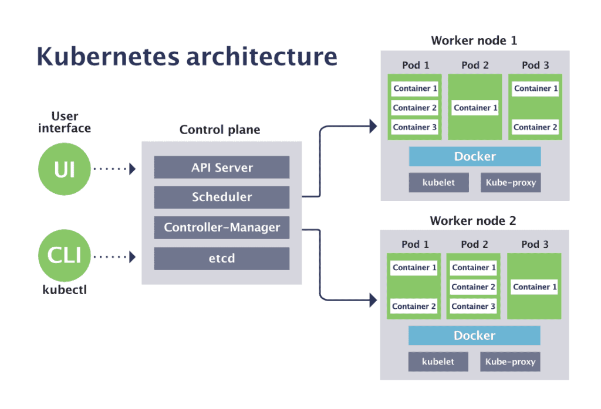
    - API Server
      - everything is an API call served by the Kubernetes API server (kube-apiserver). 
      - The API server is a gateway to an etcd datastore that maintains the desired state of your application cluster.
    - Controllers
      - Once you’ve declared the desired state of your cluster using the API server, controllers ensure that the cluster’s current state matches the desired state by continuously watching the state of the API server and reacting to any changes.
      - Ex. when you create a new Pod using the API server, the Kubernetes scheduler (a controller) notices the change and makes a decision about where to place the Pod in the cluster. It then writes that state change using the API server (backed by etcd). 
      - The kubelet (a controller) then notices that new change and sets up the required networking functionality to make the Pod reachable within the cluster.
    - Scheduler
      - 调度程序是一个控制平面进程，它将 pod 分配给节点。它监视没有分配节点的新创建的 pod，并且对于调度程序发现的每个 pod，调度程序负责为该 pod 找到运行的最佳节点。
      - 调度程序不会指示所选节点运行 pod。Scheduler 所做的只是通过 API Server 更新 pod 定义。API server 通过 watch 机制通知 Kubelet pod 已经被调度。然后目标节点上的 kubelet 服务看到 pod 已被调度到它的节点，它创建并运行 pod 的容器。
    - Pod
      - A Pod is the atom of Kubernetes — the smallest deployable object for building applications.
      - A single Pod represents a running workload in your cluster and encapsulates one or more Docker containers, any required storage, and a unique IP address.
    - [Container](https://www.docker.com/resources/what-container/)
      - A container is a standard unit of software that packages up code and all its dependencies so the application runs quickly and reliably from one computing environment to another.
      - Cgroups - Limits and accounting of CPU memory network - configured by container runtime
      - Namespace - Isolation of process, CPU mount user network .. - configured by container runtime
    - Node
      - Nodes are the machines running the Kubernetes cluster. These can be bare metal, virtual machines, or anything else.
    - CNI
      - Some CNI plugins do a lot more than just ensuring Pods have IP addresses and that they can talk to each other
      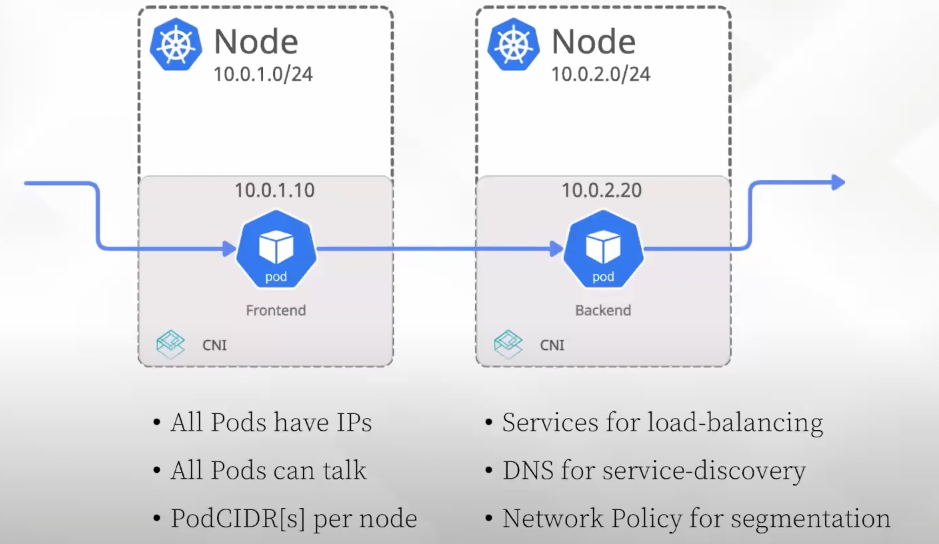
      - [AWS CNI](https://github.com/aws/amazon-vpc-cni-k8s/blob/master/docs/cni-proposal.md)
      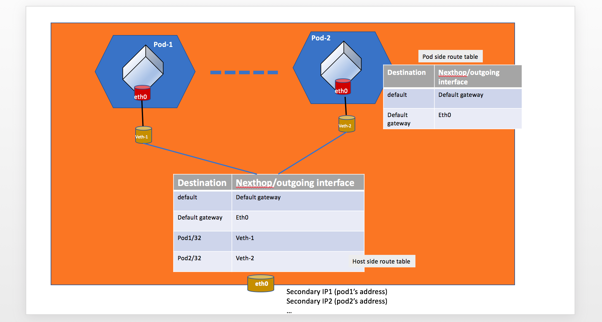
    - Services
      - because of the ephemeral nature of Pods, it is almost never a good idea to directly use Pod IP addresses. Pod IP addresses are not persisted across restarts and can change without warning, in response to events that cause Pod restarts (such as application failures, rollouts, rollbacks, scale-up/down, etc.).
      - Kubernetes Service objects allow you to assign a single virtual IP address to a set of Pods. It works by keeping track of the state and IP addresses for a group of Pods and proxying / load-balancing traffic to them
      - Pods can also use internally available DNS names instead of Service IP addresses. This DNS system is powered by CoreDNS
    - Endpoints
      - how do Services know which Pods to track, and which Pods are ready to accept traffic? The answer is Endpoints
      - 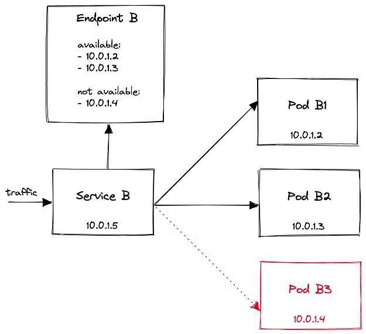
    - Kubelet
      - Kubelet 是在集群中的每个节点上运行的代理，是负责在工作节点上运行的所有内容的组件。它确保容器在 Pod 中运行。
      - 通过在 API Server 中创建节点资源来注册它正在运行的节点。
      - 持续监控 API Server 上已调度到节点的 Pod。
      - 使用配置的容器运行时启动 pod 的容器。
      - 持续监控正在运行的容器并将其状态、事件和资源消耗报告给 API Server。
      - 运行容器活性探测，在探测失败时重新启动容器，在容器的 Pod 从 API Server 中删除时终止容器，并通知服务器 Pod 已终止。
    - Kube-proxy
      - 它负责监视 API Server 以了解Service和 pod 定义的更改，以保持整个网络配置的最新状态。当一个Service由多个 pod 时，proxy会在这些 pod 之间负载平衡。
      - kube-proxy 之所以得名，是因为它是一个实际的代理服务器，用于接受连接并将它们代理到 Pod，当前的实现使用 iptables 或 ipvs 规则将数据包重定向到随机选择的后端 Pod，而不通过实际的代理服务器传递它们。
  - K8S network requirement
    - all pods can communicate with all other pods without using network address translation (NAT)
    - all Nodes can communicate with all Pods without NAT
    - the IP that a Pod sees itself as is the same IP that others see it as
  - Container to Container network
    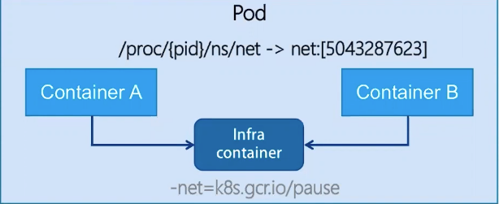
    - Containers in a pod has the same network namespace
      - they have same network configuration
      - sharing the same Pod IP address
    - network accessing via loopback or eth0 interface
    - package are always handled in the network namespace
    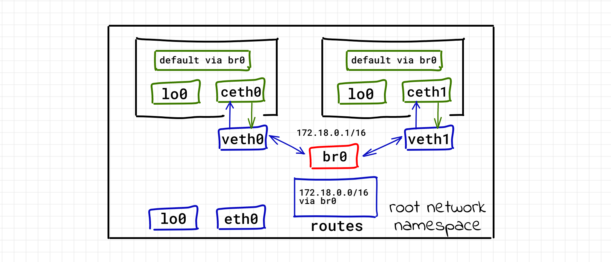
  - Pod to Pod network
    - every Pod has a real IP address and each Pod communicates with other Pods using that IP address.
    - namespaces can be connected using a Linux `Virtual Ethernet Device` or `veth pair` consisting of two virtual interfaces that can be spread over multiple namespaces.
    - A Linux Ethernet bridge is a virtual Layer 2 networking device used to unite two or more network segments, working transparently to connect two networks together.
    - Bridges implement the ARP protocol to discover the link-layer MAC address associated with a given IP address.
    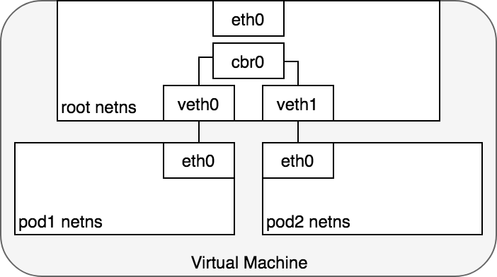
    

    |  | L2 | Route | Overlay | Cloud |
    | --- | --- | --- | --- | --- |
    | Summary | Pods Communicate using L2 | Pods traffic is routed in underlay network | Pod traffic is encapsulated and use underlay for reachability | Pod traffic is routed in cloud virtual network |
    | Underlying Tech | L2 ARP, broadcast | - Routing protocoal - BGP | VxLan, UDP encapluation in user space | Pre-programmed fabric using controller |
    | Ex. | Pod 2 Pod on the same node | - Calico - Flannel(HostGW) | - Flannel - Weave | - GKE - EKS |
    - Overlay network
      - 它是指构建在另一个网络上的计算机网络，这是一种网络虚拟化技术的形式. Overlay 底层依赖的网络就是 Underlay 网络，这两个概念也经常成对出现
      - Underlay 网络是专门用来承载用户 IP 流量的基础架构层，它与 Overlay 网络之间的关系有点类似物理机和虚拟机
      - 在实践中我们一般会使用虚拟局域网扩展技术（Virtual Extensible LAN，VxLAN）组建 Overlay 网络。在下图中，两个物理机可以通过三层的 IP 网络互相访问
      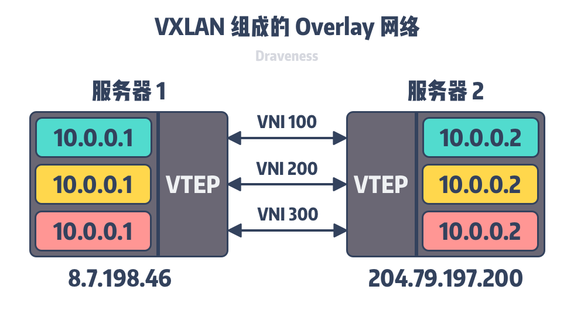
      - VxLAN 使用虚拟隧道端点（Virtual Tunnel End Point、VTEP）设备对服务器发出和收到的数据包进行二次封装和解封。
      - 虚拟网络标识符（VxLAN Network Identifier、VNI）, VxLAN 会使用 24 比特的 VNI 表示虚拟网络个数，总共可以表示 16,777,216 个虚拟网络，这也就能满足数据中心多租户网络隔离的需求了。
      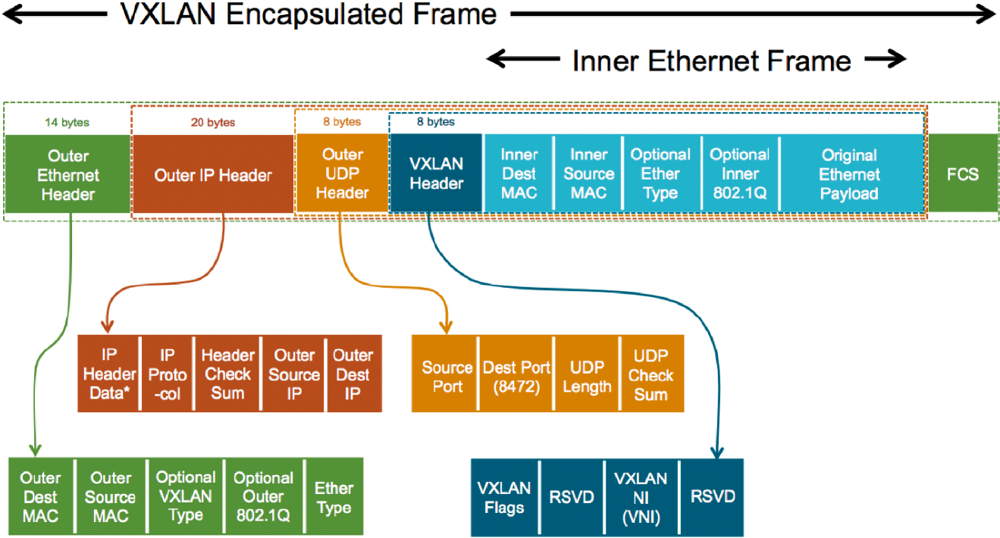
      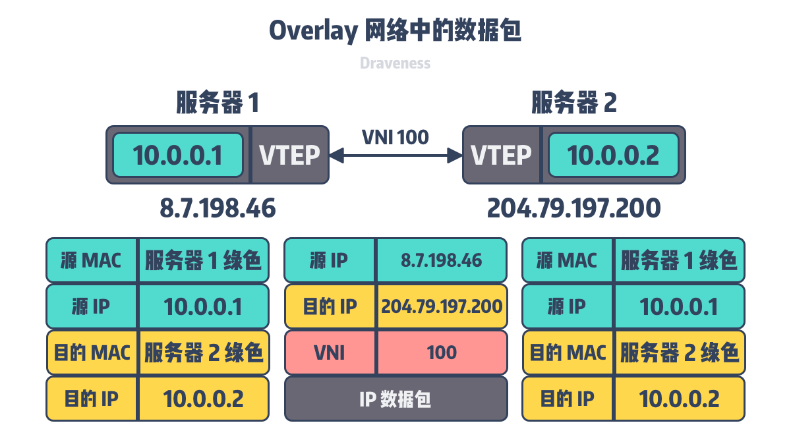
    - Inside Pod
      ```shell
      IP address
      
      # ip addr show
      1: lo: <LOOPBACK,UP,LOWER_UP> mtu 65536 qdisc noqueue state UNKNOWN qlen 1
         link/loopback 00:00:00:00:00:00 brd 00:00:00:00:00:00
         inet 127.0.0.1/8 scope host lo
            valid_lft forever preferred_lft forever
         inet6 ::1/128 scope host 
            valid_lft forever preferred_lft forever
      3: eth0@if231: <BROADCAST,MULTICAST,UP,LOWER_UP,M-DOWN> mtu 1500 qdisc noqueue state UP 
         link/ether 56:41:95:26:17:41 brd ff:ff:ff:ff:ff:ff
         inet 10.0.97.30/32 brd 10.0.97.226 scope global eth0 <<<<<<< ENI's secondary IP address
            valid_lft forever preferred_lft forever
         inet6 fe80::5441:95ff:fe26:1741/64 scope link 
            valid_lft forever preferred_lft forever
      routes
      
      # ip route show
      default via 169.254.1.1 dev eth0 
      169.254.1.1 dev eth0 
      static arp
      
      # arp -a
      ? (169.254.1.1) at 2a:09:74:cd:c4:62 [ether] PERM on eth0
      ```
    - On the Node
      ```shell
      - There are multiple routing tables used to route incoming/outgoing Pod's traffic.
      
      - main (toPod) route table is used to route to Pod traffic
      # ip route show
      default via 10.0.96.1 dev eth0 
      10.0.96.0/19 dev eth0  proto kernel  scope link  src 10.0.104.183 
      10.0.97.30 dev aws8db0408c9a8  scope link  <------------------------Pod's IP
      10.0.97.159 dev awsbcd978401eb  scope link 
      10.0.97.226 dev awsc2f87dc4cdd  scope link 
      10.0.102.98 dev aws4914061689b  scope link 
      ...
      - Each ENI has its own route table which is used to route pod's outgoing traffic, where pod is allocated with one of the ENI's secondary IP address
      # ip route show table eni-1
      default via 10.0.96.1 dev eth1 
      10.0.96.1 dev eth1  scope link 
      - Here is the routing rules to enforce policy routing
      # ip rule list
      0:	from all lookup local 
      512:	from all to 10.0.97.30 lookup main <---------- to Pod's traffic
      1025:	not from all to 10.0.0.0/16 lookup main 
      1536:	from 10.0.97.30 lookup eni-1 <-------------- from Pod's traffic
      ```
  - Pod to Service network
    - Pod IP address - are mutable and will appear and disappear due to scaling up or down
    - Service assign a single VIP for load balance between a group of
    - [Kube-Proxy](https://mayankshah.dev/blog/demystifying-kube-proxy/)
      - a network proxy that runs on each node in your cluster. It watches Service and Endpoints objects and accordingly updates the routing rules on its host nodes to allow communicating over Services.
      - User Model
        - userland TCP/UDP proxy
      - IPtables
        - User IPtables to load-balance traffic
      - IPVS - IPVS (IP Virtual Server) implements transport-layer load balancing, usually called Layer 4 LAN switching, as part of Linux kernel.
        - User kernel LVS
        - Faster than IPtables
      - [IPVS vs IPTABLES](https://github.com/kubernetes/kubernetes/blob/master/pkg/proxy/ipvs/README.md)
        - Both IPVS and IPTABLES are based on netfilter. 
        - Differences between IPVS mode and IPTABLES mode are as follows:
          - IPVS provides better scalability and performance for large clusters.
          - IPVS supports more sophisticated load balancing algorithms than IPTABLES (least load, least connections, locality, weighted, etc.).
          - IPVS supports server health checking and connection retries, etc.
    - Using DNS
      - Kubernetes can optionally use DNS to avoid having to hard-code a Service’s cluster IP address into your application.
      - It configures the kubelets running on each Node so that containers use the DNS Service’s IP to resolve DNS names.
      - A DNS Pod consists of three separate containers:
        - kubedns: watches the Kubernetes master for changes in Services and Endpoints, and maintains in-memory lookup structures to serve DNS requests.
        - dnsmasq: adds DNS caching to improve performance.
        - sidecar: provides a single health check endpoint to perform healthchecks for dnsmasq and kubedns.
    - Service
        ```shell
        
        > kc get svc -n kube-system
        NAME                                TYPE        CLUSTER-IP       EXTERNAL-IP   PORT(S)                        AGE
        kube-dns                            ClusterIP   10.100.0.10      <none>        53/UDP,53/TCP                  25d
        
        > kc get ep -n beta
        NAME                               ENDPOINTS                                                                 AGE
        guild-beta-home-design             172.20.250.219:8080,172.20.251.121:8080                                   21d
        guild-beta-home-design-local       172.20.250.219:9420,172.20.251.121:9420                                   21d
        
        >  kc exec -it commgame-beta-word-connect-6cdbbc8486-qww9v -n beta -- sh
        / # nslookup 172.20.250.219 10.100.0.10
        Server:    10.100.0.10
        Address 1: 10.100.0.10 kube-dns.kube-system.svc.cluster.local
        
        Name:      172.20.250.219
        Address 1: 172.20.250.219 172-20-250-219.guild-beta-home-design.beta.svc.cluster.local
        / # nslookup idgenerator-local.beta.svc.cluster.local
        nslookup: can't resolve '(null)': Name does not resolve
        
        Name:      idgenerator-local.beta.svc.cluster.local
        Address 1: 172.20.250.157 172-20-250-157.idgenerator-local.beta.svc.cluster.local
        ```
  - Internet to Service network
    - Layer 4
      - NodePort
        - Node IP is used for external communication
        - Service is exposed using a reserved port in all nodes of cluster
      - Loadbalance
        - Each service needs to have own external IP
        - Typically implemented as NLB
    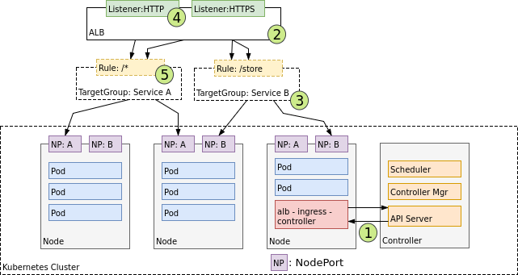
    - Layer 7
      ```shell
      > kc get svc -n beta -o wide
      NAME             TYPE        CLUSTER-IP       EXTERNAL-IP   PORT(S)        AGE    SELECTOR
      word-v5-beta     NodePort    10.100.68.182    <none>        80:32723/TCP   283d   app=word-v5,env=be
      
      > kc get endpoints -n beta -o wide
      NAME             ENDPOINTS                                AGE
      word-v5-beta     172.20.254.146:3021                      283d
      
      > kc get po -n beta -o wide
      NAME                                  READY   STATUS    RESTARTS   AGE     IP               NODE                             NOMINATED NODE   READINESS GATES
      word-v5-beta-8555cc6dcd-7vbkl         1/1     Running   0          7d4h    172.20.254.146   ip-172-20-254-241.ec2.internal   <none>           <none>
      ```
      ```shell
      > iptables -t nat -nL
      
      Chain KUBE-NODEPORTS (1 references)
      target     prot opt source               destination
      KUBE-MARK-MASQ  tcp  --  0.0.0.0/0            0.0.0.0/0            /* beta/word-v5-beta:http */ tcp dpt:32723
      KUBE-SVC-7EUSQI7QIASQWEEM  tcp  --  0.0.0.0/0            0.0.0.0/0            /* beta/word-v5-beta:http */ tcp dpt:32723
      
      Chain KUBE-SERVICES (2 references)
      target     prot opt source               destination
      KUBE-SVC-7EUSQI7QIASQWEEM  tcp  --  0.0.0.0/0            10.100.68.182        /* beta/word-v5-beta:http cluster IP */ tcp dpt:80
      
      Chain KUBE-SVC-7EUSQI7QIASQWEEM (2 references)
      target     prot opt source               destination
      KUBE-SEP-W5KHKXQHUD4WIQCU  all  --  0.0.0.0/0            0.0.0.0/0            /* beta/word-v5-beta:http */
      
      Chain KUBE-SEP-W5KHKXQHUD4WIQCU (1 references)
      target     prot opt source               destination
      KUBE-MARK-MASQ  all  --  172.20.254.146       0.0.0.0/0            /* beta/word-v5-beta:http */
      DNAT       tcp  --  0.0.0.0/0            0.0.0.0/0            /* beta/word-v5-beta:http */ tcp to:172.20.254.146:3021
      ```


- [CNI](https://platform9.com/blog/the-ultimate-guide-to-using-calico-flannel-weave-and-cilium/)
  - flannel
    - Flannel runs a simple overlay network across all the nodes of the Kubernetes cluster. 
    - It provides networking at Layer 3, the Network Layer of the OSI networking model. 
    - Flannel supports [VXLAN](https://support.huawei.com/enterprise/zh/doc/EDOC1100087027) as its default backend, although you can also configure it to use UDP and host-gw. 
    - Some experimental backends like AWS VPC, AliVPC, IPIP, and IPSec are also available, but not officially supported at present.
    - One of the drawbacks of Flannel is its lack of advanced features, such as the ability to configure network policies and firewalls.
  - Calico
    - Calico operates on Layer 3 of the OSI model and uses the BGP protocol to move network packets between nodes in its default configuration with IP in IP for encapsulation. 
    - Using BGP, Calico directs packets natively, without needing to wrap them in additional layers of encapsulation. 
    - This approach improves performance and simplifies troubleshooting network problems compared with more complex backends, like VXLAN.
    - Calico’s most valuable feature is its support for network policies. By defining and enforcing network policies, you can prescribe which pods can send and receive traffic and manage security within the network.
  - Weave
    - Weave creates a mesh overlay between all nodes of a Kubernetes cluster and uses this in combination with a routing component on each node to dynamically route traffic throughout the cluster. By default, Weave routes packets using the fast datapath method, which attempts to send traffic between nodes along the shortest path.
    - Weave includes features such as creating and enforcing network policies and allows you to configure encryption for your entire network. If configured, Weave uses NaCl encryption for sleeve traffic and IPsec ESP encryption for fast datapath traffic.
  - Cilium
    - A relative newcomer to the land of Kubernetes CNI plugins is Cilium. Cilium and its observability tool, Hubble, take advantage of eBPF.


- [LVS](https://new.qq.com/omn/20200718/20200718A05H2H00.html)： 
  - LVS是Linux Virtual Server的简写，也就是Linux 虚拟服务器，是一个虚拟的服务器集群系统.
    通过 LVS 达到的负载均衡技术和 Linux 操作系统实现一个高性能高可用的 Linux 服务器集群，具有良好的可靠性、可扩展性和可操作性
  - LVS 与 Nginx 功能对比
    - LVS 比 Nginx 具有更强的抗负载能力，性能高，对内存和 CPU 资源消耗较低；
    - LVS 工作在网络层，具体流量由操作系统内核进行处理，Nginx 工作在应用层，可针对 HTTP 应用实施一些分流策略；
    - LVS 安装配置较复杂，网络依赖性大，稳定性高。Nginx 安装配置较简单，网络依赖性小；
    - LVS 不支持正则匹配处理，无法实现动静分离效果。
    - LVS 适用的协议范围广。Nginx 仅支持 HTTP、HTTPS、Email 协议，适用范围小；
  - LVS 由两部分程序组成，包括 ipvs 和 ipvsadm
    - ipvs(ip virtual server)：LVS 是基于内核态的 netfilter 框架实现的 IPVS 功能，工作在内核态。用户配置 VIP 等相关信息并传递到 IPVS 就需要用到 ipvsadm 工具。
      - iptables 是位于用户空间，而 Netfilter 是位于内核空间。iptables 只是用户空间编写和传递规则的工具而已，真正工作的还是 netfilter
      - LVS 基于 netfilter 框架，工作在 INPUT 链上，在 INPUT 链上注册 ip_vs_in HOOK 函数，进行 IPVS 相关主流程
    - ipvsadm：ipvsadm 是 LVS 用户态的配套工具，可以实现 VIP 和 RS 的增删改查功能，是基于 netlink 或 raw socket 方式与内核 LVS 进行通信的，如果 LVS 类比于 netfilter，那 ipvsadm 就是类似 iptables 工具的地位。
  - LVS 负载均衡的三种工作模式
    - 地址转换（NAT）
      - 类似于防火墙的私有网络结构，负载调度器作为所有服务器节点的网关，作为客户机的访问入口，也是各节点回应客户机的访问出口，服务器节点使用私有 IP 地址，与负载调度器位于同一个物理网络，安全性要优于其他两种方式。
      - 优点：
      - 支持 Windows 操作系统；
      - 支持端口映射，如 RS 服务器 PORT 与 VPORT 不一致的话，LVS 会修改目的 IP 地址和 DPORT 以支持端口映射；
      - 缺点：
      - RS 服务器需配置网关；
      - 双向流量对 LVS 会产生较大的负载压力；
    - IP 隧道（TUN）
      - 采用开放式的网络结构，负载调度器作为客户机的访问入口，各节点通过各自的 Internet 连接直接回应给客户机，而不经过负载调度器，服务器节点分散在互联网中的不同位置，有独立的公网 IP 地址，通过专用 IP 隧道与负载调度器相互通信。
      - 优点：
        - 单臂模式，LVS 负载压力小；
        - 数据包修改小，信息完整性高；
        - 可跨机房；
      - 缺点：
        - 不支持端口映射；
        - 需在 RS 后端服务器安装模块及配置 VIP；
        - 隧道头部 IP 地址固定，RS 后端服务器网卡可能会不均匀；
        - 隧道头部的加入可能会导致分片，最终会影响服务器性能；
    - 直接路由（DR）
      - 采用半开放式的网络结构，与 TUN 模式的结构类似，但各节点并不是分散在各个地方，而是与调度器位于同一个物理网络，负载调度器与各节点服务器通过本地网络连接，不需要建立专用的 IP 隧道。它是最常用的工作模式，因为它的功能性强大。
      - 优点：
        - 响应数据不经过 LVS，性能高；
        - 对数据包修改小，信息完整性好；
      - 缺点：
        - LVS 与 RS 必须在同一个物理网络；
        - RS 上必须配置 lo 和其他内核参数；
        - 不支持端口映射；
  - LVS 的十种负载调度算法
    - 轮询：Round Robin，将收到的访问请求按顺序轮流分配给群集中的各节点真实服务器中，不管服务器实际的连接数和系统负载。
    - 加权轮询：Weighted Round
    - Robin，根据真实服务器的处理能力轮流分配收到的访问请求，调度器可自动查询各节点的负载情况，并动态跳转其权重，保证处理能力强的服务器承担更多的访问量。
    - 最少连接：Least Connections，根据真实服务器已建立的连接数进行分配，将收到的访问请求优先分配给连接数少的节点，如所有服务器节点性能都均衡，可采用这种方式更好的均衡负载。
    - 加权最少连接：Weighted Least Connections，服务器节点的性能差异较大的情况下，可以为真实服务器自动调整权重，权重较高的节点将承担更大的活动连接负载。
    - 基于局部性的最少连接：LBLC，基于局部性的最少连接调度算法用于目标 IP 负载平衡，通常在高速缓存群集中使用。如服务器处于活动状态且处于负载状态，此算法通常会将发往 IP
    - 地址的数据包定向到其服务器。如果服务器超载（其活动连接数大于其权重），并且服务器处于半负载状态，则将加权最少连接服务器分配给该 IP 地址。
    - 复杂的基于局部性的最少连接：LBLCR，具有复杂调度算法的基于位置的最少连接也用于目标IP负载平衡，通常在高速缓存群集中使用。与 LBLC 调度有以下不同：负载平衡器维护从目标到可以
    - 目标提供服务的一组服务器节点的映射。对目标的请求将分配给目标服务器集中的最少连接节点。如果服务器集中的所有节点都超载，则它将拾取群集中的最少连接节点，并将其添加到目标服务
    - 群中。如果在指定时间内未修改服务器集群，则从服务器集群中删除负载最大的节点，以避免高度负载。
    - 目标地址散列调度算法：DH，该算法是根据目标 IP 地址通过散列函数将目标 IP 与服务器建立映射关系，出现服务器不可用或负载过高的情况下，发往该目标 IP 的请求会固定发给该服务器。
    - 源地址散列调度算法：SH，与目标地址散列调度算法类似，但它是根据源地址散列算法进行静态分配固定的服务器资源。
    - 最短延迟调度：SED，最短的预期延迟调度算法将网络连接分配给具有最短的预期延迟的服务器。如果将请求发送到第 i 个服务器，则预期的延迟时间为（Ci +1）/ Ui，其中 Ci 是第 i
    - 个服务器上的连接数，而 Ui 是第 i 个服务器的固定服务速率（权重） 。
    - 永不排队调度：NQ，从不队列调度算法采用两速模型。当有空闲服务器可用时，请求会发送到空闲服务器，而不是等待快速响应的服务器。如果没有可用的空闲服务器，则请求将被发送到服务器，以使其预期延迟最小化（最短预期延迟调度算法）

- [X.509 Encodings and Conversions](https://www.ssl.com/guide/pem-der-crt-and-cer-x-509-encodings-and-conversions/)
  - You may have seen digital certificate files with a variety of filename extensions, such as .crt, .cer, .pem, or .der. These extensions generally map to two major encoding schemes for X.509 certificates and keys: PEM (Base64 ASCII), and DER (binary). 
  - PEM
    - PEM (originally “Privacy Enhanced Mail”) is the most common format for X.509 certificates, CSRs, and cryptographic keys. A PEM file is a text file containing one or more items in Base64 ASCII encoding, each with plain-text headers and footers (e.g. -----BEGIN CERTIFICATE----- and -----END CERTIFICATE-----)
    - PEM Filename Extensions - .crt, .pem, .cer, .key (for private keys), and .ca-bundle
    - View contents of PEM certificate file `openssl x509 -in CERTIFICATE.pem -text -noout `
    - Convert PEM certificate to DER `openssl x509 -outform der -in CERTIFICATE.pem -out CERTIFICATE.der`
    - Convert PEM certificate with chain of trust to PKCS#7
      - PKCS#7 (also known as P7B) is a container format for digital certificates that is most often found in Windows and Java server contexts, and usually has the extension .p7b. PKCS#7 files are not used to store private keys. In the example below, -certfile MORE.pem represents a file with chained intermediate and root certificates (such as a .ca-bundle file downloaded from SSL.com).
      - `openssl crl2pkcs7 -nocrl -certfile CERTIFICATE.pem -certfile MORE.pem -out CERTIFICATE.p7b`
    - Convert PEM certificate with chain of trust and private key to PKCS#12
      - PKCS#12 (also known as PKCS12 or PFX) is a common binary format for storing a certificate chain and private key in a single, encryptable file, and usually have the filename extensions .p12 or .pfx. In the example below, -certfile MORE.pem adds a file with chained intermediate and root certificates (such as a .ca-bundle file downloaded from SSL.com), and -inkey PRIVATEKEY.key adds the private key for CERTIFICATE.crt(the end-entity certificate). Please see this how-to for a more detailed explanation of the command shown.
      - `openssl pkcs12 -export -out CERTIFICATE.pfx -inkey PRIVATEKEY.key -in CERTIFICATE.crt -certfile MORE.crt`
  - DER
    - DER (Distinguished Encoding Rules) is a binary encoding for X.509 certificates and private keys. Unlike PEM, DER-encoded files do not contain plain text statements such as -----BEGIN CERTIFICATE-----.
    - DER Filename Extensions - .der and .cer.
    - View contents of DER-encoded certificate file  `openssl x509 -inform der -in CERTIFICATE.der -text -noout`
    - Convert DER-encoded certificate to PEM `openssl x509 -inform der -in CERTIFICATE.der -out CERTIFICATE.pem`


