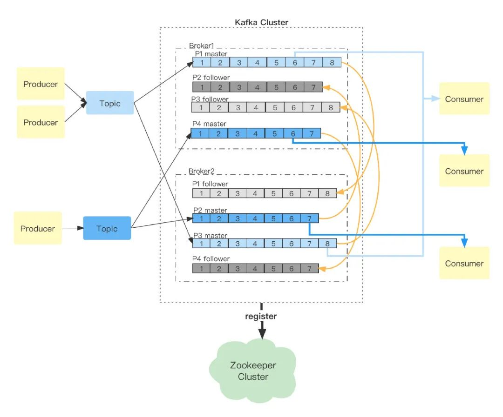
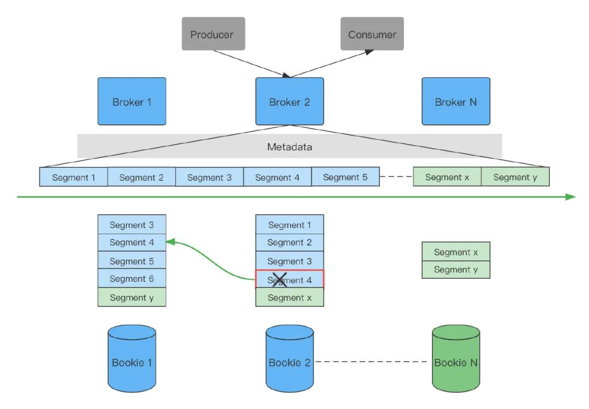
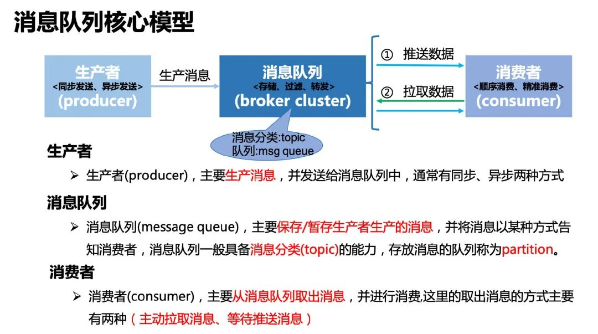
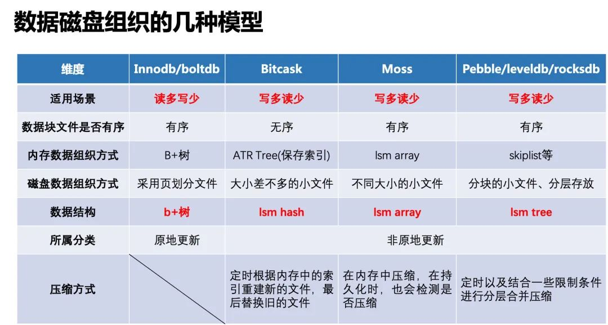
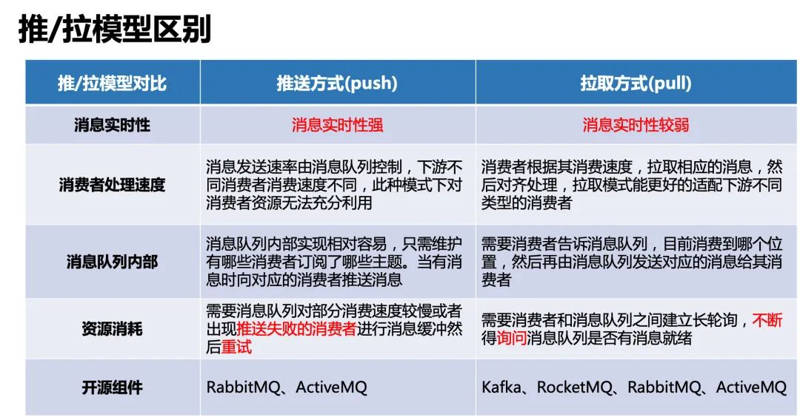
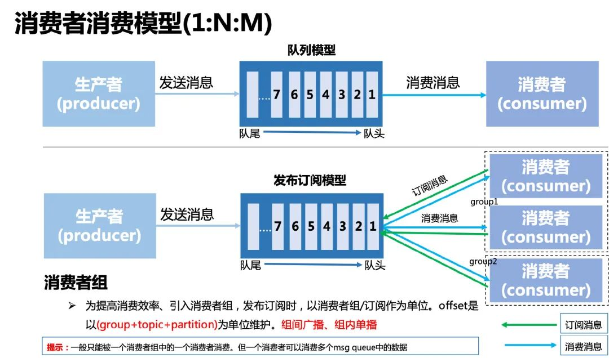
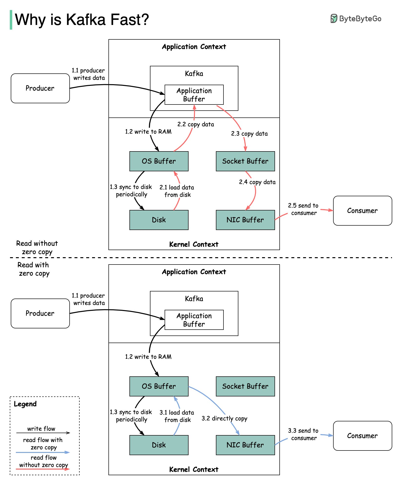

- [Kafka保证无消息丢失](https://mp.weixin.qq.com/s/XoSi3Cgp7ij-n9t4pvBoXQ)

  基于：https://github.com/Shopify/sarama

  有些概念我们也介绍一下：
  - **Producer**：数据的生产者，可以将数据发布到所选择的topic中。
  - **Consumer**：数据的消费者，使用Consumer Group进行标识，在topic中的每条记录都会被分配给订阅消费组中的一个消费者实例，消费者实例可以分布在多个进程中或者多个机器上。
  - **Broker**：消息中间件处理节点（服务器），一个节点就是一个broker，一个Kafka集群由一个或多个broker组成。
  - **topic**：可以理解为一个消息的集合，topic存储在broker中，一个topic可以有多个partition分区，一个topic可以有多个Producer来push消息，一个topic可以有多个消费者向其pull消息，一个topic可以存在一个或多个broker中。
  - **partition**：其是topic的子集，不同分区分配在不同的broker上进行水平扩展从而增加kafka并行处理能力，同topic下的不同分区信息是不同的，同一分区信息是有序的；每一个分区都有一个或者多个副本，其中会选举一个leader，fowller从leader拉取数据更新自己的log（每个分区逻辑上对应一个log文件夹），消费者向leader中pull信息。

  丢消息的三个点
  - 生产者push消息
  
    流程：
    
    通过这个流程我们可以看到kafka最终会返回一个ack来确认推送消息结果，这里kafka提供了三种模式：
    - NoResponse RequiredAcks = 0：这个代表的就是数据推出的成功与否都与我无关了
    - WaitForLocal RequiredAcks = 1：当local(leader)确认接收成功后，就可以返回了
    - WaitForAll RequiredAcks = -1：当所有的leader和follower都接收成功时，才会返回

  - kafka集群自身故障造成
    kafka集群接收到数据后会将数据进行持久化存储，最终数据会被写入到磁盘中，在写入磁盘这一步也是有可能会造成数据损失的
  - 消费者pull消息节点

    push消息时会把数据追加到Partition并且分配一个偏移量，这个偏移量代表当前消费者消费到的位置，通过这个Partition也可以保证消息的顺序性，消费者在pull到某个消息后，可以设置自动提交或者手动提交commit，提交commit成功，offset就会发生偏移:
    
    自动提交会带来数据丢失的问题，手动提交会带来数据重复的问题，分析如下：
    - 在设置自动提交的时候，当我们拉取到一个消息后，此时offset已经提交了，但是我们在处理消费逻辑的时候失败了，这就会导致数据丢失了
    - 在设置手动提交时，如果我们是在处理完消息后提交commit，那么在commit这一步发生了失败，就会导致重复消费的问题。

  方案：
  - 解决push消息丢失问题 - 生产者配置适当的 "acks "和 "retries"，以确保消息被发送到代理
    - 通过设置RequiredAcks模式来解决，选用WaitForAll可以保证数据推送成功，不过会影响时延时
    - 引入重试机制，设置重试次数和重试间隔
     ```go
      cfg.Producer.RequiredAcks = sarama.WaitForAll // 三种模式任君选择
      cfg.Producer.Partitioner = sarama.NewHashPartitioner
      cfg.Producer.Return.Successes = true
      cfg.Producer.Return.Errors = true
      cfg.Producer.Retry.Max = 3 // 设置重试3次
      cfg.Producer.Retry.Backoff = 100 * time.Millisecond
     ```
  - Broker
    - 为了提高 I/O 吞吐量，消息通常会异步刷到磁盘上，因此如果实例在刷新之前宕机，消息就会丢失。
    - Kafka 集群中的副本需要正确配置，以保持数据的有效副本。数据同步的确定性非常重要。
  - 解决pull消息丢失问题
    - 直接使用自动提交的模式，使用幂等性操作应对产生重复消费的问题
    - 手动提交与自动提交结合- 一个好的做法是将同步提交和异步提交结合起来，在处理消息的循环中使用异步提交以提高吞吐量，在异常处理中使用同步提交以确保最后的偏移始终被提交
    
     ```go
      cfg.Consumer.Group.Rebalance.Strategy = sarama.BalanceStrategyRange
      cfg.Consumer.Offsets.Initial = sarama.OffsetOldest
      cfg.Consumer.Offsets.Retry.Max = 3
      cfg.Consumer.Offsets.AutoCommit.Enable = true // 开启自动提交，需要手动调用MarkMessage才有效
      cfg.Consumer.Offsets.AutoCommit.Interval = 1 * time.Second // 间隔
     ```
- 如何保证 MQ消息是有序的
  - 如何保证一个队列，只有一个线程在处理消息呢
  - 如果扩容了怎么办
  - 顺序消息，如果某条失败了怎么办？会不会一直阻塞？
- [Kafka、RocketMQ 、RabbitMQ 和 ActiveMQ](https://mp.weixin.qq.com/s/GsOcoX9nP12Wzov0V9mezQ)
  - [Kafka](https://mp.weixin.qq.com/s?__biz=Mzg3OTU5NzQ1Mw==&mid=2247484210&idx=1&sn=37029e17a8505df40153dea14b18cb45&chksm=cf0341d0f874c8c63496b59984cfeb4bc338f51c58f39cddb3135a6b6dfa1db512d0824be2a9&token=1692695155&lang=zh_CN&scene=21#wechat_redirect)
    - 它是一个分布式的，支持多分区、多副本，基于 Zookeeper 的分布式消息流平台，它同时也是一款开源的基于发布订阅模式的消息引擎系统。
    - Concept
      - 主题（Topic）：消息的种类称为主题，可以说一个主题代表了一类消息，相当于是对消息进行分类，主题就像是数据库中的表。
      - 分区（partition）：主题可以被分为若干个分区，同一个主题中的分区可以不在一个机器上，有可能会部署在多个机器上，由此来实现 kafka 的伸缩性。
      - 批次：为了提高效率， 消息会分批次写入 Kafka，批次就代指的是一组消息。
      - 消费者群组（Consumer Group）：消费者群组指的就是由一个或多个消费者组成的群体。
      - Broker: 一个独立的 Kafka 服务器就被称为 broker，broker 接收来自生产者的消息，为消息设置偏移量，并提交消息到磁盘保存。
      - Broker 集群：broker 集群由一个或多个 broker 组成。
      - 重平衡（Rebalance）：消费者组内某个消费者实例挂掉后，其他消费者实例自动重新分配订阅主题分区的过程。
  - [RocketMQ](https://mp.weixin.qq.com/s?__biz=Mzg3OTU5NzQ1Mw==&mid=2247484233&idx=1&sn=8f565a54d62c9817fd99bc972e0e75b9&chksm=cf0341abf874c8bd45d2587a0f26cb9a1852a27509478e1e101785ad2dd4222d9c8252340b45&token=1692695155&lang=zh_CN&scene=21#wechat_redirect)
    - RocketMQ 是阿里开源的消息中间件，它是纯 Java 开发，具有高性能、高可靠、高实时、适合大规模分布式系统应用的特点
    - Concept
      - Name 服务器（NameServer）：充当注册中心，类似 Kafka 中的 Zookeeper。
      - Broker: 一个独立的 RocketMQ 服务器就被称为 broker，broker 接收来自生产者的消息，为消息设置偏移量。
      - 主题（Topic）：消息的第一级类型，一条消息必须有一个 Topic。
      - 子主题（Tag）：消息的第二级类型，同一业务模块不同目的的消息就可以用相同 Topic 和不同的 Tag 来标识。
      - 分组（Group）：一个组可以订阅多个 Topic，包括生产者组（Producer Group）和消费者组（Consumer Group）。
      - 队列（Queue）：可以类比 Kafka 的分区 Partition。
  - RabbitMQ
    - 基于 AMQP 协议来实现。 AMQP 的主要特征是面向消息、队列、路由、可靠性、安全。AMQP 协议更多用在企业系统内，对数据一致性、稳定性和可靠性要求很高的场景，对性能和吞吐量的要求还在其次。
    - 概念
      - 信道（Channel）：消息读写等操作在信道中进行，客户端可以建立多个信道，每个信道代表一个会话任务。
      - 交换器（Exchange）：接收消息，按照路由规则将消息路由到一个或者多个队列；如果路由不到，或者返回给生产者，或者直接丢弃。
      - 路由键（RoutingKey）：生产者将消息发送给交换器的时候，会发送一个 RoutingKey，用来指定路由规则，这样交换器就知道把消息发送到哪个队列。
      - 绑定（Binding）：交换器和消息队列之间的虚拟连接，绑定中可以包含一个或者多个 RoutingKey。
  - [消息队列对比](https://mp.weixin.qq.com/s/2nRlakKNtyM0kPibQfJO7g)
    - Kafka
      - 
      - 优点：
        - 高吞吐、低延迟：Kafka 最大的特点就是收发消息非常快，Kafka 每秒可以处理几十万条消息，它的最低延迟只有几毫秒；
        - 高伸缩性：每个主题（topic）包含多个分区（partition），主题中的分区可以分布在不同的主机（broker）中；
        - 高稳定性/容错性：Kafka 是分布式的，一个数据多个副本，某个节点宕机，Kafka 集群能够正常工作；
        - 可扩展性：kafka 集群支持热扩展；
        - 高并发：支持数千个客户端同时读写。
        - 持久性、可靠性、可回溯：Kafka 能够允许数据的持久化存储，消息被持久化到磁盘，并支持数据备份防止数据丢失，支持消息回溯；
        - 消息有序：通过控制能够保证所有消息被消费且仅被消费一次；
        - 有优秀的第三方 Kafka Web 管理界面 Kafka-Manager，在日志领域比较成熟，被多家公司和多个开源项目使用。
      - 缺点：
        - Kafka 单机超过 64 个队列/分区，Load 会发生明显的飙高现象，队列越多，load 越高，发送消息响应时间变长；
        - 不支持消息路由，不支持延迟发送，不支持消息重试；
        - 分区有序：仅在同一分区内保证有序，无法实现全局有序；
        - 无延时消息：消费顺序是按照写入时的顺序，不支持延时消息
        - 重复消费：消费系统宕机、重启导致 offset 未提交；
        - Rebalance：Rebalance 的过程中 consumer group 下的所有消费者实例都会停止工作，等待 Rebalance 过程完成。
      - 使用场景
        - 日志收集：大量的日志消息先写入 kafka，数据服务通过消费 kafka 消息将数据落地；
        - 消息系统：解耦生产者和消费者、缓存消息等；
        - 用户活动跟踪：kafka 经常被用来记录 web 用户或者 app 用户的各种活动，如浏览网页、搜索、点击等活动，这些活动信息被各个服务器发布到 kafka 的 topic 中，然后消费者通过订阅这些 topic 来做实时的监控分析，亦可保存到数据库；
        - 运营指标：记录运营、监控数据，包括收集各种分布式应用的数据，生产各种操作的集中反馈，比如报警和报告；
        - 流式处理：比如 spark streaming。
    - RocketMQ
      - 优点： 
        - 高吞吐：借鉴 Kafka 的设计，单一队列百万消息的堆积能力；
        - 顺序队列：在一个队列中可靠的先进先出（FIFO）和严格的顺序传递；支持拉（pull）和推（push）两种消息模式；
        - 高伸缩性：灵活的分布式横向扩展部署架构，整体架构其实和 kafka 很像；
        - 高容错性：通过ACK机制，保证消息一定能正常消费；
        - 持久化、可回溯：消息可以持久化到磁盘中，支持消息回溯；
        - 消息有序：在一个队列中可靠的先进先出（FIFO）和严格的顺序传递；
        - 支持发布/订阅和点对点消息模型，支持拉、推两种消息模式；
        - 提供 docker 镜像用于隔离测试和云集群部署，提供配置、指标和监控等功能丰富的 Dashboard。
      - 缺点：
        - 不支持消息路由，支持的客户端语言不多，目前是 java 及 c++，其中 c++ 不成熟；
        - 部分支持消息有序：需要将同一类的消息 hash 到同一个队列 Queue 中，才能支持消息的顺序，如果同一类消息散落到不同的 Queue中，就不能支持消息的顺序。
        - 社区活跃度一般。
      - 使用场景
        - 为金融互联网领域而生，对于可靠性要求很高的场景。
    - RabbitMQ
      - 
      - 优点：
        - 支持几乎所有最受欢迎的编程语言：Java，C，C ++，C＃，Ruby，Perl，Python，PHP等等；
        - 支持消息路由：RabbitMQ 可以通过不同的交换器支持不同种类的消息路由；
        - 消息时序：通过延时队列，可以指定消息的延时时间，过期时间TTL等；
        - 支持容错处理：通过交付重试和死信交换器（DLX）来处理消息处理故障；
        - 提供了一个易用的用户界面，使得用户可以监控和管理消息 Broker；
        - 社区活跃度高。
      - 缺点：
        - Erlang 开发，很难去看懂源码，不利于做二次开发和维护，基本只能依赖于开源社区的快速维护和修复 bug；
        - RabbitMQ 吞吐量会低一些，这是因为他做的实现机制比较重；
        - 不支持消息有序、持久化不好、不支持消息回溯、伸缩性一般。
    - Pulsar
      - 采用计算与存储分离架构设计，支持多租户、持久化存储、多机房跨区域数据复制，具有强一致性、高吞吐、低延时及高可扩展性等流数据存储特性，被看作是云原生时代实时消息流传输、存储和计算最佳解决方案。Pulsar 是一个 pub-sub (发布-订阅)模型的消息队列系统
      - 
      - 上面框架图分别演示了扩容、故障转移两种情况。扩容：因业务量增大扩容新增 Bookie N，后续写入的数据 segment x、segment y 写入新增 Bookie 中，为保持均衡扩容结果如上图绿色模块所示。故障转移：Bookie 2 的 segment 4 发生故障，Pulasr 的 Topic 会立马从新选择 Bookie 1 作为处理读写的服务。
      - Broker 是无状态的服务，只服务数据计算不存储，所以 Pulsar 可以认为是一种基于 Proxy 的分布式系统。
      - 优点
        - 灵活扩容
        - 无缝故障恢复
        - 支持延时消息
        - 内置的复制功能，用于跨地域复制如灾备
        - 支持两种消费模型：流（独享模式）、队列（共享模式）
  - 消息队列选型
    - Kafka：追求高吞吐量，一开始的目的就是用于日志收集和传输，适合产生大量数据的互联网服务的数据收集业务，大型公司建议可以选用，如果有日志采集功能，肯定是首选 kafka。
    - RocketMQ：天生为金融互联网领域而生，对于可靠性要求很高的场景，尤其是电商里面的订单扣款，以及业务削峰，在大量交易涌入时，后端可能无法及时处理的情况。RocketMQ 在稳定性上可能更值得信赖，这些业务场景在阿里双 11 已经经历了多次考验，如果你的业务有上述并发场景，建议可以选择 RocketMQ。
    - RabbitMQ：结合 erlang 语言本身的并发优势，性能较好，社区活跃度也比较高，但是不利于做二次开发和维护，不过 RabbitMQ 的社区十分活跃，可以解决开发过程中遇到的 bug。如果你的数据量没有那么大，小公司优先选择功能比较完备的 RabbitMQ。
- [消息队列背后的设计思想](https://mp.weixin.qq.com/s/eitRBEhuunhS0bSl7JDksA)
  - 消息队列核心模型
    - 
  - 消息队列数据组织方式
    - 
  - 获取数据的推、拉两种方案对比
    - 
    - 在 IO 多路复用中，以 epoll 为例，当内核检测到监听的描述符有数据到来时，epoll_wait() 阻塞会返回，上层用户态程序就知道有数据就绪了，然后可以通过 read() 系统调用函数读取数据。这个过程就绪通知，类似于推送，但推送的不是数据，而是数据就绪的信号。具体的数据获取方式还是需要通过拉取的方式来主动读。
    - feeds 流系统用户时间线后台实现方案（读扩散、写扩散）： 读扩散和写扩散更是这样一个 case。对于读扩散而言，主要采用拉取的方式获取数据。而对于写扩散而言，它是典型的数据推送的方式。当然在系统实现中，更复杂的场景往往会选择读写结合的思路来实现
  - 消息队列消费模型
    - 
- [aws 上的 kafka 生产 hang 导致消费停止订阅一例](https://mp.weixin.qq.com/s/uj7jP-ywZD7Z9IYjgAODvA)
  - 有一个 kafka 的 message 的 redirector 模块，收到上游消息后，启动三个 goroutine 转发给下游的 kafka 集群，等待转发全部完毕之后提交 ack，并继续处理下一条消息，是一个比较简单且朴素的设计。
  - 下游的 kafka 集群是 aws 提供的 msk 服务，该服务每月会有例行的安全升级，升级方式是滚动升级，每次更新一个实例，滚动更新直至完毕，持续时间会比较长，可能会有十多分钟
  - 但是这个 redirector 在升级期间却无法进行工作，并且在升级完之后，看起来也不会继续订阅上游的消息，这就有点诡异了
  - 在 Go 里，没什么问题是通过 pprof 和日志定位不出来的，服务无法工作期间，我们可以看看 redirector 模块上的日志：
    - `consumer/broker/26 abandoned subscription to msg_result.u.3_10/0 because consuming was taking too long`
    - 因为 consume 花的时间太长，所以对上游的订阅也被 client 停掉了，为什么会花时间长？只要简单看看 pprof，就能看到阻塞在 sendmessage 上的 goroutine：
    - 可以看到就是发送消息的 goroutine 发生了阻塞，从日志来看 produce 的消息发不出去，所以导致 library 认为 consume 花费时间太长从而放弃了对上游消息的订阅
  - kafka 本身是有多副本以及 min.insync_replica 机制的，比如正常情况下，可以将 kafka 的 insync_replica 设置为 3，但 min.insync_replica 设置为 2，这样只要不是多个副本中所在的 broker 全挂掉，按说 produce 也是不应该发生无限阻塞的。
  - 结果发现是这些 produce 阻塞的队列副本本身设置就有问题。。。。比如 insync_replica 设置为 1，或者 insync_replica = min.insync_replica，这样在滚动重启时都会导致 producer 无法发生消息。
- [为什么不推荐使用Sarama Go客户端收发消息](https://help.aliyun.com/document_detail/266782.html)
  - 所有Sarama Go版本客户端存在以下已知问题：
    - 当Topic新增分区时，Sarama Go客户端无法感知并消费新增分区，需要客户端重启后，才能消费到新增分区。
    - 当Sarama Go客户端同时订阅两个以上的Topic时，有可能会导致部分分区无法正常消费消息。
    - 当Sarama Go客户端的消费位点重置策略设置为Oldest(earliest)时，如果客户端宕机或服务端版本升级，由于Sarama Go客户端自行实现OutOfRange机制，有可能会导致客户端从最小位点开始重新消费所有消息。
  - 建议尽早将Sarama Go客户端替换为Confluent Go客户端
- [RocketMQ 的设计理念](https://mp.weixin.qq.com/s/-SuP4Z-Hf6PTlSsjwABasg)
  - 为了消息持久化，我们设计了 commitlog 文件，通过顺序写的方式保证了文件写入的高性能，但如果每次 producer 写入消息或者 consumer 读取消息都从文件来读写，由于涉及到磁盘 IO 显然性能会有很大的问题，于是我们了解到操作系统读写文件会先将文件加载到内存中的 page cache 中。
  - 由于 page cache 存在内核空间中，还需要将其拷贝到用户空间中才能为进程所用（同样的，写入消息也要写将消息写入用户空间的 buffer，再拷贝到 内核空间中的 page cache），于是我们使用了 mmap 来避免了这次拷贝，这样的话 producer 发送消息只要先把消息写入 page cache 再异步刷盘，而 consumer 只要保证消息进度能跟得上 producer 产生消息的进度，就可以直接从 page cache 中读取消息进行消费，于是 producer 与 consumer 都可以直接从 page cache 中读写消息，极大地提升了消息的读写性能。
  - 那怎么保证 consumer 消费足够快以跟上 producer 产生消息的速度的，显然，让消息分布式，分片存储是一种通用方案，这样的话通过增加 consumer 即可达到并发消费消息的目的
  - 最后，为了避免每次创建 Topic 或者 broker 宕机都得修改 producer/consumer 上的配置，我们引入了 nameserver， 实现了服务的自动发现功能。
  - [和 Kafka 相比，RocketMQ 在架构上做了减法，在功能上做了加法](https://mp.weixin.qq.com/s/oje7PLWHz_7bKWn8M72LUw)
    - Kafka
      - 为了提升单个 topic 的并发性能，将单个 topic 拆为多个 partition。
      - 为了提升系统扩展性，将多个 partition 分别部署在不同 broker 上
      -  为了提升系统的可用性，为 partition 加了多个副本。
      - 为了协调和管理 Kafka 集群的数据信息，引入Zookeeper作为协调节点
    - RocketMQ
      - RocketMQ 直接将 Zookeeper 去掉，换成了 nameserver，用一种更轻量的方式，管理消息队列的集群信息。
- [重构 Kafka?](https://mp.weixin.qq.com/s/_RIvZwK1sJJP8xnUDyAk1Q)
  - Kafka 架构的缺陷
    - Kafka 把 broker 和 partition 的数据存储牢牢绑定在一起，会产生很多问题。
      - Kafka 的很多操作都涉及 partition 数据的全量复制
        - 典型的扩容场景，假设有broker1, broker2两个节点，它们分别负责若干个 partition，现在我想新加入一个broker3节点分摊broker1的部分负载
        - 给某个 partition 新增一个 follower 副本，那么这个新增的 follower 副本必须要跟 leader 副本同步全量数据。毕竟 follower 存在的目的就是随时替代 leader，所以复制 leader 的全量数据是必须的。
        - 因为 broker 要负责存储，所以整个集群的容量可能局限于存储能力最差的那个 broker 节点。而且如果某些 partition 中的数据特别多（数据倾斜），那么对应 broker 的磁盘可能很快被写满，这又要涉及到 partition 的迁移，数据复制在所难免。
    - Kafka 底层依赖操作系统的 Page Cache，会产生很多问题
      - 首先一个问题就是 Kafka 消息持久化并不可靠，可能丢消息
        - Linux 文件系统会利用 Page Cache 机制优化性能。Page Cache 说白了就是读写缓存，Linux 告诉你写入成功，但实际上数据并没有真的写进磁盘里，而是写到了 Page Cache 缓存里，可能要过一会儿才会被真正写入磁盘。
          那么这里面就有一个时间差，当数据还在 Page Cache 缓存没有落盘的时候机器突然断电，缓存中的数据就会永远丢失。
      - 消费者消费数据的情况，主要有两种可能：一种叫追尾读（Tailing Reads），一种叫追赶读（Catch-up Reads）
        - 追尾读，顾名思义，就是消费者的消费速度比较快，生产者刚生产一条消息，消费者立刻就把它消费了 生产者写入消息，broker 把消息写入 Page Cache 写缓存，然后消费者马上就来读消息，那么 broker 就可以快速地从 Page Cache 里面读取这条消息发给消费者，这挺好，没毛病。
        - 追赶读的场景，就是消费者的消费速度比较慢，生产者已经生产了很多新消息了，但消费者还在读取比较旧的数据 此时读写都依赖 Page Cache，所以读写操作可能会互相影响，对一个 partition 的大量读可能影响到写入性能，大量写也会影响读取性能，而且读写缓存会互相争用内存资源，可能造成 IO 性能抖动。
  - 存算分离架构
    - Pulsar 改用多层的存算分离架构，broker 节点只负责计算，把存储的任务交给专业的存储引擎 Bookkeeper 来做
    - 在 Pulsar 中，我们可以把每个 partition 理解成一个文件描述符，broker 只需持有文件描述符，对数据的处理全部甩给存储引擎 Bookkeeper 去做。
    - 由于 Pulsar 中的 broker 是无状态的，所以很容易借助 k8s 这样的基础设施实现弹性扩缩容。
  - 节点对等架构
    - Kafka 使用主从复制的方式实现高可用；而 Bookkeeper 采用 Quorum 机制实现高可用。
    - Bookkeeper 集群是由若干 bookie 节点（运行着 bookie 进程的服务器）组成的，不过和 Kafka 的主从复制机制不同，这些 bookie 节点都是对等的，没有主从的关系。
    - 当 broker 要求 Bookkeeper 集群存储一条消息（entry）时，这条消息会被并发地同时写入多个 bookie 节点进行存储：
  - 读写隔离
    - bookie 节点实现读写隔离，自己维护缓存，不再依赖操作系统的 Page Cache，保证了数据可靠性和高性能。
    - 每个 bookie 节点都拥有两块磁盘，其中 Journal 磁盘专门用于写入数据，Entry Log 磁盘专门用于读取数据，而 memtable 是 bookie 节点自行维护的读写缓存。
      - Journal 盘的写入不依赖 Page Cache，直接强制刷盘（可配置），写入完成后 bookie 节点就会返回 ACK 写入成功
      - 写 Journal 盘的同时，数据还会在 memotable 缓存中写一份，memotable 会对数据进行排序，一段时间后刷入 Entry Log 盘。
      - 这样不仅多了一层缓存，而且 Entry Log 盘中的数据有一定的有序性，在读取数据时可以一定程度上提高性能。
- [消息队列对比](https://mp.weixin.qq.com/s/P8bt9JYIiQlVHzwZfjr0AQ)
- 消息堆积
- [云原生消息引擎 BMQ](https://developer.volcengine.com/articles/7325343303150272539)
  - Kafka
    - （Topic, Partition, Offset）这个三元组可以唯一定位一条消息。
    - 在 Kafka 的 运维过程 中，有四种常见的操作： 重启、替换、扩容和缩容
    - 数据的负载均衡（Balance）是一个重要而复杂的问题。首先，需要考虑多种因素，包括存储空间、写入吞吐量以及消费吞吐量等。
    - 此外，热点问题也是一个值得注意的问题，因为每个 Partition 的负载可能并不一致，有一些 IO 开销大，有一些存储空间占用较多，这就导致了调度的复杂度很高。
    - Kafka 的数据缓存只有操作系统的 Page Cache 可用，并没有自己的缓存，这也使得其在处理大规模、高并发的数据请求时性能不尽如人意
    - 因为 Kafka 对 Page Cache 的使用是不可控的，又由于缓存机制的运行原理，我们无法规定哪些流量可以进入缓存，哪些流量不允许进入缓存。
    - Summary
      - 负载均衡算法复杂，均衡代价大 ：Kafka的负载均衡算法相当复杂。并且，由于负载均衡代价大，无法对负载进行实时调度。
      - 缺少自动的故障恢复手段 ：在面临故障场景时，特别是多机故障时，Kafka的恢复能力非常弱，使得我们的运维工作中充满困难。
      - 重度依赖 Page Cache，同时影响读写 ：由于Kafka重度依赖Page Cache，在高负载情况下会明显影响其读写性能。
  - BMQ 
    - 高性能 ：BMQ 使用 C++ 语言编写，避免了 Kafka 使用的 Java 语言的 GC 等问题。相比于 Kafka 只使用操作系统的 Page Cache，BMQ 提供了多级缓存机制，拥有高效的数据处理能力。
    - 存算分离 ：BMQ 充分使用云存储，实现存储与计算的分离，提高了计算资源的利用率，由云存储组件CloudFS保证数据一致性。
    - 高吞吐 ：BMQ 将数据拆分成多个 Segment 文件，存储在不同的分布式存储系统的不同机器上的不同磁盘上，从而提高了吞吐性能。
    - 低延迟 ：BMQ 的 Broker 节点自动感知写入文件尾部的消息延迟变高，会创建新的 Segment 文件来降低延迟。
- [AutoMQ 是如何通过云原生的架构设计来避免原 Kafka 冷读带来的副作用](https://mp.weixin.qq.com/s/u-3oHMNJqRahFdAJlXCyNg)
- [消息积压](https://mp.weixin.qq.com/s/gl5nNNiLrmgtTkp59ciQSw)
- [Why is Kafka fast?]
  - There are many design decisions that contributed to Kafka’s performance
    - 1. The first one is Kafka’s reliance on Sequential I/O.
    - 2. The second design choice that gives Kafka its performance advantage is its focus on efficiency: zero copy principle.
  - 


