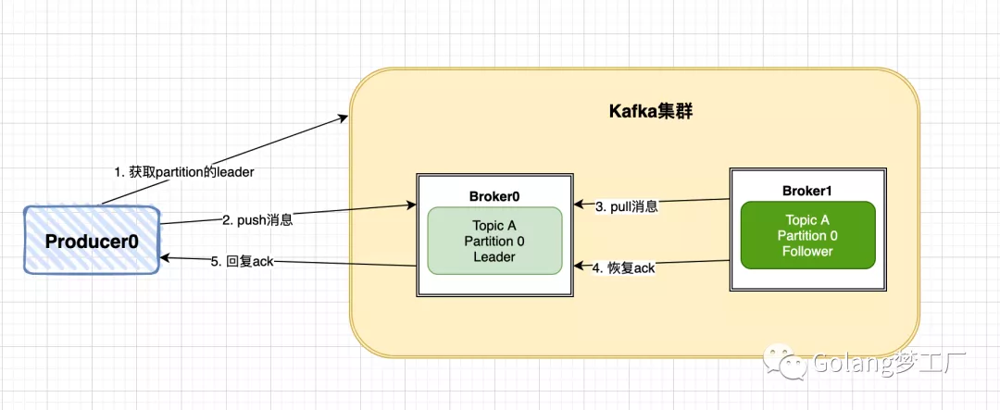
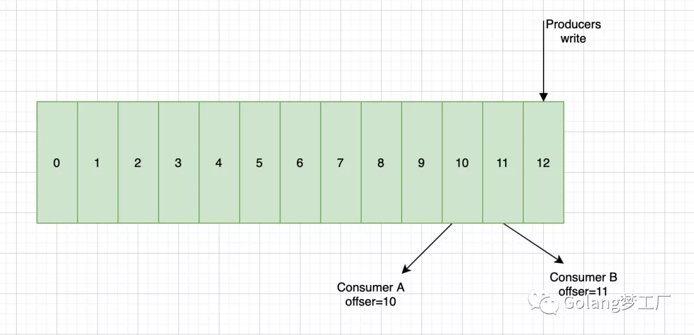

- [Kafka保证无消息丢失](https://mp.weixin.qq.com/s/XoSi3Cgp7ij-n9t4pvBoXQ)

  基于：https://github.com/Shopify/sarama

  有些概念我们也介绍一下：
  - **Producer**：数据的生产者，可以将数据发布到所选择的topic中。
  - **Consumer**：数据的消费者，使用Consumer Group进行标识，在topic中的每条记录都会被分配给订阅消费组中的一个消费者实例，消费者实例可以分布在多个进程中或者多个机器上。
  - **Broker**：消息中间件处理节点（服务器），一个节点就是一个broker，一个Kafka集群由一个或多个broker组成。
  - **topic**：可以理解为一个消息的集合，topic存储在broker中，一个topic可以有多个partition分区，一个topic可以有多个Producer来push消息，一个topic可以有多个消费者向其pull消息，一个topic可以存在一个或多个broker中。
  - **partition**：其是topic的子集，不同分区分配在不同的broker上进行水平扩展从而增加kafka并行处理能力，同topic下的不同分区信息是不同的，同一分区信息是有序的；每一个分区都有一个或者多个副本，其中会选举一个leader，fowller从leader拉取数据更新自己的log（每个分区逻辑上对应一个log文件夹），消费者向leader中pull信息。

  丢消息的三个点
  - 生产者push消息
  
    流程：
    
    通过这个流程我们可以看到kafka最终会返回一个ack来确认推送消息结果，这里kafka提供了三种模式：
    - NoResponse RequiredAcks = 0：这个代表的就是数据推出的成功与否都与我无关了
    - WaitForLocal RequiredAcks = 1：当local(leader)确认接收成功后，就可以返回了
    - WaitForAll RequiredAcks = -1：当所有的leader和follower都接收成功时，才会返回

  - kafka集群自身故障造成
    kafka集群接收到数据后会将数据进行持久化存储，最终数据会被写入到磁盘中，在写入磁盘这一步也是有可能会造成数据损失的
  - 消费者pull消息节点

    push消息时会把数据追加到Partition并且分配一个偏移量，这个偏移量代表当前消费者消费到的位置，通过这个Partition也可以保证消息的顺序性，消费者在pull到某个消息后，可以设置自动提交或者手动提交commit，提交commit成功，offset就会发生偏移:
    
    自动提交会带来数据丢失的问题，手动提交会带来数据重复的问题，分析如下：
    - 在设置自动提交的时候，当我们拉取到一个消息后，此时offset已经提交了，但是我们在处理消费逻辑的时候失败了，这就会导致数据丢失了
    - 在设置手动提交时，如果我们是在处理完消息后提交commit，那么在commit这一步发生了失败，就会导致重复消费的问题。

  方案：
  - 解决push消息丢失问题
    - 通过设置RequiredAcks模式来解决，选用WaitForAll可以保证数据推送成功，不过会影响时延时
    - 引入重试机制，设置重试次数和重试间隔
     ```go
      cfg.Producer.RequiredAcks = sarama.WaitForAll // 三种模式任君选择
      cfg.Producer.Partitioner = sarama.NewHashPartitioner
      cfg.Producer.Return.Successes = true
      cfg.Producer.Return.Errors = true
      cfg.Producer.Retry.Max = 3 // 设置重试3次
      cfg.Producer.Retry.Backoff = 100 * time.Millisecond
     ```
  - 解决pull消息丢失问题
    - 直接使用自动提交的模式，使用幂等性操作应对产生重复消费的问题
    - 手动提交与自动提交结合 TODO
    
     ```go
      cfg.Consumer.Group.Rebalance.Strategy = sarama.BalanceStrategyRange
      cfg.Consumer.Offsets.Initial = sarama.OffsetOldest
      cfg.Consumer.Offsets.Retry.Max = 3
      cfg.Consumer.Offsets.AutoCommit.Enable = true // 开启自动提交，需要手动调用MarkMessage才有效
      cfg.Consumer.Offsets.AutoCommit.Interval = 1 * time.Second // 间隔
     ```


