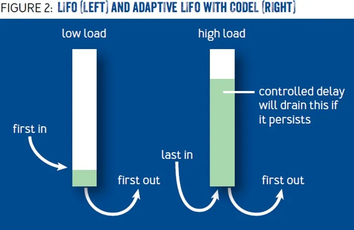
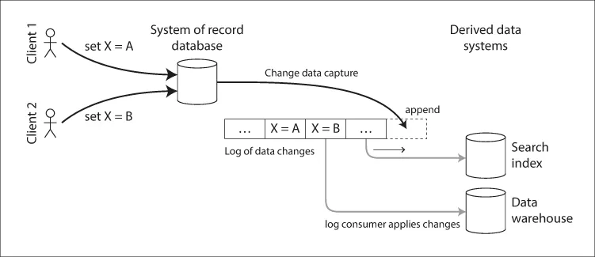
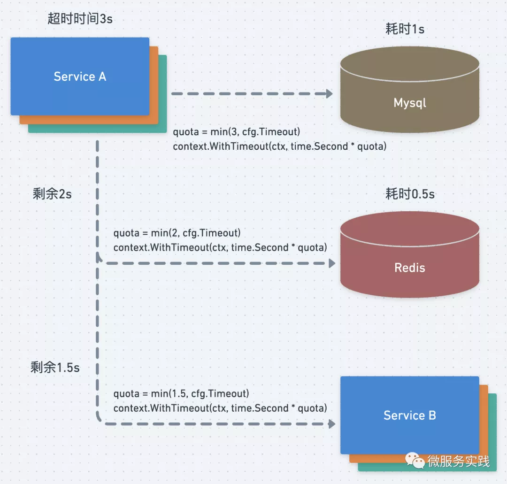
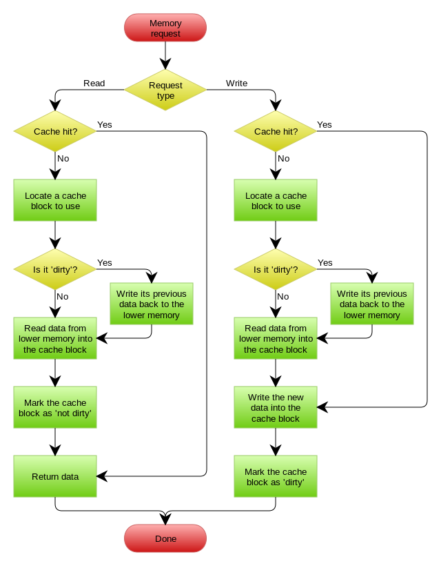

- 服务发现
    - 服务注册是针对服务端的，服务启动后需要注册，分为几个部分：
        - 启动注册
        - 定时续期
        - 退出撤销
    - 服务发现是针对调用端的，一般分为两类问题：
        - 存量获取
        - 增量侦听
        - 还有一个常见的工程问题是： 应对服务发现故障

- [Fail at Scale, Reliability in the face of rapid change](https://mp.weixin.qq.com/s/BNOr5e92atc2RZstv_afwQ) 
  - 如果大规模请求都慢了，会引起 Go GC 压力增加，最终导致服务不可用。Facebook 采了两种方法解决
    - Controlled Delay: 算法根据不同负载处理排队的请求，解决入队速率与处理请求速率不匹配问题
      ```go
      onNewRequest(req, queue):
      
        if (queue.lastEmptyTime() < (now - N seconds)) {
           timeout = M ms
        } else {
           timeout = N seconds;
        }
        queue.enqueue(req, timeout)
      ```
      如果过去 N 秒内队列不为空，说明处理不过来了，那么超时时间设短一些 M 毫秒，否则超时时间可以设长一些。Facebook 线上 M 设置为 5ms, N 是 100ms
    - Adaptive LIFO: 正常队列是 First In First Out 的，但是当业务请理慢，请求堆积时，超时的请求，用户可能己经重试了，还不如处理后入队的请求
      
    - Concurreny Control: 并发控制, 论文描述的其实就是 circuit breaker, 如果 inflight 请求过多，或是错误过多，会触发 Client 熔断

- [Go 官方限流器](https://mp.weixin.qq.com/s/qAKQm9CVNxk-ltUxHql1nw)

  [常见的限流算法](https://mp.weixin.qq.com/s?__biz=MzUzNTY5MzU2MA==&mid=2247486937&idx=1&sn=d4ea6ebb38c52e8004e73f235bde9848&scene=21#wechat_redirect) 有固定窗口、滑动窗口、漏桶、令牌桶
  - 计数器是一种比较简单粗暴的限流算法，其思想是在固定时间窗口内对请求进行计数，与阀值进行比较判断是否需要限流，一旦到了时间临界点，将计数器清零
    - 计数器算法存在“时间临界点”缺陷, 计数器算法实现限流的问题是没有办法应对突发流量
    ```go
    type LimitRate struct {
       rate  int           //阀值
       begin time.Time     //计数开始时间
       cycle time.Duration //计数周期
       count int           //收到的请求数
       lock  sync.Mutex    //锁
    }
    
    func (limit *LimitRate) Allow() bool {
       limit.lock.Lock()
       defer limit.lock.Unlock()
    
       // 判断收到请求数是否达到阀值
       if limit.count == limit.rate-1 {
          now := time.Now()
          // 达到阀值后，判断是否是请求周期内
          if now.Sub(limit.begin) >= limit.cycle {
             limit.Reset(now)
             return true
          }
          return false
       } else {
          limit.count++
          return true
       }
    }
    
    func (limit *LimitRate) Set(rate int, cycle time.Duration) {
       limit.rate = rate
       limit.begin = time.Now()
       limit.cycle = cycle
       limit.count = 0
    }
    
    func (limit *LimitRate) Reset(begin time.Time) {
       limit.begin = begin
       limit.count = 0
    }
    ```
  - 滑动窗口算法将一个大的时间窗口分成多个小窗口，每次大窗口向后滑动一个小窗口，并保证大的窗口内流量不会超出最大值，这种实现比固定窗口的流量曲线更加平滑。
    - 滑动窗口算法是固定窗口的一种改进，但从根本上并没有真正解决固定窗口算法的临界突发流量问题
    - kratos框架里circuit breaker用循环列表保存timeSlot对象的实现，他们这个实现的好处是不用频繁的创建和销毁timeslot对象
     ```go
     type timeSlot struct {
      timestamp time.Time // 这个timeSlot的时间起点
      count     int       // 落在这个timeSlot内的请求数
     }
     
     // 统计整个时间窗口中已经发生的请求次数
     func countReq(win []*timeSlot) int {
      var count int
      for _, ts := range win {
       count += ts.count
      }
      return count
     }
     
     type SlidingWindowLimiter struct {
      mu           sync.Mutex    // 互斥锁保护其他字段
      SlotDuration time.Duration // time slot的长度
      WinDuration  time.Duration // sliding window的长度
      numSlots     int           // window内最多有多少个slot
      windows      []*timeSlot
      maxReq       int // 大窗口时间内允许的最大请求数
     }
     
     func NewSliding(slotDuration time.Duration, winDuration time.Duration, maxReq int) *SlidingWindowLimiter {
      return &SlidingWindowLimiter{
       SlotDuration: slotDuration,
       WinDuration:  winDuration,
       numSlots:     int(winDuration / slotDuration),
       maxReq:       maxReq,
      }
     }
     
     
     func (l *SlidingWindowLimiter) validate() bool {
      l.mu.Lock()
      defer l.mu.Unlock()
     
     
      now := time.Now()
      // 已经过期的time slot移出时间窗
      timeoutOffset := -1
      for i, ts := range l.windows {
       if ts.timestamp.Add(l.WinDuration).After(now) {
        break
       }
       timeoutOffset = i
      }
      if timeoutOffset > -1 {
       l.windows = l.windows[timeoutOffset+1:]
      }
     
      // 判断请求是否超限
      var result bool
      if countReq(l.windows) < l.maxReq {
       result = true
      }
     
      // 记录这次的请求数
      var lastSlot *timeSlot
      if len(l.windows) > 0 {
       lastSlot = l.windows[len(l.windows)-1]
       if lastSlot.timestamp.Add(l.SlotDuration).Before(now) {
        // 如果当前时间已经超过这个时间插槽的跨度，那么新建一个时间插槽
        lastSlot = &timeSlot{timestamp: now, count: 1}
        l.windows = append(l.windows, lastSlot)
       } else {
        lastSlot.count++
       }
      } else {
       lastSlot = &timeSlot{timestamp: now, count: 1}
       l.windows = append(l.windows, lastSlot)
      }
     
     
      return result
     }
     ```
  - 漏桶算法是首先想象有一个木桶，桶的容量是固定的。当有请求到来时先放到木桶中，处理请求的worker以固定的速度从木桶中取出请求进行相应。如果木桶已经满了，直接返回请求频率超限的错误码或者页面。
    - [漏桶算法](https://github.com/kevinyan815/gocookbook/issues/28) 是流量最均匀的限流实现方式，一般用于流量“整形”。例如保护数据库的限流，先把对数据库的访问加入到木桶中，worker再以db能够承受的qps从木桶中取出请求，去访问数据库。
    - 木桶流入请求的速率是不固定的，但是流出的速率是恒定的。这样的话能保护系统资源不被打满，但是面对突发流量时会有大量请求失败，不适合电商抢购和微博出现热点事件等场景的限流。
     ```go
     type LeakyBucket struct {
        rate       float64    // 每秒固定流出速率
        capacity   float64    // 桶的容量
        water      float64    // 当前桶中请求量
        lastLeakMs int64      // 桶上次漏水微秒数
        lock       sync.Mutex // 锁
     }
     
     func (leaky *LeakyBucket) Allow() bool {
        leaky.lock.Lock()
        defer leaky.lock.Unlock()
     
        now := time.Now().UnixNano() / 1e6
        // 计算剩余水量,两次执行时间中需要漏掉的水
        leakyWater := leaky.water - (float64(now-leaky.lastLeakMs) * leaky.rate / 1000)
        leaky.water = math.Max(0, leakyWater)
        leaky.lastLeakMs = now
        if leaky.water+1 <= leaky.capacity {
           leaky.water++
           return true
        } else {
           return false
        }
     }
     
     func (leaky *LeakyBucket) Set(rate, capacity float64) {
        leaky.rate = rate
        leaky.capacity = capacity
        leaky.water = 0
        leaky.lastLeakMs = time.Now().UnixNano() / 1e6
     }
     ```
  - 令牌桶是反向的"漏桶"，它是以恒定的速度往木桶里加入令牌，木桶满了则不再加入令牌。服务收到请求时尝试从木桶中取出一个令牌，如果能够得到令牌则继续执行后续的业务逻辑。如果没有得到令牌，直接返回访问频率超限的错误码或页面等，不继续执行后续的业务逻辑
    - 适合电商抢购或者微博出现热点事件这种场景，因为在限流的同时可以应对一定的突发流量。如果采用漏桶那样的均匀速度处理请求的算法，在发生热点时间的时候，会造成大量的用户无法访问，对用户体验的损害比较大。
     ```go
     type TokenBucket struct {
        rate         int64 //固定的token放入速率, r/s
        capacity     int64 //桶的容量
        tokens       int64 //桶中当前token数量
        lastTokenSec int64 //上次向桶中放令牌的时间的时间戳，单位为秒
     
        lock sync.Mutex
     }
     
     func (bucket *TokenBucket) Take() bool {
        bucket.lock.Lock()
        defer bucket.lock.Unlock()
     
        now := time.Now().Unix()
        bucket.tokens = bucket.tokens + (now-bucket.lastTokenSec)*bucket.rate // 先添加令牌
        if bucket.tokens > bucket.capacity {
           bucket.tokens = bucket.capacity
        }
        bucket.lastTokenSec = now
        if bucket.tokens > 0 {
           // 还有令牌，领取令牌
           bucket.tokens--
           return true
        } else {
           // 没有令牌,则拒绝
           return false
        }
     }
     
     func (bucket *TokenBucket) Init(rate, cap int64) {
        bucket.rate = rate
        bucket.capacity = cap
        bucket.tokens = 0
        bucket.lastTokenSec = time.Now().Unix()
     }
     ```

  `golang.org/x/time/rate`。该限流器也是基于 Token Bucket(令牌桶) 实现的。
  `uber-go/ratelimit`也是一个很好的选择，与Golang官方限流器不同的是Uber的限流器是通过漏桶算法实现的
  [Ref](https://mp.weixin.qq.com/s/dJ3hiuA-8BdNF_ENL-WIUg)
  ```go
    type Limiter struct {
    mu     sync.Mutex
    limit  Limit
    burst  int // 令牌桶的大小
    tokens float64
    last time.Time // 上次更新tokens的时间
    lastEvent time.Time // 上次发生限速器事件的时间（通过或者限制都是限速器事件）
    }
  ```
  其主要字段的作用是：

  - limit：limit字段表示往桶里放Token的速率，它的类型是Limit，是int64的类型别名。设置limit时既可以用数字指定每秒向桶中放多少个Token，也可以指定向桶中放Token的时间间隔，其实指定了每秒放Token的个数后就能计算出放每个Token的时间间隔了。
  - burst: 令牌桶的大小。
  - tokens: 桶中的令牌。
  - last: 上次往桶中放 Token 的时间。
  - lastEvent：上次发生限速器事件的时间（通过或者限制都是限速器事件）

  可以看到在 timer/rate 的限流器实现中，并没有单独维护一个 Timer 和队列去真的每隔一段时间向桶中放令牌，而是仅仅通过计数的方式表示桶中剩余的令牌。每次消费取 Token 之前会先根据上次更新令牌数的时间差更新桶中Token数。

- [如何获取客户端真实 IP](https://mp.weixin.qq.com/s/C-Xf6haLrOWkmBm2lRTdEQ)
  - background
    - 通常我们可以通过 HTTP 协议 Request Headers 中 X-Forwarded-For 头来获取真实 IP。然而通过 X-Forwarded-For 头获取真实 IP 的方式真的可靠么？
  - 方案
    ```go
    // ClientIP 方法可以获取到请求客户端的IP
    func (c *Context) ClientIP() string {
       // 1. ForwardedByClientIP 默认为 true，此处会优先取 X-Forwarded-For 值，
       // 如果 X-Forwarded-For 为空，则会再尝试取 X-Real-Ip
       if c.engine.ForwardedByClientIP {
          clientIP := c.requestHeader("X-Forwarded-For")
          clientIP = strings.TrimSpace(strings.Split(clientIP, ",")[0])
          if clientIP == "" {
             clientIP = strings.TrimSpace(c.requestHeader("X-Real-Ip"))
          }
          if clientIP != "" {
             return clientIP
          }
       }
       // 2. 如果我们手动配置 ForwardedByClientIP 为 false 且 X-Appengine-Remote-Addr 不为空，则取 X-Appengine-Remote-Addr 作为客户端IP
       if c.engine.AppEngine {
          if addr := c.requestHeader("X-Appengine-Remote-Addr"); addr != "" {
             return addr
          }
       }
       // 3. 最终才考虑取对端 IP 兜底
       if ip, _, err := net.SplitHostPort(strings.TrimSpace(c.Request.RemoteAddr)); err == nil {
          return ip
    }
       return ""
    }
    ```
    Gin 框架到 1.7.2 后突然发现一个 『Bug』，升级后服务端无法获正确的客户端 IP，取而代之的是 Kubernetes 集群中 Nginx Ingress IP
    https://github.com/gin-gonic/gin/issues/2697
    
  - X Forward For 伪造？
    - 客户端是否能伪造 IP，取决于边缘节点（Edge Node）是如何处理 X-Forwarded-For 字段。客户端直接连接的首个 Proxy 节点都叫做边缘节点（Edge Node），无论是网关、CDN、LB 等，只要这一层是直接接入客户端访问的，那么它就是一个边缘节点。
    - 不重写 X-Forwarded-For 的边缘节点 边缘节点如果是透传 HTTP 的 X-Forwarded-For 头，那么它就是不安全的，客户端可以在 HTTP 请求中伪造 X-Forwarded-For 值，且这个值会被向后透传。
    - 重写 X-Forwarded-For 的边缘节点 边缘节点如果重写 $remote_addr 到 X-Forwarded-For ，那么这就是安全的。
  - 继续尝试通过 X-Forwarded-For 获取客户端真实 IP
    - 业务中需配置基础设施所有前置代理到 TrustedProxies 中，包含 CDN 地址池、WAF 地址池、Kunernetest Nginx Ingress 地址池，这种方案基本无法落地：
    - 配置太过复杂，一旦获取 IP 不准，很难排查。
    - 导致业务配置和基础设施耦合，基础设施如果对 CDN、WAF、Ingress 做变动，业务代码必须同步变更。
    - 部分可信代理 IP 根本没法配置，比如 CDN 地址池
  - 尝试通过自定义 Header 获取客户端真实 IP
    - 基础设施团队提供自定义 Header 来获取客户端真实 IP，如 X-Client-Real-IP 或 X-Appengine-Remote-Addr 。这种方案需要基础设施团队在云厂商 CDN 或 WAF 终端上做好相应的配置。这种方案：
    - 配置简单可靠，维护成本低，仅需在 CDN、WAF 终端配置自定义 Header 即可。
    - 如果使用 X-Appengine-Remote-Addr，对于使用 Google Cloud 的 App Engine 的服务不需做任何修改。对于使用的国内云厂商的服务，则需要显式的配置 engine. AppEngine = true，然后继续通过 ctx.ClientIP() 方法即可。 
    - 如果使用其他自定义 Header，如 X-Client-Real-IP 来获取客户端真实 IP，建议可以考虑自行封装 ClientIP(*gin.Context) string 函数，从 X-Client-Real-IP 中获取客户端 IP。

- [CDC](https://mp.weixin.qq.com/s/kzRf6zMDfElrN-VKXfo_Cw)
  - Change Data Capture[1] 简称 CDC, 用于异构数据同步，将 database 的数据同步到第三方，这里的 DB 可以是 MySQL, PG, Mongo 等等一切数据源，英文技术圈称之为 Single Source OF True (SSOT), 目标称为 Derived Data Systems。
    
    - alibaba canal
    - go-mysql
  - CDC 旁路模式做同步，主要有三种旁路原理：
    - 触发器 trigger 将更新通过触发器写到专用表 table, 缺点非常多，性能不好，不能异构写 
    - 增加 time 字段，数据惰性删除标记 NULL，CDC 服务定期扫该表。缺点实时无法保证，而且对业务有侵入，要求业务适配 
    - 解析 log, 当前主流实现，Mongodb 读取 oplog, MySQL 读取 binlog

    red hat 出品的 Debezium[6] 开源软件，数据源支持 MySQL,MongoDB,PostgreSQL,SQL Server,Oracle,Db2,Cassandra, 通过 kafka connect 获得增量数据写到 kafka, 供后续业务订阅与消费
  - 事务
    - 基于 binlog 解析实现的 CDC 要求 MySQL 开启 row 模式，并且建义 full image 记录全量字段，这点保证了数据更新的 order 顺序，但是没有保证事务的原子性
    - 解决方案，ringbuffer 等待接收事务所有数据，然后一起提交到消费端
  - 那么如何同步全部基量数据呢
    - Full State Capturue 简称 [FSC](https://netflixtechblog.com/dblog-a-generic-change-data-capture-framework-69351fb9099b)
    - 不做全量备份，开通时间窗口，在窗口期内通过主键 pk 按 chunk (比如 10 条记录一批)扫表，混合扫表和 binlog 解析出来的数据，去掉冲突的部份，不断重复这个过程，直接全部扫完
  - 高可用
    - 可以定期将消费的 binlog pos 同步到 zk/etcd 等外部存储，多个 CDC 服务竞争任务
  - Chore
    - CQRS Command and Query Responsibility Segregation命令查询分离走进视野， [CQRS](https://docs.microsoft.com/en-us/azure/architecture/patterns/cqrs), Event Sourcing

- [负载均衡](https://mp.weixin.qq.com/s/RFjTDNsGiqkMNnkjVus5Zw)
  - 负载均衡的主要作用
    - 高并发：负载均衡通过算法调整负载，尽力均匀的分配应用集群中各节点的工作量，以此提高应用集群的并发处理能力（吞吐量）。
    - 伸缩性：添加或减少服务器数量，然后由负载均衡进行分发控制。这使得应用集群具备伸缩性。
    - 高可用：负载均衡器可以监控候选服务器，当服务器不可用时，自动跳过，将请求分发给可用的服务器。这使得应用集群具备高可用的特性。
    - 安全防护：
  - 软件负载均衡的 主流产品 有：Nginx、HAProxy、LVS。
    - LVS 可以作为四层负载均衡器。其负载均衡的性能要优于 Nginx。
    - HAProxy 可以作为 HTTP 和 TCP 负载均衡器。
    - Nginx、HAProxy 可以作为四层或七层负载均衡器
  - 软件负载均衡从通信层面来看，又可以分为四层和七层负载均衡。
    - 七层负载均衡：就是可以根据访问用户的 HTTP 请求头、URL 信息将请求转发到特定的主机。
      - DNS 重定向
      - HTTP 重定向
      - 反向代理
    - 四层负载均衡：基于 IP 地址和端口进行请求的转发。
      - 修改 IP 地址
      - 修改 MAC 地址
    - DNS 负载均衡
      - 工作原理就是：基于 DNS 查询缓存，按照负载情况返回不同服务器的 IP 地址。
      - 优点：负载均衡工作，交给 DNS 服务器处理，省掉了负载均衡服务器维护的麻烦
      - 缺点：
        - 可用性差 DNS 解析是多级解析，新增/修改 DNS 后，解析时间较长；解析过程中，用户访问网站将失败
        - 扩展性低：DNS 负载均衡的控制权在域名商那里，无法对其做更多的改善和扩展；
        - 维护性差：也不能反映服务器的当前运行状态；支持的算法少；
    - HTTP 负载均衡
    - 反向代理负载均衡
    - IP 负载均衡是在网络层通过修改请求目的地址进行负载均衡
    - 数据链路层负载均衡是指在通信协议的数据链路层修改 mac 地址进行负载均衡
      - 在 Linux 平台上最好的链路层负载均衡开源产品是 LVS (Linux Virtual Server)。LVS 是基于 Linux 内核中 netfilter 框架实现的负载均衡系统。netfilter 是内核态的 Linux 防火墙机制，可以在数据包流经过程中，根据规则设置若干个关卡（hook 函数）来执行相关的操作
      - 进入 PREROUTING 后经过路由查找，确定访问的目的 VIP 是本机 IP 地址，所以数据包进入到 INPUT 链上
      - IPVS 是工作在 INPUT 链上，会根据访问的 vip+port 判断请求是否 IPVS 服务，如果是则调用注册的 IPVS HOOK 函数，进行 IPVS 相关主流程，强行修改数据包的相关数据，并将数据包发往 POSTROUTING 链上。
      - POSTROUTING 上收到数据包后，根据目标 IP 地址（后端服务器），通过路由选路，将数据包最终发往后端的服务器上。
      
- [微服务的超时传递](https://mp.weixin.qq.com/s/vZlFS7lkKplil5cyHirSmA)
  
  当进行context传递的时候，比如上图中请求Redis，那么通过如下方式获取剩余时间，然后对比Redis设置的超时时间取较小的时间
    ```go
    dl, ok := ctx.Deadline()
    timeout := time.Now().Add(time.Second * 3)
    if ok := dl.Before(timeout); ok {
        timeout = dl
    }
    ```
  服务间超时传递主要是指 RPC 调用时候的超时传递，对于 gRPC 来说并不需要要我们做额外的处理，gRPC 本身就支持超时传递，原理和上面差不多，是通过 metadata 进行传递，最终会被转化为 grpc-timeout 的值，如下代码所示 grpc-go/internal/transport/handler_server.go:79
    ```go
    if v := r.Header.Get("grpc-timeout"); v != "" {
      to, err := decodeTimeout(v)
      if err != nil {
       return nil, status.Errorf(codes.Internal, "malformed time-out: %v", err)
      }
      st.timeoutSet = true
      st.timeout = to
    }
    ```
- HTTP 鉴权
  - 鉴权的本质：用户 (user / service) 是否有以及如何获得权限 (Authority) 去操作 (Operate) 哪些资源 (Resource)
    - 认证（Authentication）：系统如何正确分辨出操作用户的真实身份？认证方式有很多种，后面会讲解
    - 授权（Authorization）：系统如何控制一个用户该看到哪些数据、能操作哪些功能？授权与认证是硬币的两面
    - 凭证（Credential）：系统如何保证它与用户之间的承诺是双方当时真实意图的体现，是准确、完整且不可抵赖的？我们一般把凭证代称为 TOKEN
    - 保密（Confidentiality）：系统如何保证敏感数据无法被包括系统管理员在内的内外部人员所窃取、滥用？这里要求我们不能存储明文到 DB 中，不能将密码写到 http url 中，同时要求 id 服务仅有少部分人能够访问，并且有审计
    - 传输（Transport Security）：系统如何保证通过网络传输的信息无法被第三方窃听、篡改和冒充？内网无所谓了，外网一般我们都用 https
    - 验证（Verification）：系统如何确保提交到每项服务中的数据是合乎规则的，不会对系统稳定性、数据一致性、正确性产生风险
  - 验证方式
    - 需要将凭证 Credential 放到 header Authorization 里，凭证可是是用户名密码，也可以是自定义生成的 TOKEN
      - Basic/Digest
      - HMAC 
      - Oauth2
- [缓存更新的套路](https://coolshell.cn/articles/17416.html)
  - Cache aside - Why does Facebook use delete to remove the key-value pair in Memcached instead of updating the Memcached during write request to the backend?
    - 失效：应用程序先从cache取数据，没有得到，则从数据库中取数据，成功后，放到缓存中。
    - 命中：应用程序从cache中取数据，取到后返回。
    - 更新：先把数据存到数据库中，成功后，再让缓存失效。
    - 是不是Cache Aside这个就不会有并发问题了？
      - 不是的，比如，一个是读操作，但是没有命中缓存，然后就到数据库中取数据，此时来了一个写操作，写完数据库后，让缓存失效，然后，之前的那个读操作再把老的数据放进去，所以，会造成脏数据。
      - 但，这个case理论上会出现，不过，实际上出现的概率可能非常低，因为这个条件需要发生在读缓存时缓存失效，而且并发着有一个写操作。而实际上数据库的写操作会比读操作慢得多，而且还要锁表，而读操作必需在写操作前进入数据库操作，而又要晚于写操作更新缓存，所有的这些条件都具备的概率基本并不大。
      - 最好还是为缓存设置上过期时间
  - Read through
    - Read Through 套路就是在查询操作中更新缓存，也就是说，当缓存失效的时候（过期或LRU换出），Cache Aside是由调用方负责把数据加载入缓存，而Read Through则用缓存服务自己来加载，从而对应用方是透明的。
  - Write through
    - Write Through 套路和Read Through相仿，不过是在更新数据时发生。当有数据更新的时候，如果没有命中缓存，直接更新数据库，然后返回。如果命中了缓存，则更新缓存，然后再由Cache自己更新数据库（这是一个同步操作）
  - Write behind caching
    - Write Behind 又叫 Write Back。一些了解Linux操作系统内核的同学对write back应该非常熟悉，这不就是Linux文件系统的Page Cache的算法
    - 在更新数据的时候，只更新缓存，不更新数据库，而我们的缓存会异步地批量更新数据库。
    - 其带来的问题是，数据不是强一致性的，而且可能会丢失
    


