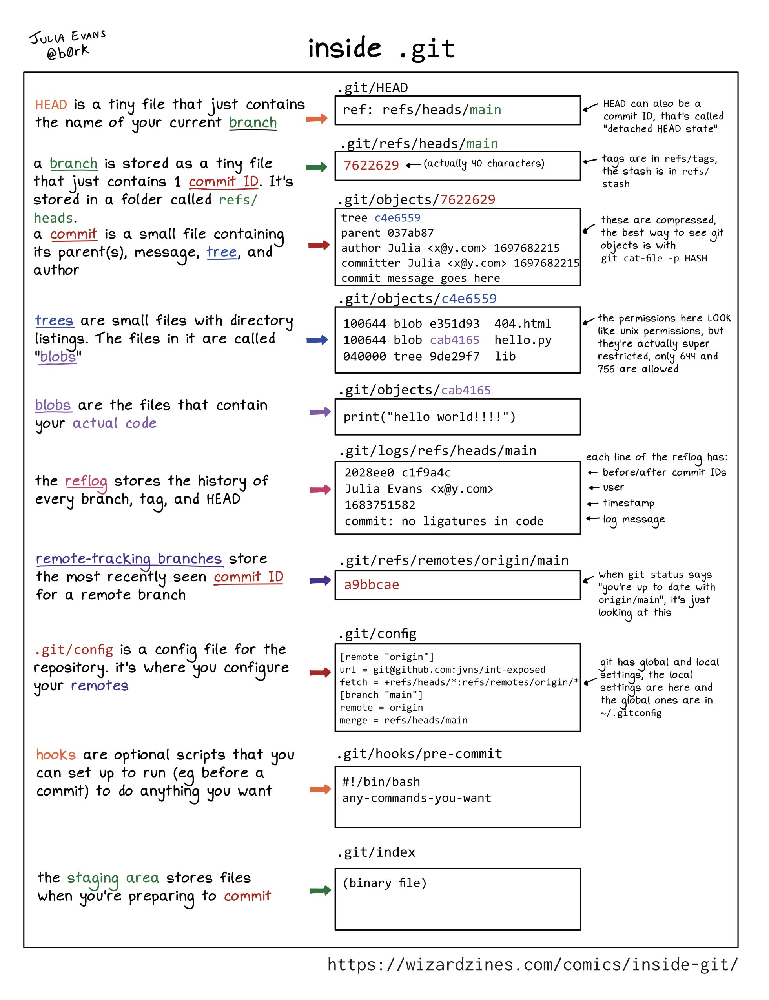
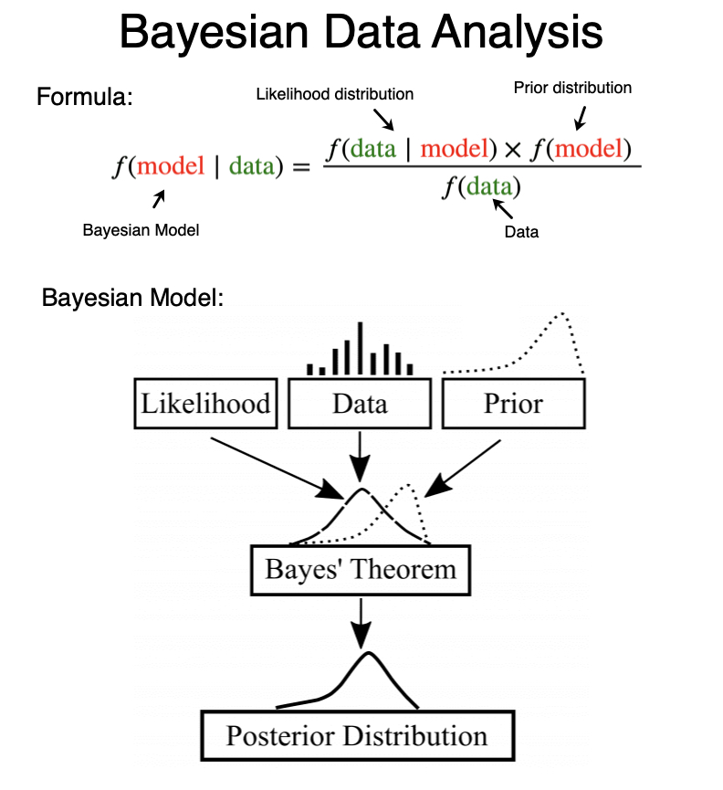

- [Reinvent the Wheel](https://endler.dev/2025/reinvent-the-wheel/)
  - Inventing Wheels Is Learning
  - “重新发明轮子”是深度学习和理解的绝佳途径。引用物理学家费曼的话：“我无法创造的，我就不理解”，强调只有亲手尝试构建，哪怕只是一个简化版，才能真正从根本上理解事物
  - 为了洞察而重新发明，为了影响力而重用（Reinvent for insight. Reuse for impact.）
- [手机居然可以这么偷听你的秘密](https://mp.weixin.qq.com/s/U8fZbVgEHmKSZmt62XFEkw)
  - https://www.ndss-symposium.org/wp-content/uploads/2020/02/24076-paper.pdf
  - 可以采集内置加速传感器的信号，然后通过深度学习算法来解析出语音文字
  - 智能手机加速度传感器的采样频率在持续提升，足以覆盖人的语音的频段
- 37% rule 和 Optimal Stop Theory
  - 选择一种策略，总计N个选项，拒绝前K个选项，从K+1个选项开始只要看到比前K个选项优的选项则选择；K为多少时我们的策略能选到最优解的概率最大？
- copilot-explorer
  - https://thakkarparth007.github.io/copilot-explorer/posts/copilot-internals
  - https://mp.weixin.qq.com/s/dtfLeEfcwbz3fb4mLROVYQ
- Google Tools
  - [Market Finder](https://marketfinder.thinkwithgoogle.com/intl/en)
  - [Google Trends](https://trends.google.com/trends?)
  - [Tools](https://www.thinkwithgoogle.com/tools/)
    - Find my audience
- [Node.js Addon](https://mp.weixin.qq.com/s/6Qm5DpNWEyCBkI9Fh_Z0CA)
- [P 和 NP](http://www.matrix67.com/blog/archives/7084#more-7084)
- [搜索引擎]
  - 多模态语义理解技术在用户意图分析、向量召回、倒排召回以及相关性排序四个方面的业务实践。
  - 短文本理解是用户意图分析的主要手段
    - 对于长尾流量，利用知识库、实体链接方法，将实体的附加信息引入到判别模型，提高长尾 Query 预测准确性；
    - 对于头部流量，采用日志挖掘、系统模拟的方式引入后验数据，提高头部 Query 的预测准确率。
  - 向量检索
    - 跨模态对齐：通过“笔记中的图片和文字“的对比学习、“ Query 和图片“的对比学习，将文本和图像表示到同一个语义空间中。
    - 多模态融合：尝试多种模态融合模型结构，引入多模态 Mask Language Modeling（MLM） 和 Mask Image Modeling (MIM) ，以实现更好的多模态信息融合。
    - 负样本的构造：通过对 Query 和图像进行 Masking、改写和替换，来构造困难的负样本
  -  倒排索引
    - 第一，为笔记生成 Query。针对曝光量较小的笔记，使用生成式模型生成 Query，从而有效提高长尾笔记的召回率。
    - 第二，将多模态内容转化成文本。团队通过视频全文生成技术，生成视频的转写文本，此类语料用于倒排索引中，能在不影响相关性指标的前提下，显著提高视频的召回率。
    - 第三，对笔记进行篇章级的标签提取。团队通过笔记内容与标签的相关性算法剔除无关的 Hashtag（用户上传标签），获取的 Hashtag 语料可以通过弱监督训练来增强多模态内容理解模型能力
  -  相关性排序
    - 多阶段的语言模型训练范式、推理效率问题以及多模态相关性。在相关性训练中，语言模型训练可分为三个阶段：
      - 预训练阶段使用站内文本语料进行无监督预训练；
      - 连续预训练阶段在预训练模型基础上使用搜索日志进行监督训练；
      - 微调阶段在连续训练模型基础上使用人工标注语料进行监督训练。
- [Protobuf编码](https://mp.weixin.qq.com/s/hAfrPlPD2KBCWxpIuGkQTQ)
  - [编码](https://mp.weixin.qq.com/s/RsfHGTcsrfY2WSIQ1rfIWQ)
    - tag + value
    - tag 里面会包含两部分信息：字段序号，字段类型
    - value 里面会包含两部分信息：字段长度，字段值
    - Varints 编码
      - 对于 protobuf 来说对数字类型做了压缩的，普通情况下一个 int32 类型需要 4 byte，而 protobuf 表示127以内的数字只需要 2 byte
      - 变长编码，对于小正整数有较好的压缩效果，对于大整数或负数编码后字节流长度会变大。
    - ZigZag 编码
      - 用于对有符号整数进行编码，将有符号整数转换为无符号整数，然后再使用 Varints 编码
      - sint32 这种类型，采用 zigzag 编码。将所有整数映射成无符号整数，然后再采用 varint 编码方式编码
      - 定长编码，将小正整数和小负整数转换到小正整数，结合varint编码，可以实现对绝对值较小的整数有良好的压缩效果。
    - protobuf既然有了int32 为什么还要用sint32 和 fixed32 ？
      - int32使用varint编码，对于小正数有较好的压缩效果，对于大整数和负数会导致额外的字节开销。
      - 因此引入fixed32，该类型不会对数值进行任何编码，对大于228-1的整数比int32占用更少的字节。而对于负数使用zigzag编码，这样绝对值较小的负数都能被有效压缩。
  - 最佳实践
    - 字段编号
      - 需要注意的是范围 1 到 15 中的字段编号需要一个字节进行编码，包括字段编号和字段类型；范围 16 至 2047 中的字段编号需要两个字节。所以你应该保留数字 1 到 15 作为非常频繁出现的消息元素。
    - 保留字段
      - 可以使用 reserved 来标记被删除的字段
    - 不要修改字段 tag 编号以及字段类型
      - protobuf 序列化是不带字段名的，所以如果客户端的 proto 文件只修改了字段名，请求服务端是安全的，服务端继续用根据序列编号还是解出来原来的字段，但是需要注意的是不要修改字段类型，以及序列编号，修改了之后就可能按照编号找错类型。
  - 基本类型
    - int32、int64、uint32、uint64会直接使用varint编码，
    - bool类型会直接使用一个字节存储，
    - enum可以看成是一个int32类型。
    - 对于sint32、sint64类型会先进行zigzag编码，再进行varint编码
    - varint编码：变长编码，对于小正整数有较好的压缩效果，对于大整数或负数编码后字节流长度会变大。
    - zigzag编码：定长编码，将小正整数和小负整数转换到小正整数再进行varint编码，对绝对值较小的整数有良好的压缩效果。
  -  复合类型
    - map的底层存储key-value键值对，采用和数组类型一样的存储方法，数组中每个元素是kv键值对
    - 结构体类型 typeid、length、data三部分长度会根据实际情况发生改变
  - protobuf既然有了int32 为什么还要用sint32 和 fixed32 ？
    - int32使用varint编码，对于小正数有较好的压缩效果，对于大整数和负数会导致额外的字节开销。因此引入fixed32，该类型不会对数值进行任何编码，对大于2^28-1的整数比int32占用更少的字节。而对于负数使用zigzag编码，这样绝对值较小的负数都能被有效压缩。
  - https://victoriametrics.com/blog/go-protobuf/
  - 
- [Protobuf 动态反射 - Dynamicgo](https://mp.weixin.qq.com/s/OeQwlgZJtYOGTHnN50IdOA)
- [优秀程序员的共性特征](https://mp.weixin.qq.com/s/FKRedldguFVPred7johg8A)
  - 偏执 - 当所有人都真的在给你找麻烦的时候，偏执就是一个好主意
  - 控制软件的熵 
  - 为测试做设计 - 在编码时就考虑怎么测试。不然，你永远没有机会考虑了 
  - 不要面向需求编程 - 应该面向业务模型编程
- [C++的So热更新](https://mp.weixin.qq.com/s/H5vfiuIFW7Qe0r0TsW6BeA)
- [统计方法]
  - SeedFinder: SeedFinder 是一种用于数据挖掘的方法，主要用于在大量数据中找出有价值的信息。它通过一种称为种子的概念，来寻找数据中的模式。种子可以是一个值，一个范围，或者一个条件。这种方法的应用场景包括：用户行为分析，异常检测，推荐系统等。  
  - PreAA 校验: PreAA 校验是一种在实验开始前进行的数据校验方法，主要用于检查实验组和对照组在实验开始前是否存在显著差异。如果存在显著差异，那么实验结果可能会受到这些差异的影响，从而影响实验的有效性。这种方法的应用场景包括：A/B 测试，临床试验，市场研究等。  
  - 双重差分法(Diff in Diff): 双重差分法是一种用于处理观察数据的统计技术，主要用于估计处理效应。它通过比较处理组和对照组在处理前后的变化，来估计处理的效应。这种方法的应用场景包括：政策评估，经济研究，社会科学研究等。  
  - CUPED (Controlled-experiment Using Pre-Experiment Data): CUPED 是一种用于处理实验数据的统计技术，主要用于减少实验结果的方差，从而提高实验的效力。它通过使用实验前的数据来调整实验后的数据，从而减少实验结果的方差。这种方法的应用场景包括：A/B 测试，临床试验，市场研究等。
- [AB测试资料](https://www.volcengine.com/docs/6287/1175850)
  - 实验系统中三个最关键的环节是：干预、测量和分析
  - [未来AB测试系统](https://mp.weixin.qq.com/s/Z54PYpN2NTeKGwjKW16jSg)
  - [A/B测试12问](https://mp.weixin.qq.com/s/o0Chnfs4Rsu93ZQqDGvcNw)
- [实验平台的边界拓展](https://mp.weixin.qq.com/s/aacaDdQgO2riN7-7SreTLg)
- [AB测试中的流量互斥与流量正交]()
  - [Overlapping Experiment Infrastructure: More, Better, Faster Experimentation](https://static.googleusercontent.com/media/research.google.com/zh-CN//pubs/archive/36500.pdf)
  - [AB实验的异质性分析](https://mp.weixin.qq.com/s/FjifDJTSnOYXBymJ0hI5Dw)
  - [随机实验AA问题](https://mp.weixin.qq.com/s/no4nQI31Y3YPnVvIxH4tew)
- [推荐场景下的 A/B 实验](https://mp.weixin.qq.com/s/7wQsdMzuM8H8osoKPfJCig)
  - 推荐场景A/B测试具有复杂性
    - 推荐场景存在多边影响 - 它所影响的角色众多，并且这些角色往往同时受到影响。平台上有3类典型角色：消费者、创作者以及平台方
    - 策略收益评估有偏
      - 简单A/B实验设计的不足 - 实验所评估得到的策略效果，与该策略实际推全后的真实效果并非一致。
      - 导致不一致的典型原因
        - 长短期不一致问题，主要涉及用户的学习效应与指标收敛性两个因素
          - 用户的学习效应 - 用户对于新推荐策略的适应过程，会导致实验初期的效果与实验后期的效果存在差异
          - 指标收敛性 - 由于指标的收敛性，实验初期的效果与实验后期的效果存在差异
          - 双边效应是指，当平台上同时存在消费者和生产者两种身份时，用户侧策略可能同时影响生产者的生产意愿，此时消费侧实验的读数，不能全面地反映策略效果。
          - 网络效应是一种特殊影响，它指的是，当实验组和对照组的用户存在于同一个社交网络的时候，实验处理可能会通过社交互动影响到对照组的用户
  - 双边效应问题及其解决思路
    - 双边实验思路
      - 同时考虑策略的双侧影响 推荐侧流量策略实际上有双边作用，它在影响用户消费行为的同时，也会影响作者的投稿和开播意愿。
      - 基于Counterfactual Framework的双边实验机制，以评估推荐系统的迭代对作者和用户的联合影响，进而相对无偏地刻画出推荐策略的供给侧影响
  - 网络效应问题及其解决思路
    - 基于Leiden算法的社区发现
    - （cluster数量是否均匀）使用卡方检验适合，因其用于检验分类数据的频数分布。
    - cluster-size分布是否均匀）使用非参数秩和检验适合，因其用于比较多个群组的分布，且对数据分布没有严格要求。
    - cluster-size均值是否相同）在数据满足正态性和方差齐性的前提下，使用双样本T检验适合；否则，应考虑其他检验方法
  - | 检验内容              |   检验方法 |
    | -- | -- |
    |cluster数量是否均匀   |   卡方检验  |
    |cluster-size分布是否均匀  | 非参数秩和检验  |
    |cluster-size均值是否相同  | 双样本T检验 |
- [CausalMatch ](https://mp.weixin.qq.com/s/ggZukGRJ-9fcS5s19JPQyg)
  - 复杂双边实验的实验效应估计方法
- [常用的压缩库](https://mp.weixin.qq.com/s/bl1HbC6ti6Pw2FGxgstfBw)
  - zlib的高性能分支，基于cloudflare优化 比 1.2.11的官方分支性能好，压缩CPU开销约为后者的37.5% - 采用SIMD指令加速计算
  - zstd能够在压缩率低于zlib的情况下，获得更低的cpu开销，因此如果希望获得比当前更好的压缩率，可以考虑zstd算法
  - 若不考虑压缩率的影响，追求极致低的cpu开销，那么snappy是更好的选择
- [向量化代码SIMD](https://mp.weixin.qq.com/s/Lih7tWv9tZvuTevdHgVC0Q)
  - SIMD(Single Instruction Multiple Data) 单指令多数据流，是一种并行计算技术，它可以在一个时钟周期内对多个数据进行相同的操作，从而提高计算效率。SIMD 通常用于向量化代码，以提高代码的执行效率。
  - SIMD(Single Instruction Multiple Data)指令是一类特殊的CPU指令类型，这种指令可以在一条指令中同时操作多个数据
- [放弃使用UUID，ULID](https://mp.weixin.qq.com/s/cvQvvNIB2lzpXg73hREekw)
  - ULID：Universally Unique Lexicographically Sortable Identifier（通用唯一词典分类标识符
    - 结构
      - 时间戳
        - 48位整数
        - UNIX时间（以毫秒为单位）
        - 直到公元10889年，空间都不会耗尽。
      - 随机性
        - 80位随机数
        - 如果可能的话，采用加密技术保证随机性
      - 排序
        - 最左边的字符必须排在最前面，最右边的字符必须排在最后（词汇顺序）。必须使用默认的ASCII字符集。在同一毫秒内，不能保证排序顺序
    - 与UUID的128位兼容性
    - 每毫秒1.21e + 24个唯一ULID
    - 按字典顺序(也就是字母顺序)排序！
    - 规范地编码为26个字符串，而不是UUID的36个字符
    - 使用Crockford的base32获得更好的效率和可读性（每个字符5位）
    - 不区分大小写
    - 没有特殊字符（URL安全）
    - 单调排序顺序（正确检测并处理相同的毫秒）
    - 应用场景
      - 替换数据库自增id，无需DB参与主键生成
      - 分布式环境下，替换UUID，全局唯一且毫秒精度有序
      - 比如要按日期对数据库进行分区分表，可以使用ULID中嵌入的时间戳来选择正确的分区分表
      - 如果毫秒精度是可以接受的（毫秒内无序），可以按照ULID排序，而不是单独的created_at字段
      - ULID 是既基于时间戳又基于随机数，时间戳精确到毫秒，毫秒内有1.21e + 24个随机数，不存在冲突的风险，而且转换成字符串比 UUID 更加友好。
  - 为什么不选择UUID
    - 通过 SHA-1 哈希算法生成，生成随机分布的ID需要唯一的种子，这可能导致许多数据结构碎片化；
- [Generate Unique IDs in Distributed Systems: 6 Key Strategies](https://blog.devtrovert.com/p/how-to-generate-unique-ids-in-distributed)
  - UUID
    - Pros
      - It’s simple, there’s no need for initial setups or a centralized system to manage the ID.
      - Every service in your distributed system can roll out its own unique ID, no chit-chat needed.
    - Cons
      - With 128 bits, it’s a long ID and it’s not something you’d easily write down or remember.
      - It doesn’t reveal much information about itself. UUIDs aren’t sortable (except for versions 1 and 2).
  - NanoID
    - NanoID uses characters (A-Za-z0–9_-) which is friendly with URLs.
    - At just 21 characters, it’s more compact than UUID, shaving off 15 characters to be precise (though it’s 126 bits versus UUID’s 128)
  - ObjectID (96 bits)
  - Twitter Snowflake (64 bits)
  - Sonyflake (64 bits)
- [minimum number of steps to reduce number to 1](https://stackoverflow.com/questions/39588554/minimum-number-of-steps-to-reduce-number-to-1/39589499#39589499)
  - If you look at the binary representation of n, and its least significant bits, you can make some conclusions about which operation is leading to the solution. In short:
    - if the least significant bit is zero, then divide by 2
    - if n is 3, or the 2 least significant bits are 01, then subtract
    - otherwise, add 1
- [Web 终极拦截技巧](https://mp.weixin.qq.com/s/qQbPkrov3wcCjDbGtPQSMA)
- [DiDi Summary](https://book.yunzhan365.com/mvfub/tbvv/mobile/index.html)
- git
  - git rebase vs git merge vs git merge --squash
    - 
- tools
  - obsidian 免费的笔记工具
  - excalidraw
- [魔术的模拟程序](https://mp.weixin.qq.com/s/hPes8WbwNX0SitPBxb_GKw)
  - 考虑最简单的情况 假设牌是2张，编号分别是1 2
  - 稍微复杂一点的情况，牌的张数是2的n次方
  - 考虑任意的情况，牌的张数是2^n+m
- [QPS 的计算](https://mp.weixin.qq.com/s/m4HbCbkqZul-o-R5mxdVng)
  - 比较合理的 QPS 范围
    - 带了数据库的服务一般写性能在 5k 以下，读性能一般在 10k 以下，能到 10k 以上的话，那很可能是在数据库前面加了层缓存
- [C++常见避坑指南](https://mp.weixin.qq.com/s/ivmOl-qGALnHEVbwKANiug)
  - [C++11 21-统一的内存模型 Unified memory model](https://mp.weixin.qq.com/s/2SxzphrNLPp6wc1AqpML2A)
- [Clickhouse 构建新一代日志存储系统](https://mp.weixin.qq.com/s/7zUYmQ2jjPNTjTKqnPcRcg)
  - 大数据量：CK 的分布式架构支持动态扩缩容，可支撑海量数据存储。
  - 写入性能：CK 的 MergeTree 表的写入速度在200MB/s，具有很高吞吐，写入基本没有瓶颈。
  - 查询性能：CK 支持分区索引和排序索引，具有很高的检索效率，单机每秒可扫描数百万行的数据。
  - 存储成本：CK 基于列式存储，数据压缩比很高，同时基于HDFS做冷热分离，能够进一步地降低存储成本。
- WebAssembly
  - WebAssembly 体积更小，JavaScript 通过 gzip 压缩后已经可以节约很大一部分空间，但 WebAssembly 的二进制格式在被精心设计之后可以比 gzip 压缩后的 JavaScript 代码小10-20%左右。
  - WebAssembly 解析更快，WebAssembly 解析速度比 JavaScript 快了一个数量级，这也是得益于其二进制的格式。除此之外，WebAssembly 还可以在多核CPU上进行并行解析。
  - WebAssembly 可以更好利用 CPU 特性， WebAssembly 可以完全自由发挥，使得其可以利用更多 CPU 特性，其中例如：64位整数、加载/存储偏移量以及各种 CPU 指令。在这一部分，WebAssembly 能比 asm.js 平均提速5%左右。
  - 编译工具链的优化，WebAssembly 的运行效率同时取决于两部分，第一个是生成代码的编译器，第二个是运行它的虚拟机。WebAssembly 对其编译器进行了更多的优化，使用 Binaryen 编译器代替了 Emscripten，这部分所带来的的速度提升大约在5%-7%。
- [ANR 问题治理](https://mp.weixin.qq.com/s/ZMkj-VvG5sFfTCfIcFa4mg)
- Shell
  - sh 跟bash的区别，实际上是bash有没开启POSIX模式的区别。 简单说，sh是bash的一种特殊的模式，sh就是开启了POSIX标准的bash， /bin/sh 相当于/bin/bash --posix
  - login shell加载环境变量的顺序是：
    - ① /etc/profile
    - ② ~/.bash_profile
    - ③ ~/.bashrc
    - ④ /etc/bashrc
  - non-login shell加载环境变量的顺序是： ① ~/.bashrc ② /etc/bashrc
- [假设检验（Hypothesis Testing)](https://mp.weixin.qq.com/s/c476-QYoX6OgexG0SJdyCA)
  - 假设检验是一种统计方法，用于判断样本数据是否足够支持对总体参数的一个特定假设。
    - 这个过程涉及到对两个相互对立的假设进行评估：零假设（H0）和备择假设（H1）。
    - 零假设通常表示没有效应或者没有差异，而备择假设则表示有显著效应或者差异。
  - 零假设（H0）通常表示没有效应、没有差异或者没有关联。换句话说，它通常假定观察结果是偶然发生的，或者两个比较组之间没有本质的区别
  - 备择假设（H1）是与零假设相对的假设，它表示有显著效应、有差异或者有关联。备择假设基于研究者的研究假设，通常是研究的目的所在
  - 统计显著性通常通过P值来评估，P值表示在零假设成立的条件下，观察到的数据或更极端情况发生的概率。
    - 如果这个概率低于预定的显著性水平（α），通常是0.05或5%，则认为结果具有统计显著性
    - P值越低，意味着在零假设为真的情况下观察到这样的数据（或更极端）的概率越小 我们有足够的证据拒绝零假设，认为观察到的结果不太可能仅由随机变异所引起，从而支持备择假设。
  - 显著性水平（α）是在进行假设检验时事先设定的阈值，用于确定观察到的数据在多大程度上可以反驳零假设。
    - 显著性水平定义了拒绝零假设的标准，通常设定为0.05（或5%），意味着研究者愿意接受5%的错误拒绝零假设的风险，即犯类型I错误的概率。
- [加密数据如何进行模糊查询](https://ningyu1.github.io/20201230/encrypted-data-fuzzy-query.html)
  - 在数据库实现加密算法函数，在模糊查询的时候使用decode(key) like '%partial%
  - 对密文数据进行分词组合，将分词组合的结果集分别进行加密，然后存储到扩展列，查询时通过key like '%partial%'
    - 加密 N 元语法： 将数据划分为 N 元语法片段并加密。查询同样被拆分为 N 元语法，进行加密后匹配。
  - 算法支持：Hill密码处理和模糊匹配加密方法FMES
  - 可搜索加密（Searchable Encryption）或同态加密（Homomorphic Encryption）
    - SFSE 方案旨在允许用户对加密数据进行模糊搜索，而不泄露敏感信息。它通常允许数据所有者以一种支持模糊查询的方式加密数据，使得用户可以在容忍少量拼写错误或变体的情况下进行搜索。
      - 基于通配符的方法： 将数据预处理为包含所有可能的词语变体（例如，通过使用通配符），然后加密。尽管这种方法可以支持模糊搜索，但会导致存储开销大幅增加，且可扩展性较差。
      - 基于编辑距离的技术： 利用编辑距离（如 Levenshtein 距离）来允许查询与数据之间存在一定编辑距离的匹配。通过运用安全计算技术，可以在不泄露原始数据和查询内容的情况下，比较加密数据和查询。
    - 使用支持在密文上直接执行计算的同态加密方案。完全同态加密可以支持任意计算，但目前在大数据集上应用受限于计算性能
    - 隐私保护的索引构建：
      - 加密索引： 创建支持模糊查询的加密索引。数据在加密后，建立一个映射搜索词与对应加密文档的索引。
      - 布隆过滤器（Bloom Filter）： 利用布隆过滤器进行近似匹配。需要注意防止从布隆过滤器的结构中泄露信息。
- [GC垃圾回收算法](https://mp.weixin.qq.com/s/M8R4QPidlCrr6vix4JUWmg)
  - GC 标记-清除法、引用计数法、GC 标记-复制算法、GC 标记-压缩算法、保守式 GC、分代垃圾回收、增量式垃圾回收(三色标记法)
  - Python 的垃圾回收基于引用计数和循环垃圾回收器
    - 引用计数：Python 主要使用引用计数进行内存管理。每个对象都会对指向它的引用进行计数；当计数降为零时，对象就会被去分配。
    - 循环 GC：Python 有一个辅助垃圾回收机制，用于检测和回收循环引用（对象之间相互引用，但无法从根集访问）。gc 模块允许对循环垃圾回收器进行微调
  - Go 使用的并发垃圾回收器 CMS 垃圾收集器（Concurrent Mark-and-Sweep Garbage Collector）
    - 并发标记和扫描：Go 使用并发标记和清扫垃圾收集器，该收集器与应用程序代码同时运行，旨在最大限度地减少停顿时间，降低延迟。
    - 无世代垃圾回收器：Go 不会将对象分成不同的世代。重点在于保持低延迟和可预测的性能。
    - 自动调整：Go 的垃圾回收器会根据应用程序行为自动调整，与 Java 相比，手动调整选项非常有限。
- [认知偏差知识手册](https://s75w5y7vut.feishu.cn/docs/doccn3BatnScBJe7wD7K3S5poFf)
  - https://alanhg.github.io/cognitive-bias/
- [设计原理](https://rpdc.xiaohongshu.com/52-design-principles)
- inside .git
  - 
- [vim cheat sheet](https://michael.peopleofhonoronly.com/vim/)
- [Bayesian Theorem]
  - 
- [RESTful API and Event Guidelines](https://opensource.zalando.com/restful-api-guidelines/#_zalando_restful_api_and_event_guidelines)
- [推荐资源冷启动实践](https://mp.weixin.qq.com/s/_3CkflIJtsyndBqHhm8w3Q)
- [How to Write A GitHub README](https://www.daytona.io/dotfiles/how-to-write-4000-stars-github-readme-for-your-project)
- [红包算法](https://mp.weixin.qq.com/s/7ffyl2_NtiUhtSTxaK6IOw)
  - 普通随机法，简单来说其实就是剩余值随机. shuffle一下随机数组，让看起来不那么递减明显。
  - 二倍均值：实际上就是，用剩下金额的两倍均值为最大区间进行随机，相对正态分布，区间相对合适。
  - 线段分割是相对合理的红包算法，但实现逻辑会更复杂一些。红包金额如果想随机分成 N 份，可以处理为：一个线段，随机选择 N-1 点进行切割。
  - 线段分割普通版，随着红包总额与红包人数相近时（即切点接近总值时），随机碰撞率显著升高，性能下降。但经过优化后的线段分割算法，性能比二倍均值还优秀
- [Faster shuffling in Go with batching](https://lemire.me/blog/2025/04/06/faster-shuffling-in-go-with-batching/)
- [定位的出发地异常问题治理](https://mp.weixin.qq.com/s/8GUmv8vyPKoKuhMUsjFJ1g)
- [大数据预测胜率](https://mp.weixin.qq.com/s/zdg5Jwakv8AVw9-TZgFF8A)
  - 现有业界的足球比赛预测方法众多，下面简要介绍下常见的几种方法：
    - 基于进球数预测方法。基于进球数预测的方法把比赛结果的预测转化为利用泊松分布模型估计对战双方的攻防能力，进而通过进球数预测比赛最终的结果。
    - 基于概率回归模型。由多个不同的解释变量来组成一个概率回归模型，主要考虑球队水平、近期表现、比赛重要程度、主客队位置距离等。
    - 利用贝叶斯网络进行预测。主要采用与比赛相关的主观和客观数据对贝叶斯网络的进行训练建模，进而对比赛结果进行预测。
- [X算法的工作原理](https://github.com/cholf5/random/issues/3)
- systemd-run </path/to/exe>
  - `systemd-run -u foobar -p MemoryLimit=1G -p OOMPolicy=continue /path/to/exe`
  - `sytstemctl status foobar.service`
- [闰秒](https://mp.weixin.qq.com/s/LsHoTiwuQpxYoN5kKmTWug)
- [Parquet格式]
  - 优势
    - Parquet作为一种列式存储的开源文件格式
    - Parquet 支持多种压缩算法（如 Snappy、GZIP 等），并通过字典编码和运行长度编码（RLE）等技术进一步减少数据体积。
    - Parquet 不仅支持基本的数据类型（如整数、字符串等），还支持嵌套数据结构（如数组、映射等）。这使得 Parquet 非常适合存储半结构化数据（如 JSON、XML）
  - 高级特性
    - 对于重复值较多的列（如“城市”），Parquet 会使用字典编码来压缩数据。例如，将“北京”、“上海”、“广州”映射为整数索引，从而减少存储空间。
    - 对于连续重复的值（如“年龄”），Parquet 会使用 RLE 来进一步压缩数据。例如，如果某列的值为 [25, 25, 25, 30, 30]，RLE 会将其编码为 (25, 3), (30, 2)。
    - Parquet 文件的元数据记录了每个行组的最小值和最大值，查询引擎可以根据这些信息跳过不相关的行组
  - 列式存储的 Repetition Level 与 Definition Level
    - Parquet 的 Repetition Level（重复层级和 Definition Level（定义层级） 是处理嵌套数据结构的关键机制，尤其在列式存储中高效编码和重建复杂数据。
    - Repetition Level（重复层级）
      • 作用：标记当前值在嵌套结构的哪个层级开始重复。
      • 通俗理解：当遇到一个数组或列表时，它告诉我们“当前值属于哪个层级的重复结构”。例如，一个用户有多个联系人，每个联系人有多个电话，Repetition Level 会标记电话属于哪个联系人
    - Definition Level（定义层级）
      • 作用：标记当前值在嵌套结构中的存在深度。
      • 通俗理解：如果某个字段是可选的（比如 null），Definition Level 会告诉我们“这个字段的父级路径存在到哪里”。例如，如果字段 a.b.c 存在，而路径 a.b 是必需的，但 c 是可选的，Definition Level 会表示 c 是否存在。
    -  Repetition Level：回答“当前值从哪个层级开始重复”，用于重建数组的嵌套结构。
    - Definition Level：回答“当前值的父级路径存在到哪里”，用于处理可选字段（如 null）
- Bypassing Rate Limit Protection
  - IP Rotator 
    - If developer implemented rate limit in such a way that the application blocks the IP address of attacker after few requests, 
    - then you may use any IP Rotator extension to change your IP in each requests.
  - Add the following headers in the request:
     - X-originating-IP: 127.0.0.1
     - X-remote-IP: 127.0.0.1
     - X-remote-addr: 127.0.0.1
     - X-client-IP: 127.0.0.1
     - X-forwarded-for: 127.0.0.1
     - Try using 127.0.0.1, try using 127.0.0.2, 0.0.0.0, etc.
    - You can also try adding a spoofed X-Forwarded-For header:
      - X-Forwarded-For: 127.0.0.1
      - X-Forwarded-For: 127.0.0.1, 0.0.0.0
  - Try changing user-agent, cookies.
  - Append null bytes (%00 %0C %09) to the original endpoint Ex `POST /forgot-password%20 HTTP/1.1`
    - Adding the null bytes to the parameters like (email=test@gmail.com%00) can bypass the rate limit protection.
  - Login to a valid account and the invalid one, Repeat this process to fool the server that you are sending different requests but submit 3 incorrect logins in a row.
  - Add any random parameters in the request
- 不支持用户名用下划线开头的原因是这个：https://digicert.com/support/certificate-revocation-incident
  - 可能被用户控制domain拿到证书
- [踩内存案例分析](https://mp.weixin.qq.com/s/9OCFb2cH-H5zbaIT5VAS9w)
- [社群推荐算法](https://mp.weixin.qq.com/s/5NVPoJ16VgFpJOUNQnBfew)
- [How Google Search ranking works](https://searchengineland.com/how-google-search-ranking-works-445141)
- AI-powered Git Commit Function
  - https://gist.github.com/karpathy/1dd0294ef9567971c1e4348a90d69285
- git
  ```
  git remote add fork git@github.com:xxx.git
  git fetch fork
  git co -b v2.4 fork/v2.4.x
  git remote remove fork
  git push --set-upstream origin v2.4
  ```
- [全链路Trace追踪](https://mp.weixin.qq.com/s/gpPauu9gNzsJmrOfZjt5ig)
  - 解决埋点代码冗长
    - 需要在业务层和上报层中间插入一个埋点聚合层，负责组装参数，并针对每一个节点向外提供一个简明的方法，在业务层就只需要一行简短的代码就可以完成上报了
  - 解决业务入侵性
    - 多线程并发：并行启动了多次同一个事件，且他们的完成时间也不固定，如同时上传了多张大小不一的封面。
    - 事件中断：前一次事件因为某些原因中断了，永远的停留在了某个节点
- [Cursor 的进阶用法](https://x.com/xiaokedada/status/1833132309496885434?s=46)
  - https://cursor101.com/zh
  - 1. Set 5-10 clear project rules upfront so Cursor knows your structure and constraints. Try /generate rules for existing codebases.
  - 2. Be specific in prompts. Spell out tech stack, behavior, and constraints like a mini spec.
  - 3. Work file by file; generate, test, and review in small, focused chunks.
  - 4. Write tests first, lock them, and generate code until all tests pass.
  - 5. Always review AI output and hard‑fix anything that breaks, then tell Cursor to use them as examples.
  - 6. Use @ file, @ folders, @ git to scope Cursor’s attention to the right parts of your codebase.
  - 7. Keep design docs and checklists in .cursor/ so the agent has full context on what to do next.
  - 8. If code is wrong, just write it yourself. Cursor learns faster from edits than explanations.
  - 9. Use chat history to iterate on old prompts without starting over.
  - 10. Choose models intentionally. Gemini for precision, Claude for breadth.
  - 11. In new or unfamiliar stacks, paste in link to documentation. Make Cursor explain all errors and fixes line by line.
  - 12.Let big projects index overnight and limit context scope to keep performance snappy.
  - 指令Prompt
    ```
    你是一个优秀的技术架构师和优秀的程序员，在进行架构分析、功能模块分析，以及进行编码的时候，请遵循如下规则：
    1. 分析问题和技术架构、代码模块组合等的时候请遵循“第一性原理”
    2. 在编码的时候，请遵循 “DRY原则”、“KISS原则”、“SOLID原则”、“YAGNI原则”
    3. 如果单独的类、函数或代码文件超过500行，请进行识别分解和分离，在识别、分解、分离的过程中请遵循以上原则
    ```
  - [Cursor AI编程神器：14个实用技巧](https://mp.weixin.qq.com/s/fGHyMzF9M5unuH7YNL1ADg)
    - 通过MCP获取最新知识: Context7 - 提供丰富的上下文信息 ; DeepWiki - 深度维基知识库
    - 善用.cursor/rules: 级联Cursor规则是一个强大的新功能，你可以组合多个规则文件
    - 灵活使用忽略文件: .cursorignore - 完全不索引的文件; .cursorindexignore - 不索引但可以在聊天中用@引用的文件
    - 掌握@符号的强大功能: @Files & Folders - 缩小上下文范围，帮助AI专注于相关文件 ; @git - 查看特定Git提交中发生的变化; @terminal - 访问日志和错误信息
    - 在.cursor/mcp.json中配置你的MCP服务器
    - 内联编辑功能
    - Settings > General > Privacy Mode
    - Homebrew安装最新版本的Cursor `brew install --cask --force cursor`
  - [Vibe Coding 有“最后一公里”知识幻觉](https://mp.weixin.qq.com/s/loRz_3N_N_fz58yFt_BanQ)
    - Milvus Code Helper MCP 服务外，开发者还可以选择如 Context7、DeepWiki 等新兴工具来解决这类问题
  - [Claude Code 如何做任务进度跟进](https://gist.github.com/richzw/ebeb0f8b39af64f2dd3a765aa4662150)
    - 每一个新需求，让Claude Code帮你自动生成一个对应md文件， 该文件包含plan和progress
    - Claude Code自带一个"内存版的todo list"，就是在面临新需求的时候， 它会自动拆解， 但是这个仅仅是用于更好的让用户查看当前进度，以及LLM自己保持前后一致性， 缺点是， 当前任务结束后用户并不好review。
    - 如何review呢？ 就是让Claude Code建一个plan and progress的同步版本 md文件。
      - 每次都要提醒一次吗？ 不用， 将prompt写入CLAUDE[.]md文件即可。 我一般都是放在 `docs/plan` 文件夹
  - [Claude Code: Best practices for agentic coding](https://www.anthropic.com/engineering/claude-code-best-practices)
  - [AI 写代码的深度体验](https://mp.weixin.qq.com/s/6dLnTlb0RfnLjrExa7j_zQ)
  - [How Anthropic teams use Claude Code](https://www-cdn.anthropic.com/58284b19e702b49db9302d5b6f135ad8871e7658.pdf)
  - [Claude Code Manual](https://docs.anthropic.com/zh-CN/docs/claude-code/overview)
  - [A curated list of awesome commands, files, and workflows for Claude Code](https://github.com/hesreallyhim/awesome-claude-code)
- [Web预加载](https://mp.weixin.qq.com/s/2C7w4iL4DLa1QXqq-37SAw)
- systemd-resolved:
  - systemd-resolved 是一个系统服务，负责为本地应用程序提供网络名称解析。
  - 它作为一个本地 DNS 解析器和缓存，可以提高 DNS 查询的效率。
  - systemd-resolved 支持多种 DNS 协议，如 DNSSEC、DNS over TLS 等。
  - 它可以管理多个网络接口的 DNS 设置，适合复杂的网络环境。
- [ELF 101](https://github.com/ForceInjection/linux-from-beginner-to-master/blob/main/elf_101.md)
- [Cache Miss Attack]()
  - 缓存空键
    - 为空键设置较短的 TTL（生存时间）。通过缓存不存在或“虚拟”的键，系统可以减少攻击者检测缓存未命中所依赖的时间差异。
  - 使用 Bloom 过滤器
- 用 Google 高级搜索，配合这些关键词组合
  - site:http://reddit.com "[你的领域]" + "looking for"
  - site:http://reddit.com "[你的领域]" + "need recommendation"
  - 如 site:http://reddit.com "video editing" "need software"
- [https://whoismaking.money/]
- Telegram 的密聊（Secret Chat）使用端到端加密 (E2EE) 来保护消息的隐私
  - 这种加密确保消息内容只能由参与密聊的两方解密，即使是 Telegram 服务器也无法读取内容
- [Cognitive load is what matters](https://minds.md/zakirullin/cognitive)
  - Minimize Unnecessary Complexity: Always question whether a code structure or architecture adds real value or just additional mental overhead.
  - Prioritize Clarity: Write code with the reader in mind, aiming for simplicity and ease of understanding.
  - Balance Principles with Pragmatism: Apply best practices thoughtfully, without becoming rigid or dogmatic, to avoid introducing more complexity than they eliminate.
  - Facilitate Easy Onboarding: Strive for a codebase that new team members can quickly grasp without having to load excessive context into their working memory.
  - Continuous Improvement: Regularly assess and refactor code to eliminate unnecessary cognitive load, keeping the codebase lean and manageable.
- IP Check
  -  用 http://scamalytics.com 全面检测 IP 质量
  -  通过 http://ipqualityscore.com 评估 IP 可信度
  -  使用 http://ipinfo.io 查看个人 IP 属性
  -  http://whoer.net 检测 IP 伪装程度 http://ipcheck.ing 提供中文界面检测服务
- [Learning CUDA by optimizing softmax](https://maharshi.bearblog.dev/optimizing-softmax-cuda/)
  - GPU资源使用涉及两个方面：cuda driver和cuda toolkit（runtime和libraries） https://mp.weixin.qq.com/s/6VRhouwEEa672gne6Ofjrg
    - 程序调用GPU资源其实是调用cuda toolkit，具体底层GPU资源的利用其实是由cuda driver去驱动
    - 比喻：可以把cuda driver当作contained，toolkit是kubelet。pod创建其实是发信号给kubelet，具体pod如何创建出来是由containered去实现的
- [NeighborHash]
  - 场景
    - 只有导入没有commit，过程中没有一致性要求，只需要最终一致性，也就是一个在线分析处理 (OLAP) 系统。我们应用场景的特点是批量点查、无范围查询需求且查询命中率高
    - 相比于Skip-list 、 B+ Tree等KV数据结构，hash-map是最快的
  - 传统哈希表中，通常使用Separate Chaining 和 Open Addressing来解决哈系统冲突 
    - Separate Chaining
      - 优势：pointer stability，比较次数可控，冲突容忍高
      - 劣势：high cache miss，查询性能比较差，内存利用率低
    - Open Addressing
      - 优势：cache命中率好，查询性能高（low load-factor）
      - 劣势：pointer instability，high load-factor性能变差，内存利用率低
  - https://github.com/slow-steppers/NeighborHash/commits/main/
  - Linear probing在低负载下可以保持很好的cache locality和查询性能，但是高负载下会急速退化，而Separate chaining虽然有确定性的跳转，但是cache locality差
  - NeighborHash在设计上除了尝试结合前述两种方案的优势，还借鉴了Swiss-Table 在 SIMD（单指令多数据）上的使用，来加速比较过程
  - 与CoalescedHash类似，NeighborHash在一个Flat Array中建立seperated chaining，但是不同于CoalescedHash通过Cellar Region处理冲突
  - NeighborHash采用了Lodger Relocation的方式来处理冲突，并采用Bidirectional Cacheline-aware的方法来进行probing
  - 为了进一步优化内存访问，采用inline-chaining来表示冲突链表
- [What every SRE should know](https://biriukov.dev/)
- [Deep dive aws S3](https://www.youtube.com/watch?v=NXehLy7IiPM)
- [Digital hygiene](https://karpathy.bearblog.dev/digital-hygiene/)
- [The Best Programmers I Know](https://endler.dev/2025/best-programmers/)
- [WebRTC](https://webrtcforthecurious.com/zh/docs/01-what-why-and-how/)
- [the evolution of Google Search from 1999 to 2009](https://static.googleusercontent.com/media/research.google.com/en//people/jeff/WSDM09-keynote.pdf)
  - https://videolectures.net/videos/wsdm09_dean_cblirs
- [Reduce container startup time on Amazon EKS with Bottlerocket data volume](https://aws.amazon.com/blogs/containers/reduce-container-startup-time-on-amazon-eks-with-bottlerocket-data-volume/)
  - 这个方案的扩展版本，把某些巨无霸image和文件烧到数据卷里做成snapshot。
  - worker 启动时候，直接从snapshot 创建数据卷。 然后pod的启动时间从5分钟（下载太慢了，还费流量费用），缩短到20s。
- jsdiff 是一个功能强大的 JavaScript 库，用于实现文本内容差异的比较。https://github.com/kpdecker/jsdiff
  - 它基于著名的 "An O(ND) Difference Algorithm and its Variations" (Myers, 1986) 算法 
  - 这个算法通常用于 比较两个序列（如两个文本文件或字符串） 找出它们的最小编辑距离（即最少修改几步能把一个变成另一个）
  - 利用动态规划+对角线追踪大大加速
- [抽样](https://mp.weixin.qq.com/s/CF46ZBaGFSN0tT0C46C0_g)
  - 采样
    -  简单随机抽样：就像抽奖一样，每个人都有平等的机会被抽中。这是最公平但也最"朴素"的抽样方法。想象一 个巨大的彩票桶，所有号码平等地翻滚着。
    - 分层抽样：先把人群分成不同"帮派"，再从每个帮派中随机抽人。就像选班干部，要确保男生女生都有代表， 不能全是一个性别
    - 整群抽样：把总体划分为自然形成的"村落"，然后随机选几个村子查访。这就像调查某个城市，你不会挨家挨 户敲门，而是选几个社区代表整座城市
    - 系统抽样：按固定节奏抽人，如"每第 10 个进店的顾客"。想象排队时数"1、2、3..."，每当数到 10 就抽查一 位幸运顾客
  -  如何确定真相还是巧合？ —— 假设检验
    - AB 测试依赖两个关键的统计学原理 ： 大数定律  中心极限定理
  - 1. 正交：不同实验层之间像平行宇宙，互不干扰。当一个用户穿越每层实验时，都会重新随机分配，就像每进入一个新游戏都重新掷骰子决定角色，之前的结果不会影响新的分配。
  - 2. 互斥：同一层内的实验像争夺同一块领地的军队，不共享地盘。一个用户在同一层只能参与一个实验，就像你不能同时穿两条裤子。
- Hypothesis飞轮（Hypothesis-Driven Flywheel）
  - 预判（Initial Hypothesis）。顾问利用先验知识（公开资料、行业经验、对Tesla业务的的理解等），带着对问题根因的预判启动项目
  - 演进（Evolving）。顾问将Hypothesis拆解为指标，并从指标分析中提取洞察以验证Hypothesis，验证包括正反两个结果
  - “Aha！Moment”。当顾问发现了清晰、由数据支撑的问题根因，即可依据飞轮迭代过程中所产生的细节产生最终建议
- Anthropic在其论文《On the Biology of a Large Language Model》中阐述：
  - 面对Hypothesis式的验证，如果大模型在CoT过程中遇到障碍（例如，没有合适的计算工具），其会“以终为始”编造推理（Unfaithful Motivated Reasoning）以迎合Hypothesis
- [GeoPort](https://github.com/davesc63/GeoPort): Your Location, Anywhere! The iOS location simulator
- [电梯的交互和调度](https://blog.codingnow.com/2025/06/elevator.html)
- [𝐆𝐨𝐨𝐠𝐥𝐞 𝐂𝐥𝐨𝐮𝐝’𝐬 𝐨𝐮𝐭𝐚𝐠𝐞]
  - Here are 5 ways to build a more resilient vector stack:
    - 𝟏. 𝐔𝐬𝐞 𝐦𝐮𝐥𝐭𝐢-𝐳𝐨𝐧𝐞 𝐝𝐞𝐩𝐥𝐨𝐲𝐦𝐞𝐧𝐭𝐬
      - Don’t put all of your eggs in the same busket. Distribute replicas across zones so a failed availability zone doesn’t take your app offline.
    - 𝟐. 𝐂𝐚𝐭𝐜𝐡 𝐭𝐡𝐢𝐧𝐠𝐬 𝐛𝐞𝐟𝐨𝐫𝐞 𝐭𝐡𝐞𝐲 𝐠𝐨 𝐰𝐫𝐨𝐧𝐠
      - Monitor latency, errors, and throughput. Set alerts for abnormal patterns to catch minor issues before cascading failures.
    - 𝟑. 𝐒𝐞𝐭 𝐥𝐢𝐦𝐢𝐭𝐬
      - Throttle ingestion throughput, or better, use bulk import for large scale data ingestion. Don't let the operational workload hurt your serving latency.
    - 𝟒. 𝐁𝐚𝐜𝐤 𝐮𝐩 𝐲𝐨𝐮𝐫 𝐝𝐚𝐭𝐚
      - Turn-on automatic backup to always keep a fresh snopshot at hand. You will thank yourself for doing that in the event of data integrity issue.
    - 𝟓. 𝐑𝐮𝐧 𝐝𝐫𝐢𝐥𝐥𝐬
      - Test disaster recovery. Simulate degraded performance. Know what your system does when something breaks — before your users find out for you.


