- order by
  - 常规排序
    - explain结果  using index condition; using filesort
    - 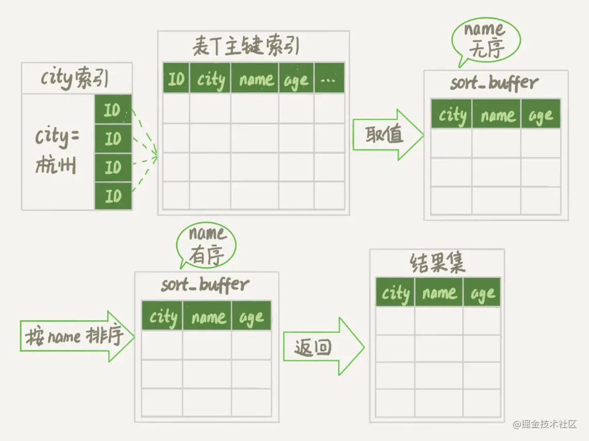
    - 上述流程只对原表的数据读了一遍，剩下的操作都是在 sort_buffer 和临时文件中执行的
  - rowid排序
    - max_length_for_sort_data，是 MySQL 中专门控制用于排序的行数据的长度的一个参数。它的意思是，如果单行的长度超过这个值，MySQL 就认为单行太大，要换一个算法
    - 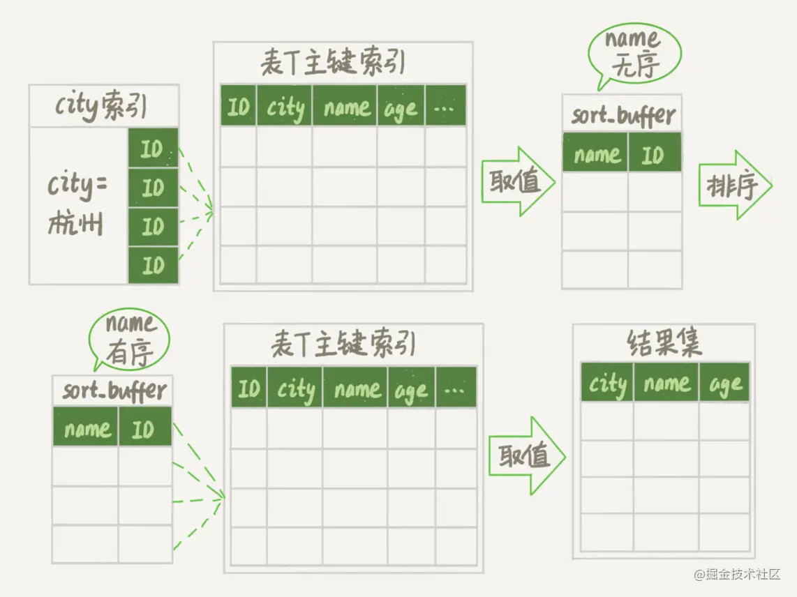
    - rowid排序多了一步回表操作
  - order by都需要排序？
    - explain结果 using index condition
    - 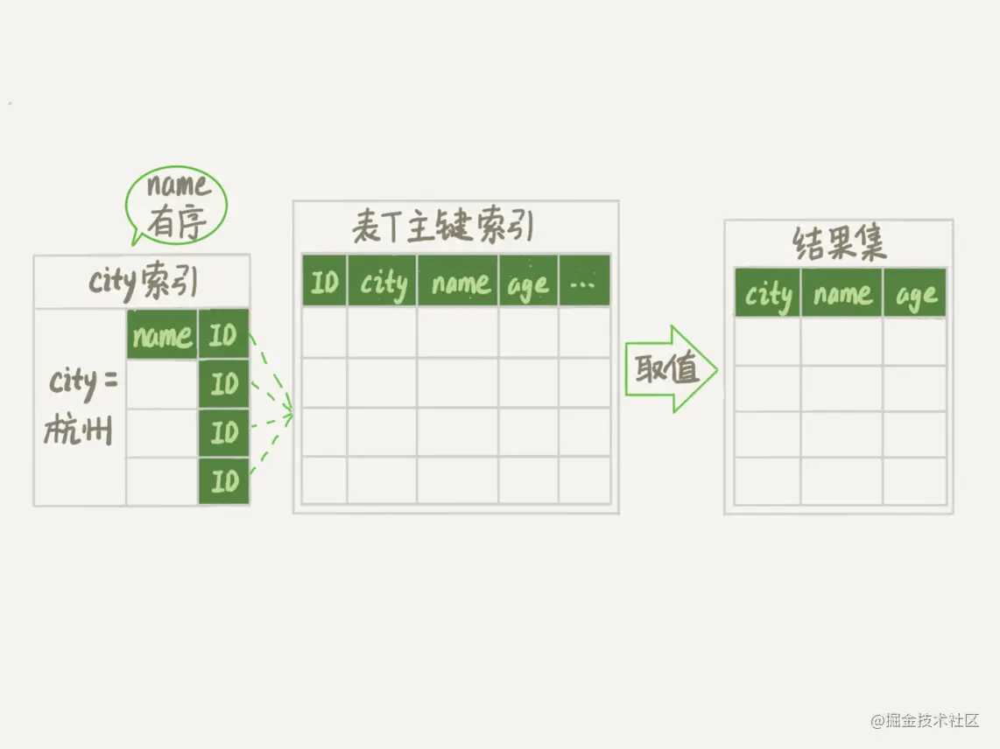
    - 这个查询过程不需要临时表，也不需要排序
  - 覆盖索引
    - explain结果 using index
    - Extra 字段里面多了“Using index”，表示的就是使用了覆盖索引，性能上会快很多
- [SQL 优化大全](https://mp.weixin.qq.com/s/Uvm_p5YuH3E8snDGnE8QLQ)
  - MySQL的基本架构
    - 查询数据库的引擎
      ```sql
      show engines;
      show variables like “%storage_engine%”;
      ```
  - SQL优化
    - SQL优化—主要就是优化索引
      - 索引的弊端
        - 当数据量很大的时候，索引也会很大(当然相比于源表来说，还是相当小的)，也需要存放在内存/硬盘中(通常存放在硬盘中)，占据一定的内存空间/物理空间。
        - 索引并不适用于所有情况：a.少量数据；b.频繁进行改动的字段，不适合做索引；c.很少使用的字段，不需要加索引；
        - a索引会提高数据查询效率，但是会降低“增、删、改”的效率。当不使用索引的时候，我们进行数据的增删改，只需要操作源表即可，但是当我们添加索引后，不仅需要修改源表，也需要再次修改索引，很麻烦。尽管是这样，添加索引还是很划算的，因为我们大多数使用的就是查询，“查询”对于程序的性能影响是很大的。
      - 索引的优势
        - 提高查询效率(降低了IO使用率)。当创建了索引后，查询次数减少了。
        - 降低CPU使用率。比如说【…order by age desc】这样一个操作，当不加索引，会把源表加载到内存中做一个排序操作，极大的消耗了资源。但是使用了索引以后，第一索引本身就小一些，第二索引本身就是排好序的，左边数据最小，右边数据最大。
    - explain执行计划常用关键字详解
      - id
        - id值相同，从上往下顺序执行。表的执行顺序因表数量的改变而改变。
        - id值不同，id值越大越优先查询。这是由于在进行嵌套子查询时，先查内层，再查外层。
      - select_type关键字的使用说明：查询类型
        - simple：简单查询 不包含子查询，不包含union查询。
        - primary：包含子查询的主查询(最外层)
        - subquery：包含子查询的主查询(非最外层)
        - derived：衍生查询(用到了临时表)
        - union：union之后的表称之为union表，如上例
        - union result：告诉我们，哪些表之间使用了union查询
      - type关键字的使用说明：索引类型
        - system、const只是理想状况，实际上只能优化到index --> range --> ref这个级别。要对type进行优化的前提是，你得创建索引。
        - system - 源表只有一条数据(实际中，基本不可能)； 衍生表只有一条数据的主查询(偶尔可以达到)
        - const - 仅仅能查到一条数据的SQL ,仅针对Primary key或unique索引类型有效。
        - eq_ref - 唯一性索引，对于每个索引键的查询，返回匹配唯一行数据（有且只有1个，不能多 、不能0），并且查询结果和数据条数必须一致。此种情况常见于唯一索引和主键索引。
        - ref - 非唯一性索引，对于每个索引键的查询，返回匹配的所有行（可以0，可以1，可以多）
        - range - 检索指定范围的行 ,where后面是一个范围查询(between, >, <, >=, in) in有时候会失效，从而转为无索引时候的ALL
        - index - 查询全部索引中的数据(扫描整个索引)
        - ALL - 查询全部源表中的数据(暴力扫描全表)
      - possible_keys和key
        - possible_keys可能用到的索引。是一种预测，不准。了解一下就好。
        - key指的是实际使用的索引。
      - key_len: 索引的长度，用于判断复合索引是否被完全使用(a,b,c)。
      - ref - 这里的ref的作用，指明当前表所参照的字段。
        - 注意与type中的ref值区分。在type中，ref只是type类型的一种选项值。
      - rows: 被索引优化查询的数据个数
      - extra
        - using filesort：针对单索引的情况 - 表示你当前的SQL性能消耗较大。表示进行了一次“额外”的排序。常见于order by语句中。
          - 对于单索引，如果排序和查找是同一个字段，则不会出现using filesort；如果排序和查找不是同一个字段，则会出现using filesort；因此where哪些字段，就order by哪些些字段。
        - using temporary: 当出现了这个词，也表示你当前的SQL性能消耗较大。这是由于当前SQL用到了临时表。一般出现在group by中。
        - using index: “索引覆盖”就表示不用读取源表，而只利用索引获取数据，不需要回源表查询
        - using where: 表示需要【回表查询】，表示既在索引中进行了查询，又回到了源表进行了查询。
        - impossible where: 当where子句永远为False的时候，会出现impossible where
    - 优化示例
      - 复合索引顺序和使用顺序一致。对于复合索引，不要跨列使用
      - 索引需要逐步优化(每次创建新索引，根据情况需要删除以前的废弃索引)
      - 使用了in有时候会导致索引失效，将含In的范围查询，放到where条件的最后，防止失效。
      - 对于两张表，索引往哪里加？答：对于表连接，小表驱动大表。索引建立在经常使用的字段上。
      - 一般情况下，左连接给左表加索引。右连接给右表加索引。其他表需不需要加索引，我们逐步尝试。
      - 不要在索引上进行任何操作(计算、函数、类型转换)，否则索引失效
      - 索引不能使用不等于（!= <>）或is null (is not null)，否则自身以及右侧所有全部失效(针对大多数情况)。复合索引中如果有>，则自身和右侧索引全部失效。
      - exists和in的优化
        - 如果主查询的数据集大，则使用in关键字，效率高。
        - 如果子查询的数据集大，则使用exist关键字,效率高。
- [事务会发生死锁?](https://mp.weixin.qq.com/s/DnCc5NIrMzvJuTF_xN6RYQ)
  - 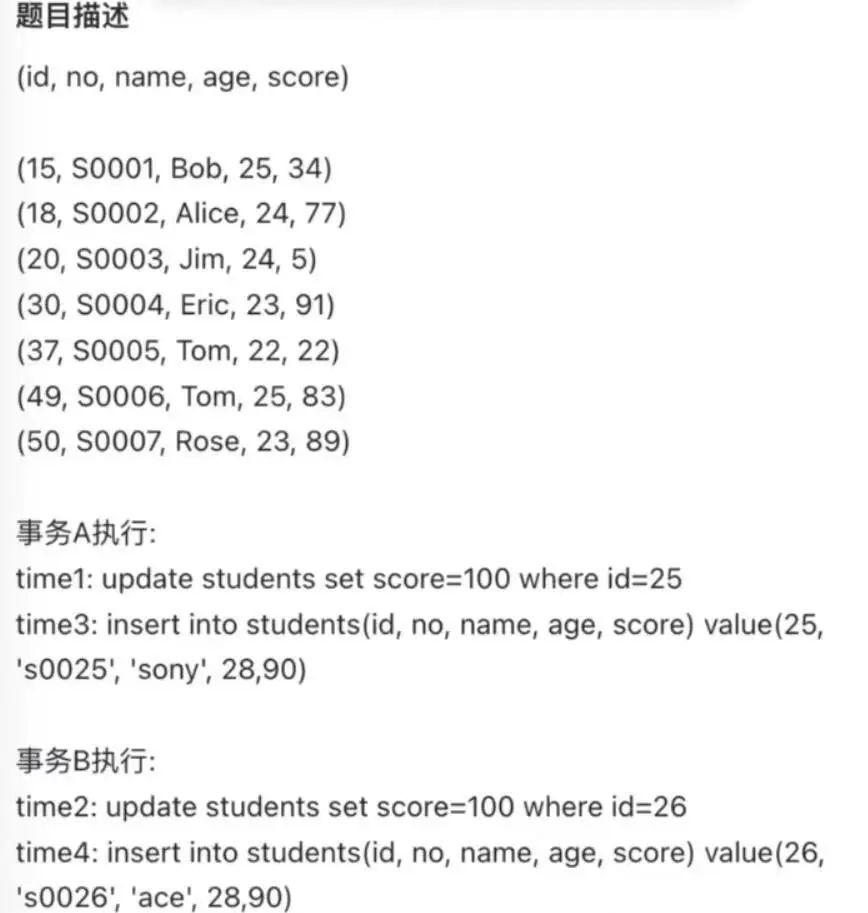
  - 
  - 为什么会发生死锁
    - 我们可以通过 select * from performance_schema.data_locks\G; 这条语句，查看事务执行 SQL 过程中加了什么锁
    - Time 1 阶段加锁分析
      - 可以看到，共加了两个锁，分别是：
        - 表锁：X 类型的意向锁；
        - 行锁：X 类型的间隙锁；
      - LOCK_TYPE 中的 RECORD 表示行级锁，而不是记录锁的意思，通过 LOCK_MODE 可以确认是 next-key 锁，还是间隙锁，还是记录锁：
        - 如果 LOCK_MODE 为 X，说明是 next-key 锁；
        - 如果 LOCK_MODE 为 X, REC_NOT_GAP，说明是记录锁；
        - 如果 LOCK_MODE 为 X, GAP，说明是间隙锁；
      - 此时事务 A 在主键索引（INDEX_NAME : PRIMARY）上加的是间隙锁，锁范围是(20, 30)。
    - Time 2 阶段加锁分析
      - 事务 B 在主键索引（INDEX_NAME : PRIMARY）上加的是间隙锁，锁范围是(20, 30)。
    - 事务 A 和 事务 B 的间隙锁范围都是一样的，为什么不会冲突？
      - 两个事务的间隙锁之间是相互兼容的，不会产生冲突
      - 间隙锁的意义只在于阻止区间被插入，因此是可以共存的。一个事务获取的间隙锁不会阻止另一个事务获取同一个间隙范围的间隙锁，共享和排他的间隙锁是没有区别的，他们相互不冲突，且功能相同。
    - Time 3 阶段加锁分析
      - 事务 A 的状态为等待状态（LOCK_STATUS: WAITING），因为向事务 B 生成的间隙锁（范围 (20, 30)）中插入了一条记录，所以事务 A 的插入操作生成了一个插入意向锁（LOCK_MODE:INSERT_INTENTION）
      - 插入意向锁是什么？
        - 插入意向锁名字里虽然有意向锁这三个字，但是它并不是意向锁，它属于行级锁，是一种特殊的间隙锁。但不同于间隙锁的是，该锁只用于并发插入操作。
        - 如果说间隙锁锁住的是一个区间，那么「插入意向锁」锁住的就是一个点。因而从这个角度来说，插入意向锁确实是一种特殊的间隙锁。
        - 尽管「插入意向锁」也属于间隙锁，但两个事务却不能在同一时间内，一个拥有间隙锁，另一个拥有该间隙区间内的插入意向锁（当然，插入意向锁如果不在间隙锁区间内则是可以的）。所以，插入意向锁和间隙锁之间是冲突的。
        - 插入意向锁的生成时机：
          - 每插入一条新记录，都需要看一下待插入记录的下一条记录上是否已经被加了间隙锁，如果已加间隙锁，那 Insert 语句会被阻塞，并生成一个插入意向锁 
    - Time 4 阶段加锁分析
      - 事务 B 在生成插入意向锁时而导致被阻塞，这是因为事务 B 向事务 A 生成的间隙锁（范围 (20, 30)）中插入了一条记录，而插入意向锁和间隙锁是冲突的，所以事务  B 在获取插入意向锁时就陷入了等待状态。
  - 本次案例中，事务 A 和事务 B 在执行完后 update 语句后都持有范围为(20, 30）的间隙锁，而接下来的插入操作为了获取到插入意向锁，都在等待对方事务的间隙锁释放，于是就造成了循环等待，满足了死锁的四个条件：互斥、占有且等待、不可强占用、循环等待，因此发生了死锁。
- [幻读是怎么被解决的](https://mp.weixin.qq.com/s?__biz=MzUxODAzNDg4NQ==&mid=2247498122&idx=2&sn=f2062523af7e977a6deebe4d8be4501a&chksm=f98dbd20cefa3436c4b1e0b29d1f0a4d9ddc64cf7917a10b5d99f65db41b1427ea503ba1a45f&scene=178&cur_album_id=1955634887135199237#rd)
  - 在一个事务内多次查询某个符合查询条件的「记录数量」，如果出现前后两次查询到的记录数量不一样的情况，就意味着发生了「幻读」现象。
  - 幻读仅专指“新插入的行”，中途通过 update 更新数据而出现同一个事务前后两次查询的「结果集合」不一样，这种不算幻读。
  - 这个幻读例子不是已经被「可重复读」隔离级别解决了吗？为什么还要有 next-key 呢？
    - 要讨论「可重复读」隔离级别的幻读现象，是要建立在「当前读」的情况下。select ... for update 这种查询语句是当前读，每次执行的时候都是读取最新的数据
    - Innodb 引擎为了解决「可重复读」隔离级别使用「当前读」而造成的幻读问题，就引出了 next-key 锁，就是记录锁和间隙锁的组合
      - 记录锁，锁的是记录本身；
      - 间隙锁，锁的就是两个值之间的空隙，以防止其他事务在这个空隙间插入新的数据，从而避免幻读现象。
    - next-key 锁的加锁规则其实挺复杂的，在一些场景下会退化成记录锁或间隙锁
    - 注意的是，next-key lock 锁的是索引，而不是数据本身，所以如果 update 语句的 where 条件没有用到索引列，那么就会全表扫描，在一行行扫描的过程中，不仅给行加上了行锁，还给行两边的空隙也加上了间隙锁，相当于锁住整个表，然后直到事务结束才会释放锁。
    - 在线上千万不要执行没有带索引条件的 update 语句，不然会造成业务停滞
- [幻读是否被 MySQL 可重复度隔离级别彻底解决了](https://mp.weixin.qq.com/s/VWEKgnOWVnufz5pfvRjUWw)
  - 什么是幻读
    - 当同一个查询在不同的时间产生不同的结果集时，事务中就会出现所谓的幻象问题。例如，如果 SELECT 执行了两次，但第二次返回了第一次没有返回的行，则该行是“幻像”行。
  - 隔离级别
    - 当多个事务并发执行时可能会遇到「脏读、不可重复读、幻读」的现象，这些现象会对事务的一致性产生不同程序的影响。
      - 脏读：读到其他事务未提交的数据；一个事务读取了另一个未提交事务写入的数据，而这些数据可能会被回滚
      - 不可重复读：前后读取的数据不一致；一个事务两次读取同一行数据，发现值不同，因为另一个事务在两次读取之间修改并提交了该行数据
      - 幻读：前后读取的记录数量不一致。一个事务检索满足某个条件的一组行，但在后续检查时发现这一组行已经发生变化，因为另一个事务插入或删除了行。
    - SQL 标准提出了四种隔离级别来规避这些现象，隔离级别越高，性能效率就越低，这四个隔离级别如下：
      - 读未提交（read uncommitted），指一个事务还没提交时，它做的变更就能被其他事务看到；
      - 读提交（read committed），指一个事务提交之后，它做的变更才能被其他事务看到；
      - 可重复读（repeatable read），指一个事务执行过程中看到的数据，一直跟这个事务启动时看到的数据是一致的，MySQL InnoDB 引擎的默认隔离级别；
      - 串行化（serializable ）；会对记录加上读写锁，在多个事务对这条记录进行读写操作时，如果发生了读写冲突的时候，后访问的事务必须等前一个事务执行完成，才能继续执行；
    - 也就是说：
       - 在「读未提交」隔离级别下，可能发生脏读、不可重复读和幻读现象；
       - 在「读提交」隔离级别下，可能发生不可重复读和幻读现象，但是不可能发生脏读现象；
       - 在「可重复读」隔离级别下，可能发生幻读现象，但是不可能脏读和不可重复读现象；
       - 在「串行化」隔离级别下，脏读、不可重复读和幻读现象都不可能会发生。
    - MySQL 在「可重复读」隔离级别下，可以很大程度上避免幻读现象的发生（注意是很大程度避免，并不是彻底避免），所以 MySQL 并不会使用「串行化」隔离级别来避免幻读现象的发生，因为使用「串行化」隔离级别会影响性能。
    - MySQL InnoDB 引擎的默认隔离级别虽然是「可重复读」，但是它很大程度上避免幻读现象（并不是完全解决了）
      - 针对快照读（普通 select 语句），是通过 MVCC 方式解决了幻读，因为可重复读隔离级别下，事务执行过程中看到的数据，一直跟这个事务启动时看到的数据是一致的，即使中途有其他事务插入了一条数据，是查询不出来这条数据的，所以就很好了避免幻读问题。
      - 针对当前读（select ... for update 等语句），是通过 next-key lock（记录锁+间隙锁）方式解决了幻读，因为当执行 select ... for update 语句的时候，会加上 next-key lock，如果有其他事务在 next-key lock 锁范围内插入了一条记录，那么这个插入语句就会被阻塞，无法成功插入，所以就很好了避免幻读问题。
  - 快照读是如何避免幻读的？
    - 可重复读隔离级是由 MVCC（多版本并发控制）实现的，实现的方式是启动事务后，在执行第一个查询语句后，会创建一个 Read View，后续的查询语句利用这个 Read View，通过这个  Read View 就可以在 undo log 版本链找到事务开始时的数据，所以事务过程中每次查询的数据都是一样的，即使中途有其他事务插入了新纪录，是查询不出来这条数据的，所以就很好了避免幻读问题。
  - 当前读是如何避免幻读的？
    - MySQL 里除了普通查询是快照读，其他都是当前读，比如 update、insert、delete，这些语句执行前都会查询最新版本的数据，然后再做进一步的操作。
    - Innodb 引擎为了解决「可重复读」隔离级别使用「当前读」而造成的幻读问题，就引出了间隙锁。
  - 幻读被彻底解决了吗
    - 可重复读隔离级别下虽然很大程度上避免了幻读，但是还是没有能完全解决幻读。
    - 第一个例子：对于快照读， MVCC 并不能完全避免幻读现象。因为当事务 A 更新了一条事务 B 插入的记录，那么事务 A 前后两次查询的记录条目就不一样了，所以就发生幻读。
    - 第二个例子：对于当前读，如果事务开启后，并没有执行当前读，而是先快照读，然后这期间如果其他事务插入了一条记录，那么事务后续使用当前读进行查询的时候，就会发现两次查询的记录条目就不一样了，所以就发生幻读。
- [幻读的问题](https://mp.weixin.qq.com/s/b805ZIO7-IabjStlAs7Wow)
  - MySQL在可重复读的情况下解决幻读的方案
    - 在当前读的情况下加记录锁与间隙锁解决幻读，加间隙锁的目的是防止数据插入预防幻读
  - MySQL 记录锁+间隙锁可以防止删除操作而导致的幻读吗 - 答案是可以的
  - 什么是幻读
    - 幻读（Phantom Read）
      - The so-called phantom problem occurs within a transaction when the same query produces different sets of rows at different times.
    - MySQL 可重复读隔离级别是解决幻读问题，查询数据的操作有两种方式，所以解决的方式是不同的
      - 针对快照读（普通 select 语句），是通过 MVCC 方式解决了幻读，因为可重复读隔离级别下，事务执行过程中看到的数据，一直跟这个事务启动时看到的数据是一致的，即使中途有其他事务插入了一条数据，是查询不出来这条数据的，所以就很好了避免幻读问题。
      - 针对当前读（select ... for update 等语句），是通过 next-key lock（记录锁+间隙锁）方式解决了幻读，因为当执行 select ... for update 语句的时候，会加上 next-key lock，如果有其他事务在 next-key lock 锁范围内插入了一条记录，那么这个插入语句就会被阻塞，无法成功插入，所以就很好了避免幻读问题。
  - 实验
    - MySQL 记录锁+间隙锁可以防止删除操作而导致的幻读问题
    - 可以通过 `select * from performance_schema.data_locks\G;` 这条语句，查看事务执行 SQL 过程中加了什么锁
    - 从上面输出的信息可以看到，共加了两种不同粒度的锁，分别是：
      - 表锁（LOCK_TYPE: TABLE）：X 类型的意向锁；
      - 行锁（LOCK_TYPE: RECORD）：X 类型的 next-key 锁；
    - 这里我们重点关注「行锁」，图中 LOCK_TYPE 中的 RECORD 表示行级锁，而不是记录锁的意思：
      - 如果 LOCK_MODE 为 X，说明是 next-key 锁；
      - 如果 LOCK_MODE 为 X, REC_NOT_GAP，说明是记录锁；
      - 如果 LOCK_MODE 为 X, GAP，说明是间隙锁；
  - 在线上在执行 update、delete、select ... for update 等具有加锁性质的语句，一定要检查语句是否走了索引，如果是全表扫描的话，会对每一个索引加 next-key 锁，相当于把整个表锁住了，这是挺严重的问题。
- [MySQL的锁](https://mp.weixin.qq.com/s?__biz=MzUxODAzNDg4NQ==&mid=2247496932&idx=1&sn=5bd840a32040998aa60c6317ccad71ac&chksm=f98db04ecefa39584c87d1b514b6f607e0950af514b67d8299e12049907cdb11fecfc02bc374&scene=21#wechat_redirect)
  - 全局锁
    - 要使用全局锁，则要执行 `flush tables with read lock`
      - 整个数据库就处于只读状态了，这时其他线程执行以下操作，都会被阻塞: 对数据的增删查改操作/对表结构的更改操作
    - 如果要释放全局锁，则要执行 `unlock tables` / 当会话断开了，全局锁会被自动释放
    - 全局锁应用场景是什么 - 主要应用于做全库逻辑备份
    - 既然备份数据库数据的时候，使用全局锁会影响业务，那有什么其他方式可以避免
      - 如果数据库的引擎支持的事务支持可重复读的隔离级别，那么在备份数据库之前先开启事务，会先创建 Read View，然后整个事务执行期间都在用这个 Read View，而且由于 MVCC 的支持，备份期间业务依然可以对数据进行更新操作。
      - 在使用 mysqldump 时加上 –single-transaction 参数的时候，就会在备份数据库之前先开启事务。这种方法只适用于支持「可重复读隔离级别的事务」的存储引擎
  - 表级锁
    - 表锁 
      - `lock tables t_student read\write;`
      - 表锁除了会限制别的线程的读写外，也会限制本线程接下来的读写操作。
    - 元数据锁 MDL
      - 我们不需要显示的使用 MDL，因为当我们对数据库表进行操作时，会自动给这个表加上 MDL：
        - 对一张表进行 CRUD 操作时，加的是 MDL 读锁；
        - 对一张表做结构变更操作的时候，加的是 MDL 写锁；
      - MDL 是在事务提交后才会释放，这意味着事务执行期间，MDL 是一直持有的。- 长事务不利的原因
      - 为什么线程 C 因为申请不到 MDL 写锁，而导致后续的申请读锁的查询操作也会被阻塞？
        - 因为申请 MDL 锁的操作会形成一个队列，队列中写锁获取优先级高于读锁，一旦出现 MDL 写锁等待，会阻塞后续该表的所有 CRUD 操作。
        - 所以为了能安全的对表结构进行变更，在对表结构变更前，先要看看数据库中的长事务，是否有事务已经对表加上了 MDL 读锁，如果可以考虑 kill 掉这个长事务，然后再做表结构的变更。
    - 意向锁
      - 在使用 InnoDB 引擎的表里对某些记录加上「共享锁」之前，需要先在表级别加上一个「意向共享锁」；
      - 在使用 InnoDB 引擎的表里对某些纪录加上「独占锁」之前，需要先在表级别加上一个「意向独占锁」；
      - 也就是，当执行插入、更新、删除操作，需要先对表加上「意向共享锁」，然后对该记录加独占锁。
      - 普通的 select 是不会加行级锁的，普通的 select 语句是利用 MVCC 实现一致性读，是无锁的。
      - select 也是可以对记录加共享锁和独占锁的
        - //先在表上加上意向共享锁，然后对读取的记录加独占锁 select ... lock in share mode;
        - //先表上加上意向独占锁，然后对读取的记录加独占锁 select ... for update;
      - 意向共享锁和意向独占锁是表级锁，不会和行级的共享锁和独占锁发生冲突，而且意向锁之间也不会发生冲突，只会和共享表锁（lock tables … read）和独占表锁（lock tables … write）发生冲突。
      - 如果没有「意向锁」，那么加「独占表锁」时，就需要遍历表里所有记录，查看是否有记录存在独占锁，这样效率会很慢。意向锁的目的是为了快速判断表里是否有记录被加锁。
    - AUTO-INC 锁
      - 为某个字段声明 AUTO_INCREMENT 属性时，之后可以在插入数据时，可以不指定该字段的值，数据库会自动给该字段赋值递增的值，这主要是通过 AUTO-INC 锁实现的。
      - AUTO-INC 锁是特殊的表锁机制，锁不是再一个事务提交后才释放，而是再执行完插入语句后就会立即释放。
      - 在 MySQL 5.1.22 版本开始，InnoDB 存储引擎提供了一种轻量级的锁来实现自增。会为被 AUTO_INCREMENT 修饰的字段加上轻量级锁，然后给该字段赋值一个自增的值，就把这个轻量级锁释放了，而不需要等待整个插入语句执行完后才释放锁。
      - InnoDB 存储引擎提供了个 innodb_autoinc_lock_mode 的系统变量，是用来控制选择用 AUTO-INC 锁，还是轻量级的锁。当 innodb_autoinc_lock_mode = 2 是性能最高的方式，但是会带来一定的问题。因为并发插入的存在，在每次插入时，自增长的值可能不是连续的，这在有主从赋值的场景中是不安全的。
  - 行级锁
    - Record Lock，记录锁，也就是仅仅把一条记录锁上；
    - Gap Lock，间隙锁，锁定一个范围，但是不包含记录本身；
    - Next-Key Lock：Record Lock + Gap Lock 的组合，锁定一个范围，并且锁定记录本身。
- [明明加了唯一索引，为什么还是产生重复数据](https://mp.weixin.qq.com/s/Jdi4GS1SqtUs7U1FWBkwxw)
  - 在mysql8的一张innodb引擎的表中，加了唯一索引，但最后发现数据竟然还是重复了
  - 唯一索引字段包含null
    - 创建唯一索引的字段，都不能允许为null，否则mysql的唯一性约束可能会失效。
  - 逻辑删除表加唯一索引
    - 物理删除 - 用delete语句操作
    - 逻辑删除 - 主要是通过update语句操作的
    - 对于这种逻辑删除的表，是没法加唯一索引的 - 假设之前给商品表中的name和model加了唯一索引，如果用户把某条记录删除了，delete_status设置成1了。后来，该用户发现不对，又重新添加了一模一样的商品。
    - 方案
      - 删除状态+1 
      - 增加时间戳字段
        - 在添加数据时，timeStamp字段写入默认值1。
        - 然后一旦有逻辑删除操作，则自动往该字段写入时间戳。 这样即使是同一条记录，逻辑删除多次，每次生成的时间戳也不一样，也能保证数据的唯一性。
      - 增加id字段
        - 增加时间戳字段基本可以解决问题。但在在极限的情况下，可能还是会产生重复数据。
        - 该方案的思路跟增加时间戳字段一致，即在添加数据时给delete_id设置默认值1，然后在逻辑删除时，给delete_id赋值成当前记录的主键id。
  - 重复历史数据如何加唯一索引
    - 最简单的做法是，增加一张防重表，然后把数据初始化进去。
      ```sql
      insert into product_unqiue(id,name,category_id,unit_id,model) 
      select max(id), select name,category_id,unit_id,model from product
      group by name,category_id,unit_id,model;
      ```
    - 增加一个delete_id字段
      - 表创建唯一索引之前，先要做数据处理。 
        - 获取相同记录的最大id：然后将delete_id字段设置成1
        - 然后将其他的相同记录的delete_id字段，设置成当前的主键
  - 给大字段加唯一索引
    - 如果model字段很大，这样就会导致该唯一索引，可能会占用较多存储空间 - 目前mysql innodb存储引擎中索引允许的最大长度是3072 bytes，其中unqiue key最大长度是1000 bytes
    - 增加hash字段
      - 我们可以增加一个hash字段，取大字段的hash值，生成一个较短的新值。该值可以通过一些hash算法生成，固定长度16位或者32位等。
    - 加唯一索引
      - 如果实在不好加唯一索引，就不加唯一索引，通过其他技术手段保证唯一性。
    - redis分布式锁 - 用name、model、delete_status和delete_id字段，生成一个hash值，然后给这个新值加锁
- [MySQL 可重复读底层原理](https://mp.weixin.qq.com/s/_fT2cQbdoQGszPmH0-F7vw)
  - MVCC
    - 多版本并发访问，这是一种并发环境下进行数据安全控制的方法，其本质上是一种乐观锁，用于实现提交读(READ COMMITTD)和可重复读(REPEATABLE READ)这两种隔离级别。
    - MVCC是由MySQL数据库InnoDB存储引擎实现的，并非是由MySQL本身实现的，不同的存储引擎，对MVCC都有不同的实现标准
  - 核心
    - Undo Log
      - Undo Log是MySQL的三大日志之一，当我们对记录做了变更操作时就会产生一条Undo记录。它的作用就是保护事务在异常发生的时候或手动回滚时可以回滚到历史版本数据，能够让你读取过去某一个时间点保存的数据。通俗易懂地说，它只关心过去的数据。
      - 对于一个InnoDB存储引擎，一个聚簇索引(主键索引)的记录之中，一定会有两个隐藏字段trx_id和roll_pointer，这两个字段存储于B+树的叶子节点中，分别对应记录着两列信息：
        - trx_id：只要有任意一个事务对某条聚簇索引记录进行修改，该事务id就会被记录到该字段里面。
        - roll_pointer：当任意一个聚簇索引记录被修改，上一个版本的数据记录就会被写入Undo Log日志里面。那么这个roll_pointer就是存储了一个指针，这个指针是一个地址，指向这个聚簇索引的上一个版本的记录位置，通过这个指针就可以获得到每一个历史版本的记录。
    - Read View
      - Read View 存放着一个列表，这个列表用来记录当前数据库系统中活跃的读写事务，也就是已经开启了，正在进行数据操作但是还未提交保存的事务。可以通过这个列表来判断某一个版本是否对当前事务可见
  - MVCC如何实现可重复读？
    - 通过Read View的字段判断这行记录对自己是否可见，如果不可见的话再去找Undo Log里面记录的对自己可见的数据，然后操作就完事了
  - MVCC如何实现提交读？
    - 什么是提交读? 提交读能够解决脏读这个并发一致性问题。脏读问题本质上就是一个事务读取到了另一个事务没有提交的内容
    - Read View解决这个问题
  - 总结
    - nnoDB 中，MVCC 就是通过 Undo Log + Read View 进行数据读取，
      - Undo Log 保存了历史快照，
      - 而 Read View 规则帮我们判断当前版本的数据是否可见。从而不需要通过加锁的方式，就可以实现提交读和可重复读这两种隔离级别。
    - MVCC本质上就是一种数据结构。已提交读和可重复读都是使用了Read View这种策略通过区间判断获取自己能够读取的内容，然后展示。InnoDB通过MVCC，解决了脏读、不可重复读。
    - InnoDB如何去解决幻读呢？光靠MVCC其实是不够的，InnoDB通过MVCC + Next-Key Lock(临键锁)来解决幻读
- [MYSQL 最朴素的监控](https://mp.weixin.qq.com/s/_90oeKftUWhRAAiYQMQefw)
  - 连接数（Connects）
    - 最大使用连接数：show status like ‘Max_used_connections’
    - 当前打开的连接数：show status like ‘Threads_connected’
  - 缓存（bufferCache）
    - 未从缓冲池读取的次数：show status like ‘Innodb_buffer_pool_reads’
    - 从缓冲池读取的次数：show status like ‘Innodb_buffer_pool_read_requests’
    - 缓冲池的总页数：show status like ‘Innodb_buffer_pool_pages_total’
    - 缓冲池空闲的页数：show status like ‘Innodb_buffer_pool_pages_free’
    - 缓存命中率计算：（1-Innodb_buffer_pool_reads/Innodb_buffer_pool_read_requests）*100%
    - 缓存池使用率为：((Innodb_buffer_pool_pages_total-Innodb_buffer_pool_pages_free）/Innodb_buffer_pool_pages_total）*100%
  - 锁（lock）
    - 锁等待个数：show status like ‘Innodb_row_lock_waits’
    - 平均每次锁等待时间：show status like ‘Innodb_row_lock_time_avg’
    - 查看是否存在表锁：show open TABLES where in_use>0；有数据代表存在锁表，空为无表锁
  - SQL
    - 查看 mysql 开关是否打开：show variables like ‘slow_query_log’，ON 为开启状态，如果为 OFF，set global slow_query_log=1 进行开启
    - 查看 mysql 阈值：show variables like ‘long_query_time’，根据页面传递阈值参数，修改阈值 set global long_query_time=0.1
    - 查看 mysql 慢 sql 目录：show variables like ‘slow_query_log_file’
    - 格式化慢 sql 日志：mysqldumpslow -s at -t 10 /export/data/mysql/log/slow.log
- [MySQL 死锁](https://mp.weixin.qq.com/s/1KtpNwBV1mYr22TdFr6D4A)
  - 前言
    - 插入意向锁 - 大家误以为「插入意向锁」是意向锁，也就是表锁
    - 实际上「插入意向锁」不是意向锁，而是特殊的间隙锁，属于行级锁，注意是「特殊」的间隙锁，并不是我们常说的间隙锁。
  - 正文
    - 有个业务主要逻辑就是新增订单、修改订单、查询订单等操作。然后因为订单是不能重复的，所以当时在新增订单的时候做了幂等性校验，做法就是在新增订单记录之前，先通过 `select ... for update` 语句查询订单是否存在，如果不存在才插入订单记录。
    - 而正是因为这样的操作，当业务量很大的时候，就可能会出现死锁
    - 死锁的发生
      - 本次案例使用存储引擎 Innodb，隔离级别为可重复读（RR）。
      - 可重复读隔离级别下，是存在幻读的问题
      - Innodb 引擎为了解决「可重复读」隔离级别下的幻读问题，就引出了 next-key 锁，它是记录锁和间隙锁的组合。
        - Record Loc，记录锁，锁的是记录本身；
        - Gap Lock，间隙锁，锁的就是两个值之间的空隙，以防止其他事务在这个空隙间插入新的数据，从而避免幻读现象。
      - 普通的 select 语句是不会对记录加锁的，因为它是通过 MVCC 的机制实现的快照读，如果要在查询时对记录加行锁，可以使用下面这两个方式
        - `select ... lock in share mode`
        - `select ... for update;`
      - 行锁的释放时机是在事务提交（commit）后，锁就会被释放，并不是一条语句执行完就释放行锁。
      - 如果 update 语句的 where 条件没有用到索引列，那么就会全表扫描，在一行行扫描的过程中，不仅给行加上了行锁，还给行两边的空隙也加上了间隙锁，相当于锁住整个表，然后直到事务结束才会释放锁。
    - 死锁的例子
      - 执行下面这条语句的时候 `select id from t_order where order_no = 1008 for update;`
      - 因为 order_no 不是唯一索引，所以行锁的类型是间隙锁，于是间隙锁的范围是（1006, +∞）。那么，当事务 B 往间隙锁里插入 id = 1008 的记录就会被锁住。
      - 当我们执行以下插入语句时，会在插入间隙上再次获取插入意向锁 `Insert into t_order (order_no, create_date) values (1008, now());`
      - 插入意向锁与间隙锁是冲突的，所以当其它事务持有该间隙的间隙锁时，需要等待其它事务释放间隙锁之后，才能获取到插入意向锁。而间隙锁与间隙锁之间是兼容的，所以所以两个事务中 select ... for update 语句并不会相互影响。
      - 事务 A 和事务 B 在执行完后 select ... for update 语句后都持有范围为(1006,+∞）的间隙锁，而接下来的插入操作为了获取到插入意向锁，都在等待对方事务的间隙锁释放，于是就造成了循环等待，导致死锁。
    - 为什么间隙锁与间隙锁之间是兼容的？
      - 间隙锁在本质上是不区分共享间隙锁或互斥间隙锁的，而且间隙锁是不互斥的，即两个事务可以同时持有包含共同间隙的间隙锁。
      - 间隙锁本质上是用于阻止其他事务在该间隙内插入新记录，而自身事务是允许在该间隙内插入数据的。也就是说间隙锁的应用场景包括并发读取、并发更新、并发删除和并发插入。
    - 插入意向锁是什么
      - 插入意向锁是一种特殊的间隙锁，但不同于间隙锁的是，该锁只用于并发插入操作。
      - 间隙锁锁住的是一个区间，那么「插入意向锁」锁住的就是一个点。因而从这个角度来说，插入意向锁确实是一种特殊的间隙锁。
      - 插入意向锁的生成时机：
        - 每插入一条新记录，都需要看一下待插入记录的下一条记录上是否已经被加了间隙锁，如果已加间隙锁，那 Insert 语句应该被阻塞，并生成一个插入意向锁 。
    - Insert 语句是怎么加行级锁的
      - Insert 语句在正常执行时是不会生成锁结构的，它是靠聚簇索引记录自带的 trx_id 隐藏列来作为隐式锁来保护记录的。
        - 什么是隐式锁
        - 当事务需要加锁的时，如果这个锁不可能发生冲突，InnoDB会跳过加锁环节，这种机制称为隐式锁。隐式锁是 InnoDB 实现的一种延迟加锁机制，其特点是只有在可能发生冲突时才加锁，从而减少了锁的数量，提高了系统整体性能
      - 只有在特殊情况下，才会将隐式锁转换为显示锁，这里我们列举两个场景。
        - 记录之间加有间隙锁
          - 每插入一条新记录，都需要看一下待插入记录的下一条记录上是否已经被加了间隙锁，如果已加间隙锁，那 Insert 语句应该被阻塞，并生成一个插入意向锁。
          - 执行 `select * from performance_schema.data_locks;` 语句  ，确定事务 A 加了什么类型的锁，这里只关注在记录上加锁的类型。
        - 遇到唯一键冲突
          - 如果在插入新记录时，插入了一个与「已有的记录的主键或者唯一二级索引列值相同」的记录」（不过可以有多条记录的唯一二级索引列的值同时为NULL，这里不考虑这种情况），此时插入就会失败，然后对于这条记录加上了 S 型的锁。
          - 如果主键值重复：
            - 当隔离级别为读已提交时，插入新记录的事务会给已存在的主键值重复的聚簇索引记录添加 S 型记录锁。
            - 当隔离级别是可重复读（默认隔离级别），插入新记录的事务会给已存在的主键值重复的聚簇索引记录添加 S 型 next-key 锁。
          - 如果唯一二级索引列重复：
            - 不论是哪个隔离级别，插入新记录的事务都会给已存在的二级索引列值重复的二级索引记录添加 S 型 next-key 锁。对的，没错，即使是读已提交隔离级别也是加 next-key 锁，这是读已提交隔离级别中为数不多的给记录添加间隙锁的场景。因为如果不添加间隙锁的话，会让唯一二级索引中出现多条唯一二级索引列值相同的记录，这就违背了 UNIQUE 的约束。
    - 如何避免死锁
      - 死锁的四个必要条件：互斥、占有且等待、不可强占用、循环等待。只要系统发生死锁，这些条件必然成立，但是只要破坏任意一个条件就死锁就不会成立。
      - 在数据库层面，有两种策略通过「打破循环等待条件」来解除死锁状态：
        - 设置事务等待锁的超时时间。当一个事务的等待时间超过该值后，就对这个事务进行回滚，于是锁就释放了，另一个事务就可以继续执行了。在 InnoDB 中，参数 innodb_lock_wait_timeout 是用来设置超时时间的，默认值时 50 秒。
        - 开启主动死锁检测。主动死锁检测在发现死锁后，主动回滚死锁链条中的某一个事务，让其他事务得以继续执行。将参数 innodb_deadlock_detect 设置为 on，表示开启这个逻辑，默认就开启。
      - 我们可以回归业务的角度来预防死锁，对订单做幂等性校验的目的是为了保证不会出现重复的订单，那我们可以直接将 order_no 字段设置为唯一索引列，利用它的唯一下来保证订单表不会出现重复的订单，不过有一点不好的地方就是在我们插入一个已经存在的订单记录时就会抛出异常。
- [innodb 是如何存数据的](https://mp.weixin.qq.com/s/qtHDWJB3UrgU4zxINUQ8yw)
  - innodb底层是如何存储数据的？
    - 把数据存在磁盘上 - 从磁盘上读写数据，至少需要两次IO请求才能完成。一次是读IO，另一次是写IO。
    - 内存同样能满足我们，快速读取和写入数据的需求，而且性能是非常可观的，只是比较寄存器稍稍慢了一丢丢而已
    - 数据页
      - 将内存中的数据刷到磁盘，或者将磁盘中的数据加载到内存，都是以批次为单位，这个批次就是我们常说的：数据页
      - 数据页主要是用来存储表中记录的，它在磁盘中是用双向链表相连的，方便查找，能够非常快速得从一个数据页，定位到另一个数据页
      - 通常情况下，单个数据页默认的大小是16kb。当然，我们也可以通过参数：innodb_page_size，来重新设置大小。
  - 表中有哪些隐藏列？
  - 用户记录之间是如何关联起来的？
    - 用户记录
      - 对于新申请的数据页，用户记录是空的。当插入数据时，innodb会将一部分空闲空间分配给用户记录。
      - 一条用户记录主要包含三部分内容：
        - 记录额外信息，它包含了变长字段、null值列表和记录头信息。
          - 变长字段列表 - 需要在变长字段中记录某个变长字段占用的字节数，方便按需分配空间。
          - null值列表 - 将为null的字段保存到null值列表: 只简单的标记一下，不存储实际的null值
          - 记录头信息 
        - 隐藏列，它包含了行id、事务id和回滚点。
          - 目前innodb自动创建的隐藏列有三种：
          - db_row_id，即行id，它是一条记录的唯一标识。
          - db_trx_id，即事务id，它是事务的唯一标识。
          - db_roll_ptr，即回滚点，它用于事务回滚。
        - 真正的数据列，包含真正的用户数据，可以有很多列。
      - 用户记录是如何相连的
      - 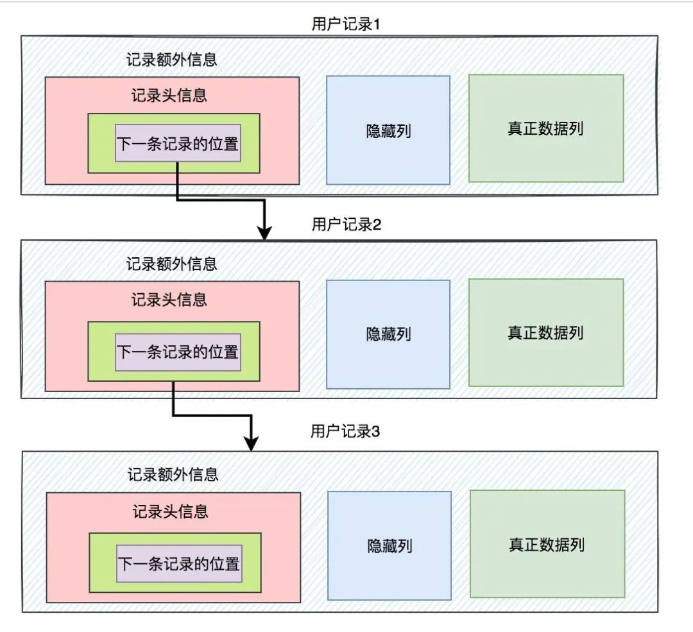
  - Summary
    - 多个数据页之间通过页号构成了双向链表。而每一个数据页的行数据之间，又通过下一条记录的位置构成了单项链表
- [删库跑路后，我连表名都不能修改了](https://mp.weixin.qq.com/s/5dw6WC2TOtMvrPY137Q_Yg)
  - 无论是ALTER还是RENAME都不能正常使用，看来drop的权限确实会对修改表名造成影响
    - RENAME TABLE renames one or more tables. You must have ALTER and DROP privileges for the original table, and CREATE and INSERT privileges for the new table.
  - 当我需要清空一张表、顺带把AUTO_INCREMENT的主键置为初始值时，突然发现truncate命令也无法执行了
    - 相对于delete一行行删除数据，truncate会删除表后重新新建表，这一操作相对delete会快很多，尤其是对大表而言。
    - 如果执行了truncate的话，那么自增列id的值会被重置为 1
  - delete 后如何恢复数据
    - 我们需要根据删除操作发生的时间找到临近的binglog文件：
     ```shell
     mysqlbinlog --base64-output=decode-rows -v 
       --database=mall 
       --start-datetime="2021-09-17 20:50:00" 
       --stop-datetime="2021-09-17 21:30:00" 
       D:\tmp\mysql-bin.000001 > mysqllog.sql
     ```
- [联合索引的最左匹配原则](https://mp.weixin.qq.com/s/8qemhRg5MgXs1So5YCv0fQ)
  - 结论
    - 联合索引的最左匹配原则，在遇到范围查询（如 >、<, between、like）的时候，就会停止匹配, 也就是范围查询的字段可以用到联合索引，但是在范围查询字段后面的字段无法用到联合索引
    - 但是，对于 >=、<=、BETWEEN、like 前缀匹配这四种范围查询，并不会停止匹配。
  - B+Tree 索引
    - InnoDB 存储引擎会为每一张数据库表创建一个「聚簇索引」来保存表的数据，聚簇索引默认使用的是 B+Tree 索引。聚簇索引只能用于主键字段的快速查询
    - 二级索引同样基于 B+Tree 实现的，不过二级索引的叶子节点存放的是主键值，不是实际数据。
    - 在二级索引的 B+Tree 就能查询到结果的过程就叫作「覆盖索引」，也就是只需要查一个 B+Tree 就能找到数据。
  - 最左匹配原则
    - 使用联合索引时，存在最左匹配原则，也就是按照最左优先的方式进行索引的匹配。
    - Q1: select * from t_table where a > 1 and b = 2，联合索引（a, b）哪一个字段用到了联合索引的 B+Tree？
      - 在符合 a > 1 条件的二级索引记录的范围里，b 字段的值是无序的. 这条查询语句只有 a 字段用到了联合索引进行索引查询，而 b 字段并没有使用到联合索引
      - 通过 key_len 我们可以知道优化器具体使用了多少个字段的查询条件来形成扫描区间的边界条件。可以看到 key_len 为 4 字节（如果字段允许为 NULL，就在字段类型占用的字节数上加 1，也就是 5 字节），说明只有 a 字段用到了联合索引进行索引查询，而且可以看到，即使 b 字段没用到联合索引，key 为 idx_a_b，说明 Q1 查询语句使用了 idx_a_b 联合索引。
    - Q2: select * from t_table where a >= 1 and b = 2，联合索引（a, b）哪一个字段用到了联合索引的 B+Tree？
      - 对于符合 a = 1 的二级索引记录的范围里，b 字段的值是「有序」的
      - 可以看到 key_len 为 8 字节，说明优化器使用了 2 个字段的查询条件来形成扫描区间的边界条件，也就是 a 和 b 字段都用到了联合索引进行索引查询。
    - Q3: SELECT * FROM t_table WHERE a BETWEEN 2 AND 8 AND b = 2，联合索引（a, b）哪一个字段用到了联合索引的 B+Tree？
      - 在 MySQL 中，BETWEEN 包含了 value1 和 value2 边界值，类似于 >= and =<
      - 可以看到 key_len 为 8 字节，说明优化器使用了 2 个字段的查询条件来形成扫描区间的边界条件，也就是 a 和 b 字段都用到了联合索引进行索引查询。
    - Q4: SELECT * FROM t_user WHERE name like 'j%' and age = 22，联合索引（name, age）哪一个字段用到了联合索引的 B+Tree？
      - 对于符合 name = j 的二级索引记录的范围里，age字段的值是「有序」的
      - 可以看到 key_len 为 126 字节，name 的 key_len 为 122，age 的 key_len 为 4，说明优化器使用了 2 个字段的查询条件来形成扫描区间的边界条件，也就是 name 和 age 字段都用到了联合索引进行索引查询。
  - 补充
    - MySQL8.0版本开始增加了索引**跳跃扫描**的功能，当第一列索引的唯一值较少时，即使where条件没有第一列索引，查询的时候也可以用到联合索引
    - 比如我们使用的联合索引是 bcd  但是b中字段比较少 我们在使用联合索引的时候没有 使用 b 但是依然可以使用联合索引 MySQL联合索引有时候遵循最左前缀匹配原则，有时候不遵循
- [MySQL 行级锁的加锁规则](https://mp.weixin.qq.com/s/Ef73pSWb_k6yiTTlNCrEjg)
  - MySQL 8.0.26 版本，在可重复读隔离级别之下
    - [行级锁的种类主要有三类](https://mp.weixin.qq.com/s?__biz=MzUxODAzNDg4NQ==&mid=2247522791&idx=1&sn=db1cdacdc4c73de2ef611d28a9081c90&scene=21#wechat_redirect)
      - Record Lock，记录锁，也就是仅仅把一条记录锁上；
      - Gap Lock，间隙锁，锁定一个范围，但是不包含记录本身 (锁住一段左开右开的区间)；
      - Next-Key Lock：Record Lock + Gap Lock 的组合，锁定一个范围，并且锁定记录本身 (锁住一段左开右闭的区间)。
  - 唯一索引等值查询：
    - 当查询的记录是「存在」的，在索引树上定位到这一条记录后，将该记录的索引中的 next-key lock 会退化成「记录锁」。
    - 当查询的记录是「不存在」的，则会在索引树找到第一条大于该查询记录的记录，然后将该记录的索引中的 next-key lock 会退化成「间隙锁」。
  - 非唯一索引等值查询：
     - 当查询的记录「存在」时，由于不是唯一索引，所以肯定存在索引值相同的记录，于是非唯一索引等值查询的过程是一个扫描的过程，直到扫描到第一个不符合条件的二级索引记录就停止扫描，然后在扫描的过程中，对扫描到的二级索引记录加的是 next-key 锁，而对于第一个不符合条件的二级索引记录，该二级索引的 next-key 锁会退化成间隙锁。同时，在符合查询条件的记录的主键索引上加记录锁。
     - 当查询的记录「不存在」时，扫描到第一条不符合条件的二级索引记录，该二级索引的  next-key 锁会退化成间隙锁。因为不存在满足查询条件的记录，所以不会对主键索引加锁。
  - 非唯一索引和主键索引的范围查询的加锁规则不同之处在于：
    - 唯一索引在满足一些条件的时候，索引的 next-key lock 退化为间隙锁或者记录锁。
    - 非唯一索引范围查询，索引的 next-key lock 不会退化为间隙锁和记录锁。
  - 还有一件很重要的事情，**在线上在执行 update、delete、select ... for update 等具有加锁性质的语句，一定要检查语句是否走了索引，如果是全表扫描的话，会对每一个索引加 next-key 锁，相当于把整个表锁住了，这是挺严重的问题。**
  - [Example](https://mp.weixin.qq.com/s/TUtwJEcwJJnxYmUaCoBN8Q)
    - 如果 update 语句更新的是普通字段的值，就会对发生更新的记录加 X 型记录锁。
    - 但是，如果 update 语句更新的是索引的值，那么在运行的时候会被拆分成删除和插入操作，这时候分析锁的时候，要从这两个操作的角度去分析。
  - [Ex2](https://mp.weixin.qq.com/s/WIngAJhi1u7Yf8s9L7EFFQ)
- [SQL 优化](https://mp.weixin.qq.com/s/X2u1bN9KtgT-4J_QAa7sjQ)
  - 慢SQL优化思路
    - 慢查询日志记录慢SQL
      - 查看下慢查询日志配置，我们可以使用`show variables like 'slow_query_log%'`命令
      - 可以使用`show variables like 'long_query_time'`命令，查看超过多少时间，才记录到慢查询日志
    - explain分析SQL的执行计划
      - type表示连接类型，查看索引执行情况的一个重要指标。以下性能从好到坏依次：`system > const > eq_ref > ref > ref_or_null > index_merge > unique_subquery > index_subquery > range > index > ALL`
        - system：这种类型要求数据库表中只有一条数据，是const类型的一个特例，一般情况下是不会出现的。
        - const：通过一次索引就能找到数据，一般用于主键或唯一索引作为条件，这类扫描效率极高，，速度非常快。
        - eq_ref：常用于主键或唯一索引扫描，一般指使用主键的关联查询
        - ref : 常用于非主键和唯一索引扫描。
        - ref_or_null：这种连接类型类似于ref，区别在于MySQL会额外搜索包含NULL值的行
        - index_merge：使用了索引合并优化方法，查询使用了两个以上的索引。
        - unique_subquery：类似于eq_ref，条件用了in子查询
        - index_subquery：区别于unique_subquery，用于非唯一索引，可以返回重复值。
        - range：常用于范围查询，比如：between ... and 或 In 等操作
        - index：全索引扫描
        - ALL：全表扫描
      - extra 该字段包含有关MySQL如何解析查询的其他信息，它一般会出现这几个值：
        - Using filesort：表示按文件排序，一般是在指定的排序和索引排序不一致的情况才会出现。一般见于order by语句
        - Using index ：表示是否用了覆盖索引。
        - Using temporary: 表示是否使用了临时表,性能特别差，需要重点优化。一般多见于group by语句，或者union语句。
        - Using where : 表示使用了where条件过滤.
        - Using index condition：MySQL5.6之后新增的索引下推。在存储引擎层进行数据过滤，而不是在服务层过滤，利用索引现有的数据减少回表的数据。
    - profile 分析执行耗时
      - explain只是看到SQL的预估执行计划，如果要了解SQL真正的执行线程状态及消耗的时间，需要使用profiling。开启profiling参数后，后续执行的SQL语句都会记录其资源开销，包括IO，上下文切换，CPU，内存等等，我们可以根据这些开销进一步分析当前慢SQL的瓶颈再进一步进行优化。
      - profiling默认是关闭，我们可以使用show variables like '%profil%'查看是否开启 . 可以使用set profiling=ON开启. 开启后，可以运行几条SQL，然后使用show profiles查看一下
    - Optimizer Trace分析详情
      - profile只能查看到SQL的执行耗时，但是无法看到SQL真正执行的过程信息，即不知道MySQL优化器是如何选择执行计划。这时候，我们可以使用Optimizer Trace，它可以跟踪执行语句的解析优化执行的全过程。
      - 我们可以使用set optimizer_trace="enabled=on"打开开关，接着执行要跟踪的SQL，最后执行select * from information_schema.optimizer_trace跟踪
    - 确定问题并采用相应的措施
      - 多数慢SQL都跟索引有关，比如不加索引，索引不生效、不合理等，这时候，我们可以优化索引。
      - 我们还可以优化SQL语句，比如一些in元素过多问题（分批），深分页问题（基于上一次数据过滤等），进行时间分段查询
      - SQl没办法很好优化，可以改用ES的方式，或者数仓。
      - 如果单表数据量过大导致慢查询，则可以考虑分库分表
      - 如果数据库在刷脏页导致慢查询，考虑是否可以优化一些参数，跟DBA讨论优化方案
      - 如果存量数据量太大，考虑是否可以让部分数据归档
  - 案例分析
    - 隐式转换
    - 最左匹配
    - 深分页问题
      - limit深分页问题，会导致慢查询，应该大家都司空见惯了吧。
        - limit语句会先扫描offset+n行，然后再丢弃掉前offset行，返回后n行数据。也就是说limit 100000,10，就会扫描100010行，而limit 0,10，只扫描10行。
        - limit 100000,10 扫描更多的行数，也意味着回表更多的次数。
      - 我们可以通过减少回表次数来优化。一般有标签记录法和[延迟关联法](https://qidawu.github.io/posts/mysql-deferred-join/)
        - 延迟关联法 - 就是把条件转移到主键索引树，然后减少回表
        - 延迟关联优化涉及到了 SQL 优化的两个重要概念：覆盖索引和回表。
          - 通过覆盖索引在辅助索引上完成所有扫描、过滤、排序（利用索引有序）和分页；
          - 最后通过主键回表查询，最大限度减少回表查询的 I/O 次数。
          ```
          explain select * from t_order t 
          inner join (
            select id from t_order
            where create_time between '2019-10-17' and '2019-10-25'
            limit 1000000, 10
          ) e
          on t.id = e.id;
          ```
    - in元素过多
      - 这是因为in查询在MySQL底层是通过n*m的方式去搜索，类似union。5.6之后超过这个临界值后该列的cost就不参与计算了。因此会导致执行计划选择不准确。默认是200，即in条件超过了200个数据，会导致in的代价计算存在问题，可能会导致Mysql选择的索引不准确。
    - order by 走文件排序导致的慢查询
      - order by排序，分为全字段排序和rowid排序。它是拿max_length_for_sort_data和结果行数据长度对比，如果结果行数据长度超过max_length_for_sort_data这个值，就会走rowid排序，相反，则走全字段排序。
      - sort_buffer的大小是由一个参数控制的：sort_buffer_size。
        - 如果要排序的数据小于sort_buffer_size，排序在sort_buffer内存中完成
        - 如果要排序的数据大于sort_buffer_size，则借助磁盘文件来进行排序。
      - order by使用文件排序，效率会低一点。我们怎么优化呢？
        - 因为数据是无序的，所以就需要排序。如果数据本身是有序的，那就不会再用到文件排序啦。而索引数据本身是有序的，我们通过建立索引来优化order by语句。
        - 我们还可以通过调整max_length_for_sort_data、sort_buffer_size等参数优化；
    - 索引字段上使用is null， is not null，索引可能失效
    - group by使用临时表
      - Extra 这个字段的Using temporary表示在执行分组的时候使用了临时表
      - 优化group by
        - group by 后面的字段加索引
        - order by null 不用排序
        - 尽量只使用内存临时表
        - 使用SQL_BIG_RESULT
    - delete + in子查询不走索引！
      - 当delete遇到in子查询时，即使有索引，也是不走索引的。而对应的select + in子查询，却可以走索引。
- [分页 + 模糊查询](https://mp.weixin.qq.com/s/sVv02L6sKCD3PLiLJfMIeA)
  - 模糊查询和分页，如果分开用，一般是没问题的。 但如果它们要一起使用，一定要考虑排序问题。
  - 我们可以通过mysql提供的：char_length、locate、instr和position函数等，来实现很多复杂的排序功能
- [MySQL 一行记录是怎么存储的](https://mp.weixin.qq.com/s/sqW51yqeAXcDs9r84UFP7A)
  - MySQL 的数据存放在哪个文件
    - `SHOW VARIABLES LIKE 'datadir';`
    - 我们进入 /var/lib/mysql/my_test 目录 共有三个文件，这三个文件分别代表着：
      - db.opt，用来存储当前数据库的默认字符集和字符校验规则。
      - t_order.frm ，t_order 的表结构会保存在这个文件。在 MySQL 中建立一张表都会生成一个.frm 文件，该文件是用来保存每个表的元数据信息的，主要包含表结构定义。
      - t_order.ibd，t_order 的表数据会保存在这个文件。表数据既可以存在共享表空间文件（文件名：ibdata1）里，也可以存放在独占表空间文件（文件名：表名字.idb）
    - 表名字.idb 表空间由段（segment）、区（extent）、页（page）、行（row）组成
      - 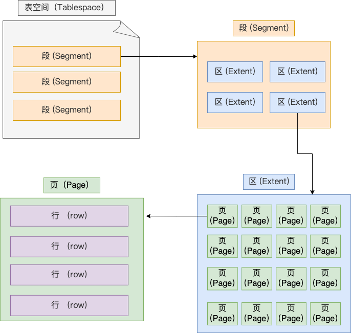
      - row - 数据库表中的记录都是按行（row）进行存放的，每行记录根据不同的行格式，有不同的存储结构。
        - InnoDB 提供了 4 种行格式，分别是 Redundant、Compact、Dynamic和 Compressed 行格式。Dynamic 和 Compressed 两个都是紧凑的行格式. 从 MySQL5.7 版本之后，默认使用 Dynamic 行格式。
        - COMPACT 行格式
          - 
          - 记录的额外信息包含 3 个部分：变长字段长度列表、NULL 值列表、记录头信息。
            - 变长字段长度列表 
              - 变长字段的长度值会按照列的顺序逆序存放; NULL 是不会存放在行格式中记录的真实数据部分里的
            - NULL 值列表 
              - 存在允许 NULL 值的列，则每个列对应一个二进制位（bit），二进制位按照列的顺序逆序排列。
              - 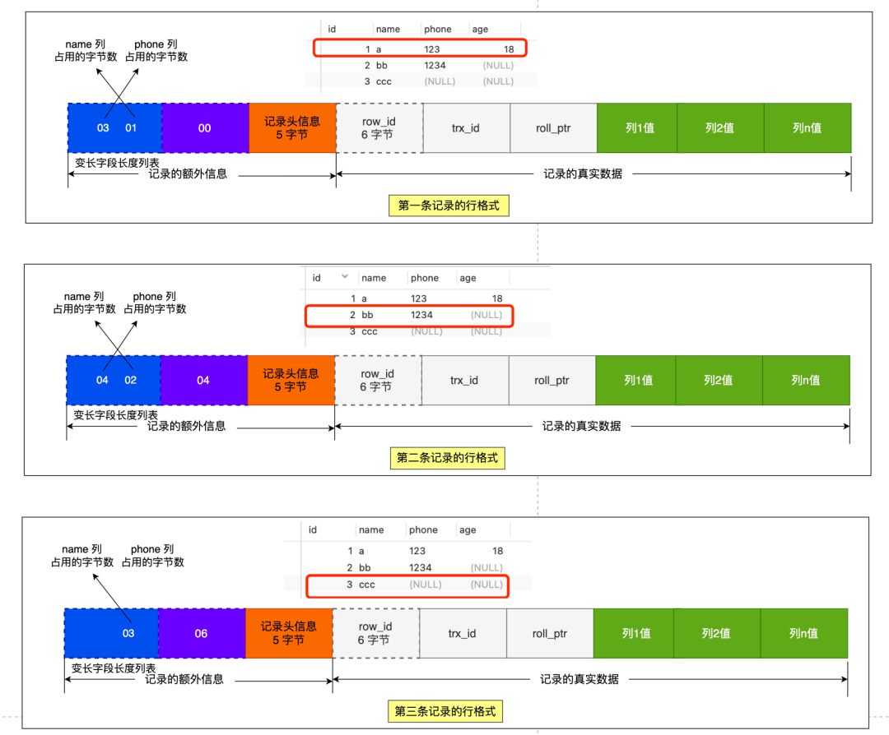
              - 当数据表的字段都定义成 NOT NULL 的时候，这时候表里的行格式就不会有 NULL 值列表了。所以在设计数据库表的时候，通常都是建议将字段设置为  NOT NULL，这样可以节省 1 字节的空间（NULL 值列表占用 1 字节空间）。
            - 记录头信息
              - delete_mask ：标识此条数据是否被删除。从这里可以知道，我们执行 detele 删除记录的时候，并不会真正的删除记录，只是将这个记录的 delete_mask 标记为 1。
              - next_record：下一条记录的位置。从这里可以知道，记录与记录之间是通过链表组织的。在前面我也提到了，指向的是下一条记录的「记录头信息」和「真实数据」之间的位置，这样的好处是向左读就是记录头信息，向右读就是真实数据，比较方便。
              - record_type：表示当前记录的类型，0表示普通记录，1表示B+树非叶子节点记录，2表示最小记录，3表示最大记录
          - 记录的真实数据
            - 记录真实数据部分除了我们定义的字段，还有三个隐藏字段，分别为：row_id、trx_id、roll_pointer
            - row_id - 如果我们建表的时候指定了主键或者唯一约束列，那么就没有 row_id 隐藏字段了。如果既没有指定主键，又没有唯一约束，那么 InnoDB 就会为记录添加 row_id 隐藏字段。row_id不是必需的，占用 6 个字节。
            - trx_id - 事务id，表示这个数据是由哪个事务生成的。trx_id是必需的，占用 6 个字节。
            - roll_pointer - 这条记录上一个版本的指针。roll_pointer 是必需的，占用 7 个字节。
      - 页（page）
        - InnoDB 的数据是按「页」为单位来读写的 默认每个页的大小为 16KB. 常见的有数据页、undo 日志页、溢出页等等。数据表中的行记录是用「数据页」来管理的
      - 区（extent）
        - B+ 树中每一层都是通过双向链表连接起来的，如果是以页为单位来分配存储空间，那么链表中相邻的两个页之间的物理位置并不是连续的，可能离得非常远，那么磁盘查询时就会有大量的随机I/O，随机 I/O 是非常慢的。
        - 解决这个问题也很简单，就是让链表中相邻的页的物理位置也相邻，这样就可以使用顺序 I/O 了，那么在范围查询（扫描叶子节点）的时候性能就会很高。
        - 在表中数据量大的时候，为某个索引分配空间的时候就不再按照页为单位分配了，而是按照区（extent）为单位分配。每个区的大小为 1MB，对于  16KB 的页来说，连续的 64 个页会被划为一个区，这样就使得链表中相邻的页的物理位置也相邻，就能使用顺序 I/O 了。
      - 段（segment）
        - 表空间是由各个段（segment）组成的，段是由多个区（extent）组成的。段一般分为数据段、索引段和回滚段等。
          - 索引段：存放 B + 树的非叶子节点的区的集合；
          - 数据段：存放 B + 树的叶子节点的区的集合；
          - 回滚段：存放的是回滚数据的区的集合，之前讲事务隔离的时候就介绍到了 MVCC 利用了回滚段实现了多版本查询数据。
  - varchar(n) 中 n 最大取值为多少？
    - 一行记录最大能存储 65535 字节的数据，但是这个是包含「变长字段字节数列表所占用的字节数」和「NULL值列表所占用的字节数」。所以， 我们在算 varchar(n) 中 n 最大值时，需要减去这两个列表所占用的字节数。
    - 如果一张表只有一个 varchar(n)  字段，且允许为 NULL，字符集为 ascii。varchar(n) 中 n 最大取值为 65532。
    - 计算公式：65535 - 变长字段字节数列表所占用的字节数 - NULL值列表所占用的字节数 = 65535 - 2 - 1 = 65532。
    - 如果有多个字段的话，要保证所有字段的长度 + 变长字段字节数列表所占用的字节数 + NULL值列表所占用的字节数 <= 65535。
    - 在 UTF-8 字符集下，一个字符串最多需要三个字节，varchar(n) 的 n 最大取值就是 65532/3 = 21844
  - 行溢出后，MySQL 是怎么处理的
    - MySQL 中磁盘和内存交互的基本单位是页，一个页的大小一般是 16KB，也就是 16384字节，而一个 varchar(n)  类型的列最多可以存储 65532字节，一些大对象如 TEXT、BLOB 可能存储更多的数据，这时一个页可能就存不了一条记录。这个时候就会发生行溢出，多的数据就会存到另外的「溢出页」中
    - Compressed 和 Dynamic 这两个行格式和 Compact 非常类似，主要的区别在于处理行溢出数据时有些区别。
  - Summary
    - MySQL 的 NULL 值是怎么存放的？
      - MySQL 的 Compact 行格式中会用「NULL值列表」来标记值为 NULL 的列，NULL 值并不会存储在行格式中的真实数据部分。
      - NULL值列表会占用 1 字节空间，当表中所有字段都定义成 NOT NULL，行格式中就不会有 NULL值列表，这样可节省 1 字节的空间。
    - MySQL 怎么知道 varchar(n) 实际占用数据的大小？
      - MySQL 的 Compact 行格式中会用「变长字段长度列表」存储变长字段实际占用的数据大小。
    - varchar(n) 中 n 最大取值为多少？
      - 一行记录最大能存储 65535 字节的数据，但是这个是包含「变长字段字节数列表所占用的字节数」和「NULL值列表所占用的字节数」。
      - 如果一张表只有一个 varchar(n)  字段，且允许为 NULL，字符集为 ascii。varchar(n) 中 n 最大取值为 65532。
      - 计算公式：65535 - 变长字段字节数列表所占用的字节数 - NULL值列表所占用的字节数 = 65535 - 2 - 1 = 65532
    - 行溢出后，MySQL 是怎么处理的？
      - 如果一个数据页存不了一条记录，InnoDB 存储引擎会自动将溢出的数据存放到「溢出页」中。
      - Compact 行格式针对行溢出的处理是这样的：当发生行溢出时，在记录的真实数据处只会保存该列的一部分数据，而把剩余的数据放在「溢出页」中，然后真实数据处用 20 字节存储指向溢出页的地址，从而可以找到剩余数据所在的页。
      - Compressed 和 Dynamic 这两种格式采用完全的行溢出方式，记录的真实数据处不会存储该列的一部分数据，只存储 20 个字节的指针来指向溢出页。而实际的数据都存储在溢出页中。
- [锁](https://mp.weixin.qq.com/s/lHk6q0r2EU3pfthXQnFC7g)
  - 在执行 select … for update 语句的时候，会有产生 2 个表级别的锁：
    - 一个是 Server 层表级别的锁：`MDL 锁`。事务在进行增删查改的时候，server 层申请 MDL 锁都是 MDL 读锁，而 MDL 读锁之间是相互兼容的，MDL 读锁只会和 MDL 写锁发生冲突，在对表结构进行变更操作的时候，才会申请  MDL 写锁。
    - 一个是 Inoodb 层表级别的锁：`意向锁`。事务在进行增删改和锁定读的时候，inoodb 层会申请意向锁，意向锁不会和行级锁发生冲突，而且意向锁之间也不会发生冲突，意向锁只会和共享表锁（lock tables ... read）和独占表锁（lock tables ... write）发生冲突。
  - 如果 `select … for update` 语句的查询条件没有索引字段的话，整张表都无法进行增删改了，从这个现象看，好像是把表锁起来了，但是并不是因为上面这两个表级锁的原因。
  - 而是因为如果锁定读查询语句，没有使用索引列作为查询条件，导致扫描是全表扫描。那么，每一条记录的索引上都会加 next-key 锁（行级锁），这样就相当于锁住的全表，这时如果其他事务对该表进行增、删、改操作的时候，都会被阻塞。
  - Tools
    - 在 MySQL 8.0 以上的版本，可以执行 select * from performance_schema.data_locks\G; 这条语句，查看 Innodb 存储引擎为事务加了什么锁。
    - 我们的事物 A 执行了普通 select 查询语句，如果要看该事务持有的 MDL 锁，可以通过这条命令 select * from performance_schema.metadata_locks;
  - 如果查询条件用了索引/主键，那么select ..... for update就会进行行锁。
  - 如果是普通字段(没有索引/主键)，那么select ..... for update就会进行锁表。
- [分库分表](https://mp.weixin.qq.com/s/jPH679biI3CLXHTZr4q3xA)
  - 我们为什么需要分库分表
    - 为什么要分库
      - 如果业务量剧增，数据库可能会出现性能瓶颈，这时候我们就需要考虑拆分数据库。从这两方面来看：
        - 磁盘存储
          - 业务量剧增，MySQL单机磁盘容量会撑爆，拆成多个数据库，磁盘使用率大大降低。
        - 并发连接支撑
          - 我们知道数据库连接数是有限的。在高并发的场景下，大量请求访问数据库，MySQL单机是扛不住的！高并发场景下，会出现too many connections报错。
    - 为什么要分表
      - 假如你的单表数据量非常大，存储和查询的性能就会遇到瓶颈了，如果你做了很多优化之后还是无法提升效率的时候，就需要考虑做分表了。一般千万级别数据量，就需要分表。
  - 什么时候考虑分库分表？
    - 一般数据量千万级别，B+树索引高度就会到3层以上了，查询的时候会多查磁盘的次数，SQL就会变慢。单表行数超过500万行或者单表容量超过2GB，才推荐进行分库分表
      - 一个数据页大小16K，扣除页号、前后指针、页目录，校验码等信息，实际可以存储数据的大约为15K，假设主键ID为bigint型，那么主键 ID 占用8个 byte，页号占用4个 byte，则 X=15*1024/(8 + 4) 等于1280；
      - 一个数据页实际可以存储数据的空间大小，大约为15K，假设一条行记录占用的空间大小为1K，那么一个数据页就可以存储15条行记录，即 Y=15；
      - 假设 B+树是两层的：则 N=2，即 M=1280的（2-1）次方 * 15 ≈ 2w ；
      - 假设 B+树是三层的：则 N=3，即 M=1280的2次方 * 15 ≈ 2.5 kw；
      - 假设 B+树是四层的：则 N=4，即 M=1280的3次方 * 15 ≈ 300亿 ；
  - 如何选择分表键
    - 分表键，即用来分库/分表的字段，换种说法就是，你以哪个维度来分库分表的。比如你按用户ID分表、按时间分表、按地区分表，这些用户ID、时间、地区就是分表键。
    - 一般数据库表拆分的原则，需要先找到业务的主题。比如你的数据库表是一张企业客户信息表，就可以考虑用了客户号做为分表键。
  - 分表策略如何选择
    - range，即范围策略划分表。比如我们可以将表的主键order_id，按照从0~300万的划分为一个表，300万~600万划分到另外一个表
      - 优点： range范围分表，有利于扩容。
      - 缺点：可能会有热点问题。因为订单id是一直在增大的，也就是说最近一段时间都是汇聚在一张表里面的。比如最近一个月的订单都在300万~600万之间，平时用户一般都查最近一个月的订单比较多，请求都打到order_1表啦。
    - hash取模策略 指定的路由key（一般是user_id、order_id、customer_no作为key）对分表总数进行取模，把数据分散到各个表中。
      - 优点：hash取模的方式，不会存在明显的热点问题。
      - 缺点：如果未来某个时候，表数据量又到瓶颈了，需要扩容，就比较麻烦。所以一般建议提前规划好，一次性分够。（可以考虑一致性哈希）
    - 为了解决这个扩容迁移问题，可以使用一致性hash思想来解决
  - 如何避免热点问题数据倾斜（热点数据）
    - 我们可以使用range范围+ hash哈希取模结合的分表策略
    - 在拆分库的时候，我们可以先用range范围方案，比如订单id在0~4000万的区间，划分为订单库1;id在4000万~8000万的数据，划分到订单库2,将来要扩容时，id在8000万~1.2亿的数据，划分到订单库3。然后订单库内，再用hash取模的策略，把不同订单划分到不同的表。
  - 分库后，事务问题如何解决
    - 分布式事务解决方案有：
      - 两阶段提交
      - 三阶段提交
      - TCC
      - 本地消息表
      - 最大努力通知
      - saga
  - 跨节点Join关联问题
    - 字段冗余：把需要关联的字段放入主表中，避免关联操作；比如订单表保存了卖家ID（sellerId），你把卖家名字sellerName也保存到订单表，这就不用去关联卖家表了。这是一种空间换时间的思想。
    - 全局表：比如系统中所有模块都可能会依赖到的一些基础表（即全局表），在每个数据库中均保存一份。
    - 数据抽象同步：比如A库中的a表和B库中的b表有关联，可以定时将指定的表做同步，将数据汇合聚集，生成新的表。一般可以借助ETL工具。
    - 应用层代码组装：分开多次查询，调用不同模块服务，获取到数据后，代码层进行字段计算拼装。
  - 分库分表后的分页问题
    - 方案1（全局视野法）：在各个数据库节点查到对应结果后，在代码端汇聚再分页。这样优点是业务无损，精准返回所需数据；缺点则是会返回过多数据，增大网络传输
    - 方案2（业务折衷法-禁止跳页查询）：这种方案需要业务妥协一下，只有上一页和下一页，不允许跳页查询了。
- [事务](https://mp.weixin.qq.com/s?__biz=MzUxODAzNDg4NQ==&mid=2247496769&idx=1&sn=30990d141185303fd0c7ecf63c125b30&scene=21#wechat_redirect)
  - 当多个事务并发执行的时候，会引发脏读、不可重复读、幻读这些问题
  - 为了避免这些问题，SQL 提出了四种隔离级别，分别是读未提交、读已提交、可重复读、串行化，从左往右隔离级别顺序递增，隔离级别越高，意味着性能越差，InnoDB 引擎的默认隔离级别是可重复读。
    - 要解决脏读现象，就要将隔离级别升级到读已提交以上的隔离级别，
    - 要解决不可重复读现象，就要将隔离级别升级到可重复读以上的隔离级别。
    - 而对于幻读现象，不建议将隔离级别升级为串行化，因为这会导致数据库并发时性能很差。
  - InnoDB 引擎的默认隔离级别虽然是「可重复读」，但是它通过next-key lock 锁（行锁和间隙锁的组合）来锁住记录之间的“间隙”和记录本身，防止其他事务在这个记录之间插入新的记录，这样就避免了幻读现象。
  - 对于「读提交」和「可重复读」隔离级别的事务来说，它们是通过 **Read View **来实现的，它们的区别在于创建 Read View 的时机不同：
    - 「读提交」隔离级别是在每个 select 都会生成一个新的 Read View，也意味着，事务期间的多次读取同一条数据，前后两次读的数据可能会出现不一致，因为可能这期间另外一个事务修改了该记录，并提交了事务。
    - 「可重复读」隔离级别是启动事务时生成一个 Read View，然后整个事务期间都在用这个 Read View，这样就保证了在事务期间读到的数据都是事务启动前的记录。
    - 这两个隔离级别实现是通过「事务的 Read View 里的字段」和「记录中的两个隐藏列」的比对，来控制并发事务访问同一个记录时的行为，这就叫 MVCC（多版本并发控制）。
- [MySQL query exec process]
  - 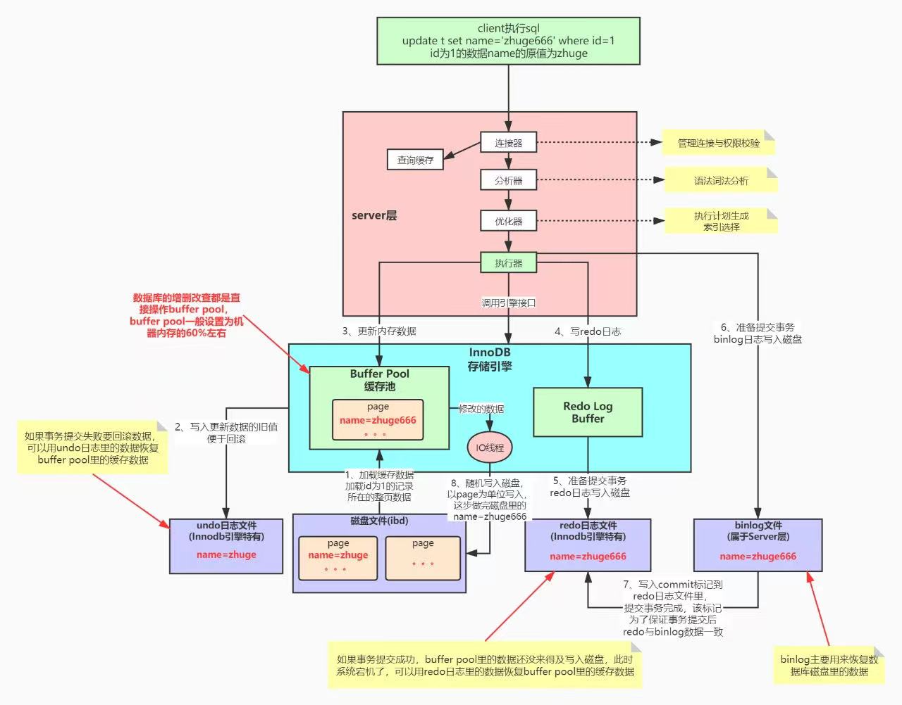
- [索引失效](https://mp.weixin.qq.com/s/0uXtO_BSKMbXI7NFE1O3GA)
  - select *
    - select * 会走索引
    - 范围查找有概率索引失效但是在特定的情况下会生效 范围小就会使用 也可以理解为 返回结果集小就会使用索引
    - mysql中连接查询的原理是先对驱动表进行查询操作，然后再用从驱动表得到的数据作为条件，逐条的到被驱动表进行查询。
    - 每次驱动表加载一条数据到内存中，然后被驱动表所有的数据都需要往内存中加载一遍进行比较。效率很低，所以mysql中可以指定一个缓冲池的大小，缓冲池大的话可以同时加载多条驱动表的数据进行比较，放的数据条数越多性能io操作就越少，性能也就越好。所以，如果此时使用select * 放一些无用的列，只会白白的占用缓冲空间。浪费本可以提高性能的机会。
  - 使用函数
    - 从 MySQL 8.0 开始，索引特性增加了函数索引，即可以针对函数计算后的值建立一个索引，也就是说该索引的值是函数计算后的值，所以就可以通过扫描索引来查询数据。
  - in
    - in 在结果集 大于30%的时候索引失效
  - ICP 索引下推
    -  5.6 之前没有完全去利用 二级缓存进行数据过滤 如果 3 开头的数据非常多 那就要一直回表 但是 5.6 之后去利用后续索引字段进行查询
    - 先通过 二级索引 查询到开头为 3 的数据 然后 再找到 c = 3 的数据进行过滤 之后拿到主键
    - 通过主键进行回表查询
- [varchar字段的最大长度]()
  - 听说过varchar字段的最大长度是65535吧? 
    - mysql数据表一般采用Dynamic行记录格式。它由行记录的额外信息和行记录的真实数据组成。行记录的额外信息包括：行记录的长度、行记录的类型、行记录的状态、行记录的版本号、行记录的最小事务ID、行记录的最大事务ID、行记录的创建时间、行记录的过期时间、行记录的事务ID、行记录的回滚指针等。行记录的真实数据包括：行记录的字段值、行记录的字段类型、行记录的字段长度等。
    - mysql表里单行中的**所有列加起来**（不考虑其他隐藏列和记录头信息） ，占用的最大长度是65535个字节
    - 如果数据表里只有一列 not null 的varchar字段，它的最大长度，接近于 65535 除以 字符集的maxlen。比如utf8字符集，maxlen是3，那么最大长度就是 65535/3=21845
    - 如果数据表里有多个列，每个列都是not null的varchar字段，那么每个字段的最大长度，接近于 65535 除以 字符集的maxlen 除以 字段个数。比如utf8字符集，maxlen是3，字段个数是3，那么最大长度就是 65535/3/3=7291
    - 如果要存放大于64k的字段数据，可以考虑使用longtext和longblob等类型。
    - mysql的数据页大小是16k，为了保存varchar或者text，blob这种长度可能大于16k的字段，在Dynamic行格式中，会只保留20个字节的指针，实际数据则放在其他**溢出页**中。为了将它们读取出来，会需要更多的磁盘IO。
  - blob vs text
    - blob和text很像，但blob没有字符集的概念(如果用blob来存文本的话，就没法用字符集的校对规则来排序和做比较。)，并且还能存放二进制的数据，比如图片或视频，但实际上图片和视频更推荐放在对象存储（Object Storage Service，简称oss）中。
    - blob和text的区别在于，blob是二进制的，text是字符的。blob可以存放任何二进制数据，比如图片、视频、音频等，而text只能存放字符数据，比如文本、json、xml等。
- MySQL 有哪些锁
  - 全局锁
    - 数据库处于只读状态，阻塞对数据的所有 DML/DDL
  - 表锁
    - 显式表锁
      - 分为共享锁（S）和排他锁（X） 显式加锁方式：lock tables ... read/write
    - Metadata-Lock 
      - 一种隐式表锁，不需要显式加锁，MySQL 内部自动加的锁，比如：alter table、drop table、rename table 等操作，都会自动加 Metadata-Lock
      - 主要功能是并发条件下，防止session1的查询事务未结束的情况下，session2对表结构进行修改，保护元数据的一致性
    - Intention Locks（意向锁）
      - 一种隐式表锁，不需要显式加锁，MySQL 内部自动加的锁，比如：insert、delete、update 等操作，都会自动加 Intention Locks
      - 意向锁为表锁（表示为IS或者IX），由存储引擎自己维护，用户无法干预
      - 冲突检测遍历整个表，效率太低。因此 innodb 使用意向锁来解决这个问题
  - 行锁
    - Record lock （记录锁）：最简单的行锁，仅仅锁住一行。记录锁永远都是加在索引上的，即使一个表没有索引， InnoDB 也会隐式地创建一个索引，并使用这个索引实施记录锁。
      - 加在索引记录上的锁。例如，SELECT c1 FROM t WHERE c1 = 10 For UPDATE;会对c1=10这条记录加锁，为了防止任何其他事务插入、更新或删除c1值为10的行
      - 需要特别注意的是，记录锁锁定的是索引记录。即使表没有定义索引，InnoDB也会创建一个隐藏的聚集索引，并使用这个索引来锁定记录。
    - Gap Locks （间隙锁）：加在两个索引值之间的锁，或者加在第一个索引值之前，或最后一个索引值之后的间隙。使用间隙锁锁住的是一个区间，而不仅仅是这个区间中的每一条数据。间隙锁只阻止其他事务插入到间隙中，不阻止其他事务在同一个间隙上获得间隙锁，所以 gap x lock 和 gap s lock  有相同的作用。它是一个左开右开区间：如（1，3）。
      - Gap指的是InnoDB的索引数据结构中可以插入新值的位置
      - 当你用语句SELECT…FOR UPDATE锁定一组行时。InnoDB可以创建锁，应用于索引中的实际值以及他们之间的间隙。例如，如果选择所有大于10的值进行更新，间隙锁将阻止另一个事务插入大于10的新值。
      - 既然是锁，那么就可能会影响到数据库的并发性，所以，间隙锁只有在Repeatable Reads这种隔离级别中才会起作用。
      - 对于SELECT FOR UPDATE、LOCK IN SHARE MODE、UPDATE和DELETE等语句处理时，除了对唯一索引的唯一搜索外都会获取gap锁或next-key锁，即锁住其扫描的范围
    - Next-Key Locks ：记录锁和间隙锁的组合，它指的是加在某条记录以及这条记录前面间隙上的锁。它是一个左开右闭区间：如（1，3】。
      - Next-Key Lock和Gap Lock一样，只有在InnoDB的RR隔离级别中才会生效。
    - Insert Intention （插入意向锁）：该锁只会出现在 insert 操作执行前（并不是所有insert操作都会出现），目的是提高并发插入能力。它在插入一行记录操作之前设置一种特殊的间隙锁，多个事务在相同的索引间隙插入时，如果不是插入间隙中相同的位置就不需要互相等待。
  - 锁的兼容
    - 读锁（S）：共享锁，多个事务可以同时加读锁，不互斥
    - 写锁（X）：排他锁，一个事务加写锁后，其他事务不能再加任何锁，互斥
    - 读锁（S）和写锁（X）是互斥的，读锁（S）和读锁（S）不互斥
    - 读锁（S）和间隙锁（Gap）不互斥，间隙锁（Gap）和间隙锁（Gap）互斥
    - 读锁（S）和意向锁（IS）不互斥，意向锁（IS）和意向锁（IS）互斥
    - 写锁（X）和间隙锁（Gap）互斥，写锁（X）和意向锁（IS）互斥
  - 锁信息查看方式
    - MySQL 5.6.16版本之前，需要建立一张特殊表 innodb_lock_monitor ，然后使用  show engine innodb status  查看
    - MySQL 5.6.16版本之后，修改系统参数 innodb_status_output 后，使用show engine innodb status 查看。
    - MySQL 5.7 版本之后 可以通过 information_schema.innodb_locks 查看事务的锁情况，但只能看到阻塞事务的锁；如果事务并未被阻塞，则在该表中看不到该事务的锁情况。
    - MySQL 8.0 版本之后 可以通过 performance_schema.data_locks 查看事务的锁情况，可以看到所有事务的锁情况。
  - [MySQL的加锁原则](https://developer.aliyun.com/article/791468)
    - 包含了两个“原则”、两个“优化”和一个“bug”：
      - 原则 1：加锁的基本单位是 next-key lock。是一个前开后闭区间。 
      - 原则 2：查找过程中访问到的对象才会加锁。 
      - 优化 1：索引上的等值查询，给唯一索引加锁的时候，next-key lock 退化为行锁。
      - 优化 2：索引上的等值查询，向右遍历时且最后一个值不满足等值条件的时候，next-key lock 退化为间隙锁。 
      - 一个 bug：唯一索引上的范围查询会访问到不满足条件的第一个值为止。
  - 记录存在时的加锁
    - 对于innodb, 加锁的2个决定因素：
     - 当前的事务隔离级别。
     - 当前记录是否存在。
  - [Question: 表t是 innodb 引擘，有主键：id（int类型) ，下面3条语句是否加锁？加锁的话，是什么锁？](https://mp.weixin.qq.com/s/TEXjgA85vUrvx2Q6O5Id1A)
    ```sql
    1. select * from t where id=X;
    2. begin;select * from t where id=X;
    3. begin;select * from t where id=X for update;
    ```
    - 假设 id 为2的记录存在，则在不同的4个隔离级别下3个语句的加锁情况汇总如下表( select 2 表示  select * from t where id =2)
      - 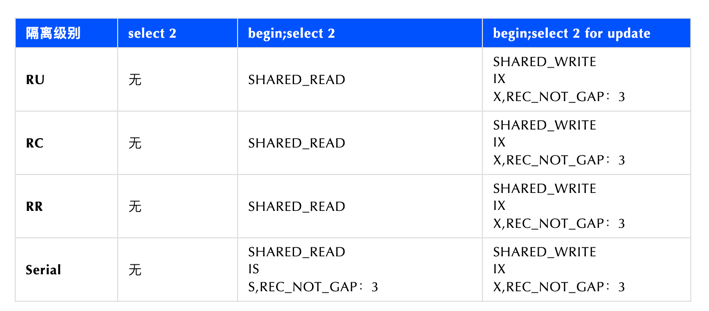
      - 对于 begin ; select ... where id =2这种只读事务，会加元数据锁SHARED_READ，防止事务执行期间表结构变化，查询performance_schema.metadata_locks 表可见此锁
      - 对于 begin; select ... where id =2这种只读事务，MySQL在RC和RR隔离级别下，使用 MVCC 快照读，不加行锁，但在Serial隔离级别下，读写互斥，会加意向共享锁（表锁）和共享记录锁（行锁）
      - 对于begin; select ... where id=2 for update，会加元数据锁SHARED_WRITE。
      - 对于begin; select ... where id=2 or update，4种隔离级别都会加意向排它锁（表锁）和排它记录锁（行锁），查询 performance_schema.data_locks 可见此2类锁。
    - 记录不存在时的加锁
      - 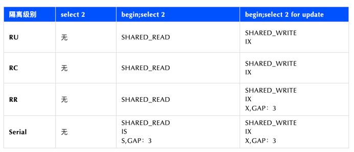
      - RR，Serial 隔离级别下，记录锁变成了 Gap Locks（间隙锁），可以防止幻读，lock_data 为3的 GAP lock 锁住区间（1，3），此时ID=2的记录插入会被阻塞。
    - 主键范围读取
      - RR 隔离级别为了防止幻读，存在间隙锁（GAP LOCK
      - 加锁的基本单位是 next-key lock，next-key lock 是前开后闭区间。
  - 隔离级别与锁的关系
    - rc，普通操作没有间隙锁
    - rr，普通操作有间隙锁
      - rc和rr加锁后，读取一行，判断是否匹配条件，如果不匹配，rc会立即释放锁，rr会等到事务结束才释放。
      - rc下还有半一致性读，就是一条记录被其它事务加锁了，当前事务需要读取这条记录并判断，按会读取这条记录最新的已提交记录，如果不匹配，就跳过。
  - [Mysql为何使用可重复读(Repeatable read)为默认隔离级别](https://www.hollischuang.com/archives/6427)
    - 先从四种隔离级别中排除Serializable和Read Uncommitted这两种，主要是因为这两个级别一个隔离级别太高，一个太低。太高的就会影响并发度，太低的就有脏读现象
    - binlog
      - bin log主要支持三种格式，分别是statement、row以及mixed。MySQL是在5.1.5版本开始支持row的、在5.1.8版本中开始支持mixed。
      - statement和row最大的区别，当binlog的格式为statemen时，binlog 里面记录的就是 SQL 语句的原文
      - 只有statement这种bin log格式，这时候，如果使用提交读(Read Committed)、未提交读(Read Uncommitted)这两种隔离级别会出现问题
    - bin log记录的是SQL语句的原文. 当出现事务乱序的时候，就会导致备库在 SQL 回放之后，结果和主库内容不一致
    - 为了避免这样的问题发生。MySQL就把数据库的默认隔离级别设置成了Repetable Read
    - 因为Repetable Read这种隔离级别，会在更新数据的时候不仅对更新的行加行级锁，还会增加GAP lock
  - RR 和 RC 的区别
    - 一致性读
      - 一致性读，又称为快照读。快照即当前行数据之前的历史版本。快照读就是使用快照信息显示基于某个时间点的查询结果，而不考虑与此同时运行的其他事务所执行的更改。
      - 在MySQL 中，只有READ COMMITTED 和 REPEATABLE READ这两种事务隔离级别才会使用一致性读。
      - 在 RC 中，每次读取都会重新生成一个快照，总是读取行的最新版本。
      - 在 RR 中，快照会在事务中第一次SELECT语句执行时生成，只有在本事务中对数据进行更改才会更新快照。
      - 在数据库的 RC 这种隔离级别中，还支持"半一致读" ，一条update语句，如果 where 条件匹配到的记录已经加锁，那么InnoDB会返回记录最近提交的版本，由MySQL上层判断此是否需要真的加锁。
    - 锁机制
      - 在 RC 中，只会对索引增加Record Lock，不会添加Gap Lock和Next-Key Lock。
      - 在 RR 中，为了解决幻读的问题，在支持Record Lock的同时，还支持Gap Lock和Next-Key Lock；
    - 主从同步
      - MySQL的binlog主要支持三种格式，分别是statement、row以及mixed，
      - 但是，RC 隔离级别只支持row格式的binlog。如果指定了mixed作为 binlog 格式，那么如果使用RC，服务器会自动使用基于row 格式的日志记录。
      - 而 RR 的隔离级别同时支持statement、row以及mixed三种。
  - 为什么互联网公司选择使用 RC
    - 提升并发 
      - 首先，RC 在加锁的过程中，是不需要添加Gap Lock和 Next-Key Lock 的，只对要修改的记录添加行级锁就行了。 这就使得并发度要比 RR 高很多。
      - 另外，因为 RC 还支持"半一致读"，可以大大的减少了更新语句时行锁的冲突；对于不满足更新条件的记录，可以提前释放锁，提升并发度。
    - 减少死锁
      - 因为RR这种事务隔离级别会增加Gap Lock和 Next-Key Lock，这就使得锁的粒度变大，那么就会使得死锁的概率增大
  - [Innodb的RR到底有没有解决幻读](https://www.hollischuang.com/archives/6854)
    - 在RC级别中，幻读是没有办法解决的，因为RC中快照读是每一次都会重新生成快照，并且RC中也不会有间隙锁。
    - 在RR级别中，因为有MVCC机制，对于普通的无锁查询，这种是属于快照读的，RR的快照读在同一个事务中只会读一次，所以在事务过程中，其他事务的变更不会影响到当前事务的查询结果。所以这种幻读是可以解决的。
    - MVCC只能对快照读起作用，而对于加锁的读请求，这种属于当前读，当前读的话是可以查询到其他事务的变更的，所以会产生幻读。
- [MySQL一定是遵循最左前缀匹配的?](https://www.hollischuang.com/archives/6812)
  - MySQL一定是遵循最左前缀匹配的，这句话在以前是正确的，没有任何毛病。但是在MySQL 8.0中，就不一定了。 - 索引跳跃扫描
  - 这种查询优化比较适合于f1的取值范围比较少，区分度不高的情况，一旦f1的区分度特别高的话，这种查询可能会更慢。
- SQL under MySql 8.0
  - ORDER BY FIELD() 自定义排序逻辑
  - case when then else end表达式功能非常强大可以帮助我们解决 if elseif else 这种问题
    - case when then 语句不匹配如果没有写 else end 会返回 null，影响数据展示
  - EXISTS 用法
    - 它的作用是根据主查询的数据，每一行都放到子查询中做条件验证，根据验证结果（TRUE 或者 FALSE），TRUE的话该行数据就会保留
    ```sql
    SELECT * from emp e where exists (
      SELECT * from dept p where e.dept_id = p.dept_id
        and e.dept_name != p.dept_name
    )
    ```
    - 通过 exists 语法将外层 emp 表全部数据 放到子查询中与一一与 dept 表全部数据进行比较，只要有一行记录返回true
  - GROUP_CONCAT(expr) 组连接函数
    - GROUP_CONCAT(expr) 组连接函数可以返回分组后指定字段的字符串连接形式，并且可以指定排序逻辑，以及连接字符串，默认为英文逗号连接
  - 自连接查询
    - 自连接查询是指在同一张表中进行连接查询，这种查询方式可以将表中的数据进行横向对比，从而得到更多的信息
    - tree 表中通过 pid 字段与 id 字段进行父子关联，假如现在有一个需求，我们想按照父子层级将 tree 表数据转换成 一级职位 二级职位 三级职位 三个列名进行展示
    ```sql
     SELECT t1.job_name '一级职位', t2.job_name '二级职位', t3.job_name '三级职位'
     from tree t1 join tree t2 on t1.id = t2.pid left join tree t3 on t2.id = t3.pid
     where t1.pid = 0;
     ```
  - ORDER BY 空值 NULL 排序
    - ORDER BY 字句中可以跟我们要排序的字段名称，但是当字段中存在 null 值时，会对我们的排序结果造成影响。我们可以通过 ORDER BY IF(ISNULL(title), 1, 0) 语法将 null 值转换成0或1，来达到将 null 值放到前面还是后面进行排序的效果。
  - with rollup 分组统计数据的基础上再进行统计汇总
    - MySql 中可以使用 with rollup 在分组统计数据的基础上再进行统计汇总，即用来得到 group by 的汇总信息。
- [Building and deploying MySQL Raft at Meta](https://engineering.fb.com/2023/05/16/data-infrastructure/mysql-raft-meta/)
  - Why
    - In the past, to help guarantee safety and avoid data loss during the complex promotion and failover operations, several automation daemons and scripts would use locking, orchestration steps, a fencing mechanism, and SMC,  a service discovery system. It was a distributed setup, and it was difficult to accomplish this atomically. The automation became more complex and harder to maintain over time as more and more corner cases needed to be patched.
  - Process
    - In standard MySQL:
      - Primary writes to binlog and sends binlog to replicas.
      - Replicas receive in relay log and apply the transactions to the engine. During apply, a new replica-only binlog is created.
    - In MySQL Raft:
      - Primary writes to binlog via Raft, and Raft sends binlog to followers/replicas.
      - Replicas/followers receive in binlog and apply the transactions to the engine. An apply log is created during apply.
      - Binlog is the replicated log from the Raft point of view.
  - Raft vs Paxos
    - Meta 实现了一个Raft变种协议FlexiRaft ，传统的Raft协议把所有节点都放在一个组里来管理，事务提交也是在这个组，故障重新选举也是在这个组，因此会互相“纠缠”，支持跨地域容灾了嘛，那事务提交也会因为跨区域就慢，真是难平衡呀
    - FlexiRaft把一个组拆成了两个组，事务在一个组里提交，故障切换在另一个组里搞选举。这样可以做到事务提交不出地域，保证低延迟；好巧不巧遇到地域故障时，又可以把数据库切换到其他地域
    - 采用Paxos算法的MySQL Group Replication就没这么灵活了，并且MGR还存在一些设计上的缺点。比如为了减少性能损失，MGR的Paxos层里并不持久化日志，多个节点在内存中达成一致后直接提交，这时候如果掉电就存在丢数据的风险。
- [MySQL 事务隔离级别](https://mp.weixin.qq.com/s/4vV792F4UBaTTB7W9EsHbw)
  - 本地数据库事务原理：undo log（原子性） + redo log（持久性） + 数据库锁（原子性&隔离性） + MVCC（隔离性）
  - 分布式事务原理：全局事务协调器（原子性） + 全局锁（隔离性） + DB本地事务（原子性、持久性） + 2PC（原子性）
- [TDSQL-C]
  - 存算分离
  - flashback query - 数据快速恢复
  - audit
  - severless - 存储资源 释放 （弹性）
  - 平滑弹性扩缩容 - 移除毛刺
  - serverless = Faas + Baas
- [分页](https://mp.weixin.qq.com/s/7laj01CkVXy6d9AYijA28g)
  - 分页丢数据
  - 如果你非常在意执行结果的顺序，那么在 ORDER BY 子句中包含一个额外的列，以确保顺序具有确定性。
- [SQL优化](https://mp.weixin.qq.com/s/j8tarAZaIj2eOijmKGD7Fw)
  - SQL语句中查询变量和字段定义类型不匹配是另一个常见的错误
  - 联更新、删除 虽然 MySQL5.6 引入了物化特性，但需要特别注意它目前仅仅针对查询语句的优化。对于更新或删除需要手工重写成 JOIN
  - MySQL 对待 EXISTS 子句时，仍然采用嵌套子查询的执行方式 - 去掉 exists 更改为 join，能够避免嵌套子查询
  - 条件下推
    - 外部查询条件不能够下推到复杂的视图或子查询的情况有：
      - 聚合子查询；
      - 含有 LIMIT 的子查询；
      - UNION 或 UNION ALL 子查询；
      - 输出字段中的子查询；
- [Shuffle](https://mp.weixin.qq.com/s/edUYhTX3062dNLUcx08GIA)
  - shuffle算法的基本原理，就是给输入的数据进行分桶，每个桶内的数据都可以单独处理并且输出结果。这样可以减少汇总数据时hash表的大小
  - 为什么需要支持shuffle？原因主要有以下三点。
     - 解决hash表太大导致分配内存失败的问题；提高计算节点的横向扩展性；
     - 提升性能：当hash表太大时，随机访问hash表会导致非常高的cache miss概率，而cache miss会导致性能显著下降。通过shuffle将hash表切分成多个小hash表进行处理，对每个小hash表的随机访问cache命中率大大提高，进而提升整体性能
- [奇思妙想的SQL]
  - [兼顾性能的数据倾斜处理](https://mp.weixin.qq.com/s/VGgT1faRKGnUuQ-HHQ3Q5g)
    - 常见的优化方法
      - Mapjoin
        - 通过把小表广播到大表所在计算节点上，有效避免了大表的Shuffle，自然也就避免了数据重分布导致的数据倾斜
      - 特殊值/空值打散
        - 比如主表中有个属性字段在某些场景下为空或为一些无业务含义的特殊字符串（如DEFAULT），然后此属性字段本身对应了一张数据量较大的维表，需要关联打宽补全。
        - 此时做数据关联，由于两张表需要按照关联key进行shuffle，就会导致主表中该字段为空/相同特殊字符串的数据记录shuffle到同一节点上，从而导致数据倾斜。
      - 热点值打散，副表呈倍数扩散
        - 此方法适用于被关联表远比主表小，但又因数据大小超过内存容量而无法使用Mapjoin，且主表的数据倾斜程度不大
        - 核心在于对于主表附加一个随机值（比如1～10）字段，记为ext_a字段，然后对应被关联维表数据按照对应倍数进行复制膨胀，并依次赋予1～10的编号，记为ext_b字段，然后在关联两张表时把ext_a、ext_b两个字段也作为关联字段之一
      - 热点数据单独处理/SkewJoin
        - 使用此方法通常也意味着被关联的维表数据大小较大，无法使用Mapjoin，只能走普通shuffle模式的join方案
        - 此类场景最典型的案例就是双十一淘系交易大表关联商家维表，此时的商家维表因记录数和数据大小都较大而无法放入内存，再加上部分商家的交易单量远超大盘平均，此时的数据倾斜就得使用热点数据单独处理的方案了
        - 热点数据单独处理的方案的核心点在于将热点数据提取出来单独处理，热点数据可以用Mapjoin的方式完成关联维表热点记录行，非热点则使用普通的shuffle模式的join方案完成关联
          - 基于主表统计获得Top热点的属性值；
          - 用热点属性值将被关联维表拆成热点小表和非热点表，同时也将主表拆成热点主表和非热点主表；
          - 热点小表通过Mapjoin与热点主表join，非热点表与非热点主表join，最终两部分再Union到一起，完成数据关联
    - 新的思路 With Distmapjoin
      - 数据倾斜的核心在于数据处理不均匀，而数据处理的不均匀往往又来自数据重分发，也就是shuffle
      - 我们联想到了Distmapjoin的能力，通过对中小规模的表（为便于理解，后文用维表进行替代）构建远程分布式查询节点，大表再通过网络远程查询相关维表数据，从而实现了类似于Mapjoin的方式，大表无须shuffle即能完成Join操作
      - Mapjoin用于处理热点数据，将维表热点记录广播至大表所在计算节点；Distmapjoin用于处理非热点数据，用于通过构建远程分布式查询节点，实现大表在无需移动的情况下完成数据关联操作
- [where 条件后 写上1=1]
  - SQL注入
  - 语法规范
    ```
    String sql="select * from table_name where 1=1";
    if( condition 1) {
      sql=sql+"  and  var2=value2";
    }
    if(condition 2) {
      sql=sql+"  and var3=value3";
    }
    ```
  - 拷贝表
  - 复制表结构 `select  * from  Source_table where   1 <> 1;`
- [ in 和 not in]
  - IN 和 NOT IN 是比较常用的关键字，为什么要尽量避免呢？
    - 效率低
    - 如果是确定且有限的集合时，可以使用。如 IN （0，1，2）。
  - Solution
    - 用 EXISTS 或 NOT EXISTS 代替
    - 用JOIN 代替
- [自增主键一定是连续]
  - MySQL 8.0 版本，将自增值的变更记录在了 redo log 中，重启的时候依靠 redo log 恢复重启之前的值。
  - MySQL8.0之后版本，已经默认设置为 innodb_autoinc_lock_mode=2 ， binlog_format=row.。这样更有利与我们在 insert … select 这种批量插入数据的场景时，既能提升并发性，又不会出现数据一致性问题。
- 索引键的长度限制
  - MyISAM
    - 单列索引：最大长度不能超过 1000 bytes，否则会报警，但是创建成功，最终创建的是前缀索引（取前333个字符）。
    - 联合索引：索引长度和不能超过 1000 bytes，否则会报错，创建失败
  - InnoDB
    - 单列索引：超过 767 bytes的，给出warning，最终索引创建成功，取前缀索引（取前 255 字符）
    - 联合索引：各列长度不超过 767 字节 ，如果有超过 767 bytes 的，则给出报警，索引最后创建成功，但是对于超过 767 字节的列取前缀索引，与索引列顺序无关，总和不得超过 3072 ，否则失败，无法创建
    - 默认情况下utf编码一个字符占三个字节，也就是说在InnoDB引擎中，4个varchar(255)字段就把单表索引长度给占满了哦！
    - 3072 / 767 约等于 4， 而varchar(255)，在utf8编码下是765字节，因此四个varchar(255)字段就快超过综合3072了
  - MySQL版本对索引长度限制
    - MySQL5.7： MySQL5.5版本与MySQL5.6 版本，innodb_large_prefix 是默认关闭的，在 MySQL5.7 及以上版本则默认开启
    - MySQL8.0 版本：innodb_large_prefix 已被移除，从版本 8.0 开始，索引长度限制由行格式决定
      - 若行格式为 DYNAMIC 或 COMPRESSED 时，限制值为 3072，而行格式 REDUNDANT 或 COMPACT 时，限制值为 767。
  - 字符集对索引长度影响
    - UTF8编码占用3个字节，能表示除了表情符之外的其他字符，UFT8mb4占用4个字节，既能表示汉字也能表示表情符
- 清理错误数据
  - create table as这个语句的不熟悉，这个语句建表导致的表主键、索引、auto_increment的丢失。
  - DELETE FROM MY_TABLE 
  - truncate语句，保留原表结构
  - CREATE TABLE LIKE 语句创建临时表，复制原表结构
- [MySQL replication lag is too big due to miss to warm up innodb buffer pool](https://yishenggong.com/2024/04/09/mysql-replication-lag-is-too-big-due-to-miss-to-warm-up-innodb-buffer-pool/)
  -  show processlist
  - show slave status
  - Root cause: miss to warm up MySQL innodb buffer pool —> slow queries —> lag too big
    - warm up query: `select count(distinct index_id) from <TABLE>`
  - 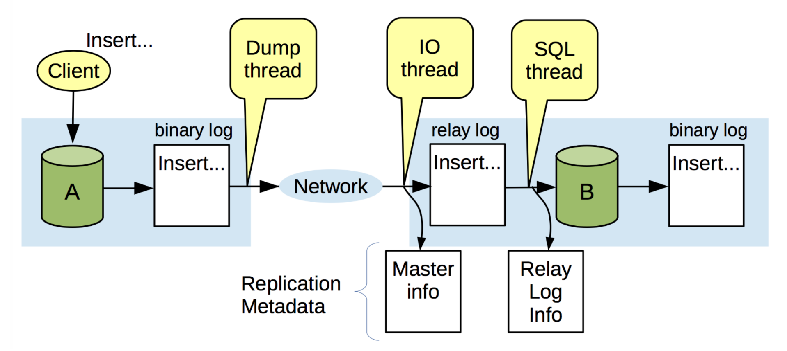
- SELECT COUNT(*) 会造成全表扫描
  - 针对无 where_clause 的 COUNT(*)，MySQL 是有优化的，优化器会选择成本最小的辅助索引查询计数
  - 不管是 COUNT(1)，还是 COUNT(*)，MySQL 都会用成本最小的辅助索引查询方式来计数，也就是使用 COUNT(*) 由于 MySQL 的优化已经保证了它的查询性能是最好的
  - 按照效率排序来看，count(字段) < count(主键 id) < count(1) ≈ count(*)，所以尽量使用 count(*)
  - SQL 选用索引的执行成本如何计算
    - IO 成本：即从磁盘把数据加载到内存的成本，默认情况下，读取数据页的 IO 成本是 1
    - CPU 成本：将数据读入内存后，还要检测数据是否满足条件和排序等 CPU 操作的成本，显然它与行数有关，默认情况下，检测记录的成本是 0.2
  - 5.6 及之后的版本中，我们可以用 optimizer trace 功能来查看优化器生成计划的整个过程 ，它列出了选择每个索引的执行计划成本以及最终的选择结果
  ```sql
  SET optimizer_trace="enabled=on";  
  SELECT create_time FROM person WHERE NAME >'name84059' AND create_time > '2020-05-23 14:39:18';  
  SELECT * FROM information_schema.OPTIMIZER_TRACE;  
  SET optimizer_trace="enabled=off";
  ```
- [为啥不用外键]
  - 优点
    - 数据一致性：外键可以确保表与表之间的关联关系，维护数据的一致性。通过外键约束，可以避免插入或更新无效的引用，保持数据的完整性。
    - 数据完整性：外键可以防止误删除关联的数据。如果有关联关系的数据存在，删除主表中的记录时，外键约束可以阻止删除，或者通过级联操作删除相关的从表数据。
    - 关联查询： 外键使得关联查询更加方便。可以通过 JOIN 操作轻松地获取关联表的信息，提高查询的灵活性。
  - 缺点
    - 性能开销： 外键可能引入一定的性能开销。特别是在大规模的数据库中，维护外键关系可能会影响插入、更新和删除操作的性能。
    - 复杂性：外键关系可能增加数据库结构的复杂性。在设计数据库时，需要仔细考虑外键的引入，以及相关的级联操作和约束。
    - 不同数据库支持不同：不同的数据库管理系统对外键的支持程度和实现方式可能有所不同。在切换数据库引擎或迁移数据时，可能会遇到兼容性问题。
  - 不太建议使用外键，主要基于以下考虑
    - 水平分片： 在水平分片的情况下，外键可能会增加复杂性。某些数据库系统对分片上的外键支持可能有限，因此在这种情况下可能会选择不使用外键。
    - 微服务架构： 在微服务架构中，服务之间的解耦是一个关键设计原则。有些团队认为外键引入了过多的服务之间的耦合，因此选择在微服务架构中限制外键的使用。
- [Semijoin ](https://mp.weixin.qq.com/s/UYS5ALDC0nOdookJGijkrg)
  - MySQL semijoin也被称为半连接，主要是解决外查询一个或多个表的记录在包含一个或多个表的子查询结果中的存在性问题
  - 如IN/EXIST子查询。
    - 如果按照IN/EXIST谓词的原语义去执行，对外查询的每行记录都去计算IN/EXIST谓词的结果
    - 子查询的内容就需要单独执行，在关联子查询的情况下，子查询需要多次重复执行，整体的执行效率很低
  - 如何在外表和内表JOIN的同时保证这一点呢？MySQL中实现了四种执行策略来避免重复行：Materialize、DuplicateWeedOut、FirstMatch 和LooseScan
  - Materialize策略
    - Materialize策略是将子查询的结果集存储在临时表中，然后将外表和临时表进行JOIN操作，这样就可以保证外表的每一行只会被JOIN一次
    - Materialize是将内表独立进行JOIN后的结果物化到临时表并去重，然后将物化表与其他外表做JOIN的执行方式
    - 由于物化表已经去重，与外表做JOIN并不会引起数据膨胀，所以就变成普通的JOIN，与外表的JOIN ORDER可以任意调整。
  - DuplicateWeedOut
    - DuplicateWeedout是创建一个临时表，在执行将外表记录的主键写入临时表上带有唯一索引的rowids字段，起到对外表因为和内表JOIN之后产生的重复行去重的作用。
  - FirstMatch
    - FirstMatch是在外表的一行记录和内表JOIN得到一行输出后，直接跳过所有内表接下来的数据行，读取外表的下一行执行，从而避免外表产生重复行的方式。
  - LooseScan
    - LooseScan是在外表的一行记录和内表JOIN得到一行输出后，直接跳过所有内表接下来的数据行，读取外表的下一行执行，从而避免外表产生重复行的方式。
    - LooseScan是在内表有索引存在的情况下，通过做内表上的LooseScan(仅扫描索引记录不相同的行)来达到对内表记录去重的目的，然后和外表进行连接，这样也不会导致外表出现重复行
  - 为什么要有四种执行策略呢？
    - 因为在内外表不同的JOIN ORDER、索引存在性、不同的JOIN条件情况下，只有特定的执行策略才能被应用，四种组合起来才构成了semijoin JOIN ORDER的灵活性
- [mysql innodb 锁机制实现原理](https://mp.weixin.qq.com/s/0GixiOIurb1TVDHZ7b-aeQ)
  - 行锁；自增长键锁；间隙锁、临键锁；表级意向锁；插入意向锁
  - innodb 中的 lock 从占有模式上也可以分为：
    - 共享锁 Share Lock（简称 S Lock） ：S Lock 之间可以共享
    - 排它锁 Exclusive Lock（简称 X Lock） ：必须保证独占，和其他 Lock 均为互斥关系
- [MySQL进行模糊查询](https://mp.weixin.qq.com/s/awwAQsHtzWx5MXA5HFKhHA)
  - 我们在做模糊查询的时候，并非要想查询的关键词都在开头，所以如果不是特别的要求，"keywork%"并不合适所有的模糊查询
  - LOCATE(substr,str), LOCATE(substr,str,pos)
    - SELECT `column` FROM `table` WHERE LOCATE('keyword', `field`)>0
  - .POSITION('substr' IN `field`)方法
  - INSTR(`str`,'substr')方法
  - SQL查询语句优化方法
    - 避免在 where 子句中使用!=或<>操作符，否则将引擎放弃使用索引而进行全表扫描
    - 尽量避免在 where 子句中对字段进行 null 值判断，否则将导致引擎放弃使用索引而进行全表扫描
    - 避免在 where 子句中使用 or 来连接条件，否则将导致引擎放弃使用索引而进行全表扫描
    - in 和 not in 也要慎用，否则会导致全表扫描
    - 避免在 where 子句中对字段进行表达式操作 函数操作，这将导致引擎放弃索引而进行全表扫描
    - 很多时候用 exists 代替 in 是一个好的选择
- [undolog、redolog、binlog](https://mp.weixin.qq.com/s/NAvFdfltAeuRnYiJlD3HLQ)
  - 总结
    - 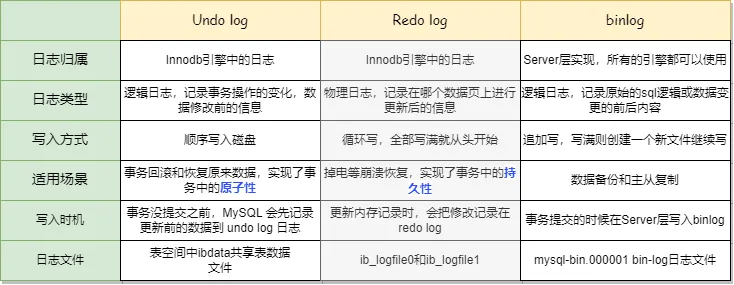
    - undolog、redolog都是InnoDB引擎中的日志，而且都是在Buffer Pool中，而binlog在Server层中，位于每条线程中，并且每种日志在磁盘中的的归档方式和文件都是不一样的
    - InnoDB 存储引擎实现了 WAL 机制。包含 Redo log buffer、Redo log、Undo Log 等，来记录事务已提交但未写入数据文件的数据变更以及事务回滚后的数据还原
  - Undo log
    - undo log 叫做回滚日志，它保证了事务的 ACID 特性中的原子性（Atomicity），是引擎层生成的日志，记录的是逻辑操作，用于记录数据被修改前的信息
    - undo log的两个主要作用是【事务回滚】 和 通过ReadView + undo log 实现 【MVCC (多版本并发控制)】
  - Redo log
    - 大部分redo log记录的是物理日志，记录的是某个数据页做了什么修改
    - Redo log buffer 是用作数据变更记录写入 Redo log 文件前的一块内存区域。日志缓冲区大小由 innodb_log_buffer_size 变量定义，默认大小为 16MB。
    - redo log日志主要包括两部分：
      - 一是在内存中重做日志缓冲（redo log Buffer）易丢失，在内存中， 二是重做日志文件（redo log file），保存在磁盘中。
    - 为何需要redo log
      - buffer pool 确实提高了读写效率没错，但是问题来了，Buffer Pool 是基于内存的，而内存总是不可靠，万一断电重启，还没来得及落盘的脏页数据就会丢失，这时候就需要redo log来保证数据的持久性
    - 和undolog的区别
      - redo log 记录了此次事务「完成后」的数据状态，记录的是更新之后的值
      - undo log 记录了此次事务「开始前」的数据状态，记录的是更新之前的值
  - Binlog
    - bin log 主要是记录所有对数据库表结构变更和表数据修改的操作，对于select、show这类读操作并不会记录。
    - bin log 是在事务提交后再服务层产生的日志，主要作用有两个：
      - 数据恢复 ：Binlog 详细记录了所有修改数据的 SQL，当某一时刻的数据误操作而导致出问题，或者数据库宕机数据丢失，那么可以根据 Binlog 来回放历史数据。
      - 主从复制：想要做多机备份的业务，可以去监听当前写库的 Binlog 日志，同步写库的所有更改。
    - 为什么有了 binlog， 还要有 redo log？
      - 开始 MySQL 里并没有 InnoDB 引擎，MySQL 自带的引擎是 MyISAM，但是 MyISAM 没有 crash-safe 的能力，binlog 日志只能用于归档。
      - InnoDB引擎 是另一个公司以插件形式引入 MySQL 的，而MYSQL的bin log没有灾难恢复能力，所以 InnoDB 使用 redo log 来实现 crash-safe 能力，确保任何事务提交后数据都不会丢失。
  - 检查点（Checkpoint
    - 虽然数据在写入 Redo log 文件后，就代表数据变更已经生效了，但是还未写入到数据文件，也就是还没有完成事务的持久性 检查点就是帮助 MySQL 实现事务的持久性
    - Checkpoint 就是指一个触发点（时间点），当发生 Checkpoint 时，会将脏页写回磁盘，以确保数据的持久性和一致性
    -  Redo log、Undo log 文件也可以重新覆写，这样可以保证重启时不会因为 Redo log、Undo log 文件太大而导致重启时间过长。
- [全局字典索引分布式计算](https://mp.weixin.qq.com/s/ngSAilAnfkd_c1mAZd_Z3Q)
  - 在一些业务场景中，我们需要将字符串映射为一个整形数字，并确保全局唯一，比如在BitMap字典索引计算场景。
    - 常用的方法是将数据集根据需要映射的字符串做全局order by排序，将排序号作为字符串的整形映射。
    - 但如果一次要计算的数据量太大（十亿级别或更大），会跑耗时较久甚至跑不出来。
  - 提供一种能充分利用分布式计算资源来计算全局字典索引的方法，以解决在大数据量下使用上诉方式导致所有数据被分发到单个reducer进行单机排序带来的性能瓶颈
  - 思路是先做分桶进行分布式局部排序、再基于桶大小得到全局索引。类似于操作系统指令寻址的基址寻址，我们需要对每个id做绝对地址映射，利用一个基址加上相对地址得到绝对地址。
- MySQL中Varchar(50)和varchar(500)区别是什么
  - Varchar(50)和varchar(500)存储空间上是一样的
  - 索引覆盖查询性能差别不大
  - 全表扫描无排序情况下,两者性能无差异,在全表有排序的情况下, 两种性能差异巨大
    - 进行排序操作的时候，Mysql会根据该字段的设计的长度进行内存预估，如果设计过大的可变长度，会导致内存预估的值超出sort_buffer_size的大小，导致mysql采用磁盘临时文件排序,最终影响查询性能。
- [innodb 事务](https://mp.weixin.qq.com/s/d5RJsSv0tPwzmvFw0vYb6Q)
- MySQL innodb 插入记录是并发的。 MySQL innodb 插入记录不存在幻读问题，MySQL 通过 mvcc+ ReadView解决幻读问题
- [Delete同一行记录也会造成死锁](https://mp.weixin.qq.com/s/cPDwCt25eRhV9Wuu5PqgrA)
  - 只有唯一索引会引发此类死锁问题，主键索引和普通索引均不会
  - 在 MySQL 环境 8.x 版本环境中，DELETE 操作引发的死锁情况得到了改进。通过观察加锁日志发现，事务在对于 delete mark 的记录加锁时，如果已经持有了该记录的记录锁，他将获取间隙锁而不是临键锁，这一变化有效避免了死锁的发生。
- [MySQL 8.0：filesort 性能退化的问题](https://mp.weixin.qq.com/s/qYkyzD79nQuNGe59M2wWgg)
  - 8.0 排序过程中发生了对无关列的数据转换，导致了性能退化。用户的实例中包含了溢出列，由于溢出列的数据转换格外耗时，最终将这个性能退化的问题放大。
- [MySQL 中的 distinct 和 group by 哪个效率更高](https://mp.weixin.qq.com/s/zDjluBvsSJgp2VyLxqBQLw)
  - 在语义相同，有索引的情况下：
    - group by和distinct都能使用索引，效率相同。因为group by和distinct近乎等价，distinct可以被看做是特殊的group by。
  - 在语义相同，无索引的情况下：
    - distinct效率高于group by。原因是distinct 和 group by都会进行分组操作，但group by在Mysql8.0之前会进行隐式排序，导致触发filesort，sql执行效率低下。
    - 但从Mysql8.0开始，Mysql就删除了隐式排序，所以，此时在语义相同，无索引的情况下，group by和distinct的执行效率也是近乎等价的。
-  where condition order by A limit N 这样的语句，由于MYSQL5.7默认是打开 prefer_ordering_index 也就是在操作的时候，由于limit N 的值比较小，导致查询分析器去走ORDER BY 字段上的索引，而放弃更适合的索引。
- mysql 优化的工具
  - mysqltuner.pl 是mysql一个常用的数据库性能诊断工具，主要检查参数设置的合理性包括日志文件、存储引擎、安全建议及性能分析
  - tuning-primer.sh 针于mysql的整体进行一个体检，对潜在的问题，给出优化的建议
  - pt-variable-advisor 
  - pt-qurey-digest 主要功能是从日志、进程列表和tcpdump分析MySQL查询
- 通过 MySQL 的 SHOW INDEX 命令查看索引的 Cardinality 值，它表示索引的选择性。值越大，索引越有效
  - `SHOW INDEX FROM order_info WHERE Key_name = 'idx_order_status';` 如果 Cardinality 很低，说明创建的普通索引对性能提升不大
- [一条SQL最多能查询出来多少条记录](https://mp.weixin.qq.com/s/X_OVuOi7quR65-JedMYlBw)
  - MySQL 8  - max_allowed_packet
    - MySQL 客户端  max_allowed_packet 值的默认大小为 16M（不同的客户端可能有不同的默认值，但最大不能超过 1G）
    - MySQL 服务端 max_allowed_packet 值的默认大小为 64M
    - max_allowed_packet 值最大可以设置为 1G（1024 的倍数
  - 你的单行记录大小不能超过  max_allowed_packet
  - 一个表最多可以创建 1017 列 （InnoDB）
  - 建表时定义列的固定长度不能超过 页的一半（8k,16k...）
  - 建表时定义列的总长度不能超过 65535  个字节
- [MySQL 是怎么做并发控制](https://www.bestblogs.dev/en/article/463f54)
  - 表上的并发控制，或者说表锁主要保护的是表结构，在 MySQL 8.0 版本中，表结构的保护都是由 MDL 锁完成；非 InnoDB 表（CSV 表）还会依赖 Server 层的表锁进行并发控制，InnoDB 表不需要 Server 层加表锁；
  - 页上的并发控制，或者说 index 和 page 上的锁主要是为了保护 B+tree 的安全性，乐观写入下，只有叶子节点上需要加 X 锁；悲观写入下（SMO），索引可能修改的节点上都需要加 X 锁。引入 SX 锁增加了读写并发，但是 SMO 操作依然不能并发；
  - 行上的并发控制，或者说行锁主要是为了保护行记录的一致性，其实行上的并发控制还有一个很重要的点是 MVCC
- 全表 update 
  - 数据量达到一个量级后，就会出现一些问题，比如主从架构部署的Mysql，主从同步需要需要binlog来完成, 因此如果在亿级数据的表中执行全表update，必然会在主库中产生大量的binlog，接着会在进行主从同步时，从库也需要阻塞执行大量sql，风险极高，因此直接update是不行的
  - Solution
    - 写一个这样的脚本，依次分批替换，limit的游标不断增加。
    - mysql的limit游标进行的范围查找原理，是下沉到B+数的叶子节点进行的向后遍历查找，在limit数据比较小的情况下还好，limit数据量比较大的情况下，效率很低接近于全表扫描，这也就是我们常说的“深度分页问题”。
  - 全表扫数据如何防止对buffer pool污染到我们业务正常的热点数据
  - Final Solution
    ```
    select /*!40001 SQL_NO_CACHE */ id from tb_user_info FORCE INDEX(`PRIMARY`) where id> "1" ORDER BY id limit 1000,1;

    update tb_user_info set user_img=replace(user_img,'http','https') where id >"{1}" and id <"{2}";
    ```
    - 我们在select sql中使用了这个语法/*!40001 SQL_NO_CACHE */，这个语法的意思就是本次查询不使用innodb的buffer pool，也不会将本次查询的数据页放到buffer pool中作为热点数据的缓存。
    - Q：第一个sql如果不走buffer pool，第二个更新sql也会把数据页载入到buffer pool吧？
    - A：读缓存和写缓存是不一样的。
    - Q：只要我知道min_id、max_id，只要序列差不多连续是不是可以直接分片执行，不需要一定要每次1000条执行的吧？
    - A：min和max这样直接分片的话，除非是自增id，否则是不能保证匀速的，后续多线程执行的任务分配也不能得到保证。
- [The-Art-of-Problem-Solving-in-Software-Engineering_How-to-Make-MySQL-Better](https://advancedmysql.github.io/The-Art-of-Problem-Solving-in-Software-Engineering_How-to-Make-MySQL-Better/)
- [MySQL 批量操作，一次插入多少行数据效率最高](https://mp.weixin.qq.com/s/IZT1IaOCXjEe28CXrfMcgA)
  - 适当增大 max_allowed_packet 参数可以使client端到server端传递大数据时，系统能够分配更多的扩展内存来处理。不能超过32M
  - 首先是插入的时候，要注意缓冲区的大小使用情况
    - 如果buffer pool余量不足25%，插入失败，返回DB_LOCK_TABLE_FULL。
    - 插入并不能仅仅只考虑max_allowed_packet的问题，也要考虑到缓冲区的大小。
  - 插入缓存
    - 对于innodb引擎来说，因为存在插入缓存（Insert Buffer）这个概念，所以在插入的时候也是要耗费一定的缓冲池内存的 innodb_buffer_pool_size
    - 写密集的情况下，插入缓冲会占用过多的缓冲池内存，默认最大可以占用到1/2的缓冲池内存，当插入缓冲占用太多缓冲池内存的情况下，会影响到其他的操作。
  - 使用事务提升效率
    - 使用事务可以提高数据的插入效率，这是因为进行一个INSERT操作时，MySQL内部会建立一个事务，在事务内才进行真正插入处理操作。通过使用事务可以减少创建事务的消耗，所有插入都在执行后才进行提交操作
    - MySQL有innodb_log_buffer_size配置项，超过这个值会把innodb的数据刷到磁盘中  64M
  - 索引影响插入性能
  - 最终是选用的一次批量插入数据量为max_allowed_packet大小的一半
- [数据表增加一列，一定会锁表]
  - 在 MySQL 中，使用 InnoDB 存储引擎给数据表增加一列时，并不一定会锁表。
  - 从 MySQL 5.6 版本开始，InnoDB 引擎引入了在线数据定义语言（DDL）操作，其中包括对表结构的修改。
    - 对于增加非空列： 在 InnoDB 中，增加非空列时，会执行一个快速的元数据操作，不会锁定整个表。这意味着在修改期间，其他会话可以继续读取和写入表数据。
    - 对于增加可为空列： 在 InnoDB 中，增加可为空列时，也会执行一个快速的元数据操作，不会锁定整个表。其他会话可以继续读取和写入表数据，但在修改期间，可能会有一些短暂的行锁定。
  - 在MySQL8.0中，还引入了Invisible Indexes、Instant DDL和In-Place Alter升级等新功能，可以进一步提高MySQL的性能和可维护性。
- 当存储IPv4地址时，应该使用32位的无符号整数（UNSIGNED INT）来存储IP地址，而不是使用字符串
  - 使用无符号整数来存储有如下的好处：
    - 节省空间，不管是数据存储空间，还是索引存储空间
    - 便于使用范围查询（BETWEEN...AND），且效率更高
  - MySQL提供了相应的函数来把字符串格式的IP转换成整数INET_ATON，以及把整数格式的IP转换成字符串的INET_NTOA
- [MySQL一次批量插入多少条数据性能最佳？](https://mp.weixin.qq.com/s/VcSo-lKs3mL_NWSFwwmGSw)
- [The Art of Problem-Solving in Software Engineering:How to Make MySQL Better](https://github.com/enhancedformysql/The-Art-of-Problem-Solving-in-Software-Engineering_How-to-Make-MySQL-Better)
- [MySQL 虚拟索引 VIDEX](https://mp.weixin.qq.com/s/MhWFjbqEb0E4duEbaavnUg)
- [YouTube 使用 MySQL 和 Vitess 支撑其海量用户](https://blog.bytebytego.com/p/how-youtube-supports-billions-of)
- 一个表拥有千万级别数据量，给status字段加索引，是否有效？
  - 加了索引的简单执行流程
  - 极端场景,走索引or全表扫描
  - status区分度与选择行
  - 查询的数据量的影响
  - 结合不同场景的其他字段
  - 分区表
  - EXPLAIN 查询计划
- [100G内存下，MySQL查询200G大表会OOM](https://mp.weixin.qq.com/s/2U1ESryTlVcwzK4SiJO66Q)
  - 全表扫描是否会导致内存撑爆：
    - • 文章给出的结论是：即使用 100GB 内存去扫描一个 200GB 的表，MySQL 也不会因为该查询而直接 OOM。
    - • 其主要原因在于 MySQL 并不会一次性读取整张表到内存，而是通过「边读边发」的方式将数据流式发送给客户端。
  - Server 层如何处理结果集： • MySQL 的 server 层在执行一个大查询时，不会在服务端存储完整结果集，而是通过 net_buffer 分批发送给客户端。
    - • 一旦 net_buffer 写满，MySQL 会把结果发送到客户端，若客户端或本地网络栈阻塞，服务端会等待，暂时不继续读数据。
    - • 这个机制保证了无论表多大，server 层都只会使用一个较小的缓冲区（默认 net_buffer_length 16K）来存放待发送的数据块。
  - “Sending data” 状态的含义：
    - • 并不意味着此时一定在“往网络发送数据”。MySQL 在执行查询时进入执行器阶段后，初始状态就会被标记为 “Sending data”，直到执行真正结束前都可能维持这个状态。
    - • 如果真的是“等待客户端接收结果”导致的阻塞，则会显示 “Sending to client”。
  - InnoDB 对于查询和更新的内存管理：
    - • InnoDB 通过 Buffer Pool (BP) 管理数据页，并采用改进版的 LRU 策略：BP 分为 New 区域和 Old 区域，避免一次大范围的冷数据扫描把热点数据全部挤出内存。
    - • 对于全表扫描之类的顺序读取场景，新读入的页会先放到 Old 部分，且如果数据页在 1 秒（默认值，可通过 innodb_old_blocks_time 修改）内没有第二次被访问，则不会被提升到 New 区域，从而避免污染 BP。
  - 大查询与业务： 
    - • 虽然不会因为单个查询就把内存打满，但在真实生产环境中，依然要谨慎对待大表全表扫描，因为它可能带来 I/O 压力，导致响应变慢。
    - • 建议在业务低峰或在从库、备库环境中执行大规模的全表扫描或逻辑备份操作。


