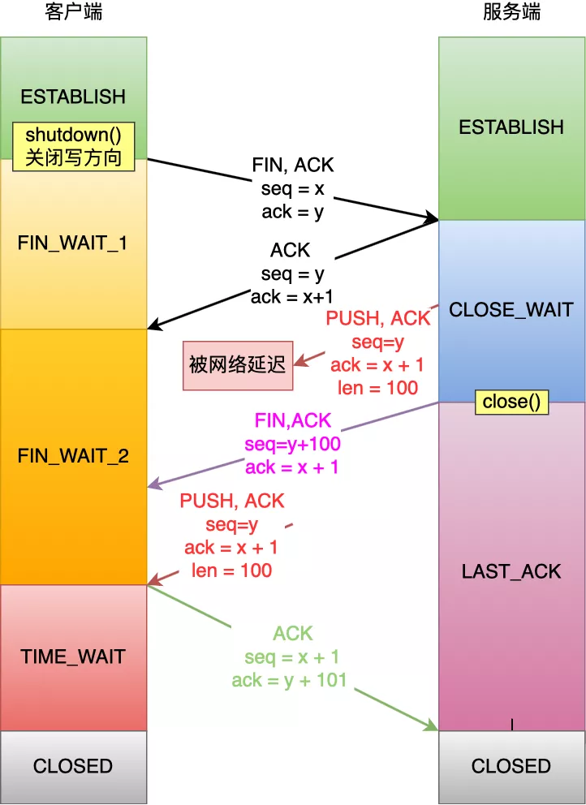
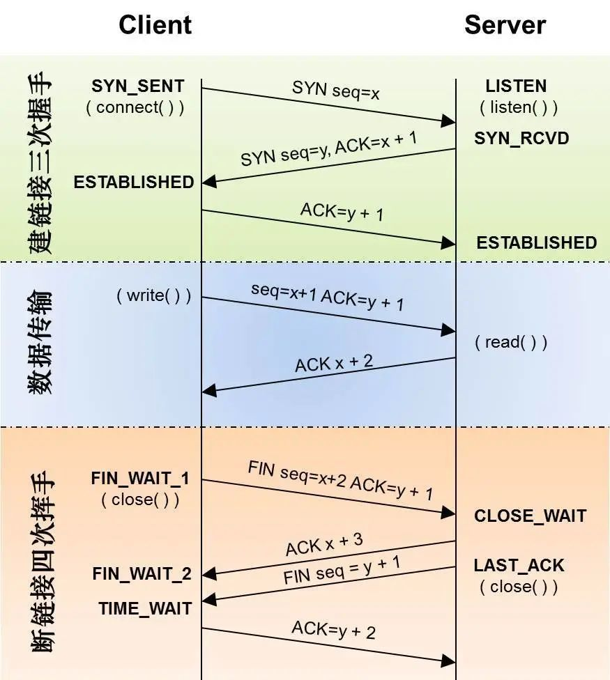
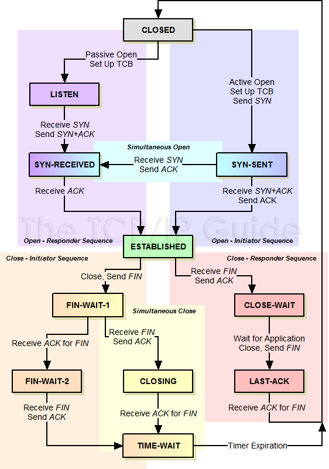
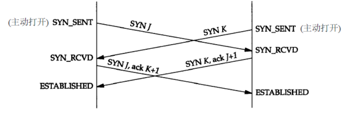
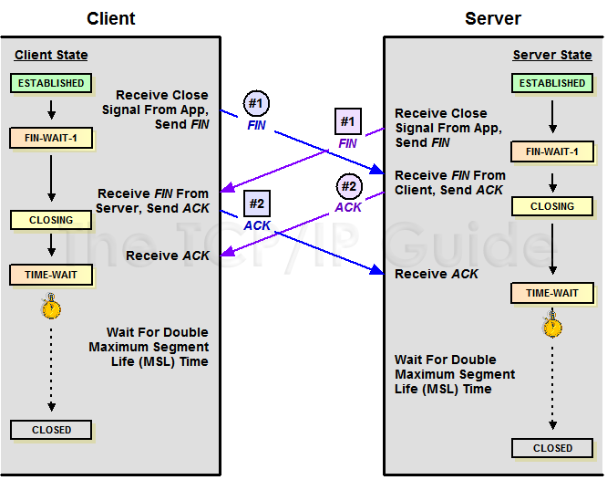

- [在 FIN_WAIT_2 状态下，是如何处理收到的乱序到 FIN 报文，然后 TCP 连接又是什么时候才进入到 TIME_WAIT 状态?](https://mp.weixin.qq.com/s/6euF1TQMP36AEurS44Casg)

  - 在 FIN_WAIT_2 状态时，如果收到乱序的 FIN 报文，那么就被会加入到「乱序队列」，并不会进入到 TIME_WAIT 状态。
  - 等再次收到前面被网络延迟的数据包时，会判断乱序队列有没有数据，然后会检测乱序队列中是否有可用的数据，如果能在乱序队列中找到与当前报文的序列号保持的顺序的报文，就会看该报文是否有 FIN 标志，如果发现有 FIN 标志，这时才会进入 TIME_WAIT 状态。
  
  - 看 Linux 内核代码的在线网站：
    https://elixir.bootlin.com/linux/latest/source
- [TCP 的三次握手、四次挥手](https://cloud.tencent.com/developer/article/1687824)
  
  
  TCP 进行握手初始化一个连接的目标是：分配资源、初始化序列号(通知 peer 对端我的初始序列号是多少)，知道初始化连接的目标
  .有可能出现四次握手来建立连接的
  
  
- 初始化连接的 SYN 超时问题

  这个连接就会一直占用 Server 的 SYN 连接队列中的一个位置，大量这样的连接就会将 Server 的 SYN 连接队列耗尽，让正常的连接无法得到处理。目前，Linux 下默认会进行 5 次重发 SYN-ACK 包，重试的间隔时间从 1s 开始，下次的重试间隔时间是前一次的双倍，5 次的重试时间间隔为 1s,2s, 4s, 8s,16s，总共 31s，第 5 次发出后还要等 32s 都知道第 5 次也超时了，所以，总共需要 1s + 2s +4s+ 8s+ 16s + 32s =63s，TCP 才会把断开这个连接
  . 应对 SYN 过多的问题，linux 提供了几个 TCP 参数：tcp_syncookies、tcp_synack_retries、tcp_max_syn_backlog、tcp_abort_on_overflow 来调整应对

- TCP 的 Peer 两端同时断开连接
  

- 四次挥手能不能变成三次挥手呢
  如果 Server 在收到 Client 的 FIN 包后，在也没数据需要发送给 Client 了，那么对 Client 的 ACK 包和 Server 自己的 FIN 包就可以合并成为一个包发送过去，这样四次挥手就可以变成三次了

- TCP 的头号疼症 TIME_WAIT 状态

  - Peer 两端，哪一端会进入 TIME_WAIT
    TCP 主动关闭连接的那一方会最后进入 TIME_WAIT. 
  - TIME_WAIT 状态是用来解决或避免什么问题
    - 主动关闭方需要进入 TIME_WAIT 以便能够重发丢掉的被动关闭方 FIN 包的 ACK
    
      被动关闭方由于没收到自己 FIN 的 ACK，会进行重传 FIN 包，这个 FIN 包到主动关闭方后，由于这个连接已经不存在于主动关闭方了，这个时候主动关闭方无法识别这个 FIN 包
      于是回复一个 RST 包给被动关闭方，被动关闭方就会收到一个错误connect reset by peer，这里顺便说下 Broken pipe，在收到 RST 包的时候，还往这个连接写数据，就会收到 Broken pipe 错误了
      
      保证 TCP 连接的远程被正确关闭，即等待被动关闭连接的一方收到 FIN 对应的 ACK 消息
    - 防止已经断开的连接 1 中在链路中残留的 FIN 包终止掉新的连接 2
    - 防止链路上已经关闭的连接的残余数据包(a lost duplicate packet or a wandering duplicate packet) 干扰正常的数据包，造成数据流的不正常

      防止延迟的数据段被其他使用相同源地址、源端口、目的地址以及目的端口的 TCP 连接收到
  - TIME_WAIT 会带来哪些问题呢
    - 作为服务器，短时间内关闭了大量的 Client 连接，就会造成服务器上出现大量的 TIME_WAIT 连接，占据大量的 tuple，严重消耗着服务器的资源。
    - 作为客户端，短时间内大量的短连接，会大量消耗的 Client 机器的端口，毕竟端口只有 65535 个，端口被耗尽了，后续就无法在发起新的连接了
  - TIME_WAIT 的快速回收和重用
    - TIME_WAIT 快速回收  **慎用**
    
      linux 下开启 TIME_WAIT 快速回收需要同时打开 tcp_tw_recycle 和 tcp_timestamps(默认打开)两选项。Linux 下快速回收的时间为 3.5* RTO（Retransmission Timeout），而一个 RTO 时间为 200ms 至 120s
      特例：在NAT环境里，各个机器timestamp不一致，在 Server 关闭了与系统时间戳快的 Client 的连接后，在这个连接进入快速回收的时候，同一 NAT 后面的系统时间戳慢的 Client 向 Server 发起连接，这就很有可能同时满足上面的三种情况，造成该连接被 Server 拒绝掉。
      net.ipv4.tcp_tw_recycle 已经在 Linux 4.12 中移除，所以我们不能再通过该配置解决 TIME_WAIT 设计带来的问题
    - TIME_WAIT 重用

      只要满足下面两点中的一点，一个 TW 状态的四元组(即一个 socket 连接)可以重新被新到来的 SYN 连接使用。
        - 新连接 SYN 告知的初始序列号比 TIME_WAIT 老连接的末序列号大；
        - 如果开启了 tcp_timestamps，并且新到来的连接的时间戳比老连接的时间戳大。

      同时开启 tcp_tw_reuse 选项和 tcp_timestamps 选项才可以开启 TIME_WAIT 重用，还有一个条件是：重用 TIME_WAIT 的条件是收到最后一个包后超过 1s
      。时间戳重用 TIME_WAIT 连接的机制的前提是 IP 地址唯一性，得出新请求发起自同一台机器，但是如果是 NAT 环境下就不能这样保证了，于是在 NAT 环境下，TIME_WAIT 重用还是有风险的。

      tcp_tw_reuse vs SO_REUSEADDR
      SO_REUSEADDR 用户态的选项，使用 SO_REUSEADDR 是告诉内核，如果端口忙，但 TCP 状态位于 TIME_WAIT，可以重用端口。如果端口忙，而 TCP 状态位于其他状态，重用端口时依旧得到一个错误信息，指明 Address already in use”。如果你的服务程序停止后想立即重启，而新套接字依旧使用同一端口，此时 SO_REUSEADDR 选项非常有用
  - 清掉 TIME_WAIT 的奇技怪巧
    - 修改 tcp_max_tw_buckets
    
      tcp_max_tw_buckets 控制并发的 TIME_WAIT 的数量，默认值是 180000. 官网文档说这个选项只是为了阻止一些简单的 DoS 攻击，平常不要人为的降低它。
    - 利用 RST 包从外部清掉 TIME_WAIT 链接
    
      TCP 规范，收到任何的发送到未侦听端口、已经关闭的连接的数据包、连接处于任何非同步状态（LISTEN,SYS-SENT,SYN-RECEIVED）并且收到的包的 ACK 在窗口外，或者安全层不匹配，都要回执以 RST 响应(而收到滑动窗口外的序列号的数据包，都要丢弃这个数据包，并回复一个 ACK 包)，内核收到 RST 将会产生一个错误并终止该连接。我们可以利用 RST 包来终止掉处于 TIME_WAIT 状态的连接，其实这就是所谓的 RST 攻击了
      
      假设 Client 和 Server 有个连接 Connect1，Server 主动关闭连接并进入了 TIME_WAIT 状态，我们来描述一下怎么从外部使得 Server 的处于 TIME_WAIT 状态的连接 Connect1 提前终止掉。要实现这个 RST 攻击，首先我们要知道 Client 在 Connect1 中的端口 port1(一般这个端口是随机的，比较难猜到，这也是 RST 攻击较难的一个点)，利用 IP_TRANSPARENT 这个 socket 选项，它可以 bind 不属于本地的地址，因此可以从任意机器绑定 Client 地址以及端口 port1，然后向 Server 发起一个连接，Server 收到了窗口外的包于是响应一个 ACK，这个 ACK 包会路由到 Client 处。

      这个时候 99%的可能 Client 已经释放连接 connect1 了，这个时候 Client 收到这个 ACK 包，会发送一个 RST 包，server 收到 RST 包然后就释放连接 connect1 提前终止 TIME_WAIT 状态了。提前终止 TIME_WAIT 状态是可能会带来(问题二)中说的三点危害，具体的危害情况可以看下 RFC1337。RFC1337 中建议，不要用 RST 过早的结束 TIME_WAIT 状态。
    - 使用 SO_LINGER 选项并设置暂存时间 l_linger 为 0，在这时如果我们关闭 TCP 连接，内核就会直接丢弃缓冲区中的全部数据并向服务端发送 RST 消息直接终止当前的连接[1](https://mp.weixin.qq.com/s?__biz=MzAxMTA4Njc0OQ==&mid=2651439946&idx=3&sn=3ab985e8b213cb8bc1686c8297791ac6&chksm=80bb1db8b7cc94ae123be06fced260f6f235e8d058c5bf145c79225ee48ce270473ec1592ac1&scene=21#wechat_redirect)
    - 修改 net.ipv4.ip_local_port_range 选项中的可用端口范围，增加可同时存在的 TCP 连接数上限
    - 使用 net.ipv4.tcp_tw_reuse 选项，通过 TCP 的时间戳选项允许内核重用处于 TIME_WAIT 状态的 TCP 连接
  - 系统调用 listen() 的 backlog 参数指的是什么
    - Linux 的协议栈维护的 TCP 连接的两个连接队列
      - SYN 半连接队列：Server 端收到 Client 的 SYN 包并回复 SYN,ACK 包后，该连接的信息就会被移到一个队列，这个队列就是 SYN 半连接队列(此时 TCP 连接处于 非同步状态
        
        - 对于 SYN 半连接队列的大小是由（/proc/sys/net/ipv4/tcp_max_syn_backlog）这个内核参数控制的，有些内核似乎也受 listen 的 backlog 参数影响，取得是两个值的最小值。
        - 当这个队列满了，Server 会丢弃新来的 SYN 包，而 Client 端在多次重发 SYN 包得不到响应而返回（connection time out）错误。
        - 但是，当 Server 端开启了 syncookies，那么 SYN 半连接队列就没有逻辑上的最大值了，并且/proc/sys/net/ipv4/tcp_max_syn_backlog 设置的值也会被忽略。
      - accept 连接队列：Server 端收到 SYN,ACK 包的 ACK 包后，就会将连接信息从中的队列移到另外一个队列，这个队列就是 accept 连接队列(这个时候 TCP 连接已经建立，三次握手完成了)

        - accept 连接队列的大小是由 backlog 参数和（/proc/sys/net/core/somaxconn）内核参数共同决定，取值为两个中的最小值。
        - 当 accept 连接队列满了，协议栈的行为根据（/proc/sys/net/ipv4/tcp_abort_on_overflow）内核参数而定。
          - 如果 tcp_abort_on_overflow=1，server 在收到 SYN_ACK 的 ACK 包后，协议栈会丢弃该连接并回复 RST 包给对端，这个是 Client 会出现(connection reset by peer)错误。
          - 如果 tcp_abort_on_overflow=0，server 在收到 SYN_ACK 的 ACK 包后，直接丢弃该 ACK 包。这个时候 Client 认为连接已经建立了，一直在等 Server 的数据，直到超时出现 read timeout 错误。

- 第一次握手，如果客户端发送的SYN一直都传不到被服务器，那么客户端是一直重发SYN到永久吗？客户端停止重发SYN的时机是什么？
  - 当客户端想和服务端建立 TCP 连接的时候，首先第一个发的就是 SYN 报文，然后进入到 SYN_SENT 状态
  - 如果客户端迟迟收不到服务端的 SYN-ACK 报文（第二次握手），就会触发超时重传机制。
  - Linux 里，客户端的 SYN 报文最大重传次数由 tcp_syn_retries内核参数控制，这个参数是可以自定义的，默认值一般是 5。
  - 第一次超时重传是在 1 秒后，第二次超时重传是在 2 秒，第三次超时重传是在 4 秒后，第四次超时重传是在 8 秒后，第五次是在超时重传 16 秒后。没错，每次超时的时间是上一次的 2 倍。总耗时是 1+2+4+8+16+32=63 秒，大约 1 分钟左右

- 第二次握手丢失了，会发生什么
  - 当服务端收到客户端的第一次握手后，就会回 SYN-ACK 报文给客户端，这个就是第二次握手，此时服务端会进入 SYN_RCVD 状态
  - 客户端就会触发超时重传机制，重传 SYN 报文。也就是第一次握手，最大重传次数由 tcp_syn_retries内核参数决定
  - 服务端这边会触发超时重传机制，重传 SYN-ACK 报文. SYN-ACK 报文的最大重传次数由 tcp_synack_retries内核参数决定，默认值是 5。

- 第三次握手，如果服务器永远不会收到ACK，服务器就永远都留在 Syn-Recv 状态了吗？退出此状态的时机是什么？
  - 如果服务端那一方迟迟收不到这个确认报文，就会触发超时重传机制，重传 SYN-ACK 报文，直到收到第三次握手，或者达到最大重传次数。

- 第三次挥手，如果客户端永远收不到 FIN,ACK，客户端永远停留在 Fin-Wait-2状态了吗？退出此状态时机是什么时候呢？

- 第四次挥手，如果服务器永远收不到 ACK，服务器永远停留在 Last-Ack 状态了吗？退出此状态的时机是什么呢？

- 如果客户端 在 2SML内依旧没收到 FIN,ACK，会关闭链接吗？服务器那边怎么办呢，是怎么关闭链接的呢？

- 第一次挥手丢失了，会发生什么
  - 如果第一次挥手丢失了，那么客户端迟迟收不到被动方的 ACK 的话，也就会触发超时重传机制，重传 FIN 报文，重发次数由 tcp_orphan_retries 参数控制。
  - 当客户端重传 FIN 报文的次数超过 tcp_orphan_retries 后，就不再发送 FIN 报文，直接进入到 close 状态。
  
- 第二次挥手丢失了，会发生什么
  - ACK 报文是不会重传的，所以如果服务端的第二次挥手丢失了，客户端就会触发超时重传机制，重传 FIN 报文，直到收到服务端的第二次挥手，或者达到最大的重传次数。
  - 当客户端收到第二次挥手，也就是收到服务端发送的 ACK 报文后，客户端就会处于 FIN_WAIT2 状态，在这个状态需要等服务端发送第三次挥手，也就是服务端的 FIN 报文。
  - 对于 close 函数关闭的连接，由于无法再发送和接收数据，所以FIN_WAIT2 状态不可以持续太久，而 tcp_fin_timeout 控制了这个状态下连接的持续时长，默认值是 60 秒。
  - 意味着对于调用 close 关闭的连接，如果在 60 秒后还没有收到 FIN 报文，客户端（主动关闭方）的连接就会直接关闭。

- 第三次挥手丢失了，会发生什么
  - 当服务端（被动关闭方）收到客户端（主动关闭方）的 FIN 报文后，内核会自动回复 ACK，同时连接处于 CLOSE_WAIT 状态，顾名思义，它表示等待应用进程调用 close 函数关闭连接。
  - 此时，内核是没有权利替代进程关闭连接，必须由进程主动调用 close 函数来触发服务端发送 FIN 报文。
  - 服务端处于 CLOSE_WAIT 状态时，调用了 close 函数，内核就会发出 FIN 报文，同时连接进入 LAST_ACK 状态，等待客户端返回 ACK 来确认连接关闭。
  - 如果迟迟收不到这个 ACK，服务端就会重发 FIN 报文，重发次数仍然由 tcp_orphan_retries 参数控制，这与客户端重发 FIN 报文的重传次数控制方式是一样的。
- 第四次挥手丢失了，会发生什么
  - 当客户端收到服务端的第三次挥手的 FIN 报文后，就会回 ACK 报文，也就是第四次挥手，此时客户端连接进入 TIME_WAIT 状态。 在 Linux 系统，TIME_WAIT 状态会持续 60 秒后才会进入关闭状态。
  - 服务端（被动关闭方）没有收到 ACK 报文前，还是处于 LAST_ACK 状态。 如果第四次挥手的 ACK 报文没有到达服务端，服务端就会重发 FIN 报文，重发次数仍然由前面介绍过的 tcp_orphan_retries 参数控制。

- tcp 的可靠性指的是什么

  可靠性指的是从网络 IO 缓冲中读出来的数据必须是无损的、无冗余的、有序的、无间隔的。翻译过来说要保证的可靠性的话，就要解决数据中出现的损坏，乱序，丢包，冗余这四个问题
- tcp 的可靠性如何保证
  - 差错控制
    - 保证数据无损。TCP 的传输报文段中使用了校验和 checksum，保证本次传输的报文是无损的
    - 保证有序和不冗余。在传输报文中使用了 seq 字段去解决乱序及冗余问题
    - 保证数据报文们无间隔。在传输报文中使用了 ack 字段，也就是确认应答机制（ACK 延迟确认+累计应答机制） + 超时重传机制（重传机制还细分为快速重传机制（发三个数据包都没有回复））去解决了丢包导致数据出现间隔的问题（流量控制也能够有效的预防丢包的机制之一）
  - 流量控制
    - 流量控制（用于接受者）是为了控制发送端不要一味的发送数据导致网络阻塞，和阻止发送方发送的数据不要超过接收方的最大负载，因为超过最大负载会导致接收方丢弃数据而进一步触发超时重传去加重网络阻塞
    - 流量控制的主要手段是通过窗口去做的.每次接受方应答时，都会带一个 window 的字段（三次握手会确定初始的 window 字段），标识了现在接受方能够接受的最大数据量，发送方会根据这个 window 字段直接发送多个报文直到达到 window 的上限
  - 拥塞控制
    - 拥塞控制（用于网络）主要是为了在发生网络拥堵后不进一步触发 TCP 的超时重传进制导致进一步的网络拥堵和网络性能下降
    - 发送方会自己维护一个拥堵窗口，默认为 1 MSS（最大长度报文段）。控制手段主要有慢启动、拥塞避免、快重传、快恢复。
      - 慢启动。思路是一开始不要传输大量的数据，而是先试探网络中的拥堵程度再去逐渐增加拥塞窗口大小（一般是指数规律增长）
      - 拥塞避免。拥塞避免思路也和慢启动类似，只是按照线性规律去增加拥堵窗口的大小。
      - 快重传。指的是使发送方尽快重传丢失报文，而不是等超时避免去触发慢启动。所以接受方要收到失序报文后马上发送重复确认以及发送方收到三个重复的接受报文要接受重发。快重传成功后，就会执行快恢复算法
      - 快恢复。一般是将慢启动阈值和拥塞窗口都调整为现有窗口的一半，之后进行拥塞避免算法，也有实现是把调整为一半后，在增加3个MSS。
- TCP 如何保证数据包的顺序传输
  - 数据报文自带 seq 序列号作为排序手段。TCP 三次握手成功后，双方会初始化 seq 序列号用于今后的数据传输，并且会作为传输的数据报文们排序的依据
  - 超时重传 + 快重传机制作为辅助。如果出现数据报文的失序或者乱序，就会触发超时重传或者快重传的机制补齐中间缺失的报文来保证整体的数据传输是有序的

