- [ptmalloc,tcmalloc和jemalloc内存分配策略](https://cloud.tencent.com/developer/article/1173720)
  - 操作系统内存布局
    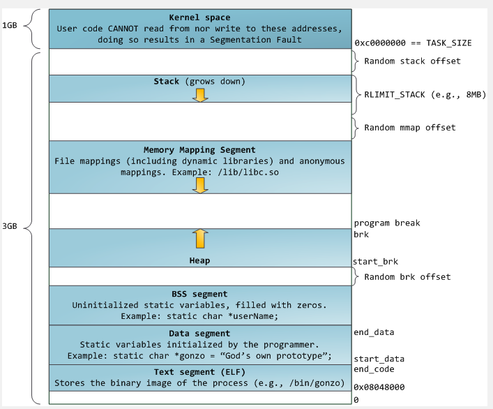
    32位默认内存布局
    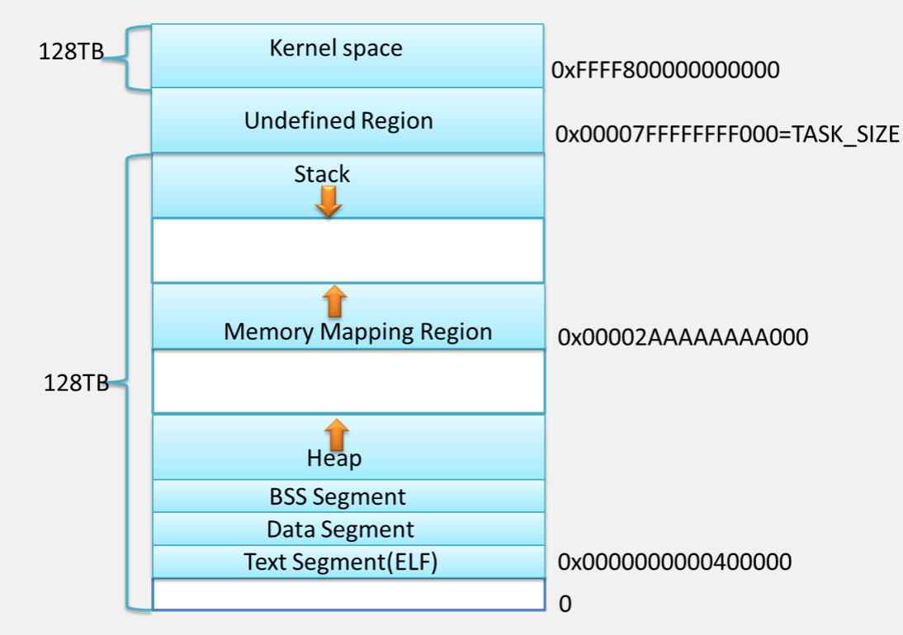
    64位内存布局
  - Ptmalloc
    - Ptmalloc采用主-从分配区的模式，当一个线程需要分配资源的时候，从链表中找到一个没加锁的分配区，在进行内存分配。
    - 小内存分配
      - [获取分配区(arena)并加锁] -> fast bin -> unsorted bin -> small bin -> large bin -> top chunk -> 扩展堆
    - 大内存分配
      - top chunk -> mmap
    - 注意事项：
      - Ptmalloc默认后分配内存先释放，因为内存回收是从top chunk开始的。
      - 避免多线程频繁分配和释放内存，会造成频繁加解锁。
      - 不要分配长生命周期的内存块，容易造成内碎片，影响内存回收。
    - Ptmalloc在性能上还是存在一些问题
      - 不同分配区（arena）的内存不能交替使用
      - 每个内存块分配都要浪费8字节内存
  - Tcmalloc
    - 内存管理分为线程内存和中央堆两部分
    - 小内存分配
      - 在线程缓存内的60个分配器（_文档上说60个，但是我在2.0的代码里看到得是86个_）分别维护了一个大小固定的自由空间链表，直接由这些链表分配内存的时候是不加锁的。但是中央堆是所有线程共享的，在由其分配内存的时候会加自旋锁(spin lock)。
    - 大内存分配
      - 对于大内存分配(大于8个分页, 即32K)，tcmalloc直接在中央堆里分配。中央堆的内存管理是以分页为单位的，同样按大小维护了256个空闲空间链表，前255个分别是1个分页、2个分页到255个分页的空闲空间，最后一个是更多分页的小的空间。这里的空间如果不够用，就会直接从系统申请了。
    - 资源释放
      - 首先计算其分页编号，然后再查找出它对应的span，如果它是一个小对象，则直接归入小对象分配器的空闲链表。等到空闲空间足够大以后划入中央堆。如果是大对象，则会把物理地址连续的前后的span也找出来，如果空闲则合并，并归入中央堆中。
  - Jemalloc
    - Jemalloc 把内存分配分为了三个部分
      - 第一部分类似tcmalloc，是分别以8字节、16字节、64字节等分隔开的small class；
      - 第二部分以分页为单位，等差间隔开的large class；
      - 然后就是huge class。
      - 内存块的管理也通过一种chunk进行，一个chunk的大小是2^k (默认4 MB)。通过这种分配实现常数时间地分配small和large对象，对数时间地查询huge对象的meta（使用红黑树）。
    - 小内存（small class）： 线程缓存bin -> 分配区bin(bin加锁) -> 问系统要
    - 中型内存（large class）：分配区bin(bin加锁) -> 问系统要
    - 大内存（huge class）： 直接mmap组织成N个chunk+全局huge红黑树维护(带缓存)
  - Jemalloc vs Tcmalloc
    - Jemalloc设计上比前两个复杂地多，其内部使用了红黑树管理分页和内存块。
    - Jemalloc对内存分配粒度分类地更细。这导致一方面比ptmalloc的锁争用要少，另一方面很多索引和查找都能回归到指数级别，方便了很多复杂功能的实现。
    - 在大内存分配上，内存碎片也会比tcmalloc少。
    - 因为他的结构比较复杂，记录了很多meta，所以在分配很多小内存的时候记录meta数据的空间会略微多于tcmalloc。但是又不像ptmalloc那样每一个内存块都有一个header，而采用全局的bitmap记录状态，所以大量小内存的时候，会比ptmalloc消耗的额外内存小。
- [ptmalloc、tcmalloc与jemalloc](https://www.cyningsun.com/07-07-2018/memory-allocator-contrasts.html)
  - Issue
    - 为了进行耗时优化，基础库这层按照惯例使用tcmalloc替代glibc标配的ptmalloc做优化，CPU消耗和耗时确实有所降低。但在晚上高峰时期，在CPU刚刚超过50%之后却出现了指数上升，服务在几分钟之内不可用。最终定位到是tcmalloc在内存分配的时候使用自旋锁，在锁冲突严重的时候导致CPU飙升
  - ptmalloc
    - 当某一线程需要调用malloc()分配内存空间时，该线程先查看线程私有变量中是否已经存在一个分配区，如果存在，尝试对该分配区加锁，如果加锁成功，使用该分配区分配内存，如果失败，该线程搜索循环链表试图获得一个没有加锁的分配区。如果所有的分配区都已经加锁，那么malloc()会开辟一个新的分配区，把该分配区加入到全局分配区循环链表并加锁，然后使用该分配区进行分配内存操作。在释放操作中，线程同样试图获得待释放内存块所在分配区的锁，如果该分配区正在被别的线程使用，则需要等待直到其他线程释放该分配区的互斥锁之后才可以进行释放操作
    - 从工作原理来看：
      - Fast bins是小内存块的高速缓存，当一些大小小于64字节的chunk被回收时，首先会放入fast bins中，在分配小内存时，首先会查看fast bins中是否有合适的内存块，如果存在，则直接返回fast bins中的内存块，以加快分配速度。
      - Usorted bin只有一个，回收的chunk块必须先放到unsorted bin中，分配内存时会查看unsorted bin中是否有合适的chunk，如果找到满足条件的chunk，则直接返回给用户，否则将unsorted bin的所有chunk放入small bins或是large bins中。
      - Small bins用于存放固定大小的chunk，共64个bin，最小的chunk大小为16字节或32字节，每个bin的大小相差8字节或是16字节，当分配小内存块时，采用精确匹配的方式从small bins中查找合适的chunk。
      - Large bins用于存储大于等于512B或1024B的空闲chunk，这些chunk使用双向链表的形式按大小顺序排序，分配内存时按最近匹配方式从large bins中分配chunk。
    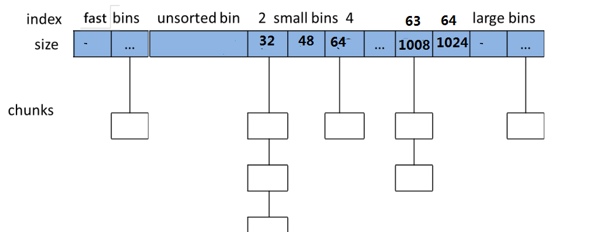
    - 问题
      - 如果后分配的内存先释放，无法及时归还系统。因为 ptmalloc 收缩内存是从 top chunk 开始,如果与 top chunk 相邻的 chunk 不能释放, top chunk 以下的 chunk 都无法释放。
      - 内存不能在线程间移动，多线程使用内存不均衡将导致内存浪费
      - 每个chunk至少8字节的开销很大
      - 不定期分配长生命周期的内存容易造成内存碎片，不利于回收。
      - 加锁耗时，无论当前分区有无耗时，在内存分配和释放时，会首先加锁。
  - tcmalloc
    - TCMalloc是专门对多线并发的内存管理而设计的，TCMalloc主要是在线程级实现了缓存，使得用户在申请内存时大多情况下是无锁内存分配。整个 TCMalloc 实现了三级缓存，分别是ThreadCache(线程级缓存)，Central Cache(中央缓存：CentralFreeeList)，PageHeap(页缓存)，最后两级需要加锁访问
      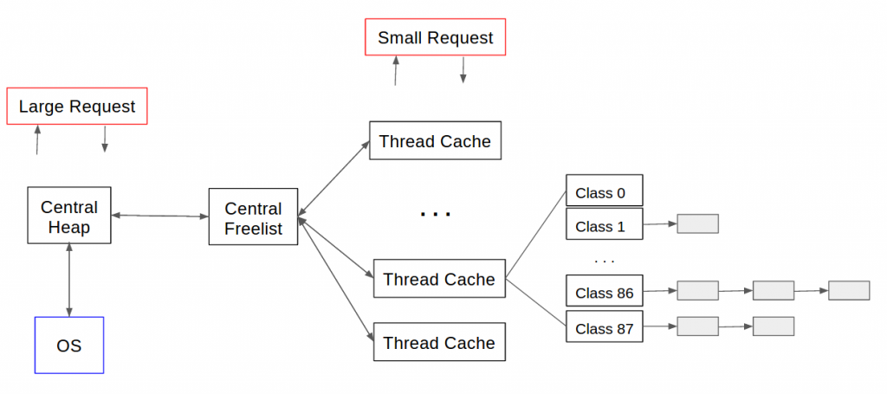
    - tcmalloc的优势
      - 小内存可以在ThreadCache中不加锁分配(加锁的代价大约100ns)
      - 大内存可以直接按照大小分配不需要再像ptmalloc一样进行查找
      - 大内存加锁使用更高效的自旋锁
      - 减少了内存碎片
    - 问题
      - 使用自旋锁虽然减少了加锁效率，但是如果使用大内存较多的情况下，内存在Central Cache或者Page Heap加锁分配。而tcmalloc对大小内存的分配过于保守，在一些内存需求较大的服务（如推荐系统），小内存上限过低，当请求量上来，锁冲突严重，CPU使用率将指数暴增
  - jemalloc
    - jemalloc最大的优势还是其强大的多核/多线程分配能力. CPU的核心数量越多, 程序线程数越多, jemalloc的分配速度越快
    - jemalloc 按照内存分配请求的尺寸，分了 small object (例如 1 – 57344B)、 large object (例如 57345 – 4MB )、 huge object (例如 4MB以上)。jemalloc同样有一层线程缓存的内存名字叫tcache，当分配的内存大小小于tcache_maxclass时，jemalloc会首先在tcache的small object以及large object中查找分配，tcache不中则从arena中申请run，并将剩余的区域缓存到tcache。若arena找不到合适大小的内存块， 则向系统申请内存。当申请大小大于tcache_maxclass且大小小于huge大小的内存块时，则直接从arena开始分配。而huge object的内存不归arena管理， 直接采用mmap从system memory中申请，并由一棵与arena独立的红黑树进行管理。
    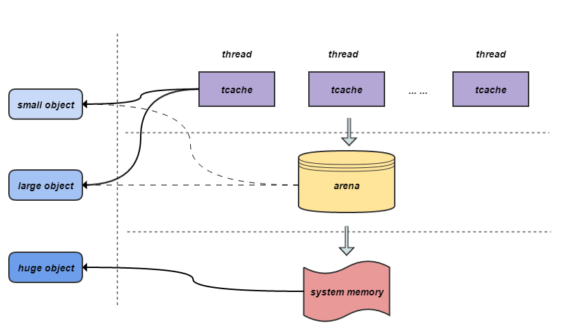
- [Tunes EC2](https://www.brendangregg.com/blog/2017-12-31/reinvent-netflix-ec2-tuning.html)
  - for Ubuntu Xenial instances on EC2.
    - CPU
      `schedtool –B PID`
    - Virtual Memory
      ```shell
      vm.swappiness = 0       # from 60
      ```
    - Huge Pages
      ```shell
      # echo madvise > /sys/kernel/mm/transparent_hugepage/enabled
      ```
    - NUMA
      ```shell
      kernel.numa_balancing = 0
      ```
    - File System
      ```shell
      vm.dirty_ratio = 80                     # from 40
      vm.dirty_background_ratio = 5           # from 10
      vm.dirty_expire_centisecs = 12000       # from 3000
      mount -o defaults,noatime,discard,nobarrier …
      ```
    - Storage I/O
      ```shell
      /sys/block/*/queue/rq_affinity  2
      /sys/block/*/queue/scheduler        noop
      /sys/block/*/queue/nr_requests  256
      /sys/block/*/queue/read_ahead_kb    256
      mdadm –chunk=64 ...
      ```
    - Networking
      ```shell
      net.core.somaxconn = 1000
      net.core.netdev_max_backlog = 5000
      net.core.rmem_max = 16777216
      net.core.wmem_max = 16777216
      net.ipv4.tcp_wmem = 4096 12582912 16777216
      net.ipv4.tcp_rmem = 4096 12582912 16777216
      net.ipv4.tcp_max_syn_backlog = 8096
      net.ipv4.tcp_slow_start_after_idle = 0
      net.ipv4.tcp_tw_reuse = 1
      net.ipv4.ip_local_port_range = 10240 65535
      net.ipv4.tcp_abort_on_overflow = 1    # maybe
      ```
- [Network Overview](https://mp.weixin.qq.com/s?__biz=MzkyMTIzMTkzNA==&mid=2247563566&idx=1&sn=26156d79dffb3f0f10b6a26931f993cc&chksm=c1850e7ff6f28769b6ff3358366e917d3d54fc0f0563131422da4bed201768c958262b5d5a99&scene=21#wechat_redirect)
  - 协议
    - TCP UDP QUIC
  - 网络编程
    - Reactor是基于同步IO,事件驱动机制，reactor实现了一个被动事件接收和分发的模型，同步等待事件到来，并作出响应，Reactor实现相对简单，对于耗时短的处理场景处理高效，同时接收多个服务请求，并且依次同步的处理它们的事件驱动程序
      - redis - level trigger
      - nginx - edge trigger
    - Proactor基于异步IO，异步接收和同时处理多个服务请求的事件驱动程序，处理速度快，Proactor性能更高，能够处理耗时长的并发场景
  - Linux内核协议栈
    - [TCP/IP协议栈](https://mp.weixin.qq.com/s?__biz=MzkyMTIzMTkzNA==&mid=2247510568&idx=1&sn=79f335aaab5c0a36c0a66c5bfb1619ae&chksm=c1845d79f6f3d46f81b6fd24335eb8994c9daf21b6846d80af2cad73d9f638c5dda48b02892c&scene=21#wechat_redirect)
    - [Linux网络子系统](https://mp.weixin.qq.com/s?__biz=MzkyMTIzMTkzNA==&mid=2247532046&idx=2&sn=04ffe282ce1278297d124f0c382ba665&chksm=c184895ff6f300497eb2bcc63d352b6d6b374606399cb7dd5b5bb59a773e674a368f9f4c9169&scene=21#wechat_redirect)
  - [新技术基石 | eBPF and XDP](https://mp.weixin.qq.com/s?__biz=MzkyMTIzMTkzNA==&mid=2247511570&idx=1&sn=18d5f1045b7ed6e27e1c8fb36302c3f9&chksm=c1845943f6f3d055c2533d580acb2d4258daf2a84ffba30e2cc6376b3ffdb1687773ed4c19a3&scene=21#wechat_redirect)
    - 传统Linux网络驱动的问题
      - 中断开销突出，大量数据到来会触发频繁的中断（softirq）开销导致系统无法承受，
      - 需要把包从内核缓冲区拷贝到用户缓冲区，带来系统调用和数据包复制的开销，
      - 对于很多网络功能节点来说，TCP/IP协议并非是数据转发环节所必需的，
      - NAPI/Netmap等虽然减少了内核到用户空间的数据拷贝，但操作系统调度带来的cache替换也会对性能产生负面影响。
    - 改善iptables/netfilter的规模瓶颈，提高Linux内核协议栈IO性能，内核需要提供新解决方案，那就是eBPF/XDP框架
    - BPF 是 Linux内核中高度灵活和高效的类似虚拟机的技术，允许以安全的方式在各个挂钩点执行字节码。它用于许多Linux内核子系统，最突出的是网络、跟踪和安全（例如沙箱）。
    - XDP的全称是：eXpress DataPath，XDP 是Linux内核中提供高性能、可编程的网络数据包处理框架。
      - 直接接管网卡的RX数据包（类似DPDK用户态驱动）处理
      - 通过运行BPF指令快速处理报文；
      - 和Linux协议栈无缝对接；
  - 容器网络
    - Kubernetes本身并没有自己实现容器网络，而是通过插件化的方式自由接入进来。在容器网络接入进来需要满足如下基本原则：
      - Pod无论运行在任何节点都可以互相直接通信，而不需要借助NAT地址转换实现。
      - Node与Pod可以互相通信，在不限制的前提下，Pod可以访问任意网络。
      - Pod拥有独立的网络栈，Pod看到自己的地址和外部看见的地址应该是一样的，并且同个Pod内所有的容器共享同个网络栈。
    - 目前流行插件：Flannel、Calico、Weave、Contiv
    - Overlay模式：Flannel（UDP、vxlan）、Weave、Calico（IPIP）
    - 三层路由模式：Flannel（host-gw）、Calico（BGP）
    - Underlay网络：Calico（BGP）
  - [网络性能优化](https://mp.weixin.qq.com/s?__biz=MzkyMTIzMTkzNA==&mid=2247505264&idx=1&sn=0735027d6e20ca7bd2bdc7a7c04477f1&chksm=c1842221f6f3ab371d64032b5bae6e5cc65d8f0265745150f76794932c4d3ac8bf4058d60090&scene=21#wechat_redirect)
    - APP性能优化：空间局部性和时间局部性
    - 协议栈调优：numa亲和，中断亲和，软中断亲和，软中断队列大小，邻居表大小，连接跟踪表大小，TCP队列调整，协议栈内存分配，拥塞控制算法优化
    - Bypass内核协议栈：DPDK,RDMA.
    - 网卡优化：驱动配置，offload，网卡队列，智能网卡，高性能网卡。
    - 硬件加速器：ASIC、FPGA,网络处理器,多核处理器
  - 高性能网络
    - Linux的收发报文Performance
      - 在C1（8核）上跑应用每1W包处理需要消耗1%软中断CPU，这意味着单机的上限是100万PPS（Packet Per Second）
      - 从TGW（Netfilter版）的性能100万PPS，AliLVS优化了也只到150万PPS，并且他们使用的服务器的配置还是比较好的。
      - 假设，我们要跑满10GE网卡，每个包64字节，这就需要2000万PPS（注：以太网万兆网卡速度上限是1488万PPS，因为最小帧大小为84B 100G是2亿PPS，即每个包的处理耗时不能超过50纳秒。而一次Cache Miss，不管是TLB、数据Cache、指令Cache发生Miss，回内存读取大约65纳秒，NUMA体系下跨Node通讯大约40纳秒。
    - 问题都有这些
      - 1.传统的收发报文方式都必须采用硬中断来做通讯，每次硬中断大约消耗100微秒，这还不算因为终止上下文所带来的Cache Miss。
      - 2.数据必须从内核态用户态之间切换拷贝带来大量CPU消耗，全局锁竞争。
      - 3.收发包都有系统调用的开销。
      - 4.内核工作在多核上，为可全局一致，即使采用Lock Free，也避免不了锁总线、内存屏障带来的性能损耗。
      - 5.从网卡到业务进程，经过的路径太长，有些其实未必要的，例如netfilter框架，这些都带来一定的消耗，而且容易Cache Miss。
    - DPDK （Data Plane Development Kit）
      - 基于UIO（Userspace I/O）旁路数据。数据从 网卡 -> DPDK轮询模式-> DPDK基础库 -> 业务
        - 为了让驱动运行在用户态，Linux提供UIO机制。使用UIO可以通过read感知中断，通过mmap实现和网卡的通讯。
        - UIO旁路了内核，主动轮询去掉硬中断，DPDK从而可以在用户态做收发包处理。带来Zero Copy、无系统调用的好处，同步处理减少上下文切换带来的Cache Miss。
      - 用户态的好处是易用开发和维护，灵活性好。并且Crash也不影响内核运行，鲁棒性强。
      - DPDK的基石UIO - 为了让驱动运行在用户态，Linux提供UIO机制。使用UIO可以通过read感知中断，通过mmap实现和网卡的通讯。
      - DPDK核心优化：PMD - DPDK的UIO驱动屏蔽了硬件发出中断，然后在用户态采用主动轮询的方式，这种模式被称为PMD（Poll Mode Driver）。
    - [DPDK网络优化](https://cloud.tencent.com/developer/article/1198333)
      - PMD用户态驱动 使用无中断方式直接操作网卡的接收和发送队列；
      - CPU亲缘性和独占 - 解决多核跳动不精确的问题 ; DPDK采用向量SIMD指令优化性能(DPDK采用批量同时处理多个包，再用向量编程，一个周期内对所有包进行处理。比如，memcpy就使用SIMD来提高速度。); 避免False Sharing
      - 内存大页和降低内存访问开销  - 采用HugePage减少TLB Miss (几何级的降低了页表项的大小，从而减少TLB-Miss)
      - 内存对齐 根据不同存储硬件的配置来优化程序，确保对象位于不同channel和rank的起始地址，这样能保证对象并并行加载，性能也能够得到极大的提升
      - cache对齐 
      - NUMA 亲和，提高numa内存访问性能
      - 减少进程上下文切换 保证活跃进程数目不超过CPU个数；减少堵塞函数的调用，尽量采样无锁数据结构；
      - 分组预测机制  利用流水线并发 
      - 为了利用空间局部性 采用预取Prefetch，在数据被用到之前就将其调入缓存，增加缓存命中率
      - 充分挖掘网卡的潜能 借助现代网卡支持的分流（RSS, FDIR）和卸载（TSO，chksum）
      - [Source](https://mp.weixin.qq.com/s/D7gNarR5DyB03QbHELTOSA)
    - RDMA 作为一种旁路内核的远程内存直接访问技术，被广泛应用于数据密集型和计算密集型场景中，是高性能计算、机器学习、数据中心、海量存储等领域的重要解决方案。
      - RDMA 具有零拷贝、协议栈卸载的特点。RDMA 将协议栈的实现下沉至RDMA网卡(RNIC)，绕过内核直接访问远程内存中的数据
  - [排障](https://mp.weixin.qq.com/s?__biz=MzkyMTIzMTkzNA==&mid=2247505250&idx=1&sn=a854ee9a456e27e3bd4202380e4782c8&chksm=c1842233f6f3ab251f1a686e4f4bbeaa305a73ff3b09d5846b3ae536153ed22ba716c99f0ae5&scene=21#wechat_redirect)

- [Linux问题分析与性能优化](https://mp.weixin.qq.com/s?__biz=MzkyMTIzMTkzNA==&mid=2247529939&idx=2&sn=f193d1ea112482945d8be3d97d1eba85&chksm=c1848282f6f30b94a2b1851d2a18a8ce0e026cc79b5ace4076909389704aaab185ccdc9c5bef&scene=21#wechat_redirect) 
  - 整体情况：
    - top/htop/atop命令查看进程/线程、CPU、内存使用情况，CPU使用情况；
    - dstat 2查看CPU、磁盘IO、网络IO、换页、中断、切换，系统I/O状态;
    - vmstat 2查看内存使用情况，内存状态；
    - iostat -d -x 2查看所有磁盘的IO情况，系统I/O状态；
    - iotop查看IO靠前的进程，系统的I/O状态；
    - perf top查看占用CPU最多的函数，CPU使用情况；
    - perf record -ag -- sleep 15;perf report查看CPU事件占比，调用栈，CPU使用情况；
    - sar -n DEV 2查看网卡的吞吐，网卡状态；
    - /usr/share/bcc/tools/filetop -C查看每个文件的读写情况，系统的I/O状态；
    - /usr/share/bcc/tools/opensnoop显示正在被打开的文件，系统的I/O状态；
    - mpstat -P ALL 1 单核CPU是否被打爆；
    - ps aux --sort=-%cpu 按CPU使用率排序，找出CPU消耗最多进程；
    - ps -eo pid,comm,rss | awk '{m=$3/1e6;s["*"]+=m;s[$2]+=m} END{for (n in s) printf"%10.3f GB  %s\n",s[n],n}' | sort -nr | head -20 统计前20内存占用；
    - awk 'NF>3{s["*"]+=s[$1]=$3*$4/1e6} END{for (n in s) printf"%10.1f MB  %s\n",s[n],n}' /proc/slabinfo | sort -nr | head -20  统计内核前20slab的占用；
  - 进程分析，进程占用的资源：
    - pidstat 2 -p 进程号查看可疑进程CPU使用率变化情况；
    - pidstat -w -p 进程号 2查看可疑进程的上下文切换情况；
    - pidstat -d -p 进程号 2查看可疑进程的IO情况；
    - lsof -p 进程号查看进程打开的文件；
    - strace -f -T -tt -p 进程号显示进程发起的系统调用；
  - 协议栈分析，连接/协议栈状态：
    - ethtool -S 查看网卡硬件情况；
    - cat /proc/net/softnet_stat/ifconfig eth1 查看网卡驱动情况；
    - netstat -nat|awk '{print awk $NF}'|sort|uniq -c|sort -n查看连接状态分布；
    - ss -ntp或者netstat -ntp查看连接队列；
    - netstat -s 查看协议栈情况；
  - 方法论
    - RED方法：监控服务的请求数（Rate）、错误数（Errors）、响应时间（Duration）
    - USE方法：监控系统资源的使用率（Utilization）、饱和度（Saturation）、错误数（Errors）。
  - Tools
    - 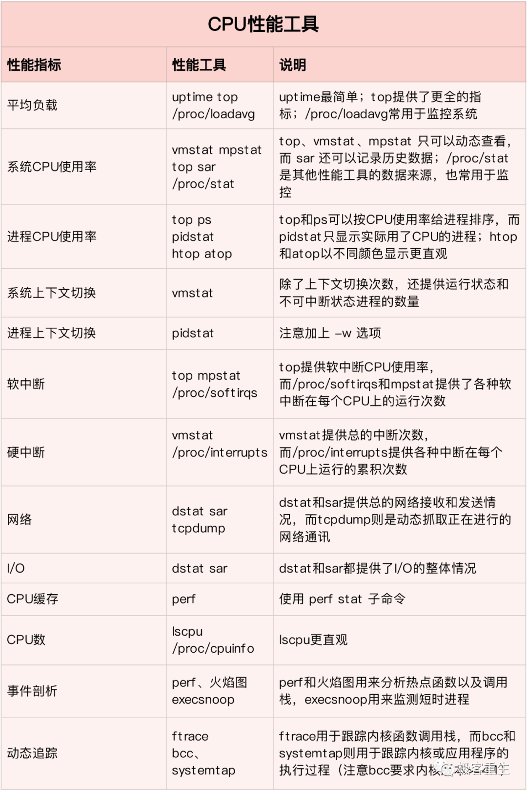
    - 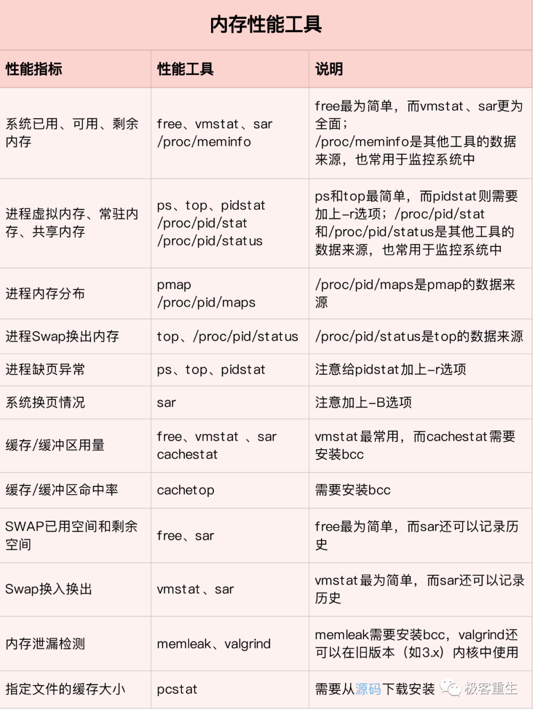
    - 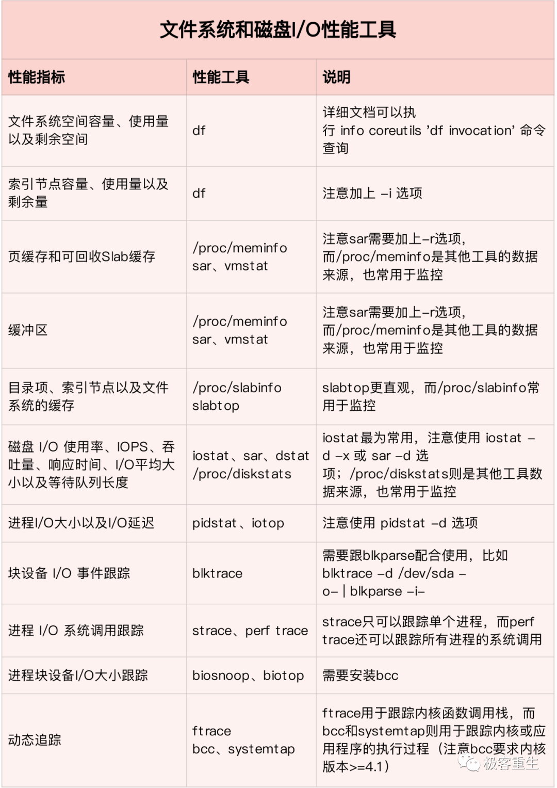
    - 
- [服务器性能优化之网络性能优化](https://mp.weixin.qq.com/s?__biz=MzkyMTIzMTkzNA==&mid=2247561718&idx=1&sn=f93ad69bff3ab80665e4b9d67265e6bd&chksm=c18506a7f6f28fb12341c3e439f998d09c4b1d93f8bf59af6b1c6f4427cea0c48b51244a3e53&scene=21#wechat_redirect)
  - 以前
    - 网卡很慢，只有一个队列。当数据包到达时，网卡通过DMA复制数据包并发送中断，Linux内核收集这些数据包并完成中断处理。随着网卡越来越快，基于中断的模型可能会因大量传入数据包而导致 IRQ 风暴。
    - 为了解决这个问题，NAPI(中断+轮询)被提议。当内核收到来自网卡的中断时，它开始轮询设备并尽快收集队列中的数据包
    - 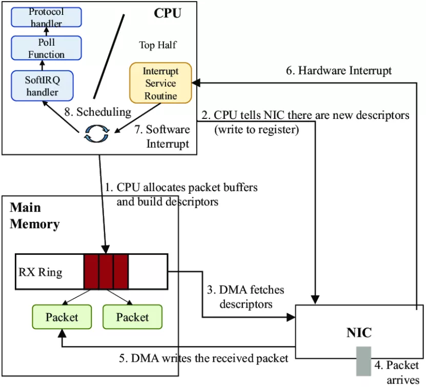
  - RSS：接收端缩放 Receive Side Scaling
    - 具有多个RX / TX队列过程的数据包。当带有RSS 的网卡接收到数据包时，它会对数据包应用过滤器并将数据包分发到RX 队列。过滤器通常是一个哈希函数，可以通过“ethtool -X”进行配置
    - CPU 亲和性也很重要。最佳设置是分配一个 CPU 专用于一个队列。首先通过检查/proc/interrupt找出IRQ号，然后将CPU位掩码设置为/proc/irq/<IRQ_NUMBER>/smp_affinity来分配专用CPU。为避免设置被覆盖，必须禁用守护进程irqbalance。
  - RPS：接收数据包控制
    - RSS提供硬件队列，一个称为软件队列机制Receive Packet Steering （RPS）在Linux内核实现
    - 当驱动程序接收到数据包时，它会将数据包包装在套接字缓冲区 ( sk_buff ) 中，其中包含数据包的u32哈希值。散列是所谓的第 4 层散列（l4 散列），它基于源 IP、源端口、目的 IP 和目的端口，由网卡或__skb_set_sw_hash() 计算。由于相同 TCP/UDP 连接（流）的每个数据包共享相同的哈希值，因此使用相同的 CPU 处理它们是合理的。
    - RPS 的基本思想是根据每个队列的 rps_map 将同一流的数据包发送到特定的 CPU。这是 rps_map 的结构：映射根据 CPU 位掩码动态更改为`/sys/class/net/<dev>/queues/rx-<n>/rps_cpus`。
    - 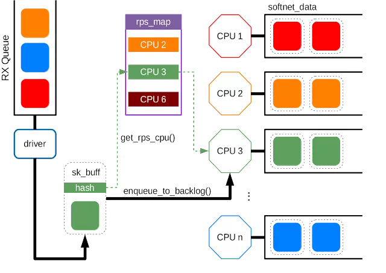
  - RFS: Receive Flow Steering
    - 尽管 RPS 基于流分发数据包，但它没有考虑用户空间应用程序。应用程序可能在 CPU A 上运行，而内核将数据包放入 CPU B 的队列中。由于 CPU A 只能使用自己的缓存，因此 CPU B 中缓存的数据包变得无用。
    - 代替每个队列的哈希至CPU地图，RFS维护全局flow-to-CPU的表，rps_sock_flow_table：该掩模用于将散列值映射成所述表的索引。
    - 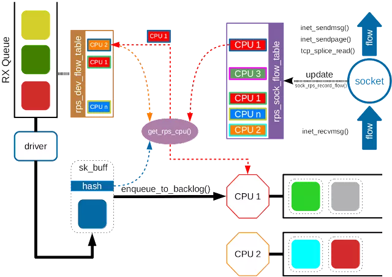
  - aRFS: Accelerated Receive Flow Steering
    - aRFS 进一步延伸RFS为RX队列硬件过滤。要启用 aRFS，它需要具有可编程元组过滤器和驱动程序支持的网卡。要启用ntuple 过滤器。
  - SO_REUSEPORT
    - SO_REUSEPORT支持多个进程或者线程绑定到同一端口，用以提高服务器程序的性能
      - 允许多个套接字 bind()/listen() 同一个TCP/UDP端口
        - 1.每一个线程拥有自己的服务器套接字。
        - 2.在服务器套接字上没有了锁的竞争。
      - 内核层面实现负载均衡。
      - 安全层面，监听同一个端口的套接字只能位于同一个用户下面。
    - 其核心的实现主要有三点：
      - 扩展socket option，增加 SO_REUSEPORT选项，用来设置 reuseport。
      - 修改 bind 系统调用实现，以便支持可以绑定到相同的 IP 和端口。
      - 修改处理新建连接的实现，查找 listener 的时候，能够支持在监听相同 IP 和端口的多个 sock 之间均衡选择
    - 带来意义
      - CPU之间平衡处理，水平扩展，模型简单，维护方便了，进程的管理和应用逻辑解耦，进程的管理水平扩展权限下放给程序员/管理员，可以根据实际进行控制进程启动/关闭，增加了灵活性。
      - 针对对客户端而言，表面上感受不到其变动，因为这些工作完全在服务器端进行。
      - 服务器无缝重启/切换，热更新，提供新的可能性
    - 已知问题
      - SO_REUSEPORT分为两种模式，即热备份模式和负载均衡模式，在早期的内核版本中，即便是加入对reuseport选项的支持，也仅仅为热备份模式，而在3.9内核之后，则全部改为了负载均衡模式
      - SO_REUSEPORT根据数据包的四元组{src ip, src port, dst ip, dst port}和当前绑定同一个端口的服务器套接字数量进行数据包分发。若服务器套接字数量产生变化，内核会把本该上一个服务器套接字所处理的客户端连接所发送的数据包（比如三次握手期间的半连接，以及已经完成握手但在队列中排队的连接）分发到其它的服务器套接字上面，可能会导致客户端请求失败。
    - 如何预防以上已知问题，一般解决思路：
      - 使用固定的服务器套接字数量，不要在负载繁忙期间轻易变化。
      - 允许多个服务器套接字共享TCP请求表(Tcp request table)。
      - 不使用四元组作为Hash值进行选择本地套接字处理，比如选择 会话ID或者进程ID，挑选隶属于同一个CPU的套接字。
      - 使用一致性hash算法。
    - 演进
      - 3.9之前内核，能够让多个socket同时绑定完全相同的ip+port，但不能实现负载均衡，实现是热备。
      - Linux 3.9之后，能够让多个socket同时绑定完全相同的ip+port，可以实现负载均衡。
      - Linux4.5版本后，内核引入了reuseport groups，它将绑定到同一个IP和Port，并且设置了SO_REUSEPORT选项的socket组织到一个group内部。目的是加快socket查询
    - 与其他特性关系
      - SO_REUSEADDR：主要是地址复用
        - 让处于time_wait状态的socket可以快速复用原ip+port
        - 使得0.0.0.0（ipv4通配符地址）与其他地址（127.0.0.1和10.0.0.x）不冲突
        - SO_REUSEADDR 的缺点在于，没有安全限制，而且无法保证所有连接均匀分配。
- [文件的 io 栈](https://mp.weixin.qq.com/s/IrZF9lWweEs1rhxuvMUCKA)
  - IO 从用户态走系统调用进到内核，内核的路径：`VFS → 文件系统 → 块层 → SCSI 层 `
    - VFS 负责通用的文件抽象语义，管理并切换文件系统；
    - 文件系统负责抽象出“文件的概念”，维护“文件”数据到块层的位置映射，怎么摆放数据，怎么抽象文件都是文件系统说了算；
    - 块层对底层硬件设备做一层统一的抽象，最重要的是做一些 IO 调度的策略。比如，尽可能收集批量 IO 聚合下发，让 IO 尽可能的顺序，合并 IO 请求减少 IO 次数等等；
    - SCSI 层则是负责最后对硬件磁盘的对接，驱动层，本质就是个翻译器
  - page cache 是发生在文件系统这里。通常我们确保数据落盘有两种方式：
    - Writeback 回刷数据的方式：write 调用 + sync 调用；
    - Direct IO 直刷数据的方式；
- [Linux 的 Page Cache](https://spongecaptain.cool/SimpleClearFileIO/1.%20page%20cache.html)
  - Page Cache
    - Page Cache 是什么
      - 
      - Page Cache 的本质是由 Linux 内核管理的内存区域。
      - 我们通过 mmap 以及 buffered I/O 将文件读取到内存空间实际上都是读取到 Page Cache 中。
    - 如何查看系统的 Page Cache
      - 读取 /proc/meminfo 文件 `cat /proc/meminfo`
      - `Buffers + Cached + SwapCached = Active(file) + Inactive(file) + Shmem + SwapCached`
      - `Page Cache = Buffers + Cached + SwapCached`
    - page 与 Page Cache
      - page 是内存管理分配的基本单位， Page Cache 由多个 page 构成. 并不是所有 page 都被组织为 Page Cache
      - Linux 系统上供用户可访问的内存分为两个类型，即：
        - File-backed pages：文件备份页也就是 Page Cache 中的 page，对应于磁盘上的若干数据块；对于这些页最大的问题是脏页回盘
        - Anonymous pages：匿名页不对应磁盘上的任何磁盘数据块，它们是进程的运行是内存空间（例如方法栈、局部变量表等属性）
    - Swap 与缺页中断
      - Swap 机制指的是当物理内存不够用，内存管理单元（Memory Mangament Unit，MMU）需要提供调度算法来回收相关内存空间，然后将清理出来的内存空间给当前内存申请方
      - 操作系统以 page 为单位管理内存，当进程发现需要访问的数据不在内存时，操作系统可能会将数据以页的方式加载到内存中。上述过程被称为缺页中断
    - Page Cache 与 buffer cache
      - 执行 free 命令，注意到会有两列名为 buffers 和 cached，也有一行名为 “-/+ buffers/cache”
      - cached 列表示当前的页缓存（Page Cache）占用量，buffers 列表示当前的块缓存（buffer cache）占用量
      - Page Cache 用于缓存文件的页数据，buffer cache 用于缓存块设备（如磁盘）的块数据。
      - 页是逻辑上的概念，因此 Page Cache 是与文件系统同级的；块是物理上的概念，因此 buffer cache 是与块设备驱动程序同级的。
      - Page Cache 与 buffer cache 的共同目的都是加速数据 I/O：写数据时首先写到缓存，将写入的页标记为 dirty，然后向外部存储 flush，也就是缓存写机制中的 write-back
      - Linux 在 2.4 版本内核之后，两块缓存近似融合在了一起：如果一个文件的页加载到了 Page Cache，那么同时 buffer cache 只需要维护块指向页的指针就可以了。
      - Page Cache 中的每个文件都是一棵基数树（radix tree，本质上是多叉搜索树），树的每个节点都是一个页。根据文件内的偏移量就可以快速定位到所在的页
    - Page Cache 与预读
      - 应用程序利用 read 系统调动读取 4KB 数据，实际上内核使用 readahead 机制完成了 16KB 数据的读取
  - Page Cache 与文件持久化的一致性&可靠性
    - 文件 = 数据 + 元数据。元数据用来描述文件的各种属性，也必须存储在磁盘上。因此，我们说保证文件一致性其实包含了两个方面：数据一致+元数据一致
    - Linux 下以两种方式实现文件一致性：
      - Write Through（写穿）：向用户层提供特定接口，应用程序可主动调用接口来保证文件一致性；
      - Write back（写回）：系统中存在定期任务（表现形式为内核线程），周期性地同步文件系统中文件脏数据块，这是默认的 Linux 一致性方案；
  - Page Cache 的优劣势
    - Page Cache 的优势
      - 加快数据访问
      - 减少 I/O 次数，提高系统磁盘 I/O 吞吐量
    - Page Cache 的劣势
      - 最直接的缺点是需要占用额外物理内存空间，物理内存在比较紧俏的时候可能会导致频繁的 swap 操作，最终导致系统的磁盘 I/O 负载的上升
      - 对应用层并没有提供很好的管理 API，几乎是透明管理。应用层即使想优化 Page Cache 的使用策略也很难进行. 一些应用选择在用户空间实现自己的 page 管理，而不使用 page cache，例如 MySQL InnoDB 存储引擎以 16KB 的页进行管理。
- [零拷贝](https://mp.weixin.qq.com/s/K-5HJCxDzjZuHhWk1SPEQQ)
  - 零拷贝是指计算机执行IO操作时，CPU不需要将数据从一个存储区域复制到另一个存储区域，从而可以减少上下文切换以及CPU的拷贝时间。它是一种I/O操作优化技术。
  - 传统的IO流程，包括read和write的过程。4次数据拷贝（两次CPU拷贝以及两次的DMA拷贝) - DMA(Direct Memory Access，直接存储器访问) 是计算机科学中的一种内存访问技术。它允许某些电脑内部的硬件子系统（电脑外设），可以独立地直接读写系统内存，允许不同速度的硬件设备来沟通，而不需要依于中央处理器的大量中断负载。
    - read：把数据从磁盘读取到内核缓冲区，再拷贝到用户缓冲区
    - write：先把数据写入到socket缓冲区，最后写入网卡设备。
    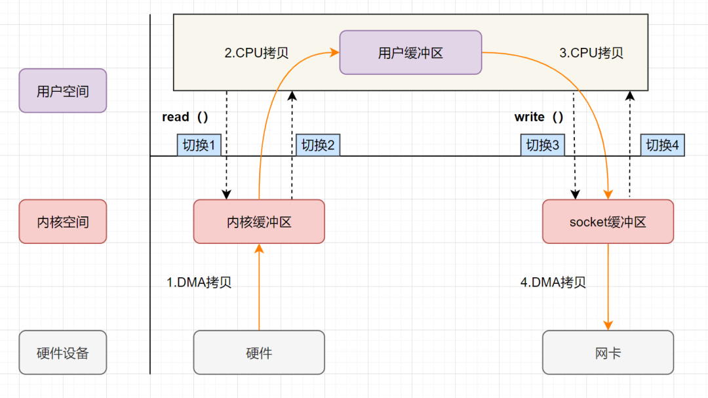
    - 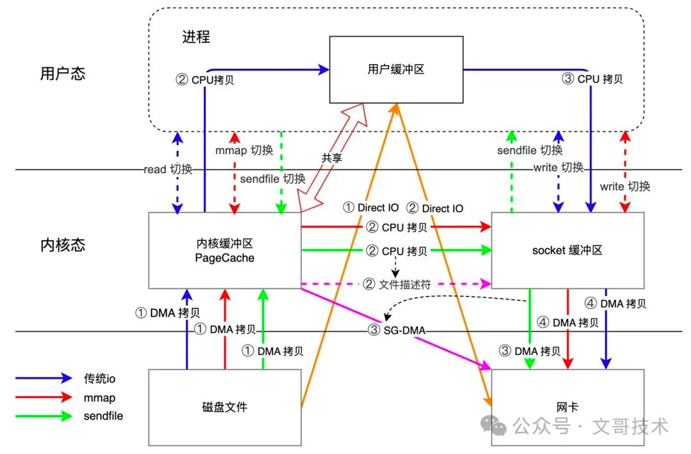
    - DMA，英文全称是Direct Memory Access，即直接内存访问。DMA本质上是一块主板上独立的芯片，允许外设设备和内存存储器之间直接进行IO数据传输，其过程不需要CPU的参与。
  - 零拷贝并不是没有拷贝数据，而是减少用户态/内核态的切换次数以及CPU拷贝的次数。零拷贝实现有多种方式，分别是
    - mmap+write：2次DMA拷贝和1次CPU拷贝
      
    - sendfile： 2次DMA拷贝和1次CPU拷贝 - sendfile适合从文件读取数据写socket场景
      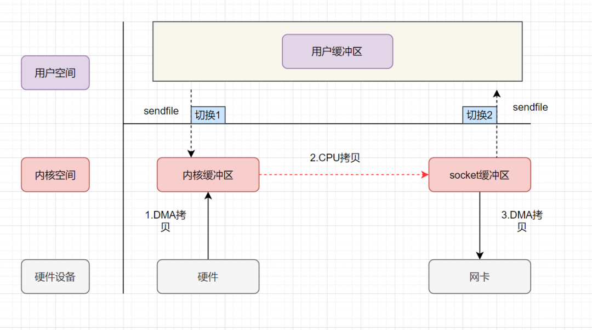
    - 带有DMA收集拷贝功能的sendfile: 2次数据拷贝都是包DMA拷贝
      - linux 2.4版本之后，对sendfile做了优化升级，引入SG-DMA技术，其实就是对DMA拷贝加入了scatter/gather操作，它可以直接从内核空间缓冲区中将数据读取到网卡。使用这个特点搞零拷贝，即还可以多省去一次CPU拷贝
      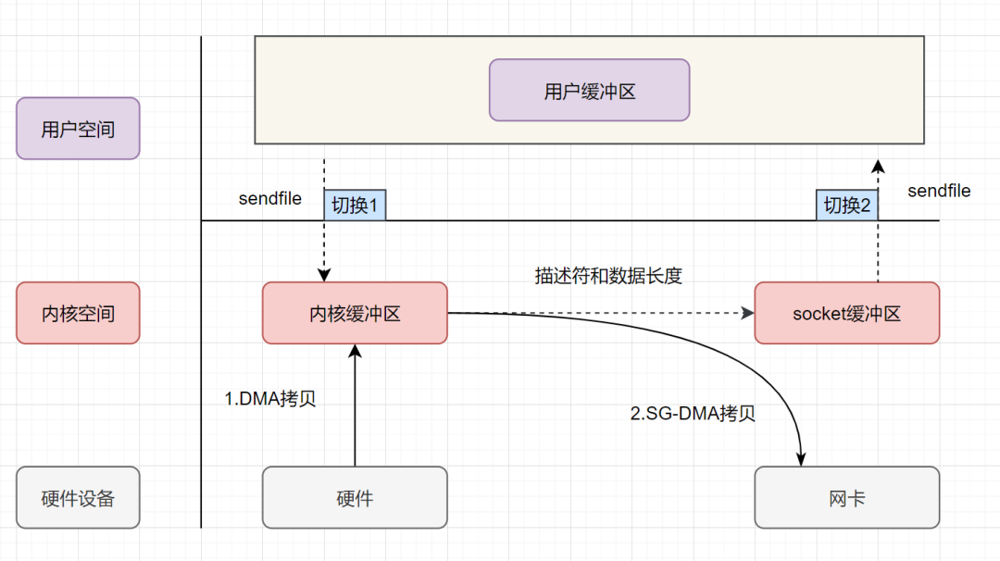
    - [splice、tee、vmsplice](https://mp.weixin.qq.com/s/IfrW10OIHa61sLGdT44mng)
      - sendfile性能虽好，但是还是有些场景下是不能使用的，比如我们想做一个socket proxy,源和目的都是socket,就不能直接使用sendfile了。这个时候我们可以考虑splice
      - 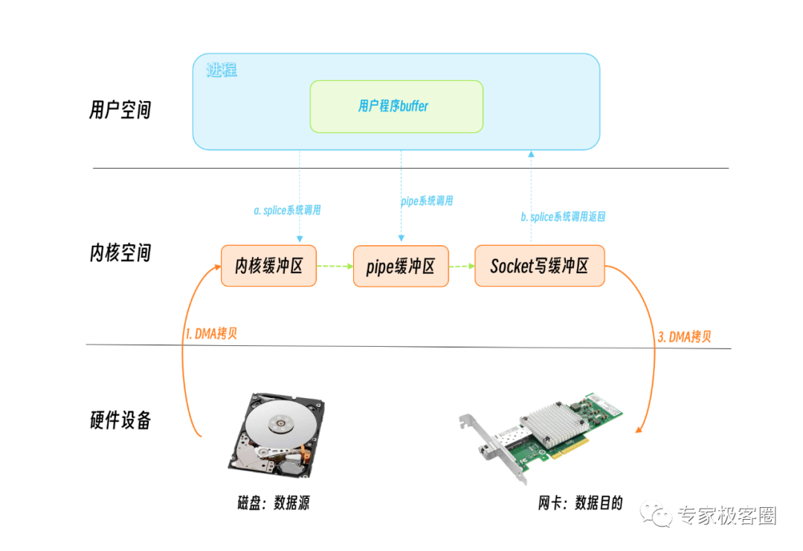
      - tee系统调用用来在两个管道中拷贝数据。vmsplice系统调用pipe指向的内核缓冲区和用户程序的缓冲区之间的数据拷贝。
    - MSG_ZEROCOPY
      - Linux v4.14 版本接受了在TCP send系统调用中实现的支持零拷贝(MSG_ZEROCOPY)的patch，通过这个patch，用户进程就能够把用户缓冲区的数据通过零拷贝的方式经过内核空间发送到网络套接字中去，在5.0中支持UDP
        ```go
        if (setsockopt(fd, SOL_SOCKET, SO_ZEROCOPY, &one, sizeof(one)))
                error(1, errno, "setsockopt zerocopy");
        ret = send(fd, buf, sizeof(buf), MSG_ZEROCOPY);
        ```
    - copy_file_range
      - Linux 4.5 增加了一个新的API: copy_file_range, 它在内核态进行文件的拷贝，不再切换用户空间，所以会比cp少块一些，在一些场景下会提升性能。
  - AF_XDP是Linux 4.18新增加的功能，以前称为AF_PACKETv4（从未包含在主线内核中），是一个针对高性能数据包处理优化的原始套接字，并允许内核和应用程序之间的零拷贝。由于套接字可用于接收和发送，因此它仅支持用户空间中的高性能网络应用。
  - Go标准库中的零拷贝
    - sendfile
      - io.Copy -> *TCPConn.ReadFrom -> *TCPConn.readFrom -> net.sendFile -> poll.sendFile
    - splice
      - *TCPConn.readFrom初始就是尝试使用splice,使用的场景和限制也提到了。net.splice函数其实是调用poll.Splice
    - CopyFileRange
      - io.Copy -> *File.ReadFrom -> *File.readFrom -> poll.CopyFileRange -> poll.copyFileRange
    - http
      - http.FileServer -> *fileHandler.ServeHTTP -> http.serveFile -> http.serveContent -> io.CopyN -> io.Copy -> 和sendFile的调用链接上了。可以看到访问文件的时候是调用了sendFile。
- [DMA 与零拷贝技术](https://spongecaptain.cool/SimpleClearFileIO/2.%20DMA%20%E4%B8%8E%E9%9B%B6%E6%8B%B7%E8%B4%9D%E6%8A%80%E6%9C%AF.html)
  - Note: 除了 Direct I/O，与磁盘相关的文件读写操作都有使用到 page cache 技术
  - 数据的四次拷贝与四次上下文切换
    - 很多应用程序在面临客户端请求时，可以等价为进行如下的系统调用：
      - File.read(file, buf, len);
      - Socket.send(socket, buf, len);
      - 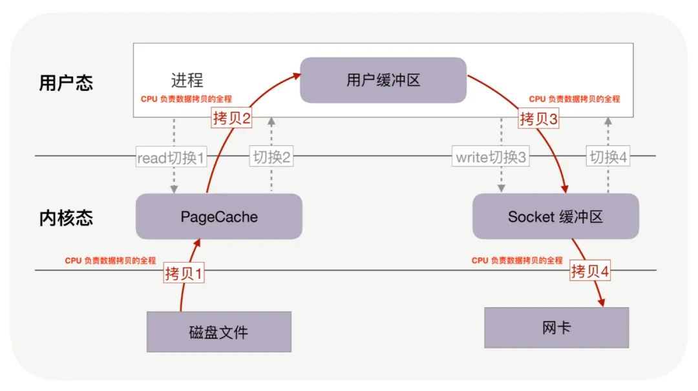
    - 4 次 copy：
      - 物理设备 <-> 内存：
        - CPU 负责将数据从磁盘搬运到内核空间的 Page Cache 中；
        - CPU 负责将数据从内核空间的 Socket 缓冲区搬运到的网络中；
      - 内存内部拷贝：
        - CPU 负责将数据从内核空间的 Page Cache 搬运到用户空间的缓冲区；
        - CPU 负责将数据从用户空间的缓冲区搬运到内核空间的 Socket 缓冲区中；
    - 4次上下文切换：
       - read 系统调用时：用户态切换到内核态；
       - read 系统调用完毕：内核态切换回用户态；
       - write 系统调用时：用户态切换到内核态；
       - write 系统调用完毕：内核态切换回用户态；
  - DMA 参与下的数据四次拷贝
    - DMA 技术就是我们在主板上放一块独立的芯片
    - 在进行内存和 I/O 设备的数据传输的时候，我们不再通过 CPU 来控制数据传输，而直接通过 DMA 控制器
    - DMAC 有其局限性，DMAC 仅仅能用于设备间交换数据时进行数据拷贝. 设备内部的数据拷贝还需要 CPU 来亲力亲为。例如， CPU 需要负责内核空间与用户空间之间的数据拷贝（内存内部的拷贝）
  - 零拷贝技术
    - 零拷贝的特点是 CPU 不全程负责内存中的数据写入其他组件，CPU 仅仅起到管理的作用
    - 零拷贝不是不进行拷贝，而是 CPU 不再全程负责数据拷贝时的搬运工作. 如果数据本身不在内存中，那么必须先通过某种方式拷贝到内存中
    - 零拷贝技术的具体实现方式有很多
      - sendfile
        - 一次代替 read/write 系统调用，通过使用 DMA 技术以及传递文件描述符，实现了 zero copy
        - 应用场景是：用户从磁盘读取一些文件数据后不需要经过任何计算与处理就通过网络传输出去。此场景的典型应用是消息队列
        - sendfile 主要使用到了两个技术：
          - DMA 技术；
            - sendfile 依赖于 DMA 技术，将四次 CPU 全程负责的拷贝与四次上下文切换减少到两次
            - 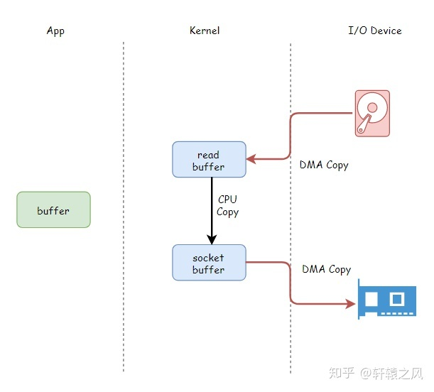
            - 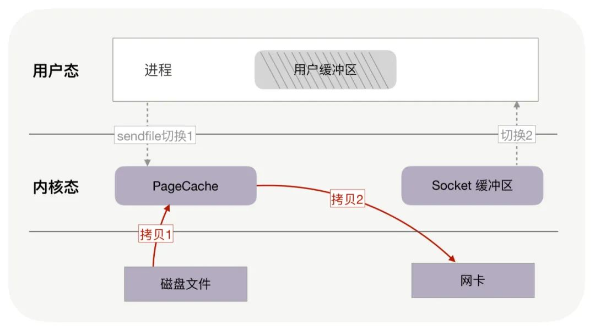
          - 传递文件描述符代替数据拷贝；
            - page cache 以及 socket buffer 都在内核空间中；
            - 数据在传输中没有被更新；
          - 一次系统调用代替两次系统调用
            - 由于 sendfile 仅仅对应一次系统调用，而传统文件操作则需要使用 read 以及 write 两个系统调用。
            - sendfile 能够将用户态与内核态之间的上下文切换从 4 次讲到 2 次
          - 我们需要注意 sendfile 系统调用的局限性。如果应用程序需要对从磁盘读取的数据进行写操作，例如解密或加密，那么 sendfile 系统调用就完全没法用。这是因为用户线程根本就不能够通过 sendfile 系统调用得到传输的数据。
      - mmap
        - [mmap内存映射的本质](https://mp.weixin.qq.com/s/sLoiOevTxIonrgLa7yWJkw)
        - 特点：
          - 利用 DMA 技术来取代 CPU 来在内存与其他组件之间的数据拷贝，例如从磁盘到内存，从内存到网卡；
          - 用户空间的 mmap file 使用虚拟内存，实际上并不占据物理内存，只有在内核空间的 kernel buffer cache 才占据实际的物理内存；
          - mmap() 函数需要配合 write() 系统调动进行配合操作，这与 sendfile() 函数有所不同，后者一次性代替了 read() 以及 write()；因此 mmap 也至少需要 4 次上下文切换；
          - mmap 仅仅能够避免内核空间到用户空间的全程 CPU 负责的数据拷贝，但是内核空间内部还是需要全程 CPU 负责的数据拷贝；
          - 仅代替 read 系统调用，将内核空间地址映射为用户空间地址，write 操作直接作用于内核空间。
          - 通过 DMA 技术以及地址映射技术，用户空间与内核空间无须数据拷贝，实现了 zero copy
        - 
        - 优势
          - 简化用户进程编程 - 基于缺页异常的懒加载; 数据一致性由 OS 确保
          - 读写效率提高：避免内核空间到用户空间的数据拷贝
          - 避免只读操作时的 swap 操作
        - 缺陷
          - 由于 mmap 使用时必须实现指定好内存映射的大小，因此 mmap 并不适合变长文件；
          - 如果更新文件的操作很多，mmap 避免两态拷贝的优势就被摊还，最终还是落在了大量的脏页回写及由此引发的随机 I/O 上，所以在随机写很多的情况下，mmap 方式在效率上不一定会比带缓冲区的一般写快；
          - 读/写小文件（例如 16K 以下的文件），mmap 与通过 read 系统调用相比有着更高的开销与延迟；同时 mmap 的刷盘由系统全权控制，但是在小数据量的情况下由应用本身手动控制更好；
          - mmap 受限于操作系统内存大小：例如在 32-bits 的操作系统上，虚拟内存总大小也就 2GB，但由于 mmap 必须要在内存中找到一块连续的地址块，此时你就无法对 4GB 大小的文件完全进行 mmap，在这种情况下你必须分多块分别进行 mmap，但是此时地址内存地址已经不再连续，使用 mmap 的意义大打折扣，而且引入了额外的复杂性；
        - 如下场合下可以选择使用 mmap 机制：
          - 多个线程以只读的方式同时访问一个文件，这是因为 mmap 机制下多线程共享了同一物理内存空间，因此节约了内存。案例：多个进程可能依赖于同一个动态链接库，利用 mmap 可以实现内存仅仅加载一份动态链接库，多个进程共享此动态链接库。
          - mmap 非常适合用于进程间通信，这是因为对同一文件对应的 mmap 分配的物理内存天然多线程共享，并可以依赖于操作系统的同步原语；
          - mmap 虽然比 sendfile 等机制多了一次 CPU 全程参与的内存拷贝，但是用户空间与内核空间并不需要数据拷贝，因此在正确使用情况下并不比 sendfile 效率差；
      - 直接 Direct I/O
        - 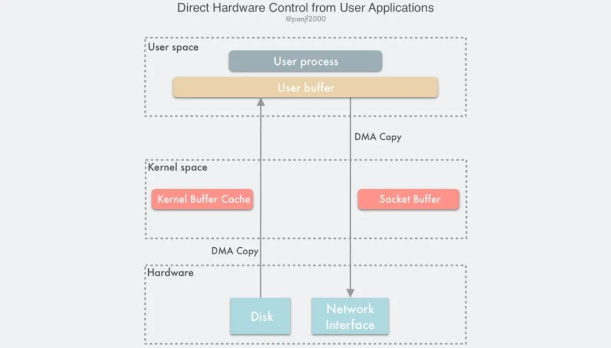
        - 读写操作直接在磁盘上进行，不使用 page cache 机制，通常结合用户空间的用户缓存使用。
        - 通过 DMA 技术直接与磁盘/网卡进行数据交互，实现了 zero copy
        - Direct I/O 的读写非常有特点：
          - Write 操作：由于其不使用 page cache，所以其进行写文件，如果返回成功，数据就真的落盘了（不考虑磁盘自带的缓存）；
          - Read 操作：由于其不使用 page cache，每次读操作是真的从磁盘中读取，不会从文件系统的缓存中读取。
        - 即使 Direct I/O 还是可能需要使用操作系统的 fsync 系统调用
          - 因为虽然文件的数据本身没有使用任何缓存，但是文件的元数据仍然需要缓存，包括 VFS 中的 inode cache 和 dentry cache 等。
          - 在部分操作系统中，在 Direct I/O 模式下进行 write 系统调用能够确保文件数据落盘，但是文件元数据不一定落盘。如果在此类操作系统上，那么还需要执行一次 fsync 系统调用确保文件元数据也落盘。否则，可能会导致文件异常、元数据确实等情况。MySQL 的 O_DIRECT 与 O_DIRECT_NO_FSYNC 配置是一个具体案例
        - Direct I/O 的优缺点：
          - 优点
            - Linux 中的直接 I/O 技术省略掉缓存 I/O 技术中操作系统内核缓冲区的使用，数据直接在应用程序地址空间和磁盘之间进行传输，从而使得自缓存应用程序可以省略掉复杂的系统级别的缓存结构，而执行程序自己定义的数据读写管理，从而降低系统级别的管理对应用程序访问数据的影响。
            - 与其他零拷贝技术一样，避免了内核空间到用户空间的数据拷贝，如果要传输的数据量很大，使用直接 I/O 的方式进行数据传输，而不需要操作系统内核地址空间拷贝数据操作的参与，这将会大大提高性能。
          - 缺点
            - 由于设备之间的数据传输是通过 DMA 完成的，因此用户空间的数据缓冲区内存页必须进行 page pinning（页锁定），这是为了防止其物理页框地址被交换到磁盘或者被移动到新的地址而导致 DMA 去拷贝数据的时候在指定的地址找不到内存页从而引发缺页错误，而页锁定的开销并不比 CPU 拷贝小，所以为了避免频繁的页锁定系统调用，应用程序必须分配和注册一个持久的内存池，用于数据缓冲。
            - 如果访问的数据不在应用程序缓存中，那么每次数据都会直接从磁盘进行加载，这种直接加载会非常缓慢。
            - 在应用层引入直接 I/O 需要应用层自己管理，这带来了额外的系统复杂性；
        - 谁会使用 Direct I/O
          - 自缓存应用程序（ self-caching applications）可以选择使用 Direct I/O。 例如，数据库管理系统（DBMS）和 Web 服务器就是自缓存应用程序的典型例子。
          - 目前 Linux 上的异步 IO 库，其依赖于文件使用 O_DIRECT 模式打开，它们通常一起配合使用。
          - 用户应用需要实现用户空间内的缓存区，读/写操作应当尽量通过此缓存区提供。如果有性能上的考虑，那么尽量避免频繁地基于 Direct I/O 进行读/写操作。
      - [splice](https://mp.weixin.qq.com/s/LBd4ewdz4Y3uCoqcYMRhKw)
        - 
        - 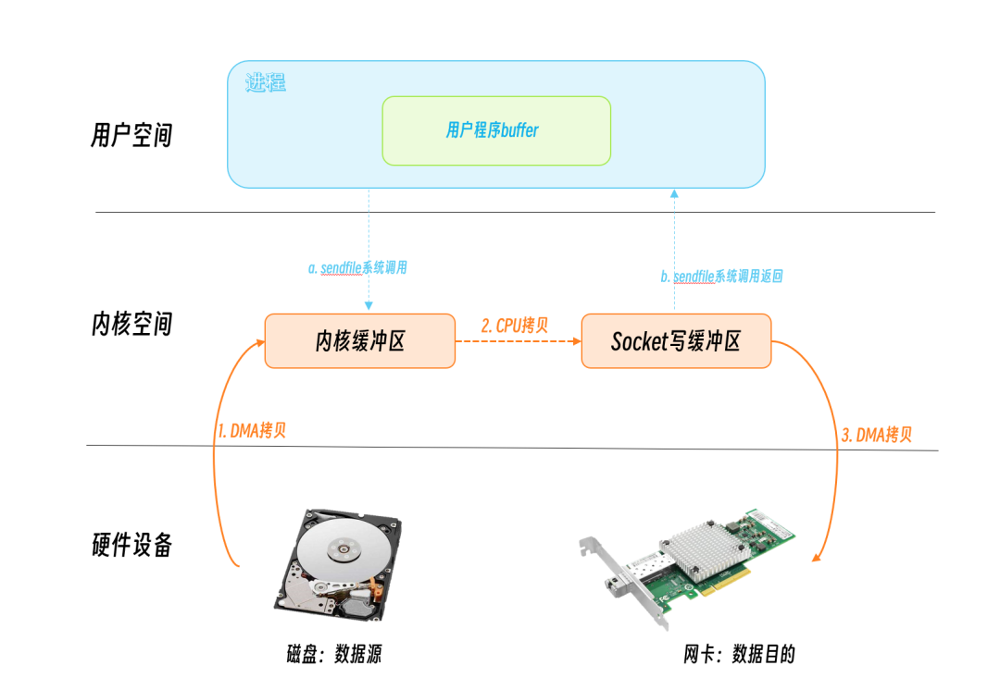
        - 使用 splice() 发送文件时，我们并不需要将文件内容读取到用户态缓存中，但需要使用管道作为中转。
        - splice 系统调用可以在内核空间的读缓冲区（read buffer）和网络缓冲区（socket buffer）之间建立管道（pipeline），从而避免了用户缓冲区和 Socket 缓冲区的 CPU 拷贝操作。
        - 基于 splice 系统调用的零拷贝方式，整个拷贝过程会发生 2 次用户态和内核态的切换，2 次数据拷贝（2 次 DMA 拷贝）
  - 典型案例
    - Kafka
      - Kakfa 服务端接收 Provider 的消息并持久化的场景下使用 mmap 机制
      - Kakfa 服务端向 Consumer 发送消息的场景下使用 sendfile 机制
        - sendfile 避免了内核空间到用户空间的 CPU 全程负责的数据移动；
        - sendfile 基于 Page Cache 实现，因此如果有多个 Consumer 在同时消费一个主题的消息，那么由于消息一直在 page cache 中进行了缓存，因此只需一次磁盘 I/O，就可以服务于多个 Consumer
- [进程和线程19个问题](https://mp.weixin.qq.com/s/NCl17jrOwP_A017nUqOkJQ)
- [进程调度](https://mp.weixin.qq.com/s/uBa65Vd3WsZsIv2uQy3cHQ)
  - O(n)调度器采用全局runqueue，导致多cpu加锁问题和cache利用率低的问题
  - O(1)调度器为每个cpu设计了一个runqueue，并且采用MLFQ算法思想设置140个优先级链表和active/expire两个双指针结构
  - CFS调度器采用红黑树来实现O(logn)复杂度的pick-next算法，摒弃固定时间片机制，采用调度周期内的动态时间机制
  - O(1)和O(n)都在交互进程的识别算法上下了功夫，但是无法做的100%准确
  - CFS另辟蹊径采用完全公平思想以及虚拟运行时间来实现进行的调度
  - CFS调度器也并非银弹，在某些方面可能不如O(1)
- [Linux 性能优化全景指南](https://mp.weixin.qq.com/s/6_utyj1kCyC5ZWpveDZQIQ)
  - 性能优化
    - 高并发和响应快对应着性能优化的两个核心指标：吞吐和延时
    - 平均负载：单位时间内，系统处于可运行状态和不可中断状态的平均进程数，也就是平均活跃进程数。
    - 平均负载高时可能是CPU密集型进程导致，也可能是I/O繁忙导致。具体分析时可以结合`mpstat/pidstat`工具辅助分析负载来源
  - CPU
    - CPU上下文切换分为：
      - 进程上下文切换: 一次系统调用过程其实进行了两次CPU上下文切换
      - 线程上下文切换
      - 中断上下文切换: 中断上下文只包括内核态中断服务程序执行所必须的状态
    - 通过vmstat可以查看系统总体的上下文切换情况
    - 使用pidstat来查看每个进程上下文切换情况
      ```shell
      vmstat 1 1    #首先获取空闲系统的上下文切换次数
      sysbench --threads=10 --max-time=300 threads run #模拟多线程切换问题
      
      vmstat 1 1    #新终端观察上下文切换情况
      此时发现cs数据明显升高，同时观察其他指标：
      r列： 远超系统CPU个数，说明存在大量CPU竞争
      us和sy列：sy列占比80%，说明CPU主要被内核占用
      in列： 中断次数明显上升，说明中断处理也是潜在问题
      
      说明运行/等待CPU的进程过多，导致大量的上下文切换，上下文切换导致系统的CPU占用率高
      
      pidstat -w -u 1  #查看到底哪个进程导致的问题, 分析sysbench模拟的是线程的切换，因此需要在pidstat后加-t参数查看线程指标。
      
      另外对于中断次数过多，我们可以通过/proc/interrupts文件读取 `watch -d cat /proc/interrupts`
      ```
    - 某个应用的CPU使用率达到100%，怎么办？
      - CPU使用率 - 除了空闲时间以外的其他时间占总CPU时间的百分比。可以通过/proc/stat中的数据来计算出CPU使用率。
      - 分析进程的CPU问题可以通过perf，它以性能事件采样为基础 `perf top / perf record / perf report `
        ```shell
        sudo docker run --name nginx -p 10000:80 -itd feisky/nginx
        sudo docker run --name phpfpm -itd --network container:nginx feisky/php-fpm
        
        ab -c 10 -n 100 http://XXX.XXX.XXX.XXX:10000/ #测试Nginx服务性能
        发现此时每秒可承受请求给长少，此时将测试的请求数从100增加到10000。在另外一个终端运行top查看每个CPU的使用率。发现系统中几个php-fpm进程导致CPU使用率骤升。
        
        接着用perf来分析具体是php-fpm中哪个函数导致该问题。`perf top -g -p XXXX #对某一个php-fpm进程进行分析`
        ```
    - 系统的CPU使用率很高，为什么找不到高CPU的应用？
       ```shell
       sudo docker run --name nginx -p 10000:80 -itd feisky/nginx:sp
       sudo docker run --name phpfpm -itd --network container:nginx feisky/php-fpm:sp
       ab -c 100 -n 1000 http://XXX.XXX.XXX.XXX:10000/ #并发100个请求测试
       
       此时用top和pidstat发现系统CPU使用率过高，但是并没有发现CPU使用率高的进程。
       出现这种情况一般时我们分析时遗漏的什么信息，重新运行top命令并观察一会。发现就绪队列中处于Running状态的进行过多，超过了我们的并发请求次数5. 再仔细查看进程运行数据，发现nginx和php-fpm都处于sleep状态，真正处于运行的却是几个stress进程。
       ```
      - 此时有可能时以下两种原因导致：
        - 进程不停的崩溃重启（如段错误/配置错误等），此时进程退出后可能又被监控系统重启；
        - 短时进程导致，即其他应用内部通过exec调用的外面命令，这些命令一般只运行很短时间就结束，很难用top这种间隔较长的工具来发现
      - 可以通过pstree来查找 stress的父进程，找出调用关系。 `pstree | grep stress`
    - 系统中出现大量不可中断进程和僵尸进程怎么办？
      - 不可中断状态
        - 进程状态 D Disk Sleep，不可中断状态睡眠，一般表示进程正在跟硬件交互，并且交互过程中不允许被其他进程中断
        - 对于不可中断状态，一般都是在很短时间内结束，可忽略。但是如果系统或硬件发生故障，进程可能会保持不可中断状态很久，甚至系统中出现大量不可中断状态，此时需注意是否出现了I/O性能问题。
      - 大量的僵尸进程会用尽PID进程号，导致新进程无法建立
      - 磁盘O_DIRECT问题
        ```shell
        sudo docker run --privileged --name=app -itd feisky/app:iowait
        ps aux | grep '/app'
        ```
        - 可以看到此时有多个app进程运行，状态分别时Ss+和D+。其中后面s表示进程是一个会话的领导进程，+号表示前台进程组。
        - 进程组表示一组相互关联的进程，子进程是父进程所在组的组员。会话指共享同一个控制终端的一个或多个进程组
        - top查看系统资源发现：
          - 1）平均负载在逐渐增加，且1分钟内平均负载达到了CPU个数，说明系统可能已经有了性能瓶颈；
          - 2）僵尸进程比较多且在不停增加；
          - 3）us和sys CPU使用率都不高，iowait却比较高；
          - 4）每个进程CPU使用率也不高，但有两个进程处于D状态，可能在等待IO。
        - iowait过高导致系统平均负载升高，僵尸进程不断增长说明有程序没能正确清理子进程资源。
        - 用dstat`dstat 1 10    #间隔1秒输出10组数据`来分析，因为它可以同时查看CPU和I/O两种资源的使用情况，便于对比分析
        - 之前top查看的处于D状态的进程号，用pidstat -d -p XXX 展示进程的I/O统计数据。发现处于D状态的进程都没有任何读写操作。
        - 在用pidstat -d 查看所有进程的I/O统计数据，看到app进程在进行磁盘读操作，每秒读取32MB的数据。进程访问磁盘必须使用系统调用处于内核态，接下来重点就是找到app进程的系统调用。
        - 用perf record -d和perf report进行分析，查看app进程调用栈。
        - 看到app确实在通过系统调用sys_read()读取数据，并且从new_sync_read和blkdev_direct_IO看出进程时进行直接读操作，请求直接从磁盘读，没有通过缓存导致iowait升高。
           通过层层分析后，root cause是app内部进行了磁盘的直接I/O
      - 僵尸进程
        - 首先要定位僵尸进程的父进程，通过pstree -aps XXX，打印出该僵尸进程的调用树，发现父进程就是app进程。
        - 查看app代码，看看子进程结束的处理是否正确（是否调用wait()/waitpid(),有没有注册SIGCHILD信号的处理函数等）
      - Summary
        - 碰到iowait升高时，先用dstat pidstat等工具确认是否存在磁盘I/O问题，再找是哪些进程导致I/O，不能用strace直接分析进程调用时可以通过perf工具分析。
        - 对于僵尸问题，用pstree找到父进程，然后看源码检查子进程结束的处理逻辑即可。
    - CPU性能指标
      - CPU使用率
        - 用户CPU使用率, 包括用户态(user)和低优先级用户态(nice). 该指标过高说明应用程序比较繁忙.
        - 系统CPU使用率, CPU在内核态运行的时间百分比(不含中断). 该指标高说明内核比较繁忙.
        - 等待I/O的CPU使用率, iowait, 该指标高说明系统与硬件设备I/O交互时间比较长.
        - 软/硬中断CPU使用率, 该指标高说明系统中发生大量中断.
        - steal CPU / guest CPU, 表示虚拟机占用的CPU百分比.
      - 平均负载理想情况下平均负载等于逻辑CPU个数,表示每个CPU都被充分利用. 若大于则说明系统负载较重.
      - 进程上下文切换包括无法获取资源的自愿切换和系统强制调度时的非自愿切换. 上下文切换本身是保证Linux正常运行的一项核心功能. 过多的切换则会将原本运行进程的CPU时间消耗在寄存器,内核占及虚拟内存等数据保存和恢复上
      - CPU缓存命中率CPU缓存的复用情况,命中率越高性能越好. 其中L1/L2常用在单核,L3则用在多核中
    - 性能工具
      - 平均负载案例
        - 先用uptime查看系统平均负载
        - 判断负载在升高后再用mpstat和pidstat分别查看每个CPU和每个进程CPU使用情况.找出导致平均负载较高的进程.
      - 上下文切换案例
        - 先用vmstat查看系统上下文切换和中断次数
        - 再用pidstat观察进程的自愿和非自愿上下文切换情况
        - 最后通过pidstat观察线程的上下文切换情况
      - 进程CPU使用率高案例
        - 先用top查看系统和进程的CPU使用情况,定位到进程
        - 再用perf top观察进程调用链,定位到具体函数
      - 系统CPU使用率高案例
        - 先用top查看系统和进程的CPU使用情况,top/pidstat都无法找到CPU使用率高的进程
        - 重新审视top输出
        - 从CPU使用率不高,但是处于Running状态的进程入手
        - perf record/report发现短时进程导致 (execsnoop工具)
      - 不可中断和僵尸进程案例
        - 先用top观察iowait升高,发现大量不可中断和僵尸进程
        - strace无法跟踪进程系统调用
        - perf分析调用链发现根源来自磁盘直接I/O
      - 软中断案例
        - top观察系统软中断CPU使用率高
        - 查看/proc/softirqs找到变化速率较快的几种软中断
        - sar命令发现是网络小包问题
        - tcpdump找出网络帧的类型和来源, 确定SYN FLOOD攻击导致
      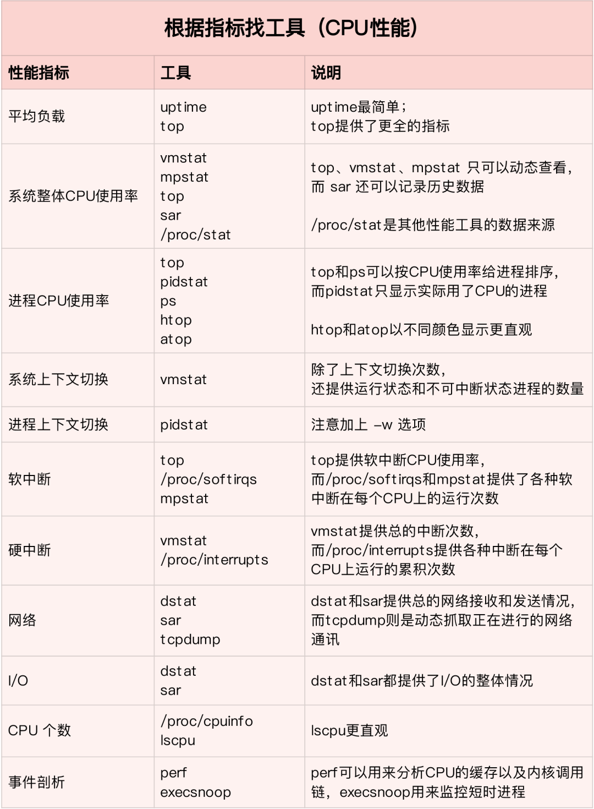
      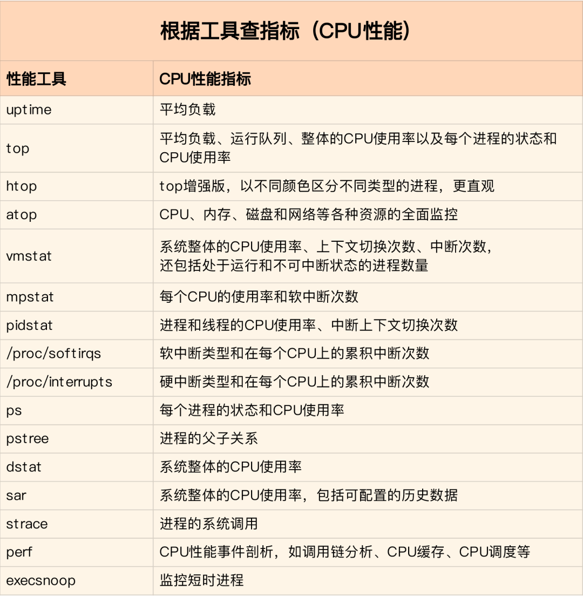
      - 先运行几个支持指标较多的工具, 如top/vmstat/pidstat,根据它们的输出可以得出是哪种类型的性能问题. 
      - 定位到进程后再用strace/perf分析调用情况进一步分析. 如果是软中断导致用/proc/softirqs
      
    - CPU优化
      - 应用程序优化
        - 编译器优化: 编译阶段开启优化选项, 如gcc -O2
        - 算法优化
        - 异步处理: 避免程序因为等待某个资源而一直阻塞,提升程序的并发处理能力. (将轮询替换为事件通知)
        - 多线程代替多进程: 减少上下文切换成本
        - 善用缓存: 加快程序处理速度
      - 系统优化
        - CPU绑定: 将进程绑定要1个/多个CPU上,提高CPU缓存命中率,减少CPU调度带来的上下文切换
        - CPU独占: CPU亲和性机制来分配进程
        - 优先级调整:使用nice适当降低非核心应用的优先级
        - 为进程设置资源显示: cgroups设置使用上限,防止由某个应用自身问题耗尽系统资源
        - NUMA优化: CPU尽可能访问本地内存
        - 中断负载均衡: irpbalance,将中断处理过程自动负载均衡到各个CPU上
  - 内存
    - Linux内存是怎么工作的
      - 虚拟地址的作用
        - 如果用户进程直接操作物理地址会有以下的坏处：
          -  用户进程可以直接操作内核对应的内存，破坏内核运行。
          -  用户进程也会破坏其他进程的运行
        - CPU 中寄存器中存储的是逻辑地址，需要进行映射才能转化为对应的物理地址，然后获取对应的内存。
          - 通过引入逻辑地址，每个进程都拥有单独的逻辑地址范围。
          - 当进程申请内存的时候，会为其分配逻辑地址和物理地址，并将逻辑地址和物理地址做一个映射。
        - 虚拟空间分为 用户态 和 内核态
        - 虚拟地址需要通过页表转化为物理地址，然后才能访问。
        - 用户虚拟空间 只能映射 物理内存中的用户内存，无法映射到物理内存中的内核内存，也就是说，用户进程只能操作用户内存。
      - 物理内存的分配
        - 大内存 利用伙伴系统 分配。
        - 小内存分配利用 slub 分配，比如对象等数据 slub 就是 将几个页单独拎出来作为缓存，里面维护了链表。每次直接从链表中获取对应的内存，用完之后也不用清空，就直接挂到链表上，然后等待下次利用。
      - 内存映射
        - 大多数计算机用的主存都是动态随机访问内存(DRAM)，只有内核才可以直接访问物理内存。Linux内核给每个进程提供了一个独立的虚拟地址空间，并且这个地址空间是连续的。这样进程就可以很方便的访问内存(虚拟内存)。
        - 为了完成内存映射，内核为每个进程都维护了一个页表，记录虚拟地址和物理地址的映射关系。页表实际存储在CPU的内存管理单元MMU中，处理器可以直接通过硬件找出要访问的内存。
        - MMU以页为单位管理内存，页大小4KB。为了解决页表项过多问题Linux提供了多级页表和HugePage的机制。
      - 内存分配与回收
        - 分配
          - **brk()** 针对小块内存(<128K)，通过移动堆顶位置来分配。内存释放后不立即归还内存，而是被缓存起来。
          - **mmap()** 针对大块内存(>128K)，直接用内存映射来分配，即在文件映射段找一块空闲内存分配。
          - 上述两种调用并没有真正分配内存，这些内存只有在首次访问时，才通过缺页异常进入内核中，由内核来分配
        - 回收
          - 回收缓存：LRU算法回收最近最少使用的内存页面；
          - 回收不常访问内存：把不常用的内存通过交换分区写入磁盘
          - 杀死进程：OOM内核保护机制 `echo -16 > /proc/$(pidof XXX)/oom_adj`
      - 如何查看内存使用情况 - free
      - 怎样理解内存中的Buffer和Cache
        - buffer是对磁盘数据的缓存，cache是对文件数据的缓存，它们既会用在读请求也会用在写请求中
      - 如何利用系统缓存优化程序的运行效率
        - 安装bcc包后可以通过cachestat和cachetop来监测缓存的读写命中情况。
        - 安装pcstat后可以查看文件在内存中的缓存大小以及缓存比例
    - 内存泄漏，如何定位和处理？
      - 可以通过memleak工具来跟踪系统或进程的内存分配/释放请求
      - `/usr/share/bcc/tools/memleak -a -p $(pidof app)`
    - 为什么系统的Swap变高
      - Swap本质就是把一块磁盘空间或者一个本地文件当作内存来使用，包括换入和换出两个过程
      - NUMA 与 SWAP
        - 很多情况下系统剩余内存较多，但SWAP依旧升高，这是由于处理器的NUMA架构
        - 在NUMA架构下多个处理器划分到不同的Node，每个Node都拥有自己的本地内存空间。在分析内存的使用时应该针对每个Node单独分析 `numactl --hardware`
      - swappiness
        - 在实际回收过程中Linux根据/proc/sys/vm/swapiness选项来调整使用Swap的积极程度，从0-100，数值越大越积极使用Swap，即更倾向于回收匿名页；数值越小越消极使用Swap，即更倾向于回收文件页
      - Swap升高时如何定位分析
        ```shell
        free #首先通过free查看swap使用情况，若swap=0表示未配置Swap
        #先创建并开启swap
        fallocate -l 8G /mnt/swapfile
        chmod 600 /mnt/swapfile
        mkswap /mnt/swapfile
        swapon /mnt/swapfile
        
        free #再次执行free确保Swap配置成功
        
        dd if=/dev/sda1 of=/dev/null bs=1G count=2048 #模拟大文件读取
        sar -r -S 1  #查看内存各个指标变化 -r内存 -S swap
        #根据结果可以看出，%memused在不断增长，剩余内存kbmemfress不断减少，缓冲区kbbuffers不断增大，由此可知剩余内存不断分配给了缓冲区
        #一段时间之后，剩余内存很小，而缓冲区占用了大部分内存。此时Swap使用之间增大，缓冲区和剩余内存只在小范围波动
        
        停下sar命令
        cachetop5 #观察缓存
        #可以看到dd进程读写只有50%的命中率，未命中数为4w+页，说明正式dd进程导致缓冲区使用升高
        watch -d grep -A 15 ‘Normal’ /proc/zoneinfo #观察内存指标变化
        #发现升级内存在一个小范围不停的波动，低于页低阈值时会突然增大到一个大于页高阈值的值
        ```
        - 说明剩余内存和缓冲区的波动变化正是由于内存回收和缓存再次分配的循环往复。有时候Swap用的多，有时候缓冲区波动更多。此时查看swappiness值为60，是一个相对中和的配置，系统会根据实际运行情况来选去合适的回收类型.
    - 如何“快准狠”找到系统内存存在的问题
      - 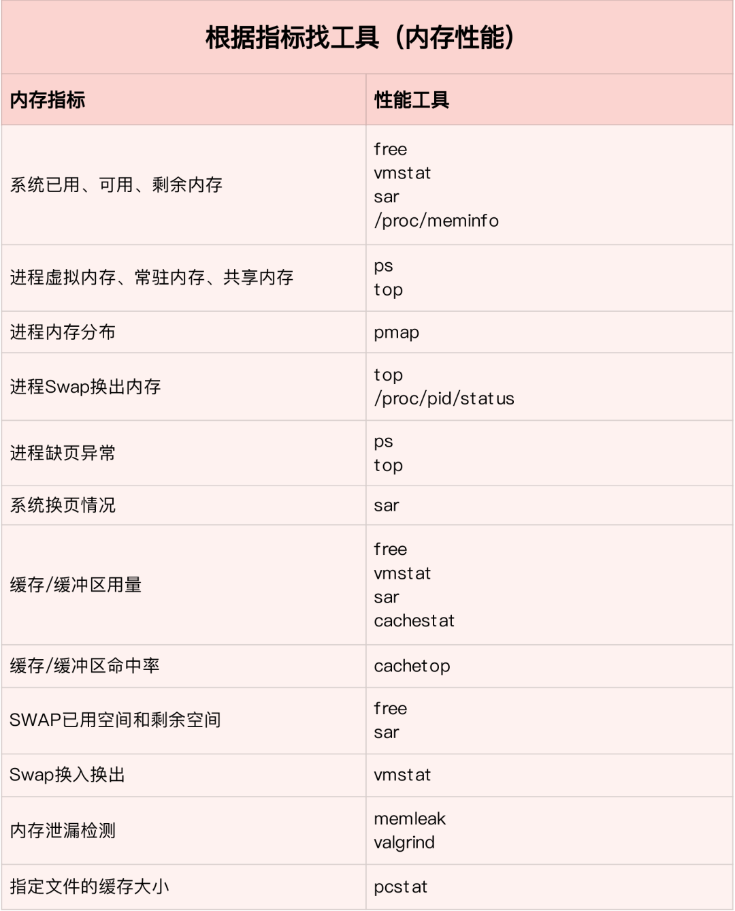
      - 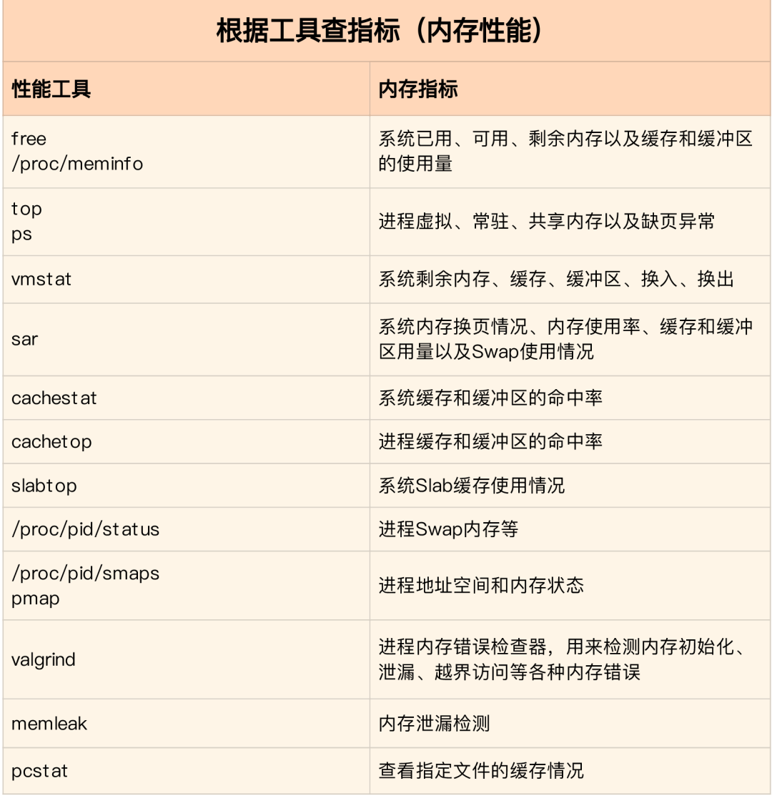
    - 如何迅速分析内存的性能瓶颈
      - 通常先运行几个覆盖面比较大的性能工具，如free，top，vmstat，pidstat等
        - 先用free和top查看系统整体内存使用情况
        - 再用vmstat和pidstat，查看一段时间的趋势，从而判断内存问题的类型
        - 最后进行详细分析，比如内存分配分析，缓存/缓冲区分析，具体进程的内存使用分析等
      - 常见的优化思路：
         - 最好禁止Swap，若必须开启则尽量降低swappiness的值
         - 减少内存的动态分配，如可以用内存池，HugePage等
         - 尽量使用缓存和缓冲区来访问数据。如用堆栈明确声明内存空间来存储需要缓存的数据，或者用Redis外部缓存组件来优化数据的访问
         - cgroups等方式来限制进程的内存使用情况，确保系统内存不被异常进程耗尽
         - /proc/pid/oom_adj调整核心应用的oom_score，保证即使内存紧张核心应用也不会被OOM杀死
    - [Linux 内存相关问题](https://mp.weixin.qq.com/s/xge99lp9Uswr-MbFaAxU_Q)
    - [内存故障追踪](https://mp.weixin.qq.com/s/HGzEijaUaRvbjVDVDpILHA)
  - [Tools](https://www.ctq6.cn/linux%E6%80%A7%E8%83%BD%E4%BC%98%E5%8C%96/)
    - vmstat使用详解
      - vmstat命令是最常见的Linux/Unix监控工具，可以展现给定时间间隔的服务器的状态值,包括服务器的CPU使用率，内存使用，虚拟内存交换情况,IO读写情况。
       ```shell
       # 结果说明
       - r 表示运行队列(就是说多少个进程真的分配到CPU)，我测试的服务器目前CPU比较空闲，没什么程序在跑，当这个值超过了CPU数目，就会出现CPU瓶颈了。这个也和top的负载有关系，一般负载超过了3就比较高，超过了5就高，超过了10就不正常了，服务器的状态很危险。top的负载类似每秒的运行队列。如果运行队列过大，表示你的CPU很繁忙，一般会造成CPU使用率很高。
       - b 表示阻塞的进程,这个不多说，进程阻塞，大家懂的。
       - swpd 虚拟内存已使用的大小，如果大于0，表示你的机器物理内存不足了，如果不是程序内存泄露的原因，那么你该升级内存了或者把耗内存的任务迁移到其他机器。
       - free   空闲的物理内存的大小，我的机器内存总共8G，剩余3415M。
       - buff   Linux/Unix系统是用来存储，目录里面有什么内容，权限等的缓存，我本机大概占用300多M
       - cache cache直接用来记忆我们打开的文件,给文件做缓冲，我本机大概占用300多M(这里是Linux/Unix的聪明之处，把空闲的物理内存的一部分拿来做文件和目录的缓存，是为了提高 程序执行的性能，当程序使用内存时，buffer/cached会很快地被使用。)
       - si  每秒从磁盘读入虚拟内存的大小，如果这个值大于0，表示物理内存不够用或者内存泄露了，要查找耗内存进程解决掉。我的机器内存充裕，一切正常。
       - so  每秒虚拟内存写入磁盘的大小，如果这个值大于0，同上。
       - bi  块设备每秒接收的块数量，这里的块设备是指系统上所有的磁盘和其他块设备，默认块大小是1024byte，我本机上没什么IO操作，所以一直是0，但是我曾在处理拷贝大量数据(2-3T)的机器上看过可以达到140000/s，磁盘写入速度差不多140M每秒
       - bo 块设备每秒发送的块数量，例如我们读取文件，bo就要大于0。bi和bo一般都要接近0，不然就是IO过于频繁，需要调整。
       - in 每秒CPU的中断次数，包括时间中断
       - cs 每秒上下文切换次数，例如我们调用系统函数，就要进行上下文切换，线程的切换，也要进程上下文切换，这个值要越小越好，太大了，要考虑调低线程或者进程的数目,例如在apache和nginx这种web服务器中，我们一般做性能测试时会进行几千并发甚至几万并发的测试，选择web服务器的进程可以由进程或者线程的峰值一直下调，压测，直到cs到一个比较小的值，这个进程和线程数就是比较合适的值了。系统调用也是，每次调用系统函数，我们的代码就会进入内核空间，导致上下文切换，这个是很耗资源，也要尽量避免频繁调用系统函数。上下文切换次数过多表示你的CPU大部分浪费在上下文切换，导致CPU干正经事的时间少了，CPU没有充分利用，是不可取的。
       - us 用户CPU时间，我曾经在一个做加密解密很频繁的服务器上，可以看到us接近100,r运行队列达到80(机器在做压力测试，性能表现不佳)。
       - sy 系统CPU时间，如果太高，表示系统调用时间长，例如是IO操作频繁。
       - id 空闲CPU时间，一般来说，id + us + sy = 100,一般我认为id是空闲CPU使用率，us是用户CPU使用率，sy是系统CPU使用率。
       - wt 等待IO CPU时间
       ```
    - pidstat 使用详解
      - pidstat主要用于监控全部或指定进程占用系统资源的情况,如CPU,内存、设备IO、任务切换、线程等。使用方法：
        ````shell
        pidstat –d interval times 统计各个进程的IO使用情况
        pidstat –u interval times 统计各个进程的CPU统计信息
        pidstat –r interval times 统计各个进程的内存使用信息
        pidstat -w interval times 统计各个进程的上下文切换
        ````
- [同步/异步，阻塞/非阻塞概念深度解析](https://mp.weixin.qq.com/s/V0ESyLTg05OQdP4OQm-wGw)
  - 操作系统概念（第九版 中有关进程间通信的部分是如何解释的
    - 从进程级通信的维度讨论时， 阻塞和同步（非阻塞和异步）就是一对同义词， 且需要针对发送方和接收方作区分对待。
  - 基础知识
    - 用户空间和内核空间 - 操作系统内核需要拥有高于普通进程的权限， 以此来调度和管理用户的应用程序。于是内存空间被划分为两部分，一部分为内核空间，一部分为用户空间，内核空间存储的代码和数据具有更高级别的权限。
    - 进程切换
      - 当一个程序正在执行的过程中， 中断（interrupt） 或 系统调用（system call） 发生可以使得 CPU 的控制权会从当前进程转移到操作系统内核。
      - 中断（interrupt） - CPU中断信号，在每个CPU时钟周期的末尾，CPU检测这个中断信号位是否有中断信号
      - 时钟中断( Clock Interrupt )
      - 系统调用（system call）
    - 进程阻塞
      - “阻塞”是指进程在发起了一个系统调用（System Call） 后， 由于该系统调用的操作不能立即完成，需要等待一段时间，于是内核将进程挂起为等待 （waiting）状态， 以确保它不会被调度执行， 占用 CPU 资源。
  - 阻塞和非阻塞描述的是进程的一个操作是否会使得进程转变为“等待”的状态
  - 非阻塞I/O 系统调用( nonblocking system call ) 和异步I/O系统调用 （asychronous system call）的区别是
    - 一个非阻塞I/O 系统调用 read() 操作立即返回的是任何可以立即拿到的数据， 可以是完整的结果， 也可以是不完整的结果， 还可以是一个空值。
    - 而异步I/O系统调用 read（）结果必须是完整的， 但是这个操作完成的通知可以延迟到将来的一个时间点。
  - 总结
    - 阻塞/非阻塞核心区别就是看当前任务有没有被挂起。
    - 在进程通信层面， 阻塞/非阻塞， 同步/异步基本是同义词， 但是需要注意区分讨论的对象是发送方还是接收方。发送方阻塞/非阻塞（同步/异步）和接收方的阻塞/非阻塞（同步/异步） 是互不影响的。
    - 在 IO 系统调用层面（ IO system call ）层面， 非阻塞IO 系统调用 和 异步IO 系统调用存在着一定的差别， 它们都不会阻塞进程， 但是返回结果的方式和内容有所差别， 但是都属于非阻塞系统调用（ non-blocing system call ）。
    - 阻塞和非阻塞是等待I/O的期间能不能做其他事情, 自己会不会被挂起, 是关注自己的状态，同步异步是是否需要主动询问, 描述的是行为方式（通信机制）。
    - 非阻塞系统调用（non-blocking I/O system call 与 asynchronous I/O system call） 的存在可以用来实现线程级别的 I/O 并发， 与通过多进程实现的 I/O 并发相比可以减少内存消耗以及进程切换的开销。
- [Linux CPU的上下文切换](https://mp.weixin.qq.com/s/2XeS3T0rOB2XrDSTsg6VPQ)
  - CPU 上下文（CPU Context）
    - 指的是先保存上一个任务的 CPU 上下文（CPU寄存器和程序计数器），然后将新任务的上下文加载到这些寄存器和程序计数器中，最后跳转到程序计数器。
  - CPU 上下文切换的类型
    - 进程上下文切换
      - Linux 按照特权级别将进程的运行空间划分为内核空间和用户空间，分别对应下图中 Ring 0 和 Ring 3 的 CPU 特权级别的
      - 从用户态到内核态的转换需要通过系统调用来完成. 在一次系统调用的过程中，实际上有两次 CPU 上下文切换。
      - 进程上下文切换比系统调用要多出一步, 在保存当前进程的内核状态和 CPU 寄存器之前，需要保存进程的虚拟内存、栈等；并加载下一个进程的内核状态。
    - 线程上下文切换
      - 线程和进程最大的区别在于，线程是任务调度的基本单位，而进程是资源获取的基本单位
      - 线程的上下文切换其实可以分为两种情况：
        - 首先，前后两个线程属于不同的进程。此时，由于资源不共享，切换过程与进程上下文切换相同。
        - 其次，前后两个线程属于同一个进程。此时，由于虚拟内存是共享的，所以切换时虚拟内存的资源保持不变，只需要切换线程的私有数据、寄存器等未共享的数据。
    - 中断上下文切换
      - 中断其实是一种异步的事件处理机制，可以提高系统的并发处理能力。中断分为两种，硬中断与软中断。
        - 硬中断：比如网卡接收数据后，需要通知 Linux 内核有新的数据到了，通过硬件中断的方式发送电信号给内核，内核此时调用中断处理程序来响应下
        - 软中断：用户程序需要处理网卡接收的数据，正处于 read 或者 epoll 的系统调用的 Sleep 状态中 每个 CPU 都对应一个软中断内核线程，名 ksoftirqd/$CPU_NUM
      - 为了快速响应事件，硬件中断会中断正常的调度和执行过程，进而调用中断处理程序。
      - 在中断其他进程时，需要保存进程的当前状态，以便中断后进程仍能从原始状态恢复。
      - 中断上下文切换不涉及进程的用户态
      - 中断上下文切换也会消耗 CPU。过多的切换次数会消耗大量的 CPU 资源，甚至严重降低系统的整体性能
    - 从性能角度看待上下文切换
      - 自愿上下文切换，是指进程无法获取所需资源，导致的上下文切换。比如说， I/O、内存等系统资源不足时，就会发生自愿上下文切换。
      - 非自愿上下文切换，则是指进程由于时间片已到等原因，被系统强制调度，进而发生的上下文切换。比如说，大量进程都在争抢 CPU 时，就容易发生非自愿上下文切换。
  - 问题排查
    - vmstat ——是一个常用的系统性能分析工具，主要用来分析系统的内存使用情况，也常用来分析CPU上下文切换和中断的次数
      `$ vmstat 1`
    - pidstat ——vmstat只给出了系统总体的上下文切换情况，要想查看每个进程的详细情况，就需要使用pidstat，加上-w，可以查看每个进程上下文切换的情况
      `$ pidstat -w -u 1`
       ```shell
       cswch  表示每秒自愿上下文切换的次数，是指进程无法获取所需资源，导致的上下文切换，比如说，I/O，内存等系统资源不足时，就会发生自愿上下文切换。
       nvcswch 表示每秒非自愿上下文切换的次数，则是指进程由于时间片已到等原因，被系统强制调度，进而发生的上下文切换。
       分析：
       pidstat查看果然是sysbench导致了cpu达到100%，但上下文切换来自其他进程，包括非自愿上下文切换最高的pidstat，以及自愿上下文切换最高的kworker和sshd
       但pidtstat输出的上下文切换次数加起来才几百和vmstat的百万明显小很多，现在vmstat输出的是线程，而pidstat加上-t后才输出线程指标
       ```
    - /proc/interrupts——/proc实际上是linux的虚拟文件系统用于内核空间和用户空间的通信，/proc/interrupts是这种通信机制的一部分，提供了一个只读的中断使用情况。
      `$ watch -d cat /proc/interrupts`
    - perf stat  可以统计很多和CPU相关核心数据，比如cache' miss，上下文切换，CPI等。
    - Summary
      - 自愿上下文切换变多了，说明进程都在等待资源，有可能发生了 I/O 等其他问题；
      - 非自愿上下文切换变多了，说明进程都在被强制调度，也就是都在争抢 CPU，说明 CPU 的确成了瓶颈；
      - 中断次数变多了，说明 CPU 被中断处理程序占用，还需要通过查看 /proc/interrupts 文件来分析具体的中断类型。
- [深入理解TLB原理](https://mp.weixin.qq.com/s/KSf4GT3vI4ABHp9jvTqa2A)
- [SSD 的基本原理](https://mp.weixin.qq.com/s?__biz=Mzg3NTU3OTgxOA==&mid=2247497987&idx=1&sn=ab77ef0debfe5a978b23056db45da795&chksm=cf3de9c6f84a60d039412b3c086a29f58cc9317672f0040e3b90761df327318f7049e973de7c&scene=132#wechat_redirect)
  - SSD 的闪存介质就是由成千上万个上面的浮栅晶体管组成的，由它们组成 0101010 这样的一系列数据，从而形成我们想要的存储数据
  - SSD 盘内部按照 LUN，Plane，Block，Page，存储单元（浮栅管） 这样的层次。不同的层次共用了不同的资源
    - 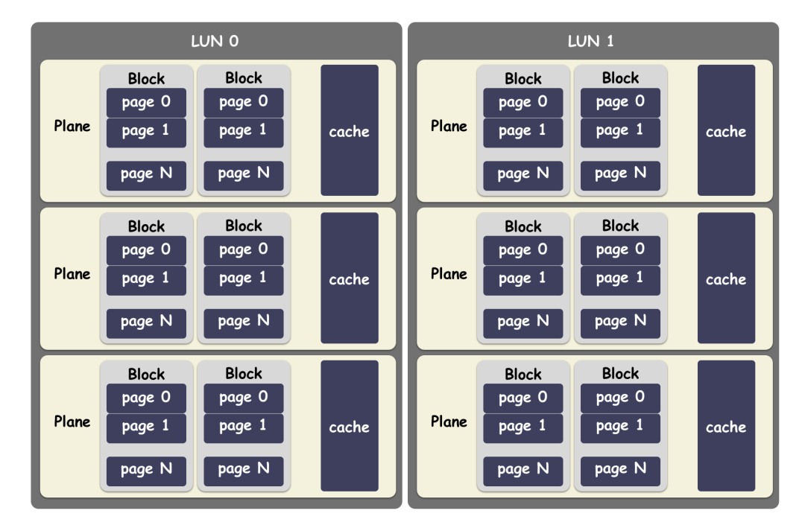
    - LUN 是接收和执行闪存的基本单元，换句话说，不同的 LUN 之间可以并发执行命令。一个 LUN 内，同一时间只能有一个命令在执行。
    - 每个 Plane 有自己独立的缓存，这个缓存是读写数据的时候用的。举个例子，写数据的时候，先把数据从主控传输到这个 Cache ，然后再把 Cache 写到闪存阵列，读的时候则是把 Page 的数据从闪存介质读取到 Cache ，然后传输主控。
    - 擦除的粒度是 Block ， Block 里所有的存储单元共用衬底。
    - SSD 盘 IO 的单元是 Page 。也就是说，无论是从闪存介质中读数据到 Cache ，还是把 Cache 的数据写到闪存介质，都是以 Page 为单位。
  - 闪存的持久化状态体现在浮栅层捕获的电子，通过这个影响浮栅管的导通性来表示标识 0 和 1 的状态；
  - 浮栅层是否能关住电子就决定了 SSD 的寿命，如果它总是关不住电子，那说明它差不多到期了；
  - 对浮栅晶体管的反复读写会影响它的寿命；
  - SSD 盘内部擦除的单元是 Block ，因为 Block 内部的存储单元共用衬底；
  - SSD 盘 IO 读写的单元是 Page ，如果 IO 大小不对齐，那么会导致 IO 的放大，影响性能；
  - SSD 盘没有覆盖写，永远都是写新的位置。这些新的位置都会是初始状态（全 1 数据）；
  - SSD 内部的垃圾回收来保证持续有新的 Block 可写；
  - SSD 的随机和顺序 IO 写影响更多的是 GC 的效率，从而影响寿命和性能
- [开发需要了解 SSD](https://mp.weixin.qq.com/s/u1ssEFJCGY3cjYwfwnA8AQ)
  - 区分冷热数据
    - 假设我们将冷热数据混合排布在同一个区块，对于 SSD 来说，如果要修改其中的一小块内容（小于 1 页），SSD 仍然会读取整页的数据，这样会导致写入放大
  - 采用紧凑的数据结构
    - 这其实也和 SSD 的结构相关，更紧凑的数据结构可以尽量让数据都聚拢在同一个 Block 中，减少 SSD 的读取操作，同时也能更好的利用缓存。
  - 写的数据最好是页大小的倍数
    避免写入小于NAND闪存页面大小的数据块，以最大限度地减少写入放大并防止读取-修改-写入操作。
  - 尽量避免读写混合
    由小交错读写混合组成的工作负载将阻止内部缓存和预读机制正常工作，并将导致吞吐量下降。最好避免同时读取和写入，并在大块中一个接一个地执行它们，最好是clustered block的大小。
  - 不要总以为随机写入比顺序写入慢
    如果写入很小（即低于clustered block的大小），则随机写入比顺序写入慢
  - 大型单线程读取优于许多小型并发读取
  - 大型单线程写入优于许多小型并发写入
  - 当写入量很小并且无法分组或缓冲时，才使用多线程写
  - 对于读写负载很高的工作，应该配置更大的预留空间
  - [SSD硬件速度飙升，唯独云存储未能跟上](https://mp.weixin.qq.com/s/hsh0y4eyPD2Rq1fjGK8jkg)
- [如何排查问题](https://mp.weixin.qq.com/s/g6UuqlWb-0h3eW69-VG52Q)
  - CPU过高，怎么排查问题
    - CPU 指标解析
      - 平均负载
        - 平均负载等于逻辑 CPU 个数，表示每个 CPU 都恰好被充分利用。如果平均负载大于逻辑 CPU 个数，则负载比较重
      - 进程上下文切换
        - 无法获取资源而导致的自愿上下文切换
        - 被系统强制调度导致的非自愿上下文切换
      - CPU 使用率
        - 用户 CPU 使用率，包括用户态 CPU 使用率（user）和低优先级用户态 CPU 使用率（nice），表示 CPU 在用户态运行的时间百分比。用户 CPU 使用率高，通常说明有应用程序比较繁忙
        - 系统 CPU 使用率，表示 CPU 在内核态运行的时间百分比（不包括中断），系统 CPU 使用率高，说明内核比较繁忙
        - 等待 I/O 的 CPU 使用率，通常也称为 iowait，表示等待 I/O 的时间百分比。iowait 高，说明系统与硬件设备的 I/O 交互时间比较长
        - 软中断和硬中断的 CPU 使用率，分别表示内核调用软中断处理程序、硬中断处理程序的时间百分比。它们的使用率高，表明系统发生了大量的中断
    - 查看系统的平均负载 - uptime
      - 最后三个数字依次是过去 1 分钟、5 分钟、15 分钟的平均负载（Load Average）。平均负载是指单位时间内，系统处于可运行状态和不可中断状态的平均进程数
      - 当平均负载高于 CPU 数量 70% 的时候，就应该分析排查负载高的问题。一旦负载过高，就可能导致进程响应变慢，进而影响服务的正常功能
      - 平均负载与 CPU 使用率关系
        - CPU 密集型进程，使用大量 CPU 会导致平均负载升高，此时这两者是一致的
        - I/O 密集型进程，等待 I/O 也会导致平均负载升高，但 CPU 使用率不一定很高
        - 大量等待 CPU 的进程调度也会导致平均负载升高，此时的 CPU 使用率也会比较高
    - CPU 上下文切换
      - 进程上下文切换 - 进程的运行空间可以分为内核空间和用户空间，当代码发生系统调用时（访问受限制的资源），CPU 会发生上下文切换，系统调用结束时，CPU 则再从内核空间换回用户空间。一次系统调用，两次 CPU 上下文切换
      - 线程上下文切换 - 同一进程里的线程，它们共享相同的虚拟内存和全局变量资源，线程上下文切换时，这些资源不变
      - 中断上下文切换 - 为了快速响应硬件的事件，中断处理会打断进程的正常调度和执行，转而调用中断处理程序，响应设备事件
    - 查看系统的上下文切换情况 
      - vmstat 可查看系统总体的指标
        ```shell
        $ vmstat 2 1   
        procs --------memory--------- --swap-- --io--- -system-- ----cpu-----   
        r b swpd free    buff   cache  si so  bi bo in cs us sy id wa st   
        1 0    0 3498472 315836 3819540 0 0   0  1  2  0  3  1  96 0  0  
          
        --------  
        cs（context switch）是每秒上下文切换的次数  
        in（interrupt）则是每秒中断的次数  
        r（Running or Runnable）是就绪队列的长度，也就是正在运行和等待 CPU 的进程数.当这个值超过了CPU数目，就会出现CPU瓶颈  
        b（Blocked）则是处于不可中断睡眠状态的进程数  
        ```
      - pidstat则详细到每一个进程服务的指标
        ```shell
        # pidstat -w  
        Linux 3.10.0-862.el7.x86_64 (8f57ec39327b)      07/11/2021      _x86_64_        (6 CPU)  
          
        06:43:23 PM   UID       PID   cswch/s nvcswch/s  Command  
        06:43:23 PM     0         1      0.00      0.00  java  
        06:43:23 PM     0       102      0.00      0.00  bash  
        06:43:23 PM     0       150      0.00      0.00  pidstat  
          
        ------各项指标解析---------------------------  
        PID       进程id  
        Cswch/s   每秒主动任务上下文切换数量  
        Nvcswch/s 每秒被动任务上下文切换数量。大量进程都在争抢 CPU 时，就容易发生非自愿上下文切换  
        Command   进程执行命令  
        ```
    - 怎么排查 CPU 过高问题
      - 先使用 top 命令，查看系统相关指标。如需要按某指标排序则 使用 top -o 字段名 如：top -o %CPU。-o 可以指定排序字段，顺序从大到小
        ```shell
        # top -o %MEM  
        top - 18:20:27 up 26 days,  8:30,  2 users,  load average: 0.04, 0.09, 0.13  
        Tasks: 168 total,   1 running, 167 sleeping,   0 stopped,   0 zombie  
        %Cpu(s):  0.3 us,  0.5 sy,  0.0 ni, 99.1 id,  0.0 wa,  0.0 hi,  0.1 si,  0.0 st  
        KiB Mem:  32762356 total, 14675196 used, 18087160 free,      884 buffers  
        KiB Swap:  2103292 total,        0 used,  2103292 free.  6580028 cached Mem  
          
        PID USER      PR  NI    VIRT    RES    SHR S  %CPU  %MEM     TIME+ COMMAND           
        2323 mysql     20   0 19.918g 4.538g   9404 S 0.333 14.52 352:51.44 mysqld     
        1260 root      20   0 7933492 1.173g  14004 S 0.333 3.753  58:20.74 java     
        1520 daemon    20   0  358140   3980    776 S 0.333 0.012   6:19.55 httpd      
        1503 root      20   0   69172   2240   1412 S 0.333 0.007   0:48.05 httpd                         
                             
        ---------各项指标解析---------------------------------------------------  
        第一行统计信息区  
            18:20:27                     当前时间  
            up 25 days, 17:29             系统运行时间，格式为时:分  
            1 user                     当前登录用户数  
            load average: 0.04, 0.09, 0.13  系统负载，三个数值分别为 1分钟、5分钟、15分钟前到现在的平均值  
          
        Tasks：进程相关信息  
            running   正在运行的进程数  
            sleeping  睡眠的进程数  
            stopped   停止的进程数  
            zombie    僵尸进程数  
        Cpu(s)：CPU相关信息  
            %us：表示用户空间程序的cpu使用率（没有通过nice调度）  
            %sy：表示系统空间的cpu使用率，主要是内核程序  
            %ni：表示用户空间且通过nice调度过的程序的cpu使用率  
            %id：空闲cpu  
            %wa：cpu运行时在等待io的时间  
            %hi：cpu处理硬中断的数量  
            %si：cpu处理软中断的数量  
        Mem  内存信息    
            total 物理内存总量  
            used 使用的物理内存总量  
            free 空闲内存总量  
            buffers 用作内核缓存的内存量  
        Swap 内存信息    
            total 交换区总量  
            used 使用的交换区总量  
            free 空闲交换区总量  
            cached 缓冲的交换区总量  
        ```
      - 找到相关进程后，我们则可以使用 top -Hp pid 或 pidstat -t -p pid 命令查看进程具体线程使用 CPU 情况，从而找到具体的导致 CPU 高的线程
        - %us 过高，则可以在对应 java 服务根据线程ID查看具体详情，是否存在死循环，或者长时间的阻塞调用。java 服务可以使用 jstack
        - 如果是 %sy 过高，则先使用 strace 定位具体的系统调用，再定位是哪里的应用代码导致的
        - 如果是 %si 过高，则可能是网络问题导致软中断频率飙高
        - %wa 过高，则是频繁读写磁盘导致的。
  - linux内存
    - 查看内存使用情况
      - 使用 top 或者 free、vmstat 命令
      - bcc-tools 软件包里的 cachestat 和 cachetop、memleak
        - achestat 可查看整个系统缓存的读写命中情况
        - cachetop 可查看每个进程的缓存命中情况
        - memleak 可以用检查 C、C++ 程序的内存泄漏问题
    - free 命令内存指标
      - shared 是共享内存的大小, 一般系统不会用到，总是0
      - buffers/cache 是缓存和缓冲区的大小，buffers 是对原始磁盘块的缓存，cache 是从磁盘读取文件系统里文件的页缓存
      - available 是新进程可用内存的大小
    - 内存 swap 过高
      - 使用top和ps查询系统中大量占用内存的进程，
      - 使用cat /proc/[pid]/status
      - pmap -x pid查看某个进程使用内存的情况和动态变化。
  - 磁盘IO
    - 磁盘性能指标
      - 使用率，是指磁盘处理 I/O 的时间百分比。过高的使用率（比如超过 80%），通常意味着磁盘 I/O 存在性能瓶颈。
      - 饱和度，是指磁盘处理 I/O 的繁忙程度。过高的饱和度，意味着磁盘存在严重的性能瓶颈。当饱和度为 100% 时，磁盘无法接受新的 I/O 请求。
      - IOPS（Input/Output Per Second），是指每秒的 I/O 请求数
      - 吞吐量，是指每秒的 I/O 请求大小
      - 响应时间，是指 I/O 请求从发出到收到响应的间隔时间
    - IO 过高怎么找问题，怎么调优
      - 查看系统磁盘整体 I/O
        ```shell
        # iostat -x -k -d 1 1  
        Linux 4.4.73-5-default (ceshi44)        2021年07月08日  _x86_64_        (40 CPU)  
          
        Device:  rrqm/s   wrqm/s  r/s    w/s    rkB/s   wkB/s  avgrq-sz avgqu-sz await r_await w_await  svctm  %util  
        sda      0.08     2.48    0.37   11.71  27.80   507.24  88.53   0.02     1.34   14.96    0.90   0.09   0.10  
        sdb      0.00     1.20    1.28   16.67  30.91   647.83  75.61   0.17     9.51    9.40    9.52   0.32   0.57  
        ------   
        rrqm/s:   每秒对该设备的读请求被合并次数，文件系统会对读取同块(block)的请求进行合并  
        wrqm/s:   每秒对该设备的写请求被合并次数  
        r/s:      每秒完成的读次数  
        w/s:      每秒完成的写次数  
        rkB/s:    每秒读数据量(kB为单位)  
        wkB/s:    每秒写数据量(kB为单位)  
        avgrq-sz: 平均每次IO操作的数据量(扇区数为单位)  
        avgqu-sz: 平均等待处理的IO请求队列长度  
        await:    平均每次IO请求等待时间(包括等待时间和处理时间，毫秒为单位)  
        svctm:    平均每次IO请求的处理时间(毫秒为单位)  
        %util:    采用周期内用于IO操作的时间比率，即IO队列非空的时间比率  
        ```
      - 查看进程级别 I/O
        ```shell
        # pidstat -d  
        Linux 3.10.0-862.el7.x86_64 (8f57ec39327b)      07/11/2021      _x86_64_        (6 CPU)  
          
        06:42:35 PM   UID       PID   kB_rd/s   kB_wr/s kB_ccwr/s  Command  
        06:42:35 PM     0         1      1.05      0.00      0.00  java  
        06:42:35 PM     0       102      0.04      0.05      0.00  bash  
        ------  
        kB_rd/s   每秒从磁盘读取的KB  
        kB_wr/s   每秒写入磁盘KB  
        kB_ccwr/s 任务取消的写入磁盘的KB。当任务截断脏的pagecache的时候会发生  
        Command   进程执行命令  
        ```
      - 当使用 pidstat -d 定位到哪个应用服务时，接下来则需要使用 strace 和 lsof 定位是哪些代码在读写磁盘里的哪些文件，导致IO高的原因
      - `strace -p` 命令输出可以看到进程18940 正在往文件 /tmp/logtest.txt.1 写入300m
      - `lsof -p `也可以看出进程18940 以每次 300MB 的速度往 /tmp/logtest.txt 写入
  - 网络IO
    - 当一个网络帧到达网卡后，网卡会通过 DMA 方式，把这个网络包放到收包队列中；然后通过硬中断，告诉中断处理程序已经收到了网络包。
    - 网卡中断处理程序会为网络帧分配内核数据结构（sk_buff），并将其拷贝到 sk_buff 缓冲区中；然后再通过软中断，通知内核收到了新的网络帧。内核协议栈从缓冲区中取出网络帧，并通过网络协议栈，从下到上逐层处理这个网络帧
    - 网络I/O指标
      - 带宽，表示链路的最大传输速率，单位通常为 b/s （比特 / 秒）
      - 吞吐量，表示单位时间内成功传输的数据量，单位通常为 b/s（比特 / 秒）或者 B/s（字节 / 秒）吞吐量受带宽限制，而吞吐量 / 带宽，也就是该网络的使用率
      - 延时，表示从网络请求发出后，一直到收到远端响应，所需要的时间延迟。在不同场景中，这一指标可能会有不同含义。比如，它可以表示，建立连接需要的时间（比如 TCP 握手延时），或一个数据包往返所需的时间（比如 RTT）
      - PPS，是 Packet Per Second（包 / 秒）的缩写，表示以网络包为单位的传输速率。PPS 通常用来评估网络的转发能力，比如硬件交换机，通常可以达到线性转发（即 PPS 可以达到或者接近理论最大值）。而基于 Linux 服务器的转发，则容易受网络包大小的影响
      - 网络的连通性
      - 并发连接数（TCP 连接数量）
      - 丢包率（丢包百分比）
    - 查看网络I/O指标
      - 查看网络配置
         ```shell
         # ifconfig em1  
         em1       Link encap:Ethernet  HWaddr 80:18:44:EB:18:98    
                   inet addr:192.168.0.44  Bcast:192.168.0.255  Mask:255.255.255.0  
                   inet6 addr: fe80::8218:44ff:feeb:1898/64 Scope:Link  
                   UP BROADCAST RUNNING MULTICAST  MTU:1500  Metric:1  
                   RX packets:3098067963 errors:0 dropped:5379363 overruns:0 frame:0  
                   TX packets:2804983784 errors:0 dropped:0 overruns:0 carrier:0  
                   collisions:0 txqueuelen:1000   
                   RX bytes:1661766458875 (1584783.9 Mb)  TX bytes:1356093926505 (1293271.9 Mb)  
                   Interrupt:83  
         -----  
         TX 和 RX 部分的 errors、dropped、overruns、carrier 以及 collisions 等指标不为 0 时，  
         通常表示出现了网络 I/O 问题。  
         errors 表示发生错误的数据包数，比如校验错误、帧同步错误等  
         dropped 表示丢弃的数据包数，即数据包已经收到了 Ring Buffer，但因为内存不足等原因丢包  
         overruns 表示超限数据包数，即网络 I/O 速度过快，导致 Ring Buffer 中的数据包来不及处理（队列满）而导致的丢包  
         carrier 表示发生 carrirer 错误的数据包数，比如双工模式不匹配、物理电缆出现问题等  
         collisions 表示碰撞数据包数  
         ```
      - 网络吞吐和 PPS
        ```shell
        # sar -n DEV 1  
        Linux 4.4.73-5-default (ceshi44)        2022年03月31日  _x86_64_        (40 CPU)  
          
        15时39分40秒     IFACE   rxpck/s   txpck/s    rxkB/s    txkB/s   rxcmp/s   txcmp/s  rxmcst/s   %ifutil  
        15时39分41秒       em1   1241.00   1022.00    600.48    590.39      0.00      0.00    165.00      0.49  
        15时39分41秒        lo    636.00    636.00   7734.06   7734.06      0.00      0.00      0.00      0.00  
        15时39分41秒       em4      0.00      0.00      0.00      0.00      0.00      0.00      0.00      0.00  
        15时39分41秒       em3      0.00      0.00      0.00      0.00      0.00      0.00      0.00      0.00  
        15时39分41秒       em2     26.00     20.00      6.63      8.80      0.00      0.00      0.00      0.01  
        ----  
        rxpck/s 和 txpck/s 分别是接收和发送的 PPS，单位为包 / 秒  
        rxkB/s 和 txkB/s 分别是接收和发送的吞吐量，单位是 KB/ 秒  
        rxcmp/s 和 txcmp/s 分别是接收和发送的压缩数据包数，单位是包 / 秒  
        ```
      - 宽带 - `ethtool em1 | grep Speed`
      - 连通性和延迟 - ping
      - 统计 TCP 连接状态工具 ss 和 netstat
        - ss -ant | awk '{++S[$1]} END {for(a in S) print a, S[a]}'  
        - #netstat -n | awk '/^tcp/ {++S[$NF]} END {for(a in S) print a, S[a]}'  
    - 网络请求变慢，怎么调优
      - 高并发下 TCP 请求变多，会有大量处于 TIME_WAIT 状态的连接，它们会占用大量内存和端口资源。此时可以优化与 TIME_WAIT 状态相关的内核选项
        - 增大处于 TIME_WAIT 状态的连接数量 net.ipv4.tcp_max_tw_buckets ，并增大连接跟踪表的大小 net.netfilter.nf_conntrack_max
        - 减小 net.ipv4.tcp_fin_timeout 和 net.netfilter.nf_conntrack_tcp_timeout_time_wait ，让系统尽快释放它们所占用的资源
        - 开启端口复用 net.ipv4.tcp_tw_reuse。这样，被 TIME_WAIT 状态占用的端口，还能用到新建的连接中
        - 增大本地端口的范围 net.ipv4.ip_local_port_range 。这样就可以支持更多连接，提高整体的并发能力
        - 增加最大文件描述符的数量。可以使用 fs.nr_open 和 fs.file-max ，分别增大进程和系统的最大文件描述符数
      - SYN FLOOD 攻击，利用 TCP 协议特点进行攻击而引发的性能问题，可以考虑优化与 SYN 状态相关的内核选项
        - 增大 TCP 半连接的最大数量 net.ipv4.tcp_max_syn_backlog ，或者开启 TCP SYN Cookies net.ipv4.tcp_syncookies ，来绕开半连接数量限制的问题
        - 减少 SYN_RECV 状态的连接重传 SYN+ACK 包的次数 net.ipv4.tcp_synack_retries
      - 加快 TCP 长连接的回收，优化与 Keepalive 相关的内核选项
        - 缩短最后一次数据包到 Keepalive 探测包的间隔时间 net.ipv4.tcp_keepalive_time
        - 缩短发送 Keepalive 探测包的间隔时间 net.ipv4.tcp_keepalive_intvl
        - 减少 Keepalive 探测失败后，一直到通知应用程序前的重试次数 net.ipv4.tcp_keepalive_probes
- [内存满了，会发生什么？](https://mp.weixin.qq.com/s/qx9bea9psUQ_DLqwwGmCSg)
  - 为什么操作系统需要内存管理和虚拟内存？除了给进程分配内存和防止进程间相互影响，还有什么作用？
    - 第一，由于每个进程都有自己的页表，所以每个进程的虚拟内存空间就是相互独立的。进程也没有办法访问其他进程的页表，所以这些页表是私有的。这就解决了多进程之间地址冲突的问题。
    - 第二，页表里的页表项中除了物理地址之外，还有一些标记属性的比特，比如控制一个页的读写权限，标记该页是否存在等。在内存访问方面，操作系统提供了更好的安全性。
  - 内存满了，会发生什么
    - 内存分配的过程是怎样的
      - 应用程序通过 malloc 函数申请内存的时候，实际上申请的是虚拟内存，此时并不会分配物理内存
      - 当应用程序读写了这块虚拟内存，CPU 就会去访问这个虚拟内存， 这时会发现这个虚拟内存没有映射到物理内存， CPU 就会产生缺页中断，进程会从用户态切换到内核态，并将缺页中断交给内核的 Page Fault Handler （缺页中断函数）处理
      - 缺页中断处理函数会看是否有空闲的物理内存，如果有，就直接分配物理内存，并建立虚拟内存与物理内存之间的映射关系。 如果没有空闲的物理内存，那么内核就会开始进行回收内存的工作
        - 后台内存回收（kswapd）：在物理内存紧张的时候，会唤醒 kswapd 内核线程来回收内存，这个回收内存的过程异步的，不会阻塞进程的执行。
        - 直接内存回收（direct reclaim）：如果后台异步回收跟不上进程内存申请的速度，就会开始直接回收，这个回收内存的过程是同步的，会阻塞进程的执行。
      - 如果直接内存回收后，空闲的物理内存仍然无法满足此次物理内存的申请，那么内核就会放最后的大招了 ——触发 OOM （Out of Memory）机制
    - 哪些内存可以被回收
      - 主要有两类内存可以被回收，而且它们的回收方式也不同。
        - 文件页（File-backed Page）：内核缓存的磁盘数据（Buffer）和内核缓存的文件数据（Cache）都叫作文件页。大部分文件页，都可以直接释放内存，以后有需要时，再从磁盘重新读取就可以了。而那些被应用程序修改过，并且暂时还没写入磁盘的数据（也就是脏页），就得先写入磁盘，然后才能进行内存释放。所以，回收干净页的方式是直接释放内存，回收脏页的方式是先写回磁盘后再释放内存。
        - 匿名页（Anonymous Page）：应用程序通过 mmap 动态分配的堆内存叫作匿名页，这部分内存很可能还要再次被访问，所以不能直接释放内存，它们回收的方式是通过 Linux 的 Swap 机制，Swap 会把不常访问的内存先写到磁盘中，然后释放这些内存，给其他更需要的进程使用。再次访问这些内存时，重新从磁盘读入内存就可以了
      - 文件页和匿名页的回收都是基于 LRU 算法，也就是优先回收不常访问的内存。LRU 回收算法，实际上维护着 active 和 inactive 两个双向链表
      - 活跃和非活跃的内存页，按照类型的不同，又分别分为文件页和匿名页。可以从 /proc/meminfo 中，查询它们的大小 `cat /proc/meminfo | grep -i active | sort`
    - 回收内存带来的性能影响
      - 回收内存有两种方式。
        - 一种是后台内存回收，也就是唤醒 kswapd 内核线程，这种方式是异步回收的，不会阻塞进程。
        - 一种是直接内存回收，这种方式是同步回收的，会阻塞进程，这样就会造成很长时间的延迟，以及系统的 CPU 利用率会升高，最终引起系统负荷飙高。
      - 可被回收的内存类型有文件页和匿名页：
        - 文件页的回收：对于干净页是直接释放内存，这个操作不会影响性能，而对于脏页会先写回到磁盘再释放内存，这个操作会发生磁盘 I/O 的，这个操作是会影响系统性能的。
        - 匿名页的回收：如果开启了 Swap 机制，那么 Swap 机制会将不常访问的匿名页换出到磁盘中，下次访问时，再从磁盘换入到内存中，这个操作是会影响系统性能
      - 针对回收内存导致的性能影响，说说常见的解决方式
        - 调整文件页和匿名页的回收倾向
          - Linux 提供了一个 /proc/sys/vm/swappiness 选项，用来调整文件页和匿名页的回收倾向。
          - 一般建议 swappiness 设置为 0（默认就是 0），这样在回收内存的时候，会更倾向于文件页的回收，但是并不代表不会回收匿名页
        - 尽早触发 kswapd 内核线程异步回收内存
          - 如何查看系统的直接内存回收和后台内存回收的指标？`sar -B 1 `
            - pgscank/s : kswapd(后台回收线程) 每秒扫描的 page 个数。
            - pgscand/s: 应用程序在内存申请过程中每秒直接扫描的 page 个数。
            - pgsteal/s: 扫描的 page 中每秒被回收的个数（pgscank+pgscand）。
            - 如果系统时不时发生抖动，并且在抖动的时间段里如果通过 sar -B 观察到 pgscand 数值很大，那大概率是因为「直接内存回收」导致的。
          - 什么条件下才能触发 kswapd 内核线程回收内存呢？
            - kswapd 的活动空间只有 pages_low 与 pages_min 之间的这段区域，如果剩余内测低于了 pages_min 会触发直接内存回收，高于了 pages_high 又不会唤醒 kswapd
            - 页低阈值（pages_low）可以通过内核选项  /proc/sys/vm/min_free_kbytes （该参数代表系统所保留空闲内存的最低限）来间接设置。
            - 如果系统时不时发生抖动，并且通过 sar -B 观察到 pgscand 数值很大，那大概率是因为直接内存回收导致的，这时可以增大 min_free_kbytes 这个配置选项来及早地触发后台回收，然后继续观察 pgscand 是否会降为 0
    - NUMA 架构下的内存回收策略
      - SMP vs NUMA
        - SMP 指的是一种多个 CPU 处理器共享资源的电脑硬件架构，也就是说每个 CPU 地位平等，它们共享相同的物理资源，包括总线、内存、IO、操作系统。 
        - NUMA 架构将每个 CPU  进行了分组，每一组 CPU 用 Node 来表示，一个 Node 可能包含多个 CPU 。每个 Node 有自己独立的资源，包括内存、IO 等，每个 Node 之间可以通过互联模块总线（QPI）进行通信，所以，也就意味着每个 Node 上的 CPU 都可以访问到整个系统中的所有内存
      - 在 NUMA 架构下，当某个 Node 内存不足时，系统可以从其他 Node 寻找空闲内存，也可以从本地内存中回收内存，可以通过 /proc/sys/vm/zone_reclaim_mode 来控制
    - 如何保护一个进程不被 OOM 杀掉呢
      - 在 Linux 内核里有一个 oom_badness() 函数，它会把系统中可以被杀掉的进程扫描一遍，并对每个进程打分，得分最高的进程就会被首先杀掉。
      - 用「系统总的可用页面数」乘以 「OOM 校准值 oom_score_adj」再除以 1000，最后再加上进程已经使用的物理页面数，计算出来的值越大，那么这个进程被 OOM Kill 的几率也就越大。
      - 我们可以通过调整 oom_score_adj 的数值，来改成进程的得分结果：
        - 如果你不想某个进程被首先杀掉，那你可以调整该进程的 oom_score_adj，从而改变这个进程的得分结果，降低该进程被 OOM 杀死的概率。
        - 如果你想某个进程无论如何都不能被杀掉，那你可以将 oom_score_adj 配置为 -1000。
  - Summary
    - 内核在给应用程序分配物理内存的时候，如果空闲物理内存不够，那么就会进行内存回收的工作，主要有两种方式：
      - 后台内存回收：在物理内存紧张的时候，会唤醒 kswapd 内核线程来回收内存，这个回收内存的过程异步的，不会阻塞进程的执行。
      - 直接内存回收：如果后台异步回收跟不上进程内存申请的速度，就会开始直接回收，这个回收内存的过程是同步的，会阻塞进程的执行。
    - 可被回收的内存类型有文件页和匿名页：
      - 文件页的回收：对于干净页是直接释放内存，这个操作不会影响性能，而对于脏页会先写回到磁盘再释放内存，这个操作会发生磁盘 I/O 的，这个操作是会影响系统性能的。
      - 匿名页的回收：如果开启了 Swap 机制，那么 Swap 机制会将不常访问的匿名页换出到磁盘中，下次访问时，再从磁盘换入到内存中，这个操作是会影响系统性能的。
      - 文件页和匿名页的回收都是基于 LRU 算法，也就是优先回收不常访问的内存。回收内存的操作基本都会发生磁盘 I/O 的，如果回收内存的操作很频繁，意味着磁盘 I/O 次数会很多，这个过程势必会影响系统的性能。
    - 针对回收内存导致的性能影响，常见的解决方式。
      - 设置 /proc/sys/vm/swappiness，调整文件页和匿名页的回收倾向，尽量倾向于回收文件页；
      - 设置 /proc/sys/vm/min_free_kbytes，调整 kswapd 内核线程异步回收内存的时机；
      - 设置  /proc/sys/vm/zone_reclaim_mode，调整 NUMA 架构下内存回收策略，建议设置为 0，这样在回收本地内存之前，会在其他 Node 寻找空闲内存，从而避免在系统还有很多空闲内存的情况下，因本地 Node 的本地内存不足，发生频繁直接内存回收导致性能下降的问题；
    - 在经历完直接内存回收后，空闲的物理内存大小依然不够，那么就会触发 OOM 机制，OOM killer 就会根据每个进程的内存占用情况和 oom_score_adj 的值进行打分，得分最高的进程就会被首先杀掉。
    - 我们可以通过调整进程的 /proc/[pid]/oom_score_adj 值，来降低被 OOM killer 杀掉的概率。
- [Linux内核内存性能调优](https://mp.weixin.qq.com/s?__biz=Mzg3Mjg2NjU4NA==&mid=2247483993&idx=1&sn=acfecc45da1ab37d8ba77ae0d20cfbd1&scene=21#wechat_redirect)
  - 内存回收
    - 内存回收分为两个层面：整机和 memory cgroup
    - 整机层面
      - 设置了三条水线：min、low、high；当系统 free 内存降到 low 水线以下时，系统会唤醒kswapd 线程进行异步内存回收，一直回收到 high 水线为止，这种情况不会阻塞正在进行内存分配的进程
      - 但如果 free 内存降到了 min 水线以下，就需要阻塞内存分配进程进行回收，不然就有 OOM（out of memory）的风险，这种情况下被阻塞进程的内存分配延迟就会提高，从而感受到卡顿
      - 这些水线可以通过内核提供的 /proc/sys/vm/watermark_scale_factor 接口来进行调整
      - 针对 page cache 型的业务场景，我们可以通过该接口抬高 low 水线，从而更早的唤醒 kswapd 来进行异步的内存回收，减少 free 内存降到 min 水线以下的概率，从而避免阻塞到业务进程，以保证影响业务的性能指标。
    - memory cgroup 层面
  - Huge Page
    - 内存作为宝贵的系统资源，一般都采用延迟分配的方式，应用程序第一次向分配的内存写入数据的时候会触发 Page Fault，此时才会真正的分配物理页，并将物理页帧填入页表，从而与虚拟地址建立映射。
    - 内核提供了两种大页机制，一种是需要提前预留的静态大页形式，另一种是透明大页(THP, Transparent Huge Page) 形式
    - 静态大页
      - 静态大页，也叫做 HugeTLB。静态大页可以设置 cmdline 参数在系统启动阶段预留，比如指定大页 size 为 2M，一共预留 512 个这样的大页
      - 编程中可以使用 mmap(MAP_HUGETLB) 申请内存
      - 这种大页的优点是一旦预留成功，就可以满足进程的分配请求，还避免该部分内存被回收；缺点是：
        - (1) 需要用户显式地指定预留的大小和数量。
        - (2) 需要应用程序适配，比如：
           - mmap、shmget 时指定 MAP_HUGETLB；
           - 挂载 hugetlbfs，然后 open 并 mmap
    - 透明大页
      - 透明大页，也叫做 THP，是 Linux 内核 2.6.38 版本引入的，它是一种动态分配的大页形式，不需要用户显式地指定预留的大小和数量，也不需要应用程序适配，只需要在系统启动时开启 THP 功能即可
      - THP 会在系统运行时，根据内存使用情况，动态地将 4KB 的小页合并成 2MB 的大页，从而减少 TLB miss，提高内存访问效率
      - THP 有两种模式：transparent hugepage defrag 和 transparent hugepage madvise
        - transparent hugepage defrag 模式
          - 该模式会在系统运行时，根据内存使用情况，动态地将 4KB 的小页合并成 2MB 的大页，从而减少 TLB miss，提高内存访问效率
          - 该模式的缺点是，当内存使用率较高时，会导致内存碎片，从而影响内存分配的效率
        - transparent hugepage madvise 模式
          - 该模式会在系统运行时，根据内存使用情况，动态地将 4KB 的小页合并成 2MB 的大页，从而减少 TLB miss，提高内存访问效率
          - 该模式的缺点是，当内存使用率较高时，会导致内存碎片，从而影响内存分配的效率
          - 该模式的优点是，当内存使用率较高时，可以通过 madvise 系统调用，将内存页迁移到 swap 分区，从而避免内存碎片的问题
    - mmap_lock 锁
      - mmap_lock 的实现是读写信号量，当写锁被持有时，所有的其他读锁与写锁路径都会被阻塞
  - 跨 numa 内存访问
    - 通过 numactl 等工具把进程绑定在某个 node 以及对应的 CPU 上，这样该进程只会从该本地 node 上分配内存
    - 内核还提供了 numa balancing 机制，可以通过 /proc/sys/kernel/numa_balancing 文件或者 cmdline 参数 numa_balancing=进行开启
      - 该机制可以动态的将进程访问的 page 从远端 node 迁移到本地 node 上，从而使进程可以尽可能的访问本地内存。
- [Linux 工具来确定服务器上的性能瓶颈]
  - mpstat -P ALL 1 – 显示每个 CPU 的 CPU 细分时间，您可以用它来检查不平衡性。单个热 CPU 或许是某个单线程应用程序的证据。
  - pidstat 1 – 显示每个进程的 CPU 利用率并打印滚动摘要，这对于长期观察模式非常有用。
  - dmesg | tail – 显示最后 10 条系统消息（如果有）。查找可能导致性能问题的错误。
  - iostat -xz 1 – 显示应用于数据块设备（磁盘）的工作负载及产生的性能。
  - free -m – 显示可用内存量。检查并确认这些数字的大小不接近零，这可能会导致磁盘 I/O 提高（使用 iostat 确认），性能下降。
  - sar -n DEV 1 – 将网络接口吞吐量（rxkB/s 和 txkB/s）显示为工作负载的衡量指标。检查是否已达到任何限制。
  - sar -n TCP,ETCP 1 – 显示关键 TCP 指标，包括：active/s（每秒钟在本地启动的 TCP 连接数）、passive/s（每秒钟远程启动的 TCP 连接数）和 retrans/s（每秒钟的 TCP 重新传输次数）。
  - iftop – 显示服务器与使用带宽最多的远程 IP 地址之间的连接。n iftop 提供在一个软件包中，该软件包在基于 Red Hat 和 Debian 的发行版中具有相同的名称。但是，在基于 Red Hat 的发行版中，您可能会在第三方存储库中找到 n iftop。
- [Avoiding CPU Throttling in a Containerized Environment](https://eng.uber.com/avoiding-cpu-throttling-in-a-containerized-environment/)
  - switching from CPU quotas to cpusets (also known as CPU pinning) allowed us to trade a slight increase in P50 latencies for a significant drop in P99 latencies.
  - Cgroups
    - There are two types of cgroups (controllers in Linux terms) for performing CPU isolation
      - CPU - CPU time quotas
      - cpuset - CPU pinning
    - [Cgroup](https://mp.weixin.qq.com/s/zNbe34b7ckQ5NGho0CjytA) 是内核内置的一种设施，允许管理员在系统上设置任何进程的资源利用限制。
    - Cgroup 主要控制：
      - 每个进程的 CPU 份额数量。
      - 每个进程的内存限制。
      - 每个进程的块设备 I/O。
      - 哪些网络数据包被识别为同一类型，以便其他应用程序可以强制执行网络流量规则。
  - CPU Quotas
    - quota = core_count * period  (period (typically 100 ms))
  - CPU Quotas and Throttling
    - 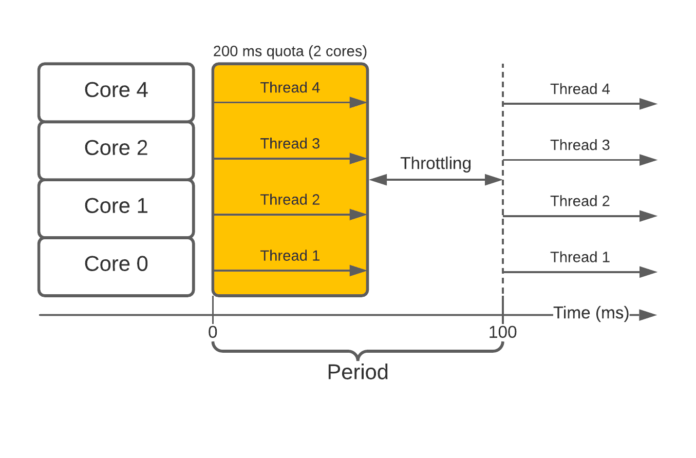
  - Avoiding Throttling Using Cpusets
    - 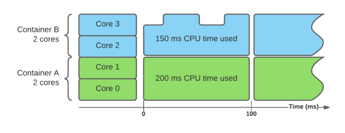
  - Assigning CPUs
    - In order to use cpusets, containers must be bound to cores. Allocating cores correctly requires a bit of background on how modern CPU architectures work since wrong allocation can cause significant performance degradations.
  - Downsides and Limitations
    - While cpusets solve the issue of large tail latencies, there are some limitations and tradeoffs
      - Fractional cores cannot be allocated.
      - System-wide processes can still steal time.
      - Defragmentation is required. 
      - No bursting. 
- [13 种锁的实现方式](https://mp.weixin.qq.com/s/AOshaWGmLw6uw92xKhLAvQ)
  - 悲观锁
    - 使用悲观锁的时候，我们要注意锁的级别
      - MySQL innodb 在加锁时，只有明确的指定主键或（索引字段）才会使用 行锁；否则，会执行 表锁，将整个表锁住，此时性能会很差。
      - 在使用悲观锁时，我们必须关闭 MySQL 数据库的自动提交属性，因为mysql默认使用自动提交模式。
  - 乐观锁
    - 乐观锁不会上锁 只是在 提交更新 时，才会正式对数据的冲突与否进行检测。如果发现冲突了，则返回错误信息，让用户决定如何去做，fail-fast 机制 。否则，执行本次操作。
  - 分布式锁
  - 可重入锁
    - JAVA 中的 ReentrantLock 和 synchronized 都是 可重入锁。可重入锁的一个好处是可一定程度避免死锁。
  - 自旋锁 - CAS 就是采用自旋锁
    - 自旋锁缺点：
      - 可能引发死锁
      - 可能占用 CPU 的时间过长
    - CAS 是由 CPU 支持的原子操作，其原子性是在硬件层面进行控制。
    - CAS 可能导致 ABA 问题，我们可以引入递增版本号来解决。
  - 独享锁 vs 共享锁
    - 独享锁，也有人叫它排他锁。无论读操作还是写操作，只能有一个线程获得锁，其他线程处于阻塞状态。
    - 缺点：读操作并不会修改数据，而且大部分的系统都是 读多写少，如果读读之间互斥，大大降低系统的性能。 共享锁 会解决这个问题。
    - 共享锁是指允许多个线程同时持有锁，一般用在读锁上。读锁的共享锁可保证并发读是非常高效的。读写，写读 ，写写的则是互斥的。独享锁与共享锁也是通过AQS来实现的，通过实现不同的方法，来实现独享或者共享
    - JAVA 中的 ReentrantLock 和 synchronized 都是独享锁
  - 公平锁/非公平锁
    - 公平锁：多个线程按照申请锁的顺序去获得锁，所有线程都在队列里排队，先来先获取的公平性原则。
      - 优点：所有的线程都能得到资源，不会饿死在队列中。
      - 缺点：吞吐量会下降很多，队列里面除了第一个线程，其他的线程都会阻塞，CPU 唤醒下一个阻塞线程有系统开销
    - 非公平锁：多个线程不按照申请锁的顺序去获得锁，而是同时以插队方式直接尝试获取锁，获取不到（插队失败），会进入队列等待（失败则乖乖排队），如果能获取到（插队成功），就直接获取到锁。
      - 优点：可以减少 CPU 唤醒线程的开销，整体的吞吐效率会高点
      - 缺点：可能导致队列中排队的线程一直获取不到锁或者长时间获取不到锁，活活饿死。
    - ReentrantLock 默认是非公平锁，我们可以在构造函数中传入 true，来创建公平锁
  - 可中断锁/不可中断锁
    - 可中断锁：指一个线程因为没有获得锁在阻塞等待过程中，可以中断自己阻塞的状态。
    - 不可中断锁：恰恰相反，如果锁被其他线程获取后，当前线程只能阻塞等待。如果持有锁的线程一直不释放锁，那其他想获取锁的线程就会一直阻塞。
    - 内置锁 synchronized 是不可中断锁，而 ReentrantLock 是可中断锁。
  - 分段锁
    - 分段锁其实是一种锁的设计，目的是细化锁的粒度，并不是具体的一种锁，对于ConcurrentHashMap 而言，其并发的实现就是通过分段锁的形式来实现高效的并发操作
- [如何改进 LRU 算法](https://mp.weixin.qq.com/s/AvxPwQYi78nyfsALgzYNDQ)
  - Question
    - 操作系统在读磁盘的时候，会额外多读一些到内存中，但是最后这些数据没有使用，有什么改善方法么？
    - 批量读数据的时候，可能会把热点数据挤出去，有什么改善方法么？
  - 传统的 LRU 算法存在这两个问题：
    - 「预读失效」导致缓存命中率下降（对应第一个问题）
    - 「缓存污染」导致缓存命中率下降（对应第二个问题）
  - 方案
    - Redis 的缓存淘汰算法则是通过实现 LFU 算法来避免「缓存污染」而导致缓存命中率下降的问题（Redis 没有预读机制）。
    - MySQL 和 Linux 操作系统是通过改进 LRU 算法来避免「预读失效和缓存污染」而导致缓存命中率下降的问题。
  - Linux 和 MySQL 的缓存
    - Linux 操作系统的缓存 - 在应用程序读取文件的数据的时候，Linux 操作系统是会对读取的文件数据进行缓存的，会缓存在文件系统中的 Page Cache
    - MySQL 的缓存 - Innodb 存储引擎设计了一个缓冲池（Buffer Pool），Buffer Pool 属于内存空间里的数据。
      - 当读取数据时，如果数据存在于 Buffer Pool 中，客户端就会直接读取 Buffer Pool 中的数据，否则再去磁盘中读取。
      - 当修改数据时，首先是修改 Buffer Pool 中数据所在的页，然后将其页设置为脏页，最后由后台线程将脏页写入到磁盘。
  - 传统 LRU 是如何管理内存数据的
    - Linux 的 Page Cache 和  MySQL 的 Buffer Pool 缓存的基本数据单位都是页（Page）单位
      - 当访问的页在内存里，就直接把该页对应的 LRU 链表节点移动到链表的头部。
      - 当访问的页不在内存里，除了要把该页放入到 LRU 链表的头部，还要淘汰 LRU 链表末尾的页。
  - 预读失效，怎么办？
    - 什么是预读机制？
      - 应用程序只想读取磁盘上文件 A 的 offset 为 0-3KB 范围内的数据，由于磁盘的基本读写单位为 block（4KB），于是操作系统至少会读 0-4KB 的内容，这恰好可以在一个 page 中装下。
      - 但是操作系统出于空间局部性原理（靠近当前被访问数据的数据，在未来很大概率会被访问到），会选择将磁盘块 offset [4KB,8KB)、[8KB,12KB) 以及 [12KB,16KB) 都加载到内存，于是额外在内存中申请了 3 个 page；
      - 好处就是减少了 磁盘 I/O 次数，提高系统磁盘 I/O 吞吐量。
      - MySQL Innodb 存储引擎的 Buffer Pool 也有类似的预读机制，MySQL 从磁盘加载页时，会提前把它相邻的页一并加载进来，目的是为了减少磁盘 IO。
    - 预读失效会带来什么问题？
      - 如果这些被提前加载进来的页，并没有被访问，相当于这个预读工作是白做了，这个就是预读失效。
      - 如果使用传统的 LRU 算法，就会把「预读页」放到 LRU 链表头部，而当内存空间不够的时候，还需要把末尾的页淘汰掉。
      - 如果这些「预读页」如果一直不会被访问到，就会出现一个很奇怪的问题，不会被访问的预读页却占用了 LRU 链表前排的位置，而末尾淘汰的页，可能是热点数据，这样就大大降低了缓存命中率 。
    - 如何避免预读失效造成的影响？
      - 我们不能因为害怕预读失效，而将预读机制去掉，大部分情况下，空间局部性原理还是成立的。 最好就是让预读页停留在内存里的时间要尽可能的短，让真正被访问的页才移动到 LRU 链表的头部，从而保证真正被读取的热数据留在内存里的时间尽可能长。
      - Linux 操作系统和 MySQL Innodb 通过改进传统 LRU 链表来避免预读失效带来的影响，具体的改进分别如下：**都是将数据分为了冷数据和热数据，然后分别进行 LRU 算法**
        - Linux 操作系统实现两个了 LRU 链表：活跃 LRU 链表（active_list）和非活跃 LRU 链表（inactive_list）；
          - 预读页就只需要加入到 inactive list 区域的头部，当页被真正访问的时候，才将页插入 active list 的头部。如果预读的页一直没有被访问，就会从 inactive list 移除，这样就不会影响 active list 中的热点数据。
        - MySQL 的 Innodb 存储引擎是在一个 LRU 链表上划分来 2 个区域：young 区域 和 old 区域。
          - young 区域在 LRU 链表的前半部分，old 区域则是在后半部分，这两个区域都有各自的头和尾节点
          - 划分这两个区域后，预读的页就只需要加入到 old 区域的头部，当页被真正访问的时候，才将页插入 young 区域的头部。如果预读的页一直没有被访问，就会从 old 区域移除，这样就不会影响 young 区域中的热点数据。
  - 缓存污染，怎么办？
    - 什么是缓存污染
      - 如果还是使用「只要数据被访问一次，就将数据加入到活跃 LRU 链表头部（或者 young 区域）」这种方式的话，那么还存在缓存污染的问题
      - 如果这些大量的数据在很长一段时间都不会被访问的话，那么整个活跃 LRU 链表（或者 young 区域）就被污染了
    - 缓存污染会带来什么问题
      - 缓存污染带来的影响就是很致命的，等这些热数据又被再次访问的时候，由于缓存未命中，就会产生大量的磁盘 I/O，系统性能就会急剧下降。
      - 当某一个 SQL 语句扫描了大量的数据时，在 Buffer Pool 空间比较有限的情况下，可能会将 Buffer Pool 里的所有页都替换出去，导致大量热数据被淘汰了，等这些热数据又被再次访问的时候，由于缓存未命中，就会产生大量的磁盘 I/O，MySQL 性能就会急剧下降。
    - 怎么避免缓存污染造成的影响？
      - 只要我们提高进入到活跃 LRU 链表（或者 young 区域）的门槛，就能有效地保证活跃 LRU 链表（或者 young 区域）里的热点数据不会被轻易替换掉。
      - Linux 操作系统和 MySQL Innodb 存储引擎分别是这样提高门槛的：
        - Linux 操作系统：在内存页被访问第二次的时候，才将页从 inactive list 升级到 active list 里。
        - MySQL Innodb：在内存页被访问第二次的时候，并不会马上将该页从 old 区域升级到 young 区域，因为还要进行停留在 old 区域的时间判断：
          - 如果第二次的访问时间与第一次访问的时间在 1 秒内（默认值），那么该页就不会被从 old 区域升级到 young 区域；
          - 如果第二次的访问时间与第一次访问的时间超过 1 秒，那么该页就会从 old 区域升级到 young 区域；
- [CPU 是如何与内存交互的](https://mp.weixin.qq.com/s/G8zzNuQUWWlwzrWZxcM36A)
  - 概述
    - 在计算机中，主要有两大存储器 SRAM 和 DRAM。
      - 主存储器是由 DRAM 实现的，也就是我们常说的内存
        - 在 DRAM 中存储单元使用电容保存电荷的方式来存储数据，电容会不断漏电，所以需要定时刷新充电，才能保持数据不丢失，这也是被称为“动态”存储器的原因
      - 在 CPU 里通常会有 L1、L2、L3 这样三层高速缓存是用 SRAM 实现的
        - 每个 CPU 核心都有一块属于自己的 L1 高速缓存，通常分成指令缓存和数据缓存，分开存放 CPU 使用的指令和数据。
        - L2 的 Cache 同样是每个 CPU 核心都有的，不过它往往不在 CPU 核心的内部。所以，L2 cache 的访问速度会比 L1 稍微慢一些。
        - 而 L3 cache ，则通常是多个 CPU 核心共用的。On Intel architectures the L3 cache maintains a copy of what is in L1 and L2
    - 速度：
      - L1 的存取速度：4 个CPU时钟周期
      - L2 的存取速度： 11 个CPU时钟周期
      - L3 的存取速度：39 个CPU时钟周期
      - DRAM内存的存取速度：107 个CPU时钟周期
  - CPU cache
    - cache 读写操作
      - 读操作，cache 在初始状态的时候是空的，这个时候去读数据会产生 cache 缺失（cache miss）。cache 控制器会检测到缺失的发生，然后从主存中（或低一级 cache）中取回所需数据。如果命中，那么就会直接使用。
      - 写操作，因为 cache 是由多级组成，所以写策略一般而言有两种：写直达（write-through）和写回（write-back）。通过这两种策略使在 cache 中写入的数据和主存中的数据保持一致。
    - 一致性与MESI协议
      - 由于现在都是多核 CPU，并且 cache 分了多级，并且数据存在共享的情况，所以需要一种机制保证在不同的核中看到的 cache 数据必须时一致的。最常用来处理多核 CPU 之间的缓存一致性协议就是 MESI 协议。
      - MESI 协议，是一种叫作写失效（Write Invalidate）的协议。在写失效协议里，只有一个 CPU 核心负责写入数据，其他的核心，只是同步读取到这个写入。在这个 CPU 核心写入 cache 之后，它会去广播一个“失效”请求告诉所有其他的 CPU 核心。
      - Cache一致性主要有两种策略
        - 基于监听的一致性策略
          - 这种策略是所有Cache均监听各Cache的写操作，如果一个Cache中的数据被写了，有两种处理办法。
            - 写更新协议：某个Cache发生写了，就索性把所有Cache都给更新了。
            - 写失效协议：某个Cache发生写了，就把其他Cache中的该数据块置为无效。
          - 基于目录的一致性策略
            - 这种策略是在主存处维护一张表。记录各数据块都被写到了哪些Cache, 从而更新相应的状态。一般来讲这种策略采用的比较多。又分为下面几个常用的策略。
              - SI: 对于一个数据块来讲，有share和invalid两种状态。如果是share状态，直接通知其他Cache, 将对应的块置为无效。
              - MSI：对于一个数据块来讲，有share和invalid，modified三种状态。其中modified状态表表示该数据只属于这个Cache, 被修改过了。当这个数据被逐出Cache时更新主存。这么做的好处是避免了大量的主从写入。同时，如果是invalid时写该数据，就要保证其他所有Cache里该数据的标志位不为M，负责要先写回主存储。
              - MESI：对于一个数据来讲，有4个状态。modified, invalid, shared, exclusive。其中exclusive状态用于标识该数据与其他Cache不依赖。要写的时候直接将该Cache状态改成M即可。
      - [CPU缓存一致性协议MESI](https://mp.weixin.qq.com/s/H4dZpCyObYXsiDxPkVh-aA)
        - CPU
          - 局部性原理
            - 时间局部性（Temporal Locality）：如果一个信息项正在被访问，那么在近期它很可能还会被再次访问。 - 比如循环、递归、方法的反复调用等。
            - 空间局部性（Spatial Locality）：如果一个存储器的位置被引用，那么将来他附近的位置也会被引用。 - 比如顺序执行的代码、连续创建的两个对象、数组等。
        - 带有高速缓存的CPU
        - 多核CPU的情况下有多个一级缓存，如何保证缓存内部数据的一致,不让系统数据混乱。这里就引出了一个一致性的协议MESI
        - MESI协议
          - M：Modified，修改状态，表示该缓存行的数据已被修改，和内存中的数据不一致，只存在于当前CPU的缓存中。
          - E：Exclusive，独占状态，表示该缓存行的数据只存在于当前CPU的缓存中，和内存中的数据一致。
          - S：Shared，共享状态，表示该缓存行的数据和内存中的数据一致，且可能存在于其他CPU的缓存中。
          - I：Invalid，无效状态，表示该缓存行的数据已失效，和内存中的数据不一致，且不允许被访问。
          - 一般情况下，CPU的缓存行都是以S状态存在的，当CPU要修改某个缓存行的数据时，会先将该缓存行的状态置为M，然后再修改数据，最后再将该缓存行的状态置为S，这样就保证了缓存行的数据一致性。
          - 当CPU要读取某个缓存行的数据时，会先检查该缓存行的状态，如果是S或E状态，则直接读取数据，如果是M状态，则先将该缓存行的数据写回内存，然后再读取数据，最后再将该缓存行的状态置为S。
          - 当CPU要修改某个缓存行的数据时，会先检查该缓存行的状态，如果是S状态，则将该缓存行的状态置为M，然后再修改数据，最后再将该缓存行的状态置为S，如果是E状态，则直接修改数据，最后再将该缓存行的状态置为S。
          - 当CPU要读取某个缓存行的数据时，会先检查该缓存行的状态，如果是S或E状态，则直接读取数据，如果是M状态，则先将该缓
        - MESI优化和他们引入的问题
          - 缓存的一致性消息传递是要时间的，这就使其切换时会产生延迟。当一个缓存被切换状态时其他缓存收到消息完成各自的切换并且发出回应消息这么一长串的时间中CPU都会等待所有缓存响应完成。可能出现的阻塞都会导致各种各样的性能问题和稳定性问题。
          - CPU切换状态阻塞解决-存储缓存（Store Bufferes）
            - 为了避免这种CPU运算能力的浪费，Store Bufferes被引入使用。处理器把它想要写入到主存的值写到缓存，然后继续去处理其他事情。当所有失效确认（Invalidate Acknowledge）都接收到时，数据才会最终被提交。
              这么做有两个风险
            - 第一、就是处理器会尝试从存储缓存（Store buffer）中读取值，但它还没有进行提交。这个的解决方案称为Store Forwarding，它使得加载的时候，如果存储缓存中存在，则进行返回。
            - 第二、保存什么时候会完成，这个并没有任何保证
          - CPU切换状态阻塞解决-写回缓存（Write Back Buffers）
          - 硬件内存模型
            - 即便是这样处理器已然不知道什么时候优化是允许的，而什么时候并不允许。 干脆处理器将这个任务丢给了写代码的人。这就是内存屏障（Memory Barriers）
  - 虚拟内存
    - 虚拟内存映射
      - 程序并不能直接访问物理内存。程序都是通过虚拟地址 VA（virtual address）用地址转换翻译成 PA 物理地址（physical address）才能获取到数据。也就是说 CPU 操作的实际上是一个虚拟地址 VA
      - CPU 访问主存的时候会将一个虚拟地址（virtual address）被内存管理单元（Memory Management Unint, MMU）进行翻译成物理地址 PA（physical address） 才能访问。
    - TLB 加速地址转换
      - CPU生成一个虚拟地址，并把它传给 MMU；
      - MMU生成页表项地址 PTEA，并从高速缓存/主存请求获取页表项 PTE；
      - 高速缓存/主存向 MMU 返回 PTE；
      - MMU 构造物理地址 PA，并把它传给高速缓存/主存；
      - 高速缓存/主存返回所请求的数据给CPU。
    - 加的这一层就是缓存芯片 TLB （Translation Lookaside Buffer），它里面每一行保存着一个由单个 PTE 组成的块。
      - 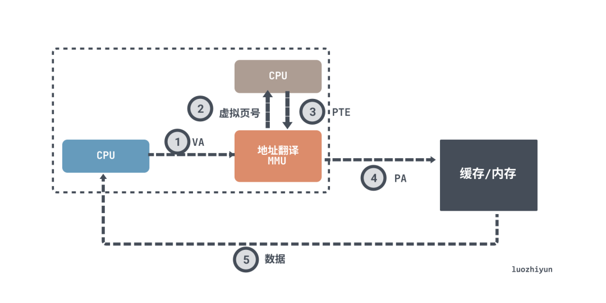
  - 为什么需要虚拟内存
    - 由于操作虚拟内存实际上就是操作页表，从上面讲解我们知道，页表的大小其实和物理内存没有关系，当物理内存不够用时可以通过页缺失来将需要的数据置换到内存中，内存中只需要存放众多程序中活跃的那部分，不需要将整个程序加载到内存里面，这可以让小内存的机器也可以运行程序。
    - 虚拟内存可以为正在运行的进程提供独立的内存空间，制造一种每个进程的内存都是独立的假象。虚拟内存空间只是操作系统中的逻辑结构，通过多层的页表结构来转换虚拟地址，可以让多个进程可以通过虚拟内存共享物理内存。
    - 并且独立的虚拟内存空间也会简化内存的分配过程，当用户程序向操作系统申请堆内存时，操作系统可以分配几个连续的虚拟页，但是这些虚拟页可以对应到物理内存中不连续的页中。
    - 再来就是提供了内存保护机制。任何现代计算机系统必须为操作系统提供手段来控制对内存系统的访问。虚拟内存中页表中页存放了读权限、写权限和执行权限。内存管理单元可以决定当前进程是否有权限访问目标的物理内存，这样我们就最终将权限管理的功能全部收敛到虚拟内存系统中，减少了可能出现风险的代码路径。
- [Linux 中断（ IRQ / softirq ）基础](https://mp.weixin.qq.com/s/zzSKp4eyyMaPZsTPwy6miw)
  - 什么是中断
    - CPU 通过时分复用来处理很多任务，这其中包括一些硬件任务，例如磁盘读写、键盘输入，也包括一些软件任务，例如网络包处理。在任意时刻，一个 CPU 只能处理一个任务。当某个硬件或软件任务此刻没有被执行，但它希望 CPU 来立即处理时，就会给 CPU 发送一个中断请求
    - 中断（Interrupt）通常被定义为一个事件，改事件将会改变处理器执行的指令顺序。此类事件对应于 CPU 芯片内外部的硬件电路产生的电信号。
    - 中断通常分为同步（synchronous）中断和异步（asynchronous）中断：
      - 同步中断是当指令执行时由 CPU 控制单元产生的，之所以称为同步，是因为只有在一条指令终止执行后 CPU 才会发出中断。
      - 异步中断是由其他硬件设备依照 CPU 时钟信号随机产生的。异常是由程序的错误产生的，或者是由内核必须处理的异常条件产生的
    - 在Intel微处理器手册中，把同步和异步中断分别称为异常（exception）和中断（interrupt）。
  - 硬中断
    - 收到中断事件后的处理流程：
      - 抢占当前任务：内核必须暂停正在执行的进程；
      - 执行中断处理函数：找到对应的中断处理函数，将 CPU 交给它（执行）；
      - 中断处理完成之后：第 1 步被抢占的进程恢复执行。
    - 问题：执行足够快 vs 逻辑比较复杂
      - IRQ handler 的两个特点：
        - 执行要非常快，否则会导致事件（和数据）丢失；
        - 需要做的事情可能非常多，逻辑很复杂，例如收包
    - 解决方式：延后中断处理（deferred interrupt handling）
      - 传统上，解决这个内在矛盾的方式是将中断处理分为两部分：
        - top half
        - bottom half
      - 这种方式称为中断的推迟处理或延后处理。以前这是唯一的推迟方式，但现在不是了。现在已经是个通用术语，泛指各种推迟执行中断处理的方式。按这种方式，中断会分为两部分：
        - 第一部分：只进行最重要、必须得在硬中断上下文中执行的部分；剩下的处理作为第二部分，放入一个待处理队列；
        - 第二部分：一般是调度器根据轻重缓急来调度执行，不在硬中断上下文中执行。
      - Linux 中的三种推迟中断（deferred interrupts）：
        - softirq - softirq 和 tasklet 依赖软中断子系统，运行在软中断上下文中
          - Linux 在每个 CPU 上会创建一个 ksoftirqd 内核线程。
          - softirqs 是在 Linux 内核编译时就确定好的，例外网络收包对应的 NET_RX_SOFTIRQ 软中断。因此是一种静态机制。如果想加一种新 softirq 类型，就需要修改并重新编译内核。
        - tasklet
          - tasklet 是可以在运行时（runtime）创建和初始化的 softirq
        - workqueue - workqueue 不依赖软中断子系统，运行在进程上下文中
          - 与 tasklet 有点类似，但也有很大不同。
            - tasklet 是运行在 softirq 上下文中；
            - workqueue 运行在内核进程上下文中；这意味着 wq 不能像 tasklet 那样是原子的；
            - tasklet 永远运行在指定 CPU，这是初始化时就确定了的；
            - workqueue 默认行为也是这样，但是可以通过配置修改这种行为。
          - kworker 线程调度 workqueues，原理与 ksoftirqd 线程调度 softirqs 一样。但是我们可以为 workqueue 创建新的线程，而 softirq 则不行。
  - 软中断
    - 软中断子系统 一个内核子系统
      - 每个 CPU 上会初始化一个 ksoftirqd 内核线程，负责处理各种类型的 softirq 中断事件； - 用 cgroup ls 或者 ps -ef 都能看到
      - 软中断事件的 handler 提前注册到 softirq 子系统， 注册方式 open_softirq(softirq_id, handler)
      - 软中断占 CPU 的总开销：可以用 top 查看，里面 si 字段就是系统的软中断开销（第三行倒数第二个指标）
    - 避免软中断占用过多 CPU
      - 软中断方式的潜在影响：推迟执行部分（比如 softirq）可能会占用较长的时间，在这个时间段内， 用户空间线程只能等待。反映在 top 里面，就是 si 占比
      - 不过 softirq 调度循环对此也有改进，通过 budget 机制来避免 softirq 占用过久的 CPU 时间。
    - 硬中断 -> 软中断 调用栈
      - softirq 是一种推迟中断处理机制，将 IRQ 的大部分处理逻辑推迟到了这里执行。两条路径都会执行到 softirq 主处理逻辑 __do_softirq()
      - CPU 调度到 ksoftirqd 线程时，会执行到 __do_softirq()
- [Linux CPU 上下文切换的故障排查](https://mp.weixin.qq.com/s/eV_yJ0IKRHTpsh0xuGAfkQ)
  - CPU 上下文切换是保证 Linux 系统正常运行的核心功能。可分为进程上下文切换、线程上下文切换和中断上下文切换。
  - 检查 CPU 的上下文切换
    - `vmstat 5`
      - cs（context switch）：每秒上下文切换的次数。
      - in（interrupt）：每秒的中断数。
      - r（running | runnable）：就绪队列的长度，即正在运行和等待 CPU 的进程数。
      - b（blocked）：处于不间断睡眠状态的进程数。
    - vmstat 工具只给出了系统的整体上下文切换的信息。要查看每个进程的详细信息，您需要使用 pidstat。添加 -w 选项，您可以看到每个进程的上下文切换：
      - 自愿上下文切换：指进程无法获得所需资源而导致的上下文切换。例如，当 I/O 和内存等系统资源不足时，就会发生自愿上下文切换。
      - 非自愿上下文切换：指进程因时间片已过期而被系统强制重新调度时发生的上下文切换。例如，当大量进程竞争 CPU 时，很容易发生非自愿的上下文切换。
  - 中断
    - 要找出中断数量也很高的原因所在，您可以检查 /proc/interrupts 文件。该文件会提供一个只读的中断使用情况。
- [从 Linux 内核角度探秘文件读写本质](https://mp.weixin.qq.com/s/qUXaa8ld5YQkIzXIlR6g_g)
  - 内核将文件的 IO 操作根据是否使用内存（页高速缓存 page cache）做磁盘热点数据的缓存，将文件 IO 分为：Buffered IO 和 Direct IO 两种类型。
    - Buffered IO
      - 大部分文件系统默认的文件 IO 类型为 Buffered IO，当进程进行文件读取时，内核会首先检查文件对应的页高速缓存 page cache 中是否已经缓存了文件数据，如果有则直接返回，如果没有才会去磁盘中去读取文件数据，而且还会根据非常精妙的预读算法来预先读取后续若干文件数据到 page cache 中
      - 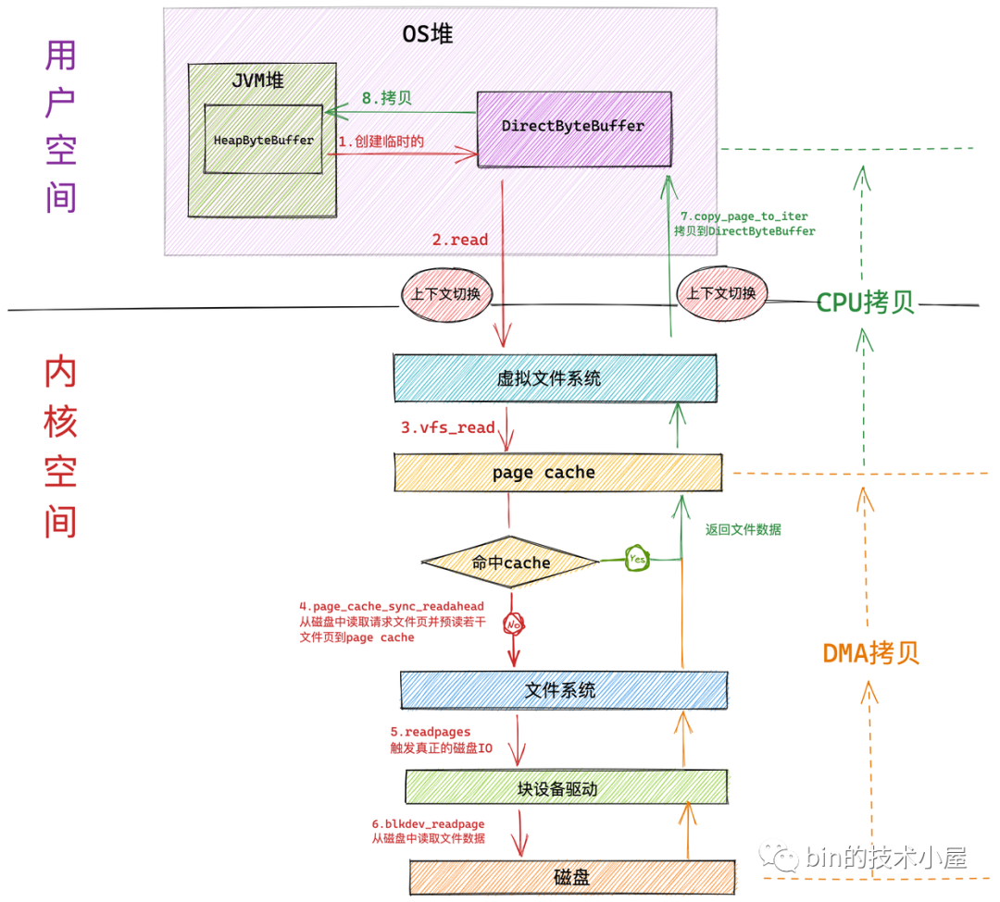
      - 我们看到如果使用 HeapByteBuffer 进行 NIO 文件读取的整个过程中，一共发生了 两次上下文切换和三次数据拷贝，如果请求的数据命中 page cache 则发生两次数据拷贝省去了一次磁盘的 DMA 拷贝。
    - Direct IO
      - cases
        - 但是有些情况，我们并不需要 page cache。比如一些高性能的数据库应用程序，它们在用户空间自己实现了一套高效的高速缓存机制，以充分挖掘对数据库独特的查询访问性能。所以这些数据库应用程序并不希望内核中的 page cache起作用。否则内核会同时处理 page cache 以及预读相关操作的指令，会使得性能降低
        - 当我们在随机读取文件的时候，也不希望内核使用 page cache。因为这样违反了程序局部性原理，当我们随机读取文件的时候，内核预读进 page cache 中的数据将很久不会再次得到访问，白白浪费 page cache 空间不说，还额外增加了预读的磁盘 IO。
      - 
      - 从整个 Direct IO 的过程中我们看到，一共发生了两次上下文的切换，两次的数据拷贝。
- [CPU 与 GPU 到底有什么区别](https://mp.weixin.qq.com/s/jPh5o5LXDWi7WogyN6AHvQ)
  - CPU和GPU的最大不同在于架构。
    - CPU适用于广泛的应用场景(学识渊博)，可以执行任意程序。
    - CPU内部cache以及控制部分占据了很大一部分片上面积，因此计算单元占比很少。
    - GPU则专为多任务而生，并发能力强，具体来讲就是多核，GPU则可能会有成百上千核：
    - GPU只有很简单的控制单元，剩下的大部分都被计算单元占据，因此CPU的核数有限，而GPU则轻松堆出上千核：
  - 奇怪的工作方式
    - 对CPU来说，不同的核心可以执行不同的机器指令 - MIMD，(Multiple Instruction, Multiple Data)
    - GPU上的这些核心必须整齐划一的运行相同的机器指令，只是可以操作不同的数据。- SIMD，(Single Instruction, Multiple Data)
    - GPU的定位非常简单，就是纯计算，GPU绝不是用来取代CPU的，CPU只是把一些GPU非常擅长的事情交给它，GPU仅仅是用来分担CPU工作的配角。
    - 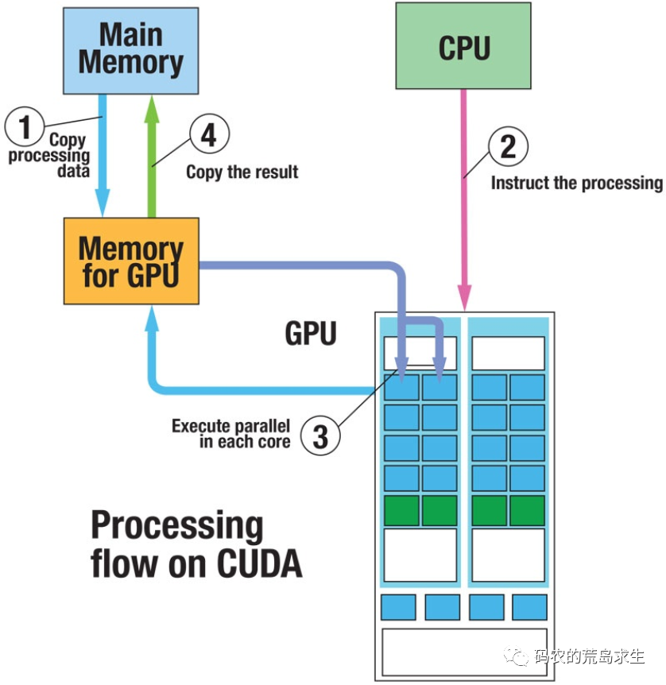
    - GPU的计算场景是这样的：1)计算简单；2）重复计算。
  - [CPU和GPU介绍](https://mp.weixin.qq.com/s/YoJHG8j9N_xDV3JT7fqFYQ)
    - 
- [计算机系统中的异常 & 中断](https://mp.weixin.qq.com/s/8Plas3j-e5bavs8xvb_tmQ)
  - 中断和异常可以归结为一种事件处理机制，通过中断或异常发出一个信号，然后操作系统会打断当前的操作，然后根据信号找到对应的处理程序处理这个中断或异常，处理完毕之后再根据处理结果是否要返回到原程序接着往下执行。
  - An interrupt is an asynchronous event that is typically triggered by an I/O device.
    - 中断理解为是一个被 I/O 设备触发的异步事件，例如用户的键盘输入。它是一种电信号，由硬件设备生成，然后通过中断控制器传递给 CPU，CPU 有两个特殊的引脚 NMI 和 INTR 负责接收中断信号。
    - 异步意味着中断能够在指令之间发生
  - An exception is a synchronous event that is generated when the processor detects one or more predefined conditions while executing an instruction. 
    - 异常是一个同步的事件，通常由程序的错误产生的，或是由内核必须处理的异常条件产生的，如缺页异常或 syscall 等。异常可以分为错误、陷阱、终止。
    - 同步是因为只有在一条指令执行完毕后 CPU 才会发出中断，而不是发生在代码指令执行期间，比如系统调用
  - 系统调用 system call
    - 在 Linux 上，每个系统调用被赋予了一个系统调用号，内核记录了系统调用表中的所有已注册过的系统调用的列表，存储在 sys_call_table 中。因为所有系统调用陷入内核方式都一样，所以系统调用号会通过 eax 寄存器传递给内核。在陷入内核之前，用户空间就把相应的系统调用所对应的号放入 eax 中。
    - 应用程序代码调用系统调用( read )，该函数是一个包装系统调用的 库函数 ；
    - 库函数 ( read )负责准备向内核传递的参数，并触发 异常中断 以切换到内核；
    - CPU 被 中断 打断后，执行 中断处理函数 ，即 系统调用处理函数 ( system_call )；
    - 系统调用处理函数 调用 系统调用服务例程 ( sys_read )，真正开始处理该系统调用；
  - 上下文切换 context switch
    - 上下文切换是一种较高层形式的异常控制流，操作系统通过它来实现多任务。也就是说上下文切换实际上是建立在较低的异常机制之上的。
    - 内核通过调度器（scheduler）来控制当前进程是否可以被抢占，如果被抢占那么内核会选择一个新的进程运行，将旧进程的上下文保存起来，并恢复新进程的上下文，然后将控制转交给新进程，这就是上下文切换。
  - 信号
    - 信号是一种软件形式的异常，它允许进程和内核中断其他进程，可以通知进程系统中发生了一个某种类型的事件
    - 进程从内核模式切换到用户模式时，会检查进程中未被阻塞的待处理信号的集合（pending & ~blocked），如果这个集合为空，那么内核将控制传递到进程的下一条指令（I_next）；如果是非空，那么内核选择集合中某个信号 k （通常是最小的 k）强制进程接收，然后进程会根据信号触发某种行为，完成之后会回到控制流中执行下一个指令（I_next）
- [Linux mutex](https://mp.weixin.qq.com/s/pvlfdH1orO5JV4cqRB3WRQ)
  - 互斥锁（英语：Mutual exclusion，缩写 Mutex）是一种用于多线程编程中，防止两条线程同时对同一公共资源（比如全域变量）进行读写的机制。
  - mutex与spinlock的区别？
    - spinlock是让一个尝试获取它的线程在一个循环中等待的锁，线程在等待时会一直查看锁的状态。而mutex是一个可以让多个进程轮流分享相同资源的机制
    - spinlock通常短时间持有，mutex可以长时间持有
    - spinlock任务在等待锁释放时不可以睡眠，mutex可以
  - 实现
    - mutex使用了原子变量owner来追踪锁的状态，owner实际上是指向当前mutex锁拥有者的struct task_struct *指针，所以当锁没有被持有时，owner为NULL。
    - 上锁
      - fastpath：通过 cmpxchg() 当前任务与所有者来尝试原子性的获取锁。这仅适用于无竞争的情况（cmpxchg() 检查 0UL，因此上面的所有 3 个状态位都必须为 0）。如果锁被争用，它会转到下一个可能的路径。
      - midpath：又名乐观旋转（optimistic spinning）—在锁的持有者正在运行并且没有其他具有更高优先级（need_resched）的任务准备运行时，通过旋转来获取锁。理由是如果锁的所有者正在运行，它很可能很快就会释放锁。mutex spinner使用 MCS 锁排队，因此只有一个spinner可以竞争mutex。
        - MCS 锁（由 Mellor-Crummey 和 Scott 提出）是一个简单的自旋锁，具有公平的理想属性，每个 cpu 都试图获取在本地变量上旋转的锁，排队采用的是链表实现的FIFO。它避免了常见的test-and-set自旋锁实现引起的昂贵的cacheline bouncing。类似MCS的锁是专门为睡眠锁的乐观旋转而量身定制的（毕竟如果只是短暂的自旋比休眠效率要高）。
        - 自定义 MCS 锁的一个重要特性是它具有额外的属性，即当spinner需要重新调度时，它们能够直接退出 MCS 自旋锁队列。这有助于避免需要重新调度的 MCS spinner持续在mutex持有者上自旋，而仅需直接进入慢速路径获取MCS锁。
      - slowpath：最后的手段，如果仍然无法获得锁，则将任务添加到等待队列并休眠，直到被解锁路径唤醒。在正常情况下它阻塞为 TASK_UNINTERRUPTIBLE。
- [Linux Fork](https://mp.weixin.qq.com/s/pV0hEJMhFutwapZR90jI8w)
  - fork 函数实现过程
    - 进程都是由其他进程创建出来的，每个进程都有自己的PID（进程标识号），在 Linux 系统的进程之间存在一个继承关系，所有的进程都是 init 进程（1号进程）的后代
    - fork 函数是创建子进程的一种方法，它是一个系统调用函数，所以在看 fork 系统调用之前我们先来看看 system_call. 系统调用处理函数 system_call 与 int 0x80 中断描述符表挂接。
    - 系统调用被调用后会触发 int 0x80 软中断，然后由用户态切换到内核态（从用户进程的3特权级翻转到内核的0特权级），通过 IDT 找到系统调用端口，调用具体的系统调用函数来处理事物，处理完毕之后再由 iret 指令回到用户态继续执行原来的逻辑。
  - 写时复制 
    - fork 函数调用之后，这个时候因为Copy-On-Write（COW） 的存在父子进程实际上是共享物理内存的，并没有直接去拷贝一份，kernel 把会共享的所有的内存页的权限都设为 read-only。当父子进程都只读内存，然后执行 exec 函数时就可以省去大量的数据复制开销。
    - 当其中某个进程写内存时，内存管理单元 MMU 检测到内存页是 read-only 的，于是触发缺页异常（page-fault），处理器会从中断描述符表（IDT）中获取到对应的处理程序。
    - 在中断程序中，kernel就会把触发的异常的页复制一份，于是父子进程各自持有独立的一份，之后进程再修改对应的数据。
    - COW的缺点，如果父子进程都需要进行大量的写操作，会产生大量的缺页异常（page-fault）也就是说缺页异常会导致上下文切换，然后查询 copy 数据到新的物理页这么个过程，如果在分配新的物理页的时候发现内存不够，那么还需要进行 swap ，执行相应的淘汰策略，然后进行新页的替换。所以在 fork 之后要避免大量的写操作。
- [Linux Pipeline](https://mp.weixin.qq.com/s/a1w9lyi4Gu15F1o7gtgiXA)
  - Linux 管道是一个环形缓冲区，保存对数据写入和读取的页面的引用
  - 当我们要在管道中移动数据时，Linux 包含系统调用以加快速度，而无需复制。具体而言：
    - splice 将数据从管道移动到文件描述符，反之亦然；
    - vmsplice 将数据从用户内存移动到管道中。
  - [source](https://mazzo.li/posts/fast-pipes.html)
- [CPU](https://mp.weixin.qq.com/s/G6vljRX_gq5w-1xzj8jHjA)
- [Command Line Debug](https://mp.weixin.qq.com/s/mqeYsfvW0VRDTPkav7W2Kw)
  - top
    - 当 user 占用率过高的时候，通常是某些个别的进程占用了大量的 CPU，这时候很容易通过 top 找到该程序；此时如果怀疑程序异常，可以通过 perf 等思路找出热点调用函数来进一步排查；
    - 当 system 占用率过高的时候，如果 IO 操作(包括终端 IO)比较多，可能会造成这部分的 CPU 占用率高，比如在 file server、database server 等类型的服务器上，否则(比如>20%)很可能有些部分的内核、驱动模块有问题；
    - 当 nice 占用率过高的时候，通常是有意行为，当进程的发起者知道某些进程占用较高的 CPU，会设置其 nice 值确保不会淹没其他进程对 CPU 的使用请求；
    - 当 iowait 占用率过高的时候，通常意味着某些程序的 IO 操作效率很低，或者 IO 对应设备的性能很低以至于读写操作需要很长的时间来完成；
    - 当 irq/softirq 占用率过高的时候，很可能某些外设出现问题，导致产生大量的irq请求，这时候通过检查 /proc/interrupts 文件来深究问题所在；
    - 当 steal 占用率过高的时候，黑心厂商虚拟机超售了吧
  - vmstat
  - pidstat
    - 如果想对某个进程进行全面具体的追踪，没有什么比 pidstat 更合适的了——栈空间、缺页情况、主被动切换等信息尽收眼底。这个命令最有用的参数是-t，可以将进程中各个线程的详细信息罗列出来
  - mpstat -P ALL 1
    - 如果想直接监测某个进程占用的资源，既可以使用top -u taozj的方式过滤掉其他用户无关进程，也可以采用下面的方式进行选择，ps命令可以自定义需要打印的条目信息：
  - sar
    - 网络性能对于服务器的重要性不言而喻，工具 iptraf 可以直观的现实网卡的收发速度信息，比较的简洁方便通过 sar -n DEV 1 也可以得到类似的吞吐量信息
    - sar 这个工具太强大了，什么 CPU、磁盘、页面交换啥都管，这里使用 -n 主要用来分析网络活动
  - [For More Commands](https://www.jianshu.com/p/0bbac570fa4c)
- [网卡的 Ring Buffer ](https://mp.weixin.qq.com/s/v_1QdF3Fmloln0P2xbo4-w)
  - 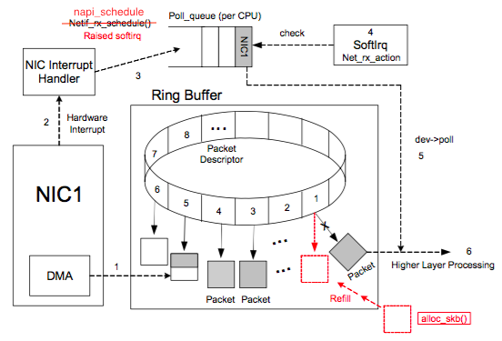
    - DMA 将 NIC 接收的数据包逐个写入 sk_buff ，一个数据包可能占用多个 sk_buff , sk_buff 读写顺序遵循FIFO（先入先出）原则。
    - DMA 读完数据之后，NIC 会通过 NIC Interrupt Handler 触发 IRQ （中断请求）。
    - NIC driver 注册 poll 函数
    - poll 函数对数据进行检查，例如将几个 sk_buff 合并，因为可能同一个数据可能被分散放在多个 sk_buff 中
    - poll 函数将 sk_buff 交付上层网络栈处理。
  - 多 CPU 下的 Ring Buffer 处理
    - 在多核 CPU 的服务器上，网卡内部会有多个 Ring Buffer，NIC 负责将传进来的数据分配给不同的 Ring Buffer，同时触发的 IRQ 也可以分配到多个 CPU 上，这样存在多个 Ring Buffer 的情况下 Ring Buffer 缓存的数据也同时被多个 CPU 处理，就能提高数据的并行处理能力。
    - 要实现“NIC 负责将传进来的数据分配给不同的 Ring Buffer”，NIC 网卡必须支持 Receive Side Scaling(RSS) 或者叫做 multiqueue 的功能。
  - CMD
    - `$ ethtool -S em1 | more` 网卡收到的数据包统计
    - 带有 drop 字样的统计和 fifo_errors 的统计 `$ethtool -S em1 | grep -iE "error|drop"`
    - 查询 Ring Buffer 大小 `ethtool -g em1`
    - 调整 Ring Buffer 队列数量 `ethtool -l em1`
    - 调整 Ring Buffer 队列的权重 ` ethtool -x em1`
      - NIC 如果支持 mutiqueue 的话 NIC 会根据一个 Hash 函数对收到的数据包进行分发
- [Question]
  - 操作系统保护模式和实模式
    - 问题的目的，是为了引出虚拟内存
    - 实模式将整个物理内存看成分段的区域，程序代码和数据位于不同区域，系统程序和用户程序并没有区别对待，而且每一个指针都是指向实际的物理地址
      - 随着软件的发展，1M的寻址空间已经远远不能满足实际的需求了。最后，对处理器多任务支持需求也日益紧迫，所有这些都促使新技术的出现。
    - 为了克服实模式下的内存非法访问问题，并满足飞速发展的内存寻址和多任务需求，处理器厂商开发出保护模式
      - 在保护模式中，除了内存寻址空间大大提高；提供了硬件对多任务的支持；
      - 物理内存地址也不能直接被程序访问，程序内部的地址(虚拟地址)要由操作系统转化为物理地址去访问，程序对此一无所知
      - 进程(程序的运行态)有了严格的边界，任何其他进程根本没有办法访问不属于自己的物理内存区域，甚至在自己的虚拟地址范围内也不是可以任意访问的，因为有一些虚拟区域已经被放进一些公共系统运行库。
  - 虚拟内存，它的内存布局
    - 代码段，包括二进制可执行代码；
    - 数据段，包括已初始化的静态常量和全局变量；
    - BSS 段，包括未初始化的静态变量和全局变量；
    - 堆段，包括动态分配的内存，从低地址开始向上增长；
    - 文件映射段，包括动态库、共享内存等，从低地址开始向上增长。
    - 栈段，包括局部变量和函数调用的上下文等。栈的大小是固定的，一般是 8 MB。当然系统也提供了参数，以便我们自定义大小
  - 怎么申请堆空间
    - malloc 申请内存的时候，会有两种方式向操作系统申请堆内存。
      - 方式一：通过 brk() 系统调用从堆分配内存
      - 方式二：通过 mmap() 系统调用在文件映射区域分配内存；
  - 线程和协程
    - 进程可以理解为一个动态的程序，进程是操作系统资源分配的基本单位，
    - 而线程是操作系统调度的基本单位，进程独占一个虚拟内存空间，而进程里的线程共享一个进程虚拟内存空间。线程的粒度更小
    - 协程可以理解为用户态线程
      - 大小，协程到校为2k，可以动态扩容，而线程大小为2m,协程更轻量
      - 线程切换需要用户态到内核态的切换，而协程的切换不用，只在用户态完成，切换消耗更小
      - 线程的调度由操作系统完成，而协程的调度有运行时的调度器完成
- vDSO机制
  - 什么是 vDSO
    - 对于少量频繁调用的系统调用（比如获取当期系统时间）来说，是否可以某种安全的方式开放到用户空间，让用户直接访问而不需要经过 syscall 呢？
    - vDSO 全称为 virtual dynamic shared object，dynamic shared object 这个名词大家应该有所耳闻，就是 Linux 下的动态库的全称，而 virtual 表明，这个动态库是通过某种手段虚拟出来的，并不真正存在于 Linux 文件系统中。
    - 通过 vDSO，进程访问一些系统提供的 API，就可以直接在自己的地址空间访问，而不需要进行用户-内核态的状态切换了
- RCU无锁
  - RCU锁本质是用空间换时间，是对读写锁的一种优化加强，但不仅仅是这样简单，RCU体现出来的垃圾回收思想
  - 如何正确有效的保护共享数据 常的手段就是同步。同步可分为阻塞型同步（Blocking Synchronization）和非阻塞型同步（ Non-blocking Synchronization）。
    - 阻塞型同步
      - 指当一个线程到达临界区时，因另外一个线程已经持有访问该共享数据的锁，从而不能获取锁资源而阻塞（睡眠），直到另外一个线程释放锁
      - 如果同步方案采用不当，就会造成死锁（deadlock），活锁（livelock）和优先级反转（priority inversion），以及效率低下等现象
    - 非阻塞型同步
      - Wait-free（无等待）
        - Wait-free 是指任意线程的任何操作都可以在有限步之内结束，而不用关心其它线程的执行速度。Wait-free 是基于 per-thread 的，可以认为是 starvation-free 的
      - Lock-free（无锁）
        - Lock-Free是指能够确保执行它的所有线程中至少有一个能够继续往下执行。由于每个线程不是 starvation-free 的，即有些线程可能会被任意地延迟，然而在每一步都至少有一个线程能够往下执行，因此系统作为一个整体是在持续执行的，可以认为是 system-wide 的
          - Atomic operation
          - Spin Lock（自旋锁）是一种轻量级的同步方法，一种非阻塞锁。当 lock 操作被阻塞时，并不是把自己挂到一个等待队列，而是死循环 CPU 空转等待其他线程释放锁
          - Seqlock (顺序锁) 是Linux 2.6 内核中引入一种新型锁，它与 spin lock 读写锁非常相似，只是它为写者赋予了较高的优先级。也就是说，即使读者正在读的时候也允许写者继续运行，读者会检查数据是否有更新，如果数据有更新就会重试，因为 seqlock 对写者更有利，只要没有其他写者，写锁总能获取成功。
          - RCU(Read-Copy Update)，顾名思义就是读-拷贝修改，它是基于其原理命名的。
            - 对于被RCU保护的共享数据结构，读者不需要获得任何锁就可以访问它，
            - 但写者在访问它时首先拷贝一个副本，然后对副本进行修改，最后使用一个回调（callback）机制在适当的时机把指向原来数据的指针替换为新的被修改的数据
      - Obstruction-free（无障碍
        - Obstruction-free 是指在任何时间点，一个孤立运行线程的每一个操作可以在有限步之内结束。Obstruction-free 是基于 per-thread 的，可以认为是 wait-free 的
  - 原始的RCU思想
    - 借助于COW技术来做到写操作不需要加锁，也就是在读的时候正常读，写的时候，先加锁拷贝一份，然后进行写，写完就原子的更新回去，使用COW实现避免了频繁加读写锁本身的性能开销。
  - RCU锁的核心思想：
    - 读者无锁访问数据，标记进出临界区；
    - 写者读取，复制，更新；
    - 旧数据延迟回收；
- [Linux 内核中常用的 C 语言技巧](https://mp.weixin.qq.com/s/_eY_opHY46QJfMNIEm3rDw)
- 高并发服务器性能优化
  - 不要让内核去做所有繁重的处理。把数据包处理，内存管理以及处理器调度从内核移到可以让他更高效执行的应用程序中去。让Linux去处理控制层，数据层由应用程序来处理。
  - 扩展到多个核心
    - 保持每一个核心的数据结构，然后聚集起来读取所有的组件。
    - 原子性. CPU支持的指令集可以被C调用。保证原子性且没有冲突是非常昂贵的，所以不要期望所有的事情都使用指令。
    - 无锁的数据结构。线程间访问不用相互等待。不要自己来做，在不同架构上来实现这个是一个非常复杂的工作。
    - 线程模型。线性线程模型与辅助线程模型。问题不仅仅是同步。而是怎么架构你的线程。
    - 处理器族。告诉操作系统使用前两个核心。之后设置你的线程运行在那个核心上。你也可以使用中断来做同样的事儿。所以你有多核心的CPU，但这不关Linux事。
  - 内存的可扩展性
    - 提高缓存效率，不要使用指针在整个内存中随便乱放数据。每次你跟踪一个指针都会造成一次高速缓存缺失：[hash pointer] -> [Task Control Block] -> [Socket] -> [App]。这造成了4次高速缓存缺失。将所有的数据保持在一个内存块中：[TCB | Socket | App]. 为每个内存块预分配内存。这样会将高速缓存缺失从4降低到1。
    - 分页，32G的数据需要占用64M的分页表，不适合都放在高速缓存上。所以造成2个高速缓存缺失，一个是分页表另一个是它指向的数据。这些细节在开发可扩展软件时是不可忽略的。解决：压缩数据，使用有很多内存访问的高速架构，而不是二叉搜索树。NUMA加倍了主内存的访问时间。内存有可能不在本地，而在其它地方
    - 内存池 ， 在启动时立即分配所有的内存。在对象（object）、线程（thread）和socket的基础上分配（内存）。
    - 超线程，提高CPU使用率，减少延迟，比如当在内存访问中一个线程等待另一个全速线程，这种情况，超线程CPU可以并行执行，不用等待。
    - 大内存页, 减小页表的大小。从一开始就预留内存，并且让应用程序管理内存。
- [理解指令乱序]
  - 读后写（Read After Write，RAW）：第二条指令读取第一条指令写入的数据
  - 写后读（Write After Read，WAR）：第二条指令写入第一条指令读取的数据
  - 写后写（Write After Write，WAW）：两条指令都写入同一块数据
  - Solution
    - 在记分牌算法中，采用ScoreBoard这样的存储、控制单元精确地监控了各条指令之间的三种数据冒险：写后读、读后写、写后写
    - 要充分发挥乱序执行的性能，就要消除假依赖（ WAR 和 WAW ），消除假数据相关的主要方法是寄存器重命名。也就是Tomasulo算法。
    - 为了防止乱序，需要用一个内存屏障（Memory barrier）
      - 采用写屏障(write memory barrier)，它只是约束执行CPU上的store操作的顺序，具体的效果就是CPU一定是完成write memory barrier之前的store写操作之后，才开始执行write memory barrier之后的store写操作。
      - 内存屏障 (Memory Barrier)其作用有两个：
        - 防止指令之间的重排序
        - 保证数据的可见性
- [一个进程最多可以创建多少个线程？]
  - 创建一个线程需要消耗多大虚拟内存
    - 执行 ulimit -a 这条命令，查看进程创建线程时默认分配的栈空间大小
  - 影响一个进程可创建多少线程的条件
    - 进程的虚拟内存空间上限，因为创建一个线程，操作系统需要为其分配一个栈空间，如果线程数量越多，所需的栈空间就要越大，那么虚拟内存就会占用的越多。
    - 系统参数限制，虽然 Linux 并没有内核参数来控制单个进程创建的最大线程个数，但是有系统级别的参数来控制整个系统的最大线程个数。
  - 系统参数限制
    - /proc/sys/kernel/threads-max，表示系统支持的最大线程数，默认值是 14553；
    - /proc/sys/kernel/pid_max，表示系统全局的 PID 号数值的限制，每一个进程或线程都有 ID，ID 的值超过这个数，进程或线程就会创建失败，默认值是 32768；
    - /proc/sys/vm/max_map_count，表示限制一个进程可以拥有的VMA(虚拟内存区域)的数量，
  - 32 位系统，用户态的虚拟空间只有 3G，默认创建线程时分配的栈空间是 8M，那么一个进程最多只能创建 380 个左右的线程。
  - 64 位系统，用户态的虚拟空间大到有 128T，理论上不会受虚拟内存大小的限制，而会受系统的参数或性能限制。
- I/O 优化
  - Buffer Cache：解决数据缓冲的问题。
    - 对读，进行cache，即：缓存经常要用到的数据；
    - 对写，进行buffer，缓冲一定数据以后，一次性进行写入
  - IO请求的两个阶段
    - 等待资源阶段：IO请求一般需要请求特殊的资源（如磁盘、RAM、文件），当资源被上一个使用者使用没有被释放时，IO请求就会被阻塞，直到能够使用这个资源。
      - 在等待数据阶段，IO分为阻塞IO和非阻塞IO。
        - 阻塞IO：资源不可用时，IO请求一直阻塞，直到反馈结果（有数据或超时）。
        - 非阻塞IO：资源不可用时，IO请求离开返回，返回数据标识资源不可用
    - 使用资源阶段：真正进行数据接收和发生。
      - 在使用资源阶段，IO分为同步IO和异步IO。
        - 同步IO：应用阻塞在发送或接收数据的状态，直到数据成功传输或返回失败。
        - 异步IO：应用发送或接收数据后立刻返回，数据写入OS缓存，由OS完成数据发送或接收，并返回成功或失败的信息给应用。
  - 指标
    - IOPS，即每秒钟处理的IO请求数量
      - OS的一次IO请求对应物理硬盘一个IO吗？ 一个OS的IO在经过多个中间层以后，发生在物理磁盘上的IO是不确定的。可能是一对一个，也可能一个对应多个
      - IOPS能算出来吗？
- [内存页面迁移](https://mp.weixin.qq.com/s/jL2LzRK7z6Zfr-v6MvP07g)
  - 页面迁移（page migrate）最早是为 NUMA 系统提供一种将进程页面迁移到指定内存节点的能力用来提升访问性能。后来在内核中广泛被使用，如内存规整、CMA、内存hotplug
  - 页面迁移对上层应用业务来说是不可感知的，因为其迁移的是物理页面，而应用只访问的是虚拟内存
  - 典型场景
    - NUMA Balancing引起的页面迁移
      - NUMA 自动均衡机制会尝试将内存迁移到正在访问它的 CPU 节点所在的 node
    - 内存碎片整理
  - 迁移模式
    - MIGRATE_ASYNC	异步迁移，过程中不会发生阻塞	内存分配slowpath
    - MIGRATE_SYNC_LIGHT	轻度同步迁移，允许大部分的阻塞操作，唯独不允许脏页的回写操作	kcompactd触发的规整
    - MIGRATE_SYNC	同步迁移，迁移过程会发生阻塞，若需要迁移的某个page正在writeback或被locked会等待它完成	sysfs主动触发的内存规整
    - MIGRATE_SYNC_NO_COPY	同步迁移，但不等待页面的拷贝过程。页面的拷贝通过回调migratepage()，过程可能会涉及DMA操作，因此不能阻塞。	内存热插拔
- zRAM 内存压缩机制
  - 在 Linux-3.14 引入了一种名为 zRAM 的技术，zRAM 的原理是：将进程不常用的内存压缩存储，从而达到节省内存的使用。
  - Linux 内核提供 swap 机制来解决内存不足的情况, 通过 swap 机制，系统可以将内存分配给需求更迫切的进程。但由于 swap 机制需要进行 I/O 操作，所以一定程度上会影响系统性能
  - zRAM 机制建立在 swap 机制之上，swap 机制是将进程不常用的内存交换到磁盘中，而 zRAM 机制是将进程不常用的内存压缩存储在内存某个区域。所以 zRAM 机制并不会发生 I/O 操作，从而避免因 I/O 操作导致的性能下降。
  - 由于 zRAM 机制是建立在 swap 机制之上，而 swap 机制需要配置 文件系统 或 块设备 来完成的。所以 zRAM 虚拟一个块设备，当系统内存不足时，swap 机制将内存写入到这个虚拟的块设备中。也就是说，zRAM 机制本质上只是一个虚拟块设备
- [Linux 的 I/O 系统](https://mp.weixin.qq.com/s/A9L1jOeSZ6CZUp6lDWWQQg)
  - 传统的 System Call I/O
    - 传统的访问方式是通过 write() 和 read() 两个系统调用实现
    - 整个过程涉及 2 次 CPU 拷贝、2 次 DMA 拷贝，总共 4 次拷贝，以及 4 次上下文切换。
  - 高性能优化的 I/O
    - 零拷贝技术。
    - 多路复用技术。
    - 页缓存（PageCache）技术。
  -  Linux 系统编程里用到的 Buffered IO、mmap、Direct IO
    - 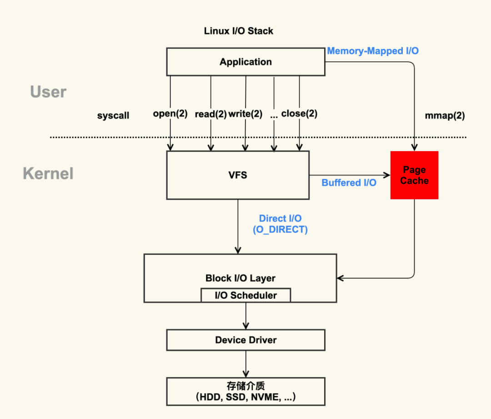
- [查看所有的内核进程](https://mp.weixin.qq.com/s/0Vg6hpof-sqyBWLPRudvTQ)
  - Linux 下有 3 个特殊的进程：
    - idle 进程 (pid = 0)；
      - 由系统自动创建, 运行在内核态；
      - pid = 0，其前身是系统创建的第一个进程；
      - 唯一一个没有通过 fork 或者 kernel_thread 产生的进程；
      - 完成加载系统后，演变为进程调度、交换；
    - init 进程 (pid = 1)，Redhat/CentOS 中就是 systemd 进程； 
      - init 进程由 idle 通过 kernel_thread 创建，在内核空间完成初始化后, 加载 init 程序, 并最终用户空间；
      - 由 0 进程创建，完成系统的初始化。它是系统中所有其它用户进程的祖先进程；
      - Linux 中的所有进程都是由 init 进程创建并运行的 - 首先 Linux 内核启动，然后在用户空间中启动 init 进程，再启动其他系统进程。在系统启动完成完成后，init 进程将变为守护进程，监视系统其他进程。
    - kthreadd (pid = 2)。
      - kthreadd 进程由 idle 通过 kernel_thread 创建，并始终运行在内核空间, 负责所有内核线程的调度和管理；
      - 它的任务就是管理和调度其他内核线程 kernel_thread, 会循环执行一个 kthread 的函数，该函数的作用就是运行 kthread_create_list 全局链表中维护的 kthread, 当我们调用 kernel_thread 创建的内核线程会被加入到此链表中，因此所有的内核线程都是直接或者间接的以 kthreadd 为父进程。
  - `ps -e -o pid,ppid,cmd | awk '$2 == 2 && $1 != 1 {print $3}' | sort | uniq | sed 's/\[\([^/]*\)\/[^]]*\]/\1/;s/\[\([^]]*\)\]/\1/' | uniq`
- [系统的 I/O 瓶颈](https://mp.weixin.qq.com/s/X1WVRWSgUUyYbVyelnf_Nw)
  - IO operation
    - 读写 IO：写磁盘为写 IO，读数据为读 IO；
    - 随机访问(Random Access) 与顺序访问(Sequential Access)：由此 IO 给出的扇区地址与上次 IO 结束的扇区地址相差是否较大决定
    - 队列 IO 模式(Queue Mode)/并发 IO 模式(Burst Mode): 由磁盘组一次能执行的IO 命令个数决定；
  - 带宽（Throughput）
    - 带宽是指磁盘在实际使用的时候从磁盘系统总线上流过的数据量，也称为磁盘的实际传输速率； 带宽 = IOPS * IO大小。
    - IOPS是IO系统每秒所执行IO操作的次数，是一个重要的用来衡量系统IO能力的参数，对于单个磁盘，计算其完成一次IO所需要的时间来推算其IOPS
  - 磁盘 I/O 性能指标
    - 使用率，是指磁盘忙于处理 I/O 请求的百分比。过高的使用率（比如超过 60%）通常意味着磁盘 I/O 存在性能瓶颈。
    - IOPS（Input/Output Per Second），是指每秒的 I/O 请求数。
    - 吞吐量，是指每秒的 I/O 请求大小。
    - 响应时间，是指从发出 I/O 请求到收到响应的间隔时间。
  - 如何迅速分析 I/O 的性能瓶颈
    - 先用 iostat 发现磁盘 I/O 性能瓶颈；
    - 再借助 pidstat ，定位出导致瓶颈的进程；
    - 随后分析进程的 I/O 行为； 最后，结合应用程序的原理，分析这些 I/O 的来源。
- [如何查看服务器磁盘IO性能](https://mp.weixin.qq.com/s/TCNu3joT1FWDMmpxkK033A)
  - dd命令可以用于测试磁盘的读写速度，通过观察dd命令的执行时间，我们可以了解到磁盘的IO性能。此外，dd命令还可以用于测试磁盘的稳定性和可靠性。
  ```
  #!/bin/bash
  echo "开始检查磁盘IO性能..." >> io_test.log
  dd if=b.txt of=/dev/null bs=1M iflag=direct oflag=direct count=10240 >> io_test.log
  echo "检查完成" >> io_test.log
  ```
- [硬件知识](https://www.youtube.com/watch?v=BP6NxVxDQIs)
  - cache line
  - prefetching
  - cache associativity
    - cache 的大小是要远小于主存的。这就意味着我们需要通过某种方式将主存的不同位置映射到缓存中.共有 3 种不同的映射方式
      - 全相联映射 - 全相联映射允许主存中的行可以映射到缓存中的任意一行。这种映射方式灵活性很高，但会使得缓存的查找速度下降。
      - 直接映射 - 直接映射则规定主存中的某一行只能映射到缓存中的特定行。这种映射方式查找速度高，但灵活性很低，会经常导致缓存冲突，从而导致频繁 cache miss 。
      - 组相联映射 - 组相联映射则尝试吸收前两者的优点，将缓存中的缓存行分组，主存中某一行只能映射到特定的一组，在组内则采取全相联的映射方式。
  - false share
- [CPU Scheduling](https://www.cs.uic.edu/~jbell/CourseNotes/OperatingSystems/6_CPU_Scheduling.html)
- [Linux启动流程](https://mp.weixin.qq.com/s/s1YpeLc9K-tX59REh9Wz0A)
  - Step 1 - When we turn on the power, BIOS (Basic Input/Output System) or UEFI (Unified Extensible Firmware Interface) firmware is loaded from non-volatile memory, and executes POST (Power On Self Test).
  - Step 2 - BIOS/UEFI detects the devices connected to the system, including CPU, RAM, and storage.
  - Step 3 - Choose a booting device to boot the OS from. This can be the hard drive, the network server, or CD ROM.
  - Step 4 - BIOS/UEFI runs the boot loader (GRUB), which provides a menu to choose the OS or the kernel functions.
    - Read /etc/grub2.cfg
    - Exec the kernel
    - Load the support lib
  - Step 5 - After the kernel is ready, we now switch to the user space. The kernel starts up systemd as the first user-space process, which manages the processes and services, probes all remaining hardware, mounts filesystems, and runs a desktop environment.
    - Exec the systemd the first process in user space
  - Step 6 - systemd activates the default. target unit by default when the system boots. Other analysis units are executed as well.
  - Step 7 - The system runs a set of startup scripts and configure the environment.
    - /Systemd-logind
    - /etc/profile
    - ~/.bashrc
  - Step 8 - The users are presented with a login window. The system is now ready.

- 分页（Paging）&& 分段（Segmentation）
  - 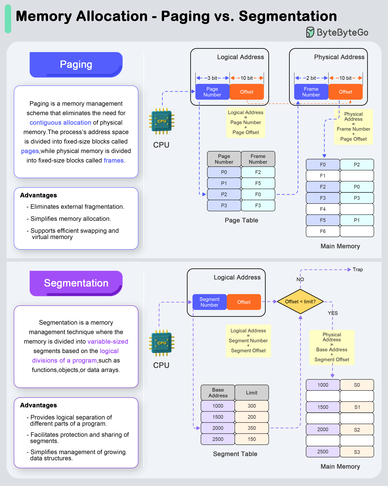
  - 分页
    - 分页是一种内存管理技术，它将物理内存划分为固定大小的块，称为页，同时将逻辑内存划分为与物理内存相同大小的块，称为页框。分页的基本思想是将程序的地址空间划分为大小相等的页，而物理内存划分为与页大小相等的块，每个页框与一个页对应。程序的每个页在逻辑上是连续的，而在物理上是离散的。
    - 页表是一个页框号的数组，页表的每一项对应一个页，页表的每一项存放着页号与页框号的对应关系。当程序访问一个页时，CPU首先通过页表找到该页对应的页框号，然后再通过页框号找到物理内存中的地址。
    - 分页是一种无需连续分配物理内存的内存管理方案。进程的地址空间被划分为固定大小的块，称为页，而物理内存被划分为固定大小的块，称为帧。
  - 分段
    - 分段是一种内存管理技术，它将程序的地址空间划分为若干段，每一段都有一个段名和一个段长。分段的基本思想是将程序的地址空间划分为若干个逻辑段，每个段代表一个逻辑单位，如主程序段、子程序段、数据段等。每个段的长度是不固定的，每个段的长度可以根据需要动态增长或缩小。
    - 段表是一个段号的数组，段表的每一项对应一个段，段表的每一项存放着段号、段长和段在内存中的起始地址。当程序访问一个段时，CPU首先通过段表找到该段的起始地址，然后再通过段的起始地址和段长找到该段的地址。
  - 分段和分页的比较
    - 内存分配：分页将内存划分为固定大小的单元，而分段将内存划分为可变大小的单元。
    - 碎片：分页消除了外部碎片，但可能导致内部碎片。分段可导致外部碎片，但可避免内部碎片。
    - 地址转换：分页涉及页表，而分段使用段表。
    - 逻辑视图：分页更直接，但不太符合程序的逻辑视图。分段与程序内的逻辑划分更为一致。
- [“文件系统”安装在一个“文件”上](https://mp.weixin.qq.com/s/3WqaJF8sGo1XR-gthXYhHg)
  - “文件”在文件系统之中，这是人人理解的概念。但“文件”之上还有一个文件系统？-  loop 设备, 借助 loop 设备，可以让一个文件被当做一个块设备来访问
  - 使用 loop 设备有两种方式：
    - 一种是直接 mount 带上 -o loop 的参数。这种省去了显式创建 loop 设备的过程，步骤简单。
    - 另一种方式是先显式的创建 loop 设备，该 loop 设备绑定一个文件，并提供了块设备的对外接口。我们就可以把这个 loop 设备当作一个普通的块设备文件，进行格式化，然后挂载到目录上。
  - loop 设备
    - loop 就是一种特殊的块设备驱动。loop 设备是一种 Linux 虚拟的伪设备，它和真实的块设备不同，它并不代表一种特定的硬件设备，而仅仅是满足 Linux 块设备接口的一个虚拟设备。它的作用就是把一个文件模拟成一个块设备。
  - loop 设备的典型应用
    - 系统模拟和测试：可以使用 loop 设备来模拟不同的存储配置，无需使用物理硬件，就可以进行软件测试或系统配置实验。
    - 文件系统开发：开发者可以使用 loop 设备来挂载文件系统，从而方便地测试和调试新的文件系统。
    - ISO 映像挂载：Loop 设备还常用于挂载 ISO 文件，无需刻录到物理介质上，使其内容可直接访问。
    - 加密磁盘：loop 设备还能和一些加密技术（如dm-crypt）结合，因为 loop 设备可以绑定几乎任意类型的文件，这就给了人们无限的想象空间。我们可以创建一个加密的磁盘镜像，增强数据安全。
- [Linux系统中的动态链接库机制](https://mp.weixin.qq.com/s/0OgcjDlT9hQBkd_W0eJfnw)
- Cache prefetching can be accomplished either by hardware or by software.
  - Hardware based prefetching is typically accomplished by having a dedicated hardware mechanism in the processor that watches the stream of instructions or data being requested by the executing program, recognizes the next few elements that the program might need based on this stream and prefetches into the processor's cache.
  - Software based prefetching is typically accomplished by having the compiler analyze the code and insert additional "prefetch" instructions in the program during compilation itself.
- [Xarry](https://mp.weixin.qq.com/s/pOkczZy4z0k88i9NwgfJKA) 
  - Linux 内核的 Page Cache 是由 Radix Tree 管理的，Radix Tree 在内核中通过 Xarray 机制进行了很好的包装，
  - Xarray 提供了简单易用的仿数组 API，让大部分内核组件可以像使用数组一样使用 Radix Tree。
- [High-Performance GPU Memory Transfer on AWS Sagemaker Hyperpod](https://www.perplexity.ai/hub/blog/high-performance-gpu-memory-transfer-on-aws)
  - Using a custom RDMA-based networking library, we've been able to achieve 3200 Gbps GPU memory transfers, bypassing NCCL limits for 97.1% theoretical bandwidth efficiency.


