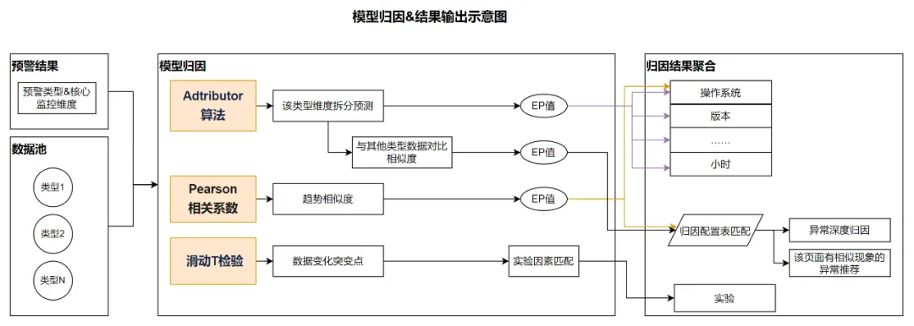

- [Prometheus 数据存储]()
  - tsdb 数据
    - 基于相对稳定频率持续产生的一系列指标监测数据，那么存储就是一些标签键加上一个时间序列作为一个大 key，值就是一个数字
  - 对于数据的存储 Prometheus 按冷热数据进行分离，最近的数据肯定是看的最多的，所以缓存在内存里面，为了防止宕机而导致数据丢失因而引入 wal 来做故障恢复
  - 数据超过一定量之后会从内存里面剥离出来以 chunk 的形式存放在磁盘上这就是 head chunk。
  - 对于更早的数据会进行压缩持久化变成 block 存放到磁盘中。
  - 对于 block 中的数据由于是不会变的，数据较为固定，所以每个 block 通过 index 来索引其中的数据，并且为了加快数据的查询引用倒排索引，便于快速定位到对应的 chunk。
- [Prometheus TSDB](https://ganeshvernekar.com/blog/prometheus-tsdb-the-head-block/)
  - 1. Head Block（内存块）
    - Prometheus的TSDB吸引了很多新的贡献者，Head block是TSDB的内存部分，主要存储最近1-3小时的数据。
    - 自Prometheus v2.19.0起，不再将所有chunk存储在内存中。当新chunk被切分时，满的chunk会被刷新到磁盘并进行memory-mapped，只在内存中保留引用。
    - 索引以倒排索引形式存储在内存中。当Head block进行压缩创建持久化block时，Head会被截断以移除旧的chunk，并对索引进行垃圾回收。
  - 2. WAL（预写日志）和Checkpoint
     - WAL是数据库中事件的顺序日志。在写入/修改/删除数据之前，事件首先被追加到WAL中，然后再执行相应操作。如果程序崩溃，可以重放WAL中的事件来恢复数据。
     - 在Prometheus中，WAL仅用于记录事件和启动时恢复内存状态，不参与其他读写操作。
     - WAL记录分为三种类型：Series记录（序列的标签值）、Samples记录（序列引用和样本列表）、Tombstones记录（用于删除请求）。
  - 3. Memory Mapping（内存映射）
    - 当chunk"满"后会被刷到磁盘并进行memory-mapped，这有助于减少Head block的内存占用，同时加快WAL重放速度。
    - 如果将chunk存储在内存中需要120到200字节，现在替换为24字节（引用、最小时间、最大时间各8字节）。实际场景中可以看到15-50%的内存占用减少。
  - 4. Persistent Block（持久化块）及索引
    - 当Head block数据达到chunkRange*3/2时，第一个chunkRange的数据会被转换为持久化block。默认从Head切分的第一个block跨度为2小时。
    - 磁盘上的block是一个目录，包含固定时间范围的chunk和自己的索引。每个block有唯一的ULID标识。Block中的样本是不可变的，如要添加、删除或更新样本，必须重写整个block。
    - Posting是系列ID的概念，来源于倒排索引术语。可以将序列视为文档，序列的标签-值对视为文档中的词。
  - 查询系统
     - Head block在内存中存储完整的标签-值对映射和所有postings列表，因此访问时无需特殊处理。
     - Select([]matcher)查询帮助获取匹配matcher描述的序列的原始TSDB样本。matcher指定序列中应匹配的标签名-值组合。
     - 获取matcher的postings时，不会一次性将所有条目的postings加载到内存。由于索引从磁盘进行memory-mapped，postings会被懒加载迭代和合并。样本迭代器也不是预先全部返回，而是通过迭代器逐个迭代序列。
  - Compaction（压缩）和Retention（保留策略）
    - Prometheus使用大压缩和小压缩两种过程。Head Compaction类似于将Head部分持久化到Chunks的过程，此时tombstones会从内存中实际删除。
    - Compaction是block的合并，实现多个目标：回收标记删除使用的磁盘资源、合并分散在多个block中的重复信息、通过处理不同block间的数据重叠来提升查询处理速度。
- [时序数据高基问题](https://mp.weixin.qq.com/s/baTvpUXuA594JDUVU0wL5Q)
  - 第一个有效的解法是垂直切分，大部分业界主流时序数据库或多或少都采用了类似方法，按照时间来切分索引，因为如果不做这个切分的话，随着时间的推进，索引会越来越膨胀，最后到内存放不下，如果按照时间切分，可以把旧的 index chunk 交换到磁盘甚至远程存储，起码写入是不会被影响到了。
  - 与垂直切分相对的，就是水平切分，用一个 sharding key，一般可以是查询谓词使用频率最高的一个或者几个 tag，按照这些 tag 的 value 来进行 range 或者 hash 切分，这样就相当于使用分布式的分而治之思想解决了单机上的瓶颈，代价就是如果查询条件不带 sharding key 的话通常是无法将算子下推，只能把数据捞到最上层去计算。
- [监控降噪](https://mp.weixin.qq.com/s/rEn25SejnU0rOWFb39QuUw)
  - 如何衡量监控效果
    - 衡量效果最有效的指标为召回率——即衡量能够正确识别出正样本的百分比。召回率的计算公式为：召回率 = 正确识别的正样本数 / 所有正样本数
    - 在保证召回率，识别线上问题的同时，提升准确率降低噪音，便是监控治理要做的事。
  - 监控规则
    - 避免维度单一
    - 利用黑白名单
    - 利用环比和同比
- [Sidecar 的资源和性能管理]
  ```shell
  record: "container_cpu_usage_against_request:pod:rate1m"
     expr: |
      (   
        count(kube_pod_container_resource_requests{resource="cpu", container!=""}) by (container, pod, namespace)
        *   
        avg(
          irate(
            container_cpu_usage_seconds_total{container!=""}[1m]
          )   
        ) by (container, pod, namespace)
      )   
      /   
      avg(
        avg_over_time(
          kube_pod_container_resource_requests{resource="cpu", container!=""}[1m]
        )   
      ) by (container, pod, namespace) * 100 
      *   
      on(pod) group_left(workload) (
        avg by (pod, workload) (
          label_replace(kube_pod_info{created_by_kind=~"ReplicaSet|Job"}, "workload", "$1", "created_by_name", "^(.*)-([^-]+)$")
          or  
          label_replace(kube_pod_info{created_by_kind=~"DaemonSet|StatefulSet"}, "workload", "$1", "created_by_name", "(.*)")
          or  
          label_replace(kube_pod_info{created_by_kind="Node"}, "workload", "node", "", "") 
          or  
          label_replace(kube_pod_info{created_by_kind=""}, "workload", "none", "", "") 
        )   
      )
  ```
- [Metrics 系统架构演进](https://mp.weixin.qq.com/s/ezG3VQLgE2e0AWSxsoBHRg)
  -  Thanos
    - 可以从多个 Prometheus 集群查询数据，统一了查询入口，提高了用户的体验。同时提供长期数据，另外 Thanos 可以通过 Prometheus-Operator 来管理，所以大大降低了整体管理成本和入侵性
  - 优化：
    - 升级了 Thanos 的版本，为 query-frontend 和 storegateway 服务增加了 Redis 缓存，从而提升查询的性能。
    - 为 store gateway 做了基于时间的分片
  - 面临以下几个问题：
    - 超 100+ 倍数据点增长导致查询缓慢
    - 架构复杂，参数调优困难
    - 频繁 OOM
  - VictoriaMetrics 
    - 根据容器可用的 CPU 数量计算协程数量
    - 区分 IO 协程和计算协程，同时提供了协程优先级策略
    - 使用 ZSTD 压缩传输内容降低磁盘性能要求
    - 根据可用物理内存限制对象的总量，避免 OOM
    - 区分 fast path 和 slow path，优化 fast path 避免 GC 压力过大
- metric 
  - database
    - PostgreSQL 是多进程模式，所以需要十分关注链接数和页表大小，虽然使用 Hugepage 方案可以降低页表的负担，但是 Hugepage 本身还是有比较多的副作用，利用 pgBouncer 之类的 proxy 做链接复用是一种更好的解法；
      - 当开启 full page 时，PostgreSQL 对 I/O 带宽的需求非常强烈，此时的瓶颈为 I/O 带宽；当 I/O 和链接数都不是瓶颈时，PostgreSQL 在更高的并发下瓶颈来自内部的锁实现机制。
    - MongoDB 整体表现比较稳定，主要的问题一般来自 Disk I/O 和链接数，WiredTiger 在 cache 到 I/O 的流控上做得比较出色，虽然有 I/O 争抢，但是 IO hang 的概率比较小，
      - 当然 OLTP 数据库的 workload 会比 MongoDB 更复杂一些，也更难达到一种均衡。
    - Redis 的瓶颈主要在网络，所以需要特别关注应用和 Redis 服务之间的网络延迟，这部分延迟由网络链路决定，
      - Redis 满载时 70%+ 的 CPU 消耗在网络栈上，所以为了解决网络性能的扩展性问题，Redis 6.0 版本引入了网络多线程功能，真正的 worker thread 还是单线程，这个功能在大幅提升 Redis 性能的同时也保持了 Redis 简单优雅的特性。
  - Pod
    - CPU
      - `sum(rate(container_cpu_usage_seconds_total{namespace=~"alpha|beta|prod", image!="", container_name!="POD", pod=~".*$project.*"}[1m])) by (pod) /
         sum(container_spec_cpu_quota{namespace=~"alpha|beta|prod", image!="", container_name!="POD", pod=~".*$project.*"}/container_spec_cpu_period{namespace=~"alpha|beta|prod", image!="", container_name!="POD", pod=~".*$project.*"}) by (pod) * 100`
    - Memory
      - `avg(container_memory_working_set_bytes{namespace=~"alpha|beta|prod", pod=~".*$project.*", container!="POD"} > 0) by (pod) /
        avg(kube_pod_container_resource_requests_memory_bytes{namespace=~"alpha|beta|prod", pod=~".*$project.*", container!="POD"} > 0) by (pod) * 100`
    - Network
- [Prometheus 指标值为何不准](https://mp.weixin.qq.com/s/A3W3hSCpQi8DQYJxOS1ZGA)
  - Overview
    - Prometheus 指标值不准的“怪现象”，其实是在下面的“不可能三角”中，做出了取舍——为保全效率和可用性，舍弃了精度
    - 其手段通常是对原始数据先采样、再聚合，利用有限的信息，分析变化趋势
    - Prometheus 毕竟处在一个条件有限的真实世界，它还要随时面临以下困难: 自身硬件有限, 采样统计的局限性, 分布式的局限性
    - 交出 not perfect、但是 good enough 的指标。于是就有了下述设计：
      - 单次采样不重要，多次采样组成的时间序列才重要。所以，单次采样受阻，是可以无需重试、直接丢弃的。
      - 单点数值不重要，多点数值汇聚的变化趋势才重要。所以，单点数值是可以“无中生有”、"脑补"估算的。
  - Case
    - 失真的 rate/increase
      - 在使用 rate 或者 increase 观测 counter 类型的指标增量时，经常碰到
        - 每分钟新增的请求数，竟然是个小数？ ，不仅是个小数，还比真实增量更大？
      - 最常见的原因，就是线性外推（linear extrapolation）
        - 线性外推算法：取窗口覆盖范围内的第一个点和最后一个点，计算斜率，并按照该斜率将直线延伸至窗口边界，无中生有地“脑补”出虚拟的两个“样本点”，即可相减计算 increase 了：
      - rate/increase[时间范围] 在计算该时间范围内的增量时，第一步要拿到该时间范围边界上（开始时刻和结束时刻）的样本点，相减得到差值
      - Prometheus 的选择是：naive 地假设所有样本点在该时间范围内是均匀分布的，然后按照这个均匀分布的线性规律，“脑补”估算出边界上的采样点
      - 要计算 [1m] 的时间范围/取样窗口内的 increase，在最理想的情况下，Prometheus 根本不想关心这个窗口内的其他数据，而只需从窗口左边界取第一个点，右边界取最后一个点，相减即可：
    - 离谱的 histogram
      - histogram 百分位（percentile）不准，这是为啥呢？这就不得不提线性插值（linear interpolation） 了
      - PTS 搜集了响应时间的平均值、P50、P90、P95——但就是没有 P99
      - 所求分位值 = bucket 段左边界值 + (bucket 段右边界值 - bucket 段左边界值) * (目标样本在本 bucket 段的排行 / 本 bucket 段的样本总数)
      - 若想用 histogram 获得较为准确的分位值，则需对样本分布有一定的了解，再根据这个分布，设置合理的 bucket 边界
    - 薛定谔的 range
      - 以上述 rate(errors_total[时间范围]) 为例，若我们分别选时间范围 [30s]、[1m]、[5m]，看一眼三者的 Grafana 图表，这不能说一模一样，只能说是毫不相关：随着时间范围扩大，主打一个逐渐平滑、失去尖峰
      - 曲线随 rate 窗口而峰值和形态大变的原因：
        - 窗口小则更加敏感，能够捕捉到更短时间内的变化。这意味着如果有突发事件或者短期波动，它会在曲线上表现得更明显。
        - 窗口大会更加平滑，因为它平均了更长时间内的数据。这样可以减少短期波动的影响，但也可能掩盖掉短时间内的突发事件。
      - 在选择合适的时间范围时，应考虑以下因素：
        - 指标的特性：对于波动较大的指标，可能需要一个较短的时间范围来快速发现问题。对于相对平稳的指标，较长的时间范围可以提供更清晰的趋势。
        - 监控目标：如果你需要实时监控和快速响应，短时间范围可能更合适。如果关注长期趋势，那么长时间范围会更有帮助。
        - Prometheus 抓取间隔：时间范围应该至少是 Prometheus 抓取间隔的两倍，这样才能确保有足够的数据点来计算速率。
    - 在一个分布式的世界，网络抖动、对端延迟等引起的数据丢失问题，会给本就不精确的 Prometheus 指标值雪上加霜
      - 虽则 rate 计算斜率需要至少两个点，但最佳实践建议将 rate 的时间范围至少设为 Prometheus scrape interval（抓取周期/间隔）的 4 倍
      - 网络抖动可能导致丢点，也可能导致点的延迟。那么当延迟的点到达时，它就出现在了本不属于它的统计周期内。这可能导致 rate 出现波动
    - 对 Prometheus 使用范围查询（range query），就必然涉及 step（步长）
      - Grafana 需要渲染整条曲线，可以理解为 Grafana 在时间轴上按 step 每走一步，就要做一次查询/evaluation，得到一个值，生成曲线上的一个
      - 当 step 的步长，叠加 Prometheus scrape interval，再叠加 PromQL 里的 range 时间范围窗口
  - Summary
    - 在一个分布式的世界，网络抖动、对端延迟等引起的数据丢失问题，会给本就不精确的 Prometheus 指标值雪上加霜。
      - 例如：虽则 rate 计算斜率需要至少两个点，但最佳实践建议将 rate 的时间范围至少设为 Prometheus scrape interval（抓取周期/间隔）的 4 倍。这将确保即使抓取速度缓慢、且发生了一次抓取故障，也始终可以使用两个样本。
      - 再例如：网络抖动可能导致丢点，也可能导致点的延迟。那么当延迟的点到达时，它就出现在了本不属于它的统计周期内。这可能导致 rate 出现波动，尤其是在监控较短时间范围的 rate 时。
    - 文章里只关注了对 PromQL 的一次查询/evaluation。而在现实中对 Prometheus 使用范围查询（range query），就必然涉及 step（步长）。
      - 比如 Grafana 需要渲染整条曲线，可以理解为 Grafana 在时间轴上按 step 每走一步，就要做一次查询/evaluation，得到一个值，生成曲线上的一个点。那么当 step 的步长，叠加 Prometheus scrape interval，再叠加 PromQL 里的 range 时间范围窗口……可以设想，这几个参数不同的排列组合，会导致曲线更加充满惊喜意外……
    - Prometheus 的增量外推（extrapolation），其实也不是纯粹地无脑外推；它有时还会考虑到距离窗口边界的距离，而做一些其他微调。
    - 本文未涉及 Prometheus counter 重置（reset）对 increase/rate 准确度的影响。也即：counter 如遇归零（如服务器重启导致），Prometheus 会有应对机制自动来处理，正常情况下不用担心。但若好巧不巧，数据点存在乱序，则可能因为数值下降而误触 Prometheus 重置后的补偿机制，被“脑补”计算出一个极大的异常 increase/rate。
- [Flame graph AI](https://grafana.com/docs/grafana-cloud/monitor-applications/profiles/flamegraph-ai/?pg=blog&plcmt=body-txt)
  - Performance bottlenecks: What’s causing the slowdown?
  - Root causes: Why is it happening?
  - Recommended fixes: How would you resolve it?
- [5 useful transformations you should know to get the most out of Grafana](https://www.bestblogs.dev/article/70f285)
  - Organize fields by name
  - Filter data by value
  - Partition by values / Sort by
  - percentiles in group by and legend
- [AIOps](https://mp.weixin.qq.com/s/5KOpCFJ0SuWQ-qe9_U4Qyg)
  - 微服务根因定位
    - 基于随机游走的方法关键在于概率转移矩阵的设计，其出发点是推导出真实的故障传播路径，随机游走有很明显的缺陷，其排序结果对于处于拓扑中心（入度和出度较高）的节点有较高的权重，而对于叶子结点则通常权重较低
    - 基于监督学习的方法很难在实际中落地，一是故障类型太多，根本无法枚举；二是历史故障样本十分有限，通过故障注入方式扩充样本会导致类型集中和单一，对训练模型并不友好
    - 基于trace异常检测的方法，需要公司基建完善，需要监控指标和trace覆盖度足够高，直接对trace实时数据进行异常分析成本较高
    - 工业界上更多地是将指标、日志、trace和event都结合起来，做异常检测和关联分析，并结合公司自身业务特点和基建架构，加入一些专家规则进行根因推断，具备一定的可解释性和灵活性，可以很方便地进行规则调整和优化
  - 异常检测
    - 变点检测算法
      - 对于类QPS指标，通常具备趋势，直接使用孤立森林算法检测，在其上升期很难识别出异常下跌波动。
    - 余弦相似度分析：Exception 错误分布不均检测，如果一个异常不是单机/单机房引发的，那么其分布应该是均匀的
    - 时间序列离群分析：该方法针对系统指标异常，有些情况下的单机异常并不会在Exception上反应出来，比如单机CPU跑满，但是不存在相关的Exception。
    - 使用DBSCAN聚类的方法对系统指标进行离群分析，提取出这种单机异常序列
- Trace
  - 客户端时间问题
    - 需要通过相对顺序来设计客户端span（和Opentrace协议很类似）。在事件序列排序时，客户端部份通过相对顺序排序，服务端通过绝对时间排序
  - 【内容生产实时事件流平台-Core】会定时计算出事件波动绝对值，然后【内容生产实时事件流平台-异动感知】会上报到时序数据库（prometheus）中。
  - 这样在时间轴上就会形成数据的同环比，再将这些数值对接到【告警平台】就可以打通数据波动异常感知。 
- [智能预警](https://mp.weixin.qq.com/s/MgUkcK6jlejvcRnl6Zg9fQ)
  - 单日同环比规则：通过对比当前数据与上周同日（同比）或相邻日期（环比）的数据，发现单日内的显著变化，如激增、骤减、新增或异常波动。
  - 连续多日（周聚合）趋势波动规则：除了关注单日的数据变化外，还制定了周维度的数据趋势。
  - 综合流量变动规则：该规则不仅考虑了数据本身的变化，还结合了与其相关指标/大盘流量，从而降低因用户流量放大、缩小而导致的数据变动预警噪音，确保预警的准确性
  - 分位线预警规则：针对非报错类数据源，引入了分位线规则，以天为单位设定最优分位线作为基准，实时监测高于或低于该基准的数据占比变化及波动，确保数据的细微变化可以反馈出来
  - 
  - 考虑到对异常数据进行本身根因的分析、与其相关的其他问题导致情况、趋势问题等各类问题归因，使用了以下三种算法模型：
    - Adtributor算法
      - 一种多维时间序列异常根因分析方法，在多维度复杂根因的场景下具有良好的可靠性。
    - Pearson相关系数
      -  Adtributor算法定位深度原因，没有充分利用uv、pv的趋势变化，而事实上趋势的变化是预警判断时的重要依据，因此这里补充使用了另外一种基于趋势的相似度计算方法来定位预警的深度原因。
      - 由于主要考虑特征在趋势上相似性，因此选择Pearson相关系数（Pearson Correlation Coefficient）作为相似度指标。Pearson相关系数的绝对值越大，相关性越强，正数表示正相关，负数表示负相关。
    - 滑动T检验
      - 上述两种方法分别通过维度拆分、考虑趋势变化来定位预警的深度原因，已经比较周全，但仍存在问题，
      - 例如：开启的实验和页面的预警不能完全匹配。因此针对实验维度，启用了另外一种方案来解决，该方案通过匹配KPI的突变时刻与业务变更时间来实现
      - 滑动t检验是通过考察两组样本平均值的差异是否显著来检验突变。其基本思想是把序列中两段子序列均值有无显著差异看作来自两个总体均值有无显著差异的问题来检验。如果两段子序列的均值差异超过了一定的显著性水平，则可以认为有突变发生。
    - 
- SRE在根因定位的时候，关注的是时序的偏差而不是时序本身
  -  residual（残差）  = raw（原始）- trend（趋势）- cyclical（周期性） - seasonality（季节性）.
  - SRE 不关心时序会本身的周期性的升降（这是正常的），而是关心这条时序在故障时是不是偏离了它原有的轨迹（异常），并且关心偏离的程度（体现在 residual 上）
  - SRE 不仅仅关心相同方向的偏差，也关心两个时序相反方向的偏差，比如业务指标下跌，同时微服务的错误数上升。
- 系统度量数据的收集方式通常分为拉动式（Pull）和推动式（Push）
  - Pull
    - 优点
      - 控制灵活性：拉动式系统可以根据需求定期或按需请求数据，因此具有较高的控制灵活性。用户可以指定数据采集的时间或条件。
      - 减少不必要的数据传输：只有在请求时才会收集数据，这意味着如果没有实际的需求或事件，数据不会被频繁地传输，从而避免了不必要的网络流量和存储。
      - 简化处理：拉动式方式可以在数据请求时就进行数据处理，因此系统接收到的数据通常已被筛选或加工过。
    - 缺点
      - 延迟问题：因为数据是按需收集的，如果请求频率较低，可能会存在一定的延迟，不能即时获取最新的数据。
      - 请求开销：每次数据请求都需要一定的系统资源和时间，特别是在数据量较大的时候，频繁请求可能会导致性能瓶颈。
      - 系统负担：当多个设备或系统都使用拉动方式时，服务器可能需要处理大量的请求，从而导致压力增加。
  - Push
    - 优点
      - 实时性强：数据能够在生成或变化的瞬间被推送到接收方，这种方式适合需要高实时性的数据场景，如监控系统或实时分析。
      - 减少请求开销：由于数据是被主动推送的，收集系统不需要周期性地发送请求，减少了系统间的通信开销。
      - 灵活的事件驱动：可以根据特定的事件或条件触发数据推送，而不是基于时间，这使得数据采集更加精确和高效。
    - 缺点
      - 数据过载：如果推送过于频繁，可能会导致数据过载，尤其是在高频变化的场景下，接收方可能难以处理过多的数据。
      - 管理复杂性：在推送式数据收集模式下，数据源需要管理发送的频率和触发条件，系统间需要保持较强的同步和协调，否则可能会发生数据丢失或重复传输。
      - 网络负担：如果数据推送过于频繁或数据量较大，可能会给网络带来负担，尤其在网络带宽有限的情况下。
- Prometheus 3.0 
  - 远程写入 2.0 
  - UTF-8 支持 Prometheus 现在允许默认使用所有有效的 UTF-8 字符作为指标和标签名称，以及标签值，和 2.x 版本一致。
  - OTLP 支持 Prometheus 可以配置为 OTLP 指标协议的原生接收器，在 /api/v1/otlp/v1/metrics 端点接收 OTLP 指标
- [Prometheus Monitoring: Functions, Subqueries, Operators, and Modifiers](https://victoriametrics.com/blog/prometheus-monitoring-function-operator-modifier/)
  - [Prometheus Metrics Explained: Counters, Gauges, Histograms & Summaries](https://victoriametrics.com/blog/prometheus-monitoring-metrics-counters-gauges-histogram-summaries/)
  - [Prometheus alert](https://victoriametrics.com/blog/alerting-recording-rules-alertmanager/)
- [关于 Distributed Tracing 的调研](https://jiekun.dev/posts/dev-node-distributed-tracing-with-victorialogs/)
- [RED三板斧搞定服务监控]()
  - 由三个核心指标的首字母组成：
    - R - Rate (请求速率) 指服务在单位时间内（通常是每秒）处理的请求数量，我们常说的QPS (Queries Per Second) 或RPS (Requests Per Second) 就是它
      - sum(rate(http_requests_total{service_name="<your_service>"}[5m])) by (service_name, path, method)
    - E - Errors (错误率) 指服务在处理请求时，发生错误的请求所占的百分比，或者单位时间内的错误请求总数。
      - (sum(rate(http_requests_total{service_name="<your_service>", status_code=~"5.."}[5m])) by (service_name, path, method)) 
      - / (sum(rate(http_requests_total{service_name="<your_service>"}[5m])) by (service_name, path, method))
    - D - Duration (响应时长) P99  P95 P50
      - histogram_quantile(0.99, sum(rate(http_request_duration_seconds_bucket{service_name="<your_service>"}[5m])) by (le, service_name, path, method))
  - RED方法 vs. 其他监控方法论
    - USE方法 (Utilization, Saturation, Errors) 比如CPU使用率、内存饱和度、磁盘错误等。它是RED方法的重要补充，当RED指标显示服务异常时，USE指标能帮助我们判断是不是资源瓶颈导致的。
    - 四个黄金信号 (Latency, Traffic, Errors, Saturation): Google SRE实践的精华 RED中的Rate对应Traffic，Duration对应Latency，Errors对应Errors。
- [关于 Distributed Tracing 的调研](https://mp.weixin.qq.com/s/Ru9Tl4zWSCBsGO4Pe57vEA)
- [Alerting Best Practices](https://victoriametrics.com/blog/alerting-best-practices/)
  - 配置 vmalert 的 -external.url / -external.alert.source，使告警自带 “查看规则 / 一键静默 / Grafana 面板” 等可点击链接
- [VictoriaLogs: What if logs management became simple and performant?](https://blog.ogenki.io/post/series/observability/logs/)
- [Traces & Spans: Observability Basics You Should Know](https://last9.io/blog/traces-spans-observability-basics/)
  - Trace：描述“一次请求”穿过整个分布式系统的端到端旅程（从用户触发到返回结果）。 
  - Span：Trace 的组成单元；每个 Span 表示一次具体操作（如 DB 查询、RPC/API 调用、函数执行等），并通过**父子关系（嵌套）**表达调用链路结构。
  - 文中用树状结构说明：一个 Trace 包含多个 Span，Span 记录时序信息与元数据，并可嵌套形成调用关系。
- [Outlier Identify]()
  - https://archive.siam.org/meetings/sdm10/tutorial3.pdf
  - Approach I: Graphical Methods
    - Scatter Plot: Look for points far from the main cluster.
    - Box Plot: Outliers appear as points outside the whiskers.
  - Approach II: Statistical Methods
    - IQR
      - Q3+1.5（Q3-Q1） Q1-1.5（Q3-Q1）
    - 3sigma算法 Z-score
      - 3σ原则是指在正态分布的情况下，距离均值μ±3σ之内的数据占比约为99.73%，即在一组数据中，距离均值μ±3σ之内的数据占比约为99.73%。
    - 观测指标的检测分为两步：
      - 纵向，获取历史同一时刻30个点的观测值，通过3sigma算法来检测异常。
      - 横向，zscore算法进行变点检测，横向获取某个时刻往前历史30个点的观测值。
  - Approach III: Machine Learning Methods
    - Isolation Forest: Isolates anomalies based on how easily a data point can be separated.
    - Elliptic Envelope: Fits a multivariate Gaussian distribution to identify outliers.
    - LOF (Local Outlier Factor): Detects density-based anomalies.
    - SVM (Support Vector Machine): Learns a boundary to separate normal and outlier data.]
  - [周期识别：从 FFT 到自适应识别](https://mp.weixin.qq.com/s/2clIxada0E3sSoN9OntmTg)
    - 观点：算法域指标周期性更复杂（实验/任务调度导致周期变化），FFT 在噪声大时难直接得到精确周期。
    - 落地：给定候选周期集合，通过计算“滞后 1 周期”的自相关验证匹配度Pearson相关系数；候选周期越大使用更长历史、相关性阈值可降低。
  - 异常检测：改进型 IQR
    - 面对流量激增产生的“随机突刺”以及低流量场景下的“零水位”常态，检测算法需要具备极高的鲁棒性。
    - 认为错误数指标常见 正偏态/高峰度，3-Sigma 假设正态易造成误报。
    - 基于四分位距（IQR）算法进行深度改进。通过动态调整比例系数与阈值边界，完美适配非正态分布的错误数指标，在确保灵敏度的同时显著降低了误报率。
      - 使用 IQR（Q3-Q1）箱线规则识别异常，并做工程增强：
        - 零基线自适应：大量为 0 时，排除 0 值计算基线，减少低流量误报。
        - 双阈值约束：超过绝对错误数阈值必异常；或超过基线相对阈值必异常。
        - 参数可调：Q 分位、IQR 系数（默认 1.5）、上下界等按场景微调。
    - 同时结合周期识别，提升对周期序列“局部异常点”的捕捉。
- [VictoriaLogs Basics: What You Need to Know, with Examples & Visuals](https://victoriametrics.com/blog/victorialogs-architecture-basics/)
  - VictoriaLogs 
    - 一个**轻量、单二进制（single-binary）、零配置（zero-config）、无 Schema（schemaless）**的日志数据库，支持多种采集/协议接入、压缩落盘、内置 UI 查询、Grafana 可视化、并可与 vmalert 做“从日志到告警”
    - 自动为所有日志字段建立索引
- [Go Runtime Metrics: CPU, GC, Memory, Scheduler](https://x.com/func25/article/2017211954558042128)
  


