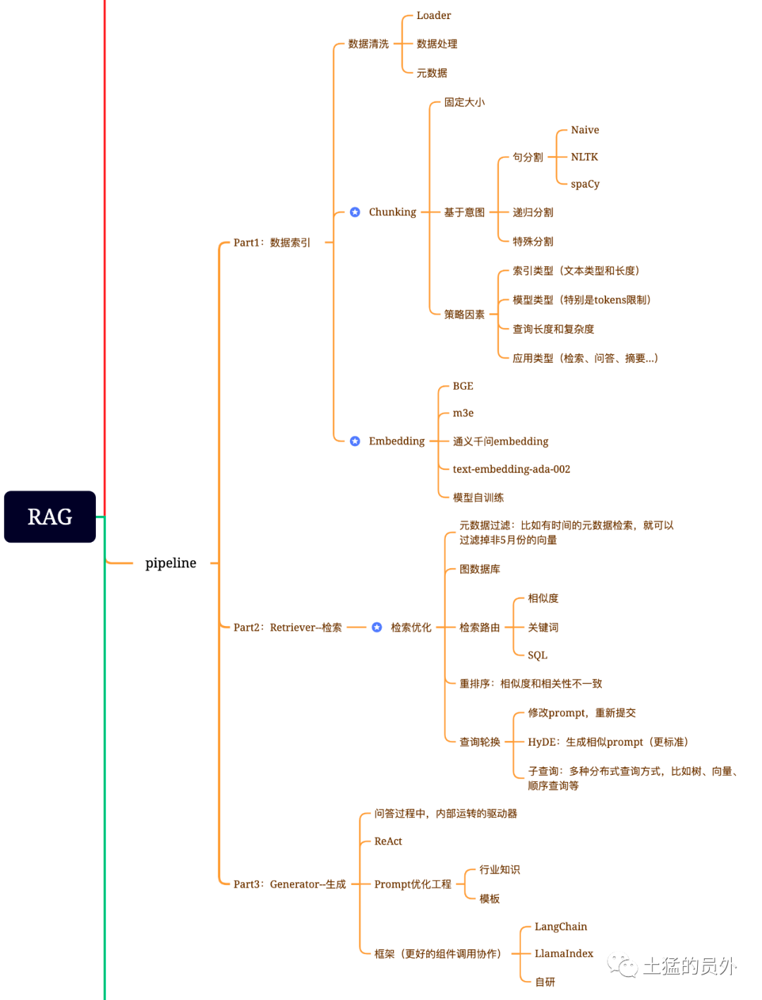
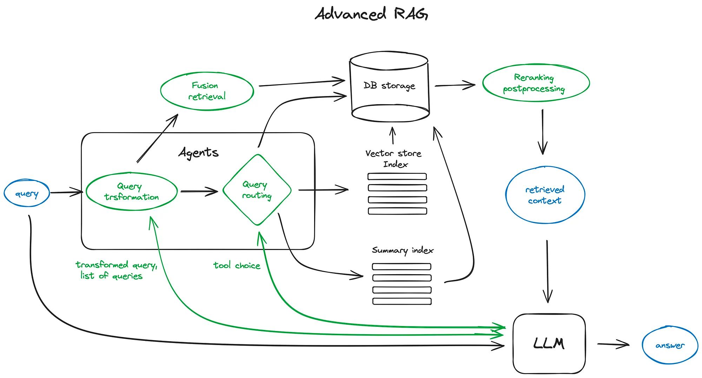
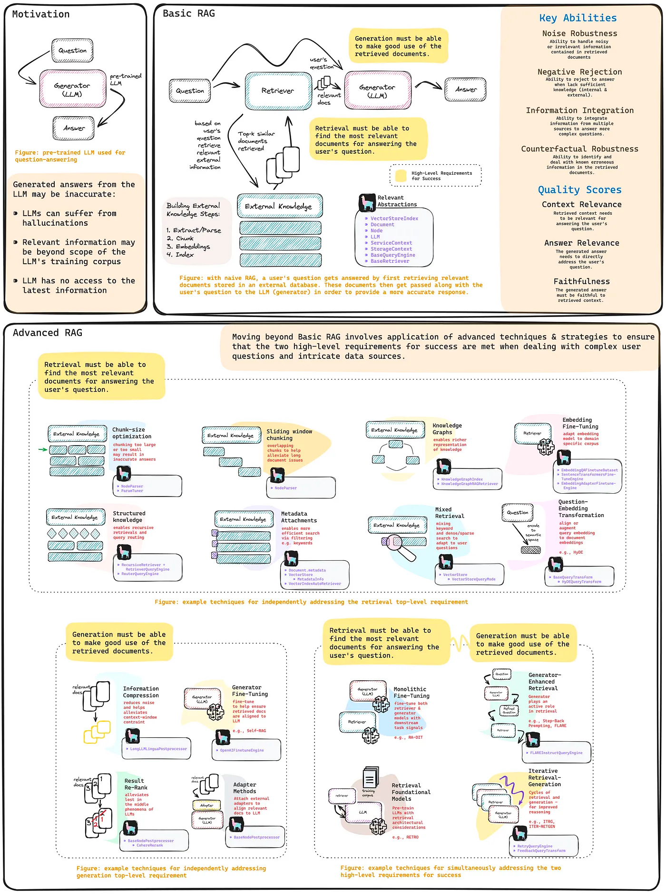
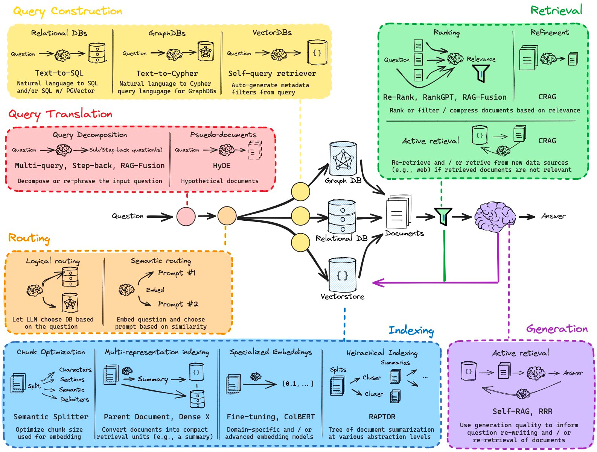
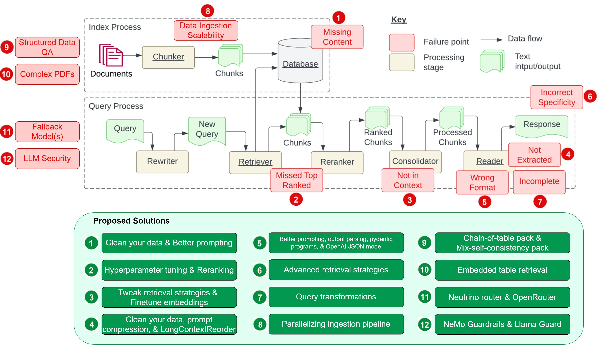
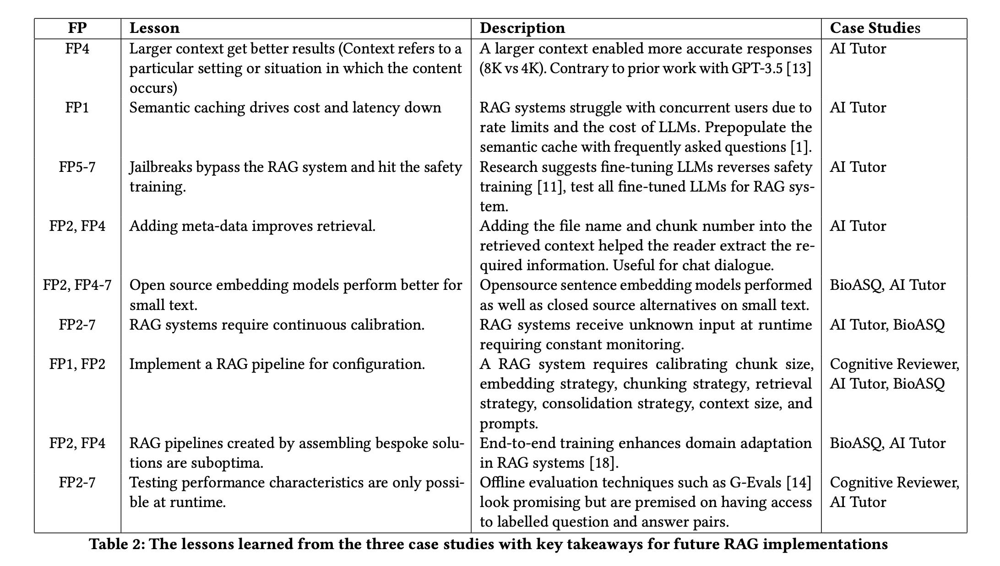
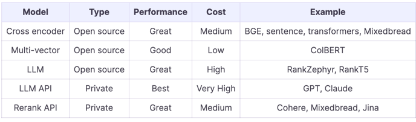
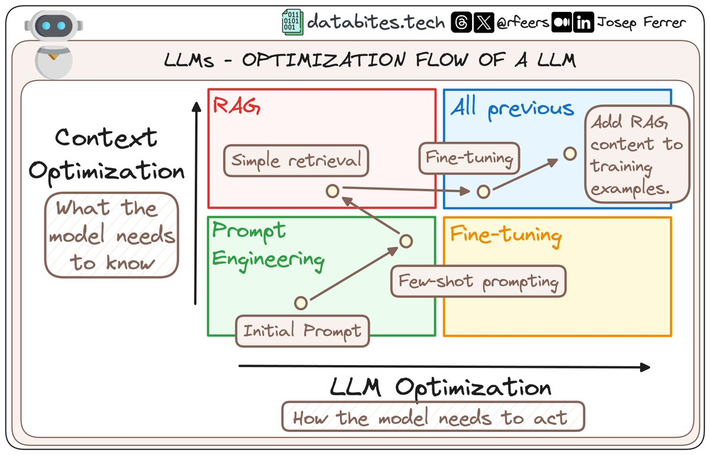

- [Introduction to Retrieval Augmented Generation (RAG)](https://weaviate.io/blog/introduction-to-rag)
  - [Advanced RAG Techniques](https://weaviate.io/blog/advanced-rag)
  - [The Ultimate Guide to RAGs — Each Component Dissected](https://towardsdatascience.com/the-ultimate-guide-to-rags-each-component-dissected-3cd51c4c0212)
- [RAG 2024 年度清单](https://mp.weixin.qq.com/s/0YxHilReHG5jtzhHl7zw8A)
- [RAG速通](https://mp.weixin.qq.com/s/11NcuacIALFWcAtQ9rWaMA)
  - RAG优化核心策略主要基于Information Retrieval的2-stage经典思路展开：即同时保证高召回率和精度
    - 第一阶段：最大化召回率(High Recall)，同时接受较低的精度( Low Precision)。此阶段涵盖RAG的Indexing和Retrieval部分
    - 第二阶段：提升精度（Higher Precision）。此阶段由新增的Reranking部分构成，其目的是在切片文档被获取后进行“Postprocessing”，以提升Top_K的精度，降低送往大模型文档切片的噪声
  - 依据实际业务需求厘清优化目标，明确要在哪一个或者多个部分实现优化。Recalling、Indexing和Reranking三部分优化目标分别如下：
    - Recalling的目标是完善Query以取得更高的召回率；
    - Indexing的优化目标是在提升召回率的同时保证语义完整性；
    - Reranking的优化目标是保证Top_K的精度。
      -  bge-reranker
  - Question Transformation是通过改写、拓展和丰富问题的语义以提升召回率。当前比较流行的方案包括：
    - Rewrite-Retrieve-Read：使用大模型改写问题；
    - Step Back prompting：使用大模型产生问题的“Step-back Question”，并将问题和Step-back一同用于召回；
    - Follow Up Questions：将历史对话记录融入当前问题进行召回；
    - Multi Query Retrieval：使用大模型基于原始问题，从不同角度产生多个新问题，并使用每一个新问题进行召回；
    - HyDE：使用大模型产生问题的Hypothetical答案，并将问题和答案一同用于召回。
  - RAG-Fusion 结合Multi Query Retrieval 和基于Reciprocal Rank Fusion (RRF）算法的Reranker，通过产生多个问题变种、进行多次召回，再用RRF算法进行合并和排序来提升召回率和精度。
  - Hybrid Search 同时执行Keyword Search和Vector Search，并使用RRF算法合并、并重排两种不同检索的结果
  - Small-to-Big采用分离索引和内容的方式以提升Vector Search的完整性 通常通过一小段索引（节点）关联到一大块完整的切片，以小切片搜索的精确度驱动大切片内容的完整性。
    - Sentence-window retrieval：索引句子，关联到句子的上下文；
    - Auto-merging retrieval：通过子节点递归关联父节点；
    - Multiple-Vector Retriever：通过切片的Summary，找到存储在Doc Store中的切片原文。
- [LLM 回答更加准确的秘密：为检索增强生成（RAG）添加引用源](https://mp.weixin.qq.com/s/I01YcEs_dV8fkSD-HaQQxg)
  - RAG 的出现重点解决了现有大模型的三个挑战：
    - 幻觉问题：生成内容不正确，与事实不符，甚至荒谬
    - 实时问题：无法给出时效性较强问题的答案，或者给出错误答案
    - 私域数据问题：企业私域数据因为合规等问题无法在公网作为大模型的训练数据
  - 业界有两种主要解决方法：微调和检索增强生成（RAG）
    - 微调的成本更高，需要使用的数据也更多，并且每一次 fine-tune 的时间比较久，企业无法经常去做这个事情，因为它的 cost 非常高. 因此主要适用于风格迁移（style transfer）的场景
    - RAG 方法使用例如 Milvus 之类的向量数据库，从而将知识和数据注入到应用中，更适用于通用场景
    - RAG 方法就意味着使用向量数据库存储真理数据，这样可以确保应用返回正确的信息和知识，而不是在缺乏数据时产生幻觉，捏造回答
    - [Fine-Tuning vs. Retrieval-Augmented Generation](https://neo4j.com/developer-blog/fine-tuning-vs-rag/)
  - 在LLM开发领域，有RAG，MRKL，Re-Act，Plan-Execute等模式
  - 大模型的内在基因
    - 在机器学习中，我们根据解决问题方法不同将模型分为两类，生成式和判别式
    - 判别式是直接寻找P(y|x),即y在x条件下的概率，找到决策边界，即根据x来判别y，故叫做判别式
    - 首先会生成P(x,y)的联合分布，即该类别固有的数学分布是什么样的，然后继而推算P(y|(x,y))，而y本身就是这个概率分布生成的，所以叫做生成式。
  - RAG
    - 第一步是用户向chatbot（即LLM应用）提出问题，
    - 第二步基于问题在数据库中检索相关问题，
    - 第三步，将检索结果top n的数据传给chatbot，chatbot基于用户问题以及检索到的相关信息进行合并形成最终的prompt，
    - 第四步，将prompt提交给大模型，
    - 第五步，大模型产生输出返回给chatbot，进而返回给用户。
    - 
  - 好处
    - 它能够基于这种模式，尽量减少大模型幻觉带来的问题。
    - 它减少了为了微调而准备问答对（带标记的样本数据），大大减少了复杂度。
    - prompt的构造过程，给了我们很大的操作空间，对于我们后续干预模型效果，完成特定业务需求提供了必要的手段。
- [MutiVector Retriever支持RAG架构下表格文字混合内容问答](https://mp.weixin.qq.com/s/Rxwee3Hd-j1xcBqnW8PRDg)
  - 1）利用 Unstructured库来解析pdf文档中的文本和表格。
    - 技术难点
      - PDF 文件中的表格可能采用不同的编码和字体，甚至以图像形式存在，需要使用 OCR 技术来识别，而图像质量和字体模糊可能影响识别的准确性
      - PDF 文件中的表格具有复杂的格式和布局，包括合并单元格、嵌套表格和多列布局，使得识别和提取表格数据变得复杂
    - Nougat 方案
      -  Meta 公司开发的自然语言处理（NLP）工具包，旨在简化多语言文本数据的处理和分析 pip install nougata-ocr
      - Nougat 是用学术论文进行训练的模型，因此对学术论文文档解析效果很好，但其他类型的 PDF 文档解析效果可能不尽人意. 需要 GPU 机器进行解析加速
    - UnstructuredIO 方案
      - 先将 PDF 文件转换成 HTML 文件，然后使用 UnstructuredIO 来解析 HTML 文件，LlamaIndex 已经对 UnstructuredIO 进行了集成. LlamaIndex 在集成 UnstructuredIO 时只实现了对 HTML 文件的解析
      - from llama_index.core.node_parser import UnstructuredElementNodeParser
      - 无需使用 OCR 技术 无需使用 GPU 服务器进行来转换 PDF 文件
      - 需要使用第三方工具将 PDF 文件转换为 HTML 文件， 用户问题要与表格的总结信息匹配才能获得正确的检索结果
    - GPT4o
      - LlamaIndex 的 LlamaParse 工具已经对 GPT4o 进行了集成，可以将 PDF 文件转换成 Markdown 格式的内容
      - 可以直接解析 PDF 文件，无需转换成其他格式的文件 不管文件中的内容是文字还是图片，都可以进行解析
      - LlamaParse 虽然每天有免费的调用次数，但是如果需要大量调用，还是需要付费 目前使用多模态模型解析 PDF 文件的准确率还是比较低
  - 2）利用multi_vector来存储更适合检索的原始表、文本以及表摘要。
  - 3）利用LangChain Expression Language (LCEL)来实现chain。
- [改进召回（Retrieval）和引入重排（Reranking）提升RAG架构下的LLM应用效果]
  - RAG架构很好的解决了当前大模型Prompt learning过程中context window限制等问题
  - Issue
    - 以RAG召回为例，最原始的做法是通过top-k的方式从向量数据库中检索背景数据然后直接提交给LLM去生成答案，但这样存在检索出来的chunks并不一定完全和上下文相关的问题，最后导致大模型生成的结果质量不佳
  - Solution
    - 借鉴推荐系统做法，引入粗排或重排的步骤来改进效果
    - 原有的top-k向量检索召回扩大召回数目，再引入粗排模型，这里的模型可以是策略，轻量级的小模型，或者是LLM，对召回结果结合上下文进行重排，通过这样的改进模式可以有效提升RAG的效果。
    - 基于LLM的召回或重排
      - 在逻辑概念上，这种方法使用 LLM 来决定哪些文档/文本块与给定查询相关。prompt由一组候选文档组成，这时LLM 的任务是选择相关的文档集，并用内部指标对其相关性进行评分。
      - 为了避免因为大文档chunk化带来的内容分裂，在建库阶段也可做了一定优化，利用summary index对大文档进行索引。
      - llama-index提供了两种形式的抽象：作为独立的检索模块（ListIndexLLMRetriever）或重排模块（LLMRerank）。
    - 基于相对轻量的模型和算法
- [引入元数据(metadata)提升RAG](https://mp.weixin.qq.com/s/b8cMhdqSyC7O275GTLb4aQ)
  - 如果所有用户上传文档放到一个collection 是可以设置field 为用户id等标识, 然后通过langcchain封装的milvus里面的参数 search_params 来筛选出来  考虑建两个collection，public 和 individual, 然后根据用户鉴权判定查询的collection
- [数据预处理之——“局部向量化处理”的妙用](https://mp.weixin.qq.com/s/rBKsfUwokp3jZss6do7YRg?from=groupmessage&isappinstalled=0&scene=1&clicktime=1695784465&enterid=1695784465)
  - 文档内容embedding
    - 如你把切割后的embedding做一遍相似度对比，像冒泡一样去看看效果
    - QA bot冷启动的 vector store 质量很关键, 质量比较高的话，后面你才能从用户输入和答案里面，找一些不错的添加到库中
  - Issue
    - 原始资料信息量太大，碰巧触发的相似成分比较多，那么生成的提示增强信息也会一扯一箩筐。
    - 暴力输出给到大模型的增强Prompt太长（输入和输出都会消耗Token），造成响应慢、费Token、准确性大打折扣的后果
    - 面对高度垂直的任务类型时，“局部向量化处理”也能获得不错的效果
      - 前提：做好科学的文本分割，按照不重不漏(MECE）的原则，分门别类、以合理的颗粒度建立目录结构
- [Milvus + Towhee 搭建一个基础的 AI 聊天机器人](https://gist.github.com/egoebelbecker/07059b88a1c4daa96ec07937f8ca77b3)
- [指代消解](https://mp.weixin.qq.com/s/QYSdrMO6dGRy9_czCgqcKQ)
- [文本分块(Chunking)](https://mp.weixin.qq.com/s?__biz=MzIyOTA5NTM1OA==&mid=2247484262&idx=1&sn=430270e10268c4b97c3b5d983fdfb75b&chksm=e846a1b7df3128a139091d31e4793e2fdcb391da2e866cd914d0f0ecf38ce2d9f285d78c9a03&scene=21#wechat_redirect)
  - 分块（chunking）是将大块文本分解成小段的过程。
    - 当我们使用LLM embedding内容时，这是一项必要的技术，可以帮助我们优化从向量数据库被召回的内容的准确性。
    - 分块的主要原因是尽量减少我们Embedding内容的噪音。
    - 如果文本块尽量是语义独立的，也就是没有对上下文很强的依赖，这样子对语言模型来说是最易于理解的。因此，为语料库中的文档找到最佳块大小对于确保搜索结果的准确性和相关性至关重要。
    - 会话Agent 我们使用embedding的块为基于知识库的会话agent构建上下文，该知识库将代理置于可信信息中。对分块策略做出正确的选择很重要，原因有
      - 首先，它将决定上下文是否与我们的prompt相关。
      - 其次，考虑到我们可以为每个请求发送的tokens数量的限制，它将决定我们是否能够在将检索到的文本合并到prompt中发送到大模型(如OpenAI)。
  - Embedding长短内容
    - 当我们在嵌入内容（也就是embedding）时，我们可以根据内容是短（如句子）还是长（如段落或整个文档）来预测不同的行为
    - 当嵌入一个完整的段落或文档时，Embedding过程既要考虑整个上下文，也要考虑文本中句子和短语之间的关系。这可以产生更全面的向量表示，从而捕获文本的更广泛的含义和主题。
    - 另一方面，较大的输入文本大小可能会引入噪声或淡化单个句子或短语的重要性，从而在查询索引时更难以找到精确的匹配。
    - 查询的长度也会影响Embeddings之间的关系。较短的查询，如单个句子或短语，将专注于细节，可能更适合与句子级Embedding进行匹配。
  - 分块需要考虑的因素
    - 被索引内容的性质是什么? 这可能差别会很大，是处理较长的文档(如文章或书籍)，还是处理较短的内容(如微博或即时消息)？答案将决定哪种模型更适合您的目标，从而决定应用哪种分块策略。
    - 您使用的是哪种Embedding模型，它在多大的块大小上表现最佳？例如，sentence-transformer模型在单个句子上工作得很好，但像text- embedt-ada -002~[2]~这样的模型在包含256或512个tokens的块上表现得更好。
    - 你对用户查询的长度和复杂性有什么期望？用户输入的问题文本是简短而具体的还是冗长而复杂的？这也直接影响到我们选择分组内容的方式，以便在嵌入查询和嵌入文本块之间有更紧密的相关性。
    - 如何在您的特定应用程序中使用检索结果？ 例如，它们是否用于语义搜索、问答、摘要或其他目的？例如，和你底层连接的LLM是有直接关系的，LLM的tokens限制会让你不得不考虑分块的大小。
  - [分块的方法](https://stackoverflow.blog/2024/06/06/breaking-up-is-hard-to-do-chunking-in-rag-applications/)
    - 固定大小分块
      - 我们会在块之间保持一些重叠，以确保语义上下文不会在块之间丢失。在大多数情况下，固定大小的分块将是最佳方式
    - random chunk sizes
      - his approach can potentially capture a wider variety of semantic contexts and topics without relying on the conventions of any given document type
    - sliding windows
    - adaptive chunking
      - It chunks based on the content of each document. Many adaptive chunking techniques use machine learning themselves to determine the best size for any given chunk and where they overlap
    - Content-Aware：基于内容意图分块
      - 句分割——Sentence splitting
        - Naive splitting: 最幼稚的方法是用句号(。) 和 “换行”来分割句子
        - NLTK: 自然语言工具包(NLTK)是一个流行的Python库，用于处理自然语言数据。它提供了一个句子标记器，
        - spaCy: spaCy是另一个用于NLP任务的强大Python库。它提供了一个复杂的句子分割功能，可以有效地将文本分成单独的句子，从而在生成的块中更好地保存上下文。
      - 递归分割
        - 递归分块使用一组分隔符以分层和迭代的方式将输入文本分成更小的块
      - 专门的分块
        - Markdown和LaTeX是您可能遇到的结构化和格式化内容的两个例子。在这些情况下，可以使用专门的分块方法在分块过程中保留内容的原始结构。
    - Recursive Character Text Splitting 
      - Breaking text into chunks based on character count ensures each piece is manageable and coherent.
    - Small-to-Big Text Splitting 
      - Starting with larger chunks and progressively breaking them down into smaller ones. Search using small, but retrieve using Big.
    - Semantic Text Splitting 
      - Dividing text based on meaning so that each chunk represents a complete idea or topic, ensuring that the context is preserved.
  - 策略选择
    - 预处理数据，在确定应用程序的最佳块大小之前，您需要先预处理数据以确保质量
    - 选择一定范围的块大小，数据预处理完成后，下一步就是选择一定范围的潜在块大小进行测试
    - 评估每种分块大小的性能，为了测试各种分块大小，可以在向量数据库中使用多个索引或具有多个命名空间的单个索引
    - llamaindex等框架为chunk增加描述性metadata，以及精心设计索引结构，比如treeindex等，进而解决因为chunking导致的跨chunk的上下文丢失问题
    - [Chunking for RAG: best practices](https://unstructured.io/blog/chunking-for-rag-best-practices)
      - 基本分块策略：这种方法可以在遵守最大分块大小限制的前提下，将连续元素组合起来，最大限度地填充每个分块。如果单个孤立的元素超过了最大硬限制，就会被分成两个或更多块。
      - 按标题分块策略：该策略利用分区过程中识别的文档元素类型来理解文档结构，并保留章节边界。这就意味着，单个数据块永远不会包含出现在两个不同章节中的文本，从而确保主题保持自足，提高检索精度。
      - 按页面分块策略（仅支持API调用）：该策略专为每一页都能传递独特信息的文档而设计，可确保来自不同页面的内容绝不会混杂在同一个分块中。当检测到一个新页面时，即使下一个元素可以放在之前的内容块中，也会完成现有的内容块并开始一个新的内容块。
      - 按相似性分块策略（仅支持API调用）：当文档结构无法提供明确的主题边界时，可以使用 "通过相似性 "策略。该策略使用 "sentence-transformers/multi-qa-mpnet-base-dot-v1 "嵌入模型来识别在主题上相似的顺序元素，并将它们组合成块。
  - [测试 LangChain 分块](https://mp.weixin.qq.com/s/-ZgM3wItZUtY6nU_9FmJnw)
    - 我添加了五个实验，这个教程测试的分块长度从 32 到 64、128、256、512 不等，分块 overlap 从 4 到 8、16、32、64 不等的分块策略
    - Markdown的分页 https://python.langchain.com/docs/how_to/#text-splitters
      - 1. 先按照Headers分，或者说按照文章的“章”来分
      - 2. 合并相邻较小的
      - 3. 参考上面的策略，对于大的“章”，按照“节”继续拆分
      - 4. 对于大的“节”，依次按照“段”、“句”、“词”继续拆分，直到满足长度要求
  - LlamaParse 
    - with an API call you can store both cleanly parsed text and image chunks 
    - the text can be pre-extracted by OCR/multimodal models but you can also dynamically feed the image directly into the model during query-time
  - [Late Chunking](https://jina.ai/news/late-chunking-in-long-context-embedding-models/?nocache=1)
    - https://colab.research.google.com/drive/15vNZb6AsU7byjYoaEtXuNu567JWNzXOz#scrollTo=e1173893c4f0ea56
    - 长文本在 Embedding 模型中的应用引发了广泛讨论和争议
      - 信息压缩问题：将数千字的长文本编码为单一 Embedding 表示会导致语义信息的"过度压缩"，使得检索系统难以准确定位特定信息。
      - 检索粒度不足：许多应用，尤其是检索增强生成（RAG）系统，需要检索文档中的较小片段，而非整个长文档。
    - Late Chunking，能够在保留长文本 Embedding 模型优势的同时，也能满足精细粒度检索的需求。
    - 上下文丢失问题
      - 分块 - Embedding - 检索 - 生成流程在处理长文档时可能会丢失长距离的上下文依赖关系
      - 有一些启发式算法试图缓解这一问题，如滑动窗口重新采样、多种上下文窗口长度及多次文档扫描等，然而，像所有启发式算法一样，这些方法时灵时不灵；它们可能在某些情况下有效，但没有理论上的保证
    - Late Chunking让 Embedding 更懂上下文
      - 先过 Embedding 模型再分块，我们先将 Embedding 模型的 transformer 层应用到整个文本或尽可能多的连续文本，为每个 token 生成一个包含丰富上下文信息的向量表示序列
      - 再对这些 token 向量序列进行平均池化，进而得到考虑了整个文本上下文的块 Embedding。
      - 为了充分发挥迟分的优势，我们需要借助支持长上下文的 Embedding 模型，如 jina-embeddings-v2-base-en，它能够处理长达 8192 个 token 的文本(相当于 10 页 A4 纸)，基本满足了大多数长文本的上下文需求。
    - [Late Chunking: Balancing Precision and Cost in Long Context Retrieval](https://weaviate.io/blog/late-chunking)
    - https://arxiv.org/pdf/2409.04701
    - Chunking long docs has 2 issues: 
      - 1. finding breakpoints determining the breakpoints—i.e., how to segment the document.
      - 2. loss of context within each chunk
      - Late Chunking & AnthropicAI's Contextual Retrieval both tackle the 2nd, experiments show Late Chunking is resilient to messy boundaries, so no need for perfect semantic breaks.
    - Late chunking does not require additional training for embedding models and can be applied to any long-context embedding models that use mean pooling
    - [What Late Chunking Really Is & What It’s Not](https://jina.ai/news/what-late-chunking-really-is-and-what-its-not-part-ii/)
    - [使用小型语言模型在长文档中寻找最优分隔点](https://jina.ai/news/finding-optimal-breakpoints-in-long-documents-using-small-language-models)
      - 传统的那些分块方法，像固定 token 长度、固定句子数量，或者高级点的用正则表达式，都忽略了语义边界。结果就是，碰上主题模糊的内容，分出来的块就支离破碎，即使后来用迟分生成带上下文的向量也救不回来。
      - 既然用了迟分，就不用太担心语义或上下文丢失的问题。边界好坏，迟分都能处理，因此文本块的可读性就成了关键
      - simple-qwen-0.5，根据文档的结构元素进行切分，简单直接。https://huggingface.co/jinaai/text-seg-lm-qwen2-0.5b
      - topic-qwen-0.5：灵感来自思维链 (Chain-of-Thought) 推理，它会先识别文本中的主题，再根据主题进行切分。初步测试显示，它的切分结果非常符合人类的直觉。https://huggingface.co/jinaai/text-seg-lm-qwen2-0.5b-cot-topic-chunking
      - summary-qwen-0.5：不仅能切分文档，还能生成每个分块的摘要，在 RAG 应用中非常有用。https://huggingface.co/jinaai/text-seg-lm-qwen2-0.5b-summary-chunking
    - [长文本模型已全能，我们还需要分块处理吗？](https://jina.ai/news/still-need-chunking-when-long-context-models-can-do-it-all/)
      - 长文本 Embeddings 的问题
        - 表示稀释：虽然文本中的所有主题可能相关，但用户的搜索查询可能只与其中一个相关。然而，单个 embedding（在这种情况下是整篇博文的 embedding）仅是向量空间中的一个点。随着更多文本输入到模型中，embedding 会转向捕捉文章的整体主题，在表示特定段落内容时效果下降。
        - 有限容量：Embedding 模型生成固定大小的向量，与输入长度无关。随着输入内容的增加，模型越来越难以在向量中表示所有这些信息。
        - 信息丢失：在某些情况下，即使是长文本 embedding 模型也会达到其限制；许多模型支持最多 8,192 个 token 的文本编码。更长的文档在 embedding 之前需要被截断，导致信息丢失
      - 文本分段以提升检索性能
        - • 分段：在输入文本中检测边界标记，例如句子或固定数量的 token。
        - • 朴素分块：在编码之前，根据分段标记将文本分成块。
          - 虽然朴素分块解决了长上下文 embedding 模型的一些限制，但它也有其缺点：
            - 丢失全局视角：在文档检索中，多个小块的 embedding 可能无法捕捉文档的整体主题。这就像只见树木不见森林。
            - 缺失上下文问题：由于缺少上下文信息，无法准确理解块的内容。
            - 效率：更多的块需要更多存储空间并增加检索时间。
        - • 后期分块：先编码文档，然后再进行分段（保留块之间的上下文）。
          - 后期分块解决了上下文问题
            - 后期分块分两个主要步骤工作：
              - 首先，利用模型的长上下文能力将整个文档编码为 token embedding。这保留了文档的完整上下文。
              - 然后，通过对特定 token embedding 序列进行平均池化来创建块 embedding，这些序列对应于分割过程中识别的边界标记。
      - 朴素分块：将文档分割成小块，然后分别对每个块进行编码。
      - 后期分块：一次性对整个文档进行编码以创建 token embedding，然后基于段落边界对 token embedding 进行池化以创建块 embedding。
      - 长文本后期分块：将大型文档分割成适合模型上下文窗口的重叠宏块，对这些块进行编码获取 token embedding，然后正常应用后期分块。
      - 何时应该使用长上下文嵌入？
        - 一般来说，在嵌入模型的输入中包含尽可能多的文档文本不会损害检索准确性。然而，长上下文嵌入模型往往关注文档开头，因为它们包含标题和介绍等对判断相关性更重要的内容，但模型可能会忽略文档中间的内容。
        - 主题单一，关键信息集中在开头：比如结构化的新闻报道，关键信息往往在标题和开头段落中。这种情况下，直接使用全文向量化通常能够获得不错的效果，因为模型能够捕捉到主要信息。
        - 通常来说，把尽可能多的文本内容放进模型不会影响检索结果。但是，长文本模型往往更关注开头部分（标题、引言等），中间和结尾部分的信息可能会被忽略。所以，如果关键信息在文章中间或结尾，这种方法的效果就会大打折扣。
      - 何时应该使用简单分块？
        - 当文档涵盖多个方面，或用户查询针对文档中的特定信息时，分块通常可以提高检索性能。
        - 最终，分段决策取决于各种因素，比如是否需要向用户显示部分文本（例如 Google 在搜索结果预览中展示相关段落），这使得分段成为必需，或者计算和内存的限制，由于增加了检索开销和资源使用，分段可能较不利。
        - 主题多样，需要检索特定信息：如果你的文本包含多个主题，或者用户查询的目标是文本中的某个具体事实，那么朴素分块是一个不错的选择。它能够有效避免信息稀释，提高检索特定信息的准确率。
        - 需要展示局部文本片段：类似于搜索引擎，需要在结果中展示与查询相关的文本片段，就必须采用分块策略。
      - 何时应该使用后分块？
        - 通过在创建分块之前编码完整文档，后分块解决了由于缺少上下文导致文本段落失去意义的问题。这在连贯的文档中特别有效，因为每个部分都与整体相关。
        - 主题连贯，需要上下文信息：对于主题连贯的长文本，例如论文、长篇报道等，迟分方法能够有效保留上下文信息，从而更好地理解文本的整体语义。它尤其适用于需要理解文本中不同部分之间关系的任务，例如阅读理解和长文本语义匹配。
        - 需要平衡局部细节和全局语义：迟分方法在较小的分块大小下，能够有效平衡局部细节和全局语义，在许多情况下能够取得比其他两种方法更好的效果。但要注意，如果文章里有很多无关紧要的内容，迟分反而会因为考虑了这些无关信息而影响效果。
- [Deconstructing RAG](https://blog.langchain.dev/deconstructing-rag/)
  - Query Transformations - a set of approaches focused on modifying the user input in order to improve retrieval
    - Query expansion - decomposes the input into sub-questions, each of which is a more narrow retrieval challenge
      - The multi-query retriever performs sub-question generation, retrieval, and returns the unique union of the retrieved docs.
      -  RAG fusion builds on by ranking of the returned docs from each of the sub-questions
      - Step-back prompting offers a third approach in this vein, generating a step-back question to ground an answer synthesis in higher-level concepts or principles
      - https://haystack.deepset.ai/blog/query-expansion
        - BM25 favors precision while embedding retrieval favors recall
        - use BM25+query expansion to increase recall in cases where you want to rely on keyword search
          """
          You are part of an information system that processes users queries.
          You expand a given query into {{ number }} queries that are similar in meaning.

          Structure:
          Follow the structure shown below in examples to generate expanded queries.
          Examples:
          1. Example Query 1: "climate change effects"
             Example Expanded Queries: ["impact of climate change", "consequences of global warming", "effects of environmental changes"]

          2. Example Query 2: ""machine learning algorithms""
             Example Expanded Queries: ["neural networks", "clustering", "supervised learning", "deep learning"]

          Your Task:
          Query: "{{query}}"
          Example Expanded Queries:
          """
    - Query re-writing
    - Query compression
      - a user question follows a broader chat conversation. In order to properly answer the question, the full conversational context may be required. To address this, we use this prompt to compress chat history into a final question for retrieval
    - 不规范的查询和短查询
      - 意图分析：确定一个或多个用户意图，缩小召回范围
        - 基于预定义的规则或关键字，通过正则表达式进行匹配
        - 使用经典小模型分类，例如 Naive Bayes 分类器或 BERT。首先，我们需要训练一个分类器，BERT 的示例代码片段如下所示。然后，我们就可以用它对查询进行分类。
        - Query相似性检索。为预定义意图生成embedding，然后使用相同的嵌入模型为用户查询生成embedding。
        - LLM分类。构建一个提示，并利用 LLM 做出决策。此外，还可以提供用户的历史语境，以获得更准确的意图
      - 关键词提取：确定查询的关键词，并根据关键词进行检索。
        - TF-IDF：首先，进行标记化和停止词去除。然后，计算每个标记的反文档频率（IDF）和每个标记的 TF-IDF 分数。最后，根据计算出的 TF-IDF 分数对词语进行排序
        - 训练Bert模型或使用现有模型，如 KeyBERT：直接提取关键词，形成最终的关键词列表
        - 使用 LLM 提取关键词
      - 澄清和询问：主动向用户提问，以获取更多信息
    - [意图识别工程化](https://mp.weixin.qq.com/s/nu-2ji9NOszcZ_6SWd469A)
      - 基模 + Prompt : CoT 思维链, Few-Shot 少样本学习
      - 基模 + Prompt + RAG : 
      - 使用小尺寸模型进行SFT 
      - 自动质检和自动微调工程
  - [Routing](https://blog.langchain.dev/applying-openai-rag/)
  - Query Construction
    - Text-to-SQL 
      - llamaIndex sample https://github.com/run-llama/llama_index/blob/main/docs/docs/examples/workflow/advanced_text_to_sql.ipynb
      - [QueryGPT ](https://www.uber.com/en-HK/blog/query-gpt/)
        - Naive version
          - To help the LLM understand internal Uber lingo and work with Uber datasets, we also included some custom instructions in the LLM call
          - ```
            It's important to consider the data type of columns in a given dataset because certain functions can only be applied to certain data types. 
            For example, the function AVG() can only be applied to numerical columns. data functions like DATE_TRUNC(), DATE_ADD can only be used with TIMESTAMP columns. 
            ```
        - Better RAG
          - Understanding User’s Intent
          - Handling Large Schemas
          - Intent Agent
          - Table Agent - Allowing users to select the tables used in the query generation came up as feedback from some users
          - Column Prune Agent - wherein we use an LLM call to prune the irrelevant columns from the schemas we provided to the LLM
          - Evaluation Procedure 
            - For each question, we can view the generated SQL, reason for the error, and related performance metrics
            - We also aggregate accuracy and latency metrics for each evaluation run to track performance over time.
      - [dynamic-few-shot-llamaindex-workflow](https://github.com/rsrohan99/dynamic-few-shot-llamaindex-workflow/tree/master)
    - Text-to-Cypher
    - Text-to-metadata filters
  - Indexing
    - CHunk size
    - [Document embedding strategy](https://github.com/langchain-ai/langchain/blob/master/cookbook/Multi_modal_RAG.ipynb?ref=blog.langchain.dev)
  - Post-Processing
    - [Re-ranking](https://github.com/langchain-ai/langchain/blob/master/cookbook/rag_fusion.ipynb?ref=blog.langchain.dev)
    - Classification
- [Multi-Vector Retriever for RAG on tables, text, and images](https://blog.langchain.dev/semi-structured-multi-modal-rag/)
- [基于 RAG 的 LLM 可生产应用 Ray](https://mp.weixin.qq.com/s/rjBa2CQxDK2dvdE53ShyOw)
  - [Embedding Inference at Scale for RAG Applications with Ray Data](https://zilliz.com/blog/embedding-inference-at-scale-for-RAG-app-with-ray-data-and-milvus)
    - BGM-M3 embedding model (generating 3 types of vectors in one round: sparse, dense, and multi-vector)
    - Ray Data’s scalable data processing makes it easier and faster to process massive amounts of data in parallel across multiple machines (CPUs, GPUs, etc.).
    - Ray Data is especially helpful when the data can be split into parallel processes, such as many simultaneous chunkin and embedding transformations
- [Advanced RAG Techniques](https://pub.towardsai.net/advanced-rag-techniques-an-illustrated-overview-04d193d8fec6)
  - Advanced RAG
    - 
    - Chunking & vectorisation
      -  Search index
      - Vector store index
      - Hierarchical indices
    - Context enrichment
      - Sentence Window Retrieval
      - Auto-merging Retriever (aka Parent Document Retriever)
      - Fusion retrieval or hybrid search
      - Reranking & filtering
    - Query transformations
    - Fusion Retrieval or Hybrid Search: This section likely discusses the combination of different retrieval methods or the integration of various search techniques in RAG systems.
    - Reranking & Filtering: A discussion on methods for rearranging the order of retrieved information and filtering out irrelevant data.
    - Query Transformations: This part might explore how queries are modified or transformed to improve the retrieval process.
    - Chat Engine: A section that could focus on the application of RAG techniques in the development of chat engines.
    - Query Routing: Discusses the routing of queries to the most appropriate source or system component in a RAG setup.
    - Agents in RAG: This could delve into the role of agents (autonomous or semi-autonomous entities) in RAG systems.
    - Response Synthesizer: A section on how responses are generated or synthesized in RAG systems.
  - [advanced RAG series](https://div.beehiiv.com/)
  - [advanced RAG](https://towardsdatascience.com/advanced-retrieval-augmented-generation-from-theory-to-llamaindex-implementation-4de1464a9930)
    - Pre-retrieval optimization: Sentence window retrieval
      - Sliding window uses an overlap between chunks and is one of the simplest techniques.
      -  Enhancing data granularity applies data cleaning techniques, such as removing irrelevant information, confirming factual accuracy, updating outdated information, etc.
      -  Adding metadata, such as dates, purposes, or chapters, for filtering purposes.
      -  Optimizing index structures involves different strategies to index data, such as adjusting the chunk sizes or using multi-indexing strategies.
    - Retrieval optimization: Hybrid search
      - Fine-tuning embedding models customizes embedding models to domain-specific contexts, especially for domains with evolving or rare terms.
      - Dynamic Embedding adapts to the context in which words are used, unlike static embedding, which uses a single vector for each word
    - Post-retrieval optimization: Re-ranking
      - Prompt compression reduces the overall prompt length by removing irrelevant and highlighting important context.
      - Re-ranking uses machine learning models to recalculate the relevance scores of the retrieved contexts
    - https://github.com/weaviate/recipes/blob/main/integrations/llamaindex/retrieval-augmented-generation/advanced_rag.ipynb
  - [Advance RAG- Improve RAG performance](https://luv-bansal.medium.com/advance-rag-improve-rag-performance-208ffad5bb6a)
    - Pre-Retrieval Optimisation
      - Enhancing data granularity: Improve quality of Data; Adding Metadata; Optimizing index structures
      - Chunking Optimisation: 
        - High-level tasks like summarization requires bigger chunk size and low-level tasks like coding requires smaller chunks
        - Small2big or Parent Document Retrieval, Sentence Window Retrieval
    - Retrieval Optimisation
      - Query Rewriting and MultiQuery Retrievers
      - StepBack-prompt
      - Fine-tune Embedding
      - Hybrid Search Exploration
    - Post-Retrieval Optimisation
      - Re-ranking
      - Prompt Compression
  - [A Cheat Sheet and Some Recipes For Building Advanced RAG](https://www.llamaindex.ai/blog/a-cheat-sheet-and-some-recipes-for-building-advanced-rag-803a9d94c41b)
    - Advanced techniques for Retrieval must be able to find the most relevant documents to a user query
      - Chunk-Size Optimization
      - Structured External Knowledge
    - Advanced techniques for Generation must be able to make good use of the retrieved documents
      - Information Compression: Not only are LLMs are restricted by context length, but there can be response degradation if the retrieved documents carry too much noise
      - Result Re-Rank: LLMs suffer from the so-called “Lost in the Middle” phenomena which stipulates that LLMs focus on the extreme ends of the prompts.
    - Advanced techniques for simultaneously addressing Retrieval and Generation success requirements
      - Generator-Enhanced Retrieval: These techniques make use of the LLM’s inherent reasoning abilities to refine the user query before retrieval is performed so as to better indicate what exactly it requires to provide a useful response.
      - Iterative Retrieval-Generator RAG: For some complex cases, multi-step reasoning may be required to provide a useful and relevant answer to the user query.
  - [Advanced Retriever Techniques to Improve Your RAGs](https://towardsdatascience.com/advanced-retriever-techniques-to-improve-your-rags-1fac2b86dd61)
    - Parent Document Retriever
    - Self-Query Retriever
    - Contextual Compression Retriever (Reranking)
  - Auto-Document Retrieval
    - Index chunks with document metadata into a vector DB 
    - Perform chunk-level retrieval to fetch relevant document metadata 
    - Use metadata as few-shot examples for an auto-retriever prompt
    - https://github.com/run-llama/llamacloud-demo/blob/main/examples/advanced_rag/auto_retrieval.ipynb
  - [Advanced RAG techniques](https://www.leewayhertz.com/advanced-rag/#applications-and-use-cases)
    - Indexing
      - Optimize text chunking with chunk optimization
      - Transform texts into vectors with advanced embedding models
      - Enhance semantic matching with embedding fine-tuning
      - Improve retrieval efficiency with multi-representation
      - Organize data with hierarchical indexing
      - Enhance data retrieval with metadata attachment
    - Query transformations
      - Improve query clarity with HyDE (Hypothetical Document Embeddings)
      -  Simplify complex queries with multi-step query
      - Enhance context with step-back prompting
      - Improve retrieval with query rewriting
    - Query routing
      - Direct queries with logical routing 
      -  Guide queries with semantic routing
    - Pre-retrieval and data-indexing techniques
      - Increase information density using LLMs
      - Apply hierarchical index retrieval
      - Improve retrieval symmetry with a hypothetical question index
      -  Deduplicate information in your data index using LLMs
      - Test and optimize your chunking strategy
      - Use sliding window indexing for context preservation
      - Enhance data granularity with cleaning
      - Add metadata for precise filtering
    - Retrieval Techs
      - Optimize search queries using LLMs
      - Fix query-document asymmetry with Hypothetical Document Embeddings (HyDE)
      - Implement query routing or a RAG decider pattern
      -  Perform deep data exploration with recursive retriever
      - Optimize data source selection with router retriever
      - Automate query generation with auto retriever
      - Combine results for comprehensive retrieval with fusion retriever
      - Aggregate data contexts with auto merging retriever
      -  Fine-tune embedding models for domain specificity
      - Implement dynamic embedding for contextual understanding
      - Leverage hybrid search for enhanced retrieval
    - Post-retrieval techniques
      - Prioritize search results with reranking
      - Optimize search results with contextual prompt compression
      - Score and filter retrieved documents with corrective RAG
    -  Generation techniques
      - Tune out noise with Chain-of-Thought prompting
      - Make your system self-reflective with self-RAG
      - Ignore irrelevant context through fine-tuning
      - Use natural language inference to make LLMs robust against irrelevant context
      -  Control data retrieval with FLARE
      - Refine responses with ITER-RETGEN
      - Clarify questions with ToC (Tree of Clarifications)
  - [动态章节 RAG 系统](https://github.com/run-llama/llama_parse/blob/main/examples/advanced_rag/dynamic_section_retrieval.ipynb)
    - 一种基于文档结构的智能检索方法，通过动态识别和提取完整章节内容，解决了传统文档分块检索造成的上下文割裂问题，实现了语义完整的知识增强生成
    - 问题背景:
      - 传统 RAG 系统在处理长文档时会将文档分割成小块进行检索
      - 这种方式可能会导致检索到的内容缺乏完整上下文，因为一个完整的章节可能被分散在多个块中
    - 解决方案:
      - 先提取文档的章节结构(TOC)
      - 为每个文档块标注其所属的章节信息
      - 检索时不仅返回相关块，而是返回相关块所属的完整章节
- [RAG 问题](https://mp.weixin.qq.com/s/2dwnwQGsqKWZQX8gEUV0Sw)
  - 朴素的RAG通常将文档分成块，嵌入它们，并检索与用户问题具有高语义相似性的块。但是，这会带来一些问题
    - 文档块可能包含降低检索效果的无关内容
      - Multi representation indexing：创建一个适合检索的文档表示（如摘要），并将其与原始文档一起存储在向量数据库中
    - 用户问题可能表达不清，难以进行检索
      - Query transformation：在本文中，我们将回顾一些转换人类问题的方法，以改善检索
    - 可能需要从用户问题中生成结构化查询
      - Query construction：将人类问题转换为特定的查询语法或语言
  - Solutions
    - [Multi-Vector Retriever for RAG on tables, text, and images](https://blog.langchain.dev/semi-structured-multi-modal-rag/)
    - Rewrite-Retrieve-Read
      - 使用LLM来重写用户查询，而不是直接使用原始用户查询进行检索
      - https://github.com/langchain-ai/langchain/blob/master/cookbook/rewrite.ipynb
      - [子问题查](https://mp.weixin.qq.com/s/mliPeSDp4PfqwsjkeyE_7Q)
        - 子问题策略首先将用户问题通过 LLM（大语言模型）生成多个子问题
        - 然后将每个子问题经过 RAG 流程得到各自的答案（检索-生成）
        - 最后将所有子问题的答案合并，得到最终的答案
        -  llama_index.core.query_engine import SubQuestionQueryEngine
      - HyDE 查询转换 （Hypothetical Document Embeddings）
        - 本质是通过 LLM 对用户问题生成假设性文档，这些文档基于 LLM 本身的知识生成，可能存在错误或者不准确，但是跟 RAG 中知识库的文档相关联，然后通过假设性文档去检索向量相近的真实文档，通过这种方式来提高检索的准确性
        - from llama_index.core.indices.query.query_transform import HyDEQueryTransform
        -  HyDE 可能会误导查询和引起偏见，所以在实际应用中需要谨慎使用。
        - [Improving Information Retrieval and RAG with Hypothetical Document Embeddings (HyDE)](https://zilliz.com/learn/improve-rag-and-information-retrieval-with-hyde-hypothetical-document-embeddings)
    - [Step back prompting](https://medium.com/international-school-of-ai-data-science/enhancing-llms-reasoning-with-step-back-prompting-47fad1cf5968)
      - Step-Back Prompting是一种用于增强语言模型，特别是大型语言模型（LLMs）的推理和解决问题能力的技术。它涉及鼓励LLM从给定的问题或问题中后退一步，并提出一个更抽象、更高层次的问题，这个问题包含了原始询问的本质
      - 使用LLM生成一个“退后一步”的问题。这可以与或不使用检索一起使用。使用检索时，将使用“退后一步”问题和原始问题进行检索，然后使用两个结果来确定语言模型的响应
      - https://github.com/langchain-ai/langchain/blob/master/cookbook/stepback-qa.ipynb
    - Follow Up Questions
      - 在对话链中处理后续问题时，最基本和核心的地方查询转换的应用是非常重要的。在处理后续问题时，基本上有三种选择：
        - 只需嵌入后续问题。这意味着如果后续问题建立在或参考了之前的对话，它将失去那个问题。例如，如果我先问“在意大利我可以做什么”，然后问“那里有什么类型的食物” - 如果我只嵌入“那里有什么类型的食物”，我将无法知道“那里”指的是哪里。
        - 将整个对话（或最后的 k 条消息）嵌入。这样做的问题在于，如果后续的问题与之前的对话完全无关，那么它可能会返回完全无关的结果，这在生成过程中可能会造成干扰。
        - 使用LLM进行查询转换！
    - Multi Query Retrieval
      - LLM被用来生成多个搜索查询。然后，这些搜索查询可以并行执行，并将检索到的结果一起传递
      - https://python.langchain.com/docs/modules/data_connection/retrievers/MultiQueryRetriever
    - RAG-Fusion
      - 一篇近期的文章基于多查询检索的概念进行拓展。然而，他们并未将所有文档一并处理，而是使用互惠排名融合来重新排序文档。
      - https://github.com/langchain-ai/langchain/blob/master/cookbook/rag_fusion.ipynb
    - GATE [Generative Active Task Elicitation](https://mp.weixin.qq.com/s/eKmWN1NOUZBipQPwm8H_rw)
      - 生成式主动任务激发，与当下大模型被动的获取用户输入生成问题不同，提出了通过主动与用户对话来帮助用户生成更有效的Prompt，从而提高LLMs的准确性和可用性。
      - https://github.com/alextamkin/generative-elicitation
      - 生成式主动学习（Generative active learning）：大模型（LM）生成示例输入供用户标记（label）。这种方法的优点是向用户提供具体的场景，其中包括他们可能没有考虑过的一些场景。例如，在内容推荐方面，LM可能会生成一篇文章，如：您对以下文章感兴趣吗？The Art of Fusion Cuisine: Mixing Cultures and Flavors。
      - 生成“是”或“否”的问题（Generating yes-or-no questions）：我们限制LM生成二进制的是或否问题。这种方法使得模型能够引导用户提供更抽象的偏好，同时对用户来说也很容易回答。例如，模型可能通过询问用户的偏好来进行探测：Do you enjoy reading articles about health and wellness?
      - 生成开放性问题（Generating open-ended questions ）：LM生成需要自由形式自然语言回答的任意问题。这使得LM能够引导获取最广泛和最抽象的知识，但可能会导致问题过于宽泛或对用户来说具有挑战性。例如，LM可能会生成这样一个问题：What hobbies or activities do you enjoy in your free time ..., and why do these hobbies or activities captivate you?
  - https://blog.langchain.dev/query-transformations/
- [Self-RAG](https://mp.weixin.qq.com/s/Z1n4E4Z3DVbOctTY4XfXWw)
  - RAG非常有效，但它是一种固定的方法。无论是否相关（或根本不需要检索），K个段落总是被检索并放置在LLM的上下文中。Self-RAG通过教导LLM反思RAG过程并决定改进了这种方法。
    - 是否需要检索
    - 如果检索到的内容确实相关
    - 无论其产出是否高质量和真实
- [文档优化以及召回优化](https://juejin.cn/live/jpowermeetup24)
  - 文档优化
    - 针对文档特性选择embedding model
    - 针对性的文档分段模式
    - 文档转化为问题，使用问题召回 - 问题召回问题效果较好
  - 召回优化
    - 用户问题改写，使用改写的问题召回
    - 多路召回（把问题改写成多个问题），结合文档检索
    - 把问题编造假的文档，使用假文档召回
- [评估 RAG 的TruLens](https://mp.weixin.qq.com/s/4sBQeL0m09_V9Sya1voTqg)
  - https://colab.research.google.com/github/truera/trulens/blob/main/trulens_eval/examples/expositional/vector-dbs/milvus/milvus_evals_build_better_rags.ipynb
- [评估 RAG 的Ragas](https://mp.weixin.qq.com/s/gFr0zYyOeIEtYgcM9olIYQ)
  - https://github.com/milvus-io/bootcamp/tree/master/evaluation
  - https://github.com/weaviate/recipes/blob/main/integrations/ragas/RAGAs-RAG-langchain.ipynb
  - https://towardsdatascience.com/evaluating-rag-applications-with-ragas-81d67b0ee31a
  - Ragas 提供了七个关键指标从不同方面来评估 RAG 系统
    - 忠实度：该指标评估生成的文本准确反映 RAG 系统检索的源文档中存在的信息的程度。忠实对于确保增强过程不会引入不准确或扭曲、保持生成内容的完整性至关重要。
    - 答案相关性：它衡量生成的答案与提出的查询的相关程度。该指标对于确定 RAG Pipeline在实际应用中的效用至关重要，其目标是为用户提供不仅准确而且直接适用于他们的问题的信息。
    - 上下文调用：这评估 RAG 系统从外部数据源检索所有相关信息的能力。高上下文回忆表明系统可以综合利用可用数据，这是生成消息灵通且完整的响应的关键因素。
    - 上下文精确度：与召回相反，上下文精确度衡量的是与当前任务相关的检索信息的比例。该指标确保 RAG 系统有效过滤掉无关数据，在增强过程中注重质量而不是数量。
    - 上下文相关性：它结合了召回率和精确度两个方面，评估RAG系统所使用的上下文的整体相关性。该指标强调了平衡数据检索方法的重要性，其中信息的广度和特异性都得到了优化。
    - 答案语义相似性：该指标衡量生成的答案与真实答案（或预期答案）之间的语义一致性，同时考虑到语言的细微差别。对于验证 RAG 系统是否捕获响应的潜在含义而不仅仅是表面方面至关重要。
    - 答案正确性：除了相关性和语义相似性之外，答案正确性还直接评估生成文本中提供的信息的准确性。该指标对于确保 RAG 增强LLM作为可靠的信息来源至关重要。
- [评估 RAG](https://mp.weixin.qq.com/s/OnfSxBJx_lVYV_MtyViUMw)
  - Ragas（https://docs.ragas.io/en/latest/concepts/metrics/context_recall.html）是专注于评估 RAG 应用的工具
  - Trulens-Eval（https://www.trulens.org/trulens_eval/install/）也是专门用于评估 RAG 指标的工具，它对 LangChain 和 Llama-Index 都有比较好的集成，可以方便地用于评估这两个框架搭建的 RAG 应用
  - [Phoenix](https://github.com/Arize-ai/phoenix)（https://docs.arize.com/phoenix/）有许多评估 LLM 的功能，比如评估 Embedding 效果、评估 LLM 本身
    - LLM Traces
    - Tracing with LlamaIndex
    - Tracing with LangChain
    - LLM Evals
  - 回归现实，从真实需求出发
    - 世界知识&私有知识混淆的: 乙烯和丙烯的关系是什么？ 大模型应该回答两者都属于有机化合物，还是根据近期产业资讯回答，两者的价格均在上涨？
    - 召回结果混淆
    - 多条件约束失效: Q 昨天《独家新闻》统计的化学制品行业的关注度排名第几
    - 全文/多文类意图失效
    - 复杂逻辑推理: Q 近期碳酸锂和硫酸镍同时下跌的时候，哪个在上涨？
  - [RAG Evaluation](https://weaviate.io/blog/rag-evaluation)
- [How To Observe Your RAG Post-Deployment](https://www.rungalileo.io/blog/mastering-rag-how-to-observe-your-rag-post-deployment)
- [Seven Failure Points When Engineering a Retrieval Augmented Generation System](https://mp.weixin.qq.com/s/iMTgxYELvESUnCFOglhcYg)
  - 
- [A Cheat Sheet and Some Recipes For Building Advanced RAG](https://blog.llamaindex.ai/a-cheat-sheet-and-some-recipes-for-building-advanced-rag-803a9d94c41b)
  - 
  - 基础 RAG
    - RAG 包括一个检索组件、一个外部知识库和一个生成组件。
    - 高级检索技术必须能够找到与用户查询最相关的文档
    - 块大小优化（Chunk-Size Optimization）：由于 LLM 受上下文长度的限制，因此在建立外部知识库时有必要对文档进行分块。分块过大或过小都会给生成组件带来影响，导致响应不准确。
    - 结构化的外部知识（Structured External Knowledge）：在复杂的情况下，可能有必要建立比基本向量索引更具结构性的外部知识，以便在处理合理分离的外部知识源时允许递归检索或路由检索。
    - 信息压缩（Information Compression）：LLM 不仅受到上下文长度的限制，而且如果检索到的文档包含太多噪音（即无关信息），响应速度也会下降
    - 结果重排（Result Re-Rank）：LLM 存在所谓的 "迷失在中间 "现象，即 LLM 只关注Prompt的两端。有鉴于此，在将检索到的文档交给生成组件之前对其重新排序是有好处的。
- [RAG from scratch]
  - 
  - Query Translation: Reviewing/rewriting inputs  
  - Routing: Mapping incoming queries to specific data sources
  - Query Construction: Taking advantage of the underlying structure of a database and metadata filters
  - Indexing: Ingest-time strategies to improve later performance
  - Search methods: Considering techniques beyond vector similarity search  
  - Post-processing: Filtering, reranking, etc.  
  - Generation: Self-correcting and sanity checking retrieved documents
- [RAG 系统开发中的 12 大痛点及解决方案](https://baoyu.io/translations/rag/12-rag-pain-points-and-proposed-solutions)
  - 
  - 缺失内容
    - 数据清洗的重要性
    - 精心设计的提示有助于提高准确性
  - 关键文档被遗漏
    - 通过调整 chunk_size 和 similarity_top_k 参数优化检索效果 -  [LlamaIndex 实现超参数自动调整](https://levelup.gitconnected.com/automating-hyperparameter-tuning-with-llamaindex-72fdd68e3b90)
    - 检索结果的优化排序 
      - 先提取前十个节点，再用 CohereRerank 进行优化排序，精选出最相关的两个节点。
      - Boosting RAG: Picking the Best Embedding & Reranker models
      - Improving Retrieval Performance by Fine-tuning Cohere Reranker with LlamaIndex
  - 文档整合限制 —— 超出上下文
    - 调整检索策略 高级检索与搜索、自动检索、知识图谱检索
- [Semantic Chunking for RAG](https://pub.towardsai.net/advanced-rag-05-exploring-semantic-chunking-97c12af20a4d)
  - Embedding-based chunking 
  -  BERT-based chunking techniques (naive, cross-segment, SeqModel)
  -  LLM-based chunking
- [提升RAG检索质量](https://mp.weixin.qq.com/s/rjsymQQwgE78fNZ60opE0w)
  - 查询扩展（Query expansion）
    - 使用生成的答案进行查询扩展
    - 用多个相关问题扩展查询
      - 利用 LLM 生成 N 个与原始查询相关的问题，然后将所有问题（加上原始查询）发送给检索系统
  - 跨编码器重排序（Cross-encoder re-ranking）
    - 根据输入查询与检索到的文档的相关性的分数对文档进行重排序
    - 交叉编码器是一种深度神经网络，它将两个输入序列作为一个输入进行处理。这样，模型就能直接比较和对比输入，以更综合、更细致的方式理解它们之间的关系。
  - 嵌入适配器（Embedding adaptors），可以支持检索到更多与用户查询密切匹配的相关文档
    - 适配器是以小型前馈神经网络的形式实现的，插入到预训练模型的层之间。训练适配器的根本目的是改变嵌入查询，从而为特定任务产生更好的检索结果。
    - 嵌入适配器是在嵌入阶段之后、检索之前插入的一个阶段。可以把它想象成一个矩阵（带有经过训练的权重），它采用原始嵌入并对其进行缩放。
  - [Retrieval-Augmented Generation for Large Language Models: A Survey](https://mp.weixin.qq.com/s/3WAWy4ZV6Ezft_2MJHMgtg)
  - [句子窗口检索](https://mp.weixin.qq.com/s/crYM5_xdZD7Rh3snnLWphg)
    - 首先在文档切分时，将文档以句子为单位进行切分，同时进行 Embedding 并保存数据库。
    - 然后在检索时，通过问题检索到相关的句子，但并不只是将检索到的句子作为检索结果，而是将该句子前面和后面的句子一起作为检索结果，包含的句子数量可以通过参数来进行设置，最后将检索结果再一起提交给 LLM 来生成答案。
- [When Simple RAG Fails](https://docs.google.com/presentation/d/12iRlcv-m47cCxEaIMwexrZ1a1xzg4QE9eUwVoafLvvY/edit#slide=id.g2a22202e9fb_0_167)
  - Questions are not relevant to corpus
  - Questions are vague
  - Questions are not about fact retrieval
  - Questions contain multiple sub questions
  - Questions require multi-hop logic
  - Questions include some non-semantic components
  - Conflicting information
  - [Langchain query analysis](https://python.langchain.com/docs/use_cases/query_analysis/)
- [RAG 2.0]
  - 将所有组件作为单个集成系统进行预训练、微调和对齐，通过语言模型和检索器进行反向传播以最大化性能：对齐为一个集成的系统，通过语言模型和检索器进行反向传播以最大化性能
  - 需要端到端的从召回，粗排，精排，重排环节作为整体来优化，避免形成错配. RAG 2.0方法就是克服这样的局部优化办法，通过将预训练、微调和对齐所有组件形成一个统一系统，通过反向传播同时优化语言模型和检索器，以最大化系统性能
  - 开放域问答：使用标准的Natural Questions（NQ）和TriviaQA数据集来测试每个模型正确检索相关知识并准确生成答案的能力。我们还评估了模型在HotpotQA（HPQA）数据集上单步检索设置下的表现。所有数据集均使用完全匹配（EM）指标。
  - 忠实度：HaluEvalQA和TruthfulQA被用来衡量每个模型保持基于检索证据的忠实度以及避免产生幻觉的能力。
  - 新颖度：通过使用网络搜索索引来衡量每个RAG系统对快速变化的世界知识的泛化能力，并展示了在最近的FreshQA基准测试中的准确性。
- [RAG: LLM Prompting Techniques For Reducing Hallucinations](https://www.rungalileo.io/blog/mastering-rag-llm-prompting-techniques-for-reducing-hallucinations)
  - Thread of Thought(ThoT)
    - `Walk me through this context in manageable parts step by step, summarizing and analyzing as we go`
  - Chain of Note(CoN)
    - The steps in CoN involve generating sequential reading notes for retrieved documents, 
    - facilitating a comprehensive evaluation of their relevance, and integrating this information to formulate the final answer.
  - Chain of Verification(CoVe)
    - Baseline Response Generation: In response to a given query, the model generates a baseline response. 
    - Verification Planning: Considering both the query and baseline response, a list of verification questions is generated to facilitate self-analysis and identify potential errors in the original response.
    - Verification Execution: Each verification question is systematically answered, allowing for a comparison with the original response to identify inconsistencies or mistakes.
    - Final Verified Response Generation: Based on any discovered inconsistencies, if present, a revised response is generated, incorporating the results of the verification process.
  - EmotionPrompt
    - `This is very important to my career`
  - ExpertPrompting
- [Is RAG Really Dead](https://docs.google.com/presentation/d/1mJUiPBdtf58NfuSEQ7pVSEQ2Oqmek7F1i4gBwR6JDss/edit#slide=id.g26c0cb8dc66_0_0)
- [Mastering RAG](https://www.rungalileo.io/blog/mastering-rag-how-to-architect-an-enterprise-rag-system)
  - 
    - Cognitive reviewer: Cognitive reviewer is a RAG system designed to assist researchers in analyzing scientific documents. Researchers define a research question or objective and upload a collection of related research papers
    - AI Tutor, another RAG system, enables students to ask questions about a unit and receive answers sourced from learning content
    - Biomedical Q&A, a RAG system was created using the BioASQ dataset, containing questions, document links, and answers
  - Chunk
   
   | Technique                     | Usecase       | Pros                                                                                                             | Cons                                                                                          |
   |-------------------------------|---------------|------------------------------------------------------------------------------------------------------------------|-----------------------------------------------------------------------------------------------|
   | **Character splitter**        | Text          | Versatile: Handles various separators<br>Flexible: Adapts to different languages<br>Cost-Effective: Does not require an ML model                                           | Performance: May have increased computational load<br>Complexity: Requires parameter tuning<br>Sentence Interruption: May cut sentences midway          |
   | **Recursive character splitter** | Text, code    | Versatile: Handles various separators<br>Flexible: Adapts to different languages<br>Cost-Effective: Does not require an ML model                                           | Performance: Recursive nature may increase computational load<br>Complexity: Requires parameter tuning<br>Sentence Interruption: May cut sentences midway |
   | **Sentence splitter**         | Text          | Considers Sentence Boundaries: Avoids cutting sentences prematurely<br>Customizable: Parameters for stride and overlap<br>Cost-Effective: Works with light sentence segmenter | Lack of Versatility: Limited to sentence-based chunks<br>Overlap Issues: May lead to redundancy                                                      |
   | **Semantic splitter**         | Text, Chat    | Contextual Grouping: Organizes text based on semantic similarity<br>Overcomes Challenges: Handles chunk size and overlap                                                 | Complexity: Requires similarity model and tuning<br>Parameter Dependency: Relies on setting appropriate parameters<br>Resource Intensive: Demands computational resources         |
   | **Propositions**              | Text, Chat    | Atomic Expression: Introduces novel retrieval unit (propositions)<br>Distinct Factoids: Each proposition is self-contained<br>Contextualization: Provides necessary context | Complexity: Requires LLM model<br>Parameter Dependency: Relies on setting appropriate prompt<br>Resource Intensive: Demands computational resources                              |
   
  - Prompt
    
    | Name                 | How it works?                                                    | Ease of implementation | Increase of input token | Increase of output token |
    |----------------------|------------------------------------------------------------------|------------------------|-------------------------|--------------------------|
    | **Thread of Thought (ToT)** | Break down and analyzes extensive contexts for selecting relevant information | Easy                   | Yes                     | Yes                      |
    | **Chain of Note (CoN)**     | Generate sequential reading notes for retrieved documents > evaluate their relevance to the given question > integrate information to formulate the final answer | Easy | Yes | Yes |
    | **Chain of Verification (CoV)** | Draft a response > plan verification questions > answer those questions independently > generate final verified response | Hard | Yes | Yes |
    | **EmotionPrompt**          | Add an emotional prompt to the original prompt                  | Easy                   | Yes                     | No                       |
    | **ExpertPrompting**        | Add synthesized expert background generated with another few shot prompt | Easy | Yes | No |
  - Techniques for improving retrieval
    - [Hypothetical document embeddings (HyDE)](https://docs.haystack.deepset.ai/docs/hypothetical-document-embeddings-hyde)
      - The HyDE method is highly useful when:
        - The performance of the retrieval step in your Pipeline is not good enough (for example, low Recall metric).
        - Your retrieval step has a query as input and returns documents from a larger document base.
        - Particularly worth a try if your data (documents or queries) come from a special domain that is very different from the typical datasets that Retrievers are trained on.
    - Query routing
      - Query routing proves advantageous when dealing with multiple indexes, directing queries to the most relevant index for efficient retrieval
    - [Reranker](https://mp.weixin.qq.com/s/LVoJ5uG0AiaRD6bAqJYRGQ)
      - When retrieval from the encoder falls short of delivering optimal quality, a reranker is used to enhance the document ranking
      - [What is a Reranker](https://zilliz.com/learn/optimize-rag-with-rerankers-the-role-and-tradeoffs) 主要在拿到向量查询（ANN）的结果后使用 Reranker，能够更有效地确定文档和查询之间的语义相关性，更精细地对结果重排，最终提高搜索质量。
        - Reranker 类型主要有两种——基于统计和基于深度学习模型的 Reranker
          - Score-based rerankers, 基于统计的 Reranker 会汇总多个来源的候选结果列表，使用多路召回的加权得分或倒数排名融合（RRF）算法来为所有结果重新算分
          - Neural Network-based rerankers, 基于深度学习模型的 Reranker，通常被称为 Cross-encoder Reranker,这类 Reranker 可以为问题和文档之间的语义的相似度进行打分
      - Reranker
        - LLMRanker - In LLMRerank the query and nodes are passed to a Large language model which returns the relevance for the nodes.
        - Cohere - uses semantic relevance to rerank the nodes
        - SentenceTransformerRerank - Uses the cross-encoders from the sentence-transformer package to re-order nodes 
        - KeywordNodePostprocessor - is Used to ensure certain keywords are either excluded or included in a node.
      - 使用 Reranker 的成本
        - Reranker 会显著增加搜索延迟
        - Reranker 会大幅度提高计算成本
      - 哪种情况适合在 RAG 应用中使用 Reranker
        - 追求回答高精度和高相关性的场景中特别适合使用 Reranker，例如专业知识库或者客服系统等应用。
        - 在网页搜索、电商搜索这类场景中，响应速度和成本至关重要，因此不太适合使用代价高昂的 Cross-Encoder Reranker。此类应用场景更适合选用向量检索搭配更轻量的 Score-based Reranker，从而确保响应速度，在提升搜索质量的同时降低开销
      - [How to Select A Reranking Model](https://www.rungalileo.io/blog/mastering-rag-how-to-select-a-reranking-model)
        - 
    - auto-merging retrieval
      - a bunch of nearby context chunks are retrieved, merge them into one bigger “chunk” so the LLM has a holistic view of the larger document.
      - https://generativeai.pub/advanced-rag-retrieval-strategies-auto-merging-retrieval-dc3f869654c4
- [Enhance the Performance of Your RAG Pipeline](https://zilliz.com/learn/how-to-enhance-the-performance-of-your-rag-pipeline)
  - Query Enhancement: Modifying and manipulating the query process of the RAG input to better express or process the query intent.
    - Creating Hypothetical Questions
    - HyDE (Hypothetical Document Embeddings)
    - Creating Sub-Queries
    - Creating Stepback Prompts: involves abstracting complicated user queries into "stepback questions" using an LLM
  - Indexing Enhancement: Optimizing the creation of chunking indexes using techniques such as multi-chunking, step-wise indexing, or multi-way indexing.
    - Merging Document Chunks Automatically
    - Constructing Hierarchical Indices - two-level index: one for document summaries and another for document chunks
    - Hybrid Retrieval and Reranking
  - Retriever Enhancement: Applying optimization techniques and strategies during the retrieval process.
    - Sentence Window Retrieval - decouples the document chunk used for embedding retrieval from the chunk provided to the LLM.
    - Meta-data Filtering - 
  - Generator Enhancement: Adjusting and optimizing prompts when assembling prompts for the LLM to provide better responses.
    - Compressing the LLM prompt
    - Adjusting the chunk order in the prompt - `Lost in th middle`
  - RAG Pipeline Enhancement: Dynamically switching processes within the entire RAG pipeline, including using agents or tools to optimize key steps in the RAG pipeline.
    - Self-reflection
    - Query Routing with an Agent
- 稠密、稀疏和二进制 embedding 向量，它们各自的优势和劣势
- [ColBert](https://mp.weixin.qq.com/s/rvTkr2ttyxqo6TvyCxMx_A)
  - 稠密向量生成和检索的 BERT，以及用于稀疏向量生成和检索的 SPLADE 和BGE-M3。
  - ColBERT——专为高效相似性搜索而设计的创新型 embedding 和排序（ranking）
    - Bert
      - BERT 从句子的左侧到右侧或相反方向进行移动，通过同时分析整个单词序列结合单词上下文信息，从而生成稠密向量
      - BERT 通过 embedding 矩阵将token变为向量，并且通过多层编码器将其进行深层次的编码。
      - 这些层根据序列中所有其他token提供的上下文信息，对每个token的表示进行基于注意力机制的细化。
      - 最后，使用池化操作将所有 token 向量转化成单一的稠密向量
    - ColBERT 保留了 token 级别的 embedding，通过其创新的后期交互机制实现了更精确和细粒度的相似性计算
    - ColBERTv2——通过 PQ 和基于质心的编码来减轻存储消耗的优化版ColBERT。这些改进有效提高了存储效率，并保持了模型的检索效果。
- [生成式AI应用架构和成熟度模型](https://mp.weixin.qq.com/s/z7cdcJVcMRB-PvwMVnxRJg)
  - https://dr-arsanjani.medium.com/the-genai-reference-architecture-605929ab6b5a
- A Survey of Techniques for Maximizing LLM Performance
  - https://www.youtube.com/watch?v=ahnGLM-RC1Y
  - notes
    - https://ihower.tw/notes/%E6%8A%80%E8%A1%93%E7%AD%86%E8%A8%98-AI/2023/A+Survey+of+Techniques+for+Maximizing+LLM+Performance+(OpenAI+DevDay)
  - 先從 Prompt engineering 開始做，得到 evaluation
    - 如果是 context 問題，做 RAG
    - 如果是 model act problem，需要更一致的遵守指示，做 Fine-tuning
    - 或是兩者都需要
  - RAG
    - HyDE: 產生 fake answers 來做相似性搜尋
    -  微調 Embeddings: 從準確率來說有幫助，但太貴太慢了，所以放棄 (non-functional 理由)
    -  實驗不同大小的 chunks、embedding 不同 bits 的內容
    -  嘗試了 20 次迭代才增強到 65%
    -  re-ranking: cross encoder 或 relues-based stuff
    -  classification step: 先讓模型分類是哪一種 domain，再增加額外不同的 metadata 到 prompt，來幫助找到最相關的內容 看看是哪些類型的問題答錯
    -  query expansion: 產生多種 query 平行查，再合併結果
- [What We Learned from a Year of Building with LLMs](https://www.oreilly.com/radar/what-we-learned-from-a-year-of-building-with-llms-part-i/)
  - tactical,
    - Prompting
      - Focus on getting the most out of fundamental prompting techniques
      - n-shot prompts + in-context learning, chain-of-thought, and providing relevant resources
      - tips
        - If n is too low, the model may over-anchor on those specific examples, hurting its ability to generalize. As a rule of thumb, aim for n ≥ 5. Don’t be afraid to go as high as a few dozen.
        - Examples should be representative of the expected input distribution. If you’re building a movie summarizer, include samples from different genres in roughly the proportion you expect to see in practice.
        - You don’t necessarily need to provide the full input-output pairs. In many cases, examples of desired outputs are sufficient.
        - If you are using an LLM that supports tool use, your n-shot examples should also use the tools you want the agent to use.
      - COT it helpful to make the CoT more specific, where adding specificity via an extra sentence or two often reduces hallucination rates significantly
        - summarize a meeting transcript
        ```
        First, list the key decisions, follow-up items, and associated owners in a sketchpad.
        Then, check that the details in the sketchpad are factually consistent with the transcript.
        Finally, synthesize the key points into a concise summary.
        ```
    - Structure your inputs and outputs
      - Claude prefers xml while GPT favors Markdown and JSON
    - Have small prompts that do one thing, and only one thing
    - Long-context models won’t make RAG obsolete
      - First, even with a context window of 10M tokens, we’d still need a way to select information to feed into the model.
      - Second, beyond the narrow needle-in-a-haystack eval, we’ve yet to see convincing data that models can effectively reason over such a large context
      - Finally, there’s cost
    - Getting more diverse outputs beyond temperature
      - The simplest way is to adjust elements within the prompt.
        - if the prompt template includes a list of items, such as historical purchases, shuffling the order of these items each time they’re inserted into the prompt can make a significant difference.
      - keeping a short list of recent outputs can help prevent redundancy.
        - In our recommended products example, by instructing the LLM to avoid suggesting items from this recent list, or by rejecting and resampling outputs that are similar to recent suggestions, we can further diversify the responses
        -  incorporating phrases like “pick an item that the user would love using regularly” or “select a product that the user would likely recommend to friends” can shift the focus and thereby influence the variety of recommended products.
  - operational
  - and strategic
- [Beyond RAG: Building Advanced Context-Augmented LLM Applications](https://docs.google.com/presentation/d/1IWjo8bhoatWccCfGLYw_QhUI4zfF-MujN3ORIDCBIbc/edit#slide=id.g2bac367b3d6_0_0)
  - [Agent Course](https://huggingface.co/learn/agents-course/unit0/introduction)
  - RAG Pains
    - Summarization Questions: “Give me a summary of the entire <company> 10K annual report”
    - Comparison Questions: “Compare the open-source contributions of candidate A and candidate B”
    - Structured Analytics + Semantic Search: “Tell me about the risk factors of the highest-performing rideshare company in the US”
    - General Multi-part Questions: “Tell me about the pro-X arguments in article A, and tell me about the pro-Y arguments in article B, make a table based on our internal style guide, then generate your own conclusion based on these facts.”
  - Agent ingredients
    - Let’s put them together for a full agent system
    - Query planning
    - Memory
    - Tool Use
  - Let’s add additional components
    - Reflection
    - Controllability
    - Observability
  - [RAG agent](https://talks.nerdai.io/vector-ess-oss-06-13-2024)
    - https://github.com/milvus-io/bootcamp/blob/master/bootcamp/RAG/advanced_rag/langgraph-rag-agent-local.ipynb
  - [What is an agent](https://blog.langchain.dev/what-is-an-agent/)
    - 是一套系统
    - 这套系统决策的是应用程序的控制流
    - 要借助大语言模型来规划决策
  - [Build an agent with llamaindex](https://docs.llamaindex.ai/en/stable/understanding/agent/tools/)
    - 1. Building a basic agent, with and without local models
    - 2. Adding RAG + data processing to an agent
    - 3. Adding memory to an agent
    - 4. Equipping with our tools from LlamaHub
  - [Agent进化的三个等级](https://x.com/yoheinakajima/status/1839398354364838366?s=46)
    - L1：基于请求
      - 用户可以要求人工智能生成函数，当他们查询系统时，新函数就会作为一个选项供人工智能使用。
    - L2：基于需求
      - 当用户提交查询时，人工智能首先会判断现有函数是否有效，如果无效，则会生成一个新的可重用函数，根据用户的原始输入生成参数，并执行新函数来处理查询。
    - L3：预见性
      - 根据对用户的理解生成合成查询的系统，每个查询都会输入系统 2 （基于需求的系统，该系统会根据需要生成所需的功能）。最终形成一个可自主生成功能的系统
      - 他还给出了L3 Agent原型展示：
        - 用户描述作为输入
        - 生成查询
        - 处理查询
        - 生成并存储针对该查询的多个可重用函数
  - [Orchestrating Agents: Routines and Handoffs](https://github.com/openai/openai-cookbook/blob/main/examples/Orchestrating_agents.ipynb)
  - Handoff 模式
  - [o1正在重塑Agent](https://mp.weixin.qq.com/s/R33WBLPzpkdj_P3UbNG4Dg)
    - [Using reasoning for routine generation](https://cookbook.openai.com/examples/o1/using_reasoning_for_routine_generation)
      - Action可以被分为四类：
        - Function Call（黑色）：生成并调用相关API，例如验证用户或取消订阅；
        - Knowledge Retriever（深蓝）：调阅相关政策和知识；
        - 向用户索取信息（黄色）；
        - 指导如何通知客户（浅蓝）。
    - 伴随着“慢思考”大模型的演进，One-Shot Agent的特征非常适合于跨平台并协作人类解答流程复杂的决策问题
    - 当前表现最好的模型（gpt-4o）One-Shot的准确率有七成，如果我们利用Verifier将One-Shot架构转化为ReAct，凭借提示词Routine Gen的准确率有望达到90%+；
    - 准确率超过60%的模型对知识图谱有较好的理解，而如果该指标低于50%，则不建议使用此类模型进行Routine Gen；
    - 国产主力模型能力距gpt-4o不远（例如 glm-4-plus的准确率为～65%），市场上有望出现能够PK微软和Salesforce的纯国产的"编排型"Agent；
    - 各个模型所犯错误较为近似，有进一步通过优化提示词工程提升准确率的空间
  - [Memory for agents](https://blog.langchain.dev/memory-for-agents/)
    - CoALA paper
    - Procedural Memory
      - This term refers to long-term memory for how to perform tasks, similar to a brain’s core instruction set. - remembering how to ride a bike.
    - Semantic Memory
      - This is someone’s long-term store of knowledge.
      - Semantic memory in humans: it’s composed of pieces of information such as facts learned in school, what concepts mean and how they are related
    - Episodic Memory
      - This refers to recalling specific past events.
      - Episodic memory in humans: when a person recalls a particular event (or “episode”) experienced in the past.
  - 快思考与慢思考 Agent 的结合
    - 在这个双系统架构中，Agent被分为两个角色：快速直观的对话代理和较慢深思熟虑的推理代理。
    - 系统1能够快速做出判断和反应，比如感知速度较快的汽车或识别同事的情绪。而系统2则处理复杂问题，如规划假期和进行复杂计算
    - 系统1持续为系统2提供直觉和建议，后者可以选择采纳这些建议。
  - [RAG Context Refinement Agent](https://www.llamaindex.ai/blog/rag-context-refinement-agent)
    - the agent to revisit the source documentation itself, to refine the context portion of the LLM prompt until it contains sufficient information to answer the user's question
  - [Building effective agents](https://www.anthropic.com/research/building-effective-agents)
    - Building block: The augmented LLM
    - Workflow: Prompt chaining / Routine / Parallelization /  Orchestrator-workers / Evaluator-optimizer / Agent
    - https://github.com/anthropics/anthropic-cookbook/tree/main/patterns/agents
  - [Full RAG](https://zilliz.com/blog/full-rag-modern-architecture-for-hyperpersonalization)
    -  Batch + Streaming data + Real-time Context
  - [談 LLM-based AI Agents](https://ihower.tw/presentation/ihower-agents-202412.pdf)
  - [Agent white paper](https://www.kaggle.com/whitepaper-agents)
- [知识召回调优](https://aws.amazon.com/cn/blogs/china/practice-of-knowledge-question-answering-application-based-on-llm-knowledge-base-construction-part-3/)
  - 倒排召回 & 向量召回
    - 倒排召回
      - 优势：发展成熟，易达到非常好的 baseline 性能
        - 检索速度更快
        - 可解释能力强
        - 精确匹配能力强
        - 支持自定义停用词表，同义词表
      - 劣势：没有语义信息，对”一词多义”现象解决的不好
        - 关键字不匹配，用户在搜索时并无法知道 Document 中准确的 terms，需要通过 term expansion（同义词），query 改写来解决
        - 语义偏移问题, 虽然关键词字面上匹配，但是命中顺序和用户输入不一样，语义上完全不相关
      - 在垂直领域的 FAQ 知识语料的倒排检索实践中，我们通过上述的分析方法，发现了两类常见的得分偏差
        - 私有领域文档的 IDF 失真问题
          - 由于 BM25 打分的 IDF 是基于 Index 内的所有的文档统计得到的，在一些领域内场景，所有的文档的总量并不大，有些专有词汇在全部文档中的出现频率和一些常见的停用词是差不多的
          - 有效解决方案： 导入一些其他来源的文本语料， 录入停用词，停用词不参与 BM25 的得分计算
        - 无关键词匹配
          - 是倒排召回缺乏语义信息的典型现象，现实中多词一意是非常普遍的
          - 有效解决方案：使用同义词表，对 query 进行改写，使用向量召回
    - 向量召回
      - 优势：考虑语义相似性，更加智能
        - 语义相近即可召回，无需 term 命中
        - 无需考虑复杂的传统倒排的调优手段
        - 具备支持跨模态召回的潜力
      - 劣势：需要模型训练，对垂直领域落地支持有限
        - 预训练模型对于公开数据集的 benchmark 参考性不足。对垂直领域泛化性不足，可能出现以下情况：
        - 不理解专有词汇
        - 容易出现语义相似但主题不相似的情况
        - 对精准匹配支持不足，难以用专业词汇精准召回
        - 对”多词一义”情况的支持不如倒排召回中的同义词表简单直接
        - 可解释能力弱
        - 需要更多的计算资源
  - [召回调优](https://aws.amazon.com/cn/blogs/china/practice-of-knowledge-question-answering-application-based-on-llm-knowledge-base-construction-part-4/)
    - 对称召回，一般是指通过两个句子的相似性来召回，比如输入的 query 匹配相似的另一个 question(query->question)，也可以是输入的陈述句匹配相似的另一个陈述句
    - 非对称召回一般是检索数据， 一般是一个相对短的问句和一个相对长的答案（一般为一个文本段落） 
    - 推荐同时考虑 QQ 和 QD 召回，对于 FAQ 的知识形态，对 Question 生成向量作为索引，同时把 Answer 作为 Doc 生成向量作为索引，在召回时同时走 QQ 和 QD 召回。对于文本文档的知识形态，除了对 Doc 生成向量以外，还可以通过知识增强的方式生成多组 Question
- [Building Advanced RAG Over Complex Documents](https://docs.google.com/presentation/d/1yiuHEQEAhWEvVskbD9jwmfjopznVeZGwwWUzBIZ_P9U/edit#slide=id.g271ba741083_0_1608)
  - Parsing:
    - Bad parsers are a key cause of garbage in == garbage out.
    - Badly formatted text/tables confuse even the best LLMs
  - [Text Splitting/Chunking:](https://mlpills.substack.com/p/issue-69-split-different-text-examples)
    - Character Split
      - A straightforward method that splits text based on character count. 
      - It's ideal when you need consistent chunk sizes without necessarily preserving the document's structure.
    - Recursive Character Text Splitter
      - Splits text while respecting document structure. It starts with larger boundaries like paragraphs, then moves to finer ones like sentences if needed. 
      - Useful for maintaining context and coherence.
    - Token Text Splitter:
      - Divides text based on token count rather than character count. 
      - This is particularly useful when working with models that have token limits, ensuring each chunk fits within those limits.
    - Document specific chunker (Code, Markdown, PDF)
    - Semantic chunking (embeddings only)
      - Uses embeddings to measure semantic similarity between sentences. 
      - It aims to keep semantically related content together, resulting in more meaningful and coherent chunks.
    - AI21 Semantic Text Splitter:
      - Leverages AI21's language models to identify distinct topics within the text and create chunks accordingly. 
      - This method produces topically coherent chunks, enhancing retrieval and context understanding
    - Reasoned chunking (agent like)
  - Indexing:
    - Raw text oftentimes confuse the embedding model.
    - Don’t just embed the raw text, embed references.
    - Having multiple embeddings point to the same chunk is a good practice!
  - Self reflection
    - Use feedback to improve agent execution and reduce errors
      - Human feedback
      - LLM feedback
  - https://python.langchain.com/v0.2/docs/concepts/#retrieval
- [The Future of Knowledge Assistants](https://docs.google.com/presentation/d/1uDMj6iaMnJqcfSUVt5EnrPAzefSghzapSxQBcN2wR80)
  - Advanced data and retrieval modules: Have an advanced set of capabilities for parsing, chunking, and retrieval even before you try out fancier orchestration techniques.
  - Advanced single-agent query flows: Treat all data interfaces as tools, use agentic reasoning to build personalized QA systems.
  - General multi-agent task solvers: Build a multi-agent system as event-driven microservices in order to better collectively solve a task, whether through an agentic orchestrator or through an explicitly defined orchestrator.
- Optimizing RAG Through an Evaluation-Based Methodology
  - Summary
    - Irrelevance and Hallucinations: When the documents retrieved are irrelevant, evidenced by low scores in both Chunk Relevance and Context Relevance, the model is prone to generating inaccurate or fabricated information.
    - Optimizing Document Retrieval: By retrieving a greater number of documents and reducing the chunk size, we observed improved outcomes in the model’s performance.
    - Adaptive Retrieval Needs: Certain queries may benefit from accessing more documents. Implementing a dynamic retrieval strategy that adjusts based on the query could enhance accuracy.
    - Influence of Model and Prompt Variations: Alterations in language models or the prompts used can significantly impact the quality of the generated responses, suggesting that fine-tuning these elements could optimize performance.
  - Experiment
    - Adjusting the chunk parameter 
    - Increasing the number of documents retrieved (retrieval window)
    - Changing the embedding model
    - Changing the LLM
  - Chunk size: 512 Chunk overlap: 64  Number of docs retrieved (Retrieval Window): 5
- Graph RAG
  - [Overview](https://mp.weixin.qq.com/s/GWRMF7gR9O9zp57_u1ooMQ)
    - RAG 
      - 索引层面的技术包括 Chunk and Embedding / BM25、生成 QA 对、分层块摘要等，
      - 查询层面的技术包括 Vector / Hybrid Search、Rewrite Query、递归搜索 / 复合搜索、Agentic、重排等。
    - RAG 面对如下一些挑战
      - 细粒度检索：碎片化知识的召回
        - 大海捞针（Needle in Haystack）：
          - 分割内容可能会使检索细粒度、分散的知识变得具有挑战
          - 分区可能会在多个片段中稀释关键信息，使其更难捕获完整的上下文。
      - 全局上下文：丢失链接
        - 穿针引线（Connecting the Dots），这个挑战的关键点在于：
          - 线性分割大块知识可能会导致丢失全局上下文 / 连接； 面向连接的检索在上下文分散在多来源（不具有局部性）时可能有挑战。
      - 语义相似度：相关性错配
        - 基础模型通常依赖于常识或字面意义，导致相关性（相关性幻觉）的错误正例；
        - 高相似度（例如，95%）并不保证相关性；上下文无关的片段可能看起来非常相似（例如，虚构的食谱或不存在的情节）
      - 分层摘要：宏观问题挑战
        - 难以从多个来源的分散信息中回答广泛、全局的问题；
        - 需要从整个数据集中总体获得洞察，而不是某几个孤立的片段
    - retrieve方法：子图搜索，路径搜索
    - chain of exploration，对于问题分类 全局问题or局部问题
    - 高效构建graph？
      - prompt方式，拆分文档，解析 主谓宾，构建graph
      - 代码对于graph，进行过滤检查
  - 使用图社区摘要解决总结性查询任务的问题，将知识图谱技术应用到RAG。
  - Graph RAG的核心链路分如下三个阶段：
    - 索引（三元组抽取）：通过LLM服务实现文档的三元组提取，写入图数据库。
    - 检索（子图召回）：通过LLM服务实现查询的关键词提取和泛化（大小写、别称、同义词等），并基于关键词实现子图遍历（DFS/BFS），搜索N跳以内的局部子图。
    - 生成（子图上下文）：将局部子图数据格式化为文本，作为上下文和问题一起提交给大模型处理。
  - 主要两个部分：Indexing 和 Query
    - 索引 (Indexing) 使用 LLM 从文本文档中自动提取丰富的知识图谱。
      - Source Documents → Text Chunks
      - Text Chunks → Element Instances
        - 从切块的文本中提取三元组。LLM+Prompt。并且把三元组和文本切块关联起来
      - Element Instances → Element Summaries
        - 用Community detection算法对文档生成的大图进行多层次切分。输出有层次结构的子图
      - Element Summaries → Graph Communities
        - 对每层每个子图生成summary，而这些summaries则可以在回答问题的时候，作为Context被使用作为回答问题的依据。生成Summary的任务自然也是由LLM完成
    - 查询 (Query) 通过检测图中节点的"社区"来报告数据的语义结构,形成多层次的主题概述
      - Graph Communities → Community Summaries
      -  Community Summaries → Community Answers → Global Answer
  - https://github.com/microsoft/graphrag
    - Do a vector or keyword search to find an initial set of nodes.
    - Traverse the graph to bring back information about related nodes.
    - Optionally, re-rank documents using a graph-based ranking algorithm such as PageRank.
  - 优势
    - 能够更好地回答 "全局问题" (涉及整个数据集的问题)，而传统 RAG 方法在这方面表现不佳。
    - 使用社区摘要和映射-归约方法来保留全局数据上下文中的所有相关内容。
    - Graph RAG 的独特之处在于使用了能够自适应地对全局问题进行总结的图结构。
  - RAG 方法和系统
    - Naive RAG 方法通过文档转文本、切分文本块和嵌入向量空间实现，其中相似语义对应相似位置，然后查询也被嵌入同一空间，最近的 k 个文本块作为上下文。
    - Advanced RAG 系统设计了预检索、检索和后检索策略来弥补朴素 RAG 的不足，而模块化 RAG 系统则采用迭代和动态循环检索生成模式。
    - Graph RAG 结合了多个系统的概念，如社区概要作为自我记忆用于增强检索，以及社区答案的并行生成类似于迭代或联邦检索-生成策略。其他系统也集成了这些概念进行多文档摘要和多跳问答
  - [From Knowledge Graphs to GraphRAG: Advanced Intelligent Data Retrieval](https://div.beehiiv.com/p/knowledge-graphs-graphrag-advanced-intelligent-data-retrieval)
  - [Graph Data Models for RAG Applications](https://neo4j.com/developer-blog/graph-data-models-rag-applications/?utm_campaign=DeveloperBlog&utm_content=&utm_medium=&utm_source=LinkedIn&utm_justglobal=NA)
  - Sample
    - https://colab.research.google.com/github/tomasonjo/blogs/blob/master/llm/llama_relik.ipynb
    - https://towardsdatascience.com/graph-rag-into-production-step-by-step-3fe71fb4a98e
    - https://zilliz.com/blog/graphrag-explained-enhance-rag-with-knowledge-graphs
    - https://github.com/run-llama/llama_index/blob/main/docs/docs/examples/cookbooks/GraphRAG_v2.ipynb
    - GraphRAG + Milvus https://mp.weixin.qq.com/s/9P0yel8EsEsPNeeCTZ5GTA
  - [KG-based RAG](https://mp.weixin.qq.com/s/jaFzZ2WIbgy9mKo1-gKt2Q)
    - 跳数有限性假设基于两点很重要的观察：1. query 复杂度有限性， 2.“捷径”的局部 dense 结构。
    - 将 entities, relationships 信息分别进行向量化，并存储在向量存储里，这样存储了一个逻辑上的知识图谱
    - 当进行 query 查询时，会先把相关的 entities 和 relationships 检索出来。通过这些 entities 和 relationships，我们在图结构上进行有限的拓展
    - 将这些 relationships 与 query 问题组装进 prompt 内，使用 LLM 的能力对这些 relationships 进行 reranking。
    - 最后得到 topK 个重要的 relationships，在他们的 metadata 信息内获得与他们相关的 passages，作为最终的 retrieved passages。
    - https://milvus.io/docs/graph_rag_with_milvus.md
  - [GraphRAG Agent](https://zilliz.com/blog/build-graphrag-agent-with-neo4j-and-milvus)
    - agent follows three key concepts: routing, fallback mechanisms, and self-correction
      - Routing – A dedicated routing mechanism decides whether to use the vector database, the knowledge graph, or a combination of both based on the query.
      - Fallback – In situations where the initial retrieval is insufficient, the agent falls back to a web search using Tavily.
      - Self-correction – The agent evaluates its own answers and attempts to correct hallucinations or inaccuracies.
    - https://neo4j.com/developer-blog/graphrag-agent-neo4j-milvus/
- 提升RAG效果的方法
  - RAPTOR https://arxiv.org/pdf/2401.18059
    - 通过递归嵌入、聚类和总结文本块，构建一个自底向上的树形结构，在推理时从这棵树中检索信息，从而在不同抽象层次上整合来自长文档的信息。
  - Self-RAG https://arxiv.org/pdf/2310.11511
    - 通过让语言模型在生成过程中进行自我反思，来提高生成质量和事实正确性，同时不损失语言模型的多样性
  - Dense X Retrivel https://arxiv.org/pdf/2312.06648
- [Safeguarding Your RAG Pipelines](https://towardsdatascience.com/safeguarding-your-rag-pipelines-a-step-by-step-guide-to-implementing-llama-guard-with-llamaindex-6f80a2e07756)
- [RAG for a Codebase with 10k Repos](https://www.codium.ai/blog/rag-for-large-scale-code-repos/)
- Agentic RAG
  - Routing (Adaptive RAG) - Allows the agent to intelligently route user queries to the most suitable retrieval method based on the question itself. 
  - Fallback (Corrective RAG) - Ensures the agent has a backup plan if its initial retrieval methods fail to provide relevant results. 
  - Self-correction (Self-RAG) - Enables the agent to identify and fix its own errors or misleading outputs.
  - [Building an Advanced Knowledge Assistant](https://www.figma.com/slides/wkRKi1AxgAkIaX8CnR2IbE/LlamaIndex-(AI-Conference%2C-Sep.-10-2024%2C-v1)?node-id=66-320&node-type=slide)
    - There’s many questions/tasks that naive RAG can’t give an answer to
      - Hallucinations
      -  Limited time savings
      -  Limited decision-making enhancement
    - Knowledge Assistant
      - High-quality data and retrieval - hierarchical indexing and retrieval
        - generally good pipeline:
          - Parse documents into elements: text chunks, tables, images, and more.
          - For each element, extract one or more text representations that can be indexed.
            - Text Chunks: Extract smaller sentences, summaries
            - Tables: Extract summaries, table cells
            - Images: Extract caption
      - Agentic reasoning over complex inputs
      - Agentic decision-making and output generation
      - Towards a scalable, full-stack application
  - [Agents](https://weaviate.io/blog/what-is-agentic-rag#what-are-agents-in-ai-systems)
    - LLM (with a role and a task)
    - Memory (short-term and long-term)
    - Planning (e.g., reflection, self-critics, query routing, etc.)
    - Tools (e.g., calculator, web search, etc.)
  - [Build agentic RAG on Google Cloud databases with LlamaIndex](https://cloud.google.com/blog/products/databases/llamaindex-integrates-with-alloydb-and-cloud-sql-for-postgresql?e=48754805)
- 
- [Musings on building a Generative AI product](https://www.linkedin.com/blog/engineering/generative-ai/musings-on-building-a-generative-ai-product)
  - the basic framework up and running:
    - Routing: decides if the query is in scope or not, and which AI agent to forward it to. Examples of agents are: job assessment, company understanding, takeaways for posts, etc.
    - Retrieval: recall-oriented step where the AI agent decides which services to call and how (e.g. LinkedIn People Search, Bing API, etc.).
    - Generation: precision-oriented step that sieves through the noisy data retrieved, filters it and produces the final response.
  - Small models for routing/retrieval, bigger models for generation
  - Embedding-Based Retrieval (EBR) powered by an in-memory database as our 'poor man's fine-tuning' to inject response examples directly into our prompts
  - 怎么稳定的让 LLM 返回结构化的数据？
    - 使用 YAML 格式而不是 JSON，相对来说容错率更高
    - 用日志记录常见的 YAML 错误，优化自己的 YAML 解析器，可以解析 LLM 返回的不规范的 YAML
    - 如果还是无法解析则将错误信息交给 LLM 修复，并且不断优化提示词，提升 LLM 修复的成功率
- RAG 经验谈
  - 分块大小：建议不要分块太大（<500），超过阈值加overlap
  - 对文块内容进行预处理，抽取段落级别的内容，超过段落的内容，要求内容结构清晰
  - Rerank还是很有必要
  - topk的策略选最优值，太小一定缺省，召回率随便高了
  - 增加embedding模型在rerank模型中融合的效果，不知道直接使用效果如何，embedding+rerank模型中包含得更好
  - 句粒改写会有帮助，改写的策略和方向要根据具体业务来
  - 要在检索/检索结果上下功夫
  - 检索策略的改进：混合检索、索条引、检索检验、分层检索
  - 清洗数据，在处理数据中清洗数据，不是检索范围过滤
  - RAG较长的内容，检索到了一定内容的内容，检索到了一定内容（结合有知识检索）
  - 增加prompt策略，增加prompt在检索策略中的应用
  - Summary不一定在chunk需要summary，有的不要
  - 用户的 query 最好都去做重写，多轮对话场景下尤为重要。核心还是要做到指代消解，进而提升召回率
  - 切 Chunk 其实还是挺讲究的，切碎一点虽然可以精准定位到每个段落的坐标，但拿碎的块去召回会导致缺少信息,  碎块 基础上再聚合一层变成大 chunk ，这个效果就会好很多
  - 需要有一个完善的评测体系，确保每次优化都是一个帕累托优化
- RAG 应用生产环境中有效部署向量数据库的关键技巧
  - 设计一个有效的 Schema：仔细考虑数据结构及其查询方式，创建一个可优化性能和提供可扩展性的 Schema。
    - 主键：在 Milvus 中，主键通常作为唯一标识符，在 RAG 用例中可能会将 chunk ID 作为主键。主键会被频繁访问，可以开启自动生成（Auto ID）
    - Partition key：在 Milvus 中创建 Collection 时，可以指定 Partition key。这个键允许 Milvus 根据键值将数据 Entity 存储在不同的 Partition 中，有效将数据组织成可管理的 Segment

      | 字段名称         | 字段数据类型 | 描述                                                                 | 示例值            |
      |------------------|--------------|----------------------------------------------------------------------|-------------------|
      | chunkID          | Int64        | 主键。主键值全局唯一。                                               | 123456789         |
      | userID           | Int64        | Partition key。根据用户 ID (userID) 进行数据分区。确保同一用户 ID 的数据均分区在一起。 | 987654321         |
      | docID            | Int64        | 文档的特有标识符。用于将同一篇文档的不同 Chunk 联系起来。             | 555666777         |
      | chunkData        | varchar      | 文档中的一部分数据。保存提取后的文档内容。                           | "This is a part of the document." |
      | dynamicParams    | JSON         | 存储文档的动态参数。可以是文档的元数据。                             | {"name": "Example Document", "source": "www.example.com"} |
      | sparseVector     | 特殊格式     | 表示稀疏向量的数据。仅在某些特定场景下使用。                          | [0.0, 0.1, 0.0, 0.3] |
      | denseVector      | 特殊格式     | 表示稠密向量的数据。                                                 | [0.1, 0.2, 0.3, 0.4] |
  - 考虑可扩展性：考虑未来的数据规模增长，并充分设计架构以适应不断增长的数据量和用户流量。
    - Partition 进行多租管理也有助于提高可扩展性和性能。这种方法有效地组织了数据，并通过限制适当用户的数据可见性来增强数据安全和隐私
  - 选择最佳索引并优化性能：根据用例选择最合适的索引方法，并持续监控和调整性能。
    - GPU 索引是高性能环境的首选选项，支持快速的数据处理和检索。
    - 内存索引是一个中间选项，平衡了性能和容量，提供了良好的 QPS，并能够扩展到 TB 级存储，平均延时约为 10 毫秒。
    - 磁盘索引可以管理数十 TB 的数据，延时约为 100 毫秒，适用于较大且对时间敏感度较低的数据集。Milvus 是唯一支持磁盘索引的开源向量数据库。
    - Swap 索引促进了 S3 或其他对象存储解决方案与内存之间的数据交换
- [Building A Generative AI Platform](https://huyenchip.com/2024/07/25/genai-platform.html)
- [长文本与RAG](https://mp.weixin.qq.com/s/AT0tNqhqdq5VvxEUajX-2g)
  - 准确率：通常情况下长文本优于RAG 
  - 长文本：受限的因素比较多。
    - 比如并发性能会随着上下文长度的增加反比下降，预填充的延迟也是会随上下文长度的增长平方级别的增长；
    - 解码延迟和上下文切换的开销也是会线性的增加；
    - 最成瓶颈的是预填充延迟，因为它是会平方级别的增长，这也是构成目前长上下文推理的主要难度。
  - 长文本如何优化First Token延迟问题
    - 工程层面：比如说Flash attention。
    - 硬件层面：比如说英伟达有一些新的技术。
    - 算法的层面：用的比较多的是KV cache
  - Context window越大除了成本会增长之外，首 token 延迟会显著的增加。比如128K的模型，如果全用满，需要大概几十秒钟的时间才能返回首token
  - RAG肯定是相对多一些准确度的损耗。因为最后还是要把过RAG的信息给到大模型（RAG本身的准确度损耗+大模型的准确度损耗 vs 只有大模型的准确度损耗）。
- Embedding model
  - [MSMARCO Models](https://www.sbert.net/docs/pretrained-models/msmarco-v5.html?highlight=dot%20product)
    - MS MARCO is a large scale information retrieval corpus that was created based on real user search queries using Bing search engine
  - [Train and evaluate embedding model](https://zilliz.com/learn/evaluating-your-embedding-model)
  - [https://weaviate.io/blog/how-to-choose-an-embedding-model](https://weaviate.io/blog/how-to-choose-an-embedding-model)
  - [Jina Embeddings V3](https://mp.weixin.qq.com/s/n3qH2jCpbCV23A_hg-ce-Q)
    - https://mp.weixin.qq.com/s/EQsgkQX8PtWTN69axJ7uOQ
    - jina-embeddings-v3 基于 XLM-RoBERTa 模型架构，我们主要针对多语言长文本的处理，以及多任务场景进行了优化
    - 沿用了 XLM-RoBERTa 分词器, 5.7 亿参数的顶级文本向量模型
      - 使用 RoPE 去做 position embeddings 以保证长文本召回性能，FlashAttention2 去改进注意力机制的训练和推理性能。
      - 我们采用多阶段训练方式：从头开始对整个模型预训练，二段 pairwise 训练，三段 hard-negative triplet 训练。
      - 内置多种 LoRA 适配器，可以根据你的需求，针对 检索、聚类、分类和匹配 的不同场景进行定制，获得更精准的向量化效果
      - LoRA adapter 其实被插入到 24 层 Transformer 的每一层中了。在选择一项任务时，那个任务对应的 LoRA adapter 就会被激活，从而参与到每一层的计算中来
    - 多语言支持: 支持 89 种语言，全面超越 multilingual-e5-large-instruct
    - 长文本处理: 支持 8192 token 的输入长度，在 LongEmbed 基准测试中表现出色
    - 任务定制更精准: 内置多种 LoRA 适配器，针对检索、聚类、分类和匹配等任务，生成定制化向量，效果更精准。
    - 输出维度可定制: 默认输出维度为 1024，但你完全可以根据需要把它缩减到 32，性能几乎不受影响，这都归功于俄罗斯套娃表示学习技术的加持
    - 针对异构搜索、同构匹配、分类、聚类四类任务做了特别的 Adapter 设计和训练，基本上 Embedding 的使用场景都可以被划分到这四类任务上。
    - [v2 到 v3 的迁移](https://mp.weixin.qq.com/s/wdoWD_i8G095-GdU5ZSn5Q)
  - [Matryoshka Embeddings](https://milvus.io/blog/matryoshka-embeddings-detail-at-multiple-scales)
    - Matryoshka Representation Learning is a technique used in training embedding models. It allows you to trade off a small amount of accuracy in exchange for much smaller embedding sizes
      - Thus, you can store more information at a lower cost and search for it faster.
      - https://weaviate.io/blog/openais-matryoshka-embeddings-in-weaviate
    - Matryoshka embeddings learn this multi-scale structure during the initial training process.
    - The result is remarkable: not only does the full embedding capture input semantics, but each nested subset prefix (first half, first quarter, etc.) provides a coherent, if less detailed, representation.
    - Need a quick approximate search? Use the smallest “doll.” Need maximum accuracy? Use the full embedding.
    - funnel search approach
      - First, we perform an initial similarity search using only the first 1/32 of the embedding dimensions, generating a broad pool of candidate items
      - We then rerank these candidates based on their similarity to the query using the first 1/16 of the dimensions, pruning a portion of the list.
- 15 Advanced RAG Techniques from Pre-Retrieval to Generation
  - 增加信息密度（Increase Information Density Using LLMs）
    - 利用 LLMs（大语言模型）处理、清理和标记数据，以提高信息密度，从而减少生成模型所需的上下文窗口大小，降低成本并提高响应准确性
  - 应用分层索引检索（Apply Hierarchical Index Retrieval
    - 利用文档摘要创建多层索引，优先检索与查询最相关的摘要部分，再深入到详细文档，提高检索效率。
  - 改善检索对称性（Improve Retrieval Symmetry with Hypothetical Question Index）
    - 生成每个文档的假设问答对，并将这些问答对作为检索的嵌入对象，从而提高查询与文档之间的语义相似度，减少检索时的上下文丢失
  - 使用 LLMs 去重信息（Deduplicate Information in Your Data Index Using LLMs）
  - 测试和优化分块策略（Test and Optimize Your Chunking Strategy）
    - 根据具体情况测试不同的分块策略，通过调整数据块大小和重叠率等参数，找到最佳的嵌入方式，以提高检索效果。
  - 优化搜索查询（Optimize Search Queries Using LLMs）
    - 特别是针对对话系统，使用 LLMs 根据系统的搜索需求优化用户的查询语句，确保搜索系统能够更准确、高效地找到相关信息。
  - 使用假设文档嵌入修正查询与文档的非对称性（Fix Query-Document Asymmetry with Hypothetical Document Embeddings (HyDE)）
    - 在检索前，生成一个与用户查询相关的假设文档，并使用这个文档的嵌入来替代用户的查询进行语义搜索，以提高检索的准确性
  - 实施查询路由或 RAG 决策模式（Implement Query Routing or a RAG Decider Pattern）
  - 重新排名以优化搜索结果（Prioritize Search Results with Reranking）
  - 使用上下文压缩优化搜索结果（Optimize Search Results with Contextual Prompt Compression）
    - 通过 LLMs 对检索到的信息进行处理、压缩或重新格式化，只保留生成最终响应所需的关键信息。
  - 使用纠正 RAG 对检索文档打分和过滤（Score and Filter Retrieved Documents with Corrective RAG）
    - 使用一个经过训练的模型对 RAG 结果进行打分，将不相关或不准确的文档过滤掉，只保留有用的部分。
  - 通过链式思维提示屏蔽噪音（Tune Out Noise with Chain-of-Thought Prompting）
  - 让系统具备自我反思能力（Make Your System Self-Reflective with Self-RAG）
  - 通过微调忽略无关上下文（Ignore Irrelevant Context Through Fine-Tuning）
  - 使用自然语言推理让 LLMs 更好地应对无关上下文（Use Natural Language Inference to Make LLMs Robust Against Irrelevant Context）
    - 使用 NLI 模型过滤掉无关上下文，仅在使用问题和 LLM 生成的答案被分类为蕴含时，才使用检索到的上下文。
- [Prompt Tips - ilya](https://x.com/ilyasutsk/status/1832211266129293618)
  - 提示精确化:在编写提示时,力求表达清晰准确。清楚地阐述任务需求和概念定义至关重要。例:不用"分析文本",而用"判断这段话的情感倾向:积极、消极还是中性"。
    - This tip emphasizes the importance of unambiguous language in prompts. Clarity reduces the chance of misinterpretation by the AI model.
    - Example: Unclear prompt: "Make it better." Clear prompt: "Revise the given text to improve grammar, clarity, and conciseness while maintaining the original meaning."
  - 快速迭代:善于快速连续调整提示。熟练的提示工程师能够灵活地进行多轮优化。例:从"总结文章"到"用100字概括文章要点",再到"用100字总结文章,聚焦气候影响"。
    - This approach allows for quick refinement and improvement of results. It's about not being afraid to try multiple variations quickly.
    - Example: First attempt: "Write a poem about spring." Refinement: "Write a haiku about cherry blossoms in spring." Further refinement: "Write a haiku about cherry blossoms in spring, emphasizing their ephemeral nature."
  - 边界测试:设计提示时,考虑极端情况和非常规场景。思考提示在特殊情况下可能出现的问题。例:设计数学解题器时,考虑处理负数、极大值和除零等特殊情况。
    - This tip encourages thinking beyond the typical use case to ensure robustness.
    - Example: Basic prompt: "Calculate the average of these numbers: 5, 10, 15." Edge case consideration: "Calculate the average of these numbers, handling any non-numeric inputs or empty sets: 5, 10, 15, apple, -20, []"
  - 模拟真实输入:用不规范、真实的用户输入测试提示。不要假设用户总是提供完美格式的查询。例:测试"1+1等于几"、"一加一是多少啊"、"1+1=?"等多种表达。
    - This ensures your prompts can handle real-world scenarios where users might not provide perfect input.
    - Example: Ideal input: "Translate 'Hello, how are you?' to French." Realistic input: "tranlate to french: hello how r u"
  - 输出分析:仔细检查模型的回答。确保模型严格按照指令执行任务。例:要求列举5种水果时,检查是否确实列出5项且每项都是水果。
    - This involves critically examining whether the model's response aligns with the intended outcome.
    - Example: Prompt: "List 5 capital cities in Europe." Output analysis: Check if all listed cities are indeed capital cities and located in Europe.
  - 明确任务细节:消除隐含假设,详细说明完成任务所需的全部信息。系统性地拆解任务,确保包含所有必要元素。例:不说"计算面积",而说"计算一个10米长、5米宽的长方形面积,用平方米表示"。
    - This tip emphasizes providing all necessary context and avoiding implicit assumptions.
    - Example: Assumption-laden prompt: "Convert the temperature." Clear, detailed prompt: "Convert 25 degrees Celsius to Fahrenheit. Use the formula: °F = (°C × 9/5) + 32. Round the result to two decimal places."
  - 考虑模型理解:编写提示时,设身处地考虑模型可能的理解方式。预想模型可能误解指令的情况。例:避免使用"好"这样模糊的词,因为它可能指道德上的好或质量上的好。
    - This involves considering how the AI might interpret instructions differently than a human would.
    - Example: Potential misinterpretation: "Draw a house." Clearer prompt: "Describe in words a simple drawing of a house, including details about its shape, windows, door, and roof."
  - 版本管理:对提示进行版本控制,追踪实验过程。像管理代码一样管理和迭代提示。例:使用Git管理提示版本,记录每次修改的原因和效果。
    - This tip suggests treating prompts like code, using tools to manage iterations and experiments.
    - Example: Version 1: "Summarize the text in 100 words." Version 2: "Summarize the text in 100 words, focusing on key events and main characters." Version 3: "Provide a 100-word summary of the text, highlighting the plot progression and character development."
  - 主动澄清:要求模型指出指令中不明确或模糊的部分。这有助于改进提示质量。例:在提示末尾加上"如有不清楚之处,请指出"。
    - This approach leverages the model's capabilities to improve your prompts.
    - Example: Prompt: "Explain quantum entanglement. Then, identify any parts of this instruction that could be made clearer or more specific."
  - 精简表达:追求精确但不过度复杂化。给出明确的任务描述,避免不必要的抽象。例:用"生成10个随机整数列表"而非"创建存储多个整型元素的数据结构"。
    - This balances the need for clarity with the importance of simplicity.
    - Example: Overcomplicated: "Utilizing your vast knowledge of culinary arts and nutritional science, construct a detailed, step-by-step methodology for the creation of a simple yet nutritious sandwich, taking into account dietary restrictions and flavor profiles."
    - Precise and simple: "Provide a recipe for a healthy sandwich, including ingredients and preparation steps."
  - 平衡处理:在处理常见情况和边缘情况之间找平衡。关注边缘情况的同时,不忽视主要用例。例:设计日期解析器时,既处理常见日期格式,也考虑闰年等特殊情况。
    - This tip reminds us to handle unusual scenarios without losing focus on the main use case.
    - Example: Balanced prompt: "Create a function to calculate the area of a circle. The function should handle positive real numbers for the radius and return 'Invalid input' for negative or non-numeric inputs."
  - 系统整合:思考提示如何融入更大的系统架构。考虑数据来源、响应时间和整体系统设计等因素。例:设计聊天机器人提示时,考虑与用户历史记录和外部API的集成。
    - This involves considering broader context and system constraints.
    - Example: System-aware prompt: "Generate a product description in 50 words or less, optimized for mobile display, focusing on key features and benefits."
  - 全面思考:不仅依赖写作技巧,还需要结合清晰沟通和系统性思维。优秀作家不一定是优秀的提示工程师,反之亦然。例:不仅清晰描述任务,还要系统考虑可能的输入、输出和边界条件。
    - This tip highlights the multifaceted nature of prompt engineering, combining linguistic and logical skills.
    - Example: Systematic prompt: "1. Analyze the given text for sentiment (positive, negative, or neutral). 2. Identify the main topic. 3. List three key points. 4. Suggest a follow-up question based on the content."
  - 客户教育:与客户合作时,帮助他们理解真实用户输入的复杂性。引导他们考虑实际使用场景,而非理想情况。例:展示用户可能输入的各种不规范查询,而非假设所有用户都用标准格式提问。
    - This involves educating clients about real-world usage patterns and potential variations in user input.
    - Example: Customer education: "Let's consider how users might actually phrase their questions. Instead of 'What's the weather forecast?', they might type 'weather tmrw' or 'is it gonna rain'. How should our system handle these variations?"
  - 大量实践:多观察数据和模型输出。熟悉模型对不同类型提示和输入的反应模式。例:尝试同一问题的不同表述,观察模型输出的变化,找出最有效的表达方式。
    - This tip encourages familiarizing yourself with how the model responds to different inputs through hands-on experience.
    - Example: Practice exercise: Analyze the outputs of the same prompt across different AI models or different versions of the same model, noting differences in style, content, and adherence to instructions.
- [Modular RAG](https://arxiv.org/pdf/2407.21059)
- [Contextual Retrieval](https://www.anthropic.com/news/contextual-retrieval)
  - Contextual Embeddings and Contextual BM25
  - If your knowledge base is smaller than 200,000 tokens (about 500 pages of material), you can just include the entire knowledge base in the prompt that you give the mode
  - https://github.com/anthropics/anthropic-cookbook/tree/main/skills/contextual-embeddings
    ```
    <document> 
    {{WHOLE_DOCUMENT}}
    </document>
    Here is the chunk we want to situate within the whole document
    <chunk>
    {{CHUNK_CONTENT}}
    </chunk>
    Please give a short succinct context to situate this chunk within the overall document for the purposes of improving search retrieval of the chunk. Answer only with the succinct context and nothing else.
    ```
  - Contextual RAG 的工作流程如下：
    - 上下文增强：对于文档中的每个 chunk，系统会在其前面添加一段解释性的上下文片段，帮助 chunk 更好地融入整个文档的语境。这一步骤使用一个小型、高效的 LLM 来完成。
    - 混合搜索：系统会同时使用稀疏（关键词）和密集（语义）两种方式对 chunk 进行嵌入。这就像是让 AI 同时具备了字面理解和深层含义理解的能力。
    - 排名融合：使用递归排名融合（Reciprocal Rank Fusion，RRF）算法来合并搜索结果。这个过程就像是在多个专家意见中寻找最佳答案。
    - 重排序：系统会检索前 150 个chunks，然后通过一个专门的重排序模型筛选出 top 20 。这一步确保了最相关的信息被推到最前面。
  - Open Contextual RAG
    - Contextual RAG 是一种先进的 chunk 增强技术，它巧妙地利用LLM，比如claude，为每个文档片段赋予更丰富的上下文
    - 如果我们的大脑在回忆某件事时，不仅能想起事件本身，还能自动联想到相关的前因后果
    - https://github.com/togethercomputer/together-cookbook/blob/main/Open_Contextual_RAG.ipynb
- [Multimodal RAG with Milvus](https://colab.research.google.com/github/milvus-io/bootcamp/blob/master/bootcamp/tutorials/quickstart/multimodal_rag_with_milvus.ipynb)
  - [Video](https://www.youtube.com/watch?v=AImwkZYbUvE)
  - https://zilliz.com/blog/deploy-multimodal-rag-using-vllm-and-milvus
- [RAG 存在哪些需要解决的难题](https://mp.weixin.qq.com/s/Za26pIabmREPn6u2bEkBUw)
  - 知识分块矛盾
    - 问题Overview：
      - 要想检索器检索的精准，需要小分块；
      - 要想大模型生成时候参考得多，需要大分块；
      - 同时，即使有overlap，但文档语义很可能恰恰在分块处隔断
    - 知识分块优化
      - 实现了“先结构化分割-对大chunk再长度分割-对小chunk进行结构化合并”的三步分割逻辑
      - 具体步骤如下：
        - step1: 递归分割文档，得到最小标题单元的Chunk（保留了各级标题信息）。
        - step2: 对最小标题单元的chunk进行判断，若chunk长度较长，按长度进行二次分割，获取包含标题信息的最小单元Segments。
        - step3: 对Segments进行判断，从最低级标题到高级标题开始依次判断并在长度范围内合并获取包含了segment周围尽可能多语义信息的Blocks
      - 检索-生成的块粒度解耦
        - Sentence：对chunk进行句子分割得到，会再拼接标题等结构化信息；细粒度的知识适用于检索阶段。
        - Segment：其包含了结构化段落信息；完整的语义知识适用于重排阶段。
        - Block：其包含了Segment周围尽可能多的语义信息；更多的上下文信息适用于大模型生成阶段。
  - 知识本身缺失
    - 问题
      - 答案可能存在在文档中，但不存在确切的某一分块中。从query到document本身的语义鸿沟来说，用户的问题可大可小，和沉淀的文档的语义维度不可能始终一致
      - 一些先验的领域型知识并不在确切的分块里，但大模型没有该类领域性常识时在回答具体问题时较为困难
    - 知识粒度扩充-通用性知识增强
      - 将query扩充到document粒度 - 参考HyDE 当query进来后，预先去生成可能的答案，再由可能的答案去检索相关document。
      - 将document精炼到query粒度 - 借助大模型做文档预先提取，文档摘要，做跨文档的预先关联
      - 解决跨文档的query问题本质上还是解决文档间的关联问题，提到关联很自然的也就来到了Graph这项技术
    - 先验知识扩充-领域型知识抽取
      - 将领域型知识内化进大模型 - finetune
      - 将领域型知识显式给大模型 - 对query进行知识检索的同时也去检索一遍相关领域专有知识，类似于MemoRAG
        - 构建领域图谱的具体步骤如下：
          - step1: 模型会先多次读取文档分块，从中提取出领域实体（可结合不同场景规定实体类型）。
          - step2: 在遍历完所有文档分块后，模型会再多次遍历提取出的领域实体，将其中的相似相关实体进行合并再总结。
          - step3: 对合并后的实体，模型再根据文本块去提取实体之间的关联。
          - step4: 对抽取的实体和关联做社区发现，并对所聚集的社区做报告摘要
    - 知识相互冲突
      - 假设知识全都call出来，但call出来的知识本身不清晰或者是不同的文档中对相似问题的诠释不同，模棱两可的知识容易让大模型想不通以至于幻觉
      - 知识来源扩充-经验性知识沉淀
        - 历史会话总结与摘要 
        - 历史会话问答对挖掘
          - 一种分步提示（Multi-Step Prompting）策略，该生成策略用于训练数据准备、训练任务构造及大模型推理三个部分
          - 全局问答对抽取：由于往往一个历史会话工单中用户有最初进入提问的主要问题，而该类主要问题的解决方案往往横跨了整个对话
          - 局部问答对抽取：考虑到内部研发问题的复杂度往往较高，在多轮对话中往往存在多个衍生子问题，该类问题对于知识库建设也起着较为关键的作用
  - 知识相互冲突
    - 假设知识全都call出来，但call出来的知识本身不清晰或者是不同的文档中对相似问题的诠释不同，模棱两可的知识容易让大模型想不通以至于幻觉
    - 从知识标签到文档优先级
      - 文档优先级运用思路 结合CoT的Ref Selection
- [RAG summary](https://mp.weixin.qq.com/s/Ps4nZShTuuGFQo6TH_5LZQ)
  - RAG 面临的问题，主要就三类：
    - 针对非结构化多模态文档无法提供有效问答。
      - 基于 VLM 和延迟交互模型实现多模态 RAG
    - 采用纯向量数据库带来的低召回和命中率，从而无法针对实际场景提供有效问答，这主要是因为向量表征不仅缺乏对精确信息的表达，对语义召回也有损耗
      - BM25 和混合搜索的崛起
    - RAG 的本质是搜索，它能工作的前提在于根据用户的提问，可以“搜”到答案所在。但是在很多情况下，这个前提不存在，例如一些意图不明的笼统提问，以及一些需要在多个子问题基础之上综合才能得到答案的所谓“多跳”问答，
      - GraphRAG RAG 的一些核心问题——这就是语义鸿沟
- [How to use the Usage API and Cost API to monitor your OpenAI usage](https://cookbook.openai.com/examples/completions_usage_api) 
- [QUERYING DATABASES WITH FUNCTION CALLING](https://arxiv.org/pdf/2502.00032)
- [Dify]
  - workflow
    - 构建 AI 驱动的多轮评审润色流程
    - https://www.ginonotes.com/dify/wenrun.yml
- LLM Consortium
  - The idea is to have a bunch of LLMs (the Consortium members) answering the same question, collect their responses and ask an arbiter to synthesize them into a final result
  - If the arbiter is not happy with the responses, it can iterate and ask the Consortium to try again
  - https://colab.research.google.com/drive/1OnIipRwuHOZbKHN0haHGD0OnckBGfzqx


