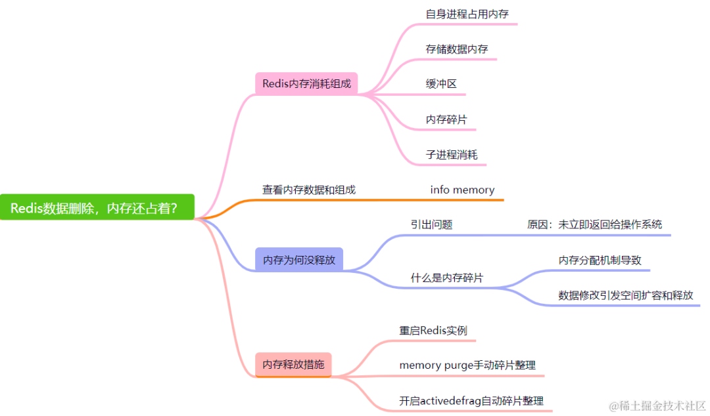

- 为什么需要主从复制？
  - 引入从库虽然导致了数据冗余，但是能够保证数据有异地备份，还能够在故障中快速恢复，能进行读写分离等
- 简述 Redis 的主从复制过程
  - 主从复制的发起者是 slave 节点，而不是 master 节点. 主从复制是推模型
  - 全量复制, 2.8 版本之前都是「全量复制」，具体流程是类似于 RDB 持久化的流程，slave 节点发送 psync 命令后 master 生成 RDB 文件，使用一个缓冲区记录之后的命令。
  - 部分复制,主要有三个关键概念，offset、copybuffer、runid
    - offset 是偏移量，
    - copybuffer 是复制积压缓冲区，每次主节点同步数据推自己的 offset 和 buffer 过来后比对双方数据的 offset，之后决定是否需要同步 buffer 里面的数据。
    -  runid 是每个 slave 节点启动时发给 master 节点，用于标识之前是否同步过，决定进行全量还是部分复制
  - 命令传播阶段主要有两个点，一个是同步增量数据，一个是主从之间发送心跳确认双方在线，slave 节点还会去发送自己的 offset 去获取更新命令
- AOF 重写的触发条件
  - 用户手动触发 bgrewriteaof
  - aof 文件大于阈值
  - aof 文件增长比例超过设置阈值
- 为什么哈希槽的槽数是 16384（2^14）
  - 哈希槽是在 redis 集群模式中用于数据分片的功能，redis 的一致性哈希算法是用了 CRC-16，最多可以哈希到 2^16 也就是可以支持 6W 左右的哈希槽，但是最后只设置了 1W6 左右的哈希槽
  - 心跳包可能会太大导致网络阻塞。redis 集群是使用 gossip 流言协议. 假设槽位设置到了最大，如果一个节点刚好都用到了这些槽位，会导致心跳包达到了 8K，在集群内如果进行传播会导致网络阻塞
  - 集群总节点数在大多数场景不会超过 1K个
  - 提高 gossip 流言协议的传播效率。每个节点都会保存自己用到的哈希槽的 bitmap，在基于流言协议大范围传播节点信息时，会「哈希槽/节点数」的压缩，如果槽位很多的话压缩比率就高，传播节点信息的效率就会高起来
- [Redis 为什么用跳表，而不用平衡树](https://mp.weixin.qq.com/s/c4KjLtZYBVNDTmrjyizVZA)
  - 跳表
    - zset 结构体里有两个数据结构：一个是跳表，一个是哈希表。这样的好处是既能进行高效的范围查询，也能进行高效单点查询。
    - 跳表是在链表基础上改进过来的，实现了一种「多层」的有序链表，这样的好处是能快读定位数据。
    - 跳表在创建节点的时候，随机生成每个节点的层数. 
      - 跳表在创建节点时候，会生成范围为[0-1]的一个随机数，如果这个随机数小于 0.25（相当于概率 25%），那么层数就增加 1 层，然后继续生成下一个随机数，直到随机数的结果大于 0.25 结束，最终确定该节点的层数。
      - 这样的做法，相当于每增加一层的概率不超过 25%，层数越高，概率越低，层高最大限制是 64。
  - 为什么用跳表而不用平衡树
    - 它们不是非常内存密集型的。基本上由你决定。改变关于节点具有给定级别数的概率的参数将使其比 btree 占用更少的内存。
    - Zset 经常需要执行 ZRANGE 或 ZREVRANGE 的命令，即作为链表遍历跳表。通过此操作，跳表的缓存局部性至少与其他类型的平衡树一样好。
    - 它们更易于实现、调试等。例如，由于跳表的简单性，我收到了一个补丁（已经在Redis master中），其中扩展了跳表，在 O(log(N) 中实现了 ZRANK。它只需要对代码进行少量修改。
    - 从内存占用上来比较，跳表比平衡树更灵活一些。平衡树每个节点包含 2 个指针（分别指向左右子树），而跳表每个节点包含的指针数目平均为 1/(1-p)，具体取决于参数 p 的大小。如果像 Redis里的实现一样，取 p=1/4，那么平均每个节点包含 1.33 个指针，比平衡树更有优势。
    - 在做范围查找的时候，跳表比平衡树操作要简单。在平衡树上，我们找到指定范围的小值之后，还需要以中序遍历的顺序继续寻找其它不超过大值的节点。如果不对平衡树进行一定的改造，这里的中序遍历并不容易实现。而在跳表上进行范围查找就非常简单，只需要在找到小值之后，对第 1 层链表进行若干步的遍历就可以实现。
    - 从算法实现难度上来比较，跳表比平衡树要简单得多。平衡树的插入和删除操作可能引发子树的调整，逻辑复杂，而跳表的插入和删除只需要修改相邻节点的指针，操作简单又快速。
- [enhancing the sorted set data type, showcasing a new B+ tree ](https://www.dragonflydb.io/blog/dragonfly-new-sorted-set)
  - a new B+ tree implementation that significantly reduces memory usage by up to 40% and improves performance.
- [Redis 突然变慢了如何排查并解决](https://mp.weixin.qq.com/s/-tcADbKihrfRBzMjl96Q2Q)
  - Redis 性能出问题了么
    - 正常情况下 Redis 处理的时间极短，在微秒级别。有的硬件配置比较高，当延迟 0.6ms，我们可能就认定变慢了。硬件比较差的可能 3 ms 我们才认为出现问题
    - 当你发现 Redis 运行时时的延迟是基线性能的 2 倍以上，就可以判定 Redis 性能变慢了
      - 延迟基线测量
        - redis-cli 命令提供了`–intrinsic-latency `选项，用来监测和统计测试期间内的最大延迟（以毫秒为单位），这个延迟可以作为 Redis 的基线性能
        - `redis-cli --intrinsic-latency 100` 参数100是测试将执行的秒数。我们运行测试的时间越长，我们就越有可能发现延迟峰值。 通常运行 100 秒通常是合适的，足以发现延迟问题了，当然我们可以选择不同时间运行几次，避免误差。
    - 慢指令监控
      - 使用 Redis 慢日志功能查出慢命令
        - slowlog 命令可以让我们快速定位到那些超出指定执行时间的慢命令，默认情况下命令若是执行时间超过 10ms 就会被记录到日志 slowlog 只会记录其命令执行的时间，不包含 io 往返操作，也不记录单由网络延迟引起的响应慢。
        - 我们可以根据基线性能来自定义慢命令的标准（配置成基线性能最大延迟的 2 倍），调整触发记录慢命令的阈值。 `redis-cli CONFIG SET slowlog-log-slower-than 6000`
        - 只需要查看最后 2 个慢命令，输入 slowlog get 2 即可
      - latency-monitor（延迟监控）工具。
        - Redis 在 2.8.13 版本引入了 Latency Monitoring 功能，用于以秒为粒度监控各种事件的发生频率启用延迟监视器的第一步是设置延迟阈值(单位毫秒)
        - `CONFIG SET latency-monitor-threshold 9`
  - 如何解决 Redis 变慢
    - 网络通信导致的延迟 - 需要 pipeline 来解决这个问题
    - Fork 生成 RDB 导致的延迟
      - 生成 RDB 快照，Redis 必须 fork 后台进程。fork 操作（在主线程中运行）本身会导致延迟。 Redis 使用操作系统的多进程写时复制技术 COW(Copy On Write) 来实现快照持久化，减少内存占用。
      - 从库加载 RDB 期间无法提供读写服务，所以主库的数据量大小控制在 2~4G 左右，让从库快速的加载完成。
    - 内存大页（transparent huge pages）
      - 采用了内存大页，生成 RDB 期间，即使客户端修改的数据只有 50B 的数据，Redis 需要复制 2MB 的大页。当写的指令比较多的时候就会导致大量的拷贝，导致性能变慢
    - swap：操作系统分页
      - 内存 swap 是操作系统里将内存数据在内存和磁盘间来回换入和换出的机制，涉及到磁盘的读写。
      - 触发 swap 的情况有哪些呢
        - Redis 使用了比可用内存更多的内存；
        - 与 Redis 在同一机器运行的其他进程在执行大量的文件读写 I/O 操作（包括生成大文件的 RDB 文件和 AOF 后台线程），文件读写占用内存，导致 Redis 获得的内存减少，触发了 swap。
- [Redis 内存优化神技，小内存保存大数据](https://mp.weixin.qq.com/s/rqOuadayzFwmThnPApx7SQ)
  - Redis 如何存储键值对
    - Redis 使用「dict」结构来保存所有的键值对（key-value）数据，这是一个全局哈希表，所以对 key 的查询能以 O(1) 时间得到。
    - 
  - 键值对优化
    - 优化神技：降低 Redis 内存使用的最粗暴的方式就是缩减键（key）与值（value）的长度。
      - 对于 key 的优化：使用单词简写方式优化内存占用。
      - value 的优化
        - 过滤不必要的数据：不要大而全的一股脑将所有信息保存，想办法去掉一些不必要的属性
        - 精简数据：比如用户的会员类型：0 表示「屌丝」、1 表示 「VIP」、2表示「VVIP」
        - 数据压缩：对数据的内容进行压缩，比如使用 GZIP、Snappy
        - 使用性能好，内存占用小的序列化方式
  - 小数据集合编码优化
    - 
    - 数据编码优化技巧
      - ziplist 的不足 - 每次修改都可能触发 realloc 和 memcopy, 可能导致连锁更新(数据可能需要挪动)。
      - quicklist 是 ziplist 和 linkedlist 的混合体，它将 linkedlist 按段切分，每一段使用 ziplist 来紧凑存储，多个 ziplist 之间使用双向指针串接起来。
    - 对象共享池
      - Redis 在启动的时候默认生成一个 0 ~9999 的整数对象共享池用于对象复用，减少内存占用。
    - 使用 Bit 比特位或 byte 级别操作
      - 比如在一些「二值状态统计」的场景下使用 Bitmap 实现，
      - 对于网页 UV 使用 HyperLogLog 来实现，大大减少内存占用。
    - 妙用 Hash 类型优化
      - 比如说系统中有一个用户对象，我们不需要为一个用户的昵称、姓名、邮箱、地址等单独设置一个 key，而是将这个信息存放在一个哈希表里。
      - 当我们为每个属性都创建 key，就会创建大量的 redisObejct 对象占用内存
- [Redis网络编程](https://mp.weixin.qq.com/s/f0muafMRbGyiRXl1O0k5ww)
  - Redis 有多快
    - 在一台普通硬件配置的 Linux 机器上跑单个 Redis 实例，处理简单命令（时间复杂度 O(N) 或者 O(log(N))），QPS 可以达到 8w+，而如果使用 pipeline 批处理功能，则 QPS 至高能达到 100w
  - Redis 为什么快
    - C 语言实现，虽然 C 对 Redis 的性能有助力，但语言并不是最核心因素。
    - 纯内存 I/O，相较于其他基于磁盘的 DB，Redis 的纯内存操作有着天然的性能优势。
    - I/O 多路复用，基于 epoll/select/kqueue 等 I/O 多路复用技术，实现高吞吐的网络 I/O。
    - 单线程模型，单线程无法利用多核，但是从另一个层面来说则避免了多线程频繁上下文切换，以及同步机制如锁带来的开销。
  - Redis 为何选择单线程
    - 对于一个 DB 来说，CPU 通常不会是瓶颈，因为大多数请求不会是 CPU 密集型的，而是 I/O 密集型。具体到 Redis 的话，如果不考虑 RDB/AOF 等持久化方案，Redis 是完全的纯内存操作，执行速度是非常快的，因此这部分操作通常不会是性能瓶颈，Redis 真正的性能瓶颈在于网络 I/O，也就是客户端和服务端之间的网络传输延迟，因此 Redis 选择了单线程的 I/O 多路复用来实现它的核心网络模型。
    - 避免过多的上下文切换开销
      - 多线程调度过程中必然需要在 CPU 之间切换线程上下文 context，而上下文的切换又涉及程序计数器、堆栈指针和程序状态字等一系列的寄存器置换、程序堆栈重置甚至是高速缓存、TLB 快表的汰换，如果是进程内的多线程切换还好一些，因为单一进程内多线程共享进程地址空间，因此线程上下文比之进程上下文要小得多，如果是跨进程调度，则需要切换掉整个进程地址空间。
    - 避免同步机制的开销
      - 如果 Redis 选择多线程模型，又因为 Redis 是一个数据库，那么势必涉及到底层数据同步的问题，则必然会引入某些同步机制，比如锁，而我们知道 Redis 不仅仅提供了简单的 key-value 数据结构，还有 list、set 和 hash 等等其他丰富的数据结构，而不同的数据结构对同步访问的加锁粒度又不尽相同，可能会导致在操作数据过程中带来很多加锁解锁的开销，增加程序复杂度的同时还会降低性能。
    - 简单可维护
  - Redis 真的是单线程
    - Preclude
      - Redis v4.0（引入多线程处理异步任务）
      - Redis v6.0（正式在网络模型中实现 I/O 多线程）
    - 单线程事件循环
      - 从 Redis 的 v1.0 到 v6.0 版本之前，Redis 的核心网络模型一直是一个典型的单 Reactor 模型：利用 epoll/select/kqueue 等多路复用技术，在单线程的事件循环中不断去处理事件（客户端请求），最后回写响应数据到客户端：
    - 多线程异步任务
      - 在 Redis v4.0 之后增加了一些的非阻塞命令如 UNLINK、FLUSHALL ASYNC、FLUSHDB ASYNC
      - UNLINK 命令其实就是 DEL 的异步版本，它不会同步删除数据，而只是把 key 从 keyspace 中暂时移除掉，然后将任务添加到一个异步队列，最后由后台线程去删除，不过这里需要考虑一种情况是如果用 UNLINK 去删除一个很小的 key，用异步的方式去做反而开销更大，所以它会先计算一个开销的阀值，只有当这个值大于 64 才会使用异步的方式去删除 key，对于基本的数据类型如 List、Set、Hash 这些，阀值就是其中存储的对象数量。
    - Redis 多线程网络模型
      - Multiple Reactors
        - 区别于单 Reactor 模式，这种模式不再是单线程的事件循环，而是有多个线程（Sub Reactors）各自维护一个独立的事件循环，由 Main Reactor 负责接收新连接并分发给 Sub Reactors 去独立处理，最后 Sub Reactors 回写响应给客户端。
        - Multiple Reactors 模式通常也可以等同于 Master-Workers 模式，比如 Nginx 和 Memcached 等就是采用这种多线程模型，虽然不同的项目实现细节略有区别，但总体来说模式是一致的。
      - 
      - 这里大部分逻辑和之前的单线程模型是一致的，变动的地方仅仅是把读取客户端请求命令和回写响应数据的逻辑异步化了，交给 I/O 线程去完成，这里需要特别注意的一点是：I/O 线程仅仅是读取和解析客户端命令而不会真正去执行命令，客户端命令的执行最终还是要回到主线程上完成。
      - 使用 I/O 线程实现网络 I/O 多线程化，I/O 线程只负责网络 I/O 和命令解析，不执行客户端命令。
      - 利用原子操作+交错访问实现无锁的多线程模型。
      - 通过设置 CPU 亲和性，隔离主进程和其他子进程，让多线程网络模型能发挥最大的性能。
- [Redis 的大 Key 对持久化有什么影响](https://mp.weixin.qq.com/s/_vIYdzh3dA1kjw4IgMsnPA)
  - 大 Key 对 AOF 日志的影响
    - Redis 提供了 3 种 AOF 日志写回硬盘的策略: Always/EverySec/NO - 这三种策略只是在控制 fsync() 函数的调用时机
      - Always 策略就是每次写入 AOF 文件数据后，就执行 fsync() 函数；
        - 当使用 Always 策略的时候，如果写入是一个大 Key，主线程在执行 fsync() 函数的时候，阻塞的时间会比较久，因为当写入的数据量很大的时候，数据同步到硬盘这个过程是很耗时的。
      - Everysec 策略就会创建一个异步任务来执行 fsync() 函数；
      - No 策略就是永不执行 fsync() 函数;
    - 当应用程序向文件写入数据时，内核通常先将数据复制到内核缓冲区中，然后排入队列，然后由内核决定何时写入硬盘。如果想要应用程序向文件写入数据后，能立马将数据同步到硬盘，就可以调用 fsync() 函数，这样内核就会将内核缓冲区的数据直接写入到硬盘，等到硬盘写操作完成后，该函数才会返回。
  - 大 Key 对 AOF 重写和 RDB 的影响
    - 当 AOF 日志写入了很多的大 Key，AOF 日志文件的大小会很大，那么很快就会触发 AOF 重写机制。
    - AOF 重写机制和 RDB 快照（bgsave 命令）的过程，都会分别通过 fork() 函数创建一个子进程来处理任务。
    - 在通过  fork()  函数创建子进程的时候，虽然不会复制父进程的物理内存，但是内核会把父进程的页表复制一份给子进程，如果页表很大，那么这个复制过程是会很耗时的，那么在执行 fork 函数的时候就会发生阻塞现象。
    - fork 函数是由 Redis 主线程调用的，如果 fork 函数发生阻塞，那么意味着就会阻塞 Redis 主线程。由于 Redis 执行命令是在主线程处理的，所以当 Redis 主线程发生阻塞，就无法处理后续客户端发来的命令。
      - 如果 fork 耗时很大，比如超过1秒，则需要做出优化调整：
        - 单个实例的内存占用控制在 10 GB 以下，这样 fork 函数就能很快返回。
        - 如果 Redis 只是当作纯缓存使用，不关心 Redis 数据安全性问题，可以考虑关闭 AOF 和 AOF 重写，这样就不会调用 fork 函数了。
        - 在主从架构中，要适当调大 repl-backlog-size，避免因为  repl_backlog_buffer 不够大，导致主节点频繁地使用全量同步的方式，全量同步的时候，是会创建 RDB 文件的，也就是会调用 fork 函数。
    - 那什么时候会发生物理内存的复制呢？
      - 当父进程或者子进程在向共享内存发起写操作时，CPU 就会触发缺页中断，这个缺页中断是由于违反权限导致的，然后操作系统会在「缺页异常处理函数」里进行物理内存的复制，并重新设置其内存映射关系，将父子进程的内存读写权限设置为可读写，最后才会对内存进行写操作，这个过程被称为「**写时复制(Copy On Write)**」
      - 如果创建完子进程后，父进程对共享内存中的大 Key 进行了修改，那么内核就会发生写时复制，会把物理内存复制一份，由于大 Key 占用的物理内存是比较大的，那么在复制物理内存这一过程中，也是比较耗时的，于是父进程（主线程）就会发生阻塞。
    - 有两个阶段会导致阻塞父进程：
      - 创建子进程的途中，由于要复制父进程的页表等数据结构，阻塞的时间跟页表的大小有关，页表越大，阻塞的时间也越长；
      - 创建完子进程后，如果子进程或者父进程修改了共享数据，就会发生写时复制，这期间会拷贝物理内存，如果内存越大，自然阻塞的时间也越长
    - 如果 Linux 开启了内存大页，会影响 Redis 的性能的
      - Linux 内核从 2.6.38 开始支持内存大页机制，该机制支持 2MB 大小的内存页分配，而常规的内存页分配是按 4KB 的粒度来执行的。
      - 每次写命令引起的复制内存页单位放大了 512 倍，会拖慢写操作的执行时间，最终导致 Redis 性能变慢。
  - 总结
    - 当 AOF 写回策略配置了 Always 策略，如果写入是一个大 Key，主线程在执行 fsync() 函数的时候，阻塞的时间会比较久，因为当写入的数据量很大的时候，数据同步到硬盘这个过程是很耗时的。
    - AOF 重写机制和 RDB 快照（bgsave 命令）的过程，都会分别通过 fork() 函数创建一个子进程来处理任务。会有两个阶段会导致阻塞父进程（主线程）：
      - 创建子进程的途中，由于要复制父进程的页表等数据结构，阻塞的时间跟页表的大小有关，页表越大，阻塞的时间也越长；
      - 创建完子进程后，如果父进程修改了共享数据中的大 Key，就会发生写时复制，这期间会拷贝物理内存，由于大 Key 占用的物理内存会很大，那么在复制物理内存这一过程，就会比较耗时，所以有可能会阻塞父进程。
    - 大 key 除了会影响持久化之外，还会有以下的影响。
      - 客户端超时阻塞。由于 Redis 执行命令是单线程处理，然后在操作大 key 时会比较耗时，那么就会阻塞 Redis，从客户端这一视角看，就是很久很久都没有响应。
      - 引发网络阻塞。每次获取大 key 产生的网络流量较大，如果一个 key 的大小是 1 MB，每秒访问量为 1000，那么每秒会产生 1000MB 的流量，这对于普通千兆网卡的服务器来说是灾难性的。
      - 阻塞工作线程。如果使用 del 删除大 key 时，会阻塞工作线程，这样就没办法处理后续的命令。
      - 内存分布不均。集群模型在 slot 分片均匀情况下，会出现数据和查询倾斜情况，部分有大 key 的 Redis 节点占用内存多，QPS 也会比较大。
- [Redis 持久化策略浅析](https://mp.weixin.qq.com/s/v4z9tUm46mUN4SxxMwwP6A)
  - RDB 将当前数据保存到硬盘，AOF 则是将每次执行的写命令保存到硬盘（类似于 MySQL 的 Binlog）。AOF 持久化的实时性更好，即当进程意外退出时丢失的数据更少。
  - RDB(Redis Data Base) 内存快照
    - 优点：
      - 存储紧凑，节省内存空间。
      - 恢复速度非常快。
      - 适合全量备份、全量复制的场景，经常用于灾难恢复（对数据的完整性和一致性要求相对较低的场合）。
    - 缺点：
      - 容易丢失数据，容易丢失两次快照之间 Redis 服务器中变化的数据。
      - RDB 通过 fork 子进程对内存快照进行全量备份，是一个重量级操作，频繁执行成本高。
    - RDB 文件结构
      - Redis 将数据库快照保存在名字为 dump.rdb 的二进制文件中. RDB 文件结构由五个部分组成：
    - RDB 文件的创建
      - 手动触发 RDB 持久化的方式可以使用 save 命令和 bgsave 命令
      - 在默认情况下，Redis 将数据库快照保存在名字为 dump.rdb的二进制文件中。可以对 Redis 进行设置，让它在“ N 秒内数据集至少有 M 个改动”这一条件被满足时，自动保存一次数据集。
    - 备份过程
      - RDB 持久化方案进行备份时，Redis 会单独 fork 一个子进程来进行持久化，会将数据写入一个临时文件中，持久化完成后替换旧的 RDB 文件。在整个持久化过程中，主进程（为客户端提供服务的进程）不参与 IO 操作，这样能确保 Redis 服务的高性能
      - Redis 父进程首先判断：当前是否在执行 save，或 bgsave/bgrewriteaof 的子进程，如果在执行则 bgsave 命令直接返回。bgsave/bgrewriteaof 的子进程不能同时执行，主要是基于性能方面的考虑：两个并发的子进程同时执行大量的磁盘写操作，可能引起严重的性能问题。
      - 子进程进程对内存数据生成快照文件。
      - 父进程在此期间接收的新的写操作，使用 COW 机制写入。
  - AOF(Append Only File) 增量日志
    - 优点：
      - 数据的备份更加完整，丢失数据的概率更低，适合对数据完整性要求高的场景
      - 日志文件可读，AOF 可操作性更强，可通过操作日志文件进行修复
    - 缺点：
      - AOF 日志记录在长期运行中逐渐庞大，恢复起来非常耗时，需要定期对 AOF 日志进行瘦身处理
      - 恢复备份速度比较慢
      - 同步写操作频繁会带来性能压力
    - AOF 文件内容
      - 被写入 AOF 文件的所有命令都是以 RESP 格式保存的，是纯文本格式保存在 AOF 文件中。
    - AOF 持久化实现
      - AOF 持久化方案进行备份时，客户端所有请求的写命令都会被追加到 AOF 缓冲区中，缓冲区中的数据会根据 Redis 配置文件中配置的同步策略来同步到磁盘上的 AOF 文件中，追加保存每次写的操作到文件末尾。
      - 同时当 AOF 的文件达到重写策略配置的阈值时，Redis 会对 AOF 日志文件进行重写，给 AOF 日志文件瘦身。
      - Redis 服务重启的时候，通过加载 AOF 日志文件来恢复数据。
      - 文件写入(write)和文件同步(sync)
        - Linux 操作系统中为了提升性能，使用了页缓存（page cache）。当我们将 aof_buf 的内容写到磁盘上时，此时数据并没有真正的落盘，而是在 page cache 中，为了将 page cache 中的数据真正落盘，需要执行 fsync / fdatasync 命令来强制刷盘
        - AOF 缓存区的同步文件策略由参数 appendfsync 控制，有三种同步策略，各个值的含义如下：
          - always：命令写入 aof_buf 后立即调用系统 write 操作和系统 fsync 操作同步到 AOF 文件，fsync 完成后线程返回。
          - no：命令写入 aof_buf 后调用系统 write 操作，不对 AOF 文件做 fsync 同步；同步由操作系统负责，通常同步周期为30秒。
          - everysec
      - 文件重写(rewrite)
        - 定期重写 AOF 文件，达到压缩的目的。
        - 通过 fork 一个子进程，重新写一个新的 AOF 文件，该次重写不是读取旧的 AOF 文件进行复制，而是读取内存中的Redis数据库，重写一份 AOF 文件，有点类似于 RDB 的快照方式。
  - AOF 与 WAL
    - 如果先让系统执行命令，只有命令能执行成功，才会被记录到日志中。因此，Redis 使用写后日志这种形式，可以避免出现记录错误命令的情况。
    - 另外还有一个原因就是：AOF 是在命令执行后才记录日志，所以不会阻塞当前的写操作。
  - AOF 和 RDB 之间的相互作用
    - 如果 BGSAVE 正在执行，并且用户显示地调用 BGREWRITEAOF 命令，那么服务器将向用户回复一个 OK 状态，并告知用户，BGREWRITEAOF 已经被预定执行：一旦 BGSAVE 执行完毕 BGREWRITEAOF 就会正式开始。
    - 当 Redis 启动时，如果 RDB 持久化和 AOF 持久化都被打开了，那么程序会优先使用 AOF 文件来恢复数据集，因为 AOF 文件所保存的数据通常是最完整的。
  - 混合持久化
    - 在开启了 RDB-AOF 混合持久化功能之后，服务器生成的 AOF 文件将由两个部分组成，其中位于 AOF 文件开头的是 RDB 格式的数据，而跟在 RDB 数据后面的则是 AOF 格式的数据。
    - Redis 服务器在执行 AOF 重写操作时，就会像执行 BGSAVE 命令那样，根据数据库当前的状态生成出相应的 RDB 数据，并将这些数据写入新建的 AOF 文件中，至于那些在 AOF 重写开始之后执行的 Redis 命令，则会继续以协议文本的方式追加到新 AOF 文件的末尾，即已有的 RDB 数据的后面。
- Redis分布式锁
  - 是不可重入的
    - 所谓的不可重入，就是当前线程执行某个方法已经获取了该锁，那么在方法中尝试再次获取锁时，会阻塞，不可以再次获得锁。同一个人拿一个锁 ，只能拿一次不能同时拿2次。
  - 要注意Redis主从复制的坑
    - Redlock
    - 搞多个Redis master部署，以保证它们不会同时宕掉。并且这些master节点是完全相互独立的，相互之间不存在数据同步。同时，需要确保在这多个master实例上，是与在Redis单实例，使用相同方法来获取和释放锁。
  - Redis分布式锁安全
    - 基于 Redis 实现的分布式锁，一个严谨的的流程如下：
      - 加锁：SET unique_id EX $expire_time NX
      - 操作共享资源：没操作完之前，开启守护线程，定期给锁续期
      - 释放锁：Lua 脚本，先 GET 判断锁是否归属自己，再 DEL 释放锁
    - 问题的解决方案：
      - 死锁：给锁设置租期（过期时间）
      - 过期时间评估不好，锁提前过期：守护线程，定时续期
      - 锁被别人释放：锁写入唯一标识，释放锁先检查标识，再释放
    - Redis 主从同步对分布式锁的影响
      - 那当「主从发生切换」时，这个分布锁会依旧安全吗？- Redlock
        - Redlock 不伦不类：它对于效率来讲，Redlock 比较重，没必要这么做，而对于正确性来说，Redlock 是不够安全的。
        - 时钟假设不合理：该算法对系统时钟做出了危险的假设（假设多个节点机器时钟都是一致的），如果不满足这些假设，锁就会失效。
        - 无法保证正确性：Redlock 不能提供类似 fencing token 的方案，所以解决不了正确性的问题。为了正确性，请使用有「共识系统」的软件，例如 Zookeeper
      - 一个好的分布式锁，无论 NPC 怎么发生，可以不在规定时间内给出结果，但并不会给出一个错误的结果。也就是只会影响到锁的「性能」（或称之为活性），而不会影响它的「正确性」。
      - 同意对方关于「时钟跳跃」对 Redlock 的影响，但认为时钟跳跃是可以避免的，取决于基础设施和运维。
      - Redlock 在设计时，充分考虑了 NPC 问题，在 Redlock 步骤 3 之前出现 NPC，可以保证锁的正确性，但在步骤 3 之后发生 NPC，不止是 Redlock 有问题，其它分布式锁服务同样也有问题，所以不在讨论范畴内。
    - 1、使用分布式锁，在上层完成「互斥」目的，虽然极端情况下锁会失效，但它可以最大程度把并发请求阻挡在最上层，减轻操作资源层的压力。
    - 2、但对于要求数据绝对正确的业务，在资源层一定要做好「兜底」，设计思路可以借鉴 fecing token 的方案来做，即在 DB 层通过版本号的方式来更新数据，避免并发冲突。
- Redis可能会踩到坑
  - 过期时间意外丢失？
    - SET 命令如果不设置过期时间，那么 Redis 会自动「擦除」这个 key 的过期时间。
  - RANDOMKEY 竟然也会阻塞 Redis？
    - 如果此时 Redis 中，有大量 key 已经过期，但还未来得及被清理掉，那这个循环就会持续很久才能结束，而且，这个耗时都花费在了清理过期 key + 寻找不过期 key 上。
  - 执行 MONITOR 也会导致 Redis OOM
    - 当你在执行 MONITOR 命令时，Redis 会把每一条命令写到客户端的「输出缓冲区」中，然后客户端从这个缓冲区读取服务端返回的结果。
    - 如果你的 Redis QPS 很高，这将会导致这个输出缓冲区内存持续增长，占用 Redis 大量的内存资源，如果恰好你的机器的内存资源不足，那 Redis 实例就会面临被 OOM 的风险。
  - AOF everysec 真的不会阻塞主线程吗
    - Redis 后台线程在执行 AOF page cache 刷盘（fysnc）时，如果此时磁盘 IO 负载过高，那么调用 fsync 就会被阻塞住。
  - AOF everysec 真的只会丢失 1 秒数据
    - 后台线程在执行 fsync 刷盘时，主线程最多等待 2 秒不会写 AOF page cache
  - 主从复制会丢数据吗
    - Redis 的主从复制是采用「异步」的方式进行的. 如果 master 突然宕机，可能存在有部分数据还未同步到 slave 的情况发生
    - 对于把 Redis 当做数据库，或是当做分布式锁来使用的业务，有可能因为异步复制的问题，导致数据丢失 / 锁丢失。
- [del vs unlink]
  - DEL 和 UNLINK 都是同步的释放 key 对象，区别是怎么释放后面的 value 对象
  - DEL 每次都是同步释放 value 部分，如果 value 很大，例如一个 list 里很多元素，这会阻塞 Redis 工作线程。
  - 目前默认的阈值是 64，例如只有一个 list 里面含有超过 64 个元素，才会异步释放，否则也是会同步释放 不同的数据结构的计算阈值的方式不一样
  - 一个原则：就是要释放多少块内存 即在小对象上使用 UNLINK 效果等同于 DEL，也是同步释放，区别就是要多走几个函数调用，例如判断 list 里需要判断列表的长度等
  - 至于说 string 为啥不异步释放，主要是作者认为它是一整块内存空间，计算阈值的时候 string 的结果固定是 1，那么就 <= 64，就是同步释放
  - 对于每一次的 async delete，主线程给子线程提交任务时需要加锁解锁，bio 子线程消费任务的时候也要加锁解锁，要做一些线程同步，还有线程上下文切换，这些都是可能会有的潜在的问题，如果小元素都异步释放的话，的确代价可能会大，多线程做事情的确是会有这些麻烦。
- [High Performance Redis](https://gist.github.com/neomantra/3c9b89887d19be6fa5708bf4017c0ecd)
- Redis 的三种集群模式
   -  主从复制模式
     - Redis不具备自动容错和恢复功能，主机从机的宕机都会导致前端部分读写请求失败，需要等待机器重启或者手动切换前端的IP才能恢复
     - Redis 较难支持在线扩容，在集群容量达到上限时在线扩容会变得很复杂
   -  哨兵模式
     - 哨兵模式是一种特殊的模式，主要用于监控 Redis 的主从复制是否正常工作，其本身不提供数据服务，如果主从复制出现问题，哨兵模式可以自动完成主从切换
     - 优点：
       - 哨兵模式是基于主从模式的，所有主从的优点，哨兵模式都具有。
       - 主从可以自动切换，系统更健壮，可用性更高(可以看作自动版的主从复制)。
     - 缺点：
       - Redis较难支持在线扩容，在集群容量达到上限时在线扩容会变得很复杂。
   - 集群模式
     - 所有的 redis 节点彼此互联(PING-PONG机制)，内部使用二进制协议优化传输速度和带宽。
     - 节点的 fail 是通过集群中超过半数的节点检测失效时才生效。
     - 客户端与 Redis 节点直连，不需要中间代理层.客户端不需要连接集群所有节点，连接集群中任何一个可用节点即可。
     - 缺点
       - 数据迁移成本高：Redis Cluster模式下，当需要增加或减少节点时，需要进行数据迁移，这会带来一定的成本和风险，尤其是在数据量较大的情况下。
       - 集群扩容困难：Redis Cluster模式下，集群的扩容需要进行数据迁移和重新分片，这会带来一定的复杂性和风险，尤其是在集群规模较大的情况下。
       - 部分功能受限：Redis Cluster模式下，一些Redis的功能受到了限制，例如事务、Lua脚本、pub/sub等功能，这些功能只能在单个节点上使用，不能跨节点使用
- [go-redis connection pool timeout](https://redis.uptrace.dev/guide/go-redis-debugging.html#connection-pool-size)
  - 从 Redis 连接池里拿 conn 的时候超时，原因可能有下面几个：
    - 1）连接池设置太小，连接被其他Goroutine拿去使用了，没有来得及归还；
    - 2）Redis 性能瓶颈，导致每次请求要很长时间；
    - 3）网络延迟过大，同样有可能导致每次请求要很长时间。
  - 内存数据库 - `最大连接数 = 最大并发量 / (1000ms / 每次请求耗时ms)`
  - 磁盘数据库 - `connections = ((core_count * 2) + effective_spindle_count)`
- [Redis变慢]
  - 为了避免业务服务器到 Redis 服务器之间的网络延迟，你需要直接在 Redis 服务器上测试实例的响应延迟情况
    `redis-cli -h 127.0.0.1 -p 6379 --intrinsic-latency 60` `redis-cli -h 127.0.0.1 -p 6379 --latency-history -i 1`
  - 查看一下 Redis 的慢日志（slowlog）
    `CONFIG SET slowlog-log-slower-than 5000  CONFIG SET slowlog-max-len 500` `SLOWLOG get 5`
  - 通过 Redis 的内部监控指标，查看 Redis 的内部状态
    `INFO COMMANDSTATS` `INFO CPU` `INFO MEMORY` `INFO PERSISTENCE` `INFO REPLICATION` `INFO STATS` `INFO KEYSPACE`
  - 操作bigkey
    `redis-cli -h 127.0.0.1 -p 6379 --bigkeys -i 0.01`
  - fork耗时严重
    `Redis 上执行 INFO 命令，查看 latest_fork_usec 项，单位微秒。`
  - 开启内存大页
    `cat /sys/kernel/mm/transparent_hugepage/enabled`
  - 碎片整理
    `通过执行 INFO 命令，得到这个实例的内存碎片率`
- Redis Overview
  - 
  - Redis 是单线程吗
    - Redis 单线程指的是「接收客户端请求->解析请求 ->进行数据读写等操作->发送数据给客户端」这个过程是由一个线程（主线程）来完成的
    - Redis 在启动的时候，是会启动后台线程（BIO）来进行一些后台操作的，比如持久化、集群数据同步等
    - redis 采用单线程（网络 I/O 和执行命令）那么快，有如下几个原因：
      - Redis 的大部分操作都在内存中完成，并且采用了高效的数据结构，因此 Redis 瓶颈可能是机器的内存或者网络带宽，而并非 CPU，既然 CPU 不是瓶颈，那么自然就采用单线程的解决方案了；
      - Redis 采用单线程模型可以避免了多线程之间的竞争，省去了多线程切换带来的时间和性能上的开销，而且也不会导致死锁问题。
      - Redis 采用了 I/O 多路复用机制处理大量的客户端 Socket 请求，IO 多路复用机制是指一个线程处理多个 IO 流，就是我们经常听到的 select/epoll 机制。
  - Redis 6.0 之后为什么引入了多线程
    - 为了提高网络 I/O 的并行度，Redis 6.0 对于网络 I/O 采用多线程来处理。但是对于命令的执行，Redis 仍然使用单线程来处理
    - Redis 6.0 版本之后，Redis 在启动的时候，默认情况下会额外创建 6 个线程（这里的线程数不包括主线程）：
      - Redis-server ： Redis的主线程，主要负责执行命令；
      - bio_close_file、bio_aof_fsync、bio_lazy_free：三个后台线程，分别异步处理关闭文件任务、AOF刷盘任务、释放内存任务；
      - io_thd_1、io_thd_2、io_thd_3：三个 I/O 线程，io-threads 默认是 4 ，所以会启动 3（4-1）个 I/O 多线程，用来分担 Redis 网络 I/O 的压力。
- [Making sense of Redis’ SCAN cursor](https://engineering.q42.nl/redis-scan-cursor/)
- [一次访问Redis延时高问题排查](https://mp.weixin.qq.com/s?__biz=MzIzOTU0NTQ0MA==&mid=2247533651&idx=1&sn=bc8e313fa5b767f401719deba42b6e93&chksm=e92a795cde5df04a43569c6137c0bd46b20fdf7dc1c3ea0380d33e2f915a37b59c0df8a10131&scene=21#wechat_redirect)
  ```
  spring.redis.jedis.pool.max-active=500 // 线上稳定保有4台, 4*500=2000, 仍然远小于Redis规格支持的3w
  spring.redis.jedis.pool.max-idle=500
  
  spring.redis.jedis.pool.time-between-eviction-runs-millis=30000 // 定时心跳保活与检测
  
  spring.redis.jedis.pool.min-idle=500 // 连接池的稳定数量
  spring.redis.jedis.pool.test-while-idle=true //定时心跳保活与检测
  spring.redis.jedis.pool.num-tests-per-eviction-run=-1 // 每次保活检测, 都需要把500个连接都检测一遍. 如果设置为-2, 则每次检测1/2比例的的连接.
  spring.redis.jedis.pool.min-evictable-idle-time-millis=-1 // 不要因为idleTime大于某个阈值从而把连接给删除掉. 这样可以防止无意义的大规模连接重建。
  ```
  - [后续](https://mp.weixin.qq.com/s/trbGNYZPEfzaAMz6kZ_YKg)
    - 扩展JedisConnectionConfiguration支持其他参
    - SpringBoot官方能够在配置文件里支持这些JedisPool/CommonsObjectPool2原生的参数
- [开发redis module](https://mp.weixin.qq.com/s/W8qZo7C4IxO3D5To7_SRwg)
- [Redis 服务排障]
  - Issue
    - A 模块的 B 阶段的处理耗时突然慢了
  - 服务排障的基本方法
    - 因为 B 阶段不是 A 模块的第一个阶段，所以基本排除是模块间的网络通信、带宽等问题。
    - 首先排查 A 模块本身的问题，这里的经验是，横向看基础指标，纵向看代码变更。
    - 先看 A 模块服务的基础资源数据, CPU、内存、网络 IO、磁盘 IO
    - 再看看是不是数据量出现问题
    - 问题出在 A 模块的 B 阶段，那首先进行细化，到底哪个方法出现了这么就耗时，排查耗时这里也有两个思路：
      - 1.业务打点进行排查；
      - 2.性能分析工具排查。
    - 在模块的日志中进行耗时采集和输出 - 结果都基本上定位到函数是 Redis 的计数自增逻辑
    - 用性能分析工具去定位精确函数 - pprof
  - Redis 服务排障的基本方法
    - Redis 服务本身问题——Redis 所在节点网路延迟问题确认
      - 网络和通信导致的固有延迟：
      - 客户端使用 TCP/IP 连接或 Unix 域连接连接到 Redis，在 1 Gbit/s 网络下的延迟约为200 us，而 Unix 域 Socket 的延迟甚至可低至 30 us，这实际上取决于网络和系统硬件；
      - 在网络通信的基础之上，操作系统还会增加了一些额外的延迟（如线程调度、CPU 缓存、NUMA 等）；并且在虚拟环境中，系统引起的延迟比在物理机上也要高得多。
    - Redis 服务本身问题——Redis 自身服务网路延迟问题确认
      - redis-cli -h 127.0.0.1 -p 6379 --intrinsic-latency 60
      - redis-cli -h 127.0.0.1 -p 6379 --latency-history -i 1
      - 吞吐量（使用info stats）
      - 使用 info Replication 命令查看主从复制的状态
    - Redis 服务本身问题——CPU、Memory、磁盘 IO - info memory；info CPU；info Persistence
      - memory 这里，主要关注三个指标
        - used_memory_rss_human：表示目前的内存实际占用——表示当前的内存情况。
        - used_memory_peak_human：表示内存峰值占用——表示曾经的内存情况（主要是用来抓不到现场的时候查问题用的
        - mem_fragmentation_ratio 内存碎片率( mem_fragmentation_ratio )指标给出了操作系统( used_memory_rss )使用的内存与 Redis( used_memory )分配的内存的比率 mem_fragmentation_ratio = used_memory_rss / used_memory 
          - 操作系统中的虚拟内存管理器保管着由内存分配器分配的实际内存映射 那么如果我们的 Redis 实例的内存使用量为1 GB，内存分配器将首先尝试找到一个连续的内存段来存储数据
          - 如果找不到连续的段，则分配器必须将进程的数据分成多个段，从而导致内存开销增加
          - Redis 内存碎片的产生与清理 内存碎片率大于1表示正在发生碎片，内存碎片率超过1.5表示碎片过多，Redis 实例消耗了其实际申请的物理内存的150%的内存；
          - 如果内存碎片率低于1，则表示Redis需要的内存多于系统上的可用内存，这会导致 swap 操作。
      - 作为内存型数据库，磁盘也是一个关键点：这里包含了两个方面（1.持久化 2.内存交换）
        - 一是最大内存限制 maxmemory，如果不设这个值，可能导致内存超过了系统可用内存，然后就开始 swap，最终可能导致 OOM。
        - 二是内存驱逐策略 maxmemory-policy，如果设了 maxmemory 这个值，还需要让系统知道，内存按照什么样策略来释放。
        - 三是驱逐数：evicted_keys，这个可以通过 info stats 查看，即采用驱逐策略真正剔除的数据数目。
        - 四是内存碎片率，在上面的引用已经给出了，内存碎片率低的情况下可能导致 swap。这里其实是内存和磁盘 IO 的联动点。
  - CPU 高、hotkey 明显。这里隐含了一个点：与 CPU 相对的是 OPS 并没有很高。
  - hotkey 其实就会导致 CPU 变高，而这时，因为大量的 CPU 都在数据切换和存储上，导致其他的请求比较慢。
- Redis 内部使用不同编码
  - 当执行 hset/hmset 命令时，代码中会去检查哈希的对象编码以及相关条件来判断该采用哪种编码方式
    - 检查 value 大小
    - 检查 field 的个数
  - 两种编码的时间复杂度对比
    - HEXISTS/HGET/HDEL 命令使用 hashtable 时间复杂度为O(1)，而使用 ziplist 编码为O(N)
  - 优化思路
    - Redis 服务端优化：
      - 通过调整 hash-max-ziplist-entries 或是 hash-max-ziplist-value 配置项，从而控制哈希对象的编码方式，例如把 hash-max-ziplist-entries 从512改成256，那么超过256个 field 就会自动转换成 hashtable
    - Redis 客户端优化：
      - 满足 hash-max-ziplist-value 条件
        - 例如在哈希对象中存入一个特殊 field，让这个 field 的 value 超过64B，这样这个 key 就自动变成 hashtable 编码，但是需要业务能识别这个特殊的 field，避免出现 bug。
      - 满足 hash-max-ziplist-entries 条件
        - 很多业务的哈希对象是经过一次拆分了，通过取模 hash 的方式拆分到多个哈希对象，也可以通过将拆分的哈希对象减少，从而达到满足单个哈希对象中 field 个数超过512个的条件
    - 业务使用建议：
      - 尽量避免热 key 现象
        - 我们使用的是 Redis 的 cluster 版本，如果把业务的大部分流量都集中在某个或某几个 key 上，就无法充分发挥分布式集群的作用，压力都集中在个别的 Redis 实例上，从而出现热点瓶颈。
      - 使用 list/hash/set/zset 等数据结构时要注意性能问题
        - 需要根据自己的单个 key 中的 field 个数，value 大小，以及使用的命令等综合考虑性能和成本，如果需要了解自己的 key 的实际编码个数可以通过命令：object encoding 查看
- [Redis 异地多活](https://mp.weixin.qq.com/s/UcyO3J0XEEe1sH3frmmNDg)
  - Redis 遇到了回环、重试、数据冲突、增量数据存储和读取等问题
- [Redis 内存泄漏](https://mp.weixin.qq.com/s/mlLr5RxDMH9d8HwwHQlGww)
  - 使用工具定位
    - memory doctor Redis4 引入的内存诊断命令，3系列未实现
    - 3.2.8版本使用 jemalloc-4.0.3作为内存分配器，尝试使用 jeprof 工具分析内存使用情况，发现 jemalloc 编译时需要提前添加--enable-prof编译选项，此路不通
    - 使用 perf 抓取 brk 系统调用，未发现异常（实际上最近两个月也未发生泄漏）
    - valgrind 作为最后手段，不确定是否可以复现
  - 使用 hexdump 观察昨天的内存 dump 文件，发现泄漏内存为 SDS 字符串数据类型，且连续分布
  - 排除了 rax 树的泄漏，同时综合 redis 使用 sds key 的情况，此时把怀疑重点放在了 write 等 dict 的释放方法上，以及 rdb 的加载时 key 的临时结构体变量
- [Redis做了数据删除操作，为什么使用top命令时，还是显示Redis占了很多内存](https://mp.weixin.qq.com/s/h5Dp-14sg0pqJPsJOkE_Mg)
  - 当数据删除后，Redis 释放的内存空间会由内存分配器管理，并不会立即返回给操作系统
  - 
- [Question]
  - 为什么哈希槽是16384
    - Redis作者认为集群在一般情况下是不会超过1000个实例
    - 那就取了16384个，即可以将数据合理打散至Redis集群中的不同实例，又不会在交换数据时导致带宽占用过多
  - 为什么对数据进行分区在Redis中用的是「哈希槽」这种方式吗？而不是一致性哈希算法
    - 在我理解下，一致性哈希算法就是有个「哈希环」，当客户端请求时，会对Key进行hash，确定在哈希环上的位置，然后顺时针往后找，找到的第一个真实节点：
    - 一致性哈希算法比「传统固定取模」的好处就是：如果集群中需要新增或删除某实例，只会影响一小部分的数据：
    - 但如果在集群中新增或者删除实例，在一致性哈希算法下，就得知道是「哪一部分数据」受到影响了，需要进行对受影响的数据进行迁移
    - 而哈希槽的方式，我们通过上面已经可以发现：在集群中的每个实例都能拿到槽位相关的信息：
    - 当客户端对key进行hash运算之后，如果发现请求的实例没有相关的数据，实例会返回「重定向」命令告诉客户端应该去哪儿请求：
    - 集群的扩容、缩容都是以「哈希槽」作为基本单位进行操作，总的来说就是「实现」会更加简单（简洁，高效，有弹性）。过程大概就是把部分槽进行重新分配，然后迁移槽中的数据即可，不会影响到集群中某个实例的所有数据。
- [Redis 延时毛刺](https://mp.weixin.qq.com/s/8A_y1dlZrUvpaJfbQrVK3w)
  - 问题
    - 业务发现部分线上集群出现 10 分钟一次的耗时毛刺。
  - 定位
    - 业务层面：部分集群发现少量 LUA script 相关的慢速日志
    - 网络层面：使用 mtr 观测出现问题的时间点网络状态，并排查上层交换机之后未见异常
    - 系统层面：根据业务反馈之前有类似故障出现，原因是 atop 采集进程 PSS 导致延迟增加。该 case 可以稳定复现，现象略有不同；抽查有异常机器检查未发现有安装 atop。
    - 应用层：相关集群已经较长时间没有版本更新，使用 perf record 很难发现毛刺类型问题
  - 解决
    - 线上部分机器部署的 atop 版本 默认启用了 -R 选项。在 atop 读 /proc/${pid}/smaps 时，会遍历整个进程的页表，期间会持有内存页表的锁。
    - 如果在此期间进程发生 page fault，也需要获取锁，就需要等待锁释放。具体到应用层面就是请求耗时毛刺
    - 除了 atop，cadvisor 等应用也会读取 /proc/${pid}/smaps，虽然默认关闭。由于关闭的方式是通过 disable_metrics 来指定关闭。如果自定义参数时遗漏相关参数，还是会打开该功能触发耗时毛刺
  - 根因分析
    - 当读取 /proc/${pid}/smaps 获得某个进程虚拟内存区间信息时，究竟发生了什么？
    - 进程的调用耗时而言，由两部分耗时组成：用户空间和内核空间。
      - 用户空间
        - 由于在线的 Redis 版本缺少 P99 指标，可以使用 funcslower(bcc) 可以定位或排除 Redis 执行毛刺，将范围缩小到网络或者单机问题
        - ·$> funcslower -UK -u 5000 -p 324568 '/var/lib/docker/overlay2/69e6c3d262a1aed8db1a8b16ddfc34c7c78999f527e028857dc2e5248ae5704a/merged/usr/local/bin/redis-server:processCommand'·
      - 内核空间
        - syscount(bcc)
        - perf trace，相较于 syscount 提供了 histogram 图，可以直观的发现长尾问题 ·perf trace -p $PID -s·
- [redis为什么使用哈希槽而不是一致性hash](https://mp.weixin.qq.com/s/Q68UN34-BqxyQFtkJL98lg)
  - 简单性：哈希槽的设计相对于一致性哈希更为简单。在 Redis Cluster 中，所有的键被分配到 0-16383 的 16384 个哈希槽中。每个 Redis Cluster 节点负责一部分哈希槽，例如在一个 3 节点的集群中，每个节点可能负责大约 5461 个哈希槽。  
  - 重新分片：当需要添加或删除节点时，哈希槽使得重新分片变得相对容易。只需要将一部分哈希槽从一个节点移动到另一个节点，而不需要对所有键进行重新哈希。  
  - 性能：一致性哈希可能会导致不均匀的数据分布，特别是在节点数量较少的情况下。而哈希槽可以保证数据在各个节点上的均匀分布，从而提高性能。  
  - 多键操作：Redis Cluster 支持多键操作，但要求所有键必须在同一个哈希槽中。这种设计在一致性哈希中是无法实现的。
- 经典问题
  - 缓存雪崩
    - 指缓存同一时间大面积的失效，所以，后面的请求都会落到数据库上，造成数据库短时间内承受大量请求而崩掉
    - Redis 高可用，主从+哨兵，Redis cluster，避免全盘崩溃；
    - 本地 ehcache 缓存 + hystrix 限流&降级，避免 MySQL 被打死；
    - 缓存数据的过期时间设置随机，防止同一时间大量数据过期现象发生；
    - 逻辑上永不过期给每一个缓存数据增加相应的缓存标记，缓存标记失效则更新数据缓存；
  - 缓存穿透
    - 缓存穿透是指缓存和数据库中都没有的数据，导致所有的请求都落到数据库上，造成数据库短时间内承受大量请求而崩掉。
    - 接口层增加校验，如用户鉴权校验，id做基础校验，id<=0的直接拦截；
    - 从缓存取不到的数据，在数据库中也没有取到，这时也可以将key-value对写为key-null，缓存有效时间可以设置短点，如30秒。这样可以防止攻击用户反复用同一个id暴力攻击；
    - 采用布隆过滤器，将所有可能存在的数据哈希到一个足够大的 bitmap 中，一个一定不存在的数据会被这个 bitmap 拦截掉，从而避免了对底层存储系统的查询压力
  - 缓存击穿
    - 缓存击穿指并发查同一条数据
    - 1）设置热点数据永远不过期，异步线程处理。
    - 2）加写回操作加互斥锁，查询失败默认值快速返回。
    - 3）缓存预热
  - 数据不一致
    - 缓存 rehash 时，某个缓存机器反复异常，多次上下线，更新请求多次 rehash
    - Cache 更新失败后，可以进行重试，则将重试失败的 key 写入mq，待缓存访问恢复后，将这些 key 从缓存删除。这些 key 在再次被查询时，重新从 DB 加载，从而保证数据的一致性
    - 缓存时间适当调短，让缓存数据及早过期后，然后从 DB 重新加载，确保数据的最终一致性。
    - 不采用 rehash 漂移策略，而采用缓存分层策略，尽量避免脏数据产生。
  - 数据并发竞争
    - 数据并发竞争在大流量系统也比较常见，比如车票系统，如果某个火车车次缓存信息过期，但仍然有大量用户在查询该车次信息
    - 加写回操作加互斥锁，查询失败默认值快速返回。
    - 对缓存数据保持多个备份，减少并发竞争的概率
  - 热点key问题
    - 这 n 个 key 分散存在多个缓存节点，然后 client 端请求时，随机访问其中某个后缀的 hotkey，这样就可以把热 key 的请求打散，避免一个缓存节点过载；
    - 缓存集群可以单节点进行主从复制和垂直扩容；
    - 利用应用内的前置缓存，但是需注意需要设置上限；
    - 延迟不敏感，定时刷新，实时感知用主动刷新；
    - 和缓存穿透一样，限制逃逸流量，单请求进行数据回源并刷新前置
  - bigkey
    - 首先Redis底层数据结构里，根据Value的不同，会进行数据结构的重新选择；
    - 可以扩展新的数据结构，进行序列化构建，然后通过 restore 一次性写入；
    - 将大 key 分拆为多个 key，设置较长的过期时间
- [热key统计](https://mp.weixin.qq.com/s/RWQzLZq6X7B5ThaKX6U4SQ)
  -  HotKey
    - 访问热key的命令是时间复杂度较高的命令，会使得CPU消耗变得更加严重；或者，如果访问的热key同时也是一个大key，也可能使得访问流量达到节点所在机器带宽上限。
  - 常见探测方法
    - Redis-cli的hotkeys参数
      - 通过向Redis-server节点发送scan + object freq命令以遍历的方式分析Redis实例中所有key，然后返回实例中热key信息
      - 前提条件是需要将Redis-server的淘汰策略maxmemory-policy参数设置为LFU（volatile-lfu或allkeys-lfu）
      - 实时性差 信息不够丰富
    -  monitor命令统计
      - 该命令在高并发的条件下，有内存增暴增的隐患，还会降低Redis的性能，只能紧急情况下短暂使用，不能长时间使用
      - 对于过去已经发生的访问热key无法获取，无法应对一些瞬时的突发热key等情况。
    - Redis节点抓包分析
    - Client/Proxy端收集
  - 基于Redis内核的热key统计
    - 在Redis-server端实现，包含热key统计模块和热key通知模块两部分，另外提供热key日志记录查询与重置命令。
    - 热key统计模块基于LRU队列实现统计key每秒内访问次数，当访问次数达到设置的热key阈值时，被判定为热key，热key加入热key队列用于提供实时查询
    - 热key统计默认以每秒一个周期，统计每个key在每秒时间内的访问次数，当每秒访问次数达到一定的阈值（阈值大小可配置）时，认定为是热key
    - 
- [高性能Redis集群](https://mp.weixin.qq.com/s/5BwWCekb_wIu6LrCdmoGCQ)
  - 数据怕丢失 -> 持久化（RDB/AOF）
  - 恢复时间久 -> 主从副本（副本随时可切）
  - 故障手动切换慢 -> 哨兵集群（自动切换）
  - 读存在压力 -> 扩容副本（读写分离）
  - 写存在压力/容量瓶颈 -> 分片集群
  - 分片集群社区方案 -> Twemproxy、Codis（Redis 节点之间无通信，需要部署哨兵，可横向扩容）
  - 分片集群官方方案 -> Redis Cluster （Redis 节点之间 Gossip 协议，无需部署哨兵，可横向扩容）
  - 业务侧升级困难 -> Proxy + Redis Cluster（不侵入业务侧）
- Redis 耗时较长的问题
  - 横向看基础指标，纵向看代码变更
  - 业务打点进行排查； 性能分析工具排查。先用业务打点确认大概范围，然后通过性能分析工具精确确认问题点。
  - Redis 服务请求的回包慢。这里的思路是：Redis 服务本身问题——Redis 数据存储问题——请求 Redis 的问题。
    - Redis 服务本身问题
      - Redis 所在节点网路延迟问题确认 - 基本排除是节点网络的问题，一是，当数据量下降的时候，Redis 的回包耗时减少。
      - Redis 自身服务网路延迟问题确认 `redis-cli -h 127.0.0.1 -p 6379 --intrinsic-latency 60` `redis-cli -h 127.0.0.1 -p 6379 --latency-history -i 1`
        - 吞吐量（使用info stats）
        - 内存、CPU、IO、磁盘 info memory；info CPU；info Persistence 命令
    - Redis 数据存储问题
      - key 的总数
      - Bigkey、内存大页 `redis-cli -h 127.0.0.1 -p 6379 --bigkeys -i 0.01`
      - key 集中过期
    - 请求 Redis 的问题
      - 客户端连接数、阻塞客户端的数
      - 慢命令 slow log
      - 缓存未命中
      - HotKey - hotkey 其实就会导致 CPU 变高，而这时，因为大量的 CPU 都在数据切换和存储上，导致其他的请求比较慢
- [事故中理解Redis](https://mp.weixin.qq.com/s/4PUIqu-VDxeUkUWC7CvxdA)
  - 事故
    - 因为大KEY调用量，随着白天自然流量趋势增长而增长，最终在业务高峰最高点期占满带宽使用100%
    - 从而引发redis的内存使用率，在5min之内从0%->100%
  - Q
    - 内存使用率100% 就等同于redis不可用吗？
      - 解答：正常使用情况下，不是。redis有【缓存淘汰机制】，Redis 在内存使用率达到 100% 时不会直接崩溃。相反，它依赖内存淘汰策略来释放内存
    - 事故现象就是：内存使用率100% 时，redis不可用，怎么解释？
      - 猜测1：会是淘汰不及时导致的性能瓶颈吗？写入的速度>>淘汰的速度
        - 如果是正常的业务写入，不可能！
          - redis纯内存，淘汰速度是非常快的；
          - 这个业务特性，也并非高频写入；
        - 如果写入速度非常高，而淘汰策略无法及时清除旧数据，Redis 可能会非常频繁地进行键的查找和淘汰操作，从而导致性能下降。类比JVM频繁GC造成的性能影响
      - 猜测2：那就是写入太凶猛，且是【非正常业务写入】
        - 如何解决Redis内存使用率突然升高
          - 短时间内大量写入新数据。 短时间内大量创建新连接。 突发访问产生大量流量超过网络带宽，导致输入缓冲区和输出缓冲区积压。 客户端处理速度跟不上Tair的处理速度，导致输出缓冲区积压
        - 果然是这样，说明内存是被【缓冲区】挤爆的， clientBuffer
        - used_memory_overhead: 1048576000 （1.00 GB）
          这个值表示 Redis 开销的内存，包括缓冲区、连接和其他元数据。在这种情况下，大部分 used_memory (1.02 GB) 被 used_memory_overhead (1.00 GB) 占用，这意味着大部分内存都被缓冲区等开销占据。
        - used_memory_dataset: 23929848 （23.93 MB） 实际存储的数据只占了非常少的一部分内存（约 23.93 MB），而绝大部分内存被缓冲区占据。
        - mem_clients_normal: 1048576000 （1.00 GB） 这表明普通客户端连接占用了约 1.00 GB 内存
    - 当前内存使用 (used_memory) 已经接近最大内存限制 (maxmemory)，即 1.02 GB 接近 1.00 GB 的限制。
    - 内存开销 (used_memory_overhead) 很大，主要被客户端普通连接使用（可能是输出缓冲区），而实际的数据仅占用了很少的内存。
    - 分配器和 RSS 碎片率 (allocator_frag_ratio 和 mem_fragmentation_ratio) 较低，表明碎片不是问题。
  - Buffer
    - 对于 Pub/Sub 连接:
      - 硬限制：每个 Pub/Sub 客户端连接的输出缓冲区最大可以达到 32MB 。
      - 连接池最大连接数：300 个连接，其中所有连接假设都在处理 Pub/Sub 消息且达到了最大缓冲区限制。
  - Overview
    - Redis主线程模型，处理请求的速度过慢（大KEY），出现了间歇性阻塞，无法及时处理正常发送的请求，导致客户端发送的请求在输入缓冲区越积越多。
    - 输入缓冲区内存随即激增。最终，redis内存被缓冲区内存（输入、输出）完全侵占
- Redis的“谣言”
  - 删除大key直接卡死Redis
    - Redis 4.0提供了异步删除命令unlink、并针对过期、逐出、slave flush提供了异步配置
    - Redis 6.0，支持del命令直接转unlink  lazyfree-lazy-user-del yes
  - Redis持久化（RDB）使用fork实现，会直接卡死Redis
    - fork确实会卡主Redis主线程 8G 90ms
  - Redis单个key能力确实有限：有时候能到几十万，有时候就几百.
    - redis读写分离
- [Redis应用](https://huangz.works/course/redisusages/)
  - 使用锁保证重要资源的独占使用权
  - 使用先进先出队列解决抢购和秒杀问题
  - 使用简单计数器和唯一计数器进行计数
  - 使用排行榜对元素进行有序排列
  - 使用自动补全为用户提供输入建议
  - 构建类似Stack Overflow等网站的投票系统
  - 使用分页和时间线排列并管理大量元素
  - 使用社交关系程序存储用户间的社交关系
  - 使用地理位置程序记录用户的位置信息
- Redis stream
  - Redis Stream数据结构的value是一个FIFO的队列，可以通过redis命令指定队列长度，当消息超出队列长度时会自动将最早的消息删除
  - 出于性能的考虑，Redis Stream提供了惰性删除的选项，惰性删除不会在每次添加消息时严格地删除多余的消息，而是通过周期性、阈值触发等机制来删除旧消息；
  - 


