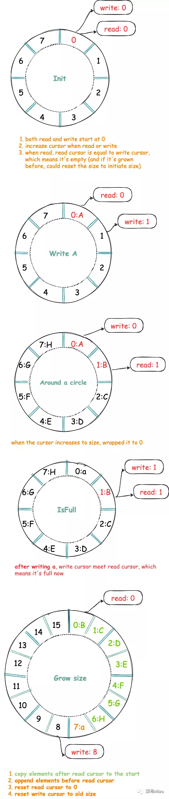

ringbuffer，是环形缓存区, 或叫环形队列

- [计数法实现](https://github.com/smallnest/chanx/blob/main/ringbuffer.go)
  - 
  
- [镜像指示位实现](https://github.com/NewbMiao/algorithm-go/tree/master/ringbuffer/virtualmemory)
  - 缓冲区的长度如果是 n，逻辑地址空间则为 0 至 n-1；那么，规定 n 至 2n-1 为镜像逻辑地址空间。本策略规定读写指针的地址空间为 0 至 2n-1，其中低半部分对应于常规的逻辑地址空间，高半部分对应于镜像逻辑地址空间。当指针值大于等于 2n 时，使其折返（wrapped）到 ptr-2n。使用一位表示写指针或读指针是否进入了虚拟的镜像存储区：置位表示进入，不置位表示没进入还在基本存储区
  - 大意就是在计数可以允许绕两圈（2n-1），假定写指针一圈后和读指针相遇 原来绕一圈归零后相遇（r == w）为队列已满。 现在绕一圈后（未归零）相遇（w == (r + n)）为队列已满。
  