- Socket Buffer
  - 一个socket ，会带有两个缓冲区，一个用于发送，一个用于接收
    - 用户发送消息的时候写给 send buffer（发送缓冲区）
    - 用户接收消息的时候写给 recv buffer（接收缓冲区）
  - 查看 socket 缓冲区，可以在linux环境下执行 `netstat -nt` 命令
    - Send-Q 是发送缓冲区
    - Recv-Q 代表接收缓冲区
  - TCP
    - 执行 send 发送的字节，会立马发送吗
    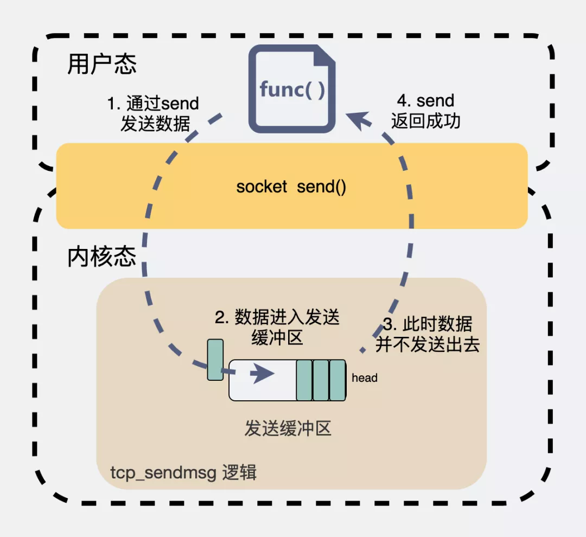
    - 如果缓冲区满了会怎么办
    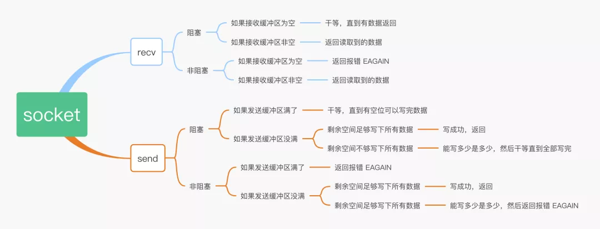
    - 如果socket缓冲区还有数据，执行close了，会怎么样
      - 如果接收缓冲区有数据时，执行close了，会怎么样
        - 如果接收缓冲区还有数据未读，会先把接收缓冲区的数据清空，然后给对端发一个RST。
      - 如果接收缓冲区是空的，那么就调用 tcp_send_fin() 开始进行四次挥手过程的第一次挥手
    - 如果发送缓冲区有数据时，执行close了，会怎么样
      - 内核会把发送缓冲区最后一个数据块拿出来。然后置为 FIN。
      - socket 缓冲区是个先进先出的队列，这种情况是指内核会等待TCP层安静把发送缓冲区数据都发完，最后再执行四次挥手的第一次挥手（FIN包）
  - UDP
    - 我们大部分情况下，都不会用  MSG_MORE，也就是来一个数据包就直接发一个数据包。从这个行为上来说，虽然UDP用上了发送缓冲区，但实际上并没有起到"缓冲"的作用

- [SO_REUSEPORT vs SO_REUSEADDR](https://idea.popcount.org/2014-04-03-bind-before-connect/)
  - SO_REUSEADDR - There are at least three situations when this flag is useful
    - Normally after binding to a port and stopping a server it's necessary to wait for a socket to time out before another server can bind to the same port. With SO_REUSEADDR set it's possible to rebind immediately, even if the socket is in a TIME_WAIT state.
    - When one server binds to INADDR_ANY, say 0.0.0.0:1234, it's impossible to have another server binding to a specific address like 192.168.1.21:1234. With SO_REUSEADDR flag this behaviour is allowed.
    - When using the bind before connect trick only a single connection can use a single outgoing source port. With this flag, it's possible for many connections to reuse the same source port, given that they connect to different destination addresses.
  - SO_REUSEPORT
    - It was introduced for UDP multicast sockets. Initially, only a single server was able to use a particular port to listen to a multicast group. This flag allowed different sockets to bind to exactly the same IP and port, and receive datagrams for selected multicast groups.
    - More generally speaking, setting SO_REUSEPORT informs a kernel of an intention to share a particular bound port between many processes, but only for a single user. For multicast datagrams are distributed based on multicast groups, for usual UDP datagrams are distributed in round-robin way. For a long time this flag wasn't available for TCP sockets, but recently Google submitted patches that fix it and distribute incoming connections in round-robin way between listening sockets.
  - EADDRNOTAVAIL vs EADDRINUSE
    - Check bind() for EADDRINUSE errors, in case we run out of available ports.
    - Check connect() for EADDRNOTAVAIL errors in case there is a connection conflict and retry if necessary.
    - If you establish 64k connections using connect, bind will fail with EADDRINUSE. 
    - when thousands of connections are using bind before connect straight connect might fail with EADDRNOTAVAIL.
    - In such case connect() will fail with EADDRNOTAVAIL error. Here's a code handling this situation:
      ```c
      for i in range(RETRIES):
          s = socket.socket(socket.AF_INET, socket.SOCK_STREAM)
          s.setsockopt(socket.SOL_SOCKET, socket.SO_REUSEADDR, 1)
          s.bind(("192.168.1.21", 0))
          try:
              s.connect(("www.google.com", 80))
              break
          except socket.error, e:
              if e.errno != errno.EADDRNOTAVAIL:
                  raise
      else:
          raise Exception("Failed to find an unused source port")
      ```
  - SO_REUSEADDR可以用在以下四种情况下。 (摘自《Unix网络编程》卷一，即UNPv1)
    - 当有一个有相同本地地址和端口的socket1处于TIME_WAIT状态时，而你启动的程序的socket2要占用该地址和端口，你的程序就要用到该选项。
    - SO_REUSEADDR允许同一port上启动同一服务器的多个实例(多个进程)。但每个实例绑定的IP地址是不能相同的。在有多块网卡或用IP Alias技术的机器可以测试这种情况。
    - SO_REUSEADDR允许单个进程绑定相同的端口到多个socket上，但每个socket绑定的ip地址不同。这和2很相似，区别请看UNPv1。
    - SO_REUSEADDR允许完全相同的地址和端口的重复绑定。但这只用于UDP的多播，不用于TCP。
- [Outgoing connections on Linux](https://blog.cloudflare.com/how-to-stop-running-out-of-ephemeral-ports-and-start-to-love-long-lived-connections/)
  - TCP
    - naive method

     | technique description	| errno on port exhaustion	| possible src 2-tuple reuse |
     | ----- | ------ | ------ |
     | connect(dst_IP, dst_port)	| EADDRNOTAVAIL	| yes (good!)|
    - Manually selecting source IP address

     |technique description	|errno on port exhaustion	|possible src 2-tuple reuse |
     | ----- | ------ | ------ |
     |bind(src_IP, 0) <br> connect(dst_IP, dst_port)	| EADDRINUSE	| no (bad!) |
    - IP_BIND_ADDRESS_NO_PORT

      | technique description	| errno on port exhaustion	| possible src 2-tuple reuse |
      | ----- | ------ | ------ |
      |IP_BIND_ADDRESS_NO_PORT <br> bind(src_IP, 0) <br> connect(dst_IP, dst_port)	|EADDRNOTAVAIL	 | yes (good!) |
    - Explicitly selecting a source port

      | technique description	| errno on port exhaustion	| possible src 2-tuple reuse |
      | ----- | ------ | ------ |
      | SO_REUSEADDR <br> bind(src_IP, src_port) <br> connect(dst_IP, dst_port)	| EADDRNOTAVAIL	| yes (good!) |
  - UDP
    - Vanilla UDP is limited

      | technique description	| errno on port exhaustion	| possible src 2-tuple reuse	| risk of overshadowing |
      | ----- | ------ | ------ | -------  |
      | connect(dst_IP, dst_port)	| EAGAIN	| no (bad!)	 | no |
    - SO_REUSEADDR is hard

      | technique description	| errno on port exhaustion	| possible src 2-tuple reuse	| risk of overshadowing |
      | ----- | ------ | ------ | -------  |
      | SO_REUSEADDR <br> connect(dst_IP, dst_port)	| EAGAIN	| yes	 | yes (bad!) |
- [epoll Edge Triggered vs Level Triggered](https://stackoverflow.com/a/41730177/3011380)
  - Edge Triggered: 
    - Once you set EPOLLET, events are triggered only if they change the state of the fd - meaning that only the first event is triggered and no new events will get triggered until that event is fully handled.
    - This design is explicitly meant to prevent epoll_wait from returning due to an event that is in the process of being handled (i.e., when new data arrives while the EPOLLIN was already raised but read hadn't been called or not all of the data was read).
    - The edge-triggered event rule is simple all same-type (i.e. EPOLLIN) events are merged until all available data was processed.
    - In the case of a listening socket, the EPOLLIN event won't be triggered again until all existing listen "backlog" sockets have been accepted using accept.
    - In the case of a byte stream, new events won't be triggered until all the the available bytes have been read from the stream (the buffer was emptied).
  - Level Triggered: 
    - On the other hand, level triggered events will behave closer to how legacy select (or poll) operates, allowing epoll to be used with older code.
    - The event-merger rule is more complex: events of the same type are only merged if no one is waiting for an event (no one is waiting for epoll_wait to return), or if multiple events happen before epoll_wait can return... otherwise any event causes epoll_wait to return.
    - In the case of a listening socket, the EPOLLIN event will be triggered every time a client connects... unless no one is waiting for epoll_wait to return, in which case the next call for epoll_wait will return immediately and all the EPOLLIN events that occurred during that time will have been merged into a single event.
    - In the case of a byte stream, new events will be triggered every time new data comes in... unless, of course, no one is waiting for epoll_wait to return, in which case the next call will return immediately for all the data that arrive util epoll_wait returned (even if it arrived in different chunks / events).
  - Exclusive return: 
    - The EPOLLEXCLUSIVE flag is used to prevent the "thundering heard" behavior, so only a single epoll_wait caller is woken up for each fd wake-up event.
    - As I pointed out before, for edge-triggered states, an fd wake-up event is a change in the fd state. So all EPOLLIN events will be raised until all data was read (the listening socket's backlog was emptied).
    - On the other hand, for level triggered events, each EPOLLIN will invoke a wake up event. If no one is waiting, these events will be merged.
  - epoll为什么要有ET触发模式
    - 如果采用 EPOLLLT 模式的话，系统中一旦有大量你不需要读写的就绪文件描述符，它们每次调用epoll_wait都会返回，这样会大大降低处理程序检索自己关心的就绪文件描述符的效率.
    - 而采用EPOLLET这种边缘触发模式的话，当被监控的文件描述符上有可读写事件发生时，epoll_wait()会通知处理程序去读写。如果这次没有把数据全部读写完(如读写缓冲区太小)，那么下次调用epoll_wait()时，它不会通知你，也就是它只会通知你一次，直到该文件描述符上出现第二次可读写事件才会通知你！！！这种模式比水平触发效率高，系统不会充斥大量你不关心的就绪文件描述符。
  - [Summary](https://mp.weixin.qq.com/s/_tZ0xQ3uE3ZlwEq4cOPdSg)
    - ET模式（边缘触发）
      - 只有数据到来才触发，不管缓存区中是否还有数据，缓冲区剩余未读尽的数据不会导致epoll_wait返回；
      - 边沿触发模式很大程度上降低了同一个epoll事件被重复触发的次数，所以效率更高；
      - 对于读写的connfd，边缘触发模式下，必须使用非阻塞IO，并要一次性全部读写完数据。
      - ET的编程可以做到更加简洁，某些场景下更加高效，但另一方面容易遗漏事件，容易产生bug；
    - LT 模式（水平触发，默认）
      - 只要有数据都会触发，缓冲区剩余未读尽的数据会导致epoll_wait返回；
      - LT比ET多了一个开关EPOLLOUT事件(系统调用消耗，上下文切换）的步骤；
      - 对于监听的sockfd，最好使用水平触发模式（参考nginx），边缘触发模式会导致高并发情况下，有的客户端会连接不上，LT适合处理紧急事件；
      - 对于读写的connfd，水平触发模式下，阻塞和非阻塞效果都一样，不过为了防止特殊情况，还是建议设置非阻塞；
      - LT的编程与poll/select接近，符合一直以来的习惯，不易出错；
- [异步I/O框架 io_uring](https://mp.weixin.qq.com/s?__biz=MzkyMTIzMTkzNA==&mid=2247562787&idx=1&sn=471a0956249ca789afad774978522717&chksm=c1850172f6f28864474f9832bfc61f723b5f54e174417d570a6b1e3f9f04bda7b539662c0bed&scene=21#wechat_redirect)
  - Source [1](How io_uring and eBPF Will Revolutionize Programming in Linux), [2](An Introduction to the io_uring Asynchronous I/O Framework)
  - 概述
  - io_uring 是在Linux 5.1 内核首次引入的高性能异步 I/O 框架, 但如果你的应用 已经在使用 传统 Linux AIO 了， 并且使用方式恰当， 那 io_uring  并不会带来太大的性能提升
  - 统一了 Linux 异步 I/O 框架
    - Linux AIO  只支持 direct I/O 模式的 存储文件（storage file），而且主要用在 数据库这一细分领域
    - io_uring 支持存储文件和网络文件（network sockets），也支持更多的异步系统调用 （accept/openat/stat/.
  - 设计上是真正的异步 I/O
  - 灵活性和可扩展性非常好，甚至能基于 io_uring 重写所有系统调用
  - eBPF 也算是异步框架（事件驱动），但与 io_uring 没有本质联系，二者属于不同子系统， 并且在模型上有一个本质区别
    - eBPF 对用户是透明的，只需升级内核（到合适的版本）， 应用程序无需任何改造；
    - io_uring 提供了 新的系统调用和用户空间 API，因此 需要应用程序做改造。
  - Linux I/O 系统调用演进
    - 基于 fd 的阻塞式 I/O：read()/write()
    - 非阻塞式 I/O：select()/poll()/epoll() - 只支持 network sockets 和 pipes
    - 线程池方式 - 线程上下文切换开销可能非常大
    - Direct I/O（数据库软件）- 绕过 page cache
      - 需要指定  O_DIRECT flag；
      - 需要 应用自己管理自己的缓存 —— 这正是数据库软件所希望的；
      - 是  zero-copy I/O，因为应用的缓冲数据直接发送到设备，或者直接从设备读取
    - 异步 IO（AIO）
      - Linux  2.6 内核引入了异步 I/O（asynchronous I/O）接口
      - 用户通过 io_submit() 提交 I/O 请求，
      - 过一会再调用 io_getevents() 来检查哪些 events 已经 ready 了
  - io_uring
    - Design
      - 在设计上是真正异步的（truly asynchronous）。只要 设置了合适的 flag，它在 系统调用上下文中就只是将请求放入队列， 不会做其他任何额外的事情， 保证了应用永远不会阻塞。
      - 真正的异步化设计（Proactor），而非如epoll等本质上的同步行为（Reactor）。而其关键在于，程序和kernel通过SQ/CQ两个队列进行解耦。
      - 支持任何类型的 I/O：cached files、direct-access files 甚至 blocking sockets
      - 灵活、可扩展：基于 io_uring 甚至能重写（re-implement）Linux 的每个系统调用
    - 原理及核心数据结构：SQ/CQ/SQE/CQE
      - 每个 io_uring 实例都有 两个环形队列（ring），在内核和应用程序之间共享：
        - 提交队列：submission queue (SQ)
        - 完成队列：completion queue (CQ)
        - 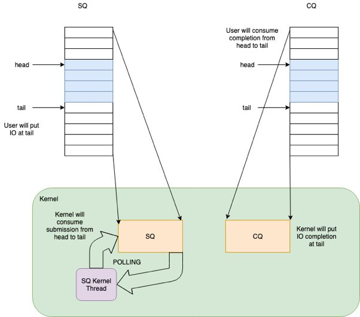
        - 都是 单生产者、单消费者，size 是 2 的幂次；
        - 提供 无锁接口（lock-less access interface），内部使用 **内存屏障**做同步（coordinated with memory barriers）。
      - 带来的好处
        - 原来需要多次系统调用（读或写），现在变成批处理一次提交
      - 三种工作模式
        - 中断驱动模式（interrupt driven）
          - 默认模式。可通过 io_uring_enter() 提交 I/O 请求，然后直接检查 CQ 状态判断是否完成。
        - 轮询模式（polled）
          - Busy-waiting for an I/O completion，而不是通过异步 IRQ（Interrupt Request）接收通知
          - 这种模式需要文件系统（如果有）和块设备（block device）支持轮询功能
        - 内核轮询模式（kernel polled）
          - 这种模式中，会创建一个内核线程（kernel thread）来执行 SQ 的轮询工作。
      - io_uring 系统调用 API
         - io_uring_setup(2)
         - io_uring_register(2)
         - io_uring_enter(2)
- [Linux 网络包发送过程](https://mp.weixin.qq.com/s?__biz=MjM5Njg5NDgwNA==&mid=2247485146&idx=1&sn=e5bfc79ba915df1f6a8b32b87ef0ef78&scene=21#wechat_redirect)
- [Linux网络包接收过程](https://mp.weixin.qq.com/s?__biz=MjM5Njg5NDgwNA==&mid=2247484058&idx=1&sn=a2621bc27c74b313528eefbc81ee8c0f&scene=21#wechat_redirect)
- [127.0.0.1 之本机网络通信过程](https://mp.weixin.qq.com/s/_yRC90iThCsP_zlLA6J12w)
  - 127.0.0.1 本机网络 IO 需要经过网卡吗？
    - 不需要经过网卡。即使了把网卡拔了本机网络是否还可以正常使用的。
  - 数据包在内核中是个什么走向，和外网发送相比流程上有啥差别？
    - 总的来说，本机网络 IO 和跨机 IO 比较起来，确实是节约了一些开销。发送数据不需要进 RingBuffer 的驱动队列，直接把 skb 传给接收协议栈（经过软中断）。但是在内核其它组件上，可是一点都没少，系统调用、协议栈（传输层、网络层等）、网络设备子系统、邻居子系统整个走了一个遍。连“驱动”程序都走了（虽然对于回环设备来说只是一个纯软件的虚拟出来的东东）。所以即使是本机网络 IO，也别误以为没啥开销。
  - [Loopback congestion](https://blog.cloudflare.com/this-is-strictly-a-violation-of-the-tcp-specification/)
    - The loopback works magically: when an application sends packets to it, it immediately, still within the send syscall handling, gets delivered to the appropriate target. There is no buffering over loopback. Calling send over loopback triggers iptables, network stack delivery mechanisms and delivers the packet to the appropriate queue of the target application.
- [断网了，还能ping通 127.0.0.1 吗](https://mp.weixin.qq.com/s?__biz=Mzg5NDY2MDk4Mw==&mid=2247486417&idx=1&sn=c648ca9f2d33f77d69ae3c615c62b77e&scene=21#wechat_redirect)
  - 127.0.0.1 是回环地址。localhost是域名，但默认等于 127.0.0.1。
  - ping 回环地址和 ping 本机地址，是一样的，走的是lo0 "假网卡"，都会经过网络层和数据链路层等逻辑，最后在快要出网卡前狠狠拐了个弯， 将数据插入到一个链表后就软中断通知 ksoftirqd 来进行收数据的逻辑，压根就不出网络。所以断网了也能 ping 通回环地址。
  - 如果服务器 listen 的是 0.0.0.0，那么此时用127.0.0.1和本机地址都可以访问到服务。
- [epoll背后的原理](https://mp.weixin.qq.com/s/jM8uUmlvzgGaJ60Q7zVVcA)
  - 初识 epoll
    - epoll 是 Linux 内核的可扩展 I/O 事件通知机制，其最大的特点就是性能优异
    - epoll 在应对大量网络连接时，只有活跃连接很少的情况下才能表现的性能优异。换句话说，epoll 在处理大量非活跃的连接时性能才会表现的优异。如果15000个 socket 都是活跃的，epoll 和 select 其实差不了太多。
  - epoll背后的原理
    - 阻塞
      - 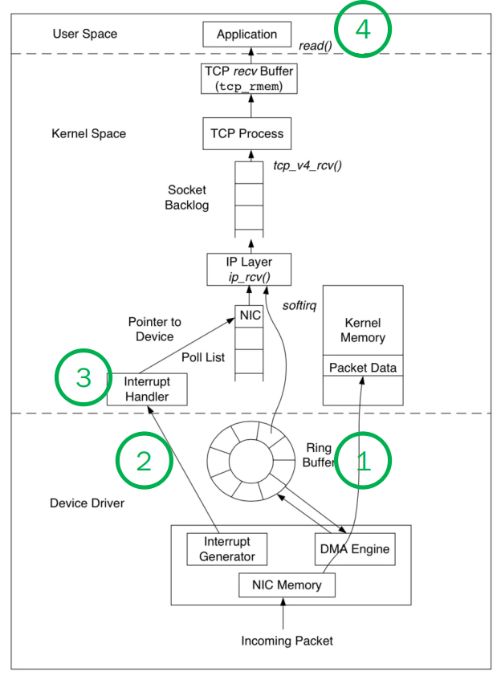
      - 网卡何时接收到数据是依赖发送方和传输路径的，这个延迟通常都很高，是毫秒(ms)级别的。而应用程序处理数据是纳秒(ns)级别的。也就是说整个过程中，内核态等待数据，处理协议栈是个相对很慢的过程。这么长的时间里，用户态的进程是无事可做的，因此用到了“阻塞（挂起）”。
    - 阻塞不占用 cpu
      - 阻塞是进程调度的关键一环，指的是进程在等待某事件发生之前的等待状态
      - “可运行状态”会占用 CPU 资源，另外创建和销毁进程也需要占用 CPU 资源（内核）。重点是，当进程被"阻塞/挂起"时，是不会占用 CPU 资源的。
    - 阻塞的恢复
      - 当网卡接收到数据时，数据中一定会带着端口号，内核就可以找到对应的 socket，并从中取得“挂起”进程的 ID。将进程的状态修改为“可运行状态”（加入到工作队列）。此时内核代码执行完毕，将控制权交还给用户态。通过正常的“CPU 时间片的调度”，用户进程得以处理数据。
    - 上下文切换的优化
      - 两个地方上下文切换
        - 如果频繁的收到数据包，NIC 可能频繁发出中断请求（IRQ）。CPU 也许在用户态，也许在内核态，也许还在处理上一条数据的协议栈。但无论如何，CPU 都要尽快的响应中断。这么做实际上非常低效，造成了大量的上下文切换
        - 每个 Packet 对应一个 socket，每个 socket 对应一个用户态的进程。这些用户态进程转为“可运行状态”，必然要引起进程间的上下文切换
      - 网卡驱动的 NAPI 机制 - 在 NIC 上，解决频繁 IRQ 的技术叫做 New API(NAPI) 。
        - 原理其实特别简单，把 Interrupt Handler 分为两部分。
      - 单线程的 IO 多路复用 
        - 内核优化“进程间上下文切换”的技术叫的“IO 多路复用”，思路和 NAPI 是很接近的。
        - 每个 socket 不再阻塞读写它的进程，而是用一个专门的线程，批量的处理用户态数据，这样就减少了线程间的上下文切换。
    - In Summary
      - 基于数据收发的基本原理，系统利用阻塞提高了 CPU 利用率。
      - 为了优化上线文切换，设计了“IO 多路复用”（和 NAPI）。
      - 为了优化“内核与监视进程的交互”，设计了三个版本的 API(select,poll,epoll)。
  - 关于 IO 模型的分类
    - Linux 下所有的 IO 模型都是阻塞的，这是收发数据的基本原理导致的。阻塞用户线程是一种高效的方式
      - 阻塞不是问题，运行才是问题，运行才会消耗 CPU。IO 多路复用不是减少了阻塞，是减少了运行。上下文切换才是问题，IO 多路复用，通过减少运行的进程，有效的减少了上下文切换。
    - Linux 下所有的 IO 模型都是同步的。BIO 是同步的，select 同步的，poll 同步的，epoll 还是同步的
      - 所谓的“同步“和”异步”只是两种事件分发器（event dispatcher）或者说是两个设计模式（Reactor 和 Proactor）。都是运行在用户态的
- [Linux epoll惊群问题的原因和解决方案](https://mp.weixin.qq.com/s/O_QVxhyS7C3gJluqaLerWQ)
  - 缘起
    - 从现象上看，只是体现了CPU不均衡。一共fork了20个Server进程，在请求负载中等的时候，有三四个Server进程呈现出比较高的CPU利用率，其余的Server进程的CPU利用率都是非常低。
    - 中断，软中断都是均衡的，网卡RSS和CPU之间进行了bind之后依然如故，既然系统层面查不出个所以然，只能从服务的角度来查了。
    - 自上而下的排查首先就想到了strace, 如果仅仅strace accept，即加上“-e trace=accept”参数的话，偶尔会有accept成功的现象
    - 大量的CPU空转，进一步加大请求负载，CPU空转明显降低，这说明在预期的空转期间，新来的请求降低了空转率…现象明显偏向于这就是惊群导致
  - 惊群
    - 曾经Linux系统有个经典的accept惊群问题困扰了大家非常久的时间，这个问题现在已经在内核曾经得以解决，具体来讲就是当有新的连接进入到accept队列的时候，内核唤醒且仅唤醒一个进程来处理. 添加了一个WQ_FLAG_EXCLUSIVE标记，告诉内核进行排他性的唤醒，即唤醒一个进程后即退出唤醒的过程，问题得以解决
    - 噪音：
      - 在ep_poll的睡眠中加入WQ_FLAG_EXCLUSIVE标记，确实实实在在解决了epoll的惊群问题
      - epoll_wait返回后确实也还有多个进程被唤醒只有一个进程能正确处理其他进程无事可做的情况发生，但这不是因为惊群，而是你的使用方法不对。
    - 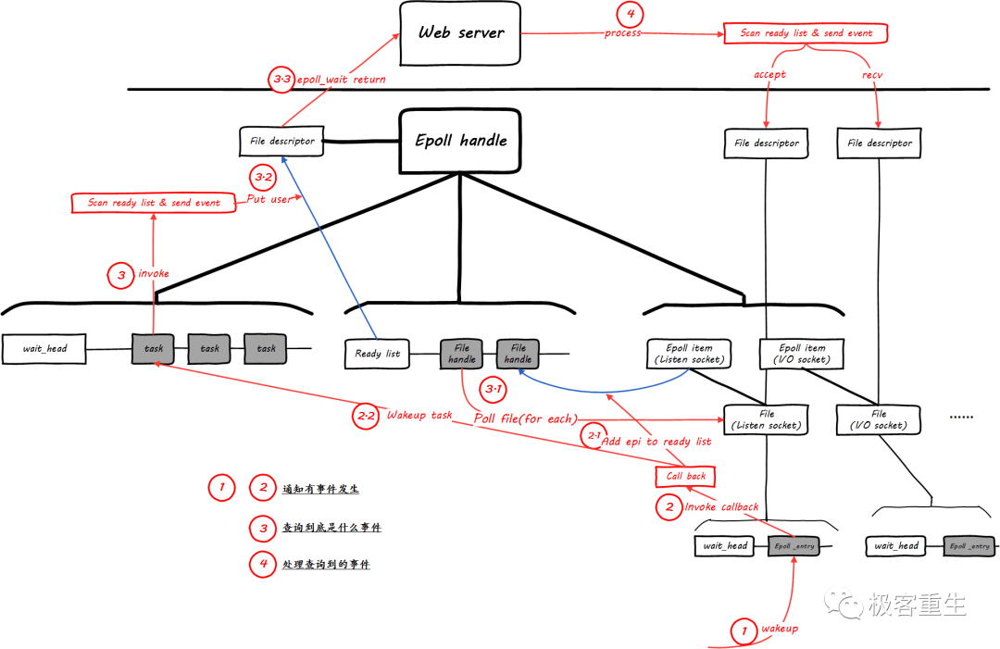
    - epoll的LT和ET以及相关细节问题
      - LT水平触发: 如果事件来了，不管来了几个，只要仍然有未处理的事件，epoll都会通知你。
      - ET边沿触发: 如果事件来了，不管来了几个，你若不处理或者没有处理完，除非下一个事件到来，否则epoll将不会再通知你。
    - LT水平触发模式的问题以及解决
      ```c 
      // 否则会阻塞在IO系统调用，导致没有机会再epoll
      set_socket_nonblocking(sd);
      epfd = epoll_create(64);
      event.data.fd = sd;
      epoll_ctl(epfd, EPOLL_CTL_ADD, sd, &event);
      while (1) {
          epoll_wait(epfd, events, 64, xx);
          ... // 危险区域！如果有共享同一个epfd的进程/线程调用epoll_wait，它们也将会被唤醒！
      // 这个accept将会有多个进程/线程调用，如果并发请求数很少，那么将仅有几个进程会成功：
      // 1. 假设accept队列中有n个请求，则仅有n个进程能成功，其它将全部返回EAGAIN (Resource temporarily unavailable)
      // 2. 如果n很大(即增加请求负载)，虽然返回EAGAIN的比率会降低，但这些进程也并不一定取到了epoll_wait返回当下的那个预期的请求。
          csd = accept(sd, &in_addr, &in_len); 
          ...
      }
      ```
      - 再看一遍LT的描述“如果事件来了，不管来了几个，只要仍然有未处理的事件，epoll都会通知你。”，显然，epoll_wait刚刚取到事件的时候的时候，不可能马上就调用accept去处理，事实上，逻辑在epoll_wait函数调用的ep_poll中还没返回的，这个时候，显然符合“仍然有未处理的事件”这个条件，显然这个时候为了实现这个语义，需要做的就是通知别的同样阻塞在同一个epoll句柄睡眠队列上的进程
      - 问题非常明确了，但是怎么解决呢？也非常简单，让不同进程的epoll_waitI调用互斥即可。
    - ET边沿触发模式的问题以及解决
      - 应用程序，即epoll_wait的调用进程必须自己在获取事件后将其处理干净后方可再次调用epoll_wait，否则epoll_wait不会返回，而是必须等到下次产生事件的时候方可返回。即，依然以accept为例，必须这样做：
        ```c
        // 否则会阻塞在IO系统调用，导致没有机会再epoll
        set_socket_nonblocking(sd);
        epfd = epoll_create(64);
        event.data.fd = sd;
        // 添加ET标记
        event.events |= EPOLLET;
        epoll_ctl(epfd, EPOLL_CTL_ADD, sd, &event);
        while (1) {
            epoll_wait(epfd, events, 64, xx);
            while ((csd = accept(sd, &in_addr, &in_len)) > 0) {
                do_something(...);
            } 
            ...
        }
        ```
  - 结论
    - 为什么reuseport没有惊群？ 首先我们要知道惊群发生的原因，就是同时唤醒了多个进程处理一个事件，导致了不必要的CPU空转。为什么会唤醒多个进程，因为发生事件的文件描述符在多个进程之间是共享的。而reuseport呢，侦听同一个IP地址端口对的多个socket本身在socket层就是相互隔离的，在它们之间的事件分发是TCP/IP协议栈完成的，所以不会再有惊群发生。
  - [epoll和惊群](https://plantegg.github.io/2019/10/31/epoll%E5%92%8C%E6%83%8A%E7%BE%A4/)
    - 什么是惊群
      - 惊群的本质在于多个线程处理同一个事件
      - 安排多个线程来accept，当有新连接进来默认只能通知所有线程都来处理，这就是惊群
      - 如果用reuseport来用多个线程监听同一个端口的话，在内核层面会通过hash将新连接派发给一个具体的worker这样也不会有惊群了
    - Summary
      - 如果服务器采用accept阻塞调用方式群在2.6内核就通过增加WQ_FLAG_EXCLUSIVE在内核中就行排他解决惊群了；
      - 只有epoll的accept才有惊群，这是因为epoll监听句柄中后续可能是accept(建连接)，也有可能是read/write网络IO事件，accept有时候一个进程处理不过来、或者accept跟读写混用进程处理，所以内核层面没直接解决epoll的惊群，交由上层应用来根据IO事件如何处理。
      - epoll的惊群在3.10内核加了SO_REUSEPORT来解决惊群，但如果处理accept的worker也要处理read/write（Nginx的工作方式）就可能导致不同的worker有的饥饿有的排队假死一样
      - 4.5的内核增加EPOLLEXCLUSIVE在内核中直接将worker放在一个大queue，同时感知worker状态来派发任务更好地解决了惊群，但是因为LIFO的机制导致在压力不大的情况下，任务主要派发给少数几个worker
    - 演进
      - 无IO复用时Accept
        - 在linux2.6版本以后，linux内核已经解决了accept()函数的“惊群”现象，大概的处理方式就是，当内核接收到一个客户连接后，只会唤醒等待队列上的第一个进程（线程）,所以如果服务器采用accept阻塞调用方式
        - 2.6内核层面添加了一个WQ_FLAG_EXCLUSIVE标记，告诉内核进行排他性的唤醒，即唤醒一个进程后即退出唤醒的过程(适合accept，但是不适合 epoll–因为epoll除了有accept，还有其它IO事件）
      - epoll的accept
        - 只要是epoll事件，os默认会唤醒监听这个epoll的所有线程。所以常见的做法是一个epoll绑定到一个thread
        - 使用epoll时，是在epoll_wait()返回后，发现监听socket有可读事件，才调用accept()。由于epoll_wait()是LIFO，导致多个子进程在accept新连接时，也变成了LIFO。
      - SO_REUSEPORT
        - 在3.10的内核中通过引入SO_REUSEPORT解决了这个epoll accept惊群的问题
        - SO_REUSEPORT支持多个进程或者线程绑定到同一端口，提高服务器程序的性能
          - 允许多个套接字 bind()/listen() 同一个TCP/UDP端口
          - 每一个线程拥有自己的服务器套接字
          - 在服务器套接字上没有了锁的竞争
          - 内核层面实现负载均衡，内核通过socket的五元组来hash到不同的socket listener上
          - 安全层面，监听同一个端口的套接字只能位于同一个用户下面
        - Nginx下SO_REUSEPORT 带来的小问题
          - 因为Nginx是ET模式，epoll处理worker要一直将事件处理完毕才能进入epoll_wait（才能响应新的请求）
            - 如果有一个慢请求（比如gzip压缩文件需要2分钟），那么处理这个慢请求的进程在reuseport模式下还是会被内核分派到新的连接，但是这个时候他如同hang死了，新分配进来的请求无法处理
            - 如果不是reuseport模式，他在处理慢请求就根本腾不出来时间去在惊群中抢到锁。但是还是会影响Established 连接上的请求，这个影响和Reuseport没有关系，是一个线程处理多个Socket带来的必然结果
          - 开了reuse_port 之后每个worker 都单独有个syn 队列，能按照nginx worker 数成倍提升抗synflood 攻击能力。 但是开启了SO_REUSEPORT后，内核没法感知你的worker是不是特别忙，只是按Hash逻辑派发accept连接。也就是SO_REUSEPORT会导致rt偏差更大（抖动明显一些）。这跟MySQL Thread Pool导致的卡顿原理类似，多个Pool类似这里的SO_REUSEPORT。
          - 在OS层面一个连接hash到了某个socket fd，但是正好这个 listen socket fd 被关了，已经被分到这个 listen socket fd 的 accept 队列上的请求会被丢掉
      - EPOLLEXCLUSIVE
        - 在4.5内核中再次引入EPOLLEXCLUSIVE来解决，且需要应用层的配合，Ngnix 在 1.11.3 之后添加了NGX_EXCLUSIVE_EVENT来支持
        - EPOLLEXCLUSIVE可以在单个Listen Queue对多个Worker Process的时候均衡压力，不会惊群
        - 连接从一个队列里由内核分发，不需要惊群，对worker是否忙也能感知（忙的worker就不分发连接过去）
        - EPOLLEXCLUSIVE 带来的问题
          - 所有worker像是在一个栈（LIFO）中等着任务处理，在压力不大的时候会导致连接总是在少数几个worker上（栈底的worker没什么机会出栈）
          - 如果并发任务多，导致worker栈经常空掉，这个问题就不存在了
- [epoll 的本质](https://mp.weixin.qq.com/s/bRkbrJ4GJSBMio8YLXJGOw)
  - 调用 epoll_create 建立一个 epoll 对象（在epoll文件系统中给这个句柄分配资源）
    - 内核除了帮我们在 epoll 文件系统里建了个 file 结点，在内核 cache 里建了个红黑树用于存储以后 epoll_ctl 传来的 socket 外，
    - 还会再建立一个 rdllist 双向链表，用于存储准备就绪的事件，当 epoll_wait 调用时，仅仅观察这个 rdllist 双向链表里有没有数据即可。
  - 调用 epoll_ctl 如果增加 socket 句柄，则检查在红黑树中是否存在，存在立即返回，不存在则添加到树干上，然后向内核注册回调函数，用于当中断事件来临时向准备就绪链表中插入数据；
  - 调用 epoll_wait 检查eventpoll对象中的rdllist双向链表是否有epitem元素而已，如果rdllist链表不为空，则这里的事件复制到用户态内存（使用共享内存提高效率）中，同时将事件数量返回给用户。
  - 
  - [理解epoll不足之处](https://mp.weixin.qq.com/s/_tZ0xQ3uE3ZlwEq4cOPdSg)
    - 1.定时的精度不够，只到5ms级别，select可以到0.1ms；
    - 2.当连接数少并且连接都十分活跃的情况下，select和poll的性能可能比epoll好；
    - 3.epoll_ctrl每次只能够修改一个fd（kevent可以一次改多个，每次修改，epoll需要一个系统调用，不能 batch 操作，可能会影响性能）。
    - 4.可能会在定时到期之前返回，导致还需要下一个epoll_wait调用。
- [epoll vs io_uring](https://www.ihcblog.com/rust-runtime-design-1/)
  - epoll
    - epoll 是 linux 下较好的 IO 事件通知机制，可以同时监听多个 fd 的 ready 状态。
      - 使用 epoll 的时候，需要设置 fd 为非阻塞模式。当 read 时，在没有数据的情况下，read 也会立刻返回 WOULD_BLOCK。这时需要做的事情是将这个 fd 注册到 epoll fd 上，并设置 EPOLLIN 事件。
      - 之后在没事做的时候（所有任务都卡在 IO 了），陷入 syscall epoll_wait。当有 event 返回时，再对对应的 fd 做 read（取决于注册时设置的触发模式，可能还要做一些其他事情，确保下次读取正常）。
    - 总的来说，这个机制十分简单：设置 fd 为非阻塞模式，并在需要的时候注册到 epoll fd 上，然后 epoll fd 的事件触发时，再对 fd 进行操作。这样将多个 fd 的阻塞问题转变为单个 fd 的阻塞。
  - io_uring
    - io-uring 不是一个事件通知机制，它是一个真正的异步 syscall 机制。你并不需要在它通知后再手动 syscall，因为它已经帮你做好了。
      - io-uring 主要由两个 ring 组成（SQ 和 CQ），SQ 用于提交任务，CQ 用于接收任务的完成通知。任务（Op）往往可以对应到一个 syscall（如 read 对应 ReadOp），也会指定这次 syscall 的参数和 flag 等。
      - 在 submit 时，内核会消费掉所有 SQE，并注册 callback。之后等有数据时，如网卡中断发生，数据通过驱动读入，内核就会触发这些 callback，做 Op 想做的事情，如拷贝某个 fd 的数据到 buffer（这个 buffer 是用户指定的 buffer）。相比 epoll，io-uring 是纯同步的。
    - 直接将想做的事情丢到 SQ 中（如果 SQ 满了就要先 submit 一下），然后在没事干（所有任务都卡在 IO 了）的时候 submit_and_wait(1)（submit_and_wait 和 submit 并不是 syscall，它们是 liburing 对 enter 的封装）；返回后消费 CQ，即可拿到 syscall 结果。
- [io_ring解析]()
  - [io_ring worker pool](https://blog.cloudflare.com/missing-manuals-io_uring-worker-pool/)
- [RSS, RPS and RFS](https://stackoverflow.com/questions/44958511/what-is-the-main-difference-between-rss-rps-and-rfs)
  - RSS: Receive Side Scaling 
    - it is hardware implemented and hashes some bytes of packets ("hash function over the network and/or transport layer headers-- for example, a 4-tuple hash over IP addresses and TCP ports of a packet"). Implementations are different, some may not filter most useful bytes or may be limited in other ways. This filtering and queue distribution is fast (only several additional cycles are needed in hw to classify packet), but not portable between some network cards or can't be used with tunneled packets or some rare protocols. And sometimes your hardware have no support of number of queues enough to get one queue per logical CPU core.
    - RSS should be enabled when latency is a concern or whenever receive interrupt processing forms a bottleneck. Spreading load between CPUs decreases queue length.
  - Receive Packet Steering (RPS) 
    - it is logically a software implementation of RSS. Being in software, it is necessarily called later in the datapath. So, this is software alternative to hardware RSS (still parses some bytes to hash them into queue id), when you use hardware without RSS or want to classify based on more complex rule than hw can or have protocol which can't be parsed in HW RSS classifier. But with RPS more CPU resources are used and there is additional inter-CPU traffic.
    - RPS has some advantages over RSS: 1) it can be used with any NIC, 2) software filters can easily be added to hash over new protocols, 3) it does not increase hardware device interrupt rate (although it does introduce inter-processor interrupts (IPIs)).
  - RFS: Receive Flow Steering 
    - it is like RSS (software mechanism with more CPU overhead), but it not just hashing into pseudo-random queue id, but takes "into account application locality." (so, packet processing will probably be faster due to good locality). Queues are tracked to be more local to the thread which will process received data, and packets are delivered to correct CPU core.
    - The goal of RFS is to increase datacache hitrate by steering kernel processing of packets to the CPU where the application thread consuming the packet is running. RFS relies on the same RPS mechanisms to enqueue packets onto the backlog of another CPU and to wake up that CPU. ... In RFS, packets are not forwarded directly by the value of their hash, but the hash is used as index into a flow lookup table. This table maps flows to the CPUs where those flows are being processed.
  - Accelerated RFS
    - RFS with hw support. (Check your network driver for ndo_rx_flow_steer) "Accelerated RFS is to RFS what RSS is to RPS: a hardware-accelerated load balancing mechanism that uses soft state to steer flows based on where the application thread consuming the packets of each flow is running.".
  - Note: it would be smart to use RSS and RPS together in order to avoid CPU utilization bottlenecks on the receiving side
    - RSS controls the selected HW queue for receiving a stream of packets. Once certain conditions are met, an interrupt would be issued to the SW. The interrupt handler, which is defined by the NIC's driver, would be the SW starting point for processing received packets. The code there would poll the packets from the relevant receive queue, might perform initial processing and then move the packets for higher level protocol processing.
- [Why does one NGINX worker take all the load](https://blog.cloudflare.com/the-sad-state-of-linux-socket-balancing/)
  - There are generally three ways of designing a TCP server with regard to performance:
    - (a) Single listen socket, single worker process.
    - (b) Single listen socket, multiple worker processes. - Nginx
    - (c) Multiple worker processes, each with separate listen socket. - By using the SO_REUSEPORT socket option it's possible to create a dedicated kernel data structure (the listen socket) for each worker process. 
  - Spreading the accept() load
    - blocking-accept
      ```c 
      sd = bind(('127.0.0.1', 1024))
      for i in range(3):
          if os.fork () == 0:
              while True:
                  cd, _ = sd.accept()
                  cd.close()
                  print 'worker %d' % (i,)
      ```
      - Linux will do proper FIFO-like round robin load balancing. Each process waiting on accept() is added to a queue and they will be served connections in order.
    - epoll-and-accept
      ```c++
      sd = bind(('127.0.0.1', 1024))
      sd.setblocking(False)
      for i in range(3):
          if os.fork () == 0:
              ed = select.epoll()
              ed.register(sd, EPOLLIN | EPOLLEXCLUSIVE) // We can avoid the usual thundering-herd issue by using the EPOLLEXCLUSIVE flag.
              while True:
                  ed.poll()
                  cd, _ = sd.accept()
                  cd.close()
                  print 'worker %d' % (i,)
      ```
      - Linux seems to choose the last added process, a LIFO-like behavior. The process added to the waiting queue most recently will get the new connection. 
  - SO_REUSEPORT to the rescue
    - Linux supports a feature to work around this balancing problem - the SO_REUSEPORT socket option. We explained this in the (c) model, where the incoming connections are split into multiple separate accept queues. Usually it's one dedicated queue for each worker process.
    - However, the separated queue cause delay issue
      - "combined queue model" is better at reducing the maximum latency. A single clogged cashier will not significantly affect the latency of whole system. 
      - The shared queue will be drained relatively promptly.
  - Conclusion
    - Balancing the incoming connections across multiple application workers is far from a solved problem. 
      - The single queue approach (b) scales well and keeps the max latency in check, 
      - but due to the epoll LIFO behavior the worker processes won't be evenly load balanced.
    - For workloads that require even balancing it might be beneficial to use the SO_REUSEPORT pattern (c). Unfortunately in high load situations the latency distribution might degrade.
    - Of course comparing blocking accept() with a full featured epoll() event loop is not fair. Epoll is more powerful and allows us to create rich event driven programs. Using blocking accept is rather cumbersome or just not useful at all. To make any sense, blocking accept programs would require careful multi-threading programming, with a dedicated thread per request
    - There are a couple of things you need to take into account when using NGINX reuseport implementation. First make sure you run 1.13.6+ or have this patch applied. Then, remember that due to a defect in Linux TCP REUSEPORT implementation reducing number of REUSEPORT queues will cause some waiting TCP connections to be dropped
- [UDP](https://mp.weixin.qq.com/s/9MhxlYkRKVCcZc5QdUqKBg)
  - 当 udp 服务端的机器可以连通且无异常时，客户端通常会显示成功。但当有异常时，会有以下的情况:
    - 当 ip 地址无法连通时，udp 客户端连接时，通常会显示成功。
    - 当 udp 服务端程序关闭，但系统还存在时，对方系统通过 icmp ECONNREFUSE 返回错误，客户端会报错。
    - 当对方有操作 iptables udp port drop 时，客户端也会显示成功。
    - 客户端和服务端互通数据，当服务进程挂了时，UDP 客户端不能立马感知关闭状态，只有当再次发数据时才会被对方系统回应 icmp ECONNREFUSE 异常报文，客户端才能感知对方挂了。)
- [WebSocket 1M](https://github.com/eranyanay/1m-go-websockets)
  - Resource limit
    - The kernel enforces the soft limit for the corresponding resource
    - The hard limit acts as a ceiling for the soft limit
    - Unprivileged process can only raise up to the hard limit
    - Privileged process can make any arbitrary change
    - RLIMIT_NOFILE is the resource enforcing max number of open files
  - Optimizations
    - Optimize goroutine - epoll
    - Optimize net/http objects allocations
    - Reuse allocated buffers across websockets read/write
      - gorilla/websocket keeps a reference to the underlying buffers given by Hijack()
      - github.com/gobwas/ws - an alternative websockets lib for GO
        - No intermediate allocation during I/O
        - Low-level API which allows building logic of packet handling and buffers
        - Zero-copy upgrades
    - Conntrack table - increase the cap of total concurrent connections in the OS
- [大端、小端](https://github.com/asong2020/Golang_Dream/blob/master/article/golang/%E8%AF%A6%E8%A7%A3%E5%A4%A7%E7%AB%AF%E5%B0%8F%E7%AB%AF.md)
  - 大端模式：高位字节排放在内存的低地址端，低位字节排放在内存的高地址端;
  - 小端模式：低位字节排放在内存的低地址端，高位字节排放在内存的高地址端；
    ```go
    func IsLittleEndian()  bool{
        var value int32 = 1 // 占4byte 转换成16进制 0x00 00 00 01 
      // 大端(16进制)：00 00 00 01
      // 小端(16进制)：01 00 00 00
        pointer := unsafe.Pointer(&value)
        pb := (*byte)(pointer)
        if *pb != 1{
            return false
        }
        return true
    }
    ```
  - go官方库encoding/binary中已经提供了大小端使用的库
- [一台 Linux 服务器最多能支撑多少个 TCP 连接](https://mp.weixin.qq.com/s/iQuSst6WYsn6IS_DTG4YAg)
  - TCP 连接四元组是源 IP 地址、源端口、目的IP地址和目的端口。任意一个元素发生了改变，那么就代表的是一条完全不同的连接了。拿我的 Nginx 举例，它的端口是固定使用 80。另外我的 IP 也是固定的，这样目的 IP 地址、目的端口都是固定的。剩下源IP地址、源端口是可变的。所以理论上我的 Nginx 上最多可以建立 2 的 32 次方（IP 数）× 2^16（Port数）个连接。
  - Linux 系统出于安全角度的考虑，在多个位置都限制了可打开的文件描述符的数量，包括系统级、用户级、进程级
    - 系统级：当前系统可打开的最大数量，通过 fs.file-max 参数可修改
    - 用户级：指定用户可打开的最大数量，修改 /etc/security/limits.conf
    - 进程级：单个进程可打开的最大数量，通过 fs.nr_open 参数可修改
  - 接收缓存区大小是可以配置的，通过 sysctl 命令就可以查看
    ```shell
    $ sysctl -a | grep rmem
    net.ipv4.tcp_rmem = 4096 87380 8388608
    net.core.rmem_default = 212992
    net.core.rmem_max = 8388608
    ```
    - tcp_rmem"中的第一个值是为你们的 TCP 连接所需分配的最少字节数。该值默认是 4K，最大的话 8MB 之多。也就是说你们有数据发送的时候我需要至少为对应的 socket 再分配 4K 内存，甚至可能更大
  - TCP 分配发送缓存区的大小受参数 net.ipv4.tcp_wmem 配置影响
    ```shell
    sysctl -a | grep wmem
    
    net.ipv4.tcp_wmem = 4096 65536 8388608
    net.core.wmem_default = 212992
    net.core.wmem_max = 8388608
    ```
    - net.ipv4.tcp_wmem"中的第一个值是发送缓存区的最小值，默认也是 4K。当然了如果数据很大的话，该缓存区实际分配的也会比默认值大
- [socket的IP_TRANSPARENT选项实现代理](https://blog.51cto.com/dog250/1268969)
  - socket有一个IP_TRANSPARENT选项，其含义就是可以使一个服务器程序侦听所有的IP地址，哪怕不是本机的IP地址，这个特性在实现透明代理服务器时十分有用，而其使用也很简单
    `setsockopt(server_socket,SOL_IP, IP_TRANSPARENT,&opt,sizeof(opt))`
  - TCP可以绑定0.0.0.0，这个都知道，那么到底用哪一个地址何时确定呢
    - 答案是“根据连接源的地址反向做路由查找后确定的”。如果有一个地址A连接该服务器，那么在服务器收到syn后，就会查找目的地址为A的路由，进而确定源地址，然而如果不设置IP_TRANSPARENT选项，则这个被连接的地址必须在local路由表中被找到，否则一切都免谈。
  - [IP_TRANSPARENT usage](https://stackoverflow.com/questions/42738588/ip-transparent-usage)
    - In order to use IP_TRANSPARENT for this purpose, you need to have a single listening socket bound to some port X. Then you need to setup the following rules, assuming you want to redirect ALL traffic going through any (I believe) interface, excluding traffic generated for/by the proxy itself. Here the proxy's IP is 192.168.1.100 and we redirect TCP to port 82 and UDP to port 83.
      ```shell
      iptables -t mangle -A PREROUTING ! -d 192.168.1.100 -p tcp -j TPROXY --on-port 82 --on-ip 0.0.0.0 --tproxy-mark 0x1/0x1
      iptables -t mangle -A PREROUTING ! -d 192.168.1.100 -p udp -j TPROXY --on-port 83 --on-ip 0.0.0.0 --tproxy-mark 0x1/0x1
      ip rule add fwmark 1 lookup 100
      ip route add local 0.0.0.0/0 dev lo table 100
      ```
      Linux has a special mechanism called tproxy for this.
- [Reactor vs Proactor](https://cloud.tencent.com/developer/article/1769945)
  - 针对传统阻塞 I/O 服务模型的 2 个缺点，比较常见的有如下解决方案：
    - 1）基于 I/O 复用模型：多个连接共用一个阻塞对象，应用程序只需要在一个阻塞对象上等待，无需阻塞等待所有连接。当某条连接有新的数据可以处理时，操作系统通知应用程序，线程从阻塞状态返回，开始进行业务处理；
    - 2）基于线程池复用线程资源：不必再为每个连接创建线程，将连接完成后的业务处理任务分配给线程进行处理，一个线程可以处理多个连接的业务。
  - Reactor 模式
    - Reactor 模式，是指通过一个或多个输入同时传递给服务处理器的服务请求的事件驱动处理模式. I/O 复用结合线程池，这就是 Reactor 模式基本设计思想
      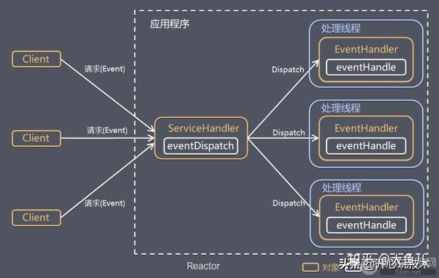
    - Reactor 模式中有 2 个关键组成：
      - 1）Reactor：Reactor 在一个单独的线程中运行，负责监听和分发事件，分发给适当的处理程序来对 IO 事件做出反应。 它就像公司的电话接线员，它接听来自客户的电话并将线路转移到适当的联系人；
      - 2）Handlers：处理程序执行 I/O 事件要完成的实际事件，类似于客户想要与之交谈的公司中的实际官员。Reactor 通过调度适当的处理程序来响应 I/O 事件，处理程序执行非阻塞操作
    - 根据 Reactor 的数量和处理资源池线程的数量不同，有 3 种典型的实现
      - 1）单 Reactor 单线程；
        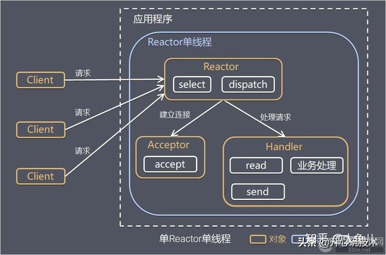
        - Reactor 对象通过 Select 监控客户端请求事件，收到事件后通过 Dispatch 进行分发；
        - 如果是建立连接请求事件，则由 Acceptor 通过 Accept 处理连接请求，然后创建一个 Handler 对象处理连接完成后的后续业务处理；
        - 如果不是建立连接事件，则 Reactor 会分发调用连接对应的 Handler 来响应；
        - Handler 会完成 Read→业务处理→Send 的完整业务流程。
        - 优点：模型简单，没有多线程、进程通信、竞争的问题，全部都在一个线程中完成
        - 缺点：性能问题，只有一个线程，无法完全发挥多核 CPU 的性能。Handler 在处理某个连接上的业务时，整个进程无法处理其他连接事件，很容易导致性能瓶颈。
        - 使用场景：客户端的数量有限，业务处理非常快速，比如 Redis，业务处理的时间复杂度 O(1)。
      - 2）单 Reactor 多线程；
        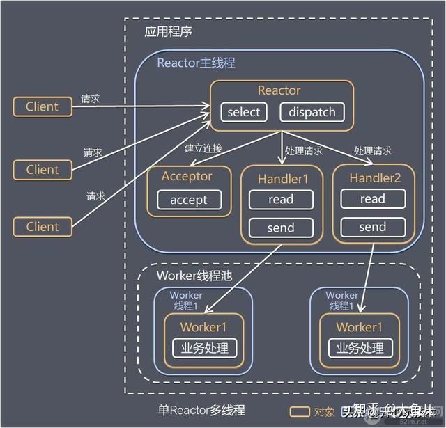
        - 1）Reactor 对象通过 Select 监控客户端请求事件，收到事件后通过 Dispatch 进行分发；
        - 2）如果是建立连接请求事件，则由 Acceptor 通过 Accept 处理连接请求，然后创建一个 Handler 对象处理连接完成后续的各种事件；
        - 3）如果不是建立连接事件，则 Reactor 会分发调用连接对应的 Handler 来响应；
        - 4）Handler 只负责响应事件，不做具体业务处理，通过 Read 读取数据后，会分发给后面的 Worker 线程池进行业务处理；
        - 5）Worker 线程池会分配独立的线程完成真正的业务处理，如何将响应结果发给 Handler 进行处理；
        - 6）Handler 收到响应结果后通过 Send 将响应结果返回给 Client。
        - 优点：可以充分利用多核 CPU 的处理能力。
        - 缺点：多线程数据共享和访问比较复杂；Reactor 承担所有事件的监听和响应，在单线程中运行，高并发场景下容易成为性能瓶颈。
      - 3）主从 Reactor 多线程。
        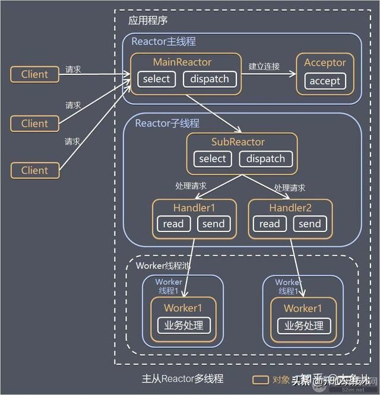
        - 1）Reactor 主线程 MainReactor 对象通过 Select 监控建立连接事件，收到事件后通过 Acceptor 接收，处理建立连接事件；
        - 2）Acceptor 处理建立连接事件后，MainReactor 将连接分配 Reactor 子线程给 SubReactor 进行处理；
        - 3）SubReactor 将连接加入连接队列进行监听，并创建一个 Handler 用于处理各种连接事件；
        - 4）当有新的事件发生时，SubReactor 会调用连接对应的 Handler 进行响应；
        - 5）Handler 通过 Read 读取数据后，会分发给后面的 Worker 线程池进行业务处理；
        - 6）Worker 线程池会分配独立的线程完成真正的业务处理，如何将响应结果发给 Handler 进行处理；
        - 7）Handler 收到响应结果后通过 Send 将响应结果返回给 Client。
        - 优点：父线程与子线程的数据交互简单职责明确，父线程只需要接收新连接，子线程完成后续的业务处理
        - 这种模型在许多项目中广泛使用，包括 Nginx 主从 Reactor 多进程模型，Memcached 主从多线程，Netty 主从多线程模型的支持。
  - 异步网络模型 Proactor
    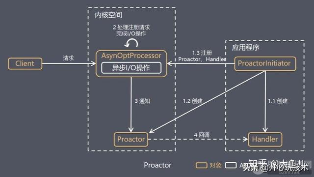
    - 1）Proactor Initiator 创建 Proactor 和 Handler 对象，并将 Proactor 和 Handler 都通过 AsyOptProcessor（Asynchronous Operation Processor）注册到内核；
    - 2）AsyOptProcessor 处理注册请求，并处理 I/O 操作；
    - 3）AsyOptProcessor 完成 I/O 操作后通知 Proactor；
    - 4）Proactor 根据不同的事件类型回调不同的 Handler 进行业务处理；
    - 5）Handler 完成业务处理。
  - Proactor 和 Reactor 的区别：
    - Reactor 是在事件发生时就通知事先注册的事件（读写在应用程序线程中处理完成）；
    - Proactor 是在事件发生时基于异步 I/O 完成读写操作（由内核完成），待 I/O 操作完成后才回调应用程序的处理器来进行业务处理。
    - 理论上 Proactor 比 Reactor 效率更高，异步 I/O 更加充分发挥 DMA(Direct Memory Access，直接内存存取)的优势
- [Socket Tracer](https://developer.aliyun.com/article/786083)
  - Socket维度信息采集
    - 流量(tx/rx)、延迟(srtt)，待重传包数量、总重传次数、收发队列长度，Accept队列长度。
    - TCP 生命周期监控：监听TCP Close事件，统计连接时长，收发包总字节数。
    - TCP Reset异常监控：收到或者发送Reset的异常，及异常时刻的TCP State。
  - 指标选取原理
    - TCP Retransmit
      - 包重传的超时时间是RTO，通常是200ms左右，当我们观察到一段时间出现了TCP包重传，后续又恢复正常了，可以判断这个时间段出现了网络抖动
    - TCP SRTTRTT
      - 通过srtt历史曲线图或柱状图，观察出来延迟的区间变化，就可以知道网络连接的srtt是否抖动
    - TCP Tx/Rx
      - 传输层收到数据，但堆积在rcv_queue中，可能是应用层处理代码阻塞。
      - 传输层Rx没有增加，则很可能是对端没有发送数据。
    - TCP reset reasons
      - Non-Existence TCP endpoint: Port or IP（Restrict Local IP address）：服务端不存在。(SYN -> Server reset)
      - TCP SYN matches existing sessions：服务端、或者防火墙已存在相同5元组连接。(SYN -> Server reset)
      - Listening endPoint Queue Full ：应用层没有及时accept，导致服务端Accept队列满（全链接队列满），分两种情况：
         - 对于新来握手请求 SYN -> SYN包会被Server默默丢弃，不会触发reset；
         - 碰巧在Client 回 ACK(握手第三个包)时，accept 队列满了，Server 会根据 tcp_abort_on_overflow sysctl 配置，决定是否发送 reset。
      - Half-Open Connections：服务端程序重启，导致链接信息丢失。(中间数据-> Server reset)
      - RESET by Firewalls in transit：在防火墙维护session状态的场景（NAT网关），防火墙Session TTL过期。(中间数据-> FW reset)
      - Time-Wait Assassination：Client Time-Wait 期间，收到 Server 端迟到的数据包，回送Ack给Server，导致Server发送Rst包。(Server 迟到数据 -> Client Ack-> Server Reset)
      - Aborting Connection：客户端Abort，内核发送reset给服务端。(Client Reset)
- [Graceful shutdown of a TCP server in Go](https://eli.thegreenplace.net/2020/graceful-shutdown-of-a-tcp-server-in-go/)
  - 1: waiting for client connections to shut down
  - 2: actively closing open client connections
- [TCP option SO_LINGER](https://stackoverflow.com/questions/3757289/when-is-tcp-option-so-linger-0-required)
  - To solve the issue lots of sockets in TIME_WAIT state. I have seen many suggesting to set the SO_LINGER socket option with timeout 0 before calling close(). However, this is a bad solution as it causes the TCP connection to be terminated with an error.
  - When to use SO_LINGER with timeout 0 - SO_LINGER socket option to 0. This causes pending data to be discarded and the connection to be aborted with an RST rather than for the pending data to be transmitted and the connection closed cleanly with a FIN.
    - If a client of your server application misbehaves (times out, returns invalid data, etc.) an abortive close makes sense to avoid being stuck in CLOSE_WAIT or ending up in the TIME_WAIT state.
    - If you must restart your server application which currently has thousands of client connections you might consider setting this socket option to avoid thousands of server sockets in TIME_WAIT (when calling close() from the server end) as this might prevent the server from getting available ports for new client connections after being restarted.
- [What really is the "linger time" that can be set with SO_LINGER on sockets](https://stackoverflow.com/questions/71975992/what-really-is-the-linger-time-that-can-be-set-with-so-linger-on-sockets)
  - When a TCP socket is disconnected, there are three things the system has to consider:
    - There might still be unsent data in the send-buffer of that socket which would get lost if the socket is closed immediately.
    - There might still be data in flight, that is, data has already been sent out to the other side but the other side has not yet acknowledged to have received that data correctly and it may have to be resent or otherwise is lost.
    - Closing a TCP socket is a three-way handshake with no confirmation of the third packet. As the sender doesn't know if the third packet has ever arrived, it has to wait some time and see if the second one gets resend. If it does, the third one has been lost and must be resent.
  - When you close a socket using the close() call, the system will usually not immediately destroy the socket but will first try to resolve all the three issues above to prevent data loss and ensure a clean disconnect.
  - There is a socket option named `SO_LINGER` that controls how the system will close a socket. You can turn lingering on or off using that option and if is turned on, set a timeout
    - The default is that lingering is turned off, which means close() returns immediately and the details of the socket closing process are left up to the system which will usually deal with it as described above.
    - If you turn lingering on and set a timeout other than zero, close() will not return immediately. It will only return if issue (1) and (2) have been resolved. 
      - If it is success, all remaining data got sent and acknowledged, 
      - if it is failure and errno is set to `EWOULDBLOCK`, the timeout has been hit and some data might have been lost.
    - In case of a non-blocking socket, close() will not block, not even with a linger time other than zero.
    - If you enable lingering but set the linger time to zero, this changes pretty much everything. In that case a call to close() will really close the socket immediately.
      - no matter if the socket is blocking or non-blocking, close() returns at once. Any data still in the send buffer is just discarded. Any data in flight is ignored and may or may not have arrived correctly at the other side.
      - the socket is also not closed using a normal TCP close handshake (FIN-ACK), it is killed instantly using a reset (RST).
      - if the other side tries to send something over the socket after the reset, this operation will fail with `ECONNRESET`.  whereas a normal close would result in `EPIPE`
  - To learn more about how different systems actually deal with different linger settings
    - [blocking sockets](https://www.nybek.com/blog/2015/03/05/cross-platform-testing-of-so_linger/)
    - [non-blocking sockets](https://www.nybek.com/blog/2015/04/29/so_linger-on-non-blocking-sockets/)
  - If you manually close a socket that is blocking (at least the moment you close it, might have been non-blocking before) and this socket has lingering enabled with timeout of zero, this is your best chance to avoid that this socket will go into TIME_WAIT state.
- [Go tcp shutdown() 和 close() 的区别](https://www.dawxy.com/article/golang-tcp-shutdown-%E5%92%8C-close-%E7%9A%84%E5%8C%BA%E5%88%AB/)
  - 在 go 中 syscall.shutdown 其实是在TCPConn.CloseRead 和 CloseWrite 中调用的，
  - 而 TCPConn.Close 调用的是 syscall.close
- [TIME_WAIT and its design implications for protocols](http://www.serverframework.com/asynchronousevents/2011/01/time-wait-and-its-design-implications-for-protocols-and-scalable-servers.html)
- [Linux 网络延迟排查方法](https://mp.weixin.qq.com/s/vIKK47YvW37cQ9PSm_JgRQ)
  - 在 Linux 服务器中，可以通过内核调优、DPDK 以及 XDP 等多种方式提高服务器的抗攻击能力，降低 DDoS 对正常服务的影响。
  - 在应用程序中，可以使用各级缓存、WAF、CDN 等来缓解 DDoS 对应用程序的影响。
  - DDoS 导致的网络延迟增加，我想你一定见过很多其他原因导致的网络延迟，例如：
    - 网络传输慢导致的延迟。
    - Linux 内核协议栈数据包处理速度慢导致的延迟。
    - 应用程序数据处理速度慢造成的延迟等。
  - Linux 网络延迟
    - 网络延迟（Network Latency. 数据从源发送到目的地，然后从目的地地址返回响应的往返时间：RTT（Round-Trip Time）。
    - 使用 traceroute 或 hping3 的 TCP 和 UDP 模式来获取网络延迟。
      ```shell
      # -c: 3 requests  
      # -S: Set TCP SYN  
      # -p: Set port to 80  
      $ hping3 -c 3 -S -p 80 google.com  
      HPING google.com (eth0 142.250.64.110): S set, 40 headers + 0 data bytes  
      
      $ traceroute --tcp -p 80 -n google.com  
      traceroute to google.com (142.250.190.110), 30 hops max, 60 byte packets 
      -- traceroute 会在路由的每一跳（hop）发送三个数据包，并在收到响应后输出往返延迟。如果没有响应或响应超时（默认 5s），将输出一个星号 *。
      ```
  - Sample
    - 案例中的客户端发生了 40ms 延迟，我们有理由怀疑客户端开启了延迟确认机制（Delayed Acknowledgment Mechanism）。这里的客户端其实就是之前运行的 wrk
    - 根据 TCP 文档，只有在 TCP 套接字专门设置了 TCP_QUICKACK 时才会启用快速确认模式（Fast Acknowledgment Mode）；否则，默认使用延迟确认机制：
    - ` strace -f wrk --latency -c 100 -t 2 --timeout 2 http://192.168.0.30:8080/ `
- [Linux下TCP延迟确认(Delayed Ack)机制导致的时延问题分析](https://cloud.tencent.com/developer/article/1004356)
  - Case
    - 写个压力测试程序，其实现逻辑为：每秒钟先连续发N个132字节的包，然后连续收N个由后台服务回显回来的132字节包。
    - 当N大于等于3的情况，第2秒之后，每次第三个recv调用，总会阻塞40毫秒左右，但在分析Server端日志时，发现所有请求在Server端处理时耗均在2ms以下
    - 先试图用strace跟踪客户端进程，但奇怪的是：一旦strace attach上进程，所有收发又都正常，不会有阻塞现象，一旦退出strace，问题重现 - ???
    - 解决办法如下：在recv系统调用后，调用一次setsockopt函数，设置`TCP_QUICKACK`
      ```go
          for (int i = 0; i < N; i++) {
              send(fd, sndBuf, 132, 0);
              ...    
          }
      
          for (int i = 0; i < N; i++) {
              recv(fd, rcvBuf, 132, 0); 
              setsockopt(fd, IPPROTO_TCP, TCP_QUICKACK, (int[]){1}, sizeof(int)); 
          }
      ```
  - 延迟确认机制
    - TCP在处理交互数据流(即Interactive Data Flow，区别于Bulk Data Flow，即成块数据流，典型的交互数据流如telnet、rlogin等)时，采用了Delayed Ack机制以及Nagle算法来减少小分组数目。
    - 为什么TCP延迟确认会导致延迟
      - 一般来说，只有当该机制与Nagle算法或拥塞控制(慢启动或拥塞避免)混合作用时，才可能会导致时耗增长
      - Nagle算法的规则(可参考tcp_output.c文件里tcp_nagle_check函数注释)：
        - 1)如果包长度达到MSS，则允许发送；
        - 2)如果该包含有FIN，则允许发送；
        - 3)设置了TCP_NODELAY选项，则允许发送；
        - 4)未设置TCP_CORK选项时，若所有发出去的包均被确认，或所有发出去的小数据包(包长度小于MSS)均被确认，则允许发送。
        - 对于规则4)，就是说要求一个TCP连接上最多只能有一个未被确认的小数据包，在该分组的确认到达之前，不能发送其他的小数据包。如果某个小分组的确认被延迟了(案例中的40ms)，那么后续小分组的发送就会相应的延迟。也就是说延迟确认影响的并不是被延迟确认的那个数据包，而是后续的应答包。
  - 为什么是40ms？这个时间能不能调整呢？
    - `echo 1 > /proc/sys/net/ipv4/tcpdelackmin`
    - Linux内核每隔固定周期会发出timer interrupt(IRQ 0)，HZ是用来定义每秒有几次timer interrupts的。举例来说，HZ为1000，代表每秒有1000次timer interrupts。HZ可在编译内核时设置。在我们现有服务器上跑的系统，HZ值均为250. 以此可知，最小的延迟确认时间为40ms
  - 为什么TCP_QUICKACK需要在每次调用recv后重新设置
    - linux下socket有一个pingpong属性来表明当前链接是否为交互数据流，如其值为1，则表明为交互数据流，会使用延迟确认机制。但是pingpong这个值是会动态变化的
  - 为什么不是所有包都延迟确认
    - TCP实现里，用tcp_in_quickack_mode(linux-2.6.39.1/net/ipv4/tcp_input.c, Line 197)这个函数来判断是否需要立即发送ACK。`icsk->icsk_ack.quick && !icsk->icsk_ack.pingpong;` 
    - quick这个属性其代码中的注释为：scheduled number of quick acks，即快速确认的包数量，每次进入quickack模式，quick被初始化为接收窗口除以2倍MSS值(linux-2.6.39.1/net/ipv4/tcp_input.c, Line 174)，每次发送一个ACK包，quick即被减1。
  - 关于TCP_CORK选项
    - 打开TCP_NODELAY选项，则意味着无论数据包是多么的小，都立即发送(不考虑拥塞窗口)。
    - 如果将TCP连接比喻为一个管道，那TCP_CORK选项的作用就像一个塞子。设置TCP_CORK选项，就是用塞子塞住管道，而取消TCP_CORK选项，就是将塞子拔掉。
    - 当TCP_CORK选项被设置时，TCP链接不会发送任何的小包，即只有当数据量达到MSS时，才会被发送。当数据传输完成时，通常需要取消该选项，以便被塞住，但是又不够MSS大小的包能及时发出去。
    - Nginx，在使用sendfile模式的情况下，可以设置打开TCP_CORK选项: 将nginx.conf配置文件里的tcp_nopush配置为on. 
- [Linux Network Performance Parameters](https://github.com/cch123/linux-network-performance-parameters)
- [Cilium 的 eBPF 收发包路径](http://arthurchiao.art/blog/understanding-ebpf-datapath-in-cilium-zh/)
- [没有accept，能建立TCP连接吗](https://mp.weixin.qq.com/s/n17NjGRab1u5eXkOCro1gg)
  - Answer
    - 就算不执行accept()方法，三次握手照常进行，并顺利建立连接。
    - 在服务端执行accept()前，如果客户端发送消息给服务端，服务端是能够正常回复ack确认包的。
  - 半连接队列、全连接队列是什么
    - 半连接队列（SYN队列），服务端收到第一次握手后，会将sock加入到这个队列中，队列内的sock都处于SYN_RECV 状态。
      - 半连接队列（syn_table）是个哈希表。
      - 半连接队列没有命令可以直接查看到，但因为半连接队列里，放的都是SYN_RECV 状态的连接，那可以通过统计处于这个状态的连接的数量，间接获得半连接队列的长度
      - `netstat -nt | grep -i '127.0.0.1:8080' | grep -i 'SYN_RECV' | wc -l`
      - `netstat -s | grep -i "SYNs to LISTEN sockets dropped"`
      - 
    - 全连接队列（ACCEPT队列），在服务端收到第三次握手后，会将半连接队列的sock取出，放到全连接队列中。队列里的sock都处于 ESTABLISHED状态。这里面的连接，就等着服务端执行accept()后被取出了。
      - 全连接队列（icsk_accept_queue）是个链表
      - 通过ss -lnt命令，可以看到全连接队列的大小，其中Send-Q是指全连接队列的最大值，可以看到我这上面的最大值是128；Recv-Q是指当前的全连接队列的使用值，我这边用了0个，也就是全连接队列里为空，连接都被取出来了。
      - 查看是否发生过队列溢出。`netstat -s | grep overflowed`
      - 如果配合使用`watch -d` 命令，可以自动每2s间隔执行相同命令，还能高亮显示变化的数字部分，如果溢出的数字不断变多，说明正在发生溢出的行为。
    - 建立连接的过程中根本不需要accept() 参与， 执行accept()只是为了从全连接队列里取出一条连接
  - 全连接队列满了会怎么样？
    - 如果队列满了，服务端还收到客户端的第三次握手ACK，默认当然会丢弃这个ACK。
    - `cat /proc/sys/net/ipv4/tcp_abort_on_overflow` 
      - tcp_abort_on_overflow设置为 0，全连接队列满了之后，会丢弃这个第三次握手ACK包，并且开启定时器，重传第二次握手的SYN+ACK，如果重传超过一定限制次数，还会把对应的半连接队列里的连接给删掉
      - tcp_abort_on_overflow设置为 1，全连接队列满了之后，就直接发RST给客户端，效果上看就是连接断了。
  - 半连接队列要是满了会怎么样
    - 一般是丢弃，但这个行为可以通过 tcp_syncookies 参数去控制
    - 当它被设置为1的时候，客户端发来第一次握手SYN时，服务端不会将其放入半连接队列中，而是直接生成一个cookies，这个cookies会跟着第二次握手，发回客户端。客户端在发第三次握手的时候带上这个cookies，服务端验证到它就是当初发出去的那个，就会建立连接并放入到全连接队列中。可以看出整个过程不再需要半连接队列的参与。
    - 会有一个cookies队列吗
      - 实际上cookies并不会有一个专门的队列保存，它是通过通信双方的IP地址端口、时间戳、MSS等信息进行实时计算的，保存在TCP报头的seq里。
    - cookies方案为什么不直接取代半连接队列
      - cookies方案虽然能防 SYN Flood攻击，但是也有一些问题。因为服务端并不会保存连接信息，所以如果传输过程中数据包丢了，也不会重发第二次握手的信息。
      - 编码解码cookies，都是比较耗CPU的，利用这一点，如果此时攻击者构造大量的第三次握手包（ACK包）这种通过构造大量ACK包去消耗服务端资源的攻击，叫ACK攻击，受到攻击的服务器可能会因为CPU资源耗尽导致没能响应正经请求。
  - 没有listen，为什么还能建立连接
    - 两个客户端同时向对方发出请求建立连接（TCP同时打开），这两个情况都有个共同点，就是没有服务端参与，也就是没有listen，就能建立连接。
    - 我们知道执行listen方法时，会创建半连接队列和全连接队列。三次握手的过程中会在这两个队列中暂存连接信息。
    - 内核还有个全局hash表，可以用于存放sock连接的信息。这个全局hash表其实还细分为ehash，bhash和listen_hash
    - 在TCP自连接的情况中，客户端在connect方法时，最后会将自己的连接信息放入到这个全局hash表中，然后将信息发出，消息在经过回环地址重新回到TCP传输层的时候，就会根据IP端口信息，再一次从这个全局hash中取出信息。于是握手包一来一回，最后成功建立连接。
- [主流的中间件所采用的网络模型](https://mp.weixin.qq.com/s/RtZY-2ILt-x6CdYrRe1bEw)
  - 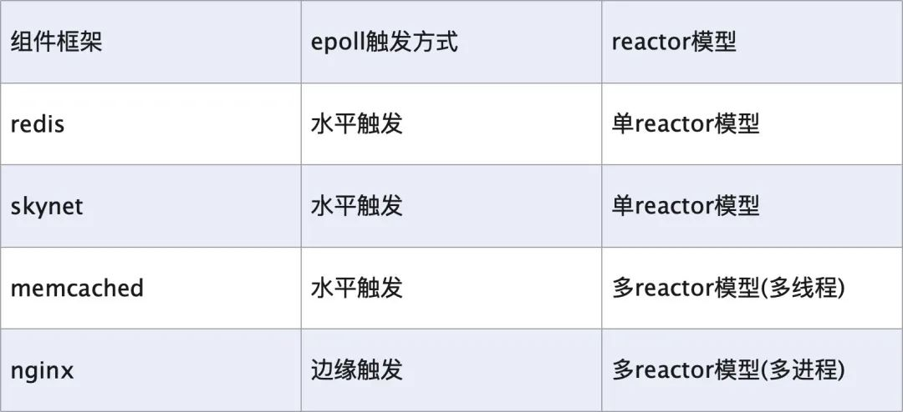
  - 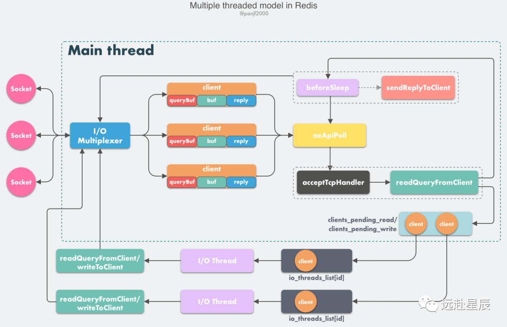
  - 
  - 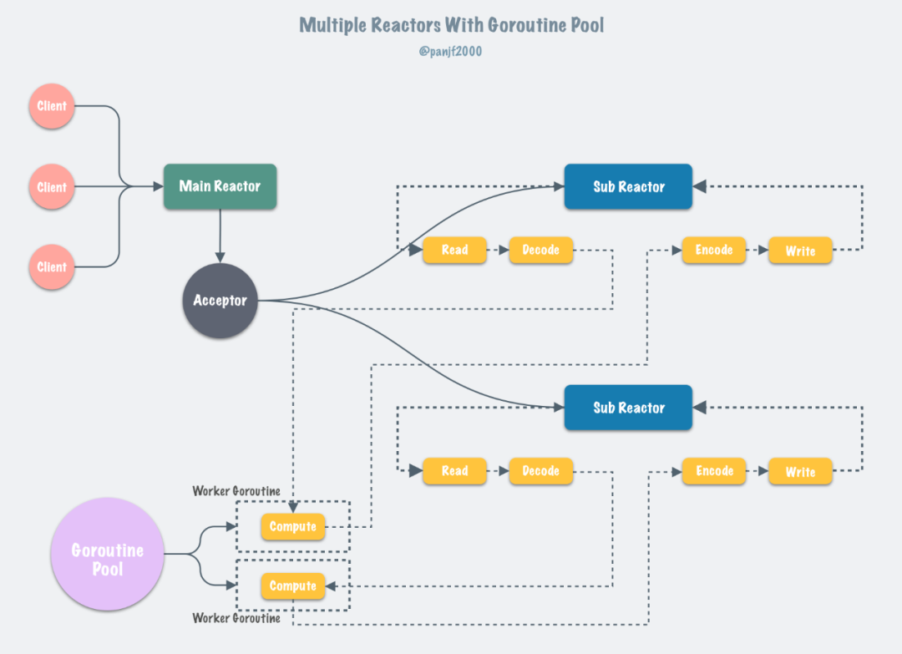
- [TCP 和 UDP 可以同时监听相同的端口吗？](https://mp.weixin.qq.com/s/rD0Fe4nqWjNAe9hGPrzBEQ)
  - TCP 和 UDP 可以同时绑定相同的端口吗？
    - 可以的。传输层有两个传输协议分别是 TCP 和 UDP，在内核中是两个完全独立的软件模块
  - 多个 TCP 服务进程可以绑定同一个端口吗？
    - 如果两个 TCP 服务进程绑定的 IP 地址不同，而端口相同的话，也是可以绑定成功的，
    - 如果两个 TCP 服务进程同时绑定的 IP 地址和端口都相同，那么执行 bind() 时候就会出错，错误是“Address already in use”。
    - 当 TCP 服务进程重启时，服务端会出现 TIME_WAIT 状态的连接，TIME_WAIT 状态的连接使用的 IP+PORT 仍然被认为是一个有效的 IP+PORT 组合，相同机器上不能够在该 IP+PORT 组合上进行绑定，那么执行 bind() 函数的时候，就会返回了 Address already in use 的错误。
    - 重启 TCP 服务进程时，如何避免“Address in use”的报错信息？
      - 我们可以在调用 bind 前，对 socket 设置 SO_REUSEADDR 属性，可以解决这个问题
    - 如果 TCP 服务进程 A 绑定的地址是  0.0.0.0 和端口 8888，而如果 TCP 服务进程 B 绑定的地址是 192.168.1.100 地址（或者其他地址）和端口 8888，那么执行 bind() 时候也会出错。
      - 这个问题也可以由 SO_REUSEADDR 解决，因为它的另外一个作用是：绑定的 IP地址 + 端口时，只要 IP 地址不是正好(exactly)相同，那么允许绑定。
  - 客户端的端口可以重复使用吗？
    - TCP 连接是由四元组（源IP地址，源端口，目的IP地址，目的端口）唯一确认的，那么只要四元组中其中一个元素发生了变化，那么就表示不同的 TCP 连接的。所以如果客户端已使用端口 64992 与服务端 A 建立了连接，那么客户端要与服务端 B 建立连接，还是可以使用端口 64992 的，因为内核是通过四元祖信息来定位一个 TCP 连接的，并不会因为客户端的端口号相同，而导致连接冲突的问题。
  - 多个客户端可以 bind 同一个端口吗？
    - 要看多个客户端绑定的 IP + PORT 是否都相同，如果都是相同的，那么在执行 bind() 时候就会出错，错误是“Address already in use”。
  - 如何解决客户端 TCP 连接 TIME_WAIT 过多，导致无法与同一个服务器建立连接的问题？
    - 那就是打开 net.ipv4.tcp_tw_reuse  这个内核参数。
    - 因为开启了这个内核参数后，客户端调用 connect  函数时，如果选择到的端口，已经被相同四元组的连接占用的时候，就会判断该连接是否处于  TIME_WAIT 状态，如果该连接处于 TIME_WAIT 状态并且 TIME_WAIT 状态持续的时间超过了 1 秒，那么就会重用这个连接，然后就可以正常使用该端口了。
- [一次关于TCP RST原因的调查](https://mp.weixin.qq.com/s/4iEMqjOT_bICGG-7QIBhUQ)
  - eBay的某一个URL出现了奇怪的现象。访问这个URL的时候，有时候能拿到正常的页面，有时候却是一个异常页面. 错误就是Java的Socket Exception: Connect reset。
  - 从时间顺序来看，在发生RST之前发生的事情只有下面两件：
    - 1. app tier LB向server发送HTTP GET请求
    - 2. server回复了两个HTTP响应报文
  - 这次的HTTP响应，即有Transfer-Encoding: chunked头部，也有Content-Length: 215039这个头部
  - 如果LB就此认为这个HTTP响应非法，从而用RST来关闭连接，也是无可厚非
- [TCP_NODELAY vs TCP_CORK]
  - TCP_NODELAY
    - TCP_NODELAY is used for disabling Nagle's algorithm.
    - Nagle's algorithm
      - Nagle's algorithm is for reducing more number of small network packets in wire. 
      - The algorithm is: if data is smaller than a limit (usually MSS), wait until receiving ACK for previously sent packets and in the mean time accumulate data from user. Then send the accumulated data.
    - However, waiting for the ACK may increase latency when sending streaming data. Additionally, if the receiver implements the 'delayed ACK policy', it will cause a temporary deadlock situation. In such cases, disabling Nagle's algorithm is a better option.
  - TCP_CORK
    - If set, don't send out partial frames. All queued partial frames are sent when the option is cleared again. This is useful for prepending headers before calling sendfile(2), or for throughput optimization.
    - there is a 200-millisecond ceiling on the time for which output is corked by TCP_CORK. If this ceiling is reached, then queued data is automatically transmitted. 
    - By forcing TCP_CORK, data would be aggregated to the same buffer (SKB) until the buffer is filled. This option is stronger than TCP_NODELAY (i.e. disable Nagle's algorithm) so it would still work even when TCP_NODELAY option is set.
  - [tcp_autocorking](https://stackoverflow.com/a/45195801/3011380)
    - tcp_autocorking is a flag for the kernel for checking specific conditions and perform corking when these conditions are met.
    - tcp_autocorking, on the other hand, wouldn't force aggregation until the buffer is full, but rather check specific conditions for continuing aggregation on current buffer. The tcp_push() function calls tcp_should_autocork() function (net/include/tcp.c) in order to check if current buffer should be sent:
  - [Use case](https://stackoverflow.com/a/22189889/3011380)
    - **TCP_NODELAY ON** means send the data (partial frames) the moment you get, regardless if you have enough frames for a full network packet.
    - **TCP_NODELAY OFF** means Nagles Algoritm which means send the data when it is bigger than the MSS or waiting for the receiving acknowledgement before sending data which is smaller.
    - **TCP_CORK ON** means don't send any data (partial frames) smaller than the MSS until the application says so or until 200ms later.
    - **TCP_CORK OFF** means send all the data (partial frames) now.
    - TCP_NODELAY sends doesn't accumulate the logical packets before sending then as network packets, Nagle's algorithm does according the algorithm, and TCP_CORK does according to the application setting it.
    - A side effect of this is that Nagle's algorithm will send partial frames on an idle connection, TCP_CORK won't.
    - TCP_CORK is useful whenever the server knows the patterns of its bulk transfers. Which is just about 100% of the time with any kind of file serving.
- [从一次经历谈 TIME_WAIT 的那些事](https://coolshell.cn/articles/22263.html)
  - Issue
    - EaseProbe 是一个轻量独立的用来探活服务健康状况的小工具.不会设置 TCP 的 KeepAlive 重用链接，因为探活工具除了要探活所远端的服务，还要探活整个网络的情况，所以，每次探活都需要从新来过，这样才能捕捉得到整个链路的情况。
    - 根据TCP的状态机，我们知道这会导致在探测端这边出现的 TIME_WAIT 的 TCP 链接，根据 TCP 协议的定义，这个 TIME_WAIT 需要等待 2倍的MSL 时间，TCP 链接都会被系统回收，在回收之前，这个链接会占用系统的资源，主要是两个资源，一个是文件描述符，这个还好，可以调整，另一个则是端口号，这个是没法调整的
  - 为什么要 TIME_WAIT
    - 为了 防止来自一个连接的延迟段被依赖于相同四元组（源地址、源端口、目标地址、目标端口）的稍后连接接受（被接受后，就会被马上断掉，TCP状态机紊乱）。
      - 虽然，可以通过指定 TCP 的 sequence number 一定范围内才能被接受。
      - 但这也只是让问题发生的概率低了一些，对于一个吞吐量大的的应用来说，依然能够出现问题，尤其是在具有大接收窗口的快速连接上 [rfc1337](https://www.rfc-editor.org/rfc/rfc1337)
    - 另一个目的是确保远端已经关闭了连接
      - 当最后一个ACK丢失时，对端保持该LAST-ACK状态。在没有TIME-WAIT状态的情况下，可以重新打开连接，而远程端仍然认为先前的连接有效。当它收到一个SYN段（并且序列号匹配）时，它将以RST应答，因为它不期望这样的段。新连接将因错误而中止：
    - TIME_WAIT 的这个超时时间的值如下所示：
      - 在 macOS 上是15秒， sysctl net.inet.tcp | grep net.inet.tcp.msl
      - 在 Linux 上是 60秒 cat /proc/sys/net/ipv4/tcp_fin_timeout
  - 解决方案
    - 把这个超时间调小一些，这样就可以把TCP 的端口号回收的快一些。但是也不能太小，如果流量很大的话，TIME_WAIT一样会被耗尽。
    - 设置上 tcp_tw_reuse 。RFC 1323提出了一组 TCP 扩展来提高高带宽路径的性能。除其他外，它定义了一个新的 TCP 选项，带有两个四字节时间戳字段。第一个是发送选项的 TCP 时间戳的当前值，而第二个是从远程主机接收到的最新时间戳。如果新时间戳严格大于为前一个连接记录的最新时间戳。Linux 将重用该状态下的现有 TIME_WAIT 连接用于出站的链接。也就是说，这个参数对于入站连接是没有任何用图的。
    - SO_LINGER 
      - 这个参数主要是为了延尽关闭来用的，也就是说你应用调用 close()函数时，如果还有数据没有发送完成，则需要等一个延时时间来让数据发完，但是，如果你把延时设置为 0  时，Socket就丢弃数据，并向对方发送一个 RST 来终止连接，因为走的是 RST 包，所以就不会有 TIME_WAIT 了。
      - 这个东西在服务器端永远不要设置，不然，你的客户端就总是看到 TCP 链接错误 “connnection reset by peer”，
  - Golang
    - net.TCPConn 有个方法 SetLinger()可以完成这个事，使用起来也比较简单：
    - 对于Golang 的标准库中的 HTTP 对象来说，就有点麻烦了，Golang的 http 库把底层的这边连接对象全都包装成私有变量了，你在外面根本获取不到
      ```go
      client := &http.Client{
          Timeout: h.Timeout(),
          Transport: &http.Transport{
            TLSClientConfig:   tls,
            DisableKeepAlives: true,
            DialContext: func(ctx context.Context, network, addr string) (net.Conn, error) {
              d := net.Dialer{Timeout: h.Timeout()}
              conn, err := d.DialContext(ctx, network, addr)
              if err != nil {
                return nil, err
              }
              tcpConn, ok := conn.(*net.TCPConn)
              if ok {
                tcpConn.SetLinger(0)
                return tcpConn, nil
              }
              return conn, nil
            },
          },
        }
      ```
  - Summary
    - TIME_WAIT 是一个TCP 协议完整性的手段，虽然会有一定的副作用，但是这个设计是非常关键的，最好不要妥协掉。
    - 永远不要使用  tcp_tw_recycle ，这个参数是个巨龙，破坏力极大。
    - 服务器端永远不要使用  SO_LINGER(0)，而且使用 tcp_tw_reuse 对服务端意义不大，因为它只对出站流量有用。
    - 在服务端上最好不要主动断链接，设置好KeepAlive，重用链接，让客户端主动断链接。
    - 在客户端上可以使用 tcp_tw_reuse  和 SO_LINGER(0)
- [TIME_WAIT]()
  - [Coping with the TCP TIME-WAIT state on busy Linux servers](https://vincent.bernat.ch/en/blog/2014-tcp-time-wait-state-linux#about-the-time-wait-state)
  - [TIME_WAIT and its design implications for protocols and scalable client server systems](http://www.serverframework.com/asynchronousevents/2011/01/time-wait-and-its-design-implications-for-protocols-and-scalable-servers.html)
- [UDP就一定比TCP快](https://juejin.cn/post/7147243567075819557/)
  - TCP
    - 重传机制 - 如果长时间等不到对方的确认，TCP就会重新发一次消息，这就是所谓的重传机制
    - 流量控制机制 - TCP就需要思考有没有办法可以尽量避免重传, TCP根据窗口的大小去控制自己发送的数据量，这样就能大大减少丢包的概率。
    - 滑动窗口机制 - TCP是通过滑动窗口机制来实现流量控制机制的
    - 拥塞控制机制 - 流量控制针对的是单个连接数据处理能力的控制，拥塞控制针对的是整个网络环境数据处理能力的控制。
    - 分段机制 - 降低重传带来的影响呢？ - 当我们需要发送一个超大的数据包时，如果这个数据包丢了，那就得重传同样大的数据包。但如果我能将其分成一小段一小段，那就算真丢了，那我也就只需要重传那一小段就好了，大大减小了重传的压力，这就是TCP的分段机制。
      - 在传输层叫MSS（Maximum Segment Size）
      - 在网络层，如果数据包还大于MTU（Maximum Transmit Unit）
      - 一般情况下，MSS=MTU-40Byte，所以TCP分段后，到了IP层大概率就不会再分片了。
    - 乱序重排机制 - 后发的数据包先到是吧，那就先放到专门的乱序队列中，等数据都到齐后，重新整理好乱序队列的数据包顺序后再给到用户，这就是乱序重排机制。
  - UDP
    - 对于UDP+重传的场景，如果要传超大数据包，并且没有实现分段机制的话，那数据就会在IP层分片，一旦丢包，那就需要重传整个超大数据包。而TCP则不需要考虑这个，内部会自动分段，丢包重传分段就行了。这种场景下，其实TCP更快。
- [TCP 三次握手](https://mp.weixin.qq.com/s/sqkYBM-4l4qFFPkjY_zCJA)
  - TCP 三次握手中，客户端收到的第二次握手中 ack 确认号不是自己期望的，会发生什么？是直接丢弃 or 回 RST 报文？
    - 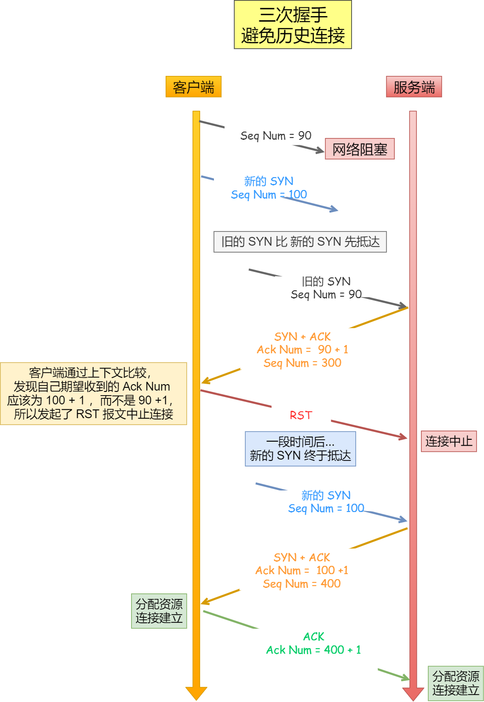
    - 回 RST 报文。TCP 使用三次握手建立连接的最主要原因就是防止「历史连接」初始化了连接。
    - 如果是两次握手连接，就无法阻止历史连接，那为什么 TCP 两次握手为什么无法阻止历史连接呢？
      - 因为在两次握手的情况下，「被动发起方」没有中间状态给「主动发起方」来阻止历史连接，导致「被动发起方」可能建立一个历史连接，造成资源浪费。
  - 什么情况下会收到不正确的 ack（第二次握手中的 ack） 呢
    - 当客户端发起多次 SYN 报文，然后网络拥堵的情况下，「旧的 SYN 报文」比「新的 SYN 报文」早抵达服务端，此时服务端就会按照收到的「旧的 SYN 报文」回复 syn+ack 报文，而此报文的确认号并不是客户端期望收到的，于是客户端就会回 RST 报文。
- [Unix Domain Socket]
  - Unix Domain socket
    - an inter-process communication mechanism that allows bidirectional data exchange between processes running on the same machine.
    - UNIX domain sockets know that they’re executing on the same system, so they can avoid some checks and operations (like routing); which makes them faster and lighter than IP sockets.
    - Listening sockets live in the filesystem hierarchy and access to them can be controlled by filesystem permissions.
    - UNIX domain sockets are subject to file system permissions, while TCP sockets can be controlled only on the packet filter level.
  - TCP/IP sockets
    - a mechanism allowing communication between processes over the network. In some cases, you can use TCP/IP sockets to talk with processes running on the same computer (by using the loopback interface)
    - A connected TCP socket is identified by the combination of local IP, local port, remote IP and remote port. A listening TCP socket is identified by local port and possibly local IP. As I understand it, at least on linux TCP/IP sockets always result in the generation and decoding of TCP/IP packets, even if the client and server are on the same machine.
  - Command
    - Linux `netstat -a -p --unix`
    - MaxOS `netstat -a -f unix`
- [TCP vs UDP](https://mp.weixin.qq.com/s/5P3cGcZFQEk6t8xiX4OfMQ)
  - TCP
    - 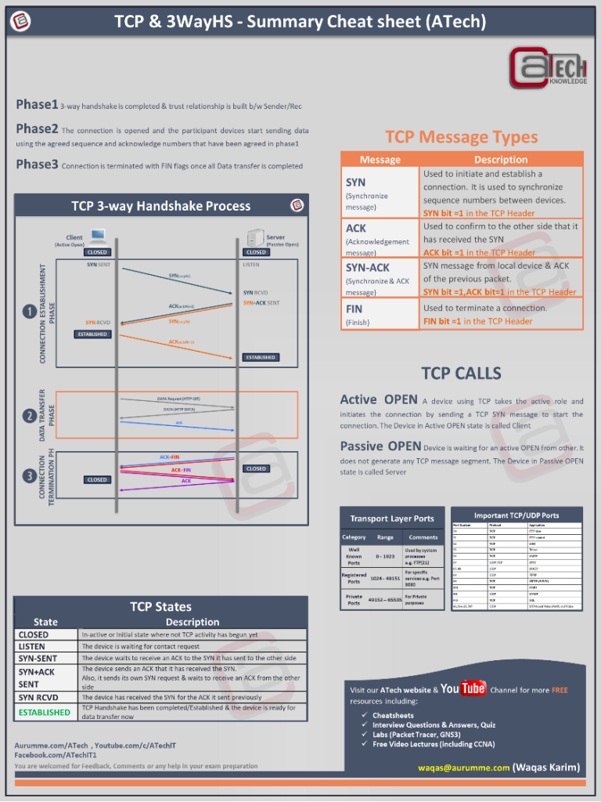
    - 流量控制
      - 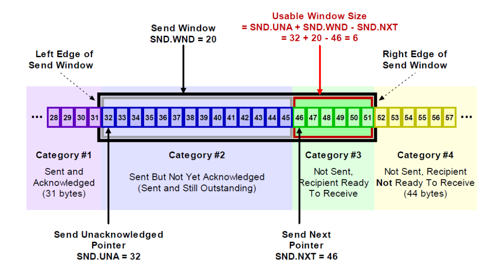
      - 流量控制，就是让发送方的发送速率不要太快，要让接收方来得及接收。 利用滑动窗口机制可以很方便地在tcp连接上实现对发送方的流量控制
      - 重传计时器
        - TCP发送方收到接收方的零窗口通知后，应启动持续计时器。持续计时器超时后，向接收方发送零窗口探测报文
        - 即使接收窗口为0，接收方也会接收：零窗口探测报文段、确认报文段、携带紧急数据的报文段
      - TCP发送方的发送窗口大小 = Math.min(自身拥塞窗口大小, TCP接收方的接收窗口大小)
    - 拥塞控制
      - 慢开始 + 拥塞避免+快重传 + 快恢复结合
      - 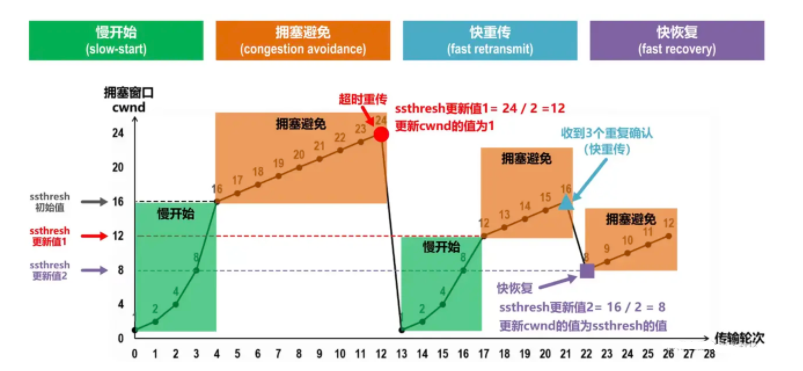
    - 三次握手
      - 发送端：SYN=1、seq=x
      - 接收端：ACK=1、ack=x+1、SYN=1、seq=y
      - 发送端：ACK=1、ack=y+1、seq=x+1
      - 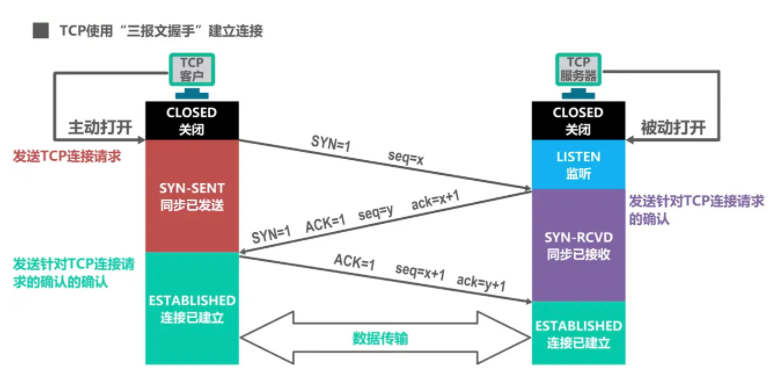
      - TCP规定：SYN被设置为1的报文段不能携带数据，但要消耗掉一个序号
      - TCP规定：普通的确认报文段如果不携带数据，则不消耗序号
    - 四次挥手
      - 发送端：FIN=1，ACK=1，seq=u，ack=v（u等于发送端已传送过的数据的最后一个字节序号+1，v等于发送端之前已收到的数据的最后一字节序号+1）
      - 接收端：ACK=1，ack=u+1，seq=v
      - 接收端：FIN=1，ACK=1，ack=u+1，seq=w（w：半关闭情况下，可能收到了数据）
      - 发送端：ACK=1，ack=w+1，seq=u+1
      - 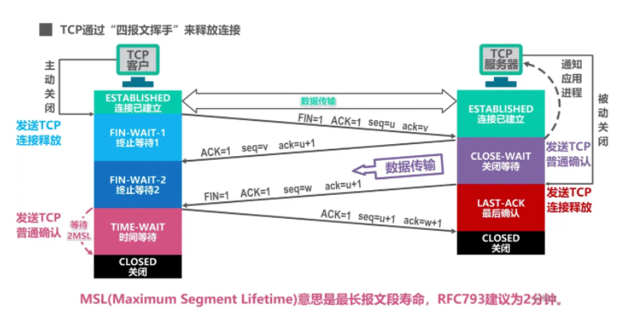
      - TCP规定：终止位FIN等于1的报文段，即使不携带数据，也要一个消耗掉一个序号
  - UDP
    - 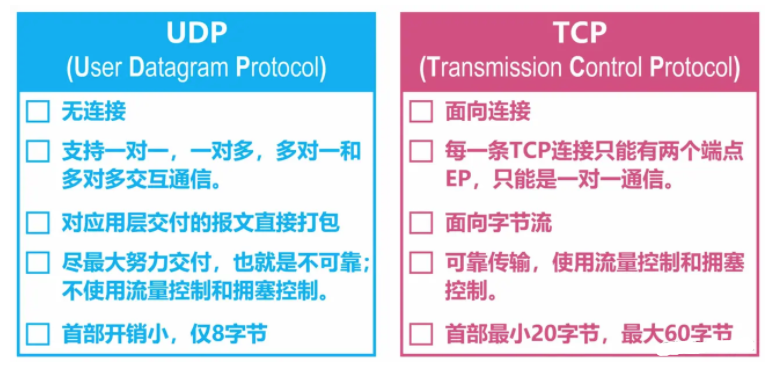
- [socket是并发安全的吗](https://mp.weixin.qq.com/s/rNfBHtpFLxwY7-CiBvkQ5A)
  - 写TCP Socket是线程安全的吗？
    - 内核里都会走到 tcp_sendmsg() 函数的代码中可以看到，在对socket的缓冲区执行写操作的时候，linux内核已经自动帮我们加好了锁，也就是说，是线程安全的。
    - 多线程不加锁并发写入数据吗？
      - 不能。 问题的关键在于锁的粒度。问题就出在这个"基于字节流"，它是个源源不断的二进制数据流，无边界。来多少就发多少，但是能发多少，得看你的发送缓冲区还剩多少空间。
      - 消息给串行化 - 可以在在业务代码里为每个socket_fd配一个队列来做，将数据在用户态加锁后塞到这个队列里，再单独开一个线程，这个线程的工作就是发送消息给socket_fd。
      - 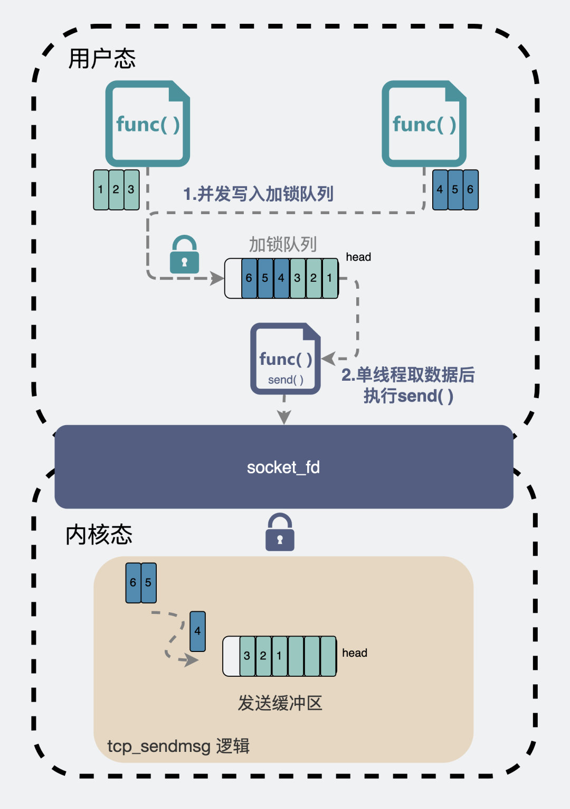
  - 读TCP Socket是线程安全的吗？
    - 因为这个锁，只保证你在读socket 接收缓冲区时，只有一个线程在读，但并不能保证你每次的时候，都能正好读到完整消息体后才返回。
    - 解决方案还是跟读的时候一样，读socket的只能有一个线程，读到了消息之后塞到加锁队列中，再将消息分开给到GameServer的多线程用户逻辑模块中去做处理。
  - 读写UDP Socket是线程安全的吗？
    - 会到linux内核的udp_sendmsg函数, 开启MSG_MORE时多个线程会同时写到同一个socket_fd对应的发送缓冲区中，然后再统一一起发送到IP层，因此需要有个锁防止出现多个线程将对方写的数据给覆盖掉的问题。而不开启MSG_MORE时，数据则会直接发送给IP层，就没有了上面的烦恼。
    - 能否多线程同时并发读或写同一个UDP socket？
      - TCP不能用多线程同时读和同时写，是因为它是基于数据流的协议。
      - 那UDP呢？它是基于数据报的协议。 基于数据报，可以类比为一件件快递进入传送管道一样，内核很清楚拿到的是几件快递，快递和快递之间边界分明。
      - UDP 发送端发了 10 次数据报，那接收端就要在 10 次收完，且发了多少次，就取多少次，确保每次都是一个完整的数据报。
      - 所以从这个角度来说，UDP写数据报的行为是"原子"的，不存在发一半包或收一半包的问题，要么整个包成功，要么整个包失败。因此多个线程同时读写，也就不会有TCP的问题。 所以，可以多个线程同时读写同一个udp socket。
    - 为什么不建议使用多线程同时读写同一个UDP socket
      - udp本身是不可靠的协议，多线程高并发执行发送时，会对系统造成较大压力，这时候丢包是常见的事情。虽然这时候应用层能实现重传逻辑，但重传这件事毕竟是越少越好。因此通常还会希望能有个应用层流量控制的功能，如果是单线程读写的话，就可以在同一个地方对流量实现调控。
  - Summary
    - 1. 多线程并发读/写同一个TCP socket是线程安全的，因为TCP socket的读/写操作都上锁了。虽然线程安全，但依然不建议你这么做，因为TCP本身是基于数据流的协议，一份完整的消息数据可能会分开多次去写/读，内核的锁只保证单次读/写socket是线程安全，锁的粒度并不覆盖整个完整消息。因此建议用一个线程去读/写TCP socket。
    - 2. 多线程并发读/写同一个UDP socket也是线程安全的，因为UDP socket的读/写操作也都上锁了。UDP写数据报的行为是"原子"的，不存在发一半包或收一半包的问题，要么整个包成功，要么整个包失败。因此多个线程同时读写，也就不会有TCP的问题。虽然如此，但还是建议用一个线程去读/写UDP socket。


