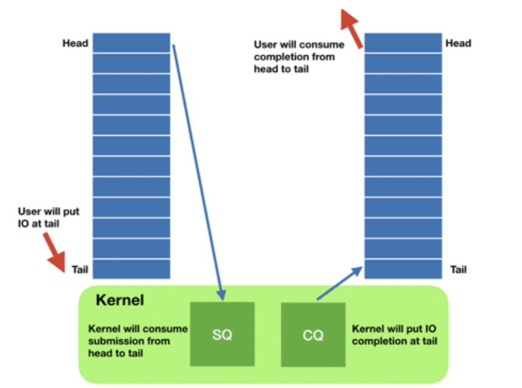

- Socket Buffer
  - 一个socket ，会带有两个缓冲区，一个用于发送，一个用于接收
    - 用户发送消息的时候写给 send buffer（发送缓冲区）
    - 用户接收消息的时候写给 recv buffer（接收缓冲区）
  - 查看 socket 缓冲区，可以在linux环境下执行 `netstat -nt` 命令
    - Send-Q 是发送缓冲区
    - Recv-Q 代表接收缓冲区
  - TCP
    - 执行 send 发送的字节，会立马发送吗
    
    - 如果缓冲区满了会怎么办
    
    - 如果socket缓冲区还有数据，执行close了，会怎么样
      - 如果接收缓冲区有数据时，执行close了，会怎么样
        - 如果接收缓冲区还有数据未读，会先把接收缓冲区的数据清空，然后给对端发一个RST。
      - 如果接收缓冲区是空的，那么就调用 tcp_send_fin() 开始进行四次挥手过程的第一次挥手
    - 如果发送缓冲区有数据时，执行close了，会怎么样
      - 内核会把发送缓冲区最后一个数据块拿出来。然后置为 FIN。
      - socket 缓冲区是个先进先出的队列，这种情况是指内核会等待TCP层安静把发送缓冲区数据都发完，最后再执行四次挥手的第一次挥手（FIN包）
  - UDP
    - 我们大部分情况下，都不会用  MSG_MORE，也就是来一个数据包就直接发一个数据包。从这个行为上来说，虽然UDP用上了发送缓冲区，但实际上并没有起到"缓冲"的作用

- [SO_REUSEPORT vs SO_REUSEADDR](https://idea.popcount.org/2014-04-03-bind-before-connect/)
  - SO_REUSEADDR - There are at least three situations when this flag is useful
    - Normally after binding to a port and stopping a server it's necessary to wait for a socket to time out before another server can bind to the same port. With SO_REUSEADDR set it's possible to rebind immediately, even if the socket is in a TIME_WAIT state.
    - When one server binds to INADDR_ANY, say 0.0.0.0:1234, it's impossible to have another server binding to a specific address like 192.168.1.21:1234. With SO_REUSEADDR flag this behaviour is allowed.
    - When using the bind before connect trick only a single connection can use a single outgoing source port. With this flag, it's possible for many connections to reuse the same source port, given that they connect to different destination addresses.
  - SO_REUSEPORT
    - It was introduced for UDP multicast sockets. Initially, only a single server was able to use a particular port to listen to a multicast group. This flag allowed different sockets to bind to exactly the same IP and port, and receive datagrams for selected multicast groups.
    - More generally speaking, setting SO_REUSEPORT informs a kernel of an intention to share a particular bound port between many processes, but only for a single user. For multicast datagrams are distributed based on multicast groups, for usual UDP datagrams are distributed in round-robin way. For a long time this flag wasn't available for TCP sockets, but recently Google submitted patches that fix it and distribute incoming connections in round-robin way between listening sockets.
  - EADDRNOTAVAIL vs EADDRINUSE
    - Check bind() for EADDRINUSE errors, in case we run out of available ports.
    - Check connect() for EADDRNOTAVAIL errors in case there is a connection conflict and retry if necessary.
    - If you establish 64k connections using connect, bind will fail with EADDRINUSE. 
    - when thousands of connections are using bind before connect straight connect might fail with EADDRNOTAVAIL.
    - In such case connect() will fail with EADDRNOTAVAIL error. Here's a code handling this situation:
      ```c
      for i in range(RETRIES):
          s = socket.socket(socket.AF_INET, socket.SOCK_STREAM)
          s.setsockopt(socket.SOL_SOCKET, socket.SO_REUSEADDR, 1)
          s.bind(("192.168.1.21", 0))
          try:
              s.connect(("www.google.com", 80))
              break
          except socket.error, e:
              if e.errno != errno.EADDRNOTAVAIL:
                  raise
      else:
          raise Exception("Failed to find an unused source port")
      ```
- [Outgoing connections on Linux](https://blog.cloudflare.com/how-to-stop-running-out-of-ephemeral-ports-and-start-to-love-long-lived-connections/)
  - TCP
    - naive method

     | technique description	| errno on port exhaustion	| possible src 2-tuple reuse |
     | ----- | ------ | ------ |
     | connect(dst_IP, dst_port)	| EADDRNOTAVAIL	| yes (good!)|
    - Manually selecting source IP address

     |technique description	|errno on port exhaustion	|possible src 2-tuple reuse |
     | ----- | ------ | ------ |
     |bind(src_IP, 0) <br> connect(dst_IP, dst_port)	| EADDRINUSE	| no (bad!) |
    - IP_BIND_ADDRESS_NO_PORT

      | technique description	| errno on port exhaustion	| possible src 2-tuple reuse |
      | ----- | ------ | ------ |
      |IP_BIND_ADDRESS_NO_PORT <br> bind(src_IP, 0) <br> connect(dst_IP, dst_port)	|EADDRNOTAVAIL	 | yes (good!) |
    - Explicitly selecting a source port

      | technique description	| errno on port exhaustion	| possible src 2-tuple reuse |
      | ----- | ------ | ------ |
      | SO_REUSEADDR <br> bind(src_IP, src_port) <br> connect(dst_IP, dst_port)	| EADDRNOTAVAIL	| yes (good!) |
  - UDP
    - Vanilla UDP is limited

      | technique description	| errno on port exhaustion	| possible src 2-tuple reuse	| risk of overshadowing |
      | ----- | ------ | ------ | -------  |
      | connect(dst_IP, dst_port)	| EAGAIN	| no (bad!)	 | no |
    - SO_REUSEADDR is hard

      | technique description	| errno on port exhaustion	| possible src 2-tuple reuse	| risk of overshadowing |
      | ----- | ------ | ------ | -------  |
      | SO_REUSEADDR <br> connect(dst_IP, dst_port)	| EAGAIN	| yes	 | yes (bad!) |
- [epoll Edge Triggered vs Level Triggered](https://stackoverflow.com/a/41730177/3011380)
  - Edge Triggered: 
    - Once you set EPOLLET, events are triggered only if they change the state of the fd - meaning that only the first event is triggered and no new events will get triggered until that event is fully handled.
    - This design is explicitly meant to prevent epoll_wait from returning due to an event that is in the process of being handled (i.e., when new data arrives while the EPOLLIN was already raised but read hadn't been called or not all of the data was read).
    - The edge-triggered event rule is simple all same-type (i.e. EPOLLIN) events are merged until all available data was processed.
    - In the case of a listening socket, the EPOLLIN event won't be triggered again until all existing listen "backlog" sockets have been accepted using accept.
    - In the case of a byte stream, new events won't be triggered until all the the available bytes have been read from the stream (the buffer was emptied).
  - Level Triggered: 
    - On the other hand, level triggered events will behave closer to how legacy select (or poll) operates, allowing epoll to be used with older code.
    - The event-merger rule is more complex: events of the same type are only merged if no one is waiting for an event (no one is waiting for epoll_wait to return), or if multiple events happen before epoll_wait can return... otherwise any event causes epoll_wait to return.
    - In the case of a listening socket, the EPOLLIN event will be triggered every time a client connects... unless no one is waiting for epoll_wait to return, in which case the next call for epoll_wait will return immediately and all the EPOLLIN events that occurred during that time will have been merged into a single event.
    - In the case of a byte stream, new events will be triggered every time new data comes in... unless, of course, no one is waiting for epoll_wait to return, in which case the next call will return immediately for all the data that arrive util epoll_wait returned (even if it arrived in different chunks / events).
  - Exclusive return: 
    - The EPOLLEXCLUSIVE flag is used to prevent the "thundering heard" behavior, so only a single epoll_wait caller is woken up for each fd wake-up event.
    - As I pointed out before, for edge-triggered states, an fd wake-up event is a change in the fd state. So all EPOLLIN events will be raised until all data was read (the listening socket's backlog was emptied).
    - On the other hand, for level triggered events, each EPOLLIN will invoke a wake up event. If no one is waiting, these events will be merged.
- [异步I/O框架 io_uring](https://mp.weixin.qq.com/s?__biz=MzkyMTIzMTkzNA==&mid=2247562787&idx=1&sn=471a0956249ca789afad774978522717&chksm=c1850172f6f28864474f9832bfc61f723b5f54e174417d570a6b1e3f9f04bda7b539662c0bed&scene=21#wechat_redirect)
  - Source [1](How io_uring and eBPF Will Revolutionize Programming in Linux), [2](An Introduction to the io_uring Asynchronous I/O Framework)
  - 概述
  - io_uring 是在Linux 5.1 内核首次引入的高性能异步 I/O 框架, 但如果你的应用 已经在使用 传统 Linux AIO 了， 并且使用方式恰当， 那 io_uring  并不会带来太大的性能提升
  - 统一了 Linux 异步 I/O 框架
    - Linux AIO  只支持 direct I/O 模式的 存储文件（storage file），而且主要用在 数据库这一细分领域
    - io_uring 支持存储文件和网络文件（network sockets），也支持更多的异步系统调用 （accept/openat/stat/.
  - 设计上是真正的异步 I/O
  - 灵活性和可扩展性非常好，甚至能基于 io_uring 重写所有系统调用
  - eBPF 也算是异步框架（事件驱动），但与 io_uring 没有本质联系，二者属于不同子系统， 并且在模型上有一个本质区别
    - eBPF 对用户是透明的，只需升级内核（到合适的版本）， 应用程序无需任何改造；
    - io_uring 提供了 新的系统调用和用户空间 API，因此 需要应用程序做改造。
  - Linux I/O 系统调用演进
    - 基于 fd 的阻塞式 I/O：read()/write()
    - 非阻塞式 I/O：select()/poll()/epoll() - 只支持 network sockets 和 pipes
    - 线程池方式 - 线程上下文切换开销可能非常大
    - Direct I/O（数据库软件）- 绕过 page cache
      - 需要指定  O_DIRECT flag；
      - 需要 应用自己管理自己的缓存 —— 这正是数据库软件所希望的；
      - 是  zero-copy I/O，因为应用的缓冲数据直接发送到设备，或者直接从设备读取
    - 异步 IO（AIO）
      - Linux  2.6 内核引入了异步 I/O（asynchronous I/O）接口
      - 用户通过 io_submit() 提交 I/O 请求，
      - 过一会再调用 io_getevents() 来检查哪些 events 已经 ready 了
  - io_uring
    - Design
      - 在设计上是真正异步的（truly asynchronous）。只要 设置了合适的 flag，它在 系统调用上下文中就只是将请求放入队列， 不会做其他任何额外的事情， 保证了应用永远不会阻塞。
      - 支持任何类型的 I/O：cached files、direct-access files 甚至 blocking sockets
      - 灵活、可扩展：基于 io_uring 甚至能重写（re-implement）Linux 的每个系统调用
    - 原理及核心数据结构：SQ/CQ/SQE/CQE
      - 每个 io_uring 实例都有 两个环形队列（ring），在内核和应用程序之间共享：
        - 提交队列：submission queue (SQ)
        - 完成队列：completion queue (CQ)
        
        - 都是 单生产者、单消费者，size 是 2 的幂次；
        - 提供 无锁接口（lock-less access interface），内部使用 **内存屏障**做同步（coordinated with memory barriers）。
      - 带来的好处
        - 原来需要多次系统调用（读或写），现在变成批处理一次提交
      - 三种工作模式
        - 中断驱动模式（interrupt driven）
          - 默认模式。可通过 io_uring_enter() 提交 I/O 请求，然后直接检查 CQ 状态判断是否完成。
        - 轮询模式（polled）
          - Busy-waiting for an I/O completion，而不是通过异步 IRQ（Interrupt Request）接收通知
          - 这种模式需要文件系统（如果有）和块设备（block device）支持轮询功能
        - 内核轮询模式（kernel polled）
          - 这种模式中，会创建一个内核线程（kernel thread）来执行 SQ 的轮询工作。
      - io_uring 系统调用 API
         - io_uring_setup(2)
         - io_uring_register(2)
         - io_uring_enter(2)
- [Linux 网络包发送过程](https://mp.weixin.qq.com/s?__biz=MjM5Njg5NDgwNA==&mid=2247485146&idx=1&sn=e5bfc79ba915df1f6a8b32b87ef0ef78&scene=21#wechat_redirect)
- [Linux网络包接收过程](https://mp.weixin.qq.com/s?__biz=MjM5Njg5NDgwNA==&mid=2247484058&idx=1&sn=a2621bc27c74b313528eefbc81ee8c0f&scene=21#wechat_redirect)
- [127.0.0.1 之本机网络通信过程](https://mp.weixin.qq.com/s/_yRC90iThCsP_zlLA6J12w)
  - 127.0.0.1 本机网络 IO 需要经过网卡吗？
    - 不需要经过网卡。即使了把网卡拔了本机网络是否还可以正常使用的。
  - 数据包在内核中是个什么走向，和外网发送相比流程上有啥差别？
    - 总的来说，本机网络 IO 和跨机 IO 比较起来，确实是节约了一些开销。发送数据不需要进 RingBuffer 的驱动队列，直接把 skb 传给接收协议栈（经过软中断）。但是在内核其它组件上，可是一点都没少，系统调用、协议栈（传输层、网络层等）、网络设备子系统、邻居子系统整个走了一个遍。连“驱动”程序都走了（虽然对于回环设备来说只是一个纯软件的虚拟出来的东东）。所以即使是本机网络 IO，也别误以为没啥开销。
- [epoll背后的原理](https://mp.weixin.qq.com/s/jM8uUmlvzgGaJ60Q7zVVcA)
  - 初识 epoll
    - epoll 是 Linux 内核的可扩展 I/O 事件通知机制，其最大的特点就是性能优异
    - epoll 在应对大量网络连接时，只有活跃连接很少的情况下才能表现的性能优异。换句话说，epoll 在处理大量非活跃的连接时性能才会表现的优异。如果15000个 socket 都是活跃的，epoll 和 select 其实差不了太多。
  - epoll背后的原理
    - 阻塞
      - 
      - 网卡何时接收到数据是依赖发送方和传输路径的，这个延迟通常都很高，是毫秒(ms)级别的。而应用程序处理数据是纳秒(ns)级别的。也就是说整个过程中，内核态等待数据，处理协议栈是个相对很慢的过程。这么长的时间里，用户态的进程是无事可做的，因此用到了“阻塞（挂起）”。
    - 阻塞不占用 cpu
      - 阻塞是进程调度的关键一环，指的是进程在等待某事件发生之前的等待状态
      - “可运行状态”会占用 CPU 资源，另外创建和销毁进程也需要占用 CPU 资源（内核）。重点是，当进程被"阻塞/挂起"时，是不会占用 CPU 资源的。
    - 阻塞的恢复
      - 当网卡接收到数据时，数据中一定会带着端口号，内核就可以找到对应的 socket，并从中取得“挂起”进程的 ID。将进程的状态修改为“可运行状态”（加入到工作队列）。此时内核代码执行完毕，将控制权交还给用户态。通过正常的“CPU 时间片的调度”，用户进程得以处理数据。
    - 上下文切换的优化
      - 两个地方上下文切换
        - 如果频繁的收到数据包，NIC 可能频繁发出中断请求（IRQ）。CPU 也许在用户态，也许在内核态，也许还在处理上一条数据的协议栈。但无论如何，CPU 都要尽快的响应中断。这么做实际上非常低效，造成了大量的上下文切换
        - 每个 Packet 对应一个 socket，每个 socket 对应一个用户态的进程。这些用户态进程转为“可运行状态”，必然要引起进程间的上下文切换
      - 网卡驱动的 NAPI 机制 - 在 NIC 上，解决频繁 IRQ 的技术叫做 New API(NAPI) 。
        - 原理其实特别简单，把 Interrupt Handler 分为两部分。
      - 单线程的 IO 多路复用 
        - 内核优化“进程间上下文切换”的技术叫的“IO 多路复用”，思路和 NAPI 是很接近的。
        - 每个 socket 不再阻塞读写它的进程，而是用一个专门的线程，批量的处理用户态数据，这样就减少了线程间的上下文切换。
    - In Summary
      - 基于数据收发的基本原理，系统利用阻塞提高了 CPU 利用率。
      - 为了优化上线文切换，设计了“IO 多路复用”（和 NAPI）。
      - 为了优化“内核与监视进程的交互”，设计了三个版本的 API(select,poll,epoll)。
  - 关于 IO 模型的分类
    - Linux 下所有的 IO 模型都是阻塞的，这是收发数据的基本原理导致的。阻塞用户线程是一种高效的方式
      - 阻塞不是问题，运行才是问题，运行才会消耗 CPU。IO 多路复用不是减少了阻塞，是减少了运行。上下文切换才是问题，IO 多路复用，通过减少运行的进程，有效的减少了上下文切换。
    - Linux 下所有的 IO 模型都是同步的。BIO 是同步的，select 同步的，poll 同步的，epoll 还是同步的
      - 所谓的“同步“和”异步”只是两种事件分发器（event dispatcher）或者说是两个设计模式（Reactor 和 Proactor）。都是运行在用户态的
- [Linux epoll惊群问题的原因和解决方案](https://mp.weixin.qq.com/s/O_QVxhyS7C3gJluqaLerWQ)
  - 缘起
    - 从现象上看，只是体现了CPU不均衡。一共fork了20个Server进程，在请求负载中等的时候，有三四个Server进程呈现出比较高的CPU利用率，其余的Server进程的CPU利用率都是非常低。
    - 中断，软中断都是均衡的，网卡RSS和CPU之间进行了bind之后依然如故，既然系统层面查不出个所以然，只能从服务的角度来查了。
    - 自上而下的排查首先就想到了strace, 如果仅仅strace accept，即加上“-e trace=accept”参数的话，偶尔会有accept成功的现象
    - 大量的CPU空转，进一步加大请求负载，CPU空转明显降低，这说明在预期的空转期间，新来的请求降低了空转率…现象明显偏向于这就是惊群导致
  - 惊群
    - 曾经Linux系统有个经典的accept惊群问题困扰了大家非常久的时间，这个问题现在已经在内核曾经得以解决，具体来讲就是当有新的连接进入到accept队列的时候，内核唤醒且仅唤醒一个进程来处理. 添加了一个WQ_FLAG_EXCLUSIVE标记，告诉内核进行排他性的唤醒，即唤醒一个进程后即退出唤醒的过程，问题得以解决
    - 噪音：
      - 在ep_poll的睡眠中加入WQ_FLAG_EXCLUSIVE标记，确实实实在在解决了epoll的惊群问题
      - epoll_wait返回后确实也还有多个进程被唤醒只有一个进程能正确处理其他进程无事可做的情况发生，但这不是因为惊群，而是你的使用方法不对。
    - 
    - epoll的LT和ET以及相关细节问题
      - LT水平触发: 如果事件来了，不管来了几个，只要仍然有未处理的事件，epoll都会通知你。
      - ET边沿触发: 如果事件来了，不管来了几个，你若不处理或者没有处理完，除非下一个事件到来，否则epoll将不会再通知你。
    - LT水平触发模式的问题以及解决
      ```c 
      // 否则会阻塞在IO系统调用，导致没有机会再epoll
      set_socket_nonblocking(sd);
      epfd = epoll_create(64);
      event.data.fd = sd;
      epoll_ctl(epfd, EPOLL_CTL_ADD, sd, &event);
      while (1) {
          epoll_wait(epfd, events, 64, xx);
          ... // 危险区域！如果有共享同一个epfd的进程/线程调用epoll_wait，它们也将会被唤醒！
      // 这个accept将会有多个进程/线程调用，如果并发请求数很少，那么将仅有几个进程会成功：
      // 1. 假设accept队列中有n个请求，则仅有n个进程能成功，其它将全部返回EAGAIN (Resource temporarily unavailable)
      // 2. 如果n很大(即增加请求负载)，虽然返回EAGAIN的比率会降低，但这些进程也并不一定取到了epoll_wait返回当下的那个预期的请求。
          csd = accept(sd, &in_addr, &in_len); 
          ...
      }
      ```
      - 再看一遍LT的描述“如果事件来了，不管来了几个，只要仍然有未处理的事件，epoll都会通知你。”，显然，epoll_wait刚刚取到事件的时候的时候，不可能马上就调用accept去处理，事实上，逻辑在epoll_wait函数调用的ep_poll中还没返回的，这个时候，显然符合“仍然有未处理的事件”这个条件，显然这个时候为了实现这个语义，需要做的就是通知别的同样阻塞在同一个epoll句柄睡眠队列上的进程
      - 问题非常明确了，但是怎么解决呢？也非常简单，让不同进程的epoll_waitI调用互斥即可。
    - ET边沿触发模式的问题以及解决
      - 应用程序，即epoll_wait的调用进程必须自己在获取事件后将其处理干净后方可再次调用epoll_wait，否则epoll_wait不会返回，而是必须等到下次产生事件的时候方可返回。即，依然以accept为例，必须这样做：
        ```c
        // 否则会阻塞在IO系统调用，导致没有机会再epoll
        set_socket_nonblocking(sd);
        epfd = epoll_create(64);
        event.data.fd = sd;
        // 添加ET标记
        event.events |= EPOLLET;
        epoll_ctl(epfd, EPOLL_CTL_ADD, sd, &event);
        while (1) {
            epoll_wait(epfd, events, 64, xx);
            while ((csd = accept(sd, &in_addr, &in_len)) > 0) {
                do_something(...);
            } 
            ...
        }
        ```
  - 结论
    - 为什么reuseport没有惊群？ 首先我们要知道惊群发生的原因，就是同时唤醒了多个进程处理一个事件，导致了不必要的CPU空转。为什么会唤醒多个进程，因为发生事件的文件描述符在多个进程之间是共享的。而reuseport呢，侦听同一个IP地址端口对的多个socket本身在socket层就是相互隔离的，在它们之间的事件分发是TCP/IP协议栈完成的，所以不会再有惊群发生。


