- [估算的一些方法](https://mp.weixin.qq.com/s/fH-AJpE99ulSLbC_1jxlqw)
  - 每个程序员都要了解的延迟数字
  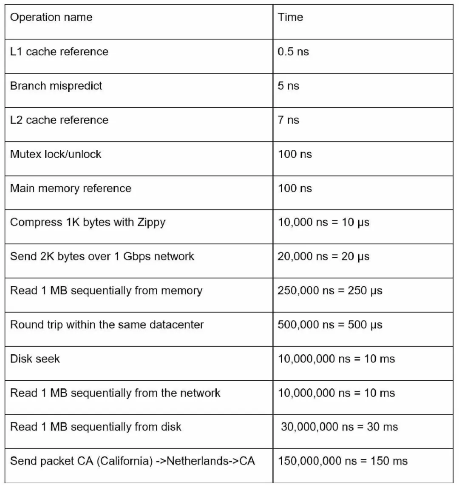
  - 一些数字积累
    - 某支付服务的支付峰值 60w QPS
    - Go GC 打开写屏障需要花费 10-30us
    - 内网中，一次网络请求的耗时是 ms 级别
    - 万兆网卡，1.25GB/s 打满
    - 4C8G 建 10w 到 20w 的连接没有问题
    - 因为机械硬盘的机械结构，随机 I/O 与顺序的 I/O 性能可能相差几百倍。固态硬盘则只有十几倍到几十倍之间
    - twitter 工程师认为，良好体验的网站平均响应时间应该在 500ms 左右，理想的时间是 200-300ms
    - 平均 QPS：日平均用户请求除以 4w。日平均用户请求，一般来自产品的评估。峰值 QPS：平均 QPS 的 2~4 倍
  - 本章最后有一个实战的例子：评估 twitter 的 QPS 和存储容量。
    - 先给出了一些预设：
      - 300 个 million 的月活跃用户
      - 50% 的用户每天都使用 twitter
      - 用户平均每天发表 2 条 tweets
      - 10% 的 tweets 包含多媒体
      - 多媒体数据保存 5 年
    - 下面是估算的过程：
      - 先预估 QPS：
        - DAU（每天的活跃用户数，Daily Active Users）为：300 million（总用户数） * 50% = 150 million
        - 发 tweets 的平均 QPS：150 million * 2 / 24 hour / 3600 second = ~3500
        - 高峰期 QPS 一般认为是平均 QPS 的 2 倍：2 * 3500 = 7000 QPS
      - 再来估算存储容量：
        - 假设多媒体的平均大小为 1MB，那么每天的存储容量为：150 million * 2 * 10% * 1MB = 30 TB。5 年的存储容量为 30 TB * 365 * 5 = 55 PB。
      - 最后这两个的估算过程是这样的：
        - 300 个 million * 10%* 1MB，1 MB 其实就是 6 个 0，相当于 million 要进化 2 次：million -> billion -> trillion，即从 M -> G -> T，于是结果等于 300 T * 10% = 30 T。
        - 30 TB * 365 * 5 = 30 TB * 1825 = 30 TB * 10^3 * 1.825，TB 进化一次变成 PB，于是等于 30 * 1.825 PB = 55 PB。
- [Go map[int64]int64 写入 redis 占用多少内存](https://mp.weixin.qq.com/s?__biz=MjM5MDUwNTQwMQ==&mid=2257487941&idx=1&sn=80cee0d0f88d73f57a25c496eef90393&scene=21#wechat_redirect)
  - 将内存中的一个超大的 map[int64]int64 写入到 redis，map 里的元素个数是千万级的。设计方案的时候，需要对 redis 的容量做一个估算。
  - 错误的示例
    - 如果不了解 redis 的话，可能你的答案是用元素个数直接乘以 16B（key 和 value 各占 8B）。我们假设元素个数是 5kw，那估算结果就是：5kw * 16B=50kk * 16B = 800MB
  - redis说起
    - Redis 中的一个 k-v 对用一个 entry 项表示，其中每个 entry 包含 key、value、next 三个指针，共 24 字节。由于 redis 使用 jemalloc 分配内存，因此一个 entry 需要申请 32 字节的内存。这里的 key, value 指针分别指向一个 RedisObject
       ```c++
       typedef struct redisObject {
           unsigned type:4;
           unsigned encoding:4;
           unsigned lru:LRU_BITS; 
           int refcount;
           void *ptr;
       } robj;
       ```
    - RedisObject 对应前面提到的各种数据类型，其中最简单的就是 redis 内部的字符串了。它有如下几种编码格式
      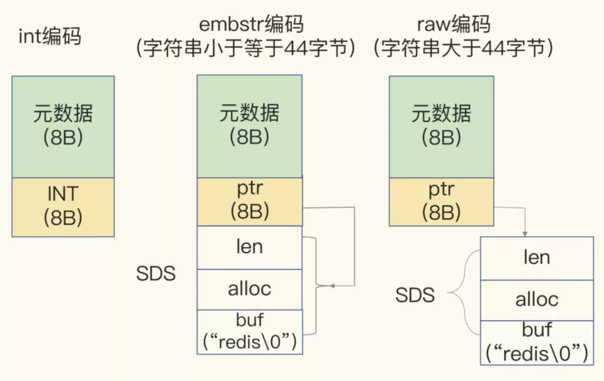
    - 当字符串是一个整型时，直接放在 ptr 位置，不用再分配新的内存了，非常高效
    - 我们要写入 redis 的 map 中的 key 和 value 都是整数，因此直接将值写入 ptr 处即可。
      于是 map 的一个 key 占用的内存大小为：32（entry）+16（key）+16（value）=64B。于是，5kw 个 key 占用的内存大小是 5kw*64B = 50 kk * 64B = 3200MB ≈ 3G
    - 假如我们在 key 前面加上了前缀，那就会生成 SDS，占用的内存会变大，访问效率也会变差。
- [高并发系统建设经验总结](https://mp.weixin.qq.com/s/TTn3YNwKKWn5IS8F6HJHIg)
  - 基础设施
    - 异地多活
  - Database
    - 读写分离; 大部分业务特点是读多写少，因此使用读写分离架构可以有效降低数据库的负载，提升系统容量和稳定性
      - 缺点也是同样明显的
        - 主从延迟
        - 从库的数量是有限的
        - 无法解决 TPS 高的问题
    - 分库分表; 当读写分离不能满足业务需要时，就需要考虑使用分库分表模式了。当确定要对数据库做优化时，应该优先考虑使用读写分离的模式，只有在读写分离的模式已经没办法承受业务的流量时，我们才考虑分库分表的模式
    - 由于是多 master 的架构，分库分表除了包含读写分离模式的所有优点外，还可以解决读写分离架构中无法解决的 TPS 过高的问题，同时分库分表理论上是可以无限横向扩展的，也解决了读写分离架构下从库数量有限的问题。
    - 缺点
      - 改造成本高
      - 事务问题
        - 在分库分表后应该要尽量避免这种跨 DB 实例的操作，如果一定要这么使用，优先考虑使用补偿等方式保证数据最终一致性，如果一定要强一致性，常用的方案是通过分布式事务的方式。
      - 无法支持多维度查询
        - 第一种是引入一张索引表，这张索引表是没有分库分表的，还是以按用户 ID 分库分表为例，索引表上记录各种维度与用户 ID 之间的映射关系，请求需要先通过其他维度查询索引表得到用户 ID，再通过用户 ID 查询分库分表后的表。
        - 通过引入NoSQL的方式，比较常见的组合是ES+MySQL，或者HBase+MySQL的组合等，这种方案本质上还是通过 NoSQL 来充当第一种方案中的索引表的角色
      - 数据迁移
        - 停机迁移
        - 双写，这主要是针对新增的增量数据，存量数据可以直接进行数据同步，关于如何进行双写迁移网上已经有很多分享了，这里也就不赘述，核心思想是同时写老库和新库
  - 架构
    - 缓存
      - [如何保证缓存与数据库的数据一致性](https://coolshell.cn/articles/17416.html)
        - Write through
          ```shell
          lock(运单ID) {
           //...
           
              // 删除缓存
             deleteCache();
              // 更新DB
             updateDB();
              // 重建缓存
             reloadCache()
          }
          ```
          防止并发问题，写请求都需要加分布式锁，锁的粒度是以运单 ID 为 key，在执行完业务逻辑后，先删除缓存，再更新 DB，最后再重建缓存，这些操作都是同步进行的，在读请求中先查询缓存，如果缓存命中则直接返回，如果缓存不命中则查询 DB，然后直接返回，也就是说在读请求中不会操作缓存，这种方式把缓存操作都收敛在写请求中，且写请求是加锁的，有效防止了读写并发导致的写入脏缓存数据的问题。
      - 缓存要避免大 key 和热 key 的问题
      - 读写性能
        - 写性能，影响写性能的主要因素是 key/value 的数据大小，比较简单的场景可以使用JSON的序列化方式存储，但是在高并发场景下使用 JSON 不能很好的满足性能要求，而且也比较占存储空间，比较常见的替代方案有protobuf、thrift等等
        - 读性能的主要影响因素是每次读取的数据包的大小。在实践中推荐使用redis pipeline+批量操作的方式
      - 适当冗余
        - 适当冗余的意思是说我们在设计对外的业务查询接口的时候，可以适当的做一些冗余。
        - 我们一开始设计对外查询接口的时候能做一些适当的冗余，区分不同的业务场景，虽然这样势必会造成有些接口的功能是类似的，但在加缓存的时候就能有的放矢，针对不同的业务场景设计不同的方案，比如关键的流程要注重数据一种的保证，而非关键场景则允许数据短暂的不一致来降低缓存实现的成本
    - 消息队列
      - 在高并发系统的架构中，消息队列（MQ）是必不可少的，当大流量来临时，我们通过消息队列的异步处理和削峰填谷的特性来增加系统的伸缩性，防止大流量打垮系统，此外，使用消息队列还能使系统间达到充分解耦的目的。
    - 服务治理
      - 超时
      - 熔断，限流
      - 降级
      - 注册 发现
      - 安全
      - 监控
  - 应用
    - 补偿
      - 定时任务模式
      - 消息队列模式
    - 幂等
    - 异步化
- [Websocket 百万长连接技术实践](https://mp.weixin.qq.com/s/MUourpb0IqqFo5XlxRLE0w)
  - GateWay
    - 网关拆分为网关功能部分和业务处理部分，网关功能部分为 WS-Gateway：集成用户鉴权、TLS 证书验证和 WebSocket 连接管理等；业务处理部分为 WS-API：组件服务直接与该服务进行 gRPC 通信。可针对具体的模块进行针对性扩容；服务重构加上 Nginx 移除，整体硬件消耗显著降低；服务整合到石墨监控体系
    
    - 网关 客户端连接流程：
      - 客户端与 WS-Gateway 服务通过握手流程建立 WebSocket 连接；
      - 连接建立成功后，WS-Gateway 服务将会话进行节点存储，将连接信息映射关系缓存到 Redis 中，并通过 Kafka 向 WS-API 推送客户端上线消息；
      - WS-API 通过 Kafka 接收客户端上线消息及客户端上行消息；
      - WS-API 服务预处理及组装消息，包括从 Redis 获取消息推送的必要数据，并进行完成消息推送的过滤逻辑，然后 Pub 消息到 Kafka；
      - WS-Gateway 通过 Sub Kafka 来获取服务端需要返回的消息，逐个推送消息至客户端。
  - TLS 内存消耗优化
    - Go TLS 握手过程中消耗的内存 [issue](https://github.com/golang/go/issues/43563)
    - 采用七层负载均衡，在七层负载上进行 TLS 证书挂载，将 TLS 握手过程移交给性能更好的工具完成
  - Socket ID 设计
    - K8S 场景中，采用注册下发的方式返回编号，WS-Gateway 所有副本启动后向数据库写入服务的启动信息，获取副本编号，以此作为参数作为 SnowFlake 算法的副本编号进行 Socket ID 生产，服务重启会继承之前已有的副本编号，有新版本下发时会根据自增 ID 下发新的副本编号
  - 心跳机制
    - 避免大量客户端同时进行心跳上报对 Redis 产生压力。
      - 客户端建立 WebSocket 连接成功后，服务端下发心跳上报参数；
      - 客户端依据以上参数进行心跳包传输，服务端收到心跳后会更新会话时间戳；
      - 客户端其他上行数据都会触发对应会话时间戳更新；
      - 服务端定时清理超时会话，执行主动关闭流程；
    - 实现心跳正常情况下的动态间隔，每 x 次正常心跳上报，心跳间隔增加 a，增加上限为 y
  - 消息接收与发送
    - 发现每个 WebSocket 连接都会占用 3 个 goroutine，每个 goroutine 都需要内存栈，单机承载连十分有限，主要受制于大量的内存占用，而且大部分时间 c.writer() 是闲置状态，于是考虑，是否只启用 2 个 goroutine 来完成交互
    - 保留 c.reader() 的 goroutine，如果使用轮询方式从缓冲区读取数据，可能会产生读取延迟或者锁的问题，c.writer() 操作调整为主动调用，不采用启动 goroutine 持续监听，降低内存消耗
    - 调研了 gev 和 gnet 等基于事件驱动的轻量级高性能网络库，实测发现在大量连接场景下可能产生的消息延迟的问题，所以没有在生产环境下使用
  - 核心对象缓存
    - 网关部分的核心对象为 Connection 对象，围绕 Connection 进行了 run、read、write、close 等函数的开发
    - 使用 sync.pool 来缓存该对象，减轻 GC 压力，创建连接时，通过对象资源池获取 Connection 对象，生命周期结束之后，重置 Connection 对象后 Put 回资源池
      ```go
      var ConnectionPool = sync.Pool{
         New: func() interface{} {
            return &Connection{}
         },
      }
      
      func GetConn() *Connection {
         cli := ConnectionPool.Get().(*Connection)
         return cli
      }
      
      func PutConn(cli *Connection) {
         cli.Reset()
         ConnectionPool.Put(cli) // 放回连接池
      }
      ```
  - 数据传输过程优化
    - 消息流转过程中，需要考虑消息体的传输效率优化，采用 MessagePack 对消息体进行序列化，压缩消息体大小
- [动手实现一个localcache](https://mp.weixin.qq.com/s/ZtSA3J8HK4QarhrJwBQtXw)
  - 数据结构 - HashTable
  - 并发安全 
    - 在读操作远多于写操作的时候，使用sync.map的性能是远高于map+sync.RWMutex的组合的
    - 我们本地缓存不仅支持进行数据存储的时候要使用锁，进行过期清除等操作时也需要加锁，所以使用map+sync.RWMutex的方式更灵活
  - 高性能并发访问
    - 我们可以使用djb2哈希算法把key打散进行分桶，然后在对每一个桶进行加锁，也就是锁细化，减少竞争
  - 淘汰策略
    - LFU
      - 根据数据的历史访问频率来淘汰数据，这种算法核心思想认为最近使用频率低的数据,很大概率不会再使用，把使用频率最小的数据置换出去
      - 问题：某些数据在短时间内被高频访问，在之后的很长一段时间不再被访问，因为之前的访问频率急剧增加，那么在之后不会在短时间内被淘汰，占据着队列前头的位置，会导致更频繁使用的块更容易被清除掉，刚进入的缓存新数据也可能会很快的被删除
    - LRU
      - 根据数据的历史访问记录来淘汰数据，这种算法核心思想认为最近使用的数据很大概率会再次使用，最近一段时间没有使用的数据，很大概率不会再次使用，把最长时间未被访问的数据置换出去
      - 问题：当某个客户端访问了大量的历史数据时，可能会使缓存中的数据被历史数据替换，降低缓存命中率
    - FIFO
      - 这种算法的核心思想是最近刚访问的，将来访问的可能性比较大，先进入缓存的数据最先被淘汰掉。
      - 问题：这种算法采用绝对公平的方式进行数据置换，很容易发生缺页中断问题
    - Two Queue
      - 是FIFO + LRU的结合，其核心思想是当数据第一次访问时，将数据缓存在FIFO队列中，当数据第二次被访问时将数据从FIFO队列移到LRU队列里面，这两个队列按照自己的方法淘汰数据。
      - 问题：这种算法和LRU-2一致，适应性差，存在LRU中的数据需要大量的访问才会将历史记录清除掉
    - ARU
      - 即自适应缓存替换算法，是LFU和LRU算法的结合使用，其核心思想是根据被淘汰数据的访问情况，而增加对应 LRU 还是 LFU链表的大小，ARU主要包含了四个链表，LRU 和 LRU Ghost ，LFU 和LFU Ghost， Ghost 链表为对应淘汰的数据记录链表，不记录数据，只记录 ID 等信息
      - 当数据被访问时加入LRU队列，如果该数据再次被访问，则同时被放到 LFU 链表中；如果该数据在LRU队列中淘汰了，那么该数据进入LRU Ghost队列，如果之后该数据在之后被再次访问了，就增加LRU队列的大小，同时缩减LFU队列的大小。
      - 问题：因为要维护四个队列，会占用更多的内存空间
  - 过期清除
    - 除了使用缓存淘汰策略清除数据外，还可以添加一个过期时间做双重保证，避免不经常访问的数据一直占用内存。可以有两种做法：
      - 数据过期了直接删除   
      - 数据过期了不删除，异步更新数据
  - 缓存监控
    - 可以使用Prometheus进行监控上报，我们自测可以简单写一个小组件，定时打印缓存数、缓存命中率等指标
  - GC调优
  - 缓存穿透
    - 使用缓存就要考虑缓存穿透的问题，不过这个一般不在本地缓存中实现，基本交给使用者来实现，当在缓存中找不到元素时,它设置对缓存键的锁定;这样其他线程将等待此元素被填充,而不是命中数据库（外部使用singleflight封装一下）
- [缓存淘汰算法](https://zhuanlan.zhihu.com/p/352910565)
  - LFU
    - 最近使用频率高的数据很大概率将会再次被使用,而最近使用频率低的数据,很大概率不会再使用
    - 把使用频率最小的数据置换出去。这种算法是完全从使用频率的角度去考虑的
    - Issue: 某些数据短时间内被重复引用，并且在很长一段时间内不再被访问。由于它的访问频率计数急剧增加，即使它在相当长的一段时间内不会被再次使用，也不会在短时间内被淘汰。这使得其他可能更频繁使用的块更容易被清除，此外，刚进入缓存的新项可能很快就会再次被删除，因为它们的计数器较低，即使之后可能会频繁使用。
    - 参见Redis处理，加入冷却时间以及指数增长
  - LRU
    - 最近使用的数据很大概率将会再次被使用。而最近一段时间都没有使用的数据，很大概率不会再使用。把最长时间未被访问的数据置换出去。这种算法是完全从最近使用的时间角度去考虑的
    - Issue： 如果某个客户端访问大量历史数据时，可能使缓存中的数据被这些历史数据替换，其他客户端访问数据的命中率大大降低。
    - an access pattern with Long tail distribution. Here, the y-axis represents the normalized access frequency of the items in cache and the x-axis represents the items ordered from highest frequency to lowest.
    - In this case, lots of newly added “yellow” items with low access frequency could push out rare but valuable “green” items responsible for the vast majority of hits. As a result, the LRU policy may sweep its contents together with valuable “green” entities due to traffic fluctuations.
  - ARC 自适应缓存替换算法,它结合了LRU与LFU,来获得可用缓存的最佳使用。
    - 当时访问的数据趋向于访问最近的内容，会更多地命中LRU list，这样会增大LRU的空间； 当系统趋向于访问最频繁的内容，会更多地命中LFU list，这样会增加LFU的空间.
    - 执行过程
      - 整个Cache分成两部分，起始LRU和LFU各占一半，后续会动态适应调整partion的位置（记为p）除此，LRU和LFU各自有一个ghost list(因此，一共4个list)
      - 在缓存中查找客户端需要访问的数据， 如果没有命中，表示缓存穿透，将需要访问的数据 从磁盘中取出，放到LRU链表的头部。
      - 如果命中，且LFU链表中没有，则将数据放入LFU链表的头部，所有LRU链表中的数据都必须至少被访问两次才会进入LFU链表。
      - 如果命中，且LFU链表中存在，则将数据重新放到LFU链表的头部。这么做，那些真正被频繁访问的页面将永远呆在缓存中，不经常访问的页面会向链表尾部移动，最终被淘汰出去。
      - 如果此时缓存满了，则从LRU链表中淘汰链表尾部的数据，将数据的key放入LRU链表对应的ghost list。然后再在链表头部加入新数据。如果ghost list中的元素满了，先按照先进先出的方式来淘汰ghost list中的一个元素，然后再加入新的元素
      - 如果没有命中的数据key处于ghost list中，则表示是一次幽灵（phantom）命中，系统知道，这是一个刚刚淘汰的页面，而不是第一次读取或者说很久之前读取的一个页面。ARC用这个信息来调整它自己，以适应当前的I/O模式（workload）。 这个迹象说明我们的LRU缓存太小了。在这种情况下，LRU链表的长度将会被增加1，并将命中的数据key从ghost list中移除，放入LRU链表的头部。显然，LFU链表的长度将会被减少1。
        同样，如果一次命中发生在LFU ghost 链表中，它会将LRU链表的长度减一，以此在LFU 链表中加一个可用空间。
      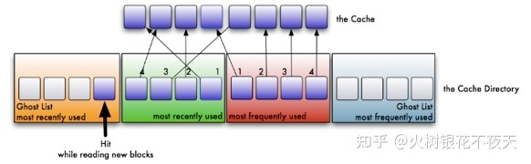
      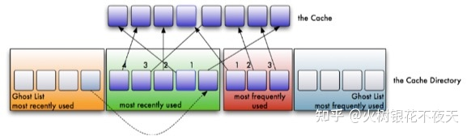
  - [2Q](https://arpitbhayani.me/blogs/2q-cache)
    - 有两个缓存队列，一个是FIFO队列，一个是LRU队列。当数据第一次访问时，2Q算法将数据缓存在FIFO队列里面，当数据第二次被访问时，则将数据从FIFO队列移到LRU队列里面，两个队列各自按照自己的方法淘汰数据
    - 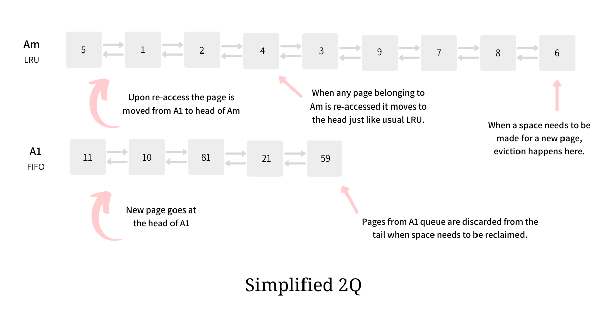
    - 执行过程
      - 新访问的数据插入到FIFO队列；
      - 如果数据在FIFO队列中一直没有被再次访问，则最终按照FIFO规则淘汰；
      - 如果数据在FIFO队列中被再次访问，则将数据移到LRU队列头部；
      - 如果数据在LRU队列再次被访问，则将数据移到LRU队列头部；
      - LRU队列淘汰末尾的数据。
    - 2Q Full Version
      - 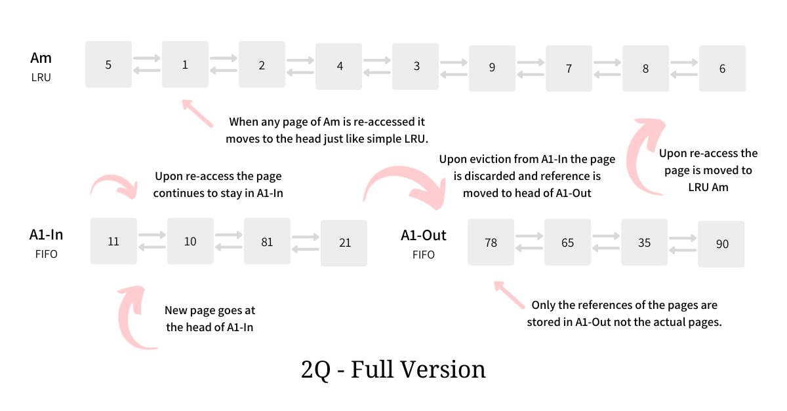
- [动手实现一个localcache - 欣赏优秀的开源设计](https://mp.weixin.qq.com/s/KfxfRqTrFvt9K5dEVU94yw)
  - 高效的并发访问
    - 本地缓存的简单实现可以使用map[string]interface{} + sync.RWMutex的组合，使用sync.RWMutex对读进行了优化
    - 当并发量上来以后，还是变成了串行读，等待锁的goroutine就会block住。为了解决这个问题我们可以进行分桶，每个桶使用一把锁，减少竞争。分桶也可以理解为分片，每一个缓存对象都根据他的key做hash(key)，然后在进行分片：hash(key)%N，N就是要分片的数量
      - 分片的实现主要考虑两个点：
        - hash算法的选择，哈希算法的选择要具有如下几个特点：
          - 哈希结果离散率高，也就是随机性高
          - 避免产生多余的内存分配，避免垃圾回收造成的压力
          - 哈希算法运算效率高
        - 分片的数量选择，分片并不是越多越好，根据经验，我们的分片数可以选择N的2次幂，分片时为了提高效率还可以使用位运算代替取余。
    - 开源实现
      - 开源的本地缓存库中 bigcache、go-cache、freecache都实现了分片功能
        - bigcache的hash选择的是fnv64a算法、
        - go-cache的hash选择的是djb2算法、
        - freechache选择的是xxhash算法。
        - 通过对比结果我们可以观察出来Fnv64a算法的运行效率还是很高
  - 减少GC
    - [bigcache](https://pengrl.com/p/35302/)做到避免高额GC的设计是基于Go语言垃圾回收时对map的特殊处理
      - 如果map对象中的key和value不包含指针，那么垃圾回收器就会无视他，针对这个点们的key、value都不使用指针，就可以避免gc。bigcache使用哈希值作为key，然后把缓存数据序列化后放到一个预先分配好的字节数组中，使用offset作为value，
    - freecache中的做法是自己实现了一个ringbuffer结构，通过减少指针的数量以零GC开销实现map
      - key、value都保存在ringbuffer中，使用索引查找对象。freecache与传统的哈希表实现不一样，实现上有一个slot的概念
- [优先级队列](https://mp.weixin.qq.com/s/eXJcjPnXiy733k79Y1vbBg)
  - 三个重要的角色，分别是优先级队列、工作单元Job、消费者worker (队列-消费者模式)
    - 队列
      ```go
      type JobQueue struct {
        mu sync.Mutex //队列的操作需要并发安全
        jobList *list.List //List是golang库的双向队列实现，每个元素都是一个job
        noticeChan chan struct{} //入队一个job就往该channel中放入一个消息，以供消费者消费
      }
      func (queue *JobQueue) PushJob(job Job) {
        queue.jobList.PushBack(job) //将job加到队尾
        queue.noticeChan <- struct{}{}
      }
      func (queue *JobQueue) PopJob() Job {
        queue.mu.Lock()
        defer queue.mu.Unlock()
      
        if queue.jobList.Len() == 0 {
        return nil
        }
      
        elements := queue.jobList.Front() //获取队列的第一个元素
        return queue.jobList.Remove(elements).(Job) //将元素从队列中移除并返回
      }
      
      func (queue *JobQueue) WaitJob() <-chan struct{} {
        return queue.noticeChan
      }
      ```
    - 工作单元Job
      ```go
      type BaseJob struct {
        Err error
        DoneChan chan struct{} //当作业完成时，或者作业被取消时，通知调用者
        Ctx context.Context
        cancelFunc context.CancelFunc
      }
      ```
      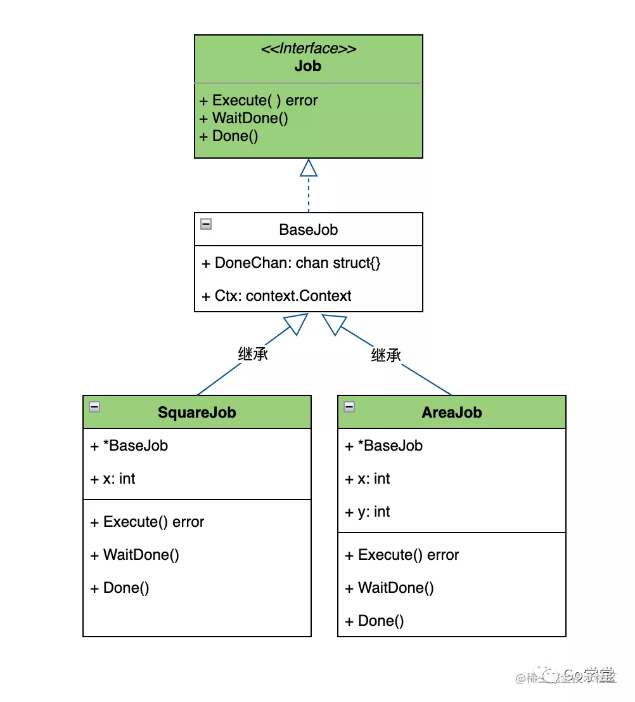
    - 
  - 消费者Worker
    ```go
    type WorkerManager struct {
        queue *JobQueue
        closeChan chan struct{}
    }
    func (m *WorkerManager) StartWork() error {
        fmt.Println("Start to Work")
        for {
            select {
            case <-m.closeChan:
              return nil
    
            case <-m.queue.noticeChan:
              job := m.queue.PopJob()
              m.ConsumeJob(job)
            }
        }
    
        return nil
    }
    
    func (m *WorkerManager) ConsumeJob(job Job) {
      defer func() {
          job.Done()
      }()
    
      job.Execute()
    }
    ```
- [HTTP Server](https://pace.dev/blog/2018/05/09/how-I-write-http-services-after-eight-years.html)
  - Return the handler
    ```go
    func (s *server) handleSomething() http.HandlerFunc {
        thing := prepareThing()
        return func(w http.ResponseWriter, r *http.Request) {
            // use thing        
        }
    }
    ```
  - HandlerFunc over Handler
    ```go
    func (s *server) handleSomething() http.HandlerFunc {
        return func(w http.ResponseWriter, r *http.Request) {
            ...
        }
    }
    ```
- [高并发下如何设计秒杀系统](https://mp.weixin.qq.com/s/Qoo5yPa5Mmzgb3_kIoTXbw)
  - 瞬时高并发
    - 页面静态化
    - CDN加速
    - 缓存
    - mq异步处理
    - 限流
    - 分布式锁
- [图解淘宝10年后台架构演进](https://mp.weixin.qq.com/s/liMJO48daWzkzh37vxMbPg)
  - 引入本地缓存和分布式缓存
  - 引入反向代理实现负载均衡
  - 数据库读写分离
  - 数据库按业务分库
  - 把大表拆分为小表
  - 使用LVS或F5来使多个Nginx负载均衡
    - 由于瓶颈在Nginx，因此无法通过两层的Nginx来实现多个Nginx的负载均衡。图中的LVS和F5是工作在网络第四层的负载均衡解决方案，其中LVS是软件，运行在操作系统内核态，可对TCP请求或更高层级的网络协议进行转发，因此支持的协议更丰富，并且性能也远高于Nginx，可假设单机的LVS可支持几十万个并发的请求转发；F5是一种负载均衡硬件，与LVS提供的能力类似，性能比LVS更高，但价格昂贵。
    - 由于LVS是单机版的软件，若LVS所在服务器宕机则会导致整个后端系统都无法访问，因此需要有备用节点。可使用keepalived软件模拟出虚拟IP，然后把虚拟IP绑定到多台LVS服务器上，浏览器访问虚拟IP时，会被路由器重定向到真实的LVS服务器，当主LVS服务器宕机时，keepalived软件会自动更新路由器中的路由表，把虚拟IP重定向到另外一台正常的LVS服务器，从而达到LVS服务器高可用的效果。
  - 通过DNS轮询实现机房间的负载均衡
  - 引入NoSQL数据库和搜索引擎等技术
  - 大应用拆分为小应用
  - 复用的功能抽离成微服务
  - 引入企业服务总线ESB屏蔽服务接口的访问差异
  - 引入容器化技术实现运行环境隔离与动态服务管理
  - 以云平台承载系统
- [用 MQ 解耦其实是骗你的](https://xargin.com/mq-is-not-savior/)
  - MQ解耦的故事
    - 核心系统依赖下游系统是因为调用关系，下游系统依赖核心系统是因为下游系统要使用核心系统的数据
    - 我们使用 MQ 只是解开了单个方向上的依赖，核心系统没有对下游系统的调用了。
    - 隐式依赖导致事故
  - 解决方法?
    - 接受有些复杂场景下，上下游就是要有耦合的事实
    - 使用 schema registry 之类的方案，让上下游使用一份 domain event 的 schema，也可以用 pb 之类的文件来描述，让队列里的消息也能类似 API 定义一样，有“软件契约”
    - 增加专门的 data validation 服务，类似 Google 在应对机器学习数据问题时的一个方案：https://blog.acolyer.org/2019/06/05/data-validation-for-machine-learning/
    - 如果公司内有 mono repo，那么在有 mono repo + schema 描述的前提下，适当开发一些静态分析工具，来阻止上游程序员犯错
    - 耦合实在解除不了的情况下，让下游的计算和查询模块做好分离，重点保障查询模块的稳定性，不要拖累主流程
- [高可用的 11 个关键技巧](https://mp.weixin.qq.com/s/frHzdZRZaab8u8kSkB954Q)
  - 大型互联网架构设计，讲究一个四件套组合拳玩法，高并发、高性能、高可用、高扩展
  - 高可用都有哪些设计技巧
    - 系统拆分
      - 一个复杂的业务域按DDD的思想拆分成若干子系统，每个子系统负责专属的业务功能，做好垂直化建设，各个子系统之间做好边界隔离，降低风险蔓延
    - 解耦
      - 高内聚、低耦合 - 小到接口抽象、MVC 分层，大到 SOLID 原则、23种设计模式。核心都是降低不同模块间的耦合度，避免一处错误改动影响到整个系统
      - AOP - 核心就是采用动态代理技术，通过对字节码进行增强，在方法调用的时候进行拦截，以便于在方法调用前后，增加我们需要的额外处理逻辑
      - 事件机制，通过发布订阅模式，新增的需求，只需要订阅对应的事件通知，针对性消费即可
    - 异步
      - 线程池（ThreadPoolExecutor）, 消息队列
    - 重试
      - 重试主要是体现在远程的RPC调用，受 网络抖动、线程资源阻塞 等因素影响，请求无法及时响应。
      - 重试通常跟幂等组合使用，如果一个接口支持了 幂等，那你就可以随便重试
      - 幂等 的解决方案
        - 插入前先执行查询操作，看是否存在，再决定是否插入
        - 增加唯一索引
        - 建防重表
        - 引入状态机，比如付款后，订单状态调整为已付款，SQL 更新记录前 增加条件判断
        - 增加分布式锁
        - 采用 Token 机制，服务端增加 token 校验，只有第一次请求是合法的
    - 补偿
      - 我们知道不是所有的请求都能收到成功响应。除了上面的 重试 机制外，我们还可以采用补偿玩法，实现数据最终一致性
      - 补偿操作有个重要前提，业务能接受短时间内的数据不一致。
      - 补偿有很多的实现方式：
        - 本地建表方式，存储相关数据，然后通过定时任务扫描提取，并借助反射机制触发执行
        - 也可以采用简单的消息中间件，构建业务消息体，由下游的的消费任务执行。如果失败，可以借助MQ的重试机制，多次重试
    - 备份
    - 多活策略
      - 同城双活、两地三中心、三地五中心、异地双活、异地多活
    - 隔离
    - 限流
      - 计数器限流
      - 滑动窗口限流
      - 漏桶限流
      - 令牌桶限流
    - 熔断
    - 降级
      - 降级是通过暂时关闭某些非核心服务或者组件从而保护核心系统的可用性
- [高并发设计，都有哪些技术方案](https://mp.weixin.qq.com/s/89o-GHFNyIKrrIjkQMquFA)
  - 负载均衡
    - 它的职责是将网络请求 “均摊”到不同的机器上。避免集群中部分服务器压力过大，而另一些服务器比较空闲的情况
    - 随机算法
    - 轮询算法
    - 轮询权重算法
    - 一致性哈希算法
    - 最小连接
    - 自适应算法
    - 常用负载均衡工具：
      - LVS
      - Nginx
      - HAProxy
    - 对于一些大型系统，一般会采用 DNS+四层负载+七层负载的方式进行多层次负载均衡。
  - 分布式微服务
    - 采用分而治之的思想，通过SOA架构，将一个大的系统拆分成若干个微服务，粒度越来越小，称之为微服务架构
  - 缓存机制
    - 性能不够，缓存来凑
    - 缓存更新常用策略
      - Cache aside，通常会先更新数据库，然后再删除缓存，为了兜底还会设置缓存时间。
      - Read/Write through， 一般是由一个 Cache Provider 对外提供读写操作，应用程序不用感知操作的是缓存还是数据库。
      - Write behind，延迟写入，Cache Provider 每隔一段时间会批量写入数据库，大大提升写的效率。像操作系统的page cache也是类似机制。
  - 分布式关系型数据库
    - 分表又可以细分为 垂直分表 和 水平分表 两种形式
      - 垂直分表
        - 表由“宽”变“窄”，简单来讲，就是将大表拆成多张小表
        - 冷热分离，把常用的列放在一个表，不常用的放在一个表。
        - 字段更新、查询频次拆分
        - 大字段列独立存放
        - 关系紧密的列放在一起
      - 水平分表
      - 数据量大，就分表；并发高，就分库
  - 分布式消息队列
    - 异步处理。将一个请求链路中的非核心流程，拆分出来，异步处理，减少主流程链路的处理逻辑，缩短RT，提升吞吐量。如：注册新用户发短信通知。
    - 削峰填谷。避免流量暴涨，打垮下游系统，前面会加个消息队列，平滑流量冲击。比如：秒杀活动。生活中像电源适配器也是这个原理。
    - 应用解耦。两个应用，通过消息系统间接建立关系，避免一个系统宕机后对另一个系统的影响，提升系统的可用性。如：下单异步扣减库存
    - 消息通讯。内置了高效的通信机制，可用于消息通讯。如：点对点消息队列、聊天室。
  - CDN 全称 （Content Delivery Network），内容分发网络
    - CDN = 镜像（Mirror）+缓存（Cache）+整体负载均衡（GSLB）
    - 本地Cache加速
    - 镜像服务
    - 远程加速
    - 带宽优化
    - 集群抗攻击
- [超大规模分布式存储系统架构设计](https://mp.weixin.qq.com/s/IJhXKZSa5SBiBgXg0dJkHg)
- [超大规模分布式存储系统架构设计——浅谈B站对象存储](https://mp.weixin.qq.com/s/0FL8WbsBSg9hsqUil3C6KA)
- [超大规模分布式存储系统架构设计——浅谈B站对象存储(BOSS)实现（下）](https://mp.weixin.qq.com/s/0FL8WbsBSg9hsqUil3C6KA)
- [如何调用一个只支持batch_call的服务](https://mp.weixin.qq.com/s/S80RmHp87gvWfFZ226hp0A)
  - 为了充分利用GPU并行计算的能力，不少算法服务会希望上游通过加大batch的同时减少并发的方式进行接口调用
    - 对于上下游性能差距明显的服务，建议配合mq采用异步调用的方式将服务串联起来。
    - 如果非得使用同步调用的方式进行调用，建议模仿Nagle算法的形式，攒一批数据再发起请求，这样既可以增大batch，同时减少并发
      ```go
        size := 100
          // 这个数组用于收集视频里的图片，每个 IVideoInfo 下都有N张图片
          videoInfos := make([]IVideoInfo, 0, size)
          tick := time.NewTicker(200 * time.Microsecond)
          defer tick.Stop()
          for {
              select {
              case <-tick.C:
                  if len(videoInfos) > 0 {
                      // 200ms超时，去请求下游
                      limitStartFunc(videoInfos, true)
                      // 请求结束后把之前收集的数据清空，重新开始收集。
                      videoInfos = make([]IVideoInfo, 0, size)
                  }
              // AddChan就是所谓的全局队列
              case videoInfo, ok := <-AddChan:
                  if !ok {
                      // 通道关闭时，如果还有数据没有去发起请求，就请求一波下游服务
                      limitStartFunc(videoInfos, false)
                      videoInfos = make([]IVideoInfo, 0, size)
                      return nil
                  } else {
                      videoInfos = append(videoInfos, videoInfo)
                      if videoInfos 内的图片满足xx数量 {
                          limitStartFunc(videoInfos, false)
                          videoInfos = make([]IVideoInfo, 0, size)
                          // 重置定时器
                          tick.Reset(200 * time.Microsecond)
                      }
                  }
              }
          }
      ```
- [无锁队列](https://mp.weixin.qq.com/s/rQzi0FvavoKHCRVBy1JknQ)
  - 无锁队列用在什么样的场景
    - 当需要处理的数据非常多，比如行情数据，一秒处理非常多的数据的时候，可以考虑用无锁队列。
    - 如果一秒只需要处理几百或者几千的数据，是没有必要考虑用无锁队列的。用互斥锁就能解决问题，数据量相对少的时候互斥锁与无锁队列之间差别并不是很明显。
  - 为什么要用无锁队列 - 有锁队列会有哪些问题
    - Cache 的损坏，在线程间频繁切换的时候会导致 Cache 中数据的丢
    - 在同步机制上争抢队列
    - 多线程动态内存分配性能下降
  - 无锁队列的实现
    - 一读一写的无锁队列
    - 多读多写的无锁队列实现
      - 队列已满判断：`(m_writeIndex+1) % Q_SIZE == m_readIndex`
      - 队列为空判断： `m_readIndex == m_maximumReadIndex`
- [时间轮算法](https://spongecaptain.cool/post/widget/timingwheel2/)
  - 利用优先队列+轮询线程的方式，能够实现一个定时任务框架。
    - 但时间复杂度并不优秀，优先队列通常基于 heap 实现，任务的入队以及出队的时间复杂度为 O(logN)
  - 简单的时间轮算法有如下 2 个主要缺陷
    - 三级的时间轮要如何实现。这里引入两个概念：tick 代表内层时间轮每一格的时间大小，这里设置为 1s。每层时间轮拥有的格子数定义为 wheelsize，这里设置为 60s。
      - 最内层时间轮，每隔 tick 走一格
      - 第二层时间轮，每隔 tick * wheelsize 走一格
      - 第三层时间轮，每隔 tick * wheelsize * wheelsize 走一格
      - 你该如何控制每一层的时间轮的指针按时进行移动呢？
    - 存在空轮询
  - [开源的时间轮实现](https://www.luozhiyun.com/archives/444)
    - 时间轮代码是仿照Kafka写的，所以在具体实现时间轮 TimingWheel 时还有一些小细节：
      - 时间轮的时间格中每个链表会有一个root节点用于简化边界条件。它是一个附加的链表节点，该节点作为第一个节点，它的值域中并不存储任何东西，只是为了操作的方便而引入的；
      - 除了第一层时间轮，其余高层时间轮的起始时间（startMs）都设置为创建此层时间轮时前面第一轮的 currentTime。每一层的 currentTime 都必须是 tickMs 的整数倍，如果不满足则会将 currentTime 修剪为 tickMs 的整数倍。修剪方法为：currentTime = startMs – (startMs % tickMs)；
      - Kafka 中的定时器只需持有 TimingWheel 的第一层时间轮的引用，并不会直接持有其他高层的时间轮，但每一层时间轮都会有一个引用（overflowWheel）指向更高一层的应用；
      - Kafka 中的定时器使用了 DelayQueue 来协助推进时间轮。在操作中会将每个使用到的时间格中每个链表都加入 DelayQueue，DelayQueue 会根据时间轮对应的过期时间 expiration 来排序，最短 expiration 的任务会被排在 DelayQueue 的队头，通过单独线程来获取 DelayQueue 中到期的任务；
    - 优先队列可以避免空轮询以及复杂状态的维护
    - 既然使用了优先队列，为什么还需要使用时间轮？时间轮的意义是什么？
      - 直接使用优先队列就能够实现定时任务，但是时间复杂度为 O(logN)，使用时间轮主要能够基于 bucket 对同一过期时间的任务进行汇聚，这样能够降低时间复杂度。
      - 假设 N 个任务最终被注册到 K 个 bucket 中（也就是有 k 个时间刻度有任务），优先队列上的时间复杂度为 O(logK)，而时间轮上的时间复杂度为 O(1)，因此最终时间复杂度为 O(logK*1) = O(logK)。
    - 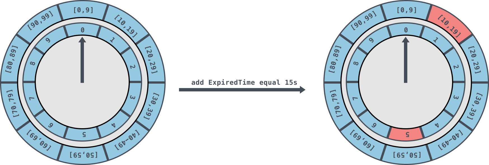
  - [Hashed and Hierarchical Timing Wheels: Data Structures for the Efficient Implementation of a Timer Facility](https://blog.acolyer.org/2015/11/23/hashed-and-hierarchical-timing-wheels/)
- [后台服务架构高性能设计](https://mp.weixin.qq.com/s/y1X51Kxeap9ZWQo47OjSSg)
  - 无锁化
    - 串行无锁
      - 如 redis/Nginx 都采用了这种方式。在网络编程模型中，常规的方式是主线程负责处理 I/O 事件，并将读到的数据压入队列，工作线程则从队列中取出数据进行处理，这种半同步/半异步模型需要对队列进行加锁
      - 可以改成无锁串行的形式，当 MainReactor accept 一个新连接之后从众多的 SubReactor 选取一个进行注册，通过创建一个 Channel 与 I/O 线程进行绑定，此后该连接的读写都在同一个线程执行，无需进行同步
    - 结构无锁
      - 利用硬件支持的原子操作可以实现无锁的数据结构，很多语言都提供 CAS 原子操作 atomic 可以用于实现无锁队列
        ```cgo
        class LockFreeList
        {
            atomic<Node<T> *> head;
        public:
            void pushFront(const T &value)
            {
                auto *node = new Node<T>(value);
                node->next = head.load();
                while(!head.compare_exchange_weak(node->next, node)); //②
            }
        };
        ```
  - 零拷贝
    - 这里的拷贝指的是数据在内核缓冲区和应用程序缓冲区直接的传输，并非指进程空间中的内存拷贝（当然这方面也可以实现零拷贝，如传引用和 C++中 move 操作）
    - 内存映射
      - 内存映射将用户空间的一段内存区域映射到内核空间，用户对这段内存区域的修改可以直接反映到内核空间，同样，内核空间对这段区域的修改也直接反映用户空间，简单来说就是用户空间共享这个内核缓冲区。mmap
      - 采用内存映射后数据拷贝减少为 3 次，不再经过应用程序直接将内核缓冲区中的数据拷贝到 Socket 缓冲区中
    - 零拷贝
      - 零拷贝就是一种避免 CPU 将数据从一块存储拷贝到另外一块存储，从而有效地提高数据传输效率的技术。Linux 内核 2.4 以后，支持带有 DMA 收集拷贝功能的传输，将内核页缓存中的数据直接打包发到网络上 sendfile
      - 1）DMA 将数据拷贝到 DMA 引擎的内核缓冲区中；2）将数据的位置和长度的信息的描述符加到套接字缓冲区；3）DMA 引擎直接将数据从内核缓冲区传递到协议引擎；
      - 零拷贝并非真正的没有拷贝，还是有 2 次内核缓冲区的 DMA 拷贝，只是消除了内核缓冲区和用户缓冲区之间的 CPU 拷贝。Linux 中主要的零拷贝函数有 sendfile、splice、tee 等
  - 池子化
    - 常用的池化技术有内存池、线程池、连接池、对象池
    - 三种 malloc 的比较，tcmalloc 和 jemalloc 性能差不多，ptmalloc 的性能不如两者
  - 并发化
    - 请求并发
    - 冗余请求 - hedge request 冗余请求指的是同时向后端服务发送多个同样的请求，谁响应快就是使用谁，其他的则丢弃。
  - 异步化
    - 调用异步化
      - Callback：异步回调通过注册一个回调函数，然后发起异步任务，当任务执行完毕时会回调用户注册的回调函数，从而减少调用端等待时间
      - Future：当用户提交一个任务时会立刻先返回一个 Future，然后任务异步执行，后续可以通过 Future 获取执行结果
      - CPS: Continuation-passing style）可以对多个异步编程进行编排，组成更复杂的异步处理，并以同步的代码调用形式实现异步效果。
    - 流程异步化
  - 缓存
    - 缓存的模式
      - Cache-Aside：旁路缓存，这应该是最常见的缓存模式了。对于读，首先从缓存读取数据，如果没有命中则回源 SoR 读取并更新缓存。对于写操作，先写 SoR，再写缓存。这种模式架构图如下：
      - Cache-As-SoR：缓存即数据源，该模式把 Cache 当作 SoR，所以读写操作都是针对 Cache，然后 Cache 再将读写操作委托给 SoR，即 Cache 是一个代理。
    - 缓存的崩溃与修复
      - 缓存穿透：大量使用不存在的 key 进行查询时，缓存没有命中，这些请求都穿透到后端的存储，最终导致后端存储压力过大甚至被压垮。
      - 缓存雪崩：指大量的缓存在某一段时间内集体失效，导致后端存储负载瞬间升高甚至被压垮。
      - 缓存热点：虽然缓存系统本身性能很高，但也架不住某些热点数据的高并发访问从而造成缓存服务本身过载
    - 缓存的一些好实践
      - 动静分离：对于一个缓存对象，可能分为很多种属性，这些属性中有的是静态的，有的是动态的
      - 慎用大对象：如果缓存对象过大，每次读写开销非常大并且可能会卡住其他请求，特别是在 redis 这种单线程的架构中。
      - 过期设置：尽量设置过期时间减少脏数据和存储占用，但要注意过期时间不能集中在某个时间段
  - 分片
    - 分片策略
      - 区间分片
      - 随机分片
      - 组合分片
    - 二级索引
  - 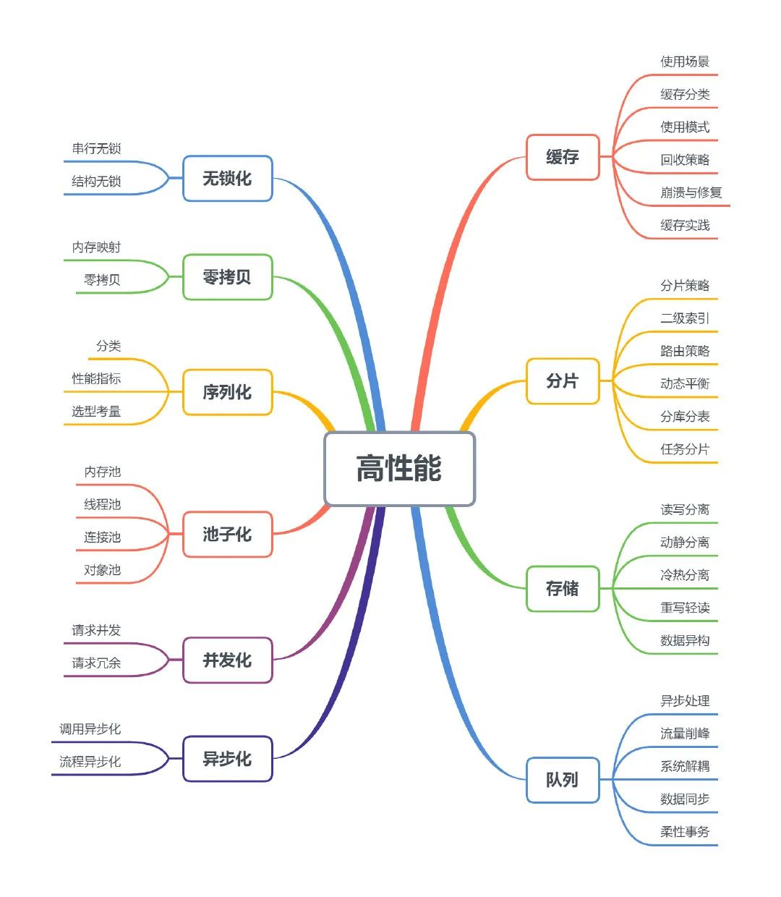
- [抢火车票难题](https://mp.weixin.qq.com/s/qtTD0QSENYrUUTDcyBNz1Q)
  - 如何在 100 万人同时抢 1 万张火车票时，系统提供正常、稳定的服务。
  - 大型高并发系统架构
    - 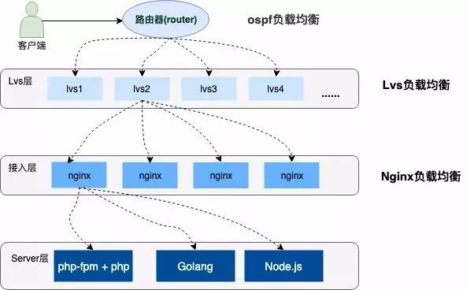
    - OSPF（开放式最短链路优先）是一个内部网关协议（Interior Gateway Protocol，简称 IGP）OSPF 通过路由器之间通告网络接口的状态来建立链路状态数据库，生成最短路径树，OSPF 会自动计算路由接口上的 Cost 值，但也可以通过手工指定该接口的 Cost 值，手工指定的优先于自动计算的值。
    - LVS （Linux Virtual Server）它是一种集群（Cluster）技术，采用 IP 负载均衡技术和基于内容请求分发技术
    - Nginx 加权轮询 
  - 秒杀抢购系统选型
    - 扣库存的艺术
      - 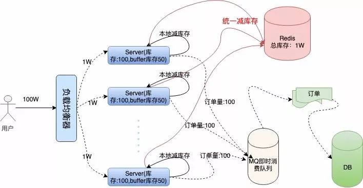
      - 在本地减库存以后，如果本地有订单，我们再去请求 Redis 远程减库存，本地减库存和远程减库存都成功了，才返回给用户抢票成功的提示，这样也能有效的保证订单不会超卖。
      - 当机器中有机器宕机时，因为每个机器上有预留的 Buffer 余票，所以宕机机器上的余票依然能够在其他机器上得到弥补，保证了不少卖。
- [如何防止支付掉单](https://mp.weixin.qq.com/s/iVZsOOh2q6-Bpmr8k8rYEA)
  - 怎么防止内部掉单
    - 服务端防止掉单
      - 同步调用重试机制
        - 支付服务调用订单服务的时候，要进行失败重试，防止网络抖动情况下的调用失败。
      - 异步消息可靠性投递
        - 同步不稳妥，那就再加一个异步。支付服务投递一个支付成功消息，订单服务消费支付成功消息，整个过程要尽可能保证可靠性，例如订单服务要在完成订单状态更新后再确认完成消息消费。
    - 客户端如何防止掉单
      - 客户端轮询
        - 客户端判断用户未支付之后，通常会进行订单倒计时。
      - 服务端推送
        - 说真的，服务端推送，看上去是一种很美好的方案，Web端可以使用Websocket，APP端可以用自定义Push。但实际上，推送的成功率经常不那么理想。
  - 怎么防止外部掉单 - 主动查询
    - 定时任务查询
    - 延时消息查询
      - 在发起支付之后，发送一个延时消息，前面讲到，用户跳转到钱包，通常很快会支付，所以我们希望查询支付状态这个步骤，符合这个规律，所以希望在10s、30s、1min、1min30s、2min、5min、7min……这种频率去查询支付订单的状态，这里我们可以用一个队列结构实现，队列里存放下一次查询的时间间隔。
- [秒杀系统架构](https://mp.weixin.qq.com/s/lpmVfXm_qADDt3wtYwhPTA)
  - 秒杀技术挑战
    - 对现有网站业务造成冲击
      - 将秒杀系统独立部署，甚至使用独立域名，使其与网站完全隔离。
    - 高并发下的应用、数据库负载
      - 重新设计秒杀商品页面，不使用网站原来的商品详细页面，页面内容静态化，用户请求不需要经过应用服务。
    - 突然增加的网络及服务器带宽
      - 因为秒杀新增的网络带宽，必须和运营商重新购买或者租借。为了减轻网站服务器的压力，需要将秒杀商品页面缓存在CDN，同样需要和CDN服务商临时租借新增的出口带宽。
    - 直接下单
      - 为了避免用户直接访问下单页面URL，需要将改URL动态化，即使秒杀系统的开发者也无法在秒杀开始前访问下单页面的URL。办法是在下单页面URL加入由服务器端生成的随机数作为参数，在秒杀开始的时候才能得到。
    - 如何控制秒杀商品页面购买按钮的点亮
      - 使用JavaScript脚本控制，在秒杀商品静态页面中加入一个JavaScript文件引用，该JavaScript文件中包含 秒杀开始标志为否；当秒杀开始的时候生成一个新的JavaScript文件（文件名保持不变，只是内容不一样），更新秒杀开始标志为是，加入下单页面的URL及随机数参数（这个随机数只会产生一个，即所有人看到的URL都是同一个，服务器端可以用redis这种分布式缓存服务器来保存随机数），并被用户浏览器加载，控制秒杀商品页面的展示。这个JavaScript文件的加载可以加上随机版本号（例如xx.js?v=32353823），这样就不会被浏览器、CDN和反向代理服务器缓存。
    - 如何只允许第一个提交的订单被发送到订单子系统
      - 假设下单服务器集群有10台服务器，每台服务器只接受最多10个下单请求。在还没有人提交订单成功之前，如果一台服务器已经有十单了，而有的一单都没处理，可能出现的用户体验不佳的场景是用户第一次点击购买按钮进入已结束页面，再刷新一下页面，有可能被一单都没有处理的服务器处理，进入了填写订单的页面，可以考虑通过cookie的方式来应对，符合一致性原则。当然可以采用最少连接的负载均衡算法，出现上述情况的概率大大降低。
    - 如何进行下单前置检查
      - 单服务器检查本机已处理的下单请求数目：
        - 如果超过10条，直接返回已结束页面给用户； 果未超过10条，则用户可进入填写订单及确认页面；
      - 检查全局已提交订单数目：
        - 已超过秒杀商品总数，返回已结束页面给用户； 未超过秒杀商品总数，提交到子订单系统；
    - 库存会带来“超卖”的问题：售出数量多于库存数量
      - 由于库存并发更新的问题，导致在实际库存已经不足的情况下，库存依然在减，导致卖家的商品卖得件数超过秒杀的预期。方案：采用乐观锁
        ```sql
        update auction_auctions set
        quantity = #inQuantity#
        where auction_id = #itemId# and quantity = #dbQuantity#
        ```
      - 还有一种方式，会更好些，叫做尝试扣减库存，扣减库存成功才会进行下单逻辑
        ```sql
        update auction_auctions set 
        quantity = quantity-#count# 
        where auction_id = #itemId# and quantity >= #count# 
        ```
  - 秒杀架构原则
    - 尽量将请求拦截在系统上游
      - 传统秒杀系统之所以挂，请求都压倒了后端数据层，数据读写锁冲突严重，并发高响应慢，几乎所有请求都超时，流量虽大，下单成功的有效流量甚小
    - 读多写少的常用多使用缓存
  - 秒杀架构设计
    - 前端层设计
      - 第一个是秒杀页面的展示
        - 我们知道一个html页面还是比较大的，即使做了压缩，http头和内容的大小也可能高达数十K，加上其他的css， js，图片等资源，如果同时有几千万人参与一个商品的抢购，一般机房带宽也就只有1G~10G，网络带宽就极有可能成为瓶颈，所以这个页面上各类静态资源首先应分开存放，然后放到cdn节点上分散压力，由于CDN节点遍布全国各地，能缓冲掉绝大部分的压力，而且还比机房带宽便宜~
      - 第二个是倒计时
        - 出于性能原因这个一般由js调用客户端本地时间，就有可能出现客户端时钟与服务器时钟不一致，另外服务器之间也是有可能出现时钟不一致。
        - 客户端与服务器时钟不一致可以采用客户端定时和服务器同步时间，这里考虑一下性能问题，用于同步时间的接口由于不涉及到后端逻辑，只需要将当前web服务器的时间发送给客户端就可以了，因此速度很快
      - 浏览器层请求拦截
        - 产品层面，用户点击“查询”或者“购票”后，按钮置灰，禁止用户重复提交请求;
        - JS层面，限制用户在x秒之内只能提交一次请求;
    - 站点层设计
      - 同一个uid，限制访问频度，做页面缓存，x秒内到达站点层的请求，均返回同一页面
      - 同一个item的查询，例如手机车次，做页面缓存，x秒内到达站点层的请求，均返回同一页面
    - 服务层设计
      - 对于写请求，做请求队列，每次只透过有限的写请求去数据层，如果均成功再放下一批，如果库存不够则队列里的写请求全部返回“已售完”
      - 对于读请求，还用说么？cache来抗，不管是memcached还是redis，单机抗个每秒10w应该都是没什么问题的
      - 用户请求分发模块：使用Nginx或Apache将用户的请求分发到不同的机器上。
      - 用户请求预处理模块：判断商品是不是还有剩余来决定是不是要处理该请求。
        - 如果后台商品已经被秒杀完毕，那么直接给后来的请求返回秒杀失败即可，不必再进一步发送事务了
      - 用户请求处理模块：把通过预处理的请求封装成事务提交给数据库，并返回是否成功。
      - 数据库接口模块：该模块是数据库的唯一接口，负责与数据库交互，提供RPC接口供查询是否秒杀结束、剩余数量等信息。
    - 数据库设计
      - 分片解决的是“数据量太大”的问题，也就是通常说的“水平切分”。一旦引入分片，势必有“数据路由”的概念，哪个数据访问哪个库。路由规则通常有3种方法
        - 范围：range
        - 哈希：hash 【大部分互联网公司采用的方案二：哈希分库，哈希路由】
        - 路由服务：router-config-server
      - 分组
        - 分组解决“可用性”问题，分组通常通过主从复制的方式实现。 互联网公司数据库实际软件架构是：又分片，又分组
      - 设计思路
        - 如何保证数据可用性；
          - 解决可用性问题的思路是=>冗余 - 数据的冗余，会带来一个副作用=>引发一致性问题
        - 如何提高数据库读性能（大部分应用读多写少，读会先成为瓶颈）；
          - 冗余读库带来的副作用？读写有延时，可能不一致
          - 冗余写库 
            - 采用双主互备的方式，可以冗余写库带来的副作用？双写同步，数据可能冲突（例如“自增id”同步冲突）,如何解决同步冲突，有两种常见解决方案：
              - 两个写库使用不同的初始值，相同的步长来增加id：1写库的id为0,2,4,6...；2写库的id为1,3,5,7...；
              - 不使用数据的id，业务层自己生成唯一的id，保证数据不冲突；
            - 实际中没有使用上述两种架构来做读写的“高可用”，采用的是“双主当主从用”的方式
              - 只有一个主提供服务（读+写），另一个主是“shadow-master”，只用来保证高可用，平时不提供服务
        - 如何保证一致性；
          - 中间件
          - 强制读主
        - 如何提高扩展性；
          - 第一种是建立索引
          - 增加从库
          - 采用的是增加缓存
  - 大并发带来的挑战
    - 请求接口的合理设计
      - 通常静态HTML等内容，是通过CDN的部署，一般压力不大，核心瓶颈实际上在后台请求接口上
  - 作弊的手段：进攻与防守
    - 同一个账号，一次性发出多个请求
      - 在程序入口处，一个账号只允许接受1个请求，其他请求过滤。不仅解决了同一个账号，发送N个请求的问题，还保证了后续的逻辑流程的安全。实现方案，可以通过Redis这种内存缓存服务，写入一个标志位（只允许1个请求写成功，结合watch的乐观锁的特性），成功写入的则可以继续参加。
    - 多个账号，一次性发送多个请求
      - 通过检测指定机器IP请求频率就可以解决，如果发现某个IP请求频率很高，可以给它弹出一个验证码或者直接禁止它的请求
        - 弹出验证码，最核心的追求，就是分辨出真实用户
      - 直接禁止IP，实际上是有些粗暴的，因为有些真实用户的网络场景恰好是同一出口IP的，可能会有“误伤“
    - 多个账号，不同IP发送不同请求
      - 通常只能通过设置业务门槛高来限制这种请求了，或者通过账号行为的”数据挖掘“来提前清理掉它们。
      - 僵尸账号也还是有一些共同特征的，例如账号很可能属于同一个号码段甚至是连号的，活跃度不高，等级低，资料不全等等
  - 高并发下的数据安全
    - 多线程写入同一个文件的时候，会存现“线程安全”的问题 - 超发
    - 悲观锁思路
    - FIFO队列思路
      - 我们直接将请求放入队列中的，采用FIFO（First Input First Output，先进先出），这样的话，我们就不会导致某些请求永远获取不到锁
    - 乐观锁思路
      - 乐观锁，是相对于“悲观锁”采用更为宽松的加锁机制，大都是采用带版本号（Version）更新。实现就是，这个数据所有请求都有资格去修改，但会获得一个该数据的版本号，只有版本号符合的才能更新成功，其他的返回抢购失败
      - 不过，它会增大CPU的计算开销
- [性能优化的 10 个技巧](https://mp.weixin.qq.com/s/sTi8JUepFO8mmg9oXDGW7Q)
  - 通用的“时间”与“空间”互换取舍的手段：
    - 索引术
      - 日志结构合并树（LSM Tree）：Log Structured Merge Tree，简单理解就是像日志一样顺序写下去，多层多块的结构，上层写满压缩合并到下层。LSM Tree其实本身是为了优化写性能牺牲读性能的数据结构，并不能算是索引，但在大数据存储和一些NoSQL数据库中用的很广泛，因此这里也列进去了。
      - 字典树（Trie Tree）：又叫前缀树，从树根串到树叶就是数据本身，因此树根到枝桠就是前缀，枝桠下面的所有数据都是匹配该前缀的。这种结构能非常方便的做前缀查找或词频统计，典型的应用有：自动补全、URL路由。其变体基数树（Radix Tree）在Nginx的Geo模块处理子网掩码前缀用了；Redis的Stream、Cluster等功能的实现也用到了基数树（Redis中叫Rax）。
      - 跳表（Skip List）：是一种多层结构的有序链表，插入一个值时有一定概率“晋升”到上层形成间接的索引。跳表更适合大量并发写的场景，不存在红黑树的再平衡问题，Redis强大的ZSet底层数据结构就是哈希加跳表。
      - 倒排索引（Inverted index）：这样翻译不太直观，可以叫“关键词索引”，比如书籍末页列出的术语表就是倒排索引，标识出了每个术语出现在哪些页，这样我们要查某个术语在哪用的，从术语表一查，翻到所在的页数即可。倒排索引在全文索引存储中经常用到，比如ElasticSearch非常核心的机制就是倒排索引；Prometheus的时序数据库按标签查询也是在用倒排索引。
      - 数据库主键之争：自增长 vs UUID。
        - 主键是很多数据库非常重要的索引，尤其是MySQL这样的RDBMS会经常面临这个难题：是用自增长的ID还是随机的UUID做主键？
        - 增长ID的性能最高，但不好做分库分表后的全局唯一ID，自增长的规律可能泄露业务信息；而UUID不具有可读性且太占存储空间。
        - 用雪花算法生成分布式环境全局唯一的ID作为业务表主键，性能尚可、不那么占存储、又能保证全局单调递增，但引入了额外的复杂性，再次体现了取舍之道。
    - 压缩术
    - 缓存术
      - 缓存的使用除了带来额外的复杂度以外，还面临如何处理缓存失效的问题。
        - 多线程并发编程需要用各种手段（比如Java中的synchronized volatile）防止并发更新数据，一部分原因就是防止线程本地缓存的不一致；
        - 缓存失效衍生的问题还有：缓存穿透、缓存击穿、缓存雪崩。解决用不存在的Key来穿透攻击，需要用空值缓存或布隆过滤器；解决单个缓存过期后，瞬间被大量恶意查询击穿的问题需要做查询互斥；解决某个时间点大量缓存同时过期的雪崩问题需要添加随机TTL；
        - 热点数据如果是多级缓存，在发生修改时需要清除或修改各级缓存，这些操作往往不是原子操作，又会涉及各种不一致问题。
    - 预取术
    - 削峰填谷术
      - 背压控制 - 限流、节流、去抖等等。
      - 针对正常的业务请求洪峰，用消息队列暂存再异步化处理：
      - 避免错误风暴带来的次生洪峰：有时候网络抖动或短暂宕机，业务会出现各种异常或错误。这时处理不好很容易带来次生灾害，比如：很多代码都会做错误重试，不加控制的大量重试甚至会导致网络抖动恢复后的瞬间，积压的大量请求再次冲垮整个系统；还有一些代码没有做超时、降级等处理，可能导致大量的等待耗尽TCP连接，进而导致整个系统被冲垮。解决之道就是做限定次数、间隔指数级增长的Back-Off重试，设定超时、降级策略。
    - 批量处理术
      - 系统间通信尽量发送整批数据，比如消息队列的发布订阅、存取缓存服务的数据、RPC调用、插入或更新数据库等等，能批量做尽可能批量做，因为这些系统间通信的I/O时间开销已经很昂贵了；
      - 数据积压到一定程度再落盘，操作系统本身的写文件就是这么做的，Linux的fwrite只是写入缓冲区暂存，积压到一定程度再fsync刷盘。在应用层，很多高性能的数据库和K-V存储的实现都体现了这一点：一些NoSQL的LSM Tree的第一层就是在内存中先积压到一定大小再往下层合并；Redis的RDB结合AOF的落盘机制；Linux系统调用也提供了批量读写多个缓冲区文件的系统调用：readv/writev；
      - 延迟地批量回收资源，比如JVM的Survivor Space的S0和S1区互换、Redis的Key过期的清除策略。
  - 大多与提升并行能力有关：
    — 榨干计算资源
      - 减少I/O wait， 各司其职，专心干I/O，专心干计算，epoll批量捞任务，（refer: event driven）
      - 利用DMA减少CPU负担 - 零拷贝 NewI/O Redis SingleThread (even 6.0), Node.js
      - 避免不必要的调度 - Context Switch
      - CPU亲和性，让CPU更加聚焦
    — 水平扩容
    — 分片术
    — 无锁术
      - 线程同步锁
      - 分布式锁
      - 数据库锁 update select子句
      - 事务锁
      - 顺序与乱序
      - 乐观锁/无锁 CAS Java 1.8之后的ConcurrentHashMap
      - pipeline技术 - CPU流水线 Redis Pipeline 大数据分析 并行计算
      - TCP的缓冲区排头阻塞 QUIC HTTP3.0
  - Summary
    - 单次操作耗时虽然没有非常精确的数字，但经验上的范围也值得参考：
      - 用Memcached/Redis存取缓存数据：1-5 ms
      - 执行一条简单的数据库查询或更新操作：5-50ms
      - 在局域网中的TCP连接上收发一趟数据包：1-10ms；广域网中大约10-200ms，视传输距离和网络节点的设备而定
      - 从用户态切换到内核态，完成一次系统调用：100ns - 1 μs，视不同的系统调用函数和硬件水平而定，少数系统调用可能远超此范围。
- [publish-subscribe sample](https://making.pusher.com/how-pusher-channels-has-delivered-10000000000000-messages/)
  - 
- [Feed 流系统](https://mp.weixin.qq.com/s/YDqbmcyXjxoHvDAiIZtd4A)
  - 在线推，离线拉
    - 推
      - 读取操作快
      - 逻辑复杂 / 消耗大量存储空间 / 粉丝数多的时候会是灾难
    - 拉
      - 逻辑简单 / 节约存储空间
      - 读取效率低下，关注人数多的时候会出现灾难
  - 分页器
    - Feed 流是一个动态的列表，列表内容会随着时间不断变化。传统的 limit + offset 分页器会有一些问题：
    - 在 T1 时刻读取了第一页，T2时刻有人新发表了 article 11 ，如果这时来拉取第二页，会导致 article 6 在第一页和第二页都被返回了。
      - 解决这个问题的方法是根据上一页最后一条 Feed 的 ID 来拉取下一页：
    - 使用 Feed ID 来分页需要先根据 ID 查找 Feed，然后再根据 Feed 的发布时间读取下一页，流程比较麻烦。若作为分页游标的 Feed 被删除了，就更麻烦了。
      - 更倾向于使用时间戳来作为游标：
    - 使用时间戳不可避免的会出现两条 Feed 时间戳相同的问题, 这会让我们的分页器不知所措。
      - 有个小技巧是将 Feed id 作为 score 的小数部分，比如 article 11 在 2022-10-27 13:55:11 发布（时间戳 1666850112）， 那么它的 score 为 1666850112.11 小数部分既不影响按时间排序又避免了重复。
  - 大规模推送
    - 大型推送任务拆分成多个子任务，通过消息队列发送到多台 MQ Worker 上进行处理. 负责拆分任务的 Dispatcher 只需要扫描粉丝列表负担和故障概率大大减轻
  - 总结
    - 基本模型有两种。推模型：发布新 Feed 时推送到每个粉丝的 Timeline; 拉模型：打开 Timeline 时拉取所有关注的人发布的 Feed，重新聚合成粉丝的 Timeline。推模型读取快，但是推送慢，粉丝数多的时候峰值负载很重。拉模型没有峰值问题，但是读取很慢用户打开 Timeline 时要等待很久，读极多写极少的环境中消耗的计算资源更多。
    - 头部用户的几十上百万粉丝中活跃用户比例很少，所以我们可以只将他们的新 Feed 推送给活跃用户，不活跃用户等回归时再使用拉模型重建 Timeline.即通过「在线推、离线拉」的模式解决推模型的峰值问题。
    - 虽然关注 Timeline 数据很多但实际上是一种缓存，没必要全部存储。我们按照缓存的思路只存储活跃用户、最近一段时间的数据即可，没有缓存的数据在用户阅读时再通过拉模型重建。
    - Timeline 推荐使用 Redis 的 SortedSet 结构存储，Member 为 FeedID，Score 为时间戳。给缓存设置自动过期时间，不活跃用户的缓存会自动被清除。使用「在线推，离线拉」时只给 Timeline 缓存未失效的用户推送即可
    - 在 Redis 内存不足时可以使用 Cassandra 作为 Redis 的二级缓存。
      - 虽然 Redis 可以方便的实现高性能的关注 Timeline 系统，但是内存空间总是十分珍贵的，我们常常没有足够的内存为活跃用户缓存关注 Timeline。
      - 只要是支持有序结构的 NewSQL 数据库比如 Cassandra、HBase 都可以胜任 Redis 的二级缓存：
- [Pull vs Push]
  - pull 模式的优点：
    - pull 模式很容易判断监控对象的存活性，push 模式很难
    - pull 模式的监控配置在服务端，比较容易统一控制，push 模式的监控配置在客户端，需要引入类似配置中心的组件，由客户端去拉取监控配置，从配置变更到配置生效的难易程度和时效性，pull 模式占优
    - pull 模式可以按需获取监控指标，push 模式只能被动接收监控指标，当然 push 模式也可以在服务端增加指标过滤规则
    - pull 模式下，应用与监控系统的耦合比较低，push 模式下，应用于监控系统的耦合性较高
  - push 模式的优点：
    - 针对移动端的监控，只能使用 push 模式，不能使用 pull 模式
    - push 模式支持天然的水平扩展，pull 模式水平扩展比较复杂
    - push 模式适合短生命周期任务，pull 模式不适合
    - pull 模式依赖服务发现模块，push 模式不依赖
    - push 模式只用保证网络的正向联通（能够发送数据到服务端），比较简单，而 pull 模式需要保证网络的反向联通（服务端能够抓取多种多样的客户端暴露的接口），相对复杂
    - pull 模式需要暴露端口，安全性存在隐患，而 push 模式不存在
    - 在聚合场景和告警场景下，push 模式的时效性更好
  - 中间件类使用拉模式，自研的服务使用推模式，自研的服务如果都接入了注册中心，则也可以使用拉模式。
  - 推拉的选择还有一个点比较关键，就是网络通路问题，特别是网络 ACL 限制比较严格的环境，很多都是可出不可进，比如典型的 NAT 出网，这种情况下推模式的适配性更好，也就是说对 ACL 更友好一些。另一个关键点是短周期任务或批处理任务，通常不太可能监听 HTTP 端口，这种大概率也是推模式。
  - 最后就是可控性问题，拉模式，监控系统是主动的一方，可以控制频率；推模式，客户端是主动的一方，如果代码写“挫”了，就会给监控系统造成很大压力。
- [mecha]
  - 
- 短链
  - 生成短链主要有两种方式，哈希和ID生成器
    - 哈希
      - 把长链做 MurmurHash 计算，可以得到的一个哈希值，将哈希值与短链域名拼接 
      - MurmurHash计算后得到的结果并不算短，我们可以优化一下，常用的方式是将10进制转换成62进制。
      - 哈希冲突
        - 使用短串去数据库或缓存中查找
          - 如果两个原始长网址相同，直接将短链返回给用户即可；
          - 如果两个原始长网址不同，则说明发生了哈希冲突，我们可以将本次请求的原始长网址后面拼接随机串，再次进行哈希即可。
          - 如果不存在，则说明长短网址之间没有冲突，则将短网址返回给用户，同时将长短网址的映射关系入库
          - 如果存在，则说明有冲突，但未必是哈希冲突，我们先将这个冲突的短网址对应的长网址从数据库中取出，和本次请求的长网址进行对比。
    - ID生成器
      - 生成一个全局唯一的ID，然后将ID转换成短链
      - 生成全局唯一ID的方式有很多，比如UUID、Snowflake、Twitter的分布式自增ID算法等
      - 生成的ID长度一般都比较长，我们可以将ID转换成短链，比如将10进制转换成62进制
      - 使用ID生成器生成可能会存在二义性，也就是说一个原始长网址，经过两次生成得到的短网址不一样，解决思路如下:
        - 第一种解决方式是[不处理]，因为使用短链的人，只关心短链是否能正确跳转至原始网址，所以原始长网址生成的短链不一致可以不进行处理
        - 第二种解决方式是拿原始长网址去数据库中查找，如果存在，取出对应的短链返回给用户即可，但要注意数据库中的长短网址都需要加索引，给原始长网址加索引也会导致插入性能下降，占用空间更多。
  - 高并发优化
    - 数据库索引
      - 以生成的短链作为数据库唯一索引，这样在生成短链后准备存入映射关系时，不必从数据库先进行查找判重，而是直接进行数据库的插入，如果捕获了唯一索引异常，说明有冲突，再进行二次哈希即可。
    - 布隆过滤器
      - 对于之前我们使用哈希的方式进行短链生成，可以把已经生成的短网址，构建成布隆过滤器，长度是 10 亿的布隆过滤器，也只需要 125MB 左右的内存空间
      - 对于使用ID生成器的二义性问题，我们也可以通过布隆过滤器解决。 我们将接之前都已经存储好的长链构建成布隆过滤器，后续接收到生成短链的请求时，先拿原始网址去布隆过滤器里查找
    - 多级缓存
      - 我们可以将长短网址的映射关系存入本地缓存如Guava作为一级缓存，同时存入Redis作为二级缓存。
      - 同时还可以采用LRU缓存过期淘汰，减少无畏的内存消耗。
    - 预热
      - 预热的方式有两种，一种是将所有的长短网址映射关系都加载到缓存中，另一种是将热点长短网址映射关系加载到缓存中。
      - 一般来说，我们可以将热点长短网址映射关系加载到缓存中，这样可以减少缓存的内存消耗，同时也可以减少缓存的加载时间。
    - 预处理
      - 将ID生成器服务上层放置多个发号器（服务+队列），生成器在启动时，批量预生成一批短链给各个发号器，比如给每个发号器预生成3000个短链，当发号器内数量少于200时，主动向生成器取一批号。
- [Feed流local cache](https://mp.weixin.qq.com/s/ov1UPkhjIti0QuHdxm2t9Q)
  - 瓶颈根因的分析
    - Feed动态系统
      - 为每个用户都分别维护了一个收件箱”inbox“与一个发件箱”outbox“。inbox存储用户关注的UP发布的所有动态，outbox存储了用户本人发布的所有动态。
      - ”推“是指一个UP发布的动态会推送至其所有粉丝的inbox中。而”拉“则是指从用户关注的UP的outbox中分别拉取一页feed流。我们一般对于粉丝数量大的UP主（简称大粉UP）采用拉的模式，其他UP主采用推的模式
      - 所谓的“推拉结合”，就是从用户的inbox拉取一页feed流以及从用户关注的所有未做推处理的大粉UP的outbox分别拉取一页feed流，合并并按发布时间降序排序取TopN最终形成用户的一页feed流。不难发现，对于”拉“outbox而言存在着用户关系链的读扩散，所以，对outbox redis集群读放大较严重（几百甚至上千倍
      - 引入”推“inbox的本质其实是缓解”拉“outbox读扩散的压力，因为用户关注的且已经做推处理的UP发布的动态可以直接从用户的inbox中得到，无需去拉他们的outbox
    - 高热事件引发的大量用户同时访问带来的瞬间高并发再叠加上outbox的读放大效应，依然足以将outbox redis打过载。
  - local cache
    - 我们缓存这些热UP的最新一部分动态列表于本地缓存中，同样可以帮助redis抵挡相当一部分压力
  - 如何防止回源雪崩
    - 被缓存UP的最新动态列表不是一直不变的，当UP发布或者删除动态后，需要及时回源outbox redis获取该up变更后的最新动态列表并重构其本地缓存。所以，该方案还需要考虑回源对outbox redis的压力问题。在万级别的热key个数加上百级别的实例规模场景下，如果我们采用简单、常规的对每个被缓存UP设置一个较短过期时间，过期后回源重构则容易造成大量key同时过期回源导致outbox redis集群瞬时压力过大，产生雪崩现象。因此，我们给出的回源重构方案是”变更广播+异步重构“(如图4)。在这个方案中，outbox实例本地缓存的UP最新动态列表是常驻不过期的。当某个被缓存的UP发布或删除动态时，会广播该UP的“动态列表变更”事件给所有outbox实例，outbox实例接收通知后异步回源并重构该UP的本地缓存。因为被缓存UP变更频次极少，所有这种回源重构方式对outbox redis的压力也很小。
  - 如何保证本地缓存与redis的一致性
    - 采用无过期常驻缓存的方案也让我们担心本地缓存中的值与outbox redis中的值会长期不一致。为了确保一致性，我们在方案中加入了一致性检测的功能。我们提供了”UP变更时检测“与”定期巡检“两种模式(如图5)。每个outbox实例每次回源重构某个UP的本地缓存后，会计算出该UP最新动态列表的checksum并存入redis中。UP变更时检测则会在某个被缓存UP发布/删除动态触发所有outbox实例重构本地缓存后，对比该UP在所有实例本地缓存中最新动态列表的checksum与在outbox redis中最新动态列表的checksum是否一致。而定期巡检则会在每天固定的时间，对比全量被缓存UP在所有实例本地缓存中的最新动态列表与在outbox redis中的最新动态列表是否一致。无论在”UP变更时检测“还是”定期巡检“的过程中，一旦检测到被缓存UP在本地缓存中的值与outbox redis中的值不一致时，皆会将该UP的”动态列表变更“事件再次广播到所有outbox实例触发对该UP缓存的重构，以实现自动修复不一致的功能。
- [关系链](https://mp.weixin.qq.com/s/8q_IstzfxUkkPZ8BQvsXNQ)
  - 缓存的迭代
    - 存储层缓存memcached
    - 查询层缓存redis hash
    - 查询层缓存bloom_filter+kv
    - 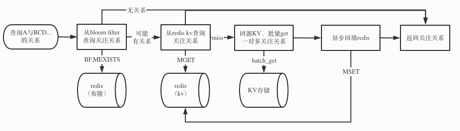
  - 热点的容灾
    - 热点检测工具，接入后能基于配置的阈值，自动地统计热点并临时性地使用本地缓存
- [design pattern && refactor](https://refactoring.guru/)


