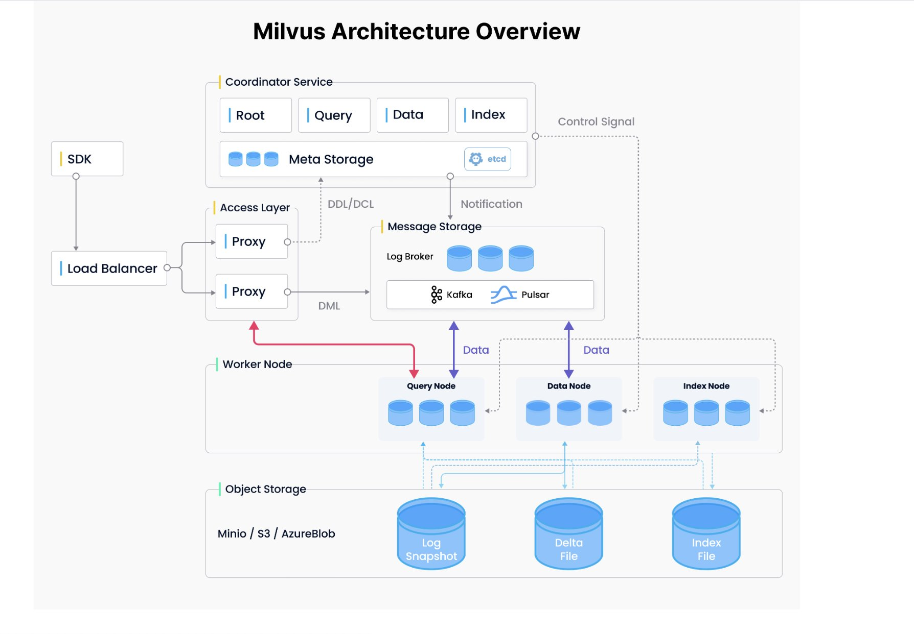

- [优化 Milvus 性能](https://mp.weixin.qq.com/s/4gDsAF4QnmXWzomrSFRLLg)
    - Milvus 是读写分离且无状态的向量数据库，状态信息储存在 etcd 中，coordinator 节点去 etcd 请求状态并修改状态
        - 当用户需要查看状态信息、清理状态信息场景时，etcd 调试工具必不可少。
        - [BirdWatcher  是 Milvus 2.0 项目的调试工具，该工具连接 etcd 并检查 Milvus 系统的某些状态](https://mp.weixin.qq.com/s/ot-eMCKqM7aP5pEbGaMIQA)
    - Milvus 单机
        - 在单机模式下，milvus内置一个rocksdb用于代替pulsar的功能，rdb_data目录里的东西是rockdb管理的，所有insert/delete/upsert的数据都会先在rocksdb里存一份做为write ahead log，然后querynode datanode从rocksdb里把数据拉出来消费
        - 如果rocksdb里的数据消费完了，不会立刻删除，因为rocksdb有自己的gc，只不过这些数据对milvus来说已经消费过了，放着只是为了保证数据安全性，一旦milvus崩了，再启动的时候，那些没被持久化到minio里的数据还能从rocksdb里拉回来
    - 合理的预计数据量，表数目大小，QPS 参数等指标
    - 选择合适的索引类型和参数
        - 索引的选择对于向量召回的性能至关重要，Milvus 支持了 Annoy，Faiss，HNSW，DiskANN 等多种不同的索引，用户可以根据对延迟、内存使用和召回率的需求进行选择
        - 是否需要精确结果？
            - 只有 Faiss 的 Flat 索引支持精确结果，但需要注意 Flat 索引检索速度很慢，查询性能通常比其他 Milvus 支持的索引类型低两个数量级以上，因此只适合千万级数据量的小查询
        - 数据量是否能加载进内存？
            - 对于大数据量，内存不足的场景，Milvus 提供两种解决方案：
                - DiskANN
                    - DiskANN 依赖高性能的磁盘索引，借助 NVMe 磁盘缓存全量数据，在内存中只存储了量化后的数据。
                    - DiskANN 适用于对于查询 Recall 要求较高，QPS 不高的场景。
        - 构建索引和内存资源是否充足
            - 性能优先，选择 HNSW 索引
- [Milvus 2.0 数据插入与持久化](https://mp.weixin.qq.com/s/D0xdD9mqDgxFvNY19hvDgQ)
    - 删数据逻辑
        - 调用delete删除一条已存在的数据时，它只是在某个segment里把某条数据标记为deleted，但是这个segment的数据此时仍然是一个整体，那条被删的数在内存里仍然占着空间。
        - 当你又调用insert增加一条数据时，这条新数据实际上是放入一个新的segment中，这条新数据也会占用额外内存空间。因此，随着你继续删除+insert，你会看到内存用量增加，新的这个segment执行的是暴搜，cpu用量会增加。
        - 随着新的segment中的数据达到一定量可以建索引了，indexnode就开始给这个新segment建索引，建索引就会消耗cpu。只有当某个segment中被删的数据达到20%以上，datanode开始对这个segment进行compact，
        - 把deleted的数据去除掉，剩下的数据存为一个新的segmemt。在compact之后有可能会发生小segment合并成大segment。总之，删除和更新数据会产生很多额外的工作，消耗内存消耗cpu，设计上就如此
    - 如果用num_enrtities观察行数的话，是看不出变化的，因为num_entities不统计被删除的行数。如果你是删除之后再用query去查询主键，还能查到的话，那八成是因为你是删完就立即query，而consistency_level没有设为Strong
- [动态 Schema](https://mp.weixin.qq.com/s/jhyePhxjUbWBicEvqxIKGQ)
  - Milvus 如何实现动态 Schema 功能
    - Milvus 通过用隐藏的元数据列的方式，来支持用户为每行数据添加不同名称和数据类型的动态字段的功能。
    - 当用户创建表并开启动态字段时，Milvus 会在表的 Schema 里创建一个名为$meta的隐藏列。JSON 是一种不依赖语言的数据格式，被现代编程语言广泛支持，因此 Milvus 隐藏的动态实际列使用 JSON 作为数据类型。
  - 动态 Schema 的 A、B 面
    - 一方面，动态 Schema 设置简便，无需复杂的配置即可开启动态 Schema；动态 Schema 可以随时适应数据模型的变化，开发者无需进行重构或调整代码。
    - 另一方面，使用动态 Schema 进行过滤搜索比固定 Schema 慢得多；在动态 Schema 上进行批量插入比较复杂，推荐用户使用行式插入接口写入动态字段数据。
- [向量数据库](https://developer.aliyun.com/article/1328709?spm=a2c6h.12883283.index.43.5ba74307ZagBs5)
    - 本质上就是给定一条向量，我们要搜索离它最近的 k 条向量，那最近的这个距离的定义可以是，比如说，内积或者欧氏距离、或者余弦距离。有了距离的定义以后，我们还要定义一些向量的搜索算法。
    - 向量搜索算法总体来说分为两类，
        - 第一类是精准搜索 KNN - FLAT，一个向量一个向量地去检索，然后取 top k，召回率会很高，但是它的执行的性能会比较差，因为要做全局扫描
        - approximate nearest neighbor，就是 ANN，那这类算法它可能回答的并不是最精准的 top k 的向量，但是这一类算法的好处是执行效率比较高。
- 海量数据相似数据查找方法
    - 高维稀疏向量和稠密向量两大方向
        - 高维稀疏向量的相似查找 - minhash, lsh(Locality-Sensitive Hashing）, simhash
            - minhash
                - 定义一个函数h：计算集合S最小的minhash值，就是在这种顺序下最先出现1的元素
                - 如果进行n次重排的话，就会有n个minhash函数，{h1(S), h2(S)…, hn(S)}, 那原来每个高维集合，就会被降到n维空间，比如S1->{h1(S1), h2(S1)…, hn(S1)}
                - 实际中因为重排比较耗时，会用若干随机哈希函数替代. 同样可以定义n个哈希函数【不需要重排，每个hash计算对应的值就行】，进行上述操作，那每个集合S就被降维到n维空间的签名。
            - LSH
                - minhash解决了高维向量间计算复杂度问题(通过minhash 机制把高维降低到n维低纬空间)
                - 但是还没解决一个问题：两两比较，时间复杂度O(n^2)
                - LSH 就是这样的机制，通过哈希机制，让相似向量尽可能出现一个桶中，而不相似的向量出现在不同的桶中. 相似度计算只在么个桶中进行，每个桶彼此之间不做相似度计算。
                - 在minhashing 签名的基础上做LSH
                    - 一个高维向量通过minhashing处理后变成n维低维向量的签名，现在把这n维签名分成b组，每组r个元素。
                    - 每组通过一个哈希函数，把这组的r个元素组成r维向量哈希到一个桶中。
                    - 每组可以使用同一个哈希函数，但是每组桶没交集，即使哈希值一样。桶名可以类似：组名+哈希值。
                    - 在一个桶中的向量才进行相似度计算，相似度计算的向量是minhash的n维向量（不是r维向量）。
            - simHash
                - Simhash技术引入到海量文本去重领域
                - google 通过Simhash把一篇文本映射成64bits的二进制串。
                    - 文档每个词有个权重。
                    - 文档每个词哈希成一个二进制串。
                    - 文档最终的签名是各个词和签名的加权和(如果该位是1则+weight，如果是0，则-weight)，再求签名[>0则变成1，反之变成0]得到一个64位二进制数。
                    - 如果两篇文档相同，则他们simhash签名汉明距离小于等于3。
                - 因为simhash本质上是局部敏感hash，所以可以使用海明距离来衡量simhash值的相似度。
                - 假设我们要寻找海明距离3以内的数值，根据抽屉原理，只要我们将整个64位的二进制串划分为4块，无论如何，匹配的两个simhash code之间至少有一块区域是完全相同的。
    - 高效的搜索算法有很多，其主要思想是通过两种方式提高搜索效率：
        - 减少向量大小——通过降维或减少表示向量值的长度。
        - 缩小搜索范围——可以通过聚类或将向量组织成基于树形、图形结构来实现，并限制搜索范围仅在最接近的簇中进行，或者通过最相似的分支进行过滤。
    - ANN 最近邻检索
        - [Comprehensive Guide To Approximate Nearest Neighbors Algorithms](https://towardsdatascience.com/comprehensive-guide-to-approximate-nearest-neighbors-algorithms-8b94f057d6b6)
        - 树方法，如 KD-tree，Ball-tree，Annoy
          - KD-Tree（K维树）：KD-Tree是一种用于多维空间的数据结构
            - 在向量数据库中，KD-Tree对向量的各个维度进行划分，形成一种树状结构。每个节点都存储一个向量，并在某个维度上有一个分裂值，将数据空间分为两半
            - 对于低维数据，KD-Tree查询效率高，占用的内存相对较少。然而，随着数据维度的增加，查询效率降低，受到“维度诅咒”的影响，不适合高维数据。
          - Ball Trees：Ball Trees使用“超球体”（或简称“球”）来对数据进行分区
            - 每个节点的球内都包含数据点的子集，而子节点的球则进一步细分该空间。Ball Trees 适用于任何度量空间，特别是在高维空间中，效果可能优于KD-Tree。
            - 缺点是构建过程可能相对较慢，需要更多的内存
          - Annoy（Approximate Nearest Neighbors Oh Yeah）：Annoy是一种为大型数据集创建持久性、静态、可查询的近似最近邻索引的方法
            - 它通过构建多棵随机投影树实现。Annoy 提供了查询速度和精确度之间的良好平衡，适用于大型数据集 然而它是一个近似方法，可能不保证总是返回真正的最近邻。
        - 哈希方法，如 Local Sensitive Hashing (LSH)
        - 矢量量化方法，如 Product Quantization (PQ)
          - PQ将大向量空间分解为更小的子空间，并为这些子空间的每一个独立地学习一组有限的“代码簿”。向量被编码为这些子空间中最近的代码簿条目的索引
          - PQ 极大地压缩了原始向量，从而实现了存储和查询的高效率。但凡事都有双面性，由于是有损压缩，PQ 可能会损失一些精确度。
        - 近邻图方法，如 [Hierarchical Navigable Small World (HNSW)](https://towardsdatascience.com/similarity-search-part-4-hierarchical-navigable-small-world-hnsw-2aad4fe87d37)
          - HNSW利用图结构，其中每个节点都是数据中的一个向量，通过一系列层次来确保快速访问。每一层都是原始数据的一个子集，上层的数据点数量比下层少。
          - HNSW 提供了查询速度和精确度之间的良好平衡，适用于大型和高维数据集。但它需要更多的内存，构建索引的过程可能较慢。
    - 近似最近邻 (ANN)算法
  - [Comprehensive Guide To Approximate Nearest Neighbors Algorithms](https://towardsdatascience.com/comprehensive-guide-to-approximate-nearest-neighbors-algorithms-8b94f057d6b6)
        - 「LSH」（Locality-Sensitive Hashing）」它引入了一种哈希函数，使得相似的输入能以更高的概率映射到相同的桶中，其中桶的数量远小于输入的数量。
        - 「ANNOY（Approximate Nearest Neighbors）」它的核心数据结构是随机投影树，实际是一组二叉树，其中每个非叶子节点表示一个将输入空间分成两半的超平面，每个叶子节点存储一个数据。二叉树是独立且随机构建的，因此在某种程度上，它模仿了哈希函数。ANNOY会在所有树中迭代地搜索最接近查询的那一半，然后不断聚合结果。这个想法与 KD 树非常相关，但更具可扩展性。
        - 「HNSW（Hierarchical Navigable Small World）」它受到小世界网络思想的启发，其中大多数节点可以在很少的步骤内被任何其他节点到触达；例如社交网络的“六度分隔”理论。
            - HNSW构建这些小世界图的层次结构，其中底层结构包含实际数据。中间的层创建快捷方式以加快搜索速度。执行搜索时，HNSW从顶层的随机节点开始，导航至目标。当它无法靠近时，它会向下移动到下一层，直到到达最底层。上层中的每个移动都可能覆盖数据空间中的很长一段距离，而下层中的每个移动都可以细化搜索质量。
        - 「FAISS（facebook AI Similarity Search）」它运行的假设是：高维空间中节点之间的距离服从高斯分布，因此这些数据点之间存在着聚类点。faiss通过将向量空间划分为簇，然后在簇内使用用向量量化。faiss首先使用粗粒度量化方法来查找候选簇，然后进一步使用更精细的量化方法来查找每个簇。
            - [上手Faiss](https://mp.weixin.qq.com/s/GxxPqa1pjDvt9PvAMuebkA)
        - 「ScaNN（Scalable Nearest Neighbors）」的主要创新在于各向异性向量量化。它将数据点量化为一个向量，使得它们的内积与原始距离尽可能相似，而不是选择最接近的量化质心点。
            - [blog](https://blog.research.google/2020/07/announcing-scann-efficient-vector.html) [Vector Search ANN 服务](https://cloud.google.com/vertex-ai/docs/matching-engine/ann-service-overview?hl=zh-cn)
            - ScaNN 算法的核心思想是使用一种称为 Product Quantization（PQ）的技术将高维向量压缩成多个低维向量，并使用这些低维向量进行相似性搜索。PQ 技术可以将高维向量划分成多个子向量，并对每个子向量进行量化，从而将高维向量压缩成多个低维向量。这样可以大大降低相似性搜索的计算复杂度，提高搜索效率。
            - ScaNN 算法还使用了一种称为 Clustering Graph（CG）的技术，将数据集划分成多个子集，并构建一个图来表示这些子集之间的相似性关系。这样可以将相似的向量聚集在一起，从而提高搜索效率。
            - ScaNN 算法的优点在于它可以在大规模数据集上进行高效的相似性搜索，同时具有较高的搜索准确率。ScaNN 算法还支持增量式更新，可以动态地添加和删除向量，从而适应数据集的变化。
    - Faiss 
        - 我们可以将向量想象为包含在 Voronoi 单元格中 - 当引入一个新的查询向量时，首先测量其与质心 (centroids) 之间的距离，然后将搜索范围限制在该质心所在的单元格内。
        - 为了解决搜索时可能存在的遗漏问题，可以将搜索范围动态调整，例如当 nprobe = 1 时，只搜索最近的一个聚类中心，当 nprobe = 2 时，搜索最近的两个聚类中心，根据实际业务的需求调整 nprobe 的值。
    - Product Quantization (PQ)
        - 在大规模数据集中，聚类算法最大的问题在于内存占用太大
            - 保存每个向量的坐标，而每个坐标都是一个浮点数，占用的内存就已经非常大了。
            - 还需要维护聚类中心和每个向量的聚类中心索引，这也会占用大量的内存。
        - 对于第一个问题，可以通过量化 (Quantization) 的方式解决，也就是常见的有损压缩.例如在内存中可以将聚类中心里面每一个向量都用聚类中心的向量来表示，并维护一个所有向量到聚类中心的码本，这样就能大大减少内存的占用。
            - 但是在高维坐标系中，还会遇到维度灾难问题，具体来说，随着维度的增加，数据点之间的距离会呈指数级增长，这也就意味着，在高维坐标系中，需要更多的聚类中心点将数据点分成更小的簇，才能提高分类的质量。否者，向量和自己的聚类中心距离很远，会极大的降低搜索的速度和质量。
        - 对于第二个问题，将向量分解为多个子向量，然后对每个子向量独立进行量化，比如将 128 维的向量分为 8 个 16 维的向量，然后在 8 个 16 维的子向量上分别进行聚类，因为 16 维的子向量大概只需要 256 个聚类中心就能得到还不错的量化结果，所以就可以将码本的大小从 2^64 降低到 8 * 256 = 2048 个聚类中心，从而降低内存开销
    - Hierarchical Navigable Small Worlds (HNSW) 类似 skiplist
        - 这种方法的基本思想是每次将向量加到数据库中的时候，就先找到与它最相邻的向量，然后将它们连接起来，这样就构成了一个图。当需要搜索的时候，就可以从图中的某个节点开始，不断的进行最相邻搜索和最短路径计算，直到找到最相似的向量。
        - HNSW 继承了相同的分层格式，最高层具有更长的边缘（用于快速搜索），而较低层具有较短的边缘（用于准确搜索）
    - 相似性测量 (Similarity Measurement)
        - 欧几里得距离（Euclidean Distance）
            - 欧几里得距离算法的优点是可以反映向量的绝对距离，适用于需要考虑向量长度的相似性计算。
            - 例如推荐系统中，需要根据用户的历史行为来推荐相似的商品，这时就需要考虑用户的历史行为的数量，而不仅仅是用户的历史行为的相似度
        - 余弦相似度（Cosine Similarity）
            - 余弦相似度是指两个向量之间的夹角余弦值
            - 余弦相似度算法的优点是可以反映向量的方向，适用于不需要考虑向量长度的相似性计算。因此适用于高维向量的相似性计算。例如语义搜索和文档分类。
        - 点积相似度 (Dot product Similarity)
            - 点积相似度是指两个向量的点积，也就是两个向量对应位置的元素相乘之后再求和。点积相似度算法的优点是可以反映向量的绝对距离和方向，适用于需要考虑向量长度的相似性计算。例如推荐系统中，需要根据用户的历史行为来推荐相似的商品，这时就需要考虑用户的历史行为的数量，而不仅仅是用户的历史行为的相似度。
            - 点积相似度算法的缺点是需要对向量进行归一化，否则会受到向量长度的影响。例如在推荐系统中，如果用户的历史行为数量很多，那么用户的历史行为向量的长度就会很大，这样就会导致点积相似度算法的结果偏向于历史行为数量较少的用户。
            - 点积相似度算法的优点在于它简单易懂，计算速度快，并且兼顾了向量的长度和方向。它适用于许多实际场景，例如图像识别、语义搜索和文档分类等。但点积相似度算法对向量的长度敏感，因此在计算高维向量的相似性时可能会出现问题。
    - 过滤 (Filtering)
        - 在实际的业务场景中，往往不需要在整个向量数据库中进行相似性搜索，而是通过部分的业务字段进行过滤再进行查询。所以存储在数据库的向量往往还需要包含元数据，例如用户 ID、文档 ID 等信息。这样就可以在搜索的时候，根据元数据来过滤搜索结果，从而得到最终的结果。
        - 为此，向量数据库通常维护两个索引：一个是向量索引，另一个是元数据索引。然后，在进行相似性搜索本身之前或之后执行元数据过滤，但无论哪种情况下，都存在导致查询过程变慢的困难。
        - Pre-filtering：在向量搜索之前进行元数据过滤。虽然这可以帮助减少搜索空间，但也可能导致系统忽略与元数据筛选标准不匹配的相关结果。
        - Post-filtering：在向量搜索完成后进行元数据过滤。这可以确保考虑所有相关结果，在搜索完成后将不相关的结果进行筛选。
    - https://guangzhengli.com/blog/zh/vector-database/
- [向量检索技术](https://mp.weixin.qq.com/s/705usxBUmLcZL3rrB4Du9A)
  - 定义
    - 向量检索主要是做一个 K Nearest Neighbors (K最近邻，简称 KNN) 计算，目标是在N个D维的向量的库中找最相似的k个结果
    - KNN 计算通常代价比较大，很难在较短时间内返回结果，此外，在很多场景，用户并不需要绝对精确的相似结果
    - 通常会使用相似最近邻搜索，即 ANN 的方式来替代 KNN，从k个绝对最近似结果变成k个近似最优结果，以牺牲一定准确度的前提，得到更短的响应时间。
  - 向量检索的四种算法
    - Table-based，典型算法如 LSH
    - Tree-based，是把向量根据相似度去构造成一个树的结构
    - Cluster-based，也称为 IVF（Inverted File），把向量先进行聚类处理，检索时首先计算出最近的 k 个聚类中心，再在这些聚类中心中计算出最近的 k 个向量
    - Graph-based， 把向量按照相似度构建成一个图结构，检索变成一个图遍历的过程。常用算法是HNSW
  - ByteHouse
- [向量数据库](https://mp.weixin.qq.com/s/UCgJi7MfAnn8tAPvL3sldQ)
  - 向量检索算法
    - 基于树的方法，例如KDTree和Annoy
    - 基于图的方法，例如HNSW
    - 基于乘积量化的方法，例如SQ和PQ
    - 基于哈希的方法，例如LSH
    - 基于倒排索引的方法
    - 基于聚类 IVF
  - 数据压缩方式建立索引, 主要包括平坦压缩和量化压缩
    - 平坦压缩是指以未经修改的形式存储向量的索引，
    - 量化中索引的底层向量被分解成由较少字节组成的块（通常通过将浮点数转换为整数）以减少内存消耗和搜索过程中的计算成本。
  - Milvus
    - mmap功能在collection.load的时候会把s3上的数据文件下载到本地硬盘，所以首先本地硬盘得有同等大小。然后内存还是要的，最好能达到数据量的1/4以上。
    - 然后如果你用的是hnsw索引，性能可能会比纯内存慢一到两倍这样。如果用的ivf索引，性能会比纯内存慢一到两个数量级
- [Milvus]
  - 
  - indexnode，每个querynode，每个datanode都是单独的容器
    - indexnode只负责建索引任务，querynode只负责查询任务，datanode只负责数据的持久化和整理任务。indexnode建索引时总是会尽量用满cpu，以最快速度建好索引
    - load的时候，数据会load到querynode节点上
    - 一个querynode节点sesrch时可以用多张gpu卡同时算。但建索引的任务，一个indexnode默认是一个任务一个任务执行，所以只用到一张显卡
  - Deployment
    - standalone是内置的rocksdb实现message queue，
    - cluster是用pulsar或者kafka来做为message queue。而cdc是通过操作kafka/pulsar来同步数据的，所以standalone不能用
    - deployment推荐的resources.limits,indexnode，datanode的内存限制，refer https://milvus.io/tools/sizing/
  - Config参考 https://github.com/zilliztech/milvus-helm/blob/master/charts/milvus/values.yaml#L731C7-L731C45
    - milvus rpc的传输限制，这个可以在milvus.yaml的proxy. grpc. serverMaxRecvSize/clientMaxSendSize
    - autoindex是定义在milvus.yaml里的，默认好像是hnsw索引，数据有100gb的话，索引就要100gb+的内存
    - indexbasedCompaction设为true，compaction的时候就只针对建好索引的分片，没建好索引的分片没资格参与compaction
    - bloomfiltersize应该是针对单个segment。默认是十万行。就是说如果每个分片里的行数是十万行左右的话，布隆过滤器的效果最好最适合
      - milvus内部，每个分片都有一个布隆过滤器，用于快速判断一个主键是否可能存在于该分片中。bloomfiltersize用于控制布隆过滤器的适用范围，影响布隆过滤器器的效果。
  - 查询
    - milvus的调用顺序可以是：建表，insert，建索引，load，search
      - 也可以是：建表，建索引，insert，load，search
      - 还可以是：建表，建索引，load，insert，search 
      - 无论何种顺序，建索引必须在load之前，load必须在search之前
    - milvus每次查询最多只能返回16384条结果，分页也要遵循这个限制
    - 如果你不用过滤查询的话，hnsw索引会比ivf_flat快。动态数据是要比静态数据查询慢的。对于动态数据，如果partition多的话，性能会更差一些
    - nlist取2048比较好，nprobe按你之前的比例取10左右。ivfpq，一亿的数据，nlist 可以设置成多少合适，2048吗？
      - 在milvus里，每个分片都是独立的内存，所以nlist的取值是以每个分片所包含的行数来推荐。我们推荐是4*sqrt(每个分片里的行数)。faiss都是把数据整成一份，所以它那个很大
      - nlist的推荐值是4*sqrt(n)，其中n是单个segment中的数据行数，如果milvus.yaml中的segment. maxSize为默认的512MB，则n可以用512MB/(dimension*4Bytes)来计算
      - nlist是聚类中心的数量，nprobe是搜索时查询的聚类中心的数量。nlist越大，聚类中心越多，搜索时需要查询的聚类中心也就越多，搜索的时间也就越长。nprobe是搜索时查询的聚类中心的数量，nprobe越大，搜索的时间也就越长。nlist和nprobe的取值要根据实际情况来调整，一般来说，nlist和nprobe的取值要根据数据量、数据维度、索引类型、搜索参数等因素来调整。
      - nlist 和 nprobe 都是针对一个segment里的数据来说的，这两个值调控的是一个segment里面参与搜索的数据比例。nlist 是把一个segment里的数据分成多少个堆，nprobe是决定从这nlist个堆里选多少个出来参与搜索计算。
      - nlist和nprobe匹配着用就问题不大。比如nlist=1024 nprobe=128能满足你对于召回率的要求，那么把nlist改成512后重建索引，也相应地把nprobe=64，那么召回率也大概率能满足你召回率的要求。
      - 随着nlist/nprobe的较小，对召回率的影响就开始越来越大，比如16/2和8/1，这两者的召回率可能就差挺大了。反之，随着nlist/nprobe等比放大，两组召回率差别变小，但由于nlist的计算量差别增大，查询速度的差距也变大。所以才有4*sqrt(n)这么一个推荐值
    - 要明白k-means的原理，知道nlist和nprobe的关系。nlist和nprobe固定不变的情况下，被计算的数据比例基本是固定的，所以召回率也是基本不变
      - 我理解k-means是聚类出nlist中心点，nprobe是检索的时候，查询多少个中心点。随机情况下，每个中心点代表的数据条数是分片里的数据量除以nlist，那我每次搜索nprobe核中心，这比例不就固定的
    - 每次search()返回的list第一个distance都是最大的？
      - 选的metric_type是L2还是IP。
      - 如果是L2的话，distance越接近0就越相似，排第一个的最相似。
      - 如果是IP的话，在向量都做了归一化的前提下，distance越接近1越相似。详情参考官网文档的metric type。
    - 使用IP必须要把向量都归一化，不然没有意义。对于归一化的向量，IP算出来的结果和COSINE理论上是相同的。如果你自己做了归一化，那就可以用IP。没做，那就用COSINE或者L2
    - cosine是在数据被insert进来落盘的时候就计算好向量的length，然后在查询的时候会把两条向量的内积除以它们的length，所以是计算了一个余弦。由于length已经提前算好，所以查询性能和IP相比不会差多少
    - 有向量索引的情况下，过滤查询是有可能搜不出结果。
      - 有时候能搜到有时不能搜到，多半是因为底下的segment做了compaction之后重建了索引。几个有索引的小分片和一个有索引的大分片，过滤搜索出来的东西很可能不同。
    - 查询节点内存自动均衡的几种策略？当前默认是scorebase
    - search()接口是用向量做近似搜索，必须要传入向量。query()接口应该比较符合你想查标量的功能
    - milvus查看行数有两种方式，
      - 一种是collection.num_entities，只是从etcd中拿取每个segment创建时所记录的行数，不会统计delete的数量
      - 第二种是collection.query(output_fields=["count(*)"])。做一次详细统计，并把delete数量也统计在内。
        - query(output_fields="count(*)")是统计已落盘以及被querynode消费到的那部分数据。有些数据如果仍然在pulsar中就不会被统计到
      - Attu上看到的approximate count是用的前一种方式，所以不会统计delete的数量
    - Search()
      - milvus的过滤做法是先按条件里的标量过一遍，把符合条件的条目标为1，不符合的标为0，然后做ANN搜索，碰到1的就计算距离，碰到0的就忽略。过滤的性能跟索引有关系，HNSW索引如果标为1的数量很少，就很慢。IVF索引不受这个影响，比较快
    - 全量查询功能 - Query iterator
    - `collection.query(expr="id==xx", output_fields=["*"])`  这是取出一整行数据
    - 如果检索不出，一有可能是embedding不太好，二有可能索引参数搜索参数设的不合理，三有可能consistency level是eventually
      - insert数据到collection，数据的可见性跟message queue消费的速度有关，查询时想要确定数据可见就用consistency_level=Strong
      - collection创建时设置的consistency_level是做为默认值使用，不能修改
      - search和query接口都有consistency_level参数指定本次查询的level，如果没填search/query的consistency_level参数，才会使用collection的默认设定。
      - consistency_level是控制数据可见性的
        - milvus各个节点通过同步时间戳的方式来确认达到某个时间点的数据可见性，由一个rootcoord节点每隔200毫秒发送一个时间戳消息到消息中间件，如果某个时间戳被所有的querynode节点看到，那就说明这个时间戳之前的数据都已可见。
        - 设为Strong意思是等待当前最近的时间戳消息被所有querynode消费之后再开始搜索。有可能会等待200到400毫秒。
    - 向量搜索不保证你想要的那条数据一定会在结果集里的第一个，也会会在第五第六个甚至第10个 向量搜索是ANNS，“近似近邻搜索”这几个词的简写，它不叫精确搜索
    - search返回的结果里不带有partition信息。可以建表时用一个字段来存partition的名字或者标记，然后search的时候在output_fields里填写这个字段的名字。
    - 用gpu来做查询，必须要使用"GPU_"名字打头的索引
      - gpu的显存没有机器内存那么大，能加载的数据量相对较小，所以不适合巨型数据集。gpu在nq比较大的时候比较有优势，比如单次查询输入一千条以上的向量去搜
      - 每次搜索时要把目标向量从内存拷到显存，搜索完成后把结果从显存拷到内存，这些都是有成本的
    - qps
      - qps受影响的因素很多，数据量，维度，索引类型参数，搜索参数，是否有过滤，是否有output_fields，milvus. yaml里面的queryNode.group里的配置，querynode数量，load的参数replica_number，等等。
      - 要获得更高的qps可以从上面这些方面入手。cpu的核数和性能也会影响qps，甚至NUMA架构也会影响qps。单机版的indexnode datanode如果有建索引或者compaction的任务在执行，也会影响qps。
    - count(*)是精确值，但它得出的结果会受consistency_level的影响。如果Strong，则是完全精确的。如果是Bounded/Eventually，有可能少数数据还在pulsar里未消费完成，就不被计入行数
    - try_search_fill方法是当缓存里的结果集不多的时候，执行若干次search（搜索半径会向外扩一圈）以获取更多的结果集
      - 初始化iterator的时候有个batch_size参数，如果缓存里的结果集仍然小于batch_size，它就会再次执行search(半径继续往外扩)来获取更多的结果集
    - 多列向量查询
      - 2.4版本的多列向量查询是先分别计算每个子查询的结果，再把子结果rerank。根据topk再做reranking。不是简单的取交集，有 fusion 策略的
    - 索引中做向量相似性检索
      - 本质上都是通过预先对向量数据的分布做了一个统计，然后在搜索的时候仅计算很小的范围就能找到绝大部分结果。不管是hnsw还是ivf，搜索的时候都只计算很小一部分数据就能找到结果
      - 那如果加上过滤条件，把一大批数据都排除在计算之外，那么本来要搜索的那小范围里也会有向量被排除在外，就凑不出足够的结果
      -  localstorage对diskann有效，当你调用load的时候就会把diskann索引数据都下载到localstorage里。
      - 内存里有小部分量化过的数据，搜索的时候先在内存里做一次快速搜索，然后在localstorage里找到对应的分块文件，读出原始向量做精确检索
  - 索引
    - milvus里面，每个向量字段最多只能建立一种索引，如果要换，要把旧的删除再建新的。执行search的时候总是会使用那唯一指定的索引。 查询计划无法被外界感知
    - seal compact index这几个事情有点复杂。seal之后会建一次索引，但seal的分片可能会被合并成大的分片，大的分片又要建一次索引
    - 除了DISKANN之外，所有的索引都是纯内存的。若打开了mmap，这样querynode会把数据文件下载到本地，然后通过mmap读取。内存不足的话可以考虑ivf_sq8  ivf_pw  diskindex这些索引，或者开mmap
    - 集群开了mmap，创建集合索引的时候是默认就开启了，还是需要collection.set_properties({'mmap.enabled': True})参数指定
    - hnsw索引的向量类型只能用floatvector？ float16Vector可以使用和floatVector一样的索引，hnsw ivf都行
    - ivf_flat建索引的时间跟nlist的大小相关，设小点就快，大点就慢，1G的耗时1分钟也是有可能的
      - 推荐值是4*sqrt(n)，n是单个segment里的行数。4096 dim，默认单个segment 512MB，那每个segment里大约有15000条数据，那么nlist大约为4*sqrt(15000)=480，最好是转成2的比方数，那就选512。
    - Normalization
      - 归一化是指将嵌入（向量）转换为范数等于1的过程。如果内积（IP）用于计算嵌入相似性，则所有嵌入都必须标准化。归一化后，内积等于余弦相似性
    - hnsw/ivfflat所需的内存稍大于向量数据的size。ivfsq8/ivfpq所需内存大约相当于向量数据size的1/4。diskann所需内存大约相当于向量数据size的1/4到1/6。
  - load
    - load是否有并发的设置呢？
      - milvus.yaml里的queryCoord.taskExecutionCap，这个设小点每批送给一个querynode加载的segment的最大数量，每个segment里有多个数据文件，querynode也有自己的并发读取的限制，跟cpu核数相关
    -  load时是加载索引列到内存还是全量字段数据到内存呢？
      - 对于向量字段来说，如果没建好索引的分片，原始向量数据会保持在内存里做搜索，建好索引的就把索引加载进内存，原先那些原始向量就会从内存释放掉。
      - 对于非向量字段，也是有索引就加载索引，没索引就把原始数据加载进内存。基本上你可以认为全量数据都在内存里。
    - 重启的时候会把之前loaded状态的表全部加载进内存。load的速度不可控，跟内部的调度和存储的读带宽相关。一般来说，千万级别的数据量load耗时分钟级的都是正常
    - 开启milvus以后，数据不加载到内存是什么问题?
      - 如果用的是 python 的 Milvus Client，create_collection 如果没输入 index param 是不会 load 到内存里的.
      - 如果没有设置这个参数，你可以单独调用create_index()和load_collection()接口
  - insert
    - 客户端发送一个insert请求
      - 客户端发送一个insert请求，milvus server的proxy接到请求，proxy把数据转发给pulsar/kafka，转发完之后就立刻返回，告诉客户端说insert完成
      - 数据还在kafka里，然后querynode/datanode都要向kafka订阅数据，这里就是异步的。kafka就好比milvus的WAL组件，保证插入的数据不丢
    - auto_id
      - 建表时设置主键的auto_id=true，主键就由milvus来产生，所产生的主键数值确实是往上增的，但跟那种每次+1的递增不一样
      - 自动产生的主键值是基于时间戳的，是一个很大的数字，每次insert都会用当前的时间戳来产生一批主键，同一批次里的主键是+1递增。但不同批次的主键的值有可能有间隔
    - insert_log
      - insert_log里的东西就是每个表的原始数据，包括向量数据，各个字段的数据。分片合并时，旧的分片数据不会立刻删除，要等待GC机制大约2—3小时后删除。
      - 如果停止了数据输入，等那些旧的分片都被GC清理之后，insert_log的大小就是真实的原始数据大小
    - milvus跟客户端之间的rpc请求，默认单次传输的数据上限是64MB.
      - 假设每行只有一条向量加一个id，向量维度是512，那么每条向量是2048字节，加上id是2056字节。64MB除以2056就是大约的行数
    - Proxy也可以做多副本的。
      - Milvus里面没有自带LoadBalancer，需要咱们自己做一个，不然扩展proxy节点还是只有一个节点有负载。这个lb 可以通过kubernetes 来实现的，可以通过service 和ingress
  - milvus的集群热备方案，可以看下github.com/zilliztech/milvus-cdc 
  - milvus里主要有两种数据，一种是元数据存在etcd，另一种是数据文件存在minio (元数据存在etcd，数据文件存在minio/s3; 就好比etcd里存着账本，minio里存着钞票)
    - 数据是分片管理，主要有两种分片(segment)
      - 一种是growing segment，负责接收新插入的数据，没有索引，搜索时暴搜(在最新的版本里提供了临时索引，ivf，超过几千条数据时开始生效)
      - 另一种是sealed segment，数据是固定的，不接受新数据，每个sesled分片建立一个独立的索引，建立索引的过程就是train，ivf索引是迭代若干次得到nlist个cluster
    - 物理文件删除？这个需要数据文件（segment） 上的数据都失效才能删掉。而segment失效，要么是上面的数据全被delete，要么是被compact。
      - 不要期望物理文件在删除后立即缩小。被删除的量要达到一定量才行，比如某个segment里被删除的数据达到了10%以上，才会触发一个动作把这10%的数据真正地从磁盘上清除。
      - 清除的流程是：用那90%的数据构建一个新的segment，然后把旧的segment标记为删除，等待垃圾清理机制做最终清除。
    - milvus的文件格式是在parquet格式外面包了一层，外部工具没法直接读的
    - nfs 不能做业务存储
      - nfs没有完全实现posix 文件语义。一旦一个系统有大量的文件删除，文件重命名的请求，nfs就会出故障。nfs，只能做追加，新建的和小规模的文件删除。而且删了以后最好就是再也不管了
      - 如果把业务数据库放到nfs这种系统，只能跑跑1-2 tps这种demo。吞吐低
    - 对于standalone 的milvus来说，rdb_data里存放的数据就相当于write-ahead-log，就等同于cluster的milvus存放在pulsar里的数据
      - 所有的insert请求都会被先存入rdb_data。也就是说，你插入多少数据，rdb_data里面就有多少数据
      - rdb_data里的数据由milvus.yaml里的rockmq.retentionTimeInMinutes控制，默认是保留3天rdb_data里主要是wal，还有些time tickets message，删掉问题不大
  - Knowhere 是 Milvus 的内部核心引擎，负责向量搜索，是基于行业标准开源库（如 Faiss、DiskANN 和 hnswlib 等）的增强版本
    - Knowhere 属于开源，其部署环境更多样，可在所有主机类型上运行
    - Knowhere 依赖于 OSS 库（如 Faiss、DiskANN 和 hnswlib）
    - milvus的ivfsq8，实际用的就是faiss的IndexIvfScalarQuantizer
  - attu
    -  attu里显示的approx entities number相当于用pymilvus的collection.num_entities获取行数，这个是从etcd中快速统计已落盘的行数。加载在内存里的数量有可能不一样，因为有些数据可能没落盘
  - 编译
    - 编译可以看看milvus repo下的DEVELOPMENT.md, 可以去github milvus disscusions里搜索compile关键字看别人都踩了哪些坑
    - 要编译和创建milvus镜像，参考这个帖子：https://github.com/milvus-io/milvus/discussions/31043
  - [Cardinal 搜索引擎](https://mp.weixin.qq.com/s/4xx2U8Xyr1RetTkMtRrxyw)
    - Cardinal 是用现代 C++ 语言和实用的近似最近邻搜索（ANNS）算法构建的多线程、高效率向量搜索引擎， 将搜索引擎的性能比原来提升了 3 倍，搜索性能（QPS）是 Milvus 的 10 倍
    - 同时能够处理暴搜请求和 ANNS 索引修改请求；处理各种数据格式，包括 FP32、FP16 和 BF16;执行索引 Top-K 和索引范围搜索（Range Search）;使用内存中数据或提供基于内存、磁盘和 MMap 等不同方式的索引
    - Cardinal 利用 x86 的 AVX-512 扩展和 ARM 的 NEON 及 SVE 指令集等尖端技术，提供针对高效计算优化的代码
    - 它引入了 AUTOINDEX 机制，自动选择适合于数据集最佳的搜索策略和索引。开发者无需手动调优，能够节省时间和精力
    - 内部算法
      - 搜索算法，包括基于 IVF 和基于图的方法 
      - 帮助搜索保持所需召回率的算法，不论过滤样本的百分比如
      - 更高效的 Best-First 搜索算法迭代方
      - 定制了优先队列数据结构中的算法
  - 估算容量
    - 5百万128维，原始数据量大约是2.5g，工具估算时会乘以一个安全系数，这个系数一般是2到3之间，所以你看到的Loading Memory是5G多点
    - 工具是按cluster估的，每个节点都给了推荐，如果不算etcd/minio/plasar这些的话，milvus的节点的推荐内存配置大约总共27. 5g  etcd推荐3*4g，minio推荐2*8g，pulsar的比较多，因为它本身也是个分布式系统 所以如果500万128维的向量其实必要用cluster，一个standalone就好了
  - [优化](https://zilliz.com.cn/blog/milvus-%20community-keyword)
    - 降低内存
      - 牺牲性能 - Mmap, DiskANN
      - 牺牲精度 - IVF_PQ, IVF_SQ8(基于Faiss)
    - 分批插入数据，是每一批 collection.flush()，还是最后再 collection.flush()？
      - 插入数据时，不要每一批都调用 flush()接口，Milvus 内部会定期调 flush() 接口，所有数据都插入完成之后，再调用一次 flush 即可
      - 插入数据后，频繁调用 flush，会产生大量碎的 segment 文件，为系统带来较大的 compaction 压力
    - 这个设置成主键之后，为什么还可以继续重复插入相同的值？
      - Milvus 用 insert 接口做数据插入时，不会做主键去重，如果希望主键去重，可以使用 upsert 接口
      - 但是，由于 upsert 内部多做了一次 query 操作，插入性能会比 insert 更差
    - 半数使用问题是配置问题
      - 怎么调？ https://mp.weixin.qq.com/s?__biz=MzUzMDI5OTA5NQ==&mid=2247496778&idx=1&sn=018256ae415356e3ed357ee473dc1627&chksm=fa5155f2cd26dce4095b57fa4eb5c7e67e9eb49ed2762ce618e1134bb33022049e75c25e49ab&scene=21#wechat_redirect
      - Milvus 从 2.3.0 版本开始，就开始支持动态调整参数，具体操作方法参考：https://milvus.io/docs/dynamic_config.md
    - [如何优化 Milvus 性能](https://mp.weixin.qq.com/s/4gDsAF4QnmXWzomrSFRLLg)
      - Milvus 会创建 256 个消息队列 topic。如果表数目比较少，可以调整 rootCoord.dmlChannelNum 减少 topic 数目降低消息队列负载
      - 每个 collection 会使用 2 个消息队列 topic（shard），如果写入非常大或者数据量极大，需要调整 collection 的 shard 数目
        - 建议每个 shard 写入/删除不超过 10M/s，单个 shard 的数据量不大于 1B 向量，shard 数目过大也会影响写入性能，因此不建议单表超过 8 个 shard。
      - 使用多副本可以扩展查询性能，但建议副本数目不要超过 10 个
      - 索引的选择
        - 是否需要精确结果
          - 只有 Faiss 的 Flat 索引支持精确结果, 查询性能通常比其他 Milvus 支持的索引类型低两个数量级以上，因此只适合千万级数据量的小查询
        - 数据量是否能加载进内存？
          - DiskANN
            - DiskANN 依赖高性能的磁盘索引，借助 NVMe 磁盘缓存全量数据，在内存中只存储了量化后的数据。
            - DiskANN 适用于对于查询 Recall 要求较高，QPS 不高的场景。
            - 关键参数 search_list: search_list 越大，recall 越高而性能越差
          - IVF_PQ
            - 对于精确度要求不高的场景或者性能要求极高的场景。
            - IVF 参数
              - nlist：一般建议 nlist = 4*sqrt(N)，对于 Milvus 而言，一个 Segment 默认是 512M 数据，对于 128dim 向量而言，一个 segment 包含 100w 数据，因此最佳 nlist 在 1000 左右。
              - nprobe：nprobe 可以 Search 时调整搜索的数据量，nprobe 越大，recall 越高，但性能越差
            - PQ 参数
              - m：向量做 PQ 的分段数目，一般建议设置为向量维数的 1/4，M 取值越小内存占用越小，查询速度越快，精度也变得更加低
              - nbits： 每段量化器占用的 bit 数目，默认为 8，不建议调整
        -  构建索引和内存资源是否充足
          - 性能优先，选择 HNSW 索引
            - HNSW 参数
              - M：表示在建表期间每个向量的边数目，M 越大，内存消耗越高，在高维度的数据集下查询性能会越好。通常建议设置在 8-32 之间。
              - ef_construction：控制索引时间和索引准确度，ef_construction 越大构建索引越长，但查询精度越高。要注意 ef_construction 提高并不能无限增加索引的质量，常见的 ef_constructio n 参数为 128。
              - ef: 控制搜索精确度和搜索性能，注意 ef 必须大于 K。
          - 资源优先，选择 IVF_FLAT 或者 IVF_SQ8 索引
            - IVF 索引在 Milvus 分片之后也能拿到比较不错的召回率，其内存占用和建索引速度相比 HNSW 都要低很多
            - IVF_SQ8 相比 IVF，将向量数据从 float32 转换为了 int8，可以减少 4 倍的内存用量，但对召回率有较大影响，如果要求 95% 以上的召回精度不建议使用。
      - 合理选择流式插入和批量导入
        - 尽可能批量写入，整体吞吐会更高，建议每次写入的大小控制在 10M
        - 单个 Shard 的流式写入量不建议超过 10M/s
        - Datanode 多于 Shard 的情况下，部分 DataNode 可能无法获得负载
        - 导入目前支持的文件大小上限是 1GB，接下来会支持更大的导入文件大小上限
        - 不建议频繁导入小文件，会给 compaction 带来比较大的压力
      - 谨慎使用标量过滤，删除特性等特性
        - Milvus 使用的是前过滤，即先做标量过滤生成 Bitset，在向量检索的过程中基于 Bitset 去除掉不满足条件的 entity。
        - 对于 HNSW 这一类的图索引而言，标量过滤并不会加速查询，反而可能导致性能变差。
      - 常见的参数调整
        - Segment 大小：Segment 大小越大，查询性能越好，构建索引越慢，负载越不容易均衡。Milvus 默认选择 512M Segment 大小主要是考虑到了内存比较少的机型。对于内存在 8G-16G 的用户，建议 Segment 大小调整到 1024M，16G 以上的机型可以调整到 2G。
        - Segment seal portion: 当 Growing Segment 达到 Segment 大小 * seal portion 后，流式数据就会被转换为批数据。通常情况下建议 Growing segment 的大小控制在 100-200M 左右，调小这个值有助于降低流式写入场景下的查询延迟。
        - DataNode Segment SyncPeriod: Milvus 会定时将数据 Sync 到对象存储，Sync 越频繁故障恢复速度越快，但过于频繁的 sync 会导致 Milvus 生产大量小文件，给对象存储造成较大压力。
  - Milvus 2.3
    - Cosine 相似度类型： 无需向量归一化，简化数据搜索流程。
    - Upsert 数据：提升更新和删除数据的管理流程效率，适用于频繁更新数据且追求数据一致性和原子性的场景。
    - 范围搜索（Range Search）: 通过限制查询向量与其他向量之间的距离，范围搜索能够实现对搜索结果的有效细化，适用于搭建推荐引擎的场景。 
    - 支持 Parquet 文件：提升数据处理能力，支持 Parquet 文件，通过其高效的列式存储格式，提供更好的查询性能，适用于具有复杂数据集的场景。 
    - 支持 Array 数据类型：支持在搜索过程中基于多个属性进行精确的元数据过滤。在电商领域中，该功能支持根据不同产品标签进行搜索，为用户返回相关的搜索结果
  - Milvus 2.4
    - 支持 CAGRA 索引: CAGRA 是 NVIDIA RAFT 库中最先进的基于图形处理器的图形索引; CAGRA 即使在小批量查询中也表现出压倒性的优势
    - 还支持了 GPU 暴搜，性能有数十倍提升，进一步满足需要高召回率的场景。
    - 支持多向量搜索: 在 Collection 中存储和搜索多个向量列
    - Grouping 搜索: 用户可以在搜索 vector 的基础上做分组聚合，返回的 TopK 是基于分组后的聚合结果而非简单的以向量为中心的片段信息
    - 支持稀疏向量（beta）: 专为由 SPLADEv2 等神经模型和 BM25 等统计模型生成的向量设计
    - 倒排索引和模糊匹配支持: 
      - 基于内存的二进制搜索索引和 Marisa Trie 索引用于标量字段索引。然而，这些方法是内存密集型的
      - 2.4 采用了基于 Tantivy 的倒排索引，它可以应用于所有数字和字符串数据类型。此版本还支持模糊匹配标量过滤使用前缀，中缀和后缀
    - 内存映射存储: 不是将文件内容直接加载到内存中，而是将文件内容映射到内存中
    - 元数据过滤中支持使用正则表达式对子字符串进行匹配、全新的标量倒排索引（由 Tantivy 贡献）以及用于检测并同步 Milvus Collection 中数据变化的 Change Data Capture 工具
    - HNSW 还没有全链路支持 float16，底层 knn search的时候，是把 float16转换成 float32 再运算的，所以你看到内存使用量下降不多.下个版本，HNSW 全链路都支持 float16 之后，预期内存使用量会下降一半
    - 全链路支持float16和bfloat16的只有diskann。下一步支持的是hnsw，ivf和scann还排在后面
  - Error Check list
    - "deny to write: memory limit exceeded" 意思是某个querynode或者datanode的内存快用光了
    - "unrecognized dtype for key: labels"  这是因为langchain.MilvusVectorStore没法根据你在Document的metadata中的"labels"这个key所对应的vlaue推断出这是个什么类型的字段
    - "MilvusException: (code=65535, message=efConstruction out of range" HNSW索引的参数设的有问题，要设在区间里。milvus以segment为单位管理数据。同一个collection的segments有可能被放在不同的querynode里
    -  表加载不起来，要用一个debug工具来release。具体步骤：
      - 1. 下载这个repo到本地 github.com/milvus-io/birdwatcher
      - 2. 进入repo目录，命令行执行  go build -o birdwatcher main.go ，前提是安装了go，执行成功后在該目录下会有一个birdwatcher的可执行程序
      - 3. 命令行运行 bridwatcher，进入commandline模式
      - 4. 执行 connect，前提是你的milvus所使用的那个etcd在运行状态，并且容器端口2379暴露出来
      - 5. 如果connect成功，再执行force-release
      - 6. 重启milvus容器
  - QA
    - 为何不用float64来保证小数点后十几位？
      - 一来因为float32计算起来比float64快得多，也省内存。
      - 二来向量搜索简称ANNS，本身就是近似搜索，小数点后十几位的值没有意义，就好比我们比较两个人是否长得相似不会去一根根计算他们的头发数量是否相等。
      - milvus处理向量是以float32位来传输、存储以及计算，你就算输入的是float64的值，传输到server那边就已经变成float32
    - 日志里面待构建索引行数和已构建索引行数之和大于数据总行数是什么原因呢？而且这个pendingIndexRows的数量还会增加是怎么回事呢？ 索引的已构建行数最大是等于表的总行数
      - pendingrow增加是因为里面有compaction，有些segment已经建好了索引，但它要和其他segment合并成更大的srgment，合并完之后又会再次建索引
    - 按照标量查询数据，同样的表达式，为什么一个有结果一个没结果？
      - 表达式过滤搜索时，如果带有索引比如ivf_flat索引，查出的结果可能有时有有时没有，因为内部是先过滤再做ann search。你换成FLAT就有稳定结果。
    - milvus如果做成一项公共向量服务，每个系统都是按需load/release索引的话，在数据量几百万/几千万这个级别的时候，搬运一次其实挺慢的，要好几秒的时间，那milvus的查询不就变得很慢了么，有没有什么好的建议?
      - 加载起来 每次load release本身就比较慢。如果成本考虑 不在乎查询性能 试试mmap
      - 请问开了mmap功能，collection的load方法就不用调用了，还是调用了load和release也没效果？
        - mmap 和 load/release 逻辑无关，目前 milvus 里的 collection 还是需要 load 才能进行操作
      - 请问这个load collection，是异步的把索引也一并载入到内存么？
        - 一个表里的数据划分为多个segment，每个segment都有单独的索引。对于有索引的segment，加载它的索引到内存里。对于没有索引的segment，加载原始的向量数据进内存
        - load()调用的时候，如果目前有数据不在内存里，它会阻塞模式等待这些数据进入内存。一旦load()执行完成返回，后续如果有新的数据或者新的索引，新的东西将会被异步地加载进内存。
        - 对于之前以原始数据加载进内存的segment，一旦它的索引构建完成，这个索引将会被加载进内存，然后之前在内存里的原始数据会被free，也就是一个内存中的替换。
      - 开了 mmap 即便超出内存一般也不会 oom，但是会影响 latency，我们测下来 hnsw 可以放 4 倍左右性能还能保持不错的水位，这个和你的 workload 有关。
        - diskann和mmap其实都挺依赖磁盘性能。mmap如果内存太少的话性能也会很差
        - mmap开启以后，内存资源可以降低到之前的1/4左右
        - mmap开了确实会减少内存使用。不开的话理论值是25—30gb，sizing tool会乘以一个安全系数（一般是2，有的索引可能系数大一点）
      - 另一种节省内存的方式是使用ivf_sq8或者ivf_pq，但是召回率可能不太好
- [BigANN 2023](https://mp.weixin.qq.com/s/7H7xtGzEfAdu-zQv0NHYzg)
  - Filters 赛道: 本赛道使用了 YFCC 100M 数据集，要求参赛者处理从该数据集中选取的 1000 万张图片
    - 具体任务要求为提取每张图片的特征并使用 CLIP 生成 Embedding 向量，且需包含图像描述、相机型号、拍摄年份和国家等元素的标签（元素均来自于词汇表）。
    - 主要挑战是参赛者需要成功地将 10 万个查询与数据集中的相应图像和标签匹配，每个查询都包含一个图像向量和特定的标签。
    - 解决方案是基于图算法和 tag 分类
      - Build 时，会对每种可能出现的 tag 组合进行 cardinality 分析；对于较包含向量较多的组合建图，其他的组合建立倒排索引；搜索时则根据不同的组合选取对应的搜索方式
      - 对 query 按所属的 tag 进行分类，搜索时分别对每个 tag 所对应的 query 依次进行搜索
        - 一是可以最大化 cache 利用率，二是在爆搜时可以使用矩阵乘法计算进行加速。当然，为了加速计算，我们使用了对数据进行量化，并利用 SIMD 优化相关的距离计算
  - Out-Of-Distribution(OOD) 赛道: 本赛道使用了 Yandex Text-to-Image 10M 数据集，强调跨模态数据的整合。
    - 基础数据集包括来自 Yandex 视觉搜索数据库的 1000 万张图像 Embedding 向量，这些向量由 Se-ResNext-101 模型生成的，但查询向量是基于文本搜索和不同的模型生成的
    - 参赛者需要有效地弥合这些不同模态数据之间的差异
    - 解决方案基于图算法以及高度优化的搜索过程
      - 计算方面，用不同精度的量化进行搜索和 refine，并使用 SIMD 进行计算加速
      - 搜索开始前，先对 query 向量进行聚类。在图搜时，对分属不同的聚类的 query 分配不同的初始点，并且对每个聚类进行依次搜索。
        - 聚类可以体现两大优势，一是对不同聚类依次搜索优化了 cache 利用率，二是由于对不同聚类分配自适应的初始点一定程度上缓解了向量不同分布的问题
        - 使用了多级的 bitset 数据结构
          - 在图搜的过程中，一般需要一个数据结构来标记哪些点被访问过，传统的方法是使用一个 bitset 或者哈希表，bitset 的缺点是其中大部分的内存并不会被使用到，使得每次读取时会有大概率的 cache miss
          - 哈希表的缺点是糟糕的常数导致性能低下
          - 受内存中多级页表的启发，设计出了多级 bitset 的数据结构，将上层 bitset 缓存在 cpu cache 中，使得读写性能得到大幅提升。
  - Sparse 赛道: 本赛道以 MSMARCO passage retrieval 数据集为核心，处理大量的文章（超过 880 万个），所有文章都通过 SPLADE 模型编码成稀疏向量。
    - 查询数量近 7000个，且查询也通过相同的模型处理，但长度较短、非零元素较少。
    - 本赛道的主要挑战是选手需准确检索给定查询的 Top 结果，重点是查询向量和数据库向量之间的最大内积。
    - 解决方案是基于图算法和一些基于稀疏向量的优化
      - 每个稀疏向量通过 (data[float32], index[int32]) 元组的列表进行表示，对 data 进行多精度量化，分别用户图搜时的计算和最后的 refine。同时 index 也可以用 int16 表示，以降低内存带宽使用。
      - 内积计算有一个重要特性即绝对值较大的值有更大的重要性，而绝对值较小的值有较小的重要性。
      - 可以根据这一特性设计剪枝策略，即在图搜过程中将绝对值较小的值裁剪掉，并在图搜结束后使用完整向量进行 refine。
      - 还用 SIMD 进行快速的有序列表求交集，进而实现高效的稀疏向量内积计算
  - Streaming 赛道: 本赛道基于 MS Turing 数据集中的一部分，包含 1000 万个数据
    - 参与者的任务是遵循提供的“操作手册”（该手册详细说明了一系列数据插入、删除和搜索操作），并在 1 小时内完成操作。此外，选手们还有 8GB DRAM 的限制
    - 赛道的重点是优化处理这些操作的过程，并保持数据集的索引流畅。
    - 解决方案是基于图算法以及 SQ 量化
      - 对于删除操作， 采用了惰性删除策略
      - 搜索中，对向量进行不同精度的量化分别用以图搜和 refine
        - 第一步是使用低精度量化后的向量进行图搜。
        - 由于使用惰性删除策略，搜索得到的一些向量已经被删除了，因此在第二步使用后置过滤的策略将被删除的向量过滤掉
        - 用更高精度的量化向量进行 refine 得到最终结果。
  - https://github.com/harsha-simhadri/big-ann-benchmarks/pulls?q=Zilliz+Solution+author%3Ahhy3
- [向量检索大赛](https://mp.weixin.qq.com/s/pngwV1Ibe4rxmtWrcr_D2g)
- Zilliz
  - Unstructured Data Meetup
    - [Feb](https://www.youtube.com/watch?v=42wZa3NasoM)
- [Vector DB Comparison](https://www.superlinked.com/vector-db-comparison)
- 稠密、稀疏和二进制 embedding 向量，它们各自的优势和劣势

